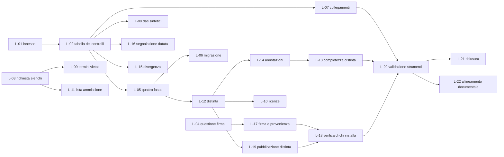

# Piano di traguardo - `T-03`, catena di costruzione minima bloccante, con distinta generata

> **Traguardo.** `T-03` · classe `A` · `[IMPEGNO]` · **26 settembre 2026**
> **Fonte dei criteri.** `docs/09_roadmap/02-traguardi.md`, `T-03`. I criteri sono **otto** e sono binari. Questo piano non li riformula, non li attenua e non ne aggiunge: li traduce in lavori.
> **Titolare.** Contributore unico.
> **Stato al 26 agosto 2026.** Un criterio su otto è dichiarato soddisfatto dalla roadmap (`docs/09_roadmap/00-indice.md` §8.4). Il §2 mostra che quel criterio è soddisfatto **solo in parte**, e lo dichiara come contraddizione senza correggerla.

---

## 0. Come si legge questo piano

**Gli identificativi `L-nn` sono locali a questo piano.** Non appartengono ad alcun registro del progetto - non sono requisiti, non sono decisioni, non sono questioni - e non vanno citati come se lo fossero. Servono a dare a ogni lavoro un nome stabile per le dipendenze e per il registro delle modifiche del §12.

**Nessun lavoro porta una stima in ore.** La roadmap dichiara al §0 di `02-traguardi.md` che mancano «la cronologia di consegna su cui calibrare e un'unità che attraversi lavori eterogenei»: inventare qui delle ore significherebbe produrre un numero che nessuno può verificare. Al loro posto c'è un **peso relativo** - `▪` piccolo, `▪▪` medio, `▪▪▪` grande - che serve a ordinare, non a prevedere. `[NV]` sull'unità di sforzo.

**Ogni criterio di fatto è binario.** Se un criterio di fatto di questo piano si può soddisfare «in parte», è scritto male e va riscritto: è la stessa regola che la roadmap applica a sé stessa.

**Un controllo che nessuno ha visto fallire non è un controllo.** Nessun lavoro che introduce un controllo è concluso finché la sua **prova negativa** non esiste e non è eseguita in integrazione continua. Il precedente è già nel repository: `scripts/prove/esegui-prove.sh`.

---

## 1. Perché questo traguardo viene prima di tutto ciò che segue

`V-182` vieta ogni riga di codice applicativo prima della chiusura di `T-03`. Ne discendono tre fatti che determinano l'intero piano.

1. **La finestra di `T-08` non comincia finché `T-03` non chiude.** Fra `T-03` (26 settembre) e `T-08` (14 novembre) la roadmap alloca quarantanove giorni per il traguardo software più pesante del calendario. Ogni giorno guadagnato qui è un giorno aggiunto **lì**, cioè alla finestra più scarsa del progetto.
2. **Uno slittamento di `T-03` si trasferisce integralmente in fondo alla catena.** `T-04`, `T-08`, `T-10` dipendono da esso in sequenza, e il diagramma del §7 di `02-traguardi.md` lo marca come critico.
3. **La classe `A` non ammette rinvio.** Ciò che questo traguardo produce - distinta dei materiali generata dalla prima pipeline, registro dei componenti costruito dalla distinta - è per `D45` retroattivamente irrecuperabile: censire a posteriori costa diverse volte tanto, e alcune proprietà non si ricostruiscono affatto.

### 1.1 Il cancello si può anticipare, e come

**L'innesco di `T-03` è già scattato.** La roadmap lo definisce come «chiusura dei criteri 3 e 4 di `T-01`», e `docs/09_roadmap/00-indice.md` §8.4 li dichiara entrambi **soddisfatti al 26 agosto 2026**: il registro `registro/identificativi-requisiti.tsv` esiste con 614 identificativi su otto famiglie, e il formato è dichiarato in `registro/README.md`.

Il diagramma di Gantt del §7 di `02-traguardi.md` colloca però `T-03` fra il 12 e il 26 settembre, cioè **dopo la chiusura dell'intero `T-01`**, non dopo i suoi criteri 3 e 4. Il testo del traguardo e il diagramma non dicono la stessa cosa. Fra i due prevale il testo, perché è quello che enuncia l'innesco: **`T-03` può cominciare il 27 agosto 2026**, e questo piano assume quella data di partenza.

> **Effetto sulla roadmap, da registrare quando il primo lavoro è chiuso.** La barra `t03` del diagramma va portata dal 2026-08-27, e la sovrapposizione con `T-01` va dichiarata: sotto `D54` un contributore unico non esegue due traguardi in parallelo, li alterna. La sovrapposizione non produce due lavori insieme; produce la **libertà di scegliere quale dei due avanzare** quando uno dei due è bloccato da un input altrui. È esattamente la forma di margine che questo piano può creare, e l'unica.

Le altre quattro leve di anticipazione, tutte applicate nel §5:

- **`L-02` per primo.** Un'unica tabella versionata di collocazione dei controlli soddisfa da sola il criterio 1, il criterio 4 e la parte configurabile del criterio 3. È il lavoro con il rapporto fra criteri chiusi e peso più alto dell'intero traguardo.
- **Le dipendenze altrui si pongono il giorno uno.** Due elenchi che `T-03` non produce - la lista di ammissione delle terminologie e la lista dei termini vietati - e una decisione che `T-03` non può prendere - la custodia del materiale di firma - sono sul percorso critico. Se si pongono il 27 agosto, il tempo di attesa scorre in parallelo al lavoro; se si pongono a metà settembre, lo slittamento è aritmetico. Sono `L-03` e `L-04`.
- **Il banco di prova esiste già.** `scripts/prove/esegui-prove.sh` è una funzione `esegui_caso` con un elenco di casi: il costo marginale di aggiungere la prova negativa di un controllo nuovo è qualche riga, non un banco nuovo. Nessun lavoro di questo piano costruisce una seconda infrastruttura di prova.
- **Controllo e prova negativa nello stesso commit.** Separarli produce sempre lo stesso esito: il controllo entra, la prova resta indietro, e il controllo diventa una dichiarazione. Il criterio di fatto di ogni lavoro del §5.3 lega i due in un solo atto.

---

## 2. Il divario, misurato criterio per criterio

### 2.0 Misura del 27 agosto 2026, sera - la tabella che segue è superata

La tabella del §2.1 è del 26 agosto e **non descrive più il repository**. Non viene riscritta: dice
come si è arrivati qui, e cancellarla toglierebbe il ragionamento. Questa sezione la corregge tutta
in una volta, con la misura eseguita sul disco e non letta in un piano.

| Criterio | Stato al 26 agosto | **Misurato il 27 agosto, sera** | Come è stato misurato |
|---|---|---|---|
| 1 - quattro fasce | Non soddisfatto | **Soddisfatto** | Cinque file di corsia in `.github/workflows/`; il criterio di collocazione è dichiarato in `pipeline/README.md` e presidiato da `scripts/verifica-collocazione-dei-controlli.sh` |
| 2 - otto controlli bloccanti, ciascuno provato a fallire | Due su otto | **Soddisfatto, e ampiamente** | **Ventinove** righe `bloccante` nella tabella di collocazione, ciascuna con il caso di banco che la fa fallire; il banco conta 278 casi |
| 3 - divergenza fra le lingue, versionata | Parziale | **Soddisfatto** | `pipeline/differenziazione-traduzioni.tsv` esiste ed è la configurazione versionata; il controllo la legge invece di cablarla |
| 4 - sola segnalazione, ciascuna con la data | Non soddisfatto | **Soddisfatto** | Quindici righe `segnalazione`, **nessuna priva di `bloccante_dal`**: è la regola 2 del `README` della tabella, e un controllo la fa valere |
| 5 - distinta a ogni costruzione | Parziale | **Soddisfatto sul solo artefatto esistente** | La generazione della distinta è nella fascia di rilascio e nella fascia completa. L'unico artefatto è oggi il sito; quando ne usciranno altri il criterio va rimisurato |
| 6 - registro dei componenti generato | Non soddisfatto | **Soddisfatto** | `scripts/genera-registro-componenti.py` produce il registro dalla distinta, `pipeline/annotazioni-componenti.tsv` lo arricchisce, `scripts/verifica-registro-componenti.sh` fa fallire la costruzione se un componente della distinta manca dalle annotazioni |
| 7 - firma e provenienza | Non soddisfatto | **Non soddisfatto** | **Zero esecuzioni riuscite della fascia di rilascio.** La prima esecuzione in assoluto è del 27 agosto 2026 ed è fallita in nove secondi |
| 8 - verifica a cura di chi installa | Non soddisfatto | **Non soddisfatto** | `VERIFICA-DELL-ARTEFATTO.md` esiste con i comandi; manca l'artefatto firmato su cui dimostrarla, quindi il criterio dipende interamente dal 7 |

**Sei su otto.** I due che restano sono **lo stesso lavoro visto due volte**: senza una esecuzione
riuscita della fascia di rilascio non esiste artefatto firmato, e senza artefatto firmato la
procedura di verifica resta un testo.

### La prima esecuzione della fascia di rilascio, e che cosa ha insegnato

Il 27 agosto 2026 la fascia di rilascio è stata eseguita **per la prima volta da quando esiste**, ed
è fallita dopo nove secondi:

```
Unable to resolve action `sigstore/cosign-installer@v4`, unable to find version `v4`
```

La corsia era scritta, dichiarata nella tabella di collocazione, coerente con le altre, e **nessuno
l'aveva mai fatta girare**. È la terza istanza nel repository della stessa forma di difetto - *una
regola scritta e non presidiata non è una regola*, *un cancello prescritto in un piano e non eseguito
da uno script non è un cancello* - e questa volta l'oggetto è una corsia: **una corsia mai eseguita
non è una corsia, è un file YAML**.

C'è un secondo difetto nella stessa esecuzione, e va registrato perché non è quello che ha fermato la
corsia e quindi si scoprirebbe solo dopo aver corretto il primo: il registro elenca i permessi
concessi al token - `Contents: read`, `Metadata: read` - e **`id-token: write` non compare**, benché
sia dichiarato in testa al file. La firma keyless non funziona senza.

---

### 2.1 Quadro sintetico

| Criterio | Oggetto | Stato oggi | Lavori |
|---|---|---|---|
| 1 | Quattro fasce, criterio di collocazione dichiarato | **Non soddisfatto** | `L-02`, `L-05`, `L-06` |
| 2 | Otto controlli bloccanti, ciascuno provato a fallire | **Due su otto** | `L-07`…`L-13` |
| 3 | Divergenza fra le lingue, differenziata e **versionata in configurazione** | **Parziale** - la roadmap lo dichiara soddisfatto, il repository dice altro | `L-15` |
| 4 | Controlli in sola segnalazione, ciascuno con la **data** di bloccanza | **Non soddisfatto** | `L-02`, `L-16` |
| 5 | Distinta generata a ogni costruzione, per **ogni** artefatto | **Parziale** | `L-12`, `L-19` |
| 6 | Registro dei componenti generato dalla distinta, con annotazioni versionate | **Non soddisfatto** | `L-14`, `L-13` |
| 7 | Artefatti firmati con materiale fuori dalla pipeline, con provenienza | **Non soddisfatto** | `L-04`, `L-17` |
| 8 | Procedura di verifica a cura di chi installa, eseguibile da chiunque | **Non soddisfatto** | `L-18` |

### 2.2 Criterio 1 - le quattro fasce

**Chiede.** Una pipeline con fascia rapida, completa, estesa e di rilascio, e il **criterio di collocazione di ciascun controllo dichiarato**.

**Esiste.** Due flussi di lavoro: `.github/workflows/verifiche.yml`, con sette lavori tutti innescati allo stesso modo (`push` su `main`, ogni `pull_request`, e a mano), e `.github/workflows/docs.yml`, che costruisce e pubblica il sito. Non esiste alcuna fascia: esiste un solo livello, eseguito integralmente ogni volta. Il criterio di collocazione **è dichiarato in prosa** in `docs/01_technical/09-integrazione-continua-e-rilascio.md` §2 - è il tempo, con l'eccezione dei controlli obbligatori che restano nella fascia completa a prescindere dal costo - ma non esiste in forma leggibile da macchina né applicata.

**Manca.** La separazione in quattro fasce e una **tabella versionata** che dica, per ciascun controllo, in quale fascia sta, con quale stato e per quale ragione. Senza la tabella, il criterio 4 non è verificabile da nessuno se non leggendo i file YAML uno per uno.

### 2.3 Criterio 2 - gli otto controlli che bloccano da subito

| # | Controllo del criterio 2 | `G` di `09` §3 | Esiste | Blocca | Prova negativa | Lavoro |
|---|---|:-:|:-:|:-:|:-:|---|
| a | Licenze dei componenti | `G2` | No | - | - | `L-10` |
| b | Terminologie a licenza vincolata, **con lista di ammissione versionata** | `G3` | Parziale | Sì | **No** | `L-11` |
| c | Completezza della distinta dei materiali | `G5` | No | - | - | `L-13` |
| d | Collegamenti interni | `G9` | No | - | - | `L-07` |
| e | Identificativi sintetici e assenza di dati reali | `G10` | No | - | - | `L-08` |
| f | Termini vietati, regola `R0` | `G11` | No | - | - | `L-09` |
| g | Identificativi di requisito (`T-01` criterio 5) | *nessuno* | **Sì** | **Sì** | **Sì**, 13 casi | - |
| h | Dichiarazione di non marcatura (`T-01` criterio 7) | *nessuno* | **Sì** | **Sì** | **Sì**, 7 casi | - |

**Due su otto.** Sono `g` e `h`, aggiunti il 26 agosto 2026 con `scripts/verifica-identificativi-requisiti.sh` e `scripts/verifica-dichiarazione-non-marcatura.sh`, entrambi in `verifiche.yml` **senza** `continue-on-error`, entrambi provati dal banco `scripts/prove/esegui-prove.sh`.

**Precisazione sul banco, perché è il modello di tutto il resto.** Il banco esegue **venti casi sempre**, più **due condizionati** all'esistenza di `website/build`: ventidue quando il sito è costruito, venti quando non lo è. Non è un dettaglio contabile - è la forma corretta di un caso che dipende da un artefatto che può non esserci: **saltato e dichiarato tale, mai silenziosamente verde**. Ogni lavoro del §5.3 riproduce questa forma.

**Precisazione sul controllo `b`.** `scripts/verifica-terminologie.sh` esiste, blocca ed è deliberatamente conservativo, ma il criterio 2 chiede quel controllo **con lista di ammissione versionata**: la lista non esiste come file, i tre criteri di ricerca sono cablati nello script, e non esiste alcun meccanismo per ammettere esplicitamente un identificatore di sistema o un codice nudo, che `09` §4 dichiara ammissibili. Il controllo inoltre non ha **nessun** caso nel banco: oggi nessuno ha mai visto fallire il controllo che presidia il rischio con l'impatto più alto della famiglia licenze (`R-09`, impatto `I5`, perché un contenuto pubblicato una volta non si ritira).

**Precisazione sui controlli `g` e `h`.** Non hanno un identificativo `G` nella tabella dei controlli obbligatori di `09` §3, che si ferma a `G13`. Il criterio 2 li elenca, la tabella tecnica no. È una lacuna documentale, non tecnica, e sta fra le contraddizioni del §10.

### 2.4 Criterio 3 - la divergenza fra le due lingue

**Chiede.** Un controllo con comportamento **differenziato e dichiarato**: **blocca** su avvertenze pubbliche, guida dei fondamenti, conformità e sicurezza; **segnala** sul resto, con un rapporto pubblicato a ogni costruzione. E: «La differenziazione è **versionata in un file di configurazione, non cablata**».

**Esiste.** `scripts/verifica-divergenza-traduzioni.sh`. Il comportamento differenziato c'è ed è corretto nella sostanza: `AREE_ESIGITE` distingue le aree prerequisito, l'assenza di traduzione su un'area esigita conta come mancanza bloccante, sulle altre si annota. Le avvertenze pubbliche sono verificate dentro i file bilingui, con la convenzione reale del repository.

**Manca, e sono tre cose distinte.**

1. **La differenziazione è cablata, non versionata.** `AREE_ESIGITE="10_fondamenti 06_security 08_compliance"` è una variabile nel corpo dello script. Il criterio chiede un file di configurazione. Non è pedanteria: una lista dentro uno script si modifica in una riga di una modifica che parla d'altro, mentre un file di configurazione dedicato ha una storia leggibile e può avere una regola di revisione propria.
2. **Il controllo non blocca, a livello di pipeline.** Il lavoro `divergenza-traduzioni` di `verifiche.yml` porta `continue-on-error: true`. Lo script esce con codice diverso da zero, ma il flusso di lavoro lo assorbe: **la costruzione non fallisce**. Il commento in `verifiche.yml` dichiara l'innesco della bloccanza - «nello stesso commit in cui l'ultima di quelle aree viene completata» - e `docs/09_roadmap/00-indice.md` §8.4 dichiara il criterio 1 di `T-06` soddisfatto, cioè quelle aree **complete**. Per la sua stessa regola, quel `continue-on-error` doveva cadere nel commit che ha completato l'ultima area, e non è caduto.
3. **Il rapporto non è pubblicato.** Il criterio chiede «un rapporto pubblicato a ogni costruzione». Oggi l'esito è testo sullo standard output del lavoro: leggibile da chi apre l'esecuzione, non pubblicato come artefatto.

**Conseguenza.** La roadmap dichiara il criterio 3 **soddisfatto**. Il repository dice che è soddisfatto per un terzo. La contraddizione è al §10; questo piano lavora sul repository.

### 2.5 Criterio 4 - i controlli in sola segnalazione, con la data

**Chiede.** Che i controlli non compresi nel criterio 2 **esistano** in sola segnalazione, ciascuno con la **data dichiarata** in cui diventa bloccante. «Un controllo senza quella data non è ammesso: è il modo in cui una riduzione temporanea diventa permanente.»

**Esiste.** Una sola data dichiarata in tutto il repository: `AVVERTENZE_BLOCCANTI_DAL="2026-09-12"` in `scripts/verifica-divergenza-traduzioni.sh`, e riguarda la sola verifica delle avvertenze pubbliche, non il controllo nel suo insieme. Il `continue-on-error` del lavoro `divergenza-traduzioni` è motivato da un **evento**, non da una data - e un innesco a evento è precisamente ciò che il criterio 4 non ammette, perché un evento che non arriva non scade mai.

**Manca.** I controlli restanti della tabella `G` - `G4` accessibilità, `G6` compatibilità di contratto, `G7` copertura, `G12` profilo di esercizio, `G13` regole di dipendenza - **non esistono in alcuna forma**, nemmeno in segnalazione. Tutti e cinque presuppongono codice applicativo, che `V-182` vieta: la forma in cui possono esistere oggi è quella già collaudata dal controllo sugli identificativi di requisito, cioè **corretti a insieme vuoto** - il lavoro esiste, gira, dichiara «nessun codice applicativo: nulla da verificare» e riporta la data in cui diventerà bloccante.

### 2.6 Criterio 5 - la distinta dei materiali

Trattato per esteso al §3, perché è il criterio con il maggior numero di scostamenti fra ciò che esiste e ciò che le regole del progetto chiedono.

### 2.7 Criterio 6 - il registro dei componenti di terze parti

**Chiede.** Registro **generato dalla distinta** e arricchito da un **file di annotazioni versionato**; un componente presente nella distinta e assente dalle annotazioni **fa fallire la costruzione**.

**Esiste.** Lo schema del registro, in dieci campi obbligatori, in `docs/01_technical/01-stack-e-motivazioni.md` §14.1. La regola di popolamento - «non a mano», generato dalla distinta e arricchito da annotazioni versionate - in §14.2. **Nessun file.** Non esiste il file di annotazioni, non esiste il registro generato, non esiste il controllo.

**Manca.** Tutti e tre. Con una circostanza che gioca a favore: sotto `V-182` i componenti da annotare sono quelli del sito, cioè le dipendenze di produzione dichiarate in `website/package.json` più la loro chiusura transitiva. È un insieme piccolo e chiuso, e annotarlo **adesso** costa una frazione di quanto costerà quando ci saranno anche le dipendenze del servizio e dell'interfaccia. È la ragione per cui `D45` colloca questa attività fra le irrecuperabili.

### 2.8 Criterio 7 - firma e provenienza

**Chiede.** Artefatti firmati con **materiale che non risiede nella pipeline**, con attestazione di provenienza.

**Esiste.** Nulla, sul piano degli artefatti. Sul piano dei commit esiste una firma crittografica adottata il 26 agosto 2026, documentata in `docs/08_compliance/10-controllo-dei-documenti.md` §8, con il passo residuo registrato come `Q-284`. **Non è la stessa cosa**: firmare un commit attesta chi ha scritto, firmare un artefatto attesta che cosa è uscito. Il secondo non discende dal primo, e questo piano non lo assume.

**Manca.** La decisione su dove risiede il materiale di firma - che questo piano non può prendere e che pone come `L-04` - e la sua attuazione. È il criterio con il rischio di slittamento più alto del traguardo, ed è al §9.

### 2.9 Criterio 8 - la verifica a cura di chi installa

**Chiede.** Una procedura documentata **con i comandi**, **eseguibile da chiunque**. Il criterio dichiara espressamente che l'esecuzione **da parte di chi non l'ha scritta** non è un criterio di questo traguardo, perché sotto `D54` non è producibile: è la lacuna `TG-20`.

**Esiste.** La regola in `09` §7.3 - «un artefatto firmato che nessuno verifica non aggiunge sicurezza: aggiunge una dichiarazione» - e la collocazione prevista nel manuale di installazione, che però è di `T-10`. Nessuna procedura.

**Manca.** Il documento, i comandi, e la prova che i comandi facciano fallire la verifica su un artefatto manomesso. Quest'ultima è la parte che rende la procedura una procedura e non un testo.

---

## 3. La distinta dei materiali: come è prodotta oggi, e che cosa serve

### 3.1 Come è prodotta oggi

Il lavoro `distinta-dei-materiali` di `.github/workflows/verifiche.yml` installa le dipendenze del sito con `npm ci` e genera la distinta con `npx --yes @cyclonedx/cyclonedx-npm@latest --output-file ../sbom-website.json --omit dev`, caricandola poi come artefatto del flusso di lavoro, con conservazione a novanta giorni.

La scelta di fondo è corretta e va conservata: il commento nel flusso lo dice bene - la distinta si genera dalla risoluzione effettiva delle dipendenze, mai a mano, perché «un inventario compilato a mano mente entro tre mesi». Il formato è quello standard leggibile da macchina richiesto da `09` §8.

### 3.2 I cinque scostamenti, in ordine di gravità

**1. Lo strumento non è fissato a una versione esatta.** `@latest` significa che due costruzioni della stessa revisione, a distanza di un mese, possono usare due generatori diversi e produrre due distinte diverse. Confligge con tre regole del progetto contemporaneamente: la fissazione delle versioni di `09` §6.2 («versioni esatte, mai intervalli»); il divieto di contenuto scaricato in costruzione non fissato per impronta, nella stessa sezione; e la forma della validazione degli strumenti di `docs/08_compliance/03-sistema-di-gestione-della-qualita.md` §3.2, che chiede di registrare l'esito «con la versione esatta dello strumento». **Non si può validare uno strumento la cui versione cambia da sola.** È il primo scostamento da chiudere, e ha peso `▪`.

**2. La distinta non è pubblicata insieme all'artefatto.** `09` §8 lo prescrive esplicitamente. Oggi la distinta nasce in `verifiche.yml` e l'artefatto pubblicato nasce in `docs.yml`: sono due flussi diversi, e chi riceve il sito pubblicato **non riceve la distinta**. Serve a chi installa per rispondere ai propri obblighi, fra cui la dichiarazione dei fornitori rilevanti prevista da `D40`. La distinta caricata come artefatto di un'esecuzione, con conservazione a novanta giorni, non è pubblicazione: è conservazione temporanea per chi ha accesso al flusso.

**3. `--omit dev` esclude la catena che costruisce l'artefatto.** L'esclusione è difendibile per una distinta di *esercizio*, e infatti per il servizio sarà la scelta corretta. Ma per il sito, che è oggi l'unico artefatto pubblicato, la catena di costruzione **è** ciò che produce l'artefatto, e `docs/08_compliance/03` §3.2 colloca la catena di costruzione fra gli strumenti che ricadono nella clausola di validazione. Serve una scelta dichiarata: una distinta sola comprensiva, oppure due distinte con perimetro dichiarato. Questo piano propone la seconda, perché tiene distinte due domande diverse - «che cosa contiene ciò che pubblico» e «che cosa ha prodotto ciò che pubblico» - e lascia leggibile quale delle due si sta guardando.

**4. Il contenuto minimo non è verificato.** `09` §8 fissa il contenuto minimo di ogni voce: identificativo, versione esatta, licenza, **impronta**, relazione di dipendenza. Nessun controllo verifica che le voci generate lo contengano. Una distinta in cui manca la licenza per metà delle voci soddisfa il formato e non soddisfa il criterio, e oggi nessuno se ne accorgerebbe.

**5. Un solo artefatto.** Il criterio 5 dice «per ogni artefatto, e non per il solo servizio principale». Sotto `V-182` gli artefatti sono il sito italiano e il sito inglese, che escono da una sola costruzione: la copertura è quindi **già integrale oggi**, ma per costruzione e non per progetto. Perché il criterio resti soddisfatto quando gli artefatti si moltiplicheranno, la generazione va scritta come **ciclo su un elenco di artefatti dichiarato**, non come un comando singolo. Il costo di farlo ora è nullo; il costo di rifarlo dopo è quello di ricensire.

### 3.3 Che cosa il criterio 5 richiede, in forma verificabile

Un lavoro della fascia di rilascio che, per ogni artefatto dell'elenco dichiarato, produca una distinta con generatore fissato a versione esatta, ne verifichi il contenuto minimo, la pubblichi accanto all'artefatto e ne registri l'impronta. E un caso di prova che, presentando una distinta priva di un campo obbligatorio, **faccia fallire**.

---

## 4. Il sottoinsieme bloccante, e la sua tabella

Il cuore organizzativo del traguardo è **un solo file versionato e leggibile da macchina**, che questo piano chiama tabella di collocazione dei controlli. Concentra i criteri 1, 4 e la parte configurabile del 3, e trasforma tre criteri verificabili solo leggendo file YAML in tre criteri verificabili leggendo una tabella.

**Collocazione proposta.** `pipeline/collocazione-dei-controlli.tsv`, con `pipeline/README.md` accanto, sul modello già collaudato di `registro/`: formato dichiarato in prosa, dati in TSV, righe di commento con `#`. L'alternativa `scripts/config/` è stata considerata e scartata perché quella cartella contiene eseguibili, e mescolare configurazione ed eseguibili rende meno leggibile la regola su chi può modificare che cosa.

**Colonne proposte.**

| Colonna | Contenuto |
|---|---|
| `controllo` | Identificativo del controllo - `G1`…`G13` dove esiste; per i due controlli di `T-01`, la designazione va aggiunta a `09` §3 dal lavoro `L-22`, non inventata qui |
| `nome` | Nome leggibile |
| `fascia` | `rapida` · `completa` · `estesa` · `rilascio` |
| `stato` | `bloccante` · `segnalazione` |
| `bloccante_dal` | Data ISO. **Obbligatoria quando `stato` è `segnalazione`.** Vuota quando è già bloccante |
| `criterio` | Il criterio di `T-03` (o di `T-01`) che il controllo attua |
| `eseguibile` | Percorso dello script o del passo che lo esegue |
| `prova_negativa` | Riferimento al caso del banco che dimostra che fallisce. **Mai vuota** |
| `motivo_collocazione` | Perché sta in quella fascia. È il «criterio di collocazione dichiarato» del criterio 1 |

**Il controllo che sorveglia la tabella.** La tabella stessa va verificata da un controllo: una riga con `stato = segnalazione` e `bloccante_dal` vuota **fa fallire la costruzione**; una riga con `prova_negativa` vuota **fa fallire la costruzione**; una riga la cui `prova_negativa` cita un caso **inesistente nel banco** fa fallire la costruzione. È il modo - l'unico - in cui il criterio 4 smette di essere una buona intenzione. Ed è, a sua volta, un controllo da provare a fallire.

**Criterio di collocazione, ripreso da `09` §2 e non reinventato.** La collocazione si decide sul tempo - la fascia rapida sta in pochi minuti, la completa entro il tempo di attenzione di chi ha proposto la modifica - **tranne** i controlli obbligatori, che restano nella fascia completa a prescindere dal costo, perché sono condizioni di ammissibilità e non verifiche di qualità.

---

## 5. La sequenza dei lavori

### 5.1 Come si legge la tabella dei lavori

Ogni lavoro ha: identificativo locale, che cosa fa, i file che tocca, le dipendenze, il peso relativo e un **criterio di fatto binario**. Il criterio di fatto è formulato in modo che un terzo possa accertarlo eseguendo un comando o aprendo un file, senza chiedere nulla a chi ha svolto il lavoro.

### 5.2 Fase 0 - apertura, tutta il primo giorno

| Id | Che cosa | File toccati | Dipende da | Peso | Criterio di fatto |
|---|---|---|---|:-:|---|
| `L-01` | Registrare che l'innesco di `T-03` è scattato: verifica che i criteri 3 e 4 di `T-01` siano chiusi e che il registro sia leggibile dal controllo esistente | questo piano, §12 | - | `▪` | Il §12 contiene una riga datata che cita l'evidenza (`registro/identificativi-requisiti.tsv`, `registro/README.md`) e dichiara l'effetto sulla roadmap: barra `t03` dal 2026-08-27 |
| `L-02` | Creare la tabella di collocazione dei controlli e il controllo che la sorveglia | `pipeline/collocazione-dei-controlli.tsv`, `pipeline/README.md`, `scripts/verifica-collocazione-dei-controlli.sh`, `scripts/prove/esegui-prove.sh`, `scripts/prove/tenute/collocazione/*` | - | `▪▪` | La tabella esiste con tutte le colonne del §4; il controllo gira in pipeline e non è `continue-on-error`; il banco contiene almeno quattro casi che devono fallire - riga in segnalazione senza data, riga senza prova negativa, prova negativa che cita un caso inesistente, fascia non ammessa - e falliscono |
| `L-03` | Porre formalmente la richiesta dei due elenchi che `T-03` non produce: lista di ammissione delle terminologie (dipendenza dichiarata dal traguardo stesso) e lista dei termini vietati della regola `R0` | `.telemedic/context/05_BACHECA_INTERAGENTI.md` | - | `▪` | Le due voci esistono in bacheca con destinatario e data, e sono citate per identificativo di bacheca nel §12 di questo piano |
| `L-04` | Porre la questione sulla custodia del materiale di firma degli artefatti e sulla forma dell'attestazione di provenienza | `.telemedic/context/02_QUESTIONI_APERTE.md`, `.telemedic/context/05_BACHECA_INTERAGENTI.md` | - | `▪` | La questione esiste con destinatario e data, e dichiara le due famiglie di soluzione del §5.6 senza sceglierne una |

> **Perché tre dei quattro lavori del primo giorno non producono codice né controlli.** Perché sono i soli il cui **tempo di attraversamento non dipende da noi**. Porli il primo giorno costa poco e rende disponibile l'esito quando servirà; porli a metà settembre significa attendere in fondo alla sequenza, dove non c'è margine. È la stessa logica per cui `T-14` sta davanti e non in fondo.

### 5.3 Fase 1 - la struttura e i controlli che non dipendono da nessuno

Tutti i lavori di questa fase sono **mutuamente indipendenti** e dipendono solo da `L-02`.

| Id | Che cosa | File toccati | Dipende da | Peso | Criterio di fatto |
|---|---|---|---|:-:|---|
| `L-05` | Separare la pipeline in quattro fasce, con inneschi distinti: rapida a ogni invio, completa a ogni proposta di modifica, estesa pianificata, di rilascio su procedura esplicita | `.github/workflows/fascia-rapida.yml`, `fascia-completa.yml`, `fascia-estesa.yml`, `fascia-di-rilascio.yml` | `L-02` | `▪▪` | I quattro file esistono; per ciascuna fascia l'innesco corrisponde a quello dichiarato in `09` §2; ogni lavoro di ciascuna fascia compare nella tabella di `L-02` con la stessa fascia |
| `L-06` | Migrare i sette lavori esistenti di `verifiche.yml` nelle fasce, **senza perdere bloccanza**, e ritirare `verifiche.yml` | `.github/workflows/verifiche.yml` (rimosso), i quattro file di fascia | `L-05` | `▪` | `verifiche.yml` non esiste più; i sette controlli girano ancora, e per ciascuno un'esecuzione registrata dimostra che fallisce ancora quando deve - il banco esistente basta per due di essi, per gli altri cinque vale la prova negativa introdotta dai lavori dedicati |
| `L-07` | Controllo sui collegamenti interni (`G9`): portare `onBrokenLinks` e `onBrokenMarkdownLinks` da `warn` a `throw`, e ricondurre alla stessa famiglia il controllo sui rinvii relativi che escono da `docs/`, oggi dentro `verifica-conformita-redazionale.sh` | `website/docusaurus.config.mjs`, `scripts/verifica-collegamenti.sh`, `scripts/prove/esegui-prove.sh`, `scripts/prove/tenute/collegamenti/*` | `L-02` | `▪▪▪` | La costruzione del sito fallisce su un collegamento rotto; il banco contiene un caso con un collegamento deliberatamente rotto che fa fallire; l'esecuzione su `main` passa |
| `L-08` | Controllo sui dati non sintetici (`G10`): forme riconoscibili di identificativo reale nei sorgenti, negli esempi e nelle tenute | `scripts/verifica-dati-sintetici.sh`, `scripts/prove/esegui-prove.sh`, `scripts/prove/tenute/dati/*` | `L-02` | `▪▪` | Il controllo blocca; il banco contiene almeno un caso per ciascuna forma coperta, con tenute **sintetiche e non valide per costruzione** - cifre di controllo deliberatamente errate - e ciascun caso fa fallire; un caso con dato palesemente sintetico passa |
| `L-16` | Portare in esistenza, **in sola segnalazione e corretti a insieme vuoto**, i cinque controlli che presuppongono codice applicativo: `G4`, `G6`, `G7`, `G12`, `G13` | `.github/workflows/fascia-completa.yml`, `pipeline/collocazione-dei-controlli.tsv` | `L-02`, `L-05` | `▪▪` | Ciascuno dei cinque gira, dichiara «nessun codice applicativo: nulla da verificare» e non fallisce; ciascuno ha una riga nella tabella con `stato = segnalazione` e `bloccante_dal` valorizzata; il controllo di `L-02` fallisce se una di quelle date viene svuotata |

> **Nota su `L-07`, che è il lavoro più rischioso della fase.** Rendere bloccante il controllo sui collegamenti espone immediatamente **tutti** i collegamenti rotti del corpus. Il criterio 2 di `T-02` - «zero collegamenti interni rotti» - è datato **10 ottobre**, cioè dopo `T-03`. Rendere il controllo bloccante il 26 settembre significa **anticipare di fatto quel criterio**, perché da quel momento `main` non accetta una costruzione con collegamenti rotti. Il lavoro va quindi spezzato in due atti nello stesso ordine, e non invertibili: prima la **misura** su `main` a controllo ancora indulgente, che dice quanto costa; poi la bonifica e il passaggio a bloccante. Se la misura rivelasse un volume che non sta nella finestra, la decisione da portare al committente **non** è rinviare il controllo - sarebbe una riduzione non registrata - ma dichiarare il costo e scegliere apertamente.

### 5.4 Fase 2 - i controlli che dipendono da un elenco altrui

| Id | Che cosa | File toccati | Dipende da | Peso | Criterio di fatto |
|---|---|---|---|:-:|---|
| `L-09` | Controllo sui termini vietati (`G11`), attuazione della regola `R0`, con la lista versionata e la sua procedura di aggiornamento | `pipeline/termini-vietati.txt`, `pipeline/README.md`, `scripts/verifica-termini-vietati.sh`, `scripts/prove/*` | `L-02`, `L-03` | `▪▪` | Il controllo blocca; il banco contiene un caso con un termine della lista in un commento e uno in un file di configurazione di esempio, entrambi devono far fallire; la procedura di aggiornamento della lista è scritta accanto alla lista |
| `L-11` | Portare `verifica-terminologie.sh` alla forma chiesta dal criterio 2: **lista di ammissione versionata**, con la regola per cui la sua modifica è materia di conformità (`V-191`), e primo banco di prova del controllo | `pipeline/terminologie-ammesse.tsv`, `scripts/verifica-terminologie.sh`, `scripts/prove/*` | `L-02`, `L-03` | `▪▪` | La lista esiste come file; il controllo la legge e ammette solo ciò che vi è dichiarato; il banco contiene almeno quattro casi che devono fallire - identificatore di sistema non ammesso, denominazione, insieme di valori espanso, dipendenza che scarica contenuto in costruzione - e uno che deve passare, con una voce ammessa; tutti si comportano come atteso |

> **Perché queste due sono le dipendenze più pericolose del traguardo.** Nessuna delle due liste ha un titolare datato. Il traguardo dichiara che la lista di ammissione «è prodotto delle aree di dominio e di conformità», senza data. La lista dei termini vietati è invece **criterio 6 di `T-02`**, datato **10 ottobre** - cioè **quattordici giorni dopo** la data in cui `T-03` esige che il controllo che la usa sia già bloccante. È una contraddizione fra due traguardi, ed è al §10. La contromisura sta in `L-03`: porre entrambe le richieste il primo giorno, e - se al 12 settembre non c'è risposta - produrre una **versione minima della lista dentro `T-03`**, dichiarandola tale, perché un controllo bloccante con una lista incompleta è comunque un controllo, mentre un controllo assente non lo è.

### 5.5 Fase 3 - la distinta, il registro dei componenti, le licenze

Sequenza obbligata: la distinta prima, perché tutto il resto la legge.

| Id | Che cosa | File toccati | Dipende da | Peso | Criterio di fatto |
|---|---|---|---|:-:|---|
| `L-12` | Portare la generazione della distinta alla forma del criterio 5: generatore a **versione esatta**, elenco degli artefatti dichiarato, perimetro di produzione e di costruzione distinti e dichiarati, verifica del contenuto minimo | `.github/workflows/fascia-di-rilascio.yml`, `pipeline/artefatti.tsv`, `scripts/verifica-distinta.sh`, `scripts/prove/*` | `L-02`, `L-05` | `▪▪▪` | Il generatore è invocato con una versione esatta e non con un'etichetta mobile; esiste una distinta per ogni riga di `pipeline/artefatti.tsv`; il controllo fallisce su una distinta di prova priva di un campo obbligatorio, e il banco lo dimostra |
| `L-14` | Creare il file di annotazioni versionato dei componenti di terze parti, con i dieci campi di `01-stack` §14.1, popolato sull'insieme attuale | `terze-parti/annotazioni.tsv`, `terze-parti/README.md` | `L-12` | `▪▪▪` | Ogni componente presente nella distinta di produzione del sito ha una riga; nessun campo obbligatorio è vuoto; per ogni componente il campo `licenza` riporta l'esito della verifica sul testo primario, oppure `[NV]` con la ragione |
| `L-13` | Controllo `G5`: un componente nella distinta e assente dalle annotazioni fa fallire la costruzione | `scripts/verifica-registro-terze-parti.sh`, `scripts/prove/*` | `L-12`, `L-14` | `▪▪` | Il controllo blocca; il banco contiene una tenuta con un componente nella distinta e assente dalle annotazioni, che deve far fallire, e una coerente, che deve passare |
| `L-10` | Controllo `G2` sulle licenze: blocca su licenza non compatibile o non determinabile, leggendo la distinta | `pipeline/licenze-ammesse.tsv`, `scripts/verifica-licenze.sh`, `scripts/prove/*` | `L-12` | `▪▪` | Il controllo blocca; il banco contiene tre casi che devono fallire - licenza non nell'elenco ammesso, licenza assente, licenza non determinabile - e uno che deve passare; l'elenco delle licenze ammesse è versionato e la sua modifica è dichiarata materia di conformità, non di configurazione |

> **Precisazione su `L-10`, che tocca un confine.** `09` §12 è netto: la pipeline «non decide sulle licenze». `G2` blocca **su un elenco**; la determinazione di compatibilità è una valutazione legale. Il lavoro produce quindi il meccanismo e l'elenco iniziale, **non** un giudizio di compatibilità: le voci dubbie entrano nell'elenco come non ammesse, e la loro promozione passa dalla revisione prevista per il materiale di conformità. `D34` vale integralmente: una dichiarazione permissiva apposta su un contenitore non dispone dei diritti di terzi sul contenuto ricompreso.

### 5.6 Fase 4 - firma, provenienza, verifica di chi installa

| Id | Che cosa | File toccati | Dipende da | Peso | Criterio di fatto |
|---|---|---|---|:-:|---|
| `L-17` | Attuare la decisione di `L-04`: firma degli artefatti con materiale che non risiede nella pipeline, e attestazione di provenienza con sorgente, revisione, definizione della pipeline, esecutore e ingressi | `.github/workflows/fascia-di-rilascio.yml`, `docs/adr/` (nuovo registro di decisione) | `L-04`, `L-12` | `▪▪▪` | Esiste un registro di decisione architetturale che dichiara il meccanismo scelto e le sue conseguenze; ogni artefatto dell'elenco porta una firma e un'attestazione; nessun segreto compare nei file della pipeline, che contengono soltanto segnaposto `${VARIABILE_AMBIENTE}` |
| `L-19` | Pubblicare la distinta **insieme** all'artefatto, non come artefatto separato di un'esecuzione | `.github/workflows/fascia-di-rilascio.yml`, `.github/workflows/docs.yml` | `L-12` | `▪` | Chi scarica l'artefatto pubblicato ottiene la sua distinta senza accedere al flusso di lavoro; il percorso è quello indicato dalla procedura di `L-18` |
| `L-18` | Scrivere la procedura di verifica a cura di chi installa, **con i comandi**, ed eseguirla su un artefatto manomesso | `VERIFICA-DELL-ARTEFATTO.md`, `scripts/prove/*` | `L-17`, `L-19` | `▪▪` | Un terzo che segua la procedura da un clone pulito verifica firma, provenienza e distinta dell'ultimo artefatto pubblicato; il banco contiene un caso su un artefatto deliberatamente alterato di un byte, che **deve** far fallire la verifica; l'esito dell'ultima esecuzione è registrato con la data |

**Le due famiglie di soluzione per `L-04`, senza sceglierne una.** La prima: materiale di firma custodito in un servizio dedicato fuori dalla pipeline, con l'operazione di firma tracciata - è la forma descritta da `09` §7.1. La seconda: firma con identità effimera derivata dall'identità del flusso di lavoro, senza materiale persistente da custodire. Entrambe soddisfano alla lettera «materiale che non risiede nella pipeline», con costi ricorrenti e conseguenze di verifica diversi. **La scelta è del committente**, va registrata come decisione architetturale, e questo piano non la anticipa. `[NV]` sul meccanismo finché la decisione non esiste. Va detto senza attenuanti che, sotto `D54`, la prima famiglia introduce un costo ricorrente di custodia che il progetto oggi non ha, e la seconda lega la verificabilità degli artefatti alla piattaforma che ospita la pipeline: nessuna delle due è gratuita.

### 5.7 Fase 5 - divergenza, validazione, chiusura

| Id | Che cosa | File toccati | Dipende da | Peso | Criterio di fatto |
|---|---|---|---|:-:|---|
| `L-15` | Portare il controllo di divergenza alla lettera del criterio 3: aree in file di configurazione versionato, bloccanza effettiva sulle aree prerequisito, rapporto pubblicato a ogni costruzione | `pipeline/aree-di-traduzione.tsv`, `scripts/verifica-divergenza-traduzioni.sh`, `.github/workflows/fascia-completa.yml`, `scripts/prove/*` | `L-02`, `L-05` | `▪▪` | `AREE_ESIGITE` non compare più nel corpo dello script; il lavoro non porta `continue-on-error`; una divergenza deliberata su un'area prerequisito fa fallire la costruzione e il banco lo dimostra; una divergenza su un'area a segnalazione **non** fa fallire e compare nel rapporto pubblicato |
| `L-20` | Produrre il registro di validazione per ciascuno strumento introdotto o modificato dal traguardo, nella forma di `03-sistema-di-gestione-della-qualita` §3.2 | `validazione-strumenti/*.md` | tutti i lavori che introducono un controllo | `▪▪` | Vedi §8.2 |
| `L-22` | Allineare la documentazione a ciò che esiste: la tabella dei controlli obbligatori di `09` §3 con i due controlli di `T-01` privi di designazione, lo stato di attuazione di `10-controllo-dei-documenti` §8, e le nuove cartelle | `docs/01_technical/09-*.md`, `docs/08_compliance/10-*.md`, `docs/09_roadmap/00-indice.md` | tutti | `▪▪` | Nessuna affermazione della documentazione sullo stato dei controlli è smentita dal repository; il controllo di divergenza non segnala regressioni sulle aree prerequisito toccate |
| `L-21` | Rapporto di chiusura del traguardo, criterio per criterio, in forma binaria | questo piano, §12.1 | tutti | `▪` | Per ciascuno degli otto criteri esiste una riga con `soddisfatto` o `non soddisfatto` e l'evidenza citata per percorso; nessuna riga contiene una percentuale o un avverbio |

### 5.8 Il grafo delle dipendenze, e che cosa è parallelizzabile



**Che cosa è parallelizzabile.** Non hanno alcun vincolo d'ordine fra loro, e possono essere svolti in qualunque sequenza: `L-03` e `L-04` (entrambi dal primo giorno, entrambi indipendenti da tutto); `L-07`, `L-08`, `L-15`, `L-16` una volta chiuso `L-02`; `L-09` e `L-11` una volta che gli elenchi arrivano; `L-10` e `L-13` una volta chiusi `L-12` e `L-14`.

**Che cosa non lo è, e non lo diventa.** `L-02` precede tutto ciò che deve comparire in tabella - cioè ogni controllo. `L-12` precede `L-14`, `L-13`, `L-10` e `L-19`, perché tutti leggono la distinta. `L-04` precede `L-17`, che precede `L-18`: è la catena più lunga del traguardo, e **non è comprimibile con più ore**, perché il suo primo anello è una decisione altrui. È la ragione per cui `L-04` è collocato il primo giorno.

**Che cosa la parallelizzabilità significa davvero sotto `D54`.** Con un contributore unico, due lavori paralleli non si eseguono insieme: **si alternano**. Il valore della parallelizzabilità qui non è la compressione del calendario - non ce n'è - ma la **libertà di riordino**: quando un lavoro si blocca su un input che non dipende da noi, ne esiste un altro pronto da avviare senza costo di riavvio. È la sola forma di margine che un piano senza margine può produrre, e va detta per quello che è.

---

## 6. Su che cosa si collauda la catena, senza codice applicativo

`V-182` resta in vigore fino alla chiusura di questo traguardo. La catena va quindi costruita e provata su artefatti che **non sono codice applicativo**. Il precedente è già nel repository: i due controlli del 26 agosto sono provati su tenute preparate apposta, e la loro correttezza a insieme vuoto è dichiarata nel codice del controllo, non assunta.

| Artefatto | Che cosa consente di provare |
|---|---|
| Il sito costruito, `website/build` e `website/build/en` | Fascia di rilascio completa: costruzione, distinta, firma, attestazione, pubblicazione, verifica a cura di chi installa. È un artefatto vero, pubblicato davvero, con dipendenze vere |
| La distinta del sito | Contenuto minimo, completezza rispetto alle annotazioni, licenze, pubblicazione accanto all'artefatto |
| Il corpus `docs/` | Collegamenti interni, termini vietati, dati non sintetici, divergenza fra le lingue, conformità redazionale |
| `registro/identificativi-requisiti.tsv` | Il controllo sugli identificativi, già in esercizio e già provato |
| I file della pipeline stessa | Il controllo di `L-02` sulla tabella di collocazione: una tabella malformata fa fallire la costruzione |

**Le tenute deliberatamente errate, sul modello di `scripts/prove/tenute/`.** Ogni controllo nuovo porta con sé la propria cartella di tenute, con un nome che dice che cosa prova. Tre regole, ricavate da ciò che il banco esistente già fa e che non vanno riscoperte:

1. **Nessuna tenuta contiene dati reali.** Gli identificativi di collaudo del registro stanno nell'intervallo 9000-9999, riservato per non collidere mai con il registro reale. Il controllo sui dati non sintetici richiede la stessa disciplina, più stringente: le forme di identificativo usate nelle tenute devono essere **non valide per costruzione** - cifra di controllo deliberatamente errata - così che nessuna di esse possa mai corrispondere a un identificativo reale esistente.
2. **Ogni caso «deve fallire» fa fallire la prova se il controllo passa.** È il punto dell'intero banco, non un dettaglio: `esegui_caso <descrizione> fallisce <comando>`.
3. **Un caso che non si può eseguire è saltato e dichiarato**, mai silenziosamente verde. Il banco già lo fa per i due casi che dipendono da `website/build`.

**Il collaudo del banco stesso.** Il banco esistente è stato sottoposto a prova di mutazione: rendendo un controllo deliberatamente sempre-verde, i casi conformi sono calati. Ogni volta che il banco cresce, la prova di mutazione va rifatta su almeno un controllo nuovo, e l'esito registrato. **Un banco che non si accorge di un controllo disattivato è teatro**, e questa è la sola verifica che lo dimostri.

**Che cosa non è collaudabile qui, e va detto.** I cinque controlli di `L-16` - accessibilità, compatibilità di contratto, copertura, profilo di esercizio, regole di dipendenza - **non sono collaudabili su un artefatto documentale**. La loro correttezza a insieme vuoto è provabile; il loro comportamento su un caso non conforme no, perché il caso non conforme richiede codice applicativo. Ciascuno di essi riceverà la propria prova negativa dentro `T-08`, e la data di bloccanza dichiarata in tabella è ciò che impedisce che quel debito diventi permanente.

---

## 7. Ogni controllo nuovo, e la prova che fallisce

| Controllo | Lavoro | Casi che devono far fallire | Caso che deve passare |
|---|---|---|---|
| Tabella di collocazione | `L-02` | Riga in `segnalazione` con `bloccante_dal` vuota; riga con `prova_negativa` vuota; `prova_negativa` che cita un caso inesistente; valore di `fascia` non ammesso; colonne mancanti | Tabella coerente |
| Collegamenti interni | `L-07` | Documento con collegamento interno inesistente; rinvio relativo che esce da `docs/` | Corpus senza collegamenti rotti |
| Dati non sintetici | `L-08` | Una tenuta per ciascuna forma coperta, tutte con cifra di controllo deliberatamente errata | Tenuta con dati palesemente sintetici |
| Termini vietati (`R0`) | `L-09` | Termine della lista in un commento; termine della lista in un file di configurazione di esempio | Testo che contiene una parola simile ma non in lista |
| Terminologie ammesse | `L-11` | Identificatore di sistema non ammesso; denominazione; insieme di valori espanso; dipendenza che scarica contenuto in costruzione | Voce esplicitamente ammessa in lista |
| Distinta, contenuto minimo | `L-12` | Distinta priva di `licenza`; distinta priva di `impronta`; distinta con versione espressa come intervallo | Distinta completa |
| Completezza distinta (`G5`) | `L-13` | Componente nella distinta e assente dalle annotazioni | Distinta e annotazioni coerenti |
| Licenze (`G2`) | `L-10` | Licenza non ammessa; licenza assente; licenza non determinabile | Licenza ammessa ed esplicita |
| Divergenza differenziata | `L-15` | Divergenza su area prerequisito; traduzione assente su area prerequisito; blocco inglese di un'avvertenza pubblica degradato | Divergenza su area a sola segnalazione, che **non** deve far fallire e deve comparire nel rapporto |
| Verifica di chi installa | `L-18` | Artefatto alterato di un byte; firma assente; distinta assente | Artefatto integro appena pubblicato |

**La riga più importante della tabella è l'ultima colonna della penultima riga.** Un controllo differenziato va provato **in entrambe le direzioni**: che blocchi dove deve bloccare, e che **non blocchi** dove non deve. Un controllo differenziato provato in una sola direzione è, di fatto, un controllo uniforme che qualcuno crede differenziato.

---

## 8. La validazione degli strumenti: `T-03` la comprende?

**La risposta breve: in parte, e le fonti non concordano.** Va detto così, senza smussare.

- **`T-01` la esclude esplicitamente**: «Non comprende la validazione formale degli strumenti del sistema di gestione della qualità».
- **`T-03` non la nomina**: non compare fra gli otto criteri di completamento, e non compare fra ciò che il traguardo dichiara di non comprendere. È un silenzio, non un'esclusione.
- **`docs/08_compliance/10-controllo-dei-documenti.md` §8 afferma il contrario del silenzio**: «I traguardi `T-01` criteri 5 e 7, e `T-03`, presuppongono la validazione formale di tutti gli strumenti. Finché questa validazione non esiste, i controlli sono asserzioni di funzionamento, non prove». E aggiunge che la validazione «è compresa nei traguardi del primo rilascio».

La contraddizione è registrata al §10 e non viene risolta da questo piano, che non ha l'autorità di modificare un criterio di completamento. Ciò che il piano fa è **eseguire la parte di validazione che `T-03` produce comunque**, perché il costo marginale è quasi nullo e il costo di ometterla è retroattivo.

### 8.1 Che cosa significa validare, in pratica

La forma è definita in `03-sistema-di-gestione-della-qualita` §3.2 e non va reinventata. Validare **non** è dimostrare che lo strumento è corretto, che è impossibile. È: dichiarare l'**uso previsto** dello strumento nel sistema; individuare **che cosa accadrebbe se sbagliasse**; definire ed **eseguire** prove che dimostrino che nell'uso previsto fa ciò che deve - per esempio che una modifica priva di tracciabilità **viene effettivamente rifiutata**, e non solo segnalata; **registrarne l'esito con la versione esatta dello strumento**. E, testualmente: «La prova negativa vale più di quella positiva: si valida un blocco dimostrando che blocca».

**Ne discende una conseguenza che riduce moltissimo il costo.** Il banco di prova negativa che ogni lavoro del §5 produce **è già il corpo della prova di validazione**. Ciò che manca è la cornice: uso previsto, guasto ipotizzato, versione esatta, data, esito. Sono cinque campi per controllo.

### 8.2 Il registro di validazione

Un file per strumento, in `validazione-strumenti/`, con: nome dello strumento; **versione esatta**; uso previsto nel sistema; che cosa accadrebbe se sbagliasse; prove eseguite, citate per caso del banco; esito; data; chi ha eseguito, con la lacuna di `Q-189` dichiarata - sotto `D54` chi esegue è chi ha scritto.

**Il perimetro che `T-03` può chiudere.** Gli strumenti che il traguardo introduce o modifica: il generatore della distinta, i controlli automatici di costruzione, il meccanismo di firma e attestazione, il generatore del sito nella parte che produce l'artefatto pubblicato.

**Il perimetro che `T-03` non chiude, e va dichiarato.** `git` e la piattaforma di ospitalità, che `10-controllo-dei-documenti` §8 elenca fra i quattro strumenti su cui poggia la registrazione di approvazione. La loro validazione non è un lavoro di pipeline e non ha titolare in questo traguardo.

**Il prerequisito che rende il resto possibile.** Nessuno strumento invocato con un'etichetta mobile è validabile, perché la versione registrata nel verbale non è quella che girerà domani. La fissazione della versione del generatore della distinta (`L-12`) **è condizione della validazione**, non un miglioramento a parte.

---

## 9. I rischi propri, e le contromisure

I rischi del registro di `05-rischi-e-dipendenze` che il traguardo cita - `R-08`, `R-12`, `R-27`, `R-28` - non si ripetono. Qui stanno i rischi **propri di questo piano**, cioè quelli che possono far slittare `T-03` e, con esso, tutto ciò che segue.

| # | Rischio | Perché è di questo piano | Contromisura | Indicatore anticipatore |
|---|---|---|---|---|
| 1 | **La decisione sulla custodia del materiale di firma non arriva.** Il criterio 7 diventa ineseguibile | È l'unico criterio che dipende da una decisione altrui, e la catena `L-04 → L-17 → L-18` è la più lunga del traguardo | `L-04` il primo giorno; se al **12 settembre** la decisione non c'è, si porta al committente il fatto che tre criteri su otto - 7, 8 e la parte di validazione - non sono chiudibili entro il 26 settembre, **prima** che la data sia mancata e non dopo | Nessuna risposta in bacheca entro dieci giorni dalla posizione della questione |
| 2 | **Le due liste - ammissione terminologica e termini vietati - non arrivano** | Sono prodotto di altre aree e una delle due è formalmente datata **dopo** `T-03` | `L-03` il primo giorno; ripiego dichiarato: versione minima prodotta dentro `T-03`, marcata come tale, con la voce aperta per il completamento. Un controllo bloccante su lista incompleta è comunque un controllo | Nessuna risposta entro il 5 settembre |
| 3 | **Il controllo sui collegamenti scopre un volume di rotture che non sta nella finestra** | Rendere `G9` bloccante anticipa di fatto il criterio 2 di `T-02`, datato 10 ottobre | Misura prima della bonifica, come prescrive `L-07`; se il volume eccede, la decisione è del committente e va **registrata**, non assorbita in silenzio: una riduzione non registrata è precisamente ciò che `D53` obbliga a evitare | La misura su `main` supera l'ordine di grandezza gestibile in una settimana di lavoro |
| 4 | **La sovrapposizione con `T-01` e `T-14` consuma la capacità** | Fra il 27 agosto e il 26 settembre insistono sulla stessa persona `T-01` (12 settembre), `T-14` (19 settembre) e `T-03` | I lavori di `T-14` sono di classe `B`, poche ore e molti mesi: si eseguono per primi e liberano il calendario. `T-01` ha sei criteri su otto già chiusi | Al 12 settembre, `T-01` non chiuso |
| 5 | **La fissazione della versione del generatore della distinta rompe la generazione** | Passare da un'etichetta mobile a una versione esatta può esporre un'incompatibilità oggi mascherata | Fissare presto, non tardi: `L-12` è nella fase 3 e non nella coda. Il costo di scoprirlo il 24 settembre non è recuperabile | La prima esecuzione con versione fissata produce una distinta diversa da quella con etichetta mobile, per struttura e non per contenuto |
| 6 | **Il traguardo chiude «quasi»** | Otto criteri binari; sette soddisfatti su otto è un traguardo **non raggiunto**, e la roadmap lo dice esplicitamente | `L-21` produce il rapporto in forma binaria, criterio per criterio, e **nessuna riga contiene una percentuale**. Se un criterio non è chiuso, il traguardo è dichiarato non raggiunto con la causa scritta | Compare in un rapporto la parola «sostanzialmente» |
| 7 | **Un controllo entra senza la sua prova negativa** | È il modo più naturale per guadagnare tempo apparente, e produce un controllo che nessuno ha visto fallire | Il controllo di `L-02` fa fallire la costruzione se la colonna `prova_negativa` è vuota **o cita un caso che nel banco non esiste**: il divieto è meccanico, non disciplinare | Una riga nuova in tabella con `prova_negativa` valorizzata a un caso non presente in `esegui-prove.sh` |
| 8 | **La documentazione resta indietro rispetto al repository** | È già successo: la roadmap dichiara soddisfatto il criterio 3, il repository dice il contrario | `L-22` è un lavoro con criterio di fatto proprio, non una rifinitura di coda; e le correzioni si chiudono **su entrambe le lingue** dove l'area è prerequisito | Una riga di stato in `docs/` che nessuna esecuzione di pipeline può smentire |

---

## 10. Le contraddizioni trovate, dichiarate e non corrette

Questo piano non modifica `docs/`, `scripts/` né `.github/`. Le contraddizioni che seguono sono **riportate perché siano decise**, non risolte d'ufficio.

1. **Il criterio 3 di `T-03` è dichiarato soddisfatto e non lo è.** `docs/09_roadmap/00-indice.md` §8.4 lo elenca fra i criteri soddisfatti. Il repository mostra tre scostamenti: la differenziazione è cablata nello script e non versionata in un file di configurazione, come il criterio richiede testualmente; il lavoro porta `continue-on-error: true` e quindi **non blocca**; il rapporto non è pubblicato. Vedi §2.4.
2. **Il `continue-on-error` del controllo di divergenza doveva già essere caduto.** Il commento in `.github/workflows/verifiche.yml` dichiara che la bloccanza scatta «nello stesso commit in cui l'ultima di quelle aree viene completata». `docs/09_roadmap/00-indice.md` §8.4 dichiara il criterio 1 di `T-06` soddisfatto, cioè quelle aree complete. Le due affermazioni non possono essere entrambe vere nello stato attuale del repository.
3. **Un innesco a evento dove il criterio 4 esige una data.** Il criterio 4 di `T-03` è esplicito: «Un controllo senza quella data non è ammesso». Il `continue-on-error` del controllo di divergenza è motivato da un evento, non da una data. È precisamente la forma che il criterio vieta, ed è nel repository oggi.
4. **`docs/08_compliance/10` §8 dichiara bloccante un controllo che non blocca.** Il testo elenca «divergenza fra lingue» fra i controlli «attivi e bloccanti in pipeline». Con `continue-on-error: true` il controllo è attivo e **non** bloccante.
5. **La lista dei termini vietati è datata dopo il traguardo che la usa.** `T-03` criterio 2 esige il controllo `R0` bloccante entro il **26 settembre**; `T-02` criterio 6 colloca la definizione e la versionatura della lista entro il **10 ottobre**. Un controllo non può bloccare su una lista che non esiste ancora.
6. **La lista di ammissione delle terminologie non ha titolare datato.** Le dipendenze di `T-03` la attribuiscono alle «aree di dominio e di conformità» senza data. È l'unica dipendenza esterna di un traguardo di classe `A` priva di scadenza.
7. **I due controlli di `T-01` non hanno designazione nella tabella dei controlli obbligatori.** `docs/01_technical/09` §3 si ferma a `G13`; il criterio 2 di `T-03` elenca otto controlli, di cui due - identificativi di requisito e dichiarazione di non marcatura - non compaiono in quella tabella.
8. **Il diagramma di Gantt colloca `T-03` dopo l'intero `T-01`, il testo dopo i suoi criteri 3 e 4.** `docs/09_roadmap/02-traguardi.md` §7, barra `t03`, parte dal 2026-09-12. L'innesco enunciato nel testo del traguardo è già scattato il 26 agosto. Sono fino a diciassette giorni di calendario, sul traguardo che apre la finestra più scarsa del progetto.
9. **La validazione degli strumenti: `T-03` tace, l'area di conformità afferma.** Vedi §8. `T-01` la esclude espressamente, `T-03` non la nomina né fra i criteri né fra le esclusioni, `docs/08_compliance/10` §8 afferma che `T-03` la presuppone.
10. **Il conteggio dei casi del banco è riportato in due forme diverse.** `docs/09_roadmap/00-indice.md` §8.4 dichiara «22 casi» e poco sotto descrive la prova di mutazione come «da 17 casi conformi su 17 a 11 su 17». Il banco eseguito oggi produce venti casi sempre e ventidue quando `website/build` esiste. È una discordanza minore e storica - la prova di mutazione precede l'aggiunta di casi - ma è del tipo che, non annotato, viene letto come errore di uno dei due numeri.

---

## 11. Che cosa il traguardo non comprende, e dove è coperto

| Non comprende | Dove è coperto |
|---|---|
| **Il codice applicativo.** Nessuna riga lo precede (`V-182`), con la sola eccezione del codice usa-e-getta delle verifiche di `T-04`, dichiarato tale, in area separata e non incluso in alcun artefatto distribuito | `T-08`, per la struttura e il percorso verticale; `T-04` per le verifiche usa-e-getta |
| **La verifica di riproducibilità della costruzione.** Spostata con perimetro ridotto e dichiarato | `T-10`, taglio `TG-14`, riproducibilità del solo artefatto principale del servizio |
| **L'esecuzione della verifica da parte di un secondo soggetto.** Non producibile sotto `D54` | Lacuna dichiarata `TG-20`, prima voce di `Q-189` |
| **La bloccanza dei controlli che presuppongono codice** - accessibilità, contratto, copertura, profilo di esercizio, regole di dipendenza | Esistono qui in sola segnalazione con la data dichiarata (`L-16`); diventano bloccanti secondo quella data, dentro `T-08` e oltre |
| **La verifica che il sito funzioni** - navigazione, ricerca, cambio di lingua | `T-07`, che dipende da qui per la bloccanza del controllo sui collegamenti |
| **La completezza della versione inglese** | `T-06` per le aree prerequisito; `T-09` per il resto |
| **Il manuale di installazione ed esercizio** | `T-10`. Qui esiste la sola procedura di verifica dell'artefatto (`L-18`), che il manuale poi incorpora |
| **La validazione di `git` e della piattaforma di ospitalità** | `docs/08_compliance/10` §8, senza titolare datato: vedi §8 e la contraddizione 9 |
| **Il giudizio di compatibilità delle licenze.** La pipeline blocca su un elenco; la determinazione è valutazione legale (`D34`) | Materiale di conformità, con la revisione prevista per esso |

---

## 12. Registro delle modifiche del piano

Il committente ha stabilito che, man mano che si implementa, **si aggiornano sia i piani sia la roadmap**. Questa tabella è la registrazione di quell'aggiornamento: nasce vuota e si riempie a lavoro eseguito, non a lavoro previsto.

**Regole di compilazione.** Una riga per modifica sostanziale, non per revisione redazionale. La colonna «effetto sulla roadmap» non ammette «nessuno» senza motivazione: se un lavoro cambia e la roadmap non cambia, la ragione va scritta. Una data mancata **non si riscrive**: resta in tabella con la sua causa, perché è l'unica base su cui la stima successiva può essere migliore della precedente.

| Data | Lavoro o criterio toccato | Che cosa è cambiato | Perché | Effetto sulla roadmap (traguardo, criterio, data) | Registrato in |
|---|---|---|---|---|---|
| | | | | | |

### 12.1 Rapporto di chiusura, da compilare con `L-21`

| Criterio di `T-03` | Esito | Evidenza (percorso nel repository) | Data |
|---|:-:|---|---|
| 1 - quattro fasce e criterio di collocazione | | | |
| 2 - otto controlli bloccanti, ciascuno provato a fallire | | | |
| 3 - divergenza differenziata e versionata | | | |
| 4 - controlli in segnalazione, ciascuno con la data | | | |
| 5 - distinta a ogni costruzione, per ogni artefatto | | | |
| 6 - registro dei componenti generato, con annotazioni | | | |
| 7 - artefatti firmati, con provenienza | | | |
| 8 - procedura di verifica a cura di chi installa | | | |

**Nessuna cella di questa tabella ammette una percentuale, un avverbio o la parola «sostanzialmente».** Sette criteri su otto è un traguardo non raggiunto, e il rapporto dice quale criterio manca.

### 12.1 26 agosto 2026 - apertura del traguardo, fase 0 chiusa

**`L-01` - l'innesco è scattato, verificato sull'evidenza.** La roadmap definisce l'innesco di
`T-03` come chiusura dei criteri 3 e 4 di `T-01`. Entrambi sono soddisfatti:
`registro/identificativi-requisiti.tsv` esiste ed è leggibile dal controllo
`scripts/verifica-identificativi-requisiti.sh`, che gira in pipeline **senza** `continue-on-error`;
`registro/README.md` dichiara il formato. Il banco `scripts/prove/esegui-prove.sh` copre quel
controllo con dodici casi che devono fallire, e fallisce.

**Effetto sulla roadmap, da registrare.** La barra `t03` del diagramma di Gantt del §7 di
`02-traguardi.md` va portata dal **2026-08-27**, e la sovrapposizione con `T-01` va dichiarata come
tale: sotto `D54` un contributore unico non esegue due traguardi in parallelo, li **alterna**. La
sovrapposizione non produce due lavori insieme; produce la libertà di scegliere quale avanzare
quando l'altro è fermo in attesa di un input altrui.

**`L-02` - la tabella di collocazione esiste, e ha già fatto il suo lavoro.** Creati
`pipeline/collocazione-dei-controlli.tsv` con le nove colonne del §4,
`pipeline/README.md` con il formato e le quattro regole in prosa, e
`scripts/verifica-collocazione-dei-controlli.sh` che le fa rispettare.

Alla prima esecuzione il controllo ha fallito su **quattro righe su sette**:

```
✗ G1  (Ricerca di segreti)                 senza prova negativa
✗ G3  (Terminologie sotto licenza)         senza prova negativa
✗ G5  (Distinta dei materiali del sito)    senza prova negativa
✗ T01-C8 (Conformità redazionale)          senza prova negativa
Righe verificate: 7 · Errori: 4
```

**Non è un difetto della tabella: è il suo primo esito utile.** Quattro dei sette controlli che
girano oggi in pipeline non hanno mai un caso che ne dimostri il fallimento, e finché non l'hanno
sono dichiarazioni di intenti che girano in pipeline. Il debito era invisibile perché nessuno lo
contava; ora fa fallire la costruzione. Il lavoro di estinzione è affidato a chi possiede il banco.

**Un difetto nel controllo nuovo, trovato scrivendolo.** La prima stesura leggeva i campi con
`IFS=$'\t' read -r a b c …`. Per bash la tabulazione è un carattere di IFS **bianco**: due
tabulazioni consecutive vengono fuse, e ogni campo vuoto fa scalare di uno tutti quelli che seguono.
Il controllo leggeva il campo sbagliato e dichiarava il falso con sicurezza - cioè esattamente il
difetto che esiste per impedire altrove. I campi si estraggono ora per posizione con `cut`, che i
campi vuoti li conta, e il caso di regressione è fra quelli richiesti al banco.

**`L-03` e `L-04` - le tre dipendenze che il traguardo non produce, poste il primo giorno.**
In `.telemedic/context/05_BACHECA_INTERAGENTI.md`:

| Voce | Oggetto | Perché il primo giorno |
|---|---|---|
| `Q-285` | Lista di ammissione delle terminologie, presupposta da `G3` | Classe `C`: sul percorso critico, tempo di attraversamento non nostro |
| `Q-286` | Lista dei termini vietati della regola `R0`, presupposta da `G11` | Senza di essa `G11` non è implementabile |
| `Q-287` | Custodia del materiale di firma e forma dell'attestazione di provenienza | Determina i lavori della fase 4, non la loro configurazione: va decisa **prima** |

Porle oggi costa poco e fa scorrere l'attesa in parallelo al lavoro; porle a metà settembre
significa attendere in fondo alla sequenza, dove non c'è margine.

**Stato della fase 0: chiusa.** Fase 1 avviata in parallelo su `L-05`, `L-06`, `L-07`, `L-08` e
sull'estinzione del debito di prova, partizionata per file.

### 12.2 26 agosto 2026 - fase 1, esito parziale

**`L-05` e `L-06` - chiusi.** Le quattro fasce esistono in `.github/workflows/`: `fascia-rapida.yml`
(ogni invio, il solo lavoro `segreti`), `fascia-completa.yml` (proposte di modifica **e** invii su
`main`, sette lavori), `fascia-estesa.yml` (cadenza settimanale) e `fascia-di-rilascio.yml` (solo
su procedura esplicita). `verifiche.yml` è rimosso. Le due fasce lente dichiarano esplicitamente
«nessun codice applicativo: nulla da verificare», che è la forma corretta di aderire a `V-182`
senza fingere di verificare.

**Uno scostamento dal piano, motivato.** Il piano prescriveva `pull_request` come unico innesco
della fascia completa. È stato aggiunto `push` sul solo `main`: una proposta di modifica si verifica
sull'esito **previsto** dell'unione, e un controllo obbligatorio che non ha mai visto lo stato reale
del ramo principale presidia un'ipotesi. Il presupposto - che le proposte di modifica esistano - è
diventato vero oggi con la protezione del ramo (`Q-283`).

**Il `continue-on-error` di `divergenza-traduzioni` è caduto.** Chiuse le due divergenze redazionali
residue, la tolleranza non aveva più oggetto. `G8` è passato da `segnalazione` a `bloccante` nella
tabella di collocazione, senza data differita. È la seconda delle due rettifiche del registro delle
revisioni: il criterio 3 del traguardo è ora soddisfatto per davvero.

**`L-07` - primo atto chiuso, secondo atto bloccato e dichiarato tale.** I tre collegamenti rotti in
italiano sono bonificati e la costruzione italiana è pulita: **zero** pagine rotte. Gli stessi tre
difetti erano presenti in inglese e vi erano stati lasciati: chiusi anche lì, perché un difetto
chiuso in una lingua sola è una divergenza, non una correzione.

La misura inglese riferita in prima battuta - ventuno pagine - **era presa su un elenco troncato**.
Sul registro intero l'inglese ha **ventitré pagine e ottantotto collegamenti rotti**, e una classe
ulteriore mai contata: **quarantadue rinvii con àncora in forma italiana**, che producono circa
trenta pagine con àncore rotte, quasi tutte ADR verso `02_architecture`.

**La causa dei collegamenti inglesi resta `[NV]`.** I fatti misurati: nessun rinvio `./` si rompe,
tutti gli ottantotto sono `../`; le pagine di partenza stanno nelle quattro aree dell'ultima
tornata di traduzione (`b3498b7`); i bersagli esistono tutti; gli insiemi di file sono identici
nelle due lingue; frontmatter omogeneo, nessun BOM, nessun CRLF; e la **stessa identica riga** si
rompe in un file e risolve in quello accanto. L'URL dichiarato «resolved as» conserva il suffisso
`.md`: la risoluzione da markdown a rotta non avviene, e il rinvio ricade sulla risoluzione per URL.
La spiegazione riferita per prima - rimozione dei prefissi numerici applicata alle sole traduzioni -
è stata verificata e **cade**: in italiano gli stessi rinvii risolvono e le pagine costruite portano
gli stessi nomi nelle due lingue.

Conseguenza operativa: portare i tre criteri `onBroken*` a `throw` oggi **fermerebbe la costruzione
del sito**. Il secondo atto resta aperto, e il criterio 1 di `T-07` è misurato ma non chiuso.

**Un vuoto di sorveglianza, dichiarato.** Il controllo di divergenza confronta struttura, date e
pagine orfane: non guarda la **forma dei rinvii**, quindi non poteva vedere che una correzione era
stata chiusa in una lingua sola. E il runbook di traduzione **non prescrive nulla sulle àncore**: è
la lacuna che ha prodotto la classe, e va colmata prima di bonificarla, altrimenti la prossima
tornata la ricrea identica.

**Debito di prova negativa: da otto errori a quattro.** I quattro casi del sorvegliante esistono nel
banco; restano da scrivere le prove negative di `G1`, `G3`, `G5` e del redazionale.

**Stato della fase 1: in corso.** Chiusi `L-05`, `L-06` e il primo atto di `L-07`. Aperti: il
secondo atto di `L-07` (bloccato sulla diagnosi), `L-08`, l'estinzione del debito di prova, e
`L-16`. La fase 2 resta bloccata su `Q-285` e `Q-286`, la fase 4 su `Q-287`.

### 12.3 26 agosto 2026 - `L-08`, e un rilievo che tocca la regola non negoziabile

**Il controllo esiste**: `scripts/verifica-dati-sintetici.sh`, 429 righe, 0,6 secondi sull'intero
repository. Copre sei forme che hanno una discriminante **verificabile** - codice fiscale a sedici
caratteri, numero della tessera sanitaria, partita IVA, IBAN, numero mobile, posta elettronica - e
ne esclude altre dichiarando il motivo: codici ministeriali di struttura, tessera STP/ENI e rete
fissa non hanno né cifra di controllo né lunghezza fissa, e segnalarli significherebbe segnalare
ogni numero di sei cifre del corpus.

Tre scelte di merito meritano di restare scritte. Il controllo **non ristampa mai il valore
trovato**, lo maschera: un controllo contro i dati reali che riversa il dato nel registro della
costruzione lo pubblica una seconda volta, in un archivio che sopravvive alla correzione del file.
L'ammissione esplicita `dato-reale-consentito: <motivo>` vale **solo** per posta e telefono - i
recapiti che un progetto pubblica per obbligo - e **mai** per codice fiscale, tessera, partita IVA
e IBAN. E ogni forma è preceduta da un filtro grossolano che è sempre una condizione *necessaria*
della forma e mai un'euristica: è ciò che porta il tempo da diciannove secondi a sei decimi.

**Il rilievo: trentasette codici fiscali con carattere di controllo valido, sul ramo principale.**
Il §6.1 di questo piano stabilisce che le forme sintetiche siano «non valide per costruzione».
`RSSMRA80A01H501·` (sedicesimo carattere mascherato) compare trentasei volte e `TSTPSN80A01D612·` una: **entrambi superano la verifica
del carattere di controllo**, calcolata di persona sulle tabelle pari e dispari del DM 23 dicembre
1976. Sono quindi codici sintatticamente attribuibili a una persona reale, non forme riconoscibili
come finte. Stanno in `10_fondamenti/06`, `10_fondamenti/04`, `10_fondamenti/05`, `10_fondamenti/13`,
`07_integration/07`, nei rispettivi gemelli inglesi e in cinque file di `.telemedic/research/`.

**La convenzione giusta esiste già nel corpus e non è stata applicata dappertutto**:
`VRDLGU75E41D612B` e `AAABBB00A00A000A` hanno il carattere di controllo deliberatamente errato e
passano. La correzione è di un carattere per occorrenza, e va fatta **su entrambe le lingue nello
stesso atto**, che è la regola già codificata dopo `7750d38`.

Restano inoltre cinque occorrenze di una casella su dominio di posta al consumo - è l'intestazione
della chiave di firma, cioè la tracciabilità nominativa che ISO 13485 §7.5.8 richiede, e il
marcatore di ammissione esiste apposta - e due indirizzi su `esempio.it`, che è un dominio
registrabile e raggiungibile, dove la forma corretta `esempio.invalid` è già usata altrove.

**Il controllo è rosso oggi, ed è corretto che lo sia.** Non è ancora in tabella né in pipeline: la
riga `G10` e i nove casi di prova sono lavoro del proprietario della tabella e del banco.

**Una lacuna a monte, che il controllo rende visibile**: la regola 1 di `CONTRIBUTING.md` dice «usa
i generatori di dati sintetici del progetto», che **non esistono**, e non dice la cosa che conta -
cifra di controllo deliberatamente errata, dominio riservato, cifre ripetute. Finché la convenzione
non è scritta dove i contributori la leggono, il controllo la insegna soltanto a chi la viola.

**Chiusura del rilievo, 26 agosto 2026.** I trentasette codici fiscali sono corretti: il sedicesimo
carattere è ora deliberatamente errato - `RSSMRA80A01H501Z` e `TSTPSN80A01D612Z` - e il calcolo
sulle tabelle del DM 23 dicembre 1976 li scarta, verificato prima e dopo. La correzione è stata
applicata **su entrambe le lingue nello stesso atto**, in quindici file fra `docs/`, i gemelli
inglesi e `.telemedic/research/`.

**Le quattro occorrenze scritte oggi in questo piano e nel registro delle revisioni non sono state
corrette allo stesso modo, ed è deliberato.** Citavano il valore difettoso per verbalizzarlo:
sostituirlo con quello corretto avrebbe reso falsa la cronaca, lasciarlo avrebbe portato
l'identificativo valido in un documento pubblicato. Il sedicesimo carattere è **mascherato** -
`RSSMRA80A01H501·` - che conserva il fatto e non conserva il dato.

I due indirizzi su `esempio.it` - dominio registrabile e raggiungibile - sono passati a
`esempio.invalid`. I cinque recapiti sulla casella di posta al consumo sono l'intestazione della
chiave di firma, e sono stati **dichiarati** con il marcatore
`dato-reale-consentito: intestazione della chiave di firma, tracciabilità nominativa richiesta
dalla clausola 7.5.8 di ISO 13485` invece che rimossi: sono la tracciabilità nominativa che la
norma esige, ed è il caso per cui il marcatore esiste.

**La lacuna a monte è colmata.** La regola 1 di `CONTRIBUTING.md` rimandava a «generatori di dati
sintetici del progetto» che non esistono. Ora dice la cosa che conta, in entrambe le lingue: un
dato sintetico dev'essere **non valido per costruzione**, cioè riconoscibile come finto da una
verifica e non dall'occhio di chi legge - cifra di controllo deliberatamente errata, dominio
riservato, cifre in progressione - e dichiara che i generatori automatici non esistono ancora,
invece di rimandare a strumenti immaginari.

**Esito**: `bash scripts/verifica-dati-sintetici.sh` → *407 file esaminati, nessuna forma di
identificativo reale; 5 recapiti ammessi esplicitamente*. Data: 26 agosto 2026.

### 12.4 26 agosto 2026 - la classe delle àncore, e un difetto nato dalla sua correzione

**Quarantaquattro rinvii con àncora, quaranta corretti, quattro già giusti.** Le àncore inglesi
erano in forma italiana perché un'àncora si ricava dal titolo di sezione: tradotto il titolo,
l'àncora cambia. Quattro erano già corrette perché il titolo è identico nelle due lingue -
`#9-multi-tenancy`, `#7-domain-driven-design`, `#5-hash-functions`,
`#5-dual-write-and-the-transactional-outbox`. Trentaquattro file toccati, trenta dei quali ADR.

**La correzione ne ha rotte undici in un modo nuovo, e nessuno se ne sarebbe accorto.** Un titolo
come `### CTX-01 - Identity and access` separa il codice dal testo con un **carattere isolato fra
due spazi**. L'algoritmo di `github-slugger`, che Docusaurus usa, converte ogni spazio in un
trattino: l'àncora porta quindi **più trattini consecutivi**, non uno. All'epoca del difetto il
separatore era un trattino lungo, che l'algoritmo rimuove lasciando i due trattini degli spazi:
`ctx-01--identity`. Dopo la conversione al trattino corto, più tardi nella stessa giornata, i
trattini sono diventati **tre**, perché il separatore non viene più rimosso: `ctx-01---identity`.
Chi la scrive a mano ne mette uno solo, in entrambi i casi.
normalizzate a trattino singolo, e la costruzione le avrebbe segnalate **uscendo con successo lo
stesso**, perché `onBrokenAnchors` è a `warn`.

**Da qui il controllo nuovo**: `scripts/verifica-ancore.sh` riproduce l'algoritmo e verifica che
ogni rinvio con àncora trovi, nel documento bersaglio e nella lingua di quel documento, un titolo
che genera quell'àncora. Esito oggi: `Rinvii con ancora esaminati: 84 · Rotti: 0`. Prima della
correzione dava 11 rotti in inglese e 0 in italiano - ed è la circostanza che ha convalidato
l'algoritmo, perché un calcolo sbagliato avrebbe prodotto falsi rilievi anche in italiano.

**Perché è un controllo e non un compito della costruzione del sito.** La costruzione le àncore
rotte le vede, ma esce con successo: un avviso che non ferma nulla non è un controllo. E impiega
minuti, mentre questa verifica impiega meno di un secondo, quindi può stare nella fascia rapida
invece che aspettare la completa.

**Il runbook di traduzione è stato integrato** con la regola che mancava: quando si traduce un
documento, i rinvii con àncora si ricalcolano sul titolo tradotto, elencando i titoli con
`grep -n '^#'` invece di leggere il documento intero, e un'àncora non risolvibile **si segnala, non
si inventa**. Senza quella regola la prossima tornata avrebbe ricreato la classe identica.

**La lezione, che è la seconda della giornata sulla stessa forma**: la correzione di un difetto è
essa stessa un'operazione che può introdurne. Un difetto di questa classe non si chiude
verificando a occhio il risultato, ma scrivendo il controllo che lo misura - e il controllo va
scritto **prima** di dichiarare chiuso il difetto, non dopo.

### 12.5 26 agosto 2026 - la regola della prova negativa, emendata invece che aggirata

**La tensione.** I cinque controlli che presuppongono codice - `G4`, `G6`, `G7`, `G12`, `G13` - sono
entrati in tabella in sola segnalazione, ciascuno con la data motivata su un aggancio testuale ai
criteri di `T-08` e `T-10`. Ma la regola 3 di `pipeline/README.md` esigeva che `prova_negativa` non
fosse **mai** vuota, e per un controllo che non ha oggetto non esiste un comportamento che possa
fallire: non c'è nulla da provare. Riempire quelle caselle avrebbe significato citare casi
inesistenti; lasciarle vuote avrebbe fatto fallire il cancello su cinque righe che nessuno poteva
sistemare.

**La scelta.** Emendare la regola, non aggirarla. **La prova negativa è esigibile da quando il
controllo blocca.** Una riga `bloccante` senza prova fallisce sempre. Una riga in `segnalazione` può
averla vuota, ma **solo finché la sua data non è arrivata**: dal giorno dichiarato in
`bloccante_dal` lo script la pretende da solo.

**Perché non è una casella di esenzione.** La data della regola 2 acquista un secondo effetto e
diventa un vincolo che si fa valere da sé, senza che nessuno se ne ricordi. Il rischio che una
riduzione temporanea diventi permanente - la ragione per cui la regola 2 esiste - non aumenta:
diminuisce, perché ora la data ha una conseguenza automatica invece di essere solo dichiarata.

**Un dettaglio di collaudabilità che vale la pena aver notato.** La data odierna è sovrascrivibile
con la variabile `OGGI`. Senza di essa un caso del banco passerebbe a settembre e fallirebbe a
ottobre: non sarebbe un caso di prova, sarebbe una bomba a orologeria.

**Stato della tabella: quindici righe, un solo errore.** Resta `G1`, che non si chiude scrivendo un
caso: `gitleaks` vive come azione GitHub di terze parti e non come script locale, e imitarlo nel
banco proverebbe l'imitazione. È la questione `Q-288`, e il cancello resta rosso finché non è
decisa - il che è corretto, perché è un debito reale e non una formalità.

### 12.6 26 agosto 2026 - il criterio 6, e un guasto trovato per caso

**`pipeline/annotazioni-componenti.tsv` e `scripts/verifica-registro-componenti.sh`** attuano il
criterio 6 e il controllo `G2`. Otto componenti di primo livello, tutti con licenza MIT, tutti
compatibili con Apache-2.0, nessuno indeterminabile. Il controllo fallisce quando un componente sta
nella distinta e non nelle annotazioni, o quando la compatibilità dichiarata non è `compatibile`.
Quattro casi nel banco.

**Il guasto trovato per caso, che è la scoperta più utile del lavoro.** Il comando che genera la
distinta **fallisce**, e con esso il lavoro `distinta-dei-materiali` in pipeline. Non è un difetto
del pacchetto che genera la distinta: `npm ls` in `website/` va in errore dentro `@npmcli/arborist`
perché il campo `overrides` di `package.json` punta a dipendenze **transitive**, e con npm 11.6.3 su
node 24 quella combinazione rompe la risoluzione del grafo. Provato per esclusione, togliendo e
rimettendo una voce per volta. Con `--package-lock-only` funziona.

**Nessuno se n'era accorto**, e la ragione è la stessa per cui `G5` era senza prova negativa: quel
lavoro **genera un artefatto e non asserisce nulla**. Un lavoro di pipeline che produce senza
verificare non dimostra di funzionare - dimostra soltanto di essere stato eseguito. È la voce `C-3`
del runbook degli errori.

**Un difetto di robustezza, e la lezione di metodo che lo accompagna.** Lo script accedeva a una
chiave di array associativo senza fallback, sotto `set -u`: una mutazione di collaudo non faceva
cadere il caso atteso perché lo script **usciva comunque diverso da zero**, ma per un errore bash e
non per il rilievo che doveva produrre. Il caso «passava» fallendo per il motivo sbagliato. Da qui
la regola `D-8`: **un'asserzione sul solo codice di uscita non distingue un fallimento corretto da
un crash accidentale**, e dove la distinzione conta si asserisce anche sul testo del messaggio.
