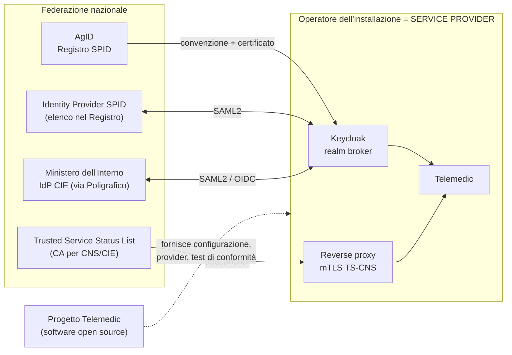
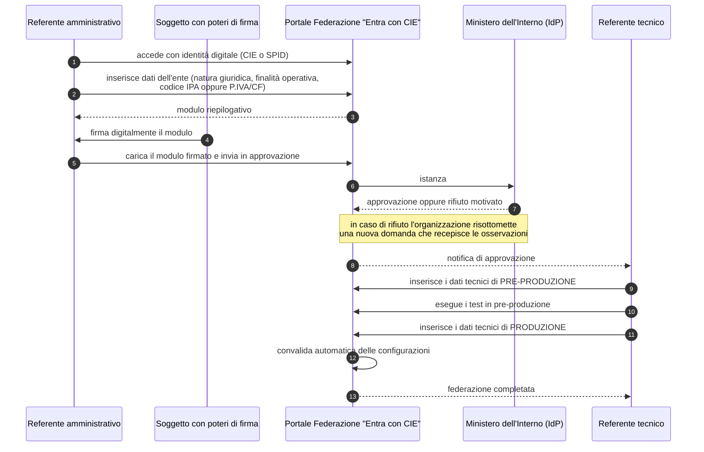
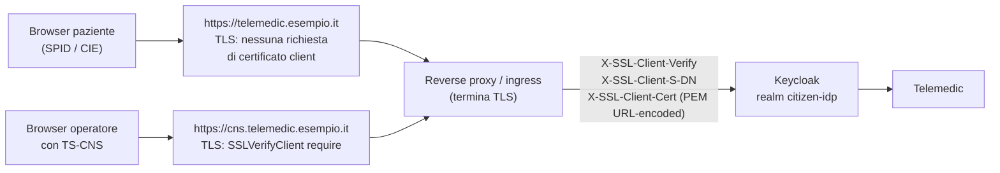
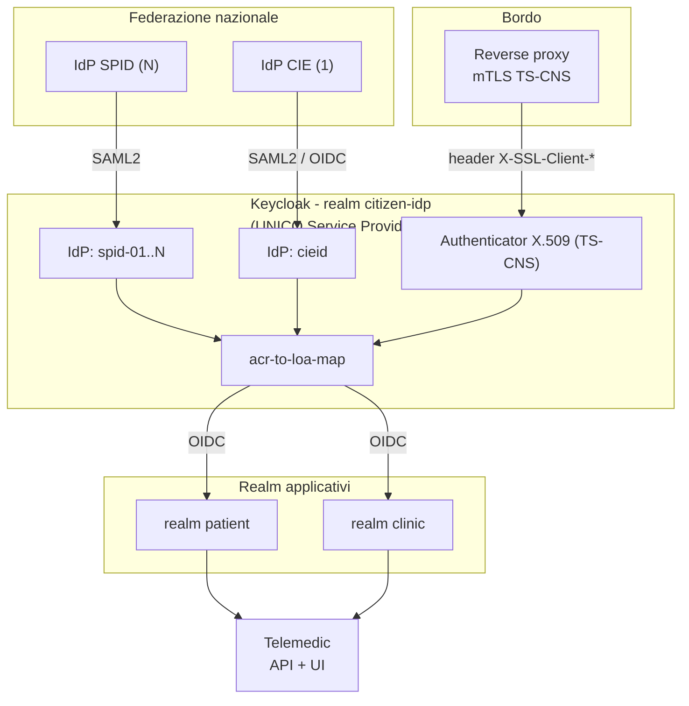
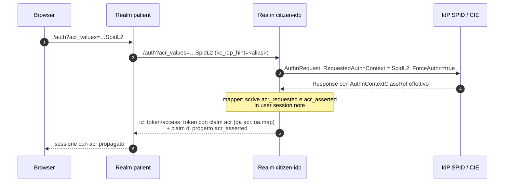

# B7 - Identità digitale italiana: SPID, CIE, TS-CNS, IT-Wallet

> **Ambito.** Documento di ricerca a supporto della decisione **D9** del *context pack*
> (`.telemedic/context/00_PROJECT_BRIEF.md`): «SPID e CIE dentro la v1.0 … Considerare TS-CNS».
> Completa la parte italiana del **§3 di `R5-pattern-integrazione.md`** (OAuth 2.x / OIDC) e
> risolve la questione aperta **Q4** di R5 («mappatura dei valori `acr` per i livelli SPID
> L1/L2/L3 - non verificata»).
>
> **Riservatezza (R0).** Nessun nome di azienda, prodotto commerciale, marchio o dominio di
> potenziali partner compare in questo documento. Le amministrazioni e gli enti pubblici citati
> (AgID, Ministero dell'Interno, Poligrafico) non sono partner commerciali: sono autorità di
> regolazione o gestori di infrastrutture pubbliche, e nominarli è tecnicamente inevitabile.
> Gli identity provider SPID privati **non** vengono nominati: si rinvia al Registro SPID.

## 0. Come leggere questo documento

### 0.1 Legenda dei livelli di affidabilità

| Marcatura | Significato |
|---|---|
| Citazione con **atto normativo + articolo** o **documento AgID/Ministero + sezione** | Verificato su fonte primaria durante questa ricerca (25 agosto 2026) |
| «**non dichiarato pubblicamente**» | La fonte primaria **non** contiene l'informazione. Segue sempre l'indicazione di **a chi va chiesta** |
| «**stima di progetto**» | Non è un dato di fonte: è una valutazione ingegneristica di questo documento, esplicitamente distinta dai fatti |
| «**da verificare**» | Informazione raccolta da fonte secondaria o da versione del documento potenzialmente non corrente |

**Regola vincolante per chi implementerà e per chi scriverà la documentazione pubblica:**
nessun tempo, costo o requisito procedurale marcato «stima di progetto» può essere presentato
come dato ufficiale. Sui tempi burocratici questo documento **non fornisce numeri**, perché non
esistono numeri pubblicati: fornisce invece una strategia che non dipende da quei numeri.

### 0.2 La risposta più importante, in una pagina

Il mandato chiede di quantificare un rischio di pianificazione. La risposta è la seguente, e le
sezioni successive la documentano.

1. **I tempi dell'accreditamento SPID come Service Provider non sono dichiarati pubblicamente
   in nessuna fonte primaria.** Né il DPCM 24 ottobre 2014, né il *Regolamento recante le
   modalità attuative per la realizzazione dello SPID* (v.2), né lo schema di *Convenzione per
   l'adesione dei fornitori di servizi privati*, né la procedura tecnica pubblicata su
   `spid.gov.it` fissano un termine per la conclusione del procedimento. Gli unici termini
   presenti sono **a valle** della firma: iscrizione nel Registro SPID **entro 10 giorni dalla
   stipula della Convenzione** (schema di Convenzione SP privati, art. 1, c. 4) e - per gli
   aggregatori - **entro 5 giorni** (Regolamento aggregatori, art. 10, c. 2). Il tempo che
   intercorre fra l'invio del metadata ad AgID e la controfirma del Direttore di AgID **non è
   normato**.
2. **Un progetto software open source non può essere accreditato come Service Provider SPID.**
   La qualifica di *fornitore di servizi* è definita dall'art. 1, c. 1, lett. i) del DPCM
   24 ottobre 2014 in capo a chi **eroga servizi in rete agli utenti**. La Convenzione si stipula
   con un soggetto giuridico che dichiara ad AgID **l'elenco dei propri servizi attivi**, il
   livello di sicurezza di ciascuno e gli attributi richiesti (schema di Convenzione, art. 2,
   c. 1, lett. a-c). Telemedic è un **prodotto**, non un servizio in rete: il Service Provider è
   e resta **chi installa ed eroga** (l'azienda sanitaria, la clinica, l'integratore, l'operatore
   SaaS). Questo non è un cavillo: è ciò che rende la scadenza rispettabile.
3. **Ne discende che D9, nella formulazione «SPID e CIE dentro la v1.0», è ambigua e va
   disambiguata prima di pianificare.** Nella lettura «entro il 30 novembre 2026 esiste
   un'installazione di Telemedic accreditata e operativa su SPID in produzione» la decisione
   **non è governabile**, perché dipende da un procedimento amministrativo di terzi privo di
   termine dichiarato. Nella lettura «entro il 30 novembre 2026 Telemedic è un prodotto
   *SPID-ready* e *CIE-ready*, con implementazione conforme verificata contro gli strumenti
   ufficiali di validazione e con documentazione di accreditamento per il deployer» la decisione
   **è pienamente governabile** e verificabile in CI.
4. **CIE id è oggi il percorso a minor attrito**, non SPID: la federazione avviene su un portale
   interamente digitale del Ministero dell'Interno, l'identity provider è **uno solo** (contro
   la decina di IdP SPID da configurare singolarmente), esiste un ambiente di pre-produzione con
   carte di test, ed è disponibile **sia SAML sia OIDC in produzione**. Per SPID, invece,
   **OpenID Connect non è utilizzabile in produzione** (§3.12) e resta obbligatorio SAML2.
5. **TS-CNS è l'unico dei tre canali che non richiede alcun procedimento amministrativo presso
   terzi.** Si realizza con mutua autenticazione TLS al bordo dell'infrastruttura e con un trust
   store alimentato dalla Trusted Service Status List italiana. È interamente sotto controllo del
   progetto ed è quindi **l'unico canale ex art. 64 CAD che può essere dichiarato completo nella
   v1.0 senza dipendenze esterne**. È anche l'unico che R3 ha accertato essere **obbligatorio e
   non previsto dal piano originario**.
6. **Il rischio residuo va scritto nel piano, non nascosto:** se il committente conferma la
   lettura «accreditamento operativo entro il 30 novembre 2026», questo documento raccomanda di
   **rivedere D9** e di spostare l'accreditamento fuori dal perimetro della v1.0, mantenendo
   dentro la v1.0 l'implementazione e la validazione tecnica. Le alternative praticabili, con
   pro e contro, sono in §10.

---

## 1. Il perimetro normativo: perché tre canali e non due

### 1.1 L'art. 64 del CAD

Il **d.lgs. 7 marzo 2005, n. 82** (Codice dell'amministrazione digitale, «CAD») disciplina
all'art. 64 il sistema pubblico per la gestione dell'identità digitale. I commi rilevanti,
citati nelle premesse del *Regolamento aggregatori* di AgID:

| Comma | Contenuto |
|---|---|
| 64, c. 2-bis | Istituisce SPID «a cura dell'Agenzia per l'Italia digitale» |
| 64, c. 2-ter | «Il sistema SPID è costituito come insieme aperto di soggetti pubblici e privati che, previo accreditamento da parte dell'AgID […] identificano gli utenti per consentire loro il compimento di attività e l'accesso ai servizi in rete» |
| 64, c. 2-quater | «L'accesso ai servizi in rete erogati dalle pubbliche amministrazioni che richiedono identificazione informatica avviene tramite SPID […]» |
| 64, c. 2-sexies | Rinvia al DPCM per il modello architetturale, l'accreditamento dei gestori e **le modalità di adesione delle imprese in qualità di erogatori di servizi in rete** |
| 64, c. 2-duodecies | «La verifica dell'identità digitale con livello di garanzia almeno significativo, ai sensi dell'articolo 8, paragrafo 2, del Regolamento (UE) n. 910/2014 […] produce, nelle transazioni elettroniche o per l'accesso ai servizi in rete, gli effetti del documento di riconoscimento equipollente» |

Il comma 2-duodecies è il ponte fra la scala SPID e la scala **eIDAS**: «livello di garanzia
almeno **significativo**» (eIDAS art. 8, par. 2: *low*, *substantial*, *high*).

### 1.2 Che cosa ha accertato R3 e perché TS-CNS entra nel perimetro

`R3-normativa-italiana.md`, §§ 8.4 e 9.5, riporta due prescrizioni **[VINCOLANTI]**:

- **DM 19 novembre 2025** (GU n. 301 del 30 dicembre 2025, atto 25A06938), Allegato 4: fra le
  misure di sicurezza per l'accesso alla Piattaforma Nazionale di Telemedicina è richiesta
  l'«autenticazione forte mediante identità digitale» ex art. 64 CAD: **SPID, CIE, TS-CNS**;
- **DM 7 settembre 2023**, art. 11, c. 1 (FSE 2.0, GU n. 249 del 24 ottobre 2023): stesso
  insieme.

La conseguenza operativa è netta e va scritta nel *context pack*: **la decisione D9 va corretta
da «SPID e CIE, considerare TS-CNS» a «SPID, CIE e TS-CNS»**, perché TS-CNS non è un'opzione
ma un canale espressamente elencato dalla norma.

### 1.3 Chi è obbligato a che cosa

Un punto che la documentazione pubblica del progetto deve rendere esplicito, perché condiziona
il perimetro contrattuale:

| Scenario di deployment | Fonte dell'obbligo | Canali richiesti |
|---|---|---|
| Installazione presso una PA (ASL/AO/Regione) | art. 64, c. 2-quater CAD | SPID obbligatorio; CIE e TS-CNS in quanto identità ex art. 64 |
| Installazione che alimenta o consulta il **FSE 2.0** | DM 7 settembre 2023, art. 11 | SPID, CIE, TS-CNS |
| Installazione connessa alla **PNT** | DM 19 novembre 2025, All. 4 | SPID, CIE, TS-CNS |
| SaaS privato per studi medici, nessun collegamento a FSE/PNT | nessun obbligo diretto ex art. 64 | SPID/CIE **facoltativi** (art. 64, c. 2-sexies, lett. f: «modalità di adesione da parte delle imprese interessate») |

**Implicazione architetturale (vincolo V4, tenant-awareness):** i canali di autenticazione
devono essere **configurabili per tenant**. Un'installazione privata non deve essere costretta ad
accreditarsi presso AgID per usare il prodotto; un'installazione pubblica deve poter disabilitare
qualunque autenticazione locale con password. La configurazione «quali IdP sono ammessi per
questo tenant e con quale livello minimo» è un requisito di prodotto, non un dettaglio di
deployment.

### 1.4 Chi è il Service Provider: la domanda che decide la pianificazione

Il DPCM 24 ottobre 2014, art. 1, c. 1, lett. i), definisce il fornitore di servizi come

> «il fornitore dei servizi della società dell'informazione definiti dall'art. 2, comma 1,
> lettera a), del decreto legislativo 9 aprile 2003, n. 70, o dei servizi di un'amministrazione
> o di un ente pubblico erogati agli utenti attraverso sistemi informativi accessibili in rete.
> I fornitori di servizi inoltrano le richieste di identificazione informatica dell'utente ai
> gestori dell'identità digitale e ne ricevono l'esito.»

Lo schema di Convenzione per i fornitori privati, art. 2, c. 1, obbliga il Service Provider

> «a) a comunicare ad AgID l'elenco dei servizi attivi anche nel formato metadata specificato nel
> Regolamento recante le regole tecniche SPID; tale elenco dovrà essere costantemente aggiornato
> e pubblicato sul sito istituzionale del Service Provider […]
> c) a comunicare ad AgID, per ciascuno dei servizi compresi nell'elenco, il Livello di Sicurezza
> previsto e la lista delle attività ammesse all'utente per Livello di Sicurezza».

Un repository GitHub non ha «servizi attivi», non ha un «sito istituzionale» su cui pubblicare
l'elenco e non ha un entityID stabile: **il soggetto accreditabile è l'operatore
dell'installazione**. Su questo si fonda tutta la strategia di §11.



---

## 2. Fonti primarie utilizzate

| Fonte | Estremi | Uso in questo documento |
|---|---|---|
| CAD | d.lgs. 82/2005, art. 64 (commi 2-bis … 2-duodecies) | §1.1 |
| DPCM SPID | DPCM 24 ottobre 2014, GU n. 285 del 9 dicembre 2014, modificato dal DPCM 19 ottobre 2021, GU n. 296 del 14 dicembre 2021 | §1.4, §3.5, §3.9 |
| Regolamenti attuativi SPID | Determinazione AgID n. 44/2015 del 28 luglio 2015 | §3.5, §3.9 |
| Regolamento modalità attuative SPID | «Regolamento recante le modalità attuative per la realizzazione dello SPID» (art. 4, c. 2 DPCM), **stato: Emanato, versione 2**, 39 pagine | §3.5, §3.8, §3.9 |
| Regole tecniche SPID | `docs.italia.it/italia/spid/spid-regole-tecniche` - versione consolidata che incorpora gli avvisi fino al n. 34 | §3.2, §3.3, §3.4, §3.6, §3.7 |
| Avvisi SPID | Elenco AgID di 44 avvisi; citati nel testo n. 6, 19 v.4, 22 v.2, 23, 29 v.3, 41 v.2 (23/03/2023), 42, 43, 44 (12/08/2024) | §3.1 |
| Linee guida interfacce | «SPID - Linee guida sulle interfacce e sulle informazioni IdP/SP», AgID, 14 pagine (frontespizio **privo di numero di versione e data**) | §3.8 |
| Convenzione SP privati | «Convenzione per l'adesione dei fornitori di servizi privati al Sistema pubblico per le identità digitali», schema AgID | §1.4, §3.9 |
| Corrispettivi SPID | «Allegato 4 - Corrispettivi servizio di autenticazione SPID (2019)», allegato alla Determinazione AgID DT 166 | §3.9.5 |
| Regolamento aggregatori | «Regolamento che disciplina l'adesione al sistema pubblico per la gestione dell'identità digitale di cittadini e imprese (SPID) da parte dei soggetti aggregatori», approvato con **Determinazione AgID n. 75/2023** | §3.10 |
| Decreto CIE | **DM Interno 8 settembre 2022**, art. 5 | §4.1, §4.4 |
| Manuale Operativo CIE | «Manuale Operativo per gli erogatori di servizi pubblici e privati», release master, **12 dicembre 2023** | §4.4 |
| Manuale Tecnico CIE / Regole tecniche CIE eID SAML | `docs.italia.it/italia/cie/cie-manuale-tecnico-docs`, `docs.italia.it/italia/cie/cie-eid-saml-docs` | §4.2, §4.3 |
| Regole tecniche SPID/CIE OIDC | `docs.italia.it/italia/spid/spid-cie-oidc-docs` | §3.12, §4.2 |
| eIDAS 2 | Regolamento (UE) 2024/1183, in vigore dal 20 maggio 2024 | §6 |
| IT-Wallet | art. 64-quater CAD, introdotto dal d.l. 2 marzo 2024, n. 19, conv. l. 29 aprile 2024, n. 56 | §6 |
| Requisiti onorabilità CIE | DM MEF 23 novembre 2020, n. 169 | §4.4 |

---

## 3. SPID lato Service Provider

### 3.1 Le regole tecniche vigenti e il ruolo degli avvisi

Le regole tecniche SPID non vivono in un unico documento immutabile: sono un testo base
(emanato con Determinazione AgID n. 44/2015) **modificato per successivi «Avvisi»**. La versione
consolidata pubblicata su Docs Italia dichiara di incorporare gli avvisi fino al **n. 34**; gli
avvisi successivi vanno letti separatamente sul sito AgID. Al momento di questa ricerca l'elenco
AgID conta **44 avvisi**, alcuni in più versioni.

Gli avvisi che un implementatore di SP **deve** leggere prima di scrivere codice:

| Avviso | Oggetto | Perché rilevante per il SP |
|---|---|---|
| n. 6 | Indicazioni per il *deployment* di SPID da parte dei fornitori di servizi | Struttura del metadata |
| n. 19 (v.4) | Regole tecniche per gli aggregatori | Necessario solo se si opera come aggregatore o aggregato |
| n. 22 (v.2) | Struttura del certificato e metadata di **collaudo** | Fase di test |
| n. 23 | Procedura di richiesta dei certificati alla PKI di AgID | **Gate obbligatorio per i SP privati** (§3.9.4) |
| n. 29 (v.3) | Struttura certificati e metadata dei service provider pubblici e privati | Struttura del metadata di produzione |
| n. 41 (v.2), **23/03/2023** | Integrazione delle Linee Guida «OpenID Connect in SPID» | §3.12 |
| n. 42 | Aggiornamento del pulsante «Entra con SPID» | §3.8 |
| n. 43 | Gestione del metadata | Ciclo di vita del metadata |
| n. 44, **12/08/2024** | Chiarimenti operativi su SPID per i minori | Rilevante per il caso d'uso pediatrico |

> **Nota di manutenzione.** Poiché le regole tecniche si modificano per avvisi, una
> implementazione conforme oggi può non esserlo fra sei mesi. Questo va gestito come **SOUP ai
> sensi di IEC 62304 §8.1.2** (cfr. `R4-webrtc-media.md`, questione 17): serve un processo di
> sorveglianza sugli avvisi AgID con la stessa formalità della sorveglianza sulle vulnerabilità.

### 3.2 Metadata del Service Provider

Fonte: regole tecniche SPID, sezione *Metadata*, e Avviso n. 29 v.3.

Elementi obbligatori:

| Elemento | Requisito |
|---|---|
| `<md:EntityDescriptor>` | attributo `entityID` univoco, **allineato all'estensione URI del certificato elettronico del SP** |
| `<ds:Signature>` | **obbligatoria** sul metadata; chiavi **RSA ≥ 2048 bit**, digest **SHA-256 o superiore** (SHA-512 ammesso) |
| `<md:KeyDescriptor>` | contiene il certificato della chiave pubblica per la verifica della firma |
| `<md:SPSSODescriptor>` | **unico**; `protocolSupportEnumeration="urn:oasis:names:tc:SAML:2.0:protocol"`; `AuthnRequestsSigned="true"` |
| `<md:AssertionConsumerService>` | almeno uno; il primo **deve** avere `index="0"`, `isDefault="true"`, `Binding` HTTP-POST |
| `<md:SingleLogoutService>` | almeno uno; binding SOAP, HTTP-Redirect o HTTP-POST |
| `<md:AttributeConsumingService>` | dichiara gli attributi richiesti (§3.6) |
| `<md:Organization>` | `OrganizationName` (denominazione completa per esteso), `OrganizationDisplayName` (forma abbreviata, **è quella mostrata all'utente durante l'autenticazione**), `OrganizationURL`; occorrenze localizzate almeno in italiano |
| `<md:ContactPerson contactType="other">` | con `<md:Extensions>` nel namespace `spid` |
| `<md:ContactPerson contactType="billing">` | **obbligatorio per i SP privati** |

Contenuto delle `Extensions` del `ContactPerson` `other`:

| Elemento | Quando |
|---|---|
| `<spid:Public/>` | tag vuoto, se il SP è pubblico |
| `<spid:Private/>` | tag vuoto, se il SP è privato |
| `<spid:IPACode>` | **solo** SP pubblico |
| `<spid:VATNumber>` | obbligatorio per SP privato con partita IVA; include il codice ISO 3166-1 alpha-2 |
| `<spid:FiscalCode>` | obbligatorio per SP privato senza partita IVA |
| `<md:EmailAddress>` | obbligatorio; **non riferibile a persona fisica** |
| `<md:TelephoneNumber>` | opzionale; prefisso internazionale, senza spazi |

Il `ContactPerson` `billing` porta i dati fiscali minimi secondo lo standard **FatturaPA**,
nel namespace `https://spid.gov.it/invoicing-extensions`, con `CessionarioCommittente`
(dati anagrafici e sede) e, opzionalmente, `TerzoIntermediarioSoggettoEmittente`. Serve
perché il SP privato è **fatturato dagli identity provider** (§3.9.5).

Esempio di metadata (**i valori sono illustrativi**, il documento reale va firmato):

```xml
<?xml version="1.0" encoding="UTF-8"?>
<md:EntityDescriptor
    xmlns:md="urn:oasis:names:tc:SAML:2.0:metadata"
    xmlns:ds="http://www.w3.org/2000/09/xmldsig#"
    xmlns:spid="https://spid.gov.it/saml-extensions"
    xmlns:fpa="https://spid.gov.it/invoicing-extensions"
    entityID="https://telemedic.esempio.it/saml/metadata"
    ID="_a1b2c3d4-0000-4000-8000-000000000001">

  <ds:Signature><!-- firma enveloped: RSA >= 2048, SHA-256 --></ds:Signature>

  <md:SPSSODescriptor
      protocolSupportEnumeration="urn:oasis:names:tc:SAML:2.0:protocol"
      AuthnRequestsSigned="true"
      WantAssertionsSigned="true">

    <md:KeyDescriptor use="signing">
      <ds:KeyInfo><ds:X509Data><ds:X509Certificate>MIID...</ds:X509Certificate></ds:X509Data></ds:KeyInfo>
    </md:KeyDescriptor>

    <md:SingleLogoutService
        Binding="urn:oasis:names:tc:SAML:2.0:bindings:HTTP-POST"
        Location="https://telemedic.esempio.it/realms/citizen-idp/broker/spid-idp-01/endpoint"/>

    <md:AssertionConsumerService index="0" isDefault="true"
        Binding="urn:oasis:names:tc:SAML:2.0:bindings:HTTP-POST"
        Location="https://telemedic.esempio.it/realms/citizen-idp/broker/spid-idp-01/endpoint"/>
    <md:AssertionConsumerService index="1"
        Binding="urn:oasis:names:tc:SAML:2.0:bindings:HTTP-POST"
        Location="https://telemedic.esempio.it/realms/citizen-idp/broker/spid-idp-02/endpoint"/>
    <!-- un ACS per ciascun IdP SPID configurato: vedi §7.3.2 -->

    <md:AttributeConsumingService index="1">
      <md:ServiceName xml:lang="it">Telemedicina - accesso del cittadino</md:ServiceName>
      <md:ServiceDescription xml:lang="it">Accesso alle prestazioni di telemedicina</md:ServiceDescription>
      <md:RequestedAttribute Name="spidCode"     NameFormat="urn:oasis:names:tc:SAML:2.0:attrname-format:basic"/>
      <md:RequestedAttribute Name="name"         NameFormat="urn:oasis:names:tc:SAML:2.0:attrname-format:basic"/>
      <md:RequestedAttribute Name="familyName"   NameFormat="urn:oasis:names:tc:SAML:2.0:attrname-format:basic"/>
      <md:RequestedAttribute Name="fiscalNumber" NameFormat="urn:oasis:names:tc:SAML:2.0:attrname-format:basic"/>
      <md:RequestedAttribute Name="dateOfBirth"  NameFormat="urn:oasis:names:tc:SAML:2.0:attrname-format:basic"/>
      <md:RequestedAttribute Name="email"        NameFormat="urn:oasis:names:tc:SAML:2.0:attrname-format:basic"/>
    </md:AttributeConsumingService>
  </md:SPSSODescriptor>

  <md:Organization>
    <md:OrganizationName xml:lang="it">Denominazione completa dell'operatore</md:OrganizationName>
    <md:OrganizationDisplayName xml:lang="it">Nome breve mostrato all'utente</md:OrganizationDisplayName>
    <md:OrganizationURL xml:lang="it">https://www.esempio.it/</md:OrganizationURL>
  </md:Organization>

  <md:ContactPerson contactType="other">
    <md:Extensions>
      <spid:VATNumber>IT01234567890</spid:VATNumber>
      <spid:Private/>
    </md:Extensions>
    <md:EmailAddress>spid-tech@esempio.invalid</md:EmailAddress>
  </md:ContactPerson>

  <md:ContactPerson contactType="billing">
    <md:Extensions>
      <fpa:CessionarioCommittente>
        <fpa:DatiAnagrafici>
          <fpa:IdFiscaleIVA>
            <fpa:IdPaese>IT</fpa:IdPaese>
            <fpa:IdCodice>01234567890</fpa:IdCodice>
          </fpa:IdFiscaleIVA>
          <fpa:Anagrafica><fpa:Denominazione>Denominazione completa</fpa:Denominazione></fpa:Anagrafica>
        </fpa:DatiAnagrafici>
        <fpa:Sede>
          <fpa:Indirizzo>Via Esempio 1</fpa:Indirizzo>
          <fpa:CAP>00100</fpa:CAP>
          <fpa:Comune>Roma</fpa:Comune>
          <fpa:Provincia>RM</fpa:Provincia>
          <fpa:Nazione>IT</fpa:Nazione>
        </fpa:Sede>
      </fpa:CessionarioCommittente>
    </md:Extensions>
    <md:EmailAddress>amministrazione@esempio.invalid</md:EmailAddress>
  </md:ContactPerson>
</md:EntityDescriptor>
```

### 3.3 `AuthnRequest`

Fonte: regole tecniche SPID, sezione *Single Sign-On*.

| Attributo / elemento | Requisito |
|---|---|
| `ID` | univoco, preferibilmente UUID o «origine + timestamp» con precisione al millisecondo |
| `Version` | **sempre** `2.0` |
| `IssueInstant` | istante di emissione in formato UTC |
| `Destination` | valore dell'attributo `Location` del `SingleSignOnService` dell'IdP |
| `ForceAuthn` | **richiesto** «nel caso in cui si richieda livelli di autenticazione superiori a SpidL1» |
| `AssertionConsumerServiceIndex` | modalità **preferita**: indice posizionale di un `<AssertionConsumerService>` del metadata SP |
| `AssertionConsumerServiceURL` + `ProtocolBinding` | alternativa all'`Index`; `ProtocolBinding` = `urn:oasis:names:tc:SAML:2.0:bindings:HTTP-POST` |
| `AttributeConsumingServiceIndex` | indice dell'`AttributeConsumingService` desiderato |
| `<saml:Issuer>` | valore = `entityID` del metadata SP; `Format="urn:oasis:names:tc:SAML:2.0:nameid-format:entity"`; **`NameQualifier` qualificante il dominio** |
| `<samlp:NameIDPolicy>` | presente, `Format="urn:oasis:names:tc:SAML:2.0:nameid-format:transient"` |
| `<samlp:RequestedAuthnContext>` | obbligatorio; contiene `<saml:AuthnContextClassRef>` con SpidL1/L2/L3; `Comparison` ∈ {`exact`, `minimum`, `better`, `maximum`} |
| `<ds:Signature>` | obbligatoria con binding HTTP-POST; RSA ≥ 2048, SHA-256 |
| Binding ammessi | HTTP-Redirect e HTTP-POST per la richiesta; **la risposta è sempre HTTP-POST** |

**L'attributo `NameQualifier` sull'`Issuer` è la prima deviazione da SAML2 puro**: il profilo
SAML2 core non lo prevede per il formato `entity`, e le implementazioni generiche non lo
emettono. È uno dei motivi per cui il SAML nativo di Keycloak non basta (§7.2).

Esempio (**valori illustrativi**):

```xml
<samlp:AuthnRequest
    xmlns:samlp="urn:oasis:names:tc:SAML:2.0:protocol"
    xmlns:saml="urn:oasis:names:tc:SAML:2.0:assertion"
    ID="_9f1c2b3d4e5f6a7b8c9d0e1f2a3b4c5d"
    Version="2.0"
    IssueInstant="2026-08-25T09:12:04Z"
    Destination="https://idp.esempio-spid.it/sso"
    ForceAuthn="true"
    AssertionConsumerServiceIndex="0"
    AttributeConsumingServiceIndex="1">

  <saml:Issuer
      Format="urn:oasis:names:tc:SAML:2.0:nameid-format:entity"
      NameQualifier="https://telemedic.esempio.it">https://telemedic.esempio.it/saml/metadata</saml:Issuer>

  <ds:Signature xmlns:ds="http://www.w3.org/2000/09/xmldsig#"><!-- ... --></ds:Signature>

  <samlp:NameIDPolicy Format="urn:oasis:names:tc:SAML:2.0:nameid-format:transient"/>

  <samlp:RequestedAuthnContext Comparison="minimum">
    <saml:AuthnContextClassRef>https://www.spid.gov.it/SpidL2</saml:AuthnContextClassRef>
  </samlp:RequestedAuthnContext>
</samlp:AuthnRequest>
```

> **Attenzione a `AllowCreate`.** L'attributo `AllowCreate` su `<NameIDPolicy>` **non va emesso**:
> è uno dei punti su cui gli avvisi hanno modificato il testo base e su cui i validatori sono
> severi. Il SAML generico di Keycloak lo emette per default (§7.2).

### 3.4 `Response` e `Assertion`

| Elemento | Requisito |
|---|---|
| `Response/@ID`, `@Version`, `@IssueInstant`, `@Destination` | come per la richiesta; `Version` sempre `2.0` |
| `Response/@InResponseTo` | riferito all'`ID` della `AuthnRequest` |
| `<samlp:Status>` | presente; contiene `StatusCode` e, in caso di anomalia, `StatusMessage` (§3.7) |
| `<saml:Issuer>` della Response | `entityID` dell'IdP; `Format` omesso oppure `nameid-format:entity` |
| `<ds:Signature>` | l'**`Assertion` deve essere firmata**; la `Response` può esserlo. RSA ≥ 2048, SHA-256 |
| `Subject/NameID` | `Format="urn:oasis:names:tc:SAML:2.0:nameid-format:transient"`, con `NameQualifier` riferito all'IdP |
| `SubjectConfirmation/@Method` | `urn:oasis:names:tc:SAML:2.0:cm:bearer` |
| `SubjectConfirmationData` | `Recipient` = `AssertionConsumerServiceURL`; `NotOnOrAfter`; `InResponseTo` |
| `Conditions` | `NotBefore`, `NotOnOrAfter`, e `AudienceRestriction/Audience` = `entityID` del SP |
| `AuthnStatement/AuthnContext/AuthnContextClassRef` | **classe relativa all'effettivo contesto di autenticazione** (es. `SpidL2`) |
| `AuthnStatement/@SessionIndex` | **presente per SpidL1**, **assente per SpidL2 e SpidL3** |

L'ultima riga è la seconda deviazione strutturale: la presenza/assenza di `SessionIndex` è
condizionata al livello. Discende dall'art. 28 del *Regolamento modalità attuative*: «Per i
livelli 2 e 3 SPID … non si prevede la possibilità di mantenimento di sessioni condivise di
autenticazione. Pertanto: 1) il gestore dell'identità digitale non deve mantenere alcuna
sessione di autenticazione con l'utente; 2) ogni fornitore di servizi deve gestire per proprio
conto l'eventuale sessione con l'utente.»

**Conseguenza diretta per Telemedic:** con SPID L2 **non esiste SSO federato**. Il Single Logout
verso l'IdP è privo di senso pratico e la durata della sessione è interamente responsabilità del
SP. Questo va coordinato con la politica dei token descritta in `R5`, §2.5: la sessione Keycloak
del realm cittadino è l'unica sessione esistente.

### 3.5 Livelli di garanzia L1, L2, L3

#### 3.5.1 Definizione e mappatura

Il *Regolamento recante le modalità attuative per la realizzazione dello SPID* (versione 2, p. 3)
è la fonte primaria e mappa esplicitamente i livelli su **ISO/IEC 29115**:

| Livello SPID | ISO/IEC 29115 | Fattori | Testo del regolamento (sintesi verbatim) |
|---|---|---|---|
| **livello 1** | **LoA2** | singolo fattore (password) | «rischio moderato e compatibile con l'impiego di un sistema autenticazione a singolo fattore … applicabile nei casi in cui il danno causato da un utilizzo indebito dell'identità digitale ha un basso impatto» |
| **livello 2** | **LoA3** | due fattori **non** necessariamente basati su certificati digitali | «rischio notevole … adeguato per tutti i servizi per i quali un indebito utilizzo dell'identità digitale può provocare un danno consistente» |
| **livello 3** | **LoA4** | due fattori **basati su certificati digitali**, con custodia delle chiavi private su dispositivi conformi all'Allegato II del Regolamento 910/2014 | «rischio altissimo … da associare a quei servizi che possono subire un serio e grave danno per cause imputabili ad abusi di identità» |

I valori `AuthnContextClassRef` corrispondenti - **questa è la risposta alla questione Q4 di R5**:

```
https://www.spid.gov.it/SpidL1
https://www.spid.gov.it/SpidL2
https://www.spid.gov.it/SpidL3
```

Sono URI, non URN, con schema `https` e senza barra finale. La stessa terna è riusata da
**CIE id** (§4.3).

Correlazione con eIDAS (art. 8, par. 2 del Regolamento 910/2014) e con l'art. 64, c. 2-duodecies
CAD: SPID è stato notificato in sede UE e pubblicato come regime di identificazione elettronica
in **GUUE C-318 del 10 settembre 2018** (citato nelle premesse del Regolamento aggregatori). La
corrispondenza LoA3 ↔ *substantial* e LoA4 ↔ *high* è quella comunemente assunta; **la mappatura
puntuale SPID↔eIDAS non è enunciata testualmente nel Regolamento modalità attuative e va
verificata** sul *peer review* di notifica se serve una dichiarazione formale.

#### 3.5.2 Chi sceglie il livello e con quale metodo

DPCM 24 ottobre 2014, art. 6, commi 4 e 5: «i fornitori di servizi **scelgono** il livello di
sicurezza SPID necessario per accedere ai propri servizi e non possono discriminare l'accesso ai
propri servizi sulla base del gestore di identità che l'ha fornita».

Il *Regolamento modalità attuative* rinvia all'**Appendice A** per «una metodologia da adottare
allo scopo», **a titolo esemplificativo**. L'Appendice A contiene due tabelle.

Tabella «Impatto Potenziale / Livello di Sicurezza SPID» (estratto verbatim delle righe
rilevanti):

| Categoria di impatto | Livello 1 | Livello 2 | Livello 3 |
|---|---|---|---|
| Potenziale danno per rilascio di informazioni **sensibili** dell'utente | N/A | Basso | **Moderato/Alto** |
| Potenziale danno per violazioni di carattere civile (non conformità a regolamenti, norme) | N/A | Basso/Moderato | Alto |
| Potenziali danni a programmi di interesse pubblico | Basso | Moderato | Alto |
| Impatto potenziale per la sicurezza personale dell'utente e dell'erogatore | N/A | Basso | Moderato/Alto |

I valori Basso/Moderato/Alto sono definiti «secondo la definizione normalmente adottata
nell'ISO/IEC 27001 framework e FIPS 199».

Tabella «Classificazione dato / Tipo di accesso» (verbatim):

| Livello | Classificazione del dato | Esempi |
|---|---|---|
| nessuno | Pubblico | area informativa di un sito |
| 1 | Pubblico/Interno | «area cittadini ma non dispositiva» |
| 2 | Interno | «richieste/domande, interrogazioni, aggiornamenti e cancellazioni **che non riguardano dati sensibili**» |
| 3 | Riservato | «siti che trattano **dati sensibili**, specifiche transazioni che includono trasferimento di fondi, accesso a documenti riservati» |

#### 3.5.3 Quale livello serve per i dati sanitari - e perché la risposta è scomoda

Letta alla lettera, l'Appendice A colloca i **dati sensibili** - categoria che comprende i dati
relativi alla salute, oggi «categorie particolari» ex art. 9 GDPR - al **livello 3**.

Nella prassi nazionale, però, **l'accesso del cittadino al FSE avviene con SPID di livello 2**.
La contraddizione è solo apparente e va spiegata con precisione, perché una documentazione che
la semplifichi in un senso o nell'altro sarebbe scorretta:

- l'Appendice A è **esemplificativa**, non prescrittiva: il testo dell'art. 2 la introduce con
  «Nell'Appendice A è riportata, **a titolo esemplificativo**, una metodologia da adottare allo
  scopo»;
- la stessa Appendice riconosce «la facoltà della singola Amministrazione di definire criteri
  diversi in base alle diverse modalità di erogazione dei servizi e ai dati resi disponibili»;
- il *Regolamento modalità attuative*, sempre in Appendice A, prevede che «L'Agenzia, al fine di
  rendere omogenei i LoA associati ai servizi su tutto il territorio nazionale, promuove e
  pubblica, nella sezione SPID del proprio sito istituzionale, **il LoA da associare alle
  categorie di servizi** che presentano carattere di omogeneità». **Non è stato possibile
  reperire in questa ricerca il documento AgID che associa il LoA alla categoria "servizi
  sanitari": va richiesto ad AgID** (`spid.tech@agid.gov.it`, oppure Help Desk SPID);
- il livello 3 richiede al cittadino un dispositivo crittografico: imporlo per l'accesso a una
  televisita produrrebbe un'esclusione di massa, e sarebbe in tensione con il vincolo di
  accessibilità V6 e con la finalità di equità del servizio.

**Posizione raccomandata per Telemedic** (*stima di progetto*, da confermare col committente e
con il DPO del deployer):

| Operazione | Livello minimo | Motivazione |
|---|---|---|
| Accesso del paziente alla propria stanza di televisita | **SpidL2** | allineamento con la prassi FSE; due fattori; nessun trattamento dispositivo di terzi |
| Consultazione del proprio referto / storico clinico | **SpidL2** | idem |
| Consenso alla registrazione della sessione | **SpidL2** | atto revocabile, non dispositivo su terzi |
| Accesso del professionista sanitario a dati di **altri** soggetti | **SpidL2 come minimo, SpidL3 configurabile** | qui l'Appendice A morde davvero: l'operatore accede a dati sensibili di terzi. Il livello va reso configurabile per tenant |
| Operazioni di amministrazione del tenant (gestione utenti, chiavi, esportazioni massive) | **SpidL3 raccomandato** | «accesso a documenti riservati o rilevanti per le amministrazioni» |

Il valore va **configurabile per tenant e per operazione**, non cablato: è un requisito di
prodotto derivato direttamente dal fatto che il fornitore di servizi «sceglie» il livello
(DPCM art. 6, c. 4) e che tale scelta va **motivata ad AgID** in sede di convenzione
(*Regolamento modalità attuative*, art. 3, lett. b: «per ciascuno di questi servizi, motivano le
scelte in relazione ai livelli di sicurezza adottati e alla necessità di informazioni richieste»).

Il meccanismo tecnico che realizza la configurabilità è lo **step-up authentication** di Keycloak
con `acr-to-loa-map` (§7.7).

### 3.6 Attributi e `AttributeConsumingService`

Regole tecniche SPID, sezione *Attributi*. Tutti gli attributi hanno
`NameFormat="urn:oasis:names:tc:SAML:2.0:attrname-format:basic"`.

**Attributi identificativi:** `spidCode`, `name`, `familyName`, `placeOfBirth`, `countyOfBirth`,
`dateOfBirth`, `gender`, `companyName`, `registeredOffice`, `fiscalNumber`, `ivaCode`, `idCard`.

**Attributi secondari:** `idCard`, `mobilePhone`, `email`, `address` (rivisto dall'**Avviso
n. 25** sulla codifica del domicilio fisico), `digitalAddress`, `expirationDate`,
`domicileStreetAddress`, `domicilePostalCode`, `domicileMunicipality`, `domicileProvince`,
`domicileNation`.

Formati notevoli: le date in **ISO 8601** (`YYYY-MM-DD`); il `fiscalNumber` secondo
**ETSI EN 319 412-1**, cioè con il prefisso `TINIT-` (**da verificare** il prefisso esatto sul
testo della sezione prima di implementare il parser).

**Vincoli sostanziali derivanti dalla convenzione**, non dalle regole tecniche - sono obblighi,
non buone pratiche:

- schema di Convenzione SP privati, art. 2, c. 1, lett. g): il SP si impegna «a **non acquisire
  attraverso lo SPID attributi e informazioni non necessari** alla fruizione del servizio
  richiesto dall'utente»;
- art. 6, c. 3: «Il Service Provider è impossibilitato a vendere o cedere a terzi i dati ottenuti
  tramite SPID»;
- art. 6, c. 4: «…impossibilitato a vendere a terzi servizi di profilatura».

**Conseguenza per il design del profilo FHIR:** l'insieme minimo per Telemedic è
`fiscalNumber` (chiave di riconciliazione col `Patient.identifier` dell'integratore, cfr.
`R5` §5.3 e questione Q3), `name`, `familyName`, `spidCode` (identificativo opaco stabile per
gestore) e - solo se il caso d'uso lo richiede - `dateOfBirth` ed `email`. **Chiedere
`address`, `domicile*` o `idCard` per una televisita è un eccesso** e sarebbe contestabile in
sede di convenzione.

Va inoltre progettato un `AttributeConsumingService` **per finalità**: un `index` per l'accesso
del cittadino paziente, un `index` diverso per l'accesso del professionista. Ogni `index`
corrisponde a un servizio dichiarato ad AgID con il proprio livello di sicurezza.

### 3.7 Codici di anomalia: `ErrorCode nr`

Regole tecniche SPID, sezione *Messaggi di errore*. È l'aspetto in cui SPID si discosta più
visibilmente da qualunque implementazione SAML generica: l'IdP veicola l'anomalia in
`StatusMessage` con una **stringa strutturata** `ErrorCode nrNN`, e il SP ha l'obbligo di
tradurla in un messaggio all'utente conforme alla **Tabella delle anomalie** pubblicata da AgID.

| Cod. | Anomalia | `StatusCode` SAML | `StatusMessage` | Messaggio prescritto all'utente |
|---|---|---|---|---|
| 1 | Autenticazione corretta | `…:status:Success` | - | - |
| 2 | Indisponibilità del sistema | - | - | «Ripetere l'accesso al servizio più tardi» |
| 3 | Errore di sistema (HTTP 500) | - | - | «Sistema di autenticazione non disponibile - Riprovare più tardi» |
| 4 | Formato binding non corretto | - | - | «Formato richiesta non corretto - Contattare il gestore del servizio» |
| 5 | Verifica della firma fallita | - | - | «Impossibile stabilire l'autenticità della richiesta di autenticazione - Contattare il gestore del servizio» |
| 6 | Binding su metodo HTTP errato | - | - | «Formato richiesta non ricevibile - Contattare il gestore del servizio» |
| 7 | Errore nella verifica della firma della richiesta | - | - | «Formato richiesta non corretto - Contattare il gestore del servizio» |
| 8 | Formato della richiesta non conforme alle specifiche SAML | `…:status:Requester` | `ErrorCode nr08` | - |
| 9 | `Version` assente, malformato o ≠ `2.0` | `…:status:VersionMismatch` | `ErrorCode nr09` | - |
| 10 | `Issuer` assente, malformato o non corrispondente | - | - | «Formato richiesta non corretto - Contattare il gestore del servizio» |
| 11 | `ID` assente, malformato o non conforme | `…:status:Requester` | `ErrorCode nr11` | - |
| 12 | `RequestedAuthnContext` assente, malformato o non previsto | `…:status:Requester` | `ErrorCode nr12` | «Autenticazione SPID non conforme o non specificata» |
| 13 | `IssueInstant` assente, malformato o non coerente | `…:status:Requester` | `ErrorCode nr13` | - |
| 14 | `Destination` assente, malformato o non coincidente | `…:status:Requester` | `ErrorCode nr14` | - |
| 15 | `IsPassive` presente e valorizzato a `true` | `…:status:Requester` | `ErrorCode nr15` | - |
| 16 | `AssertionConsumerService` non correttamente valorizzato | `…:status:Requester` | `ErrorCode nr16` | - |
| 17 | `Format` di `NameIDPolicy` assente o non valorizzato | `…:status:Requester` | `ErrorCode nr17` | - |
| 18 | `AttributeConsumerServiceIndex` malformato o non registrato | `…:status:Requester` | `ErrorCode nr18` | - |
| 19 | Autenticazione fallita per ripetute credenziali errate | `…:status:Responder` | `ErrorCode nr19` | «Inserire credenziali corrette» |
| 20 | Utente privo di credenziali del livello richiesto | `…:status:Responder` | `ErrorCode nr20` | «Acquisire credenziali di livello idoneo» |
| 21 | Timeout durante l'autenticazione | `…:status:Responder` | `ErrorCode nr21` | «L'operazione deve essere completata entro un periodo di tempo determinato» |
| 22 | L'utente nega il consenso all'invio dei dati | `…:status:Responder` | `ErrorCode nr22` | «Dare il consenso» |
| 23 | Identità sospesa/revocata o credenziali bloccate | `…:status:Responder` | `ErrorCode nr23` | «Credenziali sospese o revocate» |
| 24 | *riservato* | - | - | - |
| 25 | Processo di autenticazione annullato dall'utente | `…:status:Responder` | `ErrorCode nr25` | - |
| 30 | Tipologia di identità digitale diversa da quella richiesta | `…:status:Responder` | `ErrorCode nr30` | - |

> **Codice 24 «riservato».** Vale la pena notarlo esplicitamente: la tabella salta dal 23 al 25.
> Un'implementazione che generi la mappatura per iterazione numerica produrrebbe un ramo morto.

Osservazioni di progetto:

1. **I codici 19, 20, 21, 22, 23 e 25 non sono errori applicativi**: sono esiti normali di una
   sessione utente. Registrarli come `ERROR` nei log operativi genera rumore e falsi allarmi.
   Vanno classificati come esiti di dominio e alimentare una metrica, non un alert.
2. **Il codice 25 (annullamento) e il 22 (rifiuto del consenso) sono eventi rilevanti per il
   fascicolo tecnico MDR e per il registro dei trattamenti**: documentano una scelta esplicita
   dell'interessato. Vanno tracciati in `AuditEvent`.
3. **Il codice 20 è il segnale di step-up**: l'utente ha SPID L1 e il servizio chiede L2. La UI
   non deve mostrare un errore tecnico, ma un percorso di rimedio.
4. La mappatura codice → messaggio **non può essere reimplementata liberamente**: i testi sono
   prescritti. Vanno in un file di risorse localizzato, versionato, con un test che verifichi la
   presenza di tutti i codici.

*Proposta di progetto:* una tabella `spid_anomaly` versionata nel repository, con test di
completezza in CI, e un `SpidStatusMapper` che traduca `StatusMessage` → codice → chiave i18n.
Il testo **non** va concatenato con dettagli tecnici: aggiungere «(traceId: …)» al messaggio
prescritto lo modifica.

### 3.8 Obblighi di interfaccia e di conformità

Fonte: «SPID - Linee guida sulle interfacce e sulle informazioni IdP/SP», AgID, 14 pagine
(il frontespizio **non riporta numero di versione né data**; il documento è pubblicato su
`spid.gov.it`), integrato dall'**Avviso n. 42** sull'aggiornamento del pulsante.

Il capitolo 3 («Interfaccia di accesso all'autenticazione (service provider)») prescrive:

- il SP deve creare **una pagina di scelta dell'Identity Provider**, raggiungibile dal pulsante
  SPID oppure direttamente dalla funzione di accesso;
- il pulsante è disponibile in **4 dimensioni** (`s`, `m`, `l`, `xl`) e in formato `get`
  (chiamata a pagina esterna con variabili) o `post` (form interna al pulsante);
- **«I vari IDP sono mostrati in ordine random attraverso una piccola funzione javascript che
  potrebbe essere sostituita attraverso una procedura di randomizzazione lato server»**;
- il pulsante ufficiale è nel repository `github.com/italia/spid-sp-access-button`.

L'obbligo di **ordine casuale degli IdP** discende direttamente dal divieto di discriminazione
del DPCM art. 6, c. 5, e dello stesso art. 1, lett. i) («i fornitori di servizi, nell'accettare
l'identità digitale, non discriminano gli utenti in base al gestore dell'identità digitale che
l'ha fornita»).

**Questo è un punto di attrito diretto con Keycloak**, che nella pagina di login mostra gli
identity provider in ordine deterministico (per ordine di configurazione o alfabetico). Va
risolto con un tema custom o con una pagina di scelta esterna a Keycloak (§7.3.4). Non è
opzionale ed è un elemento che il collaudo AgID verifica.

Altri obblighi di conformità in capo al SP (schema di Convenzione, art. 2):

| Obbligo | Riferimento |
|---|---|
| Pubblicare sul proprio sito istituzionale l'elenco aggiornato dei servizi | art. 2, c. 1, lett. a) |
| Rispettare le regole sull'uso degli elementi grafici identificativi dello SPID | art. 2, c. 1, lett. e) |
| Registrare i log delle richieste di accesso | art. 2, c. 1, lett. h) |
| Apporre ai log un riferimento temporale conforme alla scala UTC (IEN) **con scarto ≤ 1 minuto** | art. 2, c. 1, lett. i) - richiama il DM 30 novembre 1993, n. 591 |
| Conservare per **24 mesi** le informazioni necessarie a imputare alle singole identità digitali le operazioni effettuate | *Regolamento modalità attuative*, art. 29 (che attua l'art. 13, c. 2 del DPCM) |
| Garantire riservatezza, inalterabilità e integrità delle tracciature, con **cifratura** e accesso riservato a personale autorizzato | *Regolamento modalità attuative*, art. 29 |
| Help desk di **primo livello** per l'utente, con escalation all'IdP per il secondo livello | art. 2, c. 1, lett. l) |
| Comunicare a Garante e AgID le violazioni di dati **entro 24 ore** dalla conoscenza | art. 2, c. 2, lett. a) |
| Non rendere disponibili a terzi, «neppure in forma cifrata», le componenti riservate delle identità digitali | art. 2, c. 1, lett. j) |

Il requisito di **sincronizzazione temporale entro un minuto dalla scala UTC(IEN)** ha una
conseguenza concreta e spesso trascurata sui deployment containerizzati: **NTP va garantito
sull'host e monitorato**, e lo scostamento va esposto come metrica. Un'installazione Docker
Compose senza sorveglianza dell'orologio è formalmente non conforme.

Il requisito di **conservazione a 24 mesi delle tracciature di autenticazione** si somma - non si
sostituisce - a quelli rilevati da R3 (§9.5: 24 mesi per i log, 12 mesi per i dati di accesso e
autenticazione ex DM 19 novembre 2025). La policy di retention va progettata come **massimo fra
le prescrizioni applicabili**, per classe di dato, con evidenza di cancellazione (cfr. questione
Q8 di R3).

**Strumenti di verifica.** La procedura tecnica pubblicata su `spid.gov.it` prescrive di
pre-collaudare con **SPID Validator / SPID SAML Check**
(`github.com/italia/spid-saml-check`, ambiente demo su `demo.spid.gov.it`) prima della verifica
ufficiale di AgID. Esiste inoltre `spid_sp_test`, usato dal provider Keycloak per i propri test
di conformità (§7.1). **Entrambi vanno integrati nella CI del progetto**: è ciò che rende
verificabile in modo automatico la parte di D9 che dipende da noi.

### 3.9 Procedura di adesione come Service Provider

#### 3.9.1 Chi può aderire

- **Pubbliche amministrazioni**: adesione **obbligatoria** ex art. 64, c. 2-quater CAD.
- **Soggetti privati**: adesione **facoltativa**, ex art. 64, c. 2-sexies, lett. f) CAD e
  art. 15 del DPCM 24 ottobre 2014.
- **Causa ostativa** (DPCM art. 15, c. 1, richiamato nello schema di Convenzione, premessa h):
  «Non possono aderire allo SPID i soggetti privati fornitori di servizi il cui rappresentante
  legale, soggetto preposto all'amministrazione o componente di organo preposto al controllo
  risulta condannato con sentenza passata in giudicato per reati commessi a mezzo di sistemi
  informatici.»
- **Obbligo aggiuntivo per i privati** (DPCM art. 15, c. 2, richiamato in premessa i): i privati
  che aderiscono a SPID «soddisfano gli obblighi di cui all'articolo 17, comma 2, del decreto
  legislativo 9 aprile 2003, n. 70 con la comunicazione del codice identificativo dell'identità
  digitale utilizzata dall'utente».

**Non esiste** una qualifica separata di «gestore di servizi privati» in SPID: le figure sono
*fornitore di servizi* (pubblico o privato), *soggetto aggregatore* (pubblico o privato) e
*soggetto aggregato*. La figura di **«Gestore di Servizio Pubblico»** esiste invece nella
federazione **CIE** (§4.4) e designa il privato che eroga servizi digitali **per conto** di una
PA, dotato di codice IPA.

#### 3.9.2 Le due fasi del procedimento

Il *Regolamento aggregatori* (art. 10, c. 1) descrive la struttura del procedimento, che è la
stessa per i fornitori di servizi:

> «Per ogni istanza di adesione al sistema SPID pervenuta, l'AgID avvia un procedimento, che si
> articola nelle seguenti due fasi:
> a) **fase amministrativa**: finalizzata ad accertare la sussistenza dei requisiti generali di
> adesione indicati nel presente regolamento e nella disciplina normativa relativa a SPID;
> b) **fase tecnica**: finalizzata a consentire la corretta configurazione dei parametri tecnici
> per l'implementazione di SPID.»

#### 3.9.3 La fase tecnica, passo per passo

Dalla procedura pubblicata su `spid.gov.it`:

1. consultare regole tecniche, avvisi e tabella delle anomalie, oltre alle linee guida sulle
   interfacce;
2. implementare l'autenticazione SAML2 (sono disponibili librerie su Developers Italia);
3. produrre o aggiornare il **metadata**, seguendo gli **Avvisi n. 6, n. 19 v.4 e n. 29 v.3**;
4. validare localmente con **SPID Validator** (installabile da GitHub) oppure sull'ambiente demo
   `demo.spid.gov.it`;
5. pubblicare il metadata su **URL HTTPS** propria e scrivere a **`spid.tech@agid.gov.it`** con
   dati dell'organizzazione, URL del servizio, riferimenti tecnici e amministrativi; **i
   fornitori privati devono descrivere i servizi digitali offerti**;
6. AgID verifica metadata e implementazione tramite **SPID SAML Check** e segnala le modifiche
   necessarie;
7. iterazione dal passo 3 finché non ci sono rilievi;
8. a esito positivo, AgID comunica il metadata agli identity provider. **Le configurazioni
   vengono caricate quotidianamente (indicativamente alle ore 18:00, dal lunedì al venerdì) ed
   entro un giorno lavorativo il servizio diventa accessibile via SPID.**

Il passo 8 è **l'unico tempo dichiarato dell'intera procedura**: circa 24 ore lavorative fra la
comunicazione di AgID e l'operatività. Tutto ciò che sta a monte non ha termine.

#### 3.9.4 Il certificato: gate obbligatorio per i privati

La procedura tecnica specifica: «Per Fornitori Privati: richiedere certificato ad AgID prima
della messa in produzione». Il certificato di federazione è emesso dalla **PKI istituita da AgID
per la federazione SPID**, secondo l'**Avviso n. 23** e ss.mm. L'Avviso n. 29 v.3 ne descrive la
struttura (conformità RFC 5280, estensioni obbligatorie fra cui `localityName` con il nome
completo della città di sede legale del SP, identificativi organizzativi secondo ETSI EN 319
412-1).

**Questo è un secondo gate esterno oltre alla convenzione**, e anch'esso **senza termine
dichiarato**. È il punto in cui la pianificazione di un SP privato diverge da quella di un SP
pubblico, che può firmare il metadata con un certificato proprio.

#### 3.9.5 Costi: la tabella dei corrispettivi

Fonte primaria: **Allegato 4 «Corrispettivi servizio di autenticazione SPID (2019)»**, allegato
alla Determinazione AgID **DT 166**, richiamato dall'art. 7, c. 3 del Regolamento aggregatori.

Modello: **pay per user**. «All'interno di ciascun periodo di fatturazione, gli accessi
effettuati da un utente unico saranno fatturati dal singolo Gestore dell'Identità **una sola
volta per ogni Fornitore di Servizi**, indipendentemente dalla numerosità degli accessi.»
Periodo di fatturazione: **1° gennaio - 31 dicembre**.

Due modalità:

- **Autenticazione**: il SP chiede solo l'ID SPID e/o gli attributi dell'anagrafica del titolare
  (codice fiscale, nome, cognome, sesso, data di nascita, luogo di nascita);
- **Registrazione**: il SP chiede l'ID SPID e/o **uno o tutti gli attributi extra-anagrafica**.
  La richiesta di registrazione dà diritto a ricevere anche tutti gli attributi dell'anagrafica.

Tabella (IVA esclusa; pagamento entro 30 giorni dalla data fattura):

| Utenti unici per anno / IdP | Login «Autenticazione» con credenziali di livello 1 o 2 | Login «Registrazione» con credenziali di livello 1 o 2 | Login «Autenticazione» con credenziali di livello 3 | Login «Registrazione» con credenziali di livello 3 |
|---|---|---|---|---|
| **0 - 1000** | **0 €** | **3,5 €** | **0 €** | **7 €** |
| **> 1000** | **0,4 €** | **3,5 €** | **7 €** | **7 €** |

Regole aggiuntive dichiarate nel documento:

- se nello stesso periodo un utente unico accede allo stesso SP sia in modalità
  «Autenticazione» sia in modalità «Registrazione», si paga **il corrispettivo della
  Registrazione**;
- se accede sia con credenziali di livello 3 sia con credenziali di livello 1 o 2, si paga **il
  corrispettivo di livello 3**;
- «si prevede la **gratuità per i primi 1000 utenti unici** che accedono in modalità
  "autenticazione" per **ciascuna coppia Fornitore di Servizi / Gestore dell'Identità
  digitale**»;
- il SP riceve al massimo un numero di fatture pari al numero di identity provider SPID;
- rendiconti trimestrali anonimizzati entro 10 giorni dalla fine del trimestre; 10 giorni al SP
  per contestare; fattura entro il **10 gennaio** dell'anno successivo.

**Lettura per Telemedic.** Tre conseguenze non ovvie:

1. **Chiedere anche un solo attributo extra-anagrafica costa quasi dieci volte tanto.** Chiedere
   `email` o `mobilePhone` sposta ogni accesso da 0,4 € a 3,5 €. Su 50.000 pazienti/anno la
   differenza è dell'ordine di 155.000 € annui. È il **più forte argomento economico a favore
   della minimizzazione degli attributi** (§3.6) e va scritto nella documentazione di deployment.
2. **Il livello 3 costa 7 € per utente unico** anche in sola autenticazione oltre i 1000 utenti.
   Imporre SpidL3 per l'accesso del paziente sarebbe economicamente proibitivo oltre che
   escludente: conferma la scelta di SpidL2 di §3.5.3.
3. **La franchigia dei 1000 utenti è per coppia SP/IdP.** Con una decina di IdP, un SP piccolo
   può restare a costo zero fino a diverse migliaia di accessi complessivi. Rilevante per il
   modello on-premise single-tenant di D8.

> **Attenzione.** Il documento è datato **2019**. **Non è stato possibile verificare in questa
> ricerca se sia tuttora la tabella vigente**, in particolare alla luce del rinnovo delle
> convenzioni con gli identity provider annunciato da AgID l'**8 ottobre 2025** (durata biennale
> prorogabile fino a 36 mesi). **Va richiesta ad AgID la tabella vigente prima di redigere
> qualunque stima economica pubblica.**

#### 3.9.6 La convenzione

Schema di Convenzione per i fornitori privati, elementi strutturali:

| Articolo | Contenuto |
|---|---|
| art. 1, c. 4 | «Entro il termine di **dieci giorni** dalla stipula della presente Convenzione, AgID dispone l'iscrizione del Service Provider nell'apposito registro» |
| art. 1, c. 5 | Alla convenzione è allegato uno schema di contratto per valutare le condizioni dei singoli identity provider |
| art. 3, c. 1 | Il SP «si impegna a riconoscere agli Identity Provider un prezzo»; lo schema di contratto regola prezzi, **periodo di adesione minima al servizio** e ciclo di fatturazione |
| art. 3, c. 2 | «Nella definizione dello schema di contratto AgID si atterrà alle indicazioni dell'Autorità per la concorrenza ed il mercato» |
| art. 6 | Trattamento dei dati: solo per le finalità SPID; divieto di riuso, cessione, vendita di servizi di profilatura |
| art. 7, c. 1 | «La presente Convenzione ha **durata quinquennale**, a decorrere dalla sua sottoscrizione da parte dell'AgID, e **non può essere oggetto di rinnovo tacito**» |
| art. 8 | Nomina reciproca di un **Referente SPID** con recapito **PEC** |
| art. 9 | Inadempimento: contestazione AgID, prescrizioni, risoluzione *ipso jure* nei casi gravi |
| art. 10, c. 1 | «La presente convenzione produce i suoi effetti a far data dalla data di sottoscrizione da parte del legale rappresentante p.t. dell'Agenzia» |

Dalle FAQ AgID, la **fase amministrativa** consiste nel compilare e sottoscrivere la convenzione
con **firma elettronica qualificata**, inviarla via **PEC** e attendere la **controfirma del
Direttore di AgID**. Il momento di efficacia è la controfirma (art. 10, c. 1): un atto
unilaterale di una PA, **senza termine dichiarato**.

Il periodo di **adesione minima al servizio** verso ciascun identity provider (art. 3, c. 1) è
un elemento contrattuale rilevante e **non è dichiarato nello schema**: dipende dallo schema di
contratto allegato. **Va richiesto ad AgID prima di impegnare un deployer**: vincola
economicamente anche un'installazione pilota.

#### 3.9.7 Il ciclo di vita non finisce con l'accreditamento

Elementi ricorrenti che vanno in un runbook operativo, non nel piano di progetto:

- **rinnovo del metadata** alla scadenza del certificato (l'Avviso n. 43 disciplina la gestione
  del metadata; le scadenze dei metadata sono oggetto di comunicazioni periodiche della
  federazione);
- **aggiornamento dell'elenco dei servizi** ad AgID a ogni nuovo servizio esposto (art. 2, c. 1,
  lett. a);
- **rinnovo della convenzione** al quinto anno, **senza rinnovo tacito** (art. 7, c. 1);
- **sorveglianza degli avvisi AgID**, che modificano le regole tecniche in corsa;
- **vigilanza AgID** ex artt. 14-bis, c. 2, lett. i) e 32-bis CAD, con potere sanzionatorio.

### 3.10 Aggregatori: `full` e `light`

Fonte primaria: **Regolamento che disciplina l'adesione al sistema SPID da parte dei soggetti
aggregatori**, approvato con **Determinazione AgID n. 75/2023**.

#### 3.10.1 Definizioni (art. 3)

- **Aggregatori**: «i soggetti di cui all'art. 2 comma 2 del D.lgs. 82/2005 **o le società di
  capitali** che, a seguito della sottoscrizione di specifica Convenzione con AgID, si propongono
  come fornitori di un servizio finalizzato ad agevolare l'ingresso nel sistema SPID di quei
  fornitori di servizi, soggetti aggregati pubblici o privati, **che non ritengano di attivare la
  struttura necessaria** a consentire l'autenticazione informatica degli utenti attraverso l'uso
  dello SPID per l'accesso ai propri servizi in rete»;
- **Aggregati**: i soggetti pubblici o privati che usufruiscono del servizio dell'aggregatore,
  «a seguito di specifici accordi sottoscritti tra il soggetto aggregato e il soggetto
  aggregatore e **notificati ad AgID**».

#### 3.10.2 I due modelli organizzativi (art. 4)

> «a) l'Aggregatore espleta la propria funzione, tramite l'infrastruttura in uso all'aggregato,
> su cui è stata installata la soluzione fornita dall'aggregatore (cd. **modalità light**);
> b) l'Aggregatore espleta la propria funzione, tramite propria infrastruttura (cd. **modalità
> full**).»

A seguito della notifica degli accordi ad AgID, «i soggetti aggregati sono anch'essi iscritti in
apposita sezione del Registro SPID» (art. 4, c. 2).

#### 3.10.3 Requisiti per aderire come aggregatore (art. 6, c. 2)

| Lett. | Requisito |
|---|---|
| a) | essere ricompresi nel novero dei soggetti di cui all'art. 2, c. 2 del d.lgs. 82/2005 **o avere forma giuridica di società di capitali** |
| b) | requisiti di **onorabilità** dei rappresentanti legali, dei preposti all'amministrazione e dei componenti degli organi di controllo, richiesti ai soggetti con funzioni di amministrazione, direzione e controllo presso banche ai sensi dell'**art. 26 del d.lgs. 1° settembre 1993, n. 385** |
| c) | **copertura assicurativa di almeno 500.000 € annui e 50.000 € per singolo sinistro** per il risarcimento dei danni causati a qualsiasi persona fisica o giuridica per mancato adempimento degli obblighi |
| d) | organizzazione operativa adeguata al rispetto delle regole tecniche e dei relativi avvisi, **verificabile in fase di collaudo** |
| e) | trattare i dati personali nel rispetto del GDPR e del d.lgs. 196/2003 |

Le lettere b) e c) **non si applicano alle pubbliche amministrazioni** che agiscano come
aggregatori (art. 6, c. 4). Causa ostativa: condanna passata in giudicato per reati commessi a
mezzo di sistemi informatici (art. 6, c. 3).

#### 3.10.4 Obblighi dell'aggregatore (art. 7)

Fra i più onerosi:

- formalizzare con **accordi ex artt. 4, n. 8 e 28 GDPR** i rapporti con gli aggregati; per gli
  aggregati **privati**, l'aggregatore **effettua le verifiche** previste dall'art. 15, c. 1 del
  DPCM (assenza di condanne per reati informatici) - trattando quindi **dati giudiziari**, con
  tutta la disciplina dell'art. 9 del Regolamento e dell'art. 10 GDPR;
- notificare ad AgID gli accordi e comunicare l'elenco dei servizi qualificati erogati dagli
  aggregati **con il rispettivo livello di sicurezza**;
- comunicare per ciascun servizio **la lista degli attributi SPID necessari**, con motivazione
  della loro pertinenza e non eccedenza, «una sintetica nota che fornisca una motivazione in
  merito ai livelli di sicurezza adottati anche ai sensi dell'art. 32 del GDPR»;
- rispettare le specifiche sulle interfacce dell'**Appendice D** del Regolamento modalità
  attuative;
- comunicare ad AgID **ogni malfunzionamento, uso anomalo o incidente di sicurezza**;
- fornire **gratuitamente** all'aggregato, in formato elettronico, le informazioni per imputare
  alle singole identità digitali le operazioni degli **ultimi 24 mesi**, in caso di cessazione
  del rapporto;
- **corrispondere ai Gestori i corrispettivi** per i servizi di autenticazione dei propri
  aggregati (art. 7, c. 3), secondo l'Allegato 4 (§3.9.5);
- responsabilità verso l'aggregato «per qualsiasi pregiudizio direttamente conseguente a propri
  comportamenti e/o omissioni per dolo o colpa grave» e verso l'utente (art. 7, c. 4).

Cessazione (art. 11): preavviso di **60 giorni** agli aggregati e di **30 giorni** ad AgID e ai
gestori dell'identità.

#### 3.10.5 Conviene passare da un aggregatore?

| Criterio | Accreditamento diretto come SP | Adesione come **aggregato** di un aggregatore esistente | Diventare **aggregatore** |
|---|---|---|---|
| Chi firma con AgID | il deployer | **nessuno**: l'accordo è privato con l'aggregatore, notificato ad AgID | il soggetto stesso |
| Requisiti soggettivi | assenza di condanne per reati informatici | quelli verificati dall'aggregatore | onorabilità bancaria + **assicurazione 500 k€/anno** |
| Certificato PKI AgID | necessario (privati) | a carico dell'aggregatore | necessario |
| Metadata da mantenere | proprio | dell'aggregatore | proprio, per tutti gli aggregati |
| Tempo del procedimento AgID | **non dichiarato** | **nessun procedimento AgID a carico dell'aggregato** | non dichiarato |
| Corrispettivi agli IdP | direttamente | tramite l'aggregatore (Regolamento art. 8, c. 3: l'aggregato privato è obbligato a riconoscere all'aggregatore i corrispettivi versati ai gestori) | direttamente, per tutti |
| Controllo sull'esperienza utente | totale | **limitato**: in modalità *full* il flusso passa dall'infrastruttura dell'aggregatore | totale |
| Sovranità del dato (vincolo **V1**) | totale | **da verificare caso per caso**: in modalità *full* le asserzioni transitano da un terzo | totale |
| Adatto a | operatore SaaS di dimensione significativa | deployer singolo (clinica, poliambulatorio) | operatore SaaS multi-tenant con molti clienti |

**Valutazione per Telemedic.**

- Per il **deployer singolo** (una clinica, uno studio associato), l'adesione come **aggregato**
  è quasi sempre preferibile: azzera il procedimento AgID a proprio carico, che è la variabile
  non controllabile.
- Per l'**operatore SaaS multi-tenant** (D8), il modello **aggregatore in modalità `light`** è
  architetturalmente il più affine a Telemedic: la «soluzione fornita dall'aggregatore» è
  esattamente il pacchetto Keycloak + provider SPID che il progetto già produce, installato
  sull'infrastruttura dell'aggregato. È l'unico modello compatibile in pieno con il vincolo **V1**
  (nessun transito obbligatorio dei dati per un terzo) e con **V4** (isolamento per tenant).
- La modalità **`full`** - autenticazione centralizzata sull'infrastruttura dell'aggregatore -
  è tecnicamente più semplice e commercialmente più remunerativa, ma **concentra su un solo
  soggetto le asserzioni di autenticazione di tutti i tenant**. Va valutata in DPIA, non decisa
  in sede tecnica.
- **Diventare aggregatore non è un percorso di prodotto.** La copertura assicurativa da 500.000 €
  annui e i requisiti di onorabilità di tipo bancario sono decisioni d'impresa, estranee al
  perimetro della v1.0. Il progetto deve però **rendere il prodotto idoneo** a essere usato da un
  aggregatore in modalità `light`: significa metadata generabile per istanza, entityID
  configurabile, e separazione netta fra configurazione di federazione e configurazione
  applicativa.

**Raccomandazione:** documentare i tre percorsi nella guida di deployment e **non assumerne
nessuno come prerequisito della v1.0**.

### 3.11 Tempi: che cosa è dichiarato e che cosa non lo è

| Fase | Termine dichiarato | Fonte |
|---|---|---|
| Implementazione tecnica e validazione locale | - (dipende dal fornitore) | - |
| Verifica del metadata da parte di AgID e iterazioni | **non dichiarato pubblicamente** | - |
| Rilascio del certificato di federazione ai SP privati (PKI AgID) | **non dichiarato pubblicamente** | Avviso n. 23 |
| Sottoscrizione e controfirma della convenzione da parte del Direttore di AgID | **non dichiarato pubblicamente** | schema di Convenzione, art. 10, c. 1 |
| Iscrizione nel Registro SPID dopo la stipula | **10 giorni** | Convenzione, art. 1, c. 4 |
| Iscrizione nel Registro degli **aggregatori** dopo la stipula | **5 giorni** | Regolamento aggregatori, art. 10, c. 2 |
| Caricamento delle configurazioni presso gli identity provider | quotidiano, indicativamente **ore 18:00 lun-ven**; operatività **entro un giorno lavorativo** | procedura tecnica `spid.gov.it` |

**A chi vanno chiesti i tempi non dichiarati:**

- **`spid.tech@agid.gov.it`** - indirizzo indicato dalla procedura tecnica per l'invio del
  metadata e i rapporti tecnici;
- **Help Desk SPID** - `helpdesk.spid.gov.it`;
- **PEC istituzionale di AgID** - per la fase amministrativa e la convenzione;
- **forum.italia.it**, categoria SPID - canale pubblico presidiato, utile per verificare la
  prassi corrente prima di impegnare una data.

**Giudizio.** Un procedimento amministrativo che non dichiara i propri termini non è
pianificabile. Non si tratta di un giudizio sulla qualità dell'amministrazione: è una proprietà
oggettiva del rischio. Una pianificazione che ponga l'accreditamento sul percorso critico di una
release **assume un rischio che non può né stimare né mitigare**. È la ragione per cui questo
documento raccomanda di spostare l'accreditamento fuori dalla v1.0 (§11).

### 3.12 SPID e OpenID Connect: lo stato reale

AgID ha pubblicato le **Linee Guida «OpenID Connect in SPID»** e il **Regolamento «SPID OpenID
Connect Federation»**, integrati dall'**Avviso n. 41 - Versione 2.0 del 23/03/2023**, che
prescrive fra l'altro:

- gli OpenID Provider e i Relying Party devono usare `jwks` **oppure** `signed_jwks_uri`; per
  `signed_jwks_uri` l'URL deve afferire allo stesso dominio dell'OP su cui è pubblicato il
  metadata;
- l'elemento `op_name` è rinominato in `organization_name`, `op_uri` in `homepage_uri`;
- fino a diversa indicazione di AgID **non** vanno inclusi nel metadata
  `request_object_encryption_alg_values_supported`,
  `request_object_encryption_enc_values_supported`,
  `id_token_encryption_alg_values_supported`, `id_token_encryption_enc_values_supported`;
- «Fino alla completa attuazione del suddetto Regolamento gli OP devono esporre quantomeno
  l'endpoint `.well-known/openid-federation`, contenente nel claim `metadata` almeno il metadata
  del tipo `openid_provider`»;
- **algoritmi crittografici**: TLS «nella versione più recente disponibile»; chiavi RSA
  **≥ 2048 bit, raccomandato 4096**; **DEVONO** essere supportati `RS256`, `RS512`, `RSA-OAEP`,
  `RSA-OAEP-256`, `A128CBC-HS256`, `A256CBC-HS512`; **RACCOMANDATI** `ES256`, `ES512`, `PS256`,
  `PS512`; **NON DEVONO** essere supportati `none`, `RSA_1_5`, `HS256`, `HS384`, `HS512`;
- **PKCE** secondo RFC 7636;
- **Authorization Code**: forma UUID (RFC 4122) o equivalente, validità **5 minuti**, uso singolo;
- **`expires_in`** nella token response **non superiore a 300 secondi**;
- **ID Token**: `exp` = `iat` + 5 minuti, uso singolo; in caso di refresh, `exp` = `iat` + 30
  giorni − tempo dell'autenticazione originaria;
- **Access Token**: `exp` = `iat` + **15 minuti**, riutilizzabile fino a scadenza; deve contenere
  `client_id`, `sub`, `scope`;
- **Refresh Token**: `iat`↔`exp` al massimo 30 giorni, validità calcolata a partire
  dall'autenticazione originaria, rotazione a 30 giorni;
- il valore `verify` del parametro `prompt` è **sospeso** fino a diversa indicazione di AgID;
- nella response dello `userinfo` endpoint l'header del JWT deve contenere `cty: JWT`.

**Il punto decisivo, però, è l'esercizio.** Sul forum ufficiale `forum.italia.it`, categoria
SPID, alla domanda diretta se una nuova implementazione debba usare SAML o OIDC, la risposta è
che la transizione a OIDC è «ferma al palo» e che, quanto al supporto OIDC da parte degli
identity provider SPID in produzione, «**No, ufficialmente nessuno**»; la raccomandazione è
**usare SAML per SPID**, mentre **per CIE OIDC è già utilizzabile**.

> **Marcatura di affidabilità.** Questa è una fonte **pubblica ma non normativa** (forum ufficiale
> presidiato dal team SPID), consultata il **25 agosto 2026**. Va **riverificata prima di
> qualunque decisione architetturale definitiva**, perché è esattamente il tipo di informazione
> che può cambiare. Ma la sua conseguenza pratica è netta e va assunta nel piano: **per SPID si
> implementa SAML2**; il supporto OIDC per SPID va progettato come estensione futura, non come
> alternativa disponibile.

**Conseguenza sulla stima.** Chi pianifica assumendo «tanto facciamo tutto in OIDC come per il
resto del sistema» sottostima il lavoro: SPID richiede un **secondo protocollo di federazione**,
con una libreria e un provider dedicati, e con le deviazioni elencate in §7.2.

---

## 4. CIE id lato Service Provider

### 4.1 Quadro normativo e soggetti

La federazione «Entra con CIE» è disciplinata dal **Decreto del Ministero dell'Interno
8 settembre 2022**, il cui **art. 5, c. 1** stabilisce che il Ministero pubblichi «le
**condizioni** e le **modalità** con cui i fornitori di servizi possono integrare l'accesso ai
servizi in rete con CIEId». Tali condizioni sono pubblicate nel **Manuale Operativo per gli
erogatori di servizi pubblici e privati** (release master, **12 dicembre 2023**), affiancato dal
**Manuale Tecnico** e dalle **Regole Tecniche CIE eID SAML**.

Soggetti individuati dal Decreto (Manuale Operativo, cap. 3):

| Soggetto | Definizione |
|---|---|
| **Fornitore di servizi** | soggetti pubblici e privati, aggregatori e gestori di servizi pubblici che consentono direttamente o indirettamente l'accesso ai servizi in rete tramite la CIE a persone fisiche o giuridiche |
| **Aggregatore** | soggetto pubblico o privato che rende disponibile l'infrastruttura necessaria a consentire ai soggetti aggregati l'erogazione dei loro servizi online tramite la CIE |
| **Aggregato** | soggetto pubblico o privato che rende accessibile l'accesso a propri servizi tramite un soggetto aggregatore |
| **Gestore di servizi pubblici** | «le società quotate, in relazione ai servizi di pubblico interesse (art. 2, c. 2, lett. b) del CAD) e le società a controllo pubblico, come definite nel d.lgs. 19 agosto 2016, n. 175 (art. 2, c. 2, lett. c) del CAD) che richiedono il riconoscimento dello status di aggregatore per l'esercizio dei servizi di pubblico interesse alle stesse affidati» |

**Il Ministero dell'Interno è il gestore dell'identità digitale CIEId e si avvale del Poligrafico
e Zecca dello Stato per l'esercizio di tale funzione** (Manuale Operativo, cap. 3). Il Poligrafico
opera come *partner tecnologico* e cura tutti gli aspetti tecnici del portale di federazione
(cap. 5).

Differenza strutturale rispetto a SPID che va compresa subito: **l'identity provider è uno solo**.
Non c'è un registro di fornitori di identità fra cui l'utente sceglie, non c'è obbligo di ordine
casuale, non ci sono N endpoint `AssertionConsumerService` da mantenere, non ci sono N fatture.

### 4.2 Profilo tecnico: SAML2 e OIDC

Il Manuale Tecnico e il portale di federazione consentono di scegliere **SAML oppure OIDC**, in
**pre-produzione e in produzione**, e **entrambi sono operativi**. Per OIDC valgono «le regole
tecniche, redatte in conformità alle Linee Guida Nazionali di OpenID Connect adottate da AgID»,
pubblicate su `docs.italia.it/italia/spid/spid-cie-oidc-docs` (Manuale Operativo, §4.1.1,
lett. d).

**Questa è la differenza operativa più importante rispetto a SPID** (§3.12): per CIE si può
usare OIDC oggi, in produzione. Per SPID no.

#### 4.2.1 Metadata SP (profilo SAML)

Dalle Regole Tecniche CIE eID SAML, sezione *Federazione*:

| Elemento | Requisito |
|---|---|
| `<md:EntityDescriptor>` | `entityID` univoco, preferibilmente **URL HTTPS del dominio dell'organizzazione**, lunghezza **< 1024 caratteri** |
| Firma digitale | obbligatoria sul metadata |
| `<md:SPSSODescriptor>` | `AuthnRequestsSigned="true"` **e** `WantAssertionsSigned="true"`, `protocolSupportEnumeration` SAML v2.0 |
| `<md:KeyDescriptor>` | almeno un certificato di firma |
| `<md:AssertionConsumerService>` | possono essere più d'uno; binding **HTTP-POST e HTTP-Redirect** supportati |
| `<md:AttributeConsumingService>` | dichiara gli attributi richiesti |
| `<md:Organization>` | nome, display name e URL, **almeno in italiano** |
| `<md:ContactPerson>` | amministrativo e - se si usa un partner esterno - tecnico |

Il metadata si carica **dal portale di federazione**, con istanze separate per test e produzione.
Non si invia per email come in SPID.

#### 4.2.2 Attributi

Le Regole Tecniche CIE eID SAML sono esplicite: i fornitori possono richiedere **solo il
"Minimum eIDAS Dataset"**:

```
name          (nome)
familyName    (cognome)
dateOfBirth   (data di nascita)
fiscalNumber  (codice fiscale)
```

**Questo è un vincolo severo e va progettato di conseguenza.** Non si ottiene da CIE l'email, il
domicilio o il recapito telefonico. Se il flusso di Telemedic richiede un canale di contatto per
il paziente (promemoria dell'appuntamento, link alla stanza), **il dato va acquisito
dall'applicazione o passato dall'integratore**, non dall'identità. È coerente con §6.2.3 del
brief («nessuna duplicazione di anagrafica»), ma va scritto esplicitamente nel modello di
onboarding del paziente.

#### 4.2.3 `AuthnRequest`

Elementi richiesti (Regole Tecniche CIE eID SAML, sezione *Protocolli di comunicazione*):

- `Destination` = URL dell'identity provider;
- `AttributeConsumingServiceIndex` riferito al metadata;
- **`ForceAuthn="true"`**;
- `<NameIDPolicy Format="urn:oasis:names:tc:SAML:2.0:nameid-format:transient"/>`;
- `<RequestedAuthnContext>` con `<AuthnContextClassRef>` valorizzato con **le stringhe dei
  livelli SPID** (§4.3).

#### 4.2.4 Logout

Le Regole Tecniche indicano che «Entra con CIE» implementa attualmente **un logout semplice, non
il profilo SAML Single Logout completo**. **Da verificare** sulla versione corrente prima di
progettare la terminazione di sessione, ma la conseguenza progettuale è la stessa già imposta da
SPID L2 (§3.4): **la sessione è responsabilità del Service Provider**, e la UI non deve promettere
all'utente una disconnessione globale che non avviene.

### 4.3 Livelli di garanzia CIE e il problema dell'`AuthnContextClassRef` di ritorno

I tre livelli (Manuale Tecnico CIE, cap. 1):

| Livello | Modalità di autenticazione |
|---|---|
| **1** (*low*) | username (numero seriale della CIE, codice fiscale o email) + password scelta dal cittadino |
| **2** (*significant*) | credenziali di livello 1 + OTP via app CieID, notifica push o scansione QR |
| **3** (*high*) | **carta fisica** letta con lettore NFC/RF (smartphone o lettore desktop) + **PIN** |

Modalità d'accesso previste: desktop con browser (con lettore RF opzionale per il L3), smartphone
con app CieID e NFC, e modalità mista browser + smartphone.

**I valori `AuthnContextClassRef` sono quelli di SPID.** Le Regole Tecniche lo dichiarano
espressamente: lo schema «Entra con CIE», «nell'ottica di agevolare gli sviluppi implementativi
da parte dei Service Provider che già hanno aderito al Sistema Pubblico di Identità Digitale
(SPID), richiede la valorizzazione di tale elemento con una delle suddette stringhe
(corrispondenti ai tre livelli di sicurezza SPID), secondo lo specifico livello di sicurezza
richiesto». Quindi nella richiesta si usa:

```
https://www.spid.gov.it/SpidL1
https://www.spid.gov.it/SpidL2
https://www.spid.gov.it/SpidL3
```

**Il problema è nella risposta.** Le stesse regole tecniche affermano che

> «L'elemento `<AuthnContextClassRef>` discendente dell'elemento `<AuthnStatement>` è **sempre
> valorizzato con `https://www.spid.gov.it/SpidL3`** poiché la CIE fornisce un livello di
> affidabilità massimo a livello europeo, corrispondente al Livello 3 del Sistema Pubblico
> dell'Identità Digitale (SPID).»

Se questa formulazione è ancora quella corrente, ne discendono tre conseguenze che vanno gestite
esplicitamente, e nessuna è cosmetica:

1. **Il Service Provider non può dedurre dalla risposta con quale fattore l'utente si è
   effettivamente autenticato.** Un accesso con sola password (CIE L1) e un accesso con carta e
   PIN (CIE L3) producono la stessa asserzione. L'unica leva è **la richiesta**: il livello va
   imposto in `RequestedAuthnContext` e ci si affida all'IdP.
2. **Il claim `acr` che Telemedic propaga a valle diventa non informativo se derivato
   meccanicamente dall'asserzione.** La logica di mappatura (§7.7) deve derivare il LoA
   **dal livello richiesto**, non da quello dichiarato, e deve registrare in audit **entrambi**:
   `acr_requested` e `acr_asserted`. È l'unico modo per rispettare il vincolo **V5**
   (auditabilità non ripudiabile) senza affermare il falso.
3. **Lo step-up con CIE non è verificabile lato SP.** Se il servizio richiede L2 e l'utente
   accede con L1, il rifiuto deve venire dall'IdP; il SP non ha modo di accorgersene a
   posteriori.

> **Marcatura.** Questa affermazione proviene dalle Regole Tecniche CIE eID SAML, sezione
> *Protocolli di comunicazione*, versione corrente su `docs.italia.it` al 25 agosto 2026. Ha
> conseguenze abbastanza rilevanti da meritare **una verifica esplicita con il Ministero
> dell'Interno / Poligrafico** (contatti in §4.4) e un test empirico in pre-produzione **prima**
> di dichiarare in documentazione pubblica come Telemedic propaga il livello di garanzia.
> **È una delle verifiche da mettere sul percorso critico, perché è a costo quasi zero e
> falsifica o conferma un pezzo di design.**

### 4.4 Procedura di federazione

#### 4.4.1 Condizioni soggettive

Manuale Operativo, cap. 4 («Condizioni»):

- «Alle pubbliche amministrazioni **non sono applicate condizioni particolari**, possono aderire
  liberamente alla federazione»;
- ai **soggetti privati** si applica l'art. 5, c. 2 del Decreto: «Non possono aderire alla
  federazione i soggetti privati il cui rappresentante legale o i soggetti preposti
  all'amministrazione o i componenti dell'organo preposto al controllo della società risultino
  condannati con sentenza passata in giudicato per reati commessi a mezzo di sistemi
  informatici»;
- i privati forniscono **dichiarazioni sostitutive di certificazione ex art. 46 del DPR
  445/2000** attestanti il possesso dei **requisiti di onorabilità**; il Ministero esegue le
  verifiche ex art. 71 dello stesso decreto;
- **requisiti di onorabilità** = quelli del **DM MEF 23 novembre 2020, n. 169** più l'assenza
  delle cause ostative dell'art. 5, c. 2 del Decreto 8 settembre 2022;
- **semplificazione rilevante**: «Nel caso in cui i soggetti privati siano già stati ammessi
  dalla Agenzia per l'Italia digitale alla federazione SPID e il requisito di cui all'art. 5,
  comma 2, del Decreto sia rispettato al momento della presentazione dell'istanza, **non sarà
  necessario fornire le suddette dichiarazioni sostitutive**»;
- gli aggregatori privati sono definiti «in analogia a quanto previsto dall'AgID nell'ambito
  dello SPID con la **Determinazione n. 75/2023**»;
- **il Ministero effettua le verifiche di onorabilità almeno ogni quattro anni**; gli aggregatori
  ripetono le verifiche sugli aggregati privati con la stessa periodicità e ad hoc su richiesta.

#### 4.4.2 Obblighi (Manuale Operativo, §4.1.1 - «Obblighi generali»)

Sintesi dei più vincolanti per il design:

| Lett. | Obbligo |
|---|---|
| c) | «pieno rispetto del principio di **privacy by design** e di **minimizzazione dei dati**, limitando la richiesta di dati al set minimo necessario per l'erogazione di ciascun servizio» |
| d) | attenersi al Manuale Tecnico SAML e al Manuale Operativo, e alle regole tecniche OIDC di AgID |
| g) | garantire un **servizio di assistenza** agli utenti |
| h) | garantire il funzionamento **continuo, regolare e sicuro** del servizio erogato |
| j) | «valutare attentamente la possibilità di accesso ai servizi in rete da parte dei **minori** in base all'età degli stessi, valutando se sia necessario acquisire il consenso da parte degli esercenti il controllo genitoriale» |
| l) | «conservare il **registro degli accessi** degli utenti avvenuti negli ultimi **24 mesi**» |
| n) | riferimento temporale dei log conforme alla scala **UTC (IEN)** con differenza **≤ 1 minuto** (DM 30 novembre 1993, n. 591) |
| p) | non vendere a terzi i dati ottenuti dai processi di autenticazione |
| q) | non vendere servizi di profilatura basati su tali dati |
| r) | informare il Ministero (PEC `servizidemografici.prot@pec.interno.it`) in caso di **uso anomalo** di un'identità digitale |
| s) | comunicare al Ministero, **entro 24 ore** dalla conoscenza, violazioni e intrusioni nei dati personali |

Le lettere j) e l) sono direttamente rilevanti per Telemedic: la prima perché la televisita
pediatrica è un caso d'uso reale (cfr. `R6`, questione Q9 sulla rappresentanza legale dei minori);
la seconda perché fissa 24 mesi di retention **anche** per il canale CIE.

#### 4.4.3 Il processo di onboarding

Portale: **`https://federazione.servizicie.interno.gov.it/`**. «Tale fase è gestita in modalità
**completamente digitale**» (Manuale Operativo, cap. 5).

Attori (§5.1):

| Attore | Ruolo |
|---|---|
| **Referente amministrativo** | istruisce le pratiche di adesione, opera sul portale |
| **Soggetto con poteri di firma** | sottoscrive il modulo di adesione |
| **Contatto tecnico** | da contattare in caso di problemi tecnici |
| **Referente tecnico** | **anche non in forza all'organizzazione** (partner tecnologico); inserisce, modifica ed elimina le componenti tecniche |

Il fatto che il **referente tecnico possa essere esterno** è rilevante: consente al fornitore
della soluzione (cioè a chi conosce Telemedic) di operare sul portale per conto del deployer,
senza che il deployer debba acquisire competenze SAML/OIDC.

Flusso funzionale (§5.2):



Note operative:

- il Referente amministrativo sceglie la **natura giuridica** (soggetto pubblico / privato) e la
  **finalità operativa**: per i privati, `Service provider`, `Soggetto aggregatore` oppure
  `Gestore di Pubblici Servizi`;
- «Possono essere inserite più pratiche di federazione per la stessa organizzazione ma devono
  necessariamente avere finalità operativa differente»;
- per i **soggetti pubblici** è obbligatorio il **codice IPA** e il **codice AOO**, con recupero
  automatico dei dati da IndicePA; eventuali difformità vanno sanate sul portale IPA;
- per i **soggetti privati** è obbligatorio il **numero di partita IVA** e, opzionalmente, il
  codice fiscale;
- **l'approvazione della fase amministrativa sancisce l'entrata formale dell'organizzazione nello
  schema**; solo dopo la notifica il Referente tecnico può operare.

#### 4.4.4 Ambiente di test

Il Manuale Tecnico dichiara la disponibilità di **un ambiente di test con carte di autenticazione
di esempio**, accessibile tramite il portale di federazione, e di **SDK Android e iOS gratuiti su
GitHub** che supportano flussi *redirect* e integrazioni native.

**Questo è un vantaggio operativo notevole rispetto a SPID** dal punto di vista della
pianificazione: il ciclo implementazione → test → correzione avviene su un ambiente dedicato,
senza dover coinvolgere N identity provider terzi.

#### 4.4.5 Costi

**Non è stato possibile reperire, nelle fonti primarie consultate, alcuna previsione di
corrispettivi a carico dei fornitori di servizi per la federazione CIE.** Né il Manuale Operativo
(cap. 4, «Condizioni» e §4.1, «Obblighi») né il Manuale Tecnico contengono un articolo sui
corrispettivi analogo all'art. 3 della Convenzione SPID o all'Allegato 4 di DT 166.

**L'assenza di una previsione non equivale a una dichiarazione di gratuità.** Questo documento
**non afferma che CIE sia gratuita**: afferma che **il dato non è dichiarato pubblicamente nelle
fonti consultate** e che va richiesto al **Ministero dell'Interno - Direzione Centrale per i
Servizi Demografici**, PEC `servizidemografici.prot@pec.interno.it`, oppure attraverso la sezione
«Supporto» del Portale Federazione «Entra con CIE».

Ciò detto, l'assenza di un `ContactPerson contactType="billing"` nel metadata CIE - obbligatorio
invece in SPID proprio perché il SP viene fatturato dagli IdP - è un **indizio strutturale forte**
nella direzione dell'assenza di corrispettivi per accesso. Resta un indizio, non una fonte.

#### 4.4.6 Tempi

**Non dichiarati pubblicamente.** Il Manuale Operativo descrive le quattro fasi ma **non fissa
termini** né per la valutazione ministeriale della richiesta di adesione, né per la convalida
tecnica. Vanno chiesti agli stessi recapiti di §4.4.5.

Elemento a favore, che va però trattato come qualitativo e non come stima: la fase 4
(«federazione») è descritta come **automatica** - «Il portale avvia l'attività automatica di
federazione e convalida le configurazioni tecniche precedentemente inserite». L'unico passaggio
umano è l'approvazione della fase amministrativa.

### 4.5 Quadro di sintesi CIE vs SPID lato SP

| Aspetto | SPID | CIE id |
|---|---|---|
| Numero di identity provider da configurare | una decina (elenco nel Registro SPID; **il numero esatto va letto sul registro**, non memorizzato) | **1** |
| Protocolli utilizzabili in produzione | **solo SAML2** (§3.12) | **SAML2 e OIDC** |
| Canale di adesione | email a `spid.tech@agid.gov.it` + PEC per la convenzione | **portale digitale** end-to-end |
| Atto giuridico | **Convenzione** firmata da AgID, durata **5 anni**, senza rinnovo tacito | **modulo di adesione** firmato digitalmente, approvato dal Ministero |
| Certificato | SP privati: certificato della **PKI di AgID** (Avviso n. 23) | certificato di firma proprio, caricato dal portale |
| Ambiente di test | SPID Validator / `demo.spid.gov.it` (auto-installabile) | **ambiente di pre-produzione ufficiale con carte di test** |
| Attributi ottenibili | ampio catalogo (§3.6) | **solo Minimum eIDAS Dataset** |
| Corrispettivi per accesso | **sì**, tabella DT 166 All. 4 (§3.9.5) | **non dichiarati** (§4.4.5) |
| Obbligo di ordine casuale degli IdP | **sì** | non applicabile (IdP unico) |
| Livello effettivo desumibile dall'asserzione | **sì** (`AuthnContextClassRef` riporta il livello effettivo) | **no**: sempre `SpidL3` (§4.3) |
| Verifica periodica dei requisiti | vigilanza AgID | **almeno ogni 4 anni** |
| Semplificazione per chi è già federato | - | **sì**: chi è già SP SPID non ripresenta le dichiarazioni sostitutive |

---

## 5. TS-CNS e CNS

### 5.1 Che cos'è e perché è nel perimetro

La **Carta Nazionale dei Servizi (CNS)** è lo strumento di identificazione in rete basato su
**certificato digitale su smart card**. La **Tessera Sanitaria - Carta Nazionale dei Servizi
(TS-CNS)** è la tessera sanitaria dotata del microchip CNS: le TS-CNS sono **tecnicamente e
normativamente equivalenti alla CNS** e utilizzabili per le stesse finalità.

È il terzo canale elencato dall'art. 64 CAD e - come accertato da R3 - è richiesto
**espressamente** dal DM 19 novembre 2025 (All. 4) e dal DM 7 settembre 2023 (art. 11, c. 1).

**Perché è strategicamente interessante per Telemedic**, al di là dell'obbligo:

1. **Non richiede alcun accreditamento presso terzi.** Non c'è una federazione a cui aderire, non
   c'è una convenzione da firmare, non c'è un metadata da far approvare. C'è una **PKI pubblica**
   e un protocollo standard (TLS con autenticazione del client). È **l'unico canale ex art. 64
   CAD interamente sotto controllo del progetto**.
2. **Il profilo archetipo dell'integratore lo ha già.** Il *context pack* §6.1 elenca fra le
   capacità specialistiche ricorrenti la «lettura della tessera sanitaria da lettore smart-card»:
   l'hardware e l'abitudine d'uso esistono già negli studi medici italiani.
3. **È il canale naturale per il professionista sanitario**, non per il paziente: il medico ha il
   lettore sulla scrivania, il paziente a casa quasi certamente no.

E perché va trattato con prudenza:

- **richiede software lato client** (middleware PKCS#11 del produttore della carta) e un lettore;
- **l'esperienza utente è fragile**: dipende dal browser, dal sistema operativo e dal middleware;
- **non è una soluzione mobile**;
- **non c'è consenso esplicito dell'utente al rilascio degli attributi** come in SPID e CIE: il
  certificato viene presentato nell'handshake TLS. Questo ha conseguenze sull'informativa GDPR.

### 5.2 Come si realizza in un'applicazione web: mutua autenticazione TLS

Il meccanismo è **l'autenticazione bilaterale TLS** (mutual TLS): durante l'handshake il server
richiede un certificato al client; il browser presenta il certificato di autenticazione contenuto
nella smart card, dopo che l'utente ha sbloccato la carta con il PIN; il server valida la catena
del certificato contro un trust store contenente le CA emittenti di CNS/TS-CNS/CIE, verifica lo
stato di revoca e ricava dal certificato l'identità del titolare.

Riferimento implementativo primario disponibile: **`github.com/italia/cie-cns-apache-docker`**,
template ufficialmente ospitato nell'organizzazione `italia`, «Template di sistema di
autenticazione tramite la Smart Card TS-CNS (o CNS) e la CIE», basato su **Apache HTTP 2.4 con
`mod_ssl`**, distribuito in **licenza MIT** e disponibile anche su Docker Hub come
`italia/cie-cns-apache-docker`.

Elementi chiave del template, verificati sul README:

| Aspetto | Realizzazione |
|---|---|
| Estrazione dell'identità | il codice fiscale e i dati del cittadino sono estratti dal campo **Common Name** del subject del certificato X.509 e impostati come `REMOTE_USER` tramite la direttiva `SSLUserName SSL_CLIENT_S_DN_CN` |
| Trust store | scarica automaticamente i certificati delle CA dalla **Trusted Service Status List italiana gestita da AgID**, filtrando per `ServiceTypeIdentifier` = `http://uri.etsi.org/TrstSvc/Svctype/IdV` |
| Aggiornamento del trust store | **cron job giornaliero** (ore 23:30) |
| Certificati scaduti | esclusi per default; opzione `--save-expired-certs` per includerli |
| Stato di revoca | **OCSP Stapling**, con cache in memoria condivisa: `"shmcb:logs/stapling-cache(150000)"`. Il template motiva la scelta con il fatto che evita di esporre alla CA la cronologia di navigazione dell'utente |
| Base | Ubuntu 22.04, Apache 2.4.51, PHP 8.0.8 (opzionale, solo landing page), Python 3 per il parsing dei certificati |

Il filtro per `ServiceTypeIdentifier` = `.../Svctype/IdV` è il punto tecnico più importante e il
meno ovvio: **`IdV` è il tipo di servizio «Identity Verification»** nella TSL ETSI. È così che si
seleziona, dall'elenco di fiducia nazionale, il sottoinsieme di CA autorizzate a emettere
certificati di **autenticazione della persona** - e non, ad esempio, di firma o di marcatura
temporale.

### 5.3 Estrazione del codice fiscale

Il template ufficiale usa il **Common Name**. Va però detto con chiarezza che **il CN non è un
formato stabile**: le CA italiane hanno adottato nel tempo convenzioni diverse
(`COGNOME NOME/CODICEFISCALE`, `CODICEFISCALE/NOME COGNOME`, forme con seriale).

*Proposta di progetto*, in ordine di preferenza:

1. **`serialNumber` del subject DN**, quando presente nella forma **ETSI EN 319 412-1**
   (`TINIT-<codice fiscale>`), che è il formato normalizzato per l'identificativo fiscale
   nazionale in un certificato qualificato;
2. **`SubjectAlternativeName`** di tipo `otherName`, quando presente;
3. **`CN`** con un parser tollerante e una **allow-list di pattern per CA emittente**;
4. **rifiuto esplicito** se nessuna delle regole produce un codice fiscale sintatticamente valido
   (16 caratteri, checksum verificato).

**Regola non negoziabile:** il codice fiscale estratto va sottoposto a **validazione sintattica e
di checksum** prima di essere usato come chiave di identità, e la **CA emittente va verificata**
contro il trust store. Un certificato valido emesso da una CA non presente nella TSL con
`ServiceTypeIdentifier` `IdV` **non è un'identità ex art. 64 CAD** anche se tecnicamente ben
formato.

### 5.4 Deployment containerizzato dietro reverse proxy

È il punto in cui la mutua autenticazione TLS entra in conflitto con l'architettura moderna, e va
progettato, non improvvisato.

**Il problema.** mTLS richiede che il certificato del client sia disponibile **all'entità che
prende la decisione di autenticazione**. In un'architettura con TLS terminato al bordo
(load balancer, ingress controller, reverse proxy) il certificato **non arriva** all'applicazione
a meno che non venga propagato esplicitamente.

**Il secondo problema, meno noto.** Se si richiede il certificato client su **tutte** le
connessioni, ogni utente - anche chi entra con SPID - riceve dal browser un prompt di selezione
del certificato. È un difetto di esperienza d'uso grave e, per un'utenza fragile, un ostacolo
di accessibilità (vincolo **V6**).

*Proposta di progetto: **host virtuale dedicato**.*



Regole di sicurezza che rendono il pattern sicuro anziché pericoloso:

1. **L'host `cns.` è l'unico con `SSLVerifyClient require`.** Gli altri host non richiedono
   certificato: nessun prompt per chi non usa la smart card.
2. **Il proxy deve *cancellare* gli header `X-SSL-Client-*` in ingresso** prima di
   riscriverli. Se un client può inviare `X-SSL-Client-S-DN` e il proxy lo inoltra, chiunque può
   impersonare qualunque cittadino. **È la vulnerabilità classica di questo pattern** e va
   verificata con un test di sicurezza automatico in CI (D10).
3. **La rete fra proxy e Keycloak non è fidata per default**: va usato mTLS interno o una rete
   Docker/Kubernetes isolata, e l'applicazione deve accettare gli header **solo** da un insieme
   di IP sorgente noti.
4. **Il certificato completo va propagato**, non solo il DN: serve per registrare in audit
   l'impronta (`x5t#S256`) del certificato usato, che è l'evidenza non ripudiabile richiesta da
   **V5**.

Configurazione Apache di riferimento (derivata dal template `italia/cie-cns-apache-docker`,
*adattata* - i valori sono illustrativi):

```apache
<VirtualHost *:443>
    ServerName cns.telemedic.esempio.it

    SSLEngine on
    SSLProtocol -all +TLSv1.2 +TLSv1.3
    SSLCertificateFile      /etc/ssl/certs/server.crt
    SSLCertificateKeyFile   /etc/ssl/private/server.key

    # Trust store alimentato dalla TSL italiana (ServiceTypeIdentifier = .../Svctype/IdV)
    SSLCACertificatePath    /etc/ssl/cns-ca/
    SSLCARevocationPath     /etc/ssl/cns-crl/
    SSLCARevocationCheck    chain

    SSLVerifyClient         require
    SSLVerifyDepth          4

    # OCSP stapling
    SSLUseStapling                on
    SSLStaplingResponderTimeout   5
    SSLStaplingReturnResponderErrors off

    SSLUserName SSL_CLIENT_S_DN_CN
    SSLOptions +StdEnvVars +ExportCertData

    # 1. AZZERA gli header in ingresso (difesa da header injection)
    RequestHeader unset X-SSL-Client-Verify
    RequestHeader unset X-SSL-Client-S-DN
    RequestHeader unset X-SSL-Client-Serial
    RequestHeader unset X-SSL-Client-Cert

    # 2. Riscrivili dai valori realmente verificati da mod_ssl
    RequestHeader set X-SSL-Client-Verify "%{SSL_CLIENT_VERIFY}s"
    RequestHeader set X-SSL-Client-S-DN   "%{SSL_CLIENT_S_DN}s"
    RequestHeader set X-SSL-Client-Serial "%{SSL_CLIENT_M_SERIAL}s"
    RequestHeader set X-SSL-Client-Cert   "%{SSL_CLIENT_CERT}s"

    ProxyPreserveHost On
    ProxyPass        /  http://keycloak:8080/
    ProxyPassReverse /  http://keycloak:8080/
</VirtualHost>
```

Equivalente `nginx` (per chi usa un ingress nginx):

```nginx
server {
    listen 443 ssl;
    server_name cns.telemedic.esempio.it;

    ssl_certificate           /etc/ssl/certs/server.crt;
    ssl_certificate_key       /etc/ssl/private/server.key;
    ssl_protocols             TLSv1.2 TLSv1.3;

    ssl_client_certificate    /etc/ssl/cns-ca/bundle.pem;   # CA da TSL, ServiceTypeIdentifier IdV
    ssl_crl                   /etc/ssl/cns-crl/bundle.crl;
    ssl_verify_client         on;
    ssl_verify_depth          4;

    location / {
        proxy_set_header X-SSL-Client-Verify $ssl_client_verify;
        proxy_set_header X-SSL-Client-S-DN   $ssl_client_s_dn;
        proxy_set_header X-SSL-Client-Serial $ssl_client_serial;
        proxy_set_header X-SSL-Client-Cert   $ssl_client_escaped_cert;  # PEM URL-encoded
        proxy_pass http://keycloak:8080;
    }
}
```

> **Nota su nginx.** `$ssl_client_escaped_cert` produce il PEM **URL-encoded**: è la forma attesa
> dall'autenticatore X.509 di Keycloak quando si usa nginx come proxy. Con `$ssl_client_cert`
> (non escaped) il certificato contiene ritorni a capo e l'header risulta malformato. È un errore
> di integrazione ricorrente e va documentato.

Frammento Docker Compose (D8, packaging on-premise):

```yaml
services:
  edge-cns:
    image: telemedic/edge-cns:1.0        # Apache 2.4 + mod_ssl + aggiornatore TSL
    ports: ["443:443"]
    volumes:
      - cns-ca:/etc/ssl/cns-ca:ro
      - cns-crl:/etc/ssl/cns-crl:ro
      - ./certs:/etc/ssl/private:ro
    networks: [edge, internal]
    depends_on: [keycloak]

  tsl-updater:
    image: telemedic/tsl-updater:1.0     # scarica e filtra la TSL AgID (ServiceTypeIdentifier IdV)
    volumes:
      - cns-ca:/out/ca
      - cns-crl:/out/crl
    environment:
      TSL_URL: "https://eidas.agid.gov.it/TL/TSL-IT.xml"   # da verificare l'URL corrente
      SERVICE_TYPE_IDENTIFIER: "http://uri.etsi.org/TrstSvc/Svctype/IdV"
      SCHEDULE: "30 23 * * *"
    networks: [internal]

  keycloak:
    image: telemedic/keycloak:1.0        # Keycloak + spid provider + cieid provider
    environment:
      KC_PROXY_HEADERS: xforwarded
      KC_HTTP_ENABLED: "true"
    networks: [internal]

volumes: { cns-ca: {}, cns-crl: {} }
networks: { edge: {}, internal: { internal: true } }
```

> **`TSL_URL` è marcato «da verificare»**: l'URL della Trusted List italiana non è stato
> confermato su fonte primaria in questa ricerca. Va letto dalla *List of Trusted Lists* europea
> prima di essere cablato in un'immagine.

### 5.5 Revoca: CRL o OCSP

| Meccanismo | Pro | Contro |
|---|---|---|
| **CRL** scaricate periodicamente | funziona offline; nessuna dipendenza runtime da terzi (**V1**) | finestra di revoca pari al periodo di aggiornamento; le CRL delle CA nazionali sono grandi |
| **OCSP** interrogato per richiesta | stato quasi in tempo reale | dipendenza runtime dal responder della CA; **espone alla CA quali cittadini accedono al servizio sanitario e quando** |
| **OCSP Stapling** | usato dal template ufficiale; niente esposizione del traffico utente | lo stapling protegge il certificato **del server**, non risolve da solo la verifica del certificato **client** |

**Attenzione a un fraintendimento diffuso.** OCSP Stapling è un meccanismo con cui **il server**
allega la prova di non-revoca del **proprio** certificato. Per verificare lo stato del certificato
**del client** servono `SSLOCSPEnable`/`SSLCARevocationCheck` lato server, che generano una
richiesta OCSP verso la CA **per ogni autenticazione**.

*Raccomandazione di progetto*, con motivazione esplicita:

- **default: CRL** con aggiornamento almeno giornaliero, coerente con il vincolo **V1** (nessuna
  dipendenza runtime da servizi esterni) e con l'obbligo di funzionamento «continuo, regolare e
  sicuro»;
- **opzione: OCSP** attivabile per tenant che lo richiedano, con **DPIA che copra esplicitamente
  la disclosure verso la CA**: interrogare un responder terzo per ogni accesso a un servizio
  sanitario è un trattamento di metadati che va valutato, non subìto (stessa logica applicata dal
  template ufficiale quando motiva lo stapling con la privacy della navigazione);
- **in ogni caso**: fallimento chiuso. Se lo stato di revoca non è determinabile, l'accesso è
  **negato**, non consentito. Un `SSLCARevocationCheck` in modalità permissiva è una non
  conformità.

### 5.6 Rapporto con SPID e CIE, e limiti

| Aspetto | SPID / CIE | TS-CNS |
|---|---|---|
| Livello di garanzia | dichiarato nell'asserzione (con la riserva di §4.3) | **non esiste un `acr`**: il livello va **asserito dal Service Provider** in base al fatto che l'autenticazione è a due fattori (possesso della carta + PIN) su certificato digitale |
| Consenso al rilascio degli attributi | schermata esplicita dell'IdP | **assente**: il certificato è presentato nell'handshake |
| Attributi disponibili | catalogo SPID / Minimum eIDAS Dataset | **solo ciò che è nel certificato** (tipicamente CF, nome, cognome) |
| Accreditamento | necessario | **non necessario** |
| Dispositivi | qualunque browser, anche mobile | desktop con lettore + middleware; **non mobile** |
| Costo per accesso | tabella DT 166 (SPID) | **nessuno** |

**Mappatura del livello.** Poiché la TS-CNS realizza un'autenticazione a due fattori basata su
certificato digitale con chiave privata custodita su dispositivo, **è ragionevole trattarla come
equivalente a SpidL3** ai fini dell'autorizzazione interna. *Questa è una **stima di progetto**,
non una mappatura normativa*: le fonti consultate non contengono un'equivalenza dichiarata fra
CNS e livelli SPID. Va documentata come scelta motivata e va resa configurabile.

**Il limite più serio è di prodotto, non tecnico:** la TS-CNS è praticabile per il
**professionista** e non per il **paziente**. Progettare un percorso paziente che la richieda
significa escludere la maggioranza degli utenti. Va offerta come canale **aggiuntivo**, mai
esclusivo, e questo va scritto nella documentazione di deployment perché una PA potrebbe
configurarla come unico canale credendo di aumentare la sicurezza.

---

## 6. eIDAS 2.0 e IT-Wallet

### 6.1 Il quadro europeo

Il **Regolamento (UE) 2024/1183**, che modifica il Regolamento 910/2014 istituendo il quadro
europeo per l'identità digitale, è **in vigore dal 20 maggio 2024** e impone agli Stati membri di
mettere a disposizione dei cittadini **almeno un portafoglio europeo di identità digitale
(EUDI Wallet) certificato entro il 24 dicembre 2026**.

Le date successive dichiarate nella pubblicistica di settore - obbligo per i grandi soggetti
privati regolati (banche, telecomunicazioni, assicurazioni) di **accettare** le credenziali del
wallet **entro dicembre 2027** - provengono da **fonti secondarie** e vanno verificate sul testo
del Regolamento prima di essere citate in documentazione pubblica.

### 6.2 IT-Wallet: stato al 25 agosto 2026

Base normativa: **art. 64-quater del CAD**, introdotto dal **d.l. 2 marzo 2024, n. 19**
(«PNRR quater»), convertito con **l. 29 aprile 2024, n. 56**.

Attori: **PagoPA** gestisce il portafoglio pubblico tramite l'app IO; **IPZS** è fornitore unico
delle attestazioni di identificazione personale; **AgID** cura le linee guida tecniche e
l'accreditamento dei fornitori privati di wallet; **ACN** stabilisce i requisiti di
cybersicurezza.

**Stato di attuazione - attenzione, fonte secondaria.** Le informazioni seguenti provengono da
pubblicistica specializzata (Agenda Digitale) e **non da fonte normativa primaria**; vanno
verificate prima di essere riportate in documentazione pubblica:

- oltre **11 milioni di cittadini** avrebbero attivato il servizio a marzo 2026, con patente,
  tessera sanitaria e certificati di disabilità già disponibili in versione digitale;
- **i decreti attuativi risultavano ancora pendenti** alla data di quella pubblicazione, con un
  parere del Garante di agosto 2025;
- restano aperte la sostenibilità economica (gratuità per il cittadino contro remunerazione dei
  *verifier* privati) e l'allineamento a eIDAS 2.0 entro il 24 dicembre 2026.

Un dato di contesto proveniente invece da **fonte istituzionale** (comunicato AgID dell'**8
ottobre 2025** sul rinnovo delle convenzioni con gli identity provider SPID): 96 milioni di
identità digitali complessive (55 milioni CIE, 41 milioni SPID), oltre 9 milioni di credenziali
CIE attivate, oltre 6,4 milioni di utenti IT-Wallet con oltre 10,6 milioni di documenti attivati.
Le convenzioni SPID sono state rinnovate per **due anni, prorogabili fino a 36 mesi**, e il
comunicato le inquadra come misura di continuità «nel percorso di razionalizzazione e
consolidamento dell'identità digitale nazionale».

### 6.3 Che cosa significa per la roadmap di Telemedic

**Tre affermazioni, in ordine di robustezza.**

1. **Fatto.** L'IT-Wallet **non è oggi un canale di autenticazione integrabile da un Service
   Provider** con la stessa maturità di SPID e CIE: mancano i decreti attuativi e le linee guida
   AgID sull'accreditamento dei soggetti che presentano e verificano attestazioni.
   Metterlo nella v1.0 sarebbe implementare contro una specifica che non esiste.
2. **Valutazione robusta.** La direzione di sistema è chiara e **converge su CIE + wallet**: le
   convenzioni SPID sono state rinnovate come misura **transitoria** e con orizzonte massimo di
   36 mesi. Chi progetta oggi un prodotto con vita utile pluriennale dovrebbe **investire su CIE
   con priorità superiore a SPID**, e considerare SPID come canale da mantenere per copertura
   dell'utenza esistente, non come architrave.
3. **Progettazione.** L'impatto architetturale del wallet non è un nuovo identity provider: è un
   **cambio di paradigma**, da federazione con redirect a **presentazione di credenziali
   verificabili** (modello *issuer / holder / verifier*). Telemedic assumerebbe il ruolo di
   **verifier**. Ne discendono requisiti che si possono e si devono anticipare **senza
   implementare nulla**:
   - il modello di identità interno **non deve assumere che l'identità arrivi sempre da un
     redirect SAML/OIDC**: la rappresentazione interna dell'identità autenticata va isolata dietro
     un'astrazione (cfr. `R6` §8.3, «nessuna struttura di formato esterno entra nel nucleo»);
   - l'audit deve poter registrare **quale attestazione** ha fondato l'accesso, non solo quale
     IdP: il campo va previsto ora, valorizzato poi;
   - la **selective disclosure** (rivelazione di un sottoinsieme di attributi) rende
     tecnicamente possibile ciò che oggi si ottiene per convenzione con la minimizzazione degli
     attributi: il modello dati non deve dare per scontato di ricevere sempre lo stesso set.

**Raccomandazione:** IT-Wallet **fuori dalla v1.0**, con un ADR che ne dichiari la
predisposizione e un punto in roadmap ancorato alla pubblicazione dei decreti attuativi e delle
linee guida AgID. Va **ricontrollato** prima del rilascio, come già raccomandato in generale da
R1 (questione R3 di `02_QUESTIONI_APERTE.md`).

---

## 7. Integrazione tecnica con Keycloak

### 7.1 Stato reale dell'ecosistema

| Progetto | Ambito | Licenza | Versioni | Stato dichiarato |
|---|---|---|---|---|
| **`italia/spid-keycloak-provider`** | Identity provider SPID (SAML2) per Keycloak | **Apache-2.0** («same as the main Keycloak package») | KC 26.x → plugin **26.7.1**; KC 25.x → 25.0.1; KC 24.x → 24.0.1+ (con cambio del provider ID da `spid` a `spid-saml`); KC 23.x → 1.0.17; KC 19.x → 1.0.16 | «still at a development stage but has been successfully tested for SPID validation and is **currently used in Production**»; segue la release più recente di Keycloak |
| **`lscorcia/keycloak-cieid-provider`** | Identity provider CIE id per Keycloak | **Apache-2.0** | KC 26.7.x → **26.7.1**; 26.0.x → 26.0.5; 25.x → 25.0.1; 24.x → 24.0.1; 23.x → 1.0.7; 19.x → 1.0.6 | «successfully tested for CIE ID federation and **currently used in Production**» |
| `redhat-italy/keycloak-spid-provider` | fork/variante per Keycloak/RHSSO | - | - | **non verificato** in questa ricerca |
| `italia/spid-keycloak-entando` | proxy OIDC → SAML2 SPID | - | - | **non verificato** |
| **`italia/cie-cns-apache-docker`** | mTLS TS-CNS/CIE su Apache | **MIT** | Ubuntu 22.04, Apache 2.4.51 | attivamente mantenuto; 210 commit sul master; immagine su Docker Hub |
| `italia/spid-saml-check` | SPID Validator: verifica di conformità | - | - | strumento ufficiale citato dalla procedura AgID; demo su `demo.spid.gov.it` |
| `italia/spid-sp-access-button` | pulsante ufficiale «Entra con SPID» | - | - | indicato dalle Linee guida sulle interfacce |

**Valutazione onesta dell'ecosistema.**

*Il buono.* Esistono due provider funzionanti, entrambi in **Apache-2.0** - **licenza compatibile
con la decisione D1** e priva di attriti per la ridistribuzione, anche nel SaaS proprietario di un
partner. Entrambi dichiarano uso in produzione. La pagina wiki *Compliance tests results* del
provider SPID riporta l'esito della validazione con **`spid_sp_test` 1.2.17** con **tutti i test
superati**, su tre famiglie: metadata, `AuthnRequest`, e **111 casi di validazione della
`Response`**, inclusa la resistenza agli attacchi di **XML Signature Wrapping (XSW1-XSW8)**.
Quest'ultimo dato è il più significativo dal punto di vista della sicurezza: XSW è la classe di
attacchi che storicamente ha compromesso le implementazioni SAML, e la sua copertura sistematica
è un indicatore di maturità reale, non dichiarata.

*Il cattivo.* Il provider SPID è **fortemente accoppiato alla versione di Keycloak**: ogni major
di Keycloak richiede una versione corrispondente del plugin. Fra le limitazioni dichiarate: non è
ancora compatibile con il tema Admin console v2 di Keycloak; la configurazione manuale è complessa
al punto che gli autori raccomandano un client di configurazione dedicato.

*Il rischio da mettere nel registro dei rischi.* La pagina *Open issues and limitations* elenca
tre problemi che **non sono del plugin ma di Keycloak**, e che in ambito sanitario non sono
veniali:

1. **L'utente SPID può modificare i propri dati.** Dopo il login l'utente può accedere al portale
   `/account` e cambiare nome, password o email. Bloccare il portale non basta: gli endpoint REST
   di Keycloak restano invocabili. La modalità `Sync Force` ripristina i dati SPID **al prossimo
   accesso**, ma non garantisce l'integrità nel frattempo.
2. **Le modifiche di email non sono verificate.** «Gli utenti possono cambiare il loro indirizzo
   email senza alcun meccanismo di verifica del possesso»; il problema è segnalato negli issue
   tracker di Keycloak «da anni senza risoluzione».
3. **L'utente federato è anche utente locale**: può impostarsi una password e accedere localmente
   mantenendo gli attributi SPID. La mitigazione suggerita è un mapper `User Session Note` su
   `identity_provider`, da verificare nell'autorizzazione.

> **Questi tre punti vanno trattati come rischi di prodotto tracciati in ISO 14971, non come note
> di configurazione.** Il punto 1 significa che **un'identità autenticata SPID potrebbe presentare
> attributi anagrafici alterati dall'utente stesso**: in un sistema che produce documentazione
> clinica e audit non ripudiabile (**V5**) è inaccettabile. Le contromisure di §7.6.4 sono
> requisiti, non raccomandazioni.

### 7.2 Che cosa esattamente manca al SAML generico di Keycloak

Il mandato chiede l'elenco puntuale. Ecco le deviazioni SPID rispetto a SAML2 «puro» che il
provider SAML nativo di Keycloak **non** soddisfa, ciascuna con la fonte del requisito.

| # | Requisito SPID | Fonte | Comportamento del SAML generico di Keycloak |
|---|---|---|---|
| 1 | `<saml:Issuer>` dell'`AuthnRequest` deve avere l'attributo **`NameQualifier`** oltre a `Format="…:nameid-format:entity"` | Regole tecniche, *Single Sign-On* | non emette `NameQualifier`: SAML2 core non lo prevede per il formato `entity` |
| 2 | `<samlp:NameIDPolicy>` **non deve** portare `AllowCreate` | avvisi che modificano le regole tecniche | Keycloak emette `AllowCreate="true"` per default |
| 3 | `AttributeConsumingServiceIndex` obbligatorio nell'`AuthnRequest`, e coerente con il metadata | Regole tecniche; anomalia **nr18** | non gestito nativamente |
| 4 | `AssertionConsumerServiceIndex` come **modalità preferita** (in luogo di `AssertionConsumerServiceURL`) | Regole tecniche | usa l'URL |
| 5 | `ForceAuthn="true"` obbligatorio per livelli > SpidL1 | Regole tecniche | configurabile, ma non condizionato al livello |
| 6 | `RequestedAuthnContext` con i tre URI SPID e attributo `Comparison` | Regole tecniche; anomalia **nr12** | supporta i *constraints*, ma non con la semantica dei livelli SPID |
| 7 | **Firma** con RSA ≥ 2048 e SHA-256/512; divieto di SHA-1; canonicalizzazione e posizione della firma prescritte | Regole tecniche, *Metadata* e *Single Sign-On* | configurabile, ma il default storico e la posizione dell'elemento `<Signature>` non coincidono |
| 8 | Metadata SP con **`<md:Extensions>` nel namespace `spid`** (`Public`/`Private`, `IPACode`, `VATNumber`, `FiscalCode`) | Regole tecniche + Avviso n. 29 v.3 | il metadata generato da Keycloak non contiene alcuna estensione SPID |
| 9 | Metadata SP con **`ContactPerson contactType="billing"`** e struttura FatturaPA nel namespace `https://spid.gov.it/invoicing-extensions` | Avviso n. 29 v.3 | assente |
| 10 | Metadata SP con `<md:Organization>` completo e **localizzato in italiano** | Regole tecniche | Keycloak non popola `Organization` |
| 11 | **Primo `AssertionConsumerService` con `index="0"` e `isDefault="true"`**, e un ACS per ciascun IdP configurato | Regole tecniche | Keycloak genera un metadata **per identity provider**, non un metadata SP aggregato |
| 12 | **Ordine degli attributi e degli `AttributeConsumingService`**: gli indici devono essere stabili e coerenti fra metadata e richieste, perché l'anomalia **nr18** scatta su indice non registrato | Regole tecniche | l'ordine dipende dalla serializzazione della configurazione: **non stabile per costruzione** |
| 13 | Gestione delle anomalie **`ErrorCode nrNN`** in `StatusMessage`, con messaggi utente prescritti | Regole tecniche, *Messaggi di errore*; Tabella anomalie AgID | Keycloak mostra una pagina di errore generica: nessuna interpretazione del `StatusMessage` |
| 14 | `AuthnStatement/@SessionIndex` **assente** per SpidL2/L3 | Regole tecniche + Regolamento modalità attuative art. 28 | Keycloak si aspetta `SessionIndex` per il logout: la sua assenza va gestita |
| 15 | Identificazione dell'utente su attributo **`fiscalNumber`**, non su `NameID` (che è `transient` e cambia a ogni sessione) | Regole tecniche | il default è `NameID` |
| 16 | **Ordine casuale degli identity provider** nella pagina di scelta | Linee guida interfacce, cap. 3 | ordine deterministico |
| 17 | Pulsante ufficiale «Entra con SPID» in 4 dimensioni | Linee guida interfacce, cap. 3; Avviso n. 42 | tema Keycloak standard |
| 18 | Certificato del SP privato emesso dalla **PKI di AgID** | Avviso n. 23 e n. 29 v.3 | il provider `rsa-generated` di Keycloak non genera certificati conformi |

Il punto **15** merita un'annotazione: poiché `NameID` è `transient`, **usarlo come chiave di
identità produrrebbe un nuovo utente a ogni login**. È l'errore più comune di chi integra SPID con
un IdP broker generico, e il provider dedicato lo risolve impostando *Principal Type* =
`Attribute [Name]` su `fiscalNumber`.

Il punto **12** è quello che il mandato chiama «ordinamento degli attributi»: la questione reale
non è l'ordine alfabetico degli attributi, ma **la stabilità degli indici** di
`AttributeConsumingService` e `AssertionConsumerService` fra il metadata depositato presso AgID e
le richieste emesse. Se un aggiornamento di configurazione rinumera gli indici, tutte le
autenticazioni falliscono con `ErrorCode nr18` finché il metadata non viene ridepositato.
**Ne discende un requisito operativo: gli indici vanno cablati esplicitamente in configurazione e
verificati da un test in CI che confronti il metadata generato con quello depositato.**

Il punto **18** ha una conseguenza pratica dichiarata nel README del provider SPID, che implementa
una generazione di certificati RSA autofirmati conformi alle specifiche SPID **in alternativa** al
provider `rsa-generated` di Keycloak: è il segnale che perfino la generazione delle chiavi
richiede un percorso dedicato.

### 7.3 Configurazione di SPID

#### 7.3.1 Installazione

```bash
git clone https://github.com/italia/spid-keycloak-provider.git
cd spid-keycloak-provider
mvn clean package
# → target/spid-provider.jar
```

Oppure senza toolchain locale:

```bash
docker run --rm -v "$(pwd)":/opt/spid-keycloak-provider -w /opt/spid-keycloak-provider \
  maven:3.8.6-openjdk-18-slim bash -c "mvn clean package"
```

Installazione: copia del JAR in `${KEYCLOAK_HOME}/providers/`. Requisiti di build dichiarati:
git, **JDK 17+**, Maven.

*Proposta di progetto:* immagine Keycloak **costruita in CI** con i provider già dentro, non
montaggio a runtime. Motivazioni: riproducibilità, **SBOM CycloneDX** (D10), firma dell'immagine,
e tracciabilità della versione del provider rispetto alla versione di Keycloak - che è, come visto,
un accoppiamento stretto.

```dockerfile
# Stage 1 - build dei provider
FROM maven:3.9-eclipse-temurin-21 AS providers
WORKDIR /build
RUN git clone --depth 1 --branch 26.7.1 https://github.com/italia/spid-keycloak-provider.git \
 && cd spid-keycloak-provider && mvn -q clean package
RUN git clone --depth 1 --branch 26.7.1 https://github.com/lscorcia/keycloak-cieid-provider.git \
 && cd keycloak-cieid-provider && mvn -q clean package

# Stage 2 - immagine Keycloak
FROM quay.io/keycloak/keycloak:26.7 AS builder
COPY --from=providers /build/spid-keycloak-provider/target/spid-provider.jar   /opt/keycloak/providers/
COPY --from=providers /build/keycloak-cieid-provider/target/cieid-provider.jar /opt/keycloak/providers/
RUN /opt/keycloak/bin/kc.sh build --features=step-up-authentication

FROM quay.io/keycloak/keycloak:26.7
COPY --from=builder /opt/keycloak/ /opt/keycloak/
ENTRYPOINT ["/opt/keycloak/bin/kc.sh"]
```

> I nomi esatti dei tag e degli artefatti (`cieid-provider.jar`) sono **da verificare** sulle
> release correnti dei due repository: il Dockerfile è illustrativo della struttura, non una
> ricetta collaudata.

#### 7.3.2 Definizione degli identity provider

Dalla wiki *Defining SPID IdPs*: **va configurato un provider SPID per ciascun identity provider**
presente nel registro ufficiale, scaricabile da `https://registry.spid.gov.it/identity-providers`.

> **Il numero degli IdP non va cablato né memorizzato**: cambia nel tempo. Il processo di
> deployment deve **leggere il registro** e generare la configurazione, non replicare un elenco
> scritto a mano.

Parametri dichiarati dalla wiki, per ciascun IdP:

*Sezione Main*

| Campo | Valore |
|---|---|
| **Alias** | identificativo del provider, senza spazi |
| **Trust Email** | attivo |
| **Sync Mode** | **`Force`** - aggiorna i dati utente a ogni login |

*Sezione SAML Config*

| Campo | Valore |
|---|---|
| **Service Provider Entity ID** | URI identificativo dell'organizzazione (**lo stesso per tutti gli IdP**) |
| **NameID Policy Format** | `urn:oasis:names:tc:SAML:2.0:nameid-format:transient` |
| **Principal Type** | `Attribute [Name]` |
| **Principal Attribute** | **`fiscalNumber`** |
| **Want AuthnRequests Signed** | attivo |
| **Want Assertions Signed** | attivo |
| **Validate Signature** | attivo |
| **Sign Service Provider Metadata** | attivo |
| **Force Authentication** | attivo (richiesto per SpidL2 e SpidL3) |
| **Attribute Consuming Service Index** | `1` |
| **Attribute Consuming Service Name** | lista di nomi localizzati, formato `<locale>|<text>` |

*Sezione Requested AuthnContext Constraints*

| Campo | Valore |
|---|---|
| **AuthnContext ClassRefs** | `https://www.spid.gov.it/SpidL2` (oppure `SpidL1` / `SpidL3`) |
| **Comparison** | `minimum` per uno step-up permissivo, `exact` per imporre esattamente il livello |

**Nota operativa dalla wiki, importante e facile da sbagliare:** i campi relativi
all'organizzazione (nomi, URL, codici fiscali, contatti tecnici e di fatturazione) «vanno compilati
solo nel primo provider **in ordine alfabetico**, quindi replicati negli altri». Il metadata SP
generato prende **i dati condivisi dal primo IdP in ordine alfabetico**.

Questo comportamento è una trappola: rinominare un alias può cambiare **quale** configurazione
alimenta il metadata. *Proposta di progetto:* usare alias con prefisso numerico stabile
(`spid-01-…`, `spid-02-…`) e **verificare in CI** che il metadata generato contenga i valori
attesi.

Esempio di automazione con `kcadm` (**valori illustrativi**):

```bash
KC=/opt/keycloak/bin/kcadm.sh
REALM=citizen-idp
SP_ENTITY_ID="https://telemedic.esempio.it/saml/metadata"

$KC config credentials --server http://localhost:8080 --realm master \
    --user "$KC_ADMIN" --password "$KC_ADMIN_PASSWORD"

create_spid_idp() {
  local alias="$1" display="$2" sso="$3" idp_entity="$4" cert="$5"
  $KC create identity-provider/instances -r "$REALM" -f - <<JSON
{
  "alias": "${alias}",
  "displayName": "${display}",
  "providerId": "spid-saml",
  "enabled": true,
  "trustEmail": true,
  "firstBrokerLoginFlowAlias": "spid first broker login",
  "config": {
    "entityId": "${SP_ENTITY_ID}",
    "singleSignOnServiceUrl": "${sso}",
    "idpEntityId": "${idp_entity}",
    "signingCertificate": "${cert}",
    "nameIDPolicyFormat": "urn:oasis:names:tc:SAML:2.0:nameid-format:transient",
    "principalType": "ATTRIBUTE",
    "principalAttribute": "fiscalNumber",
    "wantAuthnRequestsSigned": "true",
    "wantAssertionsSigned": "true",
    "validateSignature": "true",
    "signSpMetadata": "true",
    "forceAuthn": "true",
    "attributeConsumingServiceIndex": "1",
    "authnContextClassRefs": "[\"https://www.spid.gov.it/SpidL2\"]",
    "authnContextComparisonType": "minimum",
    "postBindingResponse": "true",
    "postBindingAuthnRequest": "true"
  }
}
JSON
}

# Un'invocazione per ciascun IdP letto da registry.spid.gov.it
# create_spid_idp "spid-01-<alias>" "<display name>" "<sso url>" "<entityID>" "<certificato base64>"
```

> **I nomi delle chiavi `config` sono da verificare** sulla versione del plugin adottata: il
> provider SPID introduce chiavi proprie oltre a quelle del SAML broker standard, e il provider ID
> è cambiato da `spid` a `spid-saml` a partire dalla serie 24.x.

#### 7.3.3 Generazione del metadata SP

Dalla wiki *Generating SP metadata*, due modalità:

- **automatica** (dalla v1.0.7): il provider genera il documento metadata **già firmato**,
  accessibile dal link «SPID Service Provider Metadata» nelle impostazioni di qualunque IdP SPID
  oppure direttamente all'endpoint

  ```
  https://<host>/realms/<realm>/spid-sp-metadata
  ```

- **manuale**: scaricare i metadata dei singoli IdP, unirli e adattarli.

Limitazioni residue dichiarate: i dati condivisi provengono dal primo IdP in ordine alfabetico;
**attributi e mapper restano vuoti finché non configurati manualmente**; l'`AttributeConsumingService`
va completato a mano con i mapper dell'implementazione.

*Proposta di progetto:* trattare il metadata come **artefatto di rilascio versionato**. Pipeline:
generazione dall'endpoint → validazione con `spid-saml-check` e `spid_sp_test` → confronto (diff)
con il metadata depositato presso AgID → **fallimento della build** se differiscono senza una
nota di rilascio che lo dichiari. È il controllo che impedisce l'incidente descritto in §7.2,
punto 12.

#### 7.3.4 Il pulsante e l'ordine casuale degli IdP

Requisito di §3.8, non risolto dal plugin. Due strategie:

| Strategia | Come | Pro | Contro |
|---|---|---|---|
| **A - tema Keycloak custom** | *freemarker template* di `login.ftl` che randomizza la lista degli IdP e renderizza il pulsante ufficiale | tutto dentro Keycloak; nessun componente aggiuntivo | tema da mantenere a ogni upgrade di Keycloak; interagisce con la limitazione «tema Admin v2» |
| **B - pagina di scelta nell'applicazione** | Angular mostra la pagina di scelta IdP, randomizza lato server e invoca Keycloak con `kc_idp_hint=<alias>` | pieno controllo su accessibilità (**V6**), branding white-label (**§6.2.1 del brief**) e ordine casuale; testabile con Playwright (D10) | la scelta dell'IdP avviene fuori da Keycloak; va garantito che `kc_idp_hint` non sia manipolabile in modo dannoso (non lo è: seleziona solo l'IdP) |

*Raccomandazione:* **strategia B**, con la randomizzazione eseguita **lato server** - come la
stessa linea guida AgID suggerisce come alternativa alla funzione JavaScript. Motivazioni: si
integra con il requisito di embed white-label, è verificabile in E2E, e non lega la conformità
normativa alla manutenzione di un tema Keycloak.

### 7.4 Configurazione di CIE

Con `lscorcia/keycloak-cieid-provider`, il modello è lo stesso ma **con un solo identity
provider**, e con configurazioni distinte per gli ambienti **PRE-PROD** e **PROD** della
federazione CIE.

```bash
$KC create identity-provider/instances -r citizen-idp -f - <<'JSON'
{
  "alias": "cieid",
  "displayName": "Entra con CIE",
  "providerId": "cieid-saml",
  "enabled": true,
  "trustEmail": true,
  "config": {
    "entityId": "https://telemedic.esempio.it/saml/metadata",
    "nameIDPolicyFormat": "urn:oasis:names:tc:SAML:2.0:nameid-format:transient",
    "principalType": "ATTRIBUTE",
    "principalAttribute": "fiscalNumber",
    "wantAuthnRequestsSigned": "true",
    "wantAssertionsSigned": "true",
    "validateSignature": "true",
    "forceAuthn": "true",
    "authnContextClassRefs": "[\"https://www.spid.gov.it/SpidL2\"]",
    "authnContextComparisonType": "minimum"
  }
}
JSON
```

> `providerId` e nomi delle chiavi **da verificare** sul README della release adottata.

Mapper degli attributi: solo i quattro del Minimum eIDAS Dataset (§4.2.2).

```bash
$KC create identity-provider/instances/cieid/mappers -r citizen-idp -f - <<'JSON'
{
  "name": "cie-fiscalNumber",
  "identityProviderAlias": "cieid",
  "identityProviderMapper": "saml-user-attribute-idp-mapper",
  "config": {
    "attribute.name": "fiscalNumber",
    "user.attribute": "fiscalNumber",
    "syncMode": "FORCE"
  }
}
JSON
```

**Il punto delicato è il livello.** Poiché l'asserzione CIE riporta sempre `SpidL3` (§4.3), il
`acr` da propagare a valle **non** va derivato dall'asserzione. *Proposta di progetto:* un
`hardcoded-attribute-idp-mapper` che scriva in una *user session note* il **livello richiesto**
(`acr_requested`) e un secondo mapper che registri il valore **asserito** (`acr_asserted`);
entrambi finiscono nell'audit, e solo `acr_requested` alimenta la logica di autorizzazione.

**Il fatto che i due valori possano divergere va scritto nella documentazione pubblica.**
Affermare «Telemedic propaga il livello di garanzia CIE» senza questa precisazione sarebbe
un'affermazione non verificabile.

### 7.5 TS-CNS in Keycloak

Keycloak dispone nativamente di un **autenticatore X.509**, sia per il *browser flow* sia per i
client (*X509/Validate Username Form*). L'architettura è quella di §5.4: il reverse proxy esegue
la mutua autenticazione TLS e propaga il certificato; Keycloak lo estrae dall'header e lo mappa su
un utente.

Elementi di configurazione rilevanti:

| Impostazione | Valore per TS-CNS |
|---|---|
| Sorgente del certificato | header propagato dal proxy (nginx: `$ssl_client_escaped_cert`) |
| *User Identity Source* | `Subject's e-mail`, `Subject's Common Name`, **oppure un'espressione regolare sul Subject DN** |
| *A regular expression to extract user identity* | espressione che isola il codice fiscale (cfr. §5.3) |
| *User mapping method* | `Username or Email` oppure **`Custom Attribute Mapper`** su un attributo `fiscalNumber` |
| *CRL/OCSP* | abilitati secondo la scelta di §5.5, in modalità **fail-closed** |
| *Validate Key Usage* / *Extended Key Usage* | `digitalSignature`, `clientAuth` |

*Proposta di progetto:* mappare su **attributo utente `fiscalNumber`**, lo stesso usato come
*Principal Attribute* per SPID e CIE. In questo modo **i tre canali convergono sulla stessa
identità**: un professionista che accede oggi con TS-CNS e domani con CIE è lo stesso soggetto,
con lo stesso audit trail. È il requisito che rende utile il multi-canale invece di generare tre
anagrafiche parallele.

**Attenzione a una conseguenza di sicurezza.** Se tre canali convergono sullo stesso utente, il
canale più debole determina la sicurezza dell'account. Ne discende che:

- ogni canale deve portare il proprio livello (`acr`), e l'autorizzazione deve valutare **il
  livello della sessione corrente**, non il livello massimo mai raggiunto dall'utente;
- l'account **non deve avere credenziali locali** (§7.6.4);
- ogni sessione deve registrare in audit **con quale canale** è stata aperta.

### 7.6 Il modello a due realm

#### 7.6.1 Il problema

Il brief (§3, feature 4) prevede **due realm: `clinic` e `patient`**. Gli identity provider in
Keycloak sono **per realm**, e l'endpoint del broker è per realm e per alias:

```
https://<host>/realms/<realm>/broker/<alias>/endpoint
```

Se sia `clinic` sia `patient` federassero direttamente con SPID, servirebbero **due `entityID`
distinti**, quindi **due metadata**, **due depositi presso AgID**, **due certificati per un SP
privato**, **due convenzioni o due servizi dichiarati**, e - non da ultimo - **due volte la
superficie di conformità da mantenere**. È esattamente ciò che va evitato quando il collo di
bottiglia è amministrativo.

#### 7.6.2 Il modello raccomandato: realm broker di federazione

*Proposta di progetto:* introdurre un **terzo realm, `citizen-idp`**, che è **l'unico Service
Provider verso la federazione nazionale**; `clinic` e `patient` vi si federano internamente via
OIDC.



Vantaggi:

| Vantaggio | Perché conta |
|---|---|
| **Un solo `entityID`, un solo metadata, un solo accreditamento** | riduce alla metà l'esposizione al procedimento amministrativo, che è il rischio dominante |
| **Un solo punto di conformità SPID** | i test `spid_sp_test` e `spid-saml-check` girano su un realm solo |
| **Separazione fra federazione e autorizzazione** | `clinic` e `patient` mantengono ruoli, gruppi e policy distinti (**V4**) |
| **Estensibilità verso IT-Wallet** | il giorno in cui il wallet diventa un canale, si aggiunge in `citizen-idp` senza toccare i realm applicativi |
| **Il realm broker è sostituibile** | un deployer che sia **aggregato** di un aggregatore SPID sostituisce `citizen-idp` con l'IdP dell'aggregatore, senza modificare l'applicazione |

Costi e rischi da dichiarare onestamente:

| Costo | Mitigazione |
|---|---|
| Un salto di redirect in più | irrilevante rispetto al tempo di autenticazione SPID; **non** impatta il target di latenza < 200 ms, che riguarda il media |
| **Propagazione di `acr` attraverso il brokering non è automatica** | §7.7.2; va implementata e testata esplicitamente |
| Un realm in più da amministrare, aggiornare e sottoporre a backup | automazione della configurazione come codice (`kcadm` / *realm import*), non configurazione manuale |
| Il logout deve propagarsi su tre livelli | back-channel logout OIDC fra `citizen-idp` e i realm applicativi; verso SPID/CIE il logout globale non esiste comunque (§3.4, §4.2.4) |

#### 7.6.3 Chi entra da dove

| Soggetto | Realm applicativo | Canale di autenticazione |
|---|---|---|
| Paziente cittadino | `patient` | SPID L2 o CIE L2 via `citizen-idp` |
| Professionista sanitario di un tenant pubblico | `clinic` | SPID L2/L3, CIE, **TS-CNS** via `citizen-idp` |
| Professionista di un tenant privato integrato | `clinic` | **identità dell'integratore**, via JWT grant / token exchange (`R5` §3.3) - **nessun secondo login** |
| Sistema dell'integratore (backend) | `clinic` | `client_credentials` + `private_key_jwt` (`R5` §2.6) |
| Amministratore di tenant | `clinic` | SPID L3 o TS-CNS, configurabile |

**Nota importante di coerenza con R5.** Il vincolo §6.2.2 del brief («nessuna imposizione di IAM»)
e la decisione D9 (SPID/CIE nella v1.0) **non sono in contraddizione**, ma vanno tenuti separati:
sono due percorsi per due popolazioni diverse. Il professionista che lavora dentro il gestionale
dell'integratore **non deve** passare da SPID: la sua identità arriva per identity chaining. Il
cittadino che accede al proprio consulto da un portale pubblico **deve** passare da SPID/CIE.
Una documentazione che li confonda produrrebbe requisiti impossibili.

#### 7.6.4 Contromisure obbligatorie ai difetti di Keycloak (§7.1)

Requisiti, non raccomandazioni:

1. **Nel realm `citizen-idp`**: `Account Console` **disabilitata**; `Edit username` disattivato;
   `User Profile` con gli attributi anagrafici in **sola lettura per l'utente** (Keycloak
   consente permessi per attributo nella dichiarazione del *user profile*).
2. **Nessuna credenziale locale**: nel realm broker non deve esistere un *Direct Grant* né un
   *Browser flow* con form username/password. L'unico modo di autenticarsi è un IdP federato o
   l'autenticatore X.509.
3. **`Sync Mode = Force`** su tutti gli IdP: i dati anagrafici sono riscritti a ogni accesso dalla
   fonte autoritativa.
4. **Mapper `User Session Note` su `identity_provider`**, propagato come claim, e **policy di
   autorizzazione che rifiuti le sessioni prive di provider federato**.
5. **Test di sicurezza in CI** (D10) che verifichi: (a) che gli endpoint REST di modifica
   dell'utente rispondano `403` per un utente federato; (b) che un tentativo di login locale
   fallisca; (c) che gli header `X-SSL-Client-*` iniettati dall'esterno non vengano onorati.

I punti (a) e (c) sono i due che, se non testati, restano silenziosamente rotti.

### 7.7 Propagazione del livello di garanzia

#### 7.7.1 Il meccanismo in Keycloak

Keycloak implementa lo **step-up authentication** con una mappatura fra valori **ACR** e **Level
of Authentication (LoA)**:

- **a livello di realm**: *Realm settings → Login*, «you can define which Authentication Context
  Class Reference (ACR) value is mapped to which Level of Authentication (LoA)». L'ACR è una
  stringa qualsiasi; il LoA è **numerico**;
- **a livello di client**: la mappatura può essere sovrascritta «in case that particular client
  needs to use different values than realm», ma la documentazione **raccomanda la mappatura di
  realm** come buona pratica;
- il client richiede un livello con il parametro OIDC **`acr_values`**;
- il claim **`acr`** compare **sia nell'access token sia nell'ID token**;
- il valore numerico di LoA è usato **nelle condizioni del flusso di autenticazione** per imporre
  passi aggiuntivi quando il livello richiesto non è soddisfatto.

Configurazione di realm (**proposta di progetto**; l'attributo si chiama `acr.loa.map`
nell'esportazione del realm - **da verificare** sulla versione adottata):

```json
{
  "realm": "citizen-idp",
  "attributes": {
    "acr.loa.map": "{\"https://www.spid.gov.it/SpidL1\":1,\"https://www.spid.gov.it/SpidL2\":2,\"https://www.spid.gov.it/SpidL3\":3,\"urn:telemedic:acr:cns\":3}"
  }
}
```

Il valore `urn:telemedic:acr:cns` è una **proposta di progetto** - non è uno standard e non va
presentato come tale. Rappresenta l'autenticazione con TS-CNS ed è mappato su LoA 3 secondo la
valutazione di §5.6, che è essa stessa una stima di progetto.

Richiesta dal client applicativo:

```http
GET /realms/patient/protocol/openid-connect/auth
  ?response_type=code
  &client_id=telemedic-webapp
  &redirect_uri=https%3A%2F%2Ftelemedic.esempio.it%2Fcallback
  &scope=openid
  &state=<122+ bit di entropia>
  &code_challenge=<S256>
  &code_challenge_method=S256
  &acr_values=https%3A%2F%2Fwww.spid.gov.it%2FSpidL2
```

E l'attributo di client `default.acr.values` per fissare un minimo anche quando l'applicazione non
lo richiede esplicitamente.

#### 7.7.2 Il punto critico: `acr` attraverso il brokering

**Keycloak non propaga automaticamente l'`acr` di un identity provider esterno nel proprio
claim `acr`.** Nel modello a tre realm di §7.6.2 l'informazione deve attraversare **due**
confini: SPID/CIE → `citizen-idp`, e `citizen-idp` → `patient`/`clinic`.

*Proposta di progetto - catena esplicita:*



Elementi da implementare e **da verificare empiricamente**, perché il comportamento dipende dalla
versione di Keycloak:

1. **Inoltro di `acr_values` al realm broker.** Va verificato se Keycloak, agendo da client OIDC
   verso un IdP OIDC, inoltri `acr_values`. **Non verificato in questa ricerca.**
2. **Traduzione di `acr_values` in `RequestedAuthnContext` SAML.** Il provider SPID configura i
   `AuthnContext ClassRefs` **staticamente** per identity provider. Se il livello deve essere
   dinamico (L2 per il paziente, L3 per l'amministratore), servono **due istanze di IdP per
   ciascun IdP SPID** - una per livello - oppure un'estensione. **È un costo di implementazione
   che va nella stima, e viene sistematicamente dimenticato.**
3. **Registrazione di `acr_asserted`** distinto da `acr_requested`, per la ragione di §4.3.
4. **Test end-to-end** che verifichi il valore di `acr` nel token finale per ciascuna combinazione
   canale × livello. È il test che rende la propagazione un fatto e non un'aspettativa.

#### 7.7.3 Identity chaining verso l'integratore: `acr` e `act`

`R5` §3.3 descrive la propagazione dell'identità verso l'integratore con **token exchange
(RFC 8693)** e **JWT Authorization Grant (RFC 7523 §2.1)**. La domanda del mandato è se il livello
di garanzia SPID sopravviva a quella catena e come si rappresenti nel claim `act`.

**Risposta in tre parti.**

*(a) Il claim `act` non porta il livello, e non deve portarlo.* RFC 8693 §4.1 definisce `act`
come espressione della **delega**: identifica **chi agisce** per conto del soggetto. Il livello di
garanzia è una proprietà **dell'autenticazione del soggetto**, non dell'attore. Metterlo dentro
`act` sarebbe un abuso semantico.

*(b) Il livello sta in `acr`, e la sua semantica cambia con la direzione della catena.* Vanno
tenuti separati due scenari, e la documentazione pubblica deve tenerli separati:

| Scenario | Chi ha autenticato l'essere umano | Che cosa significa `acr` nel token emesso da Telemedic |
|---|---|---|
| **Il cittadino si autentica su Telemedic** con SPID/CIE, e Telemedic chiama l'integratore | Telemedic (via federazione nazionale) | `acr` è **autoritativo**: Telemedic ha eseguito o richiesto l'autenticazione |
| **Il professionista è autenticato dall'IdP dell'integratore** e l'identità arriva per token exchange / JWT grant | l'integratore | `acr` è **una riferita**: Telemedic riporta ciò che il `subject_token` asserisce, non ciò che ha verificato di persona |

Nel secondo caso, **copiare l'`acr` del `subject_token` nel token emesso senza qualificarlo
sarebbe scorretto**: farebbe apparire come verificata da Telemedic un'autenticazione che Telemedic
non ha eseguito. In un contesto in cui l'audit deve rispondere alla domanda «chi ha garantito
l'identità di questa persona» (**V5**), è la differenza fra un audit utile e uno fuorviante.

*(c) Proposta di rappresentazione.* Coerente con `R5` §3.3.4 (delega, mai impersonificazione) e
con il modello di trust anchor per tenant di `R5` §3.3.6:

```json
{
  "iss": "https://telemedic.esempio.it/realms/clinic",
  "aud": "telemedic-api",
  "sub": "https://idp.integratore.example#prof-001",
  "act": {
    "sub": "b1f2c3d4-integratore-client-id",
    "iss": "https://telemedic.esempio.it/realms/clinic"
  },
  "acr": "urn:telemedic:acr:asserted-by-issuer",
  "auth_source": {
    "kind": "federated-partner",
    "iss": "https://idp.integratore.example",
    "acr_asserted": "https://www.spid.gov.it/SpidL2",
    "verified_by_telemedic": false
  },
  "exp": 1787654621,
  "iat": 1787654321,
  "jti": "0f5b1c2d-9a8e-4b7f-a1c2-3d4e5f6a7b8c",
  "scope": "https://telemedic.example/scopes/session.start system/Encounter.cu",
  "tenant": "asl-nord-01",
  "fhirUser": "https://telemedic.esempio.it/fhir/Practitioner/prc-8812"
}
```

E, per confronto, il token emesso quando è Telemedic ad aver autenticato il soggetto:

```json
{
  "iss": "https://telemedic.esempio.it/realms/patient",
  "aud": "telemedic-api",
  "sub": "f:citizen-idp:TINIT-RSSMRA80A01H501Z",
  "acr": "https://www.spid.gov.it/SpidL2",
  "auth_source": {
    "kind": "national-federation",
    "channel": "spid",
    "idp": "spid-03-<alias>",
    "acr_requested": "https://www.spid.gov.it/SpidL2",
    "acr_asserted": "https://www.spid.gov.it/SpidL2",
    "verified_by_telemedic": true
  },
  "exp": 1787654621,
  "iat": 1787654321,
  "tenant": "asl-nord-01"
}
```

> `auth_source`, `acr_requested`, `acr_asserted`, `verified_by_telemedic`,
> `urn:telemedic:acr:asserted-by-issuer` sono **proposte di progetto**: non sono claim standard.
> Vanno registrati come estensioni proprietarie e documentati come tali (`R5` §0.1). Il claim
> `acr` e il claim `act` sono invece standard (OIDC Core; RFC 8693 §4.1).

**Regole di autorizzazione che ne discendono** (*proposta di progetto*):

1. Un'operazione che la normativa lega all'autenticazione forte ex art. 64 CAD (accesso al FSE,
   accesso alla PNT) **richiede `verified_by_telemedic = true`**: un `acr` riferito da terzi non
   soddisfa un requisito normativo su Telemedic.
2. Un'operazione clinica interna (avviare un consulto, redigere un referto) può accettare
   l'identità riferita, purché il **trust anchor del tenant** lo consenta esplicitamente e purché
   il livello riferito raggiunga la soglia configurata.
3. **La configurazione «quali `acr` esterni sono accettati per quale operazione» è per tenant** e
   fa parte del contratto di integrazione, non del codice.
4. Ogni `AuditEvent` registra `acr`, `auth_source` e `act` per intero. È il minimo per rispondere
   alla domanda «quale sistema ha agito per conto di quale persona, con quale garanzia di
   identità».

---

## 8. Tabella comparativa

| Dimensione | **SPID** | **CIE id** | **TS-CNS / CNS** | **IT-Wallet / EUDI** |
|---|---|---|---|---|
| **Profilo tecnico utilizzabile in produzione** | **SAML2 soltanto** (OIDC normato ma non esercito, §3.12) | **SAML2 e OIDC**, entrambi disponibili | **TLS con autenticazione del client** (mTLS), certificato X.509 su smart card | **non disponibile**: decreti attuativi e linee guida AgID pendenti |
| **Livelli / `acr`** | `https://www.spid.gov.it/SpidL1\|L2\|L3` = ISO/IEC 29115 LoA2/LoA3/LoA4; il livello **effettivo** è nell'asserzione | stessi tre URI in richiesta; **l'asserzione riporta sempre `SpidL3`** (§4.3) | **nessun `acr`**: il livello è asserito dal SP. *Stima di progetto:* equivalente a L3 | selective disclosure di attestazioni; modello *issuer/holder/verifier* |
| **Identity provider da integrare** | **una decina** (leggere il Registro SPID) | **1** | **nessuno**: PKI + Trusted List | **non definito** |
| **Attributi ottenibili** | catalogo esteso (identificativi + secondari) | **solo** `name`, `familyName`, `dateOfBirth`, `fiscalNumber` | solo ciò che è nel certificato (tipicamente CF, nome, cognome) | per attestazione |
| **Procedura di abilitazione** | fase **amministrativa** (convenzione, PEC, controfirma Direttore AgID) + fase **tecnica** (metadata via email a `spid.tech@agid.gov.it`, SPID SAML Check) | **portale digitale** `federazione.servizicie.interno.gov.it`: richiesta → autorizzazione MIN → dati tecnici pre-prod/prod → federazione automatica | **nessuna procedura presso terzi** | accreditamento AgID per i wallet provider (non è il ruolo di Telemedic) |
| **Atto giuridico** | **Convenzione, durata 5 anni**, senza rinnovo tacito | **modulo di adesione** firmato digitalmente | nessuno | - |
| **Requisiti soggettivi (privati)** | assenza di condanne passate in giudicato per reati commessi a mezzo di sistemi informatici (DPCM art. 15, c. 1) | idem (DM 8 settembre 2022, art. 5, c. 2) + **requisiti di onorabilità** DM MEF 169/2020, con **dichiarazioni sostitutive** - **non richieste a chi è già SP SPID** | nessuno | - |
| **Certificato** | SP privato: certificato della **PKI di AgID** (Avviso n. 23) | certificato proprio, caricato dal portale | certificato **del cittadino**, emesso dalle CA della TSL (`ServiceTypeIdentifier` = `.../Svctype/IdV`) | - |
| **Ambiente di test** | SPID Validator / `spid-saml-check`, `demo.spid.gov.it` | **pre-produzione ufficiale con carte di test** + SDK Android/iOS | carte reali oppure carte di test | - |
| **Tempi dichiarati** | **non dichiarati**, salvo: iscrizione al Registro **entro 10 gg** dalla stipula; caricamento presso gli IdP **entro ~1 giorno lavorativo** | **non dichiarati**; la fase 4 è descritta come **automatica** | **nessun tempo esterno**: dipende solo dallo sviluppo | non applicabili |
| **Costi** | **tabella DT 166 All. 4 (2019)**: 0 €/0,4 € per autenticazione L1-L2 (soglia 1000 utenti unici per coppia SP/IdP), **3,5 €** per registrazione L1-L2, **7 €** per L3. IVA esclusa. **Da verificare la vigenza** | **non dichiarati pubblicamente** nelle fonti consultate (§4.4.5) | **nessun costo per accesso**; costo di lettori e middleware a carico dell'utente | - |
| **Obblighi ricorrenti** | log 24 mesi, sincronizzazione UTC(IEN) ±1 min, help desk di 1° livello, elenco servizi pubblicato, notifica violazioni entro 24 h, rinnovo convenzione a 5 anni, sorveglianza avvisi | registro accessi 24 mesi, UTC(IEN) ±1 min, assistenza utenti, notifica entro 24 h, **verifica onorabilità almeno ogni 4 anni** | aggiornamento giornaliero del trust store e delle CRL; sorveglianza della TSL | - |
| **Complessità implementativa** | **alta**: 18 deviazioni da SAML2 (§7.2), N IdP, metadata aggregato, tabella anomalie, ordine casuale IdP, pulsante ufficiale | **media**: stesse deviazioni SAML ma **un solo IdP**; con OIDC, sensibilmente inferiore | **media-bassa** nel codice, **media** nell'infrastruttura (mTLS dietro proxy, trust store, revoca) | - |
| **Maturità dell'ecosistema Keycloak** | **buona ma vincolata**: `italia/spid-keycloak-provider`, Apache-2.0, in produzione, `spid_sp_test` **tutto verde** incl. XSW1-XSW8; accoppiamento stretto alle versioni di Keycloak; 3 problemi aperti che sono **di Keycloak** (§7.1) | **buona**: `lscorcia/keycloak-cieid-provider`, Apache-2.0, in produzione, stesso schema di versioni | **nativa**: autenticatore X.509 di Keycloak + template `italia/cie-cns-apache-docker` (MIT) | **assente** |
| **Compatibilità con il vincolo V1 (sovranità)** | piena (infrastruttura nazionale) | piena | piena | piena |
| **Adatto a** | cittadino paziente; ampia copertura dell'utenza esistente | cittadino paziente; **direzione strategica del sistema-Paese** | **professionista sanitario** con lettore già in uso | futuro |

---

## 9. Tempi realistici e compatibilità con la scadenza del 30 novembre 2026

### 9.1 Il quadro temporale

Data di riferimento: **25 agosto 2026**. Scadenza D5: **30 novembre 2026**. Restano circa
**14 settimane**.

### 9.2 Tempi di abilitazione, con la fonte

| Percorso | Tempo dichiarato dalla fonte | Fonte | Chi controlla il tempo |
|---|---|---|---|
| **SPID - accreditamento diretto come SP privato** | **non dichiarato pubblicamente** per: verifica del metadata da parte di AgID, iterazioni, rilascio del certificato della PKI AgID, controfirma del Direttore di AgID. Dichiarati soltanto: **10 giorni** per l'iscrizione nel Registro **dopo** la stipula (Convenzione art. 1, c. 4) e **~1 giorno lavorativo** per il caricamento presso gli IdP dopo la comunicazione di AgID (procedura tecnica `spid.gov.it`) | Convenzione SP privati; procedura tecnica AgID | **AgID**, per la parte dominante |
| **SPID - adesione come soggetto aggregato** | **nessun procedimento presso AgID a carico dell'aggregato**: l'accordo è privato con l'aggregatore e viene **notificato** ad AgID; a valle, iscrizione nella sezione dedicata del Registro | Regolamento aggregatori (Det. AgID 75/2023), artt. 3, c. 1, lett. e) e 4, c. 2 | **l'aggregatore** (soggetto privato, quindi negoziabile contrattualmente) |
| **SPID - adesione come aggregatore** | **non dichiarato**, salvo **5 giorni** per l'iscrizione nel Registro dopo la stipula | Regolamento aggregatori, art. 10, c. 2 | AgID |
| **CIE - federazione** | **non dichiarato pubblicamente** per la valutazione ministeriale della richiesta di adesione e per la convalida tecnica. La fase finale di federazione è descritta come **automatica** | Manuale Operativo CIE, cap. 5 | **Ministero dell'Interno / Poligrafico** |
| **TS-CNS** | **nessun tempo esterno**: non esiste procedimento presso terzi | - | **il progetto** |
| **IT-Wallet** | **non applicabile**: mancano i decreti attuativi | art. 64-quater CAD | Governo / AgID |

**A chi chiedere quanto non è dichiarato**, in ordine di utilità:

| Domanda | Destinatario | Canale |
|---|---|---|
| Tempi medi correnti della fase tecnica e amministrativa SPID | AgID | `spid.tech@agid.gov.it`; Help Desk `helpdesk.spid.gov.it`; PEC istituzionale AgID per la parte amministrativa |
| Tempi di rilascio del certificato di federazione (Avviso n. 23) | AgID | stessi canali |
| **Tabella dei corrispettivi vigente** (sostituisce o conferma DT 166 All. 4 del 2019?) | AgID | stessi canali |
| **Periodo di adesione minima** verso ciascun identity provider (Convenzione art. 3, c. 1) | AgID | stessi canali |
| LoA che AgID associa alla categoria «servizi sanitari» (Regolamento modalità attuative, Appendice A) | AgID | stessi canali |
| Tempi di autorizzazione della richiesta di adesione CIE | Ministero dell'Interno - Direzione Centrale Servizi Demografici | PEC `servizidemografici.prot@pec.interno.it`; sezione «Supporto» del Portale Federazione |
| **Esistenza di corrispettivi per la federazione CIE** | idem | idem |
| Conferma che l'`AuthnContextClassRef` di ritorno CIE sia sempre `SpidL3` (§4.3) | Ministero / Poligrafico | idem, **e verifica empirica in pre-produzione** |
| Prassi corrente su OIDC per SPID | comunità | `forum.italia.it`, categoria SPID |

### 9.3 Che cosa è stimabile: il lavoro tecnico

Questa è **la sola parte che ammette una stima**, perché dipende da noi. È marcata **stima di
progetto**: non deriva da alcuna fonte, deriva dal contenuto tecnico descritto nelle sezioni
precedenti.

| Lotto di lavoro | Contenuto | Ordine di grandezza (*stima di progetto*) |
|---|---|---|
| **L1 - Realm broker `citizen-idp`** | terzo realm, federazione interna OIDC verso `patient` e `clinic`, back-channel logout, configurazione come codice | contenuto |
| **L2 - CIE id** | provider CIE, mapper dei 4 attributi eIDAS, gestione `acr_requested`/`acr_asserted`, test in pre-produzione con carte di prova | contenuto |
| **L3 - SPID** | provider SPID, generazione della configurazione dal Registro, metadata aggregato firmato, tabella anomalie con i 25 codici e i messaggi prescritti, pagina di scelta IdP con ordine casuale e pulsante ufficiale, validazione con `spid-saml-check` e `spid_sp_test` in CI | **il lotto più oneroso** |
| **L4 - TS-CNS** | host virtuale dedicato con mTLS, aggiornatore della TSL, gestione CRL/OCSP fail-closed, autenticatore X.509 in Keycloak, parser del codice fiscale con checksum, test di header injection | medio, ma su una **competenza diversa** (infrastruttura, non applicativa): parallelizzabile |
| **L5 - Propagazione del LoA** | `acr.loa.map`, inoltro di `acr_values` attraverso il brokering, eventuale doppia istanza di IdP per livello, claim `auth_source`, regole di autorizzazione per tenant, integrazione con l'identity chaining di R5 §3.3 | **il lotto più sottovalutato** (§7.7.2, punto 2) |
| **L6 - Contromisure ai difetti di Keycloak** | account console disabilitata, user profile in sola lettura, divieto di credenziali locali, test di sicurezza in CI | contenuto ma **non rinviabile** |
| **L7 - Documentazione di accreditamento** | guida al deployer per i tre percorsi (diretto / aggregato / aggregatore), checklist di conformità, runbook di rinnovo del metadata e dei certificati | contenuto |

**Osservazione onesta sull'ordine di grandezza complessivo.** Sette lotti, di cui uno
infrastrutturale e uno trasversale all'autorizzazione, inseriti in una finestra di 14 settimane in
cui - secondo `02_QUESTIONI_APERTE.md`, questione R1 - sono già in coda anche imaging, bulk data e
cross-version extension. **Questo documento non è in grado di affermare che i sette lotti stiano
tutti nella finestra**: quella valutazione spetta all'agente di pianificazione, che conosce la
capacità disponibile. Quello che questo documento può affermare è **quale parte del rischio è
governabile e quale no**.

### 9.4 Giudizio esplicito sulla compatibilità con il 30 novembre 2026

**Il giudizio dipende interamente da come si legge D9. Ci sono due letture e vanno separate.**

#### Lettura A - «entro il 30 novembre 2026 esiste un'installazione accreditata e operativa su SPID»

**Giudizio: NON COMPATIBILE in modo affidabile. Il rischio è alto e, soprattutto, non
quantificabile né mitigabile dal progetto.**

Motivazioni, in ordine di gravità:

1. **Nessuna fonte primaria dichiara i tempi del procedimento AgID.** Non si può pianificare
   contro un termine che non esiste. Non è un giudizio sull'amministrazione: è una proprietà del
   procedimento.
2. **Il soggetto accreditabile non è il progetto** (§1.4). Perché la lettura A si avveri servirebbe
   un **deployer reale, già individuato, con un legale rappresentante disponibile a firmare e con
   un servizio in rete da dichiarare ad AgID**. Ad oggi il repository è vuoto e non risulta
   individuato un deployer di riferimento.
3. **Per un SP privato ci sono due atti esterni in sequenza**, entrambi senza termine: il
   rilascio del certificato della PKI di AgID (Avviso n. 23) e la controfirma del Direttore di
   AgID (Convenzione art. 10, c. 1).
4. **La fase tecnica è iterativa per costruzione**: la procedura AgID prevede esplicitamente il
   ciclo «AgID segnala modifiche → si ricomincia dal passo 3». Il numero di iterazioni non è
   prevedibile.
5. **Ogni iterazione consuma tempo di calendario, non tempo di lavoro**: è tempo in cui il team
   attende, e non è comprimibile aggiungendo persone.

#### Lettura B - «entro il 30 novembre 2026 Telemedic è SPID-ready, CIE-ready e TS-CNS-ready»

**Giudizio: COMPATIBILE, e verificabile in modo oggettivo.**

Perché è difendibile:

1. **La conformità tecnica è misurabile con strumenti ufficiali**: `spid-saml-check` /
   `spid_sp_test` per SPID, l'ambiente di pre-produzione con carte di test per CIE, i propri test
   E2E per TS-CNS. Il criterio di accettazione è un artefatto di CI, non un'opinione.
2. **Esiste un precedente verificabile**: `italia/spid-keycloak-provider` dichiara il superamento
   integrale di `spid_sp_test` 1.2.17 su metadata, `AuthnRequest` e 111 casi di `Response`. La
   conformità con questo stack **è raggiungibile**, non ipotetica.
3. **TS-CNS è completabile al 100% dentro la v1.0**, senza dipendenze esterne - e copre il canale
   che il piano originario **non aveva previsto**.
4. **CIE è completabile fino alla pre-produzione** senza dipendere da terzi oltre
   l'autorizzazione ministeriale, che serve **solo** per accedere all'ambiente tecnico.
5. **È la lettura coerente con la natura del prodotto**: Telemedic è software distribuito sotto
   Apache-2.0 e installato da terzi (D1, D8). Un prodotto non «è accreditato»: **abilita**
   l'accreditamento di chi lo installa.

#### Raccomandazione al committente

**Riformulare D9 nella lettura B**, con un testo del tipo:

> **D9 (rev.)** - *Identità digitale.* La v1.0 di Telemedic implementa integralmente
> l'autenticazione ex art. 64 CAD con **SPID (SAML2)**, **CIE id (SAML2 e/o OIDC)** e
> **TS-CNS (mutua autenticazione TLS)**, con conformità verificata in CI contro gli strumenti
> ufficiali di validazione e con documentazione di accreditamento per il deployer.
> **L'accreditamento come Service Provider presso AgID e la federazione presso il Ministero
> dell'Interno sono a carico del soggetto che eroga il servizio e non fanno parte del perimetro
> della v1.0**, in quanto procedimenti amministrativi di terzi privi di termine dichiarato.
> IT-Wallet è fuori perimetro, con predisposizione architetturale documentata in un ADR.

Se il committente **non** accetta questa riformulazione, allora - e questo va detto senza
attenuazioni - **la sola mitigazione reale è avviare oggi, in parallelo allo sviluppo, il
procedimento presso un deployer già individuato**, accettando che l'esito non è nelle mani del
progetto. Ogni settimana di attesa è tempo di calendario che non si recupera.

---

## 10. Alternative e ripieghi

Cinque opzioni, valutate. Non sono mutuamente esclusive: la raccomandazione di §11 ne combina
alcune.

### 10.1 Opzione A - Partire da CIE, SPID a seguire

**Che cosa significa.** Implementare e validare per primo il canale CIE id; SPID subito dopo, con
la stessa infrastruttura di realm broker.

| Pro | Contro |
|---|---|
| **Un solo identity provider** da configurare, contro una decina | copertura d'utenza inferiore a SPID nel breve periodo (55 milioni di CIE emesse contro 41 milioni di identità SPID, ma **9 milioni** di credenziali CIE effettivamente attivate - comunicato AgID 8 ottobre 2025) |
| **OIDC disponibile in produzione**: nessuna necessità di un secondo protocollo di federazione | l'asserzione non riporta il livello effettivo (§4.3): la propagazione del LoA va progettata con cura |
| **Onboarding interamente digitale** su portale, con referente tecnico anche esterno | attributi limitati al Minimum eIDAS Dataset |
| **Ambiente di pre-produzione con carte di test**: il ciclo di sviluppo non dipende da terzi | tempi di autorizzazione ministeriale comunque non dichiarati |
| **Direzione strategica del sistema-Paese** (§6.3) | - |
| Chi è già SP SPID **non** ripresenta le dichiarazioni sostitutive: l'ordine CIE→SPID non penalizza il secondo passo | l'ordine inverso (SPID→CIE) sarebbe leggermente più efficiente sul piano documentale |

**Valutazione: opzione forte.** È quella con il miglior rapporto fra valore consegnato e rischio
esterno assunto.

### 10.2 Opzione B - Appoggiarsi a un aggregatore

**Che cosa significa.** Il deployer aderisce a SPID come **soggetto aggregato** di un aggregatore
già accreditato (§3.10).

| Pro | Contro |
|---|---|
| **Azzera il procedimento AgID a carico del deployer**: è la mitigazione più efficace del rischio dominante | introduce una **dipendenza commerciale** da un terzo, con costi e SLA da negoziare |
| Corrispettivi verso gli IdP gestiti dall'aggregatore | il Regolamento (art. 8, c. 3) obbliga comunque l'aggregato privato a riconoscere all'aggregatore i corrispettivi versati ai gestori: **il costo non sparisce, cambia intestatario** |
| In **modalità `light`** l'infrastruttura resta dell'aggregato: compatibile con **V1** e **V4** | in **modalità `full`** le asserzioni di autenticazione transitano dall'infrastruttura di un terzo: **impatto su V1 e materia da DPIA** |
| Percorso naturale per il singolo studio o poliambulatorio | riduce il controllo sull'esperienza utente e sul branding (§6.2.1 del brief) |
| L'aggregatore ha già certificato, metadata e conformità | vincolo di uscita: cessazione con preavviso di 60 giorni agli aggregati (art. 11) |

**Valutazione: da documentare come percorso raccomandato per i deployer piccoli, non da adottare
come architettura di prodotto.** Telemedic deve essere **utilizzabile** in modalità `light` da un
aggregatore, e questo è un requisito di configurabilità (entityID e metadata per istanza), non una
scelta strategica del progetto.

### 10.3 Opzione C - Delegare l'autenticazione all'integratore che è già Service Provider

**Che cosa significa.** Se l'integratore è già SP SPID/CIE, l'utente si autentica presso di lui e
l'identità arriva a Telemedic per **identity chaining** (`R5` §3.3: token exchange RFC 8693 e JWT
grant RFC 7523 §2.1).

| Pro | Contro |
|---|---|
| **Nessun accreditamento a carico di Telemedic né del deployer**: rischio esterno azzerato | **funziona solo se l'integratore è già accreditato**: non è un ripiego generale |
| È **già l'architettura prevista** dal brief §6.2.2 e progettata in R5: costo marginale quasi nullo | l'`acr` diventa **riferito e non verificato** (§7.7.3): non soddisfa un obbligo normativo che grava su Telemedic |
| Nessun secondo login per l'utente: esperienza migliore | dipende dal supporto Keycloak allo scambio *external-to-internal* e dallo stato GA del JWT grant (`R5` §3.3.7, questione Q1) |
| Coerente con «nessuna imposizione di IAM» | non copre il **cittadino paziente** che accede da un portale pubblico |

**Valutazione: è la soluzione giusta per il professionista dentro il gestionale, e non è una
soluzione per il cittadino.** Va documentata come tale, senza lasciar credere che sostituisca
SPID/CIE dove la norma li impone.

### 10.4 Opzione D - Rilasciare con OIDC generico e sola predisposizione

**Che cosa significa.** La v1.0 espone solo OIDC standard verso IdP generici; SPID/CIE restano
documentati come estensione futura.

| Pro | Contro |
|---|---|
| Costo minimo, nessun rischio esterno | **contraddice frontalmente D9** e la comunicazione pubblica del progetto |
| Consente comunque il deployment presso integratori privati | **rende il prodotto non acquisibile da una PA** (R3 §8.4, punto 6: l'autenticazione ex art. 64 CAD è condizione di ammissibilità) |
| - | esclude i casi d'uso «telemedicina pubblica regionale (ASL/USL)» dichiarati nel brief §4 |
| - | il debito tecnico non si riduce: le 18 deviazioni di §7.2 vanno affrontate comunque, più tardi e con più contesto da ricostruire |

**Valutazione: sconsigliata.** È l'unica opzione che riduce il rischio **rinunciando al mercato di
riferimento**. Se il vincolo temporale fosse insostenibile, sarebbe preferibile ridurre altro.

### 10.5 Opzione E - Solo TS-CNS nella v1.0

**Che cosa significa.** Implementare integralmente il canale certificato su smart card e rinviare
SPID e CIE.

| Pro | Contro |
|---|---|
| **Zero dipendenze esterne**: interamente completabile entro la scadenza | **non copre il paziente**: richiede lettore e middleware (§5.6) |
| Soddisfa formalmente uno dei tre canali dell'art. 64 CAD richiesti da DM 19/11/2025 e DM 7/9/2023 | i due decreti elencano **SPID, CIE **e** TS-CNS**: coprirne uno solo non è conformità |
| Il lettore di tessera sanitaria è già presente nel profilo archetipo dell'integratore (brief §6.1) | esperienza d'uso fragile, non mobile |
| Costo zero per accesso | - |

**Valutazione: necessaria ma non sufficiente.** TS-CNS va fatto **comunque** - è obbligatorio e
gratuito in termini di rischio - ma non può essere la sola risposta a D9.

### 10.6 Sintesi delle opzioni

| Opzione | Riduce il rischio esterno? | Copre il paziente? | Copre il professionista? | Compatibile con D9? |
|---|---|---|---|---|
| **A - CIE prima, SPID poi** | parzialmente (un solo IdP, portale digitale) | **sì** | sì | **sì** |
| **B - Aggregatore** | **sì, quasi del tutto** | sì | sì | sì, ma sposta il controllo |
| **C - Delega all'integratore** | **sì, del tutto** | no | **sì** | parzialmente |
| **D - Solo OIDC generico** | sì | no | no | **no** |
| **E - Solo TS-CNS** | **sì, del tutto** | no | **sì** | parzialmente |

---

## 11. Raccomandazione: ordine di implementazione

### 11.1 Le tre decisioni preliminari

Prima di scrivere codice servono tre decisioni, e **due sono del committente, non del team**.

| # | Decisione | Chi decide | Perché prima |
|---|---|---|---|
| **P1** | **Riformulare D9 nella lettura B** di §9.4 (prodotto *ready*, accreditamento a carico del deployer) | committente | determina se il piano è realizzabile o se contiene una dipendenza non governabile |
| **P2** | **Correggere D9 includendo TS-CNS** come canale obbligatorio, non «da considerare» | committente | R3 lo ha accertato come vincolante; è già un ritardo rispetto al piano |
| **P3** | **Adottare il modello a realm broker `citizen-idp`** (§7.6.2) | architettura, via ADR | dimezza la superficie di accreditamento e condiziona ogni lotto successivo |

### 11.2 Ordine raccomandato, con motivazione

**Il criterio d'ordine non è il valore per l'utente: è il rischio esterno assunto e la capacità di
falsificare presto le ipotesi sbagliate.** Ciò che dipende da terzi va avviato per primo anche se
consegna valore per ultimo; ciò che può smentire un'ipotesi di design va verificato prima che il
design vi si appoggi.

#### Fase 0 - In parallelo dal giorno 1, senza attendere nulla

| Azione | Perché ora |
|---|---|
| **Inviare le richieste di §9.2** ad AgID e al Ministero dell'Interno (tempi, costi, LoA per i servizi sanitari, corrispettivi CIE, periodo di adesione minima) | sono lettere: costano ore, e le risposte arrivano quando arrivano. Ogni giorno di ritardo è tempo di calendario perso |
| **Avviare, se esiste un deployer di riferimento, la richiesta di adesione CIE sul portale** | è la fase con il minor attrito e sblocca l'ambiente di pre-produzione, che serve al lotto L2 |
| **Verificare empiricamente l'ipotesi di §4.3** (l'`AuthnContextClassRef` di ritorno CIE è sempre `SpidL3`?) | costa poco e **falsifica o conferma il design della propagazione del LoA**, da cui dipende L5 |
| **Verificare l'inoltro di `acr_values` attraverso il brokering OIDC di Keycloak** (§7.7.2, punto 1) | stessa ragione: se non si propaga, L5 cambia forma |

#### Fase 1 - Fondamenta (L1, L6, L4)

1. **L1 - realm broker `citizen-idp`** e federazione interna OIDC verso `patient` e `clinic`.
   È il presupposto di tutto il resto e non dipende da nessun terzo.
2. **L6 - contromisure ai difetti di Keycloak.** Vanno fatte **prima** di collegare un IdP reale:
   altrimenti si costruisce sopra un'identità mutabile dall'utente stesso, e il rifacimento
   costa più della prevenzione.
3. **L4 - TS-CNS.** Vive al bordo dell'infrastruttura, richiede competenze diverse (rete, TLS,
   PKI) ed è **completamente parallelizzabile** rispetto ai lotti applicativi. È l'unico canale
   che può essere dichiarato **completo** nella v1.0. Metterlo presto significa avere un canale
   ex art. 64 CAD funzionante e dimostrabile a prescindere da ogni esito burocratico.

#### Fase 2 - CIE (L2), poi la propagazione del livello (L5)

4. **L2 - CIE id.** Un solo IdP, OIDC disponibile, pre-produzione con carte di test: è il canale
   federato con il minor costo di integrazione e il ciclo di feedback più corto. Consegna un
   canale cittadino funzionante prima e con meno incertezza di SPID.
5. **L5 - propagazione del LoA.** Va fatta **subito dopo il primo canale federato reale**, non
   alla fine: è il lotto sistematicamente sottovalutato (§7.7.2), tocca l'autorizzazione, l'audit
   e l'identity chaining verso l'integratore, e se scoperto tardi obbliga a rilavorare L2 e L3.

#### Fase 3 - SPID (L3)

6. **L3 - SPID.** È il lotto più oneroso: N identity provider generati dal Registro, metadata
   aggregato firmato con indici stabili verificati in CI, tabella delle 25 anomalie con i messaggi
   prescritti, pagina di scelta con ordine casuale e pulsante ufficiale, validazione con
   `spid-saml-check` e `spid_sp_test`. Va **dopo** CIE perché riusa integralmente le fondamenta
   (L1, L5) e perché il rischio di scoprire tardi un problema di propagazione del livello è già
   stato eliminato.

#### Fase 4 - Documentazione (L7) e chiusura

7. **L7 - documentazione di accreditamento**: guida al deployer per i tre percorsi (diretto,
   aggregato, aggregatore), checklist di conformità, runbook di rinnovo del metadata e dei
   certificati, policy di sorveglianza degli avvisi AgID.
8. **ADR IT-Wallet**: predisposizione architetturale, nessuna implementazione (§6.3).

### 11.3 Perché non l'ordine opposto

Un'obiezione ragionevole è: «SPID ha più utenti, facciamolo prima». Le ragioni per non farlo:

- **SPID ha il ciclo di feedback più lungo**: senza deployer accreditato si testa solo contro il
  validator, che verifica la conformità del protocollo ma non l'esperienza reale con gli IdP;
- **CIE è già oggi il canale con più credenziali attivate in crescita** e la direzione dichiarata
  del consolidamento nazionale (§6.2, §6.3);
- **partire da SPID significa affrontare per primo il lotto con 18 deviazioni**, N identity
  provider e un metadata aggregato, cioè massimizzare la probabilità di scoprire tardi che le
  fondamenta (L1, L5) vanno cambiate;
- **l'ordine CIE→SPID non penalizza il secondo passo**: il Manuale Operativo CIE prevede una
  semplificazione per chi è già SP SPID, non il contrario, quindi il costo documentale
  dell'ordine scelto è al più marginale e ricade sul percorso CIE, che è quello con meno attriti.

### 11.4 Criteri di accettazione della v1.0 (lettura B)

Perché D9 sia dichiarabile completa, e verificabile da un terzo:

| # | Criterio | Come si verifica |
|---|---|---|
| A1 | Il metadata SP generato supera `spid_sp_test` senza rilievi | job di CI, esito allegato alla release |
| A2 | L'implementazione supera `spid-saml-check` su metadata, `AuthnRequest` e `Response` (inclusi XSW1-XSW8) | job di CI contro `demo.spid.gov.it` o istanza locale |
| A3 | Tutti i **25 codici di anomalia** SPID sono mappati sui messaggi prescritti, in italiano e inglese | test di completezza sulla tabella `spid_anomaly` |
| A4 | La pagina di scelta IdP mostra gli identity provider **in ordine casuale** e usa il pulsante ufficiale nelle 4 dimensioni | test E2E Playwright con verifica statistica dell'ordine |
| A5 | Autenticazione CIE completata **in ambiente di pre-produzione** con carta di test, ai tre livelli | evidenza di test manuale documentata + E2E dove automatizzabile |
| A6 | Autenticazione TS-CNS completata con certificato reale o di test, con verifica di revoca **fail-closed** | test E2E + test negativo con certificato revocato |
| A7 | Gli header `X-SSL-Client-*` iniettati dall'esterno **non** vengono onorati | test di sicurezza in CI |
| A8 | Un utente federato **non** può modificare i propri attributi anagrafici né impostare una password locale | test di sicurezza in CI sugli endpoint REST di Keycloak |
| A9 | Il claim `acr` è corretto nel token finale per ogni combinazione canale × livello, e `auth_source` distingue `verified_by_telemedic` | test di integrazione con asserzione sui claim |
| A10 | Ogni `AuditEvent` di autenticazione registra canale, `acr_requested`, `acr_asserted`, IdP e - per l'identità riferita - il claim `act` | test di integrazione + revisione di conformità V5 |
| A11 | Gli indici di `AssertionConsumerService` e `AttributeConsumingService` del metadata generato coincidono con quelli attesi | test di *diff* sul metadata in CI |
| A12 | La retention delle tracciature di autenticazione è configurata a **24 mesi** e la cancellazione è dimostrabile | test di integrazione sul job di retention |
| A13 | Lo scostamento dell'orologio dalla scala UTC è esposto come metrica e allarmato oltre **1 minuto** | verifica sulla dashboard di osservabilità |
| A14 | La guida di deployment documenta i tre percorsi di accreditamento e dichiara esplicitamente che l'accreditamento è a carico del deployer | revisione documentale |

I criteri **A7**, **A8** e **A11** sono quelli che, se omessi, lasciano un difetto silenzioso.

---

## 12. Questioni aperte

### 12.1 Da chiedere alle autorità (bloccanti per le stime economiche e temporali)

| # | Questione | Destinatario |
|---|---|---|
| B7-1 | Tempi medi correnti della fase tecnica e della fase amministrativa di adesione a SPID | AgID - `spid.tech@agid.gov.it`, Help Desk SPID, PEC |
| B7-2 | Tempi di rilascio del certificato di federazione della PKI di AgID (Avviso n. 23) | AgID |
| B7-3 | **La tabella dei corrispettivi DT 166 All. 4 (2019) è tuttora vigente?** Esiste una versione aggiornata dopo il rinnovo delle convenzioni dell'8 ottobre 2025? | AgID |
| B7-4 | **Periodo di adesione minima** verso ciascun identity provider (Convenzione SP privati, art. 3, c. 1) | AgID |
| B7-5 | Documento AgID che associa il **LoA alle categorie di servizi omogenee** (Regolamento modalità attuative, Appendice A): esiste una voce per i servizi sanitari? | AgID |
| B7-6 | **Esistono corrispettivi a carico dei fornitori di servizi per la federazione CIE?** | Ministero dell'Interno - `servizidemografici.prot@pec.interno.it` |
| B7-7 | Tempi di valutazione della richiesta di adesione CIE e di convalida tecnica | Ministero dell'Interno |
| B7-8 | Conferma che l'`AuthnContextClassRef` di ritorno CIE sia **sempre** `SpidL3` anche nella versione corrente delle regole tecniche | Ministero / Poligrafico + **verifica empirica in pre-produzione** |

### 12.2 Da verificare tecnicamente prima di implementare

| # | Questione | Destinatario |
|---|---|---|
| B7-9 | Keycloak inoltra `acr_values` quando agisce da client OIDC verso un IdP OIDC? (§7.7.2, punto 1) | architettura / chi implementa L5 |
| B7-10 | Il provider SPID consente un `RequestedAuthnContext` **dinamico** per richiesta, o serve un'istanza di IdP per livello? (§7.7.2, punto 2) | chi implementa L3 e L5 |
| B7-11 | Nomi esatti delle chiavi `config` dei due provider Keycloak e `providerId` corrente (`spid-saml`, CIE) sulla release adottata | chi implementa L2 e L3 |
| B7-12 | URL corrente della Trusted List italiana e stabilità del filtro `ServiceTypeIdentifier` = `.../Svctype/IdV` (§5.4) | chi implementa L4 |
| B7-13 | Formato esatto del `fiscalNumber` nelle asserzioni SPID (prefisso `TINIT-` secondo ETSI EN 319 412-1?) e nei certificati CNS | chi implementa il parser di identità |
| B7-14 | «Entra con CIE» implementa oggi il Single Logout completo o solo il logout semplice? (§4.2.4) | chi implementa la gestione di sessione |
| B7-15 | Stato di manutenzione di `redhat-italy/keycloak-spid-provider` e di `italia/spid-keycloak-entando`: sono alternative reali o rami storici? | chi valuta le dipendenze SOUP |
| B7-16 | Numero e identità correnti degli identity provider SPID: **da leggere dal Registro**, non da cablare | processo di deployment |
| B7-17 | Conferma sul testo del Regolamento (UE) 2024/1183 delle date del 24 dicembre 2026 e degli obblighi 2027 per i privati regolati (§6.1) | chi scrive la roadmap |

### 12.3 Per gli altri agenti

**Per l'agente di architettura**

- ADR sul **modello a realm broker `citizen-idp`** (§7.6.2) e sulle sue conseguenze su logout,
  sessione e propagazione dell'`acr`.
- ADR sulla **rappresentazione dell'identità nel nucleo di dominio**, indipendente dal protocollo
  di federazione, come predisposizione a IT-Wallet (§6.3).
- Coordinamento con `R5` §3.3.7 (questione Q1): la versione di Keycloak adottata condiziona sia
  l'identity chaining sia la propagazione dell'`acr`. **È la stessa decisione.**

**Per l'agente di sicurezza**

- **Threat model** dei tre canali. Voci di primo livello: header injection sul percorso mTLS
  (§5.4); modificabilità degli attributi dell'utente federato (§7.1); *key confusion* e
  *XML Signature Wrapping* sul percorso SAML; convergenza dei tre canali sulla stessa identità e
  regola del «livello della sessione corrente, non del livello massimo» (§7.5).
- **DPIA** sull'eventuale uso di OCSP per la verifica di revoca (§5.5) e sull'eventuale modalità
  `full` di un aggregatore (§3.10.5).
- Policy di **retention differenziata**: 24 mesi per le tracciature SPID e per il registro accessi
  CIE, in composizione con i termini rilevati da R3 §9.5. Collegare alla questione Q8 di R3.

**Per l'agente di conformità (MDR/qualità)**

- I due provider Keycloak e il template Apache sono **SOUP ai sensi di IEC 62304 §8.1.2**:
  censimento, giustificazione dell'uso, piano di sorveglianza delle vulnerabilità **e degli
  avvisi AgID**, che modificano i requisiti in corsa (§3.1).
- I tre problemi aperti di §7.1 vanno in **analisi dei rischi ISO 14971** con controlli di rischio
  tracciabili (§7.6.4).

**Per l'agente di roadmap e pianificazione**

- I sette lotti di §9.3 e l'ordine di §11.2 vanno riconciliati con la capacità disponibile
  nelle 14 settimane, insieme alla questione R1 di `02_QUESTIONI_APERTE.md`.
- **La riformulazione di D9 (P1 di §11.1) è un input al piano, non un suo esito**: va portata al
  committente prima di consolidare la pianificazione.

**Per l'agente di documentazione funzionale**

- La distinzione fra i due percorsi di identità (cittadino via SPID/CIE, professionista via
  identity chaining) va spiegata esplicitamente (§7.6.3): confonderli genera requisiti impossibili.
- La configurabilità per tenant dei canali e dei livelli minimi è un **requisito funzionale**, da
  aggiungere al catalogo di `R6` (area IAM), non un'opzione di deployment.

**Per l'agente accessibilità**

- Il prompt di selezione del certificato client è un ostacolo di accessibilità: la separazione per
  host virtuale di §5.4 è anche una misura di accessibilità, non solo di UX.
- I messaggi prescritti dalla tabella delle anomalie (§3.7) vanno resi accessibili
  (`aria-live`, non veicolati dal solo colore) **senza alterarne il testo**.

---

## 13. Riferimenti

### 13.1 Normativa

- **d.lgs. 7 marzo 2005, n. 82** (CAD), art. 64, commi 2-bis … 2-duodecies; art. 64-quater
  (IT-Wallet), introdotto dal **d.l. 2 marzo 2024, n. 19**, conv. **l. 29 aprile 2024, n. 56**.
- **DPCM 24 ottobre 2014**, GU n. 285 del 9 dicembre 2014, modificato dal **DPCM 19 ottobre 2021**,
  GU n. 296 del 14 dicembre 2021 - caratteristiche del sistema SPID; artt. 1, 6, 13, 15.
- **Determinazione AgID n. 44/2015** del 28 luglio 2015 - emanazione dei regolamenti SPID.
- **Determinazione AgID n. 75/2023** - Regolamento sui soggetti aggregatori SPID.
- **Determinazione AgID DT 166** - corrispettivi del servizio di autenticazione SPID (Allegato 4,
  2019).
- **DM Interno 8 settembre 2022**, art. 5 - federazione «Entra con CIE».
- **DM MEF 23 novembre 2020, n. 169** - requisiti di onorabilità.
- **DM 30 novembre 1993, n. 591** - scala di tempo UTC (IEN).
- **DM Salute 7 settembre 2023**, art. 11, c. 1 - FSE 2.0, GU n. 249 del 24 ottobre 2023.
- **DM 19 novembre 2025**, Allegato 4 - GU n. 301 del 30 dicembre 2025, atto 25A06938.
- **Regolamento (UE) n. 910/2014** (eIDAS), art. 8, par. 2 e Allegato II; SPID notificato in
  **GUUE C-318 del 10 settembre 2018**.
- **Regolamento (UE) 2024/1183** (eIDAS 2), in vigore dal 20 maggio 2024.
- **Regolamento (UE) 2016/679** (GDPR), artt. 4 n. 7-8, 5, 9, 10, 25, 28, 32, 33-34.
- **d.lgs. 30 giugno 2003, n. 196**, artt. 2-octies, 2-sexies, 2-quaterdecies.
- **d.lgs. 1° settembre 1993, n. 385**, art. 26 - requisiti di onorabilità bancari.
- **DPR 28 dicembre 2000, n. 445**, artt. 46 e 71.
- **d.lgs. 9 aprile 2003, n. 70**, artt. 2, c. 1, lett. a) e 17, c. 2.

### 13.2 Regole tecniche e documentazione operativa

- **Regole tecniche SPID** - `docs.italia.it/italia/spid/spid-regole-tecniche` (sezioni
  *Metadata*, *Single Sign-On*, *Attributi*, *Messaggi di errore*); sorgente:
  `github.com/italia/spid-regole-tecniche`.
- **Regolamento recante le modalità attuative per la realizzazione dello SPID**, versione 2
  (artt. 2, 3, 26, 27, 28, 29, 30, 30-bis; Appendici A, B, D).
- **Avvisi SPID** n. 6, 19 v.4, 22 v.2, 23, 25, 29 v.3, 34, **41 v.2 (23/03/2023)**, 42, 43,
  **44 (12/08/2024)** - `agid.gov.it/it/piattaforme/spid/avvisi-spid`.
- **SPID - Linee guida sulle interfacce e sulle informazioni IdP/SP**, AgID, 14 pagine.
- **Schema di Convenzione per l'adesione dei fornitori di servizi privati a SPID**, AgID.
- **Allegato 4 - Corrispettivi servizio di autenticazione SPID (2019)**.
- **Linee Guida «OpenID Connect in SPID»** e **Regolamento «SPID OpenID Connect Federation»**,
  AgID; regole tecniche `docs.italia.it/italia/spid/spid-cie-oidc-docs`.
- **Manuale Operativo per gli erogatori di servizi pubblici e privati** (CIE), release master,
  12 dicembre 2023 - `docs.italia.it/italia/cie/cie-manuale-operativo-docs`.
- **Manuale Tecnico per gli erogatori di servizi pubblici e privati** (CIE) -
  `docs.italia.it/italia/cie/cie-manuale-tecnico-docs`.
- **Regole Tecniche CIE eID SAML** - `docs.italia.it/italia/cie/cie-eid-saml-docs`.
- **Portale Federazione «Entra con CIE»** - `federazione.servizicie.interno.gov.it`.
- **Registro SPID** - `registry.spid.gov.it`.

### 13.3 Software

| Progetto | URL | Licenza |
|---|---|---|
| SPID identity provider per Keycloak | `github.com/italia/spid-keycloak-provider` | Apache-2.0 |
| CIE id identity provider per Keycloak | `github.com/lscorcia/keycloak-cieid-provider` | Apache-2.0 |
| SPID Validator / SAML Check | `github.com/italia/spid-saml-check`; demo su `demo.spid.gov.it` | - |
| Pulsante ufficiale «Entra con SPID» | `github.com/italia/spid-sp-access-button` | - |
| Template mTLS TS-CNS/CIE su Apache | `github.com/italia/cie-cns-apache-docker` | MIT |
| Keycloak | `keycloak.org` | Apache-2.0 |

### 13.4 Documenti interni

- `.telemedic/context/00_PROJECT_BRIEF.md` - decisioni D1, D5, D8, D9, D10; vincoli V1, V4, V5, V6.
- `.telemedic/research/R3-normativa-italiana.md` - §§ 8.4, 9.5: obbligo di autenticazione forte
  ex art. 64 CAD con SPID, CIE e **TS-CNS**.
- `.telemedic/research/R5-pattern-integrazione.md` - §2.5, §3.3 (token exchange e identity
  chaining), §3.3.7 (stato Keycloak), §3.10 (questione Q4, **risolta qui in §3.5.1**), §5.3.
- `.telemedic/research/R6-dominio-funzionale.md` - §8.3 (nessun formato esterno nel nucleo);
  questione Q9 (minori e rappresentanza legale).
- `.telemedic/context/02_QUESTIONI_APERTE.md` - questione R1 (compatibilità di D5 con la finestra
  temporale), R3 (ricontrollo delle fonti prima del rilascio).
