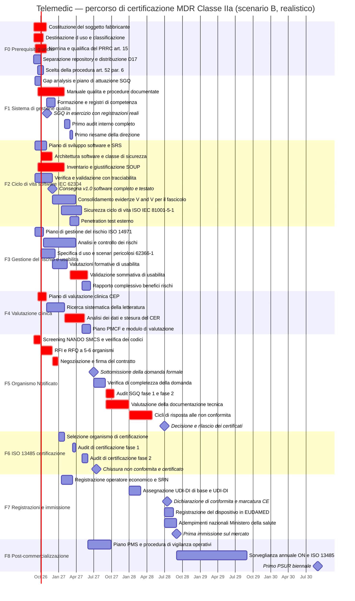

# Percorso operativo di certificazione

**Documento di ricerca — agente B9, seconda ondata**
**Data di redazione: 25 agosto 2026 — stato normativo accertato alla data**

---

## 0. Avvertenze preliminari

### 0.1 Disclaimer

> **Questo documento è un'analisi tecnica, non una consulenza regolatoria.**
> Non costituisce parere legale né sostituisce il giudizio di un consulente di *regulatory
> affairs* qualificato, di un'organizzazione di consulenza in dispositivi medici o
> dell'Organismo Notificato prescelto. Ogni passo, ogni durata e ogni costo indicati qui
> **devono essere confermati** (a) da un consulente regolatorio incaricato, (b) dall'Organismo
> Notificato con cui si stipulerà il contratto, (c) dall'organismo di certificazione che
> rilascerà il certificato ISO 13485. Il percorso di conformità è responsabilità esclusiva del
> fabbricante ai sensi dell'art. 10 del Regolamento (UE) 2017/745. Un errore nella
> determinazione della destinazione d'uso o della classe si paga con la ripetizione dell'intera
> valutazione di conformità.

### 0.2 Convenzioni di affidabilità usate nel documento

| Marcatore | Significato |
|---|---|
| **[FONTE PRIMARIA]** | Verificato su testo normativo, atto ufficiale o pagina istituzionale |
| **[FONTE SECONDARIA]** | Ricavato da fonte qualificata non istituzionale; da riverificare |
| **[NON VERIFICATO]** | Non confermato in questa ricerca. **Da verificare prima dell'uso** |
| **[ORDINE DI GRANDEZZA]** | Stima di costo o durata non basata su listino pubblico. **Richiedere preventivo** |
| **[PROPOSTA]** | Scelta progettuale suggerita da questo documento, non ancora decisa |

### 0.3 Perimetro e presupposti decisionali

Il documento presuppone come acquisite e non discute le decisioni **D12**, **D16**, **D17**
e **D20** del *context pack* (`.telemedic/context/00_PROJECT_BRIEF.md`, § 5-bis):

- il telemonitoraggio è **incluso** nel perimetro e la classificazione accettata è la
  **Classe IIa** ai sensi dell'MDR;
- al **30 novembre 2026** si consegna software completo, testato, con fascicolo tecnico
  avviato e sistema di gestione qualità in esercizio; la **marcatura CE è milestone autonoma**;
- il fabbricante adotta il **modello duale**: repository open source non-dispositivo +
  distribuzione identificata che è il dispositivo;
- questo documento è il deliverable richiesto da D20 e la sua collocazione finale è
  `docs/08_compliance/`.

L'analisi normativa di merito (qualificazione ai sensi dell'art. 2(1), testo e interpretazione
della Regola 11, contenuto delle norme tecniche, GDPR, licenze) è svolta in
[`R2-normativa-mdr-gdpr-licenze.md`](./R2-normativa-mdr-gdpr-licenze.md). **Qui non si ripete:
si esegue.** Il vincolo italiano che impone la certificazione come dispositivo medico per il
telemonitoraggio e per il *viewer*/refertazione è documentato in
[`R3-normativa-italiana.md`](./R3-normativa-italiana.md), § 4.6.

### 0.4 Il messaggio in una pagina

1. **Il fattore limitante non è lo sviluppo software: è l'Organismo Notificato.** I dati della
   XX indagine della Commissione europea (dati aggiornati a febbraio 2026) indicano che il
   **51 %** degli Organismi Notificati rispondenti impiega **13–18 mesi** dalla firma
   dell'accordo scritto al rilascio del certificato, e il **31 %** impiega **19–24 mesi**
   ([sintesi pubblica del *tracker*](https://eucertify.com/notified-body-availability/),
   **[FONTE SECONDARIA]** che rinvia all'indagine della Commissione). Team-NB, nella propria
   indagine 2025, riporta che le valutazioni «SGQ + prodotto» si collocano in maggioranza fra
   **13 e 18 mesi**, e registra per la prima volta in oltre un decennio una **contrazione
   dell'organico** degli ON (−8 % di personale interno, −21 % di subappaltatori)
   ([RAPS](https://www.raps.org/resource/team-nb-survey-shows-slowdown-in-growth-of-mdr-and-ivdr-certificates-issued-in-2025.html),
   [ECA Academy](https://www.gmp-compliance.org/gmp-news/survey-results-from-team-notified-body-on-the-mdr-and-ivdr)).
2. **Conseguenza aritmetica.** Anche firmando il contratto con l'ON entro dicembre 2026, il
   certificato non arriva prima di **gennaio 2028** nell'ipotesi più favorevole (13 mesi), e
   più verosimilmente fra **giugno 2028 e giugno 2029**. La finestra «2027» di D16 è
   raggiungibile **solo** in uno scenario compresso, con probabilità che questo documento
   valuta bassa. Il § 3 espone i tre scenari e i punti di decisione.
3. **Ciò che va fatto subito non è documentazione: sono tre atti giuridici.** Costituire il
   soggetto fabbricante, nominare il PRRC e congelare la destinazione d'uso. Senza questi tre,
   nessun Organismo Notificato apre un fascicolo e nessuna delle attività successive è
   difendibile.
4. **Il documento più costoso da sbagliare è la destinazione d'uso** (§ 4). Una singola frase
   sbagliata — «monitoraggio in tempo reale dei parametri vitali» invece di «raccolta
   differita di parametri per la revisione periodica del professionista» — sposta la
   classificazione dalla Classe IIa alla Classe IIb, la classe di sicurezza software da B a C,
   e aggiunge 12–18 mesi e un ordine di grandezza al costo.
5. **La valutazione clinica è il secondo collo di bottiglia** (§ 10). Non richiede
   un'indagine clinica per la Classe IIa, ma richiede un percorso documentale autonomo di
   6–9 mesi che deve partire **ora**, non dopo la consegna del software.

---

## 1. Che cosa esattamente si deve ottenere

Il traguardo «marcatura CE» non è un atto unico. È la conclusione di **cinque ottenimenti
distinti**, con prerequisiti incrociati:

| # | Ottenimento | Chi lo rilascia | Base giuridica |
|---|---|---|---|
| **A** | **Certificato SGQ** ai sensi dell'Allegato IX, Capo I | **Organismo Notificato** designato per i codici pertinenti | Art. 52(6) e Allegato IX, sez. 2 e 3, MDR |
| **B** | **Certificato di valutazione della documentazione tecnica** per almeno un dispositivo rappresentativo della categoria | **Organismo Notificato** (lo stesso) | Art. 52(6) e Allegato IX, sez. 4, MDR |
| **C** | **Dichiarazione di conformità UE** | **Il fabbricante** (atto proprio) | Art. 19 e Allegato IV MDR |
| **D** | **Marcatura CE con numero identificativo dell'ON** | **Il fabbricante** appone | Artt. 20 e 52(6) MDR |
| **E** | **Registrazioni**: SRN operatore economico, UDI-DI di base, registrazione del dispositivo in EUDAMED, adempimenti italiani | Fabbricante verso Commissione/EUDAMED e Ministero della salute | Artt. 27, 29, 31 MDR; d.lgs. 5 agosto 2022, n. 137 |

A questi si aggiunge, **non obbligatorio ma di fatto necessario**, l'ottenimento **F**: il
**certificato ISO 13485:2016** rilasciato da un organismo di certificazione accreditato,
che è cosa **diversa** dall'ottenimento A (§ 6.5).

**Errore concettuale da evitare fin dall'inizio.** L'ISO 13485 non «vale» come certificato
MDR. L'Organismo Notificato valuta il sistema di gestione della qualità **contro i requisiti
dell'art. 10(9) MDR e dell'Allegato IX**, non contro la ISO 13485. Il certificato ISO 13485
riduce l'attrito e accorcia l'audit dell'ON, ma non lo sostituisce.

### 1.1 La procedura di valutazione della conformità applicabile alla Classe IIa

L'**art. 52(6) MDR** offre al fabbricante di dispositivi di Classe IIa **due strade
alternative**:

- **Strada 1 (raccomandata per il software)** — valutazione della conformità basata sul
  **sistema di gestione della qualità**: Allegato IX, **Capo I** (valutazione del SGQ) e
  **Capo III** (disposizioni amministrative), **con in più** la valutazione della
  documentazione tecnica di cui alla **sezione 4** dell'Allegato IX per **almeno un
  dispositivo rappresentativo per ciascuna categoria di dispositivi**.
- **Strada 2** — redazione della documentazione tecnica degli **Allegati II e III** unita a
  una valutazione di conformità ai sensi dell'**Allegato XI** nella variante «garanzia di
  qualità della produzione» (Parte A) o «verifica del prodotto» (Parte B). L'art. 52(6) rinvia
  puntualmente alle sezioni dell'Allegato XI che disciplinano l'applicazione ai dispositivi di
  Classe IIa. **[FONTE SECONDARIA — i numeri di sezione dell'Allegato XI vanno riletti sul
  testo consolidato EUR-Lex prima di essere citati in un documento di progetto]**

> **Nota di correzione rispetto al mandato.** La combinazione «Allegato X + XI»
> (esame del tipo + verifica della conformità del prodotto) è la procedura prevista per la
> **Classe IIb** e la **Classe III**, non per la Classe IIa. Per la IIa l'alternativa
> all'Allegato IX è l'**Allegato XI**, senza esame del tipo.

**Perché si sceglie la Strada 1.** La verifica del prodotto dell'Allegato XI, Parte B, è
concepita per prodotti fabbricati in lotti: prevede l'esame di ogni prodotto o di campioni
statistici. Applicata a un software distribuito per *download*, produce un onere ricorrente
insensato. La garanzia di qualità della produzione (Parte A) è più praticabile ma comunque
lascia scoperta la parte di progettazione, che per un software è **tutto il prodotto**.
L'Allegato IX, Capo I, copre invece l'intero ciclo — progettazione, sviluppo, produzione,
sorveglianza post-commercializzazione — ed è la scelta universale nel software dispositivo
medico. **[PROPOSTA]** Adottare la Strada 1 e verbalizzarne la motivazione nel documento
`MDR-CAP-001 — Scelta della procedura di valutazione della conformità`.

Testo di riferimento: [Regolamento (UE) 2017/745, versione consolidata su
EUR-Lex](https://eur-lex.europa.eu/eli/reg/2017/745/oj).

---

## 2. Cosa fare nei primi 30 giorni

**Finestra: 25 agosto — 24 settembre 2026.**

Queste attività hanno tempi di attraversamento lunghi e **non comprimibili** e sono
prerequisito di tutto il resto. Ogni giorno di ritardo qui si traduce in un giorno di ritardo
sulla marcatura CE, senza possibilità di recupero a valle.

| # | Azione | Perché nei primi 30 giorni | Responsabile | Output | Entro |
|---|---|---|---|---|---|
| **1** | **Decidere e avviare la costituzione del soggetto giuridico fabbricante** (o identificare formalmente la persona fisica che assume il ruolo) | Nessun ON apre un fascicolo senza un fabbricante con partita IVA e sede nell'UE. La costituzione richiede notaio, statuto, iscrizione al Registro delle imprese: 3–8 settimane. È il collo di bottiglia più a monte | Committente + notaio/commercialista | Atto costitutivo, visura, P.IVA | 24 set. |
| **2** | **Congelare la bozza di destinazione d'uso** (§ 4) e sottoporla a revisione esterna | Da essa discendono classe MDR, classe IEC 62304, perimetro della valutazione clinica, codici NANDO da cercare. Cambiarla dopo aver ingaggiato l'ON costa una rivalutazione | Committente + consulente regolatorio | `MDR-IU-001` bozza r0 | 15 set. |
| **3** | **Redigere la determinazione di qualificazione e classificazione** (art. 2(1), Regola 11) | È il primo documento che l'ON chiede, e la Regola applicabile determina i codici di designazione da verificare in NANDO | Consulente regolatorio + PRRC designato | `MDR-CLS-001` | 24 set. |
| **4** | **Identificare il candidato PRRC** e verificarne la qualifica documentale (art. 15) | Se la qualifica non c'è internamente, va cercata sul mercato: i PRRC esterni qualificati sono una risorsa scarsa e con liste d'attesa | Committente | Lettera d'incarico bozza + CV + titoli | 24 set. |
| **5** | **Estrarre da NANDO/SMCS la lista degli ON designati** per i codici pertinenti e inviare una **RFI** a 5–6 di essi | Il tempo fra primo contatto e offerta è di settimane; il tempo fra offerta e contratto, secondo Team-NB, è inferiore a 2 mesi nel 66 % dei casi, ma la coda a monte non è misurata. Chi contatta a gennaio firma in estate | Committente + consulente | `ON-RFI-001` e registro dei contatti | 30 set. |
| **6** | **Avviare il piano di valutazione clinica (CEP)** | La ricerca sistematica della letteratura richiede 8–12 settimane e il CER ne richiede altre 8. Partire a marzo significa non avere il CER prima dell'autunno 2027 | Consulente clinico/*medical writer* | `CE-PLAN-001` bozza | 30 set. |
| **7** | **Istituire il controllo dei documenti** (ISO 13485 § 4.2.4) prima di produrre altri documenti | Un documento prodotto fuori dal controllo documentale va riemesso. Farlo dopo significa rifare tutto | Responsabile qualità | `QMS-PRO-001` Controllo dei documenti | 15 set. |
| **8** | **Formalizzare la separazione repository / distribuzione** (D17) e pubblicare il disclaimer | È una misura di tutela immediata: da oggi ogni artefatto pubblicato senza disclaimer è un rischio di *claim* non lecito (§ 15) | Committente + maintainer | `NOT-A-MEDICAL-DEVICE.md`, `DISTRIBUTION-POLICY.md` | 5 set. |
| **9** | **Congelare gli identificativi di requisito** `RF-*`, `RNF-*`, `BR-*` e istituire il registro | La tracciabilità IEC 62304 è retroattivamente irrecuperabile: se gli ID cambiano dopo, la matrice va ricostruita a mano | Architetto + responsabile qualità | `SW-REQ-REG-001` | 15 set. |
| **10** | **Avviare l'inventario SOUP** contestualmente alla prima build | Censire i SOUP a posteriori su un progetto maturo costa 3–5 volte tanto. La SBOM va generata dalla prima pipeline | Tech lead | `SW-SOUP-001` v0 + SBOM CycloneDX in CI | 24 set. |

**Regola di ingaggio per i primi 30 giorni.** Nessuna di queste attività è delegabile allo
sviluppo. Sono attività del committente e del futuro fabbricante. Se non c'è capacità per
farle in parallelo allo sviluppo di v1.0, la conseguenza corretta non è rinviarle: è
riconoscere che la marcatura CE slitta di un trimestre per ogni mese di ritardo su questo
blocco.

---

## 3. I tre scenari temporali e il calcolo all'indietro

### 3.1 I dati di partenza sui tempi dell'Organismo Notificato

| Dato | Valore | Fonte |
|---|---|---|
| Tempo dall'accordo scritto al certificato — 51 % degli ON | **13–18 mesi** | XX indagine della Commissione europea, dati a febbraio 2026 **[FONTE SECONDARIA]** |
| Idem — 31 % degli ON | **19–24 mesi** | *ibidem* |
| Valutazione «solo SGQ» | in prevalenza **6–12 mesi** | Indagine Team-NB 2025 **[FONTE SECONDARIA]** |
| Valutazione «SGQ + prodotto» (il nostro caso) | in prevalenza **13–18 mesi** | Indagine Team-NB 2025 |
| Tempo dal primo contatto alla firma del contratto | **< 2 mesi nel 66 % dei casi** | Indagine Team-NB 2025 |
| Divario domande MDR / certificati emessi a fine 2025 | 25 978 domande contro 13 953 certificati | Indagine Team-NB 2025 |
| Andamento dell'organico degli ON 2024→2025 | **−8 %** personale interno, **−21 %** subappaltatori | Indagine Team-NB 2025 |

**Lettura onesta di questi numeri.** Il divario fra domande e certificati non si chiuderà
prima del 2028 secondo la stessa analisi di settore. Un fabbricante nuovo, di micro
dimensione, con un dispositivo software di prima certificazione, **non è un cliente
prioritario** per un Organismo Notificato con capacità in contrazione. Questo va messo in
conto nella pianificazione e nella negoziazione contrattuale (§ 7.6).

### 3.2 Scenario A — compresso («2027», come da D16)

| Milestone | Data |
|---|---|
| Contratto con l'ON firmato | **30 novembre 2026** |
| Fascicolo tecnico completo e sottomesso | **28 febbraio 2027** |
| Audit SGQ in sito (fase 1 + fase 2) | **maggio 2027** |
| Chiusura delle non conformità | **settembre 2027** |
| Certificati Allegato IX | **dicembre 2027** |
| Dichiarazione di conformità e marcatura CE | **dicembre 2027** |

**Condizioni di realizzabilità, tutte necessarie:** (a) il contratto è firmato entro
novembre 2026, il che significa RFI inviata entro settembre 2026; (b) il fascicolo tecnico è
completo — *completo*, non «avviato» — a febbraio 2027, il che è in tensione diretta con la
consegna software del 30 novembre 2026 e con la validazione sommativa di usabilità;
(c) il sistema qualità ha già completato un ciclo di audit interno e riesame della direzione
entro aprile 2027; (d) il CER è chiuso entro febbraio 2027; (e) l'ON si colloca nel decile
più veloce (13 mesi) e non solleva non conformità maggiori. **Probabilità stimata: bassa.**
**[PROPOSTA]** Trattare lo scenario A come obiettivo di tensione, non come piano.

### 3.3 Scenario B — realistico (piano di riferimento)

| Milestone | Data |
|---|---|
| Contratto con l'ON firmato | **31 dicembre 2026** |
| Certificato ISO 13485 | **luglio 2027** |
| Fascicolo tecnico completo e sottomesso all'ON | **30 giugno 2027** |
| Verifica di completezza superata | **31 agosto 2027** |
| Audit SGQ in sito | **settembre – ottobre 2027** |
| Valutazione della documentazione tecnica | **settembre – dicembre 2027** |
| Cicli di risposta alle non conformità | **gennaio – aprile 2028** |
| Certificati Allegato IX | **giugno 2028** |
| Dichiarazione di conformità, marcatura CE, EUDAMED | **luglio – agosto 2028** |

Durata dalla firma del contratto al certificato: **18 mesi**, cioè il limite superiore della
fascia maggioritaria. È il piano su cui è costruito il diagramma del § 3.5 e la tabella
cronologica del § 5.

### 3.4 Scenario C — conservativo

Contratto ON a marzo 2027 (perché il fabbricante non è ancora costituito a dicembre 2026, o
perché i primi ON contattati non accettano nuovi clienti), 22 mesi di valutazione, due cicli
di non conformità maggiori sulla valutazione clinica: **certificati a gennaio 2029, marcatura
CE nel primo trimestre 2029.**

### 3.5 Diagramma di Gantt — scenario B (piano di riferimento)

### 3.6 Punti di decisione irreversibili

| Data | Decisione | Se non presa entro quella data |
|---|---|---|
| **30 set. 2026** | RFI inviata agli ON | Lo scenario A decade automaticamente |
| **31 ott. 2026** | Destinazione d'uso congelata | Il CEP e il file di rischio ripartono da capo |
| **31 dic. 2026** | Contratto ON firmato | Lo scenario B slitta a C |
| **31 mar. 2027** | Protocollo di validazione sommativa approvato | La sommativa non chiude entro giugno 2027 |
| **30 giu. 2027** | Fascicolo tecnico sottomesso | Ogni mese di ritardo è un mese sul certificato, senza recupero |

---

## 4. Destinazione d'uso e determinazione formale della classe

### 4.1 Perché questo è il documento più importante del progetto

La destinazione d'uso (*intended purpose*) è definita dall'**art. 2, punto 12, MDR** come
l'uso al quale il dispositivo è destinato secondo le indicazioni fornite dal fabbricante
nell'etichetta, nelle istruzioni per l'uso, nel materiale promozionale o di vendita e nelle
dichiarazioni del fabbricante stesso. Da essa discendono, in cascata e senza eccezioni:

1. la **qualificazione** come dispositivo medico ai sensi dell'art. 2(1);
2. la **classe di rischio** ai sensi dell'Allegato VIII (per il software, Regola 11);
3. il perimetro dei **requisiti generali di sicurezza e prestazione** applicabili
   (Allegato I);
4. il perimetro della **valutazione clinica** (art. 61 e Allegato XIV): il beneficio clinico
   da dimostrare è quello dichiarato nella destinazione d'uso, né più né meno;
5. la **specifica d'uso** e gli scenari da validare ai sensi di IEC 62366-1 § 5.1;
6. l'**analisi del rischio**: ISO 14971 § 5.2 impone di partire proprio da destinazione d'uso
   e uso improprio ragionevolmente prevedibile;
7. la **classe di sicurezza software** IEC 62304, che dipende dal danno possibile, che dipende
   da che cosa il software è dichiarato fare;
8. i **codici di designazione** che l'Organismo Notificato deve possedere.

**Il costo dell'errore.** Una destinazione d'uso troppo ampia allarga tutto: più GSPR, più
evidenza clinica, più scenari di usabilità, classe superiore. Una destinazione d'uso troppo
stretta rispetto a quello che il prodotto fa realmente è **falsa** e viene rilevata dall'ON
al primo confronto con l'interfaccia utente e con il materiale promozionale, con esito di
non conformità maggiore. La regola operativa è: **dichiarare esattamente ciò che il prodotto
fa, e progettare il prodotto perché faccia esattamente ciò che si vuole dichiarare.**

### 4.2 Le due leve che determinano la Classe IIa e non la IIb

Il testo della **Regola 11, Allegato VIII, MDR** contiene due commi con soglie diverse:

- **Comma 1 — software che fornisce informazioni usate per assumere decisioni a fini
  diagnostici o terapeutici**: Classe IIa, salvo che tali decisioni possano causare il decesso
  o un deterioramento irreversibile dello stato di salute (Classe III) oppure un grave
  deterioramento dello stato di salute o un intervento chirurgico (Classe IIb).
- **Comma 2 — software destinato al monitoraggio di processi fisiologici**: Classe IIa, salvo
  che sia destinato al monitoraggio di **parametri fisiologici vitali** in cui la natura delle
  variazioni di tali parametri **potrebbe comportare un pericolo immediato per il paziente**,
  nel qual caso è Classe IIb.
- **Comma 3** — tutto il resto è Classe I.

Riferimento interpretativo: **MDCG 2021-24 rev.1** (*Guidance on classification of medical
devices*, revisione dell'aprile 2026 **[FONTE SECONDARIA sulla data della revisione]**) e
**MDCG 2019-11 rev.1** (giugno 2025), reperibili nella
[raccolta ufficiale MDCG della Commissione](https://health.ec.europa.eu/medical-devices-sector/new-regulations/guidance-mdcg-endorsed-documents-and-other-guidance_en).

**Conseguenza operativa e vincolante.** Con il telemonitoraggio nel perimetro (D12), la
Classe IIa regge **solo se** la destinazione d'uso esclude in modo esplicito, verificabile e
coerente con il prodotto:

- il monitoraggio **in tempo reale** di parametri vitali di pazienti in condizioni critiche o
  instabili;
- la **generazione di allarmi con finalità di emergenza** o di soccorso;
- l'uso come **unico** o **primario** mezzo di sorveglianza di un paziente;
- la **generazione autonoma di informazione clinica** non redatta dal professionista
  (cfr. vincolo **V2** del *context pack*).

Se anche una sola di queste esclusioni cade, si passa alla **Classe IIb** con conseguenze a
cascata: valutazione della documentazione tecnica su base campionaria diversa, classe di
sicurezza software C, evidenza clinica più stringente, costi e tempi superiori.

### 4.3 Traccia della dichiarazione di destinazione d'uso

**[PROPOSTA]** — Documento `MDR-IU-001`. Testo da sottoporre a revisione del consulente
regolatorio e dell'ON. **Non è un testo definitivo: è una traccia strutturata.**

> **1. Denominazione del dispositivo.** *Telemedic Clinical Distribution* — distribuzione
> identificata, versionata e sottoposta a controllo qualità del software Telemedic. Il codice
> sorgente pubblicato con licenza Apache-2.0 nel repository pubblico **non è** il dispositivo
> e non è oggetto della presente dichiarazione.
>
> **2. Destinazione d'uso.** *Telemedic Clinical Distribution* è un software dispositivo
> medico destinato a supportare l'erogazione a distanza di prestazioni sanitarie
> programmate — televisita, teleconsulto e teleconsulenza, teleassistenza e telemonitoraggio
> — mediante: (a) l'instaurazione di una sessione di comunicazione audio-video cifrata fra
> professionista sanitario e paziente, o fra professionisti sanitari; (b) la raccolta, la
> trasmissione, la conservazione e la presentazione al professionista sanitario di parametri
> clinici misurati da dispositivi medici di terzi e di dati inseriti dal paziente o dal
> *caregiver*; (c) la messa a disposizione del professionista sanitario di tali dati in forma
> tabellare e grafica, con evidenziazione dei valori che ricadono al di fuori di intervalli
> di riferimento **definiti dal professionista sanitario stesso** per il singolo paziente;
> (d) la registrazione strutturata e la trasmissione ai sistemi informativi sanitari del
> contenuto clinico **redatto e firmato dal professionista sanitario**.
>
> **3. Indicazione d'uso.** Il dispositivo è destinato all'impiego nell'ambito di percorsi
> assistenziali programmati (PAI/PDTA), di percorsi di *follow-up* di patologia nota e di
> programmi di monitoraggio di pazienti **clinicamente stabili**, secondo le condizioni di
> erogabilità stabilite dall'Accordo Stato-Regioni 17 dicembre 2020, rep. atti n. 215/CSR.
>
> **4. Utilizzatori previsti.** (a) Medici chirurghi abilitati; (b) esercenti le professioni
> sanitarie non mediche abilitati; (c) pazienti e *caregiver* come utilizzatori laici, per
> le sole funzioni di partecipazione alla sessione, di trasmissione dei parametri e di
> consultazione dei propri dati; (d) personale tecnico del Centro servizi. Il dispositivo
> presuppone che il professionista sanitario possieda la competenza clinica necessaria a
> valutare autonomamente l'adeguatezza del canale e la significatività dei dati presentati.
>
> **5. Popolazione di pazienti.** Pazienti adulti e pediatrici in condizioni cliniche stabili,
> per i quali un professionista sanitario abbia stabilito l'appropriatezza dell'erogazione a
> distanza. Il dispositivo non è destinato a pazienti in condizioni acute, instabili o
> critiche.
>
> **6. Ambiente d'uso.** Domicilio del paziente, struttura sanitaria, ambulatorio, studio
> professionale, con connettività di rete conforme ai requisiti minimi dichiarati nelle
> istruzioni per l'uso.
>
> **7. Principio di funzionamento.** Software applicativo eseguito su hardware informatico
> generico non dedicato, senza parti applicate, che non esercita alcuna azione fisica,
> chimica o farmacologica sul corpo umano; l'azione si esaurisce nel trattamento, nella
> trasmissione e nella presentazione di informazioni.
>
> **8. Beneficio clinico dichiarato.** Consentire l'accesso a prestazioni sanitarie
> programmate a pazienti per i quali l'accesso in presenza è oneroso o non tempestivo,
> mantenendo la completezza e la tracciabilità dell'informazione clinica trasmessa al
> professionista. **[Il beneficio clinico è ciò che la valutazione clinica deve dimostrare:
> ogni parola aggiunta qui è evidenza in più da produrre.]**
>
> **9. Controindicazioni ed esclusioni esplicite dalla destinazione d'uso.** Il dispositivo
> **non è destinato**:
> - al monitoraggio continuo e in tempo reale di parametri fisiologici vitali di pazienti in
>   condizioni critiche o instabili;
> - alla generazione di allarmi destinati all'attivazione di interventi di emergenza o di
>   soccorso; il dispositivo non è un sistema di allarme e non sostituisce i servizi di
>   emergenza sanitaria;
> - a costituire l'unico o il principale mezzo di sorveglianza clinica di un paziente;
> - alla generazione autonoma di diagnosi, prognosi, raccomandazioni terapeutiche o
>   punteggi di rischio; ogni contenuto clinico è redatto e sottoscritto da un professionista
>   sanitario;
> - all'interpretazione diagnostica di immagini medicali; il modulo di visualizzazione dei
>   dati clinici non è destinato alla refertazione radiologica né istopatologica;
> - all'uso in sostituzione della prima visita medica in presenza, salvo diversa decisione
>   documentata del medico responsabile;
> - all'uso in ambiente sterile, in sala operatoria o in continuità di funzioni vitali.
>
> **10. Limiti d'uso e requisiti dell'ambiente operativo.** Le soglie minime di banda,
> latenza (RTT), *packet loss* e *jitter* al di sotto delle quali il dispositivo segnala la
> degradazione e sconsiglia la prosecuzione della prestazione sono dichiarate in
> `MDR-ENV-001` e costituiscono parte integrante della destinazione d'uso ai sensi di
> IEC 82304-1 § 7.

### 4.4 La determinazione di qualificazione e classificazione

**[PROPOSTA]** — Documento `MDR-CLS-001`. Struttura minima richiesta dall'ON:

| § | Contenuto | Nota |
|---|---|---|
| 1 | Riferimento a `MDR-IU-001` nella revisione esatta | La classificazione è valida solo per quella revisione |
| 2 | **Qualificazione ai sensi dell'art. 2(1)**: verifica puntuale di ciascun elemento della definizione — software, destinato dal fabbricante a essere impiegato sull'uomo, per una o più finalità mediche specifiche fra quelle elencate, che non esercita l'azione principale cui è destinato mediante mezzi farmacologici, immunologici o metabolici | Motivare la finalità medica: «diagnosi, prevenzione, monitoraggio, previsione, prognosi, trattamento o attenuazione di malattie» |
| 3 | Applicazione dell'albero decisionale di **MDCG 2019-11 rev.1** con esito di ciascun nodo | L'ON verifica che l'albero sia stato percorso, non solo la conclusione |
| 4 | Verifica di **tutte** le regole dell'Allegato VIII, non solo della Regola 11, con esito motivato per ciascuna | Errore frequente: fermarsi alla Regola 11. Vanno considerate anche le regole 9, 10, 12, 13, 15, 22 e le regole di implementazione (Allegato VIII, Capo II) |
| 5 | **Applicazione della Regola 11**, comma per comma, con la motivazione dell'esclusione delle soglie di IIb e III | È il cuore del documento |
| 6 | Applicazione della **regola di implementazione 3.5** (in caso di più regole applicabili, si applica la più rigorosa) e della **3.3** (il software che comanda o influenza l'uso di un dispositivo rientra nella stessa classe del dispositivo; il software indipendente è classificato autonomamente) | **[FONTE SECONDARIA sui numeri delle regole di implementazione: verificare sull'Allegato VIII, Capo II]** |
| 7 | **Esito**: Classe IIa, Regola 11 comma 1 e comma 2 | |
| 8 | **Condizioni di validità della classificazione** e trigger di riesame | Elencare le modifiche che obbligano a riclassificare: nuova funzione di allarme, algoritmi che generano informazione clinica, estensione a pazienti instabili |
| 9 | Firma del PRRC e data | |

### 4.5 Il vincolo italiano che rende non opzionale questa scelta

Il **DM 21 settembre 2022** (GU Serie generale n. 256 del 2 novembre 2022, atto 22A06184,
Allegato A, Sezione 2) impone espressamente che «la Infrastruttura regionale di telemedicina
per il servizio minimo di telemonitoraggio debba essere certificata come dispositivo medico»
e, per il telemonitoraggio avanzato di livello 2, che «potrebbe essere richiesta una classe di
rischio superiore alla IIa». Analogamente prescrive la certificazione come dispositivo medico
del *viewer* dati clinici e del modulo di refertazione nei teleconsulti istopatologici e
radiologici. Dettaglio testuale in [`R3-normativa-italiana.md`](./R3-normativa-italiana.md),
§ 4.6.

**Lettura operativa.** L'esclusione della refertazione diagnostica su immagini dalla
destinazione d'uso (§ 4.3, punto 9) non è una rinuncia commerciale gratuita: è la scelta che
mantiene la classe a IIa. Se in futuro si vorrà entrare nel teleconsulto radiologico, si
tratterà di una **estensione sostanziale** che richiede una nuova valutazione dell'ON
(§ 14.3), non di un aggiornamento di prodotto.

---

## 5. Tabella cronologica dei passi

Legenda dei responsabili: **CMT** committente/fabbricante · **PRRC** persona responsabile del
rispetto della normativa · **RQ** responsabile qualità · **RA** consulente *regulatory
affairs* · **TL** *tech lead* / architetto · **UX** specialista di *human factors* ·
**MW** *medical writer* clinico · **SEC** specialista di sicurezza · **ON** Organismo
Notificato · **OC** organismo di certificazione ISO 13485.

Tutti i costi sono **[ORDINE DI GRANDEZZA]**: vedi § 16 per la base delle stime e per la
procedura di richiesta preventivi.

### 5.1 Fase 0 — Prerequisiti giuridici (25 ago — 31 ott 2026)

| Attività | Prerequisito | Output documentale | Durata | Resp. | Costo indicativo |
|---|---|---|---|---|---|
| Costituzione o identificazione del soggetto fabbricante | Decisione sul modello societario | Atto costitutivo, visura, P.IVA, `MDR-FAB-001` Identificazione del fabbricante | 4–8 sett. | CMT | 2–5 k€ (notaio, diritti, commercialista) |
| Determinazione della destinazione d'uso | — | `MDR-IU-001` r1 | 3–6 sett. | CMT+RA | incluso nel forfait RA |
| Determinazione di qualificazione e classificazione | `MDR-IU-001` | `MDR-CLS-001` | 2–4 sett. | RA+PRRC | 3–6 k€ |
| Scelta della procedura di valutazione della conformità | `MDR-CLS-001` | `MDR-CAP-001` | 1 sett. | RA | incluso |
| Nomina del PRRC e verifica della qualifica | Fabbricante costituito | `MDR-PRRC-001` incarico + dossier di qualifica | 4–8 sett. | CMT | vedi § 12 |
| Separazione formale repository / distribuzione | D17 | `NOT-A-MEDICAL-DEVICE.md`, `DISTRIBUTION-POLICY.md`, `MDR-DIST-001` | 2–4 sett. | CMT+TL | interno |
| Mandato al consulente regolatorio | — | Contratto | 2–3 sett. | CMT | vedi § 16 |

### 5.2 Fase 1 — Sistema di gestione della qualità (1 set 2026 — 15 mar 2027)

| Attività | Prerequisito | Output documentale | Durata | Resp. | Costo indicativo |
|---|---|---|---|---|---|
| *Gap analysis* rispetto a ISO 13485 e art. 10(9) MDR | Fabbricante costituito | `QMS-GAP-001` | 3–4 sett. | RA+RQ | 3–5 k€ |
| Politica e obiettivi per la qualità, organigramma, matrice responsabilità | *Gap analysis* | `QMS-MAN-001` Manuale della qualità | 4 sett. | RQ | — |
| Redazione delle procedure documentate (§ 6.3) | Manuale | `QMS-PRO-001`…`QMS-PRO-0nn` | 12–16 sett. | RQ+RA | vedi § 16 |
| Validazione del software usato nel SGQ (ISO 13485 § 4.1.6) | Elenco strumenti | `QMS-VAL-001` Validazione degli strumenti | 3–4 sett. | RQ+TL | interno |
| Formazione del personale e registri di competenza | Procedure approvate | `QMS-REC-COMP` | 2–3 sett. | RQ | interno |
| **Avvio in esercizio del SGQ** | Procedure rilasciate | Registrazioni reali dal 2 nov 2026 | milestone | RQ | — |
| Primo audit interno completo | ≥ 3 mesi di registrazioni | `QMS-AUD-INT-001` | 3–4 sett. | RQ (o auditor esterno) | 2–4 k€ se esterno |
| Primo riesame della direzione | Audit interno | `QMS-RIE-001` verbale | 1–2 sett. | CMT+RQ | interno |

### 5.3 Fase 2 — Ciclo di vita software IEC 62304 (1 set 2026 — 30 apr 2027)

| Attività | Prerequisito | Output documentale | Durata | Resp. | Costo indicativo |
|---|---|---|---|---|---|
| Piano di sviluppo software | `MDR-IU-001`, procedura di progettazione | `SW-DEV-PLAN-001` | 3 sett. | TL+RQ | interno |
| Specifica dei requisiti software | Requisiti di sistema, ID congelati | `SW-SRS-001` + `SW-REQ-REG-001` | 6–8 sett. | TL | interno |
| Determinazione della classe di sicurezza software e segregazione | File di rischio v0 | `SW-CLS-001` | 3 sett. | TL+RQ | interno |
| Descrizione dell'architettura software con interfacce e SOUP | SRS | `SW-SAD-001` | 6–8 sett. | TL | interno |
| Inventario, giustificazione e sorveglianza dei SOUP | Prima build, SBOM | `SW-SOUP-001` + SBOM CycloneDX firmata | 10–14 sett. poi continuo | TL | interno + strumenti |
| Piano e specifiche di verifica e validazione | SRS, SAD | `SW-VVP-001` | 4 sett. | TL | interno |
| Esecuzione di V&V e matrice di tracciabilità generata in CI | Codice | `SW-VVR-001`, `SW-TRACE-001` | continuo | TL | interno |
| Procedura di gestione della configurazione e di rilascio | — | `SW-CM-001`, `SW-REL-001` | 3 sett. | TL+RQ | interno |
| Piano di manutenzione e risoluzione dei problemi | — | `SW-MAINT-001`, `SW-PROB-001` | 3 sett. | TL+RQ | interno |
| Attività di sicurezza del ciclo di vita ISO/IEC 81001-5-1 | SAD, *threat model* | `SEC-LC-001`, `SEC-TM-001`, `SEC-RMF-001` | 10–14 sett. | SEC+TL | vedi § 16 |
| Penetration test esterno indipendente | Ambiente di *staging* stabile | `SEC-PT-001` rapporto + piano di rimedio | 3–6 sett. | fornitore esterno | 12–30 k€ |
| Requisiti dell'ambiente operativo (IEC 82304-1 § 7) | Metriche di qualità | `MDR-ENV-001` | 2 sett. | TL | interno |

### 5.4 Fase 3 — Rischio e usabilità (1 set 2026 — 15 giu 2027)

| Attività | Prerequisito | Output documentale | Durata | Resp. | Costo indicativo |
|---|---|---|---|---|---|
| Piano di gestione del rischio con criteri di accettabilità | `MDR-IU-001` | `RM-PLAN-001` | 3 sett. | RQ+RA | interno |
| Analisi del rischio, stima, ponderazione, controllo | Piano | `RM-FILE-001` (registro dei rischi) | 20–24 sett. | RQ+TL+PRRC | interno |
| Verifica dell'attuazione e dell'efficacia delle misure di controllo | Misure implementate | Evidenze in `SW-VVR-001`, aggiornamento `RM-FILE-001` | continuo | TL | interno |
| Valutazione del rischio residuo complessivo e rapporto benefici-rischi | CER bozza | `RM-REP-001` | 4–6 sett. | RQ+PRRC+MW | interno |
| Specifica d'uso e identificazione degli scenari d'uso pericolosi | `MDR-IU-001` | `UE-SPEC-001`, `UE-HAZ-001` | 8–10 sett. | UX+RQ | vedi § 16 |
| Piano di validazione dell'usabilità | Scenari selezionati | `UE-PLAN-001` | 3 sett. | UX | — |
| Valutazioni formative | Prototipi | `UE-FORM-001` | 8–10 sett. | UX | vedi § 11 |
| **Validazione sommativa** | Interfaccia congelata, protocollo approvato | `UE-SUM-001` rapporto | 12–14 sett. | UX | vedi § 11 |
| Fascicolo di ingegneria dell'usabilità consolidato | Tutti i precedenti | `UEF-001` | 2 sett. | UX+RQ | — |

### 5.5 Fase 4 — Valutazione clinica (15 set 2026 — 15 giu 2027)

| Attività | Prerequisito | Output documentale | Durata | Resp. | Costo indicativo |
|---|---|---|---|---|---|
| Piano di valutazione clinica | `MDR-IU-001`, `MDR-CLS-001` | `CE-PLAN-001` | 5–6 sett. | MW+RA | vedi § 16 |
| Definizione dello stato dell'arte e dei parametri clinici | CEP | Sezione di `CE-PLAN-001` | incluso | MW | — |
| Ricerca sistematica della letteratura con protocollo e appraisal | CEP approvato | `CE-LIT-001` protocollo + `CE-LIT-002` risultati | 12–14 sett. | MW | — |
| Valutazione dell'eventuale equivalenza (§ 10.4) | Candidati identificati | `CE-EQ-001` + contratto di accesso alla documentazione | 6–10 sett. | RA+legale | incerto |
| Analisi dei dati clinici e stesura del rapporto | Letteratura, dati di V&V, usabilità, PMS | `CE-REP-001` (CER) | 12–14 sett. | MW+PRRC | vedi § 16 |
| Piano di *follow-up* clinico post-commercializzazione | CER | `PMCF-PLAN-001` | 4–6 sett. | MW+RA | — |

### 5.6 Fase 5 — Organismo Notificato (25 ago 2026 — 30 giu 2028)

| Attività | Prerequisito | Output documentale | Durata | Resp. | Costo indicativo |
|---|---|---|---|---|---|
| Screening NANDO/SMCS e verifica dei codici di designazione | `MDR-CLS-001` bozza | `ON-SCR-001` matrice di confronto | 3–5 sett. | RA+CMT | interno |
| Invio RFI e richiesta di offerta a 5–6 ON | Screening | `ON-RFI-001`, offerte ricevute | 8–10 sett. | CMT | interno |
| Valutazione delle offerte, verifica della disponibilità reale, negoziazione | Offerte | `ON-SEL-001` verbale di selezione motivato | 4 sett. | CMT+RA | interno |
| **Firma del contratto** | Selezione | Contratto | 2–4 sett. | CMT | quota di attivazione |
| Sottomissione della domanda formale con fascicolo tecnico e dossier SGQ | Fascicolo completo | Domanda + `MDR-TD-001` | 2 sett. | PRRC+RQ | vedi § 16 |
| Verifica di completezza da parte dell'ON | Domanda | Esito, eventuale richiesta di integrazione | 6–8 sett. | ON | incluso |
| Audit del SGQ, fase 1 (documentale) e fase 2 (in sito) | SGQ con ≥ 6 mesi di registrazioni, audit interno e riesame effettuati | Rapporto di audit, elenco non conformità | 4–6 sett. | ON | vedi § 16 |
| Valutazione della documentazione tecnica (Allegato IX, sez. 4) | Fascicolo | Rapporto di valutazione, quesiti | 12–18 sett. | ON | vedi § 16 |
| Cicli di risposta alle non conformità e ai quesiti | Rapporti | Risposte documentate, azioni correttive | 2–4 cicli × 6–10 sett. | PRRC+RQ+TL | costo di rilavorazione |
| Decisione e rilascio dei certificati | Chiusura di tutte le NC | Certificato SGQ + certificato di valutazione della documentazione tecnica | 4–8 sett. | ON | incluso |

### 5.7 Fase 6 — Certificazione ISO 13485 (gen — lug 2027)

| Attività | Prerequisito | Output documentale | Durata | Resp. | Costo indicativo |
|---|---|---|---|---|---|
| Selezione dell'organismo di certificazione accreditato | SGQ in esercizio | Contratto | 4 sett. | CMT+RQ | — |
| Audit di certificazione, fase 1 | Documentazione SGQ completa | Rapporto fase 1 | 1–2 gg. audit | OC | vedi § 16 |
| Chiusura dei rilievi di fase 1 | Rapporto | Azioni | 4–6 sett. | RQ | — |
| Audit di certificazione, fase 2 | Registrazioni operative | Rapporto fase 2, non conformità | 2–4 gg. audit | OC | vedi § 16 |
| Chiusura delle non conformità e rilascio del certificato | Azioni correttive verificate | Certificato ISO 13485:2016, validità 3 anni | 6–10 sett. | RQ | — |

### 5.8 Fase 7 — Registrazioni e immissione sul mercato (gen 2027 — set 2028)

| Attività | Prerequisito | Output documentale | Durata | Resp. | Costo indicativo |
|---|---|---|---|---|---|
| Registrazione dell'operatore economico in EUDAMED e ottenimento dell'SRN | Fabbricante costituito, PRRC nominato | SRN | 4–8 sett. (dipende dalla convalida dell'autorità) | PRRC | nessuna tariffa nota |
| Assegnazione del **UDI-DI di base** e del **UDI-DI** presso un ente di attribuzione | Definizione del dispositivo e delle versioni | `UDI-001` registro UDI | 4–6 sett. | PRRC | canone annuo dell'ente di attribuzione |
| Redazione della dichiarazione di conformità UE | Certificati ON | `MDR-DOC-001` (Allegato IV) | 1–2 sett. | PRRC | — |
| Apposizione della marcatura CE con il numero dell'ON | DoC | Artefatti di rilascio, IFU, etichettatura elettronica | 1–2 sett. | TL+PRRC | — |
| Registrazione del dispositivo in EUDAMED | UDI-DI di base, certificati, DoC | Registrazione | 2–4 sett. | PRRC | nessuna tariffa nota |
| Adempimenti nazionali verso il Ministero della salute | Registrazione EUDAMED | Vedi § 13.3 | 4–8 sett. | PRRC | tariffe nazionali da verificare |
| Prima immissione sul mercato | Tutto quanto sopra | — | milestone | CMT | — |

### 5.9 Fase 8 — Post-commercializzazione (continuativa)

| Attività | Periodicità | Output documentale | Resp. |
|---|---|---|---|
| Raccolta e analisi dei dati di sorveglianza | continua | `PMS-DATA-*` | PRRC+RQ |
| Aggiornamento del piano PMS | annuale o su evento | `PMS-PLAN-001` | PRRC |
| **PSUR** | **almeno ogni 2 anni** (Classe IIa) | `PSUR-00n` | PRRC |
| Rapporto PMCF | secondo `PMCF-PLAN-001` | `PMCF-REP-00n` | MW |
| Aggiornamento del CER | secondo il CEP, tipicamente ogni 2–5 anni | `CE-REP-00n` | MW |
| Segnalazione di incidenti gravi e FSCA | su evento, entro i termini dell'art. 87 | Moduli MIR, `VIG-*` | PRRC |
| Audit di sorveglianza dell'ON | almeno annuale | Rapporto | ON |
| Audit di sorveglianza ISO 13485 | annuale, con rinnovo triennale | Rapporto | OC |
| Riesame della direzione | almeno annuale | `QMS-RIE-00n` | CMT |
| Aggiornamento della SBOM e della sorveglianza SOUP | a ogni rilascio | `SW-SOUP-001` | TL |

---

## 6. Sistema di gestione della qualità ISO 13485:2016

### 6.1 Che cosa richiede l'MDR, che è cosa diversa dalla ISO 13485

L'**art. 10(9) MDR** impone al fabbricante di istituire, documentare, applicare, mantenere,
aggiornare e migliorare costantemente un sistema di gestione della qualità che assicuri la
conformità nel modo più efficace e proporzionato alla classe di rischio e al tipo di
dispositivo. La norma elenca gli elementi che il SGQ deve affrontare, fra i quali: la
strategia di conformità regolamentare (comprese le procedure di valutazione della conformità
e di gestione delle modifiche), l'identificazione dei requisiti generali di sicurezza e
prestazione applicabili, la responsabilità della direzione, la gestione delle risorse
(compresa la selezione e il controllo dei fornitori e dei subappaltatori), la gestione del
rischio, la valutazione clinica e il PMCF, la realizzazione del prodotto, la verifica
dell'attribuzione dell'UDI, la sorveglianza post-commercializzazione, la comunicazione con le
autorità e gli organismi notificati, la segnalazione di incidenti gravi e FSCA, la gestione
delle azioni correttive e preventive e il monitoraggio della loro efficacia, i processi di
monitoraggio e misurazione, l'analisi dei dati e il miglioramento del prodotto.

**EN ISO 13485:2016** (con A11:2021) è **norma armonizzata** sotto MDR: il riferimento è
pubblicato nell'allegato della **Decisione di esecuzione (UE) 2021/1182 del 16 luglio 2021**,
successivamente modificata più volte (la
[pagina consolidata della Commissione](https://single-market-economy.ec.europa.eu/single-market/european-standards/harmonised-standards/medical-devices_en)
elenca modifiche fino al 1° aprile 2026). Applicarla conferisce **presunzione di conformità**
per i requisiti coperti (art. 8 MDR). **Ma la copertura non è totale:** ISO 13485 non copre di
per sé la valutazione clinica ai sensi dell'art. 61, la sorveglianza
post-commercializzazione nella forma richiesta dagli artt. 83–86, né gli obblighi di
vigilanza degli artt. 87–92. Occorrono procedure MDR-specifiche in aggiunta (§ 6.3, blocco C).

### 6.2 Come si costruisce un SGQ da zero in una realtà piccola

**Sequenza raccomandata [PROPOSTA], 5 mesi di elaborazione + 4 mesi di esercizio prima
dell'audit.**

1. **Definire il perimetro e le esclusioni** (ISO 13485 § 1 e § 7.1). Un fabbricante di
   software senza produzione fisica esclude tipicamente: § 6.4.2 controllo della
   contaminazione, § 7.5.2 pulizia del prodotto, § 7.5.5 requisiti particolari per i
   dispositivi sterili, § 7.5.7 validazione dei processi di sterilizzazione, § 7.6 controllo
   dei dispositivi di misurazione. **Ogni esclusione va motivata per iscritto**: l'auditor la
   contesta se la motivazione è generica.
2. **Non scrivere un manuale enciclopedico.** Il rischio tipico della micro-impresa è un SGQ
   troppo grande per essere rispettato. Le non conformità in audit nascono quasi sempre dallo
   scarto fra procedura scritta e prassi reale, non da procedure mancanti. Regola pratica:
   **se una procedura descrive un'attività che non si intende svolgere davvero ogni volta, va
   riscritta**, non aggirata.
3. **Sfruttare l'infrastruttura già esistente.** Il progetto ha già controllo di versione,
   revisione fra pari obbligatoria, CI con *gate* automatici, *issue tracker*, SBOM. Un SGQ
   *docs-as-code* — procedure versionate nel repository, approvazione via *pull request* con
   revisori nominati, immutabilità garantita dalla protezione dei rami e dalla firma dei
   *commit* — soddisfa ISO 13485 § 4.2.4 e § 4.2.5 in modo più robusto di un archivio di
   documenti Word. **Va però validato** ai sensi del § 4.1.6 (validazione del software usato
   nel SGQ) e va scritta la procedura che spiega all'auditor come la corrispondenza fra
   *commit*, revisione e approvazione costituisce la registrazione di approvazione.
4. **Nominare formalmente il rappresentante della direzione** (§ 5.5.2). In una micro-impresa
   può coincidere con il PRRC, purché non si crei un conflitto sull'indipendenza dell'audit
   interno: **l'audit interno non può essere svolto da chi ha eseguito l'attività auditata**
   (§ 8.2.4). In pratica: l'audit interno va commissionato all'esterno.
5. **Far girare il sistema per almeno un ciclo completo prima dell'audit di certificazione.**
   Un ciclo completo significa: registrazioni reali di progettazione e sviluppo, almeno un
   riesame di progettazione, almeno una CAPA, almeno un rilascio controllato, un audit interno
   su tutti i processi e un riesame della direzione. **Senza questi, la fase 2 non è
   superabile.** Da qui la data del 2 novembre 2026 come avvio dell'esercizio e maggio 2027
   come prima data utile di fase 2.

### 6.3 Procedure documentate indispensabili

**Blocco A — obbligatorie per esplicito richiamo di ISO 13485:2016**

| ID **[PROPOSTA]** | Titolo | Clausola |
|---|---|---|
| `QMS-PRO-001` | Controllo dei documenti | 4.2.4 |
| `QMS-PRO-002` | Controllo delle registrazioni | 4.2.5 |
| `QMS-PRO-003` | Riesame della direzione | 5.6.1 |
| `QMS-PRO-004` | Risorse umane, competenza, formazione, consapevolezza | 6.2 |
| `QMS-PRO-005` | Infrastruttura e ambiente di lavoro | 6.3, 6.4.1 |
| `QMS-PRO-006` | Gestione del rischio nella realizzazione del prodotto | 7.1 |
| `QMS-PRO-007` | Riesame dei requisiti relativi al prodotto e comunicazione con il cliente | 7.2 |
| `QMS-PRO-008` | Progettazione e sviluppo | 7.3.1–7.3.8 |
| `QMS-PRO-009` | Controllo delle modifiche di progettazione | 7.3.9 |
| `QMS-PRO-010` | Approvvigionamento e controllo dei fornitori | 7.4 |
| `QMS-PRO-011` | Produzione ed erogazione del servizio, identificazione e tracciabilità | 7.5.1, 7.5.8, 7.5.9 |
| `QMS-PRO-012` | Validazione dei processi | 7.5.6 |
| `QMS-PRO-013` | Attività di installazione e di assistenza | 7.5.3, 7.5.4 |
| `QMS-PRO-014` | Feedback | 8.2.1 |
| `QMS-PRO-015` | Gestione dei reclami | 8.2.2 |
| `QMS-PRO-016` | Segnalazione alle autorità regolatorie | 8.2.3 |
| `QMS-PRO-017` | Audit interno | 8.2.4 |
| `QMS-PRO-018` | Controllo del prodotto non conforme | 8.3 |
| `QMS-PRO-019` | Analisi dei dati | 8.4 |
| `QMS-PRO-020` | Azioni correttive e azioni preventive | 8.5.2, 8.5.3 |
| `QMS-PRO-021` | Validazione del software utilizzato nel SGQ | 4.1.6 |

**Blocco B — imposte dall'MDR e non coperte da ISO 13485**

| ID | Titolo | Base |
|---|---|---|
| `QMS-PRO-030` | Strategia di conformità regolamentare e gestione delle modifiche | art. 10(9)(a) |
| `QMS-PRO-031` | Identificazione e mantenimento dei GSPR applicabili | art. 10(9)(b), Allegato I |
| `QMS-PRO-032` | Gestione del fascicolo tecnico e della documentazione dell'Allegato II/III | art. 10(4), Allegato II |
| `QMS-PRO-033` | Valutazione clinica e PMCF | art. 61, Allegato XIV |
| `QMS-PRO-034` | Sorveglianza post-commercializzazione e PSUR | artt. 83–86, Allegato III |
| `QMS-PRO-035` | Vigilanza, incidenti gravi e azioni correttive di sicurezza | artt. 87–92 |
| `QMS-PRO-036` | Attribuzione e gestione dell'UDI e registrazioni EUDAMED | artt. 27, 29, 31 |
| `QMS-PRO-037` | Comunicazione con l'Organismo Notificato e con le autorità competenti | art. 10(9)(l) |
| `QMS-PRO-038` | Rilascio del dispositivo e dichiarazione di conformità | artt. 19, 20 |
| `QMS-PRO-039` | Ruolo, compiti e indipendenza del PRRC | art. 15 |

**Blocco C — specifiche del software, richieste dalle norme di ciclo di vita**

| ID | Titolo | Base |
|---|---|---|
| `QMS-PRO-050` | Ciclo di vita del software e classificazione di sicurezza | IEC 62304 § 4.3, 5 |
| `QMS-PRO-051` | Gestione dei SOUP | IEC 62304 § 5.3.3, 5.3.4, 7.1.2–7.1.3, 8.1.2 |
| `QMS-PRO-052` | Gestione della configurazione e build riproducibile | IEC 62304 § 8 |
| `QMS-PRO-053` | Risoluzione dei problemi software | IEC 62304 § 9 |
| `QMS-PRO-054` | Ingegneria dell'usabilità | IEC 62366-1 § 5 |
| `QMS-PRO-055` | Sicurezza informatica nel ciclo di vita e divulgazione coordinata delle vulnerabilità | ISO/IEC 81001-5-1, MDCG 2019-16 rev.1 |

**Totale: circa 36 procedure.** Per una micro-impresa è realistico accorparne alcune (per
esempio 004+005, 011+012+013, 019+020) scendendo a **25–28 documenti**. Non è realistico
scendere sotto 20.

### 6.4 Durata realistica e onere

| Attività | Durata |
|---|---|
| *Gap analysis* | 3–4 settimane |
| Redazione delle procedure con supporto consulenziale | 12–16 settimane |
| Formazione e avvio | 3–4 settimane |
| Esercizio prima dell'audit di certificazione | **≥ 4 mesi**, preferibilmente 6 |
| Ciclo di certificazione (fase 1 → certificato) | 4–6 mesi |
| **Totale realistico dal via all'ottenimento del certificato** | **12–16 mesi** |

Questo è coerente con il piano: avvio 1° settembre 2026, certificato luglio 2027.

### 6.5 Chi rilascia il certificato ISO 13485 e che rapporto ha con l'Organismo Notificato

**Sono due soggetti e due atti distinti.**

- Il **certificato ISO 13485** è rilasciato da un **organismo di certificazione** accreditato
  secondo **ISO/IEC 17021-1** con estensione allo schema dei dispositivi medici (documento
  **IAF MD 9** per l'applicazione della 17021-1 ai SGQ dei dispositivi medici). In Italia
  l'unico ente nazionale di accreditamento è **Accredia**, designato ai sensi del
  **Regolamento (CE) n. 765/2008** e della legge 23 luglio 2009, n. 99. Un certificato
  rilasciato da un organismo accreditato da un altro ente nazionale membro di EA/IAF ha pari
  valore per il mutuo riconoscimento. La banca dati degli organismi accreditati è consultabile
  sul [sito di Accredia](https://www.accredia.it/).
- Il **certificato dell'Allegato IX** è rilasciato dall'**Organismo Notificato**, che è
  designato dall'autorità nazionale competente (in Italia il Ministero della salute) e
  notificato alla Commissione, ed è valutato secondo l'**Allegato VII MDR**. L'ON valuta il
  SGQ **contro l'art. 10(9) MDR e l'Allegato IX**, non contro la ISO 13485.

**Rapporto pratico fra i due.** Il certificato ISO 13485 non è un prerequisito giuridico del
certificato MDR, ma:

1. molti ON **richiedono** in fase di domanda l'evidenza di un SGQ maturo, e un certificato
   ISO 13485 è la prova più immediata;
2. l'ON può **ridurre la durata dell'audit** se il SGQ è già certificato da un organismo
   accreditato, riconoscendo parte dell'evidenza;
3. **molti Organismi Notificati sono anche organismi di certificazione ISO 13485.**
   **[PROPOSTA] Scegliere un ON che rilasci anche l'ISO 13485 e chiedere in offerta un audit
   combinato**: si riduce il numero di giornate uomo, si evita la doppia preparazione e si
   elimina il rischio di interpretazioni divergenti fra due auditor su uno stesso processo.
   È la singola ottimizzazione di costo e di tempo più efficace dell'intero percorso.

### 6.6 Tempi e costi dell'audit di certificazione ISO 13485 in Italia

Il numero di giornate di audit non è arbitrario: deriva dalle tabelle di **IAF MD 9** in
funzione del numero di addetti «effettivi» e della complessità, con fattori di aggiustamento.
Per un'organizzazione di **1–10 addetti** l'ordine di grandezza tipico è di **2–4 giornate
totali** fra fase 1 e fase 2 per l'audit iniziale, e **1–2 giornate** per ciascuna
sorveglianza annuale, con un audit di rinnovo al terzo anno di durata intermedia.
**[FONTE SECONDARIA — la tabella esatta è in IAF MD 9, documento pubblico dell'International
Accreditation Forum, e l'organismo di certificazione è tenuto a esplicitare il calcolo delle
giornate nell'offerta: richiederlo per iscritto.]**

Il costo si compone di: quota di istruttoria e di riesame della domanda, giornate di audit,
spese di trasferta, quota annuale di mantenimento del certificato. **Non esistono listini
pubblici comparabili**: le tariffe sono negoziate. **[ORDINE DI GRANDEZZA — richiedere almeno
tre preventivi]**: si veda la tabella del § 16.

---

## 7. Organismo Notificato

### 7.1 Che cosa fa esattamente in Classe IIa

Nella Strada 1 (Allegato IX, Capi I e III), l'ON svolge **quattro** attività distinte:

1. **Valutazione del sistema di gestione della qualità** (Allegato IX, sez. 2). Comprende
   l'esame della documentazione del SGQ e un **audit in sito** presso i locali del fabbricante
   e, ove pertinente, dei fornitori e dei subappaltatori critici. Per un fabbricante di
   software «i locali» sono l'ambiente di sviluppo e l'infrastruttura di *build* e di
   rilascio: l'ON verifica *in loco* la pipeline, il controllo degli accessi al repository, la
   firma degli artefatti, la tracciabilità e la corrispondenza fra procedura e prassi.
2. **Valutazione della documentazione tecnica** (Allegato IX, sez. 4) per **almeno un
   dispositivo rappresentativo per ciascuna categoria di dispositivi**. Con un solo prodotto,
   significa: il fascicolo tecnico viene esaminato integralmente.
3. **Sorveglianza** (Allegato IX, sez. 3). Audit di sorveglianza **almeno annuali** per tutta
   la validità del certificato, con verifica dell'attuazione del SGQ approvato, dei dati di
   PMS, delle CAPA e dell'aggiornamento della documentazione tecnica. L'MDR prevede inoltre
   **audit senza preavviso** presso il fabbricante o i subappaltatori.
4. **Approvazione preventiva delle modifiche sostanziali** al SGQ e delle modifiche al
   dispositivo approvato che possano incidere su sicurezza, prestazioni o condizioni d'uso
   (Allegato IX, sez. 2.4 e 4.10). Vedi § 14.3.

**Durata del certificato:** massimo **cinque anni** (Allegato IX, sez. 4.9 e Capo III), con
possibilità di rinnovo su nuova valutazione.

**Ciò che l'ON non fa.** Non redige né corregge la documentazione: un ON non può fornire
consulenza al fabbricante che valuta (Allegato VII, requisiti di imparzialità). Consulenza e
valutazione sono soggetti diversi. Chi propone entrambe le cose sta violando il regime di
imparzialità o non è un ON.

### 7.2 Come si individua un ON designato: NANDO e i codici

**NANDO** (*New Approach Notified and Designated Organisations*) è la banca dati ufficiale
della Commissione europea che elenca gli organismi notificati, per legislazione, per Stato
membro e per **ambito di designazione**. Dal 2025 NANDO è confluita nel portale
**SMCS — *Single Market Compliance Space***, che integra NANDO, ICSMS e Noise
([portale SMCS](https://webgate.ec.europa.eu/single-market-compliance-space/),
[pagina della Commissione sugli organismi notificati](https://single-market-economy.ec.europa.eu/single-market/goods/building-blocks/notified-bodies_en)).

**Procedura operativa di ricerca [PROPOSTA]:**

1. Nel portale, selezionare la legislazione **«Regulation (EU) 2017/745 on medical devices
   (MDR)»**.
2. Filtrare per Stato membro, oppure elencare tutti gli ON designati.
3. Per ciascun candidato aprire la scheda e leggere **due sezioni distinte**:
   - le **procedure di valutazione della conformità** per cui è designato — occorre che
     compaia l'**Allegato IX, Capi I e III** (e, se si volesse la Strada 2, l'Allegato XI);
   - i **codici di designazione** relativi ai tipi di dispositivo.
4. Confrontare i codici con quelli pertinenti al proprio dispositivo e **chiedere conferma
   scritta all'ON** che il proprio dispositivo rientra nell'ambito.

**I codici.** Sono stabiliti dal **Regolamento di esecuzione (UE) 2017/2185 della Commissione
del 23 novembre 2017**, relativo all'elenco dei codici e dei corrispondenti tipi di
dispositivi ai fini della specificazione dell'ambito della designazione degli organismi
notificati
([EUR-Lex, CELEX 32017R2185](https://eur-lex.europa.eu/legal-content/IT/TXT/?uri=CELEX:32017R2185)).
Le famiglie sono:

| Prefisso | Significato |
|---|---|
| **MDA** | Dispositivi **attivi**, raggruppati per funzione e area clinica |
| **MDN** | Dispositivi **non attivi** |
| **MDT** | Competenze relative a **tecnologie o processi** particolari (per esempio sterilizzazione, nanomateriali) |
| **MDS** | Codici **orizzontali** relativi a caratteristiche trasversali del dispositivo |

Un software dispositivo medico *stand-alone* è un **dispositivo attivo** ai sensi dell'art. 2,
punto 4, MDR e ricade quindi in un codice **MDA** corrispondente alla funzione clinica
svolta; a esso si affianca il codice orizzontale **MDS** relativo ai dispositivi che
incorporano o utilizzano software, comunemente citato come **MDS 1010**.

> **[NON VERIFICATO]** Il numero esatto del codice MDA applicabile a un software per
> telemedicina e telemonitoraggio e la formulazione letterale del codice MDS orizzontale
> **non sono stati confermati su fonte primaria in questa ricerca**: il testo dell'allegato al
> Regolamento 2017/2185 non è risultato accessibile. **Azione richiesta:** scaricare
> l'allegato dal testo EUR-Lex e ricavare i codici esatti prima di inviare la RFI; in
> alternativa, e comunque, chiedere a ciascun ON candidato di **dichiarare per iscritto i
> codici sotto i quali tratterebbe il dispositivo**. Questa richiesta scritta è di per sé la
> verifica più affidabile ed è prassi accettata.

**Avvertenza operativa.** La presenza in NANDO indica soltanto l'ambito di designazione. Non
indica se l'ON **accetta nuovi clienti**, quale sia la sua coda, né se abbia competenza reale
sul software. Sono tre verifiche separate da fare per iscritto.

### 7.3 Organismi Notificati italiani designati sotto MDR

**[FONTE SECONDARIA — DA VERIFICARE SU NANDO/SMCS PRIMA DI QUALSIASI USO]**
Le fonti consultate indicano che l'Italia è, in valore assoluto, lo Stato membro con il
maggior numero di organismi notificati designati sotto MDR, e citano fra questi:

| Organismo | Numero identificativo | Nota |
|---|---|---|
| IMQ — Istituto Italiano del Marchio di Qualità | 0051 | **[FONTE SECONDARIA]** |
| Istituto Superiore di Sanità | 0373 | **[FONTE SECONDARIA]** |
| ICIM | 0425 | **[FONTE SECONDARIA]** |
| Italcert | 0426 | **[FONTE SECONDARIA]** |
| Kiwa Cermet Italia | 0476 | **[FONTE SECONDARIA]** |
| Eurofins Product Testing Italy | n.d. | designato come «quarto organismo notificato italiano per MDR» secondo [AboutPharma](https://www.aboutpharma.com/aziende/organismi-notificati-italiani-per-mdr-eurofins-product-testing-italy-e-il-quarto/) |
| Certiquality | n.d. | **[NON VERIFICATO]** |
| Ente Certificazione Macchine | n.d. | **[NON VERIFICATO]** |
| Bureau Veritas Italia | n.d. | **[NON VERIFICATO]** |
| TÜV Rheinland Italia | n.d. | **[NON VERIFICATO]** |

Riferimento istituzionale italiano: la pagina
[«Gli Organismi notificati in Italia»](https://www.salute.gov.it/portale/dispositiviMedici/dettaglioContenutiDispositiviMedici.jsp?lingua=italiano&id=9&area=dispositivi-medici&menu=organisminotificati)
del Ministero della salute (non consultabile automaticamente in questa ricerca a causa della
protezione anti-bot del sito: **va aperta manualmente**).

> **Attenzione, punto sostanziale.** Essere designati sotto MDR **non significa** essere
> designati per i codici del software attivo. Diversi ON italiani hanno ambiti concentrati su
> dispositivi non attivi o su specifiche aree merceologiche. **La verifica dei codici è
> dirimente e va fatta prima di ogni contatto.** Non si deve inoltre limitare la ricerca agli
> ON italiani: la designazione ha effetto in tutta l'Unione e la lingua di lavoro è
> negoziabile. Il criterio corretto è la combinazione codici + competenza sul software +
> disponibilità reale, non la nazionalità.

### 7.4 Che cosa contiene la domanda

La domanda formale (Allegato IX, sez. 1 e Capo III) comprende tipicamente:

| Blocco | Contenuto |
|---|---|
| **Identificazione** | Nome e indirizzo del fabbricante, **SRN**, eventuali siti aggiuntivi, subappaltatori e fornitori critici, mandatario se applicabile |
| **Dichiarazione di unicità** | Dichiarazione che la stessa domanda **non è stata presentata a un altro ON** per lo stesso SGQ / dispositivo (requisito espresso dell'Allegato IX) |
| **Dispositivo** | Destinazione d'uso, descrizione, categoria, **UDI-DI di base**, classe e regola applicata con motivazione, codici di designazione richiesti |
| **Dossier SGQ** | Manuale, elenco delle procedure, politica per la qualità, organigramma, elenco dei siti, mappa dei processi, evidenze del ciclo qualità (audit interno, riesame della direzione) |
| **Documentazione tecnica** | Fascicolo completo secondo Allegati II e III (§ 8) |
| **Valutazione clinica** | CEP, CER, piano PMCF |
| **PRRC** | Nominativo, dossier di qualifica, descrizione del rapporto con il fabbricante |
| **Piano PMS** | Secondo art. 84 e Allegato III |

### 7.5 Tempi reali e liste d'attesa

I dati disponibili sono quelli del § 3.1. Sintesi operativa:

- **firma del contratto**: tipicamente entro 2 mesi dal primo contatto **quando l'ON accetta**;
  il tempo non misurato — e più pericoloso — è quello di **attesa prima di essere accettati**;
- **dall'accordo scritto al certificato**: 13–18 mesi per la maggioranza, 19–24 mesi per quasi
  un terzo degli ON;
- **verifica di completezza**: alcune settimane, ma una domanda incompleta viene respinta e
  rimette in coda;
- **capacità in contrazione**: −8 % di personale interno e −21 % di subappaltatori fra 2024 e
  2025 secondo l'indagine Team-NB.

**Contromisure [PROPOSTA]:**

1. contattare **almeno 5–6 ON** contemporaneamente, non uno alla volta;
2. presentarsi con `MDR-IU-001`, `MDR-CLS-001` e un indice del fascicolo tecnico **già
   pronti**: un fabbricante che sa cosa sta chiedendo viene accettato più facilmente;
3. chiedere in offerta **impegni contrattuali sui tempi** delle singole fasi (verifica di
   completezza, primo *round* di quesiti, tempo di risposta ai *rebuttal*) e le penali o i
   rimedi in caso di scostamento;
4. chiedere se l'ON offre un servizio di **pre-*submission* / *gap review*** a pagamento:
   riduce drasticamente il numero di cicli di non conformità e vale il suo costo;
5. verificare che l'ON abbia **valutatori con competenza specifica sul software** (IEC 62304,
   IEC 62366-1, ISO/IEC 81001-5-1) e chiedere quanti dispositivi software di Classe IIa abbia
   certificato.

### 7.6 Costi dell'ON

L'**Allegato VII, sezione 1.2.8, MDR** obbliga gli organismi notificati a rendere
**pubblicamente disponibile l'elenco delle proprie tariffe standard**. La Commissione
mantiene un documento con i collegamenti ipertestuali alle tariffe pubblicate da ciascun ON,
scaricabile dalla
[pagina della Commissione sugli organismi notificati per i dispositivi medici](https://health.ec.europa.eu/medical-devices-topics-interest/notified-bodies-medical-devices_en)
(ultimo aggiornamento riportato: **13 luglio 2026** **[FONTE SECONDARIA]**).

**Questo è il modo corretto e verificabile per ottenere numeri reali.** Questo documento
**non stima** le tariffe degli ON perché esiste una fonte pubblica primaria: va consultata.
Ciò che si può dire sulla struttura del costo:

| Voce | Natura |
|---|---|
| Quota di riesame della domanda / apertura del fascicolo | forfait |
| Valutazione della documentazione tecnica | a giornate uomo o a forfait per fascicolo |
| Audit iniziale del SGQ (fase 1 + fase 2) | a giornate uomo secondo tabella + trasferte |
| Cicli di riesame delle risposte alle non conformità | a giornate uomo, **variabile e spesso sottostimato** |
| Rilascio e mantenimento del certificato | canone annuo |
| Audit di sorveglianza annuale | a giornate uomo + trasferte |
| Audit senza preavviso | a giornate uomo, **da mettere a budget anche se non pianificabile** |
| Valutazione delle modifiche sostanziali | a giornate uomo, ricorrente per un software (§ 14) |

**Avvertenza sul confronto delle offerte.** Confrontare le tariffe orarie è fuorviante:
l'ON più economico per giornata può essere il più costoso in totale se genera più cicli di non
conformità o se ha code più lunghe. Il confronto va fatto su: **totale stimato + numero di
giornate previste + impegni sui tempi + disponibilità dichiarata**.

---

## 8. Fascicolo tecnico — checklist mappata sui documenti del progetto

Base normativa: **Allegato II MDR** (documentazione tecnica) e **Allegato III MDR**
(documentazione tecnica sulla sorveglianza post-commercializzazione). L'art. 10(4) impone al
fabbricante di redigerla e **tenerla aggiornata**.

Colonna «Stato»: `☐` da produrre · `◐` parzialmente coperto da artefatti già previsti dal
progetto · `☑` coperto.

### 8.1 Allegato II, sezione 1 — Descrizione e specifica del dispositivo

| # | Voce dell'Allegato II | Documento del progetto **[PROPOSTA]** | Stato |
|---|---|---|---|
| 1.1 a | Nome commerciale o denominazione del prodotto e descrizione generale, comprensiva della destinazione d'uso e degli utilizzatori previsti | `MDR-IU-001` Destinazione d'uso | ☐ |
| 1.1 b | **UDI-DI di base** attribuito dal fabbricante | `UDI-001` Registro UDI | ☐ |
| 1.1 c | Popolazione di pazienti e condizioni cliniche da diagnosticare, trattare o monitorare; indicazioni, controindicazioni, avvertenze | `MDR-IU-001` §§ 3, 5, 9 | ☐ |
| 1.1 d | Principio di funzionamento e modo d'azione, con dimostrazione scientifica ove pertinente | `MDR-IU-001` § 7 + `02_architecture/` | ◐ |
| 1.1 e | **Motivazione della qualificazione come dispositivo medico** | `MDR-CLS-001` § 2 | ☐ |
| 1.1 f | **Classe di rischio e motivazione delle regole di classificazione applicate** | `MDR-CLS-001` §§ 4–7 | ☐ |
| 1.1 g | Spiegazione delle caratteristiche nuove | `MDR-CLS-001` § 8 + `adr/` | ☐ |
| 1.1 h | Descrizione degli accessori, di altri dispositivi e di prodotti non-dispositivi destinati a essere usati in combinazione | `MDR-COMB-001` Dispositivi e sistemi in combinazione (dispositivi di misura del telemonitoraggio, lettori di tessera sanitaria, dispositivi di firma) | ☐ |
| 1.1 i | Descrizione o elenco completo delle **varie configurazioni e varianti** che saranno rese disponibili | `MDR-CONF-001` Configurazioni e varianti (SaaS multi-tenant / on-premise; moduli attivabili per configurazione, D14) | ☐ |
| 1.1 j | Descrizione generale degli **elementi funzionali chiave**: parti, componenti, software, formulazione, composizione, funzionalità; rappresentazioni figurate | `SW-SAD-001` Architettura software + diagrammi `02_architecture/` | ◐ |
| 1.1 k | Descrizione delle materie prime degli elementi funzionali chiave a contatto con il corpo | **Non applicabile** — motivazione scritta in `MDR-TD-001` | ☐ |
| 1.1 l | **Specifiche tecniche**: caratteristiche, dimensioni, prestazioni, e ogni variante/configurazione/accessorio, come tipicamente riportate nelle specifiche di prodotto rese disponibili all'utilizzatore | `MDR-SPEC-001` Specifiche di prodotto + `MDR-ENV-001` Requisiti dell'ambiente operativo | ☐ |
| 1.2 | Riferimento alle **generazioni precedenti e a dispositivi analoghi** del fabbricante, ove esistano, con panoramica | `MDR-TD-001` § 1.2 — dichiarare che si tratta della prima generazione, e chiarire il rapporto con il repository open source (D17) | ☐ |

### 8.2 Allegato II, sezione 2 — Informazioni fornite dal fabbricante

| # | Voce | Documento | Stato |
|---|---|---|---|
| 2 | **Etichette** sul dispositivo, sull'imballaggio e ogni altra etichetta, nelle lingue accettate negli Stati membri in cui si prevede la vendita | `MDR-LBL-001` Etichettatura (per un software: schermata «Informazioni sul dispositivo», con simboli ISO 15223-1, UDI, nome e indirizzo del fabbricante, versione, marcatura CE + numero ON) | ☐ |
| 2 | **Istruzioni per l'uso**, nelle lingue accettate | `MDR-IFU-001` Istruzioni per l'uso, **in italiano** (art. 5, d.lgs. 5 agosto 2022, n. 137, sull'obbligo di lingua italiana **[FONTE SECONDARIA sul numero dell'articolo]**) + traduzione inglese | ☐ |

Riferimenti applicabili: **EN ISO 20417** (informazioni fornite dal fabbricante) e
**EN ISO 15223-1** (simboli), entrambe fra le norme armonizzate sotto MDR.
**[FONTE SECONDARIA — verificare sull'elenco consolidato della Commissione.]**

### 8.3 Allegato II, sezione 3 — Informazioni su progettazione e fabbricazione

| # | Voce | Documento | Stato |
|---|---|---|---|
| 3 a | Informazioni che consentano di **comprendere le fasi di progettazione** applicate al dispositivo | `SW-DEV-PLAN-001`, `SW-SRS-001`, `SW-SAD-001`, verbali di riesame di progettazione | ◐ |
| 3 b | Informazioni complete su **processi di fabbricazione** e loro convalida, controlli in corso, prova del prodotto finito | `SW-BUILD-001` Processo di *build* e rilascio riproducibile, `QMS-VAL-001`, evidenze di firma degli artefatti | ◐ |
| 3 | **Identificazione dei siti** in cui si svolgono progettazione e fabbricazione, compresi fornitori e subappaltatori | `MDR-SITE-001` Siti, fornitori e subappaltatori (inclusi *runner* CI, registro dei *container*, servizi di firma) | ☐ |

> **Punto di attenzione specifico del modello duale (D17).** L'ON chiederà come si garantisce
> che l'artefatto certificato corrisponda esattamente a un sorgente controllato, dato che il
> repository accetta contributi esterni. La risposta documentale è: **build riproducibile,
> firma degli artefatti, elenco dei commit inclusi nella release, revisione obbligatoria con
> revisori nominati e qualificati, DCO/CLA**. Va scritto in `SW-BUILD-001` e in
> `QMS-PRO-010` (controllo dei fornitori: i contributori esterni sono trattati come fonte
> esterna soggetta a controllo in ingresso).

### 8.4 Allegato II, sezione 4 — Requisiti generali di sicurezza e prestazione

| # | Voce | Documento | Stato |
|---|---|---|---|
| 4 | **Elenco (checklist) dei GSPR dell'Allegato I**, con per ciascuno: applicabilità o meno con motivazione; metodo o metodi utilizzati per dimostrare la conformità; **norme armonizzate, specifiche comuni o altre soluzioni applicate**; **identificazione precisa dei documenti controllati** che offrono la prova | `MDR-GSPR-001` Matrice dei requisiti generali di sicurezza e prestazione | ☐ |

**Nota operativa.** È il documento che l'ON legge per primo e da cui naviga tutto il resto.
Va costruito come **tabella con collegamenti a documenti versionati e a revisione esatta**,
non come prosa. Per un software i requisiti dell'Allegato I più onerosi sono quelli della
sezione dedicata ai **sistemi elettronici programmabili** (ripetibilità, affidabilità e
prestazioni conformi all'uso previsto; sviluppo secondo lo stato dell'arte con ciclo di vita,
gestione del rischio, verifica e validazione; requisiti minimi di hardware e di rete e misure
di sicurezza informatica, inclusa la protezione contro l'accesso non autorizzato) e quelli
sulla **riduzione dei rischi legati all'errore d'uso**.
**[FONTE SECONDARIA sulla numerazione puntuale delle sezioni dell'Allegato I: verificare sul
testo consolidato.]**

### 8.5 Allegato II, sezione 5 — Analisi benefici-rischi e gestione del rischio

| # | Voce | Documento | Stato |
|---|---|---|---|
| 5.1 | **Analisi benefici-rischi** di cui alle sezioni 1 e 8 dell'Allegato I | `RM-REP-001` § benefici-rischi + `CE-REP-001` | ☐ |
| 5.2 | Soluzioni adottate e **risultati della gestione del rischio** di cui alla sezione 3 dell'Allegato I | `RM-PLAN-001`, `RM-FILE-001`, `RM-REP-001` | ☐ |

### 8.6 Allegato II, sezione 6 — Verifica e convalida del prodotto

| # | Voce | Documento | Stato |
|---|---|---|---|
| 6.1 | Risultati e analisi critica di tutte le **verifiche e prove pre-cliniche** e delle prove di convalida svolte per dimostrare la conformità | `SW-VVP-001`, `SW-VVR-001`, `SW-TRACE-001` | ◐ |
| 6.1 b | **Informazioni dettagliate sulla verifica e convalida del software** applicato nel dispositivo finito: sintesi dei risultati di tutte le verifiche, convalide e prove eseguite internamente e in ambiente d'uso simulato o reale **prima del rilascio definitivo**, con tutte le **diverse configurazioni hardware e, se del caso, i sistemi operativi** indicati nelle informazioni fornite dal fabbricante | `SW-VVR-001` + `MDR-ENV-001` (matrice browser/sistemi operativi/dispositivi supportati) + rapporti E2E, WebRTC quality testing, carico | ◐ |
| 6.1 | **Prove di stabilità** e di durata di vita | `MDR-LIFE-001` Ciclo di vita del prodotto e fine del supporto (ISO/IEC 81001-5-1 impone la dichiarazione di **fine del supporto alla sicurezza**) | ☐ |
| 6.1 | **Biocompatibilità, sicurezza biologica, sterilità, sostanze CMR, radiazioni** | **Non applicabili** — motivazione scritta | ☐ |
| 6.1 | **Dati clinici**: rapporto sulla valutazione clinica, piano di valutazione clinica, **piano e rapporto di PMCF** o motivazione della non applicabilità (Allegato XIV) | `CE-PLAN-001`, `CE-REP-001`, `PMCF-PLAN-001` | ☐ |
| 6.2 | Informazioni supplementari in casi specifici (sostanze medicinali, tessuti di origine umana o animale, dispositivi sterili, dispositivi con **funzione di misura**) | `MDR-TD-001` § 6.2 — **valutare se la presentazione di parametri misurati costituisca «funzione di misura»**: la posizione va argomentata, non data per scontata | ☐ |
| — | **Sicurezza informatica**: modellazione delle minacce, requisiti di sicurezza, prove di sicurezza, gestione delle vulnerabilità, divulgazione coordinata, SBOM | `SEC-TM-001`, `SEC-RMF-001`, `SEC-PT-001`, `SEC-LC-001`, SBOM CycloneDX, `SECURITY.md` | ◐ |
| — | **Fascicolo di ingegneria dell'usabilità** | `UEF-001` con `UE-SPEC-001`, `UE-HAZ-001`, `UE-PLAN-001`, `UE-FORM-001`, `UE-SUM-001` | ☐ |
| — | **Documentazione del ciclo di vita software IEC 62304** completa | `SW-*` (§ 5.3) | ◐ |

### 8.7 Allegato III — Documentazione tecnica sulla sorveglianza post-commercializzazione

| # | Voce | Documento | Stato |
|---|---|---|---|
| 1.1 | **Piano di sorveglianza post-commercializzazione** redatto ai sensi dell'art. 84: processo di raccolta dei dati, indicatori e valori soglia per la rivalutazione dei rischi, metodi e strumenti di indagine sui reclami e sull'esperienza sul campo, metodi e protocolli di gestione degli eventi soggetti a trend report, metodi di comunicazione con utilizzatori e distributori, riferimento alle procedure di conformità agli obblighi degli artt. 83–86, procedure sistematiche di verifica delle azioni preventive e correttive, strumenti di tracciabilità, **piano di PMCF o motivazione della non applicabilità** | `PMS-PLAN-001` | ☐ |
| 1.2 | **PSUR** (art. 86) e **rapporto sulla sorveglianza post-commercializzazione** (art. 85) | `PSUR-00n` | ☐ (post-marcatura) |

### 8.8 Documenti non appartenenti al fascicolo ma richiesti dall'ON

| Documento | Base |
|---|---|
| Dichiarazione di conformità UE (Allegato IV) | art. 19 — redatta al termine |
| Dossier di qualifica del PRRC | art. 15 |
| Manuale e procedure del SGQ | art. 10(9), Allegato IX sez. 2 |
| Evidenze del ciclo qualità: audit interno, riesame della direzione, CAPA | ISO 13485 §§ 8.2.4, 5.6, 8.5 |
| Elenco dei siti, dei fornitori e dei subappaltatori critici | Allegato IX sez. 2.2 |
| Contratti con i subappaltatori critici | art. 10(9)(d) |
| Copertura assicurativa per la responsabilità da prodotto difettoso | art. 10(16) |

---

## 9. IEC 62304 — classe di sicurezza del software e gestione dei SOUP

### 9.1 Determinazione della classe di sicurezza

I criteri della clausola 4.3 di **IEC 62304:2006+A1:2015** e la loro applicazione preliminare
a Telemedic sono già analizzati in [`R2`](./R2-normativa-mdr-gdpr-licenze.md), § 2.2. Qui si
esegue la determinazione **nel perimetro post-D12**, cioè **con il telemonitoraggio incluso**,
che R2 non poteva considerare.

**Il ragionamento.** La classe dipende dal danno possibile **dopo** l'applicazione delle
misure di controllo del rischio esterne al sistema software. Con il telemonitoraggio nel
perimetro, la situazione pericolosa peggiore non è più l'interruzione del consulto: è la
**mancata o errata presentazione al professionista di un parametro clinico fuori intervallo**,
che ritarda una decisione terapeutica. Se il paziente è cardiopatico o diabetico, il danno
possibile è **grave**. In assenza di misure esterne, questo item sarebbe **Classe C**.

**Le misure esterne effettivamente disponibili** — e la loro documentabilità è ciò che
determina l'esito:

| Misura esterna | Fondamento | Documentata in |
|---|---|---|
| Esclusione dalla destinazione d'uso del monitoraggio in tempo reale, degli allarmi di emergenza e dell'uso come unico mezzo di sorveglianza | `MDR-IU-001` § 9 | destinazione d'uso, IFU |
| Presenza organizzativa obbligatoria di un **Centro servizi** tecnico e di un **Centro erogatore** sanitario per la gestione degli *alert*, imposta dal DM 21 settembre 2022, Allegato A | [`R3`](./R3-normativa-italiana.md) § 4.5 | `MDR-ENV-001`, IFU |
| Revisione periodica programmata dei dati da parte del professionista, con cadenza definita nel piano assistenziale | Accordo 215/CSR 2020 | IFU, `RM-FILE-001` |
| Istruzione esplicita al paziente e al *caregiver* di rivolgersi ai servizi di emergenza in caso di sintomi, indipendentemente dai dati trasmessi | GSPR sulle informazioni per la sicurezza | IFU |
| Riscontro visibile all'utente dello stato di trasmissione dei dati e notifica esplicita in caso di mancata ricezione entro la finestra attesa | misura **interna**, non abbassa la classe ma riduce la probabilità | `SW-SRS-001` |

**Esito proposto [PROPOSTA] — da confermare con il file di rischio e con l'ON:**

| Item software | Classe | Motivazione sintetica |
|---|---|---|
| Acquisizione, trasmissione, persistenza e presentazione dei parametri di telemonitoraggio; evidenziazione dei valori fuori intervallo | **B** | Le misure esterne (destinazione d'uso ristretta, revisione periodica programmata, Centro erogatore, istruzione al paziente sull'emergenza) riducono il danno possibile a **non grave**. **Se anche una sola di queste misure non fosse documentabile e verificabile, l'item passa a C** |
| Associazione fra identità del paziente, sessione, dati e referto (multi-tenancy, identificatori esterni, *token exchange*) | **B**, con trattamento come rischio prioritario | La mis-associazione paziente–dato è la situazione pericolosa peggiore dell'architettura. Resta B solo perché il professionista verifica l'identità in apertura di sessione (misura esterna); la verifica va **imposta dall'interfaccia**, non lasciata all'abitudine |
| Trasporto media WebRTC, signaling, ICE/TURN, indicatori di qualità del collegamento | **B** | Guasto → interruzione o degrado; il professionista interrompe e riprogramma |
| Redazione, firma e trasmissione del contenuto clinico (`Composition` in `Bundle`, D13) | **B** | Perdita o alterazione del referto ritarda decisioni; la firma digitale e la conferma esplicita sono controlli |
| IAM, autorizzazioni, isolamento fra tenant, audit immutabile | **B** | Divulgazione non autorizzata; danno alla persona possibile ma non grave sul piano fisico |
| Metriche di qualità, *dashboard*, telemetria tecnica | **A** | Nessun contributo a situazione pericolosa clinica, previa segregazione documentata |
| Frontend informativo, documentazione, i18n, portale pubblico | **A** | — |

**Classe dichiarata del sistema software: B**, con item di classe A isolati e **segregazione
documentata** ai sensi della clausola 5.3.5 di IEC 62304 (l'architettura deve dimostrare
l'efficacia della segregazione, non solo affermarla).

> **Avvertenza da mettere per iscritto nel `SW-CLS-001`.** La classificazione B è
> **condizionata** alle esclusioni della destinazione d'uso. Introdurre una funzione di
> allarme, un punteggio di rischio calcolato, una soglia definita dal sistema anziché dal
> professionista, o l'estensione a pazienti instabili, **riporta la determinazione a C** e
> comporta l'obbligo dei processi 5.4 (progettazione dettagliata a livello di unità) e
> 5.5 con verifica di ogni unità. È una decisione architetturale, non una scelta di prodotto.

### 9.2 Processi obbligatori in classe B

La ripartizione dei processi per classe è nella tabella di [`R2`](./R2-normativa-mdr-gdpr-licenze.md)
§ 2.2.2. In classe B diventano obbligatori, rispetto alla classe A: la **progettazione
architetturale** (5.3), l'**implementazione e verifica delle unità** (5.5), l'**integrazione e
i test di integrazione** (5.6), il **test del sistema software** (5.7), e la versione piena dei
processi di manutenzione (6), gestione del rischio software (7) e risoluzione dei problemi (9).
Resta esclusa la sola **progettazione dettagliata a livello di unità** (5.4), obbligatoria in
classe C.

**Costo marginale reale.** Il progetto prevede già copertura ≥ 80 %, test di integrazione,
E2E Playwright, *WebRTC quality testing*, SAST/DAST e tracciabilità (D10). Il costo
incrementale della classe B non è tecnico: è **documentale e di formalizzazione**. Concretamente
mancano: piano di sviluppo firmato, criteri di accettazione delle unità definiti *prima*,
verbali di riesame architetturale, rapporti di verifica firmati e datati con indicazione di chi
ha eseguito e su quale versione, e la **matrice di tracciabilità come artefatto di rilascio**.

### 9.3 Struttura della documentazione di ciclo di vita

| Documento | Clausola | Contenuto minimo |
|---|---|---|
| `SW-DEV-PLAN-001` Piano di sviluppo software | 5.1 | Processi, *deliverable*, tracciabilità pianificata, standard di codifica, gestione della configurazione, risoluzione dei problemi, **piano di verifica delle unità con criteri di accettazione** |
| `SW-SRS-001` Specifica dei requisiti software | 5.2 | Requisiti funzionali, di interfaccia, di prestazione, di sicurezza (*safety* e *security*), di rete, requisiti derivati dalle misure di controllo del rischio, con ID stabili |
| `SW-CLS-001` Determinazione della classe di sicurezza | 4.3 | § 9.1 |
| `SW-SAD-001` Descrizione dell'architettura software | 5.3 | Elementi software, interfacce, **SOUP e loro interfacce**, segregazione degli elementi di classe diversa e **dimostrazione della sua efficacia** |
| `SW-SOUP-001` Registro dei SOUP | 5.3.3–5.3.4, 7.1.2–7.1.3, 8.1.2 | § 9.4 |
| `SW-VVP-001` / `SW-VVR-001` Piano e rapporto di verifica | 5.5–5.7 | Strategia, ambienti, criteri di superamento, risultati con esito, anomalie residue e loro valutazione |
| `SW-TRACE-001` Matrice di tracciabilità | 5.1.1, 7.3.3 | Requisito → elemento architetturale → test → rischio → misura di controllo → verifica della misura |
| `SW-CM-001` Gestione della configurazione | 8 | Identificazione degli elementi, controllo delle modifiche, **registro dello stato di configurazione di ogni rilascio** |
| `SW-PROB-001` Risoluzione dei problemi | 9 | Registrazione, analisi, valutazione dell'impatto sulla sicurezza, azioni, verifica, comunicazione |
| `SW-MAINT-001` Piano di manutenzione | 6 | Come si trattano le segnalazioni post-rilascio, incluse quelle sui SOUP |
| `SW-REL-001` Procedura di rilascio | 5.8 | Verifica del completamento, anomalie residue documentate e valutate, archiviazione, **riproducibilità della build** |

### 9.4 Gestione dei SOUP — il punto più oneroso

**Perché è il più oneroso.** Uno stack Spring Boot 3.4 + Angular 21 + Keycloak + PostgreSQL/
TimescaleDB + Kafka + coturn + immagini *container* genera facilmente **oltre 1 500
dipendenze transitive**. Trattarle tutte con lo stesso rigore è impossibile e non è richiesto.

**Metodo proposto [PROPOSTA] — tre livelli di trattamento.**

| Livello | Criterio di appartenenza | Trattamento |
|---|---|---|
| **L1 — SOUP critici** | Il componente realizza o supporta direttamente una misura di controllo del rischio, oppure un suo guasto può contribuire a una situazione pericolosa: libreria crittografica, stack WebRTC/DTLS-SRTP, coturn, Keycloak, driver e motore del database, libreria FHIR, libreria di firma, framework di autorizzazione, runtime | Scheda SOUP completa: nome, produttore, versione esatta, funzione svolta, **requisiti funzionali e prestazionali attesi** (5.3.3), **requisiti dell'ambiente di esecuzione** (5.3.4), valutazione delle anomalie pubblicate (7.1.2–7.1.3), feed di vulnerabilità sorvegliato, criterio e cadenza di aggiornamento, valutazione dell'impatto di ogni aggiornamento |
| **L2 — SOUP di piattaforma** | Framework e componenti d'infrastruttura non direttamente coinvolti in misure di controllo: Spring Boot, Angular, Kafka, librerie di logging e di serializzazione | Scheda ridotta: identificazione, versione, funzione, feed di vulnerabilità, politica di aggiornamento. Nessuna analisi funzionale individuale |
| **L3 — dipendenze transitive** | Tutto il resto | **Copertura mediante SBOM CycloneDX** generata a ogni build, firmata, allegata al rilascio, con *gate* CI su vulnerabilità note. È l'attuazione della clausola 8.1.2 (identificazione univoca di titolo, produttore e versione) |

**Attuazione tecnica minima:**

1. **SBOM CycloneDX** generata in CI per backend, frontend e ogni immagine *container*,
   firmata e pubblicata come artefatto immutabile del rilascio; è l'unico modo per soddisfare
   8.1.2 su migliaia di componenti.
2. **`SOUP.md` curato a mano** per L1 e L2, con revisione obbligatoria in *pull request*
   quando cambia una dipendenza di quei livelli. Un *gate* CI deve **fallire** se una
   dipendenza L1/L2 cambia versione senza aggiornamento della scheda.
3. **Sorveglianza continua delle anomalie pubblicate**: OSV, NVD, GitHub Security Advisories,
   *changelog* e *release note* dei componenti L1. La clausola 7.1.2 richiede di **valutare**
   ogni anomalia rilevante, non di correggerla sempre: la decisione motivata di non aggiornare
   è ammessa **se documentata**.
4. **Politica di severità e finestre di rimedio** dichiarate (per esempio: critica → 72 ore;
   alta → 15 giorni; media → prossimo rilascio programmato), coerenti con `SW-MAINT-001` e con
   gli SLA imposti dal DM 21 settembre 2022, Tabella 3.
5. ***Pinning*** delle versioni e **build riproducibile**: un SOUP non identificabile
   univocamente per versione viola la 8.1.2. `latest` è vietato.
6. **Valutazione dell'impatto sulla sicurezza di ogni aggiornamento SOUP** prima
   dell'inserimento nel rilascio certificato: è un requisito della clausola 6 e il punto su cui
   l'ON insiste di più negli audit di sorveglianza.

> **Nota di posizionamento, rilevante per D17.** Telemedic sarà a sua volta **SOUP per
> l'integratore**. Pubblicare gli artefatti di ciclo di vita — piano di sviluppo, SRS,
> architettura, evidenze di verifica, SBOM firmata, dichiarazione di fine supporto — riduce
> in modo diretto l'onere regolatorio del partner ed è un differenziale competitivo
> misurabile, non un costo puro.
