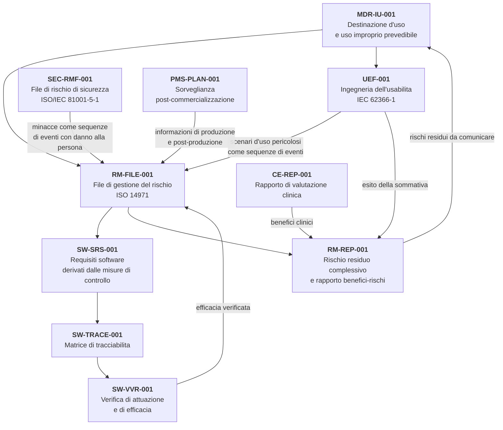

# Percorso operativo di certificazione

**Documento di ricerca - agente B9, seconda ondata**
**Data di redazione: 25 agosto 2026 - stato normativo accertato alla data**

---

## 0. Avvertenze preliminari

### 0.1 Disclaimer

> **Questo documento è un'analisi tecnica, non una consulenza regolatoria.**
> Non costituisce parere legale né sostituisce il giudizio di un consulente di *regulatory
> affairs* qualificato, di un'organizzazione di consulenza in dispositivi medici o
> dell'Organismo Notificato prescelto. Ogni passo, ogni durata e ogni costo indicati qui
> **devono essere confermati** (a) da un consulente regolatorio incaricato, (b) dall'Organismo
> Notificato con cui si stipulerà il contratto, (c) dall'organismo di certificazione che
> rilascerà il certificato ISO 13485. Il percorso di conformità è responsabilità esclusiva del
> fabbricante ai sensi dell'art. 10 del Regolamento (UE) 2017/745. Un errore nella
> determinazione della destinazione d'uso o della classe si paga con la ripetizione dell'intera
> valutazione di conformità.

### 0.2 Convenzioni di affidabilità usate nel documento

| Marcatore | Significato |
|---|---|
| **[FONTE PRIMARIA]** | Verificato su testo normativo, atto ufficiale o pagina istituzionale |
| **[FONTE SECONDARIA]** | Ricavato da fonte qualificata non istituzionale; da riverificare |
| **[NON VERIFICATO]** | Non confermato in questa ricerca. **Da verificare prima dell'uso** |
| **[ORDINE DI GRANDEZZA]** | Stima di costo o durata non basata su listino pubblico. **Richiedere preventivo** |
| **[PROPOSTA]** | Scelta progettuale suggerita da questo documento, non ancora decisa |

### 0.3 Perimetro e presupposti decisionali

Il documento presuppone come acquisite e non discute le decisioni **D12**, **D16**, **D17**
e **D20** del *context pack* (`.telemedic/context/00_PROJECT_BRIEF.md`, § 5-bis):

- il telemonitoraggio è **incluso** nel perimetro e la classificazione accettata è la
  **Classe IIa** ai sensi dell'MDR;
- al **30 novembre 2026** si consegna software completo, testato, con fascicolo tecnico
  avviato e sistema di gestione qualità in esercizio; la **marcatura CE è milestone autonoma**;
- il fabbricante adotta il **modello duale**: repository open source non-dispositivo +
  distribuzione identificata che è il dispositivo;
- questo documento è il deliverable richiesto da D20 e la sua collocazione finale è
  `docs/08_compliance/`.

L'analisi normativa di merito (qualificazione ai sensi dell'art. 2(1), testo e interpretazione
della Regola 11, contenuto delle norme tecniche, GDPR, licenze) è svolta in
[`R2-normativa-mdr-gdpr-licenze.md`](./R2-normativa-mdr-gdpr-licenze.md). **Qui non si ripete:
si esegue.** Il vincolo italiano che impone la certificazione come dispositivo medico per il
telemonitoraggio e per il *viewer*/refertazione è documentato in
[`R3-normativa-italiana.md`](./R3-normativa-italiana.md), § 4.6.

### 0.4 Il messaggio in una pagina

1. **Il fattore limitante non è lo sviluppo software: è l'Organismo Notificato.** I dati della
   XX indagine della Commissione europea (dati aggiornati a febbraio 2026) indicano che il
   **51 %** degli Organismi Notificati rispondenti impiega **13–18 mesi** dalla firma
   dell'accordo scritto al rilascio del certificato, e il **31 %** impiega **19–24 mesi**
   ([sintesi pubblica del *tracker*](https://eucertify.com/notified-body-availability/),
   **[FONTE SECONDARIA]** che rinvia all'indagine della Commissione). Team-NB, nella propria
   indagine 2025, riporta che le valutazioni «SGQ + prodotto» si collocano in maggioranza fra
   **13 e 18 mesi**, e registra per la prima volta in oltre un decennio una **contrazione
   dell'organico** degli ON (−8 % di personale interno, −21 % di subappaltatori)
   ([RAPS](https://www.raps.org/resource/team-nb-survey-shows-slowdown-in-growth-of-mdr-and-ivdr-certificates-issued-in-2025.html),
   [ECA Academy](https://www.gmp-compliance.org/gmp-news/survey-results-from-team-notified-body-on-the-mdr-and-ivdr)).
2. **Conseguenza aritmetica.** Anche firmando il contratto con l'ON entro dicembre 2026, il
   certificato non arriva prima di **gennaio 2028** nell'ipotesi più favorevole (13 mesi), e
   più verosimilmente fra **giugno 2028 e giugno 2029**. La finestra «2027» di D16 è
   raggiungibile **solo** in uno scenario compresso, con probabilità che questo documento
   valuta bassa. Il § 3 espone i tre scenari e i punti di decisione.
3. **Ciò che va fatto subito non è documentazione: sono tre atti giuridici.** Costituire il
   soggetto fabbricante, nominare il PRRC e congelare la destinazione d'uso. Senza questi tre,
   nessun Organismo Notificato apre un fascicolo e nessuna delle attività successive è
   difendibile.
4. **Il documento più costoso da sbagliare è la destinazione d'uso** (§ 4). Una singola frase
   sbagliata - «monitoraggio in tempo reale dei parametri vitali» invece di «raccolta
   differita di parametri per la revisione periodica del professionista» - sposta la
   classificazione dalla Classe IIa alla Classe IIb, la classe di sicurezza software da B a C,
   e aggiunge 12–18 mesi e un ordine di grandezza al costo.
5. **La valutazione clinica è il secondo collo di bottiglia** (§ 10). Non richiede
   un'indagine clinica per la Classe IIa, ma richiede un percorso documentale autonomo di
   6–9 mesi che deve partire **ora**, non dopo la consegna del software.

---

## 1. Che cosa esattamente si deve ottenere

Il traguardo «marcatura CE» non è un atto unico. È la conclusione di **cinque ottenimenti
distinti**, con prerequisiti incrociati:

| # | Ottenimento | Chi lo rilascia | Base giuridica |
|---|---|---|---|
| **A** | **Certificato SGQ** ai sensi dell'Allegato IX, Capo I | **Organismo Notificato** designato per i codici pertinenti | Art. 52(6) e Allegato IX, sez. 2 e 3, MDR |
| **B** | **Certificato di valutazione della documentazione tecnica** per almeno un dispositivo rappresentativo della categoria | **Organismo Notificato** (lo stesso) | Art. 52(6) e Allegato IX, sez. 4, MDR |
| **C** | **Dichiarazione di conformità UE** | **Il fabbricante** (atto proprio) | Art. 19 e Allegato IV MDR |
| **D** | **Marcatura CE con numero identificativo dell'ON** | **Il fabbricante** appone | Artt. 20 e 52(6) MDR |
| **E** | **Registrazioni**: SRN operatore economico, UDI-DI di base, registrazione del dispositivo in EUDAMED, adempimenti italiani | Fabbricante verso Commissione/EUDAMED e Ministero della salute | Artt. 27, 29, 31 MDR; d.lgs. 5 agosto 2022, n. 137 |

A questi si aggiunge, **non obbligatorio ma di fatto necessario**, l'ottenimento **F**: il
**certificato ISO 13485:2016** rilasciato da un organismo di certificazione accreditato,
che è cosa **diversa** dall'ottenimento A (§ 6.5).

**Errore concettuale da evitare fin dall'inizio.** L'ISO 13485 non «vale» come certificato
MDR. L'Organismo Notificato valuta il sistema di gestione della qualità **contro i requisiti
dell'art. 10(9) MDR e dell'Allegato IX**, non contro la ISO 13485. Il certificato ISO 13485
riduce l'attrito e accorcia l'audit dell'ON, ma non lo sostituisce.

### 1.1 La procedura di valutazione della conformità applicabile alla Classe IIa

L'**art. 52(6) MDR** offre al fabbricante di dispositivi di Classe IIa **due strade
alternative**:

- **Strada 1 (raccomandata per il software)** - valutazione della conformità basata sul
  **sistema di gestione della qualità**: Allegato IX, **Capo I** (valutazione del SGQ) e
  **Capo III** (disposizioni amministrative), **con in più** la valutazione della
  documentazione tecnica di cui alla **sezione 4** dell'Allegato IX per **almeno un
  dispositivo rappresentativo per ciascuna categoria di dispositivi**.
- **Strada 2** - redazione della documentazione tecnica degli **Allegati II e III** unita a
  una valutazione di conformità ai sensi dell'**Allegato XI** nella variante «garanzia di
  qualità della produzione» (Parte A) o «verifica del prodotto» (Parte B). L'art. 52(6) rinvia
  puntualmente alle sezioni dell'Allegato XI che disciplinano l'applicazione ai dispositivi di
  Classe IIa. **[FONTE SECONDARIA - i numeri di sezione dell'Allegato XI vanno riletti sul
  testo consolidato EUR-Lex prima di essere citati in un documento di progetto]**

> **Nota di correzione rispetto al mandato.** La combinazione «Allegato X + XI»
> (esame del tipo + verifica della conformità del prodotto) è la procedura prevista per la
> **Classe IIb** e la **Classe III**, non per la Classe IIa. Per la IIa l'alternativa
> all'Allegato IX è l'**Allegato XI**, senza esame del tipo.

**Perché si sceglie la Strada 1.** La verifica del prodotto dell'Allegato XI, Parte B, è
concepita per prodotti fabbricati in lotti: prevede l'esame di ogni prodotto o di campioni
statistici. Applicata a un software distribuito per *download*, produce un onere ricorrente
insensato. La garanzia di qualità della produzione (Parte A) è più praticabile ma comunque
lascia scoperta la parte di progettazione, che per un software è **tutto il prodotto**.
L'Allegato IX, Capo I, copre invece l'intero ciclo - progettazione, sviluppo, produzione,
sorveglianza post-commercializzazione - ed è la scelta universale nel software dispositivo
medico. **[PROPOSTA]** Adottare la Strada 1 e verbalizzarne la motivazione nel documento
`MDR-CAP-001 - Scelta della procedura di valutazione della conformità`.

Testo di riferimento: [Regolamento (UE) 2017/745, versione consolidata su
EUR-Lex](https://eur-lex.europa.eu/eli/reg/2017/745/oj).

---

## 2. Cosa fare nei primi 30 giorni

**Finestra: 25 agosto - 24 settembre 2026.**

Queste attività hanno tempi di attraversamento lunghi e **non comprimibili** e sono
prerequisito di tutto il resto. Ogni giorno di ritardo qui si traduce in un giorno di ritardo
sulla marcatura CE, senza possibilità di recupero a valle.

| # | Azione | Perché nei primi 30 giorni | Responsabile | Output | Entro |
|---|---|---|---|---|---|
| **1** | **Decidere e avviare la costituzione del soggetto giuridico fabbricante** (o identificare formalmente la persona fisica che assume il ruolo) | Nessun ON apre un fascicolo senza un fabbricante con partita IVA e sede nell'UE. La costituzione richiede notaio, statuto, iscrizione al Registro delle imprese: 3–8 settimane. È il collo di bottiglia più a monte | Committente + notaio/commercialista | Atto costitutivo, visura, P.IVA | 24 set. |
| **2** | **Congelare la bozza di destinazione d'uso** (§ 4) e sottoporla a revisione esterna | Da essa discendono classe MDR, classe IEC 62304, perimetro della valutazione clinica, codici NANDO da cercare. Cambiarla dopo aver ingaggiato l'ON costa una rivalutazione | Committente + consulente regolatorio | `MDR-IU-001` bozza r0 | 15 set. |
| **3** | **Redigere la determinazione di qualificazione e classificazione** (art. 2(1), Regola 11) | È il primo documento che l'ON chiede, e la Regola applicabile determina i codici di designazione da verificare in NANDO | Consulente regolatorio + PRRC designato | `MDR-CLS-001` | 24 set. |
| **4** | **Identificare il candidato PRRC** e verificarne la qualifica documentale (art. 15) | Se la qualifica non c'è internamente, va cercata sul mercato: i PRRC esterni qualificati sono una risorsa scarsa e con liste d'attesa | Committente | Lettera d'incarico bozza + CV + titoli | 24 set. |
| **5** | **Estrarre da NANDO/SMCS la lista degli ON designati** per i codici pertinenti e inviare una **RFI** a 5–6 di essi | Il tempo fra primo contatto e offerta è di settimane; il tempo fra offerta e contratto, secondo Team-NB, è inferiore a 2 mesi nel 66 % dei casi, ma la coda a monte non è misurata. Chi contatta a gennaio firma in estate | Committente + consulente | `ON-RFI-001` e registro dei contatti | 30 set. |
| **6** | **Avviare il piano di valutazione clinica (CEP)** | La ricerca sistematica della letteratura richiede 8–12 settimane e il CER ne richiede altre 8. Partire a marzo significa non avere il CER prima dell'autunno 2027 | Consulente clinico/*medical writer* | `CE-PLAN-001` bozza | 30 set. |
| **7** | **Istituire il controllo dei documenti** (ISO 13485 § 4.2.4) prima di produrre altri documenti | Un documento prodotto fuori dal controllo documentale va riemesso. Farlo dopo significa rifare tutto | Responsabile qualità | `QMS-PRO-001` Controllo dei documenti | 15 set. |
| **8** | **Formalizzare la separazione repository / distribuzione** (D17) e pubblicare il disclaimer | È una misura di tutela immediata: da oggi ogni artefatto pubblicato senza disclaimer è un rischio di *claim* non lecito (§ 15) | Committente + maintainer | `NOT-A-MEDICAL-DEVICE.md`, `DISTRIBUTION-POLICY.md` | 5 set. |
| **9** | **Congelare gli identificativi di requisito** `RF-*`, `RNF-*`, `BR-*` e istituire il registro | La tracciabilità IEC 62304 è retroattivamente irrecuperabile: se gli ID cambiano dopo, la matrice va ricostruita a mano | Architetto + responsabile qualità | `SW-REQ-REG-001` | 15 set. |
| **10** | **Avviare l'inventario SOUP** contestualmente alla prima build | Censire i SOUP a posteriori su un progetto maturo costa 3–5 volte tanto. La SBOM va generata dalla prima pipeline | Tech lead | `SW-SOUP-001` v0 + SBOM CycloneDX in CI | 24 set. |

**Regola di ingaggio per i primi 30 giorni.** Nessuna di queste attività è delegabile allo
sviluppo. Sono attività del committente e del futuro fabbricante. Se non c'è capacità per
farle in parallelo allo sviluppo di v1.0, la conseguenza corretta non è rinviarle: è
riconoscere che la marcatura CE slitta di un trimestre per ogni mese di ritardo su questo
blocco.

---

## 3. I tre scenari temporali e il calcolo all'indietro

### 3.1 I dati di partenza sui tempi dell'Organismo Notificato

| Dato | Valore | Fonte |
|---|---|---|
| Tempo dall'accordo scritto al certificato - 51 % degli ON | **13–18 mesi** | XX indagine della Commissione europea, dati a febbraio 2026 **[FONTE SECONDARIA]** |
| Idem - 31 % degli ON | **19–24 mesi** | *ibidem* |
| Valutazione «solo SGQ» | in prevalenza **6–12 mesi** | Indagine Team-NB 2025 **[FONTE SECONDARIA]** |
| Valutazione «SGQ + prodotto» (il nostro caso) | in prevalenza **13–18 mesi** | Indagine Team-NB 2025 |
| Tempo dal primo contatto alla firma del contratto | **< 2 mesi nel 66 % dei casi** | Indagine Team-NB 2025 |
| Divario domande MDR / certificati emessi a fine 2025 | 25 978 domande contro 13 953 certificati | Indagine Team-NB 2025 |
| Andamento dell'organico degli ON 2024→2025 | **−8 %** personale interno, **−21 %** subappaltatori | Indagine Team-NB 2025 |

**Lettura onesta di questi numeri.** Il divario fra domande e certificati non si chiuderà
prima del 2028 secondo la stessa analisi di settore. Un fabbricante nuovo, di micro
dimensione, con un dispositivo software di prima certificazione, **non è un cliente
prioritario** per un Organismo Notificato con capacità in contrazione. Questo va messo in
conto nella pianificazione e nella negoziazione contrattuale (§ 7.6).

### 3.2 Scenario A - compresso («2027», come da D16)

| Milestone | Data |
|---|---|
| Contratto con l'ON firmato | **30 novembre 2026** |
| Fascicolo tecnico completo e sottomesso | **28 febbraio 2027** |
| Audit SGQ in sito (fase 1 + fase 2) | **maggio 2027** |
| Chiusura delle non conformità | **settembre 2027** |
| Certificati Allegato IX | **dicembre 2027** |
| Dichiarazione di conformità e marcatura CE | **dicembre 2027** |

**Condizioni di realizzabilità, tutte necessarie:** (a) il contratto è firmato entro
novembre 2026, il che significa RFI inviata entro settembre 2026; (b) il fascicolo tecnico è
completo - *completo*, non «avviato» - a febbraio 2027, il che è in tensione diretta con la
consegna software del 30 novembre 2026 e con la validazione sommativa di usabilità;
(c) il sistema qualità ha già completato un ciclo di audit interno e riesame della direzione
entro aprile 2027; (d) il CER è chiuso entro febbraio 2027; (e) l'ON si colloca nel decile
più veloce (13 mesi) e non solleva non conformità maggiori. **Probabilità stimata: bassa.**
**[PROPOSTA]** Trattare lo scenario A come obiettivo di tensione, non come piano.

### 3.3 Scenario B - realistico (piano di riferimento)

| Milestone | Data |
|---|---|
| Contratto con l'ON firmato | **31 dicembre 2026** |
| Certificato ISO 13485 | **luglio 2027** |
| Fascicolo tecnico completo e sottomesso all'ON | **30 giugno 2027** |
| Verifica di completezza superata | **31 agosto 2027** |
| Audit SGQ in sito | **settembre - ottobre 2027** |
| Valutazione della documentazione tecnica | **settembre - dicembre 2027** |
| Cicli di risposta alle non conformità | **gennaio - aprile 2028** |
| Certificati Allegato IX | **giugno 2028** |
| Dichiarazione di conformità, marcatura CE, EUDAMED | **luglio - agosto 2028** |

Durata dalla firma del contratto al certificato: **18 mesi**, cioè il limite superiore della
fascia maggioritaria. È il piano su cui è costruito il diagramma del § 3.5 e la tabella
cronologica del § 5.

### 3.4 Scenario C - conservativo

Contratto ON a marzo 2027 (perché il fabbricante non è ancora costituito a dicembre 2026, o
perché i primi ON contattati non accettano nuovi clienti), 22 mesi di valutazione, due cicli
di non conformità maggiori sulla valutazione clinica: **certificati a gennaio 2029, marcatura
CE nel primo trimestre 2029.**

### 3.5 Diagramma di Gantt - scenario B (piano di riferimento)

### 3.6 Punti di decisione irreversibili

| Data | Decisione | Se non presa entro quella data |
|---|---|---|
| **30 set. 2026** | RFI inviata agli ON | Lo scenario A decade automaticamente |
| **31 ott. 2026** | Destinazione d'uso congelata | Il CEP e il file di rischio ripartono da capo |
| **31 dic. 2026** | Contratto ON firmato | Lo scenario B slitta a C |
| **31 mar. 2027** | Protocollo di validazione sommativa approvato | La sommativa non chiude entro giugno 2027 |
| **30 giu. 2027** | Fascicolo tecnico sottomesso | Ogni mese di ritardo è un mese sul certificato, senza recupero |

---

## 4. Destinazione d'uso e determinazione formale della classe

### 4.1 Perché questo è il documento più importante del progetto

La destinazione d'uso (*intended purpose*) è definita dall'**art. 2, punto 12, MDR** come
l'uso al quale il dispositivo è destinato secondo le indicazioni fornite dal fabbricante
nell'etichetta, nelle istruzioni per l'uso, nel materiale promozionale o di vendita e nelle
dichiarazioni del fabbricante stesso. Da essa discendono, in cascata e senza eccezioni:

1. la **qualificazione** come dispositivo medico ai sensi dell'art. 2(1);
2. la **classe di rischio** ai sensi dell'Allegato VIII (per il software, Regola 11);
3. il perimetro dei **requisiti generali di sicurezza e prestazione** applicabili
   (Allegato I);
4. il perimetro della **valutazione clinica** (art. 61 e Allegato XIV): il beneficio clinico
   da dimostrare è quello dichiarato nella destinazione d'uso, né più né meno;
5. la **specifica d'uso** e gli scenari da validare ai sensi di IEC 62366-1 § 5.1;
6. l'**analisi del rischio**: ISO 14971 § 5.2 impone di partire proprio da destinazione d'uso
   e uso improprio ragionevolmente prevedibile;
7. la **classe di sicurezza software** IEC 62304, che dipende dal danno possibile, che dipende
   da che cosa il software è dichiarato fare;
8. i **codici di designazione** che l'Organismo Notificato deve possedere.

**Il costo dell'errore.** Una destinazione d'uso troppo ampia allarga tutto: più GSPR, più
evidenza clinica, più scenari di usabilità, classe superiore. Una destinazione d'uso troppo
stretta rispetto a quello che il prodotto fa realmente è **falsa** e viene rilevata dall'ON
al primo confronto con l'interfaccia utente e con il materiale promozionale, con esito di
non conformità maggiore. La regola operativa è: **dichiarare esattamente ciò che il prodotto
fa, e progettare il prodotto perché faccia esattamente ciò che si vuole dichiarare.**

### 4.2 Le due leve che determinano la Classe IIa e non la IIb

Il testo della **Regola 11, Allegato VIII, MDR** contiene due commi con soglie diverse:

- **Comma 1 - software che fornisce informazioni usate per assumere decisioni a fini
  diagnostici o terapeutici**: Classe IIa, salvo che tali decisioni possano causare il decesso
  o un deterioramento irreversibile dello stato di salute (Classe III) oppure un grave
  deterioramento dello stato di salute o un intervento chirurgico (Classe IIb).
- **Comma 2 - software destinato al monitoraggio di processi fisiologici**: Classe IIa, salvo
  che sia destinato al monitoraggio di **parametri fisiologici vitali** in cui la natura delle
  variazioni di tali parametri **potrebbe comportare un pericolo immediato per il paziente**,
  nel qual caso è Classe IIb.
- **Comma 3** - tutto il resto è Classe I.

Riferimento interpretativo: **MDCG 2021-24 rev.1** (*Guidance on classification of medical
devices*, revisione dell'aprile 2026 **[FONTE SECONDARIA sulla data della revisione]**) e
**MDCG 2019-11 rev.1** (giugno 2025), reperibili nella
[raccolta ufficiale MDCG della Commissione](https://health.ec.europa.eu/medical-devices-sector/new-regulations/guidance-mdcg-endorsed-documents-and-other-guidance_en).

**Conseguenza operativa e vincolante.** Con il telemonitoraggio nel perimetro (D12), la
Classe IIa regge **solo se** la destinazione d'uso esclude in modo esplicito, verificabile e
coerente con il prodotto:

- il monitoraggio **in tempo reale** di parametri vitali di pazienti in condizioni critiche o
  instabili;
- la **generazione di allarmi con finalità di emergenza** o di soccorso;
- l'uso come **unico** o **primario** mezzo di sorveglianza di un paziente;
- la **generazione autonoma di informazione clinica** non redatta dal professionista
  (cfr. vincolo **V2** del *context pack*).

Se anche una sola di queste esclusioni cade, si passa alla **Classe IIb** con conseguenze a
cascata: valutazione della documentazione tecnica su base campionaria diversa, classe di
sicurezza software C, evidenza clinica più stringente, costi e tempi superiori.

### 4.3 Traccia della dichiarazione di destinazione d'uso

**[PROPOSTA]** - Documento `MDR-IU-001`. Testo da sottoporre a revisione del consulente
regolatorio e dell'ON. **Non è un testo definitivo: è una traccia strutturata.**

> **1. Denominazione del dispositivo.** *Telemedic Clinical Distribution* - distribuzione
> identificata, versionata e sottoposta a controllo qualità del software Telemedic. Il codice
> sorgente pubblicato con licenza Apache-2.0 nel repository pubblico **non è** il dispositivo
> e non è oggetto della presente dichiarazione.
>
> **2. Destinazione d'uso.** *Telemedic Clinical Distribution* è un software dispositivo
> medico destinato a supportare l'erogazione a distanza di prestazioni sanitarie
> programmate - televisita, teleconsulto e teleconsulenza, teleassistenza e telemonitoraggio
> - mediante: (a) l'instaurazione di una sessione di comunicazione audio-video cifrata fra
> professionista sanitario e paziente, o fra professionisti sanitari; (b) la raccolta, la
> trasmissione, la conservazione e la presentazione al professionista sanitario di parametri
> clinici misurati da dispositivi medici di terzi e di dati inseriti dal paziente o dal
> *caregiver*; (c) la messa a disposizione del professionista sanitario di tali dati in forma
> tabellare e grafica, con evidenziazione dei valori che ricadono al di fuori di intervalli
> di riferimento **definiti dal professionista sanitario stesso** per il singolo paziente;
> (d) la registrazione strutturata e la trasmissione ai sistemi informativi sanitari del
> contenuto clinico **redatto e firmato dal professionista sanitario**.
>
> **3. Indicazione d'uso.** Il dispositivo è destinato all'impiego nell'ambito di percorsi
> assistenziali programmati (PAI/PDTA), di percorsi di *follow-up* di patologia nota e di
> programmi di monitoraggio di pazienti **clinicamente stabili**, secondo le condizioni di
> erogabilità stabilite dall'Accordo Stato-Regioni 17 dicembre 2020, rep. atti n. 215/CSR.
>
> **4. Utilizzatori previsti.** (a) Medici chirurghi abilitati; (b) esercenti le professioni
> sanitarie non mediche abilitati; (c) pazienti e *caregiver* come utilizzatori laici, per
> le sole funzioni di partecipazione alla sessione, di trasmissione dei parametri e di
> consultazione dei propri dati; (d) personale tecnico del Centro servizi. Il dispositivo
> presuppone che il professionista sanitario possieda la competenza clinica necessaria a
> valutare autonomamente l'adeguatezza del canale e la significatività dei dati presentati.
>
> **5. Popolazione di pazienti.** Pazienti adulti e pediatrici in condizioni cliniche stabili,
> per i quali un professionista sanitario abbia stabilito l'appropriatezza dell'erogazione a
> distanza. Il dispositivo non è destinato a pazienti in condizioni acute, instabili o
> critiche.
>
> **6. Ambiente d'uso.** Domicilio del paziente, struttura sanitaria, ambulatorio, studio
> professionale, con connettività di rete conforme ai requisiti minimi dichiarati nelle
> istruzioni per l'uso.
>
> **7. Principio di funzionamento.** Software applicativo eseguito su hardware informatico
> generico non dedicato, senza parti applicate, che non esercita alcuna azione fisica,
> chimica o farmacologica sul corpo umano; l'azione si esaurisce nel trattamento, nella
> trasmissione e nella presentazione di informazioni.
>
> **8. Beneficio clinico dichiarato.** Consentire l'accesso a prestazioni sanitarie
> programmate a pazienti per i quali l'accesso in presenza è oneroso o non tempestivo,
> mantenendo la completezza e la tracciabilità dell'informazione clinica trasmessa al
> professionista. **[Il beneficio clinico è ciò che la valutazione clinica deve dimostrare:
> ogni parola aggiunta qui è evidenza in più da produrre.]**
>
> **9. Controindicazioni ed esclusioni esplicite dalla destinazione d'uso.** Il dispositivo
> **non è destinato**:
> - al monitoraggio continuo e in tempo reale di parametri fisiologici vitali di pazienti in
>   condizioni critiche o instabili;
> - alla generazione di allarmi destinati all'attivazione di interventi di emergenza o di
>   soccorso; il dispositivo non è un sistema di allarme e non sostituisce i servizi di
>   emergenza sanitaria;
> - a costituire l'unico o il principale mezzo di sorveglianza clinica di un paziente;
> - alla generazione autonoma di diagnosi, prognosi, raccomandazioni terapeutiche o
>   punteggi di rischio; ogni contenuto clinico è redatto e sottoscritto da un professionista
>   sanitario;
> - all'interpretazione diagnostica di immagini medicali; il modulo di visualizzazione dei
>   dati clinici non è destinato alla refertazione radiologica né istopatologica;
> - all'uso in sostituzione della prima visita medica in presenza, salvo diversa decisione
>   documentata del medico responsabile;
> - all'uso in ambiente sterile, in sala operatoria o in continuità di funzioni vitali.
>
> **10. Limiti d'uso e requisiti dell'ambiente operativo.** Le soglie minime di banda,
> latenza (RTT), *packet loss* e *jitter* al di sotto delle quali il dispositivo segnala la
> degradazione e sconsiglia la prosecuzione della prestazione sono dichiarate in
> `MDR-ENV-001` e costituiscono parte integrante della destinazione d'uso ai sensi di
> IEC 82304-1 § 7.

### 4.4 La determinazione di qualificazione e classificazione

**[PROPOSTA]** - Documento `MDR-CLS-001`. Struttura minima richiesta dall'ON:

| § | Contenuto | Nota |
|---|---|---|
| 1 | Riferimento a `MDR-IU-001` nella revisione esatta | La classificazione è valida solo per quella revisione |
| 2 | **Qualificazione ai sensi dell'art. 2(1)**: verifica puntuale di ciascun elemento della definizione - software, destinato dal fabbricante a essere impiegato sull'uomo, per una o più finalità mediche specifiche fra quelle elencate, che non esercita l'azione principale cui è destinato mediante mezzi farmacologici, immunologici o metabolici | Motivare la finalità medica: «diagnosi, prevenzione, monitoraggio, previsione, prognosi, trattamento o attenuazione di malattie» |
| 3 | Applicazione dell'albero decisionale di **MDCG 2019-11 rev.1** con esito di ciascun nodo | L'ON verifica che l'albero sia stato percorso, non solo la conclusione |
| 4 | Verifica di **tutte** le regole dell'Allegato VIII, non solo della Regola 11, con esito motivato per ciascuna | Errore frequente: fermarsi alla Regola 11. Vanno considerate anche le regole 9, 10, 12, 13, 15, 22 e le regole di implementazione (Allegato VIII, Capo II) |
| 5 | **Applicazione della Regola 11**, comma per comma, con la motivazione dell'esclusione delle soglie di IIb e III | È il cuore del documento |
| 6 | Applicazione della **regola di implementazione 3.5** (in caso di più regole applicabili, si applica la più rigorosa) e della **3.3** (il software che comanda o influenza l'uso di un dispositivo rientra nella stessa classe del dispositivo; il software indipendente è classificato autonomamente) | **[FONTE SECONDARIA sui numeri delle regole di implementazione: verificare sull'Allegato VIII, Capo II]** |
| 7 | **Esito**: Classe IIa, Regola 11 comma 1 e comma 2 | |
| 8 | **Condizioni di validità della classificazione** e trigger di riesame | Elencare le modifiche che obbligano a riclassificare: nuova funzione di allarme, algoritmi che generano informazione clinica, estensione a pazienti instabili |
| 9 | Firma del PRRC e data | |

### 4.5 Il vincolo italiano che rende non opzionale questa scelta

Il **DM 21 settembre 2022** (GU Serie generale n. 256 del 2 novembre 2022, atto 22A06184,
Allegato A, Sezione 2) impone espressamente che «la Infrastruttura regionale di telemedicina
per il servizio minimo di telemonitoraggio debba essere certificata come dispositivo medico»
e, per il telemonitoraggio avanzato di livello 2, che «potrebbe essere richiesta una classe di
rischio superiore alla IIa». Analogamente prescrive la certificazione come dispositivo medico
del *viewer* dati clinici e del modulo di refertazione nei teleconsulti istopatologici e
radiologici. Dettaglio testuale in [`R3-normativa-italiana.md`](./R3-normativa-italiana.md),
§ 4.6.

**Lettura operativa.** L'esclusione della refertazione diagnostica su immagini dalla
destinazione d'uso (§ 4.3, punto 9) non è una rinuncia commerciale gratuita: è la scelta che
mantiene la classe a IIa. Se in futuro si vorrà entrare nel teleconsulto radiologico, si
tratterà di una **estensione sostanziale** che richiede una nuova valutazione dell'ON
(§ 14.3), non di un aggiornamento di prodotto.

---

## 5. Tabella cronologica dei passi

Legenda dei responsabili: **CMT** committente/fabbricante · **PRRC** persona responsabile del
rispetto della normativa · **RQ** responsabile qualità · **RA** consulente *regulatory
affairs* · **TL** *tech lead* / architetto · **UX** specialista di *human factors* ·
**MW** *medical writer* clinico · **SEC** specialista di sicurezza · **ON** Organismo
Notificato · **OC** organismo di certificazione ISO 13485.

Tutti i costi sono **[ORDINE DI GRANDEZZA]**: vedi § 16 per la base delle stime e per la
procedura di richiesta preventivi.

### 5.1 Fase 0 - Prerequisiti giuridici (25 ago - 31 ott 2026)

| Attività | Prerequisito | Output documentale | Durata | Resp. | Costo indicativo |
|---|---|---|---|---|---|
| Costituzione o identificazione del soggetto fabbricante | Decisione sul modello societario | Atto costitutivo, visura, P.IVA, `MDR-FAB-001` Identificazione del fabbricante | 4–8 sett. | CMT | 2–5 k€ (notaio, diritti, commercialista) |
| Determinazione della destinazione d'uso | - | `MDR-IU-001` r1 | 3–6 sett. | CMT+RA | incluso nel forfait RA |
| Determinazione di qualificazione e classificazione | `MDR-IU-001` | `MDR-CLS-001` | 2–4 sett. | RA+PRRC | 3–6 k€ |
| Scelta della procedura di valutazione della conformità | `MDR-CLS-001` | `MDR-CAP-001` | 1 sett. | RA | incluso |
| Nomina del PRRC e verifica della qualifica | Fabbricante costituito | `MDR-PRRC-001` incarico + dossier di qualifica | 4–8 sett. | CMT | vedi § 12 |
| Separazione formale repository / distribuzione | D17 | `NOT-A-MEDICAL-DEVICE.md`, `DISTRIBUTION-POLICY.md`, `MDR-DIST-001` | 2–4 sett. | CMT+TL | interno |
| Mandato al consulente regolatorio | - | Contratto | 2–3 sett. | CMT | vedi § 16 |

### 5.2 Fase 1 - Sistema di gestione della qualità (1 set 2026 - 15 mar 2027)

| Attività | Prerequisito | Output documentale | Durata | Resp. | Costo indicativo |
|---|---|---|---|---|---|
| *Gap analysis* rispetto a ISO 13485 e art. 10(9) MDR | Fabbricante costituito | `QMS-GAP-001` | 3–4 sett. | RA+RQ | 3–5 k€ |
| Politica e obiettivi per la qualità, organigramma, matrice responsabilità | *Gap analysis* | `QMS-MAN-001` Manuale della qualità | 4 sett. | RQ | - |
| Redazione delle procedure documentate (§ 6.3) | Manuale | `QMS-PRO-001`…`QMS-PRO-0nn` | 12–16 sett. | RQ+RA | vedi § 16 |
| Validazione del software usato nel SGQ (ISO 13485 § 4.1.6) | Elenco strumenti | `QMS-VAL-001` Validazione degli strumenti | 3–4 sett. | RQ+TL | interno |
| Formazione del personale e registri di competenza | Procedure approvate | `QMS-REC-COMP` | 2–3 sett. | RQ | interno |
| **Avvio in esercizio del SGQ** | Procedure rilasciate | Registrazioni reali dal 2 nov 2026 | milestone | RQ | - |
| Primo audit interno completo | ≥ 3 mesi di registrazioni | `QMS-AUD-INT-001` | 3–4 sett. | RQ (o auditor esterno) | 2–4 k€ se esterno |
| Primo riesame della direzione | Audit interno | `QMS-RIE-001` verbale | 1–2 sett. | CMT+RQ | interno |

### 5.3 Fase 2 - Ciclo di vita software IEC 62304 (1 set 2026 - 30 apr 2027)

| Attività | Prerequisito | Output documentale | Durata | Resp. | Costo indicativo |
|---|---|---|---|---|---|
| Piano di sviluppo software | `MDR-IU-001`, procedura di progettazione | `SW-DEV-PLAN-001` | 3 sett. | TL+RQ | interno |
| Specifica dei requisiti software | Requisiti di sistema, ID congelati | `SW-SRS-001` + `SW-REQ-REG-001` | 6–8 sett. | TL | interno |
| Determinazione della classe di sicurezza software e segregazione | File di rischio v0 | `SW-CLS-001` | 3 sett. | TL+RQ | interno |
| Descrizione dell'architettura software con interfacce e SOUP | SRS | `SW-SAD-001` | 6–8 sett. | TL | interno |
| Inventario, giustificazione e sorveglianza dei SOUP | Prima build, SBOM | `SW-SOUP-001` + SBOM CycloneDX firmata | 10–14 sett. poi continuo | TL | interno + strumenti |
| Piano e specifiche di verifica e validazione | SRS, SAD | `SW-VVP-001` | 4 sett. | TL | interno |
| Esecuzione di V&V e matrice di tracciabilità generata in CI | Codice | `SW-VVR-001`, `SW-TRACE-001` | continuo | TL | interno |
| Procedura di gestione della configurazione e di rilascio | - | `SW-CM-001`, `SW-REL-001` | 3 sett. | TL+RQ | interno |
| Piano di manutenzione e risoluzione dei problemi | - | `SW-MAINT-001`, `SW-PROB-001` | 3 sett. | TL+RQ | interno |
| Attività di sicurezza del ciclo di vita ISO/IEC 81001-5-1 | SAD, *threat model* | `SEC-LC-001`, `SEC-TM-001`, `SEC-RMF-001` | 10–14 sett. | SEC+TL | vedi § 16 |
| Penetration test esterno indipendente | Ambiente di *staging* stabile | `SEC-PT-001` rapporto + piano di rimedio | 3–6 sett. | fornitore esterno | 12–30 k€ |
| Requisiti dell'ambiente operativo (IEC 82304-1 § 7) | Metriche di qualità | `MDR-ENV-001` | 2 sett. | TL | interno |

### 5.4 Fase 3 - Rischio e usabilità (1 set 2026 - 15 giu 2027)

| Attività | Prerequisito | Output documentale | Durata | Resp. | Costo indicativo |
|---|---|---|---|---|---|
| Piano di gestione del rischio con criteri di accettabilità | `MDR-IU-001` | `RM-PLAN-001` | 3 sett. | RQ+RA | interno |
| Analisi del rischio, stima, ponderazione, controllo | Piano | `RM-FILE-001` (registro dei rischi) | 20–24 sett. | RQ+TL+PRRC | interno |
| Verifica dell'attuazione e dell'efficacia delle misure di controllo | Misure implementate | Evidenze in `SW-VVR-001`, aggiornamento `RM-FILE-001` | continuo | TL | interno |
| Valutazione del rischio residuo complessivo e rapporto benefici-rischi | CER bozza | `RM-REP-001` | 4–6 sett. | RQ+PRRC+MW | interno |
| Specifica d'uso e identificazione degli scenari d'uso pericolosi | `MDR-IU-001` | `UE-SPEC-001`, `UE-HAZ-001` | 8–10 sett. | UX+RQ | vedi § 16 |
| Piano di validazione dell'usabilità | Scenari selezionati | `UE-PLAN-001` | 3 sett. | UX | - |
| Valutazioni formative | Prototipi | `UE-FORM-001` | 8–10 sett. | UX | vedi § 11 |
| **Validazione sommativa** | Interfaccia congelata, protocollo approvato | `UE-SUM-001` rapporto | 12–14 sett. | UX | vedi § 11 |
| Fascicolo di ingegneria dell'usabilità consolidato | Tutti i precedenti | `UEF-001` | 2 sett. | UX+RQ | - |

### 5.5 Fase 4 - Valutazione clinica (15 set 2026 - 15 giu 2027)

| Attività | Prerequisito | Output documentale | Durata | Resp. | Costo indicativo |
|---|---|---|---|---|---|
| Piano di valutazione clinica | `MDR-IU-001`, `MDR-CLS-001` | `CE-PLAN-001` | 5–6 sett. | MW+RA | vedi § 16 |
| Definizione dello stato dell'arte e dei parametri clinici | CEP | Sezione di `CE-PLAN-001` | incluso | MW | - |
| Ricerca sistematica della letteratura con protocollo e appraisal | CEP approvato | `CE-LIT-001` protocollo + `CE-LIT-002` risultati | 12–14 sett. | MW | - |
| Valutazione dell'eventuale equivalenza (§ 10.4) | Candidati identificati | `CE-EQ-001` + contratto di accesso alla documentazione | 6–10 sett. | RA+legale | incerto |
| Analisi dei dati clinici e stesura del rapporto | Letteratura, dati di V&V, usabilità, PMS | `CE-REP-001` (CER) | 12–14 sett. | MW+PRRC | vedi § 16 |
| Piano di *follow-up* clinico post-commercializzazione | CER | `PMCF-PLAN-001` | 4–6 sett. | MW+RA | - |

### 5.6 Fase 5 - Organismo Notificato (25 ago 2026 - 30 giu 2028)

| Attività | Prerequisito | Output documentale | Durata | Resp. | Costo indicativo |
|---|---|---|---|---|---|
| Screening NANDO/SMCS e verifica dei codici di designazione | `MDR-CLS-001` bozza | `ON-SCR-001` matrice di confronto | 3–5 sett. | RA+CMT | interno |
| Invio RFI e richiesta di offerta a 5–6 ON | Screening | `ON-RFI-001`, offerte ricevute | 8–10 sett. | CMT | interno |
| Valutazione delle offerte, verifica della disponibilità reale, negoziazione | Offerte | `ON-SEL-001` verbale di selezione motivato | 4 sett. | CMT+RA | interno |
| **Firma del contratto** | Selezione | Contratto | 2–4 sett. | CMT | quota di attivazione |
| Sottomissione della domanda formale con fascicolo tecnico e dossier SGQ | Fascicolo completo | Domanda + `MDR-TD-001` | 2 sett. | PRRC+RQ | vedi § 16 |
| Verifica di completezza da parte dell'ON | Domanda | Esito, eventuale richiesta di integrazione | 6–8 sett. | ON | incluso |
| Audit del SGQ, fase 1 (documentale) e fase 2 (in sito) | SGQ con ≥ 6 mesi di registrazioni, audit interno e riesame effettuati | Rapporto di audit, elenco non conformità | 4–6 sett. | ON | vedi § 16 |
| Valutazione della documentazione tecnica (Allegato IX, sez. 4) | Fascicolo | Rapporto di valutazione, quesiti | 12–18 sett. | ON | vedi § 16 |
| Cicli di risposta alle non conformità e ai quesiti | Rapporti | Risposte documentate, azioni correttive | 2–4 cicli × 6–10 sett. | PRRC+RQ+TL | costo di rilavorazione |
| Decisione e rilascio dei certificati | Chiusura di tutte le NC | Certificato SGQ + certificato di valutazione della documentazione tecnica | 4–8 sett. | ON | incluso |

### 5.7 Fase 6 - Certificazione ISO 13485 (gen - lug 2027)

| Attività | Prerequisito | Output documentale | Durata | Resp. | Costo indicativo |
|---|---|---|---|---|---|
| Selezione dell'organismo di certificazione accreditato | SGQ in esercizio | Contratto | 4 sett. | CMT+RQ | - |
| Audit di certificazione, fase 1 | Documentazione SGQ completa | Rapporto fase 1 | 1–2 gg. audit | OC | vedi § 16 |
| Chiusura dei rilievi di fase 1 | Rapporto | Azioni | 4–6 sett. | RQ | - |
| Audit di certificazione, fase 2 | Registrazioni operative | Rapporto fase 2, non conformità | 2–4 gg. audit | OC | vedi § 16 |
| Chiusura delle non conformità e rilascio del certificato | Azioni correttive verificate | Certificato ISO 13485:2016, validità 3 anni | 6–10 sett. | RQ | - |

### 5.8 Fase 7 - Registrazioni e immissione sul mercato (gen 2027 - set 2028)

| Attività | Prerequisito | Output documentale | Durata | Resp. | Costo indicativo |
|---|---|---|---|---|---|
| Registrazione dell'operatore economico in EUDAMED e ottenimento dell'SRN | Fabbricante costituito, PRRC nominato | SRN | 4–8 sett. (dipende dalla convalida dell'autorità) | PRRC | nessuna tariffa nota |
| Assegnazione del **UDI-DI di base** e del **UDI-DI** presso un ente di attribuzione | Definizione del dispositivo e delle versioni | `UDI-001` registro UDI | 4–6 sett. | PRRC | canone annuo dell'ente di attribuzione |
| Redazione della dichiarazione di conformità UE | Certificati ON | `MDR-DOC-001` (Allegato IV) | 1–2 sett. | PRRC | - |
| Apposizione della marcatura CE con il numero dell'ON | DoC | Artefatti di rilascio, IFU, etichettatura elettronica | 1–2 sett. | TL+PRRC | - |
| Registrazione del dispositivo in EUDAMED | UDI-DI di base, certificati, DoC | Registrazione | 2–4 sett. | PRRC | nessuna tariffa nota |
| Adempimenti nazionali verso il Ministero della salute | Registrazione EUDAMED | Vedi § 13.3 | 4–8 sett. | PRRC | tariffe nazionali da verificare |
| Prima immissione sul mercato | Tutto quanto sopra | - | milestone | CMT | - |

### 5.9 Fase 8 - Post-commercializzazione (continuativa)

| Attività | Periodicità | Output documentale | Resp. |
|---|---|---|---|
| Raccolta e analisi dei dati di sorveglianza | continua | `PMS-DATA-*` | PRRC+RQ |
| Aggiornamento del piano PMS | annuale o su evento | `PMS-PLAN-001` | PRRC |
| **PSUR** | **almeno ogni 2 anni** (Classe IIa) | `PSUR-00n` | PRRC |
| Rapporto PMCF | secondo `PMCF-PLAN-001` | `PMCF-REP-00n` | MW |
| Aggiornamento del CER | secondo il CEP, tipicamente ogni 2–5 anni | `CE-REP-00n` | MW |
| Segnalazione di incidenti gravi e FSCA | su evento, entro i termini dell'art. 87 | Moduli MIR, `VIG-*` | PRRC |
| Audit di sorveglianza dell'ON | almeno annuale | Rapporto | ON |
| Audit di sorveglianza ISO 13485 | annuale, con rinnovo triennale | Rapporto | OC |
| Riesame della direzione | almeno annuale | `QMS-RIE-00n` | CMT |
| Aggiornamento della SBOM e della sorveglianza SOUP | a ogni rilascio | `SW-SOUP-001` | TL |

---

## 6. Sistema di gestione della qualità ISO 13485:2016

### 6.1 Che cosa richiede l'MDR, che è cosa diversa dalla ISO 13485

L'**art. 10(9) MDR** impone al fabbricante di istituire, documentare, applicare, mantenere,
aggiornare e migliorare costantemente un sistema di gestione della qualità che assicuri la
conformità nel modo più efficace e proporzionato alla classe di rischio e al tipo di
dispositivo. La norma elenca gli elementi che il SGQ deve affrontare, fra i quali: la
strategia di conformità regolamentare (comprese le procedure di valutazione della conformità
e di gestione delle modifiche), l'identificazione dei requisiti generali di sicurezza e
prestazione applicabili, la responsabilità della direzione, la gestione delle risorse
(compresa la selezione e il controllo dei fornitori e dei subappaltatori), la gestione del
rischio, la valutazione clinica e il PMCF, la realizzazione del prodotto, la verifica
dell'attribuzione dell'UDI, la sorveglianza post-commercializzazione, la comunicazione con le
autorità e gli organismi notificati, la segnalazione di incidenti gravi e FSCA, la gestione
delle azioni correttive e preventive e il monitoraggio della loro efficacia, i processi di
monitoraggio e misurazione, l'analisi dei dati e il miglioramento del prodotto.

**EN ISO 13485:2016** (con A11:2021) è **norma armonizzata** sotto MDR: il riferimento è
pubblicato nell'allegato della **Decisione di esecuzione (UE) 2021/1182 del 16 luglio 2021**,
successivamente modificata più volte (la
[pagina consolidata della Commissione](https://single-market-economy.ec.europa.eu/single-market/european-standards/harmonised-standards/medical-devices_en)
elenca modifiche fino al 1° aprile 2026). Applicarla conferisce **presunzione di conformità**
per i requisiti coperti (art. 8 MDR). **Ma la copertura non è totale:** ISO 13485 non copre di
per sé la valutazione clinica ai sensi dell'art. 61, la sorveglianza
post-commercializzazione nella forma richiesta dagli artt. 83–86, né gli obblighi di
vigilanza degli artt. 87–92. Occorrono procedure MDR-specifiche in aggiunta (§ 6.3, blocco C).

### 6.2 Come si costruisce un SGQ da zero in una realtà piccola

**Sequenza raccomandata [PROPOSTA], 5 mesi di elaborazione + 4 mesi di esercizio prima
dell'audit.**

1. **Definire il perimetro e le esclusioni** (ISO 13485 § 1 e § 7.1). Un fabbricante di
   software senza produzione fisica esclude tipicamente: § 6.4.2 controllo della
   contaminazione, § 7.5.2 pulizia del prodotto, § 7.5.5 requisiti particolari per i
   dispositivi sterili, § 7.5.7 validazione dei processi di sterilizzazione, § 7.6 controllo
   dei dispositivi di misurazione. **Ogni esclusione va motivata per iscritto**: l'auditor la
   contesta se la motivazione è generica.
2. **Non scrivere un manuale enciclopedico.** Il rischio tipico della micro-impresa è un SGQ
   troppo grande per essere rispettato. Le non conformità in audit nascono quasi sempre dallo
   scarto fra procedura scritta e prassi reale, non da procedure mancanti. Regola pratica:
   **se una procedura descrive un'attività che non si intende svolgere davvero ogni volta, va
   riscritta**, non aggirata.
3. **Sfruttare l'infrastruttura già esistente.** Il progetto ha già controllo di versione,
   revisione fra pari obbligatoria, CI con *gate* automatici, *issue tracker*, SBOM. Un SGQ
   *docs-as-code* - procedure versionate nel repository, approvazione via *pull request* con
   revisori nominati, immutabilità garantita dalla protezione dei rami e dalla firma dei
   *commit* - soddisfa ISO 13485 § 4.2.4 e § 4.2.5 in modo più robusto di un archivio di
   documenti Word. **Va però validato** ai sensi del § 4.1.6 (validazione del software usato
   nel SGQ) e va scritta la procedura che spiega all'auditor come la corrispondenza fra
   *commit*, revisione e approvazione costituisce la registrazione di approvazione.
4. **Nominare formalmente il rappresentante della direzione** (§ 5.5.2). In una micro-impresa
   può coincidere con il PRRC, purché non si crei un conflitto sull'indipendenza dell'audit
   interno: **l'audit interno non può essere svolto da chi ha eseguito l'attività auditata**
   (§ 8.2.4). In pratica: l'audit interno va commissionato all'esterno.
5. **Far girare il sistema per almeno un ciclo completo prima dell'audit di certificazione.**
   Un ciclo completo significa: registrazioni reali di progettazione e sviluppo, almeno un
   riesame di progettazione, almeno una CAPA, almeno un rilascio controllato, un audit interno
   su tutti i processi e un riesame della direzione. **Senza questi, la fase 2 non è
   superabile.** Da qui la data del 2 novembre 2026 come avvio dell'esercizio e maggio 2027
   come prima data utile di fase 2.

### 6.3 Procedure documentate indispensabili

**Blocco A - obbligatorie per esplicito richiamo di ISO 13485:2016**

| ID **[PROPOSTA]** | Titolo | Clausola |
|---|---|---|
| `QMS-PRO-001` | Controllo dei documenti | 4.2.4 |
| `QMS-PRO-002` | Controllo delle registrazioni | 4.2.5 |
| `QMS-PRO-003` | Riesame della direzione | 5.6.1 |
| `QMS-PRO-004` | Risorse umane, competenza, formazione, consapevolezza | 6.2 |
| `QMS-PRO-005` | Infrastruttura e ambiente di lavoro | 6.3, 6.4.1 |
| `QMS-PRO-006` | Gestione del rischio nella realizzazione del prodotto | 7.1 |
| `QMS-PRO-007` | Riesame dei requisiti relativi al prodotto e comunicazione con il cliente | 7.2 |
| `QMS-PRO-008` | Progettazione e sviluppo | 7.3.1–7.3.8 |
| `QMS-PRO-009` | Controllo delle modifiche di progettazione | 7.3.9 |
| `QMS-PRO-010` | Approvvigionamento e controllo dei fornitori | 7.4 |
| `QMS-PRO-011` | Produzione ed erogazione del servizio, identificazione e tracciabilità | 7.5.1, 7.5.8, 7.5.9 |
| `QMS-PRO-012` | Validazione dei processi | 7.5.6 |
| `QMS-PRO-013` | Attività di installazione e di assistenza | 7.5.3, 7.5.4 |
| `QMS-PRO-014` | Feedback | 8.2.1 |
| `QMS-PRO-015` | Gestione dei reclami | 8.2.2 |
| `QMS-PRO-016` | Segnalazione alle autorità regolatorie | 8.2.3 |
| `QMS-PRO-017` | Audit interno | 8.2.4 |
| `QMS-PRO-018` | Controllo del prodotto non conforme | 8.3 |
| `QMS-PRO-019` | Analisi dei dati | 8.4 |
| `QMS-PRO-020` | Azioni correttive e azioni preventive | 8.5.2, 8.5.3 |
| `QMS-PRO-021` | Validazione del software utilizzato nel SGQ | 4.1.6 |

**Blocco B - imposte dall'MDR e non coperte da ISO 13485**

| ID | Titolo | Base |
|---|---|---|
| `QMS-PRO-030` | Strategia di conformità regolamentare e gestione delle modifiche | art. 10(9)(a) |
| `QMS-PRO-031` | Identificazione e mantenimento dei GSPR applicabili | art. 10(9)(b), Allegato I |
| `QMS-PRO-032` | Gestione del fascicolo tecnico e della documentazione dell'Allegato II/III | art. 10(4), Allegato II |
| `QMS-PRO-033` | Valutazione clinica e PMCF | art. 61, Allegato XIV |
| `QMS-PRO-034` | Sorveglianza post-commercializzazione e PSUR | artt. 83–86, Allegato III |
| `QMS-PRO-035` | Vigilanza, incidenti gravi e azioni correttive di sicurezza | artt. 87–92 |
| `QMS-PRO-036` | Attribuzione e gestione dell'UDI e registrazioni EUDAMED | artt. 27, 29, 31 |
| `QMS-PRO-037` | Comunicazione con l'Organismo Notificato e con le autorità competenti | art. 10(9)(l) |
| `QMS-PRO-038` | Rilascio del dispositivo e dichiarazione di conformità | artt. 19, 20 |
| `QMS-PRO-039` | Ruolo, compiti e indipendenza del PRRC | art. 15 |

**Blocco C - specifiche del software, richieste dalle norme di ciclo di vita**

| ID | Titolo | Base |
|---|---|---|
| `QMS-PRO-050` | Ciclo di vita del software e classificazione di sicurezza | IEC 62304 § 4.3, 5 |
| `QMS-PRO-051` | Gestione dei SOUP | IEC 62304 § 5.3.3, 5.3.4, 7.1.2–7.1.3, 8.1.2 |
| `QMS-PRO-052` | Gestione della configurazione e build riproducibile | IEC 62304 § 8 |
| `QMS-PRO-053` | Risoluzione dei problemi software | IEC 62304 § 9 |
| `QMS-PRO-054` | Ingegneria dell'usabilità | IEC 62366-1 § 5 |
| `QMS-PRO-055` | Sicurezza informatica nel ciclo di vita e divulgazione coordinata delle vulnerabilità | ISO/IEC 81001-5-1, MDCG 2019-16 rev.1 |

**Totale: circa 36 procedure.** Per una micro-impresa è realistico accorparne alcune (per
esempio 004+005, 011+012+013, 019+020) scendendo a **25–28 documenti**. Non è realistico
scendere sotto 20.

### 6.4 Durata realistica e onere

| Attività | Durata |
|---|---|
| *Gap analysis* | 3–4 settimane |
| Redazione delle procedure con supporto consulenziale | 12–16 settimane |
| Formazione e avvio | 3–4 settimane |
| Esercizio prima dell'audit di certificazione | **≥ 4 mesi**, preferibilmente 6 |
| Ciclo di certificazione (fase 1 → certificato) | 4–6 mesi |
| **Totale realistico dal via all'ottenimento del certificato** | **12–16 mesi** |

Questo è coerente con il piano: avvio 1° settembre 2026, certificato luglio 2027.

### 6.5 Chi rilascia il certificato ISO 13485 e che rapporto ha con l'Organismo Notificato

**Sono due soggetti e due atti distinti.**

- Il **certificato ISO 13485** è rilasciato da un **organismo di certificazione** accreditato
  secondo **ISO/IEC 17021-1** con estensione allo schema dei dispositivi medici (documento
  **IAF MD 9** per l'applicazione della 17021-1 ai SGQ dei dispositivi medici). In Italia
  l'unico ente nazionale di accreditamento è **Accredia**, designato ai sensi del
  **Regolamento (CE) n. 765/2008** e della legge 23 luglio 2009, n. 99. Un certificato
  rilasciato da un organismo accreditato da un altro ente nazionale membro di EA/IAF ha pari
  valore per il mutuo riconoscimento. La banca dati degli organismi accreditati è consultabile
  sul [sito di Accredia](https://www.accredia.it/).
- Il **certificato dell'Allegato IX** è rilasciato dall'**Organismo Notificato**, che è
  designato dall'autorità nazionale competente (in Italia il Ministero della salute) e
  notificato alla Commissione, ed è valutato secondo l'**Allegato VII MDR**. L'ON valuta il
  SGQ **contro l'art. 10(9) MDR e l'Allegato IX**, non contro la ISO 13485.

**Rapporto pratico fra i due.** Il certificato ISO 13485 non è un prerequisito giuridico del
certificato MDR, ma:

1. molti ON **richiedono** in fase di domanda l'evidenza di un SGQ maturo, e un certificato
   ISO 13485 è la prova più immediata;
2. l'ON può **ridurre la durata dell'audit** se il SGQ è già certificato da un organismo
   accreditato, riconoscendo parte dell'evidenza;
3. **molti Organismi Notificati sono anche organismi di certificazione ISO 13485.**
   **[PROPOSTA] Scegliere un ON che rilasci anche l'ISO 13485 e chiedere in offerta un audit
   combinato**: si riduce il numero di giornate uomo, si evita la doppia preparazione e si
   elimina il rischio di interpretazioni divergenti fra due auditor su uno stesso processo.
   È la singola ottimizzazione di costo e di tempo più efficace dell'intero percorso.

### 6.6 Tempi e costi dell'audit di certificazione ISO 13485 in Italia

Il numero di giornate di audit non è arbitrario: deriva dalle tabelle di **IAF MD 9** in
funzione del numero di addetti «effettivi» e della complessità, con fattori di aggiustamento.
Per un'organizzazione di **1–10 addetti** l'ordine di grandezza tipico è di **2–4 giornate
totali** fra fase 1 e fase 2 per l'audit iniziale, e **1–2 giornate** per ciascuna
sorveglianza annuale, con un audit di rinnovo al terzo anno di durata intermedia.
**[FONTE SECONDARIA - la tabella esatta è in IAF MD 9, documento pubblico dell'International
Accreditation Forum, e l'organismo di certificazione è tenuto a esplicitare il calcolo delle
giornate nell'offerta: richiederlo per iscritto.]**

Il costo si compone di: quota di istruttoria e di riesame della domanda, giornate di audit,
spese di trasferta, quota annuale di mantenimento del certificato. **Non esistono listini
pubblici comparabili**: le tariffe sono negoziate. **[ORDINE DI GRANDEZZA - richiedere almeno
tre preventivi]**: si veda la tabella del § 16.

---

## 7. Organismo Notificato

### 7.1 Che cosa fa esattamente in Classe IIa

Nella Strada 1 (Allegato IX, Capi I e III), l'ON svolge **quattro** attività distinte:

1. **Valutazione del sistema di gestione della qualità** (Allegato IX, sez. 2). Comprende
   l'esame della documentazione del SGQ e un **audit in sito** presso i locali del fabbricante
   e, ove pertinente, dei fornitori e dei subappaltatori critici. Per un fabbricante di
   software «i locali» sono l'ambiente di sviluppo e l'infrastruttura di *build* e di
   rilascio: l'ON verifica *in loco* la pipeline, il controllo degli accessi al repository, la
   firma degli artefatti, la tracciabilità e la corrispondenza fra procedura e prassi.
2. **Valutazione della documentazione tecnica** (Allegato IX, sez. 4) per **almeno un
   dispositivo rappresentativo per ciascuna categoria di dispositivi**. Con un solo prodotto,
   significa: il fascicolo tecnico viene esaminato integralmente.
3. **Sorveglianza** (Allegato IX, sez. 3). Audit di sorveglianza **almeno annuali** per tutta
   la validità del certificato, con verifica dell'attuazione del SGQ approvato, dei dati di
   PMS, delle CAPA e dell'aggiornamento della documentazione tecnica. L'MDR prevede inoltre
   **audit senza preavviso** presso il fabbricante o i subappaltatori.
4. **Approvazione preventiva delle modifiche sostanziali** al SGQ e delle modifiche al
   dispositivo approvato che possano incidere su sicurezza, prestazioni o condizioni d'uso
   (Allegato IX, sez. 2.4 e 4.10). Vedi § 14.3.

**Durata del certificato:** massimo **cinque anni** (Allegato IX, sez. 4.9 e Capo III), con
possibilità di rinnovo su nuova valutazione.

**Ciò che l'ON non fa.** Non redige né corregge la documentazione: un ON non può fornire
consulenza al fabbricante che valuta (Allegato VII, requisiti di imparzialità). Consulenza e
valutazione sono soggetti diversi. Chi propone entrambe le cose sta violando il regime di
imparzialità o non è un ON.

### 7.2 Come si individua un ON designato: NANDO e i codici

**NANDO** (*New Approach Notified and Designated Organisations*) è la banca dati ufficiale
della Commissione europea che elenca gli organismi notificati, per legislazione, per Stato
membro e per **ambito di designazione**. Dal 2025 NANDO è confluita nel portale
**SMCS - *Single Market Compliance Space***, che integra NANDO, ICSMS e Noise
([portale SMCS](https://webgate.ec.europa.eu/single-market-compliance-space/),
[pagina della Commissione sugli organismi notificati](https://single-market-economy.ec.europa.eu/single-market/goods/building-blocks/notified-bodies_en)).

**Procedura operativa di ricerca [PROPOSTA]:**

1. Nel portale, selezionare la legislazione **«Regulation (EU) 2017/745 on medical devices
   (MDR)»**.
2. Filtrare per Stato membro, oppure elencare tutti gli ON designati.
3. Per ciascun candidato aprire la scheda e leggere **due sezioni distinte**:
   - le **procedure di valutazione della conformità** per cui è designato - occorre che
     compaia l'**Allegato IX, Capi I e III** (e, se si volesse la Strada 2, l'Allegato XI);
   - i **codici di designazione** relativi ai tipi di dispositivo.
4. Confrontare i codici con quelli pertinenti al proprio dispositivo e **chiedere conferma
   scritta all'ON** che il proprio dispositivo rientra nell'ambito.

**I codici.** Sono stabiliti dal **Regolamento di esecuzione (UE) 2017/2185 della Commissione
del 23 novembre 2017**, relativo all'elenco dei codici e dei corrispondenti tipi di
dispositivi ai fini della specificazione dell'ambito della designazione degli organismi
notificati
([EUR-Lex, CELEX 32017R2185](https://eur-lex.europa.eu/legal-content/IT/TXT/?uri=CELEX:32017R2185)).
Le famiglie sono:

| Prefisso | Significato |
|---|---|
| **MDA** | Dispositivi **attivi**, raggruppati per funzione e area clinica |
| **MDN** | Dispositivi **non attivi** |
| **MDT** | Competenze relative a **tecnologie o processi** particolari (per esempio sterilizzazione, nanomateriali) |
| **MDS** | Codici **orizzontali** relativi a caratteristiche trasversali del dispositivo |

Un software dispositivo medico *stand-alone* è un **dispositivo attivo** ai sensi dell'art. 2,
punto 4, MDR e ricade quindi in un codice **MDA** corrispondente alla funzione clinica
svolta; a esso si affianca il codice orizzontale **MDS** relativo ai dispositivi che
incorporano o utilizzano software, comunemente citato come **MDS 1010**.

> **[NON VERIFICATO]** Il numero esatto del codice MDA applicabile a un software per
> telemedicina e telemonitoraggio e la formulazione letterale del codice MDS orizzontale
> **non sono stati confermati su fonte primaria in questa ricerca**: il testo dell'allegato al
> Regolamento 2017/2185 non è risultato accessibile. **Azione richiesta:** scaricare
> l'allegato dal testo EUR-Lex e ricavare i codici esatti prima di inviare la RFI; in
> alternativa, e comunque, chiedere a ciascun ON candidato di **dichiarare per iscritto i
> codici sotto i quali tratterebbe il dispositivo**. Questa richiesta scritta è di per sé la
> verifica più affidabile ed è prassi accettata.

**Avvertenza operativa.** La presenza in NANDO indica soltanto l'ambito di designazione. Non
indica se l'ON **accetta nuovi clienti**, quale sia la sua coda, né se abbia competenza reale
sul software. Sono tre verifiche separate da fare per iscritto.

### 7.3 Organismi Notificati italiani designati sotto MDR

**[FONTE SECONDARIA - DA VERIFICARE SU NANDO/SMCS PRIMA DI QUALSIASI USO]**
Le fonti consultate indicano che l'Italia è, in valore assoluto, lo Stato membro con il
maggior numero di organismi notificati designati sotto MDR, e citano fra questi:

| Organismo | Numero identificativo | Nota |
|---|---|---|
| IMQ - Istituto Italiano del Marchio di Qualità | 0051 | **[FONTE SECONDARIA]** |
| Istituto Superiore di Sanità | 0373 | **[FONTE SECONDARIA]** |
| ICIM | 0425 | **[FONTE SECONDARIA]** |
| Italcert | 0426 | **[FONTE SECONDARIA]** |
| Kiwa Cermet Italia | 0476 | **[FONTE SECONDARIA]** |
| Eurofins Product Testing Italy | n.d. | designato come «quarto organismo notificato italiano per MDR» secondo [AboutPharma](https://www.aboutpharma.com/aziende/organismi-notificati-italiani-per-mdr-eurofins-product-testing-italy-e-il-quarto/) |
| Certiquality | n.d. | **[NON VERIFICATO]** |
| Ente Certificazione Macchine | n.d. | **[NON VERIFICATO]** |
| Bureau Veritas Italia | n.d. | **[NON VERIFICATO]** |
| TÜV Rheinland Italia | n.d. | **[NON VERIFICATO]** |

Riferimento istituzionale italiano: la pagina
[«Gli Organismi notificati in Italia»](https://www.salute.gov.it/portale/dispositiviMedici/dettaglioContenutiDispositiviMedici.jsp?lingua=italiano&id=9&area=dispositivi-medici&menu=organisminotificati)
del Ministero della salute (non consultabile automaticamente in questa ricerca a causa della
protezione anti-bot del sito: **va aperta manualmente**).

> **Attenzione, punto sostanziale.** Essere designati sotto MDR **non significa** essere
> designati per i codici del software attivo. Diversi ON italiani hanno ambiti concentrati su
> dispositivi non attivi o su specifiche aree merceologiche. **La verifica dei codici è
> dirimente e va fatta prima di ogni contatto.** Non si deve inoltre limitare la ricerca agli
> ON italiani: la designazione ha effetto in tutta l'Unione e la lingua di lavoro è
> negoziabile. Il criterio corretto è la combinazione codici + competenza sul software +
> disponibilità reale, non la nazionalità.

### 7.4 Che cosa contiene la domanda

La domanda formale (Allegato IX, sez. 1 e Capo III) comprende tipicamente:

| Blocco | Contenuto |
|---|---|
| **Identificazione** | Nome e indirizzo del fabbricante, **SRN**, eventuali siti aggiuntivi, subappaltatori e fornitori critici, mandatario se applicabile |
| **Dichiarazione di unicità** | Dichiarazione che la stessa domanda **non è stata presentata a un altro ON** per lo stesso SGQ / dispositivo (requisito espresso dell'Allegato IX) |
| **Dispositivo** | Destinazione d'uso, descrizione, categoria, **UDI-DI di base**, classe e regola applicata con motivazione, codici di designazione richiesti |
| **Dossier SGQ** | Manuale, elenco delle procedure, politica per la qualità, organigramma, elenco dei siti, mappa dei processi, evidenze del ciclo qualità (audit interno, riesame della direzione) |
| **Documentazione tecnica** | Fascicolo completo secondo Allegati II e III (§ 8) |
| **Valutazione clinica** | CEP, CER, piano PMCF |
| **PRRC** | Nominativo, dossier di qualifica, descrizione del rapporto con il fabbricante |
| **Piano PMS** | Secondo art. 84 e Allegato III |

### 7.5 Tempi reali e liste d'attesa

I dati disponibili sono quelli del § 3.1. Sintesi operativa:

- **firma del contratto**: tipicamente entro 2 mesi dal primo contatto **quando l'ON accetta**;
  il tempo non misurato - e più pericoloso - è quello di **attesa prima di essere accettati**;
- **dall'accordo scritto al certificato**: 13–18 mesi per la maggioranza, 19–24 mesi per quasi
  un terzo degli ON;
- **verifica di completezza**: alcune settimane, ma una domanda incompleta viene respinta e
  rimette in coda;
- **capacità in contrazione**: −8 % di personale interno e −21 % di subappaltatori fra 2024 e
  2025 secondo l'indagine Team-NB.

**Contromisure [PROPOSTA]:**

1. contattare **almeno 5–6 ON** contemporaneamente, non uno alla volta;
2. presentarsi con `MDR-IU-001`, `MDR-CLS-001` e un indice del fascicolo tecnico **già
   pronti**: un fabbricante che sa cosa sta chiedendo viene accettato più facilmente;
3. chiedere in offerta **impegni contrattuali sui tempi** delle singole fasi (verifica di
   completezza, primo *round* di quesiti, tempo di risposta ai *rebuttal*) e le penali o i
   rimedi in caso di scostamento;
4. chiedere se l'ON offre un servizio di **pre-*submission* / *gap review*** a pagamento:
   riduce drasticamente il numero di cicli di non conformità e vale il suo costo;
5. verificare che l'ON abbia **valutatori con competenza specifica sul software** (IEC 62304,
   IEC 62366-1, ISO/IEC 81001-5-1) e chiedere quanti dispositivi software di Classe IIa abbia
   certificato.

### 7.6 Costi dell'ON

L'**Allegato VII, sezione 1.2.8, MDR** obbliga gli organismi notificati a rendere
**pubblicamente disponibile l'elenco delle proprie tariffe standard**. La Commissione
mantiene un documento con i collegamenti ipertestuali alle tariffe pubblicate da ciascun ON,
scaricabile dalla
[pagina della Commissione sugli organismi notificati per i dispositivi medici](https://health.ec.europa.eu/medical-devices-topics-interest/notified-bodies-medical-devices_en)
(ultimo aggiornamento riportato: **13 luglio 2026** **[FONTE SECONDARIA]**).

**Questo è il modo corretto e verificabile per ottenere numeri reali.** Questo documento
**non stima** le tariffe degli ON perché esiste una fonte pubblica primaria: va consultata.
Ciò che si può dire sulla struttura del costo:

| Voce | Natura |
|---|---|
| Quota di riesame della domanda / apertura del fascicolo | forfait |
| Valutazione della documentazione tecnica | a giornate uomo o a forfait per fascicolo |
| Audit iniziale del SGQ (fase 1 + fase 2) | a giornate uomo secondo tabella + trasferte |
| Cicli di riesame delle risposte alle non conformità | a giornate uomo, **variabile e spesso sottostimato** |
| Rilascio e mantenimento del certificato | canone annuo |
| Audit di sorveglianza annuale | a giornate uomo + trasferte |
| Audit senza preavviso | a giornate uomo, **da mettere a budget anche se non pianificabile** |
| Valutazione delle modifiche sostanziali | a giornate uomo, ricorrente per un software (§ 14) |

**Avvertenza sul confronto delle offerte.** Confrontare le tariffe orarie è fuorviante:
l'ON più economico per giornata può essere il più costoso in totale se genera più cicli di non
conformità o se ha code più lunghe. Il confronto va fatto su: **totale stimato + numero di
giornate previste + impegni sui tempi + disponibilità dichiarata**.

---

## 8. Fascicolo tecnico - checklist mappata sui documenti del progetto

Base normativa: **Allegato II MDR** (documentazione tecnica) e **Allegato III MDR**
(documentazione tecnica sulla sorveglianza post-commercializzazione). L'art. 10(4) impone al
fabbricante di redigerla e **tenerla aggiornata**.

Colonna «Stato»: `☐` da produrre · `◐` parzialmente coperto da artefatti già previsti dal
progetto · `☑` coperto.

### 8.1 Allegato II, sezione 1 - Descrizione e specifica del dispositivo

| # | Voce dell'Allegato II | Documento del progetto **[PROPOSTA]** | Stato |
|---|---|---|---|
| 1.1 a | Nome commerciale o denominazione del prodotto e descrizione generale, comprensiva della destinazione d'uso e degli utilizzatori previsti | `MDR-IU-001` Destinazione d'uso | ☐ |
| 1.1 b | **UDI-DI di base** attribuito dal fabbricante | `UDI-001` Registro UDI | ☐ |
| 1.1 c | Popolazione di pazienti e condizioni cliniche da diagnosticare, trattare o monitorare; indicazioni, controindicazioni, avvertenze | `MDR-IU-001` §§ 3, 5, 9 | ☐ |
| 1.1 d | Principio di funzionamento e modo d'azione, con dimostrazione scientifica ove pertinente | `MDR-IU-001` § 7 + `02_architecture/` | ◐ |
| 1.1 e | **Motivazione della qualificazione come dispositivo medico** | `MDR-CLS-001` § 2 | ☐ |
| 1.1 f | **Classe di rischio e motivazione delle regole di classificazione applicate** | `MDR-CLS-001` §§ 4–7 | ☐ |
| 1.1 g | Spiegazione delle caratteristiche nuove | `MDR-CLS-001` § 8 + `adr/` | ☐ |
| 1.1 h | Descrizione degli accessori, di altri dispositivi e di prodotti non-dispositivi destinati a essere usati in combinazione | `MDR-COMB-001` Dispositivi e sistemi in combinazione (dispositivi di misura del telemonitoraggio, lettori di tessera sanitaria, dispositivi di firma) | ☐ |
| 1.1 i | Descrizione o elenco completo delle **varie configurazioni e varianti** che saranno rese disponibili | `MDR-CONF-001` Configurazioni e varianti (SaaS multi-tenant / on-premise; moduli attivabili per configurazione, D14) | ☐ |
| 1.1 j | Descrizione generale degli **elementi funzionali chiave**: parti, componenti, software, formulazione, composizione, funzionalità; rappresentazioni figurate | `SW-SAD-001` Architettura software + diagrammi `02_architecture/` | ◐ |
| 1.1 k | Descrizione delle materie prime degli elementi funzionali chiave a contatto con il corpo | **Non applicabile** - motivazione scritta in `MDR-TD-001` | ☐ |
| 1.1 l | **Specifiche tecniche**: caratteristiche, dimensioni, prestazioni, e ogni variante/configurazione/accessorio, come tipicamente riportate nelle specifiche di prodotto rese disponibili all'utilizzatore | `MDR-SPEC-001` Specifiche di prodotto + `MDR-ENV-001` Requisiti dell'ambiente operativo | ☐ |
| 1.2 | Riferimento alle **generazioni precedenti e a dispositivi analoghi** del fabbricante, ove esistano, con panoramica | `MDR-TD-001` § 1.2 - dichiarare che si tratta della prima generazione, e chiarire il rapporto con il repository open source (D17) | ☐ |

### 8.2 Allegato II, sezione 2 - Informazioni fornite dal fabbricante

| # | Voce | Documento | Stato |
|---|---|---|---|
| 2 | **Etichette** sul dispositivo, sull'imballaggio e ogni altra etichetta, nelle lingue accettate negli Stati membri in cui si prevede la vendita | `MDR-LBL-001` Etichettatura (per un software: schermata «Informazioni sul dispositivo», con simboli ISO 15223-1, UDI, nome e indirizzo del fabbricante, versione, marcatura CE + numero ON) | ☐ |
| 2 | **Istruzioni per l'uso**, nelle lingue accettate | `MDR-IFU-001` Istruzioni per l'uso, **in italiano** (art. 5, d.lgs. 5 agosto 2022, n. 137, sull'obbligo di lingua italiana **[FONTE SECONDARIA sul numero dell'articolo]**) + traduzione inglese | ☐ |

Riferimenti applicabili: **EN ISO 20417** (informazioni fornite dal fabbricante) e
**EN ISO 15223-1** (simboli), entrambe fra le norme armonizzate sotto MDR.
**[FONTE SECONDARIA - verificare sull'elenco consolidato della Commissione.]**

### 8.3 Allegato II, sezione 3 - Informazioni su progettazione e fabbricazione

| # | Voce | Documento | Stato |
|---|---|---|---|
| 3 a | Informazioni che consentano di **comprendere le fasi di progettazione** applicate al dispositivo | `SW-DEV-PLAN-001`, `SW-SRS-001`, `SW-SAD-001`, verbali di riesame di progettazione | ◐ |
| 3 b | Informazioni complete su **processi di fabbricazione** e loro convalida, controlli in corso, prova del prodotto finito | `SW-BUILD-001` Processo di *build* e rilascio riproducibile, `QMS-VAL-001`, evidenze di firma degli artefatti | ◐ |
| 3 | **Identificazione dei siti** in cui si svolgono progettazione e fabbricazione, compresi fornitori e subappaltatori | `MDR-SITE-001` Siti, fornitori e subappaltatori (inclusi *runner* CI, registro dei *container*, servizi di firma) | ☐ |

> **Punto di attenzione specifico del modello duale (D17).** L'ON chiederà come si garantisce
> che l'artefatto certificato corrisponda esattamente a un sorgente controllato, dato che il
> repository accetta contributi esterni. La risposta documentale è: **build riproducibile,
> firma degli artefatti, elenco dei commit inclusi nella release, revisione obbligatoria con
> revisori nominati e qualificati, DCO/CLA**. Va scritto in `SW-BUILD-001` e in
> `QMS-PRO-010` (controllo dei fornitori: i contributori esterni sono trattati come fonte
> esterna soggetta a controllo in ingresso).

### 8.4 Allegato II, sezione 4 - Requisiti generali di sicurezza e prestazione

| # | Voce | Documento | Stato |
|---|---|---|---|
| 4 | **Elenco (checklist) dei GSPR dell'Allegato I**, con per ciascuno: applicabilità o meno con motivazione; metodo o metodi utilizzati per dimostrare la conformità; **norme armonizzate, specifiche comuni o altre soluzioni applicate**; **identificazione precisa dei documenti controllati** che offrono la prova | `MDR-GSPR-001` Matrice dei requisiti generali di sicurezza e prestazione | ☐ |

**Nota operativa.** È il documento che l'ON legge per primo e da cui naviga tutto il resto.
Va costruito come **tabella con collegamenti a documenti versionati e a revisione esatta**,
non come prosa. Per un software i requisiti dell'Allegato I più onerosi sono quelli della
sezione dedicata ai **sistemi elettronici programmabili** (ripetibilità, affidabilità e
prestazioni conformi all'uso previsto; sviluppo secondo lo stato dell'arte con ciclo di vita,
gestione del rischio, verifica e validazione; requisiti minimi di hardware e di rete e misure
di sicurezza informatica, inclusa la protezione contro l'accesso non autorizzato) e quelli
sulla **riduzione dei rischi legati all'errore d'uso**.
**[FONTE SECONDARIA sulla numerazione puntuale delle sezioni dell'Allegato I: verificare sul
testo consolidato.]**

### 8.5 Allegato II, sezione 5 - Analisi benefici-rischi e gestione del rischio

| # | Voce | Documento | Stato |
|---|---|---|---|
| 5.1 | **Analisi benefici-rischi** di cui alle sezioni 1 e 8 dell'Allegato I | `RM-REP-001` § benefici-rischi + `CE-REP-001` | ☐ |
| 5.2 | Soluzioni adottate e **risultati della gestione del rischio** di cui alla sezione 3 dell'Allegato I | `RM-PLAN-001`, `RM-FILE-001`, `RM-REP-001` | ☐ |

### 8.6 Allegato II, sezione 6 - Verifica e convalida del prodotto

| # | Voce | Documento | Stato |
|---|---|---|---|
| 6.1 | Risultati e analisi critica di tutte le **verifiche e prove pre-cliniche** e delle prove di convalida svolte per dimostrare la conformità | `SW-VVP-001`, `SW-VVR-001`, `SW-TRACE-001` | ◐ |
| 6.1 b | **Informazioni dettagliate sulla verifica e convalida del software** applicato nel dispositivo finito: sintesi dei risultati di tutte le verifiche, convalide e prove eseguite internamente e in ambiente d'uso simulato o reale **prima del rilascio definitivo**, con tutte le **diverse configurazioni hardware e, se del caso, i sistemi operativi** indicati nelle informazioni fornite dal fabbricante | `SW-VVR-001` + `MDR-ENV-001` (matrice browser/sistemi operativi/dispositivi supportati) + rapporti E2E, WebRTC quality testing, carico | ◐ |
| 6.1 | **Prove di stabilità** e di durata di vita | `MDR-LIFE-001` Ciclo di vita del prodotto e fine del supporto (ISO/IEC 81001-5-1 impone la dichiarazione di **fine del supporto alla sicurezza**) | ☐ |
| 6.1 | **Biocompatibilità, sicurezza biologica, sterilità, sostanze CMR, radiazioni** | **Non applicabili** - motivazione scritta | ☐ |
| 6.1 | **Dati clinici**: rapporto sulla valutazione clinica, piano di valutazione clinica, **piano e rapporto di PMCF** o motivazione della non applicabilità (Allegato XIV) | `CE-PLAN-001`, `CE-REP-001`, `PMCF-PLAN-001` | ☐ |
| 6.2 | Informazioni supplementari in casi specifici (sostanze medicinali, tessuti di origine umana o animale, dispositivi sterili, dispositivi con **funzione di misura**) | `MDR-TD-001` § 6.2 - **valutare se la presentazione di parametri misurati costituisca «funzione di misura»**: la posizione va argomentata, non data per scontata | ☐ |
| - | **Sicurezza informatica**: modellazione delle minacce, requisiti di sicurezza, prove di sicurezza, gestione delle vulnerabilità, divulgazione coordinata, SBOM | `SEC-TM-001`, `SEC-RMF-001`, `SEC-PT-001`, `SEC-LC-001`, SBOM CycloneDX, `SECURITY.md` | ◐ |
| - | **Fascicolo di ingegneria dell'usabilità** | `UEF-001` con `UE-SPEC-001`, `UE-HAZ-001`, `UE-PLAN-001`, `UE-FORM-001`, `UE-SUM-001` | ☐ |
| - | **Documentazione del ciclo di vita software IEC 62304** completa | `SW-*` (§ 5.3) | ◐ |

### 8.7 Allegato III - Documentazione tecnica sulla sorveglianza post-commercializzazione

| # | Voce | Documento | Stato |
|---|---|---|---|
| 1.1 | **Piano di sorveglianza post-commercializzazione** redatto ai sensi dell'art. 84: processo di raccolta dei dati, indicatori e valori soglia per la rivalutazione dei rischi, metodi e strumenti di indagine sui reclami e sull'esperienza sul campo, metodi e protocolli di gestione degli eventi soggetti a trend report, metodi di comunicazione con utilizzatori e distributori, riferimento alle procedure di conformità agli obblighi degli artt. 83–86, procedure sistematiche di verifica delle azioni preventive e correttive, strumenti di tracciabilità, **piano di PMCF o motivazione della non applicabilità** | `PMS-PLAN-001` | ☐ |
| 1.2 | **PSUR** (art. 86) e **rapporto sulla sorveglianza post-commercializzazione** (art. 85) | `PSUR-00n` | ☐ (post-marcatura) |

### 8.8 Documenti non appartenenti al fascicolo ma richiesti dall'ON

| Documento | Base |
|---|---|
| Dichiarazione di conformità UE (Allegato IV) | art. 19 - redatta al termine |
| Dossier di qualifica del PRRC | art. 15 |
| Manuale e procedure del SGQ | art. 10(9), Allegato IX sez. 2 |
| Evidenze del ciclo qualità: audit interno, riesame della direzione, CAPA | ISO 13485 §§ 8.2.4, 5.6, 8.5 |
| Elenco dei siti, dei fornitori e dei subappaltatori critici | Allegato IX sez. 2.2 |
| Contratti con i subappaltatori critici | art. 10(9)(d) |
| Copertura assicurativa per la responsabilità da prodotto difettoso | art. 10(16) |

---

## 9. IEC 62304 - classe di sicurezza del software e gestione dei SOUP

### 9.1 Determinazione della classe di sicurezza

I criteri della clausola 4.3 di **IEC 62304:2006+A1:2015** e la loro applicazione preliminare
a Telemedic sono già analizzati in [`R2`](./R2-normativa-mdr-gdpr-licenze.md), § 2.2. Qui si
esegue la determinazione **nel perimetro post-D12**, cioè **con il telemonitoraggio incluso**,
che R2 non poteva considerare.

**Il ragionamento.** La classe dipende dal danno possibile **dopo** l'applicazione delle
misure di controllo del rischio esterne al sistema software. Con il telemonitoraggio nel
perimetro, la situazione pericolosa peggiore non è più l'interruzione del consulto: è la
**mancata o errata presentazione al professionista di un parametro clinico fuori intervallo**,
che ritarda una decisione terapeutica. Se il paziente è cardiopatico o diabetico, il danno
possibile è **grave**. In assenza di misure esterne, questo item sarebbe **Classe C**.

**Le misure esterne effettivamente disponibili** - e la loro documentabilità è ciò che
determina l'esito:

| Misura esterna | Fondamento | Documentata in |
|---|---|---|
| Esclusione dalla destinazione d'uso del monitoraggio in tempo reale, degli allarmi di emergenza e dell'uso come unico mezzo di sorveglianza | `MDR-IU-001` § 9 | destinazione d'uso, IFU |
| Presenza organizzativa obbligatoria di un **Centro servizi** tecnico e di un **Centro erogatore** sanitario per la gestione degli *alert*, imposta dal DM 21 settembre 2022, Allegato A | [`R3`](./R3-normativa-italiana.md) § 4.5 | `MDR-ENV-001`, IFU |
| Revisione periodica programmata dei dati da parte del professionista, con cadenza definita nel piano assistenziale | Accordo 215/CSR 2020 | IFU, `RM-FILE-001` |
| Istruzione esplicita al paziente e al *caregiver* di rivolgersi ai servizi di emergenza in caso di sintomi, indipendentemente dai dati trasmessi | GSPR sulle informazioni per la sicurezza | IFU |
| Riscontro visibile all'utente dello stato di trasmissione dei dati e notifica esplicita in caso di mancata ricezione entro la finestra attesa | misura **interna**, non abbassa la classe ma riduce la probabilità | `SW-SRS-001` |

**Esito proposto [PROPOSTA] - da confermare con il file di rischio e con l'ON:**

| Item software | Classe | Motivazione sintetica |
|---|---|---|
| Acquisizione, trasmissione, persistenza e presentazione dei parametri di telemonitoraggio; evidenziazione dei valori fuori intervallo | **B** | Le misure esterne (destinazione d'uso ristretta, revisione periodica programmata, Centro erogatore, istruzione al paziente sull'emergenza) riducono il danno possibile a **non grave**. **Se anche una sola di queste misure non fosse documentabile e verificabile, l'item passa a C** |
| Associazione fra identità del paziente, sessione, dati e referto (multi-tenancy, identificatori esterni, *token exchange*) | **B**, con trattamento come rischio prioritario | La mis-associazione paziente-dato è la situazione pericolosa peggiore dell'architettura. Resta B solo perché il professionista verifica l'identità in apertura di sessione (misura esterna); la verifica va **imposta dall'interfaccia**, non lasciata all'abitudine |
| Trasporto media WebRTC, signaling, ICE/TURN, indicatori di qualità del collegamento | **B** | Guasto → interruzione o degrado; il professionista interrompe e riprogramma |
| Redazione, firma e trasmissione del contenuto clinico (`Composition` in `Bundle`, D13) | **B** | Perdita o alterazione del referto ritarda decisioni; la firma digitale e la conferma esplicita sono controlli |
| IAM, autorizzazioni, isolamento fra tenant, audit immutabile | **B** | Divulgazione non autorizzata; danno alla persona possibile ma non grave sul piano fisico |
| Metriche di qualità, *dashboard*, telemetria tecnica | **A** | Nessun contributo a situazione pericolosa clinica, previa segregazione documentata |
| Frontend informativo, documentazione, i18n, portale pubblico | **A** | - |

**Classe dichiarata del sistema software: B**, con item di classe A isolati e **segregazione
documentata** ai sensi della clausola 5.3.5 di IEC 62304 (l'architettura deve dimostrare
l'efficacia della segregazione, non solo affermarla).

> **Avvertenza da mettere per iscritto nel `SW-CLS-001`.** La classificazione B è
> **condizionata** alle esclusioni della destinazione d'uso. Introdurre una funzione di
> allarme, un punteggio di rischio calcolato, una soglia definita dal sistema anziché dal
> professionista, o l'estensione a pazienti instabili, **riporta la determinazione a C** e
> comporta l'obbligo dei processi 5.4 (progettazione dettagliata a livello di unità) e
> 5.5 con verifica di ogni unità. È una decisione architetturale, non una scelta di prodotto.

### 9.2 Processi obbligatori in classe B

La ripartizione dei processi per classe è nella tabella di [`R2`](./R2-normativa-mdr-gdpr-licenze.md)
§ 2.2.2. In classe B diventano obbligatori, rispetto alla classe A: la **progettazione
architetturale** (5.3), l'**implementazione e verifica delle unità** (5.5), l'**integrazione e
i test di integrazione** (5.6), il **test del sistema software** (5.7), e la versione piena dei
processi di manutenzione (6), gestione del rischio software (7) e risoluzione dei problemi (9).
Resta esclusa la sola **progettazione dettagliata a livello di unità** (5.4), obbligatoria in
classe C.

**Costo marginale reale.** Il progetto prevede già copertura ≥ 80 %, test di integrazione,
E2E Playwright, *WebRTC quality testing*, SAST/DAST e tracciabilità (D10). Il costo
incrementale della classe B non è tecnico: è **documentale e di formalizzazione**. Concretamente
mancano: piano di sviluppo firmato, criteri di accettazione delle unità definiti *prima*,
verbali di riesame architetturale, rapporti di verifica firmati e datati con indicazione di chi
ha eseguito e su quale versione, e la **matrice di tracciabilità come artefatto di rilascio**.

### 9.3 Struttura della documentazione di ciclo di vita

| Documento | Clausola | Contenuto minimo |
|---|---|---|
| `SW-DEV-PLAN-001` Piano di sviluppo software | 5.1 | Processi, *deliverable*, tracciabilità pianificata, standard di codifica, gestione della configurazione, risoluzione dei problemi, **piano di verifica delle unità con criteri di accettazione** |
| `SW-SRS-001` Specifica dei requisiti software | 5.2 | Requisiti funzionali, di interfaccia, di prestazione, di sicurezza (*safety* e *security*), di rete, requisiti derivati dalle misure di controllo del rischio, con ID stabili |
| `SW-CLS-001` Determinazione della classe di sicurezza | 4.3 | § 9.1 |
| `SW-SAD-001` Descrizione dell'architettura software | 5.3 | Elementi software, interfacce, **SOUP e loro interfacce**, segregazione degli elementi di classe diversa e **dimostrazione della sua efficacia** |
| `SW-SOUP-001` Registro dei SOUP | 5.3.3–5.3.4, 7.1.2–7.1.3, 8.1.2 | § 9.4 |
| `SW-VVP-001` / `SW-VVR-001` Piano e rapporto di verifica | 5.5–5.7 | Strategia, ambienti, criteri di superamento, risultati con esito, anomalie residue e loro valutazione |
| `SW-TRACE-001` Matrice di tracciabilità | 5.1.1, 7.3.3 | Requisito → elemento architetturale → test → rischio → misura di controllo → verifica della misura |
| `SW-CM-001` Gestione della configurazione | 8 | Identificazione degli elementi, controllo delle modifiche, **registro dello stato di configurazione di ogni rilascio** |
| `SW-PROB-001` Risoluzione dei problemi | 9 | Registrazione, analisi, valutazione dell'impatto sulla sicurezza, azioni, verifica, comunicazione |
| `SW-MAINT-001` Piano di manutenzione | 6 | Come si trattano le segnalazioni post-rilascio, incluse quelle sui SOUP |
| `SW-REL-001` Procedura di rilascio | 5.8 | Verifica del completamento, anomalie residue documentate e valutate, archiviazione, **riproducibilità della build** |

### 9.4 Gestione dei SOUP - il punto più oneroso

**Perché è il più oneroso.** Uno stack Spring Boot 3.4 + Angular 21 + Keycloak + PostgreSQL/
TimescaleDB + Kafka + coturn + immagini *container* genera facilmente **oltre 1 500
dipendenze transitive**. Trattarle tutte con lo stesso rigore è impossibile e non è richiesto.

**Metodo proposto [PROPOSTA] - tre livelli di trattamento.**

| Livello | Criterio di appartenenza | Trattamento |
|---|---|---|
| **L1 - SOUP critici** | Il componente realizza o supporta direttamente una misura di controllo del rischio, oppure un suo guasto può contribuire a una situazione pericolosa: libreria crittografica, stack WebRTC/DTLS-SRTP, coturn, Keycloak, driver e motore del database, libreria FHIR, libreria di firma, framework di autorizzazione, runtime | Scheda SOUP completa: nome, produttore, versione esatta, funzione svolta, **requisiti funzionali e prestazionali attesi** (5.3.3), **requisiti dell'ambiente di esecuzione** (5.3.4), valutazione delle anomalie pubblicate (7.1.2–7.1.3), feed di vulnerabilità sorvegliato, criterio e cadenza di aggiornamento, valutazione dell'impatto di ogni aggiornamento |
| **L2 - SOUP di piattaforma** | Framework e componenti d'infrastruttura non direttamente coinvolti in misure di controllo: Spring Boot, Angular, Kafka, librerie di logging e di serializzazione | Scheda ridotta: identificazione, versione, funzione, feed di vulnerabilità, politica di aggiornamento. Nessuna analisi funzionale individuale |
| **L3 - dipendenze transitive** | Tutto il resto | **Copertura mediante SBOM CycloneDX** generata a ogni build, firmata, allegata al rilascio, con *gate* CI su vulnerabilità note. È l'attuazione della clausola 8.1.2 (identificazione univoca di titolo, produttore e versione) |

**Attuazione tecnica minima:**

1. **SBOM CycloneDX** generata in CI per backend, frontend e ogni immagine *container*,
   firmata e pubblicata come artefatto immutabile del rilascio; è l'unico modo per soddisfare
   8.1.2 su migliaia di componenti.
2. **`SOUP.md` curato a mano** per L1 e L2, con revisione obbligatoria in *pull request*
   quando cambia una dipendenza di quei livelli. Un *gate* CI deve **fallire** se una
   dipendenza L1/L2 cambia versione senza aggiornamento della scheda.
3. **Sorveglianza continua delle anomalie pubblicate**: OSV, NVD, GitHub Security Advisories,
   *changelog* e *release note* dei componenti L1. La clausola 7.1.2 richiede di **valutare**
   ogni anomalia rilevante, non di correggerla sempre: la decisione motivata di non aggiornare
   è ammessa **se documentata**.
4. **Politica di severità e finestre di rimedio** dichiarate (per esempio: critica → 72 ore;
   alta → 15 giorni; media → prossimo rilascio programmato), coerenti con `SW-MAINT-001` e con
   gli SLA imposti dal DM 21 settembre 2022, Tabella 3.
5. ***Pinning*** delle versioni e **build riproducibile**: un SOUP non identificabile
   univocamente per versione viola la 8.1.2. `latest` è vietato.
6. **Valutazione dell'impatto sulla sicurezza di ogni aggiornamento SOUP** prima
   dell'inserimento nel rilascio certificato: è un requisito della clausola 6 e il punto su cui
   l'ON insiste di più negli audit di sorveglianza.

> **Nota di posizionamento, rilevante per D17.** Telemedic sarà a sua volta **SOUP per
> l'integratore**. Pubblicare gli artefatti di ciclo di vita - piano di sviluppo, SRS,
> architettura, evidenze di verifica, SBOM firmata, dichiarazione di fine supporto - riduce
> in modo diretto l'onere regolatorio del partner ed è un differenziale competitivo
> misurabile, non un costo puro.

---

## 9-bis. Nota di rinumerazione delle sezioni 10 e seguenti

Le sezioni 0–9 di questo documento, redatte per prime, rinviavano internamente a una
numerazione provvisoria delle sezioni successive (`§ 10` valutazione clinica, `§ 11`
usabilità, `§ 12` PRRC, `§ 13.3` adempimenti nazionali, `§ 14.3` modifiche sostanziali,
`§ 15` *claim*, `§ 16` costi). Il completamento del documento adotta una sequenza diversa,
che segue l'ordine logico norma → norma → evidenza → sorveglianza → risorse. **Le sezioni
0–9 non sono state modificate**, per non riemettere un testo già citato altrove: vale invece
questa tabella di corrispondenza.

| Rinvio nelle sezioni 0–9 | Sezione effettiva |
|---|---|
| § 10 - valutazione clinica | **§ 13** |
| § 11 - usabilità, valutazioni formative e sommativa | **§ 11** (invariato) |
| § 12 - PRRC | **§ 15.2** |
| § 13.3 - adempimenti nazionali italiani | **§ 14.8** |
| § 14 / § 14.3 - modifiche e modifiche sostanziali | **§ 14.7** |
| § 15 - *claim* non leciti prima della marcatura | **§ 15.7** |
| § 16 - costi, base delle stime, richiesta di preventivi | **§ 15.4** e **§ 15.5** |
| § 10.4 - equivalenza nella valutazione clinica | **§ 13.6** |

Le sezioni aggiunte sono: **10** ISO 14971, **11** IEC 62366-1, **12** ISO/IEC 81001-5-1,
**13** valutazione clinica, **14** sorveglianza post-commercializzazione e vigilanza,
**15** costi, tempi e figure necessarie.

---

## 10. ISO 14971:2019 - la gestione del rischio

### 10.1 Che cosa la norma chiede davvero, e che cosa non chiede

**EN ISO 14971:2019** - *Dispositivi medici. Applicazione della gestione del rischio ai
dispositivi medici* - è richiamata dall'**art. 10(2) MDR** («i fabbricanti istituiscono,
documentano, applicano e mantengono un sistema di gestione del rischio») e dalla **sezione 3
dell'Allegato I MDR**, che descrive il sistema di gestione del rischio come processo
iterativo per l'intero ciclo di vita. Il riferimento è pubblicato fra le norme armonizzate
sotto MDR con la stessa base della ISO 13485, cioè la **Decisione di esecuzione (UE)
2021/1182** e le sue modifiche successive. **[FONTE SECONDARIA sulla versione esattamente
citata nell'elenco - se sia `EN ISO 14971:2019` semplice o `EN ISO 14971:2019+A11:2021`: la
distinzione non è nominalistica, perché è l'emendamento A11 a contenere gli allegati ZA/ZB
con le deviazioni rispetto ai requisiti del regolamento. Verificare sull'elenco consolidato
della Commissione prima di citare la norma nella matrice GSPR.]**

**Che cosa chiede.** Un **processo**, non un documento, articolato in una sequenza che va
percorsa nell'ordine e ripercorsa a ogni modifica:

| Attività | Contenuto |
|---|---|
| **Piano di gestione del rischio** | Perimetro, ruoli e responsabilità, requisiti di riesame, **criteri di accettabilità del rischio**, metodo di valutazione del rischio residuo complessivo, attività di verifica, attività di raccolta di informazioni in produzione e post-produzione |
| **Analisi del rischio** | Destinazione d'uso e uso improprio ragionevolmente prevedibile; identificazione delle **caratteristiche legate alla sicurezza**; identificazione dei pericoli e delle situazioni pericolose; **stima** del rischio per ciascuna situazione pericolosa |
| **Ponderazione del rischio** | Confronto del rischio stimato con i criteri del piano, per decidere se sia richiesta una riduzione |
| **Controllo del rischio** | Analisi delle opzioni, attuazione, **verifica dell'attuazione**, **verifica dell'efficacia**, valutazione del rischio residuo, analisi rischi/benefici ove il rischio residuo non sia accettabile, **valutazione dei rischi introdotti dalle misure di controllo stesse**, completezza del controllo |
| **Valutazione del rischio residuo complessivo** | Attività **distinta** dalla somma dei rischi residui individuali, condotta sulla prospettiva del dispositivo nel suo insieme |
| **Riesame della gestione del rischio** | Verifica che il piano sia stato attuato, che il rischio residuo complessivo sia accettabile e che siano predisposte le attività di produzione e post-produzione. È l'atto che **precede il rilascio** |
| **Attività di produzione e post-produzione** | Raccolta e riesame delle informazioni dal campo, con retroazione sul file di rischio |

**Che cosa non chiede.** Non chiede una matrice 5×5. Non chiede punteggi numerici. Non chiede
una FMEA. Non prescrive nemmeno che i criteri di accettabilità siano espressi in forma
tabellare. **La norma impone che i criteri esistano, siano definiti nel piano prima
dell'analisi, e siano motivati.** Tutto il resto è metodo scelto dal fabbricante, e la scelta
del metodo è a sua volta un atto documentale che l'Organismo Notificato valuta.

Il vocabolario di base - pericolo, sequenza di eventi, situazione pericolosa, danno, gravità,
probabilità, rischio, misura di controllo, rischio residuo - è spiegato da zero nel modulo
[`10 - Percorsi di cura e sicurezza`](../../docs/10_fondamenti/10-percorsi-di-cura-e-sicurezza.md),
§ 9.6, e nel modulo [`15 - Regolatorio da zero`](../../docs/10_fondamenti/15-regolatorio-da-zero.md),
§ 5.5. **Qui non si ripete: si esegue.**

### 10.2 Rischio e pericolo non sono la stessa cosa, e la confusione ha un costo misurabile

La distinzione sembra pedanteria terminologica e non lo è. Un **pericolo** è una proprietà
statica del sistema: la potenziale sorgente di danno. Un **rischio** è una grandezza calcolata
su una **sequenza di eventi** che collega quel pericolo a un danno concreto in una situazione
concreta. Fra i due sta la **situazione pericolosa**, cioè la circostanza in cui qualcuno è
effettivamente esposto.

Il costo della confusione è di due tipi, e l'Organismo Notificato li rileva entrambi.

**Primo: il registro dei rischi scritto sui pericoli invece che sulle situazioni pericolose
non è analizzabile.** Una riga che dica «pericolo: perdita di dati - gravità: alta -
probabilità: bassa» non contiene alcuna informazione utilizzabile: non dice *quali* dati,
*in quale circostanza*, *chi* è esposto, *quale decisione clinica* ne dipende, e quindi non
consente né di stimare nulla né di progettare una misura. Il registro corretto ha una riga per
**situazione pericolosa**, e lo stesso pericolo compare in più righe con gravità e probabilità
diverse a seconda della sequenza che vi conduce.

**Secondo: un pericolo non «si mitiga».** Si mitiga un rischio, agendo o sulla probabilità
della sequenza o sulla gravità del danno. Una misura che non incide su nessuna delle due non è
una misura di controllo del rischio, per quanto sia una buona pratica di ingegneria. Questa è
la ragione per cui la colonna «misura di controllo» del registro deve dichiarare **su quale
delle due grandezze agisce**: se non è dichiarabile, la misura è ornamentale.

### 10.3 La probabilità nel software: il punto che la norma non risolve e che va dichiarato

Per un guasto meccanico la probabilità è stimabile su base statistica. **Per un difetto
software non lo è**: il difetto o c'è o non c'è, e se c'è si manifesta ogni volta che si
verificano le condizioni di attivazione. Stimare «probabilità 10⁻⁵ per anno» che una funzione
di confronto di soglia contenga un errore di segno è un esercizio privo di fondamento.

**ISO/TR 24971**, il rapporto tecnico che accompagna ISO 14971 fornendo indicazioni sulla sua
applicazione, tratta espressamente questa questione e indica come approccio praticabile
l'assunzione che, per il software, **la probabilità di occorrenza del difetto sia posta pari
a 1** (o comunque non stimata), lasciando che la valutazione del rischio sia governata dalla
**gravità** del danno e dalla probabilità del *resto* della sequenza di eventi - cioè della
parte che non dipende dal software: la probabilità che il difetto sia attivato in esercizio,
che l'errore non venga intercettato da una misura esterna e che si traduca in una decisione
clinica. **[FONTE SECONDARIA - il riferimento puntuale alla sezione di ISO/TR 24971 va
verificato sul testo della norma, che è a pagamento e non è stato letto in questa ricerca.
La sostanza dell'approccio è però prassi consolidata e coerente con l'impianto di IEC 62304,
che a sua volta determina la classe di sicurezza sul **danno possibile** e non sulla
probabilità del difetto.]**

**Conseguenza operativa per questo progetto, e va scritta nel piano.** Il criterio di
accettabilità non può essere costruito su una griglia probabilità×gravità applicata al
software come se fosse hardware. La formulazione difendibile è:

1. **la probabilità del difetto software non è stimata** e si assume conservativamente pari
   a 1;
2. **si stima invece la probabilità della sequenza di eventi a valle del difetto**: quante
   volte la condizione di attivazione ricorre in esercizio, con quale probabilità le misure di
   controllo esterne (revisione periodica programmata, Centro erogatore, verifica di identità
   in apertura di sessione, istruzione al paziente sull'emergenza) intercettano l'errore, e
   quale frazione dei casi arriva a una decisione clinica;
3. **la gravità governa la ponderazione**, ed è l'unica grandezza su cui il progetto abbia
   un'informazione difendibile;
4. **il criterio di accettabilità è espresso per classi di gravità**, non per prodotto di due
   numeri arbitrari.

Questo è anche ciò che rende coerente il file di rischio con la determinazione della classe di
sicurezza software del § 9.1: entrambe le valutazioni poggiano sul danno possibile dopo le
misure esterne, ed entrambe cadono se una sola di quelle misure non è documentabile.

### 10.4 La gerarchia delle misure di controllo, e perché non è negoziabile

La clausola sul controllo del rischio impone un ordine di priorità che **non è un elenco di
opzioni equivalenti**:

1. **sicurezza intrinseca per progettazione** - eliminare il pericolo o renderlo
   strutturalmente impossibile;
2. **misure di protezione nel dispositivo o nel processo di fabbricazione** - barriere,
   verifiche, allarmi, conferme;
3. **informazioni per la sicurezza** - avvertenze, istruzioni per l'uso, addestramento.

Il terzo livello è il più economico e il più debole, ed è quello a cui si tende a ricorrere
sotto pressione di scadenza. **Un'avvertenza nel manuale che risolve un problema risolvibile
per progetto è una non conformità**, non una scelta di compromesso: l'Organismo Notificato
chiede, per ogni misura di terzo livello, la dimostrazione che i primi due non erano
praticabili.

Esempi presi da questo dominio, con il livello dichiarato:

| Situazione pericolosa | Misura | Livello | Perché non si può salire di livello |
|---|---|---|---|
| Il professionista valuta i parametri di un altro assistito | Identificatore composito con ambito di tenant: un identificativo esterno **non è risolvibile** fuori dal proprio ambito di attribuzione | **1** | - |
| *idem* | Doppio elemento identificativo mostrato in apertura di sessione, con conferma esplicita | **2** | Il primo livello non copre l'errore di selezione fatto a monte da un sistema terzo |
| Il paziente crede di essere sorvegliato h24 | Dichiarazione persistente e non occultabile dello stato del servizio, con canale alternativo | **2** | La copertura oraria è un fatto organizzativo del cliente: non è eliminabile per progetto |
| Il paziente crede di essere sorvegliato h24 | Istruzioni per l'uso che dichiarano che il dispositivo non sostituisce l'emergenza sanitaria | **3** | È il residuo dopo il livello 2, e va dichiarato come tale |
| La sessione con registrazione non è cifrata fino agli estremi | Modalità distinta, consenso che lo dichiara, indicatore persistente non tematizzabile | **2** | È una proprietà del protocollo, non un difetto: il livello 1 richiederebbe rinunciare alla registrazione |

**Nota di metodo che vale come regola redazionale del file di rischio.** Ogni riga dichiara il
livello della misura. Un file in cui la maggioranza delle misure è di livello 3 è un file che
dice, senza volerlo, che il prodotto non è stato progettato per la sicurezza ma documentato
per la sicurezza. È una delle prime cose che un valutatore esperto conta.

### 10.5 Rischio residuo individuale e rischio residuo complessivo: due valutazioni, non una

È l'errore più frequente nei file di rischio dei fabbricanti piccoli, ed è una non conformità
maggiore quasi automatica. La norma prevede **due valutazioni distinte**:

- il **rischio residuo individuale**, valutato per ogni situazione pericolosa dopo
  l'attuazione delle misure di controllo e confrontato con i criteri del piano;
- il **rischio residuo complessivo**, valutato sul dispositivo **nel suo insieme**, con un
  metodo dichiarato nel piano, **dopo** che tutti i rischi individuali sono stati portati entro
  i criteri.

La seconda valutazione non è la somma né la media della prima, e non è deducibile da essa.
Serve a rispondere a una domanda che le righe del registro non pongono mai: **il dispositivo,
considerato come oggetto unico che l'utilizzatore incontra, è accettabile?** Le situazioni che
la fanno emergere sono tipicamente tre:

1. **accumulo di rischi individualmente accettabili.** Dieci misure di livello 3 - dieci
   avvertenze - sono individualmente accettabili e collettivamente producono un manuale che
   nessuno legge, quindi un rischio residuo complessivo diverso dalla somma;
2. **interazione fra misure di controllo.** L'allarme di assenza di misura riduce il rischio
   di sorveglianza mancata e **aumenta** il carico di allarmi, contribuendo
   all'affaticamento; il bilancio è una proprietà del sistema, non della singola riga;
3. **rischi che non appartengono a nessuna situazione pericolosa specifica**: la complessità
   dell'interfaccia nel suo insieme, la quantità di configurazione affidata al cliente, la
   distanza fra ciò che il prodotto fa e ciò che l'utilizzatore crede che faccia.

**Metodo proposto [PROPOSTA] per il documento `RM-REP-001`.** Dichiarare nel piano che la
valutazione del rischio residuo complessivo è condotta con **tre ingressi indipendenti e
verbalizzati**: (a) rassegna dell'insieme delle avvertenze e delle istruzioni per l'uso come
oggetto unico, con verifica che siano leggibili e non contraddittorie; (b) esito della
**validazione sommativa di usabilità** (§ 11), che è la sola evidenza sperimentale disponibile
sul dispositivo come oggetto unico; (c) esito della **valutazione clinica** (§ 13), che
fornisce il termine di paragone dei benefici. Il verbale conclude con una determinazione
esplicita di accettabilità, firmata, con la data e la revisione esatta di ciascun ingresso.

### 10.6 Il rapporto benefici/rischi, e chi lo può firmare

L'**art. 2, punto 24, MDR** definisce il *rapporto benefici/rischi* come l'analisi di tutte le
valutazioni dei benefici e dei rischi che possono essere rilevanti per l'uso del dispositivo
conformemente alla destinazione d'uso indicata dal fabbricante. La **sezione 1 dell'Allegato I**
impone che i dispositivi conseguano le prestazioni previste e siano progettati in modo che i
rischi connessi siano accettabili in rapporto ai benefici per il paziente; la **sezione 8**
richiede che tutti i rischi noti e prevedibili e gli effetti collaterali indesiderati siano
ridotti al minimo e accettabili rispetto ai benefici.

**Il punto che va compreso e che ha conseguenze organizzative.** Il beneficio è un fatto
**clinico**, non tecnico. Il numeratore del rapporto non è «il sistema funziona bene»: è «un
paziente ottiene un vantaggio sanitario misurabile». Ne discende che:

1. **il rapporto benefici/rischi non è redigibile dal solo gruppo tecnico.** Richiede il dato
   clinico che proviene dalla valutazione clinica (§ 13) e un giudizio clinico competente. È
   il punto in cui il file di rischio e la valutazione clinica si toccano, e l'Organismo
   Notificato verifica che si tocchino: un `RM-REP-001` che non cita `CE-REP-001` e un
   `CE-REP-001` che non cita `RM-FILE-001` sono, insieme, un rilievo;
2. **il beneficio dichiarato nella destinazione d'uso è il tetto del numeratore.** Ogni parola
   aggiunta al punto 8 di `MDR-IU-001` è evidenza clinica in più da produrre (§ 4.3), e ogni
   parola tolta abbassa il numeratore rendendo meno accettabili gli stessi rischi. È il motivo
   per cui destinazione d'uso, file di rischio e valutazione clinica **non possono essere
   redatti in sequenza da soggetti che non si parlano**;
3. **la firma è del fabbricante**, con il concorso del PRRC. Nessun consulente e nessun
   Organismo Notificato la sottoscrive.

### 10.7 L'accettabilità del rischio non è delegabile a una tabella

Questo paragrafo esiste perché è la più diffusa illusione di conformità che si incontra nei
sistemi di gestione della qualità costruiti in fretta: si adotta una matrice a cinque livelli
di gravità e cinque di probabilità, si colora di verde, giallo e rosso, e si dichiara che i
rischi «gialli» sono accettabili. La matrice diventa così il soggetto della decisione, e nessun
essere umano risulta averla presa.

**Perché non regge, in ordine di gravità dell'obiezione.**

**Primo - i criteri li stabilisce il fabbricante, quindi sono una scelta e non un dato.** La
norma non fornisce alcuna soglia. Colorare di giallo una cella significa aver deciso che una
certa combinazione di danno e frequenza è tollerabile: è un giudizio di valore che va
motivato, non un calcolo. Un piano di gestione del rischio che presenti la matrice senza la
**motivazione della collocazione delle soglie** è incompleto.

**Secondo - nel software la probabilità è la dimensione debole** (§ 10.3). Una matrice
bidimensionale usata su una grandezza che non si sa stimare produce numeri che sembrano dati e
non lo sono, e sposta la decisione dove non c'è informazione.

**Terzo - l'MDR impone una riduzione «per quanto possibile», non «fino alla cella verde».** La
sezione 2 dell'Allegato I richiede l'eliminazione o la riduzione dei rischi **per quanto
possibile** attraverso una progettazione e una fabbricazione sicure, e prescrive espressamente
che, nella selezione delle soluzioni più opportune, il fabbricante **non consideri accettabile
un rischio solo perché rientra in criteri di accettabilità che si è dato**. È esattamente il
punto su cui gli allegati ZA/ZB dell'emendamento **A11:2021** alla EN ISO 14971:2019 segnalano
una **deviazione** fra la norma e il regolamento: la norma consente al fabbricante di fermarsi
ai propri criteri di accettabilità, il regolamento no.
**[FONTE SECONDARIA sulla formulazione letterale e sulla numerazione della sezione
dell'Allegato I: verificare sul testo consolidato EUR-Lex. La sostanza - riduzione «as far as
possible» senza considerazioni economiche, e non «as low as reasonably practicable» - è
pacifica e va recepita nel piano.]**

**Conseguenza vincolante per il piano di gestione del rischio del progetto [PROPOSTA].** Il
piano dichiara che:

- la matrice, se adottata, è **strumento di comunicazione e di ordinamento delle priorità**,
  non criterio di decisione;
- **nessun rischio è dichiarato accettabile senza che risulti verbalizzato perché non era
  ulteriormente riducibile per progetto**, e la verbalizzazione nomina le opzioni di livello 1
  e 2 considerate e la ragione tecnica del loro scarto;
- **le considerazioni economiche non entrano** nella determinazione di accettabilità: possono
  entrare nella scelta fra due misure equivalenti per efficacia, e la distinzione va scritta;
- l'accettabilità del rischio residuo complessivo è **firmata da una persona**, con nome e
  data, sulla base dei tre ingressi del § 10.5.

### 10.8 Come il file di rischio si collega agli altri file

Il file di rischio ISO 14971 è il **nodo centrale** della documentazione regolatoria, e i suoi
collegamenti sono bidirezionali e verificabili in automatico.

Le tre frecce che i fabbricanti piccoli dimenticano più spesso, e che sono altrettanti rilievi:

1. **`UEF-001` → `RM-FILE-001`.** Gli scenari d'uso pericolosi di IEC 62366-1 **non sono un
   registro parallelo**: sono sequenze di eventi che entrano nel file di rischio ISO 14971.
   Due registri separati divergono, e la divergenza si nota al primo confronto incrociato.
2. **`SEC-RMF-001` → `RM-FILE-001`.** Il file di rischio di sicurezza è distinto - ha
   avversari, non guasti, e valuta la sfruttabilità, non la probabilità di rottura - **ma le
   sue minacce con conseguenza clinica devono comparire nel file di rischio del dispositivo**.
   È il raccordo trattato al § 12.4.
3. **`PMS-PLAN-001` → `RM-FILE-001`.** L'ultima clausola della norma non è decorativa: se dopo
   dodici mesi di esercizio il file di rischio non è stato toccato, il processo non è in
   funzione, e l'audit di sorveglianza lo rileva.

### 10.9 Errori che l'Organismo Notificato rileva più spesso

Elenco compilato per essere usato come lista di autocontrollo prima della sottomissione. Non è
esaustivo ed è ordinato per frequenza attesa. **[FONTE SECONDARIA - deriva dalla letteratura di
settore sui rilievi ricorrenti, non da un documento istituzionale.]**

| # | Rilievo | Come si previene |
|---|---|---|
| 1 | Registro costruito sui pericoli invece che sulle situazioni pericolose | § 10.2: una riga per situazione pericolosa, con la sequenza di eventi esplicita |
| 2 | Verifica dell'**efficacia** della misura assente (c'è solo la verifica dell'attuazione) | Ogni misura ha due prove distinte: che è stata implementata, e che riduce il rischio |
| 3 | Rischi introdotti dalle misure di controllo non valutati | Colonna obbligatoria «nuovi rischi introdotti» nel registro, non facoltativa |
| 4 | Rischio residuo complessivo assente o pari alla somma degli individuali | § 10.5: metodo dichiarato nel piano e verbale autonomo |
| 5 | Criteri di accettabilità non motivati o introdotti **dopo** l'analisi | Il piano è approvato e datato **prima** della prima riga del registro |
| 6 | File di rischio non aggiornato dopo la validazione sommativa di usabilità | La sommativa è un ingresso obbligatorio: se non produce righe nuove va scritto perché |
| 7 | Rischi legati alla sicurezza informatica assenti dal file del dispositivo | § 12.4 |
| 8 | Misure di controllo prevalentemente di livello 3 | § 10.4 |
| 9 | Nessuna evidenza di riesame prima del rilascio | Il riesame è un atto verbalizzato, con data anteriore alla data di rilascio |
| 10 | Il file di rischio non è tracciabile verso requisiti e prove | `SW-TRACE-001` come artefatto **generato**, non compilato a mano |

---

## 11. IEC 62366-1 - l'ingegneria dell'usabilità come requisito regolatorio

### 11.1 Perché è un obbligo e non una buona pratica

Chi arriva dallo sviluppo software tende a leggere «usabilità» come qualità del prodotto, cioè
come qualcosa che si può fare meglio o peggio senza che nulla di formale ne dipenda. In un
dispositivo medico non è così: l'usabilità è **un requisito di sicurezza con base normativa
diretta**.

- L'**Allegato I MDR, Capo I**, impone al fabbricante di eliminare o ridurre per quanto
  possibile i rischi **connessi a possibili errori di utilizzazione (*use error*)**,
  considerando le conoscenze tecniche, l'esperienza, l'istruzione, la formazione e, ove
  applicabile, le condizioni mediche e fisiche degli utilizzatori previsti. **[FONTE SECONDARIA
  sulla numerazione puntuale della sezione: verificare sul testo consolidato.]**
- L'Allegato I richiede inoltre che i dispositivi siano progettati e fabbricati in modo da
  **ridurre per quanto possibile i rischi derivanti dall'ergonomia** e dall'ambiente d'uso
  previsto.
- **EN 62366-1:2015** (con l'emendamento **A1:2020**) è la norma armonizzata che descrive il
  processo con cui si soddisfa quel requisito. **[FONTE SECONDARIA sulla presenza e sulla
  formulazione esatta del riferimento nell'elenco delle norme armonizzate sotto MDR: da
  verificare, perché non tutte le norme di prodotto e di processo dell'era delle direttive sono
  state ripubblicate sotto il regolamento.]**

**La conseguenza operativa è netta.** Un'interfaccia non validata secondo un processo di
ingegneria dell'usabilità non è un'interfaccia perfettibile: è un requisito generale di
sicurezza non dimostrato, e come tale una lacuna del fascicolo tecnico. Non esiste modo di
«recuperarla» con una revisione interna a valle: la validazione sommativa richiede
un'interfaccia congelata, un protocollo approvato prima, utenti rappresentativi reali e un
rapporto.

### 11.2 Il processo, e i suoi otto prodotti

La clausola 5 di IEC 62366-1 descrive un processo che produce artefatti in sequenza, ciascuno
dei quali è ingresso del successivo. È utile vederli come otto documenti, perché è così che
l'Organismo Notificato li chiede.

| # | Artefatto | Contenuto | Documento **[PROPOSTA]** |
|---|---|---|---|
| 1 | **Specifica d'uso** | Indicazione medica, popolazione di pazienti, parte del corpo o tipo di tessuto interessato, **profilo di ciascun gruppo di utilizzatori**, ambiente d'uso, principio operativo | `UE-SPEC-001` |
| 2 | **Caratteristiche dell'interfaccia legate alla sicurezza** | Quali elementi dell'interfaccia, se mal percepiti o mal azionati, contribuiscono a una situazione pericolosa | `UE-SPEC-001` § 2 |
| 3 | **Pericoli e situazioni pericolose legati all'uso** | Identificazione, con rinvio al file di rischio | `UE-HAZ-001` |
| 4 | **Scenari d'uso pericolosi** | Descrizione narrativa di ciascuno: chi, in quale contesto, quale azione o omissione, quale conseguenza | `UE-HAZ-001` § 3 |
| 5 | **Selezione degli scenari da validare** | Sottoinsieme motivato, coerente con la gravità | `UE-PLAN-001` § 2 |
| 6 | **Specifica dell'interfaccia utente** | Che cosa l'interfaccia deve fare, in termini verificabili | `UE-UIS-001` |
| 7 | **Piano di validazione** | Protocollo, criteri di superamento, numero e profilo dei partecipanti, ambiente, compiti, modalità di raccolta | `UE-PLAN-001` |
| 8 | **Valutazioni formative** e **validazione sommativa** | Le prime durante lo sviluppo, la seconda prima del rilascio | `UE-FORM-001`, `UE-SUM-001` |

L'insieme, più le tracciature verso il file di rischio, costituisce il **fascicolo di
ingegneria dell'usabilità** `UEF-001`.

**Il punto in cui il progetto è in vantaggio e il punto in cui è in ritardo.** In vantaggio: la
specifica d'uso è quasi interamente ricavabile da `MDR-IU-001` e dalla documentazione
funzionale già prodotta, e gli scenari d'uso pericolosi esistono già in forma matura - sei
scenari sulla sessione video e dieci sul telemonitoraggio sono già censiti nella guida dei
fondamenti. In ritardo: **non esiste alcuna valutazione formativa condotta con utenti reali**,
e la sommativa non è pianificabile finché l'interfaccia non è congelata. È la sequenza che
determina la data del § 3.6.

### 11.3 L'errore d'uso è un modo di guasto, non una colpa dell'utente

La norma definisce l'errore d'uso come **azione o omissione dell'utilizzatore che produce un
risultato diverso da quello inteso dal fabbricante o atteso dall'utilizzatore**, e la scelta
lessicale - *use error*, non *user error* - è deliberata: sposta l'oggetto dall'utente
all'interazione.

**Perché questo è un fatto tecnico e non una posizione ideologica.** Nella catena di ISO 14971
l'errore d'uso occupa esattamente il posto che in un sistema hardware occupa la rottura di un
componente: è un **evento della sequenza** che porta dal pericolo alla situazione pericolosa.
Un file di rischio che tratti l'errore d'uso come causa esterna non analizzabile ha un buco
nella catena, perché elimina dall'analisi la classe di eventi statisticamente più frequente
nei dispositivi che presentano informazione a un professionista.

Ne discendono tre regole operative, che vanno scritte nella procedura `QMS-PRO-054`:

1. **«L'utente ha sbagliato» non è la conclusione di un'analisi: ne è l'inizio.** La domanda
   successiva obbligatoria è: che cosa, nell'interfaccia, ha reso quel comportamento
   ragionevole?
2. **Errore d'uso e uso anomalo vanno distinti e la distinzione va motivata.** L'uso anomalo -
   violazione intenzionale e ingiustificabile dell'uso previsto - è fuori dal perimetro della
   norma ma **non è fuori dalla gestione del rischio**: va trattato con misure organizzative, di
   controllo degli accessi e informative. Classificare come «uso anomalo» un comportamento che
   una parte significativa degli utilizzatori adotta spontaneamente è un modo di far sparire un
   difetto, e viene contestato.
3. **Il registro degli errori d'uso individuati alimenta il file di rischio in tempo reale**,
   non a fine progetto. Ogni valutazione formativa che rilevi un errore d'uso non previsto
   produce una riga nel file di rischio o la motivazione documentata del perché non ne produce.

### 11.4 La valutazione sommativa: che cos'è, e perché è il vero vincolo di calendario

La **valutazione sommativa** è la validazione finale dell'interfaccia condotta con utenti
rappresentativi, su un'interfaccia in configurazione di rilascio, secondo un protocollo
approvato prima dell'esecuzione, allo scopo di dimostrare che gli scenari d'uso pericolosi
selezionati non si verificano o sono intercettati.

**Le condizioni che la rendono valida - e che la rendono un vincolo di calendario:**

| Condizione | Conseguenza pratica |
|---|---|
| L'interfaccia deve essere **congelata** nella configurazione che sarà rilasciata | Ogni modifica successiva all'interfaccia richiede una valutazione dell'impatto e, se tocca una funzione legata alla sicurezza, una ripetizione parziale |
| Il **protocollo è approvato prima** dell'esecuzione | Non si possono scegliere i criteri di superamento dopo aver visto i risultati. È il punto di decisione del 31 marzo 2027 del § 3.6 |
| I partecipanti sono **utilizzatori rappresentativi**, non sostituti | Sviluppatori, colleghi e conoscenti non sono utilizzatori rappresentativi. Una sommativa condotta su di essi non è una sommativa |
| Ogni **gruppo distinto di utilizzatori** va coperto | Qui sono almeno quattro: medico, professionista sanitario non medico, paziente/caregiver come utilizzatore laico, operatore tecnico del Centro servizi. Quattro gruppi significano quattro coorti |
| I partecipanti includono **anziani e persone con disabilità** | Per questo prodotto non sono un caso limite: sono la popolazione. Il reclutamento è più lento e va avviato con mesi di anticipo |
| Il **fallimento va analizzato**, non riparato in corsa | Un partecipante che sbaglia produce un dato, e il dato va analizzato per causa radice. Aggiustare l'interfaccia durante la sessione invalida la sessione |

**Il numero di partecipanti.** IEC 62366-1 **non prescrive un numero**. La cifra di quindici
partecipanti per gruppo di utilizzatori distinto, ampiamente usata nell'industria, proviene
dalla linea guida sui fattori umani dell'autorità regolatoria statunitense e **non è un
requisito dell'Unione europea**. **[FONTE SECONDARIA - non va citata come obbligo. In sede di
offerta e in sede di ON va chiesto quale numerosità l'organismo consideri adeguata per il
profilo di rischio dichiarato: è una delle domande utili da porre nella *gap review*
pre-sottomissione del § 7.5.]** Ciò che va invece motivato nel piano è il **criterio di
sufficienza adottato**, tipicamente la saturazione degli errori d'uso osservati.

**Ordine di grandezza dell'onere.** Con quattro gruppi di utilizzatori e una numerosità
allineata alla prassi, la sommativa comporta reclutamento, consenso informato dei
partecipanti, ambiente di esecuzione, conduzione, osservazione, analisi e stesura del rapporto,
per un periodo di **dodici-quattordici settimane** già indicato nella tabella del § 5.4.
**[ORDINE DI GRANDEZZA - il costo dipende in modo determinante dal reclutamento di
partecipanti anziani e con disabilità, che è la voce più incerta dell'intero preventivo.]**

### 11.5 Usabilità e accessibilità: due obblighi distinti, la stessa interfaccia

È il paragrafo che il progetto deve avere ben chiaro, perché la sovrapposizione è parziale e
trattare i due obblighi come uno solo produce un difetto in entrambe le direzioni.

|  | **IEC 62366-1** | **EN 301 549 / WCAG 2.1 AA** |
|---|---|---|
| **Base** | MDR, Allegato I (rischi da errore d'uso) | Direttiva (UE) 2016/2102 e sua attuazione nazionale; Direttiva (UE) 2019/882 sull'accessibilità dei prodotti e servizi |
| **Domanda** | Un uso ragionevole può produrre un **danno alla persona**? | Una persona con disabilità può **usare** il servizio in modo equivalente? |
| **Metrica** | Scenari d'uso pericolosi non verificati nella sommativa | Criteri di successo verificati, automatici e manuali |
| **Chi verifica** | Utilizzatori rappresentativi, con protocollo | Strumenti automatici **e** verifica con tecnologie assistive reali |
| **Esito della non conformità** | Requisito generale di sicurezza non dimostrato | Non conformità di accessibilità, con obblighi dichiarativi propri |

**Dove si incontrano, e dove no.**

- **Si incontrano** su ogni controllo legato alla sicurezza. Un indicatore di registrazione in
  corso che un utente con lettore di schermo non percepisce è **simultaneamente** una non
  conformità di accessibilità e un errore d'uso con conseguenza sul consenso. La stringa breve
  di verifica delle chiavi veicolata dal solo colore è **simultaneamente** una violazione del
  criterio sull'uso del colore e la vanificazione di una misura di controllo del rischio.
- **Non si incontrano** in due direzioni. Un'interfaccia perfettamente conforme ai criteri di
  accessibilità può contenere errori d'uso gravissimi: un campo soglia precompilato è
  accessibile e pericoloso. E un difetto di accessibilità può non avere alcuna conseguenza di
  sicurezza: un'immagine decorativa priva di testo alternativo in una pagina informativa è una
  non conformità che non produce danno.

**Regola operativa che ne discende [PROPOSTA].** Il fascicolo di usabilità dichiara, per ogni
caratteristica dell'interfaccia legata alla sicurezza, **quali criteri di accessibilità la
rendono percepibile e azionabile**, e il rapporto di conformità all'accessibilità dichiara,
per ogni criterio verificato su quelle caratteristiche, **che è anche misura di controllo del
rischio**. Il collegamento è bidirezionale e verificabile: un criterio di accessibilità che
copre una funzione legata alla sicurezza **non può essere oggetto di una non conformità
dichiarata**.

**Conseguenza sulla non conformità dichiarata di D24.** L'unica non conformità che il progetto
dichiara - i sottotitoli in tempo reale - va verificata contro questa regola: se
l'indisponibilità dei sottotitoli in tempo reale rendesse inaccessibile a una persona sorda una
funzione legata alla sicurezza, la non conformità non sarebbe dichiarabile ma sarebbe un
rischio d'uso da controllare. La misura alternativa prevista - l'interprete - è precisamente
la misura di controllo che rende sostenibile la dichiarazione, e va documentata **anche** nel
fascicolo di usabilità, non solo nella dichiarazione di accessibilità.

### 11.6 Il punto debole, dichiarato in anticipo

La validazione sommativa è l'attività che, sotto pressione di scadenza, viene sacrificata per
prima: richiede tempo di calendario che non si comprime, partecipanti che non si trovano in una
settimana e un'interfaccia che smette di cambiare. Le sue tre modalità di fallimento tipiche
sono, nell'ordine:

1. **si esegue troppo presto**, su un'interfaccia che poi cambia, e va rifatta;
2. **si esegue su partecipanti sbagliati** perché il reclutamento non è partito in tempo, e il
   rapporto non è difendibile;
3. **si scopre un errore d'uso grave** che richiede una riprogettazione, e la riprogettazione
   richiede una nuova sommativa parziale: è lo scenario che aggiunge un trimestre al piano ed è
   il motivo per cui le valutazioni **formative** non sono facoltative. Ogni errore d'uso
   scoperto in formativa è un trimestre risparmiato.

**Regola di calendario che ne discende.** Le formative non sono una versione ridotta della
sommativa: sono la sola assicurazione contro il terzo scenario, e vanno condotte su prototipi,
anche non funzionanti, **prima** che l'implementazione sia completa.

---

## 12. ISO/IEC 81001-5-1 - la sicurezza informatica nel ciclo di vita

### 12.1 Che cos'è e perché esiste

**ISO/IEC 81001-5-1:2021** - *Health software and health IT systems safety, effectiveness and
security. Part 5-1: Security - Activities in the product life cycle* - è la norma che
introduce le attività di sicurezza informatica **dentro** il ciclo di vita del software
sanitario. Non è una norma di controlli tecnici: non elenca cifrari né configurazioni. È una
norma di **processo**, costruita per essere sovrapposta a IEC 62304 mantenendone la struttura.

Il problema che risolve è concreto. IEC 62304 governa la sicurezza nel senso di *safety* - il
danno accidentale - e non ha nulla da dire sull'avversario intenzionale. L'MDR, per parte sua,
richiede nell'Allegato I misure di sicurezza informatica, requisiti minimi di hardware e di
rete e protezione contro l'accesso non autorizzato, senza indicare un processo. ISO/IEC
81001-5-1 riempie quello spazio.

**Il suo status.** È lo standard di riferimento riconosciuto nella prassi di valutazione, ed è
richiamato dalla guida **MDCG 2019-16 Rev.1** sulla sicurezza informatica dei dispositivi
medici. **[NON VERIFICATO - se ISO/IEC 81001-5-1 figuri oggi nell'elenco delle norme
armonizzate sotto MDR con presunzione di conformità, o se sia invece «stato dell'arte» non
armonizzato. La distinzione ha un effetto pratico: nel secondo caso l'applicazione va motivata
nella matrice GSPR come «altra soluzione», non invocata come presunzione. Verificare
sull'elenco consolidato della Commissione prima di compilare `MDR-GSPR-001`.]**

### 12.2 Come si innesta su IEC 62304

La norma **ricalca la struttura di processi di IEC 62304** e vi aggiunge attività, invece di
istituire un ciclo di vita parallelo. È la ragione per cui l'innesto costa relativamente poco a
chi ha già IEC 62304 in ordine, e costa moltissimo a chi deve fare le due cose insieme.

| Processo IEC 62304 | Attività aggiunte da ISO/IEC 81001-5-1 | Artefatto del progetto |
|---|---|---|
| Pianificazione dello sviluppo | Pianificazione delle attività di sicurezza, competenze, ruoli | `SEC-LC-001` |
| Analisi dei requisiti | **Requisiti di sicurezza** derivati dal modello di minaccia; requisiti dell'ambiente operativo di sicurezza | `SW-SRS-001` §, `SEC-TM-001` |
| Progettazione architetturale | **Progettazione sicura**: superficie di attacco, confini di fiducia, difesa in profondità, principio del privilegio minimo | `SW-SAD-001`, `SEC-TM-001` |
| Progettazione dettagliata e implementazione | Regole di codifica sicura, **revisione del codice orientata alla sicurezza**, analisi statica | `SW-DEV-PLAN-001` |
| Verifica di unità, integrazione, sistema | **Prove di sicurezza**: prove negative, *fuzzing*, scansione delle dipendenze, prova di penetrazione indipendente | `SEC-PT-001`, `SW-VVR-001` |
| Rilascio | Dichiarazione della **distinta dei materiali software**, delle vulnerabilità note residue e della data di **fine del supporto alla sicurezza** | `SW-REL-001`, SBOM, `MDR-LIFE-001` |
| Manutenzione | Sorveglianza delle vulnerabilità sui componenti di terze parti, valutazione dell'impatto, **finestre di rimedio dichiarate**, distribuzione degli aggiornamenti | `SW-MAINT-001` |
| Gestione del rischio software | **File di rischio di sicurezza** distinto e collegato | `SEC-RMF-001` |
| Gestione della configurazione | Integrità della catena di costruzione, firma degli artefatti, riproducibilità | `SW-CM-001`, `SW-BUILD-001` |
| Risoluzione dei problemi | **Divulgazione coordinata delle vulnerabilità**, comunicazione agli utilizzatori | `SECURITY.md`, `SW-PROB-001` |

**[FONTE SECONDARIA sulla corrispondenza puntuale delle clausole: la norma è a pagamento e non
è stata letta riga per riga in questa ricerca. La mappa qui sopra è ricostruita sulla struttura
dichiarata della norma e va verificata sul testo prima di essere usata come indice della
procedura `QMS-PRO-055`.]**

### 12.3 Il file di rischio di sicurezza è distinto, e il raccordo è obbligatorio

I due file **non si fondono**, perché rispondono a domande diverse con metodi diversi:

|  | **File di rischio ISO 14971** | **File di rischio di sicurezza** |
|---|---|---|
| Oggetto | Danno alla persona | Compromissione di riservatezza, integrità, disponibilità |
| Origine dell'evento | Guasto, errore d'uso, condizione ambientale | **Avversario intenzionale** |
| Grandezza stimata | Probabilità della sequenza | **Sfruttabilità**: capacità, accesso e motivazione richiesti |
| Criterio | Accettabilità in rapporto ai benefici clinici | Riduzione del rischio a livelli gestibili con controlli documentati |
| Effetto della mitigazione | Riduce probabilità o gravità | Aumenta il costo per l'attaccante |

**Il raccordo obbligatorio.** Ogni minaccia il cui esito comprende una **conseguenza clinica**
deve comparire **anche** nel file di rischio del dispositivo, come sequenza di eventi. Il
progetto dispone già dello strumento che rende questo raccordo meccanico invece che
discrezionale: la tabella «dalla minaccia alla conseguenza clinica» dell'area di sicurezza
associa a ciascuna minaccia la conseguenza sulla persona, e **le righe con conseguenza clinica
non vuota sono esattamente l'insieme che va trasferito**.

Tre esempi del raccordo, presi dal materiale già prodotto:

| Minaccia (file di sicurezza) | Sequenza di eventi (file ISO 14971) | Danno |
|---|---|---|
| Alterazione di un documento clinico firmato | Firma non verificata alla rilettura · il documento alterato è presentato come autentico · il professionista assume una decisione | Decisione terapeutica su dato falso |
| Perdita di una notifica di superamento di soglia | Il messaggio non è consegnato · l'escalation non dichiara il fallimento · nessuno riesamina | Mancato intervento su un deterioramento |
| Fuga di dati fra tenant | Contesto di tenant non risolto · l'interrogazione restituisce righe altrui · il professionista valuta dati non pertinenti | Decisione su persona sbagliata, e danno da divulgazione |

**I tre difetti del prodotto di federazione** già trattati come rischi di gestione del rischio
nell'area di sicurezza - alterazione degli attributi da parte dell'utente federato, modifica
non verificata dell'indirizzo di posta, coesistenza di una credenziale locale - appartengono a
questa categoria: sono difetti di un componente di terze parti con conseguenza sull'identità
del firmatario di un documento clinico, quindi righe del file di rischio del dispositivo e non
note di configurazione. Il raccordo è già scritto e **non va riformulato**: va **importato**
nel file di rischio con i controlli e le prove di efficacia già definiti.

### 12.4 La fine del supporto alla sicurezza, e perché è un dato di prodotto

La norma richiede che il fabbricante dichiari la **data di fine del supporto alla sicurezza**
del prodotto: il momento oltre il quale non saranno più rilasciati aggiornamenti correttivi di
sicurezza. È una dichiarazione con tre destinatari e tre effetti diversi:

1. **verso l'utilizzatore**, è l'informazione che gli consente di pianificare la sostituzione:
   un software sanitario senza aggiornamenti di sicurezza in un'infrastruttura ospedaliera è
   una vulnerabilità con una data di scadenza nota;
2. **verso l'Organismo Notificato**, è parte dei requisiti dell'ambiente operativo e delle
   informazioni fornite dal fabbricante;
3. **verso il regolamento sulla resilienza informatica**, è il **periodo di supporto** che
   determina la durata degli obblighi di aggiornamento, con il minimo di cinque anni.

**Punto ancora aperto e da portare al committente.** La durata del periodo di supporto
dichiarato non è una scelta tecnica: è un impegno pluriennale con costo ricorrente, e
condiziona la politica di versionamento, il numero di rami mantenuti in parallelo e la
sostenibilità della manutenzione. La questione è già registrata come aperta verso
l'orchestratore nell'area di sicurezza e **non viene decisa qui**.

### 12.5 Divulgazione coordinata delle vulnerabilità e finestre di rimedio

La norma richiede un processo di **divulgazione coordinata**: un canale pubblico per ricevere
segnalazioni, un impegno dichiarato sui tempi di riscontro, un processo di valutazione e
correzione, e la comunicazione agli utilizzatori. La guida **MDCG 2019-16 Rev.1** ne tratta
l'applicazione nel contesto MDR.

**Le finestre di rimedio sono la parte con conseguenze contrattuali.** Un impegno espresso in
mesi è privo di significato operativo per chi installa: il componente di relay del progetto ha
avuto quattordici rilasci in poco più di sette mesi, cinque nel solo agosto 2026, con una
vulnerabilità critica corretta a metà percorso. L'impegno va quindi espresso **in giorni dalla
pubblicazione dell'avviso, differenziato per gravità**, e diventa simultaneamente:

- un requisito di `SW-MAINT-001` ai sensi della clausola di manutenzione;
- un elemento del **piano di sorveglianza post-commercializzazione** (§ 14);
- un obbligo contrattuale verso chi installa, per effetto dei requisiti di sicurezza degli
  approvvigionamenti resi obbligatori per le infrastrutture regionali;
- un presupposto della capacità dell'integratore di rispettare i propri termini di segnalazione
  ai sensi del regolamento sulla resilienza informatica, che decorrono dall'11 settembre 2026 e
  si misurano in ore.

**Il punto che va compreso e che non è intuitivo.** Il progetto **non ha** oggi obblighi di
segnalazione propri, perché non immette un prodotto sul mercato nel corso di un'attività
commerciale. Ma la capacità di segnalazione del progetto è un **requisito dell'integratore**:
chi riceve la notizia di una vulnerabilità attivamente sfruttata ha ventiquattro ore, e non
può rispettarle se il fornitore a monte non ha un canale funzionante e tempi dichiarati.
L'onere è quindi reale anche in assenza di obbligo diretto, ed è opportuno assumerlo
esplicitamente invece di subirlo in sede di trattativa.

### 12.6 Il conflitto fra regimi, e come lo si tratta nel fascicolo

Il prodotto marcato ai sensi dell'MDR è escluso dal regolamento sulla resilienza informatica
per effetto dell'esclusione dei dispositivi medici; gli altri artefatti - kit di sviluppo,
componente incorporabile, immagini e pacchetti di distribuzione non coperti dalla marcatura -
**non lo sono**. La scelta del progetto di adottare integralmente l'impianto del regolamento
assorbe l'incertezza, ma **non elimina la necessità della tabella artefatto → regime
applicabile**, che serve alla matrice di conformità e alla documentazione verso l'integratore.
La tabella è un'architettura di decisione ancora da produrre ed è registrata come questione
aperta.

Un secondo conflitto è già riconosciuto dall'autorità nazionale per la cybersicurezza:
l'installazione di protezioni sugli apparati terminali su un dispositivo medico può invalidarne
la certificazione, e la deroga esiste **a condizione che il fornitore produca misure
compensative documentate**. Quelle misure sono un deliverable del pacchetto per l'utilizzatore,
non un problema del cliente, e vanno prodotte come parte del materiale di accompagnamento.

---

## 13. La valutazione clinica

### 13.1 Che cos'è, in termini esatti

La **valutazione clinica** è definita dall'**art. 2, punto 44, MDR** come il processo
sistematico e programmato inteso a produrre, raccogliere, analizzare e valutare in modo
continuo i dati clinici relativi a un dispositivo, allo scopo di **verificarne la sicurezza e
le prestazioni, compresi i benefici clinici**, quando è utilizzato conformemente alla
destinazione d'uso indicata dal fabbricante. L'obbligo è nell'**art. 61** e la procedura è
nell'**Allegato XIV, Parte A**. **[FONTE SECONDARIA sulla numerazione puntuale dei punti
dell'art. 2: verificare sul testo consolidato prima della citazione nel fascicolo.]**

Tre nozioni collegate, che vanno tenute distinte perché l'Organismo Notificato le distingue:

| Nozione | Definizione | Effetto |
|---|---|---|
| **Dati clinici** | Informazioni su sicurezza o prestazioni provenienti dall'uso del dispositivo: indagini cliniche, studi su dispositivi equivalenti, letteratura scientifica sottoposta a revisione paritaria, esperienza clinica documentata | Sono la materia prima |
| **Evidenza clinica** | I dati clinici **più** i risultati della loro valutazione, in quantità e qualità sufficienti a consentire una valutazione qualificata del conseguimento del beneficio clinico dichiarato e della sicurezza | È il prodotto |
| **Beneficio clinico** | L'effetto positivo del dispositivo sulla salute della persona, espresso in **esiti clinici significativi e misurabili**, compresi quelli relativi alla diagnosi, o l'effetto positivo sulla gestione del paziente o sulla salute pubblica | È ciò che va dimostrato |

**La definizione di beneficio clinico è il punto in cui molti progetti di sanità digitale si
accorgono di avere un problema.** «Migliora l'efficienza organizzativa», «riduce i costi»,
«è apprezzato dagli utenti» **non sono benefici clinici**. Sono argomenti commerciali. Il
beneficio clinico dichiarato in `MDR-IU-001` - consentire l'accesso a prestazioni programmate a
pazienti per i quali l'accesso in presenza è oneroso o non tempestivo, mantenendo la
completezza e la tracciabilità dell'informazione clinica - è formulato per essere sostenibile,
e va comunque sottoposto a verifica dal redattore clinico prima del congelamento: la
formulazione «effetto positivo sulla **gestione del paziente**» è il ramo della definizione su
cui poggia, ed è il ramo che va argomentato con dati.

### 13.2 Perché è il collo di bottiglia reale

Il fattore limitante dichiarato al § 0.4 è l'Organismo Notificato; il **secondo** è la
valutazione clinica, e ha una proprietà che lo rende peggiore: **non è comprimibile con
risorse**. Raddoppiare le persone non dimezza il tempo di una ricerca sistematica della
letteratura, perché la sequenza - protocollo, interrogazione, selezione a due valutatori,
recupero dei testi integrali, valutazione critica, estrazione, sintesi - è intrinsecamente
seriale su una parte rilevante del percorso.

Le cifre del § 5.5: piano di valutazione clinica 5–6 settimane; ricerca sistematica 12–14
settimane; rapporto 12–14 settimane; piano di *follow-up* 4–6 settimane. **Sei-nove mesi in
sequenza**, con dipendenze a monte (la destinazione d'uso congelata) e a valle (il rapporto
benefici/rischi del § 10.6, che non si chiude prima).

**Tre ragioni per cui questa attività viene sistematicamente sottostimata.**

1. **Sembra documentale e non lo è.** Chi guarda l'elenco dei prodotti vede tre documenti e
   stima tre settimane. La ricerca sistematica è un'attività di metodo con un protocollo
   registrato, criteri di inclusione ed esclusione dichiarati prima, doppia selezione e
   valutazione critica di ogni fonte inclusa. Un rapporto costruito su una rassegna informale
   della letteratura è respinto.
2. **Non parte se non è congelata la destinazione d'uso.** Il perimetro della ricerca è
   determinato dalle affermazioni da dimostrare. Se la destinazione d'uso cambia, la ricerca va
   rifatta - non integrata: rifatta, perché cambiano i criteri di inclusione. È la ragione per
   cui il punto di decisione del **31 ottobre 2026** è irreversibile.
3. **Richiede una competenza che il gruppo tecnico non ha e non può acquisire in fretta.** Il
   redattore della valutazione clinica deve avere qualifica documentabile: la struttura della
   qualifica del valutatore è essa stessa oggetto di verifica dell'Organismo Notificato, che
   chiede curriculum e dichiarazione di assenza di conflitto di interessi.

**Conseguenza sul calendario.** Nello scenario di riferimento la valutazione clinica parte il
15 settembre 2026 e chiude il 15 giugno 2027. Se parte a marzo 2027, il rapporto non esiste
prima dell'autunno 2027, e poiché è un allegato obbligatorio della domanda, **la sottomissione
slitta con esso**, trascinando l'intero percorso di un trimestre pieno o più.

### 13.3 MDCG 2020-1: le tre componenti dell'evidenza per un software

**MDCG 2020-1** - *Guidance on clinical evaluation (MDR) / Performance evaluation (IVDR) of
medical device software* - è il documento che traduce l'impianto generale dell'art. 61 nel
caso specifico del software, e stabilisce che l'evidenza clinica di un software dispositivo
medico si articola in **tre componenti distinte, tutte necessarie**:

| Componente | Domanda a cui risponde | Come si dimostra |
|---|---|---|
| **Validità dell'associazione clinica** (*valid clinical association*) | Esiste un'associazione riconosciuta fra l'uscita del software e la condizione clinica o lo stato fisiologico a cui si riferisce? | Letteratura scientifica, linee guida, standard clinici, dati esistenti. È la componente **meno** dipendente dal prodotto |
| **Validazione tecnica** (*technical validation*) | Il software genera l'uscita attesa a partire dagli ingressi, in modo accurato, affidabile e ripetibile? | **Verifica e validazione tecnica**: è la componente che il progetto già produce in massa con le proprie prove |
| **Validazione clinica** (*clinical validation*) | L'uscita del software, usata nel contesto clinico previsto, produce l'effetto atteso sulla gestione del paziente o sull'esito? | Dati clinici: letteratura su dispositivi equivalenti, esperienza clinica documentata, eventuale indagine, dati di *follow-up* |

**Perché questa struttura è la buona notizia di questa sezione.** La seconda componente - la
validazione tecnica - è quella su cui il progetto ha già investito in modo sproporzionato
rispetto alla media: copertura di prova elevata, prove di integrazione, prove end-to-end, prove
di qualità del canale in tempo reale con simulazione di perdita e variazione del ritardo, prove
di carico, tracciabilità requisiti↔prove. **Quelle evidenze sono direttamente riusabili come
componente dell'evidenza clinica**, purché siano prodotte in forma citabile: rapporti datati,
firmati, con versione esatta del software e ambiente dichiarato. È una ragione tecnica precisa
per cui la tracciabilità va congelata subito e le prove vanno essere prodotte da una pipeline
che ne conservi l'esito come artefatto immutabile.

**La cattiva notizia** è la terza componente. La validazione clinica di un sistema di
telemedicina richiede dati sull'**effetto sulla gestione del paziente**, e la letteratura
disponibile riguarda la telemedicina come **modalità di erogazione**, non questo specifico
prodotto. Il ponte fra i due livelli - dal «la televisita in cardiologia è efficace» al «questo
software consente la televisita in cardiologia con completezza dell'informazione» - è
precisamente ciò che il rapporto deve costruire, ed è l'argomento su cui l'Organismo Notificato
solleva i quesiti.

**[FONTE SECONDARIA sulla data e sulla revisione corrente di MDCG 2020-1: reperibile nella
raccolta ufficiale MDCG della Commissione, da verificare al momento dell'uso perché i documenti
MDCG vengono revisionati.]**

### 13.4 Che cosa serve concretamente per un software di questa natura

Elenco dei prodotti, con l'indicazione di che cosa il progetto può preparare ai sensi di **D49**
e che cosa **solo chi certifica** può fare.

| Prodotto | Contenuto | Chi lo può fare |
|---|---|---|
| **`CE-PLAN-001` Piano di valutazione clinica** | Destinazione d'uso e affermazioni da dimostrare; **stato dell'arte**; parametri clinici e criteri di accettabilità; strategia dell'evidenza per ciascuna delle tre componenti; protocollo della ricerca di letteratura; piano di *follow-up* | Il **fabbricante**, con il redattore clinico. Il progetto può produrne una **bozza tecnica** con la parte di validazione tecnica già compilata |
| **Dossier dello stato dell'arte** | Quale è oggi la pratica clinica di riferimento per le prestazioni nel perimetro, con le fonti: accordi e atti nazionali, linee guida di società scientifiche, letteratura | **Il progetto può prepararlo integralmente.** Non è specifico del fabbricante, è specifico del dominio |
| **Protocollo e risultati della ricerca sistematica** | Banche dati interrogate, stringhe, date, criteri di inclusione ed esclusione, diagramma di selezione, valutazione critica di ciascuna fonte inclusa | Il redattore clinico. Il progetto può **predisporre il protocollo** e l'infrastruttura documentale |
| **Evidenza di validazione tecnica** | Rapporti di verifica e validazione citabili, con versione, ambiente, data, esecutore ed esito | **Il progetto, integralmente.** È il contributo più sostanzioso che può dare |
| **Evidenza dall'ingegneria dell'usabilità** | Rapporto della validazione sommativa: è **dato clinico** ai fini della gestione del paziente da parte di un utilizzatore | Il fabbricante, ma la conduzione è delegabile |
| **`CE-REP-001` Rapporto di valutazione clinica** | Sintesi e giudizio qualificato, con la determinazione che l'evidenza è sufficiente | **Solo il fabbricante**, firmato da un valutatore qualificato con dichiarazione di assenza di conflitto |
| **`PMCF-PLAN-001` Piano di *follow-up* clinico** | Che cosa si raccoglierà dal campo per colmare i vuoti di evidenza, con metodi e scadenze | **Solo il fabbricante**: è un impegno, non un'analisi |

**La riga più importante è la seconda.** Il dossier dello stato dell'arte è la parte più
laboriosa della valutazione clinica che **non dipende dal fabbricante**, ed è quindi la parte
che il progetto può produrre e pubblicare come contributo al pacchetto per chi certifica,
riducendo in modo diretto e misurabile il tempo del percorso di chiunque lo intraprenda. È
anche la parte che meglio si presta alla forma aperta, perché è costruita su fonti pubbliche.

### 13.5 L'esenzione dell'art. 61(10) e perché non conviene invocarla

L'**art. 61(10) MDR** prevede che, quando la dimostrazione della conformità ai requisiti
generali di sicurezza e prestazione sulla base di dati clinici **non è considerata appropriata**,
si fornisca un'adeguata giustificazione basata sui risultati della gestione del rischio e sulla
considerazione delle specificità dell'interazione fra dispositivo e corpo umano, delle
prestazioni cliniche previste e delle indicazioni del fabbricante. La disposizione non si
applica ai dispositivi impiantabili e di Classe III. **[FONTE SECONDARIA sulla numerazione del
paragrafo: verificare sul testo consolidato.]**

**È una via d'uscita apparente.** Tre ragioni per non percorrerla:

1. la giustificazione deve essere **accettata dall'Organismo Notificato**, e per un software
   che presenta informazione clinica a un professionista l'accettazione è improbabile: la
   presenza di un'interazione con la decisione clinica è precisamente ciò che fonda la
   qualificazione ai sensi della Regola 11;
2. anche se accettata, **non esonera dal *follow-up* clinico post-commercializzazione**, che
   resta dovuto salvo motivazione autonoma;
3. una giustificazione respinta al primo ciclo di quesiti costa più di una valutazione clinica
   condotta bene, perché la valutazione va poi fatta comunque, partendo da zero, con il
   fascicolo già in valutazione e l'orologio che corre.

**[PROPOSTA]** Non invocare l'art. 61(10). Trattarlo come opzione da documentare nel piano
insieme alla motivazione del suo scarto: è una domanda che l'Organismo Notificato pone, ed
è meglio avere la risposta scritta.

### 13.6 L'equivalenza, e i suoi limiti

L'**Allegato XIV, Parte A**, consente di fondare la valutazione clinica sui dati clinici
relativi a un dispositivo **di cui si dimostri l'equivalenza**, purché la dimostrazione copra
**tre gruppi di caratteristiche**:

| Gruppo | Che cosa richiede | Applicabilità a un software |
|---|---|---|
| **Tecniche** | Uso in condizioni analoghe, specifiche e proprietà simili, stessi principi operativi e requisiti prestazionali critici | Richiede di conoscere l'architettura e gli algoritmi del dispositivo di confronto |
| **Biologiche** | Stessi materiali o sostanze a contatto con gli stessi tessuti o fluidi corporei | **Non applicabile** a un software senza parti applicate: va dichiarata la non applicabilità con motivazione |
| **Cliniche** | Stessa condizione clinica, stessa gravità e stadio di malattia, stessa sede anatomica, stessa popolazione, stesso tipo di utilizzatore, prestazioni clinicamente rilevanti analoghe | Verificabile su documentazione pubblica se il dispositivo di confronto ha una destinazione d'uso pubblicata |

**Il limite che rende l'equivalenza quasi inutilizzabile per un software, e va detto senza
attenuazioni.** L'Allegato XIV richiede che il fabbricante disponga di un **livello di accesso
sufficiente ai dati relativi al dispositivo con cui rivendica l'equivalenza**, per poter
giustificare la rivendicazione. Per le caratteristiche tecniche di un software questo
significa accesso all'architettura e agli algoritmi di un prodotto **di un concorrente**.

Ne discendono tre conseguenze pratiche:

1. **con un dispositivo di un terzo, serve un contratto** che dia accesso continuativo alla
   documentazione tecnica. Nessun concorrente ha interesse a concederlo, e la trattativa -
   quando esiste - richiede mesi e ha esito incerto. La tabella del § 5.5 lo registra come
   attività di 6–10 settimane con costo «incerto», ed è l'unica riga del documento con quella
   qualificazione;
2. **l'equivalenza con un dispositivo dello stesso fabbricante** è praticabile ma qui non
   esiste: si tratta della prima generazione;
3. **una rivendicazione di equivalenza non sostenuta è peggio dell'assenza di equivalenza**,
   perché produce un ciclo di non conformità su un punto centrale del rapporto, e la
   riscrittura del rapporto senza l'equivalenza richiede la ricerca di letteratura che non si
   era fatta.

**Ciò che invece è utilizzabile e va usato.** La letteratura **non richiede equivalenza**. Uno
studio sull'efficacia della televisita in una specialità è utilizzabile come dato clinico sulla
**modalità di erogazione**, con l'argomentazione esplicita del legame fra ciò che lo studio
dimostra e ciò che il dispositivo fa. È la strada normale per questo tipo di prodotto, ed è
esattamente la strada che richiede i sei-nove mesi del § 13.2.

**[PROPOSTA]** Costruire `CE-PLAN-001` **senza equivalenza**, e valutare l'equivalenza come
opzione aggiuntiva solo se emergesse un candidato con documentazione tecnica accessibile. La
riga corrispondente della tabella del § 5.5 va trattata come attività condizionata, non come
attività pianificata.

### 13.7 Il *follow-up* clinico post-commercializzazione

L'**Allegato XIV, Parte B**, disciplina il *follow-up* clinico post-commercializzazione come
processo continuo di aggiornamento della valutazione clinica, con un **piano** che specifica
metodi, procedure, obiettivi, razionale, riferimento alle parti pertinenti del rapporto di
valutazione clinica e ai requisiti generali di sicurezza e prestazione, e un **calendario**.
L'esito è un **rapporto** che alimenta la valutazione clinica e la sorveglianza
post-commercializzazione (§ 14).

**Perché per questo prodotto il piano di *follow-up* è sostanziale e non formale.** La
valutazione clinica iniziale poggerà in misura prevalente su letteratura relativa alla
modalità di erogazione e su validazione tecnica. Il vuoto di evidenza è quindi sul terzo
elemento - l'effetto sulla gestione del paziente **con questo dispositivo** - ed è precisamente
il vuoto che il *follow-up* deve colmare. Un piano che dichiari il vuoto e definisca come
colmarlo è difendibile; un piano generico che prometta «raccolta di riscontri degli
utilizzatori» non lo è.

**Conseguenza di prodotto, e va progettata ora e non dopo.** Le grandezze che il piano si
impegna a raccogliere devono essere **misurabili dal sistema o raccoglibili con uno strumento
definito**. Se il piano prevede di misurare la completezza dell'informazione clinica trasmessa,
o la frazione di prestazioni concluse rispetto a quelle avviate, o la frequenza dei ripieghi in
presenza, quelle grandezze devono esistere come dati, con definizione stabile e senza contenuto
clinico identificabile. **Progettare la strumentazione del *follow-up* dopo aver scritto il
piano significa scoprire che il dato non c'è.**

---

## 14. Sorveglianza post-commercializzazione e vigilanza

### 14.1 I due processi, e perché non sono lo stesso processo

Sono continuamente confusi e hanno logiche opposte.

| | **Sorveglianza post-commercializzazione** | **Vigilanza** |
|---|---|---|
| Base | Artt. 83–86 MDR, Allegato III | Artt. 87–92 MDR |
| Innesco | **Nessuno**: è un processo continuo e proattivo | Un **evento**: incidente grave o azione correttiva di sicurezza |
| Logica | Raccogliere e analizzare sistematicamente l'esperienza sul campo | Segnalare all'autorità entro termini brevissimi |
| Orizzonte | Continuo, con rapporti periodici | Ore e giorni |
| Prodotto | Piano PMS, rapporto PMS o PSUR, aggiornamento del file di rischio e della valutazione clinica | Segnalazione di incidente, rapporto di andamento, notifica di sicurezza, azione correttiva |
| Errore tipico | Il piano esiste e non produce dati | Il termine decorre e nessuno se ne accorge, perché manca il momento di «acquisizione dell'evidenza» |

**Il collegamento fra i due.** La sorveglianza è il processo che *rileva*; la vigilanza è il
processo che *segnala*. Un sistema di sorveglianza che non alimenta la vigilanza produce
inadempimenti; una vigilanza senza sorveglianza a monte reagisce soltanto a ciò che qualcun
altro le porta.

### 14.2 Il sistema di sorveglianza: che cosa deve contenere

L'**art. 83** impone al fabbricante di istituire, documentare e mantenere un sistema di
sorveglianza post-commercializzazione **proporzionato alla classe di rischio e al tipo di
dispositivo**, come parte del sistema di gestione della qualità. L'**art. 84** richiede che il
sistema si fondi su un **piano** conforme all'**Allegato III**.

Il contenuto minimo del piano, ripreso dalla lista dell'Allegato III già riportata al § 8.7,
merita una lettura operativa perché ciascuna voce ha una conseguenza tecnica:

| Voce del piano | Conseguenza tecnica per questo prodotto |
|---|---|
| Processo di raccolta dei dati | Definire le **fonti**: reclami, segnalazioni dell'utilizzatore, registri di assistenza, dati di disponibilità e qualità del servizio, segnalazioni di sicurezza, letteratura, banche dati pubbliche di dispositivi analoghi |
| **Indicatori e valori soglia** per la rivalutazione del rischio | Sono numeri, e vanno scelti: frequenza di sessioni interrotte, frequenza di allarmi non riscontrati entro la finestra, frequenza di misure non pervenute, frequenza di errori di associazione segnalati. **Ogni soglia superata riapre il file di rischio** |
| Metodi di indagine su reclami ed esperienza sul campo | Procedura di analisi della causa radice, con termine di riscontro |
| Metodi e protocolli per gli eventi soggetti a **rapporto di andamento** | § 14.5 |
| Metodi di comunicazione con utilizzatori e distributori | Canale di avvisi di sicurezza, elenco dei destinatari mantenuto aggiornato |
| Rinvio alle procedure di conformità agli obblighi degli artt. 83–86 | Rimando alle procedure del sistema qualità |
| Verifica sistematica delle azioni preventive e correttive | Registro delle azioni, con verifica dell'efficacia |
| **Strumenti di tracciabilità** | UDI, registro delle versioni installate, capacità di sapere **chi ha quale versione** |
| Piano di *follow-up* clinico o motivazione della non applicabilità | § 13.7 |

**Le due righe in grassetto sono quelle che, per un software installato presso terzi, non si
risolvono con una procedura: richiedono una capacità di prodotto e un obbligo contrattuale.**
Le soglie di rivalutazione richiedono che i dati esistano e siano confrontabili fra
installazioni; la tracciabilità delle versioni richiede di sapere quali installazioni esistono
e a quale versione si trovano, il che in un modello di distribuzione aperta non è un dato
disponibile per costruzione.

### 14.3 Il rapporto periodico di aggiornamento sulla sicurezza

Per la Classe IIa l'**art. 86** richiede un **PSUR** (*periodic safety update report*),
aggiornato **almeno ogni due anni**. Il rapporto sintetizza i risultati e le conclusioni
dell'analisi dei dati di sorveglianza, la motivazione e la descrizione delle azioni preventive
e correttive intraprese, e riporta le **conclusioni della determinazione del rapporto
benefici/rischi**, i **principali risultati del *follow-up* clinico** e il **volume di vendite**
con la stima della popolazione che utilizza il dispositivo e la frequenza d'uso ove praticabile.

**Due punti operativi.**

1. **Il PSUR è parte della documentazione tecnica** e va messo a disposizione dell'Organismo
   Notificato. Per le classi superiori il regolamento prevede la trasmissione tramite il
   sistema elettronico europeo; per la Classe IIa la modalità e il destinatario vanno letti
   sul testo dell'articolo. **[FONTE SECONDARIA sulla ripartizione fra i paragrafi dell'art. 86
   in funzione della classe: verificare sul testo consolidato prima di scrivere la procedura
   `QMS-PRO-034`.]**
2. **Il «volume di vendite» e la «stima della popolazione utilizzatrice» sono un problema
   strutturale del modello aperto.** Un fabbricante che distribuisce a titolo oneroso conosce i
   propri clienti. Un fabbricante la cui distribuzione identificata è ottenibile da un
   repository pubblico non li conosce, salvo che la distribuzione certificata sia resa
   disponibile **solo** attraverso un canale che identifica il destinatario. **Questa è una
   conseguenza regolatoria diretta sulla politica di distribuzione**, e va decisa presto: è una
   delle ragioni sostanziali - non formali - per cui il dispositivo è una **distribuzione
   identificata** e non il repository.

### 14.4 La vigilanza: incidenti gravi e termini

L'**art. 87** impone al fabbricante di segnalare alle autorità competenti **qualsiasi incidente
grave** relativo a dispositivi messi a disposizione sul mercato dell'Unione, con i termini
seguenti:

| Fattispecie | Termine | Riferimento |
|---|---|---|
| Incidente grave in genere | **non oltre 15 giorni** dalla data in cui il fabbricante è venuto a conoscenza dell'incidente | art. 87, § 3 |
| **Decesso** o **grave deterioramento imprevisto** dello stato di salute di una persona | **non oltre 10 giorni** | art. 87, § 4 |
| **Minaccia grave per la salute pubblica** | **immediatamente**, e comunque **non oltre 2 giorni** | art. 87, § 5 |

**[FONTE SECONDARIA sulla numerazione dei paragrafi: i termini sono verificati, la
corrispondenza con i numeri di paragrafo va confermata sul testo consolidato.]**

La definizione di **incidente grave** è nell'**art. 2, punto 65**: un incidente che ha
direttamente o indirettamente causato, può aver causato o può causare il decesso di un
paziente, di un utilizzatore o di altre persone, il grave deterioramento temporaneo o
permanente del loro stato di salute, o una grave minaccia per la salute pubblica.
**[FONTE SECONDARIA sul numero del punto.]**

**Il punto operativo che determina tutto: quando decorre il termine.** Il termine decorre dalla
**conoscenza** dell'evento e del suo possibile nesso con il dispositivo, non dalla certezza del
nesso. La conseguenza è che il fabbricante non può attendere l'esito dell'indagine tecnica
prima di segnalare: **la segnalazione iniziale si fa sull'ipotesi**, e si integra dopo. Un
processo che preveda «prima capiamo, poi segnaliamo» produce inadempimenti sistematici.

**Perché per questo prodotto la valutazione del nesso è particolarmente difficile.** Le
conseguenze cliniche del prodotto sono quasi tutte **indirette**: non c'è un'azione fisica sul
paziente, c'è un'informazione che arriva tardi, sbagliata o non arriva. Stabilire che una
prestazione mancata, un allarme non riscontrato o un referto non trasmesso abbiano contribuito
a un deterioramento richiede di ricostruire la sequenza tecnica **e** di ottenere
l'informazione clinica sull'esito, che sta presso la struttura sanitaria e non presso il
fabbricante. La procedura di vigilanza deve quindi prevedere un canale verso l'utilizzatore
per ottenere quel dato, ed è una previsione contrattuale prima che tecnica.

### 14.5 Rapporti di andamento e rapporti riassuntivi periodici

Due istituti che si confondono facilmente e che servono a cose opposte.

- Il **rapporto di andamento** (*trend report*) dell'**art. 88** riguarda **incidenti non
  gravi** e **effetti collaterali indesiderati attesi** che, presi singolarmente, non sono
  segnalabili, ma il cui **aumento statisticamente significativo di frequenza o gravità**
  incide sul rapporto benefici/rischi. È il motivo per cui il piano di sorveglianza deve
  contenere soglie numeriche: **senza soglie predefinite non esiste un «aumento
  significativo»**, esiste solo un giudizio a posteriori.
- Il **rapporto riassuntivo periodico** dell'art. 87 è invece una **modalità alternativa di
  segnalazione** di incidenti gravi simili e ricorrenti, la cui causa radice sia stata
  individuata e per i quali sia stata attuata un'azione correttiva o l'incidente sia comune e
  ben documentato: si concorda con l'autorità competente la trasmissione in forma aggregata
  invece che singola. **[FONTE SECONDARIA sul paragrafo dell'art. 87 che lo prevede e sulle
  condizioni esatte: verificare sul testo consolidato.]**

**Il primo è una capacità di prodotto, il secondo è un accordo con l'autorità.** Il rapporto di
andamento richiede che gli eventi non gravi siano **contati** in modo confrontabile fra
installazioni e nel tempo, il che significa una tassonomia stabile degli eventi definita ora e
non riscritta a ogni versione.

### 14.6 Azioni correttive di sicurezza sul campo

Un'**azione correttiva di sicurezza sul campo** (*FSCA*) è l'azione intrapresa dal fabbricante
per prevenire o ridurre il rischio di incidente grave connesso a un dispositivo messo a
disposizione sul mercato. La comunicazione con cui la si porta a conoscenza degli utilizzatori
è la **notifica di sicurezza sul campo** (*FSN*). Entrambe sono disciplinate dagli articoli
sulla vigilanza, e la FSCA va **notificata all'autorità competente**, di norma **prima** della
sua esecuzione salvo urgenza.

**Che cosa è una FSCA per un software, in concreto.** È il punto che disorienta chi arriva dallo
sviluppo, perché sembra che ogni correzione lo sia. Non è così, e la distinzione va scritta
nella procedura:

| Situazione | Regime |
|---|---|
| Correzione di un difetto **senza** impatto sulla sicurezza o sulle prestazioni cliniche | Manutenzione ordinaria: gestione delle modifiche e risoluzione dei problemi |
| Correzione di un difetto **con** impatto potenziale sulla sicurezza, distribuita a tutte le installazioni | **FSCA**, con notifica all'autorità e notifica di sicurezza agli utilizzatori |
| Modifica della configurazione consigliata o dei limiti d'uso per ridurre un rischio emerso | **FSCA** anche senza rilascio di software |
| Ritiro di una versione dal canale di distribuzione | **FSCA** |
| Avviso di sicurezza informatica con istruzione di aggiornamento | Valutare **entrambi** i regimi: può essere FSCA **e** segnalazione ai sensi dei regimi di sicurezza informatica |

**L'ultima riga è quella con l'orologio più corto e va progettata prima di servire.** Una
vulnerabilità sfruttabile in un componente che partecipa a una misura di controllo del rischio
è simultaneamente un evento di sicurezza informatica, con termini in ore, e potenzialmente una
FSCA, con termini in giorni. Il processo deve produrre **una sola valutazione con due uscite**,
non due valutazioni parallele che divergono.

### 14.7 Le modifiche, e quando richiedono l'intervento dell'Organismo Notificato

Il conflitto strutturale fra il ritmo del software e il ritmo regolatorio si concentra qui.
L'**Allegato IX** stabilisce che le modifiche al sistema di gestione della qualità approvato e
le modifiche al dispositivo approvato che possano incidere sulla conformità, sulla sicurezza,
sulle prestazioni o sulle condizioni d'uso richiedono la **approvazione preventiva**
dell'Organismo Notificato.

**Ciò che va costruito è quindi un processo decisionale documentato**, non un giudizio caso per
caso. Per ogni modifica destinata a una versione certificata si decide, con criteri scritti e
verbalizzazione, se la modifica:

1. **non incide** su sicurezza, prestazioni o condizioni d'uso → si documenta e si rilascia;
2. **incide** ma resta nell'ambito del certificato → si documenta, si aggiorna il fascicolo
   tecnico e la si dichiara all'Organismo Notificato secondo le modalità concordate;
3. **è sostanziale** → **approvazione preventiva** dell'Organismo Notificato prima del rilascio.

**Avvertenza sul metodo che circola.** I diagrammi decisionali della guida **MDCG 2020-3** sulle
modifiche significative sono ampiamente usati anche per i dispositivi certificati sotto MDR, ma
il **loro ambito proprio è la disciplina transitoria dei dispositivi legacy**: applicarli per
analogia è prassi diffusa e ragionevole, **non è un fondamento normativo**. Nel documento di
progetto vanno presentati per ciò che sono - metodo adottato dal fabbricante, motivato - e le
condizioni concrete vanno **concordate per iscritto con l'Organismo Notificato** in sede
contrattuale. È una delle domande utili da porre in fase di offerta (§ 7.5).
**[FONTE SECONDARIA sull'ambito dichiarato di MDCG 2020-3 e sulla sua revisione corrente.]**

**Conseguenza sulla politica di rilascio.** Un prodotto certificato non può avere lo stesso
ritmo di rilascio del repository. Ne discende un modello a due velocità, che va progettato ora
perché condiziona il versionamento e la struttura dei rami:

- il **repository** procede al proprio ritmo, sotto la propria licenza, senza vincoli
  regolatori, con la dichiarazione permanente che non è un dispositivo;
- la **distribuzione identificata** ha una cadenza di rilascio più lenta, un processo di
  valutazione delle modifiche, un registro dello stato di configurazione per ogni versione, e
  la capacità di distribuire **correzioni di sicurezza fuori cadenza** senza aprire la
  procedura di modifica sostanziale - il che richiede che quelle correzioni siano, per
  costruzione, prive di impatto funzionale.

### 14.8 Chi è titolare degli obblighi quando il software è aperto

È la domanda che il modello duale rende inevitabile, e la risposta va scritta in modo che non
resti ambigua per nessuno dei soggetti coinvolti.

**Il titolare degli obblighi di sorveglianza e di vigilanza è il fabbricante della
distribuzione identificata marcata CE.** Non il repository, non il titolare del progetto, non i
contributori, non l'autore di una copia derivata. Ai sensi di **D28** e **D49** il progetto non
costituisce un soggetto fabbricante e non appone la marcatura: **gli obblighi di questa sezione
non gravano oggi su di esso**.

Ne discendono cinque conseguenze, tutte da documentare nel materiale per chi integra.

1. **Chi prende il codice, lo modifica e lo mette in servizio diventa fabbricante.** L'MDR
   attribuisce gli obblighi del fabbricante a chi modifica la destinazione d'uso di un
   dispositivo o modifica un dispositivo in modo che possa incidere sulla conformità.
   Nell'ipotesi di un codice sorgente non marcato, la questione non è nemmeno di modifica: chi
   costruisce un dispositivo a partire da esso e lo immette sul mercato **è** il fabbricante
   originario di quel dispositivo. La licenza Apache-2.0 concede il diritto d'uso e di
   modifica; **non trasferisce né esclude alcun obbligo regolatorio**, che non è disponibile
   per contratto.
2. **Il fabbricante deve poter sapere che cosa succede nelle installazioni, e con questo
   modello non lo sa per costruzione.** Va risolto con tre misure combinate: distribuzione
   della versione certificata attraverso un **canale che identifica il destinatario**; obbligo
   contrattuale dell'utilizzatore di segnalare gli incidenti al fabbricante entro un termine
   compatibile con quelli dell'art. 87; capacità del prodotto di produrre l'evidenza tecnica
   necessaria a ricostruire una sequenza a distanza di settimane.
3. **La terza misura ha un requisito tecnico preciso e non ovvio.** La conservazione dei
   segnali di diagnostica deve essere **almeno pari al tempo entro cui una segnalazione può
   arrivare**. Se un incidente può emergere a distanza di settimane e i registri di diagnostica
   durano giorni, l'obbligo di vigilanza non è materialmente soddisfacibile. Il termine di
   conservazione della diagnostica è quindi un parametro **determinato dagli obblighi di
   vigilanza**, ed è distinto dai termini di conservazione della tracciabilità degli accessi e
   dei dati di autenticazione, che rispondono ad altra fonte.
4. **La responsabilità civile non si esclude per contratto verso il danneggiato.** Le clausole
   di esclusione di garanzia e di limitazione della responsabilità della licenza operano fra le
   parti del rapporto di licenza; la disciplina della responsabilità per danno da prodotto
   difettoso vieta l'esclusione contrattuale nei confronti del danneggiato e presume la
   difettosità in caso di non conformità a requisiti obbligatori di sicurezza dell'Unione. **Il
   fatto che il progetto non sia fabbricante è la tutela sostanziale; la clausola di licenza
   non lo è.**
5. **Il ruolo del progetto è di fornitore a monte, e ha obblighi propri di natura diversa.** Non
   segnala incidenti gravi, ma deve rendere possibile a chi lo fa di rispettare i propri
   termini: canale di segnalazione funzionante, politica di divulgazione con tempi dichiarati,
   distinta dei materiali software firmata per ogni rilascio, comunicazione tempestiva delle
   vulnerabilità nei componenti di terze parti, artefatti di ciclo di vita pubblicati. È
   l'applicazione, in senso inverso, della nota di posizionamento del § 9.4: **Telemedic è SOUP
   per l'integratore**, e un SOUP senza sorveglianza dichiarata è un SOUP che il suo utilizzatore
   non può giustificare.

### 14.9 Il raccordo con la risposta agli incidenti di sicurezza: cinque orologi diversi

Uno stesso evento tecnico può innescare regimi diversi con termini diversi, calcolati da
momenti diversi, verso destinatari diversi. L'area di sicurezza del progetto ne ha già censiti
**cinque**: violazione di dati personali, incidenti dei soggetti obbligati alla sicurezza delle
reti, obbligo delle aziende sanitarie ai sensi della legge nazionale, vigilanza sui dispositivi
medici, resilienza informatica. **Non vanno riformulati qui.** Ciò che va aggiunto è la
prospettiva del fabbricante:

| Regime | Termine più stringente | Chi è obbligato | Innesco |
|---|---|---|---|
| Vigilanza sui dispositivi medici | **2 giorni** | Il **fabbricante** della distribuzione marcata | Conoscenza dell'incidente grave e del possibile nesso |
| Resilienza informatica | **24 ore** | Il fabbricante del prodotto con elementi digitali | Vulnerabilità attivamente sfruttata o incidente grave |
| Sicurezza delle reti | Termini brevi, decorrenti dalla conoscenza | Il **soggetto** che eroga il servizio | Incidente significativo |
| Protezione dei dati personali | 72 ore | Il **titolare** del trattamento | Conoscenza della violazione |
| Obblighi contrattuali verso il cliente | **Sotto le 24 ore** | Il fornitore | Rilevazione |

**Tre proprietà di questa tabella che vanno comprese insieme.**

**Primo: i soggetti obbligati sono diversi, e in un'installazione presso il cliente non
coincidono.** Il fabbricante, il titolare del trattamento, il soggetto obbligato alla sicurezza
delle reti e l'erogatore della prestazione sanitaria possono essere quattro persone giuridiche
distinte. Una procedura di risposta che assuma un soggetto unico è inapplicabile.

**Secondo: il termine più corto governa il processo, ma il termine più difficile è quello più
lungo.** Le ventiquattro ore della resilienza informatica sono impegnative sul piano
organizzativo; i **due giorni** della vigilanza sono impegnativi sul piano **valutativo**,
perché richiedono di stabilire un nesso fra un evento tecnico e una conseguenza clinica. È il
punto in cui la tabella delle conseguenze cliniche del modello di minaccia smette di essere un
esercizio di modellazione e diventa uno strumento di triage: **è la sola struttura, in tutta la
documentazione del progetto, che consenta di rispondere in poche ore alla domanda «questo
evento può aver danneggiato una persona?».**

**Terzo: il momento di decorrenza è un fatto documentabile, e va documentato.** Tutti i termini
decorrono dalla conoscenza, e la conoscenza è un evento che va registrato con data, ora e
contenuto: chi ha saputo che cosa e quando. In assenza di quella registrazione, la decorrenza
è ricostruita da chi contesta, e sempre a sfavore.

---

## 15. Costi, tempi e figure necessarie

### 15.1 Le figure, e quali sono realmente interne

Il percorso richiede otto profili distinti. La domanda utile non è «quante persone servono» ma
**«quali competenze devono essere permanentemente disponibili e quali si acquistano a
progetto»**, perché è la disponibilità permanente a costare.

| Profilo | Che cosa fa | Quando serve | Interno o esterno |
|---|---|---|---|
| **Fabbricante** (committente) | Assume gli obblighi, firma, decide | Dal giorno zero | Interno per definizione |
| **PRRC** | § 15.2 | Prima del contatto con l'Organismo Notificato | **Interno o esterno**, con vincoli (§ 15.2) |
| **Consulente di affari regolatori** | Qualificazione, classificazione, procedura, strategia, interlocuzione con l'organismo | Fase 0 e continuativo a intensità variabile | Esterno, quasi sempre |
| **Responsabile qualità** | Sistema di gestione della qualità, procedure, audit interni, riesami, azioni correttive | Da settembre, continuativo | **Deve essere disponibile in modo permanente**; la redazione iniziale si può appaltare |
| **Responsabile tecnico** | Ciclo di vita software, architettura, componenti di terze parti, verifica e validazione, tracciabilità | Continuativo | Interno |
| **Specialista di fattori umani** | Ingegneria dell'usabilità, formative, sommativa | Da ottobre a giugno, a intensità variabile | Esterno, con conduzione della sommativa appaltata |
| **Redattore clinico** | Piano e rapporto di valutazione clinica, *follow-up* | Da settembre a giugno | Esterno, con qualifica documentabile |
| **Specialista di sicurezza** | Attività di sicurezza nel ciclo di vita, modello di minaccia, prova di penetrazione | Da gennaio ad aprile, più continuativo per la sorveglianza | Misto: sorveglianza interna, prova di penetrazione **necessariamente indipendente** |

**Due avvertenze di indipendenza che hanno effetti organizzativi immediati.**

L'**audit interno non può essere condotto da chi ha eseguito l'attività auditata**. In una
struttura piccola questo significa, in pratica, **commissionare l'audit interno all'esterno**:
non è un lusso, è una condizione di superabilità della fase 2.

La **prova di penetrazione deve essere indipendente** da chi ha scritto il codice. Non è
un requisito formale della norma quanto una condizione di credibilità dell'evidenza: un
rapporto prodotto internamente non è, per un valutatore, un rapporto.

### 15.2 La persona responsabile del rispetto della normativa

L'**art. 15 MDR** impone al fabbricante di disporre, all'interno della propria organizzazione,
di almeno una **persona responsabile del rispetto della normativa** con **competenza
specialistica** in materia di dispositivi medici, dimostrata da una delle due qualifiche
alternative:

- **diploma, certificato o altro titolo** rilasciato al termine di un corso universitario o di
  un corso di studi riconosciuto come equivalente, in **giurisprudenza, medicina, farmacia,
  ingegneria o altra disciplina scientifica pertinente**, **più almeno un anno** di esperienza
  professionale in materia di regolamentazione o di sistemi di gestione della qualità relativi
  ai dispositivi medici; **oppure**
- **quattro anni** di esperienza professionale in materia di regolamentazione o di sistemi di
  gestione della qualità relativi ai dispositivi medici.

**La deroga che rende praticabile il percorso per una struttura piccola.** Le **micro e piccole
imprese** non sono tenute ad avere la persona responsabile all'interno della propria
organizzazione, ma devono averla **permanentemente e continuamente a disposizione**. È una
formulazione con due implicazioni: la disponibilità deve essere **contrattualizzata** e
verificabile, e «permanentemente e continuamente» esclude il rapporto occasionale a chiamata.

**Le responsabilità dell'art. 15** - verifica della conformità dei dispositivi prima del
rilascio, redazione e aggiornamento della documentazione tecnica e della dichiarazione di
conformità, adempimento degli obblighi di sorveglianza post-commercializzazione, adempimento
degli obblighi di segnalazione degli artt. 87–92 - **rendono la persona il punto di
compressione dell'intero processo**. Il regolamento stabilisce inoltre che essa **non subisca
svantaggi** nell'organizzazione per il corretto adempimento dei propri compiti: è una tutela di
indipendenza, e ha senso solo se la persona ha un'autonomia reale rispetto a chi ha interesse a
rilasciare.

**[FONTE SECONDARIA sulla numerazione dei paragrafi dell'art. 15: i requisiti di qualifica e la
deroga per le micro e piccole imprese sono verificati nella sostanza, la corrispondenza con i
numeri di paragrafo va confermata sul testo consolidato prima della citazione in
`MDR-PRRC-001`.]**

**Avvertenza sulla reperibilità.** Le persone in possesso della qualifica sono una risorsa
scarsa, e la deroga per le piccole imprese ne aumenta la domanda perché consente a molte
strutture di attingere allo stesso mercato esterno. È il motivo per cui l'identificazione del
candidato è fra le azioni dei primi trenta giorni (§ 2, azione 4) e non fra quelle della fase
di ingaggio dell'organismo.

### 15.3 I tempi non comprimibili

Sette attività hanno un tempo di calendario che **non si riduce aggiungendo risorse**. È
l'elenco da tenere davanti quando si valuta una proposta di compressione del piano.

| Attività | Tempo minimo | Perché non si comprime |
|---|---|---|
| Costituzione del soggetto fabbricante | 3–8 settimane | Procedimenti di terzi |
| Esercizio del sistema qualità prima dell'audit di certificazione | **≥ 4 mesi**, preferibilmente 6 | Servono **registrazioni reali** di un ciclo completo: non si producono a posteriori |
| Ricerca sistematica della letteratura | 12–14 settimane | Sequenza seriale con doppia selezione |
| Rapporto di valutazione clinica | 12–14 settimane | Dipende dalla ricerca e dai dati di verifica |
| Reclutamento dei partecipanti alla validazione sommativa | 6–10 settimane | Popolazione difficile da reclutare, consensi da raccogliere |
| Valutazione della documentazione tecnica da parte dell'organismo | 12–18 settimane | Non dipende dal fabbricante |
| Cicli di risposta alle non conformità | 2–4 cicli × 6–10 settimane | Ogni ciclo ha una coda dell'organismo |

**Somma delle sole attività a monte della sottomissione, in sequenza dove la sequenza è
obbligata: circa dieci mesi.** È la ragione aritmetica per cui lo scenario A del § 3.2 è
qualificato come obiettivo di tensione: non perché manchi la volontà, ma perché richiederebbe
che sei attività non comprimibili si svolgessero contemporaneamente senza dipendenze, e le
dipendenze ci sono.

### 15.4 La struttura del costo, e che cosa è realmente stimabile

Il documento adotta una regola: **non si stima ciò che ha una fonte pubblica primaria**, e non
si stima ciò che dipende da variabili non note. Ne risulta una tripartizione.

**Blocco A - costi con fonte pubblica accessibile, da leggere invece che stimare.**

| Voce | Dove si legge |
|---|---|
| Tariffe dell'Organismo Notificato | **Obbligo di pubblicazione** dell'Allegato VII, sezione 1.2.8; elenco dei collegamenti mantenuto dalla Commissione (§ 7.6) |
| Numero di giornate dell'audit di certificazione del sistema qualità | Tabelle di **IAF MD 9**, documento pubblico; l'organismo è tenuto a esplicitare il calcolo nell'offerta (§ 6.6) |
| Canone dell'ente di attribuzione degli identificativi univoci | Listino pubblico dell'ente prescelto **[NON VERIFICATO - nessun listino è stato letto in questa ricerca]** |
| Diritti e oneri di costituzione del soggetto giuridico | Tariffe notarili e camerali, pubbliche |

**Blocco B - costi stimabili solo come ordine di grandezza, da confermare con preventivo.**
Sono quelli già indicati nelle tabelle del § 5, e sono esclusivamente prestazioni professionali:
consulenza regolatoria, redazione delle procedure, audit interno commissionato, conduzione
delle valutazioni di usabilità, redazione clinica, prova di penetrazione indipendente. Per
ciascuno la variabile dominante non è la tariffa oraria ma la **quantità di lavoro**, che
dipende da quanto materiale il progetto porta già pronto.

**Blocco C - costi non stimabili, e va detto invece di inventare un numero.**

| Voce | Perché non è stimabile |
|---|---|
| **Cicli di risposta alle non conformità** | Dipende dal numero e dalla gravità dei rilievi, che dipendono dalla qualità del fascicolo e dall'organismo. Due cicli o quattro sono la stessa pianificazione con costi diversi di un fattore due |
| **Rilavorazione del prodotto** dopo la validazione sommativa | Un errore d'uso grave può richiedere una riprogettazione e una nuova validazione parziale (§ 11.6) |
| **Accesso alla documentazione per l'equivalenza** | Trattativa con un terzo che non ha interesse a concederla (§ 13.6) |
| **Tempo di attesa prima di essere accettati** da un organismo | Non è misurato da nessuna indagine pubblica, ed è la variabile più pericolosa dell'intero percorso (§ 7.5) |
| **Copertura assicurativa** per la responsabilità da prodotto difettoso | Premio determinato dal profilo di rischio e dal volume, per un dispositivo che non ha ancora né l'uno né l'altro |
| **Costo delle modifiche sostanziali** ricorrenti | Dipende da quante modifiche del ciclo di vita del software ricadranno nel terzo regime del § 14.7, che non è prevedibile a priori |

**Il modo corretto di trattare il blocco C è metterlo a bilancio come riserva dichiarata**, non
ometterlo. Un piano economico che non contenga una riserva per i cicli di non conformità è un
piano che assume l'esito migliore come esito atteso.

### 15.5 Come si chiedono i preventivi

Cinque regole che riducono in modo misurabile l'incertezza del blocco B e limitano il blocco C.

1. **Chiedere il calcolo, non il prezzo.** All'organismo di certificazione: le giornate e il
   metodo di calcolo secondo IAF MD 9. All'Organismo Notificato: le giornate previste per
   ciascuna attività e il riferimento alla propria tariffa pubblicata.
2. **Chiedere impegni sui tempi delle singole fasi** - verifica di completezza, primo ciclo di
   quesiti, tempo di risposta alle repliche - e i rimedi in caso di scostamento. Un'offerta
   priva di impegni sui tempi è un'offerta su un solo asse.
3. **Chiedere un riesame preliminare a pagamento**, quando offerto: riduce i cicli di non
   conformità, che sono la voce non stimabile più pesante.
4. **Chiedere l'audit combinato** sistema qualità certificato e valutazione dell'organismo,
   quando lo stesso soggetto può rilasciare entrambi (§ 6.5). È la singola ottimizzazione più
   efficace del percorso.
5. **Confrontare il totale, non la tariffa.** L'organismo più economico per giornata può essere
   il più costoso in totale se genera più cicli o ha code più lunghe (§ 7.6).

### 15.6 I costi che non finiscono con il certificato

L'errore di pianificazione economica più comune è trattare la marcatura CE come una spesa in
conto capitale. Non lo è: apre un **flusso di costi ricorrenti** che dura quanto il prodotto.

| Voce ricorrente | Cadenza |
|---|---|
| Audit di sorveglianza dell'Organismo Notificato | **Almeno annuale** |
| Audit senza preavviso | Non pianificabile, **da mettere a budget** |
| Audit di sorveglianza del sistema qualità certificato, e rinnovo | Annuale, con rinnovo triennale |
| Canone di mantenimento dei certificati | Annuale |
| Rinnovo del certificato dell'Organismo Notificato | Alla scadenza, **massimo cinque anni** |
| Aggiornamento del rapporto periodico sulla sicurezza | **Almeno ogni due anni** |
| Aggiornamento della valutazione clinica e del *follow-up* | Secondo il piano |
| Valutazione delle modifiche del prodotto | **Ricorrente e strutturale per un software** |
| Disponibilità permanente della persona responsabile della normativa | Continuativa |
| Sorveglianza dei componenti di terze parti e finestre di rimedio | Continuativa |
| Copertura assicurativa | Annuale |

**La riga strutturalmente più pesante è la valutazione delle modifiche**, perché è l'unica il
cui costo cresce con l'attività di sviluppo: più il prodotto è vivo, più genera valutazioni. È
la ragione economica - oltre che regolatoria - del modello a due velocità del § 14.7.

### 15.7 Ciò che non si può dire prima della marcatura

Chiude il documento un punto che non è di costo ma il cui costo, se sbagliato, è il più alto di
tutti.

Fino al rilascio dei certificati e all'apposizione della marcatura, **nessun artefatto,
messaggio, pagina, presentazione o materiale può lasciare intendere che il prodotto sia un
dispositivo medico marcato**, né che sia utilizzabile per l'erogazione di prestazioni sanitarie
su pazienti reali. La destinazione d'uso, ai sensi dell'art. 2, punto 12, è determinata anche
dal **materiale promozionale e di vendita**: un'affermazione commerciale non allineata alla
dichiarazione formale **modifica la destinazione d'uso** con effetti sulla qualificazione, e
viene rilevata dall'Organismo Notificato al primo confronto fra il fascicolo e i canali
pubblici.

Le formule da evitare, e la loro versione ammissibile:

| Da evitare | Ammissibile |
|---|---|
| «Certificato dispositivo medico» | «Progettato secondo i requisiti applicabili ai dispositivi medici; **non marcato CE**» |
| «Conforme all'MDR» | «Il pacchetto regolatorio è prodotto secondo i requisiti dell'MDR; la conformità è dichiarata dal fabbricante che immette sul mercato» |
| «Pronto per l'uso clinico» | «Non utilizzabile per l'erogazione di prestazioni sanitarie su pazienti reali fino alla marcatura» |
| «Certificato ISO 13485» riferito al progetto | Il certificato, quando esisterà, sarà del **fabbricante**, non del repository |
| «Qualità clinica» come attributo del video | Enunciato tecnico verificabile su risoluzione, frequenza dei fotogrammi e continuità, senza rivendicare adeguatezza diagnostica |

**Il presidio non è redazionale ma di processo.** L'allineamento fra dichiarazione formale e
comunicazione pubblica va verificato a ogni modifica del materiale pubblico, e la verifica va
registrata: è parte della strategia di conformità regolamentare del sistema di gestione della
qualità, non un controllo editoriale.

---

**Fine del documento.** Le sezioni 10–15 sono state redatte a completamento della ricerca
troncata; le sezioni 0–9 non sono state modificate. La corrispondenza fra i rinvii interni
delle sezioni 0–9 e la numerazione effettiva è nella tabella del § 9-bis.
