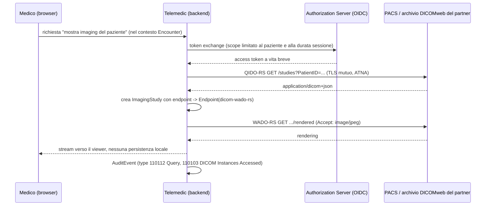

# R1 - Standard e terminologie sanitarie per Telemedic

> **Agente**: R1 (ricerca standard e protocolli)
> **Data della ricerca**: 25 agosto 2026
> **Ambito**: fonti primarie (hl7.org, terminology.hl7.org, profiles.ihe.net, dicom.nema.org, loinc.org, snomed.org, hl7.it, specifications.openehr.org)
> **Regola R0 applicata**: nessun nome di azienda, prodotto commerciale o dominio di potenziale partner compare in questo documento. Dove uno standard include codici che nominano piattaforme commerciali, il fatto è riportato ma i nomi sono omessi.

## 0. Metodo, legenda e livelli di affidabilità

Ogni affermazione normativa è accompagnata dall'URL della specifica. Per distinguere il grado di verifica si usano tre marcatori:

| Marcatore | Significato |
|---|---|
| **[V]** | Verificato direttamente sulla pagina della specifica citata durante questa ricerca. |
| **[V-sec]** | Verificato su fonte secondaria autorevole (mirror di uno standard, sito di ente nazionale) perché la fonte primaria non era raggiungibile o è a pagamento. |
| **[NV]** | **Non verificato**. Riportato solo come indicazione da confermare; da non usare come base normativa. |

Le versioni degli standard citate sono quelle rilevate alla data della ricerca. Poiché IHE e HL7 Italia pubblicano revisioni frequenti, ogni riferimento a una revisione va ricontrollato prima del rilascio v1.0.

---

## 1. FHIR R4: identità della versione e implicazioni

### 1.1 Numeri di versione esatti

| Release | Versione | Data di pubblicazione | Note |
|---|---|---|---|
| R4 | 4.0.0 | 27 dicembre 2018 | "R4: First Normative content, with many significant changes" **[V]** |
| R4 Technical Correction | **4.0.1** | **30 ottobre 2019** | "Corrections to invariants & generated conformance resources, and add ANSI Normative Status Notes" **[V]** |
| R4B | 4.3.0 | 28 maggio 2022 | Evoluzione limitata di R4 **[V]** |
| R5 | 5.0.0 | - | Release corrente della specifica core **[V]** |

Fonte: <https://hl7.org/fhir/R4/history.html>; <https://hl7.org/fhir/R4B/summary.html>.

La pagina di ogni risorsa R4 riporta l'intestazione `"v4.0.1: R4 - Mixed Normative and STU"` **[V]** (<https://hl7.org/fhir/R4/encounter.html>). Quando Telemedic dichiara "FHIR R4" deve dichiarare **4.0.1**, non "R4" generico: 4.0.0 e 4.0.1 differiscono negli invarianti e nelle risorse di conformance generate, e i validatori si comportano diversamente.

Nel content negotiation la versione si esprime come parametro del media type: `Accept: application/fhir+json; fhirVersion=4.0` (i valori ammessi sono `0.0`, `1.0`, `3.0`, `4.0`) **[V]** - §3.1.0.1.10 di <https://hl7.org/fhir/R4/http.html>.

---

## 2. Risorse FHIR R4 rilevanti per un consulto di telemedicina

### 2.1 `Encounter`

Struttura completa, con cardinalità e binding, da <https://hl7.org/fhir/R4/encounter.html> **[V]**:

| Elemento | Card. | Tipo | Binding (forza) |
|---|---|---|---|
| `identifier` | 0..* | Identifier | - |
| `status` | 1..1 | code | `encounter-status` (**required**) |
| `statusHistory` | 0..* | BackboneElement | - |
| `statusHistory.status` | 1..1 | code | `encounter-status` (required) |
| `statusHistory.period` | 1..1 | Period | - |
| `class` | **1..1** | **Coding** | v3 `ActEncounterCode` (**extensible**) |
| `classHistory` | 0..* | BackboneElement | - |
| `classHistory.class` | 1..1 | Coding | ActEncounterCode (extensible) |
| `classHistory.period` | 1..1 | Period | - |
| `type` | 0..* | CodeableConcept | Encounter type (example) |
| `serviceType` | 0..1 | CodeableConcept | Service type (example) |
| `priority` | 0..1 | CodeableConcept | v3 ActPriority (example) |
| `subject` | 0..1 | Reference(Patient \| Group) | - |
| `episodeOfCare` | 0..* | Reference(EpisodeOfCare) | - |
| `basedOn` | 0..* | Reference(ServiceRequest) | - |
| `participant` | 0..* | BackboneElement | - |
| `participant.type` | 0..* | CodeableConcept | Participant type (extensible) |
| `participant.period` | 0..1 | Period | - |
| `participant.individual` | 0..1 | Reference(**Practitioner \| PractitionerRole \| RelatedPerson**) | - |
| `appointment` | 0..* | Reference(Appointment) | - |
| `period` | 0..1 | Period | - |
| `length` | 0..1 | Duration | - |
| `reasonCode` | 0..* | CodeableConcept | Encounter Reason Codes (**preferred**) |
| `reasonReference` | 0..* | Reference(Condition \| Procedure \| Observation \| ImmunizationRecommendation) | - |
| `diagnosis` | 0..* | BackboneElement | - |
| `diagnosis.condition` | 1..1 | Reference(Condition \| Procedure) | - |
| `diagnosis.use` | 0..1 | CodeableConcept | DiagnosisRole (preferred) |
| `diagnosis.rank` | 0..1 | positiveInt | - |
| `account` | 0..* | Reference(Account) | - |
| `hospitalization` | 0..1 | BackboneElement | (non rilevante per la televisita) |
| `location` | 0..* | BackboneElement | - |
| `location.location` | 1..1 | Reference(Location) | - |
| `location.status` | 0..1 | code | EncounterLocationStatus (required) |
| `location.physicalType` | 0..1 | CodeableConcept | Location type (example) |
| `location.period` | 0..1 | Period | - |
| `serviceProvider` | 0..1 | Reference(Organization) | - |
| `partOf` | 0..1 | Reference(Encounter) | - |

**Punti che vincolano il design di Telemedic:**

1. `Encounter.participant.individual` **non può referenziare `Patient`** **[V]**. Il paziente è espresso da `Encounter.subject`. Modellare il paziente come participant è un errore di conformità che i validatori segnalano.
2. `Encounter.class` è **1..1 obbligatorio** in R4 (in R5 diventa 0..*, cfr. §5) **[V]**.
3. `Encounter.reasonCode` ha binding **preferred** al value set `http://hl7.org/fhir/ValueSet/encounter-reason`, che include SNOMED CT per `is-a 404684003` (clinical finding), `is-a 71388002` (procedure), `is-a 243796009` (situation with explicit context), `is-a 272379006` (event), per un'espansione di circa 4.000 codici **[V]** (<https://hl7.org/fhir/R4/valueset-encounter-reason.html>). Preferred significa che un codice diverso è ammesso, ma l'uso di SNOMED CT qui è la strada battuta - e qui si apre il problema della licenza in Italia (§9.1).

#### 2.1.1 Il codice della modalità virtuale

Value set: `http://terminology.hl7.org/ValueSet/v3-ActEncounterCode`
Code system: **`http://terminology.hl7.org/CodeSystem/v3-ActCode`** **[V]**
(<https://terminology.hl7.org/5.5.0/ValueSet-v3-ActEncounterCode.html>)

| Code | Display | Definizione (estratto) |
|---|---|---|
| `AMB` | ambulatory | assistenza in struttura, non residenziale |
| `EMER` | emergency | urgenza |
| `FLD` | field | fuori struttura e fuori dal domicilio |
| `HH` | home health | al domicilio del paziente |
| `IMP` | inpatient encounter | ricovero |
| `ACUTE` | inpatient acute | ricovero per acuti |
| `NONAC` | inpatient non-acute | ricovero non per acuti |
| `OBSENC` | observation encounter | osservazione |
| `PRENC` | pre-admission | pre-ricovero |
| `SS` | short stay | degenza breve |
| **`VR`** | **virtual** | *"A patient encounter where the patient and the practitioner(s) are not in the same physical location."* Gli esempi citati includono teleconferenza e scambio di e-mail. **[V]** |

**`VR` è il codice della televisita.** Va notato che la definizione è deliberatamente ampia e copre anche modalità asincrone: `class = VR` da solo non dice "videoconsulto in tempo reale". Serve una qualificazione aggiuntiva (§2.10).

#### 2.1.2 Stati dell'`Encounter`

ValueSet `http://hl7.org/fhir/ValueSet/encounter-status`, CodeSystem `http://hl7.org/fhir/encounter-status` **[V]** (<https://hl7.org/fhir/R4/valueset-encounter-status.html>). Nove codici:

| Code | Definizione |
|---|---|
| `planned` | "The Encounter has not yet started." |
| `arrived` | Il paziente è presente ma non sta ancora incontrando il professionista. |
| `triaged` | Priorità assegnata in base alla gravità. |
| `in-progress` | "The Encounter has begun and the patient is present / the practitioner and the patient are meeting." |
| `onleave` | Iniziato, paziente temporaneamente assente. |
| `finished` | "The Encounter has ended." |
| `cancelled` | "The Encounter has ended before it has begun." |
| `entered-in-error` | Non doveva far parte della cartella. |
| `unknown` | Valore di ultima istanza. |

Mappatura naturale sul ciclo di vita di una sessione WebRTC:

```mermaid
stateDiagram-v2
    [*] --> planned: Appointment booked
    planned --> arrived: paziente in waiting room
    arrived --> in-progress: primo peer connesso + medico presente
    in-progress --> onleave: peer disconnesso, riconnessione attesa
    onleave --> in-progress: ICE restart riuscito
    in-progress --> finished: chiusura sessione
    planned --> cancelled: disdetta
    arrived --> cancelled: no-show / rinuncia
    finished --> [*]
    cancelled --> [*]
```

`statusHistory` (0..*, con `status` 1..1 e `period` 1..1) è il posto corretto in cui persistere questa traiettoria in FHIR - e si affianca, senza sostituirla, alla tabella `_aud` di Hibernate Envers dichiarata nel brief.

### 2.2 `Appointment` e `AppointmentResponse`

`Appointment` - <https://hl7.org/fhir/R4/appointment.html> **[V]**:

| Elemento | Card. | Tipo |
|---|---|---|
| `identifier` | 0..* | Identifier |
| `status` | 1..1 | code (required) |
| `cancelationReason` | 0..1 | CodeableConcept |
| `serviceCategory` | 0..* | CodeableConcept |
| `serviceType` | 0..* | CodeableConcept |
| `specialty` | 0..* | CodeableConcept |
| `appointmentType` | 0..1 | CodeableConcept |
| `reasonCode` | 0..* | CodeableConcept |
| `reasonReference` | 0..* | Reference(Condition \| Procedure \| Observation \| ImmunizationRecommendation) |
| `priority` | 0..1 | unsignedInt |
| `description` | 0..1 | string |
| `supportingInformation` | 0..* | Reference(Any) |
| `start` | 0..1 | instant |
| `end` | 0..1 | instant |
| `minutesDuration` | 0..1 | positiveInt |
| `slot` | 0..* | Reference(Slot) |
| `created` | 0..1 | dateTime |
| `comment` | 0..1 | string |
| `patientInstruction` | 0..1 | string |
| `basedOn` | 0..* | Reference(ServiceRequest) |
| **`participant`** | **1..*** | BackboneElement |
| `participant.type` | 0..* | CodeableConcept |
| `participant.actor` | 0..1 | Reference(Patient \| Practitioner \| PractitionerRole \| RelatedPerson \| Device \| HealthcareService \| Location) |
| `participant.required` | 0..1 | code (required): `required` \| `optional` \| `information-only` |
| `participant.status` | **1..1** | code (required): `accepted` \| `declined` \| `tentative` \| `needs-action` |
| `participant.period` | 0..1 | Period |
| `requestedPeriod` | 0..* | Period |

Stati (`AppointmentStatus`, binding required) **[V]**: `proposed`, `pending`, `booked`, `arrived`, `fulfilled`, `cancelled`, `noshow`, `entered-in-error`, `checked-in`, `waitlist`.

`AppointmentResponse` - <https://hl7.org/fhir/R4/appointmentresponse.html> **[V]**:

| Elemento | Card. | Tipo |
|---|---|---|
| `identifier` | 0..* | Identifier |
| `appointment` | **1..1** | Reference(Appointment) |
| `start` | 0..1 | instant |
| `end` | 0..1 | instant |
| `participantType` | 0..* | CodeableConcept (extensible) |
| `actor` | 0..1 | Reference(Patient \| Practitioner \| PractitionerRole \| RelatedPerson \| Device \| HealthcareService \| Location) |
| `participantStatus` | **1..1** | code (required, `ParticipationStatus`) |
| `comment` | 0..1 | string |

**Invariante**: o `participantType` o `actor` devono essere valorizzati **[V]**.

Il flusso descritto dalla specifica: il richiedente crea un `Appointment` con `status = proposed` e i partecipanti a `needs-action`; i partecipanti rispondono con `AppointmentResponse` (o aggiornando il proprio `participant.status`); quando tutti hanno risposto, lo stato complessivo dell'`Appointment` viene aggiornato **[V]**.

**Implicazione per il vincolo 6.2.4 del brief** (l'agenda nasce nel sistema del partner): Telemedic riceve un `Appointment` già in stato `booked` e non deve gestire il negoziato `proposed → pending → booked`. `AppointmentResponse` serve invece nel caso d'uso "il paziente conferma la partecipazione al link della televisita".

Va notato che `Appointment` in R4 **non ha un elemento per l'indirizzo della sessione virtuale**: non esiste `Appointment.virtualService` in R4 (esiste in R5, cfr. §5.3). In R4 il link va veicolato tramite estensione o tramite `Appointment.supportingInformation` → `Endpoint`, oppure `patientInstruction` (che però è testo libero e non machine-readable).

### 2.3 Anagrafiche: `Patient`, `Practitioner`, `PractitionerRole`, `Organization`, `RelatedPerson`

`Patient` - <https://hl7.org/fhir/R4/patient.html> **[V]**:

| Elemento | Card. | Tipo | Binding |
|---|---|---|---|
| `identifier` | 0..* | Identifier | - |
| `active` | 0..1 | boolean | - |
| `name` | 0..* | HumanName | - |
| `telecom` | 0..* | ContactPoint | - |
| `gender` | 0..1 | code | AdministrativeGender (required) |
| `birthDate` | 0..1 | date | - |
| `deceased[x]` | 0..1 | boolean \| dateTime | - |
| `address` | 0..* | Address | - |
| `maritalStatus` | 0..1 | CodeableConcept | MaritalStatus (extensible) |
| `multipleBirth[x]` | 0..1 | boolean \| integer | - |
| `photo` | 0..* | Attachment | - |
| `contact.relationship` | 0..* | CodeableConcept | Patient Contact Relationship (extensible) |
| `contact.name` / `.telecom` / `.address` / `.gender` / `.organization` / `.period` | 0..1 / 0..* | - | - |
| `communication.language` | 1..1 | CodeableConcept | Common Languages (preferred) |
| `communication.preferred` | 0..1 | boolean | - |
| `generalPractitioner` | 0..* | Reference(Organization \| Practitioner \| PractitionerRole) | - |
| `managingOrganization` | 0..1 | Reference(Organization) | - |
| `link.other` | 1..1 | Reference(Patient \| RelatedPerson) | - |
| `link.type` | 1..1 | code | LinkType (required) |

`PractitionerRole` - <https://hl7.org/fhir/R4/practitionerrole.html> **[V]**:

| Elemento | Card. | Tipo | Binding |
|---|---|---|---|
| `active` | 0..1 | boolean | - |
| `period` | 0..1 | Period | - |
| `practitioner` | 0..1 | Reference(Practitioner) | - |
| `organization` | 0..1 | Reference(Organization) | - |
| `code` | 0..* | CodeableConcept | Practitioner role (example) |
| `specialty` | 0..* | CodeableConcept | Practice Setting Code (preferred) |
| `location` | 0..* | Reference(Location) | - |
| `healthcareService` | 0..* | Reference(HealthcareService) | - |
| `telecom` | 0..* | ContactPoint | - |
| `availableTime` / `notAvailable` | 0..* | BackboneElement | - |
| `availabilityExceptions` | 0..1 | string | - |
| `endpoint` | 0..* | Reference(Endpoint) | - |

La specifica distingue: `Practitioner` contiene i dati della persona e le sue qualifiche; `PractitionerRole` documenta *"location and types of services that Practitioners are able to provide for an organization"* - cioè lo scope nel contesto organizzativo, non le credenziali personali **[V]**.

**Conseguenza vincolante per Telemedic**: in un contesto multi-tenant, il medico che eroga una televisita **deve** essere referenziato tramite `PractitionerRole`, non tramite `Practitioner`, perché è il ruolo (medico X, presso organizzazione Y, con specialità Z) a essere pertinente al tenant. Questo è coerente con il vincolo V4 (tenant-awareness) del brief.

`RelatedPerson` (caregiver, genitore, tutore) è il tipo corretto per il terzo partecipante non professionista alla videochiamata; è infatti uno dei target ammessi da `Encounter.participant.individual` **[V]**.

### 2.4 `DiagnosticReport` vs `DocumentReference` vs `Composition`: quale usare e quando

Questa è la scelta di modellazione più delicata del progetto, perché il brief dichiara la produzione di `DiagnosticReport` a fine sessione (§3.3) e il vincolo V2 impone che tale produzione sia "persistenza di contenuto redatto dal medico".

#### `DiagnosticReport` - <https://hl7.org/fhir/R4/diagnosticreport.html> **[V]**

| Elemento | Card. | Tipo | Binding |
|---|---|---|---|
| `identifier` | 0..* | Identifier | - |
| `basedOn` | 0..* | Reference(CarePlan \| ImmunizationRecommendation \| MedicationRequest \| NutritionOrder \| ServiceRequest) | - |
| `status` | 1..1 | code | DiagnosticReportStatus (required) |
| `category` | 0..* | CodeableConcept | Diagnostic Service Section Codes (example) |
| `code` | **1..1** | CodeableConcept | LOINC Diagnostic Report Codes (**preferred**) |
| `subject` | 0..1 | Reference(Patient \| Group \| Device \| Location) | - |
| `encounter` | 0..1 | Reference(Encounter) | - |
| `effective[x]` | 0..1 | dateTime \| Period | - |
| `issued` | 0..1 | instant | - |
| `performer` | 0..* | Reference(Practitioner \| PractitionerRole \| Organization \| CareTeam) | - |
| `resultsInterpreter` | 0..* | Reference(Practitioner \| PractitionerRole \| Organization \| CareTeam) | - |
| `specimen` | 0..* | Reference(Specimen) | - |
| `result` | 0..* | Reference(Observation) | - |
| `imagingStudy` | 0..* | Reference(ImagingStudy) | - |
| `media.comment` | 0..1 | string | - |
| `media.link` | 1..1 | Reference(Media) | - |
| `conclusion` | 0..1 | string | - |
| `conclusionCode` | 0..* | CodeableConcept | SNOMED CT Clinical Findings (example) |
| `presentedForm` | 0..* | Attachment | - |

La sezione *Boundaries and Relationships* afferma che `DiagnosticReport` *"typically includes additional clinical context and some mix of atomic results, images, imaging reports, textual and coded interpretation, and formatted representations"*, che referti di laboratorio, anatomia patologica e imaging devono usare `DiagnosticReport`, mentre per referti prevalentemente narrativi e con minore struttura di workflow *"the Composition resource would be more appropriate"* **[V]**.

#### `DocumentReference` - <https://hl7.org/fhir/R4/documentreference.html> **[V]**

| Elemento | Card. | Tipo | Binding |
|---|---|---|---|
| `masterIdentifier` | 0..1 | Identifier | - |
| `identifier` | 0..* | Identifier | - |
| `status` | 1..1 | code | DocumentReferenceStatus (required) |
| `docStatus` | 0..1 | code | CompositionStatus (required) |
| `type` | 0..1 | CodeableConcept | Document Type (preferred) |
| `category` | 0..* | CodeableConcept | Document Class (example) |
| `subject` | 0..1 | Reference(Patient \| Practitioner \| Group \| Device) | - |
| `date` | 0..1 | instant | - |
| `author` | 0..* | Reference(Practitioner \| PractitionerRole \| Organization \| Device \| Patient \| RelatedPerson) | - |
| `authenticator` | 0..1 | Reference(Practitioner \| PractitionerRole \| Organization) | - |
| `custodian` | 0..1 | Reference(Organization) | - |
| `relatesTo.code` | 1..1 | code | DocumentRelationshipType (required) |
| `relatesTo.target` | 1..1 | Reference(DocumentReference) | - |
| `description` | 0..1 | string | - |
| `securityLabel` | 0..* | CodeableConcept | SecurityLabels (extensible) |
| **`content`** | **1..*** | BackboneElement | - |
| `content.attachment` | 1..1 | Attachment | - |
| `content.format` | 0..1 | Coding | DocumentReference Format Code Set (preferred) |
| `context.encounter` | 0..* | Reference(Encounter \| EpisodeOfCare) | - |
| `context.event` | 0..* | CodeableConcept | v3 ActCode (example) |
| `context.period` | 0..1 | Period | - |
| `context.facilityType` | 0..1 | CodeableConcept | Facility Type (example) |
| `context.practiceSetting` | 0..1 | CodeableConcept | Practice Setting (example) |
| `context.sourcePatientInfo` | 0..1 | Reference(Patient) | - |
| `context.related` | 0..* | Reference(Any) | - |

La specifica sottolinea che *"DocumentReference is metadata describing a document"*, distinta dal contenuto, e che *"Typically, DocumentReference resources are used in document indexing systems, such as IHE XDS, profiled in IHE Mobile access to Health Documents"* **[V]**. È quindi la risorsa-ponte verso IHE MHD/XDS (§7.4).

#### `Composition` - <https://hl7.org/fhir/R4/composition.html> **[V]**

| Elemento | Card. | Tipo | Binding |
|---|---|---|---|
| `identifier` | 0..1 | Identifier | - |
| `status` | 1..1 | code | CompositionStatus (required) |
| `type` | **1..1** | CodeableConcept | FHIR Document Type Codes (preferred) |
| `category` | 0..* | CodeableConcept | Document Class (example) |
| `subject` | 0..1 | Reference(Any) | - |
| `encounter` | 0..1 | Reference(Encounter) | - |
| `date` | **1..1** | dateTime | - |
| `author` | **1..*** | Reference(Practitioner \| PractitionerRole \| Device \| Patient \| RelatedPerson \| Organization) | - |
| `title` | **1..1** | string | - |
| `confidentiality` | 0..1 | code | v3 ConfidentialityClassification (required) |
| `attester` | 0..* | BackboneElement | - |
| `custodian` | 0..1 | Reference(Organization) | - |
| `relatesTo` | 0..* | BackboneElement | - |
| `event` | 0..* | BackboneElement | - |
| `section` | 0..* | BackboneElement | - |

Il paradigma documentale FHIR (§3.3 di <https://hl7.org/fhir/R4/documents.html>) stabilisce **[V]**:

- un documento FHIR è un `Bundle` con `type = document` e la `Composition` come **prima entry**;
- l'identità è in `Bundle.identifier` (globalmente univoco, mai riusato) e opzionalmente in `Composition.identifier`;
- *"once assembled into a bundle, the document is immutable - its content can never be changed, and the document id can never be reused"*;
- le firme digitali si applicano al Bundle, idealmente da parte degli attester elencati;
- l'operazione `$document` genera il bundle a partire dalla `Composition`;
- *"FHIR documents are for documents authored in FHIR, while the document reference resource is for general references to pre-existing documents"*.

#### Criterio decisionale

| Situazione | Risorsa corretta | Motivazione |
|---|---|---|
| Referto strutturato con esiti atomici (`Observation`) e interpretazione, prodotto da un servizio diagnostico | `DiagnosticReport` | Progettato per il mix risultati atomici + interpretazione **[V]** |
| Referto narrativo clinico organizzato in sezioni, immutabile e firmabile | `Composition` dentro `Bundle` type=`document` | Meno workflow, più narrativa; immutabilità e firma sono proprietà del paradigma documentale **[V]** |
| Indicizzazione/condivisione di un documento già esistente (PDF firmato, CDA2, referto esterno) | `DocumentReference` | Metadati su documento preesistente; ponte verso XDS/MHD **[V]** |

**Raccomandazione operativa per Telemedic** (motivata dal vincolo V2): il referto di televisita è per sua natura **narrativo e redatto dal medico**, non generato da un servizio diagnostico automatico. Il pattern corretto è quindi:

`Composition` (referto, sezioni LOINC) → serializzata in `Bundle` type=`document` → firmata → indicizzata da un `DocumentReference` → esposta al sistema di origine.

Il `DiagnosticReport` dichiarato pubblicamente sul sito va **mantenuto come vista di compatibilità** (molti EHR sanno consumare solo `DiagnosticReport`), popolando `DiagnosticReport.presentedForm` con l'attachment firmato e `DiagnosticReport.conclusion` con il testo redatto dal medico - mai con testo generato dal sistema. Questa scelta va formalizzata in un ADR.

**Conferma sul campo italiano**: l'IG HL7 Italia *Televisita* modella il referto esattamente così, con `CompositionRefertoTelevisita` (cfr. §2.10.2).

### 2.5 `Observation`

<https://hl7.org/fhir/R4/observation.html> **[V]**:

| Elemento | Card. | Tipo |
|---|---|---|
| `status` | 1..1 | code (required: `registered \| preliminary \| final \| amended +`) |
| `category` | 0..* | CodeableConcept |
| `code` | **1..1** | CodeableConcept |
| `subject` | 0..1 | Reference(Patient \| Group \| Device \| Location) |
| `focus` | 0..* | Reference(Any) |
| `encounter` | 0..1 | Reference(Encounter) |
| `effective[x]` | 0..1 | dateTime \| Period \| Timing \| instant |
| `issued` | 0..1 | instant |
| `performer` | 0..* | Reference(Practitioner \| PractitionerRole \| Organization \| CareTeam \| Patient \| RelatedPerson) |
| `value[x]` | 0..1 | Quantity \| CodeableConcept \| string \| boolean \| integer \| Range \| Ratio \| SampledData \| time \| dateTime \| Period |
| `dataAbsentReason` | 0..1 | CodeableConcept |
| `interpretation` | 0..* | CodeableConcept |
| `note` | 0..* | Annotation |
| `bodySite` | 0..1 | CodeableConcept |
| `method` | 0..1 | CodeableConcept |
| `specimen` | 0..1 | Reference(Specimen) |
| `device` | 0..1 | Reference(Device \| DeviceMetric) |
| `referenceRange` | 0..* | BackboneElement |
| `hasMember` | 0..* | Reference(Observation \| QuestionnaireResponse \| MolecularSequence) |
| `derivedFrom` | 0..* | Reference(DocumentReference \| ImagingStudy \| Media \| QuestionnaireResponse \| Observation \| MolecularSequence) |
| `component` | 0..* | BackboneElement |

URI canonici: ValueSet `http://hl7.org/fhir/ValueSet/observation-status`; il code system di categoria è `http://terminology.hl7.org/CodeSystem/observation-category` **[NV - l'URI esatto della categoria non è stato letto direttamente sulla pagina; verificare prima dell'uso normativo]**.

**Nota critica**: la lista `value[x]` sopra è quella **verificata** sulla pagina R4. Non esistono in R4 `valueAttachment` né `valueReference` su `Observation`: chi progetta il salvataggio di metriche WebRTC come `Observation` deve limitarsi ai tipi elencati (per RTT/jitter/packet loss: `valueQuantity` con unità UCUM).

**Avvertenza architetturale**: il brief prevede TimescaleDB per le metriche di qualità. Non trasformare ogni campione RTT in una `Observation` FHIR: le metriche di rete **non sono osservazioni cliniche** e inquinerebbero la cartella del paziente. Sono dato tecnico. Se e quando servisse esporle in FHIR (ad esempio per un report di qualità del servizio), usare `Observation` con `subject` che punta a `Device`/`Location` e non a `Patient`, oppure non usare FHIR affatto.

### 2.6 `Condition`

<https://hl7.org/fhir/R4/condition.html> **[V]**:

| Elemento | Card. | Tipo | Binding |
|---|---|---|---|
| `identifier` | 0..* | Identifier | - |
| `clinicalStatus` | 0..1 | CodeableConcept (modifier) | required: `active \| recurrence \| relapse \| inactive \| remission \| resolved` |
| `verificationStatus` | 0..1 | CodeableConcept (modifier) | required: `unconfirmed \| provisional \| differential \| confirmed \| refuted \| entered-in-error` |
| `category` | 0..* | CodeableConcept | extensible: `problem-list-item \| encounter-diagnosis` |
| `severity` | 0..1 | CodeableConcept | preferred |
| `code` | 0..1 | CodeableConcept | example |
| `bodySite` | 0..* | CodeableConcept | example |
| `subject` | **1..1** | Reference(Patient \| Group) | - |
| `encounter` | 0..1 | Reference(Encounter) | - |
| `onset[x]` | 0..1 | dateTime \| Age \| Period \| Range \| string | - |
| `abatement[x]` | 0..1 | dateTime \| Age \| Period \| Range \| string | - |
| `recordedDate` | 0..1 | dateTime | - |
| `recorder` | 0..1 | Reference(Practitioner \| PractitionerRole \| Patient \| RelatedPerson) | - |
| `asserter` | 0..1 | Reference(Practitioner \| PractitionerRole \| Patient \| RelatedPerson) | - |
| `stage` / `evidence` | 0..* | BackboneElement | - |
| `note` | 0..* | Annotation | - |

Invarianti verbatim **[V]**:
1. *"Condition.clinicalStatus SHALL be present if verificationStatus is not entered-in-error and category is problem-list-item"*
2. *"Condition.clinicalStatus SHALL NOT be present if verificationStatus is entered-in-error"*
3. Se la condizione è cessata (`abatement[x]` presente), `clinicalStatus` deve essere `inactive`, `resolved` o `remission`.

Questi tre invarianti sono la prima causa di fallimento di validazione nelle implementazioni reali: vanno codificati come regole di dominio nel backend, non lasciati al validatore a runtime.

### 2.7 `Consent`

<https://hl7.org/fhir/R4/consent.html> **[V]**:

| Elemento | Card. | Tipo | Binding |
|---|---|---|---|
| `identifier` | 0..* | Identifier | - |
| `status` | 1..1 | code (modifier) | required: `draft \| proposed \| active \| rejected \| inactive \| entered-in-error` |
| `scope` | **1..1** | CodeableConcept (modifier) | extensible |
| `category` | **1..*** | CodeableConcept | extensible |
| `patient` | 0..1 | Reference(Patient) | - |
| `dateTime` | 0..1 | dateTime | - |
| `performer` | 0..* | Reference(Organization \| Patient \| Practitioner \| RelatedPerson \| PractitionerRole) | - |
| `organization` | 0..* | Reference(Organization) | - |
| `source[x]` | 0..1 | Attachment \| Reference(Consent \| DocumentReference \| Contract \| QuestionnaireResponse) | - |
| `policy.authority` | 0..* | uri | - |
| `policy.uri` | 0..* | uri | - |
| `policyRule` | 0..1 | CodeableConcept | extensible |
| `verification.verified` | 1..1 | boolean | - |
| `verification.verifiedWith` | 0..1 | Reference(Patient \| RelatedPerson) | - |
| `verification.verificationDate` | 0..1 | dateTime | - |
| `provision.type` | 0..1 | code | `deny \| permit` |
| `provision.period` | 0..1 | Period | - |
| `provision.actor` | 0..* | BackboneElement (role + reference obbligatori) | - |
| `provision.action` | 0..* | CodeableConcept | - |
| `provision.securityLabel` / `.purpose` / `.class` | 0..* | Coding | - |
| `provision.code` | 0..* | CodeableConcept | - |
| `provision.dataPeriod` | 0..1 | Period | - |
| `provision.data` | 0..* | BackboneElement (meaning + reference obbligatori) | - |
| `provision.provision` | 0..* | (ricorsivo) | - |

Value set `consent-scope` (`http://hl7.org/fhir/ValueSet/consent-scope`), CodeSystem **`http://terminology.hl7.org/CodeSystem/consentscope`** **[V]** (<https://hl7.org/fhir/R4/valueset-consent-scope.html>), quattro codici: `adr` (Advanced Care Directive), `research`, **`patient-privacy`** (Privacy Consent), `treatment`.

**Applicazione a Telemedic**: il consenso alla registrazione cifrata (feature 6 del brief) va modellato con `scope = patient-privacy`, `provision.type = permit`, `provision.period` che delimita la retention e `provision.action` che identifica l'azione consentita. La revoca è una **transizione a `inactive`** con `Provenance` associata, non una cancellazione.

### 2.8 `AuditEvent` e `Provenance`

`AuditEvent` - <https://hl7.org/fhir/R4/auditevent.html> **[V]**:

| Elemento | Card. | Tipo | Binding |
|---|---|---|---|
| `type` | **1..1** | Coding | Audit Event ID (extensible) |
| `subtype` | 0..* | Coding | Audit Event Sub-Type (extensible) |
| `action` | 0..1 | code | AuditEventAction (required) |
| `period` | 0..1 | Period | - |
| `recorded` | **1..1** | instant | - |
| `outcome` | 0..1 | code | AuditEventOutcome (required) |
| `outcomeDesc` | 0..1 | string | - |
| `purposeOfEvent` | 0..* | CodeableConcept | PurposeOfUse (extensible) |
| **`agent`** | **1..*** | BackboneElement | - |
| `agent.type` | 0..1 | CodeableConcept | - |
| `agent.role` | 0..* | CodeableConcept | - |
| `agent.who` | 0..1 | Reference | - |
| `agent.altId` | 0..1 | string | - |
| `agent.name` | 0..1 | string | - |
| `agent.requestor` | **1..1** | boolean | - |
| `agent.location` | 0..1 | Reference(Location) | - |
| `agent.policy` | 0..* | uri | - |
| `agent.media` | 0..1 | Coding | - |
| `agent.network.address` | 0..1 | string | - |
| `agent.network.type` | 0..1 | code (required) | - |
| `agent.purposeOfUse` | 0..* | CodeableConcept | - |
| **`source`** | **1..1** | BackboneElement | - |
| `source.site` | 0..1 | string | - |
| `source.observer` | **1..1** | Reference | - |
| `source.type` | 0..* | Coding | - |
| `entity` | 0..* | BackboneElement (what, type, role, lifecycle, securityLabel, name, description, query, detail) | - |
| `entity.detail.type` | 1..1 | string | - |
| `entity.detail.value[x]` | 1..1 | string \| base64Binary | - |

La specifica dichiara **[V]**: *"The audit event is based on the IHE-ATNA Audit record definitions, originally from RFC 3881, and now managed by DICOM"*, con modello informativo normativo derivato da **DICOM PS3.15 Annex A.5**, ed è *"managed collaboratively between HL7, DICOM, and IHE"*.

Value set `audit-event-type` **[V]** (<https://hl7.org/fhir/R4/valueset-audit-event-type.html>), 43 concetti da tre code system:
- `http://dicom.nema.org/resources/ontology/DCM` - 15 codici (110100 Application Activity … 110114 User Authentication);
- `http://terminology.hl7.org/CodeSystem/audit-event-type` - include **`rest`** ("RESTful Operation", *"Execution of a RESTful operation as defined by FHIR"*);
- `http://terminology.hl7.org/CodeSystem/iso-21089-lifecycle` - 27 codici di ciclo di vita (access, disclose, transmit, deidentify, …).

`Provenance` - <https://hl7.org/fhir/R4/provenance.html> **[V]**:

| Elemento | Card. | Tipo | Binding |
|---|---|---|---|
| `target` | **1..*** | Reference(Any) | - |
| `occurred[x]` | 0..1 | Period \| dateTime | - |
| `recorded` | **1..1** | instant | - |
| `policy` | 0..* | uri | - |
| `location` | 0..1 | Reference(Location) | - |
| `reason` | 0..* | CodeableConcept | v3 PurposeOfUse (extensible) |
| `activity` | 0..1 | CodeableConcept | ProvenanceActivityType (extensible) |
| `agent` | **1..*** | BackboneElement | - |
| `agent.type` | 0..1 | CodeableConcept | ProvenanceParticipantType (extensible) |
| `agent.role` | 0..* | CodeableConcept | SecurityRoleType (example) |
| `agent.who` | **1..1** | Reference(Practitioner \| PractitionerRole \| RelatedPerson \| Patient \| Device \| Organization) | - |
| `agent.onBehalfOf` | 0..1 | Reference(idem) | - |
| `entity.role` | **1..1** | code (required: `derivation \| revision \| quotation \| source \| removal`) | - |
| `entity.what` | **1..1** | Reference(Any) | - |
| `entity.agent` | 0..* | (riferimento a Provenance.agent) | - |
| `signature` | 0..* | Signature | - |

Confine `Provenance` / `AuditEvent`, verbatim dalla specifica **[V]**:

> *"Provenance resources are prepared by the application that initiates the create/update etc. of the resource. An AuditEvent resource contains overlapping information, but is created as events occur, to track and audit the events. AuditEvent resources are often (though not exclusively) created by the application responding to the read/query/create/update/etc. event."*

**Traduzione operativa per Telemedic**: `Provenance` risponde a "da dove viene questo dato e chi lo ha prodotto" (catena di custodia del referto: chi lo ha redatto, quale sessione lo ha originato, quale firma lo attesta). `AuditEvent` risponde a "chi ha fatto cosa e quando" (accessi, letture, esportazioni). Il vincolo V5 (auditabilità immutabile) richiede **entrambi**, oltre a Envers. Envers è la garanzia interna di immutabilità del database; `AuditEvent` è la forma interoperabile esportabile verso un Audit Record Repository ATNA (§7.5); `Provenance` è la garanzia di attribuzione clinica ai fini MDR/IEC 62304.

### 2.9 `Communication`, `Media`, `Task`, `Endpoint`, `HealthcareService`

#### `Communication` - <https://hl7.org/fhir/R4/communication.html> **[V]**

Elementi salienti: `status` 1..1 (EventStatus, required), `category` 0..*, `priority` 0..1 (required), **`medium` 0..*** con binding *example* a `http://hl7.org/fhir/ValueSet/v3-ParticipationMode`, `subject` 0..1 Reference(Patient \| Group), `encounter` 0..1, `sent`/`received` 0..1 dateTime, `recipient` 0..*, `sender` 0..1, `payload.content[x]` 1..1 (string \| Attachment \| Reference(Any)), `inResponseTo` 0..* Reference(Communication), `about` 0..* Reference(Any), `note` 0..*.

Uso corretto in Telemedic: la **chat testuale** durante il consulto e le notifiche al paziente (promemoria, link di accesso). `Communication.medium` permette di distinguere il canale.

#### `Media` - <https://hl7.org/fhir/R4/media.html> **[V]**

`status` 1..1 (EventStatus), `type` 0..1 (MediaType, extensible), `modality` 0..1, `view` 0..1, `subject` 0..1, `encounter` 0..1, `created[x]` 0..1 (dateTime \| Period), `issued` 0..1, `operator` 0..1, `bodySite` 0..1, `deviceName` 0..1, `device` 0..1, `height`/`width`/`frames` 0..1 positiveInt, `duration` 0..1 decimal, **`content` 1..1 Attachment**, `note` 0..*.

La specifica R4 descrive `Media` come *"a specific type of Observation - one whose value comprises audio, video, or image data"* **[V]**.

**Attenzione alla longevità**: `Media` è presente in R4 **[V]** e in R4B **[V]** (<https://hl7.org/fhir/R4B/resourcelist.html>), ed è stata **rimossa in R5**, dove i riferimenti sono stati sostituiti da `DocumentReference` (per esempio in `DiagnosticReport`: *"Type Reference: Removed Target Type Media"*) **[V]** (<https://hl7.org/fhir/R5/diff.html>).

**Conseguenza per Telemedic**: modellare la registrazione video del consulto su `Media` significa scegliere una risorsa che non esiste nella release successiva. Il video registrato va modellato su **`DocumentReference`** con `content.attachment.contentType = "video/mp4"`, che sopravvive a R4 → R5 senza rifacimenti. Questa è una decisione di architettura, non uno stile.

#### `Task` - <https://hl7.org/fhir/R4/task.html> **[V]**

`status` 1..1 (required: `draft \| requested \| received \| accepted \| …`), `intent` 1..1 (required: `unknown \| proposal \| plan \| order \| original-order \| reflex-order \| filler-order \| instance-order \| option`), `priority` 0..1 (`routine \| urgent \| asap \| stat`), `businessStatus` 0..1, `code` 0..1, `focus` 0..1 Reference(Any), `for` 0..1 Reference(Any), `encounter` 0..1, `executionPeriod` 0..1, `authoredOn` / `lastModified` 0..1 dateTime, `requester` 0..1, `owner` 0..1, `location` 0..1, `restriction` 0..1 (repetitions, period, recipient), `input` / `output` 0..* con `type` 1..1 e `value[x]` 1..1, `relevantHistory` 0..* Reference(Provenance).

`Task` è la risorsa corretta per orchestrare un'attività asincrona attivata da un sistema terzo (ad esempio: "prepara la stanza virtuale per l'appuntamento X", "restituisci il referto al sistema di origine"), con `input`/`output` tipizzati.

#### `Endpoint` - <https://hl7.org/fhir/R4/endpoint.html> **[V]**

| Elemento | Card. | Tipo |
|---|---|---|
| `status` | 1..1 | code (modifier): `active \| suspended \| error \| off \| entered-in-error \| test` |
| `connectionType` | **1..1** | Coding |
| `name` | 0..1 | string |
| `managingOrganization` | 0..1 | Reference(Organization) |
| `contact` | 0..* | ContactPoint |
| `period` | 0..1 | Period |
| `payloadType` | **1..*** | CodeableConcept |
| `payloadMimeType` | 0..* | code |
| `address` | **1..1** | url |
| `header` | 0..* | string |

CodeSystem `http://terminology.hl7.org/CodeSystem/endpoint-connection-type`, versione **2.1.0** **[V]** (<https://terminology.hl7.org/5.5.0/CodeSystem-endpoint-connection-type.html>):

| Code | Display | Nota |
|---|---|---|
| `dicom-wado-rs` | DICOM WADO-RS | |
| `dicom-qido-rs` | DICOM QIDO-RS | |
| `dicom-stow-rs` | DICOM STOW-RS | |
| `dicom-wado-uri` | DICOM WADO-URI | |
| `hl7-fhir-rest` | HL7 FHIR | |
| `hl7-fhir-msg` | HL7 FHIR Messaging | |
| `hl7v2-mllp` | HL7 v2 MLLP | |
| `secure-email` | Secure email | |
| `direct-project` | Direct Project | |
| `cds-hooks-service` | CDS Hooks Service | |
| `ihe-xcpd` | IHE XCPD | **deprecato** in 2.1.0 |
| `ihe-xca` | IHE XCA | **deprecato** |
| `ihe-xdr` | IHE XDR | **deprecato** |
| `ihe-xds` | IHE XDS | **deprecato** |
| `ihe-iid` | IHE IID | **deprecato** |

**Non esiste in questo code system un codice per "WebRTC" o "videoconsulto"**. La pubblicazione dell'endpoint di signaling di Telemedic richiede quindi un code system proprietario (di progetto) o l'uso della `VirtualServiceDetail` di R5 retro-portata (§5.3). Questa è una lacuna reale dello standard, non un'omissione della ricerca.

#### `HealthcareService` - <https://hl7.org/fhir/R4/healthcareservice.html> **[V]**

`active`, `providedBy` Reference(Organization), `category` (Service category, example), `type` (Service type, example), `specialty` (Practice Setting, **preferred**), `location` 0..*, `name`, `comment`, `extraDetails` (markdown), `photo`, `telecom`, `coverageArea`, `serviceProvisionCode`, `eligibility`, `program`, `characteristic`, `communication` (Common Languages, preferred), `referralMethod` (ReferralMethod, example), `appointmentRequired` boolean, `availableTime`, `notAvailable`, `availabilityExceptions`, **`endpoint` 0..* Reference(Endpoint)**.

`HealthcareService` + `Endpoint` è il meccanismo standard per **pubblicare il servizio di telemedicina in un directory** (e si aggancia al profilo IHE mCSD, §7.9): "l'organizzazione X eroga il servizio di televisita cardiologica, raggiungibile all'endpoint Y".

### 2.10 Modellare correttamente una televisita in FHIR

#### 2.10.1 Che cosa dice davvero la specifica core

R4 offre **un solo elemento semantico** per la modalità virtuale: `Encounter.class = VR` dal code system `http://terminology.hl7.org/CodeSystem/v3-ActCode` **[V]**. Non esiste in R4:
- un elemento per l'indirizzo della sessione virtuale;
- una distinzione fra sincrono e asincrono;
- un codice per il tipo di canale.

R5 colma la lacuna introducendo `Encounter.virtualService` (0..*, tipo `VirtualServiceDetail`) **[V]** (<https://hl7.org/fhir/R5/encounter.html>). Struttura di `VirtualServiceDetail` **[V]** (<https://hl7.org/fhir/R5/metadatatypes.html>):

| Elemento | Card. | Tipo | Binding |
|---|---|---|---|
| `channelType` | 0..1 | Coding | Virtual Service Channel Type (**required**) |
| `address[x]` | 0..1 | url \| string \| ContactPoint | - |
| `additionalInfo` | 0..* | ExtendedContactDetail | - |
| `maxParticipants` | 0..1 | positiveInt | - |
| `sessionKey` | 0..1 | string | *"Session key or access code required to join the virtual service meeting or appointment."* |

Il code system associato è `http://hl7.org/fhir/virtual-service-type`, ValueSet `http://hl7.org/fhir/ValueSet/virtual-service-type` **[V]** (<https://hl7.org/fhir/R5/codesystem-virtual-service-type.html>). **Contiene solo tre codici, tutti riferiti a piattaforme di videoconferenza commerciali di terze parti** (i nomi sono omessi in ossequio alla regola R0). Nessuno di questi codici descrive una piattaforma self-hosted, e la pagina della specifica presenta anche un evidente errore redazionale nella definizione di uno dei tre codici (la definizione riportata parla di prezzi, non di conferenze) **[V]**.

Questo è un fatto rilevante: il binding di `channelType` è **required**, ma il value set è composto da marchi commerciali. Una piattaforma sovrana come Telemedic dovrà comunque estendere il code system (i binding required su value set THO ammettono l'estensione tramite processo UTG, e nella pratica gli IG nazionali definiscono code system propri).

Per usare `VirtualServiceDetail` **in R4** esiste il pacchetto ufficiale HL7 di cross-version extensions (`hl7.fhir.uv.xver-r5.r4` / `xver-r5.r4.r4b`), che espone `VirtualServiceDetail` di R5 come estensione utilizzabile in R2/R3/R4/R4B **[V-sec]** (<https://www.fhir.org/diff/StructureDefinition-xv-r5-vsd.maxParticipants.html>; pacchetto su Simplifier). **La versione del pacchetto rilevata è una snapshot pre-release (`0.0.1-snapshot-2`): non è materiale su cui costruire una v1.0 di produzione senza pinning esplicito e test di validazione. [V-sec]**

#### 2.10.2 Che cosa dice il realm italiano - e questo cambia le priorità del progetto

**HL7 Italia ha già pubblicato una famiglia completa di IG FHIR per la telemedicina** **[V]** (<https://www.hl7.it/fhir/>), tutti su **FHIR 4.0.1 (R4)**:

| IG | Versione | Canonical |
|---|---|---|
| **Televisita** | 0.2.0 (trial-use, draft al 2025-09-17) | `http://hl7.it/fhir/televisita/ImplementationGuide/televisita` |
| **Teleconsulto** | 0.2.0 | `https://www.hl7.it/fhir/teleconsulto` |
| **Teleassistenza** | 0.2.0 | `https://www.hl7.it/fhir/teleassistenza` |
| **Telemonitoraggio** | 0.2.0 | `https://www.hl7.it/fhir/telemonitoraggio` |
| **It-Core** | 0.2.0 (trial use, draft al 2026-07-30) | `http://hl7.it/fhir/itcore/ImplementationGuide/hl7.fhir.it.core` |
| Laboratory Report | 0.2.0 | `https://www.hl7.it/fhir/lab-report` |
| Taccuino personale dell'assistito | 0.2.0 | `https://www.hl7.it/fhir/taccuino` |

L'IG *Televisita* dichiara FHIR R4 con compatibilità R4B e copre le quattro prestazioni: Televisita (TV), Teleconsulto (TC), Telemonitoraggio (TM), Teleassistenza (TA) **[V]**.

**Profili definiti nell'IG Televisita 0.2.0** **[V]** (<https://www.hl7.it/fhir/televisita/artifacts.html>):

| Profilo | Risorsa base |
|---|---|
| `BundleRefertodiTelevisita` | Bundle |
| `BundleRefertoDiTelevisitaTransaction` | Bundle |
| `CompositionRefertoTelevisita` | Composition |
| `EncounterTelevisita` | Encounter |
| `AppointmentTelevisita` | Appointment |
| `PatientTelevisita` | Patient |
| `PractitionerTelevisita` | Practitioner |
| `PractitionerRoleTelevisita` | PractitionerRole |
| `OrganizationT1`, `OrganizationT2`, `OrganizationT3` | Organization |
| `ObservationTelevisita`, `ObservationTelevisitaNarrative` | Observation |
| `AllergyIntoleranceTelevisita` | AllergyIntolerance |
| `MedicationRequestTelevisita` | MedicationRequest |
| `ProcedureTelevisita` | Procedure |
| `ServiceRequestTelevisita` | ServiceRequest |
| `AddressItTelemedicina` | Address (data type profile) |

Estensioni: `birth-place-ita`, `recordCertification`, `address-dug`, `address-official`.
Value set: `diagnosi-icd9cm`, `istat-dug`, `minsan-asl`, `minsan-idStrutture`, `minsan-idStruttureInterne`, `VstipoIdentificatore`, `vsTipologiaDocumentale`, `specialita-mediche`, `ValueSetCatalogoNazionalePrestazioni`, `vsspecialityPractitionerRole`, `vs-tipo-ricetta`, `vsAmbitoTelemedicina`, `tipologia-piano`, `TipologiaAttivitaPianoDiTelemonitoraggio`, `ValuesetMinisteroSaluteidASL`.
Code system: `branca-prestazione`, `csAmbitoTelemedicina`, `csTipologiaPiano`, `csspecialityPractitionerRole`, `CsCatalogoNazionalePrestazioni`, `diagnosi-icd9cm` (canonical `http://hl7.it/fhir/televisita/CodeSystem/diagnosi-icd9cm`, versione 0.2.0, content `complete`) **[V]**, `cs-tipo-ricetta`, `dug`, `CodesystemMinisteroSaluteASL`.

**`EncounterTelevisita`** **[V]** (<https://www.hl7.it/fhir/televisita/StructureDefinition-EncounterTelevisita.html>): `identifier` 1..* con slice `codiceNosologico` il cui `system` è fissato a `http://hl7.it/fhir/televisita/sid/codiceNosologico`; `status` 1..1; `class` 1..1 (binding **extensible** ad ActEncounterCode - **il profilo non fissa un valore per `class`** e questo va segnalato come punto aperto); `type` 0..* must-support con binding **required** a un value set di specialità dell'IG; `subject` → `PatientTelevisita`; `appointment` → `AppointmentTelevisita`; `reasonReference` → `ProcedureTelevisita`; `serviceProvider` → `OrganizationT1`.

**`CompositionRefertoTelevisita`** **[V]** (<https://www.hl7.it/fhir/televisita/StructureDefinition-CompositionRefertoTelevisita.html>):

- `Composition.type` **fissato** a LOINC **`75496-0`** - *"Telehealth Note"*, system `http://loinc.org`;
- `title` fissato al pattern *"Referto di Televisita"*;
- `attester` 1..* con slice obbligatoria `mode = legal` (legal authenticator);
- `author` 1..* → `PractitionerRoleTelevisita` o `OrganizationT1`;
- `section` **2..*** con le sezioni:

| Slice di sezione | Card. | LOINC | Entry |
|---|---|---|---|
| `questitoDiagnostico` | 0..1 | 29299-5 | `ObservationTelevisita` |
| `InquadramentoClinicoIniziale` | 0..1 | 11329-0 | (contenitore) |
| ↳ `anamnesi` | 0..1 | 11329-0 | `ObservationTelevisitaNarrative` |
| ↳ `allergie` | 0..* | 48765-2 | `AllergyIntoleranceTelevisita` |
| ↳ `terapiaFarmacologicaInAtto` | 0..* | 10160-0 | `MedicationStatement` |
| ↳ `esameObiettivo` | 0..1 | 29545-1 | `ObservationTelevisitaNarrative` |
| `precedentiEsamiEseguiti` | 0..1 | 30954-2 | `ObservationTelevisita` |
| `confrontoPrecedentiEsamiEseguiti` | 0..1 | 93126-1 | `ObservationTelevisitaNarrative` |
| **`referto`** | **1..1** | **47045-0** | `ObservationTelevisita` |
| `diagnosi` | 0..1 | *(non rilevato)* **[NV]** | *(non rilevato)* **[NV]** |

**Questo è il fatto più importante di tutta la ricerca per Telemedic**: esiste già uno standard nazionale FHIR R4 per la televisita, con il referto modellato come **`Composition` in `Bundle` documento**, con codice LOINC 75496-0 e sezioni LOINC vincolate. La scelta pubblicamente dichiarata di produrre un `DiagnosticReport` **non è allineata al realm italiano** e va rivista (cfr. §11 e §12).

**`PatientItCore`** - sistemi di identificazione italiani **[V]** (<https://www.hl7.it/fhir/core/StructureDefinition-patient-it-core.html>):

| Identificativo | System URI |
|---|---|
| Codice Fiscale | `http://hl7.it/fhir/itcore/CodeSystem/cs-codicefiscale` |
| ANPR | `http://hl7.it/fhir/itcore/CodeSystem/cs-anpr` |
| Codice ENI | `http://hl7.it/fhir/itcore/CodeSystem/cs-codice-eni` |
| Codice ANA | `http://hl7.it/fhir/itcore/CodeSystem/cs-codice-ana` |
| Tessera TEAM | `http://hl7.it/fhir/itcore/CodeSystem/cs-codice-team` |
| Codice STP | `http://hl7.it/fhir/itcore/CodeSystem/cs-codice-stp` |
| Altro | pattern `urn:ietf:rfc:1155` |

Cardinalità in `PatientItCore`: `identifier` 1..*, `name` 1..*, `birthDate` 1..1. Estensioni: `luogoNascita`, `luogoNascitaCodeable`, `cittadinanza`, `professione`, `titoloStudio`, `certificazione`. Profili It-Core disponibili: `PatientItCore`, `PractitionerItCore`, `PractitionerRoleItCore`, `OrganizationItCore`, `CoverageItCore`, `MedicationItCore`, `ProcedureItCore`, `AddressItCore` **[V]**.

Questo risolve direttamente il vincolo 6.2.3 del brief ("lavorare per riferimento con `Patient.identifier` con system proprietario del partner"): il system per il codice fiscale **è già standardizzato a livello nazionale** e va usato quello, riservando gli identificativi proprietari del partner a slice aggiuntive.

#### 2.10.3 Esempio: `Encounter` di televisita in R4 (sintatticamente valido)

```json
{
  "resourceType": "Encounter",
  "id": "enc-televisita-0001",
  "meta": {
    "profile": ["http://hl7.it/fhir/televisita/StructureDefinition/EncounterTelevisita"]
  },
  "identifier": [
    {
      "system": "http://hl7.it/fhir/televisita/sid/codiceNosologico",
      "value": "2026-TV-0000123"
    }
  ],
  "status": "in-progress",
  "statusHistory": [
    {
      "status": "planned",
      "period": { "start": "2026-09-14T08:00:00+02:00", "end": "2026-09-14T09:58:12+02:00" }
    },
    {
      "status": "arrived",
      "period": { "start": "2026-09-14T09:58:12+02:00", "end": "2026-09-14T10:01:03+02:00" }
    }
  ],
  "class": {
    "system": "http://terminology.hl7.org/CodeSystem/v3-ActCode",
    "code": "VR",
    "display": "virtual"
  },
  "subject": { "reference": "Patient/pat-0001" },
  "participant": [
    {
      "type": [
        {
          "coding": [
            {
              "system": "http://terminology.hl7.org/CodeSystem/v3-ParticipationType",
              "code": "PPRF",
              "display": "primary performer"
            }
          ]
        }
      ],
      "period": { "start": "2026-09-14T10:01:03+02:00" },
      "individual": { "reference": "PractitionerRole/prole-cardio-0007" }
    }
  ],
  "appointment": [{ "reference": "Appointment/appt-0001" }],
  "period": { "start": "2026-09-14T10:01:03+02:00" },
  "reasonCode": [
    {
      "coding": [
        {
          "system": "http://snomed.info/sct",
          "code": "185389009",
          "display": "Follow-up visit"
        }
      ]
    }
  ],
  "serviceProvider": { "reference": "Organization/org-tenant-A" }
}
```

Note sull'esempio:
- `participant.type` usa `http://terminology.hl7.org/CodeSystem/v3-ParticipationType` con `PPRF`: il binding di `Encounter.participant.type` è *extensible* verso "Participant type" **[V]**; **il codice `PPRF` e il display "primary performer" non sono stati verificati durante questa ricerca [NV]** - vanno confermati sull'espansione del value set prima dell'uso.
- Il codice SNOMED `185389009` è a titolo illustrativo e **non è stato verificato [NV]**; l'uso di SNOMED CT in Italia è vincolato dalla licenza (§9.1).
- `class` è valorizzato a `VR`, che il profilo italiano lascia libero (binding extensible non fissato) **[V]**.

#### 2.10.4 Esempio: `Encounter` con dettagli di servizio virtuale via cross-version extension

```json
{
  "resourceType": "Encounter",
  "id": "enc-televisita-0002",
  "extension": [
    {
      "url": "http://hl7.org/fhir/5.0/StructureDefinition/extension-Encounter.virtualService",
      "extension": [
        {
          "url": "channelType",
          "valueCoding": {
            "system": "https://telemedic.example/CodeSystem/virtual-service-type",
            "code": "webrtc-p2p",
            "display": "WebRTC peer-to-peer (DTLS-SRTP)"
          }
        },
        { "url": "address", "valueUrl": "https://rtc.example-tenant.it/room/8f3a-2c19" },
        { "url": "maxParticipants", "valuePositiveInt": 3 }
      ]
    }
  ],
  "status": "planned",
  "class": {
    "system": "http://terminology.hl7.org/CodeSystem/v3-ActCode",
    "code": "VR",
    "display": "virtual"
  },
  "subject": { "reference": "Patient/pat-0001" }
}
```

**Avvertenza esplicita**: l'URL dell'estensione cross-version sopra riportato segue il pattern documentato dal progetto xver, ma **la stringa esatta dell'URL non è stata verificata carattere per carattere su fonte primaria durante questa ricerca [NV]**. Prima di scriverla in un profilo occorre risolvere il pacchetto `hl7.fhir.uv.xver-r5.r4` alla versione pinnata e leggere la `StructureDefinition` reale. Non inserire questa stringa in codice o documentazione senza quella verifica.

Nota di sicurezza: `sessionKey` e `address` di un servizio virtuale sono **credenziali di accesso a una sessione clinica**. Persisterli in chiaro in una risorsa FHIR interrogabile con `_include` è un rischio concreto. Vanno trattati come segreti a scadenza breve (token one-time), non come metadati.

---

## 3. Meccanica del protocollo FHIR

Tutte le sezioni citate in questo capitolo si riferiscono a <https://hl7.org/fhir/R4/http.html>, <https://hl7.org/fhir/R4/search.html>, <https://hl7.org/fhir/R4/bundle.html>, <https://hl7.org/fhir/R4/operations.html>. **[V]**

### 3.1 Interazioni RESTful

| Interazione | Verbo | URL | Codici HTTP | §  |
|---|---|---|---|---|
| `read` | GET | `[base]/[type]/[id]` | 200, 404, 410 | 3.1.0.2 |
| `vread` | GET | `[base]/[type]/[id]/_history/[vid]` | 200, 404 | 3.1.0.3 |
| `update` | PUT | `[base]/[type]/[id]` | 200, 201, 400, 404, 405, 409, 412, 422 | 3.1.0.4 |
| `patch` | PATCH | `[base]/[type]/[id]` | 200, 201, 400, 404, 405, 409, 412, 422 | 3.1.0.6 |
| `delete` | DELETE | `[base]/[type]/[id]` | 200, 202, 204, 404, 405, 409, 412 | 3.1.0.7 |
| `create` | POST | `[base]/[type]` | 201, 400, 404, 405, 422 | 3.1.0.8 |
| `search` | GET | `[base]/[type]?[params]` | 200, 401 | 3.1.0.9 |
| `search` (POST) | POST | `[base]/[type]/_search` | 200, 401 | 3.1.0.9 |
| `capabilities` | GET | `[base]/metadata` | 200, 404 | 3.1.0.10 |
| `transaction` / `batch` | POST | `[base]` | 200, 400, 404, 405, 409, 412, 422 | 3.1.0.11 |
| `history` (instance) | GET | `[base]/[type]/[id]/_history` | 200 | 3.1.0.12 |
| `history` (type) | GET | `[base]/[type]/_history` | 200 | 3.1.0.12 |
| `history` (system) | GET | `[base]/_history` | 200 | 3.1.0.12 |

Ovunque sia ammesso GET è ammesso anche **HEAD**, con stessa risposta senza body (§3.1.0.15) **[V]**.

**Interazioni condizionali**:

| Tipo | Verbo | URL | Header | Semantica |
|---|---|---|---|---|
| conditional create | POST | `[base]/[type]` | `If-None-Exist: [params]` | 200 se esiste già un match, 201 se creata (§3.1.0.8.1) |
| conditional update | PUT | `[base]/[type]?[params]` | - | 400 se match multipli, 412 se criteri non selettivi (§3.1.0.4.3) |
| conditional delete | DELETE | `[base]/[type]?[params]` | - | il server può cancellare tutti i match o restituire 412 (§3.1.0.7.1) |
| conditional patch | PATCH | `[base]/[type]?[params]` | - | 404 se nessun match, 412 se multipli (§3.1.0.6) |

Il conditional create con `If-None-Exist` è **il meccanismo di idempotenza per l'ingestione da sistemi terzi**: un partner che reinvia lo stesso `Appointment` non genera duplicati.

### 3.2 Versioning e concorrenza

§3.1.0.1.3 e §3.1.0.5 **[V]**:

- il version id è mappato sull'header **`ETag`** in forma di **weak ETag**: `ETag: W/"[versionId]"`;
- *"Servers SHOULD always return an `ETag` header with each resource"*;
- il last modified è mappato su `Last-Modified`;
- l'update version-aware si effettua con `If-Match: W/"23"`;
- in caso di mismatch di versione il server restituisce **412 Precondition Failed**;
- se il client non fornisce `If-Match`, il server **può** restituire 400.

Su `create` (§3.1.0.8) sono obbligatori lo status **201** e l'header **`Location: [base]/[type]/[id]/_history/[vid]`**; `ETag` e `Last-Modified` sono raccomandati **[V]**.

Header `Prefer` (§3.1.0.1.8) **[V]**: `return=minimal` (nessun body), `return=representation` (risorsa completa), `return=OperationOutcome`. *"Servers SHOULD honor this header."*

Altri codici rilevanti: **304** Not Modified (conditional read), **406** Not Acceptable (Accept non supportato), **410** Gone (read non version-specific su risorsa cancellata), **415** Unsupported Media Type, **422** Unprocessable Entity (violazione di profilo o regola di business) **[V]**.

Header personalizzati definiti dalla specifica (§3.1.0.16) **[V]**: `X-Request-Id`, `X-Correlation-Id`, `X-Forwarded-For`, `X-Forwarded-Host`, `X-Intermediary`. Sono i ganci naturali per il tracing distribuito.

### 3.3 Search

Nove tipi di search parameter (§3.1.1.4.3) **[V]**: `number`, `date`, `string` (ricerca case-insensitive e accent-insensitive), `token` (sintassi `system|code`), `reference`, `composite` (separatore `$`), `quantity`, `uri`, `special`.

Prefissi per tipi ordinati (§3.1.1.4.5) **[V]**: `eq` (default), `ne`, `gt`, `lt`, `ge`, `le`, `sa` (starts after), `eb` (ends before), `ap` (approximately).

Modificatori (§3.1.1.4.4) **[V]**:
- universale: `:missing`
- string: `:exact`, `:contains`
- token: `:text`, `:not`, `:above`, `:below`, `:in`, `:not-in`, `:of-type`
- reference: `:[type]`, `:identifier`, `:above`, `:below`
- uri: `:above`, `:below`

Parametri comuni a tutte le risorse (§3.1.1.4.1) **[V]**: `_id`, `_lastUpdated`, `_tag`, `_profile`, `_security`, `_text`, `_content`, `_list`, `_has`, `_type`, `_query`.

Parametri di risultato (§3.1.1.5) **[V]**: `_sort` (lista separata da virgole, in ordine di priorità), `_count`, `_total` (`none | estimate | accurate`), `_include`, `_revinclude`, `_contained` (`true|false|both`), `_containedType`, `_summary` (`true|text|data|count|false`), `_elements`.

Chaining e reverse chaining (§3.1.1.4.15–16) **[V]**:

```http
GET [base]/DiagnosticReport?subject:Patient.name=peter
GET [base]/Patient?_has:Observation:patient:code=1234-5
```

Escaping (§3.1.1.4.19) **[V]**: i caratteri `$`, `,` e `|` vanno preceduti da backslash. `param=a,b` significa "a oppure b"; `param=a\,b` significa il valore letterale "a,b".

Gestione dei parametri sconosciuti (§3.1.1.3) **[V]**: *"Servers SHOULD ignore unknown or unsupported parameters"*, salvo che il client invii `Prefer: handling=strict`. **Questa è una trappola di sicurezza**: un client che invia un filtro di autorizzazione sbagliato riceve silenziosamente più dati del previsto. Per un sistema sanitario multi-tenant, Telemedic deve imporre `handling=strict` come comportamento predefinito del proprio server e restituire errore sui parametri non riconosciuti.

Conformance (§3.1.1.6) **[V]**: *"The server SHALL return the parameters that were actually used to process the search"* nel link `self` del Bundle.

Paginazione (§3.1.0.14) **[V]**: relazioni di link `self`, `first`, `previous`, `next`, `last`. I link sono **opachi** e definiti dal server; il client non deve costruirli da sé.

### 3.4 `Bundle`

<https://hl7.org/fhir/R4/bundle.html> **[V]**. ValueSet dei tipi: `http://hl7.org/fhir/ValueSet/bundle-type`.

| Code | Definizione |
|---|---|
| `document` | Documento clinico completo, con `Composition` come prima entry |
| `message` | Scambio di messaggi, con `MessageHeader` come prima entry |
| `transaction` | Più risorse processate come **singola operazione atomica** |
| `transaction-response` | Risposta a una transaction |
| `batch` | Più risorse processate **indipendentemente** |
| `batch-response` | Risposta a un batch |
| `history` | Storia delle versioni |
| `searchset` | Risultati di ricerca |
| `collection` | Raggruppamento autoconsistente |

Elementi: `identifier` 0..1, `type` 1..1, `timestamp` 0..1, `total` 0..1 (solo per searchset: conteggio delle entry `match` su tutte le pagine), `link` 0..*, `entry` 0..*, `signature` 0..1 (XML-DSig o JWT base64, *trial use*).

`Bundle.entry`:
- `fullUrl` 0..1 - URL assoluto o UUID; deve essere univoco (o differire per `versionId`);
- `resource` 0..1;
- `search.mode` 0..1 (`match | include | outcome`), `search.score` 0..1 (0–1);
- `request.method` 1..1 (`GET | HEAD | POST | PUT | DELETE | PATCH`), `request.url` 1..1, `request.ifNoneMatch`, `request.ifModifiedSince`, `request.ifMatch`, `request.ifNoneExist`;
- `response.status` 1..1 (es. `"404"`), `response.location`, `response.etag`, `response.lastModified`, `response.outcome`.

**Ordine di processamento delle transaction** (§3.1.0.11.2) **[V]**: 1) DELETE, 2) POST, 3) PUT/PATCH, 4) GET/HEAD, 5) risoluzione dei riferimenti condizionali. Sui riferimenti condizionali: *"When processing transactions, servers SHALL: check all references for search URIs… if there are no matches, or multiple matches, the transaction fails"*.

Differenza operativa fondamentale: una **transaction** fallita restituisce un singolo `OperationOutcome` con 400 o 500 e non applica nulla; un **batch** restituisce sempre 200 OK e i singoli esiti nelle entry **[V]**.

### 3.5 Operazioni `$` e `OperationDefinition`

§3.2.0.6 **[V]**:

```
[base]/$[name]                  # system level
[base]/[type]/$[name]           # type level
[base]/[type]/[id]/$[name]      # instance level
```

Passaggio parametri (§3.2.0.6.1) **[V]**:
- **POST** con body `Parameters`: modalità standard;
- **GET** con query string: ammesso solo se tutti i parametri sono primitivi senza estensioni **e** l'operazione ha `affectsState = false`;
- se esattamente un parametro di input è una Resource, si può fare POST della risorsa senza wrapper `Parameters`.

Risposta (§3.2.0.6.2) **[V]**: `Parameters`, salvo il caso in cui esista un unico parametro di output chiamato `return` di tipo Resource, nel qual caso la risposta è direttamente quella risorsa.

`OperationDefinition` (§3.2.0.4) **[V]**: contesto (system / type / instance), `name`, e per ogni `parameter`: nome (token valido come identificatore), `use` (In | Out | Both), `type`, min/max, `searchType`, `profile`, documentazione; i parametri possono essere multi-part annidati.

**`$validate`** - <https://hl7.org/fhir/R4/resource-operation-validate.html> **[V]**:

| Parametro | Card. | Tipo | Semantica |
|---|---|---|---|
| `resource` | 0..1 | Resource | obbligatorio salvo `mode = delete` |
| `mode` | 0..1 | code | assente = schema + constraint + terminologia; `create` = accettabile come nuova risorsa (unicità); `update` = accettabile come modifica (immutabilità, integrità di versione); `delete` = il server ignora il contenuto e verifica se la risorsa può essere cancellata; `profile` |
| `profile` | 0..1 | uri | il server **deve** restituire errore se non sa validare contro quel profilo |

Ritorna sempre `OperationOutcome` con **HTTP 200 anche in caso di errori di validazione**: 4xx/5xx significa che è fallito il processo di validazione, non che la risorsa è invalida **[V]**. Questo dettaglio va gestito esplicitamente nel client Java/TypeScript dell'SDK.

`update` e `delete` mode richiedono l'invocazione a livello di istanza **[V]**.

### 3.6 `CapabilityStatement`

<https://hl7.org/fhir/R4/capabilitystatement.html> **[V]**. Elementi: metadati (`url`, `version`, `name`, `title`, `status`, `experimental`, `date`, `publisher`, `contact`, `description`, `useContext`, `jurisdiction`, `purpose`, `copyright`), `kind`, `instantiates`, `imports`, `software` (name, version, releaseDate), `implementation` (description, url, custodian), `fhirVersion`, `format`, `patchFormat`, `implementationGuide`, `rest`, `messaging`, `document`.

Enumerazioni **[V]**:
- `CapabilityStatementKind`: `instance | capability | requirements`
- `ResourceVersionPolicy`: `no-version | versioned | versioned-update`
- `ConditionalDeleteStatus`: `not-supported | single | multiple`
- `ReferenceHandlingPolicy`: `literal | logical | resolves | enforced | local`

Sotto `rest.resource`: `type`, `profile`, `supportedProfile`, `interaction.code`, `versioning`, `readHistory`, `updateCreate`, `conditionalCreate`, `conditionalRead`, `conditionalUpdate`, `conditionalDelete`, `referencePolicy`, `searchInclude`, `searchRevInclude`, `searchParam`, `operation`.

Il `CapabilityStatement` di Telemedic è il **contratto di integrazione machine-readable** verso qualunque integratore, e soddisfa direttamente il vincolo V3 del brief. Va generato in CI dal codice, non scritto a mano.

### 3.7 `SearchParameter` custom, profili, estensioni

`SearchParameter` - <https://hl7.org/fhir/R4/searchparameter.html> **[V]**: `url` (canonical globalmente univoco), `version`, `name` (computer-friendly), `derivedFrom`, `status` (`draft | active | retired | unknown`), `experimental`, **`code`** (il nome che il client usa nella query), **`base` 1..*** (tipi di risorsa a cui si applica), `type`, **`expression`** (FHIRPath), `xpath`, `xpathUsage` (`normal | phonetic | nearby | distance | other`), `target`, `multipleOr`, `multipleAnd`, `comparator`, `modifier`, `chain`, `component`.

I search parameter custom si dichiarano nel `CapabilityStatement` tramite il canonical URL della `SearchParameter` **[V]**.

**Profiling** - <https://hl7.org/fhir/R4/profiling.html> **[V]**:

- **StructureDefinition** è lo strumento: *"Extending and restricting resources (collectively known as 'profiling a resource') is done with a 'StructureDefinition' resource"* (§5.1.0.5).
- **Differential vs snapshot** (§5.1.0.9): il differential contiene solo le modifiche; *"StructureDefinition resources used in operational systems should always have the snapshot view populated"*.
- **Slicing** (§5.1.0.10–11): partiziona un elemento ripetuto; cinque tipi di discriminator: **`value`**, **`exists`**, **`pattern`**, **`type`**, **`profile`**. Ogni slice deve usare `ElementDefinition.fixed[x]`, `ElementDefinition.pattern[x]` o un binding required.
- **Estensioni** (§5.1.0.15): la definizione stabilisce l'URL che identifica l'estensione e il contesto in cui può essere usata. **Modifier extensions** (§5.1.0.7): se un profilo impone un comportamento esteso che non può essere ignorato, deve imporre una modifier extension.
- **Must-support** (§5.1.0.19): *"The meaning of 'support' is not defined by the base FHIR specification"* - il profilo deve definirlo esplicitamente. **Un IG che marca elementi must-support senza definire cosa significhi è tecnicamente inutile**: Telemedic deve dichiararlo.
- **Cardinalità** (§5.1.0.6): un profilo può solo restringere. `0..1` → `0..1` o `1..1`; `1..1` non è rilassabile.
- **Binding strength** (§5.1.0.16–18): `example` < `preferred` < `extensible` < `required`. Un binding `required` non può essere rilassato; gli altri possono essere irrigiditi.

### 3.8 `Subscription` in R4 e il modello topic-based di R5

**R4** - <https://hl7.org/fhir/R4/subscription.html> **[V]**:

| Elemento | Card. | Note |
|---|---|---|
| `status` | 1..1 | `requested \| active \| error \| off`; VS `http://hl7.org/fhir/ValueSet/subscription-status\|4.0.1` |
| `contact` | 0..* | ContactPoint per gli amministratori |
| `end` | 0..1 | instant di cancellazione automatica |
| `reason` | **1..1** | testo che motiva la subscription |
| `criteria` | **1..1** | search criteria che innescano la notifica |
| `error` | 0..1 | ultimo errore |
| `channel.type` | 1..1 | `rest-hook \| websocket \| email \| sms \| message`; VS `http://hl7.org/fhir/ValueSet/subscription-channel-type\|4.0.1` |
| `channel.endpoint` | 0..1 | URL di destinazione |
| `channel.payload` | 0..1 | MIME type; se assente la notifica non contiene payload |
| `channel.header` | 0..* | header aggiuntivi |

Limiti dichiarati dalla specifica, **da conoscere prima di progettare i webhook** **[V]**:

1. *"search criteria are applied to the new value of the resource"* - **non c'è notifica quando una risorsa viene cancellata o aggiornata in modo che non soddisfi più i criteri**. Un `Encounter` che passa da `in-progress` a `cancelled` non genera notifica su una subscription con criteri `status=in-progress`.
2. Senza payload, il server invia un POST vuoto e il subscriber deve rifare la query con `&_since=:last`; questa modalità concentra l'autorizzazione sull'API REST.
3. Le subscription **restano attive anche dopo la scadenza del token di accesso del client** che le ha create, ed ereditano le restrizioni di accesso del client creatore.
4. La specifica avverte esplicitamente che l'esecuzione del canale *"involves the server sending a communication that will reveal information about the client and server relationship"* e raccomanda il **whitelisting degli endpoint** ammissibili per `rest-hook`.

Il punto 3 è un rischio di sicurezza sostanziale in un contesto multi-tenant: una subscription creata da un integratore rimane a esfiltrare dati dopo la revoca delle sue credenziali, se non c'è un ciclo di vita che la lega all'identità del client.

**R5 / backport**: R5 introduce le risorse `SubscriptionTopic` e `SubscriptionStatus` **[V]** (<https://hl7.org/fhir/R5/diff.html>); entrambe sono presenti anche in **R4B** (maturity level 0) **[V]**.

L'IG **Subscriptions R5 Backport** - canonical `http://hl7.org/fhir/uv/subscriptions-backport/ImplementationGuide/hl7.fhir.uv.subscriptions-backport`, **versione 1.1.0 (STU)** **[V]** (<https://hl7.org/fhir/uv/subscriptions-backport/>) - porta il modello topic-based su R4 e R4B. Dettagli verificati **[V]** (<https://hl7.org/fhir/uv/subscriptions-backport/components.html>):

- la rappresentazione di `SubscriptionTopic` in R4 è **fuori scope**: *"There was an attempt to profile the `Basic` resource with extensions, but the complexity resulted in very low usability"*. I server R4 pubblicizzano i topic supportati tramite l'estensione *SubscriptionTopic Canonical* sul `CapabilityStatement`, esponendo i canonical URL senza le definizioni complete;
- le notifiche usano `Bundle` di tipo **`history`**; la prima entry contiene sempre l'informazione di `SubscriptionStatus`, codificata in R4 come risorsa **`Parameters`** conforme al *Backport SubscriptionStatus Profile*, e in R4B come risorsa `SubscriptionStatus`;
- ogni entry del Bundle richiede l'elemento `request` per invariante FHIR: l'entry di status è mappata su una richiesta all'operazione `$status`;
- *"cross version extensions SHOULD NOT be used on R4 subscriptions to describe any elements also described by this guide"*.

**[NV]** I nomi puntuali delle estensioni di backport (`backport-topic`, `backport-filter-criteria`, `backport-heartbeat-period`, `backport-timeout`, `backport-max-count`, `backport-payload-content`), i tipi di notifica (`handshake`, `heartbeat`, `event-notification`, `query-status`, `query-event`) e le operazioni `$events` e `$get-ws-binding-token` **non sono stati verificati** in questa ricerca. Vanno letti direttamente sull'IG prima di essere usati.

### 3.9 Bulk Data Access (`$export`)

IG **Bulk Data Access, versione 2.0.0 (STU)** **[V]** (<https://hl7.org/fhir/uv/bulkdata/STU2/export.html>).

Endpoint:
- `[fhir base]/$export` - system level
- `[fhir base]/Patient/$export` - tutti i pazienti
- `[fhir base]/Group/[id]/$export` - membri di un gruppo

Header obbligatori: `Accept: application/fhir+json`, **`Prefer: respond-async`**.

Parametri: `_outputFormat` (default **`application/fhir+ndjson`**), `_since`, `_type`, `_typeFilter` (query REST FHIR per filtro granulare), `_elements`, `includeAssociatedData` (per includere ad esempio `Provenance`), `patient` (solo POST).

Kick-off: **202 Accepted** + header **`Content-Location`** con l'URL di polling; body opzionale con `OperationOutcome`.

Polling:
- in corso: **202 Accepted**, header opzionali `X-Progress` e `Retry-After`;
- completato: **200 OK** con manifest JSON contenente `transactionTime`, `request`, `requiresAccessToken`, `output` (array di URL con tipo di risorsa), `deleted` (array opzionale di bundle di cancellazione), `error` (file `OperationOutcome`);
- errore: 4xx/5xx con `OperationOutcome` JSON.

Cancellazione: `DELETE [polling location]` → 202 Accepted.

**Rilevanza per Telemedic**: il `$export` è la via standard per la **portabilità dei dati** (GDPR art. 20) e per l'esodo di un tenant. Va però trattato come superficie ad altissimo rischio: un `$export` di sistema esporta l'intero data set. In multi-tenant deve essere **disabilitato a livello di sistema** e ammesso solo a livello `Group/[id]/$export` con il gruppo vincolato al tenant.

### 3.10 SMART on FHIR (autorizzazione)

**SMART App Launch, versione 2.2.0 (STU 2.2), attiva dal 1° marzo 2023, basata su FHIR R4** **[V]** (<https://hl7.org/fhir/smart-app-launch/>).

Discovery: i server pubblicano la configurazione su **`.well-known/smart-configuration`** **[V]**.

Due pattern di lancio: **EHR launch** (contesto - es. paziente selezionato - trasferito dall'app EHR) e **standalone launch** **[V]**.

**PKCE - requisito verbatim** **[V]** (<https://hl7.org/fhir/smart-app-launch/app-launch.html>):

> *"All SMART apps SHALL support Proof Key for Code Exchange (PKCE)."*
> *"SMART servers SHALL support the `S256` `code_challenge_method` and SHALL NOT support the `plain` method."*

`code_challenge` e `code_challenge_method` sono parametri **required** nella authorization code request **[V]**.

Sintassi degli scope v2 **[V]** (<https://hl7.org/fhir/smart-app-launch/scopes-and-launch-context.html>):

```
( 'patient' | 'user' | 'system' ) '/' ( fhirResourceType | '*' ) '.' ( 'c' 'r' 'u' 'd' 's' )+ [ '?' param '=' value ( '&' … )* ]
```

| Lettera | Operazione | Interazioni FHIR |
|---|---|---|
| `c` | create | create a livello di tipo |
| `r` | read | read, vread, history di istanza |
| `u` | update | update, patch |
| `d` | delete | delete di istanza |
| `s` | search | search di tipo/sistema, history |

Compatibilità con v1 **[V]**: i server **SHOULD** annunciare la capability `permission-v1` e mappare `.read` → `.rs`, `.write` → `.cud`, `.*` → `.cruds`.

Scope di contesto **[V]**: `launch`, `launch/patient`, `launch/encounter`. Identità e refresh: `openid fhirUser`, `offline_access`, `online_access`.

Scope fine-grained con search parameter **[V]**:
```
patient/Observation.rs?category=http://terminology.hl7.org/CodeSystem/observation-category|laboratory
```

Contesto restituito nella token response: `patient`, `encounter`, `fhirContext` **[V]**. **[NV]** `need_patient_banner`, `intent`, `smart_style_url`, `tenant` non sono stati verificati nella sezione della token response consultata.

**Backend Services** (client_credentials con JWT assertion) è definito per client headless *"automated client application"* **[V]**; i dettagli del profilo di asserzione non sono stati verificati in questa ricerca **[NV]**.

---

## 4. Differenze R4 / R4B / R5: cosa cambia per un progetto che dichiara R4

### 4.1 R4 → R4B (4.0.1 → 4.3.0)

<https://hl7.org/fhir/R4B/history.html> **[V]**. La specifica descrive R4B come evoluzione limitata: *"Though the changes listed here seem quite extensive, they are limited to particular areas of the specification."*

| Categoria | Contenuto |
|---|---|
| Nuovi data type | `CodeableReference`, `RatioRange` |
| Risorse aggiunte | `SubscriptionStatus`, `SubscriptionTopic`, `NutritionProduct`, `AdministrableProductDefinition`, `ClinicalUseDefinition`, `PackagedProductDefinition`, `ManufacturedItemDefinition`, `RegulatedAuthorization` |
| Rinominate | `MedicinalProduct` → `MedicinalProductDefinition`; `MedicinalProductIngredient` → `Ingredient`; `SubstanceSpecification` → `SubstanceDefinition` |
| Rimosse | 16 risorse legacy (dominio farmaceutico/sostanze) |

Nessuna delle risorse che interessano Telemedic (`Encounter`, `Appointment`, `Patient`, `Practitioner`, `Observation`, `Consent`, `AuditEvent`, `Provenance`, `DocumentReference`, `Composition`, `DiagnosticReport`, `Media`) è stata rimossa o rinominata in R4B **[V]**. Di fatto **per il dominio della telemedicina R4B è R4 più le risorse di subscription**.

### 4.2 R4 → R5 (4.0.1 → 5.0.0)

<https://hl7.org/fhir/R5/diff.html> **[V]**.

**Rimozioni che impattano Telemedic:**

| Rimosso | Sostituito da |
|---|---|
| `Media` | `DocumentReference` (in `DiagnosticReport`: *"Type Reference: Removed Target Type Media"*) |
| `RequestGroup` | `RequestOrchestration` |
| `DeviceUseStatement` | `DeviceUsage` |

**Aggiunte rilevanti**: `EncounterHistory`, `ImagingSelection`, `Permission`, `SubscriptionStatus`, `SubscriptionTopic`, `ActorDefinition`, `Requirements`, `Transport`, `TestPlan`, `Citation`, `ArtifactAssessment`, `GenomicStudy`, `ConditionDefinition`, `DeviceAssociation`, `DeviceDispense`, `EvidenceReport`, `FormularyItem`, `InventoryItem`, `InventoryReport`, `NutritionIntake` **[V]**.

**Cambi su `DocumentReference`** **[V]**: rimosso `masterIdentifier`; `context` diventa una `Reference`; `authenticator` sostituito da **`attester`**; nuovi elementi `version`, `basedOn`, `modality`, `event`, `bodySite`, `facilityType`, `practiceSetting`, `period`.

**Cambi su `Encounter`** **[V]**:

| R4 | R5 |
|---|---|
| `class` 1..1 | `class` **0..*** |
| `period` | `actualPeriod` |
| - | `plannedStartDate`, `plannedEndDate` |
| - | `subjectStatus` |
| - | **`virtualService`** (0..*, `VirtualServiceDetail`) |

### 4.3 Strategia di coesistenza per Telemedic

**Cosa si perde dichiarando R4:**
1. `Encounter.virtualService` e il data type `VirtualServiceDetail` - cioè la modellazione nativa della sessione virtuale;
2. `Encounter.subjectStatus` e la separazione planned/actual period;
3. il modello topic-based delle subscription come cittadino di prima classe;
4. l'evoluzione di `DocumentReference` (in particolare `attester` e `version`).

**Cosa si può retro-portare:**

| Da retro-portare | Meccanismo | Maturità |
|---|---|---|
| `VirtualServiceDetail` | pacchetto cross-version `hl7.fhir.uv.xver-r5.r4` | **snapshot pre-release [V-sec]** - pinning obbligatorio |
| Subscription topic-based | IG *Subscriptions R5 Backport* 1.1.0 (STU) | **STU, utilizzabile [V]** |
| Semantica `actualPeriod` / `plannedStart` | estensione di progetto o `Appointment.start/end` + `Encounter.period` | pattern locale |

**Regola di coesistenza raccomandata**: mantenere il **modello di dominio interno indipendente dalla versione FHIR** e implementare il mapping FHIR come strato di adattamento (pattern Anti-Corruption Layer). Il `CapabilityStatement` dichiara `fhirVersion = 4.0.1`; una futura esposizione R5 su un base URL parallelo (`/fhir/R5/…`) diventa un adapter aggiuntivo, non un rifacimento. Il content negotiation con `fhirVersion=4.0` (§3.1.0.1.10) permette la convivenza sullo stesso endpoint **[V]**.

**Non fare**: usare `Media` per le registrazioni video (§2.9). È l'unica scelta R4 che diventerebbe un debito irrecuperabile in R5.

---

## 5. HL7 v2.x

### 5.1 Regole di codifica (pipe-and-hat)

Fonte: HL7 v2.5 capitolo 2, mirror HL7 Europe <https://www.hl7.eu/HL7v2x/v25/std25/ch02.html> **[V-sec]**.

| Delimitatore | Default | Dove è definito | Funzione |
|---|---|---|---|
| Segment terminator | `CR` (0x0D) | fisso, non modificabile | fine segmento |
| Field separator | `|` | **MSH-1** | separa i campi |
| Component separator | `^` | MSH-2 pos. 1 | separa i componenti |
| Repetition separator | `~` | MSH-2 pos. 2 | separa le ripetizioni |
| Escape character | `\` | MSH-2 pos. 3 | escaping |
| Subcomponent separator | `&` | MSH-2 pos. 4 | separa i sottocomponenti |

MSH-1 contiene **il carattere separatore stesso**; MSH-2 contiene la stringa `^~\&`. Il field delimiter è per definizione il 4° carattere del messaggio **[V-sec]**.

### 5.2 Il segmento MSH

| Campo | Nome | Tipo |
|---|---|---|
| MSH-1 | Field Separator | ST |
| MSH-2 | Encoding Characters | ST |
| MSH-3 | Sending Application | HD |
| MSH-4 | Sending Facility | HD |
| MSH-5 | Receiving Application | HD |
| MSH-6 | Receiving Facility | HD |
| MSH-7 | Date/Time of Message | TS |
| MSH-8 | Security | ST |
| MSH-9 | Message Type | MSG |
| MSH-10 | Message Control ID | ST |
| MSH-11 | Processing ID | PT |
| MSH-12 | Version ID | VID |
| MSH-13 | Sequence Number | NM |
| MSH-14 | Continuation Pointer | ST |
| MSH-15 | **Accept Acknowledgment Type** | ID |
| MSH-16 | **Application Acknowledgment Type** | ID |
| MSH-17 | Country Code | ID |
| MSH-18 | Character Set | ID |
| MSH-19 | Principal Language of Message | CE |
| MSH-20 | Alternate Character Set Handling Scheme | ID |
| MSH-21 | Message Profile Identifier | EI |

**[V-sec]**

### 5.3 ACK / NACK: original mode e enhanced mode

**Original mode** **[V-sec]**: il sistema ricevente valida (tipo di messaggio accettabile, versione compatibile, processing ID appropriato); la mancata validazione produce `AR`. Se la validazione passa, l'applicazione elabora e produce:
- **`AA`** (Application Accept) - elaborazione riuscita;
- **`AE`** (Application Error) - elaborazione con errori;
- **`AR`** (Application Reject) - rifiuto per problemi di sistema.

**Enhanced mode** **[V-sec]**: separa l'acknowledgement di *accettazione* da quello *applicativo*.
- Fase accept (governata da **MSH-15**): il ricevente mette il messaggio in *safe storage* e restituisce **`CA`** (Commit Accept), **`CR`** (Commit Reject) o **`CE`** (Commit Error, es. errori di sequenza).
- Fase application (governata da **MSH-16**): dopo l'elaborazione, un messaggio separato con `AA`/`AE`/`AR`.

Valori di MSH-15/MSH-16: `AL` (always), `NE` (never), `ER` (solo su errore) **[V-sec]**. Lo standard nota: *"The original acknowledgment protocol is equivalent to the enhanced acknowledgment protocol with MSH-15… = NE and MSH-16… = AL"*.

Segmento MSA **[V-sec]**: MSA-1 acknowledgment code; MSA-2 riferimento a MSH-10 del messaggio in ingresso; MSA-3 testo; MSA-4 expected sequence number; MSA-5 delayed ack type; MSA-6 error condition.

Struttura ACK: MSH + MSA + [ERR]* + [NTE]* **[V-sec]**.

### 5.4 MLLP come trasporto

**MLLP (Minimal Lower Layer Protocol)** incornicia ogni messaggio fra un blocco di inizio e un blocco di fine, così che il ricevente sappia dove un messaggio finisce e comincia il successivo:

```
<SB> = 0x0B  (ASCII VT, Vertical Tab)
<EB> = 0x1C  (ASCII FS, File Separator)
<CR> = 0x0D  (ASCII CR)

<SB> ...payload HL7 v2... <EB><CR>
```

**[V-sec]** - i valori esadecimali sono confermati da due fonti indipendenti che citano la specifica HL7 *Transport Specification: MLLP, Release 1* (<https://www.hl7.org/documentcenter/public/wg/inm/mllp_transport_specification.PDF>). **La lettura diretta del PDF della specifica non è riuscita durante questa ricerca**: il contenuto è stato ricostruito da fonti che lo citano. Prima di scrivere l'implementazione, leggere il PDF originale.

Esistono due release: **Release 1** e **Release 2**. Release 2 estende MLLP con **commit acknowledgements** per renderlo un protocollo di trasporto affidabile, requisito per il trasporto di contenuto HL7 v3 **[V-sec]** (<https://www.hl7.org/implement/standards/product_brief.cfm?product_id=55>).

Porta convenzionalmente usata: **6660** **[V-sec]** (<https://en.wikipedia.org/wiki/Minimal_Lower_Layer_Protocol>). **[NV]** Non è una porta registrata IANA per MLLP: nella pratica si usa qualunque porta concordata.

**Conseguenze di sicurezza per Telemedic (vincolo V1, V5)**: MLLP nudo è **testo in chiaro su TCP, senza autenticazione**. Qualunque esposizione di un listener MLLP deve avvenire su TLS (MLLP-over-TLS con mutua autenticazione X.509, coerentemente con IHE ATNA §7.5) o all'interno di un tunnel, mai su rete non fidata.

### 5.5 Tipi di messaggio utili a Telemedic

#### 5.5.1 ADT - anagrafica e contatti

Trigger event rilevanti, v2.5 cap. 3 **[V-sec]** (<https://www.hl7.eu/HL7v2x/v25/std25/ch03.html>):

| Evento | Significato (verbatim/estratto) |
|---|---|
| **A01** | Admit/Visit Notification - *"signals the beginning of a patient's stay in a healthcare facility"*, paziente assegnato a un letto |
| **A03** | Discharge/End Visit - *"signals the end of a patient's stay in a healthcare facility"* |
| **A04** | Register a Patient - *"signals that the patient has arrived or checked in as a one-time, or recurring outpatient, and is not assigned to a bed"* |
| **A08** | Update Patient Information - *"when any patient information has changed but when no other trigger event has occurred"* |
| A11 | Cancel Admit/Visit Notification |
| A13 | Cancel Discharge/End Visit |
| A28 | Add Person or Patient Information |
| A31 | Update Person Information |

**Per un consulto ambulatoriale a distanza il trigger corretto è A04, non A01**: il paziente non è ricoverato né assegnato a un letto. Questo è un errore ricorrente nelle integrazioni.

Struttura ADT_A01 **[V-sec]**:
```
MSH
[SFT]
EVN
PID
[PD1]
[{ROL}]
[{NK1}]
PV1
[PV2]
[{DB1}]
[{OBX}]
[{AL1}]
[{DG1}]
[DRG]
[{PR1, ROL}]
[{GT1}]
[{IN1, IN2, IN3, ROL}]
[ACC]
[UB1]
[UB2]
[PDA]
```

Campi PID (1–30) **[V-sec]**: 1 Set ID; 2 Patient ID; **3 Patient Identifier List**; 4 Alternate Patient ID; **5 Patient Name**; 6 Mother's Maiden Name; **7 Date/Time of Birth**; **8 Administrative Sex**; 9 Patient Alias; 10 Race; **11 Patient Address**; 12 County Code; 13 Phone Number – Home; 14 Phone Number – Business; 15 Primary Language; 16 Marital Status; 17 Religion; 18 Patient Account Number; 19 SSN Number; 20 Driver's License Number; 21 Mother's Identifier; 22 Ethnic Group; 23 Birth Place; 24 Multiple Birth Indicator; 25 Birth Order; 26 Citizenship; 27 Veterans Military Status; 28 Nationality; 29 Patient Death Date and Time; 30 Patient Death Indicator.

Campi PV1 (1–20) **[V-sec]**: 1 Set ID; **2 Patient Class**; 3 Assigned Patient Location; 4 Admission Type; 5 Preadmit Number; 6 Prior Patient Location; **7 Attending Doctor**; 8 Referring Doctor; 9 Consulting Doctor; 10 Hospital Service; 11 Temporary Location; 12 Preadmit Test Indicator; 13 Re-Admission Indicator; 14 Admit Source; 15 Ambulatory Status; 16 VIP Indicator; **17 Admitting Doctor**; 18 Patient Type; **19 Visit Number**; 20 Financial Class.

#### 5.5.2 SIU - schedulazione (il messaggio più rilevante per Telemedic)

v2.4 cap. 10 **[V-sec]** (<https://www.hl7.eu/HL7v2x/v24/std24/ch10.htm>). Struttura `SIU_S12` (condivisa da S12–S24 e S26):

```
MSH
SCH
[{NTE}]
[{ PID
   [PD1]
   [PV1]
   [PV2]
   [{OBX}]
   [{DG1}]
}]
{ RGS
  [{ AIS [{NTE}] }]
  [{ AIG [{NTE}] }]
  [{ AIL [{NTE}] }]
  [{ AIP [{NTE}] }]
}
```

Trigger event **[V-sec]**:

| Evento | Significato |
|---|---|
| **S12** | Notification of new appointment booking |
| **S13** | Notification of appointment rescheduling |
| **S14** | Notification of appointment modification |
| **S15** | Notification of appointment cancellation |
| S16 | Notification of appointment discontinuation |
| S17 | Notification of appointment deletion (appuntamento erroneo) |
| S18–S22 | Aggiunta / modifica / cancellazione / interruzione / eliminazione di servizio o risorsa |
| S23 | Notification of blocked schedule time slot(s) |
| S24 | Notification of opened ("un-blocked") schedule time slot(s) |
| **S26** | Notification that patient did not show up (no-show) |

Segmento SCH **[V-sec]**: SCH-1 Placer Appointment ID; SCH-2 Filler Appointment ID; SCH-3 Occurrence Number; SCH-4 Placer Group Number; SCH-5 Schedule ID; SCH-6 Event Reason; SCH-7 Appointment Reason; SCH-8 Appointment Type; SCH-9 Appointment Duration; SCH-10 Appointment Duration Units; SCH-11 Appointment Timing Quantity; SCH-25 Filler Status Code.

Segmenti risorsa **[V-sec]**: `RGS` (Set ID, Segment Action Code, Resource Group ID); `AIS` (Set ID, Segment Action Code, **Universal Service Identifier**); `AIG` (… Resource ID); `AIL` (… **Location Resource ID**); `AIP` (… **Personnel Resource ID**).

Dalla v2.5 in poi il segmento **TQ1** può sostituire SCH-11 fornendo dati di timing più strutturati **[V-sec]**.

Esempio `SIU^S12` sintatticamente corretto (v2.5, encoding pipe-and-hat; i `\r` sono i terminatori di segmento):

```
MSH|^~\&|GESTIONALE|STRUTTURA_A|TELEMEDIC|TENANT_A|20260914073000||SIU^S12^SIU_S12|MSG00001|P|2.5|||AL|NE|ITA|UNICODE UTF-8
SCH|PLC-88213|FLR-99001||||TV^Televisita di controllo^L|Controllo cardiologico|TELEVISITA|30|min|^^^20260914100000^20260914103000||||||||||||BOOKED
PID|1||RSSMRA80A01H501Z^^^CF^NN||ROSSI^MARIO||19800101|M|||VIA ROMA 1^^ROMA^RM^00100^ITA^H||^PRN^PH^^^06^5551234|||||
PV1|1|O|||||||||||||||||VIS-2026-0000123
RGS|1|A|GRP-1
AIP|1|A|MED-0007^BIANCHI^ANNA^^^DR^^^^^^^NPI|D^Medico|||20260914100000|||30|min
AIL|1|A|VROOM-8f3a^^^TELEMEDIC^^^^^Stanza virtuale||||20260914100000|||30|min
```

Note sull'esempio:
- `MSH-15 = AL`, `MSH-16 = NE` → enhanced mode con solo accept acknowledgement;
- `PID-3` usa il codice fiscale con identifier type code `NN` - **[NV] il codice `NN` per il codice fiscale italiano non è stato verificato in questa ricerca**; nelle implementazioni italiane si trovano più convenzioni. Va concordato con l'integratore e documentato;
- `PV1-2 = O` (outpatient) - **[NV] valore non verificato sulla tabella HL7 0004**;
- `SCH-25 = BOOKED` - **[NV] il valore esatto della tabella Filler Status Code non è stato verificato**.

ACK corrispondente in enhanced mode:

```
MSH|^~\&|TELEMEDIC|TENANT_A|GESTIONALE|STRUTTURA_A|20260914073001||ACK^S12^ACK|ACK00001|P|2.5
MSA|CA|MSG00001
```

E in caso di rifiuto applicativo:

```
MSH|^~\&|TELEMEDIC|TENANT_A|GESTIONALE|STRUTTURA_A|20260914073001||ACK^S12^ACK|ACK00002|P|2.5
MSA|AE|MSG00001|Patient identifier not resolvable in tenant TENANT_A
ERR||PID^1^3|207^Application internal error^HL70357|E
```

**[NV]** La struttura del segmento ERR in v2.5 (che differisce sensibilmente da v2.3) e il codice `207` non sono stati verificati in questa ricerca.

#### 5.5.3 ORU^R01 - risultati

v2.5 cap. 7 **[V-sec]** (<https://www.hl7.eu/HL7v2x/v25/std25/ch07.html>):

```
MSH
[SFT]
{ --- PATIENT_RESULT
  [ --- PATIENT
    PID
    [PD1]
    [NTE]
    [NK1]
    [ --- VISIT
      PV1
      [PV2]
    ]
  ]
  { --- ORDER_OBSERVATION
    [ORC]
    OBR
    [NTE]
    [{ TQ1 [TQ2] }]
    [CTD]
    [{ OBX [NTE] }]
    [FT1]
    [CTI]
    [{ SPM [OBX] }]
  }
}
[DSC]
```

Campi OBR 1–30 **[V-sec]**: 1 Set ID; 2 Placer Order Number; 3 Filler Order Number; **4 Universal Service Identifier**; 5 Priority; 6 Requested Date/Time; 7 Observation Date/Time; 8 Observation End Date/Time; 9 Collection Volume; 10 Collector Identifier; 11 Specimen Action Code; 12 Danger Code; 13 Relevant Clinical Information; 14 Specimen Received Date/Time; 15 Specimen Source; **16 Ordering Provider**; 17 Order Callback Phone Number; 18–21 Placer/Filler Field 1-2; 22 Results Rpt/Status Chng Date/Time; 23 Charge to Practice; 24 Diagnostic Serv Sect ID; **25 Result Status**; 26 Parent Result; 27 Quantity/Timing; 28 Result Copies To; 29 Parent; 30 Transportation Mode.

Campi OBX 1–19 **[V-sec]**: 1 Set ID; **2 Value Type**; **3 Observation Identifier**; 4 Observation Sub-ID; **5 Observation Value**; 6 Units; 7 References Range; 8 Abnormal Flags; 9 Probability; 10 Nature of Abnormal Test; **11 Observation Result Status**; 12 Effective Date of Reference Range; 13 User Defined Access Checks; 14 Date/Time of the Observation; 15 Producer's ID; 16 Responsible Observer; 17 Observation Method; 18 Equipment Instance Identifier; 19 Date/Time of the Analysis.

OBX-2 (Value Type), valori comuni: `ST`, `NM`, `CWE`, `TX`, `CE`, `ED`, `TS`, `DT`, `NA`, `MA` **[V-sec]**.
OBX-11 (Result Status), valori tipici: `F` (Final), `P` (Preliminary), `R` (Registered), `C` (Correction), `A` (Amended), `X` (No results available) **[V-sec]**.

#### 5.5.4 MDM - notifica di documenti (il canale corretto per il referto di televisita in v2)

v2.5 cap. 9 **[V-sec]** (<https://www.hl7.eu/HL7v2x/v25/std25/ch09.html>):

| Evento | Significato |
|---|---|
| T01 | Original Document Notification (senza contenuto) |
| **T02** | **Original Document Notification and Content** |
| T03 | Document Status Change Notification (senza contenuto) |
| T04 | Document Status Change Notification and Content |
| T05 / T06 | Document Addendum Notification (senza / con contenuto) |
| T07 / T08 | Document Edit Notification (senza / con contenuto) |
| **T09 / T10** | **Document Replacement Notification** (senza / con contenuto) |
| T11 | Document Cancel Notification |

Struttura `MDM^T02` **[V-sec]**: MSH, [SFT]*, EVN, PID, PV1, {ORC, [TQ1, TQ2], OBR, [NTE]*}, **TXA**, OBX (1..*), [NTE]*.

Segmento TXA 1–23 **[V-sec]**:

| Campo | Nome | Tipo |
|---|---|---|
| TXA-1 | Set ID – TXA | SI |
| TXA-2 | Document Type | IS |
| TXA-3 | Document Content Presentation | ID |
| TXA-4 | Activity Date/Time | TS |
| TXA-5 | Primary Activity Provider Code/Name | XCN |
| TXA-6 | Origination Date/Time | TS |
| TXA-7 | Transcription Date/Time | TS |
| TXA-8 | Edit Date/Time | TS |
| TXA-9 | Originator Code/Name | XCN |
| TXA-10 | Assigned Document Authenticator | XCN |
| TXA-11 | Transcriptionist Code/Name | XCN |
| **TXA-12** | **Unique Document Number** | EI |
| TXA-13 | Parent Document Number | EI |
| TXA-14 | Placer Order Number | EI |
| TXA-15 | Filler Order Number | EI |
| TXA-16 | Unique Document File Name | ST |
| **TXA-17** | **Document Completion Status** | ID |
| TXA-18 | Document Confidentiality Status | ID |
| **TXA-19** | **Document Availability Status** | ID |
| TXA-20 | Document Storage Status | ID |
| TXA-21 | Document Change Reason | ST |
| TXA-22 | Authentication Person, Time Stamp | PPN |
| TXA-23 | Distributed Copies | XCN |

TXA-17 codici **[V-sec]**: `DI` Dictated, `DO` Documented, `IP` In Progress, `IN` Incomplete, `PA` Pre-authenticated, **`AU` Authenticated**, **`LA` Legally authenticated**.
TXA-19 codici **[V-sec]**: `AV` Available for patient care, `CA` Deleted, `OB` Obsolete, `UN` Unavailable for patient care.

**Rilevanza diretta**: `TXA-17 = LA` (legally authenticated) è il segnale HL7 v2 equivalente a `Composition.attester.mode = legal` in FHIR. Un integratore che riceve il referto di televisita via MDM^T02 si aspetta questo valore per considerarlo definitivo. La coppia `TXA-12` (unique document number) + `TXA-13` (parent document number) è il meccanismo delle rettifiche (T09/T10) - l'equivalente di `Composition.relatesTo` / `DocumentReference.relatesTo`.

### 5.6 Bridging HL7 v2 ↔ FHIR

Il progetto di mapping ufficiale è **"HL7 Version 2 to FHIR"**, canonical `http://hl7.org/fhir/uv/v2mappings/ImplementationGuide/hl7.fhir.uv.v2mappings`, **versione 1.0.0 (STU 1), trial-use, maturity level 1, generato 2025-10-07**, con target **FHIR Release 4.0** **[V]** (<https://hl7.org/fhir/uv/v2mappings/>; <https://build.fhir.org/ig/HL7/v2-to-fhir/>).

Ambito dichiarato **[V]**: *"the mapping of HL7 Version 2 messages segments, datatypes and vocabulary to HL7 FHIR Release 4.0 Bundles, Resources, Data Types and Coding Systems"*. Non è legato a una singola versione v2: parte da v2.9 e affronta i componenti trasversali alle versioni.

Le mappature sono organizzate su **quattro livelli** **[V]**: message-level, segment-level, datatype-level, vocabulary/coding-system-level.

**[NV]** L'elenco puntuale dei message map disponibili (quali ADT/ORU/SIU/MDM siano coperti e in che stato) **non è stato verificato**: le pagine di indice tentate hanno restituito 404. Va consultato l'indice reale dell'IG prima di pianificare le implementazioni.

Altri progetti di mapping esistenti (open source, non normativi) sono noti nella comunità ma **non sono stati verificati in questa ricerca [NV]** e non vanno citati come fonte normativa.

**Raccomandazione**: implementare il bridging v2 ↔ FHIR **solo dove esiste una mappa dell'IG**, e documentare esplicitamente ogni deviazione. Il bridging fatto a mano è la principale sorgente di errori di interoperabilità nei progetti sanitari.

---

## 6. IHE

### 6.1 Il modello IHE

Definizioni verbatim da ITI TF Volume 1 **[V]** (<https://profiles.ihe.net/ITI/TF/Volume1/ch-1.html>):

- **Actor**: *"Information systems or components of information systems that produce, manage, or act on information associated with operational activities in the enterprise."*
- **Transaction**: *"Interactions between actors that transfer the required information through standards-based messages."*

Un **Integration Profile** è la composizione di attori e transazioni che risolve un problema di integrazione specifico. Volume 1 *"provides a high-level view of IHE functionality"* organizzando le transazioni in integration profile; i volumi successivi descrivono le transazioni *"in progressively greater depth"*. Gli **Integration Statement** sono documentati nell'Appendice F della General Introduction e *"provide a consistent way to document high level IHE implementation status"* **[V]**.

**[NV]** Le definizioni formali di *Content Profile*, *Option* e la descrizione puntuale del processo (proposta → Public Comment → Trial Implementation → Connectathon → Final Text) **non sono state estratte verbatim** dalla fonte: la pagina consultata indica solo che IHE segue *"a well-defined process of public review and Trial Implementation"* prima del Final Text.

**Revisione corrente del ITI Technical Framework: Revision 20.2, 11 novembre 2025, Final Text [V]** (<https://profiles.ihe.net/ITI/TF/Volume1/index.html>).

Profili ITI rilevanti **[V]**:

| Profilo | Scopo |
|---|---|
| XDS.b | Condivisione di documenti clinici cross-enterprise |
| XCA | Estensione della condivisione a più community |
| XCPD | Patient discovery cross-community |
| PIX / PDQ | Cross-referencing di identificativi paziente / query demografica |
| **PIXm / PDQm** | Versioni FHIR RESTful di PIX/PDQ |
| **MHD** | Accesso mobile ai documenti sanitari (FHIR) |
| **ATNA** | Audit trail e autenticazione di nodo |
| **CT** | Consistent Time |
| **BPPC / APPC** | Consensi privacy di base / avanzati |
| **XUA** | Asserzione dell'identità utente cross-enterprise |
| XDR / XDM | Interscambio affidabile / su supporto |
| DSUB | Sottoscrizione a metadati documentali |
| **mCSD** | Directory di servizi sanitari (mobile) |
| **IUA** | Autorizzazione via OAuth |
| PWP / HPD | Directory di professionisti sanitari |

### 6.2 XDS.b

<https://profiles.ihe.net/ITI/TF/Volume1/ch-10.html> **[V]**.

**Attori**: Document Source, Document Consumer, Document Repository, Document Registry, Patient Identity Source, Integrated Document Source/Repository.

**Transazioni**:

| Transazione | ITI | Descrizione |
|---|---|---|
| Provide and Register Document Set-b | **ITI-41** | il Source invia documenti (octet stream) + metadati al Repository, che inoltra i metadati al Registry |
| Register Document Set-b | **ITI-42** | il Repository registra i metadati presso il Registry |
| Registry Stored Query | **ITI-18** | il Consumer interroga il Registry |
| Retrieve Document Set | **ITI-43** | il Consumer recupera i documenti dal Repository |
| Patient Identity Feed | **ITI-8** (HL7 v2) / **ITI-44** (HL7 v3) | popolamento degli identificativi paziente dell'Affinity Domain |

**Modello di metadati** **[V]**:
- **XDS Stable Document Entry** - documento preassemblato e immutabile. Metadati: *"Patient Id, Service Start and Stop Time, Document Creation Time, Document Class Code and Display Name, Practice Setting Code and Display Name, Healthcare Facility Type Code and Display Name, Availability Status (Available, Deprecated), Document Unique Id"*.
- **XDS On-Demand Document Entry** - contenuto assemblato dinamicamente al momento del recupero.
- **XDS Submission Set** - *"An XDS Submission Set shall be created for each submission request. It is related to a single Document Source."*
- **XDS Folder** - *"a collaborative mechanism for several XDS Document Sources to group XDS Documents"*.

**Protocolli sottostanti** **[V]**: **ebXML Registry / ebRIM** (data model e semantica di query; le stored query prevengono l'SQL injection e accomodano implementazioni di database differenti), **SOAP**, **MTOM** (ottimizzazione del binario), **WS-Addressing** (opzionale, per operazioni asincrone).

**Valutazione per Telemedic**: XDS.b è pesante (SOAP + ebXML) e appartiene alla generazione pre-FHIR. **Non è la scelta corretta come interfaccia primaria di un progetto green-field del 2026.** La strada è MHD, che espone la stessa semantica su FHIR REST e che gli attori XDS possono consumare tramite gateway.

### 6.3 MHD - Mobile access to Health Documents

<https://profiles.ihe.net/ITI/MHD/index.html> **[V]**. **Versione rilevata: 4.2.5-comment (ballot, 2026-06-16)** - è una versione in commento, non Final Text: **[V]**. Basato su **FHIR R4 (4.0.1)** **[V]**.

Scopo dichiarato: *"one standardized interface to health document sharing"* per ambienti a risorse limitate (mobile, tablet, sistemi embedded) **[V]**.

**Attori**: Document Source (invia), Document Recipient (riceve), Document Consumer (interroga e recupera), Document Responder (risponde) **[V]**.

**Transazioni** **[V]**:

| Transazione | ITI |
|---|---|
| Provide Document Bundle | **ITI-65** |
| Find Document Lists | **ITI-66** |
| Find Document References | **ITI-67** |
| Retrieve Document | **ITI-68** |
| Simplified Publish | ITI-105 |
| Generate Metadata | ITI-106 |

Risorse FHIR usate: `DocumentReference`, `List`, `Binary`, `Bundle` **[V]**.

**Questa è la via corretta per il vincolo 6.2.5 del brief** (restituzione del referto al sistema di origine): il referto di televisita, serializzato come `Bundle` documento e indicizzato da `DocumentReference`, viene pubblicato con **ITI-65 Provide Document Bundle** verso il Document Recipient dell'integratore, e recuperato con ITI-67/ITI-68.

### 6.4 PIXm e PDQm

**PIXm - versione 3.1.0 (Trial Implementation, 2025-11-04), FHIR R4 (4.0.1)** **[V]** (<https://profiles.ihe.net/ITI/PIXm/index.html>):

| Transazione | ITI |
|---|---|
| Patient Identity Feed FHIR | **ITI-104** |
| Patient Identifier Cross-reference Query | **ITI-83** |

L'operazione FHIR usata è **`$ihe-pix`**, con parametri `sourceIdentifier`, `targetSystem`, `_format` **[V]**.

**PDQm - versione 3.2.0 (Trial Implementation, 2025-11-04), FHIR R4** **[V]** (<https://profiles.ihe.net/ITI/PDQm/index.html>):

| Attore | Ruolo |
|---|---|
| Patient Demographics Consumer | applicazione che richiede |
| Patient Demographics Supplier | sistema che fornisce |

| Transazione | ITI |
|---|---|
| Mobile Patient Demographics Query | **ITI-78** |
| Patient Demographics Match | **ITI-119** |

**[NV]** L'elenco puntuale dei search parameter supportati su `Patient` in ITI-78 e la definizione dell'operazione `$match` in ITI-119 non sono stati verificati.

**Rilevanza diretta per il vincolo 6.2.3** (nessuna duplicazione di anagrafica): PIXm risolve esattamente il problema "il paziente ha un identificativo nel sistema del partner e un identificativo nel FSE/ASL - come li correlo senza diventare master data?".

### 6.5 ATNA - audit trail e node authentication

<https://profiles.ihe.net/ITI/TF/Volume1/ch-9.html> e <https://profiles.ihe.net/ITI/TF/Volume2/ITI-20.html> **[V]**.

**Attori** **[V]**:

| Attore | Definizione |
|---|---|
| **Secure Node** | sistema che fornisce servizi di sicurezza sull'intero stack, *"hardware up to the user interface and external communication"* |
| **Secure Application** | sicurezza a livello applicativo, con controllo solo sugli attori raggruppati, non sull'ambiente sottostante |
| **Audit Record Repository** | riceve e conserva i report di audit, con capacità di analisi e reporting |
| **Audit Record Forwarder** | filtra e inoltra selettivamente i messaggi di audit verso repository di destinazione |

**Transazioni** **[V]**:

| Transazione | ITI |
|---|---|
| **Record Audit Event** | **ITI-20** |
| **Authenticate Node** | **ITI-19** |
| Maintain Time (grouping obbligatorio con CT / Time Client) | **ITI-1** |

**Formato del messaggio di audit** **[V]**: *"encoded in accordance with DICOM PS3.15 Annex A.5"* - schema XML estensibile, con retro-compatibilità verso il formato IHE Provisional Audit Message. Elementi obbligatori: `EventIdentification`, `ActiveParticipant`, `ParticipantObject`, `AuditSource`. Campi obbligatori: `EventID`, `EventActionCode`, `EventDateTime`, `EventOutcomeIndicator`, `ParticipantObjectID`, identificazione dell'utente. **Per gli eventi di disclosure, `PurposeOfUse` diventa obbligatorio** (base giuridica della divulgazione).

**Trasporto syslog** **[V]**:

| Opzione | RFC | Nota |
|---|---|---|
| Base protocol | **RFC 5424** ("The Syslog Protocol") | PRI con facility 10 e severity 5, cioè `<85>`; **MSGID deve essere `IHE+RFC-3881`** |
| **ATX: TLS Syslog** | **RFC 5425** ("Transmission of Syslog Messages over TLS") | trasporto stream cifrato - **raccomandato** |
| **ATX: UDP Syslog** | **RFC 5426** ("Transmission of Syslog Messages over UDP") | *"the underlying UDP transport may truncate messages longer than 1024 bytes"*; l'Audit Record Repository deve accettare messaggi troncati e preservarne i frammenti *"best effort"* |

Almeno una delle due opzioni deve essere supportata; i repository tipicamente supportano entrambe **[V]**.

**Autenticazione di nodo** **[V]**:
- opzione **STX: TLS 1.2 Floor using BCP195**, che vincola a *"TLS version 1.2 [RFC5246] or higher"*;
- autenticazione macchina-macchina con **certificati X.509**;
- **FQDN Validation of Server Certificate Option**: applica **RFC 6125** quando il client autentica il server con certificato X.509, richiedendo una entry `subjectAltName` di tipo **DNS-ID** (RFC 6125 §4);
- nei deployment sanitari è ammesso il confronto diretto di certificati o modelli di chain-of-trust invece delle root CA dei browser.

**Rapporto ATNA ↔ FHIR `AuditEvent`**: la risorsa FHIR `AuditEvent` è il modello informativo derivato da DICOM PS3.15 A.5, gestito congiuntamente da HL7, DICOM e IHE **[V]**. Telemedic può quindi produrre un unico modello di audit interno, serializzabile sia come `AuditEvent` FHIR (per l'API) sia nel formato XML DICOM PS3.15 A.5 su syslog TLS (per ITI-20).

### 6.6 CT - Consistent Time

<https://profiles.ihe.net/ITI/TF/Volume1/ch-7.html> **[V]**.

Attori: **Time Server**, **Time Client**. Transazione: **Maintain Time [ITI-1]**.

Protocollo: *"The Consistent Time Profile requires the use of the Network Time Protocol (NTP) defined in **RFC1305**"*; SNTP è ammesso per certi Time Client non raggruppati con un Time Server **[V]**.

Accuratezza richiesta: *"a median error less than 1 second"* - descritta come *"sufficient for most purposes"* **[V]**.

**Perché è rilevante e non banale**: senza sincronizzazione oraria, l'audit trail non è correlabile fra sistemi e non è opponibile. La `period` di un `Encounter` prodotta da un nodo con clock derivato è inutilizzabile in contenzioso. In un deployment Docker Compose / Helm, il time sync è responsabilità dell'host: va documentato come requisito di installazione, non dato per scontato.

### 6.7 BPPC e APPC - consenso

**BPPC** - ITI TF Vol. 1 cap. 19 **[V]** (<https://profiles.ihe.net/ITI/TF/Volume1/ch-19.html>):
- Attori: **Content Creator**, **Content Consumer**;
- permette a un dominio di definire più policy privacy, non una sola generalizzata;
- usa **OID** come Patient Privacy Policy Identifier;
- supporta consenso implicito ed esplicito, e la cattura di firma autografa tramite documento scansionato (richiede grouping con XDS-SD);
- si integra con XDS, XDM, XDR;
- **non usa SAML né WS-Security**: si basa sui metadati `confidentialityCode` e sui controlli di accesso dell'infrastruttura documentale, con audit trail via ATNA.

**APPC** (Advanced Patient Privacy Consents) - supplemento Trial Implementation **[V-sec]** (<https://www.ihe.net/uploadedFiles/Documents/ITI/IHE_ITI_Suppl_APPC.pdf>; <https://wiki.ihe.net/index.php/Advanced_Patient_Privacy_Consents>):
- definisce una rappresentazione strutturale della policy di consenso, *machine-readable*, per abilitare l'**enforcement automatico**;
- usa **OASIS XACML** per esprimere le regole, così che possano essere interpretate da un rules engine commerciale o open source;
- è il complemento di BPPC quando servono deviazioni o aggiunte rispetto a una policy "basic".

**[NV]** Gli attori e le transazioni puntuali di APPC non sono stati estratti dal supplemento.

### 6.8 XUA - asserzione dell'identità cross-enterprise

ITI TF Vol. 1 cap. 13 **[V]** (<https://profiles.ihe.net/ITI/TF/Volume1/ch-13.html>).

**Attori**: **X-Service User** (fornisce l'asserzione), **X-Service Provider** (la elabora). Nota: la specifica **non** definisce un attore "X-Assertion Provider" separato, pur riferendosi a identity provider esterni nei diagrammi **[V]**.

**Transazione**: **Provide X-User Assertion [ITI-40]**, che *"communicates claims about an authenticated principal"* attraverso i confini dei web service, usando header **WS-Security** con token **SAML 2.0** **[V]**.

Fondamento tecnico: *"Web-Services Security, SAML 2.0 Token Profile and various profiles from W3C and OASIS"*, per supportare scenari di identità federata senza richiedere una directory utenti unificata a livello enterprise **[V]**.

**Opzioni** **[V]**:
- **Subject-Role** - controllo di accesso basato su ruoli con vocabolari standardizzati (SNOMED CT, **ISO 21298**);
- **Authz-Consent** - riferimenti a documenti di consenso (utile con BPPC);
- **PurposeOfUse** - finalità d'uso, per access control e audit.

Entrambi gli attori **devono essere raggruppati con ATNA** **[V]**.

### 6.9 IUA - autorizzazione OAuth

<https://profiles.ihe.net/ITI/IUA/index.html> **[V]**. **Revisione 2.5, Trial Implementation, 18 giugno 2026.**

**Attori**: **Authorization Client** (*"A client that retrieves access tokens and presents them as part of transactions"*), **Authorization Server** (*"A server that issues access tokens to requesting clients"*), **Resource Server** (*"A server that provides services that need authorization"*).

**Transazioni**:

| Transazione | ITI | Scopo |
|---|---|---|
| Get Access Token | **ITI-71** | ottenere un access token |
| Incorporate Access Token | **ITI-72** | inserire il token in una transazione |
| Introspect Token | **ITI-102** | ottenere stato e claim di un token |
| Get Authorization Server Metadata | **ITI-103** | metadati dell'Authorization Server |

Framework: **OAuth 2.1**, con profilazione di due grant type: **Authorization Code Grant** e **Client Credentials Grant** **[V]**.

Claim JWT richiesti **[V]**: `iss`, `sub`, `client_id`, `aud`, `exp`, `scope`, `jti`. Le estensioni IUA opzionali incapsulano organizzazione, ruoli e purpose of use in un oggetto **`ihe_iua`**.

Rapporto con SMART, verbatim **[V]**:

> *"IUA is not based on SMART-on-FHIR, but does strive to not conflict with that standard."*

Le distinzioni dichiarate: accoppiamento lasco fra server, agnosticismo rispetto allo standard di base e compatibilità con XUA, che secondo il profilo offrono *"advantages over SMART"* per scenari sanitari più ampi.

**Conseguenza per Telemedic**: SMART on FHIR e IUA **non sono alternative equivalenti**. SMART è la scelta per il lancio di app clinicche dentro un EHR; IUA è la scelta per l'autorizzazione machine-to-machine in un contesto IHE con XUA. Il brief impone (D4) SMART on FHIR e profili IHE: entrambi vanno supportati, con Keycloak come Authorization Server comune e due profilazioni di token differenti.

### 6.10 Quali attori IHE dovrebbe implementare Telemedic

| Ambito | Attore IHE | Priorità | Motivazione |
|---|---|---|---|
| Audit | **ATNA Secure Application** + client ITI-20 | **Alta** | Vincolo V5; produce audit ATNA verso il repository dell'integratore |
| Tempo | **CT Time Client** (ITI-1) | **Alta** | Prerequisito di ATNA; requisito di deployment |
| Documenti | **MHD Document Source** (ITI-65) | **Alta** | Restituzione del referto al sistema di origine (vincolo 6.2.5) |
| Documenti | **MHD Document Responder** (ITI-67, ITI-68) | Media | Permette al partner di recuperare i referti da Telemedic |
| Anagrafica | **PIXm Patient Identifier Cross-reference Consumer** (ITI-83) | Media | Correlazione identificativi senza duplicazione anagrafica |
| Anagrafica | **PDQm Patient Demographics Consumer** (ITI-78) | Media | Recupero demografiche dal sistema autoritativo |
| Autorizzazione | **IUA Authorization Client / Resource Server** | Media | Integrazione con Authorization Server di terze parti |
| Identità | **XUA X-Service User/Provider** | **Bassa** | Solo se l'integratore opera in un dominio SOAP/XDS esistente |
| Consenso | **BPPC Content Creator** | Bassa | Solo in scenari di condivisione documentale regionale |
| Directory | **mCSD** | Bassa | Pubblicazione del servizio in directory regionali |
| Documenti legacy | **XDS.b Document Source** | **Da evitare come primario** | SOAP/ebXML; da esporre solo tramite gateway se richiesto |

---

## 7. DICOM per una piattaforma di telemedicina

### 7.1 DICOMweb

I servizi RESTful DICOM sono definiti in **DICOM PS3.18** **[V]** (<https://www.dicomstandard.org/using/dicomweb>):

| Servizio | Scopo | Sezione PS3.18 |
|---|---|---|
| **QIDO-RS** | *"Search for DICOM objects"* | 10.6 |
| **WADO-RS** | *"Retrieve DICOM objects"* | 10.4 |
| **STOW-RS** | *"Store DICOM objects"* | 10.5 |
| WADO-URI | recupero di singole istanze | 9 |
| UPS-RS | *"Manage worklist items"* | 11 |
| Capabilities | *"Discover services"* | 8.9 |

Template URI **[V]** (<https://dicom.nema.org/medical/dicom/current/output/chtml/part18/chapter_10.html>):

```
# WADO-RS (retrieve)
GET /studies/{study}
GET /studies/{study}/series/{series}
GET /studies/{study}/series/{series}/instances/{instance}
GET /studies/{study}/series/{series}/instances/{instance}/metadata
GET /studies/{study}/series/{series}/instances/{instance}/rendered
GET /studies/{study}/series/{series}/instances/{instance}/frames/{frames}
GET /studies/{study}/series/{series}/instances/{instance}/thumbnail
GET /studies/{study}/series/{series}/instances/{instance}/bulkdata

# STOW-RS (store)
POST /studies
POST /studies/{study}

# QIDO-RS (search)
GET /studies?
GET /series?
GET /instances?
GET /studies/{study}/series?
```

Media type supportati **[V]**: `application/dicom` (formato nativo), `application/dicom+json` (rappresentazione JSON), `multipart/related` (risposte multi-parte).

### 7.2 Rapporto DICOM ↔ FHIR: `ImagingStudy`

<https://hl7.org/fhir/R4/imagingstudy.html> **[V]**:

| Elemento | Card. | Tipo | Binding |
|---|---|---|---|
| `identifier` | 0..* | Identifier | - |
| `status` | 1..1 | code | ImagingStudyStatus (required) |
| `modality` | 0..* | Coding | AcquisitionModality (extensible) |
| `subject` | **1..1** | Reference(Patient \| Device \| Group) | - |
| `encounter` | 0..1 | Reference(Encounter) | - |
| `started` | 0..1 | dateTime | - |
| `basedOn` | 0..* | Reference(CarePlan \| ServiceRequest \| Appointment \| AppointmentResponse \| Task) | - |
| `referrer` | 0..1 | Reference(Practitioner \| PractitionerRole) | - |
| `interpreter` | 0..* | Reference(Practitioner \| PractitionerRole) | - |
| **`endpoint`** | 0..* | Reference(Endpoint) | - |
| `numberOfSeries` / `numberOfInstances` | 0..1 | unsignedInt | - |
| `procedureReference` | 0..1 | Reference(Procedure) | - |
| `procedureCode` | 0..* | CodeableConcept | ImagingProcedureCode (extensible) |
| `location` | 0..1 | Reference(Location) | - |
| `reasonCode` / `reasonReference` | 0..* | - | - |
| `note` / `description` | 0..* / 0..1 | - | - |
| `series.uid` | 1..1 | id | Series Instance UID DICOM |
| `series.modality` | 1..1 | Coding | AcquisitionModality (extensible) |
| `series.endpoint` | 0..* | Reference(Endpoint) | - |
| `series.bodySite` | 0..1 | Coding | SNOMED CT Body Structures (example) |
| `series.instance` | 0..* | BackboneElement (uid, sopClass, number, title) | - |

La specifica avverte **[V]** che `ImagingStudy` *"will only eliminate the need for DICOM query (e.g., QIDO-RS) in the simplest cases"*: gli `endpoint` a livello di study e di series referenziano i servizi di rete di accesso, e gli endpoint di series **sovrascrivono** quelli di study con lo stesso connection type.

Confini **[V]**: *"Use Media to track non-DICOM images, video, or audio. Binary can be used to store arbitrary content. DocumentReference allow indexing and retrieval of clinical documents with relevant metadata."*

`Endpoint.connectionType` fornisce i codici `dicom-wado-rs`, `dicom-qido-rs`, `dicom-stow-rs`, `dicom-wado-uri` per dichiarare quale servizio DICOMweb è raggiungibile **[V]** (§2.9).

### 7.3 Condivisione sicura di un'immagine durante un consulto

Il pattern corretto, composto da elementi tutti verificati:



Regole non negoziabili derivate dai vincoli del brief:

1. **Nessuna copia dei pixel data in Telemedic** salvo esplicita necessità. Telemedic è veicolo, non archivio di imaging (vincolo V2, separazione MDR). Il rendering server-side va preferito solo se necessario per motivi di banda; altrimenti proxy in streaming.
2. **Il canale WebRTC non deve essere usato per trasferire immagini diagnostiche.** Lo screen sharing di un'immagine DICOM introduce compressione lossy non controllata: ciò che il medico remoto vede non è il dato diagnostico. Se il consulto richiede lettura diagnostica dell'immagine, l'immagine va servita per via DICOMweb al viewer del partecipante remoto, non trasmessa come video.
3. **Ogni accesso genera `AuditEvent`** con codici DCM verificati (110112 Query, 110103 DICOM Instances Accessed, 110106 Export) **[V]**.
4. **TLS con autenticazione mutua** verso l'archivio DICOMweb, coerentemente con ATNA (§6.5).

**[NV]** Le regole di autorizzazione specifiche per DICOMweb (ad esempio l'uso di token OAuth su WADO-RS, che PS3.18 tratta in una sezione sulla sicurezza) non sono state verificate in questa ricerca.

---

## 8. Terminologie

### 8.1 SNOMED CT

**URI canonico in FHIR: `http://snomed.info/sct`** **[V]** (<https://hl7.org/fhir/R4/snomedct.html>).

Formato dell'URI di versione **[V]**:
```
http://snomed.info/sct/[sctid]/version/[YYYYMMDD]
```
dove `[sctid]` identifica l'edizione (basato sul module identifier). La specifica avverte che l'uso della sola data *"is not always safe"* e raccomanda la forma completa.

Codici ammessi in `Coding.code` **[V]**: Concept ID e **espressioni SNOMED CT in Compositional Grammar**. Verbatim: *"SNOMED CT Terms and Description Identifiers are not valid as codes in FHIR."*

Value set impliciti **[V]**:

| Pattern | Semantica |
|---|---|
| `http://snomed.info/sct?fhir_vs=isa/[sctid]` | concetti sussunti dal concetto indicato |
| `http://snomed.info/sct?fhir_vs=refset` | tutti i concetti con reference set associati |
| `http://snomed.info/sct?fhir_vs=refset/[sctid]` | concetti del reference set indicato |
| `http://snomed.info/sct?fhir_vs=ecl/[ecl]` | concetti che soddisfano un'espressione ECL |

**Licenza** - dichiarazione verbatim nella specifica FHIR **[V]**:

> *"This specification includes content from SNOMED Clinical Terms® (SNOMED CT®) which is copyright of the International Health Terminology Standards Development Organisation (IHTSDO) (trading as SNOMED International). **Implementers of these specifications must have the appropriate SNOMED CT Affiliate license.**"*

**Stato dell'Italia** - fatto verificato e determinante **[V]** (<https://www.snomed.org/members>):

> **L'Italia NON è fra i 53 Membri di SNOMED International.**

Elenco dei Membri all'agosto 2026 **[V]**:
- **Americhe (9)**: Argentina, Belize, Canada, Cile, Costa Rica, El Salvador, Giamaica, Stati Uniti, Uruguay.
- **Europa, Medio Oriente e Africa (34)**: Andorra, Austria, Belgio, Croazia, Cipro, Repubblica Ceca, Danimarca, Estonia, Finlandia, Francia, Germania, Ungheria, Islanda, Irlanda, Israele, Giordania, Lettonia, Lituania, Lussemburgo, Malta, Paesi Bassi, Norvegia, Portogallo, Qatar, Slovenia, Arabia Saudita, Repubblica Slovacca, Sudafrica, Spagna, Svezia, Svizzera, Emirati Arabi Uniti, Regno Unito.
- **Asia-Pacifico (12)**: Australia, Brunei, Hong Kong (Cina), India, Indonesia, Malesia, Mongolia, Nuova Zelanda, Repubblica di Corea, Singapore, Thailandia, Uzbekistan.

Modello di accesso **[V]** (<https://www.snomed.org/get-snomed>): tre percorsi - (a) **Membership**, per agenzie governative o enti nazionalmente riconosciuti dei paesi Membri, con accesso gratuito; (b) **Licensing** tramite MLDS per territori non Membri, con *"charges… calculated based on use as well as the territory"*; (c) **Fee Exemptions**, disponibili su domanda per deployment in territori non Membri.

**Conseguenza operativa vincolante per Telemedic**: qualunque distribuzione di Telemedic che **includa contenuto SNOMED CT** (value set espansi, tabelle di lookup, mapping precalcolati) in un artefatto rilasciato sotto Apache-2.0 espone il progetto e i suoi utilizzatori italiani a un problema di licenza. La linea corretta:

1. **Non distribuire mai contenuto SNOMED CT nel repository** (nessun CSV, nessun `ValueSet` con espansione, nessun seed di database).
2. Referenziare SNOMED CT **solo per URI e codice**, mai per contenuto.
3. Delegare l'espansione dei value set a un **terminology server esterno** (`$expand`, `$lookup`, `$validate-code`) configurabile dal deployer, che è responsabile della propria licenza.
4. Documentare esplicitamente nel `NOTICE` e nella documentazione di deployment che l'uso di SNOMED CT richiede una licenza Affiliate e che in Italia non esiste licenza nazionale gratuita.
5. Progettare i profili in modo che i binding SNOMED siano **preferred/example** dove possibile, con fallback su terminologie liberamente utilizzabili (LOINC, ICD-9-CM italiana).

Va anche osservato che **l'IG HL7 Italia Televisita dichiara SNOMED CT fra le dipendenze** **[V]**: chi implementa quell'IG in Italia si trova di fronte allo stesso problema. È una questione da sollevare, non da nascondere.

### 8.2 LOINC

**URI canonico: `http://loinc.org`** **[V]** (<https://hl7.org/fhir/R4/terminologies-systems.html>).

**Licenza** **[V-sec]** (<https://loinc.org/license/>, <https://loinc.org/kb/license>, <https://loinc.org/get-started/getting-loinc/>): LOINC è disponibile con licenza aperta e **gratuita per usi commerciali e non commerciali**. Il Regenstrief Institute distribuisce LOINC e RELMA senza costi. Gli obblighi riguardano l'**attribuzione** e il **divieto di modificare o usare il contenuto LOINC per creare un altro vocabolario standard**. È richiesta la **registrazione** (username e password LOINC gratuiti) per il download. *"No extra approval from Regenstrief Institute is necessary for use consistent with these terms."*

Versione corrente rilevata: **2.81** **[V-sec]**. **[NV]** La data di rilascio esatta della 2.81 non è stata verificata.

**Codici LOINC verificati e direttamente utilizzabili da Telemedic** (dall'IG HL7 Italia Televisita) **[V]**:

| Codice | Uso |
|---|---|
| **75496-0** | **"Telehealth Note"** - `Composition.type` del referto di televisita |
| 29299-5 | sezione "quesito diagnostico" |
| 11329-0 | sezione "inquadramento clinico iniziale" / "anamnesi" |
| 48765-2 | sezione "allergie" |
| 10160-0 | sezione "terapia farmacologica in atto" |
| 29545-1 | sezione "esame obiettivo" |
| 30954-2 | sezione "precedenti esami eseguiti" |
| 93126-1 | sezione "confronto con precedenti esami" |
| **47045-0** | sezione **"referto"** (obbligatoria, 1..1) |

**LOINC è la terminologia su cui Telemedic può appoggiarsi senza rischio di licenza.** È il fondamento corretto per la struttura del referto.

### 8.3 ICD-9-CM

**URI canonico in FHIR: `http://hl7.org/fhir/sid/icd-9-cm`** **[V]** (<https://hl7.org/fhir/R4/icd.html>, §4.3.11.1).

**Stato in Italia** **[V-sec]** (<https://www.salute.gov.it/imgs/C_17_pubblicazioni_2251_ulterioriallegati_ulterioreallegato_0_alleg.pdf>; <https://www.fascicolosanitario.gov.it/sistema-di-codifica-icd-9-cm>):

| Norma | Contenuto |
|---|---|
| DM 26 luglio 1993 | Introduce ICD-9-CM per la codifica delle informazioni cliniche della **SDO** (Scheda di Dimissione Ospedaliera) |
| DM n. 380 del 20 ottobre 2000 | Codifica SDO con ICD-9-CM **versione 1997** |
| dal 1° gennaio 2006 | Aggiornamento alla **versione 2002** |
| **DM 18 dicembre 2008**, GU n. 56 del 9 marzo 2009 | Le informazioni cliniche della SDO devono essere codificate con la **Classificazione internazionale delle malattie, versione italiana 2007** |

La versione italiana 2007 è curata dal Ministero e pubblicata dall'Istituto Poligrafico e Zecca dello Stato **[V-sec]**.

**ICD-9-CM è ancora la codifica corrente per la SDO in Italia.** L'IG HL7 Italia Televisita definisce un proprio code system: `http://hl7.it/fhir/televisita/CodeSystem/diagnosi-icd9cm`, versione 0.2.0, content mode `complete` **[V]**. **[NV]** L'edizione ICD-9-CM rappresentata da quel code system non è dichiarata sulla pagina consultata - va chiarito con HL7 Italia.

**Nota di attenzione**: esistono quindi almeno **due** URI concorrenti per ICD-9-CM nel contesto italiano - quello internazionale FHIR (`http://hl7.org/fhir/sid/icd-9-cm`) e quello dell'IG italiano. Telemedic deve dichiarare quale usa e per quale scopo, e non mescolarli.

### 8.4 ICD-10 e ICD-11

| Classificazione | URI canonico | Fonte |
|---|---|---|
| ICD-10 (base) | `http://hl7.org/fhir/sid/icd-10` | **[V]** |
| ICD-10-CM (USA) | `http://hl7.org/fhir/sid/icd-10-cm` | **[V]** |
| ICD-10-NL | `http://hl7.org/fhir/sid/icd-10-nl` | **[V]** |
| ICD-10-GM (Germania) | `http://fhir.de/CodeSystem/dimdi/icd-10-gm` | **[V]** |
| **ICD-11 MMS** | **`http://id.who.int/icd/release/11/mms`** | **[V-sec]** |

La pagina ICD di FHIR R4 **non assegna un URI a ICD-11** **[V]**: la specifica R4 è del 2019 e riporta ancora *"ICD-11, is scheduled for release in 2017"*.

L'URI ICD-11 è quello indicato dal titolare della terminologia (OMS) ed è registrato in HL7 Terminology come CodeSystem/NamingSystem `ICD11MMS`, in uso dal 27 ottobre 2022 **[V-sec]** (<https://terminology.hl7.org/5.1.0/CodeSystem-ICD11MMS.html>). Il supporto FHIR dell'ICD-API dell'OMS espone solo l'ultima versione della classificazione **[V-sec]**.

**Non usare `http://hl7.org/fhir/sid/icd-11`**: la comunità HL7 ha stabilito che l'URI canonico è quello dell'OMS **[V-sec]** (issue documentata su <https://github.com/WorldHealthOrganization/ddcc/issues/21>).

Per Telemedic, ICD-10/ICD-11 sono rilevanti solo per l'interoperabilità internazionale: **in Italia la codifica operativa resta ICD-9-CM**.

### 8.5 Nomenclatore tariffario delle prestazioni specialistiche ambulatoriali

**[V-sec]** - fonti: comunicazioni ministeriali e recepimenti regionali; **il testo del DM non è stato letto direttamente in questa ricerca**.

| Elemento | Contenuto |
|---|---|
| Atto base | **DM 23 giugno 2023** ("Decreto Tariffe"), definizione delle tariffe dell'assistenza specialistica ambulatoriale e protesica |
| Entrata in vigore | prevista 1° aprile 2024, prorogata al 1° gennaio 2025 |
| Modifica | **DM 26 novembre 2024**, in vigore dal **30 dicembre 2024**; aggiorna 1.113 tariffe su 3.171 (35% del totale) |
| Portata | primo aggiornamento del nomenclatore della specialistica ambulatoriale dopo 28 anni, e dell'assistenza protesica dopo 25 |

**Telemedicina nel nomenclatore** **[V-sec]**:
- le prestazioni erogabili a distanza si articolano in **televisita**, **teleconsulto**, **teleassistenza**, **telemonitoraggio**;
- le prestazioni già presenti nel nomenclatore nazionale/regionale sono classificate come **"tipologia A"** e, se erogate a distanza, **mantengono la stessa codifica e la stessa tariffa della corrispondente prestazione in presenza**;
- la **televisita** in specialistica ambulatoriale va rendicontata nel flusso con il **codice della corrispondente visita di controllo**, deve essere prescritta su ricettario SSN e prevede l'eventuale compartecipazione alla spesa;
- il **teleconsulto / teleconsulenza** è considerato parte integrante dell'attività lavorativa dei professionisti e, come l'attività in presenza, **non prevede remunerazione a prestazione né tariffa nel nomenclatore specialistico**.

**Conseguenza per il modello dati di Telemedic**: non esiste (e non deve esistere) un codice di prestazione "televisita" distinto dalla prestazione clinica. La televisita è un **modo di erogazione**, non una prestazione a sé. Nel modello FHIR questo si traduce esattamente nel pattern:
- **cosa** viene erogato → `Encounter.type` / `ServiceRequest.code` con il codice del nomenclatore (l'IG Televisita definisce `ValueSetCatalogoNazionalePrestazioni` e `CsCatalogoNazionalePrestazioni` per questo scopo) **[V]**;
- **come** viene erogato → `Encounter.class = VR` **[V]**.

Confondere i due assi è l'errore di modellazione che rende un sistema di telemedicina non rendicontabile.

### 8.6 ATC

**URI canonico in FHIR: `http://www.whocc.no/atc`** **[V]** (<https://hl7.org/fhir/R4/terminologies-systems.html>).

L'ATC (Anatomical Therapeutic Chemical Classification System) è mantenuto dal WHO Collaborating Centre for Drug Statistics Methodology. In FHIR si usa in `Medication.code`, `MedicationRequest.medicationCodeableConcept`, `MedicationStatement.medicationCodeableConcept`.

**[NV]** I termini di licenza ATC (l'uso della classificazione ATC/DDD è soggetto a condizioni del WHOCC, con restrizioni sulla ridistribuzione commerciale dei file) **non sono stati verificati in questa ricerca**. Vanno accertati prima di distribuire qualunque contenuto ATC.

**Nota italiana**: nel contesto della ricetta dematerializzata e del Sistema TS si usano anche codifiche nazionali (codice AIC del farmaco, minsan). L'IG Televisita definisce `MedicationRequestTelevisita` e i value set `vs-tipo-ricetta` / `cs-tipo-ricetta` **[V]**; il contenuto esatto **non è stato verificato [NV]**.

### 8.7 Riepilogo degli URI canonici verificati

| Terminologia | URI | Verifica |
|---|---|---|
| SNOMED CT | `http://snomed.info/sct` | **[V]** |
| LOINC | `http://loinc.org` | **[V]** |
| ICD-9-CM | `http://hl7.org/fhir/sid/icd-9-cm` | **[V]** |
| ICD-10 | `http://hl7.org/fhir/sid/icd-10` | **[V]** |
| ICD-10-CM | `http://hl7.org/fhir/sid/icd-10-cm` | **[V]** |
| ICD-11 MMS | `http://id.who.int/icd/release/11/mms` | **[V-sec]** |
| ATC | `http://www.whocc.no/atc` | **[V]** |
| RxNorm | `http://www.nlm.nih.gov/research/umls/rxnorm` | **[V]** |
| UCUM | `http://unitsofmeasure.org` | **[V]** |
| DICOM controlled terminology | `http://dicom.nema.org/resources/ontology/DCM` | **[V]** |
| ISO 3166 | `urn:iso:std:iso:3166` | **[V]** |
| BCP-47 (lingue) | `urn:ietf:bcp:47` | **[V]** |
| HGNC | `http://www.genenames.org` | **[V]** |
| v3 ActCode | `http://terminology.hl7.org/CodeSystem/v3-ActCode` | **[V]** |
| Endpoint connection type | `http://terminology.hl7.org/CodeSystem/endpoint-connection-type` | **[V]** |
| Consent scope | `http://terminology.hl7.org/CodeSystem/consentscope` | **[V]** |
| Audit event type | `http://terminology.hl7.org/CodeSystem/audit-event-type` | **[V]** |
| ISO 21089 lifecycle | `http://terminology.hl7.org/CodeSystem/iso-21089-lifecycle` | **[V]** |
| Virtual service type (R5) | `http://hl7.org/fhir/virtual-service-type` | **[V]** |
| Codice fiscale (IT) | `http://hl7.it/fhir/itcore/CodeSystem/cs-codicefiscale` | **[V]** |
| ANPR (IT) | `http://hl7.it/fhir/itcore/CodeSystem/cs-anpr` | **[V]** |
| Codice ENI (IT) | `http://hl7.it/fhir/itcore/CodeSystem/cs-codice-eni` | **[V]** |
| Codice STP (IT) | `http://hl7.it/fhir/itcore/CodeSystem/cs-codice-stp` | **[V]** |
| Tessera TEAM (IT) | `http://hl7.it/fhir/itcore/CodeSystem/cs-codice-team` | **[V]** |

---

## 9. openEHR

### 9.1 Che cos'è

openEHR è *"the name of a technology, consisting of open specifications, clinical models and software"*, fondata su un approccio model-driven che separa la conoscenza di dominio dal software attraverso modelli creati da professionisti sanitari **[V]** (<https://specifications.openehr.org/>).

Componenti e versioni rilevate **[V]**:

| Componente | Versione | Data |
|---|---|---|
| Archetype Model (AM) - include ADL | 2.3.0 | marzo 2024 |
| REST APIs (ITS-REST) | 1.1.0 | luglio 2026 |
| Process / CDS (PROC) | 1.7.0 | agosto 2024 |
| Terminology (TERM) | 3.0.0 | giugno 2023 |
| Reference Model (RM) | **[NV]** non rilevata | - |
| AQL (Archetype Query Language) | **[NV]** non rilevata | - |

**Licenze** **[V-sec]** (<https://openehr.org/governance/>; wiki della community openEHR):

| Artefatto | Licenza |
|---|---|
| Specifiche | **CC-BY-ND** - permette condivisione pubblica e uso commerciale senza vincoli, e protegge da modifiche locali non tracciate |
| Archetipi, template, subset terminologici (CKM) | **CC-BY-SA** (attribution + share-alike) |
| Software open source basato sulle specifiche | **Apache 2.0** |

Principio generale dichiarato: specifiche, software e modelli clinici sono disponibili a costo zero e utilizzabili senza restrizioni in prodotti commerciali **[V-sec]**.

### 9.2 Rapporto con FHIR

I due standard risolvono problemi diversi e sono complementari, non alternativi:

| Asse | FHIR | openEHR |
|---|---|---|
| Scopo primario | **Scambio** di dati fra sistemi | **Persistenza** e modellazione del record clinico longitudinale |
| Unità di modellazione | Resource + profilo (StructureDefinition) | Archetipo (ADL) + Template |
| Chi definisce i modelli | Comitati HL7 / IG nazionali | Clinici, tramite Clinical Knowledge Manager |
| Evoluzione del modello | richiede nuove versioni della specifica | i nuovi archetipi non rompono i dati esistenti (versionamento a livello di modello) |
| API | REST fissa sulle risorse | REST + AQL (query sui path degli archetipi) |
| Maturità dell'ecosistema italiano | **alta** (FSE 2.0 usa FHIR; IG nazionali pubblicati) | **[NV] non rilevata in questa ricerca** |

### 9.3 Ha senso per Telemedic? Risposta onesta: no

**Raccomandazione: non adottare openEHR in Telemedic v1.0. Il progetto non ne trae beneficio e ne pagherebbe il costo.**

Motivazioni, ancorate ai vincoli del brief:

1. **Il brief pone Telemedic come veicolo, non come cartella clinica.** Il vincolo 6.2.3 dice esplicitamente che pazienti, professionisti e agende *"sono già gestiti altrove"* e che Telemedic *"non deve diventare il master data"*. Il vincolo 6.2.5 dice che il contenuto clinico deve *"confluire nella cartella clinica del partner, non restare confinato in Telemedic"*. openEHR risolve il problema di **essere** la cartella clinica longitudinale. Telemedic ha deciso di non esserlo.

2. **Lo stack dichiarato è incompatibile con il costo di ingresso di openEHR.** Adottare openEHR significa introdurre un Clinical Data Repository conforme al Reference Model, un motore AQL e una governance di archetipi. Con 14 settimane a disposizione (D5, deadline 30 novembre 2026) e un requisito di v1.0 completo e interamente testato (D10), è un rischio di schedule non giustificato.

3. **Il mercato di riferimento parla FHIR.** Il FSE 2.0 italiano è costruito su FHIR **[V-sec]**, HL7 Italia ha pubblicato l'IG Televisita in FHIR R4 **[V]**, il brief dichiara FHIR R4 come standard di interoperabilità e SMART on FHIR fra le integrazioni obbligatorie (D4). Un secondo modello dati aggiungerebbe superficie senza aggiungere interoperabilità con nessun interlocutore reale.

4. **Il vincolo MDR peggiorerebbe.** D6 impone un percorso MDR Classe I completo con IEC 62304 e tracciabilità requisiti↔test. Ogni componente aggiuntivo è software da qualificare, verificare e mantenere nel fascicolo tecnico.

**Quando riconsiderare**: se in una release futura Telemedic dovesse assumere il ruolo di repository longitudinale per il telemonitoraggio domiciliare (serie temporali di parametri vitali su archi pluriennali, con modelli clinici che evolvono più rapidamente delle release software), openEHR diventerebbe una scelta razionale. Va tracciato come ADR "considerato e rifiutato per v1.0, con criteri di riapertura", non come non-decisione.

---

## 10. Raccomandazioni per Telemedic

### 10.1 Correzioni immediate al posizionamento pubblico

| # | Problema rilevato | Correzione |
|---|---|---|
| **C1** | Il sito dichiara "FHIR R4" senza numero di versione | Dichiarare **FHIR 4.0.1** ovunque (README, `CapabilityStatement.fhirVersion`, documentazione) |
| **C2** | Il sito dichiara la produzione di `DiagnosticReport` a fine sessione | Riallineare al realm italiano: il referto è una **`Composition`** (LOINC `75496-0`) in `Bundle` type=`document`, con `DiagnosticReport` come vista di compatibilità opzionale. Da formalizzare in ADR. |
| **C3** | Nessuna menzione dell'IG HL7 Italia Televisita | È lo standard nazionale di riferimento (v0.2.0, FHIR R4). Va dichiarata la conformità (o le deviazioni motivate) |
| **C4** | Nessuna posizione dichiarata su SNOMED CT | L'Italia non è Membro SNOMED International. Serve una policy esplicita: nessuna distribuzione di contenuto SNOMED, delega a terminology server esterno |

### 10.2 Ordine di implementazione con priorità

**Fase 1 - Fondamenta FHIR (settimane 1–4). Priorità P0.**

| # | Deliverable | Motivazione / vincolo |
|---|---|---|
| P0-1 | Modello di dominio interno **indipendente dalla versione FHIR**, con adapter di mapping (Anti-Corruption Layer) | Consente la coesistenza R4/R5 (§4.3) senza rifacimenti |
| P0-2 | `CapabilityStatement` generato in CI dal codice, `fhirVersion = 4.0.1`, `kind = instance` | Vincolo V3 (integrabilità totale); contratto machine-readable verso ogni integratore |
| P0-3 | Risorse core esposte in read/search: `Encounter`, `Appointment`, `Patient`, `Practitioner`, `PractitionerRole`, `Organization` | Nucleo minimo del consulto |
| P0-4 | `Encounter.class = VR` + `statusHistory` popolata dal ciclo di vita della sessione WebRTC | §2.1.1, §2.1.2 |
| P0-5 | Conformità a **It-Core 0.2.0** per le anagrafiche: `identifier` con `http://hl7.it/fhir/itcore/CodeSystem/cs-codicefiscale` e slice aggiuntive per gli identificativi proprietari dell'integratore | Vincolo 6.2.3 (nessuna duplicazione di anagrafica) |
| P0-6 | `ETag`/`If-Match` obbligatori su update, `Prefer` supportato, `If-None-Exist` su create | §3.2; idempotenza dell'ingestione da sistemi terzi |
| P0-7 | **`Prefer: handling=strict` come comportamento predefinito del server**, errore sui search parameter non riconosciuti | §3.3; mitigazione del rischio di over-disclosure in multi-tenant |
| P0-8 | Ogni risorsa esposta porta il tenant nel `meta.security` o in un compartment applicativo, e ogni query è filtrata per tenant a livello di repository | Vincolo V4 |

**Fase 2 - Audit, consenso, tempo (settimane 3–6). Priorità P0.**

| # | Deliverable | Motivazione / vincolo |
|---|---|---|
| P0-9 | Modello di audit unico interno, serializzabile come **`AuditEvent`** FHIR e come XML **DICOM PS3.15 Annex A.5** | §2.8, §6.5; V5 |
| P0-10 | Client **ATNA ITI-20** su **syslog over TLS (RFC 5425)**; UDP (RFC 5426) solo come fallback documentato con l'avvertenza del troncamento a 1024 byte | §6.5 |
| P0-11 | **CT Time Client (ITI-1)**: requisito NTP documentato per Docker Compose e Helm, con verifica in startup check (median error < 1 s) | §6.6; prerequisito di ATNA |
| P0-12 | `Provenance` su ogni referto prodotto (`agent.who` → `PractitionerRole`, `entity` → `Encounter`, `signature`) | §2.8; tracciabilità MDR/IEC 62304 |
| P0-13 | `Consent` con `scope = patient-privacy` per la registrazione; revoca come transizione a `inactive` + `Provenance`, mai cancellazione | §2.7; feature 6 del brief |
| P0-14 | Envers `_aud` come garanzia interna di immutabilità, **distinta** da `AuditEvent` (che è la forma interoperabile) | Chiarire nella documentazione che sono due livelli, non alternative |

**Fase 3 - Referto e restituzione al sistema di origine (settimane 5–9). Priorità P0.**

| # | Deliverable | Motivazione / vincolo |
|---|---|---|
| P0-15 | Profilo del referto allineato a **`CompositionRefertoTelevisita`**: `type` = LOINC `75496-0`, `attester` con slice `mode = legal`, sezione `referto` (LOINC `47045-0`) 1..1 | §2.10.2 |
| P0-16 | Serializzazione in `Bundle` type=`document` con `Bundle.identifier` globalmente univoco e mai riusato; immutabilità enforced | §2.4 |
| P0-17 | `DocumentReference` di indicizzazione (`content.attachment`, `context.encounter`, `custodian`) | §2.4, §6.3 |
| P0-18 | **MHD Document Source - Provide Document Bundle [ITI-65]** verso il Document Recipient dell'integratore | Vincolo 6.2.5 |
| P0-19 | Vista di compatibilità `DiagnosticReport` con `presentedForm` = attachment firmato e `conclusion` = **testo redatto dal medico**, mai generato | Vincolo V2 (separazione MDR) |
| P0-20 | Registrazione video modellata su **`DocumentReference`** (`contentType = video/mp4`), **mai su `Media`** | §2.9; `Media` è rimossa in R5 |

**Fase 4 - Integrazione e autorizzazione (settimane 7–11). Priorità P1.**

| # | Deliverable | Motivazione / vincolo |
|---|---|---|
| P1-1 | **SMART App Launch 2.2.0**: `.well-known/smart-configuration`, PKCE **S256 obbligatorio** (`plain` vietato), scope v2 CRUDS con compatibilità `permission-v1` | §3.10; D4 |
| P1-2 | **SMART Backend Services** (client_credentials + JWT assertion) per l'integrazione server-to-server | D4 |
| P1-3 | **IUA** (Authorization Client / Resource Server, ITI-71/72/102/103, OAuth 2.1, claim `ihe_iua`) come profilo alternativo su Keycloak | §6.9; SMART e IUA **non** sono equivalenti |
| P1-4 | Webhook: **non** basarsi solo su `Subscription` R4. Implementare `Subscription` rest-hook con **whitelist degli endpoint** e ciclo di vita legato all'identità del client, più un canale di eventi proprietario per i casi che R4 non copre (cancellazioni, uscita dai criteri) | §3.8; il limite R4 sulle cancellazioni è strutturale |
| P1-5 | Valutare l'IG **Subscriptions R5 Backport 1.1.0** per il modello topic-based | §3.8 |
| P1-6 | SDK Java e TypeScript che gestiscano correttamente il caso `$validate` → **HTTP 200 con `OperationOutcome` di errore** | §3.5 |

**Fase 5 - HL7 v2 e profili complementari (settimane 9–12). Priorità P1/P2.**

| # | Deliverable | Priorità |
|---|---|---|
| P1-7 | Listener **SIU^S12/S13/S14/S15/S26** per l'ingestione di appuntamenti, con ACK enhanced mode (`CA`/`CR`/`CE` + `AA`/`AE`/`AR`) | P1 |
| P1-8 | Emissione **MDM^T02** con `TXA-17 = LA` per la restituzione del referto ai sistemi che non parlano FHIR | P1 |
| P1-9 | **MLLP over TLS** con mutua autenticazione X.509. Mai MLLP in chiaro su rete non fidata | P1 |
| P1-10 | Ingestione **ADT^A04/A08** (registrazione ambulatoriale e aggiornamento anagrafica). **A04, non A01** | P1 |
| P2-1 | **PIXm Consumer (ITI-83, `$ihe-pix`)** e **PDQm Consumer (ITI-78)** | P2 |
| P2-2 | `HealthcareService` + `Endpoint` per la pubblicazione del servizio; valutare mCSD | P2 |
| P2-3 | `Task` per l'orchestrazione asincrona verso i sistemi terzi | P2 |
| P2-4 | `Communication` per chat di sessione e notifiche | P2 |

**Fase 6 - Imaging e capacità avanzate (settimane 11–14). Priorità P2/P3.**

| # | Deliverable | Priorità |
|---|---|---|
| P2-5 | Proxy DICOMweb in sola lettura (QIDO-RS + WADO-RS) verso l'archivio del partner, **senza persistenza dei pixel data**, con `ImagingStudy` + `Endpoint(dicom-wado-rs)` e `AuditEvent` DCM 110112/110103 | P2 |
| P2-6 | Divieto architetturale esplicito: **le immagini diagnostiche non transitano sul canale WebRTC** | P2 |
| P3-1 | `Bulk Data $export` **solo** a livello `Group/[id]/$export` vincolato al tenant; `$export` di sistema disabilitato | P3 |
| P3-2 | Cross-version extension per `VirtualServiceDetail`, **solo dopo** pinning del pacchetto e lettura della `StructureDefinition` reale | P3 |
| P3-3 | Valutazione di **XUA** e **BPPC** - solo se un integratore opera in un dominio SOAP/XDS regionale esistente | P3 |

**Da evitare esplicitamente:**

| Anti-pattern | Motivo |
|---|---|
| `Media` per le registrazioni | Rimossa in R5 (§2.9) |
| `XDS.b` come interfaccia primaria | SOAP/ebXML; MHD copre lo stesso caso d'uso su FHIR REST (§6.2) |
| openEHR in v1.0 | §9.3 |
| Metriche WebRTC come `Observation` con `subject = Patient` | Dato tecnico, non clinico (§2.5) |
| Distribuzione di contenuto SNOMED CT nel repository | L'Italia non è Membro SNOMED (§8.1) |
| `Encounter.participant.individual` → `Patient` | Non ammesso in R4 (§2.1) |
| Codice di prestazione "televisita" distinto | Il nomenclatore usa la stessa codifica della prestazione in presenza (§8.5) |
| `http://hl7.org/fhir/sid/icd-11` | URI errato; usare quello OMS (§8.4) |

### 10.3 Policy terminologica raccomandata (da recepire in ADR e NOTICE)

1. **LOINC** è la terminologia di riferimento per la struttura del referto e per le osservazioni. Gratuita, con obbligo di attribuzione e divieto di derivare vocabolari.
2. **ICD-9-CM (versione italiana 2007)** per le diagnosi, coerentemente con la SDO e con l'IG Televisita.
3. **Catalogo nazionale delle prestazioni** per il codice della prestazione erogata.
4. **SNOMED CT** solo per riferimento URI+codice, mai per contenuto distribuito; espansione delegata a un terminology server esterno configurabile, la cui licenza è responsabilità del deployer.
5. Ogni `CodeableConcept` scritto da Telemedic porta sempre `system` esplicito. Nessun codice senza system.
6. `NOTICE` e documentazione di deployment dichiarano esplicitamente gli obblighi di licenza terminologica a carico di chi installa.

---

## 11. Questioni aperte per gli altri agenti

### 11.1 Per l'agente di architettura

| # | Questione |
|---|---|
| A1 | **`Composition` o `DiagnosticReport` come artefatto primario del referto?** La ricerca raccomanda `Composition` (allineamento a HL7 Italia + vincolo V2), ma il sito pubblico dichiara `DiagnosticReport`. Serve un ADR che risolva il conflitto e definisca se `DiagnosticReport` resta come vista di compatibilità o viene rimosso dalla comunicazione. |
| A2 | **Dove vive il modello canonico?** Se il modello di dominio è indipendente da FHIR (P0-1), va deciso se la persistenza è relazionale con mapping o document-oriented con FHIR come formato nativo. Ha impatto su Envers e su TimescaleDB. |
| A3 | **Multi-tenancy e `Bundle` transaction.** Una transaction FHIR può contenere entry di tenant diversi? La risposta deve essere no per costruzione, ma va imposto a livello di parser, non solo di autorizzazione. |
| A4 | **Convivenza R4/R5.** Base URL parallelo (`/fhir/R4`, `/fhir/R5`) o content negotiation con `fhirVersion=`? Entrambe sono conformi (§3.1.0.1.10); la scelta ha impatto sul routing e sulla cache. |
| A5 | **Come si pubblica l'endpoint di signaling WebRTC in FHIR?** Non esiste un `connectionType` adatto (§2.9). Serve decidere fra code system di progetto, cross-version extension R5, o esposizione fuori da FHIR. |

### 11.2 Per l'agente di sicurezza

| # | Questione |
|---|---|
| S1 | **`sessionKey` e URL di stanza come segreti.** Vanno trattati come token one-time a scadenza breve o come metadati persistibili? La ricerca raccomanda la prima, ma serve un threat model. |
| S2 | **Ciclo di vita delle `Subscription`.** La specifica R4 avverte che le subscription restano attive dopo la scadenza del token del client creatore (§3.8). Serve una policy di revoca automatica legata all'identità. |
| S3 | **`$export` in multi-tenant.** Confermare la disabilitazione dell'export di sistema e definire l'autorizzazione su `Group/[id]/$export`. |
| S4 | **SMART vs IUA: quale profilo per quale integratore?** Entrambi vanno supportati (D4), ma serve una matrice di decisione e una configurazione Keycloak per ciascuno. |
| S5 | **`Prefer: handling=strict` come default.** Deviazione dal comportamento raccomandato dalla specifica (che dice SHOULD ignore). Va motivata e documentata come scelta di sicurezza consapevole. |
| S6 | **MLLP over TLS**: quale profilo di cipher, quale gestione dei certificati, e come si concilia con il requisito FIPS 140-2 dichiarato per DTLS-SRTP. |
| S7 | **Anonimizzazione degli `AuditEvent` esportati.** `AuditEvent` contiene identificativi paziente: l'invio a un Audit Record Repository di terze parti è esso stesso una disclosure e richiede `PurposeOfUse` (§6.5). |

### 11.3 Per l'agente di conformità (MDR / qualità)

| # | Questione |
|---|---|
| Q1 | **Il confine MDR e la `Composition`.** La ricerca conferma che il referto deve essere persistenza di contenuto redatto dal medico. Va verificato che nessun campo del profilo (`conclusionCode`, `section.text` generati, riepiloghi automatici) costituisca "informazione fornita dal software per decisioni diagnostiche" ai sensi della Regola 11. |
| Q2 | **Terminologia e MDR.** L'uso di un terminology server esterno introduce una dipendenza runtime su un componente non controllato. Va classificato come SOUP ai sensi di IEC 62304 e va verificata la compatibilità con il vincolo V1 (nessun componente obbligatorio fuori UE). |
| Q3 | **SNOMED CT e distribuzione open source.** Serve una valutazione legale della compatibilità fra Apache-2.0 e l'obbligo di licenza Affiliate, e la formulazione del disclaimer nel `NOTICE`. |
| Q4 | **ATC**: i termini di licenza WHOCC non sono stati verificati (§8.6). Da accertare prima di qualunque distribuzione di contenuto ATC. |
| Q5 | **Conformità dichiarata all'IG HL7 Italia Televisita.** L'IG è in stato *draft / trial-use v0.2.0*. Dichiarare conformità a uno standard non ancora stabile è una scelta con implicazioni di manutenzione: va valutata. |

### 11.4 Per l'agente di documentazione dei protocolli

| # | Questione |
|---|---|
| D1 | Tutti i punti marcati **[NV]** in questo documento vanno risolti prima di essere scritti nella documentazione pubblica. In particolare: URL esatto dell'estensione cross-version `VirtualServiceDetail`; codici `PPRF` di `v3-ParticipationType`; tabelle HL7 v2 0004/0357 e struttura del segmento ERR in v2.5; identifier type code per il codice fiscale in PID-3; elenco dei message map del v2-to-FHIR IG; estensioni e operazioni del Subscriptions Backport IG; search parameter di PDQm ITI-78; edizione ICD-9-CM del code system dell'IG italiano; contenuto di `vs-tipo-ricetta`. |
| D2 | Il PDF della specifica **MLLP** non è stato letto direttamente (§5.4): i valori esadecimali sono corroborati da due fonti secondarie. Va letta la fonte primaria prima di scrivere l'implementazione. |
| D3 | **Il profilo `EncounterTelevisita` non fissa `Encounter.class`** (§2.10.2). Va chiarito con HL7 Italia se `VR` è il valore atteso o se il realm italiano prevede altro. |
| D4 | Il code system R5 `virtual-service-type` contiene solo tre codici riferiti a piattaforme commerciali di terze parti, con un evidente errore redazionale in una definizione (§2.10.1). Se se ne fa menzione nella documentazione pubblica, va fatto rispettando la regola R0. |

### 11.5 Per l'agente di roadmap

| # | Questione |
|---|---|
| R1 | La fase 6 (imaging, bulk data, cross-version extension) cade nelle ultime tre settimane prima della deadline del 30 novembre 2026. Va verificato se D5 ("v1.0 completo, senza tagli") è compatibile con il fatto che alcuni di questi elementi dipendono da specifiche in stato *ballot* o *snapshot pre-release*. |
| R2 | Le revisioni degli standard rilevate (MHD 4.2.5-comment, PIXm 3.1.0 TI, PDQm 3.2.0 TI, IUA 2.5 TI, IG italiani 0.2.0 draft) sono in larga parte **trial implementation o draft**. Serve una policy di pinning delle versioni e un processo di ricontrollo prima del rilascio. |
| R3 | Va pianificato un **ricontrollo di questa ricerca** in prossimità del rilascio: le revisioni IHE e gli IG HL7 Italia cambiano con cadenza infra-annuale. |

---

## Appendice A - Riepilogo delle fonti primarie consultate

| Ambito | URL |
|---|---|
| FHIR R4 core | <https://hl7.org/fhir/R4/> (encounter, appointment, appointmentresponse, patient, practitionerrole, observation, condition, consent, diagnosticreport, documentreference, composition, communication, media, task, auditevent, provenance, endpoint, healthcareservice, imagingstudy, subscription, bundle, http, search, operations, capabilitystatement, searchparameter, profiling, documents, snomedct, icd, terminologies-systems, history, resource-operation-validate, valueset-encounter-status, valueset-encounter-reason, valueset-consent-scope, valueset-audit-event-type) |
| FHIR R4B | <https://hl7.org/fhir/R4B/summary.html>, <https://hl7.org/fhir/R4B/history.html>, <https://hl7.org/fhir/R4B/resourcelist.html> |
| FHIR R5 | <https://hl7.org/fhir/R5/diff.html>, <https://hl7.org/fhir/R5/encounter.html>, <https://hl7.org/fhir/R5/metadatatypes.html>, <https://hl7.org/fhir/R5/codesystem-virtual-service-type.html> |
| HL7 Terminology | <https://terminology.hl7.org/5.5.0/ValueSet-v3-ActEncounterCode.html>, <https://terminology.hl7.org/5.5.0/CodeSystem-endpoint-connection-type.html> |
| IG HL7 internazionali | <https://hl7.org/fhir/uv/bulkdata/STU2/export.html>, <https://hl7.org/fhir/smart-app-launch/>, <https://hl7.org/fhir/uv/subscriptions-backport/>, <https://hl7.org/fhir/uv/v2mappings/> |
| HL7 Italia | <https://www.hl7.it/fhir/>, <https://www.hl7.it/fhir/televisita/>, <https://www.hl7.it/fhir/core/> |
| HL7 v2 (mirror HL7 Europe) | <https://www.hl7.eu/HL7v2x/v25/std25/ch02.html>, ch03, ch07, ch09; <https://www.hl7.eu/HL7v2x/v24/std24/ch10.htm> |
| MLLP | <https://www.hl7.org/documentcenter/public/wg/inm/mllp_transport_specification.PDF> (non letto direttamente), <https://www.hl7.org/implement/standards/product_brief.cfm?product_id=55> |
| IHE | <https://profiles.ihe.net/ITI/TF/Volume1/> (index, ch-1, ch-7, ch-9, ch-10, ch-13, ch-19), <https://profiles.ihe.net/ITI/TF/Volume2/ITI-20.html>, <https://profiles.ihe.net/ITI/MHD/>, <https://profiles.ihe.net/ITI/PIXm/>, <https://profiles.ihe.net/ITI/PDQm/>, <https://profiles.ihe.net/ITI/IUA/> |
| DICOM | <https://www.dicomstandard.org/using/dicomweb>, <https://dicom.nema.org/medical/dicom/current/output/chtml/part18/chapter_10.html> |
| Terminologie | <https://www.snomed.org/members>, <https://www.snomed.org/get-snomed>, <https://loinc.org/license/>, <https://www.fascicolosanitario.gov.it/sistema-di-codifica-icd-9-cm>, <https://www.salute.gov.it/imgs/C_17_pubblicazioni_2251_ulterioriallegati_ulterioreallegato_0_alleg.pdf> |
| openEHR | <https://specifications.openehr.org/>, <https://openehr.org/governance/> |

---

## Appendice B - Riga da aggiungere al registro agenti

| Fase | Agente | Output | Fatti chiave / questioni aperte |
|---|---|---|---|
| Ricerca | R1 | `.telemedic/research/R1_standard_terminologie.md` | **Fatti chiave**: (1) FHIR R4 = **4.0.1**, 2019-10-30. (2) La televisita si modella con `Encounter.class = VR` (`http://terminology.hl7.org/CodeSystem/v3-ActCode`); R4 non ha elementi per la sessione virtuale - `virtualService` esiste solo in R5. (3) **Esiste già l'IG HL7 Italia Televisita v0.2.0 su FHIR R4**, che modella il referto come `Composition` con LOINC **75496-0**, non come `DiagnosticReport`: il posizionamento pubblico va corretto. (4) **L'Italia non è Membro di SNOMED International** (53 Membri): nessun contenuto SNOMED va distribuito nel repository. (5) `Media` è rimossa in R5 → usare `DocumentReference` per le registrazioni. (6) `Encounter.participant.individual` non può referenziare `Patient`. (7) La televisita nel nomenclatore italiano usa **la stessa codifica della prestazione in presenza**: la modalità è un asse separato dalla prestazione. (8) IHE ITI TF rev. 20.2 (2025-11-11); MHD/PIXm/PDQm/IUA tutti su FHIR R4 ma in stato trial/ballot. **Questioni aperte**: A1–A5 (architettura), S1–S7 (sicurezza), Q1–Q5 (conformità), D1–D4 (documentazione), R1–R3 (roadmap); vedi §11. Tutti i punti marcati **[NV]** nel documento vanno verificati prima della pubblicazione. |