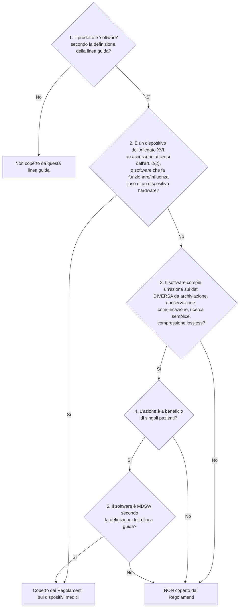

# R2 — Ricerca normativa: MDR, GDPR, licenze open source

> **DISCLAIMER VINCOLANTE.** Questo documento è un'**analisi tecnico-normativa** condotta su fonti
> primarie pubbliche. **Non è una consulenza legale** e non costituisce un parere regolatorio.
> La qualificazione e la classificazione di un software ai sensi del Regolamento (UE) 2017/745
> dipendono dalla **destinazione d'uso dichiarata dal fabbricante** (art. 2, punto 12, MDR) e devono
> essere **confermate da un consulente regolatorio** e, ove opportuno, sottoposte a *borderline
> determination* presso l'autorità competente (in Italia il Ministero della Salute, Direzione
> generale dei dispositivi medici). Alcune conclusioni di questo documento **contraddicono una
> decisione già approvata dal committente** (D6, percorso MDR Classe I): la contraddizione è
> esplicitata e argomentata nella sezione [1.6](#16-verdetto-la-classe-i-non-regge-come-qualificazione-positiva)
> perché il mandato richiede un parere onesto, non rassicurante.

**Stato delle fonti.** Ogni affermazione normativa cita regolamento/articolo/allegato, numero di
linea guida o clausola di standard, con URL. Dove un dato è in evoluzione o non è stato possibile
verificarlo su fonte primaria, è dichiarato esplicitamente con la formula **[DA VERIFICARE]**.
Il portale EUR-Lex non è risultato interrogabile in modo affidabile durante questa ricerca: per gli
articoli del MDR sono state usate riproduzioni testuali di terze parti e, dove disponibile, il PDF
ufficiale degli allegati; questi punti sono segnalati.

**Data della ricerca:** 25 agosto 2026.

---

## 1. Regolamento MDR (UE) 2017/745 applicato al software

### 1.1 La definizione di dispositivo medico e le definizioni che governano il perimetro

#### 1.1.1 Art. 2, punto 1 — «dispositivo medico»

Il testo (versione italiana, art. 2, punto 1, MDR) definisce dispositivo medico

> «qualunque strumento, apparecchio, apparecchiatura, **software**, impianto, reagente, materiale o
> altro articolo, destinato dal fabbricante a essere impiegato sull'uomo, da solo o in combinazione,
> per una o più delle seguenti destinazioni d'uso mediche specifiche:
> — diagnosi, prevenzione, monitoraggio, previsione, prognosi, trattamento o attenuazione di malattie,
> — diagnosi, monitoraggio, trattamento, attenuazione o compensazione di una lesione o di una disabilità,
> — studio, sostituzione o modifica dell'anatomia oppure di un processo o stato fisiologico o patologico,
> — fornire informazioni attraverso l'esame in vitro di campioni provenienti dal corpo umano […]
> e che non esercita nel o sul corpo umano l'azione principale cui è destinato mediante mezzi
> farmacologici, immunologici o metabolici, ma la cui funzione può essere coadiuvata da tali mezzi.»

(Testo riprodotto da [medicaldevicenews.eu, art. 2 MDR](https://www.medicaldevicenews.eu/MDR/articolo-2-definizioni-59898374b1c6113473211f09.html);
la versione inglese integrale è riportata anche a p. 4 di [MDCG 2019-11](https://health.ec.europa.eu/system/files/2020-09/md_mdcg_2019_11_guidance_en_0.pdf).)

Tre elementi sono decisivi e vanno tenuti separati:

1. **Il software è nominato esplicitamente** nella definizione. Non esiste una soglia di complessità
   tecnologica: un software banale con destinazione medica è un dispositivo; un software sofisticato
   senza destinazione medica non lo è.
2. **«destinato dal fabbricante»**. La qualificazione dipende dalla *destinazione d'uso* (art. 2,
   punto 12: «l'utilizzo al quale è destinato un dispositivo secondo le indicazioni fornite dal
   fabbricante sull'etichetta, nelle istruzioni per l'uso o **nel materiale o nelle dichiarazioni di
   promozione o vendita** e come specificato dal fabbricante nella valutazione clinica»). **Il
   materiale promozionale è giuridicamente vincolante ai fini della qualificazione.** Questo punto
   ha conseguenze operative dirette su come è scritta la pagina pubblica del progetto (§ 1.7.4).
3. **Il rischio non è un criterio di qualificazione.** MDCG 2019-11 (§ 3.1, p. 7) è esplicito:
   «It must be highlighted that the risk of harm to patients, users of the software, or any other
   person, related to the use of the software within healthcare, including a possible malfunction is
   **not a criterion** on whether the software qualifies as a medical device.» Un software che può
   fare danni gravissimi (per esempio interrompendo un consulto) non diventa per questo un
   dispositivo; e viceversa.

#### 1.1.2 Definizioni collegate

| Rif. | Definizione | Rilevanza per Telemedic |
|---|---|---|
| art. 2(4) | «dispositivo attivo»: il cui funzionamento dipende da una fonte di energia diversa da quella generata dal corpo umano […] **«Il software è considerato un dispositivo attivo»** | Se qualificato, Telemedic è per definizione un dispositivo *attivo*: si applicano le regole 9–13, 15 e 22 dell'Allegato VIII |
| art. 2(12) | «destinazione d'uso» (v. sopra) | Il testo del sito, del README, della documentazione e delle API è materiale che concorre a definirla |
| art. 2(2) | «accessorio»: articolo che, pur non essendo un dispositivo, è destinato a essere usato **con** uno o più dispositivi specifici per abilitarne o assistere direttamente la funzionalità medica | Se Telemedic dichiarasse di abilitare l'uso di un dermatoscopio o di uno stetoscopio digitale specifico, diventerebbe accessorio → dentro il perimetro MDR |
| art. 2(27)/(28) | «messa a disposizione sul mercato»: qualsiasi fornitura di un dispositivo per distribuzione, consumo o uso **nel corso di un'attività commerciale**, a titolo oneroso **o gratuito**; «immissione sul mercato»: prima messa a disposizione | La gratuità **non** esclude l'immissione sul mercato: il criterio è l'attività commerciale (§ 1.7.1) |
| art. 2(29) | «messa in servizio»: stadio in cui il dispositivo è reso disponibile all'utilizzatore finale come pronto per l'uso per la sua destinazione d'uso | Un artefatto Docker Compose/Helm «pronto all'uso» è concettualmente più vicino alla messa in servizio del sorgente su GitHub |
| art. 2(30) | «fabbricante»: «la persona fisica o giuridica che fabbrica o rimette a nuovo un dispositivo oppure lo fa progettare, fabbricare o rimettere a nuovo, **e lo commercializza apponendovi il suo nome o marchio**» | Nodo centrale del progetto open source (§ 1.7) |
| art. 2(65)/(68) | «incidente» / «incidente grave» | Rilevanti per gli obblighi di vigilanza (§ 1.8.7) |

### 1.2 Regola 11 dell'Allegato VIII — testo integrale e analisi clausola per clausola

#### 1.2.1 Testo ufficiale (versione italiana, Allegato VIII, capo III, punto 6.3)

> **6.3. Regola 11**
>
> Il software destinato a fornire informazioni utilizzate per prendere decisioni a fini diagnostici o
> terapeutici rientra nella classe IIa, a meno che tali decisioni abbiano effetti tali da poter causare:
>
> — il decesso o un deterioramento irreversibile delle condizioni di salute di una persona, nel qual
> caso rientra nella classe III, o
>
> — un grave deterioramento delle condizioni di salute di una persona o un intervento chirurgico, nel
> qual caso rientra nella classe IIb.
>
> Il software destinato a monitorare i processi fisiologici rientra nella classe IIa, a meno che sia
> destinato a monitorare i parametri fisiologici vitali, ove la natura delle variazioni di detti
> parametri sia tale da poter creare un pericolo immediato per il paziente, nel qual caso rientra
> nella classe IIb.
>
> **Tutti gli altri software rientrano nella classe I.**

(Fonte: [Allegato VIII MDR, testo italiano, p. 6](https://www.medicaldevicenews.eu/files/allegato-viii-5c11254db1c6110ab3b543a8.pdf).)

#### 1.2.2 Scomposizione in sotto-regole (MDCG 2019-11 Rev.1, § 4.2.1, p. 17)

MDCG scompone la regola in tre sotto-regole:

- **11a** — primi tre capoversi: software «intended to provide information which is used to take
  decisions with diagnostic or therapeutic purposes»;
- **11b** — quarto capoverso: software destinato al monitoraggio di processi o parametri fisiologici;
- **11c** — quinto capoverso: «all other uses».

**Analisi della sotto-regola 11a.** MDCG avverte che la formulazione «descrive, in termini molto
generali, il "modo d'azione" caratteristico di **tutti** i MDSW» e che pertanto «questa sotto-regola
è generalmente applicabile a tutti i MDSW (esclusi quelli che non hanno finalità medica)»
(Rev.1, p. 17). Questa è la frase più pericolosa dell'intero impianto: **una volta stabilito che un
software è MDSW, la gravitazione naturale è verso la Classe IIa**, e la Classe I è il residuo di
un residuo. Le due deroghe verso l'alto (III e IIb) si basano non sul danno *possibile in astratto*
ma sull'impatto di una decisione presa **su informazione errata** fornita dal software
(Rev.1, p. 18: «where such decisions, if based on incorrect information from the MDSW, are reasonably
likely to have an impact that may cause…»).

La Rev.1 (giugno 2025) ha **ampliato** la portata di 11a aggiungendo un esempio nuovo:

> «a device intended to prevent the risk of illnesses or pathologies by analysing physiological
> parameters (e.g. placement of the dorsal vertebrae, analysis of arterial stiffness, etc.) can be
> considered as a device providing information which is used to take decisions with diagnosis purpose
> (potential detection of pathologies) and in this case is in class IIa.»

(MDCG 2019-11 Rev.1, p. 18. La revisione è documentata nella tabella «MDCG 2019-11 revision 1 changes»
a p. 1 del documento: «4.2.1. Addition of clarification to Rule 11 (Subrule a). Addition of references
and examples on devices intended to prevent the risk of illness […]».)

**Analisi della sotto-regola 11b.** MDCG chiarisce che 11b è *lex specialis* rispetto a 11a per il
software destinato **solo** al monitoraggio, e che si applica al monitoraggio di *qualunque* processo
fisiologico, non solo di quelli vitali. I parametri vitali elencati sono «respiration, heart rate,
cerebral functions, blood gases, blood pressure and body temperature» (Rev.1, p. 18). **Rilevante per
Telemedic: le metriche di qualità di rete (RTT, jitter, packet loss, bitrate) non sono parametri
fisiologici**; 11b non si applica. Ma se in futuro la piattaforma acquisisse un flusso da un sensore
(saturimetro, ECG bluetooth) e ne mostrasse l'andamento, 11b scatterebbe con classificazione IIa
minima e IIb per i parametri vitali.

**Analisi della sotto-regola 11c.** «Sub-rule 11c) implies that **all other MDSW is classified as
class I**» (Rev.1, p. 18). È fondamentale capire la struttura logica: 11c **presuppone** che il
software sia già stato qualificato come MDSW, cioè che abbia una destinazione medica propria ai sensi
dell'art. 2(1). Non è una scorciatoia per «software sanitario a basso rischio»: è la casella di
risulta per MDSW dotati di finalità medica che **non** forniscono informazioni per decisioni
diagnostico-terapeutiche e **non** monitorano processi fisiologici.

I due unici esempi di Classe I forniti dall'MDCG (Rev.1, Annex IV, p. 35 — uno dei quali **aggiunto
proprio con la Rev.1**: «Annex IV — Inclusion of a new Class I example») sono:

1. una app che calcola lo stato di fertilità dell'utente da temperatura basale e giorni di mestruazione
   e lo restituisce con un semaforo rosso/verde/giallo → **classe I per Regola 11c**;
2. una app destinata ad assistere persone con disturbi della comunicazione (paralisi cerebrale,
   autismo, mutismo selettivo, SM, SLA, sindrome di Down, afasia) convertendo simboli selezionati in
   linguaggio parlato → **classe I per Regola 11c**.

Entrambi hanno una finalità medica riconducibile all'art. 2(1) (rispettivamente «controllo o supporto
della concezione», e «compensazione di una disabilità») **senza** produrre informazione usata per una
decisione diagnostica o terapeutica. È esattamente questa la geometria che una piattaforma di
teleconsulto non riesce a replicare (§ 1.6).

#### 1.2.3 Regole di applicazione dell'Allegato VIII che interagiscono con la Regola 11

Dal testo italiano dell'Allegato VIII, capo II (stessa fonte):

- **3.1** — «L'applicazione delle regole di classificazione si basa sulla destinazione d'uso dei dispositivi.»
- **3.3** — «Il software destinato a far funzionare un dispositivo o a influenzarne l'uso rientra nella
  stessa classe del dispositivo. **Se il software non è connesso con nessun altro dispositivo, è
  classificato separatamente.**»
- **3.5** — «Se diverse regole o, nell'ambito della stessa regola, più sottoregole si applicano allo
  stesso dispositivo in base alla sua destinazione d'uso, **si applicano la regola e sottoregola più
  rigorose che comportano la classificazione più elevata**.»
- **3.7** — «Si ritiene che un dispositivo consenta una diagnosi diretta quando fornisce esso stesso la
  diagnosi della malattia o della condizione clinica in questione **o quando fornisce informazioni
  decisive per la diagnosi**.»

La regola 3.5 è la ragione strutturale per cui è impossibile «scegliere» la Classe I: se anche una sola
sotto-regola più severa è applicabile in base alla destinazione d'uso, prevale. La regola 3.7 è
particolarmente insidiosa per la telemedicina in specialità visive: se il flusso video è la fonte
dell'osservazione clinica (dermatologia), la domanda «il software fornisce informazioni decisive per
la diagnosi?» non ha una risposta ovviamente negativa (§ 1.5.2).

**Regola 13** (Allegato VIII, 6.5): «Tutti gli altri dispositivi attivi rientrano nella classe I.»
Anche questa regola presuppone che il prodotto sia già un dispositivo.

#### 1.2.4 Tabella IMDRF di orientamento (MDCG 2019-11 Rev.1, Annex III, p. 33)

|  | Significato dell'informazione: **alto** (trattare o diagnosticare) | **medio** (guida la gestione clinica) | **basso** (informa la gestione clinica) |
|---|---|---|---|
| Situazione **critica** | Classe III | Classe IIb | Classe IIa |
| Situazione **grave** | Classe IIb | Classe IIa | Classe IIa |
| Situazione **non grave** | Classe IIa | Classe IIa | Classe IIa |

MDCG annota espressamente: **«This table does not take into account MDSW which is Class I.»**
Cioè: nella matrice IMDRF applicata alla Regola 11a **la Classe I non compare in nessuna cella**.
Ogni MDSW che fornisce informazione per decisioni cliniche, per quanto marginale l'informazione e per
quanto non grave la condizione, è **almeno IIa**. Questo è il fatto normativo più importante di tutta
la sezione 1.

### 1.3 MDCG 2019-11 e la revisione 1 (giugno 2025): l'albero decisionale

#### 1.3.1 Storia del documento

- **MDCG 2019-11**, ottobre 2019, 28 pagine —
  [PDF](https://health.ec.europa.eu/system/files/2020-09/md_mdcg_2019_11_guidance_en_0.pdf).
- **MDCG 2019-11 Rev.1**, giugno 2025, 35 pagine, pubblicata il **17 giugno 2025** —
  [pagina di annuncio della Commissione](https://health.ec.europa.eu/latest-updates/update-mdcg-2019-11-rev1-qualification-and-classification-software-regulation-eu-2017745-and-2025-06-17_en) ·
  [PDF](https://health.ec.europa.eu/document/download/b45335c5-1679-4c71-a91c-fc7a4d37f12b_en?filename=mdcg_2019_11_en.pdf).

La Rev.1 dichiara in apertura (p. 1) le modifiche apportate: chiarimento dell'ambito (§ 1); importanza
di formulare con precisione la destinazione d'uso e riferimenti al **MDSW modulare** (§ 3); chiarimenti
su Allegato XVI (§ 3.1); **nuovi esempi, incluso MDSW destinato a trattare** (§ 3.2); chiarimenti sulla
Regola 11 sotto-regola a (§ 4.2.1); **aggiornamento ed espansione della sezione «Modules» (§ 7)**;
**aggiornamento dell'Allegato I c.1 per riflettere l'interazione con il Regolamento EHDS riguardo ai
sistemi di cartella clinica elettronica**; **nuovo esempio di Classe I nell'Allegato IV**.

Il documento non è giuridicamente vincolante («Any views expressed in this document are not legally
binding and only the Court of Justice of the European Union can give binding interpretations of Union
law», p. copertina) ma è il riferimento operativo di fatto per autorità competenti e organismi notificati.

#### 1.3.2 L'albero decisionale (Figura 1, Rev.1 pp. 12–13)



Testo letterale dei passi (Rev.1, pp. 12–13):

- **Decision step 1** — se il prodotto è software secondo la § 2 della linea guida, può essere MDSW;
  si passa al passo 2. La definizione di software (§ 2) è: «a set of instructions that processes input
  data and creates output data».
- **Decision step 2** — se è dispositivo dell'Allegato XVI, accessorio ai sensi dell'art. 2(2) MDR o
  art. 2(4) IVDR, o software che pilota/influenza l'uso di un dispositivo, va considerato parte di quel
  dispositivo nel suo processo regolatorio, o indipendentemente se accessorio. Altrimenti passo 3.
- **Decision step 3** — «if the software does perform an action on data, or performs an action **beyond
  storage, archival, communication, simple search, lossless compression** (i.e. using a compression
  procedure that allows the exact reconstruction of the original data) then it may be a MDSW […]
  proceed to step 4». La nota 25 definisce «communication» richiamando IEEE 610.10-1994:
  «The flow of information from one point, known as the source, to another, the receiver.»
- **Decision step 4** — «is the action for the benefit of individual patients?» Non lo sono i software
  destinati solo ad aggregare dati di popolazione, fornire percorsi diagnostici o terapeutici generici
  non diretti a singoli pazienti, letteratura scientifica, atlanti, modelli, template, software per
  studi epidemiologici o registri.
- **Decision step 5** — «Is the software medical device software (MDSW) according to the definition of
  this guidance?» Definizione (§ 3.2, p. 9): «MDSW is software that is intended to be used, alone or in
  combination, for a purpose as specified in the definition of a "medical device" or "in vitro
  diagnostic medical device" in the MDR or IVDR, regardless of whether the software is independent or
  driving or influencing the use of a device.»

Principio guida della § 3.1 (Rev.1, p. 8): **«Software must have a medical purpose on its own to be
qualified as a MDSW.»** E ancora (p. 9): «software only intended for non-medical purposes […] such as
invoicing, staff planning, **e-mailing, web or voice messaging**, data parsing, word processing, and
back-up, wellness or fitness apps, do not qualify as MDSW». La menzione esplicita di *web or voice
messaging* fra le attività **non** mediche è direttamente pertinente al layer di segnalazione e
trasporto di Telemedic.

#### 1.3.3 Gli esempi dell'Annex I direttamente applicabili

**c) Information Systems** (Rev.1, p. 25): «Information Systems that are intended only to transfer,
store, convert, format, archive data are not qualified as medical devices in themselves. However, they
may be used with additional modules which maybe qualified in their own right as medical devices (MDSW).»

**c.1) Electronic Health Record (EHR) Systems** (Rev.1, pp. 25–26): i sistemi EHR «when used solely to
replace traditional paper-based patient files, do not meet the definition of a medical device». Ma
moduli integrati o affiancati possono qualificarsi. La Rev.1 aggiunge il raccordo con l'EHDS
(v. § 4.1).

**d) Communication Systems** (Rev.1, p. 27):

> «The healthcare sector uses communication systems (e.g. email systems, mobile telecommunication
> systems, **video communication systems**, paging, speech-to-text systems etc.) to transfer electronic
> information. Different types of messages are sent such as prescription, referrals, images, patient
> records, etc. […] **Communication systems are normally based on software for general purposes, and do
> not fall within the definition of a medical device.** Communication system modules might be used with
> other modules that might be qualified in their own right as medical devices (MDSW).
>
> *A software module generating alarms based on the monitoring and analysis of patient specific
> physiological parameters is qualified as a medical device (MDSW).*»

**d.1) Telemedicine systems** (Rev.1, p. 27) — **il passaggio decisivo per questo progetto**, e
**riscritto proprio con la Rev.1**:

> «Telemedicine Systems are intended to allow monitoring and/or delivery of healthcare to patients at
> locations remote from where the healthcare professional is located.
>
> **Telemedicine that solely transfers and displays information for monitoring purposes without
> interpreting data does not qualify as a medical device.** Additional modules such as thresholds
> alerts may qualify as a medical device if they are intended for medical purposes. Telemedicine
> delivering therapy healthcare qualifies as a medical device if it drives or influences a medical
> device for medical purposes (e.g. remote pump activation) **or if it is able to directly treat
> patients (e.g. VR therapy).**»

**d.1.1) Telesurgery** (Rev.1, pp. 27–28): «Remote control software used in combination with telesurgery
robots is a software that drives or influences the use of a medical device. **Communication modules
themselves are not medical devices.**»

#### 1.3.4 La sezione 7 «Modules» riscritta nella Rev.1 (pp. 22–23)

È la parte più rilevante per l'architettura di Telemedic e non esisteva in questa forma nel 2019.
Passaggi testuali:

> «It is the responsibility of the manufacturer to clearly delineate the boundaries and interfaces of
> the various modules. Modules subject to MDR or IVDR must be explicitly identified […]. This
> delineation must be communicated in a manner that ensures clarity for users, including:
> — Exactly which modules constitute the product;
> — Whether the product or any of its modules are subject to the MDR/IVDR or under other applicable
> legislation (e.g. European Health Data Space Regulation).»

> «Manufacturers must assess the entire MDSW's architecture and functionality, including its boundary
> interfaces. In addition to assessing individual modules against medical device qualification criteria,
> the following must be considered: How the software acquires input data; How output data is presented
> to the user; **Whether features that contribute to the usability or operation of the device (even if
> not directly medical) could impact safety or performance.** Excluding such usability-related
> functionalities from the scope of assessment may introduce safety risks.»

> «Where not all modules serve a direct medical purpose (e.g., patient record management, scheduling,
> or communications), but these non-medical functionalities are essential to the medical purpose of an
> MDSW, the following applies: **Non-medical functionalities should not be excluded from the MDSW
> description if they are necessary for the operation of the MDSW**; Manufacturers must evaluate how
> these functionalities affect the safety and performance of the device as a whole; Adequate
> documentation must demonstrate how medical and non-medical functionalities interact and contribute
> to the overall medical intended purpose.»

> «For example, a manufacturer develops an MDSW extension that operates through the user interface of a
> host module or platform that itself does not meet the definition of a medical device. Even though the
> host module is not regulated under Medical Devices Regulations, the MDSW relies on its interface for
> user interaction. **Therefore, the manufacturer must assess the host module's interface as part of the
> MDSW's usability and clinical performance evaluations.**»

**Conseguenza architetturale diretta e non negoziabile:** il vincolo V2 del context pack (separazione
esplicita fra «veicolo di comunicazione» e «supporto alla decisione clinica») non è un'opzione di
design ma un requisito documentale imposto dalla § 7 della Rev.1. Se un giorno un modulo MDSW venisse
aggiunto al di sopra della piattaforma (anche da terzi, anche dall'integratore), **l'interfaccia utente
e il pipeline media di Telemedic entrerebbero nel perimetro di valutazione dell'usabilità e delle
prestazioni cliniche di quel modulo**, pur restando essi stessi non-dispositivo. Questo è un requisito
di *documentabilità verso terzi*, non di certificazione propria (§ 1.7.3).

### 1.4 MDCG 2019-11 Rev.1 e la nozione di MDAI

La Rev.1 introduce per la prima volta il termine **MDAI** (*medical device artificial intelligence*),
usato negli esempi della § 3.2 (p. 10: «MDAI intended to work in combination with a Computed Tomography
(CT) scanner which performs auto-contouring…»). Analisi indipendenti segnalano che il termine è
introdotto per marcare l'IA come sottoinsieme distinto del MDSW soggetto anche all'AI Act
([Emergo by UL, 2025](https://www.emergobyul.com/news/european-revision-primary-software-guidance-mdcg-2019-11-revision-1-small-changes-meaningful)).
Non essendovi funzioni di IA nella v1.0 dichiarata, la nozione non si applica oggi; è invece il confine
da presidiare per la roadmap (§ 4.4).

---

### 1.5 Applicazione a Telemedic: la piattaforma è o non è un dispositivo medico?

Questa è l'analisi che il mandato definisce cruciale. La conduco applicando **letteralmente** l'albero
decisionale della Figura 1 (Rev.1) alla configurazione funzionale dichiarata nel context pack (§ 3
del brief: WebRTC P2P HD, DTLS-SRTP, FHIR R4 Encounter/DiagnosticReport/Observation, Keycloak SSO,
audit Envers, registrazione cifrata opzionale, metriche TimescaleDB, frontend WCAG 2.1 AA).

#### 1.5.1 Passo per passo

**Passo 1 — È software?** Sì. Insieme di istruzioni che elabora dati in ingresso e produce dati in
uscita. Si prosegue.

**Passo 2 — È dispositivo dell'Allegato XVI, accessorio, o software che pilota/influenza un dispositivo
hardware?**

- Allegato XVI: no (nessun prodotto senza destinazione medica dell'elenco: lenti cosmetiche,
  apparecchiature per liposuzione, laser estetici, stimolazione cerebrale ecc.).
- Accessorio ai sensi dell'art. 2(2): **no, a condizione che la documentazione non dichiari che
  Telemedic è destinato a essere usato con uno o più dispositivi medici *specifici* per abilitarne
  l'uso conforme alla destinazione o assisterne direttamente la funzionalità medica.** Il rischio è
  concreto: se in un'integrazione futura Telemedic dichiarasse «compatibile con il dermatoscopio X per
  la teledermatologia» o «abilita l'uso remoto dello stetoscopio digitale Y», diventerebbe accessorio
  e la regola 3.3 lo trascinerebbe nella classe del dispositivo pilotato. **Requisito operativo:** la
  documentazione di integrazione deve restare *device-agnostica* e dichiarare esplicitamente che la
  piattaforma non abilita, non comanda e non condiziona alcun dispositivo medico specifico.
- Software che pilota/influenza l'uso di un dispositivo hardware: no, per costruzione (media P2P fra
  browser, nessun comando verso apparecchiature).

Si prosegue al passo 3.

**Passo 3 — Il software compie un'azione sui dati diversa da archiviazione, conservazione,
comunicazione, ricerca semplice, compressione lossless?**

È **il passo che decide tutto**. Analizzo funzione per funzione.

| Funzione dichiarata | Qualificazione dell'azione sui dati | Esito passo 3 |
|---|---|---|
| Signaling Spring Boot, scambio ICE, STUN/TURN, fallback relay | Instradamento di messaggi: **comunicazione** (IEEE 610.10-1994, nota 25 Rev.1) | Non supera il passo 3 |
| Trasporto media WebRTC, DTLS-SRTP, key rotation | Trasporto cifrato: **comunicazione**. La cifratura non è interpretazione di dati clinici | Non supera il passo 3 |
| Persistenza `Encounter`, `Practitioner`, `Patient`, `Appointment` | **Archiviazione** e conversione di formato. MDCG Annex I c): sistemi che «transfer, store, convert, format, archive» non sono dispositivi | Non supera il passo 3 |
| Persistenza `DiagnosticReport` redatto dal medico | **Archiviazione** di contenuto autoriale umano, con serializzazione FHIR = *convert/format*. **Purché** il software non generi, non deduca, non completi, non struttura semanticamente né valorizza campi clinici | Non supera il passo 3 **se e solo se** vale la condizione |
| Audit immutabile Hibernate Envers | Registrazione tecnica; nessuna finalità clinica | Non supera il passo 3 |
| Registrazione MP4 cifrata con consenso, retention configurabile | **Archiviazione**. Ma la *riproduzione* con strumenti di miglioramento immagine sarebbe un'altra cosa (v. sotto) | Non supera il passo 3, con riserva |
| Metriche RTT/jitter/packet loss/bitrate su TimescaleDB, alert su soglia | Elaborazione statistica su **parametri di rete**, non su parametri fisiologici. Non è «beneficio del singolo paziente» in senso clinico ma qualità del servizio | Supera il passo 3 come «azione sui dati», ma cade al passo 4/5 (v. sotto) |
| Bitrate adattivo e **codec video/audio lossy** (VP8/VP9/AV1/H.264, Opus) | **Compressione con perdita**. L'albero decisionale esclude esplicitamente solo la **compressione lossless** | **Punto critico: potenzialmente supera il passo 3** |

**Il problema della compressione lossy.** Il Decision step 3 elenca fra le azioni non qualificanti la
«lossless compression (i.e. using a compression procedure that allows the exact reconstruction of the
original data)». La specificazione *lossless* è chiaramente intenzionale: se qualsiasi compressione
fosse irrilevante, l'aggettivo non avrebbe funzione normativa. Ne discende che **una compressione con
perdita che alteri l'informazione clinicamente rilevante è un'azione sui dati che supera il passo 3.**

Non è un cavillo teorico. È lo stesso principio per cui MDCG qualifica come MDSW il software «which
alters the representation of data for a medical purpose» e «which locally amplifies the contrast of the
finding on an image display, performs contrast stretching, edge enhancement, gray scale manipulation,
smoothing and or sharpening so that it serves as a decision support» (Rev.1, § 3.1, p. 8). La stessa
§ 3.1 precisa però il criterio di esclusione: **«altering the representation of data for
embellishment/cosmetic or compatibility purposes does not readily qualify the software as MDSW»**
(Rev.1, p. 9).

La difesa di Telemedic sta interamente qui: la compressione video WebRTC è finalizzata alla
**compatibilità e alla trasmissibilità sulla rete**, non a un fine medico; è la medesima tecnologia
generica di qualunque sistema di videocomunicazione, che l'Annex I d) qualifica come *non* dispositivo.
È una difesa solida ma **non è priva di attrito**, e l'attrito si concentra esattamente sulle specialità
target dichiarate dal committente (§ 4 del brief: **dermatologia**; e la specialità dichiarata
«qualità clinica» del video). Su questo torno al § 1.6.2.

**Passo 4 — L'azione è a beneficio di singoli pazienti?** Per le funzioni cliniche: sì (ogni sessione è
riferita a un paziente). Per le metriche di qualità di rete: **no** — sono a beneficio della gestione
dell'infrastruttura, non del paziente individuale; l'esempio Annex II Figura 1 – Example 1 della Rev.1
(modulo che traccia metriche operative di laboratorio) esce dal perimetro proprio al passo 4. Le
metriche di Telemedic vanno documentate con questa stessa logica.

**Passo 5 — È MDSW secondo la definizione?** Cioè: **ha di per sé una destinazione medica ai sensi
dell'art. 2(1)?** No, se la destinazione d'uso dichiarata è: *abilitare la comunicazione audio-video
sicura e la trasmissione/archiviazione di documentazione clinica redatta da un professionista
sanitario, senza interpretare, elaborare, arricchire o generare informazione clinica*. La finalità
medica appartiene all'**atto del medico**, non al software: il software è il canale.

#### 1.5.2 Che impatto ha la produzione di una risorsa FHIR `DiagnosticReport`?

Il nome della risorsa è fuorviante ed è probabilmente il principale fattore di rischio *percepito*.
La risposta corretta si articola in tre proposizioni.

1. **Il nome della risorsa non ha alcun rilievo regolatorio.** `DiagnosticReport` è un identificatore di
   struttura dati HL7 FHIR R4, non una dichiarazione di destinazione d'uso. La qualificazione dipende
   dall'art. 2(12) MDR, non dal *resource type*.
2. **Ciò che conta è chi produce il contenuto e cosa fa il software con esso.** Se il software si limita
   a: (a) raccogliere testo/campi immessi dal professionista; (b) applicare firma e marcatura temporale;
   (c) serializzare in FHIR; (d) trasmettere e archiviare — allora l'azione ricade integralmente in
   «convert, format, archive, communicate» e il software **non** è MDSW. È l'equivalente digitale della
   carta intestata: MDCG dice che «an electronic patient record that simply replaces a patient's paper
   file does not meet the definition of a medical device» (Rev.1, Annex I c.1, p. 25).
3. **Il confine si sposta nel momento in cui il software aggiunge valore semantico.** Esempi concreti di
   funzionalità che trasformerebbero la generazione del `DiagnosticReport` in MDSW:
   - codifica automatica di una diagnosi in ICD-10/SNOMED CT a partire dal testo libero → il software
     *crea* informazione clinica (interpretazione), è MDSW;
   - popolamento automatico di `DiagnosticReport.conclusionCode` sulla base di regole o modelli;
   - generazione di `Observation` con valori derivati o calcolati anziché trascritti;
   - suggerimento di template refertali specialistici condizionati da dati clinici del paziente;
   - flag/alert sul referto («valore fuori range», «follow-up raccomandato»): MDCG Annex I d) dice
     testualmente che *«additional modules such as thresholds alerts may qualify as a medical device if
     they are intended for medical purposes»*;
   - NLP sul testo del referto: la Rev.1 (§ 3.1, p. 8) chiarisce che «software would not be considered
     as conducting "Simple search" if it contributes to achieving a medical purpose. E.g. […] a software
     that performs search using Natural Language Processing (NLP) where those actions contribute to
     achieving a medical purpose».

   **Regola di progettazione derivata:** `DiagnosticReport` deve essere prodotto in modalità
   *pass-through autoriale*. Ogni campo clinicamente significativo deve avere un'origine tracciabile a
   un input umano. Nessun campo clinico può essere derivato, inferito o predefinito dal sistema. Questa
   invariante va (a) implementata, (b) testata, (c) dichiarata nella documentazione di qualificazione,
   (d) protetta da un controllo in CI che vieti l'introduzione di derivazioni semantiche.

#### 1.5.3 Dove passa esattamente il confine che farebbe scattare la Classe IIa

La Classe IIa scatta quando **entrambe** le condizioni si verificano:
(i) il software è MDSW (ha finalità medica propria, passo 5); e
(ii) fornisce informazioni utilizzate per prendere decisioni a fini diagnostici o terapeutici
(sotto-regola 11a), a valle della regola 3.7 («fornisce informazioni **decisive** per la diagnosi»).

Sono confini **superabili con modifiche minime**, il che rende il presidio architetturale essenziale.
Elenco puntuale delle funzionalità che farebbero scattare la IIa (o oltre):

| # | Funzionalità | Base normativa | Classe risultante |
|---|---|---|---|
| C1 | Qualsiasi triage, scoring, punteggio sintomatologico, questionario che restituisca un esito | Regola 11a; Rev.1 Annex IV, es. depressione | IIa → IIb secondo gravità |
| C2 | Alert su parametri **fisiologici** (anche solo autodichiarati dal paziente) | Regola 11b; Annex I d) | IIa (IIb se parametri vitali) |
| C3 | Miglioramento immagine finalizzato alla lettura clinica (contrasto, sharpening, zoom diagnostico, filtri) in live o in replay della registrazione | Rev.1 § 3.1, p. 8 | IIa (fino a III per patologie critiche) |
| C4 | Misurazione su immagine (dimensione di una lesione, angolo articolare, goniometria) | Regola 11a + regola 3.7 | IIa |
| C5 | Codifica/derivazione semantica automatica del referto (§ 1.5.2) | Regola 11a | IIa |
| C6 | Supporto alla decisione, suggerimento terapeutico, ranking di opzioni | Rev.1 Annex IV: MDSW che ordina opzioni chemioterapiche = IIa per 11a | IIa+ |
| C7 | Pilotaggio o attivazione remota di un dispositivo (pompa, sensore, scanner) | Regola 3.3 + Annex I d.1) «remote pump activation» | Classe del dispositivo pilotato, non inferiore |
| C8 | Erogazione diretta di terapia (VR therapy, esercizi riabilitativi personalizzati) | Annex I d.1) «able to directly treat patients» | Almeno IIa; Rev.1 § 3.2 include esempi in classe superiore |
| C9 | Dichiarazione di idoneità del canale video a fini di **telepatologia o teleradiologia** | DM 21/09/2022, All. A; Rev.1 Annex I | Certificazione come dispositivo, classe da valutare |

**Tre di queste nove voci sono a distanza di una singola user story dal backlog dichiarato**: C2 (alert
su soglia — la funzione 7 del brief già prevede «alert su soglia», seppure su metriche di rete: la
distinzione va scritta nero su bianco), C3 (replay della registrazione con controlli video), C5
(automazione della refertazione, richiesta tipica degli integratori). Questo è il vero rischio di
programma: **non la qualificazione di oggi, ma la deriva della destinazione d'uso**.

#### 1.5.4 Il fattore aggravante italiano: il DM 21 settembre 2022

Il decreto interministeriale 21 settembre 2022 «Approvazione delle linee guida per i servizi di
telemedicina — Requisiti funzionali e livelli di servizio», in GU n. 256 del 2 novembre 2022
([Gazzetta Ufficiale](https://www.gazzettaufficiale.it/eli/id/2022/11/02/22A06184/sg)), Allegato A,
contiene affermazioni che **incidono direttamente** sulla strategia regolatoria italiana:

- l'infrastruttura regionale di telemedicina per il servizio minimo di **telemonitoraggio** deve essere
  **certificata come dispositivo medico** in conformità alla guida sul Regolamento (UE) 2017/745;
- «Ove nel servizio di **Televisita** vengano usati dei dispositivi medici, anche in questo caso il
  software e l'hardware per l'erogazione del servizio dovrà essere certificato come dispositivo medico
  con adeguata classe di rischio»;
- per il **teleconsulto** in specialità quali istologia e radiologia, «il software e l'hardware per
  l'erogazione del servizio dovrà essere certificato come dispositivo medico nell'ambito della
  infrastruttura regionale».

(Estratti dal testo dell'Allegato A come riprodotto su
[medicoeleggi.com](https://www.medicoeleggi.com/argomenti000/italia2022/414755-a.htm); **[DA VERIFICARE]**
sul testo ufficiale in GU prima di qualunque uso contrattuale, perché la formulazione esatta ha valore
determinante.)

Il decreto definisce inoltre la **televisita** come «atto medico in cui il professionista interagisce a
distanza in tempo reale con il paziente» e la limita ad «attività di controllo di pazienti la cui
diagnosi sia già stata formulata nel corso di visita in presenza» — vincolo che, se rispettato, riduce
significativamente l'esposizione alla regola 3.7 (informazione decisiva per la diagnosi), perché la
diagnosi è già stata posta in presenza.

**Conseguenza:** nel mercato pubblico italiano (ASL/USL, uno dei quattro casi d'uso target) la richiesta
di certificazione come dispositivo medico può arrivare **dal capitolato di gara**, indipendentemente
dall'esito dell'analisi MDR. Il progetto deve essere pronto a rispondere in due modi alternativi: con
una dichiarazione di non-qualificazione motivata (per televisita/teleconsulto senza dispositivi), e con
un percorso di certificazione documentato se il servizio richiesto è il telemonitoraggio.

---

### 1.6 Verdetto: la Classe I non regge come qualificazione positiva

Questa sezione contraddice motivatamente la decisione D6 del context pack. Non contesta l'*obiettivo*
(costruire l'intero apparato qualitativo MDR-grade), contesta la **forma giuridica** con cui è stato
formulato.

#### 1.6.1 L'argomento principale: la Classe I presuppone di essere un dispositivo

La catena logica è ineludibile:

1. Per essere in **Classe I** occorre prima essere un **dispositivo medico** (art. 2, punto 1). Le
   classi sono un attributo dei dispositivi, non delle categorie di software.
2. Per essere un dispositivo occorre una **destinazione medica propria** (MDCG 2019-11 Rev.1, § 3.1:
   «Software must have a medical purpose on its own»).
3. Se Telemedic dichiara una destinazione medica propria, la sotto-regola 11a si applica «generalmente
   a tutti i MDSW» (Rev.1, § 4.2.1, p. 17) e la matrice IMDRF dell'Annex III **non contiene alcuna
   cella di Classe I**. Il risultato minimo è **IIa, con Organismo Notificato**.
4. Se Telemedic **non** dichiara una destinazione medica propria — che è la posizione corretta secondo
   Annex I d) e d.1) della Rev.1 — allora **non è un dispositivo affatto** e non esiste alcuna Classe I
   da autocertificare.

**Non esiste, in mezzo, una casella «Classe I» comoda per una piattaforma di teleconsulto.** La Classe I
per Regola 11c esiste ma è popolata da MDSW con finalità medica *non decisionale e non di monitoraggio*
(app di fertilità, ausilio alla comunicazione per disabilità — gli unici due esempi che MDCG offre nella
Rev.1). Un canale audio-video sicuro non appartiene a quella famiglia.

#### 1.6.2 Il punto in cui la mia analisi è meno solida (onestà intellettuale)

Esiste una lettura opposta, che va presa sul serio:

- se la piattaforma è promossa per «consulti video **con qualità clinica**» in **dermatologia**, si può
  sostenere che il flusso video *è* lo strumento di osservazione e che il pipeline (codec, bitrate
  adattivo, illuminazione, gestione del colore) **altera la rappresentazione dei dati** in modo che
  influisce sull'osservazione clinica → Rev.1 § 3.1 «software which alters the representation of data
  for a medical purpose»;
- combinandolo con la regola di applicazione 3.7 («fornisce informazioni **decisive** per la diagnosi»),
  un'autorità competente potrebbe qualificare la piattaforma come MDSW e classificarla IIa per 11a.

Non ritengo che questa lettura sia quella corretta — perché la compressione ha finalità di
compatibilità/trasmissione e perché l'Annex I d) esclude in modo esplicito i sistemi di comunicazione
video — ma **ritengo che sia una lettura sostenibile in contraddittorio**, e che diventi progressivamente
più forte man mano che il marketing enfatizza la qualità diagnostica del canale. È un rischio da gestire
con la disciplina del claim (§ 1.7.4), non da ignorare.

#### 1.6.3 Il rischio speculare, spesso trascurato: marcare CE ciò che non è un dispositivo

Se il progetto seguisse alla lettera la decisione D6 (dichiarazione di conformità UE + marcatura CE ai
sensi del MDR su un prodotto che, correttamente qualificato, non è un dispositivo), commetterebbe una
**irregolarità autonoma**:

- l'art. 20 MDR disciplina la marcatura CE dei **dispositivi**, e vieta l'apposizione di marchi o
  iscrizioni idonei a indurre in errore i terzi riguardo alla marcatura CE;
- l'art. 7 MDR vieta, nell'etichettatura, nelle istruzioni per l'uso, nella messa a disposizione, nella
  messa in servizio e nella pubblicità, testi, denominazioni, marchi, immagini e segni che possano
  **indurre in errore l'utilizzatore o il paziente** riguardo alla destinazione d'uso, alla sicurezza e
  alle prestazioni del dispositivo, in particolare attribuendo funzioni e proprietà che il dispositivo
  non possiede;
- l'art. 10, paragrafo 6, subordina la dichiarazione di conformità all'avvenuta dimostrazione di
  conformità *di un dispositivo* mediante la procedura di valutazione applicabile;
- la registrazione in EUDAMED e l'ottenimento dell'UDI presuppongono l'esistenza di un dispositivo.

Marcare CE-MDR un non-dispositivo non è un eccesso di prudenza innocuo: è una **falsa rappresentazione
dello stato regolatorio** che espone a sanzioni di vigilanza del mercato e, soprattutto, altera il
rapporto con l'integratore (che potrebbe fondare la propria conformità su una marcatura non dovuta).

#### 1.6.4 Raccomandazione: sostituire D6 con un percorso a doppio binario

Propongo di riformulare la decisione D6 nei termini seguenti, mantenendone integralmente l'ambizione e
il carico di lavoro (quindi senza tagli allo scope della v1.0), ma correggendone la qualificazione
giuridica:

**Binario A — Determinazione di non-qualificazione documentata (percorso primario).**
Redigere e mantenere un **fascicolo di qualificazione** (*qualification determination file*) che:
1. dichiari la destinazione d'uso in forma restrittiva e verificabile;
2. applichi passo per passo l'albero di MDCG 2019-11 Rev.1 con motivazione scritta per ciascun passo;
3. elenchi le **funzioni escluse** (le nove voci C1–C9 del § 1.5.3) come *design constraint* e non come
   semplici assenze;
4. mappi i moduli e le loro interfacce ai sensi della § 7 Rev.1;
5. sia sottoscritto e datato, e sia soggetto a *change control* — ogni PR che tocchi il perimetro
   funzionale deve dichiarare l'impatto sulla qualificazione (§ 8 Rev.1: «Consideration of changes to
   an MDSW»).

**Binario B — Conformità volontaria «MDR-ready» e regulatory pack per l'integratore.**
Costruire comunque ISO 13485, IEC 62304, ISO 14971, IEC 62366-1, IEC 82304-1, ISO/IEC 81001-5-1,
tracciabilità requisiti↔test, SBOM, gestione SOUP, PMS-like e vigilanza-like — **non** per marcare CE
il proprio prodotto, ma per consegnare all'integratore-fabbricante un dossier direttamente
incorporabile nella *sua* documentazione tecnica (§ 1.7.3). Questo è, con ogni probabilità, il
deliverable commercialmente più prezioso del progetto e trasforma un vincolo in un vantaggio
competitivo.

**Binario C — Attivabile solo su decisione esplicita: certificazione IIa.**
Se il committente volesse un giorno vendere una funzione clinica (telemonitoraggio, triage, refertazione
assistita), il percorso è **IIa con Organismo Notificato** — allegato IX capo I e III, oppure allegato XI
parte A — con tempi e costi di ordine di grandezza superiore. Va pianificato come progetto a sé, non
come estensione della v1.0.

---

### 1.7 Chi è il fabbricante in un progetto open source? (il nodo critico)

#### 1.7.1 Pubblicare codice sorgente è «immissione sul mercato»?

Gli elementi normativi:

- art. 2(27) «messa a disposizione sul mercato»: **qualsiasi fornitura** di un dispositivo, diverso da un
  dispositivo oggetto di indagine clinica, per la distribuzione, il consumo o l'uso sul mercato
  dell'Unione **nel corso di un'attività commerciale**, a titolo oneroso **o gratuito**;
- art. 2(28) «immissione sul mercato»: la prima messa a disposizione;
- art. 2(29) «messa in servizio»: lo stadio in cui il dispositivo è reso disponibile all'utilizzatore
  finale **come pronto per l'uso** sul mercato dell'Unione per la prima volta per la sua destinazione
  d'uso;
- art. 2(30) «fabbricante»: chi fabbrica o fa fabbricare un dispositivo **e lo commercializza apponendovi
  il proprio nome o marchio**.

Ne derivano tre conclusioni operative, distinte e non intercambiabili:

1. **La gratuità non protegge.** «a titolo oneroso o gratuito» è testuale. L'argomento «è open source,
   quindi non è immissione sul mercato» è **giuridicamente infondato**.
2. **Il criterio discriminante è «nel corso di un'attività commerciale».** Un repository di codice
   sorgente mantenuto senza corrispettivo, senza offerta di servizi, senza supporto commerciale, senza
   modello di monetizzazione, è argomentabilmente al di fuori dell'attività commerciale. La stessa
   nozione è usata, con formulazione parallela, dall'art. 2 della Direttiva (UE) 2024/2853 sulla
   responsabilità da prodotto («free and open-source software developed or supplied outside the course
   of a commercial activity»: v. § 6) e dal Cyber Resilience Act. **Il confine è però fragile e si
   sposta appena il progetto genera ricavi**: supporto a pagamento, hosting gestito, dual licensing,
   sponsorizzazioni ricorrenti, consulenza sull'integrazione. Poiché il progetto è dichiaratamente
   orientato a partnership commerciali, **va assunto che il confine sarà superato**.
3. **La forma della distribuzione conta.** C'è una differenza sostanziale, ai fini dell'art. 2(29), fra
   (a) pubblicare sorgenti che richiedono compilazione, configurazione e integrazione, e (b) pubblicare
   un artefatto «pronto per l'uso» (immagini container firmate, `docker compose up`, Helm chart, demo
   ospitata) che un'organizzazione sanitaria può mettere in produzione senza ulteriore integrazione.
   Il secondo caso è molto più vicino alla «messa in servizio». **[DA VERIFICARE]** con consulente
   regolatorio: non risultano linee guida MDCG specificamente dedicate alla distribuzione open source
   di software sanitario, e questa è una lacuna reale del quadro europeo.

#### 1.7.2 I contributori esterni non sono fabbricanti — ma il progetto deve dimostrarlo

L'art. 2(30) individua **una sola** figura: chi commercializza apponendo il proprio nome o marchio.
Un contributore che apre una pull request non commercializza nulla e non appone alcun marchio: **non è
fabbricante**. Non esiste nel MDR una figura di «co-fabbricante per contribuzione».

Ma questo crea il problema simmetrico, che è il vero nodo: **il fabbricante deve poter rispondere della
progettazione e della verifica di codice scritto da persone che non controlla.** L'art. 10, paragrafo 9,
lettera d), impone che il sistema di gestione della qualità copra «la gestione delle risorse, compresa la
selezione e il controllo dei fornitori e dei subfornitori», e la lettera g) la «realizzazione del
prodotto, compresi pianificazione, progettazione, sviluppo, produzione e prestazione del servizio».
Un contributore esterno non è formalmente un fornitore, ma il codice che immette entra nel prodotto.

Meccanismi che rendono la cosa governabile — tutti implementabili in repository:

| Meccanismo | Funzione regolatoria | Riferimento |
|---|---|---|
| **DCO obbligatoria** con `Signed-off-by` e verifica in CI | Catena di provenienza dei diritti; tracciabilità nominativa dell'autore | § 5.4 |
| **CODEOWNERS** + review obbligatoria da parte del maintainer | Il *design control* resta in capo al fabbricante: il contributo è una *proposta*, l'accettazione è un atto del fabbricante | IEC 62304 § 5.1, ISO 13485 § 7.3 |
| **Branch protection**, firma dei commit, merge solo via PR | Integrità e non ripudio del ciclo di vita | ISO/IEC 81001-5-1 |
| **Tracciabilità requisito → design → unità → test** obbligatoria su ogni PR che tocchi codice di prodotto | IEC 62304 § 5.1.1, 5.2, 5.3, 5.5, 5.7 | § 2.2 |
| **SBOM CycloneDX** generata in CI e archiviata per release | Gestione SOUP e obblighi CRA | § 2.2.4, § 4.3 |
| **Separazione fra `main` "prodotto" e contributi di community non ancora qualificati** (feature flag, moduli opzionali marcati come *not part of the assessed configuration*) | Delimitazione dei moduli ai sensi della § 7 Rev.1 | § 1.3.4 |

**Formulazione consigliata da inserire in `CONTRIBUTING.md`:** il progetto accetta contributi ma il
maintainer, quale unico soggetto che rilascia le versioni, esercita il *design control*; il contributo
accettato è considerato output di progettazione del progetto e non trasferisce alcuna responsabilità
regolatoria al contributore; contributi che introducono funzionalità appartenenti alle categorie C1–C9
(§ 1.5.3) sono rifiutati per policy e non per merito tecnico.

#### 1.7.3 L'integratore che incorpora Telemedic in white-label: l'art. 16 MDR

Questo è il punto in cui il modello di business del progetto e il diritto dei dispositivi medici si
toccano direttamente. Il vincolo di progetto n. 1 del context pack («nessuna imposizione di UI;
Telemedic deve essere incorporabile in white-label») coincide **esattamente** con la fattispecie
dell'art. 16, paragrafo 1, lettera a), MDR:

> Un distributore, un importatore o un'altra persona fisica o giuridica assume gli obblighi che
> incombono ai fabbricanti se mette a disposizione sul mercato un dispositivo **con il proprio nome,
> la propria denominazione commerciale o il proprio marchio registrato** […]

Con l'esimente del paragrafo 2: gli obblighi non si applicano quando esiste un accordo con il
fabbricante in forza del quale il fabbricante è indicato come tale sull'etichetta ed è responsabile del
rispetto degli obblighi imposti ai fabbricanti dal regolamento
([riproduzione del testo](https://www.medicaldevicenews.eu/MDR/articolo-10-obblighi-generali-dei-fabbricanti-59ac20e5b1c6116acfeea26c.html);
analisi in [Clariscience, «L'articolo 16 del Regolamento 2017/745»](https://clariscience.com/blog/affari-regolatori/larticolo-16-del-regolamento-2017-745)).

**Conseguenze pratiche, e sono buone notizie per il progetto:**

- se il prodotto **non** è un dispositivo, l'art. 16 semplicemente non si applica e l'integratore è
  libero di fare white-label;
- se l'integratore costruisce **sopra** Telemedic un modulo con finalità medica (triage, refertazione
  assistita, telemonitoraggio), **l'integratore è il fabbricante** di quel dispositivo, non Telemedic —
  e la § 7 della Rev.1 gli impone di valutare anche l'interfaccia e il modulo host, cioè Telemedic;
- perciò **il deliverable giusto verso l'integratore non è un marchio CE, è un dossier**: elenco SOUP,
  file di rischio, file di ingegneria dell'usabilità, architettura e interfacce dei moduli, evidenze di
  verifica, SBOM, procedura di gestione delle vulnerabilità, tracciabilità. Questo abilita
  l'integratore a qualificare *Telemedic come SOUP* nel proprio ciclo di vita IEC 62304 e a includerne
  la valutazione nel proprio fascicolo tecnico.

**Documenti contrattuali da produrre nel repository** (bozze non vincolanti, con disclaimer):
1. *Regulatory Roles & Responsibilities Statement* — chi è chi (fabbricante, integratore, titolare/
   responsabile ex GDPR, PRRC ove applicabile);
2. *Intended Purpose Statement* con l'elenco delle funzioni escluse;
3. *SOUP disclosure pack* per l'integratore;
4. clausola di **divieto di riqualificazione unilaterale**: l'integratore che modifica la destinazione
   d'uso o aggiunge moduli con finalità medica assume ogni obbligo del fabbricante e manleva il
   progetto.

#### 1.7.4 Disciplina del claim: la destinazione d'uso si scrive anche in home page

Poiché l'art. 2(12) include «il materiale o le dichiarazioni di promozione o vendita» fra le fonti della
destinazione d'uso, e l'art. 7 vieta le dichiarazioni fuorvianti, la comunicazione pubblica del progetto
è materiale regolatorio. Raccomandazioni concrete e verificabili:

- **evitare** o qualificare formule come «qualità clinica», «diagnostica a distanza», «refertazione»,
  «per la cardiologia/psichiatria/dermatologia» quando riferite alle *capacità del software* anziché al
  contesto d'impiego del professionista;
- **preferire** formule del tipo «infrastruttura di comunicazione sicura per atti sanitari a distanza
  eseguiti da professionisti abilitati; il software non esegue né supporta valutazioni diagnostiche o
  terapeutiche»;
- inserire in home page, README, documentazione e nella UI dell'applicazione una **dichiarazione di
  stato regolatorio** («Telemedic non è un dispositivo medico ai sensi del Regolamento (UE) 2017/745.
  Non è destinato a fornire informazioni utilizzate per prendere decisioni a fini diagnostici o
  terapeutici»);
- creare un controllo di *documentation linting* che segnali l'introduzione di termini a rischio nei
  testi pubblici (fattibile con una lista di termini e un job CI su Docusaurus).

#### 1.7.5 Se il fabbricante fosse una persona fisica o una micro-impresa

Il MDR ammette che il fabbricante sia una **persona fisica** (art. 2, punto 30: «la persona fisica o
giuridica»). Le conseguenze, se un giorno si imboccasse il Binario C, sono però pesanti e vanno dette:

- **PRRC (art. 15).** Il fabbricante designa almeno una persona responsabile del rispetto della normativa
  con competenza comprovata da: (a) diploma/laurea in giurisprudenza, medicina, farmacia, ingegneria o
  altra disciplina scientifica pertinente **più** un anno di esperienza professionale in materia
  regolatoria o sistemi qualità; **oppure** (b) quattro anni di esperienza professionale in materia
  regolatoria o sistemi qualità. **Micro e piccole imprese** (Raccomandazione 2003/361/CE: micro < 10
  addetti e ≤ 2 M€; piccola < 50 addetti e ≤ 10 M€) **non sono tenute ad avere la PRRC all'interno
  dell'organizzazione, ma devono averla a disposizione in modo permanente e continuativo**, tipicamente
  tramite contratto con un consulente esterno che ne attesti le qualifiche. Il paragrafo 3 elenca i
  compiti (controllo di conformità prima del rilascio, predisposizione e aggiornamento della
  documentazione tecnica e della dichiarazione di conformità, adempimenti di sorveglianza
  post-commercializzazione, obblighi di segnalazione ex artt. 87–91). Il paragrafo 5 vieta che la PRRC
  subisca svantaggi nell'organizzazione per il corretto adempimento dei propri compiti
  ([testo art. 15](https://www.medicaldevicenews.eu/MDR/articolo-15-persona-responsabile-del-rispetto-della-normativa-5a25765db1c61132171042ca.html)).
  **Una persona fisica non può essere PRRC di sé stessa in modo formalmente ineccepibile senza
  dimostrare i requisiti dell'art. 15(1)**: la PRRC va contrattualizzata.
- **Copertura finanziaria (art. 10, paragrafo 16).** Il fabbricante deve disporre di misure che
  forniscano una **copertura finanziaria sufficiente** rispetto alla potenziale responsabilità ai sensi
  della direttiva sulla responsabilità da prodotto, proporzionata alla classe di rischio, al tipo di
  dispositivo e alle dimensioni dell'impresa. Per una **persona fisica** ciò significa esposizione
  patrimoniale personale illimitata, non schermata da alcuna personalità giuridica.
- **Registrazione (artt. 29 e 31) e SRN.** Il fabbricante ottiene un *Single Registration Number* tramite
  il modulo Actor di EUDAMED prima dell'immissione sul mercato.

**Raccomandazione netta:** qualunque passo verso una dichiarazione di conformità UE deve essere preceduto
dalla costituzione di un veicolo societario. Farlo dopo è tecnicamente possibile ma implica il
trasferimento del ruolo di fabbricante, con riemissione della dichiarazione, nuovo SRN e aggiornamento
UDI/EUDAMED.

#### 1.7.6 L'esenzione per le istituzioni sanitarie (art. 5, paragrafo 5): perché **non** salva Telemedic

L'art. 5, paragrafo 5, MDR esclude dall'applicazione della maggior parte del regolamento i dispositivi
**fabbricati e utilizzati esclusivamente all'interno di istituzioni sanitarie dell'Unione**, a
condizione, fra le altre, che (lettera a) **i dispositivi non siano ceduti a un'altra persona
giuridica**; (b) fabbricazione e uso avvengano nell'ambito di sistemi di gestione della qualità
appropriati; (c) l'istituzione giustifichi che le esigenze specifiche del gruppo di pazienti non possono
essere soddisfatte da un dispositivo equivalente disponibile sul mercato; (d)–(h) informazione
all'autorità competente, dichiarazione pubblica, documentazione, misure di conformità, riesame
dell'esperienza clinica e azioni correttive
([testo art. 5](https://www.medicaldevicenews.eu/MDR/articolo-5-immissione-sul-mercato-e-messa-in-servizio-599da1c8b1c61141feeea266.html);
guida applicativa **MDCG 2023-1**, «Guidance on the health institution exemption under Article 5(5)»).

**Perché non si applica al modello di Telemedic:** l'esenzione richiede che il dispositivo sia
*fabbricato* dall'istituzione sanitaria che lo usa. Un'ASL che installa on-premise un prodotto
sviluppato e distribuito da un soggetto terzo **non** lo ha fabbricato; e la lettera (c) impone di
giustificare che nessun dispositivo equivalente sia disponibile sul mercato — condizione difficilmente
sostenibile per la telemedicina. L'art. 5(5) è quindi **una via d'uscita apparente**: va menzionata nella
documentazione solo per escluderla, evitando che un cliente pubblico la invochi impropriamente.
(Nota: l'art. 5, paragrafo 4, chiarisce che «i dispositivi fabbricati e utilizzati all'interno di
istituzioni sanitarie sono considerati messi in servizio».)

---

### 1.8 Obblighi concreti del fabbricante di un dispositivo di Classe I

Sezione redatta come riferimento operativo per il Binario C e come specifica del Binario B (conformità
volontaria). Fonte primaria per l'art. 10: riproduzione su
[medical-device-regulation.eu](https://www.medical-device-regulation.eu/mdr-article-10-general-obligations-of-manufacturers/).

#### 1.8.1 Procedura di valutazione della conformità (art. 52, paragrafo 7)

Per i dispositivi di **Classe I** diversi da quelli su misura e da quelli oggetto di indagine clinica,
il fabbricante dichiara la conformità **emettendo la dichiarazione di conformità UE di cui all'art. 19,
dopo aver redatto la documentazione tecnica di cui agli Allegati II e III**. Nessun Organismo Notificato
è coinvolto — **salvo** che il dispositivo sia immesso in condizioni sterili (**Is**), abbia funzione di
misura (**Im**) o sia uno strumento chirurgico riutilizzabile (**Ir**), nel qual caso si applicano
l'Allegato IX capi I e III o l'Allegato XI parte A
([art. 52 MDR](https://www.medical-device-regulation.eu/2019/07/11/mdr-article-52-conformity-assessment-procedures/)).
Un software non è sterile né uno strumento chirurgico; **la funzione di misura va valutata con
attenzione** se il software eseguisse misurazioni con soglie legalmente rilevanti (voce C4 del § 1.5.3).

#### 1.8.2 Obblighi generali (art. 10)

| Par. | Obbligo | Traduzione operativa per un software |
|---|---|---|
| 10(1) | Conformità al regolamento | — |
| 10(2) | Istituire, documentare, attuare e mantenere un **sistema di gestione del rischio** ai sensi dell'Allegato I, sezione 3 | ISO 14971:2019 (§ 2.3) |
| 10(3) | **Valutazione clinica** ai sensi dell'art. 61 e dell'Allegato XIV, incluso il **PMCF** | § 1.8.4 |
| 10(4) | **Documentazione tecnica** ai sensi degli **Allegati II e III**, mantenuta aggiornata | § 1.8.3 |
| 10(6) | **Dichiarazione di conformità UE** (art. 19) e **marcatura CE** (art. 20) | § 1.8.5 |
| 10(7) | Obblighi **UDI** (art. 27) e di **registrazione** (artt. 29 e 31) | § 1.8.6 |
| 10(8) | Conservazione della documentazione per almeno **10 anni** dall'immissione dell'ultimo dispositivo (15 per gli impiantabili) | Politica di retention documentale |
| 10(9) | **Sistema di gestione della qualità** proporzionato alla classe di rischio, con gli elementi (a)–(m) | § 1.8.3 |
| 10(10) | Attuazione del sistema di **sorveglianza post-commercializzazione** (art. 83) | § 1.8.7 |
| 10(11) | Informazioni che accompagnano il dispositivo in una o più **lingue ufficiali dell'Unione** determinate dallo Stato membro | IFU in italiano e inglese; coerente con D3 |
| 10(12) | Azioni correttive immediate in caso di non conformità; informazione a distributori, mandatario e autorità in caso di rischio grave | Procedura FSCA |
| 10(13) | Sistema di registrazione e segnalazione degli incidenti (artt. 87–88) | § 1.8.7 |
| 10(14) | Fornitura all'autorità, su richiesta, di tutte le informazioni e la documentazione necessarie a dimostrare la conformità | — |
| 10(15) | Informazioni su progettisti/fabbricanti terzi ai sensi dell'art. 30(1) | Rilevante per i contributori |
| 10(16) | **Copertura finanziaria sufficiente** per la potenziale responsabilità da prodotto | § 1.7.5 |

**Elementi obbligatori del SGQ, art. 10, paragrafo 9, lettere (a)–(m):** (a) strategia per la conformità
regolamentare, comprese le procedure per la gestione delle modifiche; (b) identificazione dei requisiti
generali di sicurezza e prestazione applicabili; (c) responsabilità della direzione; (d) gestione delle
risorse, **compresa la selezione e il controllo dei fornitori e dei subfornitori**; (e) gestione del
rischio ai sensi dell'Allegato I, sezione 3; (f) valutazione clinica con PMCF; (g) realizzazione del
prodotto, compresi pianificazione, progettazione, sviluppo, produzione e prestazione del servizio;
(h) verifica dell'assegnazione degli UDI e coerenza delle informazioni; (i) predisposizione del sistema
di sorveglianza post-commercializzazione (art. 83); (j) comunicazione con autorità competenti, organismi
notificati, altri operatori economici, clienti e portatori di interesse; (k) processi di segnalazione di
incidenti gravi e azioni correttive di sicurezza nel contesto della vigilanza; (l) gestione delle azioni
correttive e preventive e verifica della loro efficacia; (m) processi per il monitoraggio e la
misurazione dell'output, l'analisi dei dati e il miglioramento del prodotto.

#### 1.8.3 Documentazione tecnica: Allegati II e III

**Allegato II — Documentazione tecnica**
([struttura](https://www.medical-device-regulation.eu/2019/07/25/annex-ii/)):

1. **Descrizione e specifica del dispositivo, comprese varianti e accessori**
   - 1.1 (a)–(l): nome/denominazione commerciale e descrizione generale con destinazione d'uso;
     **Basic UDI-DI** assegnato dal fabbricante o altro identificatore univoco; popolazione di pazienti
     e condizioni cliniche cui è destinato, con criteri di selezione e indicazioni/controindicazioni;
     principi di funzionamento e modo d'azione; **motivazione della qualificazione come dispositivo**;
     **classe di rischio e giustificazione della regola di classificazione applicata** (Allegato VIII);
     spiegazione delle eventuali caratteristiche innovative; descrizione di accessori e altri prodotti
     destinati all'uso in combinazione; configurazioni/varianti; descrizione degli elementi funzionali
     chiave con rappresentazioni; materie prime; specifiche tecniche e prestazionali.
   - 1.2: riferimento a generazioni precedenti e a dispositivi analoghi disponibili sul mercato
     dell'Unione e internazionale.
2. **Informazioni fornite dal fabbricante**: etichette (dispositivo e imballaggio) e istruzioni per
   l'uso, nelle lingue degli Stati membri in cui il dispositivo è commercializzato.
3. **Informazioni su progettazione e fabbricazione**: (a) fasi di progettazione; (b) processi di
   fabbricazione, loro validazione, monitoraggio e prove finali; identificazione di **tutti i siti**
   di progettazione e fabbricazione, **compresi i fornitori e i subfornitori**.
4. **Requisiti generali di sicurezza e prestazione (Allegato I)**: dimostrazione di conformità con
   indicazione dei metodi usati, delle **norme armonizzate o CS applicate** e dell'identificazione
   precisa dei documenti che offrono l'evidenza (tipicamente sotto forma di *GSPR checklist*).
5. **Analisi del rapporto benefici/rischi e gestione dei rischi** (Allegato I, sezioni 1, 3, 8).
6. **Verifica e convalida del prodotto**: risultati e analisi critiche di tutte le verifiche e prove di
   convalida (dati preclinici, ove pertinente dati clinici, e per il software: verifica e validazione
   del software così come progettato e come implementato nel dispositivo finito, incluse informazioni su
   progettazione, sviluppo, verifica e convalida, ambienti hardware/IT e requisiti di rete).
   **[DA VERIFICARE]** la formulazione letterale del punto 6.1(b) sull'*evidenza relativa al software*
   non è stata recuperata da fonte primaria in questa ricerca; il contenuto è quello universalmente
   riportato in letteratura regolatoria ma va confermato sul testo ufficiale.

**Allegato III — Documentazione tecnica sulla sorveglianza post-commercializzazione:**
punto 1.1 (a) **piano di sorveglianza post-commercializzazione** redatto ai sensi dell'art. 84;
punto 1.1 (b) **PSUR** ai sensi dell'art. 86 (non applicabile alla Classe I) e **rapporto sulla
sorveglianza post-commercializzazione** ai sensi dell'art. 85 (applicabile alla Classe I).

**Formalizzazione consigliata per Telemedic:** l'intera documentazione tecnica va gestita
*docs-as-code* nel repository, versionata, con `sidebar_position` coerente e riferimenti incrociati,
in modo che il commit hash sia l'identificatore di configurazione della documentazione (requisito di
gestione della configurazione IEC 62304 § 8).

#### 1.8.4 Valutazione clinica (art. 61 e Allegato XIV)

- **Art. 61, paragrafo 1:** la conformità ai requisiti generali di sicurezza e prestazione è dimostrata
  sulla base di una valutazione clinica; il fabbricante definisce e giustifica il livello di evidenza
  clinica, pianifica, conduce e documenta la valutazione secondo l'**Allegato XIV, parte A** (piano di
  valutazione clinica, ricerca sistematica della letteratura, valutazione dei dati, generazione di
  eventuali nuovi dati, **Clinical Evaluation Report**).
- **Art. 61, paragrafo 10:** quando la dimostrazione della conformità sulla base di **dati clinici** non
  è ritenuta appropriata, il fabbricante ne fornisce **adeguata giustificazione** basata sui risultati
  della gestione dei rischi, tenendo conto della specificità dell'interazione fra dispositivo e corpo
  umano, delle prestazioni cliniche attese e delle dichiarazioni del fabbricante; la conformità viene
  dimostrata **sulla base dei soli risultati di metodi di prova non clinici** (valutazione delle
  prestazioni, prove di banco, valutazione preclinica). La giustificazione va inserita nella
  documentazione tecnica ex Allegato II.
- **PMCF:** l'Allegato XIV, parte B, disciplina il follow-up clinico post-commercializzazione; il piano
  PMCF (o la giustificazione della sua non applicabilità) fa parte della documentazione.
- **MDCG 2020-1** — *Guidance on Clinical Evaluation (MDR) / Performance Evaluation (IVDR) of Medical
  Device Software* (marzo 2020),
  [PDF](https://health.ec.europa.eu/system/files/2020-09/md_mdcg_2020_1_guidance_clinic_eva_md_software_en_0.pdf) —
  articola l'evidenza clinica del MDSW in tre elementi: **validità dell'associazione scientifica**
  (validità scientifica dell'output rispetto alla condizione clinica o allo stato fisiologico),
  **prestazione tecnica/analitica** e **prestazione clinica**; e richiede che **ogni indicazione e ogni
  beneficio clinico dichiarato nella destinazione d'uso sia valutato individualmente** e supportato da
  evidenza.

**Nota critica per il Binario C:** l'ultimo punto è quello che rende costoso qualsiasi claim clinico. Se
si dichiarasse un beneficio clinico («migliora l'aderenza», «riduce le mancate visite», «equivalenza
diagnostica rispetto alla visita in presenza»), quel beneficio andrebbe dimostrato con evidenza clinica
propria o con letteratura su dispositivo equivalente. **Non dichiarare benefici clinici è la scelta
tecnicamente ed economicamente razionale.**

#### 1.8.5 Dichiarazione di conformità UE (art. 19 e Allegato IV) e marcatura CE (art. 20)

L'**art. 19** impone al fabbricante di redigere la dichiarazione di conformità UE, con la quale assume
la responsabilità della conformità del dispositivo, e di tenerla aggiornata; il **contenuto minimo** è
fissato dall'**Allegato IV** (nome e indirizzo del fabbricante e dell'eventuale mandatario; **Basic
UDI-DI**; identificazione del dispositivo e denominazione commerciale, codice del prodotto, numero di
catalogo; classe di rischio; dichiarazione che il dispositivo è conforme al regolamento e all'eventuale
altra legislazione dell'Unione applicabile; riferimenti alle **CS** utilizzate; ove pertinente, nome e
numero di identificazione dell'organismo notificato, procedura seguita e certificato emesso; luogo e
data di emissione, nome e funzione del firmatario).
**[DA VERIFICARE]** l'elenco letterale dei punti 1–9 dell'Allegato IV non è stato recuperato da fonte
primaria in questa ricerca.

L'**art. 20** disciplina l'apposizione della marcatura CE (visibile, leggibile, indelebile; per il
software apposta nella schermata *About*, nella schermata di avvio o nel packaging elettronico) e vieta
segni che possano indurre in errore riguardo alla marcatura CE.

#### 1.8.6 UDI, Basic UDI-DI e registrazione in EUDAMED

**Sistema UDI (art. 27).** Il **Basic UDI-DI** è l'identificatore primario di un modello di dispositivo
ed è la chiave di accesso per la documentazione tecnica, la dichiarazione di conformità e le
registrazioni; non compare sull'etichetta. Il **UDI-DI** identifica la versione/modello e il **UDI-PI**
l'unità di produzione (per il software: la versione).

**MDCG 2018-1 Rev.4** — *Guidance on Basic UDI-DI and changes to UDI-DI*,
[PDF](https://health.ec.europa.eu/system/files/2021-04/md_mdcg_2018-1_guidance_udi-di_en_0.pdf).
**MDCG 2018-5** — *UDI assignment to Medical Device Software*,
[PDF](https://health.ec.europa.eu/system/files/2020-09/md_mdcg_2018_5_software_en_0.pdf). Principio
operativo: una **revisione maggiore** del software (modifica delle prestazioni originali, della
sicurezza o dell'interpretazione dei dati; modifica di nome/denominazione commerciale, versione o numero
di modello, avvertenze critiche, controindicazioni, lingua dell'interfaccia) richiede un **nuovo
UDI-DI**; una **revisione minore** (bug fix, miglioramenti di usabilità non legati alla sicurezza,
patch di sicurezza, efficienza operativa) richiede solo un **nuovo UDI-PI**.

**Conseguenza per il versionamento:** la politica SemVer del progetto deve essere mappata
esplicitamente sulla dicotomia maggiore/minore di MDCG 2018-5 — la corrispondenza *non* è automatica
(una patch di sicurezza è «minore» per MDCG anche se cambia il comportamento).

**EUDAMED.** I primi quattro moduli (registrazione degli attori; registrazione UDI/dispositivi;
organismi notificati e certificati; sorveglianza del mercato) **sono obbligatori dal 28 maggio 2026**
([Commissione europea, pagina EUDAMED](https://health.ec.europa.eu/medical-devices-eudamed_en);
sintesi delle scadenze in [Osborne Clarke](https://www.osborneclarke.com/insights/eu-triggers-mandatory-eudamed-use-diagnostics-and-medtech-may-2026)).
Alla data di questa ricerca l'obbligo è **già in vigore**. Il fabbricante deve registrarsi come attore
e ottenere l'**SRN** *prima* di immettere un dispositivo sul mercato; la registrazione nel modulo Actor
abilita le altre operazioni (registrazione dispositivi, vigilanza). **[DA VERIFICARE]** i riferimenti
puntuali alla decisione/regolamento che ha attivato l'obbligo (nelle fonti secondarie compaiono sia una
decisione della Commissione del novembre 2025 sia il Regolamento (UE) 2024/1860 che ha introdotto il
roll-out graduale): il riferimento esatto va confermato su EUR-Lex prima di citarlo in documentazione
ufficiale.

#### 1.8.7 Sorveglianza post-commercializzazione (artt. 83–86) e vigilanza (artt. 87–92)

- **Art. 83** — sistema di sorveglianza post-commercializzazione proporzionato alla classe di rischio e
  al tipo di dispositivo, parte integrante del SGQ; raccolta, registrazione e analisi attiva e
  sistematica dei dati sulla qualità, prestazione e sicurezza per tutta la vita del dispositivo.
- **Art. 84** — il sistema è basato su un **piano di sorveglianza post-commercializzazione** (PMS plan),
  che è parte della documentazione tecnica dell'Allegato III.
- **Art. 85** — per i dispositivi di **Classe I** il fabbricante redige un **PMS report** che sintetizza
  risultati e conclusioni delle analisi previste dal piano, con la motivazione e la descrizione delle
  eventuali azioni preventive e correttive intraprese; il rapporto è aggiornato quando necessario ed è
  messo a disposizione dell'autorità competente su richiesta. **Non è previsto un obbligo di cadenza
  periodica fissa né di trasmissione automatica.**
- **Art. 86** — il **PSUR** riguarda le classi IIa, IIb e III (IIa: aggiornamento almeno **ogni due
  anni**). **Non si applica alla Classe I**: la decisione D6 del context pack menziona «PMS/PSUR», ma
  per un dispositivo di Classe I il PSUR **non è dovuto** — va corretto in «PMS plan + PMS report».
- **Art. 87 — segnalazione di incidenti gravi e azioni correttive di sicurezza.** Termini graduati sulla
  gravità: **15 giorni** dalla conoscenza dell'incidente grave in via ordinaria; **2 giorni** in caso di
  **grave minaccia per la salute pubblica**; **10 giorni** in caso di **decesso o grave deterioramento
  imprevisto** delle condizioni di salute di una persona
  ([art. 87](https://www.medicaldevicenews.eu/MDR/articolo-87-segnalazione-di-incidenti-gravi-e-azioni-correttive-di-sicurezza-5a58edddb1c6113ee1b97859.html)).
- **Artt. 88–92** — segnalazione di tendenze (*trend reporting*), analisi degli incidenti gravi e delle
  FSCA, analisi dei dati di vigilanza, atti di esecuzione.
- **MDCG 2023-3** — *Questions and Answers on vigilance terms and concepts as outlined in the MDR*,
  utile per la definizione operativa di «incidente grave» e per il raccordo PMS/vigilanza.

**Applicazione al Binario B (conformità volontaria).** Anche non essendo fabbricante di un dispositivo,
il progetto dovrebbe adottare processi *isomorfi*: un canale pubblico di segnalazione (security e
safety), una policy di *coordinated vulnerability disclosure* con SLA, un registro degli eventi
avversi segnalati dagli integratori, e un *Post-Market Surveillance-like Report* annuale pubblicato.
Questo è anche ciò che serve per il CRA (§ 4.3) e per rendere il progetto credibile come SOUP.

---

## 2. Norme tecniche: cosa richiedono davvero e come si applicano a Telemedic

### 2.0 Premessa sullo stato di armonizzazione (importante e spesso frainteso)

Una norma **armonizzata** è una norma il cui riferimento è stato pubblicato nella Gazzetta ufficiale
dell'Unione europea a sostegno di una specifica legislazione; la conformità alla norma armonizzata
conferisce **presunzione di conformità** ai requisiti coperti (art. 8 MDR). Le norme *non* armonizzate
restano utilizzabili e restano «stato dell'arte», ma **non** conferiscono presunzione di conformità: il
fabbricante deve dimostrare in modo autonomo la copertura dei GSPR.

Sotto MDR l'armonizzazione è avvenuta in modo frammentario e incrementale attraverso una serie di
decisioni di esecuzione della Commissione a partire dalla **Decisione di esecuzione (UE) 2021/1182**
del 16 luglio 2021, successivamente modificata da: 2022/6, 2022/757, 2023/1410, 2024/815, 2024/2631,
2025/681, 2025/2078, 2026/193, 2026/760, 2026/1231
([elenco ufficiale sulla pagina della Commissione](https://health.ec.europa.eu/medical-devices-topics-interest/harmonised-standards_en);
liste consolidate su
[single-market-economy.ec.europa.eu](https://single-market-economy.ec.europa.eu/single-market/goods/european-standards/harmonised-standards/medical-devices_en)).

**[DA VERIFICARE — punto rilevante e in evoluzione]** Lo stato di armonizzazione sotto MDR di
**EN IEC 62304**, **EN IEC 62366-1**, **EN IEC 82304-1** e **EN ISO/IEC 81001-5-1** non è stato
accertato in modo univoco in questa ricerca: le fonti secondarie sono discordanti (alcune riportano
EN 62304:2006+A1:2015 come armonizzata sotto MDR; altre indicano che i lavori CENELEC sugli allegati Z
sono in corso, il che implicherebbe che l'armonizzazione **non** sia ancora avvenuta, e riferiscono che
IEC 62366-1 «is not harmonized in the context of MDR» — cfr.
[Johner Institute, Harmonized standards](https://blog.johner-institute.com/regulatory-affairs/harmonized-standards/)).
Risultano invece pacificamente armonizzate **EN ISO 13485:2016** (con A11:2021) e **EN ISO 14971:2019**
(con A11:2021), incluse nell'allegato della Decisione 2021/1182. **Prima di dichiarare l'applicazione
di una norma armonizzata nella documentazione tecnica, va consultata la lista consolidata più recente
pubblicata dalla Commissione.** Nel frattempo la formulazione corretta nella documentazione è
«applicata come stato dell'arte» e non «norma armonizzata», salvo verifica.

### 2.1 ISO 13485:2016 — Sistema di gestione della qualità dei dispositivi medici

**Cosa richiede.** Un SGQ specifico per il settore, costruito sull'impianto ISO 9001 ma con enfasi su
efficacia regolatoria anziché su miglioramento continuo generico, e con requisiti aggiuntivi di
documentazione, tracciabilità e controllo del rischio lungo tutti i processi.

**Clausole rilevanti per un progetto software** (mappate su ciò che va effettivamente costruito):

| Clausola | Contenuto | Realizzazione in Telemedic |
|---|---|---|
| 4.1.6 | **Validazione del software usato nel SGQ** (non del prodotto): strumenti che influenzano la qualità — CI/CD, tracker delle issue, sistema di gestione documentale, strumenti di test | Serve una procedura di *tool validation* per GitHub Actions, il sistema di tracciabilità, gli strumenti di analisi statica |
| 4.2.3 | **Medical Device File**: fascicolo per ciascun tipo/famiglia di dispositivo | Directory `docs/08_compliance/` come *device file* versionato |
| 4.2.4 / 4.2.5 | Controllo dei documenti e delle registrazioni | Docs-as-code + protezione dei branch + firme dei commit |
| 5.6 | Riesame della direzione | Verbale periodico del maintainer/steering, pubblicabile |
| 6.2 | Competenza del personale | Registro delle competenze dei maintainer; per i contributori esterni: il controllo è la review (§ 1.7.2) |
| 7.1 | Pianificazione della realizzazione del prodotto, **con gestione del rischio** | Release plan collegato al file di rischio |
| 7.3 | **Progettazione e sviluppo**: 7.3.2 pianificazione, 7.3.3 input, 7.3.4 output, 7.3.5 riesame, 7.3.6 verifica, 7.3.7 validazione, 7.3.8 trasferimento, 7.3.9 **controllo delle modifiche**, 7.3.10 **file di progettazione** | È il cuore: mappa 1:1 sui processi IEC 62304 § 5 |
| 7.4 | **Controllo degli acquisti**: valutazione e selezione dei fornitori proporzionata al rischio, verifica del prodotto acquistato | È qui che si aggancia la **gestione delle dipendenze open source**: la selezione di una libreria è un atto di *purchasing control* |
| 7.5.6 | Validazione dei processi | Validazione della pipeline di build e del processo di rilascio |
| 7.5.8 / 7.5.9 | Identificazione e **tracciabilità** | Da requisito a test, e da release ad artefatto firmato |
| 8.2.1 | **Feedback** come input alla PMS | Issue tracker pubblico come fonte formalizzata di feedback |
| 8.2.2 | **Gestione dei reclami** | Procedura documentata distinta dal normale triage delle issue |
| 8.3 | Controllo del prodotto non conforme | Procedura di *hotfix* e di ritiro di una release |
| 8.5.2 / 8.5.3 | Azioni correttive e preventive (CAPA) | Registro CAPA collegato agli incidenti |

**Nota di realismo.** ISO 13485 richiede una **certificazione da parte di un ente accreditato** per avere
valore verso terzi; la mera «conformità dichiarata» ha un valore commerciale limitato. Se l'obiettivo è
credibilità verso l'integratore, la scelta razionale è: costruire il sistema completo, dichiararlo
«progettato in conformità a ISO 13485:2016», e certificarlo solo quando esiste un'entità giuridica e un
flusso di ricavi che lo giustifichino (ordine di grandezza tipico: audit iniziale in due fasi + audit
di sorveglianza annuali).

### 2.2 IEC 62304:2006+A1:2015 — Ciclo di vita del software dei dispositivi medici

#### 2.2.1 Classi di sicurezza e criteri di assegnazione (clausola 4.3)

Nella versione emendata dall'**Amendment 1 (2015)** le classi sono definite così:

- **Classe A** — il sistema software **non può contribuire a una situazione pericolosa**, **oppure** può
  contribuirvi ma il rischio risultante è accettabile **dopo** l'applicazione di misure di controllo del
  rischio **esterne al sistema software**;
- **Classe B** — il sistema software può portare a una situazione pericolosa anche dopo le misure di
  controllo del rischio, ma il danno possibile **non è grave**;
- **Classe C** — il sistema software può portare a una situazione pericolosa anche dopo le misure di
  controllo del rischio, e il danno possibile **è grave o mortale**.

(Sintesi da [Johner Institute, *Safety classes according to IEC 62304*](https://blog.johner-institute.com/iec-62304-medical-software/safety-class-iec-62304/);
il testo normativo è a pagamento e non è riproducibile qui.)

Due conseguenze pratiche, spesso fraintese:

1. **La classificazione IEC 62304 è indipendente dalla classe MDR.** Un dispositivo di Classe I MDR può
   contenere software di classe C 62304, e viceversa. La classe 62304 discende dal file di rischio
   ISO 14971, non dalle regole dell'Allegato VIII.
2. **Le misure esterne abbassano la classe.** «Esterno» significa esterno *al sistema software*, non
   necessariamente esterno al prodotto: hardware, sistemi secondari, procedure organizzative e
   **verifica da parte dell'operatore umano** contano. Per una piattaforma di teleconsulto la misura
   esterna decisiva è **la presenza costante di un professionista sanitario che valuta autonomamente
   l'adeguatezza del canale** e che, per il DM 21/09/2022, «è titolato a decidere in che misura l'esame
   obiettivo a distanza possa essere sufficiente nel caso specifico o se il completamento dello stesso
   debba essere svolto in presenza». È l'argomento sostanziale per una classificazione **A o B**.

**Assegnazione proposta per Telemedic** (da confermare con il file di rischio ISO 14971):

| Item software | Classe proposta | Motivazione |
|---|---|---|
| Trasporto media WebRTC, signaling, ICE/TURN | **B** | Un guasto interrompe o degrada il consulto; il danno diretto non è grave perché il medico interrompe e riprogramma o richiama in presenza (misura esterna) |
| Gestione del consenso e della registrazione | **B** | Un guasto può causare registrazione non consentita: danno alla riservatezza, non alla salute |
| Persistenza `Encounter`/`DiagnosticReport` e integrazione FHIR | **B** | Perdita o mismatch di associazione paziente–referto è la situazione pericolosa peggiore del sistema; **l'associazione errata fra referto e paziente è il singolo rischio più grave dell'intera architettura** e va trattato con misure di controllo dedicate (doppio identificatore, checksum, conferma esplicita del professionista) |
| IAM/Keycloak, autorizzazioni, multi-tenancy/RLS | **B** | Divulgazione a terzi non autorizzati; cross-tenant leakage |
| Metriche TimescaleDB, dashboard | **A** | Nessun contributo a situazione pericolosa clinica |
| Frontend informativo, i18n, documentazione | **A** | — |

Assegnare **B** all'intero prodotto e **A** ai soli item chiaramente isolati è la strategia più
difendibile: la classe C richiederebbe di dimostrare la possibilità di danno grave, che è argomentabile
solo se si accetta che il software fornisca informazione clinica (il che riporterebbe alla Classe IIa
MDR — le due questioni sono correlate).

#### 2.2.2 Processi richiesti per ciascuna classe (clausola 5 e seguenti)

| Processo | Classe A | Classe B | Classe C |
|---|---|---|---|
| 5.1 Pianificazione dello sviluppo software | ✔ | ✔ | ✔ |
| 5.2 Analisi dei requisiti software | ✔ | ✔ | ✔ |
| 5.3 Progettazione architetturale | — | ✔ | ✔ |
| 5.4 Progettazione dettagliata | — | — | ✔ |
| 5.5 Implementazione e verifica delle unità | — | ✔ | ✔ |
| 5.6 Integrazione e test di integrazione | — | ✔ | ✔ |
| 5.7 Test del sistema software | — | ✔ | ✔ |
| 5.8 Rilascio del software | ✔ | ✔ | ✔ |
| 6 Manutenzione | ✔ (ridotto) | ✔ | ✔ |
| 7 Gestione del rischio software | ✔ (ridotto, esteso da A1:2015) | ✔ | ✔ |
| 8 Gestione della configurazione | ✔ | ✔ | ✔ |
| 9 Risoluzione dei problemi | ✔ (ridotto) | ✔ | ✔ |

(Ripartizione secondo la tabella riassuntiva riportata da
[Johner Institute](https://blog.johner-institute.com/iec-62304-medical-software/safety-class-iec-62304/);
l'Amendment 1:2015 ha esteso alcuni requisiti anche alla classe A, in particolare sui test di sistema.)

Poiché il progetto adotta comunque copertura ≥ 80 %, E2E Playwright, SAST/DAST e tracciabilità (D10 del
context pack), **il costo marginale di conformarsi al profilo di classe B è modesto**: si tratta
soprattutto di formalizzare artefatti già prodotti (piano di sviluppo, specifica dei requisiti,
documento di architettura, piano e report di verifica, *release note* con evidenze).

#### 2.2.3 Tracciabilità requisiti → architettura → unità → test

IEC 62304 richiede tracciabilità bidirezionale che colleghi: requisiti di sistema → requisiti software
(5.2) → elementi architetturali (5.3) → unità (5.4, classe C) → test unitari e di integrazione
(5.5–5.6) → test di sistema (5.7) → e, trasversalmente, → rischi e misure di controllo (clausola 7).

**Implementazione concreta e verificabile in CI:**
- ogni requisito ha un identificatore stabile (`REQ-SEC-014`) in un file YAML/Markdown sotto controllo
  di versione;
- ogni test dichiara i requisiti che copre tramite annotazione (JUnit `@Tag`, Playwright `test.meta`,
  o commento strutturato);
- un job CI genera la **matrice di tracciabilità** e **fallisce** se esiste un requisito senza test o un
  rischio senza misura di controllo verificata;
- la matrice è pubblicata come artefatto di release e inclusa nella documentazione tecnica.

Questo trasforma un requisito documentale in un *gate* automatico, che è l'unico modo per mantenerlo
vivo su 14 settimane di sviluppo intenso.

#### 2.2.4 SOUP — *Software Of Unknown Provenance*: il punto centrale per un progetto open source

**Definizione (IEC 62304 § 3.29):** elemento software già sviluppato e generalmente disponibile, non
sviluppato per essere integrato nel dispositivo medico (*off-the-shelf*), oppure elemento software
precedentemente sviluppato per il quale non sono disponibili registrazioni adeguate dei processi di
sviluppo. **Ogni dipendenza Maven, npm, ogni immagine base container, il JDK, il runtime Node, Spring
Boot, Angular, Keycloak, coturn, PostgreSQL/TimescaleDB, i codec WebRTC: tutto è SOUP.**

Requisiti applicabili (clausole rilevanti):

| Clausola | Requisito | Attuazione |
|---|---|---|
| 5.3.3 | Specificare i **requisiti funzionali e prestazionali** di ciascun SOUP | Per ogni dipendenza critica: cosa deve fare e con quali prestazioni |
| 5.3.4 | Specificare i **requisiti hardware/software di sistema** necessari al SOUP | Versioni di runtime, risorse, dipendenze transitive |
| 7.1.2 / 7.1.3 | Identificare le **anomalie pubblicate** del SOUP e valutarne l'impatto sulla sicurezza | Monitoraggio CVE e changelog; decisione documentata su ogni anomalia rilevante |
| 8.1.2 | **Gestione della configurazione**: identificare titolo, produttore e designatore univoco di versione di ciascun SOUP | La SBOM è l'artefatto che soddisfa questo requisito |
| 6.1 / 6.2 | Piano di manutenzione e analisi dei problemi, **inclusi i problemi dei SOUP** | Policy di aggiornamento delle dipendenze con SLA per severità |

**Attuazione consigliata:**
- **SBOM CycloneDX** generata a ogni build (già previsto in D10), firmata e allegata alla release;
- **`SOUP.md`** curato manualmente per le sole dipendenze *critiche per la sicurezza o le prestazioni*
  (non per le migliaia di dipendenze transitive), con: nome, versione, licenza, funzione svolta,
  requisiti funzionali attesi, valutazione del rischio, criterio di aggiornamento, fonte del feed di
  vulnerabilità;
- **gate CI su vulnerabilità note** (`osv-scanner`/`dependency-check`/GitHub Dependabot + CodeQL) con
  politica di severità e finestre di remediation documentate;
- **politica di *pinning*** e build riproducibili: un SOUP non identificabile univocamente per versione
  viola la clausola 8.1.2.

**Attenzione a un errore frequente:** un componente open source **non smette di essere SOUP** perché il
codice sorgente è disponibile. La clausola guarda alla disponibilità di **registrazioni adeguate dei
processi di sviluppo** (piano, requisiti, verifica), non alla visibilità del codice. Simmetricamente,
**Telemedic sarà SOUP per l'integratore**: pubblicare i propri artefatti di ciclo di vita (piano di
sviluppo, requisiti, architettura, evidenze di verifica) è precisamente ciò che riduce l'onere del
partner e costituisce un differenziale competitivo misurabile.

### 2.3 ISO 14971:2019 e ISO/TR 24971:2020 — Gestione del rischio

**ISO 14971:2019** definisce il processo: (4) requisiti generali del sistema di gestione del rischio;
(5) **analisi del rischio** — destinazione d'uso e uso ragionevolmente prevedibile, identificazione di
caratteristiche relative alla sicurezza, identificazione dei pericoli e delle situazioni pericolose,
stima del rischio; (6) **ponderazione del rischio**; (7) **controllo del rischio** con la gerarchia
obbligatoria: (a) **sicurezza intrinseca per progettazione**, (b) **misure di protezione nel dispositivo
o nel processo di fabbricazione**, (c) **informazioni per la sicurezza** e, ove appropriato,
addestramento; (8) valutazione del **rischio residuo complessivo**; (9) **riesame** della gestione del
rischio; (10) **attività di produzione e post-produzione** (raccolta e riesame delle informazioni,
retroazione sul file di rischio).

Novità sostanziali della revisione 2019: il **benefit-risk** è previsto esplicitamente per i rischi
individuali non riducibili ulteriormente e per il rischio residuo complessivo; è introdotto il concetto
di **benefit clinico**; il termine *risk management file* è definito con maggior rigore; la
documentazione del **piano di gestione del rischio** include i criteri di accettabilità.

**ISO/TR 24971:2020** è la guida applicativa: contiene il materiale che nell'edizione 2007 stava negli
allegati (criteri di accettabilità, tecniche di analisi, gestione della sicurezza informatica come
fonte di rischio, uso dei dati di post-produzione).

**Attenzione, punto tecnico importante:** ISO 14971 riguarda il rischio di **danno a persone**
(*harm*: lesione fisica o danno alla salute delle persone, o danno a beni o all'ambiente), **non** il
rischio per i diritti e le libertà degli interessati ai sensi dell'art. 35 GDPR. Sono due valutazioni
distinte, con metodi e criteri diversi, che **non vanno fuse** (l'errore più comune nei progetti di
sanità digitale). Vanno però **collegate**: una violazione di riservatezza può produrre un danno alla
persona (stigma, discriminazione) e alcuni scenari compaiono legittimamente in entrambi i file.

**Matrice di rischio proposta.** ISO 14971 non prescrive una matrice; il fabbricante definisce i criteri.
Proposta operativa per Telemedic (5 × 5 con severità clinicamente ancorata):

| Severità | Definizione |
|---|---|
| S1 trascurabile | Nessun impatto clinico; disagio |
| S2 minore | Ritardo del consulto, necessità di riprogrammazione |
| S3 grave | Ritardo di una decisione clinica tempo-dipendente; divulgazione di dati sanitari |
| S4 critica | Decisione clinica presa su informazione errata o attribuita al paziente sbagliato |
| S5 catastrofica | Danno permanente o decesso conseguente a S4 |

Probabilità P1–P5 su scala per sessione/anno. Zona di accettabilità, ALARP e inaccettabilità definite nel
piano. **I due scenari da tenere sotto controllo assoluto sono S4:** (a) mis-associazione
paziente–sessione–referto; (b) cross-tenant data leakage.

### 2.4 IEC 62366-1:2015+A1:2020 — Ingegneria dell'usabilità

**Cosa richiede.** Un processo di *usability engineering* che identifichi e mitighi i rischi legati
all'uso (*use-related risks*), distinguendo fra **errori d'uso** (*use errors*) e uso anomalo
(*abnormal use*, escluso dal perimetro della norma ma non dalla gestione del rischio).

Struttura del processo (clausola 5): (5.1) preparazione della **specifica d'uso** — profili degli
utenti, ambiente d'uso, caratteristiche del paziente; (5.2) identificazione delle **funzioni correlate
alla sicurezza** e delle caratteristiche dell'interfaccia utente; (5.3) identificazione dei **pericoli
noti o prevedibili** e delle situazioni pericolose legate all'uso; (5.4) identificazione e descrizione
degli **scenari d'uso pericolosi**; (5.5) selezione degli scenari da includere nella **validazione
sommativa**; (5.6) **specifica dell'interfaccia utente**; (5.7) **piano di validazione**; (5.8)
progettazione, implementazione e **valutazione formativa**; (5.9) **validazione sommativa**.

Output: **Usability Engineering File (UEF)**, richiamato anche dal GSPR 5 dell'Allegato I MDR
(riduzione dei rischi legati all'errore d'uso) e dal GSPR 22 per i dispositivi destinati a laici.

**Applicazione a Telemedic — scenari d'uso pericolosi da validare:**

| # | Scenario | Rischio |
|---|---|---|
| U1 | Il medico avvia la sessione credendo di essere collegato al paziente A mentre è collegato al paziente B | S4 |
| U2 | Il medico crede che la registrazione sia attiva quando non lo è (o viceversa: il paziente crede che non lo sia) | S3 + violazione del consenso |
| U3 | Il medico non percepisce che la qualità video è degradata sotto la soglia utile a ciò che sta osservando | S3–S4 |
| U4 | Il referto viene salvato come bozza e il medico crede sia stato trasmesso alla cartella clinica dell'integratore | S3–S4 |
| U5 | Il paziente, utente laico, non riesce ad accedere (SPID/CIE) e la sessione decade senza che il medico lo sappia | S2 |
| U6 | Utente con disabilità (screen reader) non individua il controllo di consenso o di fine sessione | S2–S3 + non conformità EAA |

**Punto di forza del progetto:** il requisito WCAG 2.1 AA (V6 del context pack) è, in questo quadro,
anche una **misura di controllo del rischio d'uso** ai sensi di IEC 62366-1 e non solo un adempimento di
accessibilità. Va documentato come tale nel UEF, con collegamento incrociato al file di rischio.

**Punto debole atteso:** la validazione sommativa richiede test con **utenti rappresentativi** (medici e
pazienti reali, non sviluppatori), con numerosità e protocollo definiti. Su 14 settimane è l'attività
più a rischio di essere sacrificata. Va pianificata subito o dichiarata esplicitamente come non svolta.

### 2.5 IEC 82304-1:2016 — Prodotti software sanitari (*health software*)

**Cosa richiede.** È la norma «di prodotto» per il software sanitario **standalone**, complementare a
IEC 62304 (che è «di processo»). Copre: (4) requisiti del prodotto software sanitario; (5)
progettazione e sviluppo (rinviando a IEC 62304); (6) **validazione del prodotto software sanitario**;
(7) **identificazione e accompagnamento del prodotto** (informazioni per l'utente, incluse le istruzioni
per l'installazione, i requisiti dell'ambiente operativo e i requisiti di rete); (8) **messa a
disposizione e manutenzione post-vendita**, con obblighi di comunicazione delle informazioni di
sicurezza e di gestione del ciclo di vita.

**Perché è particolarmente pertinente a Telemedic:** IEC 82304-1 si applica al **software sanitario**,
non solo ai dispositivi medici. È lo standard che consente di costruire un impianto normativo coerente
**anche nell'ipotesi (corretta) che il prodotto non sia un dispositivo medico** — cioè è la norma che
sostiene tecnicamente il Binario A/B del § 1.6.4. In particolare la clausola 7 impone di dichiarare in
modo esplicito **l'ambiente operativo richiesto** (browser, sistema operativo, banda minima, latenza
massima, configurazione TURN, requisiti di rete): esattamente ciò che una piattaforma WebRTC deve
specificare per essere usata in sicurezza.

**Deliverable derivato:** un documento «Requisiti dell'ambiente operativo e limiti d'uso» che dichiari
soglie misurabili (per esempio: RTT, packet loss e bitrate minimi sotto i quali la piattaforma segnala
la degradazione e sconsiglia la prosecuzione). Questo documento è al tempo stesso: conformità
IEC 82304-1 § 7, misura di controllo del rischio U3, e argomento a sostegno della non-qualificazione
MDR (perché sposta esplicitamente sul professionista la valutazione dell'adeguatezza del canale).

### 2.6 ISO/IEC 81001-5-1:2021 e IEC TR 60601-4-5 — Sicurezza informatica nel ciclo di vita

**ISO/IEC 81001-5-1:2021** — *Health software and health IT systems safety, effectiveness and security —
Part 5-1: Security — Activities in the product life cycle*. È il complemento «security» di IEC 62304:
mantiene la stessa struttura di processi (sviluppo, manutenzione, gestione della configurazione,
risoluzione dei problemi) e vi innesta attività di sicurezza: modellazione delle minacce, requisiti di
sicurezza, progettazione sicura, revisione del codice orientata alla sicurezza, test di sicurezza
(inclusi *fuzzing* e *penetration testing*), gestione delle vulnerabilità dei componenti di terze parti
(**inclusi i SOUP**), divulgazione coordinata delle vulnerabilità, gestione degli aggiornamenti di
sicurezza e comunicazione con gli utilizzatori. Include il concetto di **fine del supporto alla
sicurezza** che va dichiarato all'utente.

**IEC TR 60601-4-5:2021** — *Safety-related technical security specifications for medical devices*.
Rapporto tecnico che fornisce specifiche tecniche di sicurezza correlate alla sicurezza (*safety*),
allineate ai livelli di capacità di sicurezza della serie **IEC 62443** (in particolare 62443-4-2). È
usato per dedurre requisiti tecnici concreti (autenticazione, controllo degli accessi, integrità dei
dati, riservatezza, disponibilità, *auditability*) a partire dal livello di sicurezza target.

**MDCG 2019-16 Rev.1** — *Guidance on Cybersecurity for medical devices* (47 pagine) —
[PDF](https://health.ec.europa.eu/document/download/b23b362f-8a56-434c-922a-5b3ca4d0a7a1_en) — spiega
come soddisfare i GSPR dell'Allegato I MDR in materia di sicurezza informatica: processo di gestione del
rischio di sicurezza, approccio *security-by-design* e *security-by-default*, sicurezza lungo tutto il
ciclo di vita, sorveglianza post-commercializzazione e risposta agli incidenti, procedura di risoluzione
dei problemi. I requisiti di riferimento nell'Allegato I MDR sono in particolare la sezione **17**
(sistemi elettronici programmabili: 17.1 ripetibilità/affidabilità/prestazioni conformi all'uso previsto;
17.2 sviluppo secondo lo stato dell'arte con principi di ciclo di vita, gestione del rischio, verifica e
validazione; 17.3 requisiti per il software destinato a piattaforme mobili; 17.4 **requisiti minimi di
hardware, caratteristiche delle reti IT e misure di sicurezza informatica, inclusa la protezione contro
l'accesso non autorizzato**) e la sezione **14** (dispositivi collegati o dotati di sistemi di
regolazione dell'energia). **[DA VERIFICARE]** la numerazione 17.1–17.4 dell'Allegato I non è stata
confermata su testo primario in questa ricerca.

**Applicazione a Telemedic.** Le scelte già dichiarate (DTLS-SRTP, key rotation per sessione, audit
immutabile, TURN self-hosted, SAST/DAST, CodeQL, OWASP ZAP, threat model STRIDE, pentest esterno,
SBOM CycloneDX) coprono in modo naturale gran parte di 81001-5-1. Ciò che manca tipicamente e va
aggiunto esplicitamente:
1. **Security Risk Management File** distinto dal file di rischio ISO 14971 ma a esso collegato;
2. **policy di divulgazione coordinata delle vulnerabilità** (`SECURITY.md` con contatto, PGP, SLA di
   risposta, finestra di embargo, *safe harbour* per i ricercatori);
3. **dichiarazione di fine supporto** per ciascuna *minor* rilasciata;
4. **MDS2** o documento equivalente di *security disclosure* per l'acquirente sanitario
   (di fatto uno standard di mercato negli acquisti ospedalieri).

### 2.7 ISO/IEC 27001:2022 e ISO 27799:2016

**ISO/IEC 27001:2022** — sistema di gestione della sicurezza delle informazioni (SGSI). La revisione
2022 ha ristrutturato l'Annex A in **93 controlli** su **4 temi** (organizzativi 37, persone 8, fisici
14, tecnologici 34) e ha introdotto 11 controlli nuovi, fra cui: *threat intelligence* (5.7), sicurezza
per l'uso di servizi cloud (5.23), *ICT readiness for business continuity* (5.30), monitoraggio della
sicurezza fisica (7.4), gestione della configurazione (8.9), cancellazione delle informazioni (8.10),
mascheramento dei dati (8.11), prevenzione della fuga di dati (8.12), attività di monitoraggio (8.16),
filtraggio web (8.23), **codifica sicura (8.28)**.

**Distinzione essenziale rispetto a ISO 13485:** ISO 27001 protegge le **informazioni**
dell'organizzazione e dei suoi clienti; ISO 13485 assicura la **qualità del dispositivo**. Il perimetro
del SGSI di un progetto come Telemedic riguarda in primo luogo la **catena di fornitura del software**
(chiavi di firma, credenziali CI, integrità del repository, gestione degli accessi dei maintainer) e,
per il modello SaaS, l'esercizio dell'infrastruttura.

**ISO 27799:2016** — *Health informatics — Information security management in health using ISO/IEC 27002*.
Fornisce l'interpretazione settoriale sanitaria dei controlli, con requisiti specifici su: dati sanitari
personali, identificazione univoca dei soggetti di cura, gestione degli accessi in emergenza
(*break-glass*), audit trail sanitario, conservazione e cancellazione dei dati sanitari, gestione delle
comunicazioni in sanità. È il riferimento naturale per motivare le scelte di *auditability* (V5 del
context pack) e per rispondere ai questionari di sicurezza degli enti sanitari.

**Raccomandazione realistica sulle certificazioni:** ISO 27001 è certificabile e il suo valore
commerciale nel mercato sanitario italiano è alto (compare regolarmente nei capitolati). ISO 27799 non è
certificabile ed è una linea guida. Per il modello SaaS multi-tenant (D8) la certificazione ISO 27001
del perimetro di esercizio è, a mio avviso, **prioritaria rispetto a ISO 13485** in termini di ritorno
commerciale immediato.

---

## 3. GDPR e dati sanitari

### 3.1 Art. 9: categorie particolari e basi giuridiche realmente utilizzabili in telemedicina

L'art. 9, paragrafo 1, GDPR vieta in linea di principio il trattamento dei «dati relativi alla salute».
L'art. 4, punto 15, li definisce come «i dati personali attinenti alla salute fisica o mentale di una
persona fisica, compresa la prestazione di servizi di assistenza sanitaria, che rivelano informazioni
relative al suo stato di salute». **In un consulto video la quasi totalità dei dati è dato sanitario:**
il fatto stesso che una persona abbia una sessione con uno psichiatra è dato sanitario, prima ancora del
contenuto.

Le deroghe del paragrafo 2 realisticamente utilizzabili:

| Lettera | Deroga | Applicabilità alla telemedicina |
|---|---|---|
| **(h)** | Finalità di **medicina preventiva, diagnosi, assistenza o terapia sanitaria o sociale**, gestione dei sistemi e servizi sanitari, sulla base del diritto UE/nazionale o di un contratto con un professionista della sanità, **fatte salve le condizioni del paragrafo 3** (trattamento da o sotto la responsabilità di un professionista soggetto al segreto professionale) | **È la base ordinaria per il trattamento di cura.** In Italia si combina con l'**art. 9 del d.lgs. 196/2003** e con l'**art. 75 del Codice** («Il trattamento dei dati personali effettuato per finalità di tutela della salute e incolumità fisica dell'interessato o di terzi o della collettività deve essere effettuato ai sensi dell'articolo 9, paragrafi 2, lettere h) e i), e 3 del Regolamento […]») |
| (i) | **Sanità pubblica** (minacce transfrontaliere, qualità e sicurezza dell'assistenza e dei medicinali) | Rilevante per FSE, PNT, sorveglianza epidemiologica |
| (g) | **Interesse pubblico rilevante** sulla base del diritto UE/nazionale | Base tipica per i servizi sanitari pubblici; in Italia richiede il rispetto dell'**art. 2-sexies** del Codice |
| **(a)** | **Consenso esplicito** | **Non è la base per la cura.** Serve invece per: trattamenti ulteriori non necessari alla cura (marketing, ricerca non coperta da altre basi), accesso da parte di soggetti non tenuti al segreto professionale, e — nel modello italiano — per **la registrazione della sessione**, il **FSE** e le modalità di consegna del referto |

**Provvedimento chiarificatore fondamentale.** Il Garante, con **provvedimento n. 55 del 7 marzo 2019**,
«Chiarimenti sull'applicazione della disciplina per il trattamento dei dati relativi alla salute in
ambito sanitario» [doc. web n. 9091942]
([testo](https://www.garanteprivacy.it/home/docweb/-/docweb-display/docweb/9091942)), ha stabilito che:

- **non è necessario il consenso** per i trattamenti per finalità di cura effettuati da (o sotto la
  responsabilità di) un professionista sanitario soggetto al segreto professionale, in base all'art. 9,
  par. 2, lett. h) GDPR e all'art. 75 del Codice;
- **è necessario il consenso esplicito** quando ai dati possano accedere **soggetti diversi dai
  professionisti** vincolati al segreto, e per app mediche in cui ciò accada, oltre che per finalità
  commerciali e promozionali;
- il **registro delle attività di trattamento** (art. 30) è di fatto obbligatorio in sanità;
- il **RPD/DPO** è obbligatorio per le aziende sanitarie del SSN e per ospedali privati, case di cura e
  RSA; non lo è per il singolo professionista, il medico di medicina generale, il pediatra, la farmacia.

**Conseguenza di progetto n. 1.** Il consenso non va usato come base per la cura. **Ma va usato — ed è
indispensabile — per la registrazione video** (feature 6 del brief): la registrazione non è necessaria
alla prestazione sanitaria (il consulto si svolge comunque), è un trattamento ulteriore, e il consenso
deve essere libero, specifico, informato, inequivocabile, **esplicito** (art. 9.2.a), **revocabile con
la stessa facilità con cui è stato prestato** (art. 7, par. 3) e **separato** dall'accettazione del
servizio (divieto di *bundling*, art. 7, par. 4). L'implementazione deve prevedere: schermata dedicata,
opt-in non preselezionato, indicazione della durata di conservazione, effetti della revoca (cosa succede
alle registrazioni già effettuate), e registrazione della prova del consenso nell'audit.

**Conseguenza di progetto n. 2.** Un consulto video **fra due partecipanti** implica il consenso di
entrambi: anche il professionista è interessato rispetto alla propria immagine e voce. Il modello di
consenso deve essere bilaterale o basato su una diversa base giuridica per il professionista (esecuzione
del rapporto di lavoro/contratto).

### 3.2 Art. 6: la base ordinaria «di primo livello»

L'art. 9 non sostituisce l'art. 6: occorre **una base dell'art. 6 e una deroga dell'art. 9**
(orientamento consolidato dell'EDPB). Le combinazioni tipiche:

| Scenario | Art. 6 | Art. 9 |
|---|---|---|
| Struttura sanitaria privata che eroga il consulto | 6.1.b (contratto) o 6.1.c (obblighi di legge sanitari) | 9.2.h |
| Azienda sanitaria pubblica (ASL/AO) | 6.1.e (compito di interesse pubblico) | 9.2.h + 9.2.g |
| Registrazione della sessione | 6.1.a | 9.2.a |
| Metriche di qualità di rete pseudonimizzate | 6.1.f (legittimo interesse) | non applicabile se non sono dati sanitari |
| Log di audit e sicurezza | 6.1.c (art. 32 GDPR) / 6.1.f | 9.2.h in quanto accessorio al trattamento di cura |

### 3.3 Ruoli: chi è titolare quando un integratore incorpora Telemedic?

È la domanda del mandato, ed è quella su cui si gioca la contrattualistica del progetto. Le definizioni:
art. 4, punto 7 (titolare: chi determina **finalità e mezzi**); punto 8 (responsabile: chi tratta **per
conto** del titolare). La qualificazione è **funzionale e fattuale**, non contrattuale: le
**Linee guida EDPB 07/2020** sui concetti di titolare e responsabile (versione 2.1, adottata il 7 luglio
2021) chiariscono che l'attribuzione dipende dal potere decisionale effettivo, che un fornitore di
servizi può essere responsabile pur determinando i **mezzi non essenziali**, ma che diventa titolare
autonomo se determina **finalità proprie** o i **mezzi essenziali** (quali dati, per quanto tempo, chi
vi accede, chi sono i destinatari)
([EDPB, Guidelines 07/2020](https://www.edpb.europa.eu/our-work-tools/our-documents/guidelines/guidelines-072020-concepts-controller-and-processor-gdpr_it)).

**Mappatura per Telemedic, per modello di deployment:**

| Modello | Titolare | Responsabile (art. 28) | Note |
|---|---|---|---|
| **On-premise presso la struttura sanitaria** (Docker Compose/Helm, nessun accesso del progetto ai dati) | La struttura sanitaria | **Nessuno**: il progetto è un mero **fornitore di software**, non tratta dati per conto altrui | È lo scenario giuridicamente più semplice e va incoraggiato. Il progetto resta comunque tenuto all'art. 25 (v. § 3.5) come *produttore* |
| **SaaS multi-tenant gestito dal progetto o da un suo veicolo** | La struttura sanitaria cliente | Il gestore del SaaS | Serve DPA ex art. 28, elenco dei sub-responsabili, istruzioni documentate, misure ex art. 32, assistenza per artt. 32–36 e per i diritti |
| **Integratore che incorpora Telemedic nel proprio gestionale cloud e lo offre alle strutture** | La struttura sanitaria (o il singolo professionista) | L'**integratore** come responsabile; il progetto/gestore come **sub-responsabile** (art. 28, par. 2 e 4) | Occorre autorizzazione scritta specifica o generale del titolare e catena contrattuale coerente |
| Telemedic usa dati per finalità proprie (telemetria di prodotto, miglioramento del servizio, statistiche) | **Il progetto diventa titolare autonomo** per quel trattamento | — | **Da evitare per default.** Se necessario, va isolato, aggregato/anonimizzato, e documentato con base giuridica propria |

**Il caso limite pericoloso.** Se l'integratore adotta il white-label e *anche* il progetto ha accesso
tecnico ai dati (per supporto, telemetria, diagnostica), si può configurare una **contitolarità** (art.
26) con obbligo di accordo che definisca in modo trasparente le rispettive responsabilità e un «punto di
contatto» per gli interessati. La contitolarità non nasce dal contratto ma dai fatti (CGUE,
*Wirtschaftsakademie* C-210/16; *Fashion ID* C-40/17): l'architettura deve essere progettata per
**escludere** l'accesso del progetto ai dati clinici (nessuna telemetria che trasporti contenuto
clinico; supporto tramite dati sintetici; accesso di emergenza solo *break-glass* autorizzato dal
titolare e tracciato).

**Deliverable contrattuali da produrre nel repository** (modelli, con disclaimer):
DPA art. 28 (IT/EN), elenco sub-responsabili, schema di accordo di contitolarità **solo** se necessario,
matrice RACI privacy, informative-tipo per paziente e professionista, modello di registro art. 30.

### 3.4 DPIA (art. 35): è obbligatoria e come impostarla qui

**La DPIA è obbligatoria.** Convergono tre elementi:

1. **Art. 35, par. 3, lett. b)**: trattamento su larga scala di categorie particolari di dati (art. 9).
2. **Elenco del Garante — provvedimento n. 467 dell'11 ottobre 2018** (pubblicato in GU n. 269 del
   19 novembre 2018), Allegato 1, «Elenco delle tipologie di trattamenti soggetti al requisito di una
   valutazione d'impatto sulla protezione dei dati ai sensi dell'art. 35, comma 4»
   ([Garante, doc. web n. 9058979](https://www.garanteprivacy.it/home/docweb/-/docweb-display/docweb/9058979)).
   L'elenco comprende dodici tipologie, tra cui i **trattamenti su larga scala di dati sanitari**
   (compresi quelli effettuati con dispositivi di telemedicina/telemonitoraggio) e i trattamenti che
   comportano **valutazione sistematica**, **uso di tecnologie innovative** e **interconnessione di
   banche dati**. **[DA VERIFICARE]** la formulazione letterale delle voci pertinenti dell'Allegato 1
   va ripresa dal PDF ufficiale del Garante per la citazione in documentazione.
3. **WP248 rev.01** (Gruppo art. 29, fatto proprio dall'EDPB): criteri che, se soddisfatti in numero
   ≥ 2, rendono probabile l'obbligo. Telemedic ne soddisfa almeno cinque: dati sensibili; larga scala;
   **interessati vulnerabili** (pazienti, con relazione asimmetrica rispetto al professionista);
   **uso innovativo della tecnologia**; **dati trattati su larga scala relativi a soggetti in stato di
   dipendenza**; e, se la registrazione è attiva, **monitoraggio sistematico**.

**Impostazione consigliata — DPIA modulare e riusabile.** Poiché il titolare sarà quasi sempre il
cliente (§ 3.3), il progetto non è tenuto a *fare* la DPIA, ma ha un interesse commerciale enorme a
**fornire il 90 % del materiale**. Struttura proposta di un artefatto pubblicato nel repository
(`docs/08_compliance/dpia-template/`):

1. **Descrizione sistematica del trattamento**: finalità, categorie di interessati (paziente,
   professionista, caregiver, operatore amministrativo), categorie di dati (identificativi, sanitari,
   biometrici *de facto* nel flusso video, metadati di sessione, metriche di rete, log di audit),
   destinatari, tempi di conservazione, flussi di dati con **diagramma dei flussi e delle
   collocazioni**, base giuridica per ciascuna finalità.
2. **Valutazione di necessità e proporzionalità**: giustificazione di minimizzazione (perché il P2P
   evita la persistenza del media; perché i metadati sono quelli e non altri), limitazione della
   conservazione, esattezza, trasparenza, esercizio dei diritti.
3. **Valutazione dei rischi per i diritti e le libertà**, con scenari: intercettazione del media,
   compromissione del TURN, cross-tenant leakage, accesso indebito ai referti, registrazione non
   consentita, ri-identificazione da metadati, indisponibilità del servizio in contesto clinico,
   compromissione della catena di fornitura software.
4. **Misure previste**: DTLS-SRTP con key rotation, P2P senza decifratura intermedia, TURN self-hosted
   in UE, RLS/schema-per-tenant, audit immutabile Envers, cifratura a riposo delle registrazioni con
   gestione delle chiavi, MFA e federazione SPID/CIE, retention configurabile con cancellazione
   verificabile, minimizzazione dei log, pseudonimizzazione delle metriche.
5. **Esito e rischio residuo**; consultazione preventiva del Garante ai sensi dell'**art. 36** se il
   rischio residuo resta elevato.

**Nota tecnica non banale sul video.** Il flusso video di un consulto contiene il **volto** del
paziente. Non è per ciò solo un «dato biometrico» ai sensi dell'art. 4, punto 14, GDPR: la qualificazione
richiede un trattamento tecnico specifico finalizzato all'**identificazione univoca**. Ma se il progetto
introducesse riconoscimento facciale per verificare l'identità del paziente, si entrerebbe in art. 9
per una **seconda** via (dati biometrici) con requisiti autonomi e, per il settore pubblico, forti
limitazioni. **Da escludere per progettazione**, documentando l'esclusione. (Cfr. **EDPB Guidelines
3/2019** sul trattamento di dati personali attraverso dispositivi video, che tratta le condizioni del
video-trattamento e del riconoscimento biometrico.)

### 3.5 Art. 25 — Protezione dei dati fin dalla progettazione e per impostazione predefinita

L'art. 25 si rivolge formalmente al **titolare**, non al produttore di software. Ma il **considerando
78** afferma che i produttori di prodotti, servizi e applicazioni dovrebbero essere incoraggiati a
tenere conto del diritto alla protezione dei dati nello sviluppo e a fare in modo che i titolari possano
adempiere ai propri obblighi. Le **Linee guida EDPB 4/2019** su *Data Protection by Design and by
Default* (versione 2.0, 20 ottobre 2020) declinano i principi in requisiti verificabili.

**Traduzione in requisiti di prodotto per Telemedic:**

| Principio | Requisito implementativo | Verifica |
|---|---|---|
| Minimizzazione | Media P2P non transitante da server applicativi; nessuna persistenza del flusso salvo consenso; metadati limitati a quelli dichiarati | Test di rete che dimostri l'assenza di flusso media verso il backend in modalità P2P |
| Impostazioni predefinite protettive (art. 25, par. 2) | **Registrazione disattivata per default**; retention minima per default; telemetria opt-in; log senza contenuto clinico per default | Test di configurazione iniziale |
| Limitazione della conservazione | Retention configurabile **per tenant**, con job di cancellazione effettiva e verificabile, incluse le copie di backup | Test di cancellazione end-to-end con evidenza |
| Trasparenza | Informativa raggiungibile dalla UI; indicatore visivo persistente di registrazione in corso | Test di accessibilità e di presenza dell'indicatore |
| Integrità e riservatezza | Cifratura in transito e a riposo, gestione delle chiavi, segregazione tenant | Pentest, test RLS |
| Esercizio dei diritti | API per esportazione e cancellazione per interessato, con audit | Test funzionale |

Il vero valore competitivo qui è la **documentabilità**: un *Data Protection Engineering Report* che
mappi ciascun requisito su un test automatico è ciò che consente al cliente di completare la propria
DPIA in giorni anziché in mesi.

### 3.6 Art. 32 — Misure di sicurezza

L'art. 32, par. 1, cita esplicitamente: (a) **pseudonimizzazione e cifratura**; (b) capacità di
assicurare su base permanente **riservatezza, integrità, disponibilità e resilienza** dei sistemi e dei
servizi; (c) capacità di **ripristinare** tempestivamente disponibilità e accesso in caso di incidente
fisico o tecnico; (d) **procedura per testare, verificare e valutare regolarmente** l'efficacia delle
misure. Il par. 2 impone di considerare in particolare i rischi di distruzione, perdita, modifica,
divulgazione non autorizzata o accesso, accidentali o illegali.

Punti di attenzione specifici per WebRTC:

- **DTLS-SRTP protegge il media, non i metadati.** Il server di signaling vede identità, orari, durate,
  indirizzi IP: sono dati personali (e, in contesto, dati sanitari per inferenza). Vanno protetti,
  minimizzati e sottoposti a retention breve.
- **Il TURN relay vede il traffico cifrato ma anche gli indirizzi IP di entrambe le parti.** Un TURN
  gestito da terzi fuori UE sarebbe un trasferimento (§ 3.8). Il TURN self-hosted in UE è quindi anche
  una misura ex art. 32 oltre che di sovranità.
- **Gli IP raccolti come ICE candidates** (compresi gli indirizzi di rete locale) sono dati personali e
  possono rivelare la posizione: vanno trattati, non loggati oltre il necessario, e menzionati
  nell'informativa.
- **La cifratura non è «end-to-end» in senso stretto se passa da un SFU/MCU.** Nel modello P2P
  dichiarato la proprietà regge; se in futuro si introducesse un SFU per sessioni multiparte, la
  dichiarazione «nessuna decifratura intermedia» diventerebbe **falsa** salvo adozione di *Insertable
  Streams*/E2EE con SFrame. Questo è un punto di verità nel materiale promozionale: non va scritto
  «end-to-end» per un'architettura che potrebbe non esserlo in tutte le configurazioni.
- **La cifratura FIPS 140-2** citata nel brief è uno standard **statunitense** (NIST) e non è un
  requisito UE; citarla è legittimo ma non conferisce alcuna presunzione di conformità europea, ed è in
  tensione retorica con il posizionamento «sovereign». Il riferimento europeo appropriato è lo stato
  dell'arte ENISA/SOG-IS/BSI TR-02102 e le raccomandazioni AgID.

### 3.7 Artt. 33–34 — Violazione dei dati personali

- **Art. 33, par. 1:** notifica all'autorità di controllo **senza ingiustificato ritardo e, ove
  possibile, entro 72 ore** dal momento in cui il titolare ne è venuto a conoscenza, salvo che sia
  improbabile che la violazione presenti un rischio per i diritti e le libertà.
- **Art. 33, par. 2:** il **responsabile informa il titolare senza ingiustificato ritardo** dopo essere
  venuto a conoscenza della violazione. **Non esiste una soglia di 72 ore per il responsabile: è
  "senza ingiustificato ritardo".** Il DPA deve fissare un termine contrattuale concreto (24 ore è la
  prassi di mercato) e il canale di comunicazione.
- **Art. 34:** comunicazione all'interessato quando la violazione è suscettibile di presentare un
  **rischio elevato**; la cifratura efficace è una delle condizioni che possono esonerare dalla
  comunicazione (art. 34, par. 3, lett. a).
- **Linee guida EDPB 9/2022** sulla notifica delle violazioni (versione 2.0, adottata il 28 marzo 2023,
  che ha aggiornato le WP250 rev.01, in particolare sulla notifica da parte di titolari non stabiliti
  nell'UE).
- **Linee guida EDPB 01/2021** su esempi riguardanti la notifica di violazioni (versione 2.0, 14 dicembre
  2021): contiene casi pratici su ransomware, esfiltrazione da servizi web, errore umano e perdita di
  dispositivi, con l'indicazione delle misure attese.

**Sovrapposizione di regimi da governare.** Un incidente su una piattaforma sanitaria può far scattare
contemporaneamente: art. 33 GDPR (72 ore al Garante), obblighi NIS2 in capo al cliente sanitario
(preallarme entro **24 ore**, notifica entro **72 ore**, relazione finale entro **un mese**),
vigilanza MDR se il prodotto fosse un dispositivo (2/10/15 giorni, art. 87) e, dall'11 settembre 2026,
gli obblighi CRA di segnalazione delle vulnerabilità attivamente sfruttate (**24 ore** ad ENISA/CSIRT).
**Serve un unico runbook di incident response che orchestri i quattro orologi**: è un deliverable
concreto e differenziante da produrre in `docs/06_security/`.

### 3.8 Capo V — Trasferimenti internazionali e perché la scelta «sovereign» è rilevante

**Cos'è un trasferimento.** Il GDPR non lo definisce. Le **Linee guida EDPB 05/2021**
sull'interazione fra art. 3 e capo V (versione finale adottata il **14 febbraio 2023**) individuano
**tre criteri cumulativi**: (1) l'esportatore (titolare o responsabile) è soggetto al GDPR per quel
trattamento; (2) l'esportatore trasmette o **rende disponibili** i dati all'importatore; (3)
l'importatore si trova in un paese terzo o è un'organizzazione internazionale
([PDF EDPB](https://www.edpb.europa.eu/system/files/2023-02/edpb_guidelines_05-2021_interplay_between_the_application_of_art3-chapter_v_of_the_gdpr_v2_en_0.pdf)).

Il criterio **«rende disponibili»** è quello decisivo per l'architettura cloud: **l'accesso remoto da un
paese terzo è un trasferimento**, anche se i dati restano fisicamente su server europei. Un provider
soggetto a giurisdizione extra-UE che possa accedere ai dati per supporto o per obbligo legale realizza
un trasferimento.

**Perché «sovereign telemedicine» è una scelta con contenuto giuridico e non solo di marketing:**

1. **Elimina la necessità di uno strumento del capo V.** Se non c'è trasferimento, non servono clausole
   contrattuali tipo (art. 46, par. 2, lett. c), *Transfer Impact Assessment*, né misure supplementari
   ai sensi delle **Raccomandazioni EDPB 01/2020** (versione 2.0, 18 giugno 2021) adottate dopo
   *Schrems II* (CGUE, causa **C-311/18**, sentenza 16 luglio 2020, che ha invalidato il Privacy Shield
   e confermato le SCC con obblighi di verifica).
2. **Rende irrilevante l'instabilità delle decisioni di adeguatezza.** La **decisione di adeguatezza
   sull'EU-US Data Privacy Framework** (Decisione di esecuzione (UE) 2023/1795, 10 luglio 2023) è in
   vigore ma è oggetto di contenzioso e di dibattito politico: fondare l'architettura di un sistema
   sanitario su una decisione di adeguatezza è un rischio strategico che il progetto elimina alla radice.
   **[DA VERIFICARE]** lo stato attuale della decisione 2023/1795 e degli eventuali ricorsi pendenti
   alla data di utilizzo del documento.
3. **Elimina il problema dell'accesso governativo extra-UE** (CLOUD Act, FISA 702) che è la
   preoccupazione ricorrente dei responsabili della protezione dei dati delle aziende sanitarie e che
   compare regolarmente nei questionari di *vendor assessment*.
4. **Si allinea alle politiche pubbliche italiane** (qualificazione ACN/AgID dei servizi cloud per la PA,
   classificazione dei dati «strategici/critici/ordinari», Polo Strategico Nazionale) che condizionano
   l'accesso al mercato ASL/regionale.

**Implicazioni operative da verificare nel progetto (elenco di controllo):**
STUN/TURN self-hosted in UE (non server STUN pubblici extra-UE, nemmeno per fallback);
registry delle immagini container in UE; provider CI/CD e code hosting (nota: GitHub è statunitense —
per il *codice* non c'è trattamento di dati sanitari, ma va evitato che dump, log o dati di test reali
finiscano in issue o artefatti); monitoraggio/APM in UE; font, CDN e librerie servite localmente e non da
CDN extra-UE (rilevante anche per il precedente tedesco sui Google Fonts); e-mail transazionali,
notifiche push e SMS con provider UE; nessun servizio di trascrizione o traduzione extra-UE.

### 3.9 Conservazione, cancellazione e diritti dell'interessato applicati a una registrazione video

**Conservazione.** Il principio di limitazione (art. 5, par. 1, lett. e) va coordinato con gli obblighi
di conservazione della documentazione sanitaria, che in Italia sono di fonte diversa dal GDPR: la
**cartella clinica ospedaliera** è soggetta a conservazione **illimitata** (indicazione storica del
Ministero della Sanità, circolare n. 61 del 19 dicembre 1986, e successive prassi), mentre per i referti
e la documentazione diagnostica si applicano termini più brevi (indicativamente 20 anni per la
documentazione radiologica). **[DA VERIFICARE]** i termini vanno confermati sulla normativa e sulle
linee guida regionali applicabili al singolo cliente: il progetto non deve *decidere* la retention ma
**renderla configurabile per tenant e per tipo di artefatto**.

**La registrazione video è un caso a sé.** Non è documentazione sanitaria obbligatoria: è un trattamento
facoltativo basato sul consenso. Ne discende che:
- la retention deve essere **breve e giustificata** (proposta di default: 30 giorni, configurabile);
- **la revoca del consenso** (art. 7, par. 3) rende illecito il trattamento *futuro* ma il GDPR non
  impone automaticamente la cancellazione del pregresso; tuttavia, venuta meno l'unica base giuridica,
  la conservazione ulteriore diventa priva di fondamento e scatta l'**art. 17, par. 1, lett. b)**
  (diritto alla cancellazione quando l'interessato revoca il consenso e non sussiste altro fondamento
  giuridico). **Il sistema deve quindi implementare la cancellazione effettiva su revoca**, inclusa la
  propagazione ai backup (con politica documentata di *deferred deletion* per i backup, che è la prassi
  accettata quando la cancellazione immediata è tecnicamente impossibile).

**Diritti dell'interessato applicati al video:**

| Diritto | Applicazione a una registrazione di consulto | Criticità |
|---|---|---|
| **Accesso (art. 15)** | Il paziente ha diritto a copia della registrazione | **Contiene i dati di un terzo (il medico).** L'art. 15, par. 4, prevede che il diritto di ottenere copia non debba ledere i diritti e le libertà altrui. Non è ammesso negare l'accesso *tout court*: va valutato il bilanciamento, eventualmente con oscuramento del riquadro del professionista o rilascio del solo audio del paziente. **Nessuna soluzione tecnica di *redaction* video è banale: va progettata o va motivato il rifiuto parziale.** |
| **Rettifica (art. 16)** | Non si «rettifica» un video | Si può integrare con una dichiarazione dell'interessato allegata alla sessione |
| **Cancellazione (art. 17)** | Applicabile su revoca del consenso | Deve funzionare davvero, backup inclusi |
| **Limitazione (art. 18)** | Congelamento della registrazione in caso di contestazione | Serve uno stato «*legal hold*» a livello di artefatto |
| **Portabilità (art. 20)** | Applicabile perché il trattamento si basa sul consenso ed è automatizzato | Export in formato «strutturato, di uso comune e leggibile da dispositivo automatico»: MP4 + manifest FHIR |
| **Opposizione (art. 21)** | Non applicabile ai trattamenti basati su consenso o su 6.1.b | Rilevante per eventuali trattamenti su legittimo interesse (metriche) |

**Requisito derivato:** ogni artefatto (sessione, referto, registrazione, riga di audit) deve avere un
**identificatore dell'interessato** e uno **stato del ciclo di vita** (attivo, in *legal hold*, in attesa
di cancellazione, cancellato) per rendere i diritti eseguibili via API. Il vincolo V3 del context pack
(«ogni capacità raggiungibile via API») è quindi anche un requisito di conformità GDPR.

### 3.10 Il contesto italiano: FSE 2.0, Piattaforma nazionale di telemedicina, EDS

- **FSE 2.0** — **DM Salute 7 settembre 2023**, «Fascicolo sanitario elettronico 2.0», in GU del
  24 ottobre 2023 ([Gazzetta Ufficiale](https://www.gazzettaufficiale.it/eli/id/2023/10/24/23A05829/sg)),
  che aggiorna il quadro già definito dal **DPCM 29 settembre 2015, n. 178**. Il decreto definisce
  contenuti del FSE, limiti di responsabilità e compiti dei soggetti coinvolti, garanzie e misure di
  sicurezza. È stato preceduto dai pareri del Garante — **provv. n. 294 del 22 agosto 2022** (parere
  sfavorevole sullo schema iniziale) e **provv. n. 256 dell'8 giugno 2023**. Il decreto è stato
  successivamente modificato dal **DM 11 novembre 2025**. **[DA VERIFICARE]** contenuto e portata delle
  modifiche del DM 11 novembre 2025, non esaminato in questa ricerca.
- **Piattaforma nazionale di telemedicina (PNT)** — il Garante ha espresso via libera allo schema di
  decreto del Ministero della Salute sulla disciplina del trattamento dei dati personali nella PNT,
  dopo aver ottenuto maggiori garanzie: obbligo di valutazione d'impatto preliminare, specificazione
  dei dati trattati, delle operazioni eseguibili, dei motivi di interesse pubblico rilevante e delle
  misure specifiche a tutela dei diritti degli interessati
  ([Garante, sezione telemedicina](https://www.garanteprivacy.it/web/guest/home/docweb/-/docweb-display/docweb/10215002)).
  **[DA VERIFICARE]** estremi esatti (numero e data) del provvedimento e del decreto: non recuperati
  con certezza in questa ricerca.
- **Ecosistema Dati Sanitari (EDS) e Gateway FSE 2.0** — le linee guida del DM 21 settembre 2022
  richiedono che i servizi regionali di telemedicina condividano eventi, dati e link ai documenti verso
  l'EDS «tramite il Gateway (di cui FSE 2.0)», con modellazione delle informazioni **basata su FHIR** e
  con integrazione del portale dei servizi di telemedicina «all'interno del portale FSE».
  **Implicazione diretta per Telemedic:** la scelta FHIR R4 è allineata al quadro nazionale; l'obiettivo
  di interoperabilità concreta è il **Gateway FSE 2.0**, e questo va inserito nella roadmap di
  integrazione (D4) come profilo di conformità distinto dalle API generiche.
- **Art. 2-septies del d.lgs. 196/2003** — misure di garanzia per il trattamento di dati genetici,
  biometrici e relativi alla salute, adottate dal Garante. Il provv. 55/2019 annunciava l'adozione di
  tali misure; **[DA VERIFICARE]** lo stato di adozione delle misure di garanzia per i dati sanitari
  alla data d'uso del documento.
- **Art. 2-sexies** — trattamenti necessari per motivi di interesse pubblico rilevante: base per i
  trattamenti dei soggetti pubblici del SSN.

---

## 4. Altri regolamenti UE applicabili

### 4.1 EHDS — Regolamento (UE) 2025/327 sullo spazio europeo dei dati sanitari

**Stato.** Pubblicato in GUUE, **entrato in vigore il 26 marzo 2025**, **applicabile in via generale dal
26 marzo 2027**, con applicazione differita di numerose disposizioni
([EUR-Lex, CELEX 32025R0327](https://eur-lex.europa.eu/legal-content/IT/ALL/?uri=CELEX:32025R0327);
[sintesi EUR-Lex](https://eur-lex.europa.eu/IT/legal-content/summary/european-health-data-space-ehds.html)).
Il **capo III** (sistemi di cartelle cliniche elettroniche) si applica **dal 26 marzo 2029** per i
sistemi EHR in generale, e **dal 26 marzo 2031** per i sistemi di cui all'art. 26, paragrafo 2.
**[DA VERIFICARE]** la mappatura esatta delle date per ciascuna disposizione del capo III va confermata
sull'art. 105 (disposizioni finali) del regolamento: le fonti secondarie consultate riportano dati
parzialmente divergenti.

**Contenuto rilevante del capo III.** L'EHDS introduce un regime di conformità per i **sistemi di cartelle
cliniche elettroniche (sistemi EHR)** basato su **due componenti software armonizzate obbligatorie**:
il «componente software europeo di interoperabilità dei sistemi di cartelle cliniche elettroniche» e il
«componente software europeo di registrazione dei sistemi di cartelle cliniche elettroniche». I
fabbricanti devono redigere **documentazione tecnica** prima dell'immissione sul mercato o della messa in
servizio e tenerla aggiornata, emettere una **dichiarazione di conformità UE** e apporre la **marcatura
CE**, con un regime che ricalca la logica del nuovo quadro legislativo ma **senza organismo notificato**
per la generalità dei casi.

**Il raccordo con MDR — passaggio testuale della MDCG 2019-11 Rev.1 (Annex I c.1, p. 26):**

> «If interoperability between an MDSW and an EHR system is claimed under the European Health Data Space
> (EHDS) Regulation, manufacturers must ensure compliance with the requirements of both the Medical
> Devices Regulations and the EHDS. Notably, EHDS Recital 42 specifies that "Certain software components
> of EHR systems could be considered as medical devices. Software or modules of software that fall
> within the definition of a medical device, in vitro diagnostic medical devices, or high-risk artificial
> intelligence (AI) systems should be certified in accordance with MDR, IVDR, and the Artificial
> Intelligence Act (AIA), as applicable. The essential requirements on interoperability within this
> Regulation [EHDS] apply only to the extent that the manufacturer of a medical device, in vitro
> diagnostic medical device, or high-risk AI system claims interoperability with such an EHR system.
> In such cases, the provisions on common specifications for EHR systems should also apply to those
> medical devices, in vitro diagnostic medical devices, and high-risk AI systems."»

La stessa sezione individua tre casi distinti (art. 2, par. 2, lett. k), EHDS): (i) il sistema EHR è esso
stesso un dispositivo medico/IVD/sistema di IA ad alto rischio; (ii) un modulo del sistema EHR lo è;
(iii) un dispositivo medico/IVD/sistema di IA ad alto rischio **dichiara interoperabilità** con un
sistema EHR, con conseguente necessità di conformità sia MDR/IVDR sia EHDS.

**Applicazione a Telemedic — analisi.** La domanda decisiva è: **Telemedic è un «sistema EHR» ai sensi
dell'EHDS?** L'EHDS definisce il sistema EHR in funzione della finalità di **archiviare, intermediare,
esportare, importare, convertire, modificare o visualizzare dati sanitari elettronici personali
appartenenti alle categorie prioritarie**. Telemedic:

- **archivia** `Encounter`, `DiagnosticReport`, `Observation` — che sono riconducibili alle categorie
  prioritarie (referti, risultati di esami, note di dimissione, patient summary);
- **esporta e importa** dati verso il sistema dell'integratore;
- **converte** in FHIR.

Sono esattamente le funzioni che il capo III intende disciplinare. **La mia valutazione è che Telemedic
ricadrà con elevata probabilità nell'ambito del capo III EHDS**, anche restando **fuori** dall'ambito
MDR. Questo è un risultato controintuitivo ma importante: **il progetto potrebbe dover apporre una
marcatura CE ai sensi dell'EHDS pur non essendo un dispositivo medico**. **[DA VERIFICARE]** con lettura
diretta delle definizioni dell'art. 2 e del capo III del Regolamento 2025/327, che non è stato possibile
consultare integralmente in questa ricerca.

**Conseguenze di programma:**
1. L'orizzonte temporale (2029–2031) è compatibile con una v1.0 al novembre 2026, ma **l'architettura
   dati va progettata oggi** per le categorie prioritarie e per i formati di scambio europei
   (European Electronic Health Record Exchange Format, profili basati su HL7 FHIR e IHE, allineamento
   con il patient summary europeo).
2. Il progetto dovrebbe **dichiarare esplicitamente** nella documentazione la propria posizione rispetto
   all'EHDS, come richiesto dalla § 7 Rev.1 MDCG («Whether the product or any of its modules are subject
   to the MDR/IVDR or under other applicable legislation (e.g. European Health Data Space Regulation)»).
3. È una **opportunità commerciale**: essere fra i primi sistemi progettati EHDS-ready è un
   differenziale verso gli integratori, che dovranno affrontare lo stesso problema.

### 4.2 NIS2 — Direttiva (UE) 2022/2555 e d.lgs. 4 settembre 2024, n. 138

**Recepimento italiano.** Il d.lgs. 138/2024 è stato pubblicato in GU il **1° ottobre 2024** ed è
**entrato in vigore il 16 ottobre 2024**
([analisi LCA](https://www.lcalex.it/direttiva-nis-2-e-d-lgs-138-2024-obblighi-in-materia-di-cybersicurezza-e-profili-di-compliance/)).

**Chi vi rientra.** Il decreto distingue **soggetti essenziali** e **soggetti importanti**, sulla base
del settore (Allegati I–IV) e delle dimensioni. Rilevano due voci distinte:

- **Allegato I, settore «Sanità»**: prestatori di assistenza sanitaria (ai sensi della direttiva
  2011/24/UE), laboratori di riferimento dell'UE, soggetti che svolgono attività di ricerca e sviluppo
  relative ai medicinali;
- **Allegato II («altri settori critici»), «Fabbricazione»**: **fabbricazione di dispositivi medici e di
  dispositivi medico-diagnostici in vitro** (divisione 21 e 26 NACE, secondo la struttura della NIS2).

**Applicazione a Telemedic:**

| Ipotesi | Rientra in NIS2? |
|---|---|
| Progetto open source senza erogazione di servizi, senza entità giuridica, senza dipendenti | **No.** Mancano i criteri dimensionali (art. 2 NIS2: di norma medie imprese, ≥ 50 addetti o > 10 M€) e la qualifica settoriale |
| Veicolo societario che eroga il **SaaS multi-tenant** a strutture sanitarie | **Probabilmente no per dimensione**, ma **contrattualmente sì per riflesso**: i clienti sanitari, in quanto soggetti NIS2, devono gestire i **rischi della catena di approvvigionamento** (art. 21, par. 2, lett. d), NIS2) e riverseranno obblighi sui fornitori |
| Veicolo che diventasse **fabbricante di dispositivi medici** e superasse le soglie dimensionali | **Sì**, come soggetto importante (Allegato II) |

**Il punto operativo che conta oggi.** Anche fuori ambito soggettivo, Telemedic subisce NIS2 **per via
contrattuale**: i clienti sanitari sono tenuti a valutare la sicurezza dei fornitori diretti e la qualità
dei loro prodotti e delle loro pratiche di sviluppo sicuro. Il progetto deve quindi essere pronto a
rispondere a *vendor security assessment* con: politica di sviluppo sicuro, SBOM, gestione delle
vulnerabilità con SLA, piano di continuità, esiti dei test di sicurezza, dichiarazione sulla catena di
fornitura. **È lo stesso pacchetto documentale richiesto da ISO/IEC 81001-5-1 e dal CRA**: costruirlo
una volta soddisfa tre regimi.

**Termini di notifica NIS2 (art. 23 NIS2 / artt. corrispondenti del d.lgs. 138/2024):** preallarme entro
**24 ore**, notifica dell'incidente entro **72 ore**, relazione finale entro **un mese**. Vanno inseriti
nel runbook unico di incident response (§ 3.7).

### 4.3 Cyber Resilience Act — Regolamento (UE) 2024/2847

**Stato e date.** Entrato in vigore il **10 dicembre 2024**. Applicazione scaglionata: obblighi di
**segnalazione delle vulnerabilità attivamente sfruttate e degli incidenti gravi (art. 14)** dall'**11
settembre 2026**; obblighi relativi agli organismi di valutazione della conformità (capo IV) dall'11
giugno 2026; **applicazione generale, inclusi i requisiti essenziali dell'Allegato I e la marcatura CE,
dall'11 dicembre 2027** ([testo consolidato](https://www.cyberresilienceact.eu/regulation.html);
[sintesi della Commissione](https://digital-strategy.ec.europa.eu/en/policies/cra-summary)).

**Esclusione per i dispositivi medici.** L'**art. 2, paragrafo 2**, esclude dall'ambito del CRA i
prodotti con elementi digitali già coperti dai Regolamenti **(UE) 2017/745** e **(UE) 2017/746** (oltre
al Regolamento (UE) 2019/2144 sui veicoli a motore) — perché i requisiti di cibersicurezza sono già
imposti dalla legislazione settoriale.

**Conseguenza paradossale e importante per Telemedic.** Se Telemedic **non** è un dispositivo medico
(conclusione del § 1.6), **l'esclusione dell'art. 2, par. 2, non si applica** e il CRA **si applica**
a pieno titolo, in quanto «prodotto con elementi digitali» software. È il rovescio della medaglia della
non-qualificazione MDR: **la scelta di non essere un dispositivo medico fa entrare il prodotto nel CRA
dal dicembre 2027.**

**Il regime per il software libero e open source.** Il CRA distingue tre posizioni:

1. **FOSS sviluppato o fornito al di fuori di un'attività commerciale** — fuori dall'ambito degli
   obblighi di fabbricante. I considerando del regolamento chiariscono che la mera accettazione di
   donazioni occasionali, la pubblicazione su repository pubblici, la collaborazione allo sviluppo e la
   fornitura senza monetizzazione non costituiscono di per sé attività commerciale.
2. **Open-source software steward** (art. 3, punto 14 — definizione): «a legal person, other than a
   manufacturer, that has the purpose or objective of systematically providing support on a sustained
   basis for the development of specific products with digital elements, qualifying as free and
   open-source software and intended for commercial activities, and that ensures the viability of those
   products». L'**art. 24** impone agli *steward* obblighi **alleggeriti**: documentare una **politica di
   cibersicurezza** che promuova lo sviluppo sicuro e la gestione efficace delle vulnerabilità,
   incoraggiare la segnalazione volontaria delle vulnerabilità, cooperare con le autorità di vigilanza
   del mercato su richiesta. Gli steward **non sono soggetti alle sanzioni amministrative** del
   regolamento.
3. **Fabbricante** — chi immette sul mercato il prodotto nel corso di un'attività commerciale: obblighi
   pieni (requisiti essenziali dell'Allegato I, valutazione della conformità, marcatura CE,
   documentazione tecnica, **SBOM**, gestione delle vulnerabilità per il periodo di supporto —
   di norma almeno 5 anni —, segnalazioni ex art. 14).

**Requisiti dell'Allegato I rilevanti.** L'Allegato I si articola in **Parte I** (proprietà di
cibersicurezza del prodotto: assenza di vulnerabilità note sfruttabili al momento dell'immissione,
configurazione sicura per impostazione predefinita, protezione da accessi non autorizzati,
riservatezza e integrità dei dati, minimizzazione dei dati, disponibilità, riduzione della superficie di
attacco, mitigazione degli effetti degli incidenti, registrazione e monitoraggio delle attività rilevanti
per la sicurezza, possibilità di aggiornamenti sicuri e di cancellazione sicura dei dati) e in
**Parte II** (gestione delle vulnerabilità: identificazione e documentazione dei componenti e delle
vulnerabilità, **inclusa la redazione di una SBOM in formato leggibile da macchina comprendente almeno
le dipendenze di primo livello**; rimedio tempestivo; test e riesami periodici; divulgazione delle
informazioni sulle vulnerabilità corrette; politica di divulgazione coordinata; canale di contatto;
distribuzione sicura degli aggiornamenti; aggiornamenti di sicurezza gratuiti e tempestivi).

**Piano d'azione consigliato (dato che gran parte è già nel piano D10):**
- pubblicare una **cybersecurity policy** e un `SECURITY.md` conforme all'art. 24 → soddisfa già oggi
  la posizione di *steward* se il progetto sarà retto da un'entità;
- **SBOM CycloneDX** firmata per ogni release → soddisfa Allegato I Parte II punto 1;
- politica di **periodo di supporto** dichiarata per ciascuna *minor*;
- **canale di segnalazione** e processo di *coordinated vulnerability disclosure* con SLA;
- dal **11 settembre 2026** (fra tre settimane rispetto alla data di questa ricerca) predisporre la
  capacità di segnalare a ENISA/CSIRT una vulnerabilità attivamente sfruttata entro **24 ore** con
  preallarme e successive notifiche: **anche se l'obbligo diretto non ricade sul progetto oggi, l'assenza
  di questa capacità è un blocco commerciale verso integratori che invece vi sono soggetti.**

### 4.4 AI Act — Regolamento (UE) 2024/1689: dove passa il confine

**Il confine è netto e va scritto.** L'AI Act si applica ai **sistemi di IA** come definiti dall'art. 3,
punto 1. **Nessuna funzione dichiarata nella v1.0 di Telemedic è un sistema di IA**: WebRTC, codec,
bitrate adattivo, regole di soglia deterministiche su metriche di rete, mapping FHIR e controllo accessi
non sono sistemi di IA (non «inferiscono, a partire dagli input, come generare output» con autonomia e
adattività nel senso della definizione).

**Cosa cambierebbe con l'IA.** Se il progetto aggiungesse: trascrizione automatica del consulto,
sintesi automatica del referto, traduzione automatica, riconoscimento del parlato, rilevamento di
emozioni, triage assistito, analisi automatica dell'immagine dermatologica — allora:

- **Art. 6, paragrafo 1:** un sistema di IA è **ad alto rischio** se (a) è destinato a essere usato come
  **componente di sicurezza** di un prodotto, o è esso stesso un prodotto, disciplinato dalla
  legislazione di armonizzazione elencata nell'**Allegato I** (che include MDR e IVDR), **e** (b) il
  prodotto è soggetto a **valutazione della conformità da parte di terzi** ai sensi di quella
  legislazione. Poiché la Classe I MDR **non** richiede organismo notificato, un sistema di IA
  incorporato in un dispositivo di Classe I non sarebbe ad alto rischio per questa via; dalla **Classe
  IIa in su sì**, perché interviene l'organismo notificato.
- **Se il prodotto non è un dispositivo medico**, l'art. 6, par. 1, non si applica; occorre verificare
  l'**Allegato III** (aree ad alto rischio) — dove la sanità compare in modo mirato (per esempio
  triage in emergenza, accesso a servizi essenziali) — e gli obblighi di trasparenza dell'**art. 50**
  per i sistemi che interagiscono con persone fisiche o generano contenuti sintetici.
- **Date di applicazione:** entrata in vigore 1° agosto 2024; divieti e alfabetizzazione dal 2 febbraio
  2025; GPAI e governance dal 2 agosto 2025; **regime generale dal 2 agosto 2026**; **obblighi per i
  sistemi ad alto rischio dell'art. 6, par. 1 (prodotti regolamentati) dal 2 agosto 2027**.
  **[DA VERIFICARE]** eventuali modifiche introdotte da pacchetti di semplificazione successivi
  («digital omnibus») non esaminati in questa ricerca; è un'area in movimento.
- **MDCG 2019-11 Rev.1** introduce il termine **MDAI** proprio per segnalare la sovrapposizione (§ 1.4).
  Dal 2 agosto 2027 la certificazione dell'organismo notificato dovrà attestare, ove applicabile, la
  conformità a entrambi i regolamenti.

**Regola di governance consigliata:** inserire nel `CONTRIBUTING.md` e nella ADR di architettura un
**divieto esplicito di introdurre componenti di IA nel perimetro di prodotto senza una revisione
regolatoria preventiva**, con la stessa forza del divieto sulle funzioni C1–C9 (§ 1.5.3). Un modulo di
trascrizione automatica introdotto «per comodità» in una PR è, letteralmente, un cambio di regime
normativo.

### 4.5 Data Act — Regolamento (UE) 2023/2854

**Stato.** Entrato in vigore l'11 gennaio 2024, **applicabile dal 12 settembre 2025**; alcune
disposizioni (in particolare l'art. 3, par. 1, sui requisiti di progettazione dei prodotti connessi)
si applicano ai prodotti immessi sul mercato **dal 12 settembre 2026**. **[DA VERIFICARE]** le date
puntuali sull'art. 50 (disposizioni finali) del regolamento.

**Cosa rileva per Telemedic:**

1. **Capo I–III — dati generati dall'uso di prodotti connessi e servizi correlati.** Si applica ai
   «prodotti connessi» (oggetti che ottengono, generano o raccolgono dati sul loro uso o ambiente e
   possono comunicarli) e ai «servizi correlati». Un software di telemedicina puro **non è** un prodotto
   connesso; lo diventerebbe la combinazione con dispositivi di telemonitoraggio. **Nota:** i dispositivi
   medici hanno un trattamento specifico nel Data Act, che **[DA VERIFICARE]** prevede esclusioni o
   adattamenti per i dispositivi la cui sicurezza sarebbe compromessa dalla condivisione dei dati.
2. **Capo VI — cambio di fornitore di servizi di trattamento dati (*cloud switching*).** Questo è il
   capo **direttamente rilevante** per il modello SaaS (D8): obblighi di rimozione degli ostacoli
   contrattuali, commerciali, tecnici e organizzativi al cambio di fornitore; **eliminazione graduale
   dei costi di uscita** (i *switching charges* sono azzerati a partire dal 12 gennaio 2027); obbligo di
   assistenza alla migrazione; termini contrattuali minimi; **portabilità dei dati e degli asset
   digitali** in formato strutturato e di uso comune.
3. **Capo VIII — interoperabilità**: requisiti per gli spazi di dati e per i servizi di trattamento dati.

**Conseguenza di progetto, ed è positiva.** Il Data Act premia esattamente ciò che Telemedic già
promette: **exit senza lock-in** (deployment on-premise alternativo al SaaS, formati standard FHIR,
export completo via API). Va trasformato in un argomento contrattuale esplicito: una **clausola di
portabilità e uscita** nei termini di servizio del SaaS, con SLA di export e formato dichiarato, è
insieme conformità Data Act, requisito GDPR (art. 20) e leva commerciale.

### 4.6 European Accessibility Act e EN 301 549 in rapporto a WCAG 2.1 AA

**Direttiva (UE) 2019/882** (*European Accessibility Act*, EAA), recepita in Italia con il **d.lgs.
27 maggio 2022, n. 82**, applicabile ai prodotti e servizi immessi sul mercato **dal 28 giugno 2025**
([Baldi Prati & Partners](https://www.baldiandpartners.it/comunicazioni-legali/entrata-in-vigore-della-european-accessibility-act-il-28-giugno-2025-direttiva-n-2019-882-d-lgs-n-82-2022/)).
**Esenzione per le microimprese** (< 10 addetti e fatturato o bilancio ≤ 2 M€) limitatamente ai
**servizi** — l'esenzione per i prodotti è più circoscritta. **[DA VERIFICARE]** perimetro esatto
dell'esenzione microimprese nel d.lgs. 82/2022.

**Ambito soggettivo — la parte delicata.** L'EAA copre categorie definite di prodotti e servizi:
computer e sistemi operativi, terminali self-service, terminali di pagamento, apparecchiature terminali
per servizi di comunicazione elettronica e per servizi di media audiovisivi, **e-book**, **servizi di
commercio elettronico**, servizi di comunicazione elettronica, servizi di trasporto passeggeri, servizi
bancari per i consumatori. **La telemedicina non è nominata.** Telemedic vi ricadrebbe:
(a) indirettamente, se venduto tramite un canale di **commercio elettronico** rivolto ai consumatori;
(b) come componente di un servizio di comunicazione elettronica **[DA VERIFICARE]** — la qualificazione
di un servizio di videoconsulto come «servizio di comunicazione interpersonale indipendente dal numero»
ai sensi del Codice europeo delle comunicazioni elettroniche è controversa e merita analisi specifica;
(c) **direttamente**, quando il cliente è una pubblica amministrazione, per il tramite della **Direttiva
(UE) 2016/2102** sull'accessibilità dei siti web e delle applicazioni mobili degli enti pubblici,
recepita in Italia dalla **legge 9 gennaio 2004, n. 4** (legge Stanca) come modificata, e dalle **Linee
guida AgID sull'accessibilità degli strumenti informatici**.

**La catena normativa che porta a WCAG 2.1 AA:**

```
Direttiva (UE) 2016/2102 (settore pubblico) ─┐
Direttiva (UE) 2019/882 (EAA)               ─┼→ EN 301 549 (norma armonizzata) → WCAG 2.1 livello AA
d.lgs. 82/2022 · legge 4/2004 (Italia)      ─┘        (clausole 9, 10, 11 di EN 301 549)
```

**EN 301 549** è la norma europea «Requisiti di accessibilità per prodotti e servizi TIC», elaborata da
ETSI/CEN/CENELEC. La versione **V3.2.1 (2021-03)** è quella armonizzata sotto la Direttiva 2016/2102 e
incorpora **WCAG 2.1 livello AA** nelle clausole 9 (contenuti web), 10 (documenti non web) e 11
(software non web). È in circolazione la versione **V4.1.1 (2025)** — **[DA VERIFICARE]** se e da quando
sia citata nella GUUE come armonizzata a supporto dell'EAA: fino a quel momento, il riferimento
giuridicamente efficace resta la versione citata in GUUE.

**Perché V6 del context pack va oltre WCAG 2.1 AA.** EN 301 549 contiene requisiti che **non** derivano
da WCAG e che sono direttamente pertinenti a una piattaforma di videocomunicazione, in particolare la
**clausola 6 «Comunicazione bidirezionale vocale»**: qualità audio, **comunicazione in tempo reale con
testo (RTT)** quando è supportata la voce, identificazione del chiamante, e — per la videocomunicazione
— **risoluzione, frame rate e sincronizzazione labiale sufficienti per la lingua dei segni**. Questi
requisiti sono cruciali per un servizio sanitario destinato anche a persone sorde e non sono coperti da
un'analisi WCAG.

**Raccomandazione:** l'obiettivo del progetto va riformulato da «WCAG 2.1 AA» a **«EN 301 549 (clausole
5, 6, 9, 10, 11, 12) inclusi i requisiti WCAG 2.1 AA»**, e va prodotta una **dichiarazione di
accessibilità** conforme al modello AgID. Le implicazioni tecniche concrete sono: supporto RTT/testo in
tempo reale nella sessione, verifica del frame rate minimo per la lingua dei segni, sottotitolazione o
canale testuale, e requisiti di sincronizzazione audio/video da inserire nei test WebRTC già previsti
in D10.

---

## 5. Licenza e governance open source

### 5.1 Apache License 2.0, clausola per clausola

Testo di riferimento: [apache.org/licenses/LICENSE-2.0.txt](https://www.apache.org/licenses/LICENSE-2.0.txt)
(identificatore SPDX: `Apache-2.0`; approvata OSI e classificata dalla FSF come licenza di software
libero).

#### § 2 — Grant of Copyright License

Ogni *Contributor* concede a *You* una licenza di copyright «perpetual, worldwide, non-exclusive,
no-charge, royalty-free, **irrevocable**» per riprodurre, preparare opere derivate, esporre ed eseguire
pubblicamente, **sublicenziare** e distribuire l'Opera e le opere derivate in forma sorgente o oggetto.

Tre elementi rilevanti per il progetto:
- **irrevocabilità**: un contributore non può ritirare unilateralmente il proprio contributo. È una
  garanzia essenziale per la stabilità di un fascicolo tecnico che dipende da quel codice;
- **sublicenziabilità**: consente l'incorporazione in prodotti proprietari, che è il requisito
  commerciale alla base della decisione D1;
- il grant è concesso da **ciascun** contributore, non solo dal maintainer: la catena di titolarità è
  distribuita, ed è esattamente ciò che DCO o CLA devono documentare (§ 5.4).

#### § 3 — Grant of Patent License e clausola di ritorsione

Ogni Contributor concede una licenza di brevetto «perpetual, worldwide, non-exclusive, no-charge,
royalty-free, irrevocable» per «make, have made, use, offer to sell, sell, import, and otherwise
transfer the Work», limitata alle rivendicazioni brevettuali di cui il Contributor sia licenziante e
che siano necessariamente violate dal suo Contributo, da solo o in combinazione con l'Opera cui è stato
inviato.

**Clausola di ritorsione** (seconda parte del § 3, testo integrale):

> «If You institute patent litigation against any entity (including a cross-claim or counterclaim in a
> lawsuit) alleging that the Work or a Contribution incorporated within the Work constitutes direct or
> contributory patent infringement, then any patent licenses granted to You under this License for
> that Work shall terminate as of the date such litigation is filed.»

Come funziona in pratica: chi cita in giudizio per violazione di brevetto chiunque, sostenendo che
l'Opera o un contributo in essa incorporato violi un brevetto, **perde immediatamente** le licenze di
brevetto ricevute sotto Apache-2.0 per quell'Opera. Non perde le licenze di **copyright**, che restano
in vigore; ma prosegue senza copertura brevettuale. È un deterrente reciproco, non una rinuncia
all'azione.

**Perché conta molto in questo dominio.** La telemedicina e la codifica video sono aree ad alta densità
brevettuale (in particolare i codec: H.264/AVC e H.265/HEVC sono coperti da *patent pool*). Il grant del
§ 3 copre **solo i brevetti dei contributori**: non copre i brevetti di terzi sui codec. **Nessuna
licenza open source può concedere una licenza brevettuale che il licenziante non possiede.**
Conseguenza operativa: privilegiare per default codec con posizione brevettuale favorevole (**VP8**,
**VP9**, **AV1** con la licenza AOMedia; **Opus** per l'audio, progettato con grant brevettuale
royalty-free) e documentare che l'uso di H.264/H.265 resta a carico e responsabilità
dell'implementatore. Va scritto nel `NOTICE`/documentazione, perché è un rischio reale e non teorico per
l'integratore.

#### § 4 — Redistribution e il ruolo del file NOTICE

Chi ridistribuisce l'Opera o opere derivate, in qualunque supporto, con o senza modifiche, in forma
sorgente o oggetto, deve:

- **(a)** consegnare ai destinatari **una copia della licenza**;
- **(b)** far sì che i file modificati **rechino avvisi ben visibili** che indichino la modifica;
- **(c)** **conservare**, nella forma sorgente delle opere derivate distribuite, tutti gli avvisi di
  copyright, brevetto, marchio e attribuzione presenti nella forma sorgente dell'Opera, esclusi quelli
  che non riguardano alcuna parte dell'opera derivata;
- **(d)** se l'Opera include un file di testo **`NOTICE`**, includere in ogni opera derivata distribuita
  **una copia leggibile** degli avvisi di attribuzione ivi contenuti (esclusi quelli che non riguardano
  parti dell'opera derivata), in **almeno uno** fra: il `NOTICE` dell'opera derivata; la forma sorgente
  o la documentazione; una schermata generata dall'opera derivata, ove tali avvisi normalmente
  compaiono. Il contenuto del `NOTICE` è **puramente informativo e non modifica la licenza**; è
  possibile aggiungere avvisi propri accanto (non in sostituzione).

**Regola pratica per Telemedic:** il `NOTICE` deve contenere solo ciò che è **giuridicamente
necessario** (attribuzione del copyright del progetto, avvisi ereditati da componenti Apache-2.0
upstream che ne dispongano). Non va usato come *changelog* né come vetrina: ogni riga aggiunta al
`NOTICE` diventa un obbligo di riproduzione per **tutti** i ridistributori a valle, incluso
l'integratore — un attrito da evitare.

**Interazione con l'embed white-label:** l'obbligo (d) è soddisfacibile in un prodotto white-label
tramite una schermata «Informazioni / Licenze open source» raggiungibile dall'applicazione. Il progetto
dovrebbe **fornire il componente pronto** (una pagina/dialog `about` generata automaticamente dalla
SBOM): piccolo deliverable, alto valore di riduzione dell'attrito per il partner.

#### § 5 — Submission of Contributions

> «Unless You explicitly state otherwise, any Contribution intentionally submitted for inclusion in the
> Work by You to the Licensor shall be under the terms and conditions of this License, without any
> additional terms or conditions. Notwithstanding the above, nothing herein shall supersede or modify
> the terms of any separate license agreement you may have executed with Licensor regarding such
> Contributions.»

Effetto: **l'invio di una pull request è già, di per sé, licenziato sotto Apache-2.0** (compresi i grant
di copyright e di brevetto). Il § 5 è la ragione per cui, con Apache-2.0, un CLA non è indispensabile
per l'igiene licenziale di base; e la seconda frase è la clausola che consente di sovrapporre un CLA
quando serve (§ 5.4).

#### § 6 — Trademarks

La licenza **non** concede diritti sull'uso di nomi commerciali, marchi, marchi di servizio o nomi di
prodotto del Licensor, salvo l'uso ragionevole e consueto necessario a descrivere l'origine dell'Opera e
a riprodurre il contenuto del `NOTICE`. È l'unico appiglio di controllo residuo sul nome «Telemedic»:
senza **marchio registrato**, il § 6 protegge poco.

#### § 7 — Disclaimer of Warranty

> «Unless required by applicable law or agreed to in writing, Licensor provides the Work (and each
> Contributor provides its Contributions) on an "AS IS" BASIS, WITHOUT WARRANTIES OR CONDITIONS OF ANY
> KIND, either express or implied, including, without limitation, any warranties or conditions of
> TITLE, NON-INFRINGEMENT, MERCHANTABILITY, or FITNESS FOR A PARTICULAR PURPOSE.»

#### § 8 — Limitation of Liability

> «In no event and under no legal theory, whether in tort (including negligence), contract, or
> otherwise, **unless required by applicable law** (such as deliberate and grossly negligent acts) or
> agreed to in writing, shall any Contributor be liable to You for damages, including any direct,
> indirect, special, incidental, or consequential damages of any character arising as a result of this
> License or out of the use or inability to use the Work…»

#### § 9 — Accepting Warranty or Additional Liability

Chi ridistribuisce può offrire (e far pagare) garanzia, supporto, indennizzo o altri obblighi di
responsabilità, **ma solo per proprio conto e sotto la propria esclusiva responsabilità**, e a
condizione di **manlevare** ogni Contributor per le responsabilità derivanti da tale assunzione. È la
clausola che rende contrattualmente pulito un modello «core open source + supporto commerciale».

#### 5.1.1 AVVERTENZA CRUCIALE: §§ 7 e 8 non tengono contro la responsabilità da prodotto

Questo è il punto in cui il diritto della responsabilità civile svuota una parte importante della
licenza, e va detto senza ambiguità.

1. **Entrambe le clausole sono espressamente subordinate al diritto imperativo** («unless required by
   applicable law»). Non sono clausole assolute: cedono davanti a qualunque norma inderogabile.
2. **La responsabilità da prodotto difettoso è inderogabile.** L'**art. 15 della Direttiva (UE)
   2024/2853** stabilisce che «Member States shall ensure that the liability of an economic operator
   pursuant to this Directive is not, in relation to the injured person, limited or excluded by a
   contractual provision or by national law». Nel diritto italiano vigente la regola equivalente è
   l'**art. 124 del d.lgs. 206/2005 (Codice del consumo)**, che sancisce la nullità di ogni patto di
   esclusione o limitazione preventiva della responsabilità nei confronti del danneggiato.
   **[DA VERIFICARE]** la numerazione dopo il recepimento della nuova direttiva (termine: 9 dicembre 2026).
3. **La responsabilità da prodotto è extracontrattuale** e opera **verso il danneggiato**, che nella
   telemedicina è tipicamente **il paziente** — soggetto che non ha mai accettato la licenza. Una
   clausola di licenza non può, per definizione, opporsi a chi non è parte del rapporto.
4. **L'EUPL lo dice esplicitamente**, e la formulazione illumina anche l'interpretazione di Apache-2.0.
   EUPL v1.2, art. 8, ultimo periodo: «However, the Licensor will be **liable under statutory product
   liability laws** as far such laws apply to the Work.» Apache-2.0 arriva allo stesso risultato per via
   implicita, tramite la riserva «unless required by applicable law».
5. **In ambito sanitario il rischio non è teorico.** L'art. 6 della Direttiva 2024/2853 include fra i
   danni risarcibili morte e lesioni personali (compresi danni psicologici clinicamente riconosciuti) e
   la **distruzione o corruzione di dati** non usati a fini professionali. Un difetto che causi la
   perdita di un referto o l'associazione errata paziente–documento è precisamente la fattispecie che la
   direttiva ha inteso coprire.

**Conclusione operativa.** Le clausole §§ 7–8 di Apache-2.0 sono efficaci fra le parti della licenza per
la responsabilità **contrattuale** e per il danno economico puro. **Non proteggono** da: azioni del
paziente danneggiato ai sensi della disciplina sulla responsabilità da prodotto; responsabilità
regolatoria (MDR, GDPR, CRA); responsabilità per dolo o colpa grave. La protezione reale si costruisce
altrove: **(i)** restando fuori dall'attività commerciale finché possibile; **(ii)** costituendo un
veicolo societario a responsabilità limitata prima di qualsiasi attività commerciale; **(iii)**
stipulando una **polizza RC prodotti e RC professionale tech**; **(iv)** allocando i ruoli con
l'integratore per contratto; **(v)** e — la misura più efficace — **realizzando un prodotto
verificabilmente sicuro e documentandolo**, perché la direttiva costruisce presunzioni contro chi non è
in grado di esibire evidenze (§ 6.4).

### 5.2 Compatibilità di Apache-2.0 con GPL-2.0, GPL-3.0, EUPL-1.2, MPL-2.0

La compatibilità va sempre ragionata **in una direzione specifica**: «posso includere codice X in un
progetto licenziato Y?». Le risposte non sono simmetriche.

| Licenza della dipendenza | Posso includerla in Telemedic (Apache-2.0)? | Base |
|---|---|---|
| **MIT, BSD-2/3, ISC, Zlib** (permissive) | **Sì**, conservando avvisi e testo di licenza | Permissive senza copyleft |
| **Apache-2.0** | Sì | — |
| **MPL-2.0** (*file-level copyleft*) | **Sì, con cautela.** I file MPL restano MPL e le modifiche a quei file vanno rilasciate sotto MPL; il resto del *Larger Work* può restare Apache-2.0 (MPL-2.0 § 3.3) | [FSF license list](https://www.gnu.org/licenses/license-list.en.html) |
| **LGPL-2.1 / LGPL-3.0** | **Sì se usata come libreria collegata dinamicamente**, con obbligo di consentire la sostituzione della libreria e di fornire quanto necessario al re-linking. Da evitare il *static linking* | LGPL §§ 4–6 |
| **EPL-2.0** | **Attenzione**: copyleft debole a livello di file; incompatibile con GPL salvo opzione di licenza secondaria. Utilizzabile come dipendenza separata | — |
| **GPL-2.0** (senza «or later») | **NO.** L'inclusione renderebbe l'insieme distribuibile solo sotto GPL-2.0, incompatibile con Apache-2.0 | ASF: «the FSF has never considered the Apache License to be compatible with GPL version 2, citing the patent termination and indemnification provisions» ([apache.org](https://www.apache.org/licenses/GPL-compatibility.html)); FSF: «This license is not compatible with GPL version 2, because it has some requirements that are not in that GPL version» |
| **GPL-3.0 / AGPL-3.0** | **NO in ingresso.** Apache-2.0 è compatibile con GPLv3 **in una sola direzione**: «Apache 2 software can therefore be included in GPLv3 projects», ma «**GPLv3 software cannot be included in Apache projects**» ([apache.org](https://www.apache.org/licenses/GPL-compatibility.html)) | Idem |
| **EUPL-1.2** | **NO come dipendenza incorporata.** EUPL-1.2 è copyleft e la sua *Compatibility clause* (art. 5) opera tramite l'**Appendice** delle «Compatible Licences», che elenca GPL v2/v3, AGPL v3, OSL v2.1/3.0, EPL v1.0, CeCILL v2.0/2.1, MPL v2, LGPL v2.1/v3, CC BY-SA 3.0, EUPL v1.1/1.2, LiLiQ-R/R+. **Apache-2.0 non è nell'elenco.** Un'opera derivata da software EUPL non può essere distribuita sotto Apache-2.0 | [EUPL v1.2, art. 5 e Appendice](https://interoperable-europe.ec.europa.eu/collection/eupl/eupl-text-eupl-12) |

**Conseguenza operativa vincolante:** occorre un **gate di licenza in CI** (per esempio `license-checker`
per npm e plugin Maven equivalente, alimentati dalla SBOM CycloneDX) con **allowlist** esplicita e blocco
della build su licenze GPL/AGPL/EUPL fra le dipendenze dirette **e transitive**. La violazione più comune
non è deliberata: è una dipendenza transitiva di quarto livello che cambia licenza in una minor version.

**AGPL merita una nota a parte.** Una dipendenza AGPL-3.0 in un servizio SaaS attiverebbe la clausola di
*network use* (§ 13 AGPL), obbligando a mettere a disposizione il sorgente dell'intera opera derivata a
chiunque interagisca via rete. Per un SaaS multi-tenant sanitario proprietario è una conseguenza
potenzialmente catastrofica per l'integratore. **AGPL va bloccata esplicitamente nel gate.**

### 5.3 Perché EUPL-1.2 sarebbe stata problematica per l'integrazione in un prodotto proprietario

La decisione D1 sostituisce EUPL-1.2 (che il sito riportava) con Apache-2.0. L'analisi normativa conferma
la correttezza della decisione; la ragione precisa è la seguente.

**Testo dell'art. 5, «Copyleft clause»:**

> «If the Licensee **Distributes or Communicates** copies of the Original Works or Derivative Works, this
> Distribution or Communication will be done **under the terms of this Licence** or of a later version of
> this Licence unless the Original Work is expressly distributed only under this version of the Licence
> — for example by communicating "EUPL v. 1.2 only". The Licensee (becoming Licensor) cannot offer or
> impose any additional terms or conditions on the Work or Derivative Work that alter or restrict the
> terms of the Licence.»

**Testo della definizione di «Distribution» o «Communication» (art. 1):**

> «any act of selling, giving, lending, renting, distributing, communicating, transmitting, or otherwise
> making available, **online or offline**, copies of the Work **or providing access to its essential
> functionalities at the disposal of any other natural or legal person**.»

**È questa definizione — non l'art. 5 in sé — la radice del problema.** Le parole «**providing access to
its essential functionalities**» estendono il fatto generatore dell'obbligo copyleft ben oltre la
distribuzione di copie: **rendere accessibili le funzionalità essenziali dell'opera a un terzo tramite la
rete è "Communication"**. È una clausola concettualmente analoga alla *network clause* dell'AGPL, benché
formulata diversamente.

**Conseguenze nello scenario di Telemedic:**

1. Un integratore che incorporasse Telemedic-EUPL nel proprio gestionale SaaS e offrisse ai clienti
   l'accesso alla funzionalità di videoconsulto starebbe **comunicando l'opera** ai sensi dell'art. 1.
2. L'art. 5 imporrebbe che quella comunicazione avvenga **sotto EUPL** (o licenza compatibile
   dell'Appendice).
3. L'opera comunicata comprende, secondo la definizione di «Derivative Works» (art. 1), «the works or
   software that could be created by the Licensee, based upon the Original Work or modifications
   thereof», con l'estensione della derivazione determinata dal diritto d'autore applicabile (art. 15).
   Nella pratica del SaaS la linea fra «modulo integrato» e «opera derivata» è fortemente contestata: un
   embed profondo con condivisione di processo, sessione e modello dati è un candidato serio a essere
   considerato derivato.
4. La clausola «Provision of Source Code» dell'art. 5 obbligherebbe a fornire copia leggibile da macchina
   del codice sorgente o a indicare un repository liberamente accessibile.
5. L'art. 5 vieta di «offer or impose any additional terms or conditions […] that alter or restrict the
   terms of the Licence»: incompatibile con termini di servizio proprietari restrittivi sul modulo.
6. **Nessuna via d'uscita tramite la Compatibility clause**, perché l'Appendice contiene solo licenze
   *share alike*: si può passare da EUPL a GPL, non a una licenza permissiva.

**Aggravante specifica del progetto:** l'intero modello di integrazione descritto nel context pack —
embed white-label, SDK, iframe/Web Component, API — è **precisamente** «providing access to its essential
functionalities». Con EUPL, l'integratore proprietario avrebbe avuto due sole opzioni: aprire il proprio
prodotto, oppure rinunciare. **Apache-2.0 elimina il problema alla radice** e in più aggiunge il grant
brevettuale esplicito (§ 3) che né MIT né BSD offrono — motivo per cui è la scelta corretta anche
rispetto alle alternative permissive.

**Contro-argomento onesto (per completezza).** Esiste una lettura più restrittiva secondo cui il SaaS
puro, senza distribuzione di copie, non attiverebbe l'obbligo EUPL; il punto è discusso nelle linee guida
ufficiali sull'EUPL. **[DA VERIFICARE]** contenuto e portata delle *EUPL Guidelines* pubblicate su
Interoperable Europe. Anche accettando la lettura più permissiva, resterebbe l'**incertezza
interpretativa**, che in una trattativa con un vendor proprietario è di per sé un ostacolo dirimente:
nessun ufficio legale approva un'integrazione fondata su un'interpretazione contestata.

### 5.4 DCO vs CLA: quale scegliere e come implementarlo

#### 5.4.1 Cosa sono

**DCO — Developer Certificate of Origin 1.1** ([developercertificate.org](https://developercertificate.org/),
© Linux Foundation 2004, 2006). È una **attestazione unilaterale** del contributore, espressa aggiungendo
al messaggio di commit la riga `Signed-off-by: Nome Cognome <email>`. Il contributore certifica, in
sintesi:

- **(a)** di aver creato il contributo e di avere il diritto di sottoporlo con la licenza open source
  indicata nel file; oppure
- **(b)** che il contributo è basato su lavoro precedente coperto da una licenza open source appropriata
  e che ha il diritto di sottoporre le proprie modifiche sotto la stessa licenza; oppure
- **(c)** che il contributo gli è stato fornito da altri che hanno a loro volta certificato (a), (b) o
  (c), e che non lo ha modificato;
- **(d)** di comprendere che il progetto e il contributo sono **pubblici** e che la registrazione del
  contributo — inclusi tutti i dati personali sottoposti, `Signed-off-by` compreso — è mantenuta
  **indefinitamente** e può essere ridistribuita.

**CLA — Contributor License Agreement.** È un **contratto** fra contributore e project owner. Due
famiglie: **CLA di licenza** (il contributore concede al project owner una licenza ampia, perpetua,
irrevocabile, sublicenziabile — modello Apache ICLA/CCLA) e **cessione del copyright** (modello FSF).
Contengono tipicamente dichiarazioni e garanzie di titolarità, grant brevettuale esplicito, dichiarazione
sull'assenza di vincoli datoriali e, nella variante *corporate*, l'elenco dei dipendenti autorizzati.

#### 5.4.2 Confronto sui criteri che contano per questo progetto

| Criterio | DCO | CLA |
|---|---|---|
| **Attrito per il contributore** | Minimo (`git commit -s`) | Elevato: firma di un documento, spesso con iter aziendale |
| **Effetto sull'adozione da parte della community** | Neutro/positivo | Riduzione documentata dei contributi occasionali |
| **Grant brevettuale** | Nessun grant proprio; ma con **Apache-2.0 il grant brevettuale è già nella licenza (§ 3) e si applica ai contributi per effetto del § 5** | Grant esplicito e più ampio, negoziabile |
| **Garanzie di titolarità** | Attestazione, non garanzia contrattuale con rimedi | Garanzie contrattuali con rimedi e possibile manleva |
| **Abilita re-licensing / dual licensing** | **No.** Ogni contributo resta Apache-2.0 e il progetto non può cambiare licenza senza il consenso di tutti i contributori | **Sì**, se il CLA prevede licenza sublicenziabile o cessione |
| **Compatibilità con la tracciabilità MDR/IEC 62304** | **Buona**: il `Signed-off-by` è nel commit, quindi nel *configuration item*, immutabile e verificabile | Buona, ma l'evidenza risiede in un sistema esterno da conservare 10+ anni |
| **Difendibilità in caso di rivendicazione di terzi** | Media | Alta |
| **Onere amministrativo per il maintainer** | Nullo (bot automatico) | Alto: gestione, conservazione, versioning del CLA |

#### 5.4.3 Raccomandazione argomentata: **DCO, con CLA corporate limitato ai contributi rilevanti**

Il mandato pone due requisiti apparentemente in tensione: mantenere la possibilità di **certificazione
MDR** e quella di **dual licensing futuro**.

**Sulla certificazione MDR: il DCO è sufficiente e per certi versi superiore.** Ciò che il regime
regolatorio richiede non è la titolarità dei diritti d'autore: richiede il **controllo del processo** e
la **tracciabilità**. Il fabbricante deve dimostrare che ogni elemento del prodotto è stato progettato,
verificato e rilasciato sotto un sistema qualità (ISO 13485 § 7.3; IEC 62304 § 5) e che ogni
*configuration item* è identificato (IEC 62304 § 8). Il `Signed-off-by` nel commit, unito alla firma
crittografica del commit e alla review obbligatoria del maintainer, **è** l'evidenza di tracciabilità.
Un CLA non aggiungerebbe nulla su questo piano: aggiungerebbe evidenza sulla **titolarità**, che è
questione di proprietà intellettuale, non di conformità MDR.

**Sul dual licensing: qui il DCO è effettivamente un vincolo, e va detto.** Con il solo DCO il progetto
**non potrà** rilicenziare unilateralmente codice contribuito da terzi. Tre osservazioni ridimensionano
il vincolo:

1. **Apache-2.0 rende il dual licensing largamente superfluo.** La licenza permette già l'incorporazione
   in prodotti proprietari, il sublicenziamento e l'uso commerciale senza reciprocità. La ragione
   classica del dual licensing — vendere un'esenzione dal copyleft — **non esiste** con una licenza
   permissiva. Il dual licensing servirebbe solo per vendere garanzie, indennizzi e supporto: e per
   quelli **non serve cambiare licenza**, serve un contratto commerciale separato, espressamente
   consentito dal § 9 di Apache-2.0.
2. **Il modello di monetizzazione realistico è «open core + servizi + moduli proprietari»**, compatibile
   con Apache-2.0 e DCO: i moduli proprietari sono opere separate, non derivate, purché l'interfaccia sia
   progettata come tale.
3. Se un giorno servisse davvero, si può **introdurre un CLA in un momento successivo** applicandolo ai
   soli contributi nuovi, mantenendo il codice storico sotto Apache-2.0. È l'approccio meno tossico per
   la community.

**Contro-argomento da tenere presente:** se l'integratore chiedesse un'**indemnification** piena sulla
proprietà intellettuale (clausola frequente nei contratti enterprise), un CLA con garanzie di titolarità
migliorerebbe la posizione di rivalsa del progetto verso i contributori. In quel caso la risposta corretta
è il modello ibrido: **CCLA obbligatorio per i contributi di persone giuridiche e per i contributi che
superano una soglia di rilevanza**, DCO per tutti gli altri.

#### 5.4.4 Implementazione concreta

```
1. LICENSE                    → testo integrale Apache-2.0, invariato
2. NOTICE                     → copyright del progetto + avvisi ereditati necessari
3. CONTRIBUTING.md            → obbligo DCO, istruzioni `git commit -s`, policy sulle
                                funzionalità vietate (C1–C9), processo di review
4. .github/workflows/dco.yml  → DCO bot che verifica `Signed-off-by` su ogni commit di
                                ogni PR; check obbligatorio in branch protection
5. .github/PULL_REQUEST_TEMPLATE.md
                              → checklist: DCO firmato · impatto sulla qualificazione
                                regolatoria · requisiti tracciati · test aggiunti ·
                                SOUP aggiornati
6. CODEOWNERS                 → review obbligatoria del maintainer sui percorsi di prodotto
7. GOVERNANCE.md              → chi decide, come si nominano i maintainer, come si
                                approvano le release, chi firma i tag
8. SECURITY.md                → CVD policy, contatto, PGP, SLA, safe harbour (CRA art. 24)
9. TRADEMARK.md               → policy d'uso del nome e del logo
```

**Attenzione GDPR sul DCO.** Il punto (d) comporta la pubblicazione permanente di nome ed e-mail del
contributore. È un trattamento di dati personali con base giuridica nel legittimo interesse (art. 6.1.f)
o nell'esecuzione del rapporto (art. 6.1.b), da menzionare in una breve informativa nel
`CONTRIBUTING.md`, chiarendo che la cancellazione dalla cronologia Git non è tecnicamente possibile senza
riscrivere la storia del repository (limite tecnico da dichiarare per trasparenza e ai fini dell'art. 17,
par. 3).

### 5.5 Proprietà intellettuale dei contributi, REUSE/SPDX, SBOM

#### 5.5.1 Igiene licenziale del sorgente: SPDX e REUSE

**SPDX** (ISO/IEC 5962:2021) definisce identificatori di licenza standard e un formato di documento per
la *bill of materials*. Pratica minima: **SPDX short-form identifier** in testa a ogni file sorgente.

```java
// SPDX-FileCopyrightText: 2026 Federico Calò e collaboratori del progetto Telemedic
// SPDX-License-Identifier: Apache-2.0
```

**REUSE** ([reuse.software](https://reuse.software/), iniziativa della Free Software Foundation Europe)
formalizza tre requisiti: (1) ogni file ha informazioni di copyright e licenza; (2) i testi integrali
delle licenze usate stanno in `LICENSES/`; (3) il repository supera il controllo di `reuse lint`.
Consente un file di configurazione per coprire in blocco i file per cui l'header è impraticabile (asset
binari, file generati). **[DA VERIFICARE]** la versione corrente della specifica REUSE al momento
dell'adozione.

**Perché conta qui più che altrove.** Con la conformità REUSE la determinazione della licenza di ogni
artefatto è **automatica e verificabile**: (a) elimina l'ambiguità che gli uffici legali degli
integratori sanitari sollevano immancabilmente; (b) fornisce l'input pulito alla SBOM; (c) soddisfa in
modo diretto la clausola **IEC 62304 § 8.1.2**. Aggiungere `reuse lint` come job CI bloccante è, a mio
avviso, una delle decisioni a più alto rapporto valore/costo dell'intero progetto.

#### 5.5.2 SBOM e obblighi emergenti

**Formati.** **CycloneDX** (OWASP, standardizzato anche come ECMA-424) e **SPDX** (ISO/IEC 5962). D10
prevede già CycloneDX: è la scelta giusta per il focus sulla sicurezza. Consigliabile generare **entrambi**
i formati per le release pubbliche, perché acquirenti sanitari e pubbliche amministrazioni possono
richiedere l'uno o l'altro.

| Fonte | Requisito che la SBOM soddisfa |
|---|---|
| **CRA, Allegato I, Parte II, punto 1** | Identificare e documentare vulnerabilità e componenti, «anche redigendo una distinta base del software (SBOM) in un formato comunemente usato e leggibile da una macchina, che includa almeno le dipendenze di primo livello» |
| **IEC 62304 § 8.1.2** | Identificazione univoca di titolo, produttore e versione di ogni SOUP |
| **ISO/IEC 81001-5-1** | Gestione delle vulnerabilità dei componenti di terze parti lungo il ciclo di vita |
| **MDCG 2019-16 Rev.1** | Trasparenza sui componenti software nella documentazione tecnica e verso gli utilizzatori |
| **NIS2, art. 21, par. 2, lett. d)** | Sicurezza della catena di approvvigionamento: i clienti sanitari la richiederanno contrattualmente |
| Prassi di acquisto sanitaria (MDS2) | Divulgazione dei componenti software nei questionari di sicurezza |

**Requisito derivato per la pipeline:** la SBOM va generata **dalla build** (non dal `package.json` o dal
`pom.xml`), per catturare le dipendenze effettivamente incluse nell'artefatto, comprese quelle delle
immagini base container; va **firmata** (Sigstore/cosign) e pubblicata come *release asset* insieme
all'attestazione di provenienza (SLSA). Copre in un colpo solo CRA, IEC 62304 § 8 e i requisiti di
supply chain security dei clienti.

#### 5.5.3 Proprietà intellettuale dei contributi: rischi residui e mitigazioni

| Rischio | Mitigazione |
|---|---|
| Contributo scritto da un dipendente in violazione della clausola datoriale sulle invenzioni | DCO punto (a) + CCLA per i contributi corporate; per contributi rilevanti, richiesta di conferma dell'autorizzazione datoriale |
| Codice copiato da fonte incompatibile (Stack Overflow è **CC BY-SA**, incompatibile in ingresso con Apache-2.0; snippet GPL) | Policy esplicita in `CONTRIBUTING.md`; controllo di similarità sui contributi rilevanti; revisione umana |
| **Codice generato da assistenti IA** con possibile riproduzione di codice licenziato | Policy esplicita: dichiarazione obbligatoria dell'uso di assistenti IA per contributi non banali; il contributore resta responsabile ai sensi del DCO punto (a). **[DA VERIFICARE]** la giurisprudenza su questo punto è in rapida evoluzione e non consolidata |
| Marchio «Telemedic» usato impropriamente da fork | Registrazione del marchio UE presso EUIPO + `TRADEMARK.md` con policy d'uso; Apache-2.0 § 6 non basta senza marchio registrato |
| Dipendenza che cambia licenza in una nuova versione | Gate di licenza in CI su SBOM, con allowlist e blocco della build |
| Contributo che altera la qualificazione regolatoria | Checklist obbligatoria nel PR template + review del maintainer + change control della qualificazione (§ 1.6.4) |

