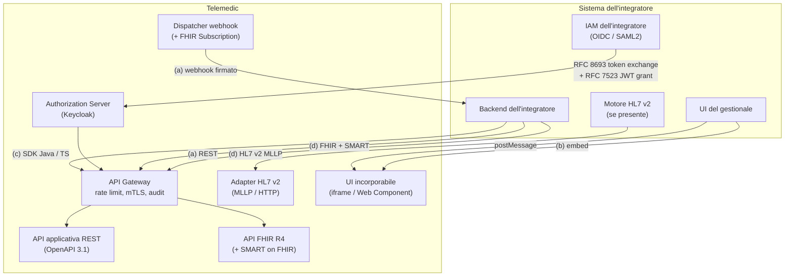
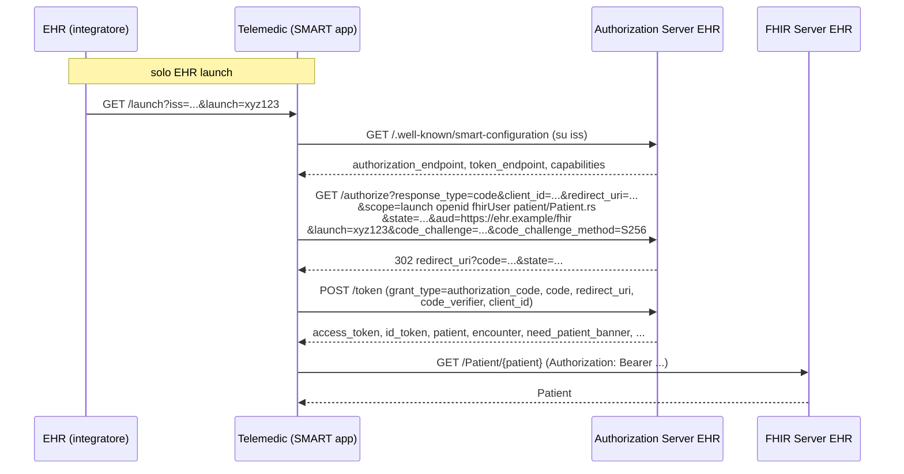
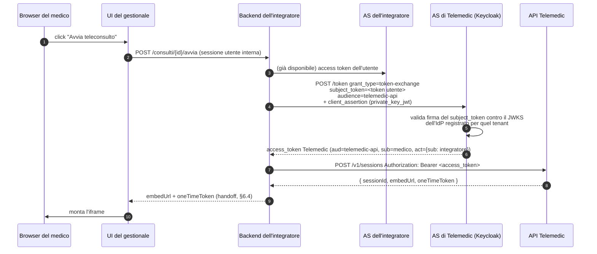
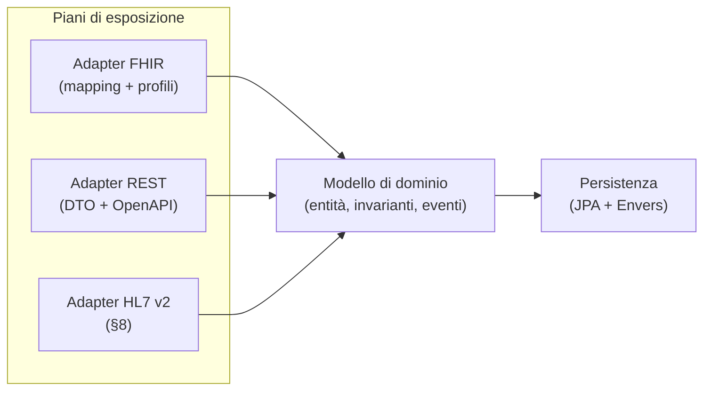
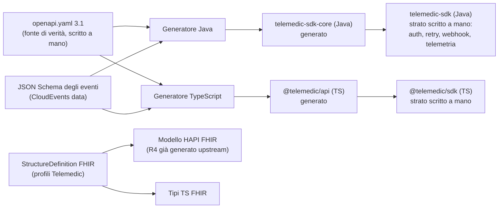

# R5 - Pattern di integrazione per sistemi terzi

> **Ambito.** Documento di ricerca a supporto della decisione **D4** del context pack
> (`.telemedic/context/00_PROJECT_BRIEF.md`): Telemedic espone **tutte e quattro** le modalità
> di integrazione - (a) REST + FHIR R4 + webhook, (b) embed white-label, (c) SDK Java e
> TypeScript, (d) HL7 v2 + SMART on FHIR + profili IHE.
>
> **Riservatezza (R0).** In questo documento non compare alcun nome di azienda, prodotto
> commerciale, marchio o dominio di potenziali partner. Si parla sempre di *"l'integratore"*,
> *"il sistema chiamante"*, *"un gestionale sanitario di terze parti"*. Fanno eccezione i
> **progetti software open source e gli standard** citati come componenti tecnologiche
> (Keycloak, HAPI FHIR, Apache Camel, Angular): sono dipendenze tecniche dichiarate nel brief,
> non partner commerciali.

## 0. Come leggere questo documento

### 0.1 Legenda dei livelli di affidabilità

Ogni affermazione tecnica è marcata implicitamente da come è scritta. Le convenzioni:

| Marcatura | Significato |
|---|---|
| Citazione con **numero di RFC + sezione** o **URL della specifica + sezione** | Verificato sulla fonte primaria durante questa ricerca |
| «**proposta di progetto**» | Non è uno standard: è un design che questo documento raccomanda per Telemedic. Nomi di header, scope ed endpoint marcati così sono *scelte*, non citazioni |
| «**non verificato**» | Informazione non confermata su fonte primaria in questa sessione: da controllare prima di implementare |

Regola operativa vincolante per chi implementerà: **nessun nome di parametro, header, scope o
endpoint marcato «proposta di progetto» può essere presentato nella documentazione pubblica come
se fosse standard.**

### 0.2 Struttura

1. Panorama e incastro delle quattro modalità
2. SMART on FHIR (App Launch, Backend Services, Web Messaging)
3. OAuth 2.x e OIDC applicati alla sanità (con focus su RFC 8693 Token Exchange)
4. Webhook e notifiche di eventi (incluso il modello FHIR `Subscription`)
5. API REST e FHIR affiancate
6. Embed white-label sicuro
7. SDK client Java e TypeScript
8. HL7 v2 e integrazione legacy
9. Profili IHE
10. Modello di estensibilità del prodotto
11. **Matrice decisionale** per scenario di integrazione
12. Riferimenti normativi

Ogni pattern ha una sezione **«quando NON usarlo»**. È un requisito del mandato e serve a
evitare che la documentazione pubblica diventi un catalogo di raccomandazioni indistinte.

---

## 1. Panorama: le quattro modalità e il loro incastro

### 1.1 Il problema di progetto

Il vincolo **V3** del brief («integrabilità totale: nessuna funzionalità accessibile solo dalla
UI») e le implicazioni progettuali §6.2 del brief (nessuna imposizione di UI, nessuna imposizione
di IAM, nessuna duplicazione di anagrafica, convivenza con l'agenda esistente, restituzione del
contenuto clinico al sistema di origine, multi-integratore per costruzione) definiscono un
sistema che **non è mai il punto di ingresso dell'utente** e **non è mai il master data**.

Questo esclude a priori due architetture comuni:

- **Il portale monolitico** che chiede all'utente di autenticarsi su Telemedic. Violerebbe §6.2.2.
- **Il sistema che replica l'anagrafica** dell'integratore per poterla gestire. Violerebbe §6.2.3.

Ne discende che l'architettura di integrazione ruota attorno a tre assi indipendenti:

1. **Asse dell'identità** - come un utente già autenticato altrove diventa un soggetto
   autorizzato in Telemedic (§3.3, Token Exchange).
2. **Asse del dato** - come le entità cliniche entrano ed escono senza essere duplicate
   (§5, riferimenti per identificatore esterno; §4, notifiche di ritorno).
3. **Asse della presentazione** - come la UI di Telemedic appare dentro la UI dell'integratore
   (§6, embed white-label).

### 1.2 Mappa delle modalità



### 1.3 Principio di sovrapposizione controllata

Le quattro modalità **non sono alternative**: sono strati che un singolo integratore usa
contemporaneamente. Il caso d'uso canonico del profilo archetipo (§6.1 del brief) è:

1. L'appuntamento nasce nell'agenda dell'integratore → l'integratore chiama l'API REST/FHIR di
   Telemedic per creare la sessione (**modalità a**, con autenticazione **modalità d** -
   SMART Backend Services);
2. il medico apre il consulto dalla propria UI → embed della stanza video
   (**modalità b**), con l'identità propagata via Token Exchange (**modalità d**);
3. al termine, Telemedic notifica l'esito (**modalità a**, webhook) e l'integratore recupera il
   `DiagnosticReport` (**modalità a/d**);
4. l'integrazione è codificata nel gestionale usando l'**SDK** (**modalità c**);
5. se l'integratore è un ospedale con un motore di integrazione, il flusso 1 e 3 avvengono in
   **HL7 v2** (`SIU^S12` in ingresso, `ORU^R01` in uscita) invece che in FHIR (**modalità d**).

### 1.4 Il criterio di scelta: chi possiede la sessione utente

L'unica domanda che discrimina davvero l'architettura di integrazione è: **chi ha autenticato
l'essere umano davanti allo schermo?**

| Chi autentica | Pattern di identità | Pattern di UI |
|---|---|---|
| L'IAM dell'integratore | Token Exchange (RFC 8693) o JWT grant (RFC 7523 §2.1) verso il realm Telemedic | Embed white-label |
| L'IAM di Telemedic (Keycloak, realm `patient`/`clinic`) | Authorization Code + PKCE diretto | UI Telemedic autonoma o embed |
| Nessuno (job batch, motore di integrazione) | SMART Backend Services / `client_credentials` con `private_key_jwt` | Nessuna UI |
| Un EHR che espone SMART | SMART App Launch: **Telemedic è l'app**, l'EHR è l'authorization server | App SMART lanciata dall'EHR |

L'ultima riga è la meno ovvia e va enunciata esplicitamente: **Telemedic ha due ruoli SMART
distinti** e la documentazione deve tenerli separati per non generare confusione.

- **Telemedic come `SMART client`**: legge `Patient`, `Appointment`, `Practitioner` dal FHIR
  server dell'integratore. Usa App Launch o Backend Services *verso* l'integratore.
- **Telemedic come `SMART server`** (authorization server + resource server): espone la propria
  API FHIR e accetta app di terze parti. È il ruolo che abilita gli scenari «ente pubblico» e
  «app mobile di terze parti» della matrice finale (§11).

Entrambi i ruoli sono in perimetro per la v1.0. Sono implementazioni diverse e vanno stimate
separatamente.

---

## 2. SMART on FHIR

**Fonte primaria**: `https://hl7.org/fhir/smart-app-launch/` - HL7 SMART App Launch. La versione
corrente pubblicata al momento della ricerca è la 2.x. Le pagine citate sono
`app-launch.html`, `scopes-and-launch-context.html`, `backend-services.html`,
`client-confidential-asymmetric.html`, `conformance.html`.

### 2.1 SMART App Launch: EHR launch e standalone launch

SMART App Launch è un **profilo di OAuth 2.0 Authorization Code** che aggiunge tre cose che
OAuth da solo non ha: il **launch context** (l'app riceve il paziente e l'incontro correnti senza
chiederli all'utente), gli **scope FHIR granulari** e la **discovery standardizzata**.

#### 2.1.1 EHR launch

L'EHR è il punto di partenza. L'utente clicca un pulsante dentro l'EHR; l'EHR apre l'URL di
lancio dell'app con due parametri (`app-launch.html`, sezione *Launch App: EHR Launch*):

| Parametro | Descrizione (citazione dalla specifica) |
|---|---|
| `iss` | «Identifies the EHR's FHIR endpoint» |
| `launch` | «Opaque identifier for this specific launch and any EHR context associated with it» |

```http
GET https://telemedic.example/launch?iss=https%3A%2F%2Fehr.example%2Ffhir&launch=xyz123 HTTP/1.1
```

L'app **non deve interpretare** il valore di `launch`: è opaco. L'app lo rimanda indietro
all'authorization server nella richiesta di autorizzazione, insieme allo scope `launch`.

#### 2.1.2 Standalone launch

L'app è il punto di partenza (l'utente apre l'app da un bookmark o da un'app store). Non c'è
`launch`; l'app chiede il contesto tramite gli scope `launch/patient`, `launch/encounter`, e
l'authorization server presenta all'utente un selettore di paziente.

#### 2.1.3 Sequenza completa



#### 2.1.4 Parametri della richiesta di autorizzazione

Da `app-launch.html`, sezione *Obtain authorization code*:

| Parametro | Obbligatorietà | Valore |
|---|---|---|
| `response_type` | Required | valore fisso `code` |
| `client_id` | Required | identificativo del client |
| `redirect_uri` | Required | deve corrispondere esattamente a uno dei redirect URI pre-registrati |
| `launch` | Conditional | solo per EHR launch; deve coincidere con il valore ricevuto dall'EHR |
| `scope` | Required | scope di risorsa + `openid`/`fhirUser` se serve l'identità + `launch` o `launch/...` |
| `state` | Required | valore opaco, **almeno 122 bit di entropia** secondo la specifica |
| `aud` | Required | URL del resource server FHIR |
| `code_challenge` | Required | versione hash S256 del `code_verifier` |
| `code_challenge_method` | Required | `S256` |

Il parametro `aud` **non è cosmetico**: la specifica lo motiva così - «This parameter prevents
leaking a genuine bearer token to a counterfeit resource server». Un authorization server SMART
che non valida `aud` consente a un resource server ostile di farsi emettere token validi per sé.

#### 2.1.5 PKCE è obbligatorio, non opzionale

`app-launch.html` è categorico: «All SMART apps **SHALL** support Proof Key for Code Exchange
(PKCE)» e i server «**SHALL** support the `S256` `code_challenge_method` and **SHALL NOT**
support the `plain` method».

Questo è più stringente di **RFC 7636** (che definisce PKCE e ammette `plain`) e allineato a
**RFC 9700 §2.1.1** («Authorization servers MUST support PKCE»). Per Telemedic significa: la
configurazione Keycloak dei client SMART deve avere *PKCE method* forzato a `S256`, e i client
che non presentano `code_challenge` devono essere rifiutati, non degradati.

### 2.2 Launch context: cosa arriva nella token response

Dal `token_endpoint` arriva un JSON che estende la risposta OAuth standard con i parametri di
contesto. Da `app-launch.html` (*Access token response*) e
`scopes-and-launch-context.html` (*Launch context arrives with your access_token*):

```json
{
  "access_token": "i8hweund78",
  "token_type": "Bearer",
  "expires_in": 3600,
  "scope": "launch openid fhirUser patient/Patient.rs patient/Encounter.rs",
  "id_token": "eyJhbGciOi...",
  "refresh_token": "a47c3c5f...",
  "patient": "123",
  "encounter": "456",
  "fhirContext": [ { "reference": "Appointment/789" } ],
  "need_patient_banner": false,
  "intent": "telemedic-start-consultation",
  "smart_style_url": "https://ehr.example/style/smart-v1.json",
  "tenant": "3fa85f64-5717-4562-b3fc-2c963f66afa6"
}
```

Semantica dei campi (nomi esatti dalla specifica):

| Campo | Significato |
|---|---|
| `patient` | id della risorsa `Patient` di contesto |
| `encounter` | id della risorsa `Encounter` di contesto |
| `fhirContext` | array di riferimenti a risorse di contesto ulteriori |
| `need_patient_banner` | booleano: hint UI. Se `false`, l'EHR ospitante **già mostra** il banner col paziente e l'app **non deve duplicarlo** |
| `intent` | stringa concordata fuori standard che indica il *perché* del lancio |
| `smart_style_url` | URL a un JSON di stile pubblicato dall'EHR |
| `tenant` | identificativo dell'organizzazione sanitaria |

**Rilevanza diretta per Telemedic.** Tre di questi campi risolvono requisiti del brief che
altrimenti richiederebbero estensioni proprietarie:

- `need_patient_banner` risolve il problema di doppia intestazione paziente nell'embed (§6):
  è la risposta standard alla domanda «l'ospitante mostra già chi è il paziente?».
- `smart_style_url` è il **meccanismo standard di white-label** per app SMART: l'EHR pubblica un
  JSON con i propri colori e font, l'app li applica. È l'alternativa standardizzata al passaggio
  proprietario di design token (§6.6). Va documentata come *primo* meccanismo di theming quando
  Telemedic è lanciato come app SMART.
- `tenant` è direttamente mappabile sul vincolo **V4** (tenant-awareness).
- `fhirContext` è la sede naturale del riferimento all'`Appointment` che ha originato il consulto
  (§6.2.4 del brief: «Telemedic deve poter essere invocato con un appuntamento già esistente»).

**Attenzione a `smart_style_url`.** La struttura del JSON di stile è definita dalla specifica ma
va trattata come input non fidato: è un URL controllato da un terzo. Le regole di sicurezza sono
in §6.6.3.

### 2.3 Scope: sintassi v1 e v2

Da `scopes-and-launch-context.html`.

#### 2.3.1 Forma generale

```
{patient|user|system}/{ResourceType}.{permissions}[?param=value]
```

| Prefisso | Semantica |
|---|---|
| `patient/` | l'accesso è ristretto al paziente in contesto |
| `user/` | l'accesso è quello che l'utente autenticato avrebbe comunque |
| `system/` | nessun utente coinvolto: accesso di sistema (Backend Services) |

#### 2.3.2 v1 → v2

| v1 | v2 equivalente |
|---|---|
| `.read` | `.rs` |
| `.write` | `.cud` |
| `.*` | `.cruds` |

Le lettere v2 sono `c` (create), `r` (read), `u` (update), `d` (delete), `s` (search) e
**devono comparire nell'ordine della stringa `cruds`**: `.cu` e `.rs` sono validi, `.dus` non lo è.

Esempi validi:

```
patient/Observation.rs
user/Appointment.cruds
system/Encounter.cud
patient/Observation.rs?category=http://terminology.hl7.org/CodeSystem/observation-category|laboratory
```

L'ultimo esempio mostra il **raffinamento con parametri di ricerca**: uno scope può essere
ristretto a un sottoinsieme delle risorse di un tipo. È la funzionalità che consente il principio
del minimo privilegio senza inventare scope proprietari.

#### 2.3.3 Scope di contesto e di identità

| Scope | Effetto |
|---|---|
| `launch` | collega l'autorizzazione alla sessione EHR (richiede il parametro `launch`) |
| `launch/patient` | chiede il contesto paziente |
| `launch/encounter` | chiede il contesto incontro |
| `openid` | abilita l'`id_token` |
| `fhirUser` | aggiunge il claim `fhirUser` con la risorsa FHIR che rappresenta l'utente |
| `online_access` | refresh token valido finché l'utente è online |
| `offline_access` | refresh token che sopravvive al logout dell'utente |

#### 2.3.4 Estensioni proprietarie

La specifica prevede due forme legittime per scope non standard: **URI completo**
(`https://telemedic.example/scopes/session.manage`) oppure **prefisso doppio underscore**
(`__session.manage`). *Proposta di progetto*: Telemedic usa la forma URI, che è auto-documentante
e non collide.

#### 2.3.5 Scelta per Telemedic

*Proposta di progetto.* Adottare **v2 come sintassi nativa** e **accettare v1 in ingresso**
convertendola secondo la tabella §2.3.2. Motivazione: il profilo archetipo dell'integratore
(gestionale PMI) è più probabile che abbia librerie datate che emettono `patient/Patient.read`;
rifiutarle produrrebbe attrito di integrazione senza guadagno di sicurezza, dato che la
conversione è definita dalla specifica stessa.

Gli scope applicativi di Telemedic che **non** corrispondono a risorse FHIR (avviare una sessione
video, ruotare una chiave TURN, gestire il consenso alla registrazione) **non vanno mascherati
da scope FHIR**. Vanno espressi come scope URI, esempio *proposta di progetto*:

```
https://telemedic.example/scopes/session.start
https://telemedic.example/scopes/session.join
https://telemedic.example/scopes/recording.consent.manage
https://telemedic.example/scopes/webhook.manage
```

Forzare una capacità applicativa dentro `patient/Encounter.cu` sarebbe un abuso semantico e
renderebbe impossibile revocare l'una senza l'altra.

### 2.4 Discovery: `/.well-known/smart-configuration`

Da `conformance.html`. Il documento è servito su
`{fhirBase}/.well-known/smart-configuration` con `Content-Type: application/json`.

**Campi obbligatori:**

| Campo | Contenuto |
|---|---|
| `grant_types_supported` | array; include `authorization_code` e/o `client_credentials` |
| `token_endpoint` | URL dell'endpoint token OAuth 2 |
| `capabilities` | array delle capability SMART supportate |
| `code_challenge_methods_supported` | **deve includere `S256`** e **non deve includere `plain`** |

**Campi condizionali:**

| Campo | Condizione |
|---|---|
| `issuer` | richiesto se il server supporta `sso-openid-connect` |
| `jwks_uri` | richiesto per OpenID Connect |
| `authorization_endpoint` | richiesto se il server supporta `launch-ehr` o `launch-standalone` |

**Campi raccomandati:** `token_endpoint_auth_methods_supported`, `scopes_supported`,
`response_types_supported`, `management_endpoint`, `introspection_endpoint`,
`revocation_endpoint`, `user_access_brand_bundle`, `user_access_brand_identifier`.

**Campi opzionali:** `registration_endpoint`, `associated_endpoints` (sperimentale),
`smart_app_state_endpoint` (**deprecato**).

Le capability sono raggruppate per categoria: modalità di lancio (`launch-ehr`,
`launch-standalone`), tipo di client (`client-public`, `client-confidential-symmetric`,
`client-confidential-asymmetric`), permessi, contesto di lancio, SSO (`sso-openid-connect`),
app state.

**Rapporto con `CapabilityStatement`.** La specifica è esplicita: «In previous versions of SMART,
some details were conveyed in a server's CapabilityStatement; this mechanism is now deprecated».
Il `CapabilityStatement` resta obbligatorio come descrittore FHIR (`GET [base]/metadata`), ma
**non è più il canale di scoperta degli endpoint OAuth**: quello è
`/.well-known/smart-configuration`.

*Conseguenza pratica per Telemedic:* pubblicare entrambi, con `/.well-known/smart-configuration`
come fonte di verità per gli endpoint OAuth. L'estensione `oauth-uris` sul `CapabilityStatement`
va comunque emessa per compatibilità con client datati, ma marcata come deprecata nella
documentazione.

### 2.5 Token, refresh e revoca

- **Token request**: `POST` al `token_endpoint` con `grant_type=authorization_code`, `code`,
  `redirect_uri`, `code_verifier` (obbligatorio per PKCE) e `client_id` (obbligatorio solo per
  client pubblici).
- **Refresh**: `grant_type=refresh_token`, `refresh_token`; lo `scope` è opzionale ma «must be a
  strict sub-set of the scopes granted». Se la risposta contiene un nuovo `refresh_token`,
  «app should discard any previous `refresh_token`» - cioè la specifica prevede esplicitamente
  la **rotazione del refresh token**, coerente con RFC 9700 §2.2.2 («Refresh tokens for public
  clients MUST be sender-constrained or use refresh token rotation»).
- **Revoca**: l'endpoint `revocation_endpoint` è quello di **RFC 7009**.

*Proposta di progetto per Telemedic come authorization server:*

| Tipo di token | Durata | Motivazione |
|---|---|---|
| Access token utente (embed clinico) | 5–10 min | contiene claim su un contesto clinico; finestra di replay minima |
| Access token `system/` (Backend Services) | 300 s | la specifica SMART Backend Services raccomanda esplicitamente `expires_in: 300` |
| Refresh token `online_access` | legato alla sessione SSO Keycloak | |
| Refresh token `offline_access` | emesso **solo** a client confidenziali asimmetrici, con rotazione | un refresh token offline su client pubblico in ambito sanitario è un rischio sproporzionato |

### 2.6 SMART Backend Services - il pattern chiave per Telemedic

**Fonte**: `backend-services.html` e `client-confidential-asymmetric.html`.

È il pattern per **backend che chiama backend, senza utente**. È esattamente il caso del
gestionale dell'integratore che crea una sessione di teleconsulto da un job dell'agenda.

#### 2.6.1 Perché non un client secret

La specifica richiede il profilo **client-confidential-asymmetric**: il client si autentica con
un **JWT firmato con la propria chiave privata** (meccanismo di **RFC 7523**), non con un secret
condiviso. I vantaggi rispetto a `client_secret_post`/`client_secret_basic`:

- il segreto non transita mai sulla rete, nemmeno una volta;
- il server non custodisce materiale segreto del client (solo chiavi pubbliche), quindi una
  compromissione del database dell'authorization server non consente di impersonare i client;
- la rotazione della chiave non richiede coordinamento sincrono: basta pubblicare la nuova chiave
  nel JWKS con un `kid` diverso.

Per un sistema sanitario multi-integratore (§6.2.6 del brief: «più partner possono coesistere
sulla stessa installazione, ciascuno con le proprie chiavi») questo è determinante.

#### 2.6.2 Il JWT di autenticazione

Da `client-confidential-asymmetric.html`.

**Header:**

| Campo | Obbligatorietà | Valore |
|---|---|---|
| `alg` | required | algoritmo JWA di firma (es. `RS384`, `ES384`) |
| `kid` | required | identificatore della coppia di chiavi usata |
| `typ` | required | valore fisso `JWT` |
| `jku` | optional | URL TLS-protetto del JWK Set |

**Claim:**

| Claim | Valore |
|---|---|
| `iss` | «Issuer of the JWT - the client's `client_id`» |
| `sub` | «The client's `client_id`, as determined during registration» |
| `aud` | «The FHIR authorization server's token URL» |
| `exp` | scadenza: **non più di cinque minuti nel futuro** |
| `jti` | nonce che identifica univocamente questo JWT (anti-replay) |

**Algoritmi**: `RS384` ed `ES384` sono obbligatori; altri sono ammessi ma opzionali.

Esempio di JWT decodificato (*i valori sono illustrativi*):

```json
// header
{
  "alg": "ES384",
  "kid": "2f7c9a1e-3b4d-4a10-9d5e-1c8b7a6f0e21",
  "typ": "JWT"
}
// payload
{
  "iss": "b1f2c3d4-integratore-client-id",
  "sub": "b1f2c3d4-integratore-client-id",
  "aud": "https://telemedic.example/realms/clinic/protocol/openid-connect/token",
  "exp": 1787654321,
  "jti": "8f3c1e02-77a1-4f77-9d1a-6a2b3c4d5e6f"
}
```

#### 2.6.3 La richiesta di token

```http
POST /realms/clinic/protocol/openid-connect/token HTTP/1.1
Host: telemedic.example
Content-Type: application/x-www-form-urlencoded
Accept: application/json

grant_type=client_credentials
&scope=system%2FEncounter.cu%20system%2FDiagnosticReport.c%20https%3A%2F%2Ftelemedic.example%2Fscopes%2Fsession.start
&client_assertion_type=urn%3Aietf%3Aparams%3Aoauth%3Aclient-assertion-type%3Ajwt-bearer
&client_assertion=eyJhbGciOiJFUzM4NCIsImtpZCI6IjJmN2M5YTFlLi4uIiwidHlwIjoiSldUIn0...
```

I valori `grant_type=client_credentials` e
`client_assertion_type=urn:ietf:params:oauth:client-assertion-type:jwt-bearer` sono citati
letteralmente da `backend-services.html`.

#### 2.6.4 La risposta

```json
{
  "access_token": "eyJraWQiOiJ...",
  "token_type": "bearer",
  "expires_in": 300,
  "scope": "system/Encounter.cu system/DiagnosticReport.c https://telemedic.example/scopes/session.start"
}
```

`expires_in` è obbligatorio e la specifica indica esplicitamente «recommended value is `300`».
Lo `scope` restituito **può essere più ristretto** di quello richiesto: il client deve leggerlo
e non assumere che coincida con la richiesta. È un errore di integrazione ricorrente e va
segnalato nella documentazione pubblica.

#### 2.6.5 Registrazione della chiave: `jku` o JWKS statico

La specifica indica due modalità e ha una preferenza netta:

1. **URL al JWK Set** (*strongly preferred*): «This URL communicates the TLS-protected endpoint
   where the client's public JWK Set can be found». Il server rifetcha periodicamente.
2. **JWK Set consegnato alla registrazione** (*strongly discouraged*).

*Proposta di progetto per Telemedic:*

- accettare entrambe, ma **richiedere l'URL JWKS come default** nel processo di onboarding;
- **allow-list degli host** ammessi per `jku`/`jwks_uri` per tenant: un `jku` arbitrario in un
  header JWT è una superficie SSRF (§4.4) e un vettore di key confusion. Il valore di `jku`
  nell'header **non deve mai essere seguito ciecamente**: va confrontato con il `jwks_uri`
  registrato per quel `client_id`, e se non coincide la richiesta va rifiutata;
- cache del JWKS con TTL e `stale-while-revalidate`, refetch forzato solo su `kid` sconosciuto,
  con rate limiting sul refetch per evitare che un `kid` casuale diventi un amplificatore di
  traffico verso terzi.

#### 2.6.6 Ruolo simmetrico

Telemedic usa Backend Services **in entrambe le direzioni**:

- **come client**, verso il FHIR server dell'integratore, per leggere `Patient`/`Appointment`
  quando serve un dato che non è stato passato nella chiamata;
- **come server**, per accettare le chiamate del backend dell'integratore.

La chiave privata di Telemedic come client va custodita in un secret manager o HSM, non nel
filesystem del container (vincolo di sicurezza; cfr. regola globale sui segreti).

### 2.7 SMART Web Messaging

**Fonte**: `https://build.fhir.org/ig/HL7/smart-web-messaging/` - è un IG **separato** da
SMART App Launch e a maturità inferiore. Va documentato come *sperimentale*.

Risolve il problema: un'app SMART incorporata in un iframe dentro l'EHR deve poter chiedere
all'EHR di fare qualcosa (chiudere l'attività, scrivere un appunto, aprire un'altra schermata)
senza passare per l'API FHIR.

#### 2.7.1 Handle e origine

Durante il lancio SMART l'app riceve due parametri aggiuntivi nella token response:

| Parametro | Contenuto |
|---|---|
| `smart_web_messaging_handle` | «A base64-encoded value used for authentication» |
| `smart_web_messaging_origin` | l'origine dell'EHR (es. `https://ehr.example.org`) |

`smart_web_messaging_origin` è il valore da usare come `targetOrigin` in `postMessage` - mai `*`
(§6.3).

#### 2.7.2 Struttura del messaggio

Messaggio dall'app all'EHR:

```json
{
  "messagingHandle": "RnVuIGZhY3Q6IEluIENhbmFkYSB3ZSBjYWxs...",
  "messageId": "3f7b9a20-3e01-4c9d-8c1b-2e4f5a6b7c8d",
  "messageType": "ui.done",
  "payload": {}
}
```

Risposta dall'EHR all'app:

```json
{
  "messageId": "9a1c2b3d-4e5f-6a7b-8c9d-0e1f2a3b4c5d",
  "responseToMessageId": "3f7b9a20-3e01-4c9d-8c1b-2e4f5a6b7c8d",
  "payload": { "success": true }
}
```

`messageType` definiti dall'IG: `status.handshake`, `ui.done`, `ui.launchActivity`,
`scratchpad.create`, `scratchpad.update`, `scratchpad.delete` (e la lettura dello scratchpad).
La specifica non è ancora normativa allo stesso livello di App Launch: **non verificato** se
`scratchpad.read` sia elencato con questo nome esatto nella versione corrente - da confermare
prima di implementarlo.

#### 2.7.3 Sicurezza

L'IG richiede che l'app **validi l'`origin`** di ogni messaggio ricevuto e che l'EHR validi il
`targetOrigin` di ogni messaggio inviato. Il `messagingHandle` funge da bearer di
autorizzazione all'interno del canale: se un'origine ostile riesce a leggerlo, può impersonare
l'app verso l'EHR. Ne discende che l'handle **non va mai loggato** né messo in URL.

#### 2.7.4 Uso in Telemedic

Il caso d'uso naturale è il ciclo di vita dell'embed: `ui.done` quando il consulto termina,
perché l'EHR chiuda la finestra modale che ospita l'iframe. È l'alternativa **standard** al
protocollo `postMessage` proprietario di §6.3 - e va offerta **quando l'ospitante è un EHR che
implementa SMART Web Messaging**. Poiché il profilo archetipo dell'integratore (gestionale PMI)
quasi certamente **non** lo implementa, Telemedic deve offrire entrambi: SMART Web Messaging per
gli ospitanti conformi e il protocollo proprietario documentato per tutti gli altri.

### 2.8 Quando NON usare SMART on FHIR

| Situazione | Perché no | Cosa usare invece |
|---|---|---|
| L'integratore non ha un FHIR server né intende averlo | SMART presuppone un resource server FHIR come `aud`. Senza, il profilo perde senso e si riduce a OAuth con nomi strani | OAuth 2.1 puro + API applicativa REST (§5) |
| Serve solo propagare l'identità di un utente già autenticato, senza contesto clinico | Il launch context (paziente/incontro) è il valore aggiunto di SMART; se non serve, si paga complessità a vuoto | Token Exchange RFC 8693 (§3.3) |
| Comunicazione machine-to-machine senza alcuna semantica FHIR (es. sincronizzazione fatturazione) | Gli scope `system/{Resource}` non modellano capacità non-FHIR | `client_credentials` + `private_key_jwt` con scope URI proprietari |
| Sistema legacy che parla solo HL7 v2 su MLLP | Nessun HTTP, nessun OAuth | §8, adapter v2 + mutual TLS a livello di trasporto |
| App mobile pubblica che deve restare loggata per settimane | `offline_access` su client pubblico in ambito sanitario è un rischio di custodia del token difficile da giustificare in analisi dei rischi ISO 14971 | Sessione breve + re-autenticazione biometrica locale, oppure client confidenziale con backend proprio |
| Prototipo o demo interna | Il costo di implementare discovery, PKCE, JWKS e launch context non è ripagato | Token statici in ambiente isolato, **mai** promossi in produzione |

---

## 3. OAuth 2.x e OIDC applicati alla sanità

### 3.1 Base normativa e postura di default

Il riferimento di sicurezza è **RFC 9700, «Best Current Practice for OAuth 2.0 Security»**.
Le prescrizioni che vincolano il design di Telemedic:

| Prescrizione | Sezione RFC 9700 | Testo |
|---|---|---|
| Matching esatto dei redirect URI | §2.1 (e §4.1.3) | gli AS «MUST utilize exact string matching»; unica eccezione, la porta di `localhost` per app native |
| PKCE | §2.1.1 | i client pubblici «MUST use PKCE»; per i confidenziali è RECOMMENDED; gli AS «MUST support PKCE» |
| Implicit grant | §2.1.2 | i client «SHOULD NOT use the implicit grant (response type `token`)» |
| Resource Owner Password Credentials | §2.4 | «MUST NOT be used» |
| Refresh token dei client pubblici | §2.2.2 | «MUST be sender-constrained or use refresh token rotation» |
| Difesa dal mix-up | §2.1 e §4.4.2 | i client che parlano con più AS «SHOULD» usare il parametro `iss` di **RFC 9207** |
| Restrizione del privilegio | §2.3 | gli access token «SHOULD be audience-restricted to a specific resource server» e ristretti a risorse e azioni specifiche |
| CSRF | §2.1 e §4.7.1 | i client «MUST» difendersi con `state`, PKCE o `nonce` OIDC |

*Proposta di progetto - postura di default di Telemedic:*

1. Implicit grant e ROPC **disabilitati a livello di realm Keycloak**, non solo sconsigliati.
2. PKCE `S256` obbligatorio su tutti i client, inclusi i confidenziali.
3. `iss` (RFC 9207) emesso nella risposta di autorizzazione e validato quando Telemedic è client.
4. Ogni access token porta `aud` esplicito e viene rifiutato da un resource server che non si
   riconosce in `aud`. Questo è il punto in cui si applica **§2.3**: l'audience deve essere il
   resource server, non il realm.
5. Token opachi verso l'esterno, JWT internamente - oppure JWT firmati con chiave per tenant.
   La scelta è discussa in §3.9.

### 3.2 Authorization Code + PKCE

È il flusso per ogni essere umano davanti a un browser. **RFC 7636** definisce PKCE; RFC 9700
lo rende obbligatorio.

```
code_verifier   = 43..128 caratteri da [A-Z][a-z][0-9]-._~   (RFC 7636 §4.1)
code_challenge  = BASE64URL(SHA256(ASCII(code_verifier)))    (RFC 7636 §4.2, metodo S256)
```

`code_challenge_method=plain` è vietato in SMART (§2.1.5) e va vietato anche fuori da SMART:
`plain` non protegge dall'intercettazione del `code`, che è la minaccia contro cui PKCE esiste.

#### Quando NON usarlo

| Situazione | Perché no | Alternativa |
|---|---|---|
| Nessun utente coinvolto (job, cron, motore di integrazione) | Non c'è nessuno a cui presentare la schermata di consenso | `client_credentials` + `private_key_jwt` (§3.4) |
| L'utente è già autenticato dall'IAM dell'integratore e un secondo redirect sarebbe visibile | Anche con SSO silente, un redirect cross-origin dentro un iframe può essere bloccato dai cookie di terze parti (§6.5): il flusso fallisce in modo intermittente e non diagnosticabile | Token Exchange (§3.3) o JWT grant (§3.5) sul canale back-channel |
| Dispositivo senza browser (totem, dispositivo medico embedded) | Non c'è user agent per il redirect | Device Authorization Grant (RFC 8628) - **non verificato** se necessario nel perimetro v1.0 |

### 3.3 Token Exchange (RFC 8693) - propagazione dell'identità senza secondo login

Questa è **la sezione centrale** per il requisito §6.2.2 del brief: «Telemedic deve accettare
identità federate senza obbligare gli utenti a un secondo login».

#### 3.3.1 Il problema

Un medico è autenticato nel gestionale dell'integratore. Clicca «Avvia teleconsulto». Deve
comparire la stanza video di Telemedic, dentro l'interfaccia del gestionale, **senza schermata
di login e senza redirect visibile**. Telemedic deve però sapere:

- **chi** è il medico (per l'audit immutabile, vincolo **V5**);
- **quale tenant** (vincolo **V4**);
- **quali permessi** ha (può avviare consulti? può registrare?);
- che l'affermazione «questo è il dott. X» proviene da un emittente fidato e non dal browser.

L'ultima riga esclude qualunque soluzione in cui il browser trasporta un'asserzione di identità
verso Telemedic: sarebbe manipolabile. La propagazione **deve avvenire back-channel**, da
backend a backend.

#### 3.3.2 Il flusso



Il punto cruciale è il passo 4-6: il token dell'utente **non arriva mai al browser di Telemedic**
e non compare mai in un URL.

#### 3.3.3 Parametri della richiesta (RFC 8693 §2.1)

| Parametro | Obbligatorietà | Descrizione |
|---|---|---|
| `grant_type` | REQUIRED | valore fisso `urn:ietf:params:oauth:grant-type:token-exchange` |
| `resource` | OPTIONAL | URI assoluto del servizio destinatario |
| `audience` | OPTIONAL | nome logico del servizio destinatario (es. un `client_id`) |
| `scope` | OPTIONAL | scope desiderati, separati da spazio |
| `requested_token_type` | OPTIONAL | identificatore del tipo di token richiesto |
| `subject_token` | REQUIRED | token che rappresenta l'identità del soggetto per conto del quale si agisce |
| `subject_token_type` | REQUIRED | identificatore del tipo di `subject_token` |
| `actor_token` | OPTIONAL | token che rappresenta la parte agente (scenari di delega) |
| `actor_token_type` | REQUIRED se c'è `actor_token` | tipo dell'`actor_token` |

**Identificatori di tipo di token (RFC 8693 §3):**

```
urn:ietf:params:oauth:token-type:access_token
urn:ietf:params:oauth:token-type:refresh_token
urn:ietf:params:oauth:token-type:id_token
urn:ietf:params:oauth:token-type:saml1
urn:ietf:params:oauth:token-type:saml2
urn:ietf:params:oauth:token-type:jwt
```

**Parametri della risposta (RFC 8693 §2.2.1):**

| Parametro | Obbligatorietà |
|---|---|
| `access_token` | REQUIRED - il token emesso |
| `issued_token_type` | REQUIRED |
| `token_type` | REQUIRED (es. `Bearer` oppure `N_A`) |
| `expires_in` | RECOMMENDED |
| `scope` | CONDITIONAL - obbligatorio se differisce da quello richiesto |
| `refresh_token` | OPTIONAL |

#### 3.3.4 Esempio completo per Telemedic

**Richiesta** (il backend dell'integratore verso l'authorization server di Telemedic; il client
si autentica con `private_key_jwt` di RFC 7523, non con un secret):

```http
POST /realms/clinic/protocol/openid-connect/token HTTP/1.1
Host: telemedic.example
Content-Type: application/x-www-form-urlencoded
Accept: application/json

grant_type=urn%3Aietf%3Aparams%3Aoauth%3Agrant-type%3Atoken-exchange
&subject_token=eyJhbGciOiJSUzI1NiIsImtpZCI6ImludGVncmF0b3ItMjAyNi0wMSJ9.eyJpc3MiOiJodHRwczovL2lkcC5pbnRlZ3JhdG9yZS5leGFtcGxlIiwic3ViIjoiZG90dC1yb3NzaS0wMDEiLCJhdWQiOiJnZXN0aW9uYWxlIiwiZXhwIjoxNzg3NjU0MzIxfQ.SIGNATURE
&subject_token_type=urn%3Aietf%3Aparams%3Aoauth%3Atoken-type%3Aaccess_token
&audience=telemedic-api
&scope=https%3A%2F%2Ftelemedic.example%2Fscopes%2Fsession.start%20system%2FEncounter.cu
&requested_token_type=urn%3Aietf%3Aparams%3Aoauth%3Atoken-type%3Aaccess_token
&client_assertion_type=urn%3Aietf%3Aparams%3Aoauth%3Aclient-assertion-type%3Ajwt-bearer
&client_assertion=eyJhbGciOiJFUzM4NCIsImtpZCI6IjJmN2M5YTFlIiwidHlwIjoiSldUIn0...
```

**Risposta:**

```json
{
  "access_token": "eyJhbGciOiJFUzM4NCIsImtpZCI6InRtLTIwMjYtMDgifQ...",
  "issued_token_type": "urn:ietf:params:oauth:token-type:access_token",
  "token_type": "Bearer",
  "expires_in": 300,
  "scope": "https://telemedic.example/scopes/session.start system/Encounter.cu"
}
```

**Payload dell'access token emesso** (delega, non impersonificazione):

```json
{
  "iss": "https://telemedic.example/realms/clinic",
  "aud": "telemedic-api",
  "sub": "https://idp.integratore.example#dott-rossi-001",
  "act": {
    "sub": "b1f2c3d4-integratore-client-id",
    "iss": "https://telemedic.example/realms/clinic"
  },
  "exp": 1787654621,
  "iat": 1787654321,
  "jti": "0f5b1c2d-9a8e-4b7f-a1c2-3d4e5f6a7b8c",
  "scope": "https://telemedic.example/scopes/session.start system/Encounter.cu",
  "tenant": "asl-nord-01",
  "fhirUser": "https://telemedic.example/fhir/Practitioner/prc-8812"
}
```

Note di progetto sui claim:

- `sub` **non** è un identificativo inventato da Telemedic: è derivato deterministicamente da
  `iss` + `sub` del token originale. Rispetta §6.2.3 del brief («non diventare il master data»)
  e garantisce che due utenti omonimi di due integratori diversi non collidano.
- `act` è il claim di **RFC 8693 §4.1**: «Expresses delegation within JWTs». La sua presenza
  distingue **delega** da **impersonificazione**.
- `tenant` e `fhirUser` sono *proposta di progetto*; `fhirUser` riusa il nome del claim SMART
  per coerenza (§2.3.3).

#### 3.3.5 Delega contro impersonificazione (RFC 8693 §1.1)

La distinzione è normativa e ha conseguenze dirette sull'audit immutabile (**V5**).

- **Impersonificazione**: si passa solo il `subject_token`. Il token risultante rende
  l'integratore «indistinguibile» dall'utente. L'audit di Telemedic registrerebbe solo «dott.
  Rossi ha fatto X», perdendo l'informazione «tramite il sistema Y».
- **Delega**: si passano `subject_token` **e** `actor_token` (o l'AS deriva l'attore
  dall'autenticazione del client). Il token contiene entrambe le identità nel claim `act`.

*Raccomandazione vincolante per Telemedic:* **usare sempre la delega, mai l'impersonificazione**.
In un contesto MDR/GDPR l'audit deve rispondere alla domanda «quale sistema ha agito per conto
di quale persona»; con l'impersonificazione questa domanda non ha risposta. La catena di delega
annidata (RFC 8693 §4.1, Figure 6) va preservata: se l'integratore a sua volta agiva per conto
di un terzo, il claim `act` annidato lo registra.

#### 3.3.6 Chi valida il `subject_token` e come nasce la fiducia

L'authorization server di Telemedic deve verificare che il `subject_token` sia stato emesso da
un IdP fidato **per quel tenant**. Il modello *proposta di progetto*:

1. In fase di onboarding, per ogni tenant si registra un **trust anchor**: `issuer` dell'IdP
   dell'integratore + `jwks_uri` + algoritmi ammessi + eventuale `aud` atteso.
2. Il `client_id` che presenta la richiesta di token exchange è legato al tenant. Il legame
   `client_id → tenant → trust anchor` è la sola via: **non si accetta un `subject_token` il cui
   `iss` non sia il trust anchor del tenant del client chiamante**. Senza questo controllo,
   l'integratore A potrebbe presentare un token dell'IdP dell'integratore B.
3. Validazione del `subject_token`: firma, `iss`, `exp`, `nbf`, `aud` (se registrato),
   `alg` in allow-list (mai `none`, mai algoritmi simmetrici su chiavi pubbliche).
4. Mappatura dei claim → identità Telemedic tramite un **claim mapper per tenant** configurabile
   (quale claim contiene il codice fiscale? quale il ruolo? quale l'organizzazione?).
   Configurabile, non hard-coded (§6.2.6 del brief).

#### 3.3.7 Stato del supporto in Keycloak (rilevante per la stima)

Questo punto è determinante per la pianificazione e va segnalato agli agenti di architettura e
roadmap.

- **Keycloak 26.2** ha reso ufficialmente supportato lo *Standard Token Exchange*, dichiarato
  conforme a RFC 8693. Lo scope iniziale è però **internal-internal**: scambio di un access token
  emesso da Keycloak con un access token per un altro client **dello stesso realm**. Lo scambio
  *external-to-internal* (token emesso da un IdP esterno) era indicato come lavoro successivo.
  Fonte: `https://www.keycloak.org/2025/05/standard-token-exchange-kc-26-2`.
- **Keycloak 26.5** ha introdotto (in **preview**) il supporto al **JWT Authorization Grant di
  RFC 7523 §2.1**, con `grant_type=urn:ietf:params:oauth:grant-type:jwt-bearer` e il JWT esterno
  passato nel parametro `assertion`. La fiducia si configura tramite un Identity Provider
  (una sezione dedicata su un IdP OIDC esistente, oppure un IdP «JWT Authorization Grant»
  dedicato); i client confidenziali abilitano la funzione e selezionano gli IdP ammessi.
  Combinato con il token exchange, realizza l'**identity chaining** cross-dominio in due passi:
  (1) nel dominio A si fa token exchange con `audience` = dominio B; (2) verso il dominio B si
  usa quel token come `assertion` del JWT grant. Fonte:
  `https://www.keycloak.org/2026/01/jwt-authorization-grant`.

**Conseguenza per Telemedic.** Il pattern «identità federata senza secondo login» si realizza
con la combinazione **RFC 7523 §2.1 (JWT grant) + RFC 8693 (token exchange)**, che è anche il
percorso su cui si sta standardizzando l'IETF (`draft-ietf-oauth-identity-chaining`). Va
esplicitato in un ADR:

- la modalità **primaria** documentata è il **JWT Authorization Grant**: l'integratore presenta
  al token endpoint di Telemedic un JWT firmato dal proprio IdP nel parametro `assertion`;
- la modalità **token exchange RFC 8693 puro** va offerta come alternativa, con l'avvertenza che
  la disponibilità dello scambio *external-to-internal* dipende dalla versione di Keycloak
  adottata. **Da verificare sulla versione esatta prima di dichiararlo supportato in
  documentazione pubblica.**
- La versione preview del JWT grant impone un gate di release: **non dichiarare GA una
  funzionalità che poggia su una feature in preview**. È un requisito di qualità IEC 62304.

#### 3.3.8 Quando NON usare Token Exchange

| Situazione | Perché no | Alternativa |
|---|---|---|
| L'integratore non ha un IdP con JWKS pubblicabile | Non c'è nulla da validare: si finirebbe a fidarsi di un'asserzione non firmata | Federazione OIDC/SAML2 classica su Keycloak, con login (anche silente) dell'utente |
| Serve solo un'identità di sistema, non di utente | Si aggiungerebbe un `subject_token` fittizio | `client_credentials` + `private_key_jwt` |
| Il flusso parte dal browser e l'integratore non ha backend | Il `subject_token` transiterebbe nel browser: manipolabile e loggabile | Authorization Code + PKCE con federazione IdP |
| Il token dell'integratore è opaco (non JWT) e non c'è introspection | Nessun modo di validarlo | Richiedere all'integratore un `id_token` OIDC firmato |
| L'integratore vuole «un token che dura tutto il giorno» | Il token exchange emette token a vita breve per design; token lunghi vanificano la revoca | Ripetere l'exchange a ogni operazione: costa una chiamata back-channel, non una sessione utente |

### 3.4 Client Credentials con autenticazione asimmetrica (RFC 7523)

**RFC 7523** definisce due usi distinti del JWT in OAuth e vanno tenuti separati perché hanno
`grant_type` diversi:

| Uso | Sezione | Parametro | `grant_type` |
|---|---|---|---|
| **JWT come authorization grant** | RFC 7523 §2.1 | `assertion` | `urn:ietf:params:oauth:grant-type:jwt-bearer` |
| **JWT come client authentication** | RFC 7523 §2.2 | `client_assertion` + `client_assertion_type` | qualunque (`client_credentials`, `authorization_code`, ...) |

SMART Backend Services (§2.6) usa il **secondo**: `grant_type=client_credentials` con
`client_assertion_type=urn:ietf:params:oauth:client-assertion-type:jwt-bearer`. L'identity
chaining di §3.3.7 usa **entrambi**, in passi diversi. Confonderli è l'errore di lettura più
frequente su questo RFC e la documentazione pubblica deve esplicitare la differenza.

#### Quando NON usarlo

- Quando il client è un'applicazione **pubblica** (SPA, app mobile senza backend): non può
  custodire una chiave privata. Non esiste modo sicuro di fare `client_credentials` da un
  browser. Punto.
- Quando l'operazione richiede il consenso o l'identità di un utente specifico: un token
  `system/` non porta identità utente e l'audit risulterebbe attribuito al sistema.
- Quando l'integratore non è in grado di gestire il ciclo di vita di una chiave (generazione,
  custodia, rotazione, revoca). In quel caso è più onesto un `client_secret` a rotazione
  frequente con mTLS di trasporto, documentandone i limiti, che una chiave privata custodita
  male.

### 3.5 Sender-constrained token: DPoP e mTLS

Il bearer token ha un difetto strutturale: chi lo intercetta lo usa. In sanità, dove il token
apre l'accesso a dati particolari ex art. 9 GDPR, questo è un rischio da mitigare.

#### 3.5.1 DPoP - RFC 9449

**Struttura della prova DPoP (RFC 9449 §4.2).** Header JOSE:

| Campo | Valore |
|---|---|
| `typ` | `dpop+jwt` |
| `alg` | algoritmo asimmetrico (mai `none`, mai simmetrico) |
| `jwk` | chiave **pubblica** in formato JWK (non deve contenere la chiave privata) |

Claim del payload:

| Claim | Significato |
|---|---|
| `jti` | identificatore univoco, ≥ 96 bit pseudocasuali o UUID v4 |
| `htm` | metodo HTTP della richiesta |
| `htu` | URI target della richiesta, senza query e senza frammento |
| `iat` | istante di creazione |
| `ath` | hash SHA-256 base64url dell'access token (quando la prova accompagna un access token) |
| `nonce` | nonce fornito dal server, quando richiesto |

Esempio di payload (RFC 9449 §4.2):

```json
{
  "jti": "-BwC3ESc6acc2lTc",
  "htm": "POST",
  "htu": "https://server.example.com/token",
  "iat": 1562262616,
  "ath": "fUHyO2r2Z3DZ53EsNrWBb0xWXoaNy59IiKCAqksmQEo"
}
```

La prova viaggia nell'header HTTP `DPoP` (RFC 9449 §4.1). Il token emesso ha
`token_type: "DPoP"` (§5) e porta la conferma di possesso (§6.1):

```json
{
  "cnf": {
    "jkt": "0ZcOCORZNYy-DWpqq30jZyJGHTN0d2HglBV3uiguA4I"
  }
}
```

dove `jkt` è il thumbprint SHA-256 base64url della JWK. La stessa struttura compare nella
risposta di introspection (§6.2). Il server può imporre un nonce con l'header `DPoP-Nonce`
(§§8-9) e restituire gli errori `use_dpop_nonce` e `invalid_dpop_proof` (§12.2).

#### 3.5.2 mTLS - RFC 8705

Due metodi di autenticazione del client:

| Metodo | Sezione | Descrizione |
|---|---|---|
| `tls_client_auth` | §2.1.1 | mTLS con metodo PKI: il certificato è associato al client via CA |
| `self_signed_tls_client_auth` | §2.2.1 | mTLS con certificato self-signed registrato |

Metadati di registrazione per il metodo PKI (§2.1.2): `tls_client_auth_subject_dn`,
`tls_client_auth_san_dns`, `tls_client_auth_san_uri`, `tls_client_auth_san_ip`,
`tls_client_auth_san_email` - **esattamente uno** di questi va valorizzato.

Il binding del token al certificato (§3.1) usa la conferma:

```json
{
  "cnf": {
    "x5t#S256": "bwcK0esc3ACC3DB2Y5_lESsXE8o9ltc05O89jdN-dg2"
  }
}
```

dove `x5t#S256` è «a base64url-encoded SHA-256 hash of the DER encoding of the X.509
certificate». Il client dichiara l'intenzione con il metadato
`tls_client_certificate_bound_access_tokens` (§3.4). Il server può pubblicare endpoint separati
per i client mTLS con `mtls_endpoint_aliases` (§5).

#### 3.5.3 Scelta

| Criterio | DPoP | mTLS |
|---|---|---|
| Client browser/SPA | Praticabile (chiave non estraibile in IndexedDB con `CryptoKey` non esportabile) | Impraticabile |
| Client backend server-to-server | Praticabile | Preferibile: più maturo, gestito dal reverse proxy |
| Compatibilità con reverse proxy / TLS termination | Indifferente | Richiede pass-through del certificato client all'applicazione |
| Rotazione | Immediata (nuova chiave = nuovo token) | Legata al ciclo di vita del certificato |
| Maturità dell'ecosistema sanitario | Bassa; il profilo archetipo non lo implementa | Alta: le connessioni tra sistemi sanitari sono spesso già mutual TLS (cfr. IHE ATNA, §9.4) |

*Proposta di progetto:* **mTLS come opzione raccomandata per l'integrazione back-channel**
(coerente con ATNA, che comunque richiede autenticazione di nodo mutua), **DPoP come opzione per
i client browser** dove serve superare il bearer, **bearer semplice come default documentato**
con l'avvertenza esplicita che è accettabile solo su TLS 1.2+ con token a vita breve. Imporre
mTLS a tutti gli integratori sarebbe un ostacolo di adozione sproporzionato per il profilo PMI.

#### 3.5.4 Quando NON usare DPoP o mTLS

- **DPoP**: non usarlo se l'integratore non può garantire che la chiave privata resti non
  estraibile. Una chiave DPoP in `localStorage` non aggiunge sicurezza rispetto al bearer: aggiunge
  solo complessità e un falso senso di protezione.
- **mTLS**: non imporlo quando l'integratore è dietro un'infrastruttura che termina TLS senza
  poter propagare il certificato client, o quando il client è un browser.
- **Entrambi**: non usarli come sostituto dell'audience restriction. Un token sender-constrained
  ma con `aud` troppo ampio resta un token sovra-privilegiato.

### 3.6 Introspection (RFC 7662) e revocation (RFC 7009)

- **Introspection, RFC 7662**: `POST` al `introspection_endpoint` con `token` e opzionalmente
  `token_type_hint`. Risposta con `active` (booleano obbligatorio) più, se attivo, `scope`,
  `client_id`, `username`, `token_type`, `exp`, `iat`, `nbf`, `sub`, `aud`, `iss`, `jti`.
  Con token sender-constrained la risposta porta anche `cnf` (RFC 9449 §6.2, RFC 8705 §3.2).
- **Revocation, RFC 7009**: `POST` al `revocation_endpoint` con `token` e opzionalmente
  `token_type_hint` (`access_token` o `refresh_token`). Il server risponde `200` anche se il
  token era già invalido, per non fornire un oracolo.

*Proposta di progetto:*

- Telemedic pubblica entrambi gli endpoint e li dichiara in
  `/.well-known/smart-configuration` (`introspection_endpoint`, `revocation_endpoint`, §2.4).
- I resource server interni **non** usano introspection nel percorso caldo: validano il JWT
  localmente contro il JWKS. L'introspection serve ai resource server esterni e all'audit.
- Esiste una **finestra di revoca**: un JWT validato localmente resta valido fino a `exp` anche
  dopo la revoca. È il motivo per cui gli access token clinici durano 5-10 minuti (§2.5). Va
  documentato onestamente invece di lasciar credere che la revoca sia istantanea.
- Per le revoche che devono essere immediate (medico disabilitato, tenant sospeso) serve un
  meccanismo aggiuntivo: *proposta di progetto*, una **deny-list distribuita di `jti` e `sub`**
  con TTL pari alla durata massima di un access token, consultata dal gateway.

### 3.7 UDAP

**UDAP** (Unified Data Access Profiles, `https://www.udap.org/`) è il profilo che porta in sanità
la **trust federation dinamica**: due organizzazioni che non si sono mai parlate possono
stabilire fiducia perché entrambe possiedono un certificato X.509 emesso da una CA riconosciuta
da una *trust community*. Le specifiche rilevanti sono UDAP Dynamic Client Registration e
UDAP Business-to-Business, profilate per FHIR nell'IG HL7
**«Security for Scalable Registration, Authentication, and Authorization»**
(`https://hl7.org/fhir/us/udap-security/`).

Meccanica essenziale: il client costruisce una **software statement** - un JWT firmato con la
chiave privata corrispondente alla chiave pubblica contenuta nel proprio certificato X.509 - e
la presenta all'endpoint di registrazione. Il server valida la catena del certificato contro le
trust anchor della community e registra dinamicamente il client. Le successive richieste di
token usano l'autenticazione asimmetrica di RFC 7523.

**Valutazione per Telemedic.** UDAP è **richiesto nell'ecosistema statunitense** (TEFCA, reti
allineate CMS). Il mercato di riferimento di Telemedic è italiano/UE, dove la trust federation
si realizza con altri strumenti (accreditamento regionale, PDND, eIDAS, certificati qualificati).
Raccomandazione:

- **non implementare UDAP nella v1.0**;
- **documentare** il pattern e progettare il modello di registrazione dei client in modo che una
  trust anchor basata su certificati sia inseribile senza riscrivere il modulo (§10);
- mantenere la porta aperta perché il *meccanismo* (JWT firmato validato contro una catena X.509)
  è identico a quello che servirebbe per una federazione di fiducia nazionale.

#### Quando NON usare UDAP

- Quando gli integratori sono pochi e noti: il costo di gestire una PKI e una trust community
  supera largamente il beneficio del registrare dinamicamente client.
- Quando non esiste una trust community riconosciuta nel dominio geografico di riferimento: si
  finirebbe a essere l'unica CA di se stessi, cioè a reinventare la registrazione manuale con
  più passaggi.

### 3.8 Registrazione dinamica dei client (RFC 7591 / RFC 7592)

- **RFC 7591** definisce `POST` al `registration_endpoint` con i metadati del client
  (`redirect_uris`, `client_name`, `grant_types`, `response_types`, `scope`,
  `token_endpoint_auth_method`, `jwks_uri`, `jwks`, `contacts`, `software_id`,
  `software_version`, `software_statement`). La risposta contiene `client_id`,
  eventualmente `client_secret`, `client_id_issued_at`, `client_secret_expires_at`,
  `registration_access_token`, `registration_client_uri`.
- **RFC 7592** definisce la gestione successiva (lettura, aggiornamento, cancellazione) tramite
  `registration_client_uri` autenticata con `registration_access_token`.

*Proposta di progetto:* endpoint di registrazione **non aperto**. Due modalità:

1. **Onboarding assistito** (default): un amministratore di tenant crea il client dalla console,
   registra `jwks_uri`, redirect URI, scope massimi, quota di rate limit, URL dei webhook.
2. **Registrazione dinamica autenticata**: `registration_endpoint` protetto da un initial access
   token emesso per tenant, con scope massimi limitati dalla policy del tenant.

Un endpoint di registrazione anonimo su una piattaforma sanitaria multi-tenant è un vettore di
abuso (creazione massiva di client, enumerazione, SSRF via `jwks_uri`) senza contropartita.

#### Quando NON usarla

- Con pochi integratori a contratto: l'onboarding manuale è più sicuro, tracciabile e non
  richiede codice da mantenere.
- Quando la registrazione implica decisioni non automatizzabili (quale tenant? quali scope?
  quale DPA firmato?): un endpoint che le automatizza sta prendendo decisioni contrattuali.

### 3.9 Formato del token: JWT o opaco

| Aspetto | JWT autoportante | Token opaco + introspection |
|---|---|---|
| Latenza di validazione | Nulla (verifica locale) | Una chiamata di rete per richiesta (mitigabile con cache) |
| Revoca | Ritardata fino a `exp` | Immediata |
| Esposizione di dati | I claim sono leggibili da chiunque abbia il token: **mai mettere dati clinici o identificativi diretti nei claim** | Nessuna esposizione |
| Dimensione | Cresce con i claim; problema su header HTTP | Costante |
| Adatto a | Resource server interni, alto volume | Resource server esterni, token utente |

*Proposta di progetto:* **token opachi verso l'esterno**, tradotti in JWT interni dal gateway
(pattern *phantom token*). Vantaggi: revoca effettiva, nessun claim clinico esposto, dimensione
degli header contenuta. Costo: il gateway diventa componente critico e va reso ridondante.
La decisione va formalizzata in un ADR insieme all'agente di architettura, perché ha impatto su
latenza e topologia.

### 3.10 OIDC Discovery e federazione

- **OpenID Connect Discovery**: `/.well-known/openid-configuration`. Coesiste con
  `/.well-known/smart-configuration` (§2.4): sono documenti distinti con scopi distinti e
  **entrambi vanno pubblicati**. Il primo descrive l'OP OIDC, il secondo le capability SMART.
- **SPID e CIE** (decisione **D9** del brief): SPID via SAML2, CIE ID via OIDC, integrati come
  identity provider in Keycloak. Ai fini dell'integrazione con terzi, la conseguenza è che
  l'identità di un cittadino autenticato via SPID/CIE ha un livello di garanzia (LoA) che va
  propagato nei claim e reso disponibile all'integratore, perché condiziona quali operazioni
  sono lecite (es. accesso al proprio FSE). *Proposta di progetto*: propagare il claim `acr`
  con i valori SPID L1/L2/L3 mappati su `LoA` e documentarne la semantica. La mappatura esatta
  dei valori `acr` per SPID è **non verificata** in questa ricerca: va confermata con l'agente
  che copre l'identità digitale.

---

## 4. Webhook e notifiche di eventi

### 4.1 Perché servono e cosa devono garantire

Il requisito §6.2.5 del brief («al termine della sessione, il referto e i metadati devono
confluire nella cartella clinica del partner») è un requisito di **notifica push**: Telemedic
deve dire all'integratore che qualcosa è successo, senza che l'integratore faccia polling.

Le garanzie che un sistema di webhook di livello clinico deve offrire, in ordine di importanza:

1. **Autenticità** - il ricevente deve poter provare che il messaggio viene da Telemedic.
2. **Integrità** - il payload non è stato alterato.
3. **Freschezza** - il messaggio non è un replay di uno vecchio.
4. **Consegna at-least-once** - nessun evento va perso.
5. **Idempotenza lato ricevente** - la consegna multipla non produce effetti multipli.
6. **Osservabilità** - l'integratore deve poter vedere cosa è stato consegnato e cosa no.
7. **Non-blocco** - un ricevente lento non deve degradare Telemedic.

Ciò che un webhook **non** può garantire senza costi sproporzionati: l'ordinamento globale e la
consegna exactly-once. Vanno dichiarati come non-garanzie (§4.5).

### 4.2 Anatomia della richiesta

*Proposta di progetto.* Nessuno dei nomi di header qui sotto è standard: sono scelte di progetto,
e vanno presentate come tali nella documentazione pubblica.

```http
POST /webhooks/telemedic HTTP/1.1
Host: gestionale.integratore.example
Content-Type: application/json
User-Agent: Telemedic-Webhooks/1.0
Telemedic-Event-Id: 01J9ZC7Y4Q7K9V0R2M4T8N1B3D
Telemedic-Event-Type: session.completed
Telemedic-Event-Version: 1
Telemedic-Tenant: asl-nord-01
Telemedic-Delivery-Id: 01J9ZC80B2W5F6H7J8K9L0M1N2
Telemedic-Delivery-Attempt: 1
Telemedic-Timestamp: 1787654321
Telemedic-Signature: v1=6a5f0c... , v1=91be3d...
Content-Digest: sha-256=:X48E9qOokqqrvdts8nOJRJN3OWDUoyWxBf7kbu9DBPE=:
Idempotency-Key: 01J9ZC7Y4Q7K9V0R2M4T8N1B3D

{
  "id": "01J9ZC7Y4Q7K9V0R2M4T8N1B3D",
  "type": "session.completed",
  "specversion": "1.0",
  "source": "https://telemedic.example/tenants/asl-nord-01",
  "subject": "Encounter/enc-77213",
  "time": "2026-08-25T09:41:22.481Z",
  "datacontenttype": "application/json",
  "data": {
    "sessionId": "ses_01J9ZC5P",
    "tenantId": "asl-nord-01",
    "encounter": { "reference": "Encounter/enc-77213" },
    "appointment": { "reference": "Appointment/apt-9931", "system": "urn:oid:2.16.840.1.113883.2.9.x.y" },
    "startedAt": "2026-08-25T09:12:04Z",
    "endedAt": "2026-08-25T09:41:19Z",
    "outcome": "completed",
    "diagnosticReport": { "reference": "DiagnosticReport/dr-4410" },
    "links": {
      "self": "https://telemedic.example/v1/sessions/ses_01J9ZC5P",
      "fhirEncounter": "https://telemedic.example/fhir/Encounter/enc-77213"
    }
  }
}
```

Osservazioni di progetto:

- Il corpo è un **CloudEvent** (§4.6) in modalità *structured*. L'`id` dell'evento è ripetuto
  nell'header per consentire la deduplica senza parsare il corpo.
- `Content-Digest` è l'header **standard di RFC 9530**, non un'invenzione. Usarlo invece di un
  header proprietario permette il riuso di librerie esistenti.
- `Idempotency-Key` riusa il nome del campo dell'Internet-Draft
  `draft-ietf-httpapi-idempotency-key-header` (WG document, standards track, versione `-07` del
  15 ottobre 2025 al momento della ricerca; **non ancora RFC**). Va dichiarato come «header
  allineato a un draft IETF», non come standard.
- **Nessun dato clinico nel payload**. `data` contiene riferimenti (`Encounter/…`,
  `DiagnosticReport/…`), non contenuto. Il ricevente recupera il contenuto con una chiamata
  autenticata. Questa scelta ha tre motivazioni convergenti: minimizzazione GDPR (art. 5.1.c),
  riduzione del danno in caso di endpoint mal configurato, e allineamento al modello
  `id-only` delle FHIR Subscription (§4.7).

### 4.3 Firma del payload

#### 4.3.1 Schema HMAC-SHA256 con timestamp

*Proposta di progetto.* La base di firma è costruita esplicitamente e non dipende da come il
client normalizza gli header:

```
signing_base = timestamp || "." || event_id || "." || raw_body
signature    = hex( HMAC-SHA256( secret, signing_base ) )
```

Il valore dell'header è una lista di coppie `versione=firma`, per consentire la **rotazione del
segreto**: durante la finestra di rotazione si emettono due firme, con il vecchio e il nuovo
segreto. Il ricevente accetta se **almeno una** verifica.

**Regole di verifica lato ricevente** (da documentare esplicitamente, perché sono la fonte
principale di errori di integrazione):

1. Verificare su **byte grezzi** del corpo, prima di qualunque deserializzazione. Se il framework
   riserializza il JSON, la firma non tornerà mai. In Spring: leggere con
   `ContentCachingRequestWrapper` o un filtro che conserva il corpo originale.
2. Confrontare con **comparazione a tempo costante** (`MessageDigest.isEqual` in Java,
   `crypto.timingSafeEqual` in Node).
3. Rifiutare se `|now - timestamp| > 300 s`. Il timestamp è **dentro** la base di firma: senza,
   un attaccante potrebbe cambiarlo per estendere la finestra.
4. Deduplicare su `Telemedic-Event-Id` con una finestra almeno pari alla finestra di replay.

```java
// Verifica lato ricevente - esempio di riferimento per la documentazione dell'SDK
public boolean verify(byte[] rawBody, String timestampHeader, String eventId,
                      String signatureHeader, List<byte[]> activeSecrets) {
    long ts = Long.parseLong(timestampHeader);
    if (Math.abs(Instant.now().getEpochSecond() - ts) > 300) {
        return false; // fuori finestra: replay o clock skew
    }
    byte[] base = (timestampHeader + "." + eventId + ".").getBytes(StandardCharsets.UTF_8);
    byte[] signingBase = ByteBuffer.allocate(base.length + rawBody.length)
            .put(base).put(rawBody).array();

    Set<String> provided = Arrays.stream(signatureHeader.split(","))
            .map(String::trim)
            .filter(s -> s.startsWith("v1="))
            .map(s -> s.substring(3))
            .collect(Collectors.toSet());

    for (byte[] secret : activeSecrets) {
        String expected = HexFormat.of().formatHex(hmacSha256(secret, signingBase));
        for (String candidate : provided) {
            if (MessageDigest.isEqual(
                    expected.getBytes(StandardCharsets.UTF_8),
                    candidate.getBytes(StandardCharsets.UTF_8))) {
                return true;
            }
        }
    }
    return false;
}
```

#### 4.3.2 L'alternativa standard: HTTP Message Signatures (RFC 9421)

**RFC 9421, «HTTP Message Signatures», febbraio 2024**, standardizza esattamente questo problema.
Definisce due campi:

- `Signature-Input`: metadati - quali componenti del messaggio sono coperti e con quali parametri;
- `Signature`: il valore della firma.

I **componenti derivati** utilizzabili includono `@method`, `@target-uri`, `@authority`, `@path`,
`@query`, oltre ai campi header ordinari come `content-digest` (integrità del corpo, tramite
**RFC 9530**). I parametri di firma sono `created`, `expires`, `keyid`, `alg`, `nonce`, `tag`.

Confronto:

| Criterio | HMAC proprietario | RFC 9421 |
|---|---|---|
| Standard | No | Sì |
| Firma asimmetrica (non-ripudio) | No (segreto condiviso: il ricevente potrebbe forgiare) | Sì (`alg` asimmetrico + `keyid`) |
| Copertura di metodo e URI | Va aggiunta a mano | Nativa (`@method`, `@target-uri`) |
| Scadenza della firma | Va aggiunta a mano | Nativa (`expires`) |
| Librerie mature nel 2026 | Ubiquitarie | In crescita, non ubiquitarie |
| Costo di integrazione per il profilo PMI | Basso | Medio-alto |

*Proposta di progetto:* **offrire entrambi**, configurabile per endpoint.

- Default: HMAC-SHA256 proprietario documentato (§4.3.1), perché è ciò che il profilo archetipo
  dell'integratore sa consumare.
- Opzione raccomandata per l'alta assurance: **RFC 9421 con firma asimmetrica**. È l'unica
  che dà **non-ripudio**: con HMAC il segreto è condiviso, quindi il ricevente non può provare a
  un terzo che il messaggio veniva da Telemedic - potrebbe averlo forgiato lui. In un contesto in
  cui la notifica trasporta l'esito di un atto sanitario e alimenta un audit trail (vincolo
  **V5**), la differenza è sostanziale e va documentata.

#### 4.3.3 Rotazione dei segreti

*Proposta di progetto.* Ciclo di vita:

1. L'integratore (o un job programmato) chiede la rotazione: `POST /v1/webhook-endpoints/{id}/secrets`.
2. Telemedic genera un nuovo segreto, lo restituisce **una sola volta** e lo marca `pending`.
3. Per una finestra configurabile (default 7 giorni) **entrambi** i segreti sono attivi e ogni
   consegna porta due firme.
4. Alla scadenza il vecchio segreto viene disattivato.
5. Il segreto è memorizzato cifrato a riposo; non è mai rileggibile in chiaro dall'API.

Rotazione forzata immediata (compromissione sospetta) con revoca del vecchio segreto senza
finestra: deve esistere e va tracciata nell'audit.

### 4.4 SSRF: il webhook è una richiesta uscente verso un URL fornito dall'utente

Questo è il rischio di sicurezza **più sottovalutato** in un sistema di webhook. L'integratore
fornisce un URL; Telemedic lo chiama. Se l'URL punta a `http://169.254.169.254/`,
`http://127.0.0.1:8080/actuator/env`, o a un servizio interno della rete di Telemedic,
l'integratore ha ottenuto un proxy autenticato verso l'infrastruttura interna. Nel caso di
Telemedic, che gestisce TURN, database e Keycloak nella stessa rete, l'impatto sarebbe severo.

Mitigazioni, allineate all'**OWASP Server Side Request Forgery Prevention Cheat Sheet**:

| # | Mitigazione | Dettaglio |
|---|---|---|
| 1 | **Solo `https://`** | Rifiutare `http`, `file`, `gopher`, `ftp`, `data`. Nessuna eccezione in produzione |
| 2 | **Blocco delle reti non instradabili** | Almeno: `127.0.0.0/8`, `0.0.0.0/8`, `::1/128`, `10.0.0.0/8`, `172.16.0.0/12`, `192.168.0.0/16`, `169.254.0.0/16` (incluso `169.254.169.254`, endpoint di metadati cloud), `224.0.0.0/4`, `ff00::/8`, più le reti private interne di deploy |
| 3 | **Risoluzione DNS e validazione dell'IP risolto** | Validare il nome **non basta**: va risolto e va verificato che nessuno degli indirizzi restituiti (A **e** AAAA) cada nelle reti bloccate |
| 4 | **Difesa dal DNS rebinding** | Il DNS può restituire un IP pubblico alla validazione e uno privato alla connessione. Difesa: risolvere una volta e **connettersi all'IP risolto** (pinning), con l'header `Host` impostato al nome originale e SNI corretto |
| 5 | **Redirect disabilitati** | «Disable the support for the following of the redirection in your web client»: un `302` verso `127.0.0.1` aggira ogni validazione a monte |
| 6 | **Egress firewall** | Segmentazione di rete: il worker che consegna i webhook gira in una subnet con regole di uscita che vietano l'accesso alle subnet interne. È l'unica mitigazione che regge se il codice ha un bug |
| 7 | **Egress proxy dedicato** | Tutte le chiamate uscenti passano da un proxy con allow-list, separato dal resto dell'applicazione |
| 8 | **Nessun eco della risposta** | Il corpo della risposta del webhook non viene mai restituito all'integratore attraverso l'API, se non come codice di stato e primi N byte sanificati. Senza questa regola l'SSRF diventa *SSRF con esfiltrazione* |
| 9 | **Timeout stretti e limite di dimensione** | Timeout di connessione e di lettura bassi (es. 3 s / 10 s), corpo di risposta troncato |
| 10 | **Allow-list opzionale per tenant** | Per i tenant ad alta assurance: solo host esplicitamente approvati |
| 11 | **Metadati cloud** | Nei deploy cloud, IMDSv2 obbligatorio e IMDSv1 disabilitato |
| 12 | **Verifica di proprietà dell'endpoint** | Prima di attivare un endpoint, Telemedic invia un evento `endpoint.verification` con un `challenge`; l'endpoint deve rispondere firmando il challenge. Impedisce di puntare un webhook a un sistema di cui non si ha il controllo (che sarebbe un vettore di DoS riflesso) |

Il punto 6 va sottolineato: **le mitigazioni applicative sono difesa in profondità, non la difesa
principale**. La difesa principale è di rete.

#### Quando NON accettare URL arbitrari

- Ambienti on-premise ad alta criticità: usare una allow-list e basta.
- Tenant del settore pubblico: l'URL va approvato in fase di onboarding, non configurato in
  self-service.

### 4.5 Affidabilità della consegna

#### 4.5.1 Retry con backoff esponenziale e jitter

*Proposta di progetto.*

```
delay(n) = min( base * 2^(n-1), cap ) * (0.5 + random(0, 0.5))
base = 5 s, cap = 6 h, tentativi = 12  →  copertura ≈ 72 h
```

Il **jitter è obbligatorio, non ornamentale**: senza, un'indisponibilità di 5 minuti
dell'integratore produce, alla riattivazione, una raffica sincronizzata di tutti gli eventi
accumulati - un attacco DoS involontario contro il partner.

Codici che innescano il retry: errori di rete, timeout, `408`, `429`, `5xx`.
Codici che **non** innescano il retry: `2xx` (successo), `410 Gone` (endpoint dismesso →
disattivazione automatica), altri `4xx` (errore permanente del ricevente).
Su `429` e `503`, rispettare `Retry-After` se presente e maggiore del backoff calcolato.

#### 4.5.2 Circuit breaker per endpoint

Dopo N fallimenti consecutivi l'endpoint passa in stato `degraded`: la frequenza di consegna si
riduce e si notifica l'amministratore del tenant. Dopo M ore di fallimento totale l'endpoint
passa in `disabled` e gli eventi vanno in DLQ. Serve a impedire che un tenant guasto consumi la
capacità di consegna di tutti gli altri (**isolamento del rumore fra tenant**, corollario di V4).

#### 4.5.3 Dead letter queue

Gli eventi non consegnati dopo l'esaurimento dei tentativi finiscono in una DLQ per tenant, con:

- conservazione per una durata configurabile (*proposta*: 30 giorni);
- API di ispezione: `GET /v1/webhook-endpoints/{id}/dead-letters`;
- API di **replay**: `POST /v1/webhook-endpoints/{id}/dead-letters/{eventId}/replay`;
- il replay riusa lo **stesso `Telemedic-Event-Id`**, così che la deduplica lato ricevente
  funzioni ancora e il replay non produca doppioni.

#### 4.5.4 Ordinamento e semantica di consegna

Da dichiarare esplicitamente nel contratto di API:

- **At-least-once**, non exactly-once. Il ricevente **deve** essere idempotente.
- **Nessuna garanzia di ordine globale.** Con retry e consegna concorrente, `session.completed`
  può arrivare prima di `session.started`.
- **Ordinamento per chiave, opzionale**: *proposta di progetto*, una modalità `ordered` per
  endpoint in cui gli eventi con la stessa *partition key* (es. `sessionId`) sono consegnati in
  sequenza, bloccando la coda di quella chiave in caso di fallimento. Costo: un evento bloccato
  blocca la chiave. Va offerta come opzione, non come default.
- **Ricostruzione dell'ordine lato ricevente**: ogni evento porta `time` (RFC 3339) e
  *proposta di progetto* un `sequence` monotono crescente per aggregato. Il ricevente scarta gli
  eventi con `sequence` inferiore a quello già applicato per lo stesso aggregato. È il pattern
  che rende irrilevante l'ordine di arrivo senza costringere a code ordinate.

#### 4.5.5 Endpoint di verifica e di test

*Proposta di progetto:*

- `POST /v1/webhook-endpoints/{id}/test` - invia un evento sintetico `ping` firmato, e restituisce
  la risposta osservata (stato, latenza, primi byte sanificati).
- `GET /v1/webhook-deliveries?endpointId=…&status=failed` - cronologia delle consegne con
  richiesta e risposta, per il debug autonomo dell'integratore. Riduce drasticamente il carico
  di supporto.

### 4.6 CloudEvents e AsyncAPI

#### 4.6.1 CloudEvents

**CloudEvents v1.0** (CNCF) definisce un envelope minimale. Attributi di contesto
**obbligatori**: `id` («Producers MUST ensure that `source` + `id` is unique for each distinct
event»), `source`, `specversion`, `type`. **Opzionali**: `datacontenttype`, `dataschema`,
`subject`, `time`. Sono ammessi **attributi di estensione** con nomi distinti.

Il binding HTTP prevede due modalità: *structured* (l'intero evento nel corpo JSON) e *binary*
(gli attributi negli header `ce-*`, il dato applicativo nel corpo). Il dettaglio del binding HTTP
è in un documento separato dal core: i nomi esatti degli header `ce-*` **non sono stati
verificati** in questa ricerca sulla fonte primaria e vanno confermati su
`https://github.com/cloudevents/spec` prima di implementare la modalità binary.

*Proposta di progetto:* adottare CloudEvents in **modalità structured** come formato del corpo,
con gli attributi obbligatori mappati così:

| Attributo | Valore Telemedic |
|---|---|
| `specversion` | `1.0` |
| `id` | ULID dell'evento |
| `source` | `https://telemedic.example/tenants/{tenantId}` |
| `type` | `telemedic.session.completed.v1` - namespace invertito con versione esplicita |
| `subject` | riferimento FHIR dell'aggregato, es. `Encounter/enc-77213` |
| `time` | RFC 3339 con millisecondi e `Z` |
| `datacontenttype` | `application/json` |
| `dataschema` | URL dello JSON Schema del payload, versionato |

Beneficio concreto: `dataschema` rende il payload **auto-descrittivo e validabile**, e si
collega direttamente alla generazione automatica dei tipi negli SDK (§7).

#### 4.6.2 AsyncAPI

**AsyncAPI v3** descrive API event-driven con: `asyncapi`, `info`, `servers`, `channels`,
`operations` (`send`/`receive`), `messages`, `components`. È il complemento naturale di OpenAPI
per gli eventi e consente generazione di documentazione e di codice.

**OpenAPI 3.1 ha però un campo `webhooks` nativo** (§5.4): mappa di webhook in ingresso, descritti
come «requests initiated other than by an API call». Questo crea una sovrapposizione.

*Proposta di progetto:*

- **fonte di verità unica**: gli schemi JSON Schema 2020-12 dei payload di evento;
- **OpenAPI 3.1 con il campo `webhooks`** come descrittore primario, perché sta nello stesso
  documento dell'API sincrona, alimenta lo stesso portale e gli stessi generatori di SDK;
- **AsyncAPI come output derivato**, generato dagli stessi schemi, per gli integratori che
  useranno un broker (Kafka/AMQP) invece di HTTP.

Mantenere due specifiche scritte a mano è garanzia di divergenza: una delle due deve essere
generata.

#### Quando NON usare CloudEvents

- Quando l'integratore consuma già un formato proprietario consolidato e il cambio non porta
  valore: si può offrire una **trasformazione di payload per endpoint** (*proposta di progetto*:
  un template dichiarativo), non forzare la migrazione.
- Quando il payload è un `Bundle` FHIR di notifica (§4.7): lì il formato è dettato da FHIR e
  incapsularlo in CloudEvents aggiunge un livello inutile.

### 4.7 Il modello nativo FHIR: `Subscription`

#### 4.7.1 R4 classico

La `Subscription` di **FHIR R4** (`https://hl7.org/fhir/R4/subscription.html`) definisce
notifiche push su criterio di ricerca:

| Elemento | Contenuto |
|---|---|
| `criteria` | stringa di ricerca interpretata come query REST |
| `status` | `requested`, `active`, `error`, `off` |
| `channel.type` | `rest-hook`, `websocket`, `email`, `sms`, `message` |
| `channel.endpoint` | URL o indirizzo di destinazione |
| `channel.payload` | MIME type: `application/fhir+json`, `application/fhir+xml`, `text/plain` |
| `channel.header` | header aggiuntivi (per email, imposta l'oggetto) |
| `reason` | descrizione dello scopo (obbligatorio) |
| `end` | istante di cancellazione automatica |
| `error` | ultimo errore registrato |

```json
{
  "resourceType": "Subscription",
  "status": "requested",
  "reason": "Notifica al gestionale al termine di un teleconsulto",
  "criteria": "Encounter?status=finished&service-type=telemedicine",
  "channel": {
    "type": "rest-hook",
    "endpoint": "https://gestionale.integratore.example/webhooks/telemedic",
    "payload": "application/fhir+json",
    "header": ["Authorization: Bearer <opaque>"]
  }
}
```

**Limiti strutturali di questo modello** - sono la ragione per cui HL7 lo ha sostituito:

1. **Semantica del criterio ambigua.** «The search criteria are applied to the **new value** of
   the resource»: quindi una cancellazione, o un aggiornamento che fa *uscire* la risorsa dal
   criterio, **non genera notifica**. Un integratore che si aspetta di sapere quando un consulto
   viene annullato resterebbe sordo.
2. **Costo computazionale.** Ogni scrittura va confrontata con **tutte** le sottoscrizioni
   attive: è un `O(scritture × sottoscrizioni)` che non scala su un sistema multi-tenant.
3. **Nessun controllo granulare del payload**: o la risorsa completa o niente. La risorsa
   completa in un webhook significa dati clinici in transito verso un endpoint HTTP -
   inaccettabile per default in ambito GDPR.
4. **Nessun heartbeat, nessun handshake, nessuna verifica dell'endpoint.** L'integratore non può
   distinguere «nessun evento» da «webhook rotto».
5. **Nessuna consegna in batch** né `notificationEvent` numerati: non c'è modo di accorgersi di
   un buco nella sequenza.
6. **Autenticazione debole**: `channel.header` con un bearer statico è l'unico meccanismo
   previsto. Nessuna firma.
7. La specifica stessa dichiara aspetti irrisolti: «The details of the message - mainly the event
   code - are still to be resolved during the trial use period».

#### 4.7.2 Il backport R4 del modello topic-based di R5

L'IG **«Subscriptions R5 Backport»**
(`https://hl7.org/fhir/uv/subscriptions-backport/`, canonical
`http://hl7.org/fhir/uv/subscriptions-backport`) porta su R4/R4B il modello **topic-based** di
R5. Cambia il paradigma: non più «un criterio di ricerca arbitrario» ma «un **topic** definito e
pubblicato dal server, a cui il client si sottoscrive filtrando su parametri ammessi dal topic».

**Artefatti dell'IG** (profili, `StructureDefinition/…` sul canonical dell'IG):

| Tipo | Id dell'artefatto |
|---|---|
| Profilo | `backport-subscription` - R4/B Topic-Based Subscription |
| Profilo | `backport-subscription-notification` (R4B) e `backport-subscription-notification-r4` - Notification Bundle |
| Profilo | `backport-subscription-status-r4` - SubscriptionStatus per R4 |
| Estensione | `backport-topic-canonical` |
| Estensione | `backport-payload-content` |
| Estensione | `backport-heartbeat-period` |
| Estensione | `backport-timeout` |
| Estensione | `backport-max-count` |
| Estensione | `backport-filter-criteria` |
| Estensione | `backport-channel-type` |
| Estensione | `capabilitystatement-subscriptiontopic-canonical` |
| Operazione | `backport-subscription-status` (`$status`) |
| Operazione | `backport-subscription-events` (`$events`) |
| Operazione | `backport-subscription-get-ws-binding-token` |
| ValueSet | `backport-content-value-set` |

Gli URL canonici si compongono come
`http://hl7.org/fhir/uv/subscriptions-backport/StructureDefinition/{id}`. La versione dell'IG
(STU 1.1 al momento della ricerca) va fissata in un ADR: gli id sopra sono verificati sulla
pagina degli artefatti, la **numerazione di versione esatta da citare** va confermata al momento
dell'implementazione.

**Subscription in forma backport:**

```json
{
  "resourceType": "Subscription",
  "meta": {
    "profile": ["http://hl7.org/fhir/uv/subscriptions-backport/StructureDefinition/backport-subscription"]
  },
  "extension": [
    {
      "url": "http://hl7.org/fhir/uv/subscriptions-backport/StructureDefinition/backport-topic-canonical",
      "valueUri": "https://telemedic.example/fhir/SubscriptionTopic/telemedic-session-lifecycle"
    },
    {
      "url": "http://hl7.org/fhir/uv/subscriptions-backport/StructureDefinition/backport-heartbeat-period",
      "valueUnsignedInt": 300
    },
    {
      "url": "http://hl7.org/fhir/uv/subscriptions-backport/StructureDefinition/backport-max-count",
      "valuePositiveInt": 20
    }
  ],
  "status": "requested",
  "reason": "Notifica ciclo di vita del teleconsulto al gestionale",
  "criteria": "https://telemedic.example/fhir/SubscriptionTopic/telemedic-session-lifecycle",
  "_criteria": {
    "extension": [
      {
        "url": "http://hl7.org/fhir/uv/subscriptions-backport/StructureDefinition/backport-filter-criteria",
        "valueString": "Encounter?service-type=telemedicine"
      }
    ]
  },
  "channel": {
    "type": "rest-hook",
    "endpoint": "https://gestionale.integratore.example/webhooks/telemedic-fhir",
    "payload": "application/fhir+json",
    "_payload": {
      "extension": [
        {
          "url": "http://hl7.org/fhir/uv/subscriptions-backport/StructureDefinition/backport-payload-content",
          "valueCode": "id-only"
        }
      ]
    },
    "header": ["Authorization: Bearer <opaque>"]
  }
}
```

Il campo `criteria` cambia semantica: nel backport contiene il **canonical del
`SubscriptionTopic`**, non una query. La query di filtro va nell'estensione
`backport-filter-criteria` e **deve** usare parametri che il topic dichiara filtrabili.

**Livelli di payload** (`backport-payload-content`, ValueSet `backport-content-value-set`):

| Valore | Contenuto della notifica |
|---|---|
| `empty` | solo il fatto che è successo qualcosa; nessun id |
| `id-only` | riferimenti alle risorse coinvolte, nessun contenuto |
| `full-resource` | risorse complete |

**Raccomandazione forte per Telemedic: `id-only` come default, `full-resource` disabilitato per
i canali `rest-hook` verso Internet.** Motivazione: minimizzazione GDPR e riduzione del danno.
`full-resource` va ammesso solo su canali verso endpoint interni o su reti dedicate, e la scelta
va tracciata nel registro dei trattamenti.

**Notifica.** È un `Bundle` la cui **prima entry è una `SubscriptionStatus`**, con i tipi
`handshake`, `heartbeat`, `event-notification`:

```json
{
  "resourceType": "Bundle",
  "type": "history",
  "timestamp": "2026-08-25T09:41:22.481Z",
  "entry": [
    {
      "fullUrl": "urn:uuid:8c1f0e7a-2d3b-4c5e-9f10-1a2b3c4d5e6f",
      "resource": {
        "resourceType": "SubscriptionStatus",
        "status": "active",
        "type": "event-notification",
        "eventsSinceSubscriptionStart": "412",
        "notificationEvent": [
          {
            "eventNumber": "412",
            "timestamp": "2026-08-25T09:41:22.400Z",
            "focus": { "reference": "https://telemedic.example/fhir/Encounter/enc-77213" }
          }
        ],
        "subscription": { "reference": "https://telemedic.example/fhir/Subscription/sub-991" },
        "topic": "https://telemedic.example/fhir/SubscriptionTopic/telemedic-session-lifecycle"
      },
      "request": { "method": "GET", "url": "https://telemedic.example/fhir/Encounter/enc-77213" },
      "response": { "status": "200" }
    }
  ]
}
```

`eventNumber` ed `eventsSinceSubscriptionStart` risolvono il problema del **rilevamento dei
buchi**: il ricevente sa se ha perso una notifica e può recuperarla con l'operazione `$events`.
Questo, unito a `$status` e all'`heartbeat`, è ciò che rende il modello backport realmente
operabile e il modello R4 classico no.

Le tre operazioni: `$status` (stato corrente e conteggi), `$events` (recupero di notifiche per
intervallo di `eventNumber`), `$get-ws-binding-token` (token per il canale WebSocket).

#### 4.7.3 Quale scegliere

| Criterio | R4 `Subscription` classico | Backport topic-based | Webhook proprietario (§4.2) |
|---|---|---|---|
| Interoperabilità con client FHIR generici | Alta (ma semantica ambigua) | Media (richiede supporto dell'IG) | Nulla |
| Controllo del payload | Nullo | `empty`/`id-only`/`full-resource` | Totale |
| Rilevamento dei buchi | No | Sì (`eventNumber`, `$events`) | Sì (`sequence`, DLQ, API di consegna) |
| Heartbeat | No | Sì | Sì (*proposta*) |
| Firma del payload | No | No (non previsto dall'IG) | Sì (HMAC o RFC 9421) |
| Retry/DLQ documentati | Non specificati | Non specificati | Sì |
| Eventi non modellabili come cambio di risorsa FHIR | Impossibile | Impossibile | Naturale |
| Costo di implementazione | Basso | Medio-alto | Medio |

**Decisione raccomandata per Telemedic** (*proposta di progetto*, da formalizzare in ADR):

1. **Il canale primario è il webhook proprietario CloudEvents firmato** (§4.2-4.5). Ragione: è
   l'unico che copre eventi non-FHIR (qualità di rete sotto soglia, consenso alla registrazione
   revocato, sessione fallita per TURN irraggiungibile), l'unico firmato, l'unico con garanzie
   operative documentate.
2. **Il canale FHIR è il backport topic-based**, offerto agli integratori che parlano FHIR
   nativamente, con `payload-content: id-only` di default. **Il modello R4 classico non va
   implementato**: ha semantica ambigua sui delete, non scala e HL7 stesso lo ha superato.
3. I due canali sono **alimentati dallo stesso event bus interno**. Un `SubscriptionTopic`
   pubblicato da Telemedic corrisponde a un sottoinsieme dei tipi di evento del canale
   proprietario. Il mapping va documentato in una tabella pubblica.

#### Quando NON usare i webhook (in generale)

| Situazione | Perché no | Alternativa |
|---|---|---|
| L'integratore non può esporre un endpoint pubblico (on-premise dietro NAT, policy di sicurezza) | Non c'è nulla da chiamare | **Polling** su un endpoint di eventi paginato (`GET /v1/events?since=…&cursor=…`), o WebSocket/SSE in uscita dall'integratore |
| Serve latenza sotto il secondo per eventi ad alta frequenza (metriche WebRTC) | HTTP per evento è inefficiente e satura il ricevente | Aggregazione + push periodico, o streaming dedicato. Le metriche di qualità vanno su TimescaleDB, non su webhook |
| Il payload dovrebbe contenere dati clinici estesi | Trasporto di dati particolari verso un endpoint di cui non si controlla la sicurezza | `id-only` + fetch autenticato |
| Ordinamento stretto indispensabile | I webhook non lo garantiscono | Coda ordinata dedicata, o `sequence` + riconciliazione lato ricevente |
| Meno di poche decine di eventi al giorno e integratore non attrezzato | Costo di implementazione del ricevente sproporzionato | Polling, o notifica via email/report |

---

## 5. API REST e FHIR affiancate

### 5.1 Il problema: due pubblici, due grammatiche

FHIR è ottimo per l'interoperabilità clinica e pessimo come API applicativa. Le ragioni sono
strutturali, non stilistiche:

- FHIR modella **stati clinici persistenti**, non **azioni**. «Avvia la sessione video»,
  «rigenera le credenziali TURN», «ruota il segreto del webhook» non sono risorse.
- Le risorse FHIR sono **larghe**: un `Encounter` conforme ha decine di elementi opzionali che
  uno sviluppatore applicativo non compilerà mai. La curva di apprendimento è ripida.
- Le operazioni FHIR (`$nome`) esistono ma la loro ergonomia (`Parameters` in ingresso e in
  uscita) è penalizzante per un'integrazione applicativa.
- La ricerca FHIR è potente ma la sua semantica (modificatori, catene, `_include`) è una fonte
  costante di malintesi.

Al contrario, un'API applicativa ben progettata è ergonomica ma **non interoperabile**: nessun
sistema sanitario terzo la conosce.

### 5.2 La soluzione: due piani sullo stesso dominio

*Proposta di progetto.* Telemedic espone **due piani distinti sopra un unico modello di dominio**:

| | Piano clinico (FHIR) | Piano applicativo (REST) |
|---|---|---|
| Base path | `/fhir` | `/v1` |
| Media type | `application/fhir+json` | `application/json` |
| Contratto | Profili FHIR + `CapabilityStatement` | OpenAPI 3.1 |
| Errori | `OperationOutcome` | `application/problem+json` (RFC 9457) |
| Auth | SMART on FHIR (§2) | OAuth 2.1 con scope URI |
| Pubblico | EHR, motori di integrazione, autorità sanitarie | Sviluppatori del gestionale, SDK |
| Contenuto | `Patient`, `Practitioner`, `Encounter`, `Appointment`, `Observation`, `DiagnosticReport`, `Consent`, `DocumentReference` | sessioni, stanze, inviti, dispositivi, branding, webhook, chiavi, quote, metriche |

**La regola di partizione**, da applicare senza eccezioni:

> Se il concetto ha un equivalente clinico riconosciuto e deve poter essere consumato da un
> sistema sanitario terzo che non conosce Telemedic → **FHIR**.
> Se il concetto è una capacità del prodotto → **REST applicativo**.

Casi limite e come si risolvono:

| Concetto | Piano | Motivazione |
|---|---|---|
| Il consulto come atto clinico | FHIR `Encounter` | È il concetto clinico. Alimenta la cartella del partner |
| La sessione video (stanza, ICE, stato di connessione) | REST `/v1/sessions` | È un artefatto tecnico. Non esiste in FHIR e non deve esistere |
| Il referto | FHIR `DiagnosticReport` | Contenuto clinico. Vincolo **V2**: è *persistenza di contenuto redatto dal medico* |
| Il consenso alla registrazione | FHIR `Consent` + REST per il flusso di raccolta | Lo stato è clinico-giuridico; il flusso UI è applicativo |
| Le metriche di qualità (RTT, jitter, packet loss) | REST `/v1/sessions/{id}/metrics` | Non sono osservazioni cliniche. Modellarle come `Observation` sarebbe un abuso e inquinerebbe la cartella clinica |
| Il branding del tenant | REST `/v1/tenants/{id}/branding` | Configurazione di prodotto |

L'ultima riga merita enfasi: **la tentazione di modellare le metriche WebRTC come `Observation`
va respinta**. Un'`Observation` finisce nella cartella clinica del paziente; un valore di jitter
non è un dato clinico e la sua presenza lì è un problema di qualità del dato e potenzialmente di
classificazione MDR (vincolo **V2**).

### 5.3 Come si evita di duplicare il modello

L'errore architetturale da evitare è avere due modelli di persistenza. La stratificazione
*proposta*:



Regole:

1. **Le risorse FHIR non sono entità JPA.** Sono proiezioni costruite da un mapper. Persistere
   direttamente `org.hl7.fhir.r4.model.Encounter` come JSONB sembra economico e produce un
   sistema in cui ogni invariante di dominio va verificata su un albero JSON.
2. **Il modello di dominio non conosce FHIR.** Non importa `org.hl7.fhir.*`. È il confine che
   consente di supportare R4 oggi e R5 domani senza riscrivere il dominio.
3. **Il mapping è bidirezionale ed è testato con golden file.** Per ogni risorsa: un test che
   parte da un'entità di dominio, produce la risorsa FHIR, la valida contro il profilo con il
   validatore ufficiale, la rilegge e verifica l'uguaglianza semantica.
4. **Gli identificatori esterni sono di prima classe.** Requisito §6.2.3 del brief: Telemedic non
   è il master data. Ogni entità di dominio porta una collezione di identificatori esterni
   `(system, value, tenantId)` che mappano su `Patient.identifier` / `Practitioner.identifier`
   con il `system` proprietario dell'integratore.

```json
{
  "resourceType": "Patient",
  "identifier": [
    {
      "system": "https://gestionale.integratore.example/fhir/sid/patient-id",
      "value": "PZ-889231"
    },
    {
      "system": "http://hl7.it/sid/codiceFiscale",
      "value": "RSSMRA80A01H501Z"
    }
  ]
}
```

> Il `system` `http://hl7.it/sid/codiceFiscale` è quello convenzionalmente usato dalle guide di
> implementazione italiane per il codice fiscale. **Non verificato** su fonte normativa in questa
> ricerca: va confermato con l'agente che copre il dominio sanitario italiano prima di fissarlo
> nei profili.

5. **Risoluzione per identificatore esterno**: `GET /fhir/Patient?identifier={system}|{value}` è
   la via standard FHIR e va supportata. Sul piano applicativo, *proposta*:
   `GET /v1/patients:resolve?system=…&value=…`.

### 5.4 Versionamento

Le tre strategie e la loro valutazione:

| Strategia | Esempio | Pro | Contro |
|---|---|---|---|
| **URL** | `/v1/sessions` | Visibile, cacheable, banale da instradare e da documentare, si vede nei log | Duplica i path; "non RESTful" secondo i puristi |
| **Header custom** | `X-API-Version: 2026-08-01` | URL stabili | Invisibile, si perde nei log e nelle cache, difficile da provare con `curl` |
| **Media type** | `Accept: application/vnd.telemedic.v2+json` | Formalmente corretto | Ostile agli sviluppatori, mal gestito da molti client e proxy |

*Proposta di progetto:*

- **Piano applicativo: versione maggiore nell'URL** (`/v1`, `/v2`) per i cambiamenti breaking,
  **più** un header opzionale di *data di versione* per le modifiche additive datate
  (`Telemedic-Version: 2026-11-30`), sul modello delle API a versione datata. Se assente, si
  applica la versione fissata al client alla prima chiamata (*version pinning*), non l'ultima:
  così un client non subisce mai un cambiamento che non ha chiesto.
- **Piano FHIR: la versione è quella di FHIR**, dichiarata nel `CapabilityStatement`
  (`fhirVersion`) e nel media type (`application/fhir+json; fhirVersion=4.0`). Non si versiona
  l'API FHIR con un `/v1`: si dichiara la versione FHIR supportata. Un eventuale supporto R5
  affiancato userebbe base path distinti (`/fhir/R4`, `/fhir/R5`).

**Policy di deprecazione** (*proposta di progetto*, dettagli in §10.6):

- annuncio pubblico ≥ 12 mesi prima della dismissione di una versione maggiore;
- header `Deprecation` e `Sunset` (**RFC 8594** definisce `Sunset`; `Deprecation` è oggetto di un
  Internet-Draft - **non verificato** se sia diventato RFC: va controllato prima di citarlo come
  standard);
- header `Link` con `rel="deprecation"` verso la pagina di migrazione;
- almeno due versioni maggiori attive contemporaneamente;
- telemetria d'uso per versione, per poter contattare gli integratori residui.

### 5.5 OpenAPI 3.1

**OpenAPI 3.1** è la versione che allinea OAS a **JSON Schema draft 2020-12**. Le novità
rilevanti:

| Novità | Effetto pratico |
|---|---|
| Compatibilità piena con JSON Schema 2020-12 | Gli stessi schemi valgono per la validazione runtime, la generazione dei tipi e la documentazione. Un unico artefatto |
| `jsonSchemaDialect` (campo di root) | Dichiara il valore di default di `$schema` per gli Schema Object |
| `webhooks` (campo di root) | Descrive i webhook in ingresso, «requests initiated other than by an API call» (§4.6.2) |
| `components.pathItems` | Path Item riusabili |
| Eliminazione di `nullable` | Si usa il tipo nativo JSON Schema: `"type": ["string", "null"]` |
| `license.identifier` (SPDX) | Mutuamente esclusivo con `license.url`. Per Telemedic: `Apache-2.0` (decisione **D1**) |
| `example`/`examples` mutuamente esclusivi | Se presenti, sovrascrivono l'esempio nello schema |

Estratto *proposta di progetto*:

```yaml
openapi: 3.1.1
jsonSchemaDialect: https://json-schema.org/draft/2020-12/schema
info:
  title: Telemedic Application API
  version: "1.0.0"
  license:
    name: Apache-2.0
    identifier: Apache-2.0
servers:
  - url: https://telemedic.example/v1
paths:
  /sessions:
    post:
      operationId: createSession
      summary: Crea una sessione di teleconsulto a partire da un appuntamento esistente
      parameters:
        - name: Idempotency-Key
          in: header
          required: true
          schema: { type: string, minLength: 16, maxLength: 128 }
          description: >
            Chiave di idempotenza fornita dal chiamante. Due richieste con la stessa chiave
            e lo stesso corpo producono la stessa risposta. Allineato a
            draft-ietf-httpapi-idempotency-key-header (non ancora RFC).
      requestBody:
        required: true
        content:
          application/json:
            schema: { $ref: '#/components/schemas/CreateSessionRequest' }
      responses:
        "201":
          description: Sessione creata
          headers:
            Location: { schema: { type: string, format: uri } }
            ETag: { schema: { type: string } }
          content:
            application/json:
              schema: { $ref: '#/components/schemas/Session' }
        "409":
          description: Conflitto di idempotenza
          content:
            application/problem+json:
              schema: { $ref: '#/components/schemas/Problem' }
        "429":
          description: Quota superata
          content:
            application/problem+json:
              schema: { $ref: '#/components/schemas/Problem' }
webhooks:
  sessionCompleted:
    post:
      operationId: onSessionCompleted
      summary: Notifica di teleconsulto completato
      requestBody:
        content:
          application/json:
            schema: { $ref: '#/components/schemas/CloudEventSessionCompleted' }
      responses:
        "2XX": { description: Notifica accettata }
components:
  securitySchemes:
    oauth2:
      type: oauth2
      flows:
        clientCredentials:
          tokenUrl: https://telemedic.example/realms/clinic/protocol/openid-connect/token
          scopes:
            "https://telemedic.example/scopes/session.start": Avviare una sessione
```

**Approccio design-first, non code-first.** *Proposta di progetto vincolante:* il file OpenAPI è
scritto a mano ed è la **fonte di verità**; i DTO server sono generati o verificati contro di
esso in CI. L'approccio inverso (annotazioni Spring → OpenAPI generato) produce un contratto che
cambia a ogni refactoring interno, il che è incompatibile con una policy di stabilità dell'API
(§10.6) e con la tracciabilità requisiti↔test richiesta da IEC 62304 (decisione **D10**).

Gate di CI raccomandati:

1. **lint** dello spec (regole di stile e di sicurezza);
2. **diff di compatibilità** contro la versione pubblicata: un cambiamento breaking non annunciato
   fa fallire la build;
3. **validazione contract-based** dei test di integrazione contro lo spec;
4. **generazione degli SDK** (§7) e pubblicazione solo su tag.

### 5.6 Errori: RFC 9457 sul piano applicativo, `OperationOutcome` su quello FHIR

**RFC 9457, «Problem Details for HTTP APIs»**, definisce i media type
`application/problem+json` e `application/problem+xml` (§1.6) e i membri (§3.1):

| Membro | Sezione | Significato |
|---|---|---|
| `type` | §3.1.1 | URI che identifica il tipo di problema; default `about:blank` |
| `status` | §3.1.2 | codice HTTP, ripetuto per comodità del consumatore |
| `title` | §3.1.3 | «A short, human-readable summary of the problem type», stabile fra occorrenze |
| `detail` | §3.1.4 | «A human-readable explanation specific to this occurrence» |
| `instance` | §3.1.5 | URI che identifica questa specifica occorrenza |

I **membri di estensione** (§3.2) sono ammessi e i consumatori devono ignorare quelli che non
riconoscono.

*Proposta di progetto* - esempio Telemedic:

```json
{
  "type": "https://telemedic.example/problems/session-not-startable",
  "title": "La sessione non può essere avviata",
  "status": 409,
  "detail": "L'appuntamento apt-9931 è in stato 'cancelled'. Una sessione può essere avviata solo da un appuntamento in stato 'booked' o 'arrived'.",
  "instance": "/v1/sessions/ses_01J9ZC5P",
  "traceId": "00-4bf92f3577b34da6a3ce929d0e0e4736-00f067aa0ba902b7-01",
  "tenantId": "asl-nord-01",
  "errors": [
    {
      "pointer": "#/appointment/status",
      "code": "invalid-state",
      "message": "stato non ammesso: cancelled"
    }
  ],
  "documentation": "https://docs.telemedic.example/it/errori/session-not-startable"
}
```

Regole di progetto:

1. `type` è un **URL risolvibile** che porta alla pagina di documentazione dell'errore. È ciò
   che trasforma un errore in un'istruzione di risoluzione e abbatte i ticket di supporto.
2. `traceId` in formato W3C Trace Context: consente al supporto di ritrovare la richiesta.
3. `detail` **non contiene mai dati clinici né identificativi diretti**: finisce nei log del
   chiamante. È un requisito, non una raccomandazione.
4. `errors[]` è un'estensione per la validazione campo per campo, con `pointer` in JSON Pointer.
5. Il catalogo degli errori è **generato** dallo stesso file che genera la documentazione e le
   costanti negli SDK: un errore non catalogato non deve poter essere emesso.

Sul piano FHIR l'errore è un **`OperationOutcome`** (FHIR R4 §3.1.0: gli errori 4xx/5xx su
create/update/patch **devono** includerlo):

```json
{
  "resourceType": "OperationOutcome",
  "issue": [
    {
      "severity": "error",
      "code": "business-rule",
      "details": {
        "coding": [
          {
            "system": "https://telemedic.example/CodeSystem/operation-outcome",
            "code": "session-not-startable"
          }
        ],
        "text": "L'appuntamento è in stato 'cancelled'."
      },
      "expression": ["Appointment.status"]
    }
  ]
}
```

**I due cataloghi devono avere gli stessi codici**: `session-not-startable` è lo stesso concetto
su entrambi i piani. Il mapping va generato, non scritto due volte.

### 5.7 Paginazione

| Modello | Uso | Note |
|---|---|---|
| **Cursor-based** | Default sul piano applicativo | Stabile in presenza di scritture concorrenti; non consente il salto a pagina N |
| **Offset/limit** | Sconsigliato | `?offset=10000` degrada e produce risultati incoerenti sotto scrittura |
| **FHIR Bundle links** | Obbligatorio sul piano FHIR | FHIR R4 §3.1.0.14: `Bundle.link.relation` con `self`, `first`, `previous`, `next`, `last` |

*Proposta di progetto* per il piano applicativo:

```http
GET /v1/sessions?tenantId=asl-nord-01&limit=50&cursor=eyJ0IjoiMjAyNi0wOC0yNVQwOTo0MVoiLCJpZCI6InNlc18wMUo5WkM1UCJ9
```

```json
{
  "data": [ ... ],
  "meta": {
    "limit": 50,
    "hasMore": true,
    "nextCursor": "eyJ0IjoiMjAyNi0wOC0yNVQwOTozMFoiLCJpZCI6InNlc18wMUo5WkI3UiJ9"
  }
}
```

Il cursore è **opaco e firmato**: non deve essere interpretabile né manipolabile dal client
(altrimenti diventa un vettore per aggirare i filtri di tenant).

L'inviluppo `{data, meta}` è coerente con la regola globale di progetto sul formato di risposta
consistente. **Sul piano FHIR non si applica**: lì il formato è il `Bundle`.

### 5.8 Rate limiting

**RFC 6585** definisce il codice `429 Too Many Requests` e l'header `Retry-After`.
Gli header `RateLimit` e `RateLimit-Policy` sono definiti dall'Internet-Draft
**`draft-ietf-httpapi-ratelimit-headers`** (standards track; versione `-11` del 23 maggio 2026 al
momento della ricerca, **non ancora RFC**). La versione corrente del draft definisce **due** campi
- `RateLimit` e `RateLimit-Policy` - non i tre header separati (`RateLimit-Limit`,
`RateLimit-Remaining`, `RateLimit-Reset`) delle versioni precedenti, che restano però lo standard
*de facto* più diffuso.

*Proposta di progetto:* emettere **entrambe le forme** durante il periodo di transizione, con la
forma legacy marcata come deprecata nella documentazione, e allinearsi alla forma finale quando
l'RFC sarà pubblicato. Documentare esplicitamente che gli header non sono ancora standard.

Politica di quota (*proposta*): per tenant **e** per client, con limiti differenziati per classe
di endpoint (scrittura clinica, lettura, avvio sessione, amministrazione), algoritmo token bucket
con burst. Il `429` deve sempre portare `Retry-After` e un `application/problem+json` con
`type` che spiega quale quota è stata superata.

#### Quando NON applicare rate limiting

Mai «non applicarlo». Ma le soglie vanno esentate/elevate per: gli endpoint di verifica della
salute, le chiamate di emergenza clinica identificate da uno scope dedicato (con audit
rinforzato), e il traffico di replay dalla DLQ, che altrimenti verrebbe strozzato proprio quando
serve recuperare.

### 5.9 Idempotenza

Due meccanismi complementari, da non confondere:

**1. `Idempotency-Key` sul piano applicativo.** Allineato a
`draft-ietf-httpapi-idempotency-key-header` (non ancora RFC). Semantica *proposta*:

- obbligatorio su tutti i `POST` che creano risorse o hanno effetti collaterali;
- ambito della chiave: `(tenantId, clientId, endpoint, key)`;
- conservazione: 24 ore;
- si memorizza **l'hash del corpo della richiesta** insieme alla risposta. Se arriva la stessa
  chiave con un corpo diverso → `422` con `type`
  `https://telemedic.example/problems/idempotency-key-reuse`;
- se arriva la stessa chiave con lo stesso corpo mentre la prima è ancora in elaborazione →
  `409` con `Retry-After`;
- la risposta rigiocata è **byte-identica** e porta *proposta di progetto* l'header
  `Idempotent-Replay: true`.

**2. `If-Match` / ETag sul piano FHIR e applicativo** (concorrenza ottimistica, non idempotenza).

FHIR R4 §3.1.0.1.3 mappa `Resource.meta.versionId` sull'header `ETag` in **forma debole**
(`W/"3"`) e `meta.lastUpdated` su `Last-Modified`. §3.1.0.5 («Managing Resource Contention»)
definisce l'update version-aware: il client invia `If-Match: W/"23"` e il server risponde
`412 Precondition Failed` in caso di conflitto.

```http
PUT /fhir/Encounter/enc-77213 HTTP/1.1
Content-Type: application/fhir+json
If-Match: W/"23"
```

Altre primitive FHIR rilevanti:

- `If-None-Exist: {search}` - **conditional create** (§3.1.0.8.1): crea solo se la ricerca non
  trova nulla. È lo strumento naturale per l'ingestione idempotente di `Appointment`
  provenienti dall'integratore, usando l'identificatore esterno come criterio;
- `PUT [base]/[type]?{search}` - **conditional update** (§3.1.0.4.3): `412` se la ricerca
  trova più di un risultato;
- `DELETE [base]/[type]?{search}` - conditional delete (§3.1.0.7.1);
- `Prefer: return=minimal | representation | OperationOutcome` (§3.1.0.1.8);
- `X-Request-Id` e `X-Correlation-Id` (§3.1.0.16), da propagare nell'audit.

*Proposta di progetto:* **rendere obbligatorio `If-Match` su tutti gli update FHIR**. Un update
senza `If-Match` è un last-write-wins silenzioso: su una risorsa clinica è una perdita di dato
non tracciata, incompatibile con il vincolo **V5**.

#### Quando NON usare `Idempotency-Key`

- Su `GET`, `PUT` e `DELETE`: sono già idempotenti per definizione HTTP. Aggiungerla è rumore.
- Su operazioni intrinsecamente non ripetibili in cui il chiamante *vuole* effetti multipli
  (es. «invia di nuovo l'SMS di invito»): lì serve un endpoint distinto con semantica esplicita.

### 5.10 CORS

Il piano applicativo e il piano FHIR sono chiamati anche da browser (SPA dell'integratore, app
SMART). Regole *proposta di progetto*:

- `Access-Control-Allow-Origin` con **allow-list per tenant**, mai `*` sugli endpoint
  autenticati. `*` è incompatibile con `Access-Control-Allow-Credentials: true` per specifica.
- `Access-Control-Allow-Credentials: true` **solo** se si usano cookie. Se l'autenticazione è
  `Authorization: Bearer`, non serve e non va abilitato (riduce la superficie CSRF).
- `Access-Control-Allow-Headers` esplicito: `Authorization`, `Content-Type`,
  `Idempotency-Key`, `Telemedic-Version`, `If-Match`, `Prefer`.
- `Access-Control-Expose-Headers` esplicito, altrimenti il client JS **non vede** `ETag`,
  `Location`, `RateLimit`, `Retry-After`, `Content-Location`. È un errore di configurazione
  frequente e produce SDK che «perdono» header.
- `Access-Control-Max-Age` ragionevole (es. 600) per ridurre i preflight.
- Le origini ammesse sono le stesse configurate in `frame-ancestors` (§6.2): un unico registro di
  origini fidate per tenant, non due configurazioni che divergono.

### 5.11 Bulk data

Per gli scenari di estrazione massiva (audit, migrazione, ricerca) esiste
**FHIR Bulk Data Access (Flat FHIR)**, `https://hl7.org/fhir/uv/bulkdata/`: operazione
asincrona `$export` a livello di sistema, di `Patient` o di `Group`, avviata con
`Prefer: respond-async`, con polling su `Content-Location` e output in NDJSON. Si autentica con
**SMART Backend Services** (§2.6), che è nato proprio per questo.

> **Onestà sulla verifica.** In questa ricerca il recupero della pagina `export.html` dell'IG non
> ha restituito il contenuto tecnico. I nomi di parametri e campi del manifest (`_outputFormat`,
> `_type`, `_since`, `transactionTime`, `request`, `requiresAccessToken`, `output`, `deleted`,
> `error`, media type `application/fhir+ndjson`) sono **da riverificare sulla fonte primaria**
> prima di essere scritti nella documentazione pubblica.

#### Quando NON usare bulk data

- Per volumi piccoli: un `$export` asincrono con polling è sproporzionato rispetto a una search
  paginata.
- Quando serve latenza bassa: `$export` è per definizione asincrono.
- Quando l'esportazione riguarda dati particolari senza una base giuridica documentata:
  il vincolo tecnico non è il problema, quello giuridico sì.

### 5.12 Quando NON esporre una risorsa FHIR

| Situazione | Perché no | Cosa fare |
|---|---|---|
| Il concetto non ha equivalente clinico (sessione video, chiave TURN, quota) | Si finirebbe a usare `Basic` o estensioni proprietarie su risorse improprie, producendo dati non interoperabili travestiti da FHIR | REST applicativo |
| Il dato è puramente tecnico (metriche di rete) | Inquina la cartella clinica e sposta il confine MDR (**V2**) | REST applicativo + TimescaleDB |
| L'unico consumatore è la UI di Telemedic | FHIR paga un costo di modellazione senza beneficio di interoperabilità | REST applicativo |
| Il profilo richiederebbe più di poche estensioni proprietarie | Se il 60% del contenuto è in estensioni, non è interoperabilità: è un formato proprietario in vestito FHIR | Riconsiderare il modello, o REST applicativo |
| La risorsa duplicherebbe il master data dell'integratore | Violazione di §6.2.3 del brief | Riferimento per identificatore esterno, `Patient` come proiezione minima o risorsa contenuta |

---

## 6. Embed white-label sicuro

Requisito §6.2.1 del brief: «l'integratore ha già la propria interfaccia e la propria identità
visiva. Telemedic deve essere incorporabile in white-label».

Complicazione specifica di questo prodotto: l'iframe deve accedere a **camera, microfono e
condivisione schermo**. Non è un widget informativo: è un'applicazione WebRTC. Questo cambia
radicalmente i requisiti rispetto a un embed generico.

### 6.1 `allow`: come si delega davvero il permesso a un iframe cross-origin

È il punto tecnico più delicato dell'intera sezione e la causa numero uno dei fallimenti di
integrazione «la camera non si accende dentro l'iframe».

#### 6.1.1 La regola delle due condizioni

Perché un iframe cross-origin possa usare `camera`, **entrambe** le condizioni devono valere:

1. la feature deve essere consentita nella **Permissions Policy del documento di livello
   superiore** (header `Permissions-Policy` servito dalla pagina dell'integratore);
2. la feature deve essere consentita nell'**attributo `allow` dell'`<iframe>`**.

L'attributo `allow` **restringe**; non può concedere ciò che il livello superiore nega. La
documentazione MDN lo dice esplicitamente: «A Permissions Policy specified by the `allow`
attribute implements a further restriction on top of the policy specified in the
`Permissions-Policy` HTTP header. It doesn't replace it».

#### 6.1.2 Valori di allowlist

| Valore | Significato |
|---|---|
| `*` | feature consentita in tutti i documenti e iframe, indipendentemente dall'origine |
| `()` | feature disabilitata ovunque (equivalente a `'none'` nell'attributo `allow`) |
| `self` | consentita solo per documenti e iframe della **stessa origine** |
| `src` | **solo nell'attributo `allow`**: consentita se l'origine di `src` dell'iframe coincide; è il **default** dell'attributo `allow` |
| `"https://origine"` | origini specifiche, separate da spazio |

`*` e `()` vanno usati da soli; `self` e `src` si possono combinare con origini esplicite.

#### 6.1.3 Configurazione corretta per Telemedic

**Lato integratore - header sulla pagina che ospita l'iframe:**

```http
Permissions-Policy: camera=(self "https://embed.telemedic.example"), microphone=(self "https://embed.telemedic.example"), display-capture=(self "https://embed.telemedic.example"), fullscreen=(self "https://embed.telemedic.example")
```

**Lato integratore - markup dell'iframe:**

```html
<iframe
  src="https://embed.telemedic.example/room?s=ses_01J9ZC5P"
  title="Teleconsulto"
  allow="camera 'src'; microphone 'src'; display-capture 'src'; fullscreen 'src'; autoplay 'src'"
  referrerpolicy="strict-origin-when-cross-origin"
  loading="lazy">
</iframe>
```

Punti da documentare esplicitamente perché sbagliati quasi sempre:

1. **Se l'integratore non serve l'header `Permissions-Policy` sulla propria pagina**, il
   comportamento dipende dal *default allowlist* di ciascuna feature nel browser. Per `camera`,
   `microphone` e `display-capture` il default è restrittivo (tipicamente `self`), quindi un
   iframe **cross-origin** non ottiene il permesso: la `getUserMedia()` fallisce con
   `NotAllowedError`. **L'header sul documento ospitante è quindi necessario**, non opzionale.
2. **`display-capture` è una feature separata** da `camera` e `microphone`. Va elencata a parte,
   altrimenti la condivisione schermo fallisce mentre video e audio funzionano - un sintomo
   confondente.
3. **`allow` senza allowlist esplicita equivale a `'src'`**: `allow="camera"` significa «consenti
   camera se l'origine caricata coincide con quella di `src`». Se l'iframe naviga verso
   un'origine diversa (es. un redirect verso l'authorization server), il permesso **si perde**.
   Conseguenza di progetto: **l'iframe di Telemedic non deve mai fare redirect cross-origin**
   dopo il caricamento. È un'altra ragione per il token handoff back-channel di §6.4.
4. `autoplay` serve perché il `<video>` remoto parta senza gesto utente.
5. `fullscreen` serve se si offre la modalità a schermo intero.
6. **Nessun permesso richiesto va oltre questi.** Chiedere `geolocation` o altro senza necessità
   è un segnale negativo in un audit di sicurezza del partner.

#### 6.1.4 Reporting

`Permissions-Policy` supporta `;report-to=<endpoint>`. *Proposta di progetto:* documentare come
l'integratore può configurare un reporting endpoint per diagnosticare le violazioni di policy in
preproduzione. È lo strumento che trasforma «non funziona» in una diagnosi.

### 6.2 `sandbox`: quali token servono davvero

L'attributo `sandbox` applica **tutte** le restrizioni se vuoto; ogni token ne rimuove una.

Token disponibili (nomi esatti): `allow-downloads`, `allow-forms`, `allow-modals`,
`allow-orientation-lock`, `allow-pointer-lock`, `allow-popups`,
`allow-popups-to-escape-sandbox`, `allow-presentation`, `allow-same-origin`, `allow-scripts`,
`allow-storage-access-by-user-activation`, `allow-top-navigation`,
`allow-top-navigation-by-user-activation`.

**Configurazione minima per una app WebRTC** (*proposta di progetto*):

```html
<iframe
  src="https://embed.telemedic.example/room?s=ses_01J9ZC5P"
  sandbox="allow-scripts allow-same-origin allow-forms allow-popups-to-escape-sandbox allow-storage-access-by-user-activation"
  allow="camera 'src'; microphone 'src'; display-capture 'src'; fullscreen 'src'; autoplay 'src'">
</iframe>
```

Motivazione token per token:

| Token | Necessario? | Perché |
|---|---|---|
| `allow-scripts` | **Sì** | Senza JavaScript non c'è WebRTC |
| `allow-same-origin` | **Sì** | Senza, il documento è trattato come origine opaca: niente `localStorage`, niente IndexedDB, niente Storage Access API, e in molti casi niente `getUserMedia` con permesso persistente |
| `allow-forms` | Sì | Serve per i form interni (nota clinica, consenso) |
| `allow-modals` | Sì se si usano `confirm()`/`<dialog>` modali | Preferibile evitare `alert`/`confirm` e usare UI proprie |
| `allow-popups` | No | Da evitare |
| `allow-popups-to-escape-sandbox` | Sì, se si aprono link esterni | Evita che una finestra aperta erediti il sandbox |
| `allow-downloads` | Solo se si scarica il referto dall'iframe | Meglio far scaricare dall'ospitante |
| `allow-storage-access-by-user-activation` | **Sì** | Prerequisito per invocare la Storage Access API (§6.5) |
| `allow-top-navigation` | **No, mai** | Consentirebbe all'iframe di navigare la pagina dell'integratore: clickjacking inverso |
| `allow-top-navigation-by-user-activation` | Solo se strettamente necessario | Preferibile `postMessage` verso l'ospitante |

#### L'avvertenza su `allow-scripts` + `allow-same-origin`

MDN: quando il documento incorporato ha la **stessa origine** della pagina che incorpora, è
«strongly discouraged» usare insieme `allow-scripts` e `allow-same-origin`, perché il documento
incorporato può rimuovere l'attributo `sandbox` dal proprio frame, rendendo il sandbox inefficace.

Nel caso di Telemedic **l'iframe è cross-origin** (`embed.telemedic.example` ≠ dominio
dell'integratore), quindi la combinazione è accettabile. Ma questo va scritto in modo esplicito
nella documentazione con l'avvertenza inversa: **se un integratore serve Telemedic dalla propria
origine tramite reverse proxy** - cosa che alcuni faranno per aggirare i problemi di cookie di
terze parti (§6.5) - allora l'avvertenza si applica e il sandbox diventa illusorio. In quel caso
la sicurezza deve poggiare solo su CSP e sull'isolamento applicativo.

#### `credentialless`

L'attributo `credentialless` carica l'iframe in un contesto effimero senza accesso a cookie e
storage dell'origine. **Non è utilizzabile per Telemedic**: la sessione dell'embed ha bisogno di
storage per il proprio stato. Va citato solo per escluderlo, perché è una proposta ricorrente in
sede di revisione di sicurezza.

### 6.3 Chi può incorporare: `frame-ancestors`

**`Content-Security-Policy: frame-ancestors`** specifica quali origini possono incorporare la
pagina con `<frame>`, `<iframe>`, `<object>`, `<embed>`.

```http
Content-Security-Policy: frame-ancestors 'self' https://app.integratore-a.example https://portale.integratore-b.example;
```

Fatti normativi da tenere presenti:

- `frame-ancestors 'none'` equivale a `X-Frame-Options: DENY`.
- `frame-ancestors` **non ha fallback su `default-src`**: `default-src 'none'` da solo **non**
  impedisce l'incorporamento.
- `frame-ancestors` **non può essere impostato con un `<meta>`**: solo header HTTP.
- In caso di frame annidati, la direttiva è verificata su **ciascun antenato**: se anche uno solo
  non corrisponde, il caricamento è annullato.

**Perché `X-Frame-Options` è superato.** `X-Frame-Options` ammette solo `DENY` e `SAMEORIGIN`; il
valore `ALLOW-FROM` non è supportato dai browser moderni e non consente in ogni caso più di
un'origine. Un prodotto multi-tenant che deve essere incorporabile da **N** integratori diversi
non è esprimibile con `X-Frame-Options`. Va emesso al massimo come fallback per user agent
antichi, sapendo che sarà `DENY` o assente. Dove entrambi sono presenti, i browser moderni danno
precedenza a `frame-ancestors`.

*Proposta di progetto - implementazione multi-tenant:*

1. L'header `Content-Security-Policy` dell'endpoint di embed è **generato dinamicamente per
   sessione**, non statico: contiene solo le origini registrate per **quel** tenant.
2. Le origini ammesse sono configurate in fase di onboarding, con validazione (solo `https`,
   nessun wildcard di schema, nessun `*` di dominio salvo eccezione approvata).
3. Il registro delle origini è **lo stesso** usato per CORS (§5.10) e per la validazione di
   `postMessage` (§6.4). Una sola fonte di verità: tre configurazioni separate divergono sempre.
4. Se la sessione non è associata a un tenant valido, si emette `frame-ancestors 'none'`.

CSP completa *proposta* per l'endpoint di embed:

```http
Content-Security-Policy:
  default-src 'self';
  script-src 'self';
  style-src 'self' 'unsafe-inline';
  img-src 'self' data: https://cdn-branding.telemedic.example;
  media-src 'self' blob:;
  connect-src 'self' https://telemedic.example wss://signaling.telemedic.example;
  font-src 'self';
  frame-ancestors 'self' https://app.integratore-a.example;
  base-uri 'none';
  form-action 'self';
  object-src 'none';
  worker-src 'self' blob:;
  report-to csp-endpoint
X-Content-Type-Options: nosniff
Referrer-Policy: strict-origin-when-cross-origin
```

Note WebRTC: `connect-src` deve includere gli endpoint di signaling (`wss:`) e, se si usa TURN
via WebSocket/TLS, i relativi host. `media-src blob:` e `worker-src blob:` servono per gli stream
e per eventuali worker di elaborazione media. `style-src 'unsafe-inline'` è necessario se il
theming usa CSS custom properties iniettate inline (§6.6): l'alternativa più sicura è un nonce
per il blocco `<style>` generato lato server.

### 6.4 Comunicazione host ↔ iframe: `postMessage`

#### 6.4.1 Regole non negoziabili

1. **Mai `targetOrigin = '*'`** in `postMessage`. Se l'iframe naviga o viene sostituito, il
   messaggio finisce a un'origine arbitraria.
2. **Validare sempre `event.origin`** in ricezione, con confronto esatto contro una allow-list.
   Mai `endsWith()`, mai `includes()`: `https://app.integratore-a.example.attacker.com` supera
   entrambi.
3. **Validare la struttura** del messaggio con uno schema, non con `typeof`. I dati che arrivano
   da `postMessage` sono input non fidato a tutti gli effetti (regola globale: validare a ogni
   confine di sistema).
4. **Validare `event.source`** contro il riferimento alla finestra attesa (`iframe.contentWindow`
   lato host, `window.parent` lato iframe).
5. **Nessun segreto nei messaggi** salvo il token di sessione monouso del handshake, e solo dopo
   che l'origine è stata verificata.
6. **Namespace del protocollo**: ogni messaggio porta un campo che identifica il protocollo, per
   non collidere con altri widget presenti nella stessa pagina.

#### 6.4.2 Protocollo proposto

*Proposta di progetto.* Formato del messaggio:

```ts
interface TelemedicMessage<T = unknown> {
  readonly protocol: 'telemedic.embed.v1';   // discriminante di namespace
  readonly id: string;                        // UUID v4, per correlare le risposte
  readonly replyTo?: string;                  // id del messaggio a cui si risponde
  readonly type: string;                      // es. 'embed.ready', 'session.ended'
  readonly payload: T;
}
```

Tipi di messaggio (*proposta*):

| Direzione | `type` | Significato |
|---|---|---|
| iframe → host | `embed.ready` | l'app è caricata e attende il token |
| host → iframe | `session.auth` | consegna del token di sessione monouso |
| iframe → host | `session.joined` | l'utente è entrato nella stanza |
| iframe → host | `session.ended` | consulto terminato; payload con esito e riferimenti |
| iframe → host | `session.error` | errore, con `type` allineato al catalogo RFC 9457 (§5.6) |
| iframe → host | `ui.resize` | altezza richiesta, per il ridimensionamento dinamico |
| iframe → host | `ui.requestClose` | l'utente ha chiesto di chiudere |
| host → iframe | `ui.theme` | design token per il white-label (§6.6) |
| host → iframe | `session.terminate` | l'host chiude la sessione |
| bidirezionale | `heartbeat` | keep-alive, per rilevare un iframe bloccato |

**Lato host (integratore):**

```js
const TELEMEDIC_ORIGIN = 'https://embed.telemedic.example';
const frame = document.getElementById('telemedic-frame');

window.addEventListener('message', (event) => {
  // 1. origine esatta
  if (event.origin !== TELEMEDIC_ORIGIN) return;
  // 2. sorgente attesa
  if (event.source !== frame.contentWindow) return;
  // 3. forma del messaggio
  const msg = event.data;
  if (!msg || typeof msg !== 'object') return;
  if (msg.protocol !== 'telemedic.embed.v1') return;
  if (typeof msg.type !== 'string' || typeof msg.id !== 'string') return;

  switch (msg.type) {
    case 'embed.ready':
      frame.contentWindow.postMessage({
        protocol: 'telemedic.embed.v1',
        id: crypto.randomUUID(),
        replyTo: msg.id,
        type: 'session.auth',
        payload: { sessionToken: window.__telemedicOneTimeToken }
      }, TELEMEDIC_ORIGIN);   // MAI '*'
      delete window.__telemedicOneTimeToken;
      break;
    case 'session.ended':
      onConsultationFinished(msg.payload);
      break;
    case 'ui.resize':
      if (Number.isFinite(msg.payload?.height)) {
        frame.style.height = Math.min(msg.payload.height, 2000) + 'px';
      }
      break;
  }
});
```

**Lato iframe (Telemedic):** simmetrico, con la allow-list delle origini ospitanti del tenant
iniettata dal server nel bootstrap della pagina - **non** ricavata da `document.referrer`, che è
manipolabile e può essere assente.

```ts
const ALLOWED_HOSTS: ReadonlySet<string> = new Set(
  (window as any).__TELEMEDIC_BOOTSTRAP__.allowedAncestorOrigins
);

window.addEventListener('message', (event: MessageEvent) => {
  if (!ALLOWED_HOSTS.has(event.origin)) return;
  if (event.source !== window.parent) return;
  const parsed = TelemedicMessageSchema.safeParse(event.data);
  if (!parsed.success) return;
  handle(parsed.data, event.origin);
});
```

#### 6.4.3 Alternativa: `MessageChannel`

Dopo l'handshake iniziale si può passare a un `MessageChannel` dedicato: l'host trasferisce una
`MessagePort` all'iframe con `postMessage(msg, origin, [port2])`. I messaggi successivi
viaggiano sulla porta e **non sono visibili** ad altri listener `message` della pagina. È
preferibile quando la pagina dell'integratore ospita altri widget di terzi.

#### Quando NON usare `postMessage`

- Per trasferire dati clinici: usare l'API back-channel. `postMessage` attraversa il contesto del
  browser dell'utente, dove estensioni e altri script possono osservare.
- Per l'autorizzazione: un messaggio non è una prova di identità. Il token consegnato via
  `postMessage` deve essere **monouso, a vita brevissima e riscattato back-channel** (§6.4.4).
- Quando l'ospitante è un EHR che implementa **SMART Web Messaging** (§2.7): lì esiste già un
  protocollo standard e va preferito.

#### 6.4.4 Passaggio del token di sessione senza esporlo nell'URL

Il pattern *proposta di progetto*, in quattro passi:

1. Il backend dell'integratore ottiene un access token Telemedic (§3.3) e chiama
   `POST /v1/sessions/{id}/embed-tokens`.
2. Telemedic restituisce un **token monouso** (`ott`), legato a: sessione, utente, tenant,
   origine ospitante attesa, con TTL di 30–60 secondi e **single use** enforced lato server.
3. L'integratore rende la pagina con l'iframe. L'URL dell'iframe contiene **solo un
   identificatore non sensibile** della sessione. L'`ott` **non è nell'URL**.
4. All'`embed.ready`, l'host consegna l'`ott` via `postMessage`; l'iframe lo riscatta con
   `POST /v1/embed/redeem` e ottiene le credenziali di sessione, che tiene **in memoria**.

Perché non nell'URL: gli URL finiscono nella cronologia, nei log del reverse proxy, nell'header
`Referer` verso terze parti, negli screenshot e nei sistemi di monitoraggio. Un token in URL è
un token trapelato. Se un integratore insiste per l'URL (perché non può eseguire JavaScript nella
pagina ospitante), l'unico compromesso accettabile è un `ott` con TTL ≤ 30 s, monouso, legato
all'IP o all'origine, e con audit di ogni riscatto.

Le credenziali di sessione riscattate vanno tenute **in memoria JavaScript**, non in
`localStorage` né `sessionStorage`: in un contesto di terze parti sono comunque partizionati e la
persistenza aggiunge superficie XSS senza beneficio.

### 6.5 Cookie di terze parti, Storage Access API, CHIPS: analisi di rischio

Questo è il **rischio concreto** dell'architettura di embed e va analizzato senza ottimismo.

#### 6.5.1 Il problema

Un iframe cross-origin è un **contesto di terze parti**. Ogni cookie che Telemedic imposta al suo
interno è un cookie di terze parti. Se il browser li blocca:

- una sessione basata su cookie **non si stabilisce**;
- un redirect verso l'authorization server per un SSO silente **non riconosce la sessione** e
  fallisce o costringe al login, che dentro un iframe cross-origin è spesso bloccato anche da
  `frame-ancestors` dell'IdP;
- il comportamento **varia per browser e per configurazione utente**, quindi il difetto è
  intermittente e non riproducibile in laboratorio. È la classe di problemi peggiore da
  supportare.

#### 6.5.2 Stato dell'ecosistema (agosto 2026)

Ricostruzione dalle fonti consultate, con la cautela che il tema è in movimento:

- Google **non ha completato** la deprecazione dei cookie di terze parti in Chrome. L'annuncio del
  luglio 2024 ha invertito il piano; nell'ottobre 2025 la maggior parte delle API Privacy Sandbox
  è stata ritirata, con deprecazione a partire da Chrome 144 (gennaio 2026) e rimozione prevista
  intorno a Chrome 150 (luglio 2026). Nel 2026 Chrome **non blocca** i cookie di terze parti per
  impostazione predefinita, ma presenta all'utente una scelta.
- **Safari (ITP)** e **Firefox (Total Cookie Protection)** bloccano o partizionano i cookie di
  terze parti **da anni**, per impostazione predefinita.
- **CHIPS** (`Partitioned`) è indicato come *Baseline 2025 - newly available*: funziona sulle
  versioni recenti dei browser da dicembre 2025, non su quelle più vecchie.

**Conclusione operativa: il rischio non è scomparso, si è solo spostato.** Anche assumendo Chrome
permissivo, una quota rilevante di utenti (Safari su iOS/macOS - significativa nel settore
sanitario per l'uso di iPad - e Firefox) opera già oggi in regime di cookie di terze parti
partizionati o bloccati. **Progettare assumendo che i cookie di terze parti non funzionino è
l'unica scelta difendibile.**

#### 6.5.3 Le tre strategie e la raccomandazione

**Strategia A - Nessun cookie (raccomandata).**

L'embed non usa cookie. Le credenziali di sessione arrivano dal riscatto dell'`ott` (§6.4.4) e
vivono **in memoria**. Ogni chiamata API porta `Authorization: Bearer`. Il refresh avviene
tramite un endpoint chiamato con il token corrente, non con un cookie.

Conseguenze: immune al blocco dei cookie di terze parti su **tutti** i browser; nessuna
dipendenza da Storage Access API; il ricaricamento della pagina dell'iframe perde lo stato e
richiede un nuovo `ott` - accettabile per una sessione di teleconsulto, che ha durata definita e
un host che può ri-emettere il token.

**Strategia B - Cookie partizionati (CHIPS).**

```http
Set-Cookie: __Host-tm_embed=…; Path=/; Secure; HttpOnly; SameSite=None; Partitioned
```

Requisiti: `Secure` obbligatorio, `SameSite=None`, `Path=/`; prefisso `__Host` raccomandato. La
chiave di partizione è la coppia *(sito di primo livello, origine che imposta il cookie)*: il
cookie impostato dentro `integratore-a.example` **non** è leggibile dentro
`integratore-b.example`. Per un prodotto multi-tenant questo è **funzionalmente corretto**: è
esattamente l'isolamento che si desidera.

Limiti: nessuna sessione condivisa fra l'embed e la UI standalone di Telemedic (che è ciò che si
vuole, ma va comunicato); supporto assente sui browser più vecchi; il partizionamento per
sottodomini del sito di primo livello funziona (i sottodomini dell'ospitante condividono la
partizione).

**Strategia C - Storage Access API.**

Da usare **solo** quando serve accedere allo stato **non partizionato** (cioè condividere la
sessione con la UI standalone di Telemedic).

Requisiti da rispettare, tutti:

- **attivazione utente transitoria** (click/tap) per `document.requestStorageAccess()`;
- contesto sicuro (HTTPS);
- interazione recente con l'origine in un contesto di prima parte (Firefox: entro 30 giorni);
- se l'iframe è in sandbox, serve il token `allow-storage-access-by-user-activation` (§6.2);
- il documento ospitante deve consentirlo:
  `Permissions-Policy: storage-access=(self "https://embed.telemedic.example")`;
- `document.hasStorageAccess()` per lo stato, `navigator.permissions.query({name: 'storage-access'})`
  per il permesso;
- in Chrome i cookie coinvolti devono comunque essere `SameSite=None; Secure`.

Esistono inoltre `document.requestStorageAccessFor()` (richiesta effettuata dal sito di primo
livello per conto dell'embed, legata ai *related website set*), l'header di richiesta
`Sec-Fetch-Storage-Access` (valori `none`, `inactive`, `active`) e l'header di risposta
`Activate-Storage-Access` (`retry`, `load`).

Costo reale: richiede **un gesto esplicito dell'utente** e, in molti browser, un prompt. In un
flusso clinico in cui il medico si aspetta che il video parta al click, inserire un prompt
«consenti a Telemedic di usare i cookie» è un danno di usabilità e un segnale di scarsa qualità
percepita. Inoltre le regole differiscono fra browser: è una superficie di supporto permanente.

**Raccomandazione.** Strategia A come architettura, **senza cookie**. Strategia B come opzione
per lo stato non essenziale (preferenze del dispositivo audio/video, lingua) con degradazione
pulita se il cookie non c'è. **Strategia C esclusa dalla v1.0** e documentata come non
supportata. Va scritto come **requisito architetturale** e verificato con un test E2E dedicato
(decisione **D10**): «l'embed funziona con tutti i cookie di terze parti bloccati». Se questo test
passa in CI, l'intera classe di problemi è chiusa strutturalmente.

#### 6.5.4 Rischi residui da monitorare

| Rischio | Impatto | Mitigazione |
|---|---|---|
| Un integratore incorpora dentro un altro iframe (annidamento) | `frame-ancestors` è verificato su ogni antenato: il caricamento fallisce | Documentare che l'annidamento va dichiarato in onboarding e tutte le origini della catena registrate |
| Il browser blocca `getUserMedia` in iframe cross-origin per policy dell'utente | Il consulto non parte | Rilevare e mostrare un messaggio diagnostico chiaro + fallback «apri in una nuova scheda» (contesto di prima parte) |
| Il partizionamento dello storage cancella lo stato al reload | Perdita del contesto | Stato in memoria + ri-emissione dell'`ott` da parte dell'host |
| Estensioni del browser che iniettano script nella pagina ospitante | Osservazione del `postMessage` | Token monouso a TTL bassissimo; `MessageChannel` (§6.4.3) |
| Blocco di `wss:` da parte di proxy aziendali dell'integratore | Signaling irraggiungibile | Documentare i requisiti di rete (host, porte) come parte dell'onboarding |

### 6.6 Theming e white-label

#### 6.6.1 Design token via CSS custom properties

*Proposta di progetto.* Telemedic espone un contratto di theming limitato e stabile: un
insieme **chiuso e versionato** di CSS custom properties.

```css
:root {
  /* colore */
  --tm-color-brand: #0b5fff;
  --tm-color-brand-contrast: #ffffff;
  --tm-color-surface: #ffffff;
  --tm-color-surface-variant: #f2f4f7;
  --tm-color-on-surface: #101828;
  --tm-color-danger: #b42318;
  --tm-color-success: #027a48;
  /* tipografia */
  --tm-font-family: system-ui, -apple-system, "Segoe UI", Roboto, sans-serif;
  --tm-font-size-base: 16px;
  /* forma */
  --tm-radius-sm: 4px;
  --tm-radius-md: 8px;
  --tm-spacing-unit: 4px;
  /* asset */
  --tm-logo-url: url("https://cdn-branding.telemedic.example/t/asl-nord-01/logo.svg");
}
```

Regole:

1. **Contratto chiuso**: solo le proprietà documentate sono supportate. Tutto il resto è interno e
   può cambiare senza preavviso. Senza questa regola, ogni refactoring CSS diventa breaking.
2. **Nessuna iniezione di CSS arbitrario dall'esterno.** Consentire all'integratore di iniettare
   un foglio di stile è un vettore di **attacco di manipolazione della UI**: si possono nascondere
   avvisi di consenso, alterare etichette cliniche, sovrapporre elementi. In un dispositivo
   medico (decisione **D6**, IEC 62366-1 usabilità) è inaccettabile: l'usabilità è oggetto di
   validazione e non può essere alterata dall'integratore.
3. **Verifica automatica del contrasto.** Il vincolo **V6** (WCAG 2.1 AA) è un requisito
   funzionale: se l'integratore configura un brand color che produce contrasto insufficiente, la
   configurazione va **rifiutata in fase di salvataggio** con un errore che indica il rapporto
   ottenuto e quello richiesto (4.5:1 per testo normale, 3:1 per testo grande e componenti UI).
   Questo è un controllo server-side, non un suggerimento.
4. **Elementi non tematizzabili**: indicatori di registrazione in corso, avvisi di consenso,
   messaggi di errore clinico, indicatore di cifratura. Sono elementi di sicurezza d'uso e devono
   restare riconoscibili. Vanno elencati esplicitamente nella documentazione.

#### 6.6.2 Trasporto della configurazione

Tre canali, in ordine di preferenza:

1. **Server-side per tenant**: la configurazione è registrata via
   `PUT /v1/tenants/{id}/branding` e servita dal bootstrap dell'embed. È la modalità
   raccomandata: auditabile, validabile, non manipolabile dal browser.
2. **`smart_style_url`** quando Telemedic è lanciato come app SMART (§2.2): è il meccanismo
   standard e va supportato.
3. **`postMessage` `ui.theme`** (§6.4.2): per la sincronizzazione dinamica (es. l'ospitante passa
   da tema chiaro a scuro). I valori vanno validati con lo stesso rigore del canale 1.

#### 6.6.3 Sicurezza del theming

- `--tm-logo-url` accetta **solo URL `https` su host in allow-list**. Un `url()` arbitrario è
  una richiesta uscente dal browser dell'utente verso un terzo (fuga di `Referer`, tracciamento).
- Ogni valore va **validato contro una grammatica** (colore esadecimale/`oklch`, lunghezza CSS,
  nome di font in whitelist). Un valore CSS non validato inserito in un `<style>` è un vettore di
  CSS injection.
- Se il theming viene applicato inline, usare un **nonce CSP** per il blocco `<style>` invece di
  `style-src 'unsafe-inline'` (§6.3).
- `smart_style_url` punta a un JSON servito da un terzo: applicare fetch con timeout, limite di
  dimensione, validazione dello schema e le stesse mitigazioni SSRF di §4.4 se il fetch avviene
  lato server.

### 6.7 L'alternativa: Web Components / Angular Elements

#### 6.7.1 Cosa sono

**Angular Elements** consente di impacchettare un componente Angular come **custom element**
standard. Il meccanismo: `createCustomElement()` produce una classe costruttore registrabile con
`customElements.define()`; il componente si auto-avvia quando viene inserito nel DOM e si
distrugge quando viene rimosso. Gli `@Input` diventano attributi/proprietà HTML con naming
*dash-case* (`inputProp` → `my-input-prop`); gli `@Output` diventano **CustomEvent** con i dati
nella proprietà `detail`.

```ts
// Telemedic - packaging come custom element
import { createApplication } from '@angular/platform-browser';
import { createCustomElement } from '@angular/elements';
import { TelemedicRoomComponent } from './telemedic-room.component';

const app = await createApplication({ providers: [/* ... */] });
const element = createCustomElement(TelemedicRoomComponent, { injector: app.injector });
customElements.define('telemedic-room', element);
```

```html
<!-- Uso nella pagina dell'integratore -->
<script type="module" src="https://cdn.telemedic.example/elements/1.0.0/telemedic-room.js"></script>

<telemedic-room
  session-id="ses_01J9ZC5P"
  api-base="https://telemedic.example/v1">
</telemedic-room>

<script>
  const el = document.querySelector('telemedic-room');
  el.sessionToken = oneTimeToken;                 // proprietà, non attributo: non finisce nel DOM
  el.addEventListener('sessionEnded', (e) => onConsultationFinished(e.detail));
</script>
```

Nota di progetto importante: **il token va passato come proprietà JS, mai come attributo HTML**.
Un attributo è visibile nel DOM, negli screenshot, nei DOM snapshot degli strumenti di
monitoraggio degli errori e negli strumenti di sviluppo.

Limitazioni documentate da Angular: attenzione alla distruzione e successiva ri-connessione degli
elementi (comportamento del callback `disconnect()`) e ai problemi che nascono staccando e
riattaccando manualmente un elemento dal DOM.

#### 6.7.2 Confronto con l'iframe

| Criterio | iframe | Web Component |
|---|---|---|
| **Isolamento JS** | Totale: contesto di esecuzione separato | **Nessuno**: stesso realm JS dell'ospitante. Uno script dell'ospitante può leggere lo stato, sovrascrivere prototipi, intercettare `fetch` |
| **Isolamento CSS** | Totale | Parziale: lo Shadow DOM isola gli stili, ma le custom properties ereditano e `::part`/`::slotted` sono superfici di override |
| **Isolamento delle credenziali** | Origine separata: nessun accesso dell'ospitante al token | **Il token è nella memoria dell'ospitante**: qualunque XSS nella pagina dell'integratore compromette la sessione clinica |
| **Cookie di terze parti** | Problema centrale (§6.5) | Non applicabile: contesto di prima parte |
| **Permessi media** | Serve la delega esplicita `allow` (§6.1) | Ereditati dalla pagina ospitante: più semplice |
| **Dimensione del bundle** | Irrilevante per l'ospitante (caricamento separato) | Si somma al bundle dell'ospitante; con Angular runtime è nell'ordine dei centinaia di kB |
| **Conflitti di dipendenze** | Nessuno | Reali: due versioni di Angular o di `zone.js` nella stessa pagina, collisioni di nomi di custom element, polyfill duplicati |
| **CSP dell'ospitante** | Indipendente | Il codice deve rispettare la CSP dell'ospitante: se ha `script-src 'self'`, il caricamento da CDN Telemedic fallisce |
| **Aggiornamenti** | Immediati lato Telemedic | Richiedono che l'integratore aggiorni la dipendenza |
| **Integrazione visiva** | Rettangolare, ridimensionamento via `postMessage` | Nativa, si comporta come un elemento del DOM |
| **Accessibilità** | Focus trap e ordine di tabulazione attraversano un confine di documento: va gestito | Più naturale: stesso albero di accessibilità |
| **Superficie di attacco per Telemedic** | Piccola e ben definita | Ampia: il codice gira in un ambiente non controllato |

#### 6.7.3 Raccomandazione

**L'iframe è la modalità primaria e supportata per l'embed clinico.** La ragione è di sicurezza,
non di comodità: in un contesto sanitario, il token che dà accesso a una sessione clinica **non
deve trovarsi nello stesso realm JavaScript dell'applicazione dell'integratore**. Con un Web
Component, un XSS nel gestionale del partner diventa un accesso a sessioni cliniche di
Telemedic - e Telemedic non ha alcun controllo sulla qualità del codice del partner. In una
analisi dei rischi ISO 14971 questo è un rischio non mitigabile con mezzi tecnici propri.

Il Web Component va offerto:

- per componenti **non clinici**: il pulsante «Avvia teleconsulto», il badge di stato della
  sessione, il selettore/test dei dispositivi audio-video, l'indicatore di qualità della rete;
- **come wrapper dell'iframe**: un custom element `<telemedic-room>` che internamente crea
  l'iframe con `sandbox` e `allow` corretti e gestisce il `postMessage`. Questa è la soluzione
  migliore in assoluto: **ergonomia del Web Component, isolamento dell'iframe**. L'integratore
  scrive un tag HTML; il componente si occupa della configurazione difficile (che è
  esattamente dove gli integratori sbagliano: §6.1.3).

*Proposta di progetto:* il pacchetto npm `@telemedic/elements` espone `<telemedic-room>` come
**wrapper dell'iframe**, non come applicazione in-process. La documentazione deve dire
esplicitamente che l'isolamento è garantito dall'iframe sottostante.

#### 6.7.4 Quando NON usare l'iframe

| Situazione | Perché no | Alternativa |
|---|---|---|
| Il componente deve fondersi visivamente con il layout (badge, pulsante inline) | Un iframe rettangolare con contesto separato è sproporzionato | Web Component |
| L'ospitante è un'app mobile nativa | Non c'è DOM | SDK nativo o WebView dedicata a pagina intera |
| L'ospitante non può servire l'header `Permissions-Policy` (CMS chiuso, portale gestito da terzi) | I permessi media non arrivano mai all'iframe (§6.1.3) | Apertura in nuova scheda/finestra: contesto di prima parte, nessun problema di permessi né di cookie |
| Serve accesso a API del browser che non si delegano a iframe cross-origin | Blocco tecnico | Contesto di prima parte |

#### 6.7.5 Quando NON usare il Web Component

- Per qualunque componente che maneggia token di sessione o dati clinici (§6.7.3).
- Quando l'ospitante ha una CSP restrittiva che non ammette script da CDN esterni.
- Quando l'ospitante usa un framework che entra in conflitto con il runtime (es. un'altra
  versione di Angular sulla stessa pagina).
- Quando non si può garantire il controllo delle versioni: un custom element caricato da CDN che
  si aggiorna da solo dentro l'applicazione di un terzo è un rischio di regressione non
  governabile, e in ambito MDR una modifica non controllata a un componente della UI validata è
  un problema di conformità.

---

## 7. SDK client Java e TypeScript

### 7.1 Cosa deve fare un SDK e cosa non deve fare

Un SDK non è un wrapper di `HttpClient`. Il valore che aggiunge, in ordine:

1. **Autenticazione trasparente**: ottenere, memorizzare e rinnovare i token senza che
   l'integratore scriva codice OAuth. È il 70% del costo di integrazione.
2. **Tipizzazione**: rendere impossibili gli errori di forma a compile time.
3. **Resilienza**: retry con backoff, rispetto di `Retry-After`, circuit breaker, timeout
   sensati per default.
4. **Idempotenza**: generare `Idempotency-Key` automaticamente sui `POST` e rigiocarla sui retry
   (fondamentale: un retry senza la stessa chiave crea duplicati).
5. **Verifica dei webhook**: la funzione di verifica della firma (§4.3.1), che è la cosa che gli
   integratori sbagliano più spesso.
6. **Osservabilità**: tracing propagato (`traceparent`), log strutturati con redazione, metriche.
7. **Errori tipizzati**: dal catalogo RFC 9457 (§5.6) a eccezioni/tipi discriminati.

Cosa **non** deve fare:

- reimplementare la logica di dominio (validazioni cliniche): duplicherebbe le regole del server
  e divergerebbe;
- nascondere la semantica FHIR dietro astrazioni «semplificate» che poi non consentono i casi
  reali;
- persistere token su disco senza che l'integratore lo abbia scelto esplicitamente;
- fare logging del corpo delle richieste per default (dati clinici nei log dell'integratore).

### 7.2 Strategia di generazione

*Proposta di progetto.* Tre sorgenti, tre generatori, un unico artefatto pubblicato:



Il principio: **lo strato generato non si tocca mai a mano**; lo strato ergonomico è scritto a
mano e stabile. Se il generatore produce qualcosa di brutto, si corregge lo spec, non l'output.

Per FHIR: **non generare un proprio modello**. Per Java il modello R4 esiste già in HAPI FHIR;
per TypeScript esistono i tipi `@types/fhir`. Generare un terzo modello significherebbe
mantenerne uno in più senza guadagno.

### 7.3 SDK Java

#### 7.3.1 Rapporto con HAPI FHIR

**HAPI FHIR** è la libreria di riferimento per Java. Componenti rilevanti:

| Componente | Ruolo |
|---|---|
| `FhirContext` | Punto di ingresso. **Costoso da creare, thread-safe: va tenuto per la vita dell'applicazione** e riusato. Crearlo per richiesta è l'errore di performance classico |
| Client generico (fluent) | `ctx.newRestfulGenericClient(base)` → `IGenericClient`, API fluente che termina con `.execute()` |
| Client annotato (tipizzato) | Interfaccia definita con annotazioni; niente costruzione a runtime della query |
| Interceptor | `registerInterceptor()`; `BearerTokenAuthInterceptor`, `LoggingInterceptor`, e interceptor personalizzati |
| Validatore | Validazione contro profili e `StructureDefinition` |
| Server | `RestfulServer` + `IResourceProvider`: base per esporre l'API FHIR di Telemedic |

```java
// Client generico HAPI - uso raccomandato nell'SDK
FhirContext ctx = FhirContext.forR4();          // una sola istanza per applicazione
IGenericClient client = ctx.newRestfulGenericClient("https://telemedic.example/fhir");
client.registerInterceptor(new BearerTokenAuthInterceptor(tokenSupplier.get()));

Bundle result = client.search()
        .forResource(Encounter.class)
        .where(Encounter.SUBJECT.hasChainedProperty(
                Patient.IDENTIFIER.exactly()
                        .systemAndCode("https://gestionale.integratore.example/fhir/sid/patient-id",
                                       "PZ-889231")))
        .returnBundle(Bundle.class)
        .execute();
```

**Generico o tipizzato?**

| | Generico (fluent) | Annotato (tipizzato) |
|---|---|---|
| Flessibilità | Alta: query costruite a runtime | Bassa: interfaccia fissa |
| Sicurezza a compile time | Media (le costanti di search parameter aiutano) | Alta |
| Adatto a | SDK generale, uso esplorativo | Un insieme fisso e noto di operazioni |

*Proposta di progetto:* l'SDK Telemedic **incapsula il client generico** ed espone una facciata
tipizzata sui casi d'uso reali (`createTeleconsultation`, `findEncountersByExternalPatientId`,
`submitDiagnosticReport`), lasciando accessibile l'`IGenericClient` sottostante come *escape
hatch* per i casi non previsti. Nascondere completamente HAPI sarebbe un errore: gli integratori
esperti hanno bisogno di scendere al livello sottostante.

`BearerTokenAuthInterceptor` prende un token statico: **non basta**. L'SDK deve fornire un
interceptor proprio che ottenga il token da un `TokenProvider` con refresh automatico e
serializzazione delle richieste concorrenti di refresh (altrimenti N thread rinnovano N volte).

#### 7.3.2 Struttura dei moduli

*Proposta di progetto* (coerente con la regola globale «molti file piccoli, organizzati per
dominio»):

```
telemedic-sdk-bom            → BOM per l'allineamento delle versioni
telemedic-sdk-core           → HTTP, auth, retry, errori, telemetria (nessuna dipendenza FHIR)
telemedic-sdk-api            → client dell'API applicativa (generato da openapi.yaml)
telemedic-sdk-fhir           → facciata FHIR sopra HAPI (dipende da hapi-fhir-structures-r4)
telemedic-sdk-webhooks       → verifica firma, parsing CloudEvents, tipi di evento
telemedic-sdk-spring-boot-starter → auto-configurazione, proprietà, health indicator, actuator
```

La separazione `core`/`fhir` è importante: un integratore che usa solo l'API applicativa non deve
trascinarsi HAPI FHIR e le sue dipendenze.

Lo starter Spring Boot è ciò che rende l'adozione banale per il pubblico di riferimento:

```yaml
telemedic:
  base-url: https://telemedic.example
  tenant-id: asl-nord-01
  auth:
    mode: private-key-jwt         # oppure client-secret, token-exchange
    client-id: b1f2c3d4-integratore-client-id
    key-store: ${TELEMEDIC_KEYSTORE_PATH}
    key-alias: telemedic-signing
  resilience:
    max-retries: 3
    connect-timeout: 3s
    read-timeout: 20s
  webhooks:
    secrets: ${TELEMEDIC_WEBHOOK_SECRETS}    # lista, per la rotazione
    tolerance: 300s
```

Nessun segreto ha un valore di default nel codice; l'avvio fallisce con un messaggio esplicito se
manca una proprietà obbligatoria (regola globale sulla gestione dei segreti).

#### 7.3.3 Pubblicazione su Maven Central

Requisiti operativi da pianificare:

- coordinate con `groupId` su un dominio controllato e verificato;
- artefatti `-sources.jar` e `-javadoc.jar` obbligatori;
- **firma GPG** di tutti gli artefatti, con la chiave in un secret di CI e mai nel repository;
- POM completo: `name`, `description`, `url`, `licenses` (Apache-2.0, decisione **D1**),
  `developers`, `scm`;
- pubblicazione automatizzata su tag Git, con gate: build verde, coverage ≥ 80% (decisione
  **D10**), diff OpenAPI non breaking, SBOM CycloneDX allegato;
- `-SNAPSHOT` mai pubblicati su Central.

### 7.4 SDK TypeScript

#### 7.4.1 Panorama delle librerie FHIR per JS/TS

| Libreria | Ruolo | Valutazione |
|---|---|---|
| `@types/fhir` | Solo definizioni di tipo TypeScript per le risorse FHIR; nessun runtime | **Raccomandata**: costo runtime zero, tree-shaking totale, tipizzazione completa |
| `fhirclient` (SMART on FHIR JS client) | Gestisce il flusso SMART App Launch nel browser e in Node | Utile se Telemedic agisce come **app SMART** lanciata da un EHR; da valutare rispetto a una libreria OAuth generica |
| `fhir.js` | Client FHIR storico | Manutenzione e stato non verificati in questa ricerca: **da valutare prima di adottarlo** |

*Proposta di progetto:* dipendere da `@types/fhir` (dev-dependency: zero peso a runtime) e
implementare il trasporto con `fetch` nativo. Non introdurre un client FHIR runtime di terze
parti nell'SDK: aumenterebbe il bundle e vincolerebbe l'SDK al ciclo di rilascio altrui.

#### 7.4.2 Requisiti di qualità

| Requisito | Realizzazione |
|---|---|
| **Tree-shaking** | ESM come formato primario, `"sideEffects": false`, export nominali, nessun barrel file gigante |
| **Isomorfismo** | `fetch` nativo (Node ≥ 18, browser, edge runtime); nessuna dipendenza da `http` di Node |
| **Doppio formato** | `exports` map con `import` (ESM), `require` (CJS) e `types` |
| **Tipi discriminati** | Gli eventi webhook come union discriminata su `type`, con `never` exhaustiveness check |
| **Nessuna dipendenza pesante** | Zero dipendenze runtime, o al massimo una libreria di validazione |
| **`AbortSignal`** | Ogni metodo accetta `{ signal }` per la cancellazione |

```ts
// Esempio della facciata pubblica (proposta di progetto)
import { TelemedicClient } from '@telemedic/sdk';

const client = new TelemedicClient({
  baseUrl: 'https://telemedic.example',
  tenantId: 'asl-nord-01',
  auth: {
    mode: 'token-exchange',
    tokenEndpoint: 'https://telemedic.example/realms/clinic/protocol/openid-connect/token',
    clientId: 'b1f2c3d4-integratore-client-id',
    // il subject token è fornito per chiamata: l'SDK non custodisce identità utente
    subjectToken: () => currentUserAccessToken(),
  },
});

const session = await client.sessions.create({
  appointment: { system: 'https://gestionale.integratore.example/fhir/sid/appointment', value: 'APT-9931' },
  practitioner: { system: 'https://gestionale.integratore.example/fhir/sid/practitioner', value: 'PR-77' },
  patient: { system: 'https://gestionale.integratore.example/fhir/sid/patient-id', value: 'PZ-889231' },
  scheduledStart: '2026-09-01T10:00:00+02:00',
}, { idempotencyKey: `apt-9931-${Date.now()}` });
```

#### 7.4.3 Verifica dei webhook lato Node

```ts
import { verifyWebhookSignature, parseEvent } from '@telemedic/sdk/webhooks';

app.post('/webhooks/telemedic',
  express.raw({ type: 'application/json' }),   // corpo grezzo: indispensabile
  (req, res) => {
    const ok = verifyWebhookSignature({
      rawBody: req.body,                        // Buffer, non oggetto
      headers: req.headers,
      secrets: process.env.TELEMEDIC_WEBHOOK_SECRETS!.split(','),
      toleranceSeconds: 300,
    });
    if (!ok) return res.status(401).end();

    const event = parseEvent(req.body);         // union discriminata su event.type
    switch (event.type) {
      case 'telemedic.session.completed.v1':
        void enqueue(event);                    // accodare e rispondere subito
        break;
      default:
        break;                                  // eventi sconosciuti: ignorare, non fallire
    }
    res.status(202).end();                      // rispondere entro pochi secondi
  });
```

Due regole da documentare in evidenza, perché sono le cause dell'80% dei problemi di webhook:

1. **rispondere subito** (`202`) e processare in modo asincrono: un handler lento innesca i retry
   e moltiplica il carico;
2. **ignorare i tipi di evento sconosciuti** invece di restituire errore: altrimenti
   l'introduzione di un nuovo tipo di evento (che è una modifica *additiva*, non breaking) rompe
   gli integratori esistenti.

#### 7.4.4 Pubblicazione su npm

- scope `@telemedic`, pubblicazione con `--provenance` (attestazione di provenienza da CI);
- `publishConfig.access: "public"`;
- dist-tag `next` per le prerelease, `latest` solo per le stabili;
- nessun `postinstall` script (segnale di rischio nelle revisioni di sicurezza);
- `.npmignore`/`files` restrittivi: pubblicare solo `dist`, `README`, `LICENSE`, `NOTICE`;
- SBOM CycloneDX allegato alla release GitHub (decisione **D10**).

### 7.5 Versionamento semantico e deprecazione

- **SemVer** stretto. Un cambiamento breaking del contratto di API produce una **major** dell'SDK,
  mai una minor.
- La versione dell'SDK **non coincide** con la versione dell'API: `@telemedic/sdk@2.4.0` può
  parlare `/v1`. La compatibilità va dichiarata in una **matrice pubblicata** SDK ↔ versione API.
- Deprecazione in tre fasi: (1) `@Deprecated` / `@deprecated` con indicazione della sostituzione
  in un minor; (2) avviso a runtime una volta per processo; (3) rimozione nella major successiva,
  non prima di 12 mesi.
- Le release note devono contenere una **guida di migrazione** per ogni breaking change, con
  esempi prima/dopo. Un changelog che dice «breaking: modificata la firma di X» senza dire come
  migrare è un costo scaricato sull'integratore.

### 7.6 Generazione automatica in CI

Pipeline *proposta di progetto*:

| Passo | Gate |
|---|---|
| 1. Lint dello spec OpenAPI | Fallisce su violazioni di stile e di sicurezza |
| 2. Diff di compatibilità vs versione pubblicata | Fallisce su breaking non dichiarato |
| 3. Generazione degli SDK | Fallisce se il diff generato tocca file scritti a mano |
| 4. Build + test unitari degli SDK | Coverage ≥ 80% |
| 5. **Test di contratto contro un server reale** | Gli esempi dello spec sono eseguiti contro un'istanza di test |
| 6. **Test degli snippet di documentazione** | Ogni esempio di codice nella documentazione è compilato ed eseguito |
| 7. Pubblicazione | Solo su tag; firma; SBOM; provenance |

Il passo 6 è quello che distingue una documentazione affidabile da una che invecchia: un esempio
che non compila è peggio di nessun esempio.

### 7.7 Quando NON usare un SDK

| Situazione | Perché no | Alternativa |
|---|---|---|
| Linguaggio non coperto (PHP, .NET, Python) | Mantenere N SDK ha un costo che cresce linearmente | OpenAPI pubblico + generatore standard + una raccolta di esempi `curl`; documentare che l'SDK generato non è supportato ufficialmente |
| Integrazione una tantum, poche chiamate | Il costo della dipendenza supera il beneficio | Chiamate HTTP dirette con esempi copiabili |
| L'integratore ha già un livello HTTP standardizzato internamente | L'SDK entrerebbe in conflitto con retry, telemetria e policy esistenti | Esporre l'SDK in modalità «solo tipi + verifica firma», senza il trasporto |
| Ambienti con vincoli di dipendenze rigidi (dispositivi medici certificati) | Ogni dipendenza è materiale per il fascicolo tecnico | Client minimale scritto internamente sull'OpenAPI |

---

## 8. HL7 v2 e integrazione legacy

### 8.1 Perché serve ancora nel 2026

FHIR è lo standard di riferimento, ma **il traffico reale negli ospedali è HL7 v2**. Ogni sistema
ospedaliero italiano di una certa età parla v2 attraverso un motore di integrazione. Il costo per
un ospedale di far parlare FHIR al proprio sistema è spesso superiore al costo di far parlare v2
a Telemedic. Dove il cliente è un'azienda sanitaria pubblica con un middleware già in esercizio,
chiedere FHIR significa perdere l'opportunità.

### 8.2 MLLP

**MLLP** (Minimal Lower Layer Protocol) è il framing standard per il trasporto di messaggi HL7 v2
su TCP. Delimitatori:

| Elemento | Byte |
|---|---|
| Start block | `0x0B` (`<VT>`) |
| End block | `0x1C` (`<FS>`) seguito da `0x0D` (`<CR>`) |

I segmenti dentro il messaggio sono separati da `<CR>` (`0x0D`) - **non** da `\n`. È l'errore di
parsing più comune.

Il canale è una connessione TCP persistente su cui viaggiano più messaggi in sequenza; il
ricevente risponde con un **ACK** (`MSA` con `AA` accept, `AE` error, `AR` reject).

Requisiti di sicurezza (*proposta di progetto*): **MLLP sempre incapsulato in TLS**, con
autenticazione mutua di nodo - che è esattamente ciò che richiede **IHE ATNA** (§9.4). MLLP in
chiaro su una rete non segmentata è inaccettabile per un sistema che tratta dati sanitari.

### 8.3 Messaggi rilevanti per Telemedic

| Messaggio | Direzione | Uso |
|---|---|---|
| `ADT^A28`/`A31`/`A08` | in ingresso | anagrafica paziente: creazione, aggiornamento |
| `SIU^S12`/`S14`/`S15`/`S17` | in ingresso | prenotazione, modifica, cancellazione dell'appuntamento |
| `ORU^R01` | in uscita | referto/esito del teleconsulto verso la cartella clinica |
| `ACK` | bidirezionale | conferma applicativa |
| `MDM^T02` | in uscita (alternativa) | documento clinico, se l'integratore preferisce il documento all'osservazione |

Esempio **illustrativo** di `SIU^S12` in ingresso (i separatori sono `<CR>`; qui vanno a capo per
leggibilità):

```
MSH|^~\&|GESTIONALE|ORG-INTEGRATORE|TELEMEDIC|ASL-NORD-01|20260901093000||SIU^S12^SIU_S12|MSG00001|P|2.5.1
SCH||APT-9931|||||TELECONSULTO^Teleconsulto cardiologico^L||60|min|^^^20260901100000^20260901110000|||||||||||||BOOKED
PID|1||PZ-889231^^^GESTIONALE^MR~RSSMRA80A01H501Z^^^MINSAN^NNITA||ROSSI^MARIO||19800101|M|||VIA ROMA 1^^ROMA^^00100^ITA
PV1|1|O|||||PR-77^BIANCHI^ANNA^^^^^^GESTIONALE^^^^DN
RGS|1|A
AIS|1|A|TELECONSULTO^Teleconsulto cardiologico^L|20260901100000|||60|min
AIP|1|A|PR-77^BIANCHI^ANNA|D^Medico curante||20260901100000|||60|min
```

> Questo messaggio è **illustrativo**: la conformità esatta alla struttura `SIU_S12` della
> versione HL7 v2.5.1 (obbligatorietà dei campi, tabelle di codifica, cardinalità dei segmenti)
> **non è stata verificata** in questa ricerca. Prima di pubblicarlo nella documentazione va
> validato con un parser conforme.

### 8.4 Toolkit

| Toolkit | Linguaggio | Ruolo | Valutazione per Telemedic |
|---|---|---|---|
| **HAPI HL7v2** (`hapi-base`, `hapi-structures-v2x`) | Java | Parsing, validazione, generazione, client/server MLLP | **Raccomandato**: stesso ecosistema Java/Spring Boot del backend; nessun processo esterno da gestire |
| **Apache Camel** con il componente `camel-hl7` | Java | Routing, trasformazione, endpoint MLLP (`mina`/`netty`), codec HL7 | **Raccomandato se serve routing complesso**: si integra con Spring Boot; usa HAPI sotto |
| **Mirth Connect / NextGen Connect** | Java (prodotto a sé) | Motore di integrazione completo: connettori MLLP, HTTP, SFTP, DB; trasformazioni in JavaScript/Groovy; monitoraggio dei canali | **Non da includere nel prodotto**: è un componente operativo che spesso il cliente ha già. Da documentare come pattern di deploy affiancato |

**Decisione raccomandata** (*proposta di progetto*): Telemedic **non incorpora un motore di
integrazione**. Fornisce:

1. un **adapter v2 opzionale**, distribuito come modulo separato e come immagine container
   distinta, basato su HAPI HL7v2 (+ Camel se il routing lo richiede), che espone un listener
   MLLP over TLS e traduce da/verso l'API interna;
2. **template di canale documentati** per i motori di integrazione più diffusi, così che il
   cliente che ne ha già uno lo usi invece di installare l'adapter.

Motivazione: incorporare un motore di integrazione nel prodotto lo appesantirebbe, allargherebbe
il perimetro MDR (decisione **D6**) e duplicherebbe una funzione che nella maggior parte dei
clienti target è già presente e già governata.

### 8.5 Mapping v2 ↔ FHIR

L'**HL7 v2-to-FHIR Implementation Guide**
(`https://build.fhir.org/ig/HL7/v2-to-fhir/`, versione 1.0.0 - STU 1, maturity level 1)
fornisce il mapping cumulativo dello standard verso **FHIR R4**, organizzato per **messaggi**,
**segmenti**, **tipi di dato** e **vocabolario/sistemi di codifica**. Non è il mapping di una
specifica guida di implementazione, ma dello standard v2 nel suo complesso, incluse componenti
deprecate ancora in uso. Fornisce anche guida contestuale (per esempio quando mappare i dati di
`PID` su `Patient` piuttosto che su `RelatedPerson`).

*Proposta di progetto:*

- usare l'IG come **riferimento normativo** per il mapping, non come implementazione da
  importare: è STU 1 con maturity 1, e le tabelle vanno ristrette al sottoinsieme che serve;
- **l'adapter v2 traduce verso il modello di dominio**, non verso risorse FHIR che poi vengono
  ritradotte. Un doppio salto `v2 → FHIR → dominio` moltiplica le perdite di informazione;
- **conservare il messaggio originale** integralmente, associato all'audit trail. In caso di
  contestazione clinica, ciò che conta è ciò che è stato ricevuto, non la sua interpretazione.
  Questo è un requisito derivato dal vincolo **V5**;
- **documentare le perdite di mapping** in modo esplicito: quali campi v2 non hanno destinazione
  e cosa succede loro. Un mapping silenzioso che scarta dati è un difetto di sicurezza clinica.

### 8.6 Quando esporre v2 nativo invece di chiedere FHIR

**Esporre v2 quando:**

- l'integratore ha un motore di integrazione in esercizio e nessuna capacità FHIR: chiedere FHIR
  significa chiedere un progetto, non un'integrazione;
- il flusso è puramente di notifica evento (appuntamento creato, referto pronto): sono
  esattamente i casi che v2 modella bene;
- il cliente è un'azienda sanitaria pubblica con vincoli su ciò che il fornitore del sistema
  ospedaliero può modificare;
- esiste già un canale MLLP verso quel sistema: aggiungere un tipo di messaggio è banale,
  aprire un canale HTTPS nuovo può richiedere mesi di procedure.

### 8.7 Quando NON usare HL7 v2

| Situazione | Perché no | Alternativa |
|---|---|---|
| L'integratore è cloud-native senza motore di integrazione | Si costringerebbe a costruire competenza v2 da zero, con un formato posizionale fragile | REST/FHIR |
| Servono operazioni sincrone con risposta strutturata ricca | v2 è orientato alla notifica; le query (`QBP`/`RSP`) sono macchinose | FHIR search / REST |
| Serve trasportare contenuto strutturato complesso (media, allegati) | I segmenti `OBX` con tipo `ED` sono impraticabili per payload grandi | `DocumentReference` + `Binary`, o IHE MHD (§9.1) |
| L'integrazione avviene su Internet pubblico | MLLP non ha autenticazione né cifratura native; TLS va aggiunto e la configurazione è fragile | FHIR su HTTPS con OAuth |
| Servono garanzie di consegna e di replay documentate | L'ACK v2 copre il singolo messaggio; non c'è un modello di DLQ standard | Webhook (§4) con DLQ e replay |

---

## 9. Profili IHE per l'integrazione

I profili IHE non sostituiscono le API descritte sopra: **le vincolano**. Dove un cliente
pubblico richiede conformità IHE, il profilo definisce **quali** transazioni FHIR, con **quali**
attori e **quali** vincoli di sicurezza.

### 9.1 MHD - Mobile access to Health Documents

`https://profiles.ihe.net/ITI/MHD/`. Fornisce «one standardized interface to health document
sharing» per dispositivi mobili e sistemi con risorse limitate, semplificando i protocolli
complessi (SOAP, WSSE) di XDS. Basato su FHIR R4, preferisce JSON/HTTP ed evita MIME-Multipart e
MTOM/XOP.

Transazioni:

| Transazione | Nome |
|---|---|
| **ITI-65** | Provide Document Bundle - invio/push di nuove document entry |
| **ITI-66** | Find Document Lists - ricerca di liste di documenti per metadati |
| **ITI-67** | Find Document References - ricerca di `DocumentReference` |
| **ITI-68** | Retrieve Document - recupero del documento |
| **ITI-105** | Simplified Publish |
| **ITI-106** | Generate Metadata |

MHD può funzionare «as an API to a Document Sharing exchange using XDS» o XCA, ed è usato dalle
soluzioni MHDS.

**Rilevanza per Telemedic.** È il profilo naturale per la **pubblicazione del referto del
teleconsulto** verso un'infrastruttura di document sharing (dossier/fascicolo regionale). Il
`DiagnosticReport` prodotto a fine sessione diventa un `DocumentReference` + `Binary` pubblicato
con **ITI-65**.

*Proposta di progetto:* implementare **ITI-65 come Document Source** in v1.0 se un cliente
pubblico lo richiede; **ITI-67/68 come Document Consumer** solo se serve leggere documenti
preesistenti per il consulto. Non implementare l'intero profilo per completezza.

#### Quando NON usare MHD

- Quando lo scambio è punto-punto con un solo integratore: `DocumentReference` FHIR semplice
  basta e MHD aggiunge vincoli di metadati (derivati da XDS) che nessuno consumerà.
- Quando non esiste un'infrastruttura di document sharing a valle: si produrrebbero metadati per
  un registro che non c'è.

### 9.2 PIXm - Patient Identifier Cross-referencing for Mobile

`https://profiles.ihe.net/ITI/PIXm/`. Basato su FHIR R4.

| Transazione | Nome | Uso |
|---|---|---|
| **ITI-83** | Mobile Patient Identifier Cross-reference Query | il consumer chiede gli identificativi che corrispondono a un identificativo fornito |
| **ITI-104** | Patient Identity Feed FHIR | il Patient Identity Source alimenta il Cross-reference Manager |

ITI-104 usa **ATNA** e **IUA** per protezione della comunicazione, controllo degli accessi e audit
logging.

**Rilevanza per Telemedic.** ITI-83 è la risposta standard al requisito §6.2.3 del brief
(«lavorare per riferimento, non diventare il master data»): dato l'identificativo del paziente
nel dominio dell'integratore, ottenere l'identificativo nel dominio regionale, e viceversa.
Telemedic sarebbe un **Patient Identifier Cross-reference Consumer**.

#### Quando NON usare PIXm

- Con un solo dominio di identificazione: non c'è nulla da incrociare.
- Quando l'integratore passa già entrambi gli identificativi nella chiamata: la query è un
  round-trip inutile.

### 9.3 PDQm - Patient Demographics Query for Mobile

`https://profiles.ihe.net/ITI/PDQm/`. Basato su FHIR R4.

| Transazione | Nome |
|---|---|
| **ITI-78** | Mobile Patient Demographics Query - query su dati anagrafici, restituisce risorse `Patient` |
| **ITI-119** | Patient Demographics Match - introdotta come alternativa a ITI-78 |

**Rilevanza per Telemedic.** Utile se il paziente accede autonomamente (scenario «app mobile di
terze parti» o portale del cittadino) e va riconciliato con l'anagrafica autoritativa.

#### Quando NON usare PDQm

- Quando l'appuntamento arriva già con l'identificativo del paziente: PDQm serve a *trovare* un
  paziente, non a recuperarne i dati per identificativo noto (per quello basta
  `GET Patient/{id}` o `Patient?identifier=`).
- **Mai** come strumento di ricerca libera esposto a un integratore: una query demografica aperta
  su una base pazienti è una superficie di enumerazione. Va sempre limitata per tenant, con
  soglie di risultati e audit di ogni ricerca.

### 9.4 ATNA - Audit Trail and Node Authentication

`https://profiles.ihe.net/ITI/TF/Volume1/ch-9.html`.

**Attori**: Secure Node (sicurezza per l'intero stack di sistema), Secure Application (sicurezza
per i soli attori raggruppati), Audit Record Repository, Audit Record Forwarder.

**Transazioni**:

| Transazione | Nome |
|---|---|
| **ITI-19** | Authenticate Node - autenticazione mutua fra nodi/applicazioni per connessioni che possono esporre informazioni private |
| **ITI-20** | Record Audit Event - trasmissione dei record di audit al repository |

Entrambe sono richieste per Secure Node e Secure Application.

**Trasporto sicuro**: TLS per l'autenticazione machine-to-machine. L'opzione «STX: TLS 1.2 Floor
using BCP195» rappresenta il livello di protezione più elevato, limitando a TLS 1.2 o superiore
con cipher suite selezionate.

**Trasporto degli audit**: due opzioni syslog - **ATX: TLS Syslog** (syslog su TLS, RFC 5424) e
**ATX: UDP Syslog**. Almeno una va supportata.

**Schema degli eventi**: DICOM PS3.15 Annex A.5, schema XML estensibile.

**Rilevanza per Telemedic - alta.** Il vincolo **V5** (auditabilità immutabile) e la decisione
**D6** (MDR) richiedono già un audit trail non ripudiabile. ATNA fornisce il **formato standard**
e il **canale standard** per esportarlo verso il repository di audit del cliente.

*Proposta di progetto:*

- l'audit interno resta su Hibernate Envers (stack dichiarato) come **fonte di verità
  applicativa**;
- si aggiunge un **esportatore ATNA** che emette i record verso un Audit Record Repository
  esterno via TLS Syslog. Non è ridondanza: il repository esterno è sotto il controllo del
  cliente ed è ciò che rende l'audit **non ripudiabile rispetto al fornitore**;
- **UDP Syslog è da escludere**: non garantisce la consegna, quindi un audit trail che ci si
  appoggia ha buchi non rilevabili;
- ITI-19 (mutual TLS) si allinea alla raccomandazione mTLS di §3.5.3 - non è un requisito in più,
  è lo stesso requisito visto dal lato IHE;
- per la generazione dei record di audit sulle interazioni RESTful, il riferimento è **IHE BALP**
  (Basic Audit Log Patterns), citato in ITI TF-2 Appendix Z.8 *Mobile Security Considerations*.
  Il dettaglio dei pattern BALP **non è stato verificato** in questa ricerca.

#### Quando NON implementare ATNA

- In un deployment SaaS per una clinica privata senza repository di audit: si produrrebbe un
  esportatore verso il nulla. Va reso attivabile per tenant, non obbligatorio.
- Quando il cliente ha già un SIEM con un formato proprio: si esporta in quel formato, senza
  aggiungere un livello IHE che nessuno consuma.

### 9.5 XUA e IUA

**XUA - Cross-Enterprise User Assertion** (`https://profiles.ihe.net/ITI/TF/Volume1/ch-13.html`):
comunica claim sull'identità di un principal autenticato in transazioni che attraversano i
confini di impresa. La transazione **ITI-40 (Provide X-User Assertion)** è usata dall'X-Service
User per passare un'asserzione di identità all'X-Service Provider: le transazioni Web Services
usano l'header WS-Security con un **token SAML 2.0** contenente l'asserzione.

**IUA - Internet User Authorization** (`https://profiles.ihe.net/ITI/IUA/`) è l'equivalente
per il mondo REST/OAuth.

**Attori**: Authorization Client, Authorization Server, Resource Server.

| Transazione | Nome |
|---|---|
| **ITI-71** | Get Access Token - richiesta e ottenimento di un access token |
| **ITI-72** | Incorporate Access Token - aggiunta del token a una transazione |
| **ITI-102** | Introspect Token - stato e claim associati a un access token |
| **ITI-103** | Get Authorization Server Metadata - metadati dell'Authorization Server |

Opzioni di token: **JWT Token Option** (JWT come access token, con algoritmi richiesti fra cui
HS256 e RS256) e **SAML Token Option** (integrazione di ambienti che usano il token SAML
XUA-compatibile insieme all'infrastruttura OAuth).

Rapporto con SMART, dichiarato dal profilo: «IUA does not utilize SMART-on-FHIR as base-standard,
but refers to OAuth2.1 and FHIR directly». Il profilo sollecita esplicitamente contributi
sull'armonizzazione fra IUA e SMART on FHIR.

**Valutazione per Telemedic.** IUA e SMART on FHIR risolvono lo stesso problema con vocabolari
diversi. Poiché entrambi sono profili di OAuth 2, l'implementazione sottostante è **la stessa**:
cambia la documentazione di conformità.

*Proposta di progetto:*

- **implementare SMART on FHIR** come profilo primario (§2), che è quello che gli integratori
  privati conoscono;
- **documentare la mappatura verso IUA** (ITI-71 ≈ token request, ITI-72 ≈ header
  `Authorization: Bearer`, ITI-102 ≈ RFC 7662 introspection, ITI-103 ≈ metadata endpoint) per
  poter rispondere a un capitolato pubblico che richiede IUA senza riscrivere nulla;
- **XUA/ITI-40 (SAML su WS-Security) è fuori perimetro v1.0**. Va implementato solo se un cliente
  specifico lo impone, e in quel caso come adapter separato: introdurre WS-Security nel core
  del prodotto per un requisito ipotetico sarebbe un errore.

#### Quando NON usare IUA/XUA

- Quando nessun capitolato lo richiede: si aggiungerebbe una documentazione di conformità senza
  utenti.
- XUA in particolare: non usarlo per integrazioni REST. È pensato per il mondo SOAP di XDS.

### 9.6 Riepilogo del rapporto fra profili IHE e API di Telemedic

| Profilo | Transazioni | Corrispondenza nell'architettura Telemedic | Perimetro v1.0 |
|---|---|---|---|
| MHD | ITI-65, 66, 67, 68, 105, 106 | Pubblicazione del referto come `DocumentReference` + `Binary` | ITI-65 se richiesto |
| PIXm | ITI-83, ITI-104 | Risoluzione di identificativi paziente fra domini | Consumer ITI-83 se richiesto |
| PDQm | ITI-78, ITI-119 | Ricerca anagrafica per riconciliazione | Opzionale |
| ATNA | ITI-19, ITI-20 | mTLS + esportazione audit via TLS Syslog | **Sì, raccomandato** |
| IUA | ITI-71, 72, 102, 103 | Mappatura documentale su SMART/OAuth già implementato | Solo documentazione |
| XUA | ITI-40 | SAML su WS-Security | **No** |

---

## 10. Modello di estensibilità del prodotto

Il criterio di successo di un progetto open source integrabile è: **un terzo deve poter
estendere il sistema senza forkarlo**. Un fork è un fallimento di progettazione dei punti di
estensione, e per un prodotto con percorso MDR (decisione **D6**) è anche un problema di
conformità: il fork esce dal perimetro del fascicolo tecnico.

### 10.1 Tassonomia dei punti di estensione

| Livello | Meccanismo | Chi lo usa | Rischio |
|---|---|---|---|
| **Configurazione** | Proprietà per tenant, feature flag | Amministratore | Nullo |
| **Dati** | Campi custom per tenant, estensioni FHIR | Integratore, via API | Basso |
| **Presentazione** | Design token, template configurabili (§6.6) | Integratore, via API | Basso (con validazione) |
| **Eventi** | Webhook, event bus (§4) | Integratore, out-of-process | Basso |
| **Comportamento in-process** | SPI Java + Spring, hook pre/post | Chi fa deploy on-premise | **Alto** |
| **Codice sorgente** | Fork | Ultima risorsa | Massimo |

Principio guida: **spingere l'estensibilità il più in alto possibile in questa tabella**. Ogni
estensione che si può fare con la configurazione non deve richiedere un plugin; ogni estensione
che si può fare con un webhook non deve richiedere codice in-process.

### 10.2 Campi custom per tenant

Requisito reale: il profilo archetipo dell'integratore ha «cartelle cliniche personalizzate per
specialità» (§6.1 del brief). Le sue entità hanno campi che Telemedic non può prevedere.

*Proposta di progetto* - due meccanismi distinti, per due scopi distinti:

**1. Attributi opachi (`metadata`)**
Ogni risorsa applicativa espone un oggetto `metadata`: mappa chiave-valore che Telemedic
**conserva e restituisce senza mai interpretare**.

```json
{
  "id": "ses_01J9ZC5P",
  "metadata": {
    "codiceBranca": "08",
    "numeroImpegnativa": "0100A1234567",
    "idPrenotazioneCUP": "CUP-2026-8877123"
  }
}
```

Vincoli: chiavi con grammatica limitata, valori solo stringa, limiti su numero di chiavi
(*proposta*: 50) e dimensione totale (*proposta*: 8 kB), nessuna indicizzazione garantita salvo
chiavi dichiarate come ricercabili in configurazione. **Divieto esplicito e verificato di dati
particolari**: `metadata` non è cifrato campo per campo e finisce nei log di debug. Va scritto
nella documentazione e, dove possibile, verificato con euristiche (pattern di codice fiscale,
date di nascita) che producono un warning.

**2. Estensioni FHIR**
Sul piano FHIR, il meccanismo è quello standard: `Extension` con `url` canonico definito
dall'integratore. Telemedic conserva e restituisce le estensioni ricevute su una risorsa
(*proposta*: allow-list di URL per tenant, per evitare che l'API diventi un archivio arbitrario).

### 10.3 Eventi di dominio pubblicati

L'event bus interno (§4.7.3) è **anche** un punto di estensione. *Proposta di progetto*:

```java
// Evento di dominio: immutabile, versionato, senza dipendenze dal framework
public record SessionCompletedEvent(
        String eventId,
        int schemaVersion,
        TenantId tenantId,
        SessionId sessionId,
        EncounterRef encounter,
        Instant startedAt,
        Instant endedAt,
        SessionOutcome outcome
) implements DomainEvent {}
```

```java
// Estensione out-of-process: nessun codice dentro Telemedic
// → il dispatcher webhook consegna l'evento all'integratore (§4)

// Estensione in-process: solo per deploy on-premise controllati
@Component
public class RegionalRegistryPublisher {
    @TransactionalEventListener(phase = AFTER_COMMIT)
    public void on(SessionCompletedEvent event) { /* ... */ }
}
```

Regole:

1. Gli eventi di dominio sono **immutabili** (regola globale sull'immutabilità) e **versionati**
   con `schemaVersion`.
2. Gli eventi pubblicati sono **parte del contratto pubblico**: cambiarli è un breaking change
   soggetto alla policy di §10.6. Vanno distinti nel codice dagli eventi interni, che non lo sono.
3. I listener sono `AFTER_COMMIT`: un listener che fallisce **non deve** far fallire la
   transazione clinica. Il fallimento va in una coda di ritentativi, non propagato all'utente.
4. Un listener lento non deve bloccare il flusso: esecuzione asincrona con timeout.

### 10.4 SPI e plugin in Spring

Il meccanismo Java standard è `java.util.ServiceLoader` con i file
`META-INF/services/<interfaccia>`. In Spring il pattern raccomandato:

```java
// Modulo telemedic-spi - artefatto pubblicato separatamente, superficie minima e stabile
public interface PatientIdentityResolver {
    /** Ordine di applicazione: il valore più basso vince. */
    default int order() { return 0; }
    boolean supports(TenantId tenantId);
    Optional<ResolvedPatient> resolve(ExternalPatientRef ref, ResolutionContext ctx);
}
```

```java
// Nel core: iniezione di tutte le implementazioni, selezione per tenant
@Service
public class PatientIdentityService {
    private final List<PatientIdentityResolver> resolvers;

    public PatientIdentityService(List<PatientIdentityResolver> resolvers) {
        this.resolvers = resolvers.stream()
                .sorted(Comparator.comparingInt(PatientIdentityResolver::order))
                .toList();          // lista immutabile
    }

    public ResolvedPatient resolve(TenantId tenant, ExternalPatientRef ref) {
        return resolvers.stream()
                .filter(r -> r.supports(tenant))
                .map(r -> r.resolve(ref, ResolutionContext.of(tenant)))
                .flatMap(Optional::stream)
                .findFirst()
                .orElseThrow(() -> new PatientNotResolvableException(ref));
    }
}
```

Punti di estensione *proposti* per la v1.0 - **pochi e ben scelti**:

| SPI | Scopo |
|---|---|
| `PatientIdentityResolver` | risoluzione di identificativi esterni (PIXm, anagrafe regionale, logica proprietaria) |
| `WebhookPayloadTransformer` | trasformazione del payload verso il formato atteso dall'integratore (§4.6.2) |
| `BrandingProvider` | risoluzione del branding per tenant da una sorgente esterna |
| `ConsentPolicyProvider` | regole di consenso specifiche per giurisdizione |
| `DiagnosticReportRenderer` | resa del referto in formati locali (attenzione: **V2**, non deve generare contenuto clinico) |
| `AuditSink` | destinazione aggiuntiva per l'audit (ATNA, SIEM del cliente) |
| `RecordingStorageProvider` | destinazione dello storage delle registrazioni cifrate |

**Regole non negoziabili per le SPI:**

1. **Superficie minima.** Ogni SPI è un contratto pubblico che va mantenuto per anni. Meglio
   cinque punti di estensione ben scelti che venti generici.
2. **Nessun tipo interno nella firma.** Le SPI usano solo tipi del modulo `telemedic-spi`.
   Esporre un'entità JPA nella firma di un'SPI congela il modello di persistenza.
3. **Le SPI non possono violare gli invarianti di dominio.** Ricevono dati e restituiscono
   decisioni; non manipolano lo stato direttamente. Un'SPI che può scrivere sul database è un
   fork mascherato.
4. **Isolamento dei guasti.** Ogni invocazione ha timeout, circuit breaker e un comportamento di
   fallback definito. Un plugin che va in loop non deve far cadere il servizio.
5. **Auditing.** Ogni decisione presa da un'estensione è tracciata con l'identificativo del
   plugin e la sua versione. Requisito **V5** e requisito di tracciabilità IEC 62304.
6. **Compatibilità dichiarata.** Ogni plugin dichiara la versione di SPI che implementa; il core
   rifiuta di caricare plugin incompatibili all'avvio, con messaggio esplicito.

#### Quando NON offrire un plugin in-process

| Situazione | Perché no | Alternativa |
|---|---|---|
| SaaS multi-tenant (decisione **D8**) | Caricare codice di terzi nel processo che serve tutti i tenant è inaccettabile: un bug o una fuga di memoria impatta tutti; un plugin malevolo legge i dati di tutti | **Solo webhook e API.** I plugin in-process sono ammessi esclusivamente nel deploy on-premise single-tenant |
| L'estensione può essere fatta out-of-process | Un webhook ha isolamento naturale e non vincola il ciclo di rilascio | Webhook |
| L'estensione tocca il perimetro validato MDR | Codice di terzi in un percorso clinico validato invalida la validazione | Configurazione, o estensione fuori dal percorso clinico |
| Non è chiaro chi manterrà l'SPI fra due anni | Un punto di estensione è un impegno di lungo periodo | Non crearlo |

### 10.5 Template configurabili e hook pre/post

**Template configurabili** (referto, email/SMS di invito, pagina di attesa, informativa di
consenso):

- motore di template **logic-less** (nessun codice eseguibile nel template: è un vettore di
  RCE e un problema di validazione MDR);
- **escaping automatico** e contestuale (HTML, testo, URL);
- **variabili dichiarate**: un catalogo chiuso di variabili disponibili per template, validato al
  salvataggio; un template che referenzia una variabile inesistente è rifiutato subito, non a
  runtime davanti al paziente;
- **anteprima e versionamento** con audit di ogni modifica: se un modello di consenso cambia, deve
  essere ricostruibile quale versione ha visto un dato paziente in una data data. È un requisito
  giuridico, non una comodità;
- il testo dei template che ha rilevanza per la sicurezza d'uso (IEC 62366-1) **non è
  modificabile** dall'integratore: stesso principio di §6.6.1 punto 4.

**Hook pre/post.** Sono la forma più pericolosa di estensibilità e vanno limitati:

| Tipo | Ammesso? | Semantica |
|---|---|---|
| **Pre-hook di validazione** (può rifiutare) | Sì, come SPI in-process on-premise, oppure come chiamata sincrona a un endpoint dell'integratore con timeout stretto | Restituisce «consenti» o «rifiuta + motivo». **Non può modificare i dati** |
| **Pre-hook di trasformazione** (modifica i dati) | **No** | Un terzo che modifica dati clinici prima della persistenza rende irricostruibile la provenienza e viola **V2** e **V5** |
| **Post-hook** (notifica dopo il commit) | Sì | È un evento di dominio (§10.3). Non può fallire la transazione |

Il pre-hook sincrono verso un endpoint esterno va progettato con estrema cautela: timeout basso
(*proposta*: 2 s), fallback configurabile (`fail-open` o `fail-closed` per tenant, con default
`fail-open` per non bloccare atti clinici), circuit breaker, e le stesse mitigazioni SSRF di
§4.4.

### 10.6 Contratto di API stabile e policy di deprecazione

*Proposta di progetto* - da pubblicare come pagina permanente della documentazione.

**Cosa è coperto dalla garanzia di stabilità:**

- i path, i metodi, i parametri e gli schemi documentati in `openapi.yaml` per `/v1`;
- i tipi di evento webhook e i loro schemi `data`;
- i profili FHIR pubblicati e il `CapabilityStatement`;
- gli scope OAuth documentati;
- i codici di errore del catalogo (`type` di RFC 9457 e `code` di `OperationOutcome`);
- le interfacce del modulo `telemedic-spi`;
- il protocollo `postMessage` `telemedic.embed.v1` e le CSS custom properties documentate.

**Cosa NON è coperto** (e va dichiarato esplicitamente, altrimenti si assume che lo sia):

- gli endpoint marcati `experimental` o sotto `/v1/preview/`;
- gli header non documentati;
- l'ordine degli elementi negli array non ordinati;
- il formato interno degli identificativi opachi (cursori, token, id);
- il contenuto di `detail` nei problem details (leggibile dall'uomo, non parsabile);
- gli endpoint interni e di amministrazione.

**Modifiche considerate NON breaking** (l'integratore deve tollerarle):

- aggiunta di un campo opzionale in una risposta;
- aggiunta di un endpoint;
- aggiunta di un valore a un enum **solo se** il campo è documentato come estensibile e i client
  sono istruiti a gestire i valori sconosciuti;
- aggiunta di un tipo di evento webhook;
- rilassamento di un vincolo di validazione.

Questa lista va nella documentazione con l'istruzione esplicita: **«il vostro client deve
ignorare i campi sconosciuti e i valori di enum sconosciuti»**. Senza, ogni aggiunta rompe
qualcuno.

**Modifiche breaking** e loro processo:

| Fase | Durata | Azione |
|---|---|---|
| 1. Annuncio | T0 | Changelog, email agli integratori registrati, banner nella documentazione, guida di migrazione pubblicata **contestualmente** |
| 2. Deprecazione | T0 → T0+12 mesi | Header `Deprecation` e `Sunset` (RFC 8594) sulle risposte; `Link` con `rel="deprecation"`; telemetria d'uso per versione |
| 3. Brownout | T0+9, T0+11 mesi | Finestre programmate e annunciate in cui la versione deprecata risponde `410`, per far emergere le integrazioni non migrate quando c'è ancora tempo |
| 4. Dismissione | ≥ T0+12 mesi | La versione risponde `410 Gone` con un problem detail che punta alla guida di migrazione |

Regole aggiuntive:

- **almeno due versioni maggiori attive** contemporaneamente;
- nessuna dismissione senza aver contattato gli integratori ancora attivi su quella versione (la
  telemetria per versione serve a questo);
- la deprecazione di uno **scope** o di un **evento** segue lo stesso processo delle versioni;
- una vulnerabilità di sicurezza può accorciare i tempi: va previsto un percorso di emergenza
  documentato, con comunicazione e finestra minima dichiarata.

### 10.7 Quando NON progettare per l'estensibilità

- **Prima di avere un secondo integratore.** Un punto di estensione progettato su un solo caso
  d'uso è quasi sempre della forma sbagliata. Meglio due implementazioni concrete e poi
  l'astrazione, che un'astrazione speculativa da mantenere per anni.
- **Quando il costo di manutenzione del contratto supera il beneficio.** Ogni SPI pubblica è
  codice che non si può più cambiare liberamente.
- **Sui percorsi validati MDR.** Un percorso di sicurezza d'uso validato secondo IEC 62366-1 non
  è un punto di estensione: renderlo tale significa invalidare la validazione.

---

## 11. Matrice decisionale

### 11.1 Matrice principale: quale combinazione per quale scenario

| | **A. Integratore con proprio IAM** | **B. Integratore senza IAM** | **C. Sistema legacy HL7 v2** | **D. Ente pubblico** | **E. App mobile di terze parti** |
|---|---|---|---|---|---|
| **Profilo tipico** | Gestionale sanitario cloud con OIDC/SAML2 proprio | Studio o poliambulatorio piccolo, nessuna federazione | Azienda ospedaliera con motore di integrazione | ASL/USL, telemedicina regionale, capitolato pubblico | App per il cittadino o per il professionista, sviluppata da terzi |
| **Identità utente** | **JWT grant RFC 7523 §2.1** verso Keycloak, o **Token Exchange RFC 8693** con delega (claim `act`) | **Keycloak realm Telemedic** come IdP; utenti gestiti da Telemedic; SPID/CIE per il paziente | Nessuna identità utente sul canale v2; identità di **nodo** (mTLS/ATNA ITI-19) | **SPID/CIE** per i cittadini, federazione IdP regionale per gli operatori; conformità **IUA** documentata | **Authorization Code + PKCE** obbligatorio; client pubblico |
| **Identità di sistema** | **SMART Backend Services** (`client_credentials` + `private_key_jwt`, JWKS via `jwks_uri`) | `client_credentials` con `client_secret` a rotazione, o `private_key_jwt` se possibile | mTLS di trasporto; nessun OAuth | `private_key_jwt` + **mTLS** (allineato ATNA) | Nessuna: l'app non ha segreti |
| **Sender-constraining** | mTLS raccomandato, bearer accettato | Bearer su TLS | mTLS obbligatorio | **mTLS obbligatorio** | **DPoP** raccomandato se supportato dalla piattaforma |
| **API dati** | **REST `/v1` primaria** + FHIR per il clinico | **REST `/v1`** (curva di apprendimento minima) | **HL7 v2**: `SIU^S12` in ingresso, `ORU^R01` in uscita | **FHIR R4** primaria + profili IHE richiesti dal capitolato | **FHIR R4** + REST `/v1` per le capacità applicative |
| **Notifiche** | **Webhook CloudEvents firmati** (HMAC o RFC 9421); backport `Subscription` se parla FHIR | **Webhook** con HMAC; in mancanza di endpoint pubblico, **polling** su `/v1/events` | **ACK v2** + messaggi di ritorno; nessun webhook | **Backport `Subscription` topic-based** (`id-only`) + webhook firmati con **RFC 9421 asimmetrico** (non-ripudio) | **Push notification** proprie dell'app; polling o WebSocket per l'in-app |
| **UI** | **Embed iframe white-label** con `allow` per camera/microphone/display-capture, `frame-ancestors` per tenant, `postMessage` `telemedic.embed.v1`, token handoff monouso | **Embed iframe** o UI standalone Telemedic con branding; il link di invito al paziente è la modalità più semplice | Nessuna UI incorporata; link di lancio inviato dal sistema ospedaliero | **Embed iframe** + **WCAG 2.1 AA verificato** (EN 301 549, Accessibility Act) | **WebView** a pagina intera (non iframe) o SDK nativo |
| **SDK** | **Java** (Spring Boot starter) o **TypeScript** secondo lo stack | **TypeScript**; esempi `curl` copiabili | Nessuno; template di canale per il motore di integrazione | **Java** (prevalente nel settore pubblico) | Nessuno ufficiale; OpenAPI pubblico |
| **Audit** | Envers interno; export su richiesta | Envers interno | **ATNA ITI-20** su TLS Syslog | **ATNA ITI-20 obbligatorio** verso l'Audit Record Repository del cliente | Envers interno; audit dell'accesso del cittadino |
| **Profili IHE** | Nessuno | Nessuno | ATNA | **MHD ITI-65**, **PIXm ITI-83**, **ATNA ITI-19/20**, mappatura **IUA** documentata | Eventuale **PDQm ITI-78** con limiti stretti |
| **Cookie di terze parti** | Architettura **senza cookie** (§6.5, strategia A) | Senza cookie | N/A | Senza cookie | N/A (contesto di prima parte) |
| **Rischio principale** | Disponibilità dello scambio *external-to-internal* nella versione di Keycloak adottata (§3.3.7) | L'integratore non ha competenze OAuth: il costo di supporto si concentra qui | Perdita informativa nel mapping v2↔FHIR; sicurezza del canale MLLP | Requisiti di conformità (IHE, accessibilità, sovranità del dato) emergono a capitolato e sono costosi a posteriori | Custodia del token su dispositivo non controllato; impossibilità di revocare istantaneamente |
| **Priorità v1.0** | **1 - primaria** | **2** | **3** | **2** | **4** |

### 11.2 Motivazioni delle scelte non ovvie

**A - perché JWT grant e non solo Token Exchange.** Lo scenario A è quello del profilo archetipo
ed è la priorità assoluta. La scelta del meccanismo dipende dal supporto della piattaforma
d'identità: al momento della ricerca, lo scambio *external-to-internal* di RFC 8693 in Keycloak
era indicato come lavoro successivo rispetto all'internal-internal, mentre il JWT Authorization
Grant (RFC 7523 §2.1) è disponibile in preview dalla 26.5 e realizza l'identity chaining in
combinazione con il token exchange. Documentare **entrambi** e scegliere in base alla versione
effettivamente adottata è l'unica posizione difendibile. È un **rischio di pianificazione da
tracciare**, non un dettaglio implementativo.

**B - perché non forzare la federazione.** Un integratore piccolo che non ha un IdP non deve
essere costretto a costruirne uno. Il realm Keycloak di Telemedic funge da IAM per i suoi
utenti, con branding per tenant. Il costo: gli utenti hanno due credenziali. È un compromesso
accettabile a quella scala e va dichiarato apertamente invece di essere nascosto dietro
un'integrazione a metà.

**C - perché nessun webhook.** Un sistema che parla solo v2 non ha un endpoint HTTPS da chiamare.
Il ritorno dell'informazione avviene con un messaggio v2 sullo stesso canale MLLP, che è ciò che
il motore di integrazione del cliente sa già consumare.

**D - perché RFC 9421 asimmetrico e non HMAC.** Nel settore pubblico la notifica dell'esito di un
atto sanitario alimenta un fascicolo. Con HMAC il segreto è condiviso: il ricevente non può
provare a un terzo che il messaggio proveniva da Telemedic, perché avrebbe potuto forgiarlo lui.
La firma asimmetrica dà **non-ripudio**. È il motivo per cui vale il costo di integrazione
maggiore proprio in questo scenario e non negli altri.

**E - perché WebView e non iframe.** Un'app mobile non ha un documento ospitante che possa servire
l'header `Permissions-Policy` (§6.1). Una WebView a pagina intera opera in contesto di prima
parte: nessun problema di delega dei permessi, nessun problema di cookie di terze parti. La
delega dei permessi media avviene a livello di sistema operativo (permessi dell'app), non a
livello web.

### 11.3 Matrice secondaria: quale meccanismo di notifica

| Condizione | Meccanismo |
|---|---|
| L'integratore espone un endpoint HTTPS pubblico e non parla FHIR | Webhook CloudEvents + HMAC |
| L'integratore espone un endpoint HTTPS pubblico e serve non-ripudio | Webhook CloudEvents + RFC 9421 asimmetrico |
| L'integratore parla FHIR nativamente e vuole il modello standard | Backport `Subscription` topic-based, `payload-content: id-only` |
| L'integratore non può esporre un endpoint pubblico | Polling su `GET /v1/events?since=…&cursor=…` |
| L'integratore ha bisogno di aggiornamenti in tempo reale nella UI | WebSocket/SSE dall'embed, non webhook |
| Il sistema è legacy v2 | Messaggio v2 di ritorno sul canale MLLP |
| Serve estrazione massiva periodica | FHIR Bulk Data `$export` + SMART Backend Services |

### 11.4 Matrice secondaria: quale meccanismo di UI

| Condizione | Meccanismo |
|---|---|
| Applicazione web dell'integratore, controllo dell'header `Permissions-Policy` | **iframe** con `sandbox` + `allow` (§6.1-6.2) |
| Applicazione web, nessun controllo degli header (CMS chiuso, portale di terzi) | **Nuova scheda/finestra** in contesto di prima parte |
| Componente non clinico da fondere nel layout (pulsante, badge, test dispositivi) | **Web Component** (§6.7) |
| Ergonomia da Web Component ma isolamento da iframe | **Custom element wrapper dell'iframe** - raccomandato |
| L'ospitante è un EHR conforme SMART | **SMART App Launch** + **SMART Web Messaging** (§2.7) |
| App mobile nativa | **WebView a pagina intera** |
| Nessuna integrazione UI possibile | **Link di invito** con landing page Telemedic in white-label |

### 11.5 Ordine di implementazione raccomandato

Derivato dalle priorità di §11.1 e dal vincolo di scope (decisione **D5**: v1.0 completo entro il
30 novembre 2026).

| Ordine | Blocco | Sblocca |
|---|---|---|
| 1 | API applicativa `/v1` + OpenAPI 3.1 + errori RFC 9457 + idempotenza + ETag | Tutto il resto |
| 2 | OAuth: `client_credentials` + `private_key_jwt`, scope URI, JWKS per tenant | Scenari A, B, D |
| 3 | Embed iframe: `sandbox`, `allow`, `frame-ancestors` dinamico, `postMessage`, token handoff monouso, **architettura senza cookie** | Scenari A, B, D |
| 4 | Webhook: CloudEvents, HMAC, retry/DLQ/replay, mitigazioni SSRF, API di consegna | Scenari A, B, D |
| 5 | API FHIR R4 + profili + `CapabilityStatement` + `/.well-known/smart-configuration` | Scenari A, D, E |
| 6 | Identità federata: JWT grant RFC 7523 §2.1 e/o Token Exchange RFC 8693 con delega | Scenario A (**il più critico commercialmente**) |
| 7 | SDK TypeScript, poi SDK Java + Spring Boot starter | Adozione |
| 8 | ATNA (mTLS + TLS Syslog) e firma webhook RFC 9421 asimmetrica | Scenario D |
| 9 | Backport `Subscription` topic-based | Scenari A, D |
| 10 | Adapter HL7 v2 (modulo separato) | Scenario C |
| 11 | MHD ITI-65, PIXm ITI-83 | Scenario D, se richiesto da capitolato |
| 12 | SMART App Launch come **client** (Telemedic lanciato da un EHR) e come **server** | Scenario E |

Il blocco 6 è quello a rischio più alto (dipendenza da una feature in preview, §3.3.7) e va
prototipato **presto**, anche se implementato dopo: un prototipo al blocco 2 che verifica la
fattibilità evita una scoperta tardiva.

---

## 12. Riferimenti

### 12.1 IETF

| RFC / Draft | Titolo | Uso in questo documento |
|---|---|---|
| RFC 6585 | Additional HTTP Status Codes | `429 Too Many Requests`, `Retry-After` (§5.8) |
| RFC 7009 | OAuth 2.0 Token Revocation | `revocation_endpoint` (§3.6) |
| RFC 7519 | JSON Web Token (JWT) | Formato dei token (§3.9) |
| RFC 7523 | JWT Profile for OAuth 2.0 Client Authentication and Authorization Grants | §2.1 JWT grant; §2.2 client authentication (§2.6, §3.4) |
| RFC 7591 | OAuth 2.0 Dynamic Client Registration Protocol | Registrazione dinamica (§3.8) |
| RFC 7592 | OAuth 2.0 Dynamic Client Registration Management Protocol | Gestione post-registrazione (§3.8) |
| RFC 7636 | Proof Key for Code Exchange (PKCE) | `code_verifier`, `code_challenge`, `S256` (§2.1.5, §3.2) |
| RFC 7662 | OAuth 2.0 Token Introspection | `introspection_endpoint` (§3.6) |
| RFC 8594 | The Sunset HTTP Header Field | Policy di deprecazione (§5.4, §10.6) |
| RFC 8693 | OAuth 2.0 Token Exchange | §2.1 richiesta, §2.2.1 risposta, §3 token type URN, §1.1 delega vs impersonificazione, §4.1 claim `act` (§3.3) |
| RFC 8705 | OAuth 2.0 Mutual-TLS Client Authentication and Certificate-Bound Access Tokens | §2.1.1, §2.1.2, §2.2.1, §3.1 `x5t#S256`, §3.2, §3.4, §5 (§3.5.2) |
| RFC 9207 | OAuth 2.0 Authorization Server Issuer Identification | Parametro `iss`, difesa dal mix-up (§3.1) |
| RFC 9421 | HTTP Message Signatures (febbraio 2024) | `Signature-Input`, `Signature`, `@method`, `@target-uri`, parametri `created`/`expires`/`keyid`/`alg`/`nonce`/`tag` (§4.3.2) |
| RFC 9449 | OAuth 2.0 Demonstrating Proof of Possession (DPoP) | §4.1, §4.2, §5, §6.1 `cnf`/`jkt`, §6.2, §§8-9 `DPoP-Nonce`, §12.2 errori (§3.5.1) |
| RFC 9457 | Problem Details for HTTP APIs | §1.6 media type, §3.1 membri, §3.2 estensioni (§5.6) |
| RFC 9530 | Digest Fields | `Content-Digest` (§4.2, §4.3.2) |
| RFC 9700 | Best Current Practice for OAuth 2.0 Security | §2.1, §2.1.1, §2.1.2, §2.2.2, §2.3, §2.4, §4.1.3, §4.4.2, §4.7.1 (§3.1) |
| `draft-ietf-httpapi-ratelimit-headers` | RateLimit header fields for HTTP | `RateLimit`, `RateLimit-Policy`. Versione `-11` del 23/05/2026; **non ancora RFC** (§5.8) |
| `draft-ietf-httpapi-idempotency-key-header` | The Idempotency-Key HTTP Header Field | `Idempotency-Key`. Versione `-07` del 15/10/2025; **non ancora RFC** (§5.9) |
| `draft-ietf-oauth-identity-chaining` | Identity Chaining Across Trust Domains | Combinazione RFC 8693 + RFC 7523 §2.1 (§3.3.7). **Stato non verificato** |
| RFC 8628 | OAuth 2.0 Device Authorization Grant | Citato solo come alternativa per dispositivi senza browser (§3.2) - **non verificato** come necessario in perimetro |

### 12.2 HL7 / FHIR / SMART

| Specifica | URL | Sezioni usate |
|---|---|---|
| FHIR R4 - RESTful API | `https://hl7.org/fhir/R4/http.html` | §3.1.0.1.3 ETag/Last-Modified, §3.1.0.1.8 `Prefer`, §3.1.0.1.9 media type, §3.1.0.3 vread, §3.1.0.4.3 conditional update, §3.1.0.5 version-aware update, §3.1.0.7.1 conditional delete, §3.1.0.8.1 `If-None-Exist`, §3.1.0.9 search, §3.1.0.11 transaction/batch, §3.1.0.12 history, §3.1.0.14 paging, §3.1.0.16 `X-Request-Id` |
| FHIR R4 - `Subscription` | `https://hl7.org/fhir/R4/subscription.html` | `criteria`, `status`, `channel.*`, limitazioni (§4.7.1) |
| FHIR Subscriptions R5 Backport IG | `https://hl7.org/fhir/uv/subscriptions-backport/` | Profili ed estensioni `backport-*`, operazioni `$status`/`$events`, `SubscriptionStatus` (§4.7.2) |
| SMART App Launch - App Launch | `https://hl7.org/fhir/smart-app-launch/app-launch.html` | `iss`, `launch`, `aud`, PKCE, parametri di authorize/token, launch context, refresh (§2.1, §2.2, §2.5) |
| SMART App Launch - Scopes and Launch Context | `https://hl7.org/fhir/smart-app-launch/scopes-and-launch-context.html` | Sintassi degli scope v1/v2, scope di contesto, parametri di contesto (§2.3) |
| SMART App Launch - Backend Services | `https://hl7.org/fhir/smart-app-launch/backend-services.html` | `client_credentials`, `client_assertion_type`, `expires_in: 300`, scope `system/` (§2.6) |
| SMART App Launch - Client Confidential Asymmetric | `https://hl7.org/fhir/smart-app-launch/client-confidential-asymmetric.html` | Header e claim del JWT, `RS384`/`ES384`, JWKS via URL (§2.6.2, §2.6.5) |
| SMART App Launch - Conformance | `https://hl7.org/fhir/smart-app-launch/conformance.html` | `/.well-known/smart-configuration`, capability, deprecazione del `CapabilityStatement` per gli endpoint OAuth (§2.4) |
| SMART Web Messaging | `https://build.fhir.org/ig/HL7/smart-web-messaging/` | `smart_web_messaging_handle`, `smart_web_messaging_origin`, struttura dei messaggi (§2.7) |
| FHIR Bulk Data Access (Flat FHIR) | `https://hl7.org/fhir/uv/bulkdata/` | `$export` (§5.11) - **dettagli da riverificare** |
| HL7 v2-to-FHIR IG | `https://build.fhir.org/ig/HL7/v2-to-fhir/` | Mapping per messaggi/segmenti/tipi/vocabolario; v1.0.0 STU 1, maturity 1 (§8.5) |
| UDAP Security IG | `https://hl7.org/fhir/us/udap-security/` | Trust federation dinamica (§3.7) |
| UDAP | `https://www.udap.org/` | Dynamic Client Registration, B2B (§3.7) |

### 12.3 IHE

| Profilo | URL | Transazioni |
|---|---|---|
| MHD | `https://profiles.ihe.net/ITI/MHD/` | ITI-65, ITI-66, ITI-67, ITI-68, ITI-105, ITI-106 |
| PIXm | `https://profiles.ihe.net/ITI/PIXm/` | ITI-83, ITI-104 |
| PDQm | `https://profiles.ihe.net/ITI/PDQm/` | ITI-78, ITI-119 |
| ATNA | `https://profiles.ihe.net/ITI/TF/Volume1/ch-9.html` | ITI-19, ITI-20 |
| XUA | `https://profiles.ihe.net/ITI/TF/Volume1/ch-13.html` | ITI-40 |
| IUA | `https://profiles.ihe.net/ITI/IUA/` | ITI-71, ITI-72, ITI-102, ITI-103 |

### 12.4 Web platform e sicurezza

| Fonte | Uso |
|---|---|
| `Permissions-Policy` (MDN) | Sintassi, allowlist, delega a iframe cross-origin, `src` (§6.1) |
| `<iframe>` (MDN) | Token `sandbox`, attributo `allow`, `credentialless`, avvertenza `allow-scripts` + `allow-same-origin` (§6.2) |
| CSP `frame-ancestors` (MDN) | Sintassi, rapporto con `X-Frame-Options`, assenza di fallback su `default-src`, divieto nel `<meta>`, frame annidati (§6.3) |
| Storage Access API (MDN) | `requestStorageAccess()`, `hasStorageAccess()`, `requestStorageAccessFor()`, `Permissions-Policy: storage-access`, `Sec-Fetch-Storage-Access`, `Activate-Storage-Access` (§6.5.3) |
| Partitioned cookies / CHIPS (MDN) | Attributo `Partitioned`, requisiti, chiave di partizione, Baseline 2025 (§6.5.3) |
| OWASP SSRF Prevention Cheat Sheet | Allow-list, blocco delle reti private, DNS rebinding, disabilitazione dei redirect, segmentazione di rete, IMDSv2 (§4.4) |
| CloudEvents v1.0 | Attributi obbligatori e opzionali, estensioni (§4.6.1) |
| AsyncAPI v3 | `asyncapi`, `info`, `servers`, `channels`, `operations`, `messages`, `components` (§4.6.2) |
| OpenAPI 3.1.1 | `jsonSchemaDialect`, `webhooks`, `components.pathItems`, `license.identifier`, rimozione di `nullable` (§5.5) |

### 12.5 Tecnologie e piattaforme

| Fonte | Uso |
|---|---|
| HAPI FHIR - Generic Client | `FhirContext`, `newRestfulGenericClient`, `IGenericClient`, interceptor (§7.3.1) |
| Angular Elements | `createCustomElement()`, `customElements.define()`, mapping input/output, limitazioni (§6.7.1) |
| Keycloak - Standard Token Exchange (26.2) | Conformità RFC 8693; scope internal-internal (§3.3.7) |
| Keycloak - JWT Authorization Grant (26.5) | RFC 7523 §2.1 in preview; identity chaining (§3.3.7) |

---

## 13. Questioni aperte

Elenco delle incertezze da risolvere prima o durante l'implementazione. Sono rivolte agli altri
agenti dell'orchestrazione.

| # | Questione | Destinatario |
|---|---|---|
| Q1 | Versione di Keycloak adottata e disponibilità effettiva dello scambio *external-to-internal* di RFC 8693 e dello stato GA del JWT Authorization Grant (§3.3.7). Blocca la modalità primaria dello scenario A | Architettura, roadmap |
| Q2 | Token opachi + phantom token al gateway, oppure JWT autoportanti? Impatto su latenza e topologia (§3.9) | Architettura |
| Q3 | `system` canonico per il codice fiscale nei profili FHIR italiani (§5.3) - **non verificato** | Dominio sanitario |
| Q4 | Mappatura dei valori `acr` per i livelli SPID L1/L2/L3 (§3.10) - **non verificata** | Identità digitale |
| Q5 | Dettagli esatti di FHIR Bulk Data `$export` (parametri e campi del manifest): recupero fallito in questa ricerca (§5.11) | Chi implementa l'export |
| Q6 | Conformità del messaggio `SIU^S12` di esempio alla struttura v2.5.1 (§8.3) - **non verificata** | Chi implementa l'adapter v2 |
| Q7 | Header `Deprecation`: è diventato RFC o è ancora Internet-Draft? (§5.4) - **non verificato** | Chi scrive la policy di deprecazione |
| Q8 | Nomi esatti degli header `ce-*` del binding HTTP CloudEvents in modalità binary (§4.6.1) - **non verificati** | Chi implementa il dispatcher |
| Q9 | `scratchpad.read` è un `messageType` valido nella versione corrente di SMART Web Messaging? (§2.7.2) - **non verificato** | Chi implementa Web Messaging |
| Q10 | Stato di manutenzione di `fhir.js` (§7.4.1) - **non verificato** | Chi progetta l'SDK TypeScript |
| Q11 | Pattern BALP (Basic Audit Log Patterns) per gli audit RESTful (§9.4) - **non verificati** | Sicurezza / audit |
| Q12 | Il modello «senza cookie» per l'embed (§6.5.3, strategia A) è compatibile con tutti i requisiti di sessione previsti dalla UI? Va confermato con chi progetta il frontend | Frontend, architettura |
| Q13 | Versione esatta dell'IG Subscriptions Backport da citare nei profili (§4.7.2) | Chi implementa le Subscription |

