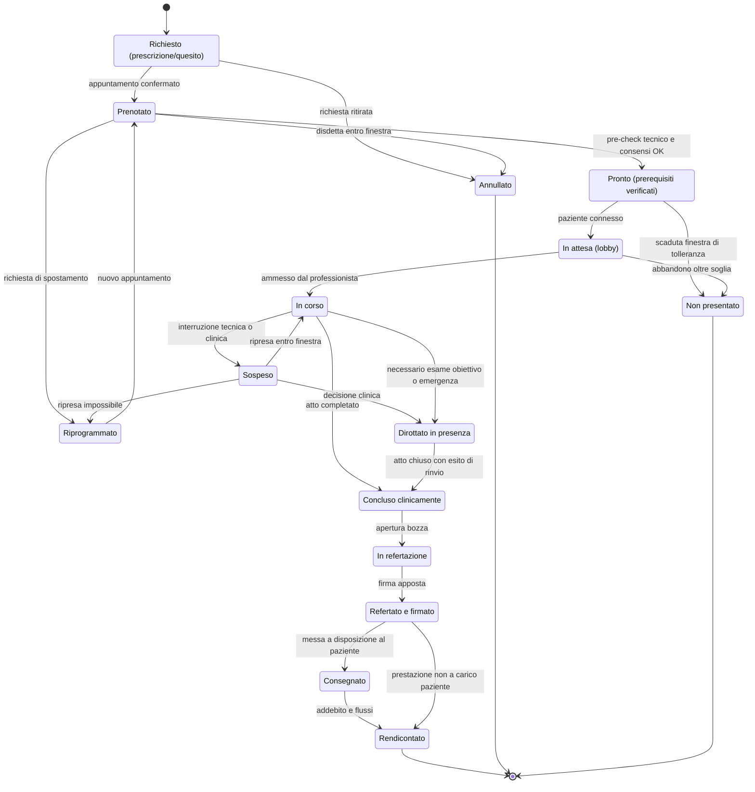
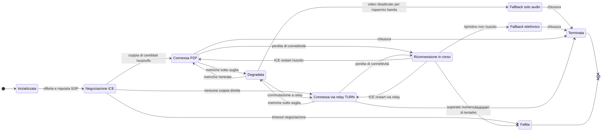
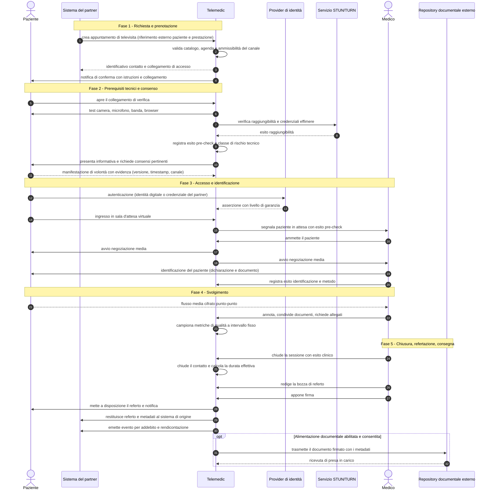
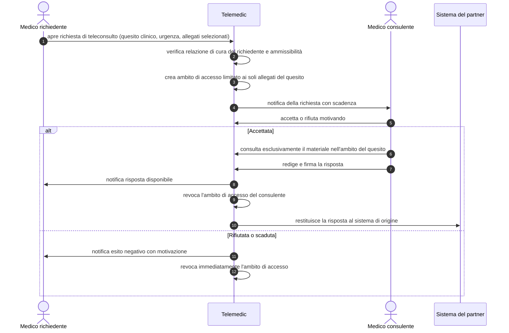
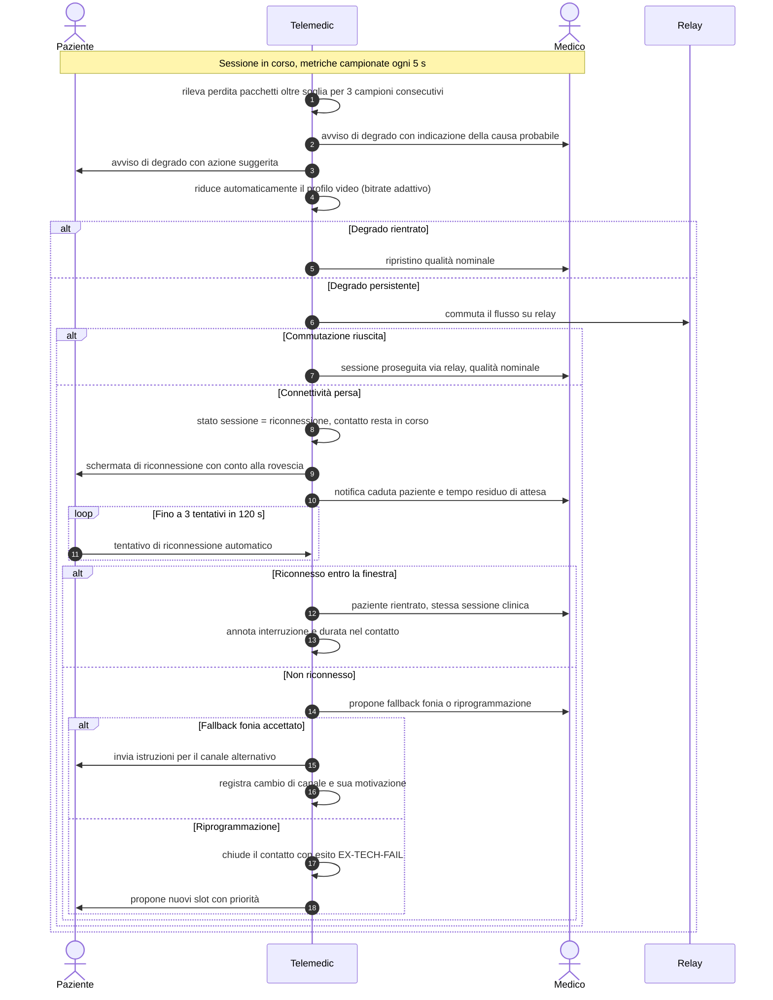
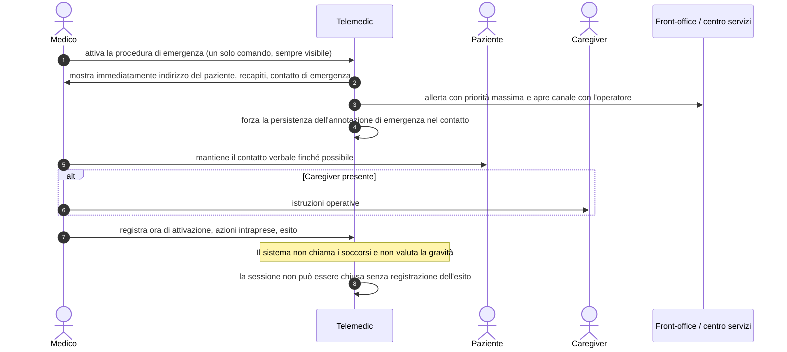
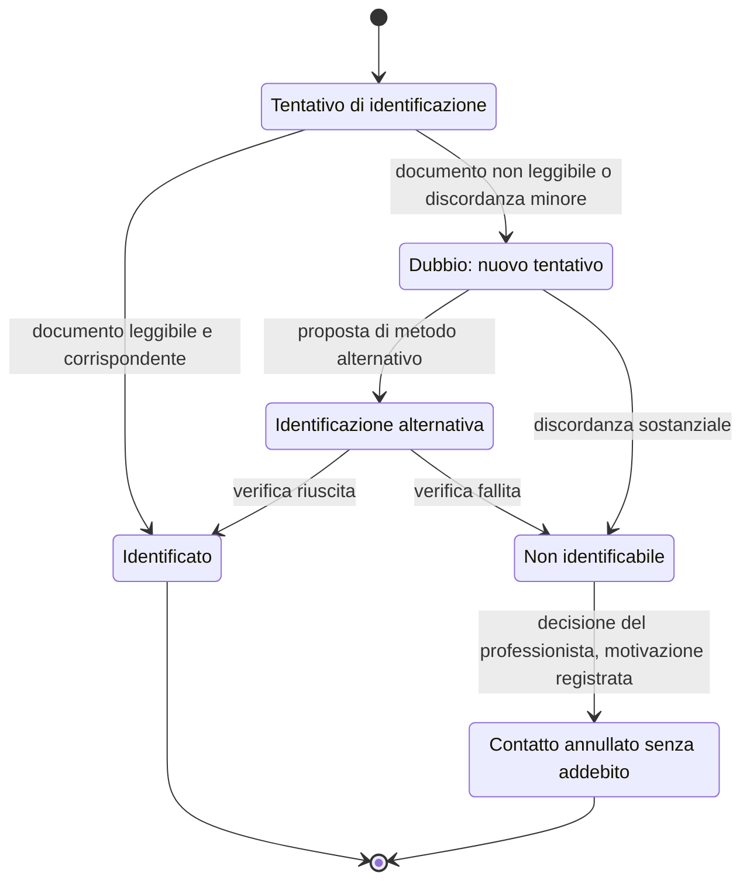
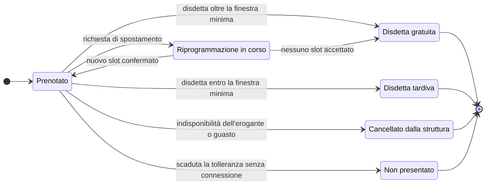

# R6 - Dominio funzionale e di business

> **Documento di ricerca.** Alimenta `docs/03_functional/`, `docs/05_domain/` e `docs/00_overview/glossario`.
> **Regola R0 rispettata**: nessun riferimento ad aziende, marchi, prodotti commerciali o domini.
> **Confini di competenza**: i fatti normativi italiani sono di competenza di **R3**, quelli su MDR/GDPR di **R2**.
> Dove un enunciato dipende da una verifica normativa è marcato `[da confermare con R3]` oppure `[da confermare con R2]`.

## 0. Nota metodologica e criteri di qualità

Questo documento modella il dominio, non lo riassume. Tre criteri governano ogni sua parte.

**Verificabilità.** Ogni requisito è formulato in modo che esista un test capace di farlo fallire. Formulazioni come «il sistema deve essere veloce», «l'interfaccia deve essere intuitiva», «il dato deve essere sicuro» sono state deliberatamente escluse: dove compare una qualità, compare la metrica, l'unità di misura, il percentile e la soglia.

**Identificatori stabili.** Gli identificatori `RF-nnn`, `RNF-nnn`, `BR-nnn`, `ATT-nn`, `PRM-…`, `BC-nn`, `KPI-nn` sono stabili e non verranno riassegnati. Le numerazioni hanno intervalli riservati per area, così che l'inserimento di nuovi elementi non costringa a rinumerare. Questi identificatori sono la chiave di join della matrice di tracciabilità requisito → progettazione → test richiesta da IEC 62304 §5.1.1 e §5.7 e dal fascicolo tecnico MDR.

**Separazione fra fatto, fonte e proposta.** Il documento distingue tre registri: *fatto accertato* (con fonte citata), *decisione del context pack* (D1-D11, V1-V6), *proposta di modellazione di R6* (esplicitamente marcata come proposta). Nessuna affermazione normativa è inventata.

**Vincolo trasversale di classificazione (V2).** Il modello di dominio qui proposto tiene deliberatamente il sistema fuori dal perimetro del «software che fornisce informazioni usate per assumere decisioni a fini diagnostici o terapeutici» (Regola 11 MDR, allegato VIII Reg. UE 2017/745): il sistema **trasporta, struttura, firma e conserva** contenuto clinico redatto da un professionista, e **non lo genera né lo interpreta**. Ogni requisito che rischi di spostare questo confine è marcato `⚠ V2` e va sottoposto a R2.

---

## 1. Ubiquitous language del dominio

Il glossario è la fondazione dell'ubiquitous language: nomi di aggregati, eventi, endpoint, colonne e messaggi UI devono derivare da qui e non da traduzioni improvvisate. Le colonne «Trappola semantica» sono la parte operativamente più importante: ogni riga descrive un errore di modellazione realmente possibile.

Legenda colonna FHIR: la corrispondenza indicata è quella **canonica in FHIR R4**; `-` significa che il concetto non ha risorsa dedicata e va rappresentato con estensione, `CodeableConcept` o combinazione.

### 1.1 Prestazioni e atti di telemedicina

| Termine (IT) | Inglese | FHIR R4 | Definizione operativa | Usato da | Trappola semantica |
|---|---|---|---|---|---|
| **Telemedicina** | Telemedicine | - | Modalità di erogazione di prestazioni sanitarie e sociosanitarie a distanza abilitata dalle tecnologie dell'informazione e della comunicazione. Non è una specialità, è un **canale di erogazione**. | tutti | Non è sinonimo di «videochiamata»: comprende atti asincroni (telerefertazione) e senza interazione umana in tempo reale (telemonitoraggio). |
| **Televisita** | Video visit / remote consultation | `Encounter` con `class = VR` (v3-ActCode «virtual») | Atto medico in cui il professionista interagisce a distanza **in tempo reale** con il paziente, eventualmente assistito da caregiver o altro professionista. Le indicazioni nazionali la circoscrivono al controllo di pazienti con diagnosi già formulata e ne escludono la sostituzione automatica della prima visita in presenza `[da confermare con R3]`. | medico, paziente | Non è «una visita fatta in video»: è una prestazione **distinta e tariffata separatamente**, con propri prerequisiti di eleggibilità. Confonderla con la visita in presenza porta a modellare un solo tipo di `Encounter` e a perdere la rendicontazione. |
| **Teleconsulto (medico)** | Physician-to-physician teleconsultation | `Encounter` + `ServiceRequest` verso il consulente | Atto medico in cui **due o più medici** interagiscono a distanza sulla situazione clinica di un paziente, condividendo dati, referti e immagini. Può essere sincrono o asincrono. | medici | Il paziente **non è necessariamente presente**: modellarlo come «televisita a tre» è un errore, perché cambia il soggetto della prestazione, la responsabilità e la tariffazione. |
| **Teleconsulenza medico-sanitaria** | Tele-advice / clinical guidance | `Encounter` + `ServiceRequest` | Attività di consulenza o supporto a distanza fra professionisti **con responsabilità differenti**, richiesta da chi ha in carico il paziente per guidare l'esecuzione di un'attività. | medico, infermiere, altre professioni sanitarie | Distinta dal teleconsulto: qui c'è un **rapporto asimmetrico** richiedente/consulente ed è ammessa fra professioni diverse, non solo fra medici. |
| **Teleassistenza** | Tele-care / tele-assistance | `Encounter` con performer non medico | Atto professionale, tipicamente di professioni sanitarie non mediche, basato sull'interazione a distanza fra professionista e paziente/caregiver, con possibile condivisione di dati e questionari. | infermiere, fisioterapista, psicologo | Non è «assistenza tecnica»: nella lingua del prodotto convive con il *supporto tecnico all'utente*. Va disambiguata nel codice (`TeleAssistanceEncounter` vs `TechnicalSupportTicket`). |
| **Telemonitoraggio** | Remote patient monitoring (RPM) | `Observation`, `Device`, `DeviceMetric`, `CarePlan` | Rilevamento e trasmissione a distanza, continua o periodica, di parametri vitali e clinici mediante sensori, con integrazione dei dati nel sistema informativo. | paziente, infermiere, medico | È il ramo del dominio a **più alto rischio di classificazione MDR** (`⚠ V2`): appena si introducono soglie e alert clinici si esce dal «veicolo di comunicazione». `[da confermare con R2]` |
| **Teleriabilitazione** | Telerehabilitation | `Encounter` + `CarePlan` + `Procedure` | Erogazione a distanza di interventi riabilitativi, individuali o di gruppo, con misurazione dell'aderenza al programma. | fisioterapista, logopedista, paziente | Ha durata **pluri-sessione**: modellarla come singolo `Encounter` perde il ciclo. Richiede `EpisodeOfCare` o `CarePlan` come contenitore. |
| **Telerefertazione** | Tele-reporting | `DiagnosticReport` (+ `ImagingStudy` in ambito radiologico) | Relazione **asincrona** redatta e trasmessa mediante sistemi digitali, validata con firma digitale del medico responsabile, su un esame già acquisito. Il contenuto è quello tipico della refertazione in presenza. | medico refertante | Non implica alcuna interazione col paziente: non genera una televisita. Confonderla con «invio del referto via e-mail» è un errore grave (la telerefertazione è l'**atto**, non il trasporto). |
| **Telesalute** | Telehealth | - | Insieme più ampio che comprende, oltre agli atti clinici, promozione della salute, educazione terapeutica e servizi non clinici. | policy, direzione sanitaria | Iperonimo di «telemedicina»: usarli come sinonimi produce un dominio senza confini. |
| **Secondo parere** | Second opinion | `ServiceRequest` + `DiagnosticReport` | Valutazione indipendente richiesta a un professionista diverso da quello che ha in carico il paziente, di norma asincrona su documentazione. | paziente, medico | Non è un teleconsulto: **il richiedente può essere il paziente stesso** e il consulente non entra nella presa in carico. |
| **Teletriage** | Tele-triage | `Encounter` + `Observation` (codice di priorità) | Valutazione a distanza dell'urgenza e dell'appropriatezza del canale di erogazione, con esito di instradamento. | infermiere, operatore di centrale | Se il sistema *calcola* la priorità anziché registrarla, entra nel perimetro `⚠ V2`. Telemedic deve registrare l'esito deciso dal professionista. |
| **Telecooperazione sanitaria** | Health tele-cooperation | `Encounter` + `Communication` | Assistenza fornita da un medico a distanza a un altro operatore impegnato **in un atto in corso**, tipicamente in emergenza-urgenza. | emergenza territoriale | La sincronia è vincolante e la latenza tollerabile è molto più bassa che in televisita: non riusare gli stessi SLO. |

### 1.2 Percorso clinico e unità di erogazione

| Termine (IT) | Inglese | FHIR R4 | Definizione operativa | Usato da | Trappola semantica |
|---|---|---|---|---|---|
| **Assistito** | Beneficiary / enrollee | `Patient` + `Coverage` | Persona titolare del diritto all'assistenza presso un servizio sanitario o un ente assicurativo. | amministrazione, front-office | «Assistito» è una qualifica **amministrativa**, «paziente» una qualifica **clinica**: la stessa persona può essere assistito senza essere paziente (nessun episodio aperto). |
| **Paziente** | Patient | `Patient` | Persona destinataria dell'atto sanitario. | tutti | Nel modello multi-tenant il paziente **non è globale**: la stessa persona fisica è entità distinta per tenant, riconciliata solo tramite identificatori esterni. |
| **Presa in carico** | Enrolment into care | `EpisodeOfCare.status = active` | Assunzione formale di responsabilità clinica continuativa da parte di una struttura o di un professionista su un problema di salute. | medico, direzione sanitaria | Non coincide con «avere un appuntamento». È il presupposto tipico dell'ammissibilità della televisita `[da confermare con R3]` ed è il perno di molte regole di autorizzazione. |
| **Episodio di cura** | Episode of care | `EpisodeOfCare` | Contenitore temporale che raggruppa i contatti relativi a uno stesso problema di salute presso una struttura. | medico, sistemi | Non è la cartella clinica e non è il percorso: la cartella è il repository, il PDTA è il protocollo. |
| **Contatto** | Encounter | `Encounter` | Singola interazione fra paziente e sistema di erogazione, in un luogo (anche virtuale), con un inizio e una fine. | tutti | «Contatto» in italiano corrente significa anche «recapito» (telefono, e-mail). Nel codice usare `Encounter`, mai `Contact`, per evitare la collisione con `Patient.contact`. |
| **Prestazione** | Service / procedure | `ServiceRequest` (richiesta), `Procedure` (eseguita), `ChargeItem` (addebito) | Unità elementare erogabile e rendicontabile, identificata da un codice del nomenclatore. | amministrazione, medico | Tre concetti diversi con lo stesso nome italiano: *richiesta*, *esecuzione*, *addebito*. Un unico oggetto «Prestazione» è l'errore di modellazione più frequente in questo dominio. |
| **Erogazione** | Delivery of care | `Procedure` / `Encounter.status = finished` | Atto materiale di fornitura della prestazione. | struttura | «Erogata» non implica «refertata» né «fatturata»: sono tre stati distinti e devono restare disaccoppiati. |
| **PDTA** | Care pathway | `PlanDefinition` + `CarePlan` | Percorso diagnostico-terapeutico assistenziale: sequenza attesa di atti per una condizione. | direzione sanitaria | `PlanDefinition` è il **modello**, `CarePlan` l'**istanza sul paziente**. Fonderli rende impossibile versionare il protocollo. |
| **Eleggibilità** | Eligibility | `Observation` / decisione registrata | Verifica che il singolo paziente possa ricevere quella prestazione **in quel canale**: valutazione clinica, tecnologica, di autonomia e culturale. | medico, front-office | Non è la verifica del diritto all'esenzione: quella è *entitlement* amministrativo. Due valutazioni distinte con lo stesso nome colloquiale. |
| **Arruolamento** | Enrolment | `EpisodeOfCare` / `CarePlan` | Inserimento formale del paziente in un servizio di telemedicina strutturato (tipico del telemonitoraggio). | infermiere, medico | Precede l'agenda: un paziente arruolato non ha necessariamente appuntamenti. |
| **Anamnesi** | History taking | `Condition`, `FamilyMemberHistory`, `Observation` | Raccolta strutturata della storia clinica del paziente. | medico | L'anamnesi *raccolta durante la sessione* è contenuto clinico redatto dal medico; un questionario **auto-compilato** dal paziente è `QuestionnaireResponse` e non ha valore di anamnesi finché il medico non lo valida. |
| **Diario clinico** | Progress notes | `Composition` / `DocumentReference` | Annotazioni cronologiche del decorso, non necessariamente destinate al paziente. | medico, infermiere | Non è il referto: ha destinatario, formato, firma e regime di accesso diversi. Non va consegnato automaticamente al paziente. |
| **Referto** | Diagnostic report | `DiagnosticReport` | Documento sanitario **firmato**, con esito e conclusioni di un atto sanitario, destinato al paziente e al richiedente. | medico refertante, paziente | Un referto **bozza non firmata non è un referto**: è un documento di lavoro. Modellare uno stato `draft` distinto è obbligatorio (BR-041). |
| **Relazione clinica** | Clinical letter | `Composition` | Comunicazione discorsiva fra professionisti su un caso (es. dal consulente al curante). | medici | Non è un referto: non certifica un esame, non è necessariamente destinata al paziente. |
| **Prescrizione** | Prescription / order | `MedicationRequest` (farmaco), `ServiceRequest` (prestazione) | Atto con cui il medico dispone un trattamento o un accertamento. | medico prescrittore | «Prescrizione» copre farmaci e prestazioni: in FHIR sono risorse diverse. Un solo tipo interno produce campi nulli e regole condizionali fragili. |
| **Impegnativa** | Referral (public scheme) | `ServiceRequest` | Prescrizione su ricettario del servizio sanitario che dà titolo alla prestazione a carico pubblico. | MMG/PLS, front-office | Colloquialmente «ricetta rossa»: è **prescrizione + titolo di accesso**, non solo prescrizione. Senza di essa cambia il regime tariffario. |
| **Ricetta dematerializzata** | Dematerialised e-prescription | `MedicationRequest` con identificativo nazionale | Prescrizione in formato elettronico identificata da un numero univoco, sostitutiva del supporto cartaceo. `[da confermare con R3]` | MMG/PLS, farmacia | Il numero univoco è un **identificativo di ricetta**, non l'identificativo del paziente né dell'ordine interno. Va conservato come `identifier` con `system` dedicato. |
| **Piano terapeutico** | Therapeutic plan | `CarePlan` | Documento specialistico che abilita la prescrivibilità continuativa di determinati farmaci. | specialista | Non è una prescrizione: **abilita** prescrizioni successive fatte da altri. |
| **Esenzione** | Exemption from co-payment | `Coverage` + `CodeableConcept` | Diritto a non corrispondere in tutto o in parte la compartecipazione alla spesa, per patologia, reddito, età o condizione. | front-office, amministrazione | Un'esenzione **per patologia rivela la patologia**: è dato particolare (art. 9 GDPR) e va trattato come tale, non come flag amministrativo. |
| **Ticket** | Co-payment | `ChargeItem`, `Invoice` | Quota di compartecipazione alla spesa a carico dell'assistito. | front-office | Colloquiale «ticket» significa anche *segnalazione di assistenza*: disambiguare nel codice (`CoPayment` vs `SupportTicket`). |
| **Nomenclatore tariffario** | Fee schedule | `ChargeItemDefinition` | Catalogo codificato delle prestazioni con relativa tariffa. | amministrazione | È **versionato nel tempo e variabile per regime**: una tabella senza validità temporale rende irriproducibile la rendicontazione storica. |
| **Codice di priorità** | Priority code | `ServiceRequest.priority` | Classe di urgenza assegnata alla prestazione richiesta, che determina il tempo massimo di attesa. | medico prescrittore, CUP | Non è la gravità clinica del paziente: è la **tempistica massima di erogazione** della prestazione richiesta. |
| **Regime di erogazione** | Care setting | `Encounter.class` | Ambulatoriale, domiciliare, ricovero, virtuale. | amministrazione | «Virtuale» non è un quarto regime accanto agli altri: è un **modificatore del canale** che si combina con il setting clinico. Modellare `class = VR` più un'estensione di setting evita di perdere l'informazione. |

### 1.3 Agenda, prenotazione e accesso

| Termine (IT) | Inglese | FHIR R4 | Definizione operativa | Usato da | Trappola semantica |
|---|---|---|---|---|---|
| **Agenda** | Schedule | `Schedule` | Contenitore di disponibilità di un attore erogante (professionista, ambulatorio, apparecchiatura) per un dato tipo di prestazione. | front-office, medico | L'agenda **appartiene alla risorsa erogante, non al medico come persona**: lo stesso medico ha agende diverse per struttura e branca (`PractitionerRole`). |
| **Slot** | Slot | `Slot` | Intervallo temporale elementare di un'agenda, con stato (libero, occupato, sospeso). | front-office | Uno slot occupato **non è** un appuntamento: è la sua proiezione sull'agenda. Fonderli rende impossibile l'overbooking e la doppia prenotazione controllata. |
| **Disponibilità** | Availability | `Schedule.planningHorizon`, `Slot.status` | Insieme di slot pubblicati e prenotabili in un orizzonte temporale. | front-office, integratore | «Disponibile» ha tre significati distinti: *pubblicato*, *prenotabile dal canale X*, *non ancora occupato*. Servono tre attributi. |
| **Prenotazione / Appuntamento** | Appointment | `Appointment` | Impegno reciproco fra paziente e struttura per una prestazione in un momento definito. | tutti | Nel modello di integrazione (context pack §6.2.4) l'appuntamento **nasce nel sistema del partner**: Telemedic lo riceve per riferimento e non ne è il master. |
| **Centro unico di prenotazione** | Central booking service | - | Servizio che centralizza le prenotazioni per più eroganti. | pubblico | È un *canale*, non un'agenda: la stessa agenda può essere alimentata da più canali con regole diverse. |
| **Lista d'attesa** | Waiting list | `Appointment.status = waitlist` | Coda ordinata di richieste in attesa di uno slot compatibile. | front-office | Non è la coda della sala d'attesa virtuale del giorno. Due concetti a scala temporale diversa (settimane vs minuti). |
| **Overbooking** | Overbooking | `Slot` con capienza > 1 | Assegnazione controllata di più appuntamenti allo stesso slot, in base alla probabilità di mancata presentazione. | direzione | Va autorizzato per configurazione: se emerge come effetto collaterale di una race condition è un difetto, non una funzione (BR-023). |
| **Mancata presentazione (no-show)** | No-show | `Appointment.status = noshow` | Assenza del paziente all'appuntamento senza disdetta entro la finestra prevista. | front-office | In telemedicina il no-show è **ambiguo**: il paziente può aver tentato senza riuscire tecnicamente. Registrare l'esito come no-show senza evidenza telemetrica di mancato tentativo è scorretto (BR-024). |
| **Riprogrammazione** | Rescheduling | nuovo `Appointment` + `replaces` | Spostamento di un appuntamento a un'altra data mantenendo la continuità della richiesta. | front-office, paziente | Non è «cancella e riprenota»: la catena di sostituzione va conservata per la tracciabilità dei tempi di attesa. |
| **Promemoria** | Reminder | `CommunicationRequest` | Comunicazione automatica che precede l'appuntamento. | sistema, paziente | Il promemoria **non può contenere dato clinico** (BR-052): il contenuto va limitato a data, ora, struttura e link. |
| **Sala d'attesa virtuale (lobby)** | Virtual waiting room | `Encounter.status = arrived` | Stato in cui il paziente è connesso, verificato tecnicamente e in attesa di essere ammesso dal professionista. | paziente, medico, front-office | Non è una «stanza» tecnica: è uno **stato del contatto** più una coda. Modellarla come room WebRTC dedicata moltiplica inutilmente le sessioni media. |
| **Accettazione / check-in** | Check-in | `Encounter.status = arrived` | Registrazione formale dell'arrivo del paziente e verifica dei prerequisiti amministrativi. | front-office | In telemedicina check-in tecnico (dispositivo pronto) e check-in amministrativo (documenti, consensi, pagamento) sono **due gate distinti** e possono fallire indipendentemente. |
| **Sessione** | Session | `Encounter` + risorse media | Istanza di collegamento in tempo reale fra i partecipanti a un contatto. | tutti | Un contatto può avere **più sessioni** (caduta e riconnessione). Se `Encounter` e sessione sono la stessa entità, ogni disconnessione crea un contatto fantasma (BR-030). |
| **Partecipante** | Participant | `Encounter.participant` | Soggetto ammesso alla sessione con un ruolo (erogante, paziente, caregiver, interprete, osservatore, discente). | tutti | Il ruolo del partecipante determina i permessi in sessione: un caregiver non è un professionista, un discente non deve poter vedere il referto. |

### 1.4 Consenso, privacy e trattamento

| Termine (IT) | Inglese | FHIR R4 | Definizione operativa | Usato da | Trappola semantica |
|---|---|---|---|---|---|
| **Consenso informato all'atto sanitario** | Informed consent to treatment | `Consent` con `scope = treatment` | Manifestazione di volontà del paziente, preceduta da informazione adeguata, riguardo all'esecuzione di un atto sanitario. | medico, paziente | **Non è** il consenso al trattamento dei dati: base giuridica, revocabilità, effetti e conservazione sono diversi. Unificarli in un solo flag è l'errore più costoso del dominio (BR-060). `[da confermare con R2]` |
| **Consenso al trattamento dei dati** | Data processing consent | `Consent` con `scope = patient-privacy` | Manifestazione di volontà relativa al trattamento dei dati personali, ove il consenso sia la base giuridica applicabile. | DPO, sistema | Per la cura la base giuridica tipica **non è il consenso** ma l'art. 9.2.h GDPR: chiedere consenso dove non serve genera una revocabilità che blocca la cura. `[da confermare con R2]` |
| **Consenso alla registrazione** | Consent to record | `Consent` con `provision.action = record` | Consenso specifico, separato e revocabile alla registrazione audio/video della sessione. | paziente, medico | Deve essere **granulare per sessione** e non ereditabile da un consenso generale: un consenso «una tantum alla piattaforma» non copre la registrazione della singola seduta (BR-070). |
| **Consenso alla consultazione** | Consent to access | `Consent` con `provision.type = permit` | Autorizzazione all'accesso ai documenti già presenti nel fascicolo o dossier da parte di professionisti diversi dall'autore. | paziente, medico | Distinto dal consenso all'alimentazione: si può alimentare senza poter consultare il pregresso. `[da confermare con R3]` |
| **Oscuramento** | Data suppression / masking | `Consent.provision` di tipo `deny` su risorsa | Diritto del paziente a rendere invisibili determinati documenti a determinati soggetti. | paziente | L'oscuramento deve essere **anche dell'oscuramento**: l'esistenza del documento oscurato non deve essere inferibile da buchi nella numerazione o da conteggi (BR-064). |
| **Informativa** | Privacy notice | `Consent.sourceReference` | Documento informativo che precede e fonda il consenso. | DPO | Il consenso è valido solo rispetto alla **versione dell'informativa vigente al momento**: senza versionamento dell'informativa il consenso è indimostrabile (BR-061). |
| **Base giuridica** | Legal basis | - | Fondamento di liceità del trattamento. | DPO | Non è un attributo del paziente né del documento: è un attributo del **trattamento** (finalità + categoria di dato + soggetto). |
| **Titolare del trattamento** | Data controller | `Organization` | Soggetto che determina finalità e mezzi del trattamento. | DPO, legale | In un SaaS multi-tenant ogni tenant è tipicamente titolare autonomo e il gestore della piattaforma è responsabile: il modello dati deve poter rappresentare **titolari diversi sulla stessa installazione** (V4). `[da confermare con R2]` |
| **Responsabile del trattamento** | Data processor | `Organization` | Soggetto che tratta per conto del titolare. | DPO | Il fornitore TURN, l'SMS gateway e il servizio di conservazione sono **sub-responsabili**: vanno censiti nel registro e nella catena contrattuale. |
| **Responsabile della protezione dei dati (RPD/DPO)** | Data protection officer | `PractitionerRole` / `Organization.contact` | Figura di sorveglianza e punto di contatto. | tutti | Il DPO **non è un amministratore di sistema**: deve poter leggere audit e registri senza poter accedere al contenuto clinico (PRM-AUD-*). |
| **Valutazione d'impatto (DPIA)** | Data protection impact assessment | - | Analisi preventiva dei rischi del trattamento. | DPO | È un artefatto di progetto, non un documento di runtime: ma alcune sue misure diventano requisiti (RNF) e vanno tracciate. `[da confermare con R2]` |
| **Minimizzazione** | Data minimisation | - | Principio per cui si trattano solo i dati necessari alla finalità. | progettisti | In telemetria è vincolante: le metriche di qualità devono essere **utili senza essere identificanti** (§9.3). |
| **Dato particolare** | Special category data | - | Dato relativo alla salute, alla vita sessuale, all'origine, alle convinzioni. | tutti | Anche **il fatto stesso** di avere un appuntamento con una certa branca specialistica è dato sulla salute: gli oggetti «amministrativi» non sono neutri. |
| **Dato a maggior tutela dell'anonimato** | Highly sensitive health data | `Consent` + label di sensibilità | Categoria di informazioni cliniche a cui l'ordinamento riserva protezioni rafforzate. `[da confermare con R3]` | DPO, medico | Non basta cifrare: serve un **livello di riservatezza per documento** che governi visibilità e notifiche (BR-065). |

### 1.5 Soggetti, professioni e organizzazioni

| Termine (IT) | Inglese | FHIR R4 | Definizione operativa | Usato da | Trappola semantica |
|---|---|---|---|---|---|
| **Caregiver** | Caregiver | `RelatedPerson` | Persona che assiste stabilmente il paziente, senza necessariamente averne la rappresentanza legale. | paziente, medico | Assistere **non è** rappresentare: un caregiver può essere presente in sessione ma non può prestare consenso al posto del paziente capace (BR-062). |
| **Esercente la responsabilità genitoriale** | Person with parental responsibility | `RelatedPerson` con ruolo `PRN`/`GUARD` | Soggetto legittimato a decidere per il minore. | front-office, medico | Non coincide sempre con «genitore convivente»: e in caso di affido condiviso possono servire **due** manifestazioni di volontà (BR-063). `[da confermare con R3]` |
| **Tutore** | Legal guardian | `RelatedPerson` | Rappresentante legale del soggetto incapace, con poteri sostitutivi. | legale, medico | Sostituisce la volontà del rappresentato. |
| **Amministratore di sostegno** | Support administrator | `RelatedPerson` | Figura di protezione con poteri **delimitati dal decreto di nomina**, che può o meno includere le decisioni sanitarie. | legale, medico | Errore frequente: trattarlo come un tutore. I poteri vanno registrati come **ambito** e verificati per atto (BR-063). `[da confermare con R3]` |
| **Delegato** | Delegate | `RelatedPerson` + `Consent` | Soggetto autorizzato dal paziente capace ad accedere ai suoi documenti o a operare per suo conto. | paziente | La delega è **revocabile e a scadenza**: senza scadenza diventa un accesso permanente non presidiato. |
| **Medico di medicina generale (MMG)** | General practitioner | `PractitionerRole` con specialty GP | Medico convenzionato titolare del rapporto di fiducia con l'assistito adulto. | tutti | È il **destinatario naturale** della comunicazione clinica anche quando non è l'erogante: va modellato come destinatario, non solo come utente. |
| **Pediatra di libera scelta (PLS)** | Family paediatrician | `PractitionerRole` con specialty PED | Equivalente del MMG per la fascia pediatrica. | tutti | La transizione PLS → MMG a una certa età è un evento anagrafico che invalida i riferimenti: non cablarlo. |
| **Medico specialista** | Specialist physician | `PractitionerRole` | Medico che eroga prestazioni della propria branca. | tutti | Uno stesso `Practitioner` ha **N `PractitionerRole`** (branca × struttura × regime). Modellare la specialità sull'utente è l'errore che rompe il multi-tenant. |
| **Medico prescrittore** | Prescriber | `ServiceRequest.requester` | Chi ha disposto la prestazione. | amministrazione | Ruolo **relativo a un atto**, non qualifica permanente. |
| **Medico refertante** | Reporting physician | `DiagnosticReport.performer` | Chi redige e firma il referto e ne assume la responsabilità. | medico | Può differire dall'erogante della sessione (es. teleconsulto con refertazione del consulente): il modello deve ammettere la differenza. |
| **Professione sanitaria** | Regulated health profession | `PractitionerRole.code` | Professione iscritta a ordine o albo, abilitata a specifici atti. | HR, compliance | L'abilitazione all'atto dipende dalla professione e non è configurabile liberamente dal tenant: alcune combinazioni ruolo×prestazione vanno **vietate a livello di dominio** (BR-011). |
| **Infermiere** | Nurse | `PractitionerRole` | Professionista responsabile dell'assistenza infermieristica. | tutti | Può erogare teleassistenza, non televisita (BR-011) `[da confermare con R3]`. |
| **Psicologo / psicoterapeuta** | Psychologist / psychotherapist | `PractitionerRole` | Professionista dell'area psicologica. | tutti | La seduta psicoterapeutica ha requisiti di **riservatezza e non registrabilità** più stringenti (BR-071) e un modello di continuità (setting stabile) diverso dalla visita specialistica. |
| **Fisioterapista** | Physiotherapist | `PractitionerRole` | Professionista della riabilitazione. | tutti | Le sessioni sono **seriali**: il dominio deve supportare cicli e aderenza. |
| **Operatore di front-office** | Front-office operator | `PractitionerRole` non clinico | Personale amministrativo che gestisce agende, accoglienza, documenti e pagamenti. | struttura | Accede a dati amministrativi e **non deve accedere al contenuto clinico** (PRM). È l'attore più esposto agli errori di autorizzazione. |
| **Amministratore di struttura** | Tenant administrator | - | Configura la propria organizzazione: utenti, agende, cataloghi, branding. | tenant | Non deve poter leggere i dati clinici del proprio tenant per il solo fatto di amministrarlo (BR-013). |
| **Amministratore di sistema** | System administrator | - | Gestisce l'installazione. | gestore piattaforma | Va progettato come ruolo **senza accesso in chiaro al contenuto clinico**, con azioni sempre tracciate e, per operazioni critiche, doppio controllo. |
| **Struttura erogante / Centro erogatore** | Delivering organisation | `Organization` | Soggetto giuridico responsabile dell'erogazione della prestazione. | tutti | Non coincide col tenant tecnico: un tenant può contenere più strutture eroganti. |
| **Centro servizi** | Service centre | `Organization` con ruolo tecnico | Struttura che assicura gestione tecnica, manutenzione e help desk della piattaforma di telemedicina. | gestore | Ruolo **tecnico**, non clinico: la separazione centro servizi / centro erogatore è esplicita nelle linee guida nazionali `[da confermare con R3]` e va riflessa nei permessi. |
| **Punto di erogazione** | Point of delivery | `Location` | Luogo fisico o virtuale in cui si eroga. | amministrazione | In telemedicina il `Location` va comunque valorizzato (`Location.mode = kind`, virtuale) perché la rendicontazione lo richiede. |
| **Branca specialistica** | Clinical specialty | `PractitionerRole.specialty`, `HealthcareService` | Area disciplinare della prestazione. | tutti | È attributo del **servizio offerto**, non del professionista in assoluto. |
| **Tenant** | Tenant | - | Confine di isolamento logico dei dati e della configurazione (V4). | piattaforma | Tenant ≠ organizzazione ≠ struttura erogante ≠ integratore: quattro concetti che spesso coincidono nei casi semplici e divergono in quelli reali. |
| **Integratore** | Integrator | `Organization` + credenziali applicative | Soggetto terzo che incorpora Telemedic nel proprio sistema. | piattaforma | Non è un utente: è un **principal applicativo** con proprie chiavi, webhook, rate limit e branding (context pack §6.2.6). |

### 1.6 Documentazione, identità e interoperabilità

| Termine (IT) | Inglese | FHIR R4 | Definizione operativa | Usato da | Trappola semantica |
|---|---|---|---|---|---|
| **Identificazione del paziente** | Patient identification | `Encounter` + `Provenance` dell'atto di identificazione | Accertamento, prima dell'atto, che la persona collegata sia effettivamente il paziente atteso. | medico, front-office | Autenticazione ≠ identificazione: l'accesso con credenziali certifica **chi ha il credenziale**, non chi sta davanti alla telecamera. Il modello deve registrare entrambi (BR-031). |
| **Riconoscimento a vista** | Visual identification | `Provenance` con metodo | Modalità di identificazione basata sul confronto visivo con documento. | medico | È una **decisione del professionista** da registrare, non un controllo automatico. Introdurre riconoscimento biometrico automatico cambia il profilo di rischio privacy e va valutato a parte. `[da confermare con R2]` |
| **Firma elettronica qualificata (FEQ)** | Qualified electronic signature | `Provenance.signature` / `Bundle.signature` | Firma con valore probatorio equivalente all'autografa, basata su certificato qualificato. | medico refertante | Non tutte le firme sono equivalenti: FEQ, FEA e firma «con OTP» hanno effetti diversi. Il referto sanitario richiede il livello previsto dall'ordinamento `[da confermare con R3]`. |
| **Firma grafometrica** | Handwritten biometric signature | - | Firma autografa acquisita con rilevazione di parametri biometrici. | front-office | È dato biometrico: richiede tutele proprie e non è utilizzabile a distanza. `[da confermare con R2]` |
| **Marca temporale** | Trusted timestamp | `Signature.when` + token TSA | Attestazione opponibile della data di formazione del documento. | conservazione | La data di sistema **non è** una marca temporale. |
| **Conservazione a norma** | Compliant digital preservation | - | Processo che garantisce integrità, leggibilità e reperibilità nel tempo dei documenti informatici. `[da confermare con R3]` | conservazione | Backup ≠ conservazione: il backup protegge dalla perdita, la conservazione dalla contestazione. |
| **Fascicolo sanitario elettronico (FSE)** | National EHR | `DocumentReference` + `Bundle` (CDA/FHIR) | Insieme dei dati e documenti digitali sanitari relativi all'assistito, alimentato dalle strutture. `[da confermare con R3]` | tutti | Non è la cartella clinica della struttura: è **nazionale/regionale**, sotto il controllo dell'assistito, con proprie regole di alimentazione e oscuramento. |
| **Dossier sanitario** | Organisational health record | - | Insieme dei dati del paziente presso **una singola struttura**. | struttura | Confonderlo con l'FSE porta a regole di accesso sbagliate: il dossier ha ambito organizzativo, l'FSE ambito sistemico. |
| **Cartella clinica elettronica** | Electronic health record (local) | - | Repository clinico del singolo erogante. | medico | Nel modello di integrazione la cartella **resta al partner** (context pack §6.2.5): Telemedic non deve diventarne il master. |
| **Documento strutturato (CDA)** | Clinical Document Architecture | `Composition` + `Bundle` document | Documento clinico con struttura semantica standard. | interoperabilità | «PDF firmato» non è documento strutturato: la coesistenza dei due formati va progettata (payload PDF + metadati). |
| **Identificativo esterno** | External identifier | `Patient.identifier` con `system` proprietario | Chiave con cui il sistema del partner identifica il soggetto. | integrazione | È la **chiave di lavoro** del modello «per riferimento» (context pack §6.2.3). Un identificativo senza `system` è ambiguo e produce collisioni fra tenant. |
| **Codice fiscale** | National tax/health code | `Patient.identifier` con system nazionale | Identificativo della persona fisica ampiamente usato in sanità. | tutti | Non è universale (STP/ENI, neonati, stranieri) e **non è un segreto**: non usarlo come fattore di autenticazione. |
| **Master patient index** | MPI | - | Servizio di riconciliazione delle identità fra sistemi. | integrazione | Telemedic non deve implementarne uno proprio (§6.2.3): deve **consumare** l'identità del partner. |
| **Fallback telefonico** | Telephone fallback | `Encounter` con `Communication` di tipo voce | Prosecuzione del contatto in fonia quando il canale video fallisce. | medico, paziente | Non è la stessa prestazione: la degradazione del canale può cambiare l'ammissibilità e la refertabilità dell'atto (BR-034). `[da confermare con R3]` |
| **Escalation in presenza** | Escalation to in-person care | `ServiceRequest` di follow-up | Decisione clinica di interrompere il canale remoto e convocare il paziente. | medico | È un **esito clinico legittimo**, non un fallimento del sistema: va misurato come KPI, non nascosto. |
| **Interprete** | Interpreter | `Encounter.participant` con ruolo `translator` | Terzo ammesso alla sessione per mediazione linguistica. | front-office | È un terzo che accede a dati sanitari: serve base giuridica, vincolo di riservatezza e tracciamento della presenza (BR-066). |
| **Qualità dell'esperienza (QoE)** | Quality of experience | - | Percezione dell'utente della qualità della sessione. | prodotto | Diversa dalla QoS misurata (RTT, jitter, loss): una sessione tecnicamente buona può essere clinicamente inutilizzabile e viceversa. Servono entrambe (KPI-05). |
| **Soglia clinicamente accettabile** | Clinically acceptable threshold | - | Livello minimo di qualità del canale sotto il quale l'atto non può essere svolto in sicurezza. | medico | Non è una soglia tecnica generica: **dipende dalla prestazione** (una valutazione dermatologica richiede risoluzione diversa da un colloquio psicologico) (BR-033). |
| **Registrazione** | Recording | `DocumentReference` / `Media` con contenuto cifrato | Cattura persistente dell'audio/video della sessione. | paziente, medico | Registrare è **eccezione, non regola**: è un trattamento ulteriore, con consenso proprio, retention propria e regole di accesso proprie (BR-070…074). |

---

## 2. Attori, ruoli e modello di autorizzazione

### 2.1 Catalogo degli attori

Per ogni attore: obiettivo primario, attività, dati necessari, e il **vincolo di autorizzazione che ne discende**. La colonna «vincolo» è la sorgente dei permessi della §2.3: nessun permesso esiste se non lo richiede un'attività qui elencata (principio di necessità).

| ID | Attore | Obiettivo primario | Attività principali | Dati necessari | Vincolo di autorizzazione derivato |
|---|---|---|---|---|---|
| **ATT-01** | Paziente / assistito | Ricevere la prestazione senza barriere tecniche | verifica prerequisiti, consensi, ingresso in lobby, sessione, lettura referto, disdetta | i **propri** dati, i propri documenti, lo stato dei propri appuntamenti | Accesso limitato al proprio `Patient` e alle risorse che lo referenziano; nessuna capacità di ricerca su altri soggetti; nessun accesso al diario clinico interno |
| **ATT-02** | Caregiver | Assistere il paziente nell'accesso e nella comprensione | assistenza tecnica al paziente, presenza in sessione, ricezione istruzioni | sottoinsieme dei dati del paziente **esplicitamente delegato** | Accesso derivato e **a scadenza**, revocabile dal paziente, con ambito esplicito; mai consenso in sostituzione di paziente capace |
| **ATT-03** | Rappresentante legale (tutore, amministratore di sostegno, esercente responsabilità genitoriale) | Decidere per il rappresentato nei limiti del titolo | consenso, prenotazione, accesso ai documenti | dati del rappresentato **nei limiti dei poteri** | Ambito dei poteri modellato come attributo verificato per atto; per il minore prossimo alla maggiore età il diritto di accesso del rappresentante va sospeso alla scadenza `[da confermare con R3]` |
| **ATT-04** | Medico specialista (erogante) | Erogare l'atto e refertare in sicurezza | apertura sessione, identificazione, anamnesi, refertazione, firma, escalation | dati clinici del paziente **in relazione di cura**, documenti condivisi, storico dei propri contatti | Accesso subordinato all'esistenza di una **relazione di cura** attiva o recente; accesso fuori relazione solo tramite break-glass tracciato |
| **ATT-05** | Medico di medicina generale / pediatra di libera scelta | Mantenere la regia del percorso dell'assistito | richiesta di teleconsulto, ricezione referti, prescrizione | dati dei propri assistiti | Relazione di cura **continuativa** (non per singolo contatto): l'attributo di autorizzazione è la titolarità della scelta, non l'appuntamento |
| **ATT-06** | Medico consulente (teleconsulto) | Fornire valutazione specialistica su richiesta | lettura del quesito e dei documenti allegati, risposta, eventuale refertazione | **solo** il materiale trasmesso col quesito, non l'intero storico | Accesso **puntuale e limitato all'atto** (scope della `ServiceRequest`), a scadenza dopo la risposta |
| **ATT-07** | Infermiere | Erogare teleassistenza, preparare la sessione, gestire il telemonitoraggio | pre-check, raccolta parametri, educazione terapeutica, teleassistenza | dati clinici pertinenti al piano assistenziale | Nessun accesso a refertazione medica in scrittura; abilitazione alla firma limitata ai propri atti professionali |
| **ATT-08** | Psicologo / psicoterapeuta | Condurre colloqui con setting protetto | sessione, note, refertazione | dati del proprio paziente, con riservatezza rafforzata | Registrazione disabilitata per default; note di seduta con livello di riservatezza massimo; visibilità esclusa dai riepiloghi aggregati di struttura |
| **ATT-09** | Fisioterapista / professioni della riabilitazione | Condurre cicli di teleriabilitazione | sessione, misurazione aderenza, aggiornamento piano | piano riabilitativo, esiti delle sedute | Accesso legato al `CarePlan` attivo, non all'intero dossier |
| **ATT-10** | Operatore di front-office | Far arrivare il paziente pronto all'appuntamento | prenotazione, riprogrammazione, promemoria, verifica documenti, supporto tecnico, gestione lobby | anagrafica, agenda, stato tecnico, esiti amministrativi | **Nessun accesso al contenuto clinico**: né referti, né note, né registrazioni, né chat cliniche. Vede *che* c'è un appuntamento, non *perché* |
| **ATT-11** | Amministratore di struttura (tenant admin) | Configurare l'organizzazione | utenti, ruoli, agende, cataloghi, branding, policy locali | configurazione, statistiche aggregate | Nessun accesso al contenuto clinico in virtù del ruolo; ogni assegnazione di ruolo clinico a sé stesso genera evento di audit ad alta severità |
| **ATT-12** | Amministratore di sistema (gestore piattaforma) | Mantenere l'installazione operativa | deploy, backup, chiavi, monitoraggio, incidenti | telemetria tecnica, log applicativi **senza payload clinico** | Accesso al dato clinico strutturalmente escluso; operazioni sensibili con approvazione a quattro occhi e finestra temporale |
| **ATT-13** | Responsabile del trattamento / DPO | Sorvegliare la conformità | ispezione dei registri, gestione istanze degli interessati, verifica retention | audit trail, registro dei trattamenti, metadati | Lettura **degli audit e dei metadati**, non del contenuto; ogni sua lettura è a sua volta tracciata |
| **ATT-14** | Direzione sanitaria / responsabile di servizio | Governare qualità e volumi | reportistica, appropriatezza, gestione liste | statistiche **aggregate e pseudonimizzate** | Soglia minima di aggregazione (k-anonimato) per impedire la reidentificazione (BR-090) |
| **ATT-15** | Integratore tecnico (principal applicativo) | Incorporare le funzioni nel proprio sistema | chiamate API, webhook, token exchange, embed | ciò che il contratto e lo scope OAuth consentono, sul proprio tenant | Principal **non umano**: scope espliciti, rate limit, chiavi rotabili, nessuna capacità implicita; ogni chiamata porta il contesto utente delegante |
| **ATT-16** | Auditor / organismo di verifica | Verificare la conformità | estrazione evidenze, campionamento | evidenze di audit e configurazione, dati pseudonimizzati | Accesso in sola lettura, a finestra temporale, con esportazione firmata |
| **ATT-17** | Discente / osservatore (didattica) | Assistere alla sessione a fini formativi | presenza passiva in sessione | nulla in persistenza | Ammissione previo consenso specifico del paziente; nessun accesso a documenti; presenza visibile a tutti i partecipanti (BR-067) |
| **ATT-18** | Interprete / mediatore culturale | Consentire la comprensione linguistica | presenza in sessione, traduzione | contenuti veicolati in sessione | Come ATT-17 ma con canale audio attivo; vincolo di riservatezza registrato; nessuna persistenza di contenuti |
| **ATT-19** | Sistema esterno di monitoraggio | Osservare lo stato di salute della piattaforma | scraping metriche, alert | metriche tecniche non identificanti | Endpoint separato, nessun accesso a identificatori di paziente |

### 2.2 Modello di autorizzazione proposto: RBAC con estensione ABAC

**Proposta di R6.** Il RBAC puro è insufficiente per questo dominio: il fatto che un utente sia «medico» non dice nulla su *quale* paziente possa vedere. Il modello proposto è **RBAC per le capacità, ABAC per l'ambito**, valutato da un Policy Decision Point con default *deny*.

```
DECISIONE = f(
    ruoli(utente, tenant),          // RBAC: quali permessi atomici
    attributi_soggetto,             // ABAC: professione, struttura, LoA, purpose-of-use
    attributi_risorsa,              // tenant, paziente, sensibilità, stato, autore
    attributi_relazione,            // relazione di cura attiva? delega valida? scope del consulto?
    attributi_contesto,             // tempo, canale, consenso vigente, break-glass
)
```

**Attributi di soggetto**: `tenant_id`, `organization_id[]`, `profession_code`, `specialty[]`, `loa` (livello di garanzia dell'identità digitale), `purpose_of_use` ∈ {`TREAT`, `ETREAT` (break-glass), `OPERATIONS`, `ADMIN`, `AUDIT`, `RESEARCH`}, `principal_type` ∈ {`human`, `application`}.

**Attributi di risorsa**: `tenant_id`, `patient_id`, `owning_organization`, `author_id`, `sensitivity_label` ∈ {`normal`, `restricted`, `very_restricted`}, `lifecycle_state`, `created_at`.

**Attributi di relazione** - il cuore del modello:

| Relazione | Condizione di esistenza | Durata proposta | Effetto |
|---|---|---|---|
| `CARE_APPOINTMENT` | esiste un `Appointment` fra professionista e paziente | da T-24h a T+72h dall'orario previsto | accesso ai dati necessari alla preparazione ed esecuzione |
| `CARE_ENCOUNTER` | esiste un `Encounter` erogato dal professionista | permanente in lettura sui **propri** atti | accesso ai propri contatti e referti |
| `CARE_EPISODE` | il professionista è nel team dell'`EpisodeOfCare` attivo | finché l'episodio è `active` + 30 giorni | accesso al dossier dell'episodio |
| `CONSULT_SCOPE` | il professionista è destinatario di una `ServiceRequest` di teleconsulto | dall'accettazione alla risposta + 15 giorni | accesso **solo** al materiale allegato al quesito |
| `PRIMARY_CARE` | il professionista è MMG/PLS di scelta dell'assistito | finché dura la scelta | accesso continuativo ai referti a lui indirizzati |
| `DELEGATION` | esiste una delega valida del paziente | come da atto di delega, con scadenza obbligatoria | accesso derivato limitato |
| `LEGAL_REPRESENTATION` | esiste titolo di rappresentanza registrato | come da titolo | accesso nei limiti dei poteri |
| `BREAK_GLASS` | invocazione esplicita con motivazione | 60 minuti, non rinnovabile automaticamente | accesso eccezionale, notificato al DPO e al titolare del dato |

**Regola di composizione**: l'accesso è consentito se e solo se `permesso_atomico ∈ ruoli` **e** esiste almeno una relazione abilitante **e** nessun `Consent` di tipo `deny` copre la risorsa **e** il `tenant_id` del soggetto coincide con quello della risorsa. Le quattro condizioni sono congiuntive (BR-010).

### 2.3 Catalogo dei permessi atomici

Convenzione: `<contesto>.<risorsa>:<azione>[.<qualificatore>]`. Il qualificatore `own` limita ai propri atti, `any` estende all'organizzazione, `cross` al tenant intero.

**Identità e accesso (PRM-IAM)**
`iam.user:read` · `iam.user:create` · `iam.user:update` · `iam.user:deactivate` · `iam.role:assign` · `iam.role:define` · `iam.idp:configure` · `iam.mfa:reset` · `iam.session:list` · `iam.session:revoke` · `iam.serviceaccount:manage`

**Anagrafiche (PRM-PAT)**
`pat.patient:search` · `pat.patient:read.demographics` · `pat.patient:read.contact` · `pat.patient:create` · `pat.patient:update` · `pat.patient:merge` · `pat.patient:link.external` · `pat.relatedperson:manage` · `pat.coverage:read` · `pat.practitioner:read` · `pat.practitionerrole:manage`

**Agenda (PRM-SCH)**
`sch.schedule:read` · `sch.schedule:manage` · `sch.slot:publish` · `sch.slot:block` · `sch.appointment:create` · `sch.appointment:read.own` · `sch.appointment:read.any` · `sch.appointment:reschedule` · `sch.appointment:cancel.own` · `sch.appointment:cancel.any` · `sch.appointment:cancel.late` · `sch.appointment:overbook` · `sch.waitlist:manage` · `sch.appointment:mark-noshow`

**Sala d'attesa e sessione (PRM-SES)**
`ses.lobby:enter` · `ses.lobby:view` · `ses.lobby:admit` · `ses.lobby:message` · `ses.session:join` · `ses.session:start` · `ses.session:end` · `ses.session:extend` · `ses.session:invite` · `ses.session:remove-participant` · `ses.session:mute-other` · `ses.session:identify-patient` · `ses.session:escalate` · `ses.session:transfer` · `ses.session:fallback-voice` · `ses.session:reconnect`

**Condivisione e collaborazione (PRM-SHR)**
`shr.screen:share` · `shr.file:upload` · `shr.file:download` · `shr.file:revoke` · `shr.annotation:write` · `shr.image:capture` · `shr.whiteboard:use`

**Messaggistica (PRM-MSG)**
`msg.chat:post` · `msg.chat:read.session` · `msg.chat:read.history` · `msg.chat:export` · `msg.async:send` · `msg.async:read`

**Consenso (PRM-CNS)**
`cns.consent:read` · `cns.consent:capture` · `cns.consent:capture.onbehalf` · `cns.consent:withdraw.own` · `cns.consent:withdraw.onbehalf` · `cns.consent:verify` · `cns.template:manage` · `cns.notice:publish`

**Documentazione clinica (PRM-DOC)**
`doc.report:draft` · `doc.report:read.own` · `doc.report:read.care` · `doc.report:read.any` · `doc.report:sign` · `doc.report:countersign` · `doc.report:amend` · `doc.report:deliver` · `doc.report:withdraw` · `doc.note:write` · `doc.note:read.own` · `doc.attachment:add` · `doc.sensitivity:set`

**Registrazione (PRM-REC)**
`rec.recording:start` · `rec.recording:stop` · `rec.recording:read.metadata` · `rec.recording:play` · `rec.recording:download` · `rec.recording:delete` · `rec.retention:configure`

**Qualità e diagnostica (PRM-QOS)**
`qos.telemetry:read.session` · `qos.telemetry:read.aggregate` · `qos.diagnostics:run.self` · `qos.diagnostics:run.remote` · `qos.turn:read-credentials` · `qos.alert:configure`

**Notifiche (PRM-NTF)**
`ntf.template:manage` · `ntf.notification:send-manual` · `ntf.log:read` · `ntf.channel:configure` · `ntf.preference:set.own`

**Amministrazione e configurazione (PRM-ADM)**
`adm.tenant:create` · `adm.tenant:configure` · `adm.branding:configure` · `adm.catalog.service:manage` · `adm.location:manage` · `adm.organization:manage` · `adm.policy:configure` · `adm.feature-flag:set` · `adm.ratelimit:configure` · `adm.maintenance:schedule`

**Audit e reportistica (PRM-AUD)**
`aud.log:read.own` · `aud.log:read.tenant` · `aud.log:read.subject` · `aud.log:export` · `aud.report:run` · `aud.report:define` · `aud.breakglass:invoke` · `aud.breakglass:review` · `aud.retention:report`

**Integrazione (PRM-INT)**
`int.fhir:read` · `int.fhir:write` · `int.webhook:manage` · `int.webhook:replay` · `int.apikey:manage` · `int.tokenexchange:perform` · `int.embed:issue-token` · `int.job:retry` · `int.export:bulk`

### 2.4 Ruoli predefiniti e matrice sintetica

I ruoli sono **composizioni di permessi**, non entità primitive: un tenant può definirne di propri componendo i permessi atomici, ma non può creare permessi nuovi né superare i vincoli di dominio (BR-011, BR-013).

| Ruolo | Insiemi di permessi | Relazione ABAC richiesta | Esclusioni strutturali |
|---|---|---|---|
| `PATIENT` | `ses.lobby:enter`, `ses.session:join`, `cns.*:*.own`, `doc.report:read.own`, `sch.appointment:read.own`, `sch.appointment:cancel.own`, `ntf.preference:set.own`, `aud.log:read.own` | identità = soggetto | nessuna ricerca su altri pazienti |
| `CAREGIVER` | sottoinsieme di `PATIENT` per delega | `DELEGATION` valida | nessun `cns.consent:capture.onbehalf` se il paziente è capace |
| `CLINICIAN` | `PRM-SES` completo, `PRM-SHR`, `doc.*` (draft/sign/amend proprie), `pat.patient:read.*`, `qos.telemetry:read.session`, `cns.consent:verify` | `CARE_*` | nessun `adm.*`, nessun `iam.role:assign` |
| `CONSULTANT` | `ses.session:join`, `doc.report:draft/sign`, `msg.async:*`, lettura limitata | `CONSULT_SCOPE` | nessun accesso al dossier completo |
| `NURSE` | `PRM-SES` limitato, `qos.diagnostics:run.remote`, `doc.note:write`, `cns.consent:capture` | `CARE_EPISODE` | nessun `doc.report:sign` per atti medici |
| `FRONT_OFFICE` | `PRM-SCH` completo, `ses.lobby:view/admit/message`, `pat.patient:read.demographics`, `ntf.notification:send-manual`, `qos.diagnostics:run.remote` | appartenenza all'organizzazione | **nessun** `doc.*`, `rec.recording:play`, `msg.chat:read.history` |
| `TENANT_ADMIN` | `PRM-ADM`, `PRM-IAM`, `PRM-NTF` template, `aud.log:read.tenant` | tenant | **nessun** `doc.report:read.*`, `rec.recording:play` |
| `SYSTEM_ADMIN` | infrastruttura, `adm.maintenance:*`, `int.*` operativi | installazione | **nessun** accesso a contenuto clinico in chiaro |
| `DPO` | `aud.log:read.tenant`, `aud.log:read.subject`, `aud.breakglass:review`, `aud.retention:report`, `cns.consent:read` | tenant | nessun `doc.report:read.*`, nessuna modifica |
| `SERVICE_DESK` | `qos.*` diagnostici, `ntf.log:read`, `ses.session:reconnect` (assistito) | ticket aperto e consenso dell'utente assistito | nessun accesso a contenuto |
| `INTEGRATION_CLIENT` | `int.*`, `PRM-SCH` e `PRM-SES` secondo scope contrattuale | principal applicativo + delega utente | nessuna azione senza contesto utente per operazioni cliniche |
| `AUDITOR` | `aud.report:run`, `aud.log:export` (pseudonimizzato) | mandato a scadenza | sola lettura |

---
## 3. Processi di dominio

### 3.1 Ciclo di vita della televisita - macchina a stati

Il ciclo di vita è modellato su **due macchine a stati distinte e sincronizzate**: quella del *contatto* (`Encounter`, semantica clinica e amministrativa, allineata a FHIR) e quella della *sessione media* (semantica tecnica). Tenerle separate è la decisione di modellazione più importante di questa sezione: una caduta di rete non deve alterare lo stato clinico del contatto (BR-030).

#### 3.1.1 Stato del contatto



**Mappatura su FHIR R4 `Encounter.status`** - proposta di R6:

| Stato di dominio | `Encounter.status` | Note |
|---|---|---|
| Richiesto | *(nessun Encounter)* | esiste solo `ServiceRequest` |
| Prenotato | `planned` | esiste `Appointment` con `status = booked` |
| Pronto | `planned` + estensione `readiness` | lo stato tecnico non è rappresentabile in FHIR standard |
| In attesa (lobby) | `arrived` | |
| In corso | `in-progress` | `Encounter.period.start` valorizzato |
| Sospeso | `onleave` | riuso semanticamente accettabile, documentato nel profilo |
| Concluso / refertato / consegnato | `finished` | la differenza è nello stato del `DiagnosticReport` |
| Annullato / non presentato | `cancelled` | discriminato da `Appointment.status = noshow` e da `Encounter.statusHistory` |

#### 3.1.2 Stato della sessione media



#### 3.1.3 Flusso end-to-end nominale



**Osservazioni di modellazione sul flusso nominale.**

1. **Il pre-check precede il consenso, non il contrario.** Chiedere il consenso a un paziente che poi scopre di non poter partecipare produce un trattamento di dati inutile e un'esperienza pessima. L'ordine è: verifica tecnica → informativa → consenso.
2. **L'autenticazione precede la lobby, l'identificazione precede l'atto.** Sono due controlli distinti in due momenti distinti, con due evidenze distinte (BR-031).
3. **La chiusura del contatto e la refertazione sono disaccoppiate.** Il medico può chiudere la sessione e refertare dopo, entro la finestra prevista (BR-042). Legarle costringe il medico a redigere il referto con il paziente in attesa, degradandone la qualità.
4. **La restituzione al sistema di origine è parte del processo, non un'appendice.** Il vincolo §6.2.5 del context pack impone che il contenuto clinico confluisca nella cartella del partner: l'evento di restituzione è di dominio, non di infrastruttura, e il suo fallimento deve avere una gestione visibile (RF-215).

### 3.2 Teleconsulto fra professionisti

#### 3.2.1 Teleconsulto asincrono senza paziente



Il punto critico è l'**ambito di accesso effimero** (`CONSULT_SCOPE`): il consulente non riceve accesso al dossier del paziente ma soltanto al materiale che il richiedente ha selezionato, per il tempo necessario alla risposta. Questa è la differenza sostanziale rispetto a un normale accesso clinico (BR-014).

#### 3.2.2 Teleconsulto sincrono con paziente presente

Lo scenario a tre (paziente + curante + consulente) introduce quattro complessità che non esistono nella televisita:

1. **Chi è l'erogante della prestazione?** Modellazione proposta: un solo `Encounter` con più `participant`, e una `ServiceRequest` che identifica il consulente come `performer` della prestazione di consulenza. Due prestazioni distinte sullo stesso contatto.
2. **Chi referta?** Possono esserci due documenti (relazione del consulente + referto del curante) o uno solo controfirmato. Il sistema deve supportare entrambi (RF-133).
3. **Chi conduce la sessione?** Serve un ruolo esplicito di *conduttore* con i poteri di moderazione, altrimenti l'ammissione dei partecipanti e l'espulsione diventano ambigue (RF-078).
4. **Il paziente deve sapere chi c'è.** L'elenco dei partecipanti, con nome e qualifica, deve essere visibile al paziente per tutta la durata (BR-067).

```mermaid
sequenceDiagram
    autonumber
    actor P as Paziente
    actor R as Medico curante (conduttore)
    actor C as Consulente
    participant TM as Telemedic

    R->>TM: pianifica teleconsulto con paziente presente e invita il consulente
    TM->>P: informa della presenza di un terzo professionista e ne richiede il consenso
    P-->>TM: consenso alla partecipazione del terzo
    P->>TM: ingresso in lobby
    C->>TM: ingresso in lobby professionale
    R->>TM: ammette entrambi
    TM->>P: mostra elenco partecipanti con nome e qualifica
    R->>P: identificazione del paziente
    R->>C: espone il caso; consulente accede agli allegati nell'ambito consentito
    opt Colloquio riservato fra professionisti
        R->>TM: attiva stanza laterale escludendo temporaneamente il paziente
        TM->>P: comunica esplicitamente la sospensione temporanea e il motivo
        R->>TM: rientro in stanza principale
    end
    R->>TM: chiude la sessione con esito
    C->>TM: redige la propria relazione e firma
    R->>TM: redige il referto della visita e firma
    TM->>P: mette a disposizione i documenti destinati al paziente
```

La **stanza laterale** (breakout) è una funzione clinicamente necessaria ma eticamente delicata: la sua attivazione deve essere sempre annunciata al paziente, mai silenziosa (BR-068).

### 3.3 Gestione delle eccezioni

Le eccezioni non sono un capitolo accessorio: in telemedicina sono la maggioranza dei casi non nominali e determinano la percezione di affidabilità del servizio. Ognuna è modellata come **percorso di dominio completo**, con esito registrabile.

#### 3.3.1 Tassonomia degli esiti anomali

| Codice esito | Evento | Rilevabilità automatica | Esito clinico | Effetto amministrativo |
|---|---|---|---|---|
| `EX-NOSHOW` | Paziente mai connesso entro la tolleranza | sì (assenza di tentativi) | nessun atto | mancata presentazione (BR-024) |
| `EX-TECH-PATIENT` | Paziente ha tentato ma non ha superato il pre-check | sì (telemetria) | nessun atto | **non** è no-show; riprogrammazione senza addebito |
| `EX-TECH-DROP` | Caduta durante la sessione, ripresa riuscita | sì | atto proseguito | nessuno; annotare l'interruzione |
| `EX-TECH-FAIL` | Caduta durante la sessione, ripresa non riuscita | sì | atto incompleto | valutazione caso per caso; regola tariffaria configurabile |
| `EX-QOS` | Qualità sotto soglia clinicamente accettabile | sì (soglie) | atto sospeso o degradato | fallback o riprogrammazione |
| `EX-CLIN-STOP` | Interruzione per decisione clinica | no (dichiarata) | atto interrotto | prestazione parziale, motivazione obbligatoria |
| `EX-ESCALATE` | Necessità di visita in presenza | no | atto concluso con rinvio | prestazione erogata + nuova richiesta |
| `EX-EMERGENCY` | Emergenza clinica durante il consulto | no | attivazione soccorso | procedura dedicata |
| `EX-IDENT-FAIL` | Paziente non identificabile | no | **atto non eseguibile** | contatto annullato, nessun addebito |
| `EX-CAPACITY` | Soggetto minore o incapace senza titolo valido | parziale | atto non eseguibile | contatto sospeso in attesa di titolo |
| `EX-THIRD-PARTY` | Presenza di terzo non previsto | no | valutazione del professionista | consenso da acquisire in sessione |
| `EX-ABUSE` | Comportamento inappropriato o sospetto di frode | parziale | interruzione | segnalazione |

#### 3.3.2 Fallimento tecnico e ripresa



**Invariante fondamentale**: durante l'intera procedura il contatto clinico **non cambia stato**. Passa da `In corso` a `Sospeso` solo se la sospensione supera la finestra configurata, e non viene mai chiuso automaticamente senza decisione del professionista (BR-030, BR-032).

#### 3.3.3 Emergenza clinica durante il consulto

È lo scenario di rischio più alto e va trattato come tale nell'analisi ISO 14971. Il professionista si trova a distanza da un paziente che potrebbe avere un evento acuto, senza possibilità di intervento diretto.



**Vincolo `⚠ V2` decisivo**: il sistema **non deve** valutare la gravità né suggerire condotte cliniche. Deve rendere immediatamente disponibili al medico le informazioni logistiche che il medico non ha, perché il paziente non è nella stessa stanza: indirizzo, numero di telefono, contatto di emergenza dichiarato. Questa è funzione di supporto logistico, non di supporto decisionale clinico. `[da confermare con R2]`

Requisito derivato: l'**indirizzo di svolgimento della televisita** va chiesto e confermato all'inizio di ogni sessione (RF-081), perché il paziente potrebbe non essere a casa. Un indirizzo di residenza anagrafico è inutile in emergenza.

#### 3.3.4 Paziente non identificabile



I metodi alternativi ammissibili (accesso con identità digitale a livello di garanzia elevato, riconoscimento da parte del curante che conosce il paziente, presenza di un operatore presso il punto di erogazione) vanno configurati per tenant e registrati come **metodo effettivamente usato**, non come semplice booleano (RF-080). `[da confermare con R3]`

#### 3.3.5 Minore o soggetto incapace

Tre sotto-casi con regole diverse:

| Sotto-caso | Chi presta consenso | Chi può partecipare | Trappola |
|---|---|---|---|
| Minore | esercente la responsabilità genitoriale; opinione del minore da considerare in base a età e maturità | il minore, con l'adulto | il compimento della maggiore età **cambia automaticamente** il regime: il sistema deve gestire la transizione e sospendere gli accessi del rappresentante (RF-118) `[da confermare con R3]` |
| Interdetto / sottoposto a tutela | tutore | il soggetto e il tutore | verificare che il titolo sia vigente, non solo presente |
| Sottoposto ad amministrazione di sostegno | dipende dai **poteri conferiti nel decreto** | il soggetto, e l'amministratore nei limiti | trattare l'amministratore come tutore è l'errore più frequente: i poteri vanno registrati come ambito e verificati per atto (BR-063) |

In tutti i casi il sistema deve poter registrare che il consenso è stato prestato **da un terzo, con quale titolo, con quale evidenza documentale e da quale data a quale data**.

#### 3.3.6 Presenza di caregiver o interprete

Il terzo in sessione va gestito con un percorso esplicito, non tollerato implicitamente:

1. Se **previsto in prenotazione**: il consenso alla presenza è raccolto prima, il terzo riceve un proprio collegamento di accesso e compare nella lista partecipanti.
2. Se **sopraggiunto in sessione**: il professionista lo dichiara, il sistema chiede al paziente conferma esplicita (un'azione, non un silenzio-assenso), e l'evento è registrato con l'orario di ingresso e di uscita.
3. Se **rilevato ma non dichiarato**: il sistema non deve fare rilevazione automatica di volti (`⚠ V2` e profilo privacy). Il professionista ha l'onere della domanda; il sistema fornisce il campo per registrare la risposta.

L'interprete è un caso particolare: accede a contenuti sanitari, quindi serve un vincolo di riservatezza registrato e, se fornito da terzi, un rapporto di responsabilità formalizzato (BR-066). `[da confermare con R2]`

### 3.4 Cancellazione e riprogrammazione



**Finestre temporali proposte** (configurabili per tenant e per tipo di prestazione - i valori sono default proposti da R6, non prescrizioni normative):

| Parametro | Default proposto | Razionale |
|---|---|---|
| Finestra di disdetta gratuita | ≥ 48 h prima dell'orario | consente il recupero dello slot dalla lista d'attesa |
| Finestra di riprogrammazione autonoma dal paziente | ≥ 24 h prima | oltre, richiede intervento del front-office |
| Numero massimo di riprogrammazioni autonome | 2 per richiesta | oltre, la richiesta torna in valutazione |
| Tolleranza di ritardo prima del no-show | 10 minuti oppure 50 % della durata pianificata, il minore dei due | evita di dichiarare no-show su visite brevi |
| Finestra di apertura della lobby | da 15 minuti prima a 30 minuti dopo l'orario | riduce la congestione e la confusione |
| Finestra di ripresa dopo caduta senza perdere la sessione | 10 minuti | oltre, si valuta la riprogrammazione |
| Preavviso minimo per cancellazione da parte della struttura | ≥ 24 h salvo causa di forza maggiore | obbligo di proposta di slot alternativo entro 5 giorni lavorativi |

**Asimmetria deliberata**: la cancellazione da parte della struttura genera sempre un obbligo di proposta alternativa e non produce mai addebito; la disdetta tardiva del paziente può produrre effetti amministrativi solo se il tenant lo configura e se il paziente è stato informato in fase di prenotazione (BR-025).

---
## 4. Catalogo delle regole di dominio (business rules)

Ogni regola è **verificabile**: esiste un test che, violando la regola, deve fallire. La colonna «Fonte» distingue tre registri: `NORM` (norma o linea guida, da validare con R3/R2), `CTX` (decisione del context pack), `R6` (proposta di modellazione di questo documento, adottabile o rigettabile ma non normativamente imposta).

### 4.1 Ammissibilità della prestazione e scelta del canale

| ID | Enunciato | Razionale | Fonte |
|---|---|---|---|
| **BR-001** | Una prestazione può essere erogata in televisita solo se il catalogo del tenant la marca come erogabile in tale canale; il catalogo non ammette valori impliciti. | L'ammissibilità dipende dalla prestazione e dalla regolamentazione locale, non dalla volontà dell'utente. | NORM `[da confermare con R3]` |
| **BR-002** | La televisita non può essere prenotata come primo contatto se il tipo di prestazione è marcato «richiede diagnosi già formulata», salvo deroga esplicita registrata dal professionista con motivazione. | Le indicazioni nazionali circoscrivono la televisita al controllo di pazienti con diagnosi nota e ne escludono la sostituzione automatica della prima visita. | NORM `[da confermare con R3]` |
| **BR-003** | La deroga a BR-002 richiede l'identità del professionista che la dispone, la motivazione testuale e produce un evento di audit di severità alta. | La deroga deve essere possibile ma mai anonima né silenziosa. | R6 |
| **BR-004** | Il sistema non decide l'appropriatezza clinica del canale: registra la decisione del professionista o la configurazione del catalogo. | Confine `⚠ V2`: la valutazione di appropriatezza è atto clinico. | CTX (V2) |
| **BR-005** | Una prestazione erogata in telemedicina è rendicontata con codice e attributo di canale distinti da quella in presenza, mai sovrascrivendo il codice della prestazione in presenza. | Le indicazioni nazionali richiedono di tenere traccia delle prestazioni erogate in telemedicina adeguando i flussi di rendicontazione. | NORM `[da confermare con R3]` |
| **BR-006** | Il degrado del canale da video a sola fonia deve essere registrato come attributo del contatto e reso disponibile al professionista **prima** della chiusura, perché può incidere sulla natura dell'atto. | Un atto svolto senza componente visiva può non soddisfare i requisiti della prestazione prevista. | NORM `[da confermare con R3]` |
| **BR-007** | Il teleconsulto è ammesso senza la presenza del paziente; la teleassistenza richiede sempre la presenza del paziente o del caregiver. | Discende dalle definizioni delle prestazioni (§1.1). | NORM `[da confermare con R3]` |
| **BR-008** | La telerefertazione non genera un contatto con il paziente e non richiede la sua presenza né la sua identificazione in tempo reale. | È atto asincrono su esame già acquisito. | NORM `[da confermare con R3]` |
| **BR-009** | Il sistema deve impedire la prenotazione di una prestazione in un canale per cui il professionista selezionato non risulta abilitato nella configurazione del tenant. | Evita la creazione di appuntamenti strutturalmente non erogabili. | R6 |

### 4.2 Autorizzazione e accesso ai dati

| ID | Enunciato | Razionale | Fonte |
|---|---|---|---|
| **BR-010** | L'accesso a un dato clinico è concesso se e solo se: (a) il permesso atomico è nei ruoli del soggetto, (b) esiste una relazione abilitante vigente, (c) nessun `Consent` di tipo `deny` copre la risorsa, (d) i tenant coincidono. Le condizioni sono congiuntive e il default è negare. | Modello a quattro condizioni della §2.2; il default *deny* è l'unica postura difendibile. | R6 + CTX (V4) |
| **BR-011** | Le combinazioni professione × tipo di prestazione vietate dall'ordinamento professionale non sono configurabili dal tenant: sono vincoli di dominio codificati. | Un amministratore di struttura non può conferire a un profilo non medico la capacità di erogare atti medici. | NORM `[da confermare con R3]` |
| **BR-012** | Nessun ruolo amministrativo (front-office, amministratore di struttura, amministratore di sistema) può includere permessi di lettura del contenuto clinico. Il tentativo di comporre un ruolo che li includa è rifiutato con errore di validazione. | Separazione strutturale, non affidata alla disciplina di configurazione. | R6 |
| **BR-013** | L'assegnazione a sé stessi di un ruolo clinico da parte di un amministratore genera un evento di audit di severità critica e una notifica al DPO entro 15 minuti. | Mitiga l'escalation di privilegio più ovvia. | R6 |
| **BR-014** | L'ambito di accesso del consulente in teleconsulto è limitato ai documenti esplicitamente allegati al quesito e decade automaticamente 15 giorni dopo la risposta o il rifiuto. | Minimizzazione: il consulente non ha titolo sull'intero dossier. | R6 + NORM `[da confermare con R2]` |
| **BR-015** | L'accesso in deroga (break-glass) richiede motivazione testuale obbligatoria di almeno 20 caratteri, dura al massimo 60 minuti, non è rinnovabile automaticamente ed è notificato al DPO e - salvo diversa configurazione motivata - all'interessato. | L'accesso eccezionale deve restare eccezionale e costoso. | R6 |
| **BR-016** | Ogni accesso in lettura a un dato sanitario è registrato con soggetto, risorsa, finalità dichiarata, esito e istante, in forma non alterabile. | Auditabilità immutabile. | CTX (V5) |
| **BR-017** | Le credenziali applicative di un integratore non conferiscono da sole accesso a dati clinici: ogni operazione clinica richiede un contesto utente delegante verificabile. | Evita che una chiave compromessa diventi accesso indiscriminato. | R6 + CTX (§6.2.2) |
| **BR-018** | Il paziente può accedere in autonomia ai propri documenti solo con identità digitale di livello di garanzia almeno pari a quello configurato dal tenant per la categoria di documento. | La sensibilità del contenuto determina il livello di autenticazione richiesto. | NORM `[da confermare con R3]` |
| **BR-019** | Un utente disattivato perde l'accesso entro 60 secondi su tutte le sessioni attive, incluse quelle media in corso. | La revoca lenta è una revoca inefficace. | R6 |

### 4.3 Agenda, prenotazione e disdetta

| ID | Enunciato | Razionale | Fonte |
|---|---|---|---|
| **BR-020** | Uno slot non può essere assegnato a più appuntamenti se la sua capienza è 1; l'assegnazione è serializzata e l'esito concorrente è un errore esplicito, non un'assegnazione doppia. | Correttezza sotto concorrenza: la doppia prenotazione è il difetto più visibile per l'utente. | R6 |
| **BR-021** | Un appuntamento di televisita non può essere confermato senza che il tenant abbia una configurazione TURN valida e raggiungibile per la regione di erogazione. | Prenotare ciò che non si può erogare è un difetto di dominio. | R6 |
| **BR-022** | La riprogrammazione conserva il collegamento alla richiesta originaria e alla catena di appuntamenti sostituiti; la data di riferimento per i tempi di attesa resta quella della richiesta iniziale. | Altrimenti la riprogrammazione azzera artificiosamente le liste d'attesa. | NORM `[da confermare con R3]` |
| **BR-023** | L'overbooking è ammesso solo se abilitato esplicitamente per agenda, con fattore massimo configurato, e ogni appuntamento in overbooking è marcato come tale. | Distinguere la scelta gestionale dal difetto tecnico. | R6 |
| **BR-024** | Un appuntamento non può essere marcato come mancata presentazione se la telemetria registra almeno un tentativo di connessione del paziente nella finestra di apertura. In tal caso l'esito è `EX-TECH-PATIENT`. | Addebitare un no-show a chi ha tentato senza riuscire è un danno reputazionale ed economico ingiustificato. | R6 |
| **BR-025** | Effetti amministrativi della disdetta tardiva sono applicabili solo se: (a) configurati dal tenant, (b) comunicati al paziente al momento della prenotazione, (c) non applicati in caso di cancellazione da parte della struttura o di guasto documentato del servizio. | Il paziente deve conoscere la regola prima di poterla violare. | R6 + NORM `[da confermare con R3]` |
| **BR-026** | La cancellazione da parte della struttura obbliga alla proposta di almeno tre slot alternativi entro 5 giorni lavorativi, salvo indisponibilità documentata dell'agenda. | Simmetria degli obblighi. | R6 |
| **BR-027** | La lista d'attesa è ordinata per codice di priorità e, a parità, per data della richiesta; il riordino manuale richiede motivazione e genera audit. | Trasparenza dell'accesso alle cure. | NORM `[da confermare con R3]` |
| **BR-028** | Un appuntamento creato da un sistema esterno non può essere modificato in Telemedic se il sistema di origine è dichiarato master per quell'agenda: le modifiche vengono respinte con indicazione del sistema autoritativo. | Evita il conflitto di master data (context pack §6.2.4). | CTX |
| **BR-029** | La lobby di un appuntamento si apre e si chiude secondo la finestra configurata; fuori finestra l'accesso è rifiutato con messaggio che indica l'orario corretto, non con un errore generico. | Un errore incomprensibile fa telefonare il paziente al front-office. | R6 |

### 4.4 Sessione, identificazione, qualità

| ID | Enunciato | Razionale | Fonte |
|---|---|---|---|
| **BR-030** | Lo stato del contatto clinico è indipendente dallo stato della sessione media: la caduta della connessione non chiude né conclude il contatto. | Separazione delle due macchine a stati (§3.1). | R6 |
| **BR-031** | L'identificazione del paziente è un atto distinto dall'autenticazione e va registrata separatamente con: metodo usato, esito, identità del professionista che l'ha effettuata, istante. | Autenticare la credenziale non identifica la persona davanti alla telecamera. | NORM `[da confermare con R3]` |
| **BR-032** | Una sessione non può essere chiusa automaticamente dal sistema con esito clinico: la chiusura con esito è sempre un atto del professionista. In assenza, il contatto resta in stato sospeso e viene segnalato. | Il sistema non può attribuire esiti clinici (`⚠ V2`). | CTX (V2) |
| **BR-033** | Le soglie di qualità clinicamente accettabile sono definite **per tipo di prestazione**, non globalmente, e sono configurabili per tenant entro intervalli di sicurezza codificati. | Una valutazione dermatologica e un colloquio hanno requisiti visivi incomparabili. | R6 |
| **BR-034** | Al superamento della soglia di degrado il sistema notifica entrambi i partecipanti e propone azioni, ma la decisione di proseguire, degradare o interrompere resta del professionista. | Confine `⚠ V2` e rispetto dell'autonomia clinica. | CTX (V2) |
| **BR-035** | Il flusso media non è decifrabile da alcun componente intermedio; il relay opera esclusivamente come inoltro di pacchetti cifrati. | Cifratura punto-punto dichiarata come proprietà del prodotto. | CTX (§3.2) |
| **BR-036** | Ogni sessione usa materiale crittografico nuovo; il riuso di chiavi fra sessioni è vietato. | Compartimentazione del compromesso. | CTX (§3.2) |
| **BR-037** | Le credenziali del relay sono effimere, legate alla sessione e con validità non superiore alla durata pianificata della sessione più il margine di tolleranza. | Credenziali statiche di relay sono un vettore di abuso di banda. | R6 |
| **BR-038** | La lista dei partecipanti attivi, con nome e qualifica, è visibile a tutti i partecipanti per l'intera durata della sessione, senza possibilità di occultamento. | Nessuna presenza invisibile a un atto sanitario. | R6 |
| **BR-039** | L'indirizzo in cui il paziente si trova durante la sessione è richiesto e confermato all'inizio di ogni sessione e conservato per la durata del contatto. | Necessario in caso di emergenza (§3.3.3); l'indirizzo anagrafico non è sufficiente. | R6 |

### 4.5 Refertazione, firma e consegna

| ID | Enunciato | Razionale | Fonte |
|---|---|---|---|
| **BR-040** | Il contenuto clinico del referto è redatto dal professionista; il sistema può fornire modelli e campi strutturati ma non genera né deduce contenuto clinico. | Confine `⚠ V2`, vincolante per la classificazione MDR. | CTX (V2) `[da confermare con R2]` |
| **BR-041** | Una bozza non firmata non è un referto: non è visibile al paziente, non è trasmissibile a sistemi esterni, non è conservata come documento sanitario. | Evita che un documento incompleto acquisisca valore. | NORM `[da confermare con R3]` |
| **BR-042** | Il referto deve essere firmato entro la finestra configurata dal tenant (default proposto: 5 giorni lavorativi dalla conclusione del contatto, 24 ore per prestazioni marcate urgenti); allo scadere il sistema segnala l'inadempienza al responsabile del servizio. | Il tempo di refertazione è un indicatore di qualità e un obbligo verso il paziente. | R6 + NORM `[da confermare con R3]` |
| **BR-043** | La firma è apposta con il livello di firma elettronica richiesto per il documento sanitario; il sistema rifiuta la pubblicazione di un referto firmato con livello inferiore a quello configurato. | Il valore probatorio dipende dal livello di firma. | NORM `[da confermare con R3]` |
| **BR-044** | Un referto firmato è immodificabile. La correzione avviene mediante emissione di una versione successiva che annulla e sostituisce la precedente, conservando entrambe e il motivo della rettifica. | Integrità del documento sanitario. | NORM `[da confermare con R3]` |
| **BR-045** | Il referto reca sempre: identità e qualifica del refertante, struttura erogante, data e ora dell'atto, canale di erogazione (telemedicina), tipo di prestazione, e l'indicazione delle eventuali limitazioni tecniche occorse. | Trasparenza sull'atto realmente svolto. | NORM `[da confermare con R3]` |
| **BR-046** | La messa a disposizione del referto al paziente avviene su canale autenticato; l'invio del documento come allegato di posta elettronica non cifrata è vietato. | Il documento sanitario non transita in chiaro. | NORM `[da confermare con R2]` |
| **BR-047** | Il professionista può disporre la consegna differita del referto quando la comunicazione dell'esito richiede un colloquio, registrando la motivazione e la data prevista. | Esiste una casistica clinica in cui la consegna automatica è dannosa. | R6 |
| **BR-048** | La trasmissione del referto al sistema di origine è obbligatoria quando il contatto proviene da un sistema esterno; il fallimento della trasmissione è un incidente visibile con ritentativo e coda di riconciliazione, non un errore silenzioso. | Vincolo di restituzione al sistema di origine. | CTX (§6.2.5) |
| **BR-049** | Nel teleconsulto la relazione del consulente e il referto del curante sono documenti distinti con autori distinti; il sistema non fonde automaticamente i due contenuti. | Responsabilità professionali separate. | NORM `[da confermare con R3]` |

### 4.6 Comunicazioni e notifiche

| ID | Enunciato | Razionale | Fonte |
|---|---|---|---|
| **BR-050** | Nessuna notifica su canale non autenticato (SMS, e-mail, notifica push su schermata bloccata) può contenere dato clinico, nome della branca specialistica, nome del professionista specialista o titolo del documento. | L'oggetto stesso rivela informazioni sulla salute. | NORM `[da confermare con R2]` |
| **BR-051** | Le notifiche contengono al massimo: riferimento alla struttura, data e ora, tipo generico di comunicazione, collegamento all'area autenticata. | Minimizzazione applicata ai canali deboli. | R6 |
| **BR-052** | Un collegamento di accesso inviato al paziente è monouso rispetto alla creazione della sessione, ha scadenza non superiore alla finestra della lobby e non è indovinabile (entropia ≥ 128 bit). | Il collegamento è di fatto una credenziale. | R6 |
| **BR-053** | Il paziente può scegliere il canale di notifica preferito e rifiutare canali specifici; il rifiuto non può impedire le comunicazioni essenziali alla sicurezza della cura, che restano disponibili nell'area autenticata. | Bilanciamento fra preferenze e obblighi informativi. | R6 |
| **BR-054** | Ogni notifica inviata è registrata con destinatario pseudonimizzato, canale, modello usato, esito di consegna e istante; il corpo del messaggio non è conservato se contiene dati personali oltre i riferimenti minimi. | Prova dell'invio senza accumulo di contenuto. | R6 |
| **BR-055** | Il promemoria della televisita è inviato almeno due volte (default proposto: 24 ore e 1 ora prima) e contiene sempre il richiamo alla verifica tecnica preventiva. | Il pre-check non fatto è la prima causa di fallimento (§7). | R6 |
| **BR-056** | La chat di sessione non è un canale clinico persistente: al termine della sessione il suo contenuto è o allegato al contatto come documento, o eliminato, secondo configurazione. Non resta in uno stato intermedio indefinito. | Un contenuto clinico senza collocazione documentale è ingovernabile. | R6 |
| **BR-057** | La messaggistica asincrona con il paziente, se abilitata, dichiara esplicitamente e in modo persistente i tempi di risposta attesi e che **non è un canale di emergenza**. | Rischio clinico da aspettativa errata. | R6 |

### 4.7 Consenso, capacità e terzi

| ID | Enunciato | Razionale | Fonte |
|---|---|---|---|
| **BR-060** | Consenso all'atto sanitario, consenso al trattamento dei dati (ove applicabile), consenso alla registrazione e consenso alla presenza di terzi sono oggetti distinti, raccolti separatamente, revocabili separatamente e conservati separatamente. | Sono trattamenti e atti giuridicamente diversi. | NORM `[da confermare con R2]` |
| **BR-061** | Ogni consenso registra la versione esatta dell'informativa o del testo presentato, l'istante, il canale, l'identità del dichiarante e, se diverso, del soggetto interessato. | Un consenso non riferito a un testo versionato è indimostrabile. | NORM `[da confermare con R2]` |
| **BR-062** | Un caregiver non può prestare consenso in sostituzione di un paziente capace, in nessuna configurazione. | Distinzione assistenza/rappresentanza (§1.5). | NORM `[da confermare con R3]` |
| **BR-063** | Il consenso prestato da un rappresentante legale registra il titolo, l'ambito dei poteri, l'estremo del provvedimento e la sua validità temporale; il sistema verifica l'ambito rispetto all'atto richiesto. | L'amministrazione di sostegno ha poteri delimitati. | NORM `[da confermare con R3]` |
| **BR-064** | L'oscuramento di un documento ne rende non inferibile l'esistenza: elenchi, conteggi, numerazioni e notifiche non devono lasciare traccia del documento oscurato per i soggetti verso cui è oscurato. | Un oscuramento inferibile non è un oscuramento. | NORM `[da confermare con R3]` |
| **BR-065** | Ogni documento clinico porta un livello di riservatezza; i documenti a riservatezza rafforzata sono esclusi per default dalla condivisione automatica e dalle notifiche, e richiedono azione esplicita per la trasmissione. | Categorie di dati a maggior tutela. | NORM `[da confermare con R3]` |
| **BR-066** | La presenza di un interprete o di un terzo non sanitario richiede consenso del paziente registrato, vincolo di riservatezza documentato e registrazione degli orari di ingresso e uscita. | Terzo che accede a dati sanitari. | NORM `[da confermare con R2]` |
| **BR-067** | La presenza di un discente o osservatore richiede consenso specifico e preventivo del paziente, revocabile in qualunque momento senza conseguenze sull'erogazione. | Il paziente non deve subire la didattica. | NORM `[da confermare con R3]` |
| **BR-068** | L'attivazione di una stanza laterale fra professionisti è annunciata al paziente con messaggio esplicito e registrata; non esiste modalità silenziosa. | Trasparenza nella relazione di cura. | R6 |
| **BR-069** | La revoca di un consenso ha effetto immediato sui trattamenti futuri e non richiede motivazione; gli effetti sui dati già raccolti seguono le regole di conservazione e non l'arbitrio dell'operatore. | Revocabilità effettiva senza distruzione impropria di documentazione sanitaria. | NORM `[da confermare con R2]` |

### 4.8 Registrazione della sessione

| ID | Enunciato | Razionale | Fonte |
|---|---|---|---|
| **BR-070** | La registrazione è disabilitata per default a ogni livello (installazione, tenant, servizio, sessione) e richiede abilitazione esplicita a ciascun livello. | Registrare è l'eccezione. | CTX (§3.6) |
| **BR-071** | Il consenso alla registrazione è specifico per sessione, raccolto prima dell'avvio della registrazione, e la sua revoca interrompe immediatamente la registrazione in corso. | Consenso granulare ed effettivo. | NORM `[da confermare con R2]` |
| **BR-072** | Durante la registrazione un indicatore visivo permanente e non occultabile è presente per tutti i partecipanti. | Nessuna registrazione occulta. | R6 |
| **BR-073** | La registrazione è cifrata a riposo con chiave per tenant; nessun ruolo amministrativo o di sistema può riprodurla senza un permesso clinico e senza generare audit ad alta severità con notifica. | La registrazione è il dato più sensibile prodotto dal sistema. | CTX (§3.6) |
| **BR-074** | La retention della registrazione è configurabile ma limitata superiormente da un massimo codificato; alla scadenza la cancellazione è effettiva anche sulle copie di backup entro il ciclo di rotazione dichiarato. | Una retention illimitata è indifendibile. | NORM `[da confermare con R2]` |
| **BR-075** | Se il tipo di prestazione è marcato come non registrabile (es. area psicologica), l'abilitazione della registrazione è rifiutata anche a un amministratore. | Vincolo di dominio non aggirabile per configurazione. | R6 |
| **BR-076** | La registrazione non è mai automatica in caso di emergenza, contenzioso o sospetto: l'attivazione resta subordinata al consenso. | Impedisce l'uso della registrazione come strumento difensivo unilaterale. | NORM `[da confermare con R2]` |

### 4.9 Conservazione, retention e cancellazione

| ID | Enunciato | Razionale | Fonte |
|---|---|---|---|
| **BR-080** | Ogni categoria di dato ha un periodo di conservazione dichiarato, applicato da un processo automatico verificabile, con evidenza dell'avvenuta cancellazione. | La retention non applicata equivale ad assenza di retention. | NORM `[da confermare con R2]` |
| **BR-081** | Il documento sanitario firmato segue le regole di conservazione della documentazione sanitaria e non è cancellabile su richiesta dell'interessato quando prevale l'obbligo di conservazione. | Il diritto alla cancellazione incontra limiti nel settore sanitario. | NORM `[da confermare con R2]` |
| **BR-082** | I dati tecnici di qualità della sessione sono conservati in forma disaggregata per un periodo breve (default proposto: 90 giorni) e successivamente solo in forma aggregata e non riconducibile al singolo contatto. | Minimizzazione della telemetria. | R6 |
| **BR-083** | Gli audit trail hanno un periodo di conservazione autonomo, superiore a quello dei dati operativi, e non sono cancellabili dai ruoli amministrativi del tenant. | L'audit deve sopravvivere a chi potrebbe volerlo cancellare. | CTX (V5) |
| **BR-084** | La chiusura di un tenant comporta l'esportazione dei dati in formato interoperabile e la cancellazione entro un termine dichiarato; l'esportazione avviene prima e la cancellazione è irreversibile e attestata. | Portabilità e uscita senza ostaggi. | R6 |
| **BR-085** | Nessun dato clinico è replicato al di fuori dell'area geografica dichiarata per il tenant, incluse copie di backup, code, cache e log. | Sovranità del dato. | CTX (V1) |
| **BR-086** | I log applicativi non contengono contenuto clinico né identificatori diretti del paziente: l'identificazione avviene tramite pseudonimo risolvibile solo tramite audit autorizzato. | I log sono l'esfiltrazione più comune. | R6 |

### 4.10 Multi-tenancy, audit e reportistica

| ID | Enunciato | Razionale | Fonte |
|---|---|---|---|
| **BR-090** | Le statistiche aggregate non sono restituite se il gruppo risultante ha cardinalità inferiore alla soglia configurata (default proposto: 5), né in forma diretta né deducibile per differenza fra interrogazioni successive. | Impedisce la reidentificazione da aggregati. | R6 + NORM `[da confermare con R2]` |
| **BR-091** | Ogni riga di dato, ogni evento di dominio e ogni voce di audit porta l'identificativo di tenant; una scrittura senza tenant è un errore, non un valore nullo tollerato. | Tenant-awareness strutturale. | CTX (V4) |
| **BR-092** | Nessuna interrogazione può restituire righe di tenant diversi da quello del contesto, incluse le funzioni amministrative e i job asincroni. | L'isolamento deve valere anche fuori dal ciclo richiesta-risposta. | CTX (V4) |
| **BR-093** | Le voci di audit sono append-only: nessun ruolo può modificarle o cancellarle; le modifiche allo schema di audit sono versionate e retro-compatibili. | Non ripudiabilità. | CTX (V5) |
| **BR-094** | La lettura degli audit da parte del DPO o dell'auditor è a sua volta registrata. | Chi controlla è controllato. | R6 |
| **BR-095** | Ogni evento di dominio pubblicato verso l'esterno è idempotente rispetto al consumatore e reca identificativo univoco, tenant, tipo, versione dello schema e istante di produzione. | Consegna almeno-una-volta senza duplicazione degli effetti. | R6 |
| **BR-096** | La configurazione di un tenant non può alterare i vincoli di dominio codificati (BR-011, BR-012, BR-075): l'insieme configurabile è un sottoinsieme proprio dello spazio delle policy. | La configurabilità non deve diventare una via di aggiramento. | R6 |

---
## 5. Catalogo dei requisiti funzionali

**Convenzioni di lettura.** Ogni requisito è espresso nel formato:

> **RF-nnn · Titolo** - *Attore* · *MoSCoW* · *Dipende da*
> Enunciato verificabile.
> › **Dato** … **Quando** … **Allora** …

MoSCoW: `M` = Must (v1.0 non rilasciabile senza), `S` = Should (v1.0 con degrado accettabile), `C` = Could (opportunistico), `W` = Won't-now (fuori scope v1.0, registrato per non perderlo). Gli intervalli di numerazione hanno lacune volute per consentire inserimenti senza rinumerare.

### 5.A Identità e accesso (RF-001 … RF-019)

> **RF-001 · Autenticazione con identità digitale nazionale** - *Paziente* · *M* · *Dip.: -*
> Il sistema deve consentire l'autenticazione del paziente tramite gli schemi di identità digitale nazionali configurati per il tenant, delegando la verifica al provider di identità e ricevendo il livello di garanzia dell'asserzione.
> › **Dato** un tenant con schema di identità digitale abilitato · **Quando** il paziente sceglie tale schema · **Allora** il sistema lo reindirizza al provider, riceve un'asserzione firmata contenente il livello di garanzia e crea la sessione applicativa senza chiedere ulteriori credenziali.

> **RF-002 · Registrazione del livello di garanzia** - *Sistema* · *M* · *Dip.: RF-001*
> Il sistema deve conservare, per ogni sessione applicativa, il livello di garanzia dell'identità con cui è stata creata e renderlo disponibile al motore di autorizzazione.
> › **Dato** una sessione creata con livello di garanzia L · **Quando** viene richiesta una risorsa che esige livello superiore a L · **Allora** l'accesso è rifiutato con codice specifico e proposta di elevazione dell'autenticazione.

> **RF-003 · Federazione OIDC in ingresso da sistemi terzi** - *Integratore* · *M* · *Dip.: -*
> Il sistema deve accettare token OIDC emessi da provider registrati per il tenant e stabilire una sessione applicativa senza secondo login, entro 2 s al p95.
> › **Dato** un provider federato registrato per il tenant T · **Quando** un client presenta un token valido con audience del client di T e firma verificabile tramite le chiavi pubblicate · **Allora** il sistema emette una sessione con i ruoli mappati e registra l'evento `auth.federated.login`.

> **RF-004 · Federazione SAML2 in ingresso** - *Integratore* · *S* · *Dip.: -*
> Il sistema deve accettare asserzioni SAML2 da identity provider registrati, con verifica di firma, destinatario, finestra di validità e anti-replay.
> › **Dato** un'asserzione SAML2 già consumata · **Quando** viene ripresentata · **Allora** il sistema la rifiuta e registra un evento di sicurezza `auth.saml.replay`.

> **RF-005 · Token exchange per delega applicativa** - *Integratore* · *M* · *Dip.: RF-003*
> Il sistema deve supportare lo scambio di token che consenta a un client applicativo di agire per conto di un utente identificato, mantenendo nel contesto sia il principal applicativo sia l'utente delegante.
> › **Dato** un client applicativo autorizzato · **Quando** presenta un token utente valido e richiede uno scambio con scope ammessi dal contratto · **Allora** riceve un token il cui contesto contiene entrambi i soggetti e l'audit registra entrambi.

> **RF-006 · Mappatura ruoli dal provider esterno** - *Amministratore di struttura* · *M* · *Dip.: RF-003*
> Il sistema deve consentire di configurare, per tenant, la mappatura fra attributi dell'asserzione esterna e ruoli interni, con default deny per attributi non mappati.
> › **Dato** un'asserzione con attributo di ruolo non mappato · **Quando** l'utente accede · **Allora** ottiene una sessione senza permessi operativi e viene generato un avviso di configurazione.

> **RF-007 · Autenticazione a più fattori per ruoli clinici** - *Medico* · *M* · *Dip.: -*
> Il sistema deve imporre un secondo fattore per tutti i ruoli con permessi `doc.*` o `rec.*` quando l'autenticazione non proviene da un'identità digitale di livello elevato.
> › **Dato** un utente con ruolo clinico autenticato con sola password · **Quando** tenta un'operazione con permesso `doc.report:sign` · **Allora** il sistema richiede il secondo fattore prima di procedere.

> **RF-008 · Accesso paziente senza registrazione (accesso ospite)** - *Paziente* · *S* · *Dip.: RF-052*
> Il sistema deve consentire l'ingresso del paziente alla sola sessione prenotata tramite collegamento monouso e verifica di un secondo elemento (data di nascita o codice inviato su canale distinto), senza creazione di account.
> › **Dato** un collegamento valido e non scaduto · **Quando** il paziente inserisce correttamente il secondo elemento · **Allora** ottiene una sessione con i soli permessi della lobby e della sessione relativa a quell'appuntamento.

> **RF-009 · Limitazione dei tentativi** - *Sistema* · *M* · *Dip.: RF-008*
> Il sistema deve limitare i tentativi di verifica del secondo elemento a 5 per collegamento e 20 per indirizzo IP in 15 minuti, con ritardo progressivo.
> › **Dato** 5 tentativi falliti sullo stesso collegamento · **Quando** avviene il sesto · **Allora** il collegamento è invalidato e viene proposto il contatto con il front-office.

> **RF-010 · Gestione delle sessioni attive** - *Utente* · *S* · *Dip.: -*
> Il sistema deve elencare le sessioni attive dell'utente con dispositivo, luogo approssimato e ultimo accesso, e consentirne la revoca singola o totale.
> › **Dato** un utente con 3 sessioni attive · **Quando** revoca una sessione · **Allora** entro 60 s quella sessione non può più effettuare alcuna chiamata autenticata.

> **RF-011 · Revoca immediata alla disattivazione** - *Amministratore di struttura* · *M* · *Dip.: RF-010, BR-019*
> La disattivazione di un utente deve invalidare tutte le sue sessioni, inclusa l'eventuale sessione media in corso, entro 60 s.
> › **Dato** un medico con sessione media in corso · **Quando** l'amministratore lo disattiva · **Allora** la sessione media viene terminata, i partecipanti ricevono una notifica di interruzione amministrativa e il contatto resta in stato sospeso.

> **RF-012 · Scadenza e rinnovo della sessione** - *Sistema* · *M* · *Dip.: -*
> Le sessioni applicative devono scadere per inattività secondo il ruolo (default proposto: 15 min per ruoli clinici e amministrativi, 60 min per il paziente durante un appuntamento attivo) e comunque entro una durata massima assoluta di 12 ore.
> › **Dato** un medico inattivo da 15 minuti · **Quando** effettua una chiamata · **Allora** riceve un errore di sessione scaduta e viene riportato all'autenticazione preservando il contesto di ritorno.

> **RF-013 · Nessuna scadenza durante una sessione media attiva** - *Medico, Paziente* · *M* · *Dip.: RF-012*
> La scadenza per inattività non deve interrompere una sessione media in corso: la presenza di flusso media attivo costituisce attività.
> › **Dato** una televisita in corso da 40 minuti senza interazioni con l'interfaccia · **Quando** scade il timer di inattività nominale · **Allora** la sessione non viene invalidata e nessun partecipante viene disconnesso.

> **RF-014 · Cambio di contesto fra organizzazioni** - *Medico* · *S* · *Dip.: -*
> Un professionista associato a più organizzazioni nello stesso tenant deve poter selezionare il contesto operativo; i permessi e le agende visibili derivano dal contesto selezionato.
> › **Dato** un medico con ruoli in due organizzazioni · **Quando** seleziona l'organizzazione A · **Allora** vede solo le agende, i pazienti e i contatti di A e l'audit registra il contesto attivo di ogni operazione.

> **RF-015 · Impersonificazione vietata sui dati clinici** - *Amministratore di sistema* · *M* · *Dip.: -*
> Il sistema non deve offrire alcuna funzione di impersonificazione che consenta a un ruolo amministrativo di operare come utente clinico.
> › **Dato** un amministratore di sistema · **Quando** cerca una funzione di impersonificazione · **Allora** essa non esiste in alcuna interfaccia né API, e ogni tentativo di forgiare un contesto utente è rifiutato dalla verifica di firma.

> **RF-016 · Sessione di assistenza consentita dall'utente** - *Service desk* · *C* · *Dip.: RF-015*
> Il sistema può consentire a un operatore di assistenza di osservare l'interfaccia dell'utente previa autorizzazione esplicita dell'utente stesso, per una durata massima di 30 minuti, con contenuto clinico oscurato.
> › **Dato** un ticket aperto · **Quando** l'operatore richiede l'osservazione e l'utente accetta · **Allora** l'operatore vede l'interfaccia con i campi clinici mascherati, un indicatore permanente è visibile a entrambi e la sessione termina automaticamente allo scadere.

> **RF-017 · Registrazione autonoma del professionista vietata** - *Sistema* · *M* · *Dip.: -*
> Il sistema non deve consentire l'auto-registrazione con ruoli clinici: ogni profilo clinico è creato o approvato da un amministratore del tenant con registrazione dell'atto di abilitazione.
> › **Dato** un utente non ancora presente · **Quando** tenta di crearsi un profilo con ruolo clinico · **Allora** l'operazione è rifiutata e viene proposta la richiesta di abilitazione all'amministratore.

> **RF-018 · Verifica dell'abilitazione professionale** - *Amministratore di struttura* · *S* · *Dip.: RF-017*
> Il sistema deve consentire di registrare gli estremi di iscrizione all'albo del professionista, con data di verifica e responsabile della verifica, e segnalare i profili privi di verifica.
> › **Dato** un profilo clinico senza estremi di iscrizione · **Quando** l'amministratore consulta l'elenco dei professionisti · **Allora** il profilo è evidenziato come non verificato e il sistema può, se configurato, impedirne l'assegnazione alle agende.

> **RF-019 · Accesso di emergenza (break-glass)** - *Medico* · *M* · *Dip.: BR-015*
> Il sistema deve consentire a un professionista di accedere a dati di un paziente con cui non ha relazione di cura, previa dichiarazione di motivazione, per 60 minuti, con notifica al DPO.
> › **Dato** un medico senza relazione di cura con il paziente P · **Quando** invoca l'accesso di emergenza con motivazione di almeno 20 caratteri · **Allora** ottiene accesso in lettura per 60 minuti, il DPO riceve notifica entro 15 minuti e ogni risorsa letta è registrata singolarmente.

### 5.B Anagrafiche e riferimenti esterni (RF-020 … RF-032)

> **RF-020 · Paziente per riferimento esterno** - *Integratore* · *M* · *Dip.: -*
> Il sistema deve poter creare e recuperare un paziente identificandolo esclusivamente tramite `identifier` con `system` proprietario dell'integratore, senza richiedere identificativi nazionali.
> › **Dato** un integratore con system `urn:partner:A:patient` · **Quando** invia un riferimento con valore `12345` non ancora noto · **Allora** il sistema crea il paziente locale, restituisce l'identificativo interno e mantiene stabile l'associazione.

> **RF-021 · Idempotenza della creazione anagrafica** - *Integratore* · *M* · *Dip.: RF-020*
> La creazione ripetuta con lo stesso `system` e `value` non deve generare duplicati.
> › **Dato** un paziente già associato a `urn:partner:A:patient|12345` · **Quando** l'integratore ripete la creazione con gli stessi dati · **Allora** il sistema restituisce la risorsa esistente con esito `200` e non ne crea una seconda.

> **RF-022 · Dati anagrafici minimi** - *Sistema* · *M* · *Dip.: RF-020*
> Il sistema deve richiedere e conservare solo i dati anagrafici necessari all'erogazione: nome, cognome, data di nascita, sesso amministrativo, almeno un recapito, e gli identificativi esterni. Ogni campo aggiuntivo deve essere motivato nella configurazione.
> › **Dato** una richiesta di creazione con campi non previsti dal profilo del tenant · **Quando** viene elaborata · **Allora** i campi non previsti sono rifiutati con errore esplicito e non vengono conservati.

> **RF-023 · Nessun indice paziente globale** - *Sistema* · *M* · *Dip.: BR-091*
> La stessa persona fisica presente in tenant diversi deve essere rappresentata da entità distinte e non correlabili tramite alcuna interrogazione della piattaforma.
> › **Dato** lo stesso codice identificativo presente in due tenant · **Quando** un utente del tenant A esegue qualsiasi ricerca · **Allora** non ottiene alcuna informazione sull'esistenza del soggetto nel tenant B.

> **RF-024 · Ricerca del paziente vincolata** - *Front-office, Medico* · *M* · *Dip.: BR-010*
> La ricerca anagrafica deve richiedere almeno due criteri discriminanti e non deve restituire più di 50 risultati; ogni ricerca è registrata con i criteri usati.
> › **Dato** un operatore che cerca per solo cognome · **Quando** invia la ricerca · **Allora** il sistema rifiuta con richiesta di un secondo criterio, e la ricerca tentata è comunque registrata.

> **RF-025 · Riconciliazione e fusione controllata** - *Amministratore di struttura* · *S* · *Dip.: RF-020*
> Il sistema deve consentire la fusione di due anagrafiche duplicate all'interno dello stesso tenant, conservando entrambi gli identificativi esterni, mantenendo la storia e generando audit.
> › **Dato** due pazienti duplicati con contatti su entrambi · **Quando** l'amministratore esegue la fusione · **Allora** i contatti confluiscono sull'anagrafica sopravvivente, l'anagrafica assorbita resta come riferimento inattivo e nessun documento clinico viene perduto.

> **RF-026 · Nessuna fusione automatica** - *Sistema* · *M* · *Dip.: RF-025*
> Il sistema non deve mai fondere anagrafiche automaticamente sulla base di somiglianza dei dati.
> › **Dato** due anagrafiche con nome, cognome e data di nascita identici · **Quando** vengono create · **Allora** restano distinte e viene generata una segnalazione di possibile duplicato da valutare manualmente.

> **RF-027 · Gestione dei recapiti e delle preferenze** - *Paziente, Front-office* · *M* · *Dip.: -*
> Il sistema deve gestire più recapiti per paziente con tipo, verifica e preferenza di canale, e marcare i recapiti non verificati.
> › **Dato** un recapito e-mail non verificato · **Quando** il sistema deve inviare un promemoria · **Allora** utilizza un canale verificato disponibile oppure segnala l'impossibilità al front-office, senza inviare a recapiti non verificati.

> **RF-028 · Persone collegate e deleghe** - *Paziente* · *M* · *Dip.: BR-062*
> Il sistema deve consentire di registrare caregiver, rappresentanti legali e delegati, con tipo di relazione, ambito, data di inizio e data di scadenza obbligatoria per le deleghe volontarie.
> › **Dato** una delega con scadenza al 31/12 · **Quando** il delegato accede il 01/01 · **Allora** l'accesso è negato e la delega risulta scaduta senza necessità di intervento manuale.

> **RF-029 · Professionisti e ruoli organizzativi** - *Amministratore di struttura* · *M* · *Dip.: -*
> Il sistema deve modellare il professionista distinto dai suoi ruoli organizzativi, ciascuno con organizzazione, specialità, prestazioni erogabili e periodo di validità.
> › **Dato** un medico con ruolo cessato in A e attivo in B · **Quando** accede · **Allora** può operare solo nel contesto B e i contatti storici di A restano leggibili in sola lettura sui propri atti.

> **RF-030 · Catalogo delle prestazioni** - *Amministratore di struttura* · *M* · *Dip.: BR-001*
> Il sistema deve gestire un catalogo di prestazioni per tenant con codice, descrizione, durata standard, canali ammessi, professioni abilitate, soglie di qualità richieste e validità temporale.
> › **Dato** una prestazione senza canale «televisita» fra quelli ammessi · **Quando** si tenta di prenotarla in televisita · **Allora** l'operazione è rifiutata con messaggio che indica i canali ammessi.

> **RF-031 · Sedi e punti di erogazione virtuali** - *Amministratore di struttura* · *S* · *Dip.: -*
> Il sistema deve consentire la definizione di punti di erogazione, inclusi punti virtuali, associabili alle agende e riportati nel referto.
> › **Dato** un contatto in televisita · **Quando** viene generato il referto · **Allora** il documento riporta la struttura erogante e il punto di erogazione virtuale configurato.

> **RF-032 · Importazione massiva delle anagrafiche di riferimento** - *Integratore* · *C* · *Dip.: RF-020*
> Il sistema deve consentire l'importazione massiva di riferimenti anagrafici e professionali con esito per riga e possibilità di ripresa dopo errore.
> › **Dato** un lotto di 10 000 righe con 12 righe non valide · **Quando** l'importazione termina · **Allora** le righe valide sono importate, le non valide sono elencate con motivo, e la ripetizione del lotto non duplica nulla.

### 5.C Agenda e prenotazione (RF-035 … RF-052)

> **RF-035 · Definizione delle agende** - *Front-office* · *M* · *Dip.: RF-029, RF-030*
> Il sistema deve consentire di definire agende associate a un ruolo professionale, a un'organizzazione e a un insieme di prestazioni, con regole di ricorrenza.
> › **Dato** una regola «lunedì 9-13, slot da 20 minuti, prestazioni X e Y» · **Quando** viene applicata all'orizzonte di 8 settimane · **Allora** vengono generati gli slot corrispondenti, escludendo le date marcate come chiusura.

> **RF-036 · Generazione e pubblicazione degli slot** - *Front-office* · *M* · *Dip.: RF-035*
> Il sistema deve distinguere fra slot generato, pubblicato e prenotabile per canale, con visibilità configurabile per canale di prenotazione.
> › **Dato** uno slot pubblicato solo per il canale front-office · **Quando** il paziente consulta le disponibilità · **Allora** non lo vede fra le opzioni prenotabili.

> **RF-037 · Blocco e sblocco degli slot** - *Front-office* · *M* · *Dip.: RF-036*
> Il sistema deve consentire il blocco di slot singoli o di intervalli con motivazione, e segnalare gli appuntamenti già presenti nell'intervallo.
> › **Dato** un intervallo con 3 appuntamenti confermati · **Quando** l'operatore blocca l'intervallo · **Allora** il sistema richiede la conferma esplicita, elenca i 3 appuntamenti e avvia il percorso di cancellazione da parte della struttura.

> **RF-038 · Prenotazione con controllo di concorrenza** - *Front-office, Paziente, Integratore* · *M* · *Dip.: BR-020*
> La prenotazione di uno slot deve essere atomica: due richieste concorrenti sullo stesso slot di capienza 1 producono una conferma e un rifiuto esplicito, mai due conferme.
> › **Dato** due richieste simultanee sullo slot S · **Quando** vengono elaborate · **Allora** una restituisce conferma, l'altra restituisce conflitto con l'indicazione di slot alternativi.

> **RF-039 · Prenotazione da sistema esterno** - *Integratore* · *M* · *Dip.: RF-038*
> Il sistema deve accettare la creazione di un appuntamento di televisita da un sistema esterno, con riferimenti a paziente, professionista e prestazione, restituendo l'identificativo del contatto e i collegamenti di accesso.
> › **Dato** una richiesta valida da un integratore autorizzato · **Quando** viene elaborata · **Allora** il sistema restituisce entro 1 s al p95 l'identificativo del contatto, il collegamento paziente e il collegamento professionista.

> **RF-040 · Appuntamento con sistema esterno master** - *Integratore* · *M* · *Dip.: BR-028*
> Quando l'agenda è dichiarata di proprietà del sistema esterno, il sistema deve rifiutare modifiche locali all'appuntamento indicando il sistema autoritativo.
> › **Dato** un appuntamento con `sourceSystem` esterno e agenda non master locale · **Quando** un operatore tenta di spostarlo in Telemedic · **Allora** l'operazione è rifiutata con messaggio che indica dove effettuare la modifica.

> **RF-041 · Verifica di ammissibilità in prenotazione** - *Sistema* · *M* · *Dip.: BR-001, BR-002*
> Alla creazione di un appuntamento in televisita, il sistema deve verificare canale ammesso, professione abilitata, e - se la prestazione lo richiede - l'esistenza di una presa in carico o di una deroga registrata.
> › **Dato** una prestazione marcata «richiede diagnosi già formulata» e un paziente senza episodio di cura attivo · **Quando** si prenota la televisita · **Allora** il sistema richiede una deroga motivata da parte di un professionista, altrimenti rifiuta.

> **RF-042 · Riprogrammazione con catena di sostituzione** - *Front-office, Paziente* · *M* · *Dip.: BR-022*
> Il sistema deve riprogrammare un appuntamento creando un nuovo appuntamento collegato a quello sostituito, conservando la data della richiesta originaria.
> › **Dato** un appuntamento derivante da una richiesta del 1° marzo · **Quando** viene riprogrammato due volte · **Allora** la catena è ricostruibile e il calcolo del tempo di attesa parte dal 1° marzo.

> **RF-043 · Riprogrammazione autonoma del paziente** - *Paziente* · *S* · *Dip.: RF-042*
> Il paziente deve poter riprogrammare autonomamente entro la finestra configurata e per un numero massimo di volte, scegliendo fra gli slot disponibili compatibili.
> › **Dato** un appuntamento fra 30 ore e finestra di 24 ore · **Quando** il paziente richiede lo spostamento · **Allora** vede gli slot compatibili e può confermare senza intervento del front-office.

> **RF-044 · Disdetta con finestra** - *Paziente* · *M* · *Dip.: BR-025*
> Il sistema deve consentire la disdetta indicando chiaramente, prima della conferma, se essa ricade nella finestra gratuita o tardiva e quali conseguenze comporta.
> › **Dato** una disdetta a 12 ore dall'appuntamento con finestra gratuita di 48 ore · **Quando** il paziente avvia la disdetta · **Allora** il sistema mostra l'avviso di disdetta tardiva e le conseguenze configurate, e richiede una conferma esplicita.

> **RF-045 · Cancellazione da parte della struttura** - *Front-office* · *M* · *Dip.: BR-026*
> La cancellazione da parte della struttura deve richiedere una motivazione da elenco codificato e generare automaticamente la proposta di slot alternativi al paziente.
> › **Dato** la cancellazione per indisponibilità del professionista · **Quando** viene confermata · **Allora** il paziente riceve la notifica con almeno tre slot alternativi e nessun effetto amministrativo negativo è registrato a suo carico.

> **RF-046 · Lista d'attesa** - *Front-office* · *S* · *Dip.: BR-027*
> Il sistema deve gestire una lista d'attesa per prestazione, ordinata per priorità e data, con proposta automatica al liberarsi di uno slot compatibile.
> › **Dato** uno slot liberato da una disdetta · **Quando** esiste una lista d'attesa compatibile · **Allora** il sistema propone lo slot al primo in lista con una finestra di accettazione configurata, e alla scadenza passa al successivo.

> **RF-047 · Overbooking configurabile** - *Amministratore di struttura* · *C* · *Dip.: BR-023*
> Il sistema deve consentire l'overbooking per agenda con fattore massimo e marcatura degli appuntamenti in eccedenza.
> › **Dato** un'agenda con fattore 1,2 · **Quando** si supera il fattore · **Allora** la prenotazione è rifiutata anche se l'overbooking è abilitato.

> **RF-048 · Durata pianificata e durata effettiva** - *Sistema* · *M* · *Dip.: -*
> Il sistema deve registrare separatamente la durata pianificata dell'appuntamento e la durata effettiva della sessione, e segnalare gli scostamenti oltre soglia.
> › **Dato** un appuntamento da 20 minuti concluso in 45 · **Quando** il contatto viene chiuso · **Allora** entrambe le durate sono registrate e lo scostamento è disponibile per la reportistica.

> **RF-049 · Prenotazione multi-partecipante** - *Front-office* · *S* · *Dip.: RF-038*
> Il sistema deve consentire di prenotare un contatto con più professionisti (teleconsulto) verificando la disponibilità simultanea di tutte le agende coinvolte.
> › **Dato** due professionisti con sovrapposizione di 30 minuti · **Quando** si cerca uno slot comune · **Allora** il sistema propone solo gli intervalli disponibili per entrambi.

> **RF-050 · Preparazione della sessione: attività preliminari** - *Front-office* · *S* · *Dip.: -*
> Il sistema deve poter associare al tipo di prestazione una lista di attività preliminari obbligatorie (questionario, caricamento di esami, pagamento, consenso) e mostrarne lo stato di completamento.
> › **Dato** una prestazione con questionario obbligatorio non compilato · **Quando** si avvicina l'orario · **Allora** il sistema segnala al front-office e al paziente l'attività mancante, e - se configurato come bloccante - impedisce l'ingresso in lobby con messaggio esplicativo.

> **RF-051 · Calendario esportabile** - *Medico, Paziente* · *C* · *Dip.: -*
> Il sistema deve poter esportare gli appuntamenti in formato calendario standard, senza dato clinico nel titolo dell'evento.
> › **Dato** un appuntamento di cardiologia · **Quando** viene esportato al calendario · **Allora** il titolo dell'evento riporta solo la struttura e la dicitura generica, mai la branca specialistica.

> **RF-052 · Collegamento di accesso monouso e a scadenza** - *Sistema* · *M* · *Dip.: BR-052*
> Il sistema deve generare per ogni partecipante un collegamento con entropia ≥ 128 bit, valido nella sola finestra della lobby, revocabile e rigenerabile.
> › **Dato** un collegamento generato · **Quando** l'appuntamento viene riprogrammato · **Allora** il collegamento precedente è invalidato e ne viene generato uno nuovo, comunicato al partecipante.

### 5.D Sala d'attesa virtuale (RF-055 … RF-064)

> **RF-055 · Ingresso in lobby con verifica dei prerequisiti** - *Paziente* · *M* · *Dip.: RF-161*
> L'ingresso in lobby deve essere preceduto dall'esecuzione automatica del controllo di dispositivo, banda e raggiungibilità del relay, con esito mostrato in forma comprensibile.
> › **Dato** un paziente che apre il collegamento · **Quando** il controllo rileva microfono non disponibile · **Allora** il sistema mostra istruzioni specifiche per il browser e il sistema operativo rilevati e offre il canale alternativo, senza limitarsi a un messaggio di errore generico.

> **RF-056 · Coda di attesa visibile al professionista** - *Medico* · *M* · *Dip.: RF-055*
> Il professionista deve vedere l'elenco dei pazienti in attesa con orario previsto, ora di arrivo, esito del controllo tecnico e presenza di terzi dichiarati.
> › **Dato** tre pazienti in lobby · **Quando** il medico apre la vista · **Allora** vede per ciascuno orario, attesa in minuti, semaforo tecnico e icona di eventuale caregiver presente.

> **RF-057 · Ammissione esplicita** - *Medico* · *M* · *Dip.: RF-056*
> Il paziente entra in sessione solo per ammissione esplicita del professionista o di un operatore autorizzato: non esiste ingresso automatico.
> › **Dato** un paziente in lobby all'orario previsto · **Quando** nessuno lo ammette · **Allora** il paziente resta in lobby con indicazione dell'attesa e non accede ad alcun flusso media.

> **RF-058 · Comunicazione al paziente in attesa** - *Front-office, Medico* · *M* · *Dip.: RF-056*
> Il sistema deve consentire l'invio di messaggi al paziente in lobby, inclusa la comunicazione automatica del ritardo stimato.
> › **Dato** un ritardo superiore a 10 minuti sull'orario previsto · **Quando** la soglia viene superata · **Allora** il paziente riceve automaticamente in lobby un messaggio con il ritardo stimato aggiornato.

> **RF-059 · Attesa senza consumo di banda inutile** - *Sistema* · *S* · *Dip.: -*
> Durante l'attesa il sistema non deve mantenere flussi media attivi verso il server, limitandosi alla verifica periodica di stato.
> › **Dato** un paziente in lobby da 20 minuti · **Quando** si misura il traffico · **Allora** il consumo è inferiore a 1 MB complessivi esclusi i test tecnici.

> **RF-060 · Riesecuzione del test tecnico** - *Paziente* · *M* · *Dip.: RF-055*
> Il paziente deve poter rieseguire il test tecnico dalla lobby dopo aver corretto un problema, senza perdere la posizione in coda.
> › **Dato** un paziente con test fallito che concede il permesso al microfono · **Quando** riesegue il test · **Allora** l'esito si aggiorna e la sua ora di arrivo in coda resta invariata.

> **RF-061 · Uscita e rientro in lobby** - *Paziente* · *S* · *Dip.: RF-060*
> Il paziente deve poter chiudere e riaprire la pagina della lobby entro la finestra senza perdere la posizione né dover rifare l'autenticazione, se la sessione applicativa è ancora valida.
> › **Dato** un paziente che chiude il browser e rientra dopo 3 minuti · **Quando** riapre il collegamento · **Allora** rientra in lobby nella stessa posizione con lo stesso esito tecnico.

> **RF-062 · Rilevazione dell'abbandono** - *Sistema* · *M* · *Dip.: BR-024*
> Il sistema deve distinguere fra paziente mai connesso, paziente connesso e ancora presente, paziente connesso e uscito, registrando gli istanti.
> › **Dato** un paziente entrato in lobby alle 10:02 e uscito alle 10:20 senza essere ammesso · **Quando** il contatto viene valutato · **Allora** l'esito non è mancata presentazione ma abbandono in attesa, con i tempi registrati.

> **RF-063 · Lobby professionale separata** - *Medico consulente* · *S* · *Dip.: RF-057*
> Nei contatti multi-professionista il sistema deve prevedere un'area di attesa per i professionisti distinta da quella del paziente.
> › **Dato** un consulente collegato prima del paziente · **Quando** entra · **Allora** si trova in area professionale, può conferire con il curante e non è visibile al paziente finché non inizia la sessione condivisa.

> **RF-064 · Chiusura automatica della lobby** - *Sistema* · *M* · *Dip.: BR-029*
> Alla scadenza della finestra la lobby si chiude, i partecipanti ancora presenti ricevono un messaggio esplicativo con le opzioni disponibili e il contatto assume l'esito appropriato.
> › **Dato** una lobby che si chiude alle 10:30 · **Quando** il paziente è ancora presente · **Allora** riceve il messaggio con il riferimento del front-office e la proposta di riprogrammazione, non una disconnessione muta.

### 5.E Sessione di consulto (RF-067 … RF-086)

> **RF-067 · Instaurazione della sessione media** - *Sistema* · *M* · *Dip.: RF-057*
> Il sistema deve stabilire la sessione audio-video fra i partecipanti entro 5 s al p95 e 10 s al p99 dall'ammissione, misurati dall'ammissione al primo fotogramma renderizzato.
> › **Dato** due partecipanti con esito tecnico positivo · **Quando** il medico ammette il paziente · **Allora** il primo fotogramma è visibile entro 5 s nel 95 % delle sessioni misurate sull'ultimo mese.

> **RF-068 · Negoziazione punto-punto con ripiego su relay** - *Sistema* · *M* · *Dip.: RF-067*
> Il sistema deve tentare la connessione diretta e ripiegare automaticamente sul relay quando la connessione diretta non si stabilisce entro 3 s.
> › **Dato** due partecipanti dietro NAT simmetrico · **Quando** la connessione diretta fallisce · **Allora** entro 3 s viene attivato il percorso via relay e l'evento è registrato nella telemetria della sessione.

> **RF-069 · Cifratura del flusso media** - *Sistema* · *M* · *Dip.: BR-035*
> Il flusso media deve essere cifrato fra i peer con materiale crittografico per sessione; nessun componente della piattaforma deve poter decifrare il contenuto.
> › **Dato** una sessione via relay · **Quando** si ispeziona il traffico sul relay · **Allora** i pacchetti risultano cifrati e il relay non dispone del materiale per decifrarli.

> **RF-070 · Selezione dei dispositivi** - *Utente* · *M* · *Dip.: -*
> L'utente deve poter selezionare telecamera, microfono e altoparlante prima e durante la sessione, con anteprima e prova audio.
> › **Dato** due telecamere disponibili · **Quando** l'utente cambia selezione in sessione · **Allora** il flusso cambia senza rinegoziare l'intera sessione e senza interruzione dell'audio.

> **RF-071 · Controlli essenziali sempre raggiungibili** - *Utente* · *M* · *Dip.: -*
> I controlli di disattivazione microfono, disattivazione video, riaggancio e richiesta di aiuto devono essere sempre visibili, raggiungibili da tastiera e annunciati agli screen reader.
> › **Dato** un utente che naviga solo da tastiera · **Quando** percorre l'ordine di tabulazione della sessione · **Allora** raggiunge i quattro controlli entro i primi cinque elementi focalizzabili, con etichette accessibili.

> **RF-072 · Bitrate adattivo** - *Sistema* · *M* · *Dip.: RF-167*
> Il sistema deve adattare risoluzione e bitrate alle condizioni di rete, con priorità all'audio, e registrare ogni cambio di profilo.
> › **Dato** un calo di banda disponibile sotto 300 kbit/s · **Quando** persiste per 5 s · **Allora** il video viene ridotto o sospeso mantenendo l'audio intelligibile, e il cambio è registrato.

> **RF-073 · Priorità dell'audio sul video** - *Sistema* · *M* · *Dip.: RF-072*
> In condizioni di banda insufficiente il sistema deve preservare l'audio anche a costo della sospensione totale del video.
> › **Dato** banda sufficiente solo per l'audio · **Quando** la condizione si verifica · **Allora** il video è sospeso, entrambi i partecipanti sono avvisati e l'audio prosegue senza interruzioni superiori a 500 ms.

> **RF-074 · Riconnessione automatica** - *Sistema* · *M* · *Dip.: BR-030*
> In caso di perdita di connettività il sistema deve tentare automaticamente la riconnessione per la finestra configurata, mantenendo il contatto in corso.
> › **Dato** una caduta di rete di 40 s · **Quando** la connettività ritorna entro la finestra di 10 minuti · **Allora** la sessione riprende con lo stesso contesto clinico e l'interruzione è annotata nel contatto.

> **RF-075 · Informazione durante la riconnessione** - *Utente* · *M* · *Dip.: RF-074*
> Durante la riconnessione entrambi i partecipanti devono vedere lo stato, il tempo residuo e le azioni disponibili.
> › **Dato** una riconnessione in corso · **Quando** il paziente osserva lo schermo · **Allora** vede un messaggio comprensibile, un conto alla rovescia e i pulsanti «riprova» e «chiama assistenza», non una schermata bloccata.

> **RF-076 · Fallback su canale fonia** - *Medico, Paziente* · *S* · *Dip.: BR-006*
> Il sistema deve consentire di passare a un canale di sola fonia registrando il cambio di canale e la sua motivazione, e riportandolo nel contatto.
> › **Dato** un fallimento persistente del video · **Quando** il medico attiva il ripiego in fonia · **Allora** il contatto registra il canale effettivamente usato e la motivazione, e il referto ne dà atto.

> **RF-077 · Identificazione del paziente registrata** - *Medico* · *M* · *Dip.: BR-031*
> Il sistema deve richiedere al professionista, prima dell'avvio dell'atto, la registrazione dell'avvenuta identificazione con il metodo usato.
> › **Dato** una sessione appena avviata · **Quando** il medico tenta di aprire la bozza di referto senza aver registrato l'identificazione · **Allora** il sistema richiede prima la registrazione dell'identificazione.

> **RF-078 · Ruolo di conduttore della sessione** - *Medico* · *M* · *Dip.: -*
> Ogni sessione deve avere un conduttore identificato, con i poteri di ammettere, rimuovere, disattivare l'audio altrui e chiudere la sessione; il ruolo è trasferibile.
> › **Dato** un teleconsulto con due medici · **Quando** il conduttore abbandona la sessione · **Allora** il sistema richiede il trasferimento del ruolo prima di consentirgli l'uscita, oppure lo assegna automaticamente all'altro professionista registrando l'evento.

> **RF-079 · Elenco dei partecipanti sempre visibile** - *Utente* · *M* · *Dip.: BR-038*
> Il sistema deve mostrare a tutti i partecipanti l'elenco aggiornato con nome, qualifica e stato del microfono, senza possibilità di partecipazione occulta.
> › **Dato** l'ingresso di un terzo partecipante · **Quando** avviene · **Allora** tutti i presenti ricevono una notifica visiva e l'elenco si aggiorna entro 1 s.

> **RF-080 · Percorso di identificazione alternativa** - *Medico* · *S* · *Dip.: RF-077*
> Il sistema deve offrire metodi alternativi di identificazione configurati dal tenant e registrare quale metodo è stato effettivamente usato.
> › **Dato** un paziente senza documento leggibile · **Quando** il medico seleziona il metodo alternativo configurato · **Allora** il metodo usato è registrato nominativamente nel contatto e riportato nel referto.

> **RF-081 · Conferma del luogo di svolgimento** - *Paziente* · *M* · *Dip.: BR-039*
> All'avvio della sessione il sistema deve chiedere al paziente di confermare o correggere l'indirizzo in cui si trova, e conservarlo per la durata del contatto.
> › **Dato** un paziente che si trova in un luogo diverso dalla residenza · **Quando** conferma il luogo effettivo · **Allora** l'indirizzo indicato è immediatamente visibile al professionista nel pannello di emergenza.

> **RF-082 · Procedura di emergenza a un comando** - *Medico* · *M* · *Dip.: RF-081*
> Il sistema deve offrire un comando sempre visibile che presenti immediatamente luogo dichiarato, recapiti telefonici del paziente e contatto di emergenza, e allerti il front-office.
> › **Dato** una sessione in corso · **Quando** il medico attiva la procedura di emergenza · **Allora** entro 2 s vede le informazioni logistiche complete e il front-office riceve un'allerta prioritaria.

> **RF-083 · Nessuna valutazione clinica automatica** - *Sistema* · *M* · *Dip.: CTX V2*
> Il sistema non deve produrre punteggi, allarmi clinici, suggerimenti diagnostici o classificazioni di gravità.
> › **Dato** una sessione con qualunque dato disponibile · **Quando** si ispezionano tutte le interfacce · **Allora** non esiste alcun elemento che proponga interpretazione clinica, e i test di conformità architetturale falliscono se un modulo tenta di introdurla.

> **RF-084 · Chiusura della sessione con esito** - *Medico* · *M* · *Dip.: BR-032*
> La chiusura della sessione deve richiedere la selezione di un esito da elenco codificato (§3.3.1) e, per gli esiti anomali, una motivazione testuale.
> › **Dato** una sessione interrotta per decisione clinica · **Quando** il medico la chiude · **Allora** il sistema richiede la motivazione e non consente la chiusura senza di essa.

> **RF-085 · Estensione della sessione oltre la durata pianificata** - *Medico* · *S* · *Dip.: RF-048*
> Il sistema deve avvisare all'approssimarsi della fine della durata pianificata e consentire l'estensione, con impatto visibile sull'agenda successiva.
> › **Dato** una sessione a 3 minuti dalla scadenza con appuntamento successivo · **Quando** il medico estende · **Allora** il sistema mostra il ritardo indotto e informa automaticamente il paziente successivo in lobby.

> **RF-086 · Trasferimento della sessione a un altro professionista** - *Medico* · *C* · *Dip.: RF-078*
> Il sistema deve consentire il trasferimento del contatto in corso a un altro professionista abilitato, con registrazione del passaggio e informazione al paziente.
> › **Dato** un medico che deve interrompere · **Quando** trasferisce a un collega abilitato · **Allora** il paziente è informato del cambio con nome e qualifica del subentrante, e il contatto registra entrambi i professionisti con i rispettivi intervalli.

### 5.F Condivisione di contenuti durante la sessione (RF-089 … RF-097)

> **RF-089 · Condivisione dello schermo** - *Medico, Paziente* · *S* · *Dip.: RF-067*
> Il sistema deve consentire la condivisione dello schermo o di una singola finestra, con indicazione permanente e visibile di cosa si sta condividendo.
> › **Dato** una condivisione attiva · **Quando** l'utente osserva la propria interfaccia · **Allora** vede l'anteprima di ciò che sta condividendo e un controllo di interruzione immediata.

> **RF-090 · Condivisione di documenti in sessione** - *Medico* · *M* · *Dip.: BR-010*
> Il sistema deve consentire di rendere visibile al paziente un documento del suo dossier per la durata della sessione, con revoca immediata.
> › **Dato** un documento condiviso · **Quando** la sessione termina · **Allora** l'accesso temporaneo del paziente a quel documento cessa, salvo che il documento sia fra quelli a lui destinati in via ordinaria.

> **RF-091 · Caricamento di file da parte del paziente** - *Paziente* · *M* · *Dip.: -*
> Il paziente deve poter caricare documenti prima o durante la sessione, con limiti di formato e dimensione dichiarati e verifica antimalware.
> › **Dato** un file di formato non ammesso · **Quando** il paziente tenta il caricamento · **Allora** riceve un messaggio che indica i formati ammessi e la dimensione massima, e il file non viene conservato.

> **RF-092 · Verifica antimalware bloccante** - *Sistema* · *M* · *Dip.: RF-091*
> Nessun file caricato deve essere reso disponibile prima dell'esito positivo della verifica antimalware.
> › **Dato** un file in attesa di verifica · **Quando** il medico apre l'elenco allegati · **Allora** il file compare come «in verifica» e non è scaricabile finché la verifica non è completata.

> **RF-093 · Acquisizione di immagini dalla sessione** - *Medico* · *C* · *Dip.: BR-070*
> Il sistema può consentire la cattura di fotogrammi dalla sessione solo previo consenso specifico del paziente, con indicazione visiva e registrazione dell'atto.
> › **Dato** un paziente che non ha prestato il consenso alla cattura · **Quando** il medico tenta la cattura · **Allora** la funzione è disabilitata con indicazione del consenso mancante.

> **RF-094 · Annotazione su immagine condivisa** - *Medico* · *C* · *Dip.: RF-089*
> Il sistema può consentire l'annotazione grafica su un'immagine condivisa; le annotazioni sono contenuto prodotto dal professionista e non modificano l'immagine originale.
> › **Dato** un'immagine annotata · **Quando** viene salvata · **Allora** l'originale resta immutato e l'annotazione è conservata come livello separato con autore e istante.

> **RF-095 · Revoca dell'accesso a un file condiviso** - *Medico* · *M* · *Dip.: RF-090*
> Il sistema deve consentire la revoca immediata della condivisione di un file, con effetto entro 5 s sui client collegati.
> › **Dato** un file erroneamente condiviso · **Quando** il medico revoca · **Allora** entro 5 s il file scompare dall'interfaccia del paziente e ogni richiesta successiva di download è rifiutata.

> **RF-096 · Tracciamento degli accessi ai contenuti condivisi** - *Sistema* · *M* · *Dip.: BR-016*
> Ogni visualizzazione e ogni scaricamento di un contenuto condiviso deve essere registrato con soggetto, risorsa e istante.
> › **Dato** un paziente che scarica il proprio referto · **Quando** l'azione avviene · **Allora** l'audit registra l'evento e il professionista può verificare se e quando il documento è stato consultato.

> **RF-097 · Lavagna condivisa** - *Medico* · *W* · *Dip.: RF-089*
> Il sistema potrà offrire una lavagna condivisa per spiegazioni al paziente; il contenuto non è documentazione clinica salvo esplicita acquisizione al contatto.
> › **Dato** una lavagna usata durante la sessione · **Quando** la sessione termina senza acquisizione esplicita · **Allora** il contenuto non è conservato.

### 5.G Chat e messaggistica (RF-100 … RF-107)

> **RF-100 · Chat di sessione** - *Utente* · *M* · *Dip.: RF-067*
> Il sistema deve offrire una chat testuale fra i partecipanti alla sessione, utilizzabile anche in assenza di audio funzionante.
> › **Dato** un paziente con microfono non funzionante · **Quando** entra in sessione · **Allora** può comunicare in chat e il medico riceve un avviso che il canale audio del paziente non è disponibile.

> **RF-101 · Destino del contenuto della chat** - *Sistema* · *M* · *Dip.: BR-056*
> Alla chiusura della sessione il contenuto della chat deve essere acquisito al contatto come documento oppure eliminato, secondo la configurazione del tenant, senza stati intermedi persistenti.
> › **Dato** un tenant configurato per l'acquisizione · **Quando** la sessione si chiude · **Allora** la trascrizione è allegata al contatto con autore, istante e partecipanti, e non resta copia nel canale effimero.

> **RF-102 · Chat pre-sessione con il front-office** - *Paziente* · *S* · *Dip.: RF-058*
> Il paziente in lobby deve poter comunicare in chat con il front-office per problemi tecnici o organizzativi.
> › **Dato** un paziente con problema tecnico in lobby · **Quando** apre la chat di assistenza · **Allora** raggiunge il front-office e non il professionista, e la conversazione non è acquisita come documentazione clinica.

> **RF-103 · Messaggistica asincrona post-sessione** - *Paziente, Medico* · *C* · *Dip.: BR-057*
> Il sistema può offrire uno scambio asincrono limitato dopo la sessione, con finestra temporale configurata e dichiarazione persistente dei tempi di risposta e della non idoneità all'emergenza.
> › **Dato** un canale asincrono aperto · **Quando** il paziente lo apre · **Allora** vede in modo persistente e non chiudibile l'indicazione dei tempi di risposta e l'avviso che non è un canale di emergenza.

> **RF-104 · Nessun contenuto clinico su canali non autenticati** - *Sistema* · *M* · *Dip.: BR-050*
> Il sistema non deve inviare contenuti di chat o messaggistica su canali non autenticati: le notifiche esterne contengono solo l'avviso della presenza di un messaggio.
> › **Dato** un messaggio clinico ricevuto · **Quando** viene generata la notifica e-mail · **Allora** l'e-mail contiene solo «hai un nuovo messaggio dalla struttura X» e il collegamento all'area autenticata.

> **RF-105 · Indicatori di stato del messaggio** - *Utente* · *C* · *Dip.: RF-100*
> Il sistema deve indicare l'avvenuta consegna e l'avvenuta lettura dei messaggi ai soli partecipanti alla conversazione.
> › **Dato** un messaggio letto dal destinatario · **Quando** il mittente osserva la conversazione · **Allora** vede lo stato di lettura con l'istante, e nessun terzo può ricavare questa informazione.

> **RF-106 · Esportazione della conversazione** - *Medico* · *C* · *Dip.: RF-101*
> Il sistema deve consentire l'esportazione della conversazione acquisita al contatto in formato leggibile e firmabile.
> › **Dato** una conversazione acquisita · **Quando** il medico la esporta · **Allora** ottiene un documento con partecipanti, istanti e testo integrale, e l'esportazione è registrata nell'audit.

> **RF-107 · Blocco della messaggistica per prestazioni non idonee** - *Amministratore di struttura* · *S* · *Dip.: BR-096*
> Il tenant deve poter disabilitare la messaggistica asincrona per tipi di prestazione specifici, e la disabilitazione non deve essere aggirabile da alcun ruolo.
> › **Dato** una prestazione con messaggistica disabilitata · **Quando** un professionista tenta di aprire il canale · **Allora** la funzione è assente e ogni chiamata API diretta è rifiutata.

### 5.H Consenso (RF-110 … RF-121)

> **RF-110 · Consensi distinti e separati** - *Sistema* · *M* · *Dip.: BR-060*
> Il sistema deve gestire come oggetti distinti almeno: consenso all'atto sanitario, consenso al trattamento dei dati ove applicabile, consenso alla registrazione, consenso alla presenza di terzi, consenso alla trasmissione a sistemi esterni.
> › **Dato** un paziente che revoca il consenso alla registrazione · **Quando** la revoca viene registrata · **Allora** gli altri consensi restano vigenti e l'erogazione della prestazione non è impedita.

> **RF-111 · Versionamento dell'informativa** - *Amministratore di struttura* · *M* · *Dip.: BR-061*
> Ogni testo informativo o di consenso deve essere versionato, con data di entrata in vigore e conservazione delle versioni precedenti.
> › **Dato** un consenso raccolto sulla versione 3 · **Quando** viene pubblicata la versione 4 · **Allora** il consenso già raccolto resta associato alla versione 3, che rimane consultabile integralmente.

> **RF-112 · Evidenza della manifestazione di volontà** - *Sistema* · *M* · *Dip.: RF-111*
> Ogni consenso deve registrare: identità del dichiarante, identità dell'interessato, versione del testo, istante, canale, esito e - se applicabile - titolo di rappresentanza.
> › **Dato** un consenso prestato da un tutore · **Quando** viene consultata l'evidenza · **Allora** risultano entrambe le identità, il titolo, gli estremi del provvedimento e la versione del testo presentata.

> **RF-113 · Raccolta del consenso in sessione** - *Medico* · *M* · *Dip.: RF-112*
> Il sistema deve consentire la raccolta del consenso durante la sessione, con lettura del testo e manifestazione esplicita del paziente, senza spuntature preimpostate.
> › **Dato** un modulo di consenso presentato in sessione · **Quando** viene visualizzato · **Allora** nessuna opzione risulta preselezionata e il pulsante di conferma è abilitato solo dopo lo scorrimento completo del testo.

> **RF-114 · Verifica dei consensi prima dell'atto** - *Sistema* · *M* · *Dip.: RF-110*
> Prima dell'avvio della sessione il sistema deve verificare la presenza dei consensi obbligatori per il tipo di prestazione e segnalarne l'assenza al professionista.
> › **Dato** un consenso obbligatorio mancante · **Quando** il medico ammette il paziente · **Allora** il sistema segnala l'assenza e propone la raccolta immediata prima dell'inizio dell'atto.

> **RF-115 · Revoca immediata ed effettiva** - *Paziente* · *M* · *Dip.: BR-069*
> Il paziente deve poter revocare un consenso in qualunque momento, con effetto immediato sui trattamenti futuri e senza obbligo di motivazione.
> › **Dato** una registrazione in corso · **Quando** il paziente revoca il consenso alla registrazione · **Allora** la registrazione si interrompe entro 3 s, il frammento già acquisito segue la regola configurata di cancellazione o conservazione, e l'evento è registrato.

> **RF-116 · Consulto dello storico dei consensi** - *Paziente, DPO* · *M* · *Dip.: RF-112*
> Il paziente e il DPO devono poter consultare lo storico completo dei consensi con stato attuale e cronologia delle variazioni.
> › **Dato** un paziente con 6 consensi e 2 revoche · **Quando** consulta lo storico · **Allora** vede tutti gli eventi in ordine cronologico con testo di riferimento consultabile.

> **RF-117 · Consenso per conto di terzi con verifica dell'ambito** - *Rappresentante legale* · *M* · *Dip.: BR-063*
> Il sistema deve verificare che l'ambito dei poteri registrati copra l'atto per cui si presta il consenso.
> › **Dato** un amministratore di sostegno con poteri limitati alla sfera patrimoniale · **Quando** tenta di prestare consenso a un atto sanitario · **Allora** il sistema rifiuta e segnala l'incompetenza al front-office.

> **RF-118 · Transizione alla maggiore età** - *Sistema* · *M* · *Dip.: RF-028*
> Al compimento della maggiore età dell'assistito il sistema deve sospendere automaticamente gli accessi dei rappresentanti e richiedere una nuova configurazione delle deleghe.
> › **Dato** un assistito che compie 18 anni · **Quando** il genitore accede il giorno successivo · **Allora** l'accesso è negato con messaggio esplicativo e il paziente riceve la comunicazione della nuova titolarità.

> **RF-119 · Oscuramento di documenti** - *Paziente* · *S* · *Dip.: BR-064*
> Il paziente deve poter richiedere l'oscuramento di documenti verso categorie di destinatari; l'oscuramento non deve lasciare traccia inferibile.
> › **Dato** un documento oscurato verso i professionisti esterni alla struttura autrice · **Quando** un professionista esterno consulta l'elenco documenti · **Allora** non vede il documento né alcun indizio della sua esistenza, inclusi conteggi e numerazioni.

> **RF-120 · Consenso alla trasmissione verso sistemi esterni** - *Paziente* · *M* · *Dip.: BR-048*
> La trasmissione di documenti verso repository esterni deve essere subordinata alla verifica del consenso applicabile e la sua assenza deve essere segnalata come condizione bloccante gestita, non come errore tecnico.
> › **Dato** un consenso alla trasmissione assente · **Quando** il referto viene firmato · **Allora** la trasmissione non parte, il fatto è registrato come condizione nota e il professionista ne è informato.

> **RF-121 · Modelli di consenso configurabili per tenant** - *Amministratore di struttura* · *S* · *Dip.: RF-111*
> Il tenant deve poter definire i propri modelli di consenso per tipo di prestazione, entro i tipi di consenso previsti dal dominio, senza poterne eliminare gli obbligatori.
> › **Dato** un tentativo di rimuovere il consenso all'atto sanitario da un modello · **Quando** viene salvato · **Allora** l'operazione è rifiutata con indicazione dell'obbligatorietà.

### 5.I Refertazione e documentazione clinica (RF-124 … RF-136)

> **RF-124 · Bozza di referto** - *Medico* · *M* · *Dip.: BR-041*
> Il sistema deve consentire la redazione di una bozza salvabile, modificabile e non visibile al paziente né trasmissibile.
> › **Dato** una bozza salvata · **Quando** il paziente consulta i propri documenti · **Allora** la bozza non compare in alcuna forma, nemmeno come documento «in lavorazione».

> **RF-125 · Modelli di referto per prestazione** - *Amministratore di struttura* · *S* · *Dip.: RF-030*
> Il sistema deve consentire di associare a ciascun tipo di prestazione un modello di referto con sezioni predefinite e campi obbligatori.
> › **Dato** un modello con sezione «conclusioni» obbligatoria · **Quando** il medico tenta di firmare senza compilarla · **Allora** la firma è impedita con indicazione della sezione mancante.

> **RF-126 · Nessuna generazione automatica di contenuto clinico** - *Sistema* · *M* · *Dip.: BR-040*
> Il sistema non deve precompilare, dedurre o suggerire contenuto clinico interpretativo; può solo riportare dati amministrativi e dati precedentemente inseriti dal professionista.
> › **Dato** un modello di referto · **Quando** viene aperto · **Allora** i soli campi precompilati sono anagrafici, amministrativi e temporali, e nessun campo di valutazione clinica contiene testo generato.

> **RF-127 · Firma del referto** - *Medico* · *M* · *Dip.: BR-043*
> La firma del referto deve avvenire con il livello di firma configurato per il tenant; il sistema deve verificare validità del certificato e rifiutare la firma con certificato scaduto o revocato.
> › **Dato** un certificato revocato · **Quando** il medico tenta la firma · **Allora** l'operazione è rifiutata con messaggio specifico e il referto resta bozza.

> **RF-128 · Immodificabilità dopo la firma** - *Sistema* · *M* · *Dip.: BR-044*
> Dopo la firma il documento non è modificabile; è possibile emettere una versione successiva che annulla e sostituisce, con motivazione della rettifica.
> › **Dato** un referto firmato · **Quando** il medico emette una rettifica · **Allora** entrambe le versioni restano consultabili, la precedente è marcata come annullata e la nuova riporta il riferimento e la motivazione.

> **RF-129 · Contenuti obbligatori del referto** - *Sistema* · *M* · *Dip.: BR-045*
> Il referto deve riportare automaticamente: identità e qualifica del refertante, struttura, punto di erogazione, data e ora dell'atto, tipo di prestazione, canale di erogazione, metodo di identificazione del paziente ed eventuali limitazioni tecniche occorse.
> › **Dato** un contatto degradato a sola fonia · **Quando** viene generato il referto · **Allora** il documento riporta il canale effettivamente usato e l'annotazione della limitazione, senza intervento manuale.

> **RF-130 · Finestra di refertazione e sollecito** - *Sistema* · *M* · *Dip.: BR-042*
> Il sistema deve monitorare il tempo intercorso fra conclusione del contatto e firma, sollecitare il professionista e segnalare al responsabile del servizio il superamento della soglia.
> › **Dato** una soglia di 5 giorni lavorativi · **Quando** un referto non è firmato al quinto giorno · **Allora** il professionista riceve un sollecito e il responsabile del servizio vede il contatto nella lista degli inadempimenti.

> **RF-131 · Messa a disposizione del referto al paziente** - *Paziente* · *M* · *Dip.: BR-046*
> Il referto firmato deve essere reso disponibile al paziente in area autenticata, con notifica su canale preferito priva di contenuto clinico.
> › **Dato** un referto firmato · **Quando** viene pubblicato · **Allora** il paziente riceve una notifica generica e, accedendo con il livello di autenticazione richiesto, può consultarlo e scaricarlo.

> **RF-132 · Consegna differita motivata** - *Medico* · *S* · *Dip.: BR-047*
> Il sistema deve consentire di differire la messa a disposizione del referto, registrando motivazione e data prevista di consegna.
> › **Dato** un referto con consegna differita al colloquio · **Quando** il paziente accede · **Allora** vede l'indicazione che il referto sarà illustrato in un colloquio programmato, senza accedere al contenuto, e il differimento è registrato con l'identità di chi lo ha disposto.

> **RF-133 · Documenti multipli nel teleconsulto** - *Medico* · *M* · *Dip.: BR-049*
> Il sistema deve supportare, su un unico contatto, sia più documenti con autori distinti sia un documento unico controfirmato, secondo la configurazione della prestazione.
> › **Dato** un teleconsulto con relazione del consulente e referto del curante · **Quando** entrambi firmano · **Allora** i due documenti restano distinti, ciascuno con il proprio autore, e sono entrambi collegati allo stesso contatto.

> **RF-134 · Allegati al referto** - *Medico* · *S* · *Dip.: RF-091*
> Il sistema deve consentire di allegare al referto documenti e immagini, che seguono lo stesso regime di firma, conservazione e accesso del referto.
> › **Dato** un referto con due allegati · **Quando** viene firmato · **Allora** la firma copre l'insieme documento più allegati e l'alterazione di un allegato rende la verifica di integrità negativa.

> **RF-135 · Livello di riservatezza del documento** - *Medico* · *M* · *Dip.: BR-065*
> Il professionista deve poter assegnare un livello di riservatezza rafforzato a un documento, che ne esclude la condivisione automatica e le notifiche esterne.
> › **Dato** un documento a riservatezza rafforzata · **Quando** viene firmato · **Allora** non viene trasmesso automaticamente ad alcun sistema esterno e la trasmissione richiede un'azione esplicita motivata.

> **RF-136 · Note interne non destinate al paziente** - *Medico* · *M* · *Dip.: §1.2*
> Il sistema deve distinguere le note di diario clinico dal referto: le note non sono consegnate al paziente né trasmesse ai sistemi esterni salvo richiesta esplicita.
> › **Dato** una nota di diario · **Quando** il paziente consulta i propri documenti · **Allora** la nota non compare, e la sua eventuale trasmissione richiede un'azione distinta e tracciata.

### 5.J Registrazione della sessione (RF-139 … RF-147)

> **RF-139 · Abilitazione a cascata** - *Amministratore di sistema, Amministratore di struttura* · *M* · *Dip.: BR-070*
> La registrazione deve essere abilitabile solo se abilitata a tutti i livelli superiori: installazione, tenant, tipo di prestazione, sessione.
> › **Dato** un'installazione con registrazione disabilitata · **Quando** un amministratore di struttura tenta di abilitarla · **Allora** l'opzione è visibile ma non attivabile, con indicazione del livello che la blocca.

> **RF-140 · Consenso specifico e preventivo** - *Paziente* · *M* · *Dip.: BR-071*
> La registrazione non può iniziare senza consenso specifico registrato per quella sessione.
> › **Dato** una sessione senza consenso alla registrazione · **Quando** il medico attiva la registrazione · **Allora** il sistema presenta al paziente la richiesta di consenso e la registrazione parte solo dopo la manifestazione esplicita.

> **RF-141 · Indicatore permanente** - *Utente* · *M* · *Dip.: BR-072*
> Durante la registrazione un indicatore visivo non occultabile deve essere presente per tutti i partecipanti, accompagnato da annuncio accessibile all'avvio.
> › **Dato** una registrazione avviata · **Quando** un utente con screen reader è in sessione · **Allora** riceve un annuncio esplicito dell'avvio e l'indicatore è esposto come regione di stato.

> **RF-142 · Interruzione alla revoca** - *Paziente* · *M* · *Dip.: RF-115*
> La revoca del consenso deve interrompere la registrazione entro 3 s.
> › **Dato** una registrazione in corso · **Quando** il paziente revoca · **Allora** la registrazione si interrompe entro 3 s e l'evento è registrato con l'istante esatto.

> **RF-143 · Cifratura a riposo e chiavi per tenant** - *Sistema* · *M* · *Dip.: BR-073*
> Le registrazioni devono essere cifrate a riposo con chiave specifica per tenant, con rotazione documentata.
> › **Dato** un accesso diretto allo storage · **Quando** si tenta la lettura del file · **Allora** il contenuto non è intelligibile senza la chiave del tenant, custodita separatamente.

> **RF-144 · Accesso alla registrazione** - *Medico* · *M* · *Dip.: BR-073*
> La riproduzione di una registrazione richiede un permesso clinico specifico, genera audit di severità alta e notifica al DPO se effettuata oltre una soglia configurata di accessi.
> › **Dato** un medico che riproduce una registrazione · **Quando** l'azione avviene · **Allora** l'audit registra l'evento e, al superamento della soglia mensile configurata, il DPO riceve una segnalazione.

> **RF-145 · Retention e cancellazione verificabile** - *Sistema* · *M* · *Dip.: BR-074*
> Il sistema deve applicare automaticamente la retention configurata, non superiore al massimo codificato, producendo evidenza dell'avvenuta cancellazione.
> › **Dato** una registrazione con retention di 30 giorni · **Quando** trascorrono 31 giorni · **Allora** il file non è più recuperabile, l'audit riporta l'avvenuta cancellazione e la ricerca restituisce l'assenza motivata.

> **RF-146 · Prestazioni non registrabili** - *Sistema* · *M* · *Dip.: BR-075*
> Per i tipi di prestazione marcati non registrabili la funzione deve essere assente e ogni chiamata API di attivazione rifiutata.
> › **Dato** una prestazione marcata non registrabile · **Quando** un client applicativo chiama l'avvio registrazione · **Allora** riceve un rifiuto esplicito e l'evento è registrato come tentativo non conforme.

> **RF-147 · Esportazione della registrazione** - *Medico* · *C* · *Dip.: RF-144*
> L'esportazione di una registrazione deve richiedere motivazione, produrre un file cifrato e registrare destinatario e finalità.
> › **Dato** una richiesta di esportazione · **Quando** viene eseguita · **Allora** il file prodotto è cifrato con chiave consegnata separatamente e l'operazione compare nel registro degli accessi del paziente.

### 5.K Notifiche (RF-150 … RF-158)

> **RF-150 · Motore di notifica multicanale** - *Sistema* · *M* · *Dip.: -*
> Il sistema deve inviare notifiche su almeno tre canali configurabili (posta elettronica, messaggio breve, notifica in area autenticata), con selezione per tipo di evento e preferenza del destinatario.
> › **Dato** un paziente con preferenza «solo area autenticata» · **Quando** viene generata una notifica non essenziale · **Allora** essa compare solo in area autenticata e nessun messaggio esterno viene inviato.

> **RF-151 · Contenuto minimo delle notifiche esterne** - *Sistema* · *M* · *Dip.: BR-050*
> Le notifiche su canali non autenticati non devono contenere dato clinico, branca specialistica, nome dello specialista o titolo di documento.
> › **Dato** un promemoria per una visita psichiatrica · **Quando** viene inviato per messaggio breve · **Allora** il testo riporta solo struttura, data, ora e collegamento, senza alcun riferimento alla specialità.

> **RF-152 · Promemoria multipli con richiamo al test tecnico** - *Sistema* · *M* · *Dip.: BR-055*
> Il sistema deve inviare almeno due promemoria configurabili prima della televisita, ciascuno con il richiamo alla verifica tecnica preventiva.
> › **Dato** un appuntamento fra 24 ore · **Quando** parte il primo promemoria · **Allora** esso contiene il collegamento alla verifica tecnica e l'indicazione del tempo necessario a eseguirla.

> **RF-153 · Notifica di variazione** - *Sistema* · *M* · *Dip.: RF-045*
> Ogni variazione dell'appuntamento (spostamento, cancellazione, cambio professionista) deve generare una notifica immediata a tutti i partecipanti interessati.
> › **Dato** una cancellazione da parte della struttura · **Quando** viene confermata · **Allora** il paziente riceve la notifica entro 60 s sul canale preferito verificato.

> **RF-154 · Registro delle notifiche** - *Front-office, DPO* · *M* · *Dip.: BR-054*
> Il sistema deve conservare l'esito di consegna di ogni notifica, senza conservare il corpo se contiene dati personali eccedenti i riferimenti minimi.
> › **Dato** una notifica non consegnata · **Quando** il front-office consulta il registro · **Allora** vede canale, istante, esito e motivo del fallimento, e può rilanciare l'invio.

> **RF-155 · Escalation su mancata consegna** - *Sistema* · *S* · *Dip.: RF-154*
> In caso di fallimento su un canale il sistema deve tentare il canale alternativo verificato e, in assenza, segnalare al front-office.
> › **Dato** un indirizzo di posta non valido · **Quando** l'invio fallisce · **Allora** il sistema tenta il canale alternativo e, se assente, inserisce il caso nella coda di intervento del front-office.

> **RF-156 · Notifica di emergenza al front-office** - *Sistema* · *M* · *Dip.: RF-082*
> L'attivazione della procedura di emergenza deve generare un'allerta prioritaria che scavalca le preferenze di notifica e i raggruppamenti.
> › **Dato** una procedura di emergenza attivata · **Quando** l'evento è generato · **Allora** il front-office riceve l'allerta entro 10 s su tutti i canali configurati per le emergenze.

> **RF-157 · Preferenze e disiscrizione** - *Paziente* · *M* · *Dip.: BR-053*
> Il paziente deve poter gestire le preferenze di notifica e rifiutare canali; il rifiuto non deve impedire le comunicazioni essenziali disponibili in area autenticata.
> › **Dato** un paziente che rifiuta tutti i canali esterni · **Quando** un referto viene pubblicato · **Allora** nessun messaggio esterno è inviato e la notifica resta disponibile in area autenticata.

> **RF-158 · Modelli di notifica multilingua** - *Amministratore di struttura* · *S* · *Dip.: RNF-055*
> I modelli devono essere disponibili in almeno italiano e inglese e selezionati in base alla lingua preferita del destinatario, con ricaduta sulla lingua predefinita del tenant.
> › **Dato** un paziente con lingua preferita inglese · **Quando** riceve un promemoria · **Allora** il testo è in inglese se il modello esiste, altrimenti nella lingua predefinita del tenant con indicazione esplicita.

### 5.L Qualità e diagnostica tecnica (RF-161 … RF-172)

> **RF-161 · Verifica tecnica preventiva autonoma** - *Paziente* · *M* · *Dip.: -*
> Il sistema deve offrire una pagina di verifica eseguibile in autonomia in qualsiasi momento prima dell'appuntamento, che testi telecamera, microfono, altoparlante, banda, latenza e raggiungibilità del relay, e produca un esito comprensibile a un utente non tecnico.
> › **Dato** un paziente che apre la verifica 3 giorni prima · **Quando** il test si conclude · **Allora** riceve un esito con semaforo, spiegazione in linguaggio comune e istruzioni specifiche per il proprio browser e sistema operativo, e l'esito è visibile al front-office.

> **RF-162 · Conservazione dell'esito del test** - *Sistema* · *M* · *Dip.: RF-161*
> L'esito del test preventivo deve essere associato all'appuntamento e reso disponibile al front-office per intervento proattivo.
> › **Dato** un test con esito negativo 48 ore prima · **Quando** il front-office consulta la lista degli appuntamenti a rischio · **Allora** vede il caso in evidenza con la causa del fallimento e può contattare il paziente.

> **RF-163 · Campionamento delle metriche in sessione** - *Sistema* · *M* · *Dip.: -*
> Il sistema deve campionare per ogni sessione, con periodo non superiore a 5 s: tempo di andata e ritorno, perdita di pacchetti, variazione del ritardo, bitrate in ingresso e in uscita, risoluzione, fotogrammi al secondo e tipo di percorso (diretto o relay).
> › **Dato** una sessione di 20 minuti · **Quando** termina · **Allora** la serie temporale contiene almeno 240 campioni per ciascuna metrica e per ciascun partecipante.

> **RF-164 · Serie temporali interrogabili** - *Amministratore di sistema* · *M* · *Dip.: RF-163*
> Le metriche devono essere conservate in forma di serie temporali interrogabili per sessione, tenant, professionista, periodo e tipo di prestazione.
> › **Dato** un mese di dati · **Quando** si interroga la distribuzione della perdita di pacchetti per tenant · **Allora** la risposta arriva entro 3 s al p95 su un volume di 10 000 sessioni.

> **RF-165 · Metriche non identificanti** - *Sistema* · *M* · *Dip.: BR-082*
> Le metriche non devono contenere identificatori diretti del paziente; la correlazione con il contatto deve richiedere un passaggio autorizzato e tracciato.
> › **Dato** l'archivio delle metriche · **Quando** viene ispezionato da un amministratore di sistema · **Allora** non è possibile risalire all'identità del paziente senza un'operazione di correlazione autorizzata e registrata.

> **RF-166 · Soglie per tipo di prestazione** - *Amministratore di struttura* · *M* · *Dip.: BR-033*
> Il sistema deve consentire di configurare le soglie di qualità per tipo di prestazione entro intervalli di sicurezza codificati.
> › **Dato** un tentativo di impostare una soglia di perdita pacchetti al 30 % · **Quando** viene salvata · **Allora** l'operazione è rifiutata perché fuori dall'intervallo ammesso, con indicazione dei limiti.

> **RF-167 · Avviso di degrado ai partecipanti** - *Utente* · *M* · *Dip.: BR-034*
> Al superamento della soglia il sistema deve avvisare entrambi i partecipanti con un messaggio che indica il problema probabile e le azioni suggerite, senza formulare valutazioni cliniche.
> › **Dato** una perdita di pacchetti sopra soglia per 15 s · **Quando** la condizione persiste · **Allora** entrambi vedono l'avviso con causa probabile e azioni, e la decisione su come procedere resta al professionista.

> **RF-168 · Diagnostica assistita dal front-office** - *Front-office* · *S* · *Dip.: RF-161*
> Il front-office deve poter avviare da remoto, previo consenso dell'utente, una diagnostica sul dispositivo del paziente che restituisca solo informazioni tecniche.
> › **Dato** un paziente che acconsente · **Quando** l'operatore avvia la diagnostica · **Allora** riceve browser, versione, permessi dispositivi, banda e raggiungibilità del relay, e nessun dato personale ulteriore.

> **RF-169 · Cruscotto operativo** - *Amministratore di sistema* · *S* · *Dip.: RF-164*
> Il sistema deve esporre un cruscotto con sessioni attive, tasso di ripiego su relay, distribuzione della qualità e incidenti in corso, aggiornato con ritardo non superiore a 60 s.
> › **Dato** un picco di ripiego su relay · **Quando** supera la soglia configurata · **Allora** il cruscotto lo evidenzia entro 60 s e viene generato un avviso.

> **RF-170 · Allarmi su soglia** - *Amministratore di sistema* · *S* · *Dip.: RF-169*
> Il sistema deve consentire di configurare allarmi su metriche aggregate con soglia, finestra e destinatario.
> › **Dato** un allarme su tasso di fallimento di instaurazione superiore al 5 % su 15 minuti · **Quando** la condizione si verifica · **Allora** l'allarme viene emesso una sola volta per episodio, con richiamo alla risoluzione.

> **RF-171 · Esportazione delle metriche** - *Amministratore di sistema* · *C* · *Dip.: RF-164*
> Il sistema deve consentire l'esportazione delle metriche in formato aperto e l'esposizione di un endpoint di monitoraggio privo di identificatori clinici.
> › **Dato** un sistema di monitoraggio esterno · **Quando** interroga l'endpoint · **Allora** ottiene metriche aggregate senza alcun identificatore di paziente o di contatto.

> **RF-172 · Rapporto tecnico di sessione** - *Medico, Front-office* · *S* · *Dip.: RF-163*
> Al termine di ogni sessione deve essere disponibile un rapporto tecnico sintetico con qualità media, interruzioni, ripieghi e cambi di canale, riutilizzabile nel referto e nella gestione dei reclami.
> › **Dato** una sessione con due interruzioni e un ripiego in fonia · **Quando** si apre il rapporto · **Allora** sono elencati gli eventi con istanti e durate, ed è disponibile l'inserimento dell'annotazione nel referto.

### 5.M Amministrazione e configurazione (RF-175 … RF-183)

> **RF-175 · Configurazione per tenant** - *Amministratore di struttura* · *M* · *Dip.: BR-096*
> Il sistema deve esporre un insieme di parametri configurabili per tenant (finestre temporali, soglie, canali, modelli, retention) con validazione dei limiti codificati.
> › **Dato** un valore fuori dai limiti · **Quando** viene salvato · **Allora** l'operazione è rifiutata con indicazione del limite, e la configurazione precedente resta attiva.

> **RF-176 · Storico e ripristino della configurazione** - *Amministratore di struttura* · *S* · *Dip.: RF-175*
> Ogni modifica di configurazione deve essere versionata con autore, istante e valore precedente, e deve essere possibile ripristinare una versione precedente.
> › **Dato** una modifica errata delle soglie · **Quando** l'amministratore ripristina la versione precedente · **Allora** la configurazione torna al valore precedente e l'operazione di ripristino è a sua volta registrata.

> **RF-177 · Personalizzazione dell'aspetto (white-label)** - *Integratore* · *M* · *Dip.: CTX §6.2.1*
> Il sistema deve consentire per tenant la configurazione di logo, colori, denominazione, testi legali e dominio di erogazione dell'interfaccia incorporabile, senza esporre marchi della piattaforma.
> › **Dato** un tenant con personalizzazione completa · **Quando** il paziente accede all'interfaccia incorporata · **Allora** non compare alcun elemento identificativo della piattaforma, e il contrasto dei colori scelti viene validato rispetto ai requisiti di accessibilità.

> **RF-178 · Validazione dell'accessibilità della personalizzazione** - *Sistema* · *M* · *Dip.: RF-177, RNF-040*
> Il sistema deve rifiutare combinazioni cromatiche che violino i rapporti di contrasto richiesti.
> › **Dato** una combinazione con rapporto di contrasto 3:1 sul testo normale · **Quando** viene salvata · **Allora** è rifiutata con indicazione del rapporto minimo richiesto e suggerimento di correzione.

> **RF-179 · Gestione delle chiusure e delle festività** - *Front-office* · *S* · *Dip.: RF-035*
> Il sistema deve gestire calendari di chiusura per organizzazione, con effetto sulla generazione degli slot e sulla disponibilità.
> › **Dato** una giornata di chiusura configurata · **Quando** vengono generati gli slot · **Allora** nessuno slot è creato per quella giornata e gli eventuali appuntamenti esistenti sono segnalati.

> **RF-180 · Gestione delle manutenzioni programmate** - *Amministratore di sistema* · *S* · *Dip.: -*
> Il sistema deve consentire di pianificare finestre di manutenzione, avvisare gli utenti in anticipo e impedire la prenotazione di sessioni nella finestra.
> › **Dato** una manutenzione pianificata · **Quando** un utente tenta di prenotare in quella finestra · **Allora** la prenotazione è impedita con motivazione, e i partecipanti agli appuntamenti già presenti sono avvisati.

> **RF-181 · Gestione dei flag di funzionalità** - *Amministratore di sistema* · *C* · *Dip.: -*
> Il sistema deve consentire l'abilitazione selettiva di funzionalità per tenant, con registrazione delle variazioni.
> › **Dato** una funzionalità disabilitata per il tenant · **Quando** un client applicativo ne invoca l'API · **Allora** riceve un rifiuto che indica la funzionalità non abilitata, non un errore generico.

> **RF-182 · Configurazione dei relay** - *Amministratore di sistema* · *M* · *Dip.: BR-021*
> Il sistema deve consentire la configurazione di più relay per area geografica, con verifica periodica della raggiungibilità e segnalazione dell'indisponibilità.
> › **Dato** un relay non raggiungibile · **Quando** la verifica periodica fallisce due volte consecutive · **Allora** viene generato un allarme e le nuove sessioni sono instradate sui relay alternativi della stessa area.

> **RF-183 · Catalogo delle motivazioni codificate** - *Amministratore di struttura* · *S* · *Dip.: RF-084*
> Il sistema deve consentire di estendere gli elenchi di motivazioni codificate (cancellazione, interruzione, esito) senza poter rimuovere quelli previsti dal dominio.
> › **Dato** un tentativo di rimuovere un esito di dominio · **Quando** viene salvato · **Allora** l'operazione è rifiutata e la voce resta disponibile.

### 5.N Multi-tenancy (RF-186 … RF-193)

> **RF-186 · Isolamento dei dati per tenant** - *Sistema* · *M* · *Dip.: BR-092*
> Nessuna interrogazione, funzione amministrativa o processo asincrono deve poter restituire o elaborare dati appartenenti a tenant diversi da quello del contesto.
> › **Dato** un contesto di tenant A · **Quando** si tenta l'accesso a un identificativo appartenente al tenant B · **Allora** la risposta è indistinguibile da quella per una risorsa inesistente e l'evento è registrato come tentativo di accesso incrociato.

> **RF-187 · Provisioning di un tenant** - *Amministratore di sistema* · *M* · *Dip.: -*
> Il sistema deve consentire la creazione di un nuovo tenant con configurazione iniziale, area geografica dei dati, amministratore iniziale e chiavi crittografiche proprie.
> › **Dato** una richiesta di provisioning · **Quando** viene completata · **Allora** il tenant è operativo con isolamento verificabile, chiave propria e nessun dato precaricato di altri tenant.

> **RF-188 · Chiavi crittografiche per tenant** - *Sistema* · *M* · *Dip.: BR-073*
> Ogni tenant deve avere chiavi proprie per la cifratura dei dati a riposo sensibili, con rotazione indipendente.
> › **Dato** la compromissione della chiave del tenant A · **Quando** si valuta l'impatto · **Allora** i dati del tenant B restano protetti e la rotazione di A non richiede fermi per gli altri tenant.

> **RF-189 · Residenza geografica dei dati** - *Amministratore di sistema* · *M* · *Dip.: BR-085*
> Il sistema deve consentire di dichiarare l'area geografica di trattamento per tenant e impedire la scrittura di dati clinici fuori da tale area, inclusi backup, code e log.
> › **Dato** un tenant vincolato a un'area · **Quando** un componente tenta la scrittura fuori area · **Allora** l'operazione fallisce con errore esplicito e viene generato un allarme di conformità.

> **RF-190 · Quote e limiti per tenant** - *Amministratore di sistema* · *S* · *Dip.: -*
> Il sistema deve consentire di configurare quote per tenant (sessioni concorrenti, spazio, chiamate API al minuto) con degrado controllato al superamento.
> › **Dato** un tenant al limite delle sessioni concorrenti · **Quando** viene richiesta una sessione ulteriore · **Allora** la richiesta è rifiutata con messaggio specifico e nessun altro tenant subisce degrado.

> **RF-191 · Isolamento delle prestazioni** - *Sistema* · *M* · *Dip.: RF-190*
> Il carico anomalo di un tenant non deve degradare gli obiettivi di servizio degli altri tenant oltre il 10 % rispetto alla linea di base.
> › **Dato** un tenant che satura la propria quota · **Quando** si misura la latenza di un altro tenant · **Allora** l'aumento rispetto alla linea di base è inferiore al 10 % al p95.

> **RF-192 · Esportazione completa dei dati di tenant** - *Amministratore di struttura* · *M* · *Dip.: BR-084*
> Il sistema deve consentire l'esportazione completa dei dati di un tenant in formati aperti e documentati, inclusi documenti e metadati.
> › **Dato** una richiesta di esportazione · **Quando** si completa · **Allora** l'archivio contiene risorse in formato interoperabile, documenti firmati con le rispettive firme verificabili e un manifesto con conteggi e impronte.

> **RF-193 · Chiusura e cancellazione del tenant** - *Amministratore di sistema* · *M* · *Dip.: RF-192*
> La chiusura di un tenant deve prevedere esportazione preventiva, periodo di grazia configurabile e cancellazione attestata e irreversibile.
> › **Dato** un tenant chiuso e trascorso il periodo di grazia · **Quando** viene eseguita la cancellazione · **Allora** viene prodotta un'attestazione con inventario di ciò che è stato cancellato e i dati non sono più recuperabili in alcun ambiente.

### 5.O Audit e reportistica (RF-196 … RF-205)

> **RF-196 · Registrazione degli accessi ai dati sanitari** - *Sistema* · *M* · *Dip.: BR-016*
> Ogni operazione di lettura, scrittura, esportazione e stampa su dato sanitario deve generare una voce di audit con soggetto, ruolo, tenant, risorsa, operazione, finalità dichiarata, esito e istante.
> › **Dato** la lettura di un referto · **Quando** avviene · **Allora** entro 1 s è disponibile una voce di audit completa, e la mancata scrittura dell'audit fa fallire l'operazione applicativa.

> **RF-197 · Immutabilità dell'audit** - *Sistema* · *M* · *Dip.: BR-093*
> Le voci di audit devono essere append-only e protette da alterazione, con verifica di integrità della catena.
> › **Dato** un tentativo di modifica diretta sul supporto di persistenza · **Quando** si esegue la verifica di integrità · **Allora** l'alterazione viene rilevata e segnalata.

> **RF-198 · Registro degli accessi consultabile dal paziente** - *Paziente* · *S* · *Dip.: RF-196*
> Il paziente deve poter consultare chi ha avuto accesso ai propri dati, con qualifica, struttura, data e finalità, esclusi i dettagli che rivelerebbero informazioni su terzi.
> › **Dato** tre accessi al proprio dossier · **Quando** il paziente consulta il registro · **Allora** vede per ciascuno qualifica, struttura, data e finalità, e il fatto della consultazione è a sua volta registrato.

> **RF-199 · Revisione degli accessi in deroga** - *DPO* · *M* · *Dip.: BR-015*
> Il sistema deve fornire al DPO un elenco degli accessi in deroga con motivazione, risorse consultate ed esito della revisione.
> › **Dato** un accesso in deroga della settimana precedente · **Quando** il DPO apre la coda di revisione · **Allora** vede la motivazione, l'elenco puntuale delle risorse consultate e può registrare l'esito della valutazione.

> **RF-200 · Reportistica operativa** - *Direzione sanitaria* · *S* · *Dip.: BR-090*
> Il sistema deve fornire report su volumi, esiti, durate, tassi di fallimento e tempi di refertazione, aggregati e con soglia minima di cardinalità.
> › **Dato** un filtro che produce un gruppo di 3 elementi · **Quando** il report viene eseguito · **Allora** il valore non è mostrato e viene indicata la soppressione per soglia di aggregazione.

> **RF-201 · Protezione dalla reidentificazione per differenza** - *Sistema* · *M* · *Dip.: RF-200*
> Il sistema deve impedire di dedurre valori soppressi tramite combinazioni di interrogazioni successive, applicando soppressione complementare.
> › **Dato** due interrogazioni che differiscono per un solo criterio · **Quando** una differenza rivelerebbe un gruppo sotto soglia · **Allora** anche la seconda interrogazione applica la soppressione.

> **RF-202 · Report programmati** - *Direzione sanitaria* · *C* · *Dip.: RF-200*
> Il sistema deve consentire la pianificazione di report ricorrenti con consegna in area autenticata.
> › **Dato** un report mensile pianificato · **Quando** viene generato · **Allora** è disponibile in area autenticata e la notifica esterna non contiene alcun dato del report.

> **RF-203 · Esportazione delle evidenze per audit esterno** - *Auditor* · *S* · *Dip.: RF-197*
> Il sistema deve consentire l'esportazione firmata di un insieme di evidenze di audit per un periodo e un ambito definiti, in forma pseudonimizzata quando sufficiente.
> › **Dato** un mandato di audit su un trimestre · **Quando** l'auditor esporta · **Allora** ottiene un archivio firmato con impronta verificabile e l'esportazione è registrata.

> **RF-204 · Report di conformità della retention** - *DPO* · *S* · *Dip.: BR-080*
> Il sistema deve produrre un report che dimostri, per categoria di dato, il rispetto dei periodi di conservazione e le cancellazioni effettuate.
> › **Dato** una categoria con retention di 90 giorni · **Quando** viene generato il report · **Allora** esso riporta il numero di elementi cancellati, gli eventuali elementi in eccedenza e la causa della loro permanenza.

> **RF-205 · Tracciabilità requisiti-test** - *Responsabile qualità* · *M* · *Dip.: D10*
> Il sistema di sviluppo deve mantenere una matrice che colleghi ogni requisito identificato in questo catalogo al progetto e ai casi di test, con verifica automatica di copertura in integrazione continua.
> › **Dato** un requisito senza test collegato · **Quando** viene eseguita la verifica in continua · **Allora** la costruzione fallisce con l'elenco dei requisiti scoperti.

### 5.P Integrazione e interoperabilità (RF-208 … RF-223)

> **RF-208 · API REST completa** - *Integratore* · *M* · *Dip.: CTX V3*
> Ogni capacità disponibile nell'interfaccia utente deve essere accessibile tramite API documentata; nessuna funzione deve essere esclusiva della UI.
> › **Dato** una funzione presente nell'interfaccia · **Quando** si consulta la specifica API · **Allora** esiste l'operazione corrispondente, e un test di conformità verifica l'assenza di funzioni non esposte.

> **RF-209 · Specifica pubblicata e versionata** - *Integratore* · *M* · *Dip.: RF-208*
> Il sistema deve pubblicare la specifica delle API in formato standard, versionata, con politica di compatibilità dichiarata e periodo minimo di deprecazione.
> › **Dato** una versione deprecata · **Quando** un client la usa · **Allora** riceve la risposta corretta più un'intestazione di deprecazione con la data di rimozione.

> **RF-210 · Risorse FHIR in ingresso** - *Integratore* · *M* · *Dip.: -*
> Il sistema deve accettare `Patient`, `Practitioner`, `PractitionerRole`, `Organization`, `Appointment`, `ServiceRequest` e `Consent` conformi ai profili pubblicati.
> › **Dato** un `Appointment` non conforme al profilo · **Quando** viene inviato · **Allora** il sistema risponde con un `OperationOutcome` che indica gli elementi non conformi e non crea alcuna risorsa parziale.

> **RF-211 · Risorse FHIR in uscita** - *Integratore* · *M* · *Dip.: RF-210*
> Il sistema deve esporre `Encounter`, `DiagnosticReport`, `DocumentReference`, `Consent`, `Observation` (metriche cliniche registrate dal professionista) e `Provenance` conformi ai profili pubblicati.
> › **Dato** un contatto concluso e refertato · **Quando** l'integratore lo recupera · **Allora** ottiene un `Encounter` con classe virtuale, periodo, partecipanti e riferimento al `DiagnosticReport` firmato.

> **RF-212 · Profili e capability statement** - *Integratore* · *S* · *Dip.: RF-211*
> Il sistema deve esporre il proprio `CapabilityStatement` e i profili `StructureDefinition` utilizzati, con esempi validi.
> › **Dato** uno strumento di validazione esterno · **Quando** valida gli esempi pubblicati contro i profili · **Allora** tutti gli esempi risultano conformi.

> **RF-213 · Webhook per eventi di dominio** - *Integratore* · *M* · *Dip.: BR-095*
> Il sistema deve notificare gli eventi di dominio a endpoint registrati per tenant, con firma del payload, identificativo univoco e semantica almeno-una-volta.
> › **Dato** un endpoint che restituisce errore · **Quando** l'evento viene emesso · **Allora** il sistema ritenta con attesa esponenziale fino al limite configurato e l'evento resta disponibile per il recupero manuale.

> **RF-214 · Riproduzione degli eventi** - *Integratore* · *S* · *Dip.: RF-213*
> Il sistema deve consentire di richiedere la riproduzione degli eventi di un intervallo temporale, con garanzia di ordinamento per contatto.
> › **Dato** un consumatore fermo per 4 ore · **Quando** richiede la riproduzione · **Allora** riceve tutti gli eventi mancanti nell'ordine corretto per ciascun contatto e riconosce i duplicati tramite l'identificativo univoco.

> **RF-215 · Restituzione del contenuto clinico al sistema di origine** - *Integratore* · *M* · *Dip.: BR-048*
> Al termine del ciclo il sistema deve trasmettere al sistema di origine referto, allegati e metadati del contatto, con conferma di ricezione e coda di riconciliazione in caso di fallimento.
> › **Dato** un fallimento della trasmissione · **Quando** si consulta la coda di riconciliazione · **Allora** il caso è elencato con causa, numero di tentativi e possibilità di rilancio manuale, e il fatto è visibile anche al front-office.

> **RF-216 · Incorporamento white-label** - *Integratore* · *M* · *Dip.: RF-177*
> Il sistema deve fornire un componente incorporabile che, ricevuto un token di contesto, presenti la sessione dentro l'interfaccia del partner senza secondo login.
> › **Dato** un token di incorporamento valido con contesto utente e appuntamento · **Quando** il componente viene caricato nella pagina del partner · **Allora** l'utente accede direttamente alla lobby, e origini non autorizzate sono rifiutate dalla politica di incorporamento.

> **RF-217 · Token di incorporamento a vita breve** - *Sistema* · *M* · *Dip.: RF-216*
> I token di incorporamento devono avere durata non superiore a 5 minuti per il primo utilizzo, essere legati all'origine e all'appuntamento, e non essere riutilizzabili.
> › **Dato** un token già utilizzato · **Quando** viene ripresentato · **Allora** è rifiutato e l'evento è registrato come possibile riuso.

> **RF-218 · SDK client** - *Integratore* · *S* · *Dip.: RF-209*
> Devono essere disponibili librerie client per almeno due ecosistemi, allineate alla specifica pubblicata e verificate da test di contratto.
> › **Dato** una modifica alla specifica · **Quando** viene rilasciata · **Allora** i test di contratto dell'SDK falliscono se non aggiornato, impedendo la pubblicazione di versioni disallineate.

> **RF-219 · Interoperabilità con messaggistica sanitaria di seconda generazione** - *Integratore* · *C* · *Dip.: -*
> Il sistema deve poter ricevere ed emettere messaggi nel formato di messaggistica sanitaria diffuso presso i sistemi ospedalieri, tramite adattatore isolato dal nucleo di dominio.
> › **Dato** un messaggio di pianificazione appuntamento in formato legacy · **Quando** viene ricevuto dall'adattatore · **Allora** viene tradotto in risorse di dominio e il nucleo non contiene alcun riferimento al formato legacy.

> **RF-220 · Autorizzazione delegata secondo il profilo sanitario** - *Integratore* · *S* · *Dip.: RF-005*
> Il sistema deve supportare il lancio di applicazioni con contesto clinico e scope granulari secondo il profilo di autorizzazione sanitario diffuso.
> › **Dato** un lancio con contesto paziente · **Quando** l'applicazione richiede uno scope non concesso · **Allora** riceve un rifiuto esplicito e l'utente non è indotto a concedere permessi non necessari.

> **RF-221 · Limitazione di frequenza per integratore** - *Sistema* · *M* · *Dip.: RF-190*
> Il sistema deve applicare limiti di frequenza per credenziale e per tenant, con intestazioni informative sui limiti residui.
> › **Dato** un client che supera il limite · **Quando** effettua una chiamata ulteriore · **Allora** riceve il codice di stato appropriato con l'indicazione del tempo di attesa e nessun altro client è penalizzato.

> **RF-222 · Ambiente di prova con dati sintetici** - *Integratore* · *S* · *Dip.: -*
> Deve essere disponibile un ambiente di prova con dati sintetici, isolato da quello di esercizio, che consenta il ciclo completo senza dati reali.
> › **Dato** un integratore in fase di sviluppo · **Quando** esegue il ciclo completo in prova · **Allora** completa prenotazione, sessione, refertazione e restituzione senza mai accedere a dati reali.

> **RF-223 · Registro delle integrazioni attive** - *Amministratore di struttura* · *S* · *Dip.: RF-213*
> Il tenant deve poter consultare quali integrazioni sono attive, con quali scope, con quale volume di chiamate e con quali eventi sottoscritti, e revocarle.
> › **Dato** un'integrazione da revocare · **Quando** l'amministratore la revoca · **Allora** entro 60 s le credenziali non sono più valide, i webhook cessano e l'operazione è registrata.

---

## 6. Catalogo dei requisiti non funzionali

Ogni RNF è espresso con **metrica, soglia, condizione di misura e metodo di verifica**. Un requisito non funzionale privo di metodo di verifica è un'aspirazione, non un requisito, e non entra in questo catalogo.

### 6.1 Prestazioni e latenza (RNF-001 … RNF-009)

| ID | Requisito | Metrica e soglia | Metodo di verifica |
|---|---|---|---|
| **RNF-001** | Latenza media del flusso media fra i peer | ritardo di andata e ritorno mediano < 200 ms; p95 < 350 ms su percorso diretto entro la stessa area geografica | misura continua in sessione (RF-163) + prova di carico con rete emulata |
| **RNF-002** | Tempo di instaurazione della sessione | dall'ammissione al primo fotogramma: p95 < 5 s, p99 < 10 s | telemetria di produzione + prova end-to-end automatizzata con dispositivi media simulati |
| **RNF-003** | Latenza delle API sincrone di lettura | p95 < 300 ms, p99 < 800 ms, escluse le operazioni di esportazione | prova di carico con profilo rappresentativo + monitoraggio continuo |
| **RNF-004** | Latenza delle API di scrittura | p95 < 600 ms, p99 < 1,5 s | come sopra |
| **RNF-005** | Tempo di risposta del signaling | scambio di candidati e risposta: p95 < 150 ms lato server | misura su strato di signaling |
| **RNF-006** | Tempo di caricamento iniziale dell'interfaccia del paziente | primo contenuto visibile < 1,5 s e interattività < 3,0 s su rete mobile lenta emulata e dispositivo di fascia bassa | misurazione sintetica in integrazione continua con budget di prestazione bloccante |
| **RNF-007** | Dimensione del pacchetto iniziale dell'interfaccia paziente | ≤ 250 kB compressi per il percorso di ingresso alla sessione | analisi del pacchetto in integrazione continua |
| **RNF-008** | Consumo di banda in sessione | profilo predefinito ≤ 1,2 Mbit/s per direzione con video a 640×360 a 25 fps; modalità a banda ridotta ≤ 350 kbit/s | misura in prova con limitazione di banda |
| **RNF-009** | Tempo di ripresa dopo caduta di rete | ripristino del flusso entro 8 s al p95 dal ritorno della connettività | prova con interruzione controllata della rete |

### 6.2 Scalabilità e capacità (RNF-010 … RNF-016)

| ID | Requisito | Metrica e soglia | Metodo di verifica |
|---|---|---|---|
| **RNF-010** | Sessioni concorrenti per installazione di riferimento | ≥ 500 sessioni a due partecipanti sull'assetto di riferimento documentato, con RNF-001…RNF-005 rispettati | prova di carico riproducibile con assetto dichiarato |
| **RNF-011** | Degrado sotto sovraccarico | al 150 % della capacità nominale il sistema rifiuta nuove sessioni con messaggio esplicito senza degradare quelle in corso oltre il 15 % delle metriche di qualità | prova di sovraccarico |
| **RNF-012** | Scalabilità orizzontale del signaling | raddoppiando le istanze la capacità cresce di almeno l'80 % | prova comparativa a due configurazioni |
| **RNF-013** | Capacità del relay | dimensionamento documentato in sessioni per unità di banda, con quota massima di sessioni instradate via relay pari al 30 % del totale in condizioni nominali | misura del tasso di ripiego (KPI-08) |
| **RNF-014** | Volume dell'archivio metriche | ≥ 5 000 sessioni al giorno per 13 mesi con interrogazioni entro RNF-003 sulle viste aggregate | prova con dati sintetici a volume pieno |
| **RNF-015** | Tempo di avvio a freddo di un'istanza | < 60 s fino alla prontezza al servizio | misura in integrazione continua sull'immagine rilasciata |
| **RNF-016** | Prova di resistenza | 72 ore di carico costante al 70 % della capacità senza crescita della memoria oltre il 5 % e senza degrado delle metriche oltre il 10 % | prova di durata pianificata prima di ogni rilascio maggiore |

### 6.3 Disponibilità, obiettivi di servizio ed error budget (RNF-017 … RNF-025)

| ID | Requisito | Metrica e soglia | Metodo di verifica |
|---|---|---|---|
| **RNF-017** | Disponibilità del servizio di prenotazione e accesso | 99,9 % mensile misurata su sonda funzionale ogni 60 s (budget di errore: 43 min/mese) | monitoraggio sintetico continuo |
| **RNF-018** | Disponibilità del servizio di sessione in fascia oraria clinica | 99,95 % nella fascia 07:00–21:00 nei giorni feriali (budget: 21 min/mese in fascia) | come sopra, con finestra oraria distinta |
| **RNF-019** | Tasso di instaurazione riuscita delle sessioni | ≥ 98 % delle sessioni con almeno un partecipante che ha superato il test tecnico | telemetria di produzione |
| **RNF-020** | Politica di consumo del budget di errore | consumato il 50 % del budget mensile si blocca il rilascio di funzionalità non correttive fino al ripristino | verifica automatica nella catena di rilascio |
| **RNF-021** | Obiettivo di ripristino (RTO) | ripristino del servizio entro 4 ore dalla dichiarazione di disastro | esercitazione documentata almeno semestrale |
| **RNF-022** | Punto di ripristino (RPO) | perdita massima di dati 15 minuti per dati transazionali, 0 per documenti firmati | verifica su ripristino di prova |
| **RNF-023** | Manutenzioni programmate | fuori dalla fascia clinica, con preavviso ≥ 5 giorni e durata dichiarata; escluse dal calcolo di RNF-018 solo se conformi | registro delle manutenzioni |
| **RNF-024** | Aggiornamento senza interruzione | rilascio delle componenti applicative senza interruzione delle sessioni in corso e senza errori visibili all'utente | prova di rilascio con carico attivo |
| **RNF-025** | Ridondanza dei relay | almeno due relay indipendenti per area geografica servita; la perdita di uno non deve aumentare il tasso di fallimento oltre l'1 % | prova di guasto controllato |

### 6.4 Sicurezza (RNF-026 … RNF-035)

| ID | Requisito | Metrica e soglia | Metodo di verifica |
|---|---|---|---|
| **RNF-026** | Cifratura in transito | tutte le comunicazioni su canale cifrato con suite moderne; nessun protocollo obsoleto abilitato | scansione di configurazione in integrazione continua, esito bloccante |
| **RNF-027** | Cifratura a riposo | dati clinici, documenti e registrazioni cifrati con chiavi per tenant e rotazione almeno annuale documentata | verifica di configurazione + prova di ispezione dello storage |
| **RNF-028** | Assenza di vulnerabilità note critiche e alte | zero vulnerabilità di gravità critica o alta nelle dipendenze al momento del rilascio; correzione entro 7 giorni per le critiche emerse dopo | analisi delle dipendenze e distinta dei componenti in ogni costruzione |
| **RNF-029** | Analisi statica e dinamica | esecuzione a ogni proposta di modifica; nessuna segnalazione critica aperta al rilascio | catena di integrazione continua con soglie bloccanti |
| **RNF-030** | Distinta dei componenti software | generata a ogni rilascio in formato standard e pubblicata insieme all'artefatto | verifica di presenza e validità nella catena di rilascio |
| **RNF-031** | Modellazione delle minacce | modello aggiornato per ogni contesto delimitato, con misure tracciate su requisiti | revisione documentata a ogni rilascio maggiore |
| **RNF-032** | Verifica di sicurezza indipendente | prova di penetrazione esterna prima del rilascio 1.0 e almeno annuale; nessun rilievo critico aperto al rilascio | rapporto esterno e registro delle correzioni |
| **RNF-033** | Gestione dei segreti | nessun segreto in chiaro nel codice, nelle immagini o nelle variabili di configurazione versionate | scansione automatica bloccante su ogni proposta di modifica |
| **RNF-034** | Rilevazione di anomalie di accesso | rilevazione e segnalazione entro 5 minuti di schemi anomali (accessi massivi, orari inconsueti, deroghe ripetute) | prova con scenari simulati |
| **RNF-035** | Tempo di applicazione delle correzioni di sicurezza | correzioni critiche disponibili come rilascio correttivo entro 72 ore dalla conferma | registro delle vulnerabilità e dei rilasci |

### 6.5 Privacy e protezione dei dati (RNF-036 … RNF-043)

| ID | Requisito | Metrica e soglia | Metodo di verifica |
|---|---|---|---|
| **RNF-036** | Assenza di dipendenze runtime fuori dall'area dichiarata | zero chiamate in uscita verso servizi esterni all'area dichiarata durante il ciclo completo | analisi del traffico in ambiente isolato, esito bloccante |
| **RNF-037** | Assenza di strumenti di tracciamento di terze parti nell'interfaccia clinica | zero richieste verso domini di analisi o pubblicità | verifica automatica sul pacchetto e sul traffico |
| **RNF-038** | Pseudonimizzazione nei log | zero identificatori diretti di paziente nei log applicativi | analisi campionaria automatica dei log con regole di rilevamento |
| **RNF-039** | Applicazione della retention | 100 % delle categorie con periodo dichiarato e processo automatico attivo; nessun elemento oltre il periodo senza causa registrata | rapporto RF-204 |
| **RNF-040** | Risposta alle istanze degli interessati | estrazione completa dei dati di un interessato entro 5 giorni lavorativi in formato leggibile | prova periodica documentata |
| **RNF-041** | Minimizzazione dei campi | ogni campo persistito è associato a una finalità documentata; i campi senza finalità falliscono la revisione del modello dati | verifica in revisione di progettazione con catalogo dei campi |
| **RNF-042** | Separazione dei registri di audit | audit su archivio separato con controllo di accesso indipendente dai ruoli operativi | verifica di configurazione e prova di accesso negato |
| **RNF-043** | Notifica di violazione | capacità di ricostruire ambito e soggetti coinvolti entro 24 ore dalla rilevazione | esercitazione documentata annuale |

### 6.6 Accessibilità (RNF-044 … RNF-050)

| ID | Requisito | Metrica e soglia | Metodo di verifica |
|---|---|---|---|
| **RNF-044** | Conformità di livello AA | zero violazioni di livello A e AA sui percorsi critici (accesso, test tecnico, lobby, sessione, referto) | verifica automatica bloccante + audit manuale su ogni percorso critico |
| **RNF-045** | Navigazione completa da tastiera | il 100 % delle funzioni è raggiungibile senza dispositivo di puntamento, con ordine di tabulazione coerente e trappole di focus assenti | prova manuale strutturata su ogni percorso critico |
| **RNF-046** | Compatibilità con tecnologie assistive | percorsi critici completabili con almeno due lettori di schermo su due sistemi operativi | prova manuale documentata a ogni rilascio maggiore |
| **RNF-047** | Contrasto e ridimensionamento | rapporto ≥ 4,5:1 per il testo normale e ≥ 3:1 per il testo grande; nessuna perdita di funzione con ingrandimento al 200 % | verifica automatica + prova manuale |
| **RNF-048** | Riduzione del movimento | rispetto della preferenza di sistema per la riduzione delle animazioni sul 100 % delle transizioni | prova automatica con preferenza impostata |
| **RNF-049** | Sottotitolazione e supporto alla comprensione | possibilità di attivare un canale testuale in sessione (RF-100) sempre disponibile anche in assenza di audio | prova funzionale |
| **RNF-050** | Documentazione in linguaggio comprensibile | i testi rivolti al paziente raggiungono un indice di leggibilità corrispondente a un livello di istruzione secondario di primo grado | misura automatica dell'indice di leggibilità sui testi di interfaccia |

### 6.7 Usabilità (RNF-051 … RNF-054)

| ID | Requisito | Metrica e soglia | Metodo di verifica |
|---|---|---|---|
| **RNF-051** | Numero di passaggi per l'ingresso del paziente | dal collegamento alla lobby: ≤ 3 azioni per un paziente con dispositivo già autorizzato | analisi del percorso + prova con utenti |
| **RNF-052** | Tasso di successo al primo tentativo | ≥ 90 % dei pazienti completa l'ingresso senza assistenza in prova di usabilità con partecipanti rappresentativi | prova di usabilità documentata secondo il processo di ingegneria dell'usabilità |
| **RNF-053** | Errori d'uso a rischio | zero errori d'uso classificati come pericolosi nella valutazione sommativa; ogni errore rilevato genera una misura di mitigazione tracciata | valutazione sommativa secondo IEC 62366-1 `[da confermare con R2]` |
| **RNF-054** | Comprensibilità dei messaggi di errore | ogni messaggio contiene causa, conseguenza e azione suggerita; zero messaggi con soli codici tecnici sui percorsi rivolti al paziente | revisione sistematica del catalogo messaggi, verifica automatica di presenza dei tre elementi |

### 6.8 Internazionalizzazione (RNF-055 … RNF-058)

| ID | Requisito | Metrica e soglia | Metodo di verifica |
|---|---|---|---|
| **RNF-055** | Copertura linguistica | italiano e inglese al 100 % delle stringhe di interfaccia e dei modelli di notifica | verifica automatica di completezza dei cataloghi, bloccante |
| **RNF-056** | Assenza di stringhe non esternalizzate | zero stringhe rivolte all'utente incorporate nel codice | analisi statica bloccante |
| **RNF-057** | Formati locali | date, ore, numeri e fusi orari resi secondo la lingua e il fuso dell'utente; zero rappresentazioni ambigue di data | prova automatica su più impostazioni locali |
| **RNF-058** | Estendibilità linguistica | aggiunta di una lingua senza modifiche al codice applicativo | prova di aggiunta di una lingua fittizia in integrazione continua |

### 6.9 Portabilità e installabilità (RNF-059 … RNF-063)

| ID | Requisito | Metrica e soglia | Metodo di verifica |
|---|---|---|---|
| **RNF-059** | Installazione a tenant singolo | ambiente completo funzionante da configurazione dichiarativa in ≤ 30 minuti su macchina di riferimento, senza passaggi manuali non documentati | prova automatica di installazione da zero a ogni rilascio |
| **RNF-060** | Installazione orchestrata | assetto multi-nodo riproducibile con manifesti versionati, senza dipendenze da servizi gestiti proprietari | prova su cluster di riferimento |
| **RNF-061** | Assenza di dipendenze da fornitori specifici | zero dipendenze obbligatorie da servizi gestiti proprietari; ogni componente sostituibile ha un'alternativa documentata | revisione dell'architettura e prova di sostituzione |
| **RNF-062** | Compatibilità dei browser | funzionamento completo sulle ultime due versioni maggiori dei principali motori su sistemi desktop e mobili; degrado dichiarato altrove | matrice di compatibilità verificata automaticamente |
| **RNF-063** | Migrazione di schema | ogni aggiornamento applica migrazioni reversibili o con procedura di rientro documentata; tempo di indisponibilità nullo per le migrazioni ordinarie | prova di aggiornamento e di rientro su copia di esercizio |

### 6.10 Manutenibilità (RNF-064 … RNF-069)

| ID | Requisito | Metrica e soglia | Metodo di verifica |
|---|---|---|---|
| **RNF-064** | Copertura dei test | ≥ 80 % di copertura di riga e ramo, con soglia bloccante in integrazione continua | rapporto di copertura in ogni costruzione |
| **RNF-065** | Isolamento dei contesti delimitati | zero dipendenze diritte fra contesti che violino la mappa dei contesti; verifica automatica delle regole di dipendenza | prova di architettura automatizzata |
| **RNF-066** | Dimensione dei moduli | nessun file sorgente oltre 800 righe; nessuna funzione oltre 50 righe | verifica automatica non bloccante con soglia di eccezione motivata |
| **RNF-067** | Tempo del ciclo di verifica | catena di integrazione continua completa in ≤ 20 minuti per la proposta di modifica tipica | misura sui tempi di esecuzione |
| **RNF-068** | Documentazione delle decisioni | ogni decisione architetturale rilevante ha un registro dedicato con contesto, opzioni, decisione e conseguenze | revisione periodica del registro |
| **RNF-069** | Tracciabilità requisito-progettazione-test | 100 % dei requisiti di questo catalogo collegati ad almeno un elemento di progettazione e un caso di test | verifica automatica (RF-205) |

### 6.11 Osservabilità (RNF-070 … RNF-076)

| ID | Requisito | Metrica e soglia | Metodo di verifica |
|---|---|---|---|
| **RNF-070** | Tracciamento distribuito | il 100 % delle richieste porta un identificativo di correlazione propagato fra i servizi, presente in ogni log | verifica automatica su campione |
| **RNF-071** | Registri strutturati | log in formato strutturato con livello, contesto tenant pseudonimizzato e identificativo di correlazione | verifica automatica dello schema di log |
| **RNF-072** | Metriche di servizio | esposizione di metriche su latenza, errori, saturazione e traffico per ogni servizio | verifica di presenza degli indicatori |
| **RNF-073** | Tempo di rilevazione degli incidenti | rilevazione automatica entro 5 minuti per gli incidenti che impattano gli obiettivi di servizio | esercitazione di guasto controllato |
| **RNF-074** | Ricostruzione di una sessione problematica | ricostruzione completa della cronologia tecnica di una sessione in ≤ 10 minuti a partire dal suo identificativo | esercitazione su caso reale o simulato |
| **RNF-075** | Separazione fra telemetria e dato clinico | zero contenuti clinici nei sistemi di osservabilità | analisi automatica dei campi trasmessi |
| **RNF-076** | Conservazione della telemetria tecnica | disaggregata 90 giorni, aggregata 13 mesi, con applicazione automatica | rapporto di conformità della retention |

### 6.12 Conformità e qualità del processo (RNF-077 … RNF-083)

| ID | Requisito | Metrica e soglia | Metodo di verifica |
|---|---|---|---|
| **RNF-077** | Ciclo di vita del software conforme | processo documentato con pianificazione, requisiti, architettura, verifica, gestione dei rilasci e delle anomalie, conforme a IEC 62304 per la classe attribuita `[da confermare con R2]` | audit interno del sistema qualità |
| **RNF-078** | Gestione del rischio | analisi dei rischi con misure di controllo tracciate su requisiti e verifica dell'efficacia, secondo ISO 14971 `[da confermare con R2]` | revisione documentata a ogni rilascio maggiore |
| **RNF-079** | Ingegneria dell'usabilità | fascicolo di ingegneria dell'usabilità con analisi delle attività, valutazione formativa e sommativa, secondo IEC 62366-1 `[da confermare con R2]` | revisione del fascicolo |
| **RNF-080** | Gestione della configurazione | ogni artefatto rilasciato è ricostruibile a partire dal codice versionato, con costruzioni riproducibili | prova di ricostruzione a partire dal tag |
| **RNF-081** | Sorveglianza post-commercializzazione | processo di raccolta e analisi dei reclami e degli incidenti con tempi di risposta dichiarati `[da confermare con R2]` | registro dei reclami e rapporti periodici |
| **RNF-082** | Licenza e conformità dei componenti | zero componenti con licenza incompatibile con Apache-2.0; distinta delle licenze pubblicata | verifica automatica bloccante |
| **RNF-083** | Documentazione di rilascio | ogni rilascio pubblica note di rilascio, istruzioni di aggiornamento, modifiche incompatibili e impatto sulla conformità | verifica di presenza nella catena di rilascio |

---

## 7. Percorsi utente e criticità di esperienza

Questa sezione risponde a una domanda concreta: **dove falliscono realmente le televisite**. La risposta, ricorrente in tutte le esperienze di adozione, non è «la tecnologia video»: è la catena di prerequisiti che precede il momento della visita. Il progetto deve investire l'impegno dove il rischio è, cioè nei primi trenta secondi del paziente e negli ultimi cinque minuti del medico.

### 7.1 Mappa dei punti di fallimento

| # | Punto di fallimento | Momento | Frequenza attesa | Mitigazione progettuale | Requisiti |
|---|---|---|---|---|---|
| F1 | Il paziente non trova il collegamento (perso nella posta, cancellato, finito nello spam) | prima | alta | promemoria multipli su canali diversi, recupero del collegamento dall'area autenticata, ripubblicazione dal front-office | RF-052, RF-152, RF-155 |
| F2 | Il browser non ha i permessi per telecamera e microfono | ingresso | molto alta | test preventivo con istruzioni specifiche per browser e sistema operativo rilevati, non messaggi generici | RF-055, RF-161 |
| F3 | Il paziente usa un dispositivo o un browser non supportato | ingresso | media | rilevazione precoce con indicazione dell'alternativa concreta e possibilità di cambiare dispositivo prima dell'appuntamento | RF-161, RNF-062 |
| F4 | Banda insufficiente o rete instabile | in sessione | alta | bitrate adattivo, priorità all'audio, ripiego in fonia, avviso comprensibile | RF-072, RF-073, RF-076 |
| F5 | Il paziente non sa se è nel posto giusto e attende in silenzio | lobby | alta | lobby con conferma esplicita dell'appuntamento, nome del professionista, attesa stimata, messaggi proattivi | RF-056, RF-058 |
| F6 | Il medico è in ritardo e il paziente pensa che il sistema non funzioni | lobby | alta | comunicazione automatica del ritardo, aggiornamento periodico | RF-058 |
| F7 | Documenti non caricati prima della visita | preparazione | media | lista attività preliminari con stato visibile a paziente e front-office, sollecito automatico | RF-050 |
| F8 | Consensi non raccolti, scoperti a visita iniziata | inizio | media | verifica preventiva e raccolta in lobby, non a sessione avviata | RF-114 |
| F9 | Identificazione non registrata | inizio | media | vincolo procedurale prima dell'apertura della bozza | RF-077 |
| F10 | Caduta a metà visita e perdita del contesto | in sessione | media | separazione contatto/sessione, riconnessione automatica, annotazione dell'interruzione | RF-074, BR-030 |
| F11 | Il medico deve refertare mentre il paziente è collegato | fine | alta | refertazione differita entro finestra con sollecito, modelli per prestazione | RF-124, RF-130, BR-042 |
| F12 | Il referto non arriva nella cartella del sistema di origine | dopo | media | coda di riconciliazione visibile, non errore silenzioso | RF-215 |
| F13 | Il paziente non capisce il referto e richiama la struttura | dopo | alta | canale asincrono limitato o appuntamento di lettura, testo comprensibile | RF-103, RNF-050 |
| F14 | Nessuno sa dire cosa è successo tecnicamente durante una visita contestata | dopo | bassa ma critica | rapporto tecnico di sessione ricostruibile | RF-172, RNF-074 |

### 7.2 Paziente anziano o con bassa alfabetizzazione digitale

**Ipotesi di lavoro**: il paziente potrebbe non distinguere fra browser e motore di ricerca, non sapere cosa sia un permesso di sistema, non avere una casella di posta consultata regolarmente, e avere una sola possibilità di riuscita prima di rinunciare e telefonare.

Principi progettuali derivati:

1. **Un solo percorso, nessuna scelta iniziale.** Il collegamento porta direttamente al test tecnico, che porta direttamente alla lobby. Nessuna schermata di scelta fra «accedi», «registrati», «continua come ospite» prima che il paziente abbia capito dove si trova (RF-051).
2. **Il test tecnico è parte del percorso, non un'opzione.** Un utente che non sa di dover testare non testerà mai.
3. **Le istruzioni sono contestuali e specifiche.** «Consenti l'accesso alla telecamera» accompagnato dall'immagine della richiesta effettiva del browser rilevato, non un testo generico (RF-055).
4. **Il caregiver è previsto, non tollerato.** Un collegamento distinto per il caregiver, con istruzioni pensate per chi assiste, riduce drasticamente il fallimento (RF-028, §3.3.6).
5. **Il ripiego telefonico è dichiarato in anticipo.** Sapere che «se non funziona, la struttura ti chiama al numero X alle Y» elimina l'ansia e il fallimento totale (RF-076).
6. **Nessuna installazione.** Ogni installazione richiesta è un punto di abbandono; il vincolo browser-only è una scelta di accessibilità prima che tecnica.
7. **Testo grande e comandi grandi per default.** L'ottimizzazione della densità informativa è un requisito per il professionista, non per il paziente.

### 7.3 Paziente con disabilità

| Tipo di disabilità | Barriera specifica in televisita | Progettazione |
|---|---|---|
| **Visiva** | l'intera interfaccia è visiva; gli stati (chi parla, chi è entrato, qualità) sono comunicati con icone | annunci vocali degli eventi di sessione tramite regioni di stato, etichette esplicite, ordine di lettura coerente, nessuna informazione veicolata dal solo colore (RF-071, RNF-044…RNF-047) |
| **Uditiva** | il canale primario è audio | canale testuale sempre disponibile e non nascosto, possibilità di sessione con interprete della lingua dei segni come partecipante a pieno titolo (RF-100, §3.3.6) |
| **Motoria** | comandi piccoli, azioni a tempo, trascinamenti | tutte le funzioni da tastiera, bersagli di dimensione adeguata, nessuna azione che richieda precisione temporale, timeout estendibili (RNF-045) |
| **Cognitiva** | sequenze lunghe, terminologia specialistica, decisioni sotto pressione | riduzione dei passaggi, un'azione per schermata nei percorsi critici, linguaggio comune, possibilità di rileggere senza perdere la posizione, nessuna scadenza che faccia perdere il lavoro svolto (RNF-050, RNF-051) |
| **Disabilità temporanee o situazionali** | luce forte, rumore, connessione instabile, mano occupata | contrasto elevato per default, priorità all'audio, funzionamento a una mano su mobile |

Il punto meno ovvio: **la sessione deve essere utilizzabile in modalità degradata come stato di prima classe**, non come guasto. Un paziente che sceglie di partecipare senza video per motivi di banda, di privacy o di disabilità non deve trovarsi in un percorso di errore.

### 7.4 Medico sotto pressione di tempo

Il professionista che eroga dodici televisite in una mattina ha esigenze opposte a quelle del paziente: densità, scorciatoie, nessuna schermata di cortesia.

1. **Coda unica e continuità.** Dalla vista della coda si passa alla sessione successiva senza tornare a una schermata intermedia (RF-056).
2. **Le informazioni cliniche sono già lì all'ammissione.** Motivo della richiesta, documenti allegati, esito del test tecnico e ultimo referto devono essere visibili prima di ammettere, non dopo.
3. **La refertazione non blocca il flusso.** Bozza salvabile, ripresa successiva, sollecito automatico prima della scadenza (RF-124, RF-130).
4. **Le azioni obbligatorie sono minime e nel punto giusto.** L'identificazione si registra con un'azione all'inizio; l'esito si seleziona con un'azione alla fine. Ogni campo obbligatorio aggiuntivo va giustificato: nel dominio reale, i campi obbligatori non necessari vengono compilati con valori falsi, degradando la qualità del dato più di quanto la migliorerebbe la loro assenza.
5. **La tastiera prima del mouse.** Comandi rapidi per disattivare il microfono, chiudere, aprire la bozza.
6. **Nessuna interruzione durante l'atto.** Nessuna finestra modale non richiesta, nessun sondaggio, nessun aggiornamento forzato mentre la sessione è attiva (RF-024 lato sistema, RNF-024).

### 7.5 Operatore di front-office

È l'attore che assorbe tutti i fallimenti degli altri, e il migliore indicatore anticipato dei problemi del sistema. Il suo strumento principale deve essere **una vista dei rischi della giornata**, non un elenco di appuntamenti.

- Elenco degli appuntamenti a rischio: test tecnico non eseguito o fallito, attività preliminari incomplete, consensi mancanti, recapiti non verificati (RF-162, RF-050).
- Capacità di intervento proattivo: rinviare il collegamento, cambiare canale di notifica, avviare la diagnostica assistita, riprogrammare (RF-168, RF-042).
- Nessun accesso al contenuto clinico: la vista dei rischi mostra *cosa manca*, non *perché il paziente è in cura* (ATT-10, BR-012).
- Ricostruzione rapida di cosa è successo per rispondere al paziente che telefona (RF-172).

### 7.6 Principio riassuntivo di progettazione dell'esperienza

> Il fallimento tipico di una televisita non avviene durante la videochiamata: avviene **prima** (prerequisiti non verificati, collegamento non trovato, consensi mancanti) o **dopo** (referto che non arriva dove serve). Investire nella qualità video oltre la soglia clinicamente necessaria, trascurando la catena di prerequisiti e la restituzione del contenuto, è l'errore di priorità più comune in questo dominio.

---

## 8. Modello di dominio DDD

### 8.1 Criterio di decomposizione

I contesti delimitati proposti derivano da **tre linee di frattura** osservabili nel dominio, non da una suddivisione tecnica:

1. **Frattura di linguaggio.** «Sessione» significa cose diverse per il medico (l'atto), per l'infrastruttura (la connessione media) e per l'amministrazione (l'unità rendicontabile). Dove la stessa parola cambia significato, passa un confine.
2. **Frattura di ritmo di cambiamento.** La refertazione cambia con la normativa sanitaria; la telemetria cambia con l'evoluzione dei protocolli media. Ritmi diversi, rilasci diversi, contesti diversi.
3. **Frattura di regime di protezione.** Contenuto clinico, evidenze di consenso, registrazioni e audit hanno regimi di accesso e conservazione incompatibili fra loro: tenerli nello stesso contesto costringerebbe ad applicare a tutti il regime più severo, rendendo il sistema inutilizzabile.

### 8.2 Contesti delimitati

#### BC-01 - Identity & Access

*Responsabilità*: identità dei soggetti, credenziali federate, ruoli, valutazione delle policy di autorizzazione.

- **Aggregati**: `UserAccount` (radice), `RoleAssignment`, `AuthorizationPolicy`, `IdentityProviderConfig`, `ServicePrincipal`.
- **Entità**: `Session`, `Credential`, `ConsentToDelegate` (delega applicativa, distinta dal consenso clinico).
- **Value object**: `TenantId`, `SubjectId`, `Permission`, `LevelOfAssurance`, `PurposeOfUse`, `CareRelationship`, `AccessDecision`.
- **Eventi**: `UtenteAutenticato`, `SessioneRevocata`, `RuoloAssegnato`, `AccessoInDerogaInvocato`, `AccessoNegato`, `IdentitàFederataCollegata`.
- **Invarianti**: (i) nessun ruolo può contenere permessi clinici e amministrativi insieme (BR-012); (ii) ogni decisione di autorizzazione è deterministica e riproducibile dati gli stessi attributi; (iii) l'accesso in deroga ha durata finita e non rinnovabile automaticamente.

#### BC-02 - Tenant & Configuration

*Responsabilità*: confini di isolamento, configurazione, cataloghi, personalizzazione, quote.

- **Aggregati**: `Tenant` (radice), `Organization`, `ServiceCatalogItem`, `BrandingProfile`, `PolicyConfiguration`, `Quota`.
- **Value object**: `GeographicRegion`, `RetentionPolicy`, `TimeWindow`, `QualityThreshold`, `FeatureFlag`.
- **Eventi**: `TenantCreato`, `ConfigurazioneModificata`, `PrestazioneAbilitataAlCanale`, `TenantSospeso`, `TenantChiuso`.
- **Invarianti**: (i) ogni configurazione è validata contro i limiti codificati (BR-096); (ii) l'area geografica di un tenant non è modificabile senza migrazione esplicita; (iii) nessuna configurazione può rimuovere un vincolo di dominio.

#### BC-03 - Patient & Practitioner Directory

*Responsabilità*: anagrafiche **per riferimento**, relazioni fra persone, ruoli professionali.

- **Aggregati**: `PatientRecord` (radice), `PractitionerRecord`, `RelatedPersonLink`.
- **Value object**: `ExternalIdentifier` (system + value), `ContactPoint`, `LegalCapacityStatus`, `RepresentationTitle`, `Specialty`.
- **Eventi**: `PazienteRegistratoPerRiferimento`, `IdentificativoEsternoCollegato`, `AnagraficheFuse`, `DelegaConcessa`, `DelegaScaduta`, `MaggioreEtàRaggiunta`.
- **Invarianti**: (i) unicità della coppia `system` + `value` per tenant (RF-021); (ii) nessuna correlazione fra tenant (RF-023); (iii) ogni delega volontaria ha una scadenza.

#### BC-04 - Scheduling

*Responsabilità*: agende, slot, appuntamenti, liste d'attesa, cancellazioni.

- **Aggregati**: `Schedule` (radice, con i suoi `Slot`), `Appointment` (radice), `WaitlistEntry`.
- **Value object**: `SlotWindow`, `BookingChannel`, `CancellationReason`, `ReschedulingChain`, `PriorityCode`.
- **Eventi**: `AppuntamentoCreato`, `AppuntamentoRiprogrammato`, `AppuntamentoDisdetto`, `AppuntamentoCancellatoDallaStruttura`, `SlotLiberato`, `PosizioneInListaOfferta`.
- **Invarianti**: (i) la somma delle prenotazioni su uno slot non supera la capienza (BR-020); (ii) uno slot bloccato non è prenotabile; (iii) la catena di riprogrammazione conserva la data della richiesta originaria (BR-022); (iv) un appuntamento in televisita esiste solo se la prestazione è abilitata a quel canale (BR-001).

#### BC-05 - Consultation & Session

*Responsabilità*: ciclo di vita del contatto clinico, lobby, partecipanti, sessione media, esiti.

- **Aggregati**: `Encounter` (radice, contiene `Participant` ed `EncounterOutcome`), `MediaSession` (radice separata), `WaitingRoomQueue`.
- **Entità**: `IdentificationAct`, `ChannelChange`, `SessionInterruption`.
- **Value object**: `EncounterState`, `MediaSessionState`, `ParticipantRole`, `IdentificationMethod`, `PresenceAddress`, `OutcomeCode`.
- **Eventi**: `PazienteEntratoInLobby`, `PazienteAmmesso`, `SessioneAvviata`, `PazienteIdentificato`, `SessioneInterrotta`, `SessioneRipresa`, `CanaleDegradato`, `ContattoConcluso`, `EmergenzaAttivata`, `ContattoEsitatoNonPresentato`.
- **Invarianti**: (i) lo stato del contatto non dipende dallo stato della sessione media (BR-030); (ii) il contatto non passa a concluso senza esito dichiarato da un professionista (BR-032); (iii) ogni partecipante è visibile a tutti (BR-038); (iv) la sessione non può avviarsi senza consensi obbligatori verificati (RF-114).

> **Nota di modellazione.** `Encounter` e `MediaSession` sono due radici di aggregato distinte, collegate solo per identificativo. È la scelta che rende il sistema resiliente: la sessione media è volatile, il contatto è documentazione.

#### BC-06 - Consent

*Responsabilità*: informative versionate, manifestazioni di volontà, revoche, verifiche.

- **Aggregati**: `ConsentRecord` (radice), `NoticeTemplate` (radice versionata), `ConsentPolicy`.
- **Value object**: `ConsentType`, `NoticeVersion`, `ConsentEvidence` (dichiarante, istante, canale, testo), `Scope`, `RepresentationBasis`.
- **Eventi**: `ConsensoPrestato`, `ConsensoRevocato`, `ConsensoScaduto`, `InformativaPubblicata`, `VerificaConsensoFallita`.
- **Invarianti**: (i) un consenso è sempre riferito a una versione immutabile di testo (BR-061); (ii) i tipi di consenso sono indipendenti (BR-060); (iii) la revoca ha effetto immediato ed è irreversibile come atto (se ne può prestare uno nuovo, non annullare la revoca).

#### BC-07 - Clinical Documentation

*Responsabilità*: bozze, referti, relazioni, note, firma, versioni, consegna.

- **Aggregati**: `ClinicalDocument` (radice, con versioni), `DocumentTemplate`, `DeliveryRecord`.
- **Value object**: `DocumentState` (bozza, firmato, annullato, sostituito), `SignatureEvidence`, `SensitivityLabel`, `AuthorRole`, `AmendmentReason`.
- **Eventi**: `BozzaCreata`, `RefertoFirmato`, `RefertoRettificato`, `RefertoMessoADisposizione`, `ConsegnaDifferita`, `DocumentoTrasmessoAlSistemaDiOrigine`, `TermineDiRefertazioneSuperato`.
- **Invarianti**: (i) un documento firmato è immutabile (BR-044); (ii) una bozza non è visibile né trasmissibile (BR-041); (iii) la firma richiede il livello configurato e un certificato valido (BR-043); (iv) nessun contenuto clinico è generato dal sistema (BR-040, `⚠ V2`).

#### BC-08 - Media & Recording

*Responsabilità*: signaling, negoziazione, credenziali di relay, registrazione, cifratura a riposo, retention dei media.

- **Aggregati**: `SignalingSession` (radice), `RecordingAsset` (radice), `RelayCredential`.
- **Value object**: `IceCandidatePair`, `MediaProfile`, `EncryptionKeyRef`, `RecordingConsentRef`, `RetentionDeadline`.
- **Eventi**: `NegoziazioneCompletata`, `RipiegoSuRelay`, `RegistrazioneAvviata`, `RegistrazioneInterrotta`, `RegistrazioneCancellataPerScadenza`, `RegistrazioneRiprodotta`.
- **Invarianti**: (i) nessuna registrazione senza riferimento a un consenso vigente (BR-071); (ii) chiavi per tenant, mai condivise (RF-188); (iii) la scadenza di retention è sempre valorizzata e applicata (BR-074).

#### BC-09 - Quality Telemetry

*Responsabilità*: campionamento, serie temporali, soglie, allarmi, rapporti tecnici.

- **Aggregati**: `SessionQualityProfile` (radice), `ThresholdSet`, `AlertRule`.
- **Value object**: `QualitySample`, `Rtt`, `PacketLossRatio`, `Jitter`, `Bitrate`, `PathType`.
- **Eventi**: `SogliaSuperata`, `SogliaRientrata`, `ProfiloMediaCambiato`, `RapportoTecnicoDisponibile`.
- **Invarianti**: (i) i campioni non contengono identificatori diretti del paziente (RF-165); (ii) le soglie sono definite per tipo di prestazione entro limiti codificati (BR-033); (iii) la telemetria non produce valutazioni cliniche (`⚠ V2`).

#### BC-10 - Notification

*Responsabilità*: modelli, canali, preferenze, invio, esiti, escalation.

- **Aggregati**: `NotificationRequest` (radice), `NotificationTemplate`, `ChannelPreference`.
- **Value object**: `Channel`, `DeliveryOutcome`, `MinimalPayload`, `Locale`.
- **Eventi**: `NotificaAccodata`, `NotificaConsegnata`, `NotificaFallita`, `EscalationInviata`.
- **Invarianti**: (i) nessun contenuto clinico su canali non autenticati (BR-050); (ii) nessun invio verso recapiti non verificati (RF-027); (iii) le comunicazioni essenziali restano sempre disponibili in area autenticata (BR-053).

#### BC-11 - Integration & Interoperability

*Responsabilità*: traduzione da e verso i formati esterni, webhook, chiavi degli integratori, riconciliazione.

- **Aggregati**: `IntegrationClient` (radice), `WebhookSubscription`, `OutboundDelivery`, `InboundMessage`.
- **Value object**: `FhirResourceRef`, `EventEnvelope`, `RetryPolicy`, `ScopeSet`, `SourceSystemRef`.
- **Eventi**: `EventoPubblicato`, `ConsegnaFallita`, `ConsegnaRiconciliata`, `RisorsaEsternaRicevuta`, `TraduzioneFallita`.
- **Invarianti**: (i) nessuna struttura di formati esterni entra nei contesti di dominio (livello anticorruzione); (ii) ogni evento in uscita è idempotente e identificato (BR-095); (iii) nessuna operazione clinica senza contesto utente delegante (BR-017).

#### BC-12 - Audit & Compliance

*Responsabilità*: registro non alterabile, revisione delle deroghe, retention, reportistica di conformità.

- **Aggregati**: `AuditEntry` (radice, append-only), `BreakGlassReview`, `RetentionJobReport`.
- **Value object**: `AuditSubject`, `AuditResource`, `AuditAction`, `IntegrityChainLink`.
- **Eventi**: `AccessoRegistrato`, `DerogaDaRivedere`, `CatenaDiIntegritàVerificata`, `RetentionApplicata`.
- **Invarianti**: (i) append-only, nessuna modifica né cancellazione (BR-093); (ii) il fallimento della scrittura di audit fa fallire l'operazione applicativa (RF-196); (iii) la lettura di audit è a sua volta registrata (BR-094).

#### BC-13 - Billing & Reporting *(supporto)*

*Responsabilità*: eventi rendicontabili, aggregazioni, esposizione verso il sistema amministrativo del partner.

- **Aggregati**: `BillableEvent` (radice), `ReportDefinition`.
- **Value object**: `ServiceCode`, `DeliveryChannelAttribute`, `AggregationThreshold`.
- **Eventi**: `PrestazioneRendicontabileEmessa`, `ReportGenerato`, `ValoreSoppressoPerSoglia`.
- **Invarianti**: (i) il codice di prestazione porta sempre l'attributo di canale (BR-005); (ii) nessun aggregato sotto la soglia di cardinalità (BR-090).

### 8.3 Context map

```mermaid
flowchart TB
    subgraph CORE["Nucleo del dominio"]
        BC05["BC-05 Consultation and Session"]
        BC07["BC-07 Clinical Documentation"]
        BC06["BC-06 Consent"]
        BC04["BC-04 Scheduling"]
    end

    subgraph SUPPORT["Sottodomini di supporto"]
        BC03["BC-03 Patient and Practitioner Directory"]
        BC08["BC-08 Media and Recording"]
        BC09["BC-09 Quality Telemetry"]
        BC10["BC-10 Notification"]
        BC13["BC-13 Billing and Reporting"]
    end

    subgraph GENERIC["Sottodomini generici"]
        BC01["BC-01 Identity and Access"]
        BC02["BC-02 Tenant and Configuration"]
        BC12["BC-12 Audit and Compliance"]
    end

    subgraph EDGE["Frontiera"]
        BC11["BC-11 Integration and Interoperability"]
    end

    EXT1["Sistema EHR di terze parti"]
    EXT2["Repository documentale nazionale o regionale"]
    EXT3["Provider di identità digitale"]
    EXT4["Servizio di firma e marca temporale"]

    BC01 -->|"Conformist: tutti i contesti accettano il modello di decisione"| BC05
    BC01 -->|"Conformist"| BC04
    BC01 -->|"Conformist"| BC07
    BC02 -->|"Published Language: configurazione come contratto versionato"| BC04
    BC02 -->|"Published Language"| BC05
    BC02 -->|"Published Language"| BC10
    BC04 -->|"Customer-Supplier: la sessione consuma l'appuntamento"| BC05
    BC03 -->|"Customer-Supplier: riferimenti anagrafici"| BC04
    BC03 -->|"Customer-Supplier"| BC05
    BC06 -->|"Partnership: verifica bloccante prima dell'atto"| BC05
    BC06 -->|"Partnership: consenso alla registrazione"| BC08
    BC05 -->|"Partnership: il contatto è il contenitore del documento"| BC07
    BC05 -->|"Customer-Supplier: comanda la sessione media"| BC08
    BC08 -->|"Customer-Supplier: campioni di qualità"| BC09
    BC09 -->|"Open Host Service: rapporto tecnico"| BC05
    BC05 -->|"Customer-Supplier: eventi che generano notifiche"| BC10
    BC07 -->|"Customer-Supplier: consegna del referto"| BC10
    BC05 -->|"Customer-Supplier: evento rendicontabile"| BC13
    BC07 -->|"Customer-Supplier"| BC13
    BC05 -->|"Published Language: eventi di dominio"| BC12
    BC07 -->|"Published Language"| BC12
    BC06 -->|"Published Language"| BC12
    BC01 -->|"Published Language"| BC12
    BC11 -->|"Anticorruption Layer verso il nucleo"| BC04
    BC11 -->|"Anticorruption Layer"| BC03
    BC11 -->|"Anticorruption Layer"| BC07
    BC11 -->|"Anticorruption Layer"| BC05
    EXT1 -->|"Conformist: il partner è il master di anagrafica e agenda"| BC11
    BC11 -->|"Open Host Service: API e webhook pubblicati"| EXT1
    BC11 -->|"Conformist: profili documentali imposti dall'esterno"| EXT2
    EXT3 -->|"Conformist: schema di identità imposto"| BC01
    EXT4 -->|"Conformist: formato di firma imposto"| BC07
```



**Lettura della mappa.**

- Il **nucleo** è composto dai quattro contesti che rappresentano il valore distintivo: il contatto, il consenso, il documento e la loro pianificazione. Sono i contesti in cui va investito l'impegno di modellazione più alto.
- **BC-11 è l'unico punto di contatto con l'esterno** e implementa un livello anticorruzione in entrambe le direzioni. Nessuna struttura dei formati esterni entra nel nucleo: questo è ciò che consente di supportare più integratori (context pack §6.2.6) senza logica specifica per partner nel dominio.
- Verso il sistema EHR di terze parti la relazione è **doppia**: *conformist* in ingresso, perché il partner è il master di anagrafica e agenda e non si negozia il suo modello; *open host service* in uscita, perché Telemedic pubblica un contratto unico per tutti gli integratori.
- **BC-06 è in partnership con BC-05**, non in relazione cliente-fornitore: il consenso non è un servizio che la sessione consuma opportunisticamente, è una condizione bloccante che condiziona l'esistenza stessa dell'atto.
- **BC-12 riceve un published language**: gli eventi di audit hanno uno schema versionato e retro-compatibile, perché devono essere leggibili a distanza di anni da chi verifica.

### 8.4 Eventi di dominio principali e loro consumatori

| Evento | Contesto produttore | Consumatori | Effetto rilevante |
|---|---|---|---|
| `AppuntamentoCreato` | BC-04 | BC-05, BC-10, BC-11 | predisposizione del contatto, promemoria, notifica al partner |
| `PazienteEntratoInLobby` | BC-05 | BC-10, front-office | avviso al professionista |
| `SessioneAvviata` | BC-05 | BC-08, BC-09, BC-12, BC-11 | apertura sessione media, avvio telemetria, audit, evento verso il partner |
| `PazienteIdentificato` | BC-05 | BC-07, BC-12 | sblocco della refertazione, tracciamento |
| `CanaleDegradato` | BC-09 | BC-05, BC-10 | avviso ai partecipanti, annotazione |
| `ContattoConcluso` | BC-05 | BC-07, BC-13, BC-11, BC-12 | apertura finestra di refertazione, evento rendicontabile |
| `RefertoFirmato` | BC-07 | BC-10, BC-11, BC-13, BC-12 | messa a disposizione, trasmissione, rendicontazione |
| `ConsensoRevocato` | BC-06 | BC-05, BC-08, BC-11 | interruzione registrazione, blocco trasmissioni |
| `TermineDiRefertazioneSuperato` | BC-07 | BC-10 | sollecito e segnalazione al responsabile |
| `AccessoInDerogaInvocato` | BC-01 | BC-12, BC-10 | coda di revisione, notifica al DPO |
| `ConsegnaFallita` | BC-11 | BC-10, front-office | coda di riconciliazione visibile |

---

## 9. Metriche di prodotto e KPI

### 9.1 Catalogo degli indicatori

| ID | Indicatore | Definizione operativa | Obiettivo proposto | Fonte del dato | Rischio privacy |
|---|---|---|---|---|---|
| **KPI-01** | Tasso di completamento delle sessioni | sessioni con esito clinico dichiarato / sessioni avviate | ≥ 95 % | BC-05 | basso (aggregato) |
| **KPI-02** | Tasso di instaurazione tecnica riuscita | sessioni con flusso stabilito / tentativi di avvio | ≥ 98 % | BC-08, BC-09 | nullo |
| **KPI-03** | Tasso di mancata presentazione | contatti con esito non presentato / appuntamenti confermati | ≤ 8 % e comunque non superiore al valore in presenza | BC-04 | medio (per singolo paziente è dato sensibile) |
| **KPI-04** | Tasso di fallimento tecnico attribuibile al paziente | contatti con esito tecnico paziente / appuntamenti confermati | ≤ 3 % | BC-09 | basso |
| **KPI-05** | Qualità percepita | punteggio medio su scala a 5 valori raccolto a fine sessione, separatamente per paziente e professionista | ≥ 4,2 con tasso di risposta ≥ 30 % | questionario | medio (testo libero da evitare) |
| **KPI-06** | Qualità misurata | quota di sessioni con tutte le metriche entro soglia per l'intera durata | ≥ 90 % | BC-09 | nullo |
| **KPI-07** | Durata media effettiva e scostamento dalla durata pianificata | mediana e distribuzione per tipo di prestazione | scostamento mediano entro ±20 % | BC-05 | basso |
| **KPI-08** | Tasso di ripiego su relay | sessioni instradate via relay / totale | ≤ 30 % | BC-08 | nullo |
| **KPI-09** | Tasso di ripiego su canale fonia | contatti con cambio di canale / contatti avviati | ≤ 5 % | BC-05 | basso |
| **KPI-10** | Tasso di escalation in presenza | contatti conclusi con rinvio a visita in presenza / contatti conclusi | da osservare per specialità, non da minimizzare | BC-05 | medio (per specialità) |
| **KPI-11** | Tempo di refertazione | mediana e p90 fra conclusione del contatto e firma | mediana ≤ 24 h, p90 ≤ 5 giorni lavorativi | BC-07 | basso |
| **KPI-12** | Tasso di consegna del referto al sistema di origine al primo tentativo | consegne riuscite al primo tentativo / totale | ≥ 99 % | BC-11 | nullo |
| **KPI-13** | Adozione per specialità | contatti in telemedicina / contatti totali, per branca | da osservare, non da forzare | BC-13 | medio |
| **KPI-14** | Tempo di attesa in lobby | mediana e p90 dall'ingresso all'ammissione | mediana ≤ 5 min, p90 ≤ 15 min | BC-05 | basso |
| **KPI-15** | Tasso di completamento del test tecnico preventivo | appuntamenti con test eseguito prima del giorno / totale | ≥ 70 % | BC-09 | nullo |
| **KPI-16** | Contatti al front-office per problemi tecnici | ticket tecnici / sessioni | ≤ 5 % e in diminuzione | assistenza | basso |
| **KPI-17** | Accessi in deroga | numero per 1 000 contatti, e quota rivista dal DPO entro 7 giorni | tendenza a zero; 100 % rivisti | BC-12 | alto (usare solo aggregati) |
| **KPI-18** | Copertura dei consensi verificati prima dell'atto | contatti con verifica positiva prima dell'avvio / totale | 100 % | BC-06 | nullo |

### 9.2 Indicatori deliberatamente non adottati

Alcune metriche apparentemente utili sono state escluse perché il loro costo in termini di rischio o di distorsione supera il valore informativo:

- **Durata media per professionista pubblicata.** Incentiva l'accorciamento della visita, che è un peggioramento clinico travestito da efficienza.
- **Classifiche fra professionisti su qualità percepita.** Il campione per professionista è troppo piccolo per essere statisticamente onesto e crea effetti perversi.
- **Analisi del contenuto delle sessioni per stimare la qualità clinica.** Fuori dal perimetro (`⚠ V2`) e incompatibile con la cifratura punto-punto.
- **Tracciamento comportamentale fine dell'interfaccia del paziente.** Un paziente in visita non è un utente da profilare.

### 9.3 Come misurare senza violare la privacy

Cinque principi operativi:

1. **Separare l'identificatore tecnico dall'identità.** Le metriche di qualità sono associate a un identificativo di sessione opaco; la correlazione con il paziente esiste solo in BC-05 e richiede autorizzazione tracciata (RF-165).
2. **Aggregare all'origine.** Le viste di reportistica sono materializzate come aggregati; la reportistica non interroga mai le tabelle di dominio riga per riga.
3. **Sopprimere sotto soglia e proteggere dalla differenza.** Un valore che deriva da meno di k soggetti non è mostrato, e la soppressione è complementare per evitare la deduzione (RF-200, RF-201).
4. **Vietare la variabile di specialità nelle viste a bassa cardinalità.** In una struttura piccola, «una televisita di psichiatria in quel giorno» identifica una persona.
5. **Preferire i tassi ai conteggi e le finestre mobili ai punti.** Riducono la granularità senza perdere il segnale operativo.

Il questionario di qualità percepita (KPI-05) merita una regola propria: **domande chiuse, nessun testo libero, nessun collegamento all'identità**. Il testo libero in un questionario post-visita raccoglie inevitabilmente dati sulla salute e trasforma uno strumento di prodotto in un trattamento di dati particolari.

---

## 10. Modello di sostenibilità del progetto open source

### 10.1 Il problema economico specifico del software sanitario aperto

Un progetto open source in ambito sanitario ha una struttura di costi anomala rispetto al software generico: la parte più onerosa non è lo sviluppo, ma **il mantenimento della conformità nel tempo**. Fascicolo tecnico, gestione del rischio, ingegneria dell'usabilità, sorveglianza post-commercializzazione, audit del sistema qualità e aggiornamento normativo generano un costo ricorrente che non decresce con la maturità del codice e che non può essere assorbito dal contributo volontario.

Ne discende un criterio di progettazione della sostenibilità: **le fonti di finanziamento devono essere correlate al costo ricorrente di conformità, non al costo una tantum di sviluppo**. Un modello basato solo su donazioni o su sponsorizzazioni episodiche non regge un percorso di dispositivo medico.

### 10.2 Fonti di sostenibilità compatibili con Apache-2.0

La licenza scelta (D1) è permissiva e include il grant di brevetti: non consente di monetizzare tramite copyleft e vendita di eccezioni. Le leve disponibili sono quindi altre.

| Leva | Contenuto | Correlazione con il costo di conformità | Rischio |
|---|---|---|---|
| **Supporto professionale** | contratti con obiettivi di servizio, canale prioritario, correzioni garantite, accompagnamento all'aggiornamento | alta: il supporto è il canale naturale per finanziare la sorveglianza post-commercializzazione | dipendenza da poche organizzazioni clienti |
| **Hosting gestito** | esercizio dell'installazione con obiettivi di servizio, aggiornamenti, backup, relay dimensionati | alta: ricavo ricorrente proporzionale all'uso | costi infrastrutturali; posizione di responsabile del trattamento con obblighi propri |
| **Certificazione e conformità come servizio** | fornitura del fascicolo di conformità, evidenze, supporto all'audit del cliente, adattamenti regionali | altissima: è esattamente il costo che si vuole coprire | richiede competenze rare e continuità |
| **Formazione e abilitazione** | percorsi per professionisti sanitari e per integratori, materiale per la formazione obbligatoria del personale | media | scalabilità limitata dal tempo umano |
| **Servizi di integrazione** | connettori verso sistemi specifici, adattatori, migrazioni | media: episodica ma con margini elevati | rischio di trasformarsi in software house su commessa e perdere il prodotto |
| **Sponsorizzazione istituzionale** | contributi di enti, associazioni professionali, fondazioni | bassa-media: spesso legata a progetti, non alla manutenzione | discontinuità |
| **Fondi pubblici per il riuso** | finanziamenti per soluzioni riusabili dalle amministrazioni, con obblighi di pubblicazione e di riuso | media-alta se pluriennale | vincoli procedurali e rendicontazione onerosa; `[da confermare con R3]` per il quadro italiano del riuso e del registro del software |
| **Contributi in natura degli integratori** | codice, test, connettori, traduzioni, segnalazioni qualificate | indiretta ma sostanziale: riduce il costo | richiede un processo di contribuzione maturo per non aumentare il carico di revisione |

### 10.3 Confine fra ciò che è aperto e ciò che è servizio

Il rischio principale di un progetto sanitario aperto è la tentazione di trattenere funzionalità essenziali per venderle. È una strategia che, in questo dominio, distrugge la fiducia più di quanto produca ricavo. La linea proposta:

**Sempre aperto**: tutte le funzioni cliniche, tutte le funzioni di sicurezza, tutte le API, tutti i profili di interoperabilità, la documentazione tecnica e funzionale, gli strumenti di test.

**Servizio a pagamento**: l'esercizio, il tempo di persone, la garanzia contrattuale, l'adattamento a un contesto specifico, la fornitura di evidenze di conformità nominate su un'organizzazione cliente.

**Zona da presidiare**: il fascicolo tecnico. Le evidenze generate dal processo (analisi dei rischi, verifiche, tracciabilità) hanno valore economico e sono un artefatto del progetto. Una scelta ragionevole è pubblicare **la struttura, le procedure e i modelli** e riservare al servizio l'assemblaggio e l'attestazione per lo specifico soggetto che immette sul mercato. `[da confermare con R2]`

### 10.4 Governance

Il modello di governance deve reggere due tensioni: mantenere il progetto aperto e realmente riutilizzabile, e mantenere il controllo sulla qualità richiesto da un percorso di dispositivo medico. Non tutte le modifiche possono essere accettate con la stessa procedura.

**Proposta a tre livelli di controllo**:

| Livello | Ambito | Procedura |
|---|---|---|
| **Contributi liberi** | traduzioni, documentazione, correzioni non funzionali, strumenti, esempi | revisione ordinaria, accordo di contributo, due revisori |
| **Contributi funzionali** | nuove funzioni, modifiche di interfaccia, nuove integrazioni | revisione ordinaria più valutazione di impatto sui requisiti e sui rischi; aggiornamento della matrice di tracciabilità obbligatorio |
| **Contributi a impatto di conformità** | modifiche a refertazione, consenso, autorizzazione, registrazione, audit, cifratura | approvazione del responsabile della conformità, aggiornamento dell'analisi dei rischi, verifica documentata prima della fusione |

Elementi complementari:

- **Accordo di contributo** (DCO o CLA) come prerequisito, necessario per la certezza sulla provenienza del codice in un fascicolo tecnico.
- **Trasparenza delle decisioni**: registro delle decisioni architetturali pubblico, discussione pubblica delle modifiche rilevanti.
- **Ruoli dichiarati**: mantenitori con ambito, responsabile della conformità, responsabile della sicurezza, con procedura di successione. Un progetto sanitario che dipende da una sola persona non è adottabile da un'organizzazione sanitaria, e questo è un requisito di mercato prima che di governance.
- **Politica di divulgazione delle vulnerabilità** con canale riservato e tempi dichiarati.
- **Politica di supporto delle versioni**: quali versioni ricevono correzioni di sicurezza e per quanto tempo; è la prima domanda di qualunque valutazione tecnica seria da parte di una struttura sanitaria.
- **Neutralità verso gli integratori**: nessuna funzione, priorità di roadmap o configurazione predefinita specifica per un singolo partner. Oltre che coerente con la regola R0, è la condizione per essere adottato da più integratori contemporaneamente.

### 10.5 Indicatori di salute del progetto

| Indicatore | Soglia di allerta |
|---|---|
| Quota di contributi provenienti da un solo soggetto | > 80 % per due trimestri consecutivi |
| Tempo mediano di prima risposta alle segnalazioni | > 7 giorni |
| Tempo mediano di correzione delle vulnerabilità critiche | > 72 ore |
| Numero di installazioni indipendenti dichiarate | in calo per due trimestri |
| Copertura della matrice di tracciabilità | < 100 % |
| Età della più vecchia dipendenza non aggiornata con vulnerabilità nota | > 30 giorni |
| Rapporto fra segnalazioni aperte e chiuse per trimestre | > 1,2 |

---

## 11. Questioni aperte e dipendenze verso gli altri agenti

### 11.1 Da confermare con R3 (normativa italiana)

| # | Questione | Impatto se la risposta è diversa da quanto assunto |
|---|---|---|
| Q1 | Definizioni ufficiali e vincolanti delle prestazioni di telemedicina e loro elenco esaustivo | il catalogo delle prestazioni (RF-030) e le regole BR-001…BR-008 vanno riallineati |
| Q2 | Condizioni esatte di ammissibilità della televisita rispetto alla prima visita e alla presa in carico | BR-002, BR-003, RF-041: cambia il punto in cui il sistema blocca o richiede deroga |
| Q3 | Requisiti di identificazione del paziente ammessi e loro gerarchia | RF-077, RF-080: cambiano i metodi configurabili |
| Q4 | Livello di firma richiesto per il referto e regole di conservazione dei documenti sanitari | BR-043, BR-044, BR-081, RF-127 |
| Q5 | Regole di alimentazione, consultazione e oscuramento del fascicolo sanitario, e ruolo del consenso | BR-064, RF-119, RF-120 |
| Q6 | Periodi minimi e massimi di conservazione per categoria di documento sanitario | BR-080, BR-081, RNF-039 |
| Q7 | Requisiti funzionali e livelli di servizio imposti alle piattaforme di telemedicina, e obblighi di collegamento a infrastrutture nazionali | RNF-017, RNF-018, e possibile nuovo contesto di integrazione |
| Q8 | Regime della rendicontazione e della tariffazione delle prestazioni in telemedicina | BR-005, BC-13 |
| Q9 | Disciplina della rappresentanza legale e del consenso per minori e soggetti incapaci | BR-062, BR-063, RF-117, RF-118 |
| Q10 | Categorie di dati sanitari a tutela rafforzata e conseguenze operative | BR-065, RF-135 |
| Q11 | Quadro dei fondi pubblici e degli obblighi per il riuso del software nella pubblica amministrazione | §10.2 |

### 11.2 Da confermare con R2 (MDR e GDPR)

| # | Questione | Impatto |
|---|---|---|
| Q12 | Conferma che il perimetro descritto in §0 e le regole BR-004, BR-032, BR-040, RF-083, RF-126 siano sufficienti a mantenere la classificazione attesa | se non lo fossero, cambia l'intero percorso di conformità (D6) |
| Q13 | Base giuridica del trattamento per l'erogazione della prestazione, e conseguente ruolo del consenso | BR-060, BC-06: se il consenso non è base giuridica per la cura, cambia la semantica della revoca |
| Q14 | Ripartizione dei ruoli titolare/responsabile nel modello SaaS multi-tenant e on-premise | §1.4, RF-187, catena dei sub-responsabili |
| Q15 | Ammissibilità e limiti della registrazione della sessione, e trattamento del frammento acquisito prima della revoca | BR-070…BR-076, RF-142 |
| Q16 | Regime del riconoscimento a vista e dei metodi alternativi di identificazione dal punto di vista del trattamento di dati biometrici | RF-080 |
| Q17 | Requisiti di IEC 62366-1 applicabili alla valutazione sommativa e definizione degli errori d'uso a rischio | RNF-053, RNF-079 |
| Q18 | Trattamento del terzo in sessione (interprete, caregiver, discente) e strumenti giuridici necessari | BR-066, BR-067 |

### 11.3 Da coordinare con gli altri agenti

- **Architettura**: la separazione fra `Encounter` e `MediaSession` (BC-05) e la scelta di BC-11 come unico punto di frontiera hanno conseguenze dirette sulla struttura dei moduli e sulle regole di dipendenza verificate automaticamente (RNF-065).
- **Sicurezza**: il modello RBAC/ABAC della §2.2 e il catalogo dei permessi della §2.3 sono la base del modello delle minacce; la relazione `BREAK_GLASS` e la sua revisione (RF-199) sono un elemento di progettazione, non un'aggiunta.
- **Interoperabilità**: la §8.3 impone che nessuna struttura di formato esterno entri nel nucleo; i profili FHIR (RF-210…RF-212) vanno definiti come published language versionato.
- **Qualità e test**: il catalogo dei requisiti di questo documento è la sorgente della matrice di tracciabilità (RF-205, RNF-069); gli identificatori non vanno rinumerati.
- **Prodotto e roadmap**: la ripartizione MoSCoW proposta è un'ipotesi di R6 basata sulla criticità di dominio, non sulla fattibilità nelle 14 settimane disponibili (D5). La riconciliazione fra criticità e capacità è compito dell'agente di pianificazione.

### 11.4 Riepilogo quantitativo del catalogo

| Categoria | Identificativi | Numero |
|---|---|---|
| Termini di glossario | §1.1 … §1.6 | 105 |
| Attori | ATT-01 … ATT-19 | 19 |
| Permessi atomici | PRM-IAM … PRM-INT | 132 |
| Regole di dominio | BR-001 … BR-096 | 88 |
| Requisiti funzionali | RF-001 … RF-223 | 195 |
| Requisiti non funzionali | RNF-001 … RNF-083 | 83 |
| Contesti delimitati | BC-01 … BC-13 | 13 |
| Indicatori | KPI-01 … KPI-18 | 18 |

Ripartizione MoSCoW dei requisiti funzionali (proposta): **Must 133, Should 46, Could 15, Won't-now 1**. La numerazione presenta lacune volute: gli identificativi arrivano a RF-223 e BR-096 pur essendo rispettivamente 195 e 88, per consentire inserimenti futuri senza rinumerare.

---

## Fonti consultate

Le fonti sotto elencate sono state consultate per la costruzione del glossario e delle regole di dominio marcate `NORM`. La verifica puntuale e l'interpretazione giuridica competono a R3 e R2.

- Ministero della Salute - Linee di indirizzo nazionali sulla telemedicina: <https://www.salute.gov.it/new/it/tema/telemedicina/linee-di-indirizzo-nazionali-sulla-telemedicina/>
- Conferenza Stato-Regioni - «Indicazioni nazionali per l'erogazione di prestazioni in telemedicina», Rep. atti n. 215/CSR del 17 dicembre 2020: <https://www.statoregioni.it/media/3221/p-3-csr-rep-n-215-17dic2020.pdf>
- AGENAS - Appendice alle indicazioni nazionali per l'erogazione di prestazioni in telemedicina: <https://www.agenas.gov.it/component/k2/appendice-indicazioni-nazionali-per-l%E2%80%99erogazione-di-prestazioni-in-telemedicina>
- Decreto del Ministero della Salute 21 settembre 2022, «Approvazione delle linee guida per i servizi di telemedicina - Requisiti funzionali e livelli di servizio», in Gazzetta Ufficiale n. 256 del 2 novembre 2022: <https://www.gazzettaufficiale.it/eli/id/2022/11/02/22A06184/sg>
- Testo dell'allegato A del medesimo decreto: <https://www.medicoeleggi.com/argomenti000/italia2022/414755-a.htm>
- HL7 FHIR R4 - risorsa `Encounter` e vocabolario `v3-ActCode` (valore `VR` per il contatto virtuale): <https://hl7.org/fhir/R4/encounter.html>


