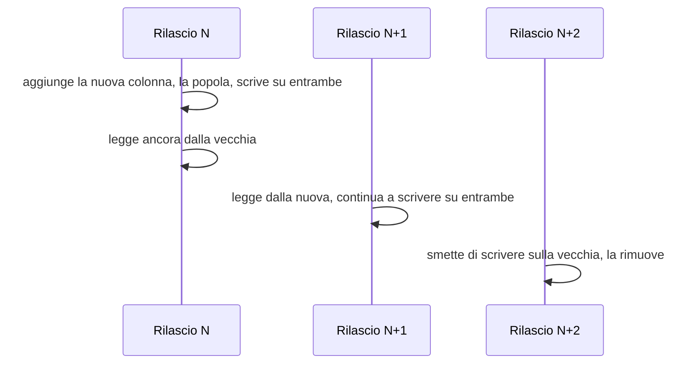

# Persistenza

La base dati è il punto in cui le decisioni architetturali diventano irreversibili. Un errore
nel livello web si corregge con un rilascio; un errore nello schema si corregge con una
migrazione su dati esistenti, che in ambito clinico significa toccare informazione che ha valore
probatorio. Questo capitolo descrive la struttura, le regole di evoluzione e i limiti conosciuti.

I fondamenti - che cos'è una transazione, che cos'è l'isolamento, perché il tempo va modellato
su due assi - stanno in
[`docs/10_fondamenti/11-fondamenti-informatici.md`](../10_fondamenti/11-fondamenti-informatici.md).
Il modello concettuale degli aggregati sta nella base architetturale §2 e in
`docs/02_architecture/`.

---

## 1. I cinque principi

1. **Nessun identificatore esterno è chiave primaria.** Il codice fiscale, l'identificativo
   dell'assistito nel sistema dell'integratore, il numero di prenotazione regionale sono
   *identificatori con dominio di attribuzione esplicito*, non chiavi. Ne discende che ogni
   identificatore esterno vive in una tabella di identificatori con `sistema`, `valore`, `uso` e
   validità temporale, mai in una colonna della tabella principale. È la base architetturale §3,
   ed è la sola struttura che sopravvive al giorno in cui un identificatore cambia o viene
   riattribuito.
2. **Ciò che è clinico non si aggiorna: si supera.** Il documento firmato, la misura di un
   parametro, il consenso prestato sono fatti. Una correzione è un nuovo fatto che rettifica il
   precedente, con la catena mantenuta e la ragione registrata.
3. **Il tempo ha due assi.** L'istante in cui il fatto è accaduto e l'istante in cui il sistema
   lo ha appreso sono colonne diverse e non intercambiabili. Una misura rilevata alle 8:00 e
   sincronizzata alle 19:00 è un dato normale nel telemonitoraggio, e confonderla con una misura
   rilevata alle 19:00 produce una valutazione clinicamente errata.
4. **Il contesto di tenant è applicato dal motore.** Non dal codice, non dalla disciplina, non
   dalle revisioni. Vedi §3.
5. **L'assenza di dato è un dato.** Una misura attesa e non arrivata non è una riga mancante: è
   una riga che dice «attesa, non pervenuta». È il vincolo [V-09](../11_registri/01-vincoli-in-vigore.md#v-09), e ha conseguenze dirette sullo
   schema del piano di rilevazione.

---

## 2. Organizzazione degli schemi

### 2.1 La struttura

Uno **schema per coppia tenant × contesto**, su base dati condivisa, con due schemi trasversali.

```
telemedic (database)
├─ platform            catalogo dei tenant, registro delle migrazioni, chiavi
├─ reference           dati di riferimento non clinici e non specifici di tenant
├─ t0001_identity
├─ t0001_registry
├─ t0001_encounter
├─ t0001_media_session
├─ t0001_clinical_document
├─ t0001_monitoring
├─ …
├─ t0002_identity
└─ …
```

La scelta unisce le due separazioni che servono: quella **fra tenant**, imposta da D8 e dalla
base architetturale §4, e quella **fra contesti**, imposta dalla regola per cui nessun contesto
accede alla base dati di un altro. Il nome dello schema usa un **ordinale opaco**, non il nome
del tenant: il nome è un dato personale nel momento in cui il tenant è uno studio medico
individuale, e i nomi degli schemi compaiono nei messaggi di errore, nei piani di esecuzione e
negli strumenti di amministrazione.

La corrispondenza tenant → ordinale vive in `platform.tenant_directory`, ed è l'unico punto che
il codice consulta. È anche ciò che rende possibile, un domani, spostare un tenant su una base
dati separata senza toccare una riga di dominio: cambia la risoluzione, non l'accesso.

**L'outbox non sta in `platform`.** La tabella degli eventi in uscita vive nello schema della
coppia tenant × contesto che produce l'evento, come dispongono il punto 1 di
[ADR-0008](../adr/0008-outbox-transazionale-unica-sorgente.md) e
[06 - Eventi e integrazione interna](../02_architecture/06-eventi-e-integrazione-interna.md#23-dove-sta-la-tabella)
§2.3. La ragione è l'atomicità - il dato e l'evento si scrivono nella stessa transazione, quindi
nello stesso ambito transazionale - e le conseguenze che uno schema comune non darebbe sono tre:
la dismissione di un tenant porta con sé la propria outbox invece di lasciarne le righe in una
tabella condivisa; le politiche di riga dello schema del tenant coprono anche gli eventi in
uscita; e il relay itera esplicitamente sui tenant, come impone
[05 - Multi-tenancy](../02_architecture/05-multi-tenancy.md#33-i-processi-che-non-nascono-da-una-richiesta)
§3.3, invece di leggere tutti gli schemi in una sola interrogazione. Vedi §7.

### 2.2 Ruoli e privilegi

Ogni contesto ha un **ruolo applicativo proprio**, con privilegi soltanto sui propri schemi.
Non è una raffinatezza: è ciò che rende la prima regola di dipendenza del backend verificabile
dal motore invece che dalla revisione del codice.

| Ruolo | Privilegi |
|---|---|
| `app_<contesto>` | `SELECT, INSERT, UPDATE, DELETE` sui propri schemi, secondo la natura delle tabelle |
| `app_audit` | `INSERT` e `SELECT` sulle tabelle del registro immutabile. **Nessun `UPDATE`, nessun `DELETE`, mai** |
| `app_migrator` | Modifica di struttura. Usato solo dal processo di migrazione, mai dall'applicazione in esercizio |
| `app_readonly` | `SELECT` per la reportistica e la diagnostica, con esclusione delle colonne di contenuto clinico |

Il proprietario degli oggetti **non è** il ruolo applicativo: se lo fosse, il ruolo applicativo
potrebbe alterare la struttura e, soprattutto, potrebbe aggirare la sicurezza a livello di riga,
perché il proprietario di una tabella ne è esente per impostazione predefinita. È l'errore di
configurazione che vanifica silenziosamente l'intero modello di isolamento, e va verificato da
una prova che interroghi il catalogo di sistema.

### 2.3 Sicurezza a livello di riga come difesa in profondità

Con lo schema per tenant, l'isolamento primario è già dato dalla separazione degli oggetti. La
sicurezza a livello di riga aggiunge il secondo strato, e serve a coprire il caso reale: un
percorso di codice che risolve male lo schema, un'interrogazione costruita dinamicamente, un
lavoro programmato che gira senza contesto.

```sql
-- Illustrativo.
ALTER TABLE t0001_encounter.prestazione ENABLE ROW LEVEL SECURITY;
ALTER TABLE t0001_encounter.prestazione FORCE ROW LEVEL SECURITY;

CREATE POLICY prestazione_tenant ON t0001_encounter.prestazione
  USING (tenant_id = current_setting('app.tenant_id', true)::uuid);
```

Due dettagli che decidono se questo funziona davvero.

`FORCE ROW LEVEL SECURITY` è necessario perché senza di esso il proprietario della tabella non è
soggetto alla politica. Ometterlo è il modo più comune di avere una politica che non protegge
nulla.

Il terzo argomento di `current_setting` a `true` fa restituire `NULL` invece di sollevare
un'eccezione quando la variabile non è impostata: `tenant_id = NULL` è falso, quindi la politica
**nega tutto** in assenza di contesto. È il comportamento voluto: un accesso senza tenant
risolto non deve vedere niente, non deve vedere tutto.

**La trappola del pool di connessioni.** La variabile va impostata con `SET LOCAL` **dentro la
transazione**, perché `SET LOCAL` è annullato al termine della transazione e non può sopravvivere
al ritorno della connessione nel pool. Un `SET` senza `LOCAL` lascia il contesto attaccato alla
connessione, e la connessione successiva - di un altro tenant - lo eredita. È la fuga di dati
fra tenant più insidiosa che esista, perché non produce errori: produce risultati sbagliati.
Il meccanismo è realizzato una sola volta, in `platform/tenancy`, ed è provato con una prova che
esaurisce deliberatamente il pool e verifica l'isolamento.

### 2.4 Il limite dichiarato del modello

Il modello a schema per tenant **non scala indefinitamente**. Il numero di oggetti nel catalogo
di sistema cresce con il prodotto tenant × contesti × tabelle; oltre una certa soglia si
degradano la pianificazione delle interrogazioni, i tempi di esportazione logica e le operazioni
di manutenzione, e il consumo di memoria per connessione aumenta.

La soglia va misurata da `TECH` `[NV]` con una prova di capacità su un'installazione
rappresentativa, e il risultato va pubblicato come limite di prodotto, non come cifra generica presa altrove.
Fino ad allora la documentazione dichiara: il modello è progettato per un ordine di grandezza di
**centinaia** di tenant per installazione; oltre, la struttura corretta è la ripartizione su più basi dati, resa
possibile senza modifiche al dominio dal registro dei tenant di §2.1.

Dichiarare il limite è parte del prodotto. Un limite non dichiarato si scopre in esercizio.

---

## 3. Migrazioni

### 3.1 Regole

**Versionate, ordinate, immutabili, con impronta verificata.** Una migrazione già applicata non
si modifica mai: si scrive quella successiva. La verifica dell'impronta esiste proprio per
rendere impossibile la modifica retroattiva, che è la causa classica delle divergenze fra
ambienti.

**Solo in avanti.** Non esistono migrazioni di annullamento. Una migrazione sbagliata si
corregge con una migrazione successiva. Il motivo è pratico prima che filosofico:
l'annullamento di una modifica strutturale che ha già distrutto dati non è possibile, e la sua
esistenza nel repository crea l'illusione contraria.

**Struttura e dati sono separati.** Una migrazione strutturale cambia la forma; una migrazione
di dati cambia il contenuto. Le seconde sono idempotenti, riavviabili, eseguite a blocchi con
avanzamento registrato, e non girano dentro la transazione della prima. Una migrazione di dati
su una tabella clinica di dimensioni reali che gira in un'unica transazione blocca il sistema
per la sua intera durata.

**Espandi e contrai, sempre.** Nessun rilascio è insieme distruttivo e funzionale:



Ne discende che due versioni consecutive dell'applicazione devono poter convivere sulla stessa
base dati - condizione necessaria all'aggiornamento senza interruzione, e condizione necessaria
a poter tornare indietro di un rilascio senza perdere dati. È il vincolo che questa area pone
alle altre aree in bacheca.

**Non bloccanti.** L'aggiunta di una colonna con valore predefinito, la creazione di un indice,
l'aggiunta di un vincolo hanno tutte una forma bloccante e una non bloccante. Si usa sempre la
seconda: creazione dell'indice in modalità concorrente - che però **non può girare dentro una
transazione**, e quindi va marcata come tale nella migrazione - e vincoli aggiunti come non
validati e poi validati in un passo separato, che prende un blocco più debole.

### 3.2 Migrare N schemi

Con lo schema per tenant, ogni migrazione strutturale va applicata a ogni tenant. Il processo:

1. Le migrazioni di `platform` e `reference` girano per prime, una volta.
2. Per ciascun tenant nel registro, le migrazioni del contesto girano nel suo schema, con lo
   stato registrato **per tenant** in `platform.migration_state`.
3. Il fallimento su un tenant **non blocca gli altri** ma marca quel tenant come non allineato, e
   un tenant non allineato non riceve traffico dalla versione nuova dell'applicazione.
4. L'avanzamento è osservabile: quanti tenant migrati, quanti in corso, quanti falliti, con
   quale errore. Su centinaia di tenant, una migrazione senza avanzamento visibile è
   un'operazione condotta alla cieca.

Il punto 3 è la ragione per cui la verifica di compatibilità di §3.1 non è opzionale: durante
una migrazione lunga, tenant su versioni di schema diverse coesistono per costruzione.

---

## 4. Il modello dei dati

### 4.1 Chiavi

Chiave primaria tecnica, generata dall'applicazione, **ordinabile per tempo di creazione**. La
generazione lato applicazione consente di conoscere l'identificativo prima della scrittura -
necessario per costruire l'evento di outbox nella stessa transazione; l'ordinabilità temporale
evita la frammentazione dell'indice che produce un identificativo interamente casuale, che su
tabelle cliniche ad alto tasso di inserimento è un costo reale e crescente.

Nessuna chiave naturale. Nessuna chiave composta che includa il tenant, perché il tenant è già
nello schema e la ripetizione produrrebbe due sorgenti di verità.

### 4.2 Il tempo, in concreto

| Colonna | Significato | Chi la scrive |
|---|---|---|
| `occurred_at` | Quando il fatto è accaduto nel mondo | La sorgente del fatto |
| `recorded_at` | Quando il sistema lo ha appreso | Il sistema, con orologio del server |
| `valid_from` / `valid_to` | Finestra di validità dell'affermazione | Il dominio |
| `superseded_by` | Riferimento al fatto che sostituisce questo | Il dominio, alla rettifica |

Il fuso orario è sempre esplicito e la conservazione è in istante assoluto. La visualizzazione
in ora locale è responsabilità dell'interfaccia. Conservare un'ora locale senza fuso in un
sistema che opera su un territorio con ora legale significa avere, due volte l'anno, un'ora
ambigua - e un'ora ambigua su un tracciato di monitoraggio è un difetto clinico.

### 4.3 Immutabilità applicata

Per le tabelle che ospitano fatti immutabili - misure, documenti firmati, consensi, righe di
registro - l'immutabilità non è una convenzione:

```sql
-- Illustrativo.
REVOKE UPDATE, DELETE ON t0001_monitoring.misura FROM app_monitoring;

CREATE RULE misura_no_update AS ON UPDATE TO t0001_monitoring.misura DO INSTEAD NOTHING;
```

La revoca del privilegio è la difesa che conta; il resto è ridondanza utile a rendere l'intento
evidente a chi legge lo schema.

---

## 5. Serie temporali

### 5.1 Due famiglie che non vanno confuse

**Misure cliniche** - parametri del telemonitoraggio, questionari strutturati. Sono **dati
sanitari**: immutabili, con contesto di rilevazione completo, soggetti a conservazione normata,
a diritto di accesso, a tracciamento degli accessi. Non si campionano, non si aggregano
distruttivamente, non si scartano per anzianità senza una regola di conservazione dichiarata.

**Campioni di qualità della sessione media** - indicatori di rete e di flusso. Sono **dati
tecnici** con una componente di dato personale (chi ha parlato con chi, quando, per quanto). Si
aggregano, si assottigliano, hanno conservazione breve.

Trattarle allo stesso modo è l'errore che porta o a buttare dati clinici o a conservare per anni
milioni di campioni tecnici. Le due famiglie stanno in schemi diversi, con politiche diverse e
ruoli diversi.

### 5.2 Forma delle tabelle

```sql
-- Illustrativo. Solo dati sintetici in ogni esempio del progetto.
CREATE TABLE t0001_monitoring.misura (
    id                uuid        PRIMARY KEY,
    tenant_id         uuid        NOT NULL,
    soggetto_id       uuid        NOT NULL,
    piano_id          uuid        NOT NULL,
    parametro_system  text        NOT NULL,   -- system esplicito, sempre
    parametro_code    text        NOT NULL,
    valore            numeric,
    unita_ucum        text,
    stato             text        NOT NULL,   -- rilevata | attesa_non_pervenuta | annullata
    origine           text        NOT NULL,   -- gateway | inserimento_manuale | questionario
    occurred_at       timestamptz NOT NULL,
    recorded_at       timestamptz NOT NULL DEFAULT now(),
    contesto          jsonb       NOT NULL,   -- strumento, metodo, soggetto rilevatore
    CONSTRAINT misura_valore_o_assenza
        CHECK ((stato = 'rilevata' AND valore IS NOT NULL)
            OR (stato <> 'rilevata' AND valore IS NULL))
);

CREATE INDEX ON t0001_monitoring.misura (soggetto_id, parametro_code, occurred_at DESC);
```

Tre scelte da notare. Lo stato `attesa_non_pervenuta` **esiste come riga**: è la traduzione
schematica del vincolo [V-09](../11_registri/01-vincoli-in-vigore.md#v-09), e senza di essa il silenzio del paziente sarebbe indistinguibile
dalla normalità. Il `system` del parametro è una colonna, non un'assunzione: è la base
architetturale §7. L'unità di misura è conservata accanto al valore, perché un numero senza
unità in un contesto clinico non è un dato: è un rischio.

### 5.3 Ipertabelle o partizionamento nativo

Come stabilito in [`01-stack-e-motivazioni.md`](./01-stack-e-motivazioni.md) §7.3, esistono due
realizzazioni dietro la stessa interfaccia.

| Aspetto | Estensione per serie temporali | Partizionamento dichiarativo nativo |
|---|---|---|
| Creazione delle partizioni | Automatica | Programmata, con anticipo dichiarato |
| Conservazione | Politica dichiarativa | Distacco e scarto della partizione |
| Compressione | Disponibile (verificare il regime di licenza) | Assente |
| Aggregazioni continue | Disponibili (idem) | Tabelle di sintesi aggiornate dall'applicazione |
| Interrogazione | Identica | Identica |

**L'intervallo delle partizioni va scelto sul volume, non per abitudine.** Partizioni troppo
piccole moltiplicano gli oggetti del catalogo - che, sommandosi al moltiplicatore dei tenant di
§2.4, è il modo più rapido di raggiungere il limite del modello. Partizioni troppo grandi
rendono la conservazione grossolana. L'intervallo di riferimento va determinato da `TECH` `[NV]`
con una prova di capacità, non assunto.

### 5.4 Conservazione

La conservazione **non è cancellazione automatica**. Ogni politica ha tre elementi dichiarati:
quale famiglia di dati, per quanto tempo, e in forza di quale regola. Per i dati di tracciabilità
e per i dati di accesso e autenticazione i termini sono fissati dal vincolo [V-152](../11_registri/01-vincoli-in-vigore.md#v-152) di `SEC` e
questa area li recepisce senza reinterpretarli. Per i dati clinici il termine è determinato dal
titolare del trattamento e configurato per tenant: non è una costante del prodotto, e cablarlo
sarebbe un errore normativo oltre che tecnico.

Ciò che il prodotto garantisce è **il meccanismo**: la politica è dichiarata, l'esecuzione è
tracciata, l'esito è verificabile, e non esistono cancellazioni non registrate.

---

## 6. Indici

### 6.1 La regola

Ogni indice ha un costo di scrittura, un costo di spazio e un costo di manutenzione, e
un indice si aggiunge **solo con l'interrogazione che lo giustifica**. Il repository contiene,
accanto alla migrazione che crea un indice, il piano di esecuzione prima e dopo, su un insieme
di dati sintetici di dimensione dichiarata. Senza questo, gli indici si accumulano per paura e
nessuno li rimuove più, perché nessuno sa più quale serviva a cosa.

### 6.2 Le famiglie che servono

| Famiglia | Forma | Motivo |
|---|---|---|
| Accesso per soggetto e tempo | `(soggetto_id, occurred_at DESC)` | È il profilo di lettura dominante di tutto il dominio clinico |
| Risoluzione di identificatore esterno | `(sistema, valore)` con unicità parziale su `uso = 'ufficiale'` | Ingresso dal sistema dell'integratore |
| Coda dell'outbox | Indice **parziale** su `pubblicato_il IS NULL` | Vedi §7 |
| Stato attivo | Indice parziale sullo stato aperto | Le prestazioni chiuse sono la stragrande maggioranza e non vanno indicizzate per lo stesso accesso |
| Ricerca testuale su documenti | Indice invertito generalizzato | Solo dove la funzione esiste davvero, non «per il futuro» |

**Gli indici parziali sono la leva più sottovalutata.** Un indice sulla coda dell'outbox che
copra soltanto le righe non ancora pubblicate resta piccolo per sempre, mentre la tabella cresce.
Lo stesso vale per gli stati attivi in tutte le macchine a stati del dominio.

**Nessun indice su `tenant_id`** dentro gli schemi per tenant: la colonna ha un solo valore per
schema e l'indice sarebbe inutile. La colonna resta perché serve alla politica di sicurezza a
livello di riga e alla ripartizione futura.

### 6.3 I profili di interrogazione che vanno evitati

- **Interrogazione a offset per la paginazione.** Costo crescente con la profondità e risultati
  incoerenti sotto scrittura concorrente. Si usa la paginazione a cursore su una chiave ordinata
  stabile, e lo si espone come tale nell'interfaccia.
- **Caricamento pigro nei cicli.** Il difetto classico del livello di persistenza a mappatura
  oggetto-relazionale. Le letture di elenchi usano proiezioni esplicite, non entità complete: una
  proiezione dichiara che cosa serve, e ciò che non serve non viene letto - il che è anche un
  requisito di minimizzazione, non solo di prestazione.
- **Interrogazioni costruite per concatenazione.** Vietate. Ogni parametro è associato, sempre.
  Il divieto è verificato da analisi statica.
- **`SELECT *` verso una tabella clinica.** Legge colonne di contenuto che spesso non servono e
  che, una volta lette, finiscono in memoria, nei registri di diagnostica e nelle tracce.

---

## 7. L'outbox

**La tabella sta nello schema della coppia tenant × contesto che produce l'evento**, non in uno
schema comune: lo dispone il punto 1 di
[ADR-0008](../adr/0008-outbox-transazionale-unica-sorgente.md), e il capitolo di architettura lo
ripete in [06](../02_architecture/06-eventi-e-integrazione-interna.md#23-dove-sta-la-tabella)
§2.3. L'esempio che segue mostra quindi uno schema di coppia, non `platform`.

```sql
-- Illustrativo. Una tabella per ogni coppia tenant × contesto che produce eventi.
CREATE TABLE t0001_clinical_document.outbox (
    id             uuid        PRIMARY KEY,
    tipo           text        NOT NULL,        -- tipo di evento, versionato nel nome
    chiave         text        NOT NULL,        -- chiave di partizionamento
    busta          jsonb       NOT NULL,        -- riferimenti, mai contenuto clinico
    creato_il      timestamptz NOT NULL DEFAULT now(),
    pubblicato_il  timestamptz,
    tentativi      int         NOT NULL DEFAULT 0,
    ultimo_errore  text
);

CREATE INDEX outbox_da_pubblicare
    ON t0001_clinical_document.outbox (creato_il)
    WHERE pubblicato_il IS NULL;
```

**Non c'è una colonna per il tenant.** Lo schema che contiene la tabella lo determina già, e una
colonna che ripete un'informazione implicita nella collocazione è un luogo in cui i due valori
possono divergere: una riga con il tenant sbagliato in uno schema comune è indistinguibile da una
riga corretta. Il tenant compare invece nella busta, in forma opaca, perché la busta esce dal
perimetro e il suo destinatario non conosce lo schema di origine (§2.1 e
[06](../02_architecture/06-eventi-e-integrazione-interna.md#32-regole-sulla-busta) §3.2).

Il relay preleva con `SELECT ... FOR UPDATE SKIP LOCKED`, il che consente a più istanze di
lavorare in parallelo senza coordinatore e senza che due istanze prendano la stessa riga. La
pubblicazione avviene a blocchi; la marcatura è nella stessa transazione della lettura.

**Il relay itera sui tenant, una tabella per volta.** Non esiste un'interrogazione unica che legga
gli eventi di tutti gli schemi: sarebbe un percorso che attraversa il confine fra tenant, e
[05 - Multi-tenancy](../02_architecture/05-multi-tenancy.md#33-i-processi-che-non-nascono-da-una-richiesta)
§3.3 lo vieta esplicitamente per il relay dell'outbox. Il costo dichiarato è che il carico di
interrogazione a vuoto non è costante ma **proporzionale al numero di tenant attivi**, ed è la
grandezza che va dimensionata prima di moltiplicare le installazioni per tenant.

Il prelievo parallelo che salta le righe già bloccate ha una conseguenza sull'ordinamento che va
letta insieme a questa pagina: due istanze possono pubblicare in ordine invertito due eventi dello
stesso aggregato. Le condizioni alle quali l'ordine per chiave vale, e quelle alle quali non vale,
sono dichiarate in
[06 - Eventi e integrazione interna](../02_architecture/06-eventi-e-integrazione-interna.md#41-ciò-che-si-garantisce-e-ciò-che-non-si-garantisce)
§4.1.

**La busta non contiene contenuto clinico.** È il vincolo [V-161](../11_registri/01-vincoli-in-vigore.md#v-161) di `INTEG`, ed è recepito qui a
livello di schema: la colonna `busta` porta identificativi e riferimenti, il contenuto si rilegge
con una chiamata autenticata sotto l'autorizzazione del ricevente. Il controllo che nessuna
busta contenga campi clinici è una prova, non una convenzione.

**Le righe pubblicate si potano.** Restano il tempo necessario alla diagnosi - l'orizzonte è
configurato - poi vengono rimosse. La tracciabilità di lungo periodo di ciò che è stato inviato
sta nel registro immutabile, non nell'outbox, che è un meccanismo di consegna e non un archivio.

---

## 8. Il registro immutabile

### 8.1 Che cosa non è

Il versionamento delle entità offerto dal livello di persistenza **non è un registro
immutabile**. Produce tabelle di revisione che sono tabelle come le altre: chi ha accesso in
scrittura alla base dati le può alterare. D42 lo dice, il vincolo [V-04](../11_registri/01-vincoli-in-vigore.md#v-04) lo impone a tutte le aree,
e questa area lo recepisce senza attenuanti.

Il versionamento resta, e serve: dà la cronologia applicativa delle entità, utile per capire
*come si è arrivati* a uno stato. Ma non è ciò che dimostra chi ha acceduto a che cosa.

### 8.2 Che cosa è

Una struttura in sola aggiunta, con catena di impronte, conservata separatamente dal sistema che
genera gli eventi.

```sql
-- Illustrativo.
CREATE TABLE audit_store.evento (
    seq           bigserial   PRIMARY KEY,
    tenant_id     uuid        NOT NULL,
    occurred_at   timestamptz NOT NULL,
    attore        text        NOT NULL,   -- pseudonimo per tenant, non identificativo diretto
    per_conto_di  text,                   -- delega, mai impersonificazione
    azione        text        NOT NULL,
    oggetto_tipo  text        NOT NULL,
    oggetto_id    text        NOT NULL,   -- pseudonimo per tenant
    esito         text        NOT NULL,
    livello_garanzia text     NOT NULL,   -- qualificato: eseguito o riferito
    prev_hash     bytea       NOT NULL,
    hash          bytea       NOT NULL
);
```

Le proprietà che lo rendono un registro e non una tabella:

1. **`INSERT` è l'unico privilegio** concesso al ruolo che vi scrive. Nessun `UPDATE`, nessun
   `DELETE`, in nessuna circostanza, incluse le migrazioni.
2. **Ogni riga contiene l'impronta della precedente.** Alterare una riga richiede di ricalcolare
   tutte le successive, il che rende la manomissione rilevabile con una verifica lineare.
3. **La conservazione è separata**: base dati distinta, credenziali distinte, salvataggio
   distinto. La separazione è ciò che rende l'alterazione un'operazione su due sistemi invece
   che su uno.
4. **L'estremo della catena è ancorato periodicamente** su un supporto che il sistema non può
   riscrivere. La forma dell'ancoraggio e la sua periodicità sono decisione di `SEC`; questa area
   fornisce il punto di aggancio e il formato.
5. **Nessun contenuto clinico.** Il registro dice chi, cosa, quando, su quale soggetto, con quale
   esito e con quale livello di garanzia - non che cosa c'era scritto. Vincolo [V-150](../11_registri/01-vincoli-in-vigore.md#v-150) di `SEC`.
6. **Gli identificativi sono pseudonimi per tenant.** Il registro è il sistema con la
   conservazione più lunga e la platea di lettura più ampia: è l'ultimo posto in cui debbano
   comparire identificativi diretti.

La verifica dell'integrità della catena è un'operazione periodica programmata **e** un'operazione
disponibile su richiesta, con esito registrato. Una catena che nessuno verifica è una catena che
non protegge nulla.

---

## 9. Salvataggio e ripristino

### 9.1 Che cosa si dichiara e in che forma

Gli obiettivi di punto di ripristino e di tempo di ripristino sono **specifica di prodotto e
capacità dell'installazione, mai conformità**. Il vincolo [V-12](../11_registri/01-vincoli-in-vigore.md#v-12) è esplicito: nessuna soglia
tecnica è imposta dalla normativa italiana. Il progetto dichiara di quali meccanismi dispone e
quali obiettivi sono raggiungibili con quale configurazione; l'obiettivo effettivo lo fissa il
titolare del trattamento nella propria analisi.

### 9.2 I meccanismi

| Meccanismo | Copre | Non copre |
|---|---|---|
| Copia fisica di base più archiviazione continua del registro delle transazioni | Guasto dell'archiviazione, corruzione, errore umano con ripristino a un istante preciso | Cancellazione logica propagata a valle |
| Esportazione logica per schema | Ripristino di un singolo tenant, migrazione fra installazioni | Grandi volumi in tempi brevi |
| Replica in continuo su nodo secondario | Guasto del nodo primario | Errore logico: si replica anche quello, all'istante |
| Copia separata del registro immutabile | Integrità della tracciabilità | - |

**Il ripristino di un singolo tenant è la ragione principale del modello a schema per tenant.**
Su base dati condivisa senza separazione, ripristinare un tenant significa ripristinare tutto
in un ambiente separato ed estrarre; con lo schema, è un'esportazione logica di un insieme di
schemi noto. È un'operazione che serve davvero: cancellazione accidentale da parte di un
amministratore di tenant, contestazione, migrazione verso un'installazione propria.

### 9.3 Le regole che rendono reale il ripristino

1. **Il salvataggio è cifrato a riposo con chiavi per tenant.** Ne discende la conseguenza
   voluta: la distruzione della chiave rende il contenuto irrecuperabile anche dalle copie -
   cancellazione crittografica, che è il solo modo praticabile di onorare una richiesta di
   cancellazione senza riscrivere la storia delle copie.
2. **Il ripristino è provato, con periodicità dichiarata, su un ambiente separato, con esito
   registrato.** Un salvataggio mai ripristinato ha probabilità sconosciuta di funzionare. La
   prova comprende la verifica della catena del registro immutabile: un ripristino che produca
   una catena non verificabile è un ripristino fallito, non un ripristino riuscito con un avviso.
3. **La chiave di cifratura delle copie non risiede nel sistema che le produce.** Altrimenti la
   compromissione del sistema comprende le copie, che è precisamente lo scenario contro cui le
   copie esistono.
4. **La procedura di ripristino è scritta come sequenza eseguibile**, con i comandi, l'ordine, i
   controlli intermedi e i criteri di completamento, e sta nel manuale operativo. Una procedura
   che va ricostruita durante l'incidente non è una procedura.

### 9.4 Il conflitto che va dichiarato

Il diritto alla cancellazione e l'obbligo di conservare copie coerenti sono in tensione, e la
tensione non si risolve con una scelta tecnica: si governa. Il progetto adotta la cancellazione
crittografica per il contenuto e mantiene nel registro immutabile la **traccia dell'avvenuta
cancellazione** - chi l'ha richiesta, chi l'ha eseguita, quando, su quale perimetro - perché
cancellare senza lasciare traccia dell'atto renderebbe impossibile dimostrare di aver adempiuto.
La determinazione delle basi giuridiche e dei perimetri non è di questa area: è del titolare del
trattamento e di `COMP`.

---

## 10. Limiti dichiarati

Riepilogo, perché un capitolo di persistenza senza limiti dichiarati è incompleto.

| Limite | Natura | Stato |
|---|---|---|
| Numero di tenant per installazione nel modello a schema | Strutturale, dovuto alla crescita del catalogo | da misurare da `TECH` `[NV]`; ordine di grandezza dichiarato: centinaia |
| Latenza di consegna degli eventi | Pari all'intervallo di interrogazione del relay | Dichiarata in [`07-prestazioni-e-capacita.md`](./07-prestazioni-e-capacita.md) |
| Compressione e aggregazioni continue delle serie temporali | Assenti nella realizzazione di ripiego | Dichiarato, con sostituzione tramite tabelle di sintesi |
| Durata delle migrazioni su molti tenant | Cresce linearmente con il numero di tenant | Mitigata dall'esecuzione per tenant e dall'osservabilità dell'avanzamento |
| Ripristino a un istante preciso | Granularità pari alla frequenza di archiviazione del registro delle transazioni | Configurabile da chi installa, dichiarata nel manuale |

---

**Prosegue in**: [`04-frontend.md`](./04-frontend.md) per il lato dell'interfaccia,
[`06-osservabilita.md`](./06-osservabilita.md) per ciò che si può e non si può registrare.
