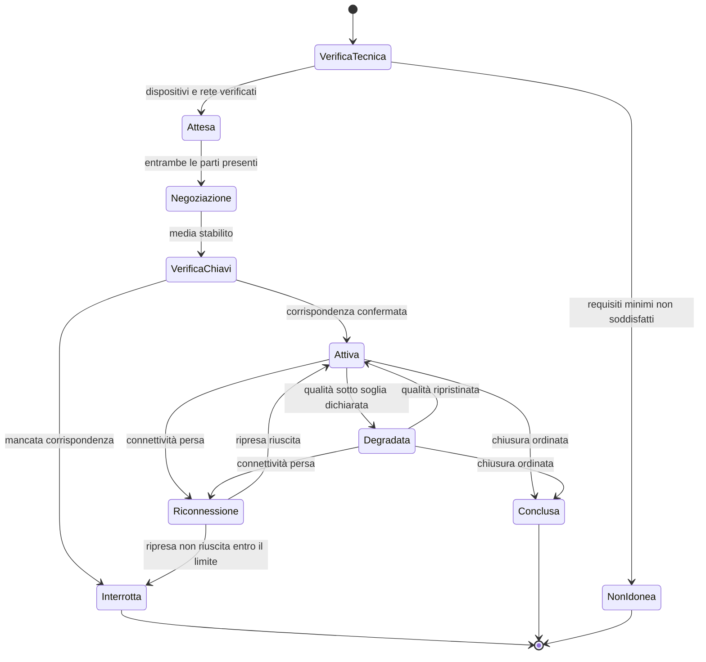

# Frontend

L'interfaccia di Telemedic non è la parte «visibile» del sistema: è la parte in cui il rischio
clinico si manifesta. Un paziente anziano che non trova il pulsante per entrare nel consulto,
un professionista che non si accorge che la sessione è registrata, un avviso di qualità
inadeguata che passa inosservato sono guasti del prodotto, non difetti estetici. D25 lo stabilisce
come vincolo trasversale e questo capitolo lo traduce in requisiti che si possono **provare a
fallire**.

I fondamenti dell'architettura a componenti non si ripetono. Il comportamento funzionale delle
schermate è in `docs/03_functional/`; il modello di interazione con il media è in
[`05-media-e-tempo-reale.md`](./05-media-e-tempo-reale.md).

---

## 1. Il criterio che governa tutto

D25, punto 9, fissa il criterio di accettazione operativo: **ogni requisito funzionale deve poter
essere completato da un assistito anziano su smartphone in rete mobile, e da un professionista
con la sola tastiera e uno screen reader. Se non è possibile, il requisito non è soddisfatto.**

Ne discende una conseguenza sul metodo di lavoro che vale la pena rendere esplicita: non esiste
una fase di «adattamento mobile» e non esiste una fase di «passata di accessibilità». Una
schermata che non soddisfa il criterio non è una schermata da rifinire: è una schermata non
finita. I criteri verificabili che rendono operativo questo principio sono ai §§6 e 7.

---

## 2. Struttura dell'applicazione

### 2.1 Organizzazione

Come per il backend, si separa per funzionalità e non per natura tecnica.

```
web/
├─ core/                    trasversale, nessuna logica di funzionalità
│  ├─ auth/                 sessione, token, rinnovo, disconnessione
│  ├─ http/                 intercettori, ritentativi, correlazione, errori
│  ├─ i18n/                 internazionalizzazione, formattazione
│  ├─ a11y/                 servizi di annuncio, gestione del fuoco, preferenze
│  ├─ config/              configurazione di runtime per tenant
│  └─ telemetry/            misure di interfaccia, senza contenuto
├─ design-system/           componenti di base, accessibili per costruzione
├─ features/
│  ├─ waiting-room/         verifica tecnica e attesa
│  ├─ consultation/         sessione: media, chat, condivisione, verifica delle chiavi
│  ├─ consent/              raccolta e revoca del consenso
│  ├─ documentation/        refertazione e firma
│  ├─ monitoring/           piani, inserimento misure, questionari
│  └─ admin/                amministrazione di tenant
├─ embeddable/              elemento personalizzato per l'integratore
└─ app/                     assemblaggio, instradamento, avvio
```

**Regole di dipendenza, verificate in integrazione continua.** `features` non dipende da
`features`: due funzionalità che devono comunicare lo fanno attraverso `core` o attraverso
l'instradamento. `design-system` non dipende da nulla se non da sé stesso e dalla piattaforma:
è la condizione perché sia riusabile nel componente incorporabile senza trascinare l'intera
applicazione. `embeddable` dipende da `design-system` e da `core`, mai da `features` intere.

### 2.2 Componenti autonomi e caricamento differito

Nessun modulo, componenti autonomi ovunque. La conseguenza rilevante non è stilistica: il
grafo delle dipendenze diventa reale e il caricamento differito diventa esatto. Ogni percorso
di instradamento è un confine di caricamento, e il primo caricamento comprende **soltanto** ciò
che serve alla prima schermata utile.

Questo importa perché il caso d'uso di riferimento è un assistito su rete mobile che apre il
collegamento ricevuto pochi minuti prima del consulto. Il tempo che passa fra il tocco e la
possibilità di premere «entra» è il primo requisito di accessibilità reale, prima di qualunque
criterio formale.

### 2.3 Il componente incorporabile

L'artefatto che l'integratore incorpora nella propria interfaccia è un **elemento personalizzato
conforme allo standard dei componenti web**, non un'applicazione montata dentro un'altra. Le
ragioni sono di contratto: non imporre un quadro di lavoro (implicazione progettuale n. 1 del
profilo dell'integratore archetipo) e non lasciare che gli stili del contenitore alterino il
componente.

Vincoli di realizzazione, che recepiscono il vincolo [V-163](../11_registri/01-vincoli-in-vigore.md#v-163) di `INTEG`:

- **Isolamento degli stili** con radice d'ombra. Nessuna iniezione di fogli di stile esterni,
  in nessuna forma.
- **Insieme chiuso e versionato di proprietà di tema**, esposte come proprietà personalizzate
  della piattaforma. Il valore proposto è **validato lato server con verifica del contrasto**, e
  una configurazione che degradi l'accessibilità è **rifiutata al salvataggio**, non accettata
  con un avviso.
- **Elementi non tematizzabili né occultabili**: indicatore di registrazione in corso, avvisi e
  testi di consenso, esito della verifica delle chiavi, messaggi di errore clinico, indicatore
  dello stato di cifratura. Non è configurazione: è una regola del componente, e una prova la
  verifica tentando di violarla.
- **Comunicazione con il contenitore per messaggi**, con origine verificata su lista di
  ammissione per tenant e schema del messaggio versionato. Un messaggio da un'origine non attesa
  viene ignorato e registrato.

---

## 3. Stato

### 3.1 Tre categorie, tre trattamenti

Confondere le tre è l'origine della maggior parte della complessità accidentale nelle
applicazioni di questo tipo.

| Categoria | Esempi | Dove vive | Come si aggiorna |
|---|---|---|---|
| **Stato del server** | Anagrafica, agenda, misure, documenti | Non vive nel client: si legge quando serve, con cache dichiarata e invalidazione esplicita | Richiesta, evento, azione dell'utente |
| **Stato di interfaccia** | Pannello aperto, passo del formulario, filtro | Nel componente, con segnali | Interazione |
| **Stato della sessione media** | Negoziazione, connettività, qualità, registrazione | Macchina a stati esplicita e unica | Eventi del motore di connessione e del canale di segnalazione |

**Non esiste un archivio globale unico.** Un archivio globale in un'applicazione clinica diventa,
in pochi mesi, il posto in cui finisce anche il contenuto clinico - e quindi il posto da cui
finisce nei registri di diagnostica e negli strumenti di sviluppo. La regola è: il contenuto
clinico non risiede in strutture globali e non sopravvive alla schermata che lo mostra.

### 3.2 La macchina a stati della sessione

La sessione media ha una macchina a stati **esplicita, unica e provabile senza navigatore**. Non
è un insieme di variabili booleane sparse fra componenti: è un tipo con transizioni dichiarate,
in cui uno stato non previsto è un errore.



Due stati meritano attenzione perché sono quelli che nelle realizzazioni frettolose non esistono.
`VerificaChiavi` è uno stato **bloccante**: la sessione non è «attiva» finché la verifica non è
stata affrontata, perché è ciò che rende dimostrabile la proprietà di cifratura fino agli estremi
ed è un controllo di rischio, non un passaggio di cortesia. `Degradata` è uno stato **visibile
all'utente**: una sessione che funziona male e non lo dice è più pericolosa di una sessione che
si interrompe, perché produce una valutazione clinica su un'immagine che il professionista crede
fedele.

---

## 4. Resilienza di rete

Il caso di riferimento non è la fibra: è la rete mobile in movimento, il Wi-Fi condominiale, la
rete ospedaliera con isolamento fra client. La resilienza qui è un requisito di accessibilità
(D25, punto 7), non un'ottimizzazione.

### 4.1 Canale di segnalazione

- **Riconnessione con attesa esponenziale e jitter**, con tetto dichiarato e numero di tentativi
  dichiarato. Il jitter non è un dettaglio: senza di esso, tutte le sessioni cadute per lo stesso
  guasto ritentano nello stesso istante.
- **Ripresa della sessione, non ricostruzione.** Alla riconnessione il client dichiara la
  sessione, l'ultimo messaggio ricevuto e la generazione di negoziazione corrente; il server
  rinvia ciò che manca. Ricreare la sessione da zero significa rifare la negoziazione e, per
  l'utente, ricominciare.
- **La caduta del canale di segnalazione non interrompe il media già stabilito.** È una proprietà
  del protocollo che l'interfaccia deve rispettare invece di combattere: il flusso audio e video
  continua, mentre si perdono rinegoziazione e chiusura ordinata. L'interfaccia lo comunica con
  precisione - «collegamento con il servizio interrotto, la chiamata prosegue» - perché il
  messaggio generico di errore, in quel momento, spinge l'utente a chiudere una chiamata che
  funziona.

### 4.2 Operazioni in uscita

Le azioni che modificano lo stato - accettare un consenso, chiudere una sessione, inserire una
misura - passano da una **coda con ritentativi e chiave di idempotenza**. La chiave è generata
dal client e riusata a ogni ritentativo: è ciò che rende innocuo il ritentativo su una risposta
persa, che è il caso più frequente su rete mobile.

L'intestazione con cui la chiave viaggia va documentata per quello che è: **una convenzione
consolidata fra realizzazioni, non uno standard**. La bozza che la definiva è scaduta e
archiviata (correzione C-02 in bacheca), e citarla come standard sarebbe un errore che si nota.

La coda è **limitata e visibile**. Se un'operazione non riesce dopo i tentativi previsti,
l'utente lo sa e sa che cosa fare; non resta un'icona che gira. Il vincolo [V-09](../11_registri/01-vincoli-in-vigore.md#v-09) vale anche qui:
un'operazione clinica in stato ignoto è un rischio, non un dettaglio di esperienza d'uso.

### 4.3 Degrado

**Audio prima del video, sempre.** È la base architetturale §9 e si traduce in comportamento
esplicito: quando le condizioni non consentono entrambi, si mantiene l'audio, si dichiara la
scelta all'utente e la si registra nell'esito della sessione. Il video che si congela senza
spiegazione è la modalità di guasto peggiore, perché il professionista continua a osservare
un'immagine che crede attuale.

Sequenza di degrado dichiarata: riduzione della risoluzione, poi riduzione del frame rate
secondo la preferenza impostata, poi sospensione del video con audio mantenuto, poi avviso di
inidoneità con proposta di rinvio o di canale alternativo. Ogni transizione è annunciata in
modo percepibile anche senza vista e senza udito.

### 4.4 Che cosa non si fa fuori linea

Il progetto **non** offre una modalità fuori linea per il contenuto clinico. La motivazione è di
rischio: contenuto clinico conservato sul dispositivo è contenuto clinico su un dispositivo che
il titolare del trattamento non controlla, con un problema di cancellazione non risolvibile.
Ciò che resta disponibile senza rete è soltanto il guscio dell'applicazione e i messaggi che
spiegano lo stato. È una scelta dichiarata, non una mancanza.

---

## 5. Prestazioni percepite

Il bilancio è un vincolo di progetto, verificato in integrazione continua, non un obiettivo.

| Grandezza | Vincolo di progetto | Verifica |
|---|---|---|
| Peso trasferito del primo caricamento del percorso di ingresso alla sessione | Soglia dichiarata nel repository, non superabile | Controllo di dimensione degli artefatti in integrazione continua, con fallimento della costruzione |
| Tempo alla prima interazione utile su dispositivo di riferimento e rete mobile simulata | Soglia dichiarata | Prova sintetica su profilo di rete e di CPU dichiarati |
| Numero di richieste bloccanti prima della prima schermata utile | Il minimo necessario, dichiarato per percorso | Prova |

I valori numerici delle soglie **vanno misurati e fissati dall'`TECH`** da verificare da `TECH` `[NV]` su un
dispositivo di riferimento scelto e dichiarato, e pubblicati come specifica di prodotto. Fissarli qui a
priori produrrebbe cifre non verificate, e il vincolo [V-12](../11_registri/01-vincoli-in-vigore.md#v-12)
vale anche in senso opposto: una soglia inventata non diventa vera perché è scritta.

Il **dispositivo di riferimento va scelto e dichiarato**: non l'apparecchio dello sviluppatore,
ma un dispositivo di fascia media di alcuni anni prima, che è ciò che ha in mano la popolazione
di riferimento. La scelta è una decisione di prodotto ed è aperta in bacheca.

---

## 6. Mobile first come requisito verificabile

«Mobile first» senza criteri è un'affermazione di intenti. Questi sono i criteri, e ciascuno è
associato a un modo di provarne la violazione.

| # | Criterio | Come si prova che è violato |
|---|---|---|
| M1 | Ogni percorso funzionale si completa su una larghezza di viewport pari a quella del dispositivo di riferimento, senza scorrimento orizzontale | Prova end-to-end sul viewport dichiarato; il fallimento è la comparsa di scorrimento orizzontale |
| M2 | Nessun bersaglio interattivo ha area attiva inferiore alla soglia dichiarata, né distanza dal bersaglio adiacente inferiore alla soglia | Regola automatica sul DOM renderizzato |
| M3 | Nessuna funzionalità richiede un gesto complesso - pressione prolungata, gesto a più dita, trascinamento - senza un'alternativa a tocco singolo | Ispezione automatizzata dei gestori di eventi più revisione manuale sui percorsi critici |
| M4 | La comparsa della tastiera virtuale non copre mai il campo attivo né il pulsante di conferma | Prova su dispositivo reale, non emulato: gli emulatori non riproducono il comportamento |
| M5 | Il contenuto rispetta le aree sicure del dispositivo, comprese le zone di gesto di sistema | Prova visuale su dispositivo con area non rettangolare |
| M6 | L'applicazione funziona in entrambi gli orientamenti; nessun percorso è bloccato in uno solo | Prova end-to-end nei due orientamenti |
| M7 | Nessun percorso richiede più di un numero dichiarato di tocchi dall'apertura del collegamento all'ingresso in sessione | Prova end-to-end che conta le interazioni |
| M8 | Il consumo di banda della sessione è adattato alla rete e non supera un tetto dichiarato senza consenso esplicito | Misura nella prova di rete degradata |

M4 e M5 richiedono **dispositivi reali**, e questo ha una conseguenza sull'organizzazione delle
prove: una parte della verifica mobile non è automatizzabile su emulatore e va pianificata come
attività su hardware. Dichiararlo è più utile che fingere che l'emulatore basti.

---

## 7. Accessibilità come requisito verificabile

### 7.1 Il perimetro

WCAG 2.1 livello AA ed EN 301 549 integrali, con **una sola non conformità dichiarata sul
criterio 1.2.4** - sottotitoli in tempo reale - secondo D24, con l'interprete come misura
alternativa. Il canale dati dei sottotitoli **è comunque definito e versionato nel protocollo**:
è la scelta tecnica che consente di innestare in futuro un motore di trascrizione senza
riprogettare, ed è documentata in `docs/04_protocols/`.

La dichiarazione di accessibilità segue il modello nazionale ed è formulata secondo EN 301 549.
La sua redazione è di `COMP`; questa area fornisce l'evidenza tecnica.

### 7.2 I criteri operativi

| # | Criterio | Verifica |
|---|---|---|
| A1 | Ogni schermata è percorribile e completabile con la sola tastiera, con ordine di fuoco corrispondente all'ordine visivo | Prova automatizzata di percorso a tastiera più revisione manuale |
| A2 | Il fuoco è sempre visibile, con indicatore che soddisfa il requisito di contrasto e non è soppresso da stili di reimpostazione | Regola automatica e ispezione |
| A3 | A ogni cambio di percorso il fuoco è spostato deliberatamente e la schermata è annunciata | Prova con tecnologia assistiva |
| A4 | Ogni finestra modale intrappola il fuoco, si chiude con il tasto di uscita e restituisce il fuoco all'elemento che l'ha aperta | Prova automatizzata |
| A5 | Nessuna informazione è veicolata dal solo colore. Vale in modo assoluto per stato di registrazione, stato di cifratura, esito della verifica delle chiavi, avvisi di qualità | Ispezione automatica del rapporto fra segnale visivo e testuale, più revisione manuale |
| A6 | I cambiamenti di stato importanti sono annunciati con una regione dinamica di cortesia appropriata, senza sovrapporsi | Prova con tecnologia assistiva |
| A7 | Le preferenze di sistema - movimento ridotto, contrasto elevato, dimensione del carattere - sono rispettate e **non sono disattivabili dalla configurazione di tenant** | Prova con preferenze impostate; tentativo di violazione tramite configurazione, che deve fallire |
| A8 | Il contenuto resta utilizzabile a un ingrandimento del testo fino al livello richiesto dal criterio, senza perdita di funzionalità | Prova a ingrandimento |
| A9 | Ogni campo ha un'etichetta programmaticamente associata; nessuna etichetta è realizzata con solo testo segnaposto | Regola automatica |
| A10 | Ogni messaggio di errore è testuale, associato al campo, e dice come correggere | Ispezione più revisione redazionale |

### 7.3 La verifica delle chiavi, che è il caso più difficile

D22 impone la stringa di autenticazione breve come impostazione predefinita: un codice breve
derivato dalle impronte crittografiche, che i due interlocutori confrontano a voce. È al tempo
stesso ciò che rende dimostrabile la cifratura fino agli estremi e un controllo di rischio
tracciabile.

I requisiti di accessibilità che ne discendono sono vincolanti e vanno progettati, non aggiunti:

- **leggibile da screen reader**, il che significa carattere per carattere e non come parola
  intera, con annuncio esplicito che si tratta di un codice da confrontare;
- **mai veicolata dal solo colore**, in nessuna sua parte, incluso l'esito del confronto;
- **comprensibile a un assistito anziano o poco alfabetizzato digitalmente**: alfabeto ridotto
  privo di caratteri ambigui, raggruppamento in blocchi brevi, formulazione dell'istruzione in
  linguaggio piano;
- **procedura definita in caso di mancata corrispondenza**, presentata nell'interfaccia con la
  stessa evidenza del caso positivo. È il punto in cui la maggior parte delle realizzazioni
  fallisce: gestiscono il caso in cui i codici coincidono e lasciano l'utente senza istruzioni
  nel caso in cui non coincidono, che è esattamente il caso in cui l'utente ha bisogno di
  istruzioni.

### 7.4 L'indicatore di registrazione

Quando la registrazione è attiva, l'indicatore è **persistente e non occultabile** per tutta la
durata, per entrambi i partecipanti. Sul piano tecnico questo significa: sempre nel flusso del
documento, mai in un elemento che possa uscire dal viewport, annunciato all'attivazione e alla
disattivazione, presente anche nelle viste a schermo intero e nel componente incorporabile, e
non tematizzabile ([V-163](../11_registri/01-vincoli-in-vigore.md#v-163) di `INTEG`). La verifica è una prova che tenta di nasconderlo con ogni
mezzo previsto dalla configurazione e deve fallire in tutti.

### 7.5 Automatico e manuale

**L'automazione intercetta una parte minoritaria dei difetti di accessibilità.** D25 lo dichiara
e questa area lo recepisce nell'organizzazione delle prove: le regole automatiche girano su ogni
richiesta di modifica e bloccano, ma **non sono la verifica**. La verifica comprende sessioni con
tecnologie assistive reali e con utenti rappresentativi, che comprendono assistiti anziani e
persone con disabilità - che non sono un caso limite, sono la popolazione di riferimento. La
pianificazione è in [`08-qualita-e-test.md`](./08-qualita-e-test.md) §6.

---

## 8. Internazionalizzazione

### 8.1 Architettura

Italiano lingua primaria, inglese traduzione integrale (D3, D50). L'architettura è predisposta
per lingue ulteriori, come richiede il decreto per le infrastrutture regionali.

Elementi tecnici:

- **Nessuna stringa nel codice.** Ogni testo visibile è una voce di catalogo con chiave stabile.
  Una prova verifica che non esistano stringhe letterali nei modelli e nei componenti.
- **Chiavi con spazio dei nomi per funzionalità**, non per schermata: la stessa etichetta usata
  in due punti è la stessa voce, non due voci che divergeranno.
- **Nessuna concatenazione di frammenti tradotti.** Le frasi con parti variabili sono voci
  intere con segnaposto, perché l'ordine delle parti cambia da lingua a lingua.
- **Pluralizzazione e genere** gestiti dal formato del catalogo, non da condizionali nel codice.
- **Numeri, date, orari e unità di misura** formattati con l'API di internazionalizzazione della
  piattaforma e mai a mano. Le date cliniche si mostrano sempre con l'indicazione del fuso
  quando il fuso può differire da quello dell'osservatore.
- **Divergenza fra lingue rilevata in integrazione continua**: una chiave presente in italiano e
  assente in inglese fa fallire la costruzione. È la misura tecnica che D50 richiede per governare
  il rischio reale, che è la divergenza.

### 8.2 La separazione che non è opzionale

**Le stringhe di interfaccia del progetto sono architetturalmente separate dalle etichette
ufficiali dei sistemi di codifica.** La base architetturale §7 lo impone e D34 ne dà la ragione:
le traduzioni delle terminologie sono opere derivate assegnate ai rispettivi titolari, e mescolarle
al catalogo di internazionalizzazione del progetto significa incorporarle nel repository sotto
la licenza sbagliata.

Realizzazione:

| Canale | Contenuto | Origine | Licenza |
|---|---|---|---|
| Catalogo di internazionalizzazione | Etichette, messaggi, istruzioni del prodotto | Repository del progetto | Quella del progetto |
| Etichetta di codifica | Denominazione ufficiale di un codice | Gateway delle terminologie, a runtime | Quella del sistema di codifica |

Non si mescolano mai, non si sostituiscono a vicenda e la loro origine è distinguibile
nell'interfaccia. Quando l'etichetta ufficiale non è disponibile - sistema di codifica non
abilitato per quel tenant, gateway in modalità degradata - si mostra il codice con il proprio
sistema, mai una traduzione di comodo scritta dal progetto: sarebbe un derivato non autorizzato
e, peggio, un'affermazione clinica non tracciabile.

La questione [Q-03](../11_registri/02-questioni-aperte.md#q-03) in bacheca chiede esattamente «come si realizza concretamente» questa
separazione ed è indirizzata ad `ARCH`. Ciò che questa area può affermare senza invadere è la
**forma tecnica**: due canali distinti, due licenze, nessuna sostituzione, e comportamento
dichiarato in assenza dell'etichetta ufficiale. Il modello dei dati che ne discende è di `ARCH`.

---

## 9. Sicurezza lato interfaccia

Il modello di minaccia è in `docs/06_security/`; qui stanno i vincoli di realizzazione.

- **Nessun token nell'archiviazione persistente del navigatore.** Il token di accesso vive in
  memoria; il rinnovo passa da un canale che non è leggibile da script. L'archiviazione locale è
  leggibile da qualunque script eseguito nell'origine, e l'origine di un'applicazione sanitaria
  ospita anche il componente incorporabile.
- **Nessun contenuto clinico in archiviazione persistente**, in nessuna forma, incluse le cache
  del lavoratore di servizio. Discende dal §4.4.
- **Politica di sicurezza dei contenuti restrittiva**, senza direttive permissive per script in
  linea, con elenco delle origini consentite generato dalla configurazione del tenant e non
  scritto a mano.
- **Nessun identificativo diretto negli indirizzi.** Un indirizzo finisce nella cronologia, nei
  registri dei proxy e nell'intestazione di provenienza verso terzi. Gli identificativi negli
  indirizzi sono opachi e a vita limitata.
- **Pulizia esplicita alla chiusura della sessione**: revoca delle tracce media, chiusura del
  motore di connessione, azzeramento dello stato clinico in memoria. Una scheda del navigatore
  lasciata aperta su una postazione condivisa è uno scenario reale in ambito ambulatoriale.

---

## 10. Che cosa l'interfaccia non fa

- **Non decide.** Nessuna valutazione clinica avviene nel client. Una soglia valutata nel client
  sarebbe una soglia non tracciabile e manipolabile.
- **Non conserva.** Vedi §9.
- **Non è l'unico modo di fare le cose.** Il vincolo [V3](../11_registri/03-vincoli-fondanti.md#v3) e il vincolo [V-164](../11_registri/01-vincoli-in-vigore.md#v-164) di `INTEG` impongono
  che ogni capacità sia raggiungibile da un sistema terzo tramite interfaccia documentata.
  L'interfaccia è un consumatore delle stesse interfacce applicative offerte agli integratori,
  senza percorsi privilegiati: è anche il modo più efficace di accorgersi se un contratto è
  scomodo.
- **Non nasconde lo stato tecnico quando lo stato tecnico ha conseguenze cliniche.** Qualità
  inadeguata, registrazione attiva, verifica delle chiavi non eseguita, operazione non
  confermata: sono informazioni dell'utente, non dettagli di sistema.

---

**Prosegue in**: [`05-media-e-tempo-reale.md`](./05-media-e-tempo-reale.md) per il motore della
sessione, [`08-qualita-e-test.md`](./08-qualita-e-test.md) per il modo in cui i criteri di questo
capitolo sono provati.
