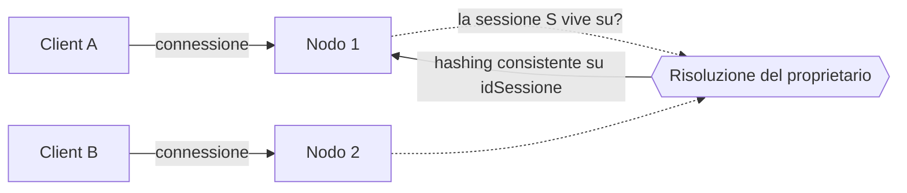
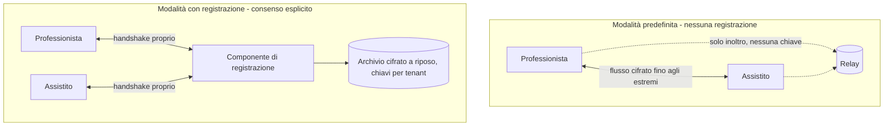

# Media e tempo reale

Questa è la parte del sistema in cui gli errori si pagano più cari e in cui le affermazioni non
verificate si notano di più. I fondamenti - NAT, candidati, cifratura del flusso, codec,
controllo della congestione, topologie - stanno in
[`docs/10_fondamenti/08-webrtc-da-zero.md`](../10_fondamenti/08-webrtc-da-zero.md) e **non si
ripetono**. Qui si descrive che cosa Telemedic realizza, con quali vincoli e con quali limiti.

---

## 1. La distinzione preliminare: che cosa il progetto realizza davvero

Va messa in testa al capitolo perché condiziona ogni affermazione successiva, e perché la
comunicazione pubblica del progetto ne ha bisogno.

| Capacità | Chi la realizza |
|---|---|
| Ripiego sul relay quando il collegamento diretto non si stabilisce | **Il protocollo di negoziazione della connettività.** Assegna al candidato di relay la preferenza di tipo più bassa e lo usa solo se nient'altro funziona |
| Bitrate adattivo | **Il controllore di congestione dentro il navigatore** |
| Cifratura del flusso e derivazione delle chiavi | **Il navigatore**, secondo lo stack standard |
| Occultamento della perdita di pacchetti, buffer di jitter adattivo, ritrasmissione | **Il navigatore** |
| Segnalazione e macchina a stati della sessione | **Telemedic** |
| Emissione delle credenziali di relay e loro perimetro | **Telemedic** |
| Configurazione e messa in sicurezza del nodo di relay | **Telemedic** (e chi installa) |
| Verifica delle chiavi da parte degli interlocutori | **Telemedic** |
| Misura, registrazione e conseguenza clinica della qualità | **Telemedic** |
| Registrazione della sessione e suo ciclo di vita | **Telemedic** |

Rivendicare le righe della prima metà è un difetto di onestà tecnica che si nota in sede di
verifica. Le righe della seconda metà sono lavoro reale, e sono ciò che distingue una
realizzazione clinica da un esempio di manuale.

---

## 2. Segnalazione

### 2.1 Trasporto

**Canale bidirezionale su connessione persistente, con un protocollo applicativo di progetto in
JSON, versionato e descritto da uno schema.** Nessun protocollo di messaggistica sovrapposto,
nessuna libreria di ripiego su trasporti multi-richiesta.

Le tre ragioni, in ordine di peso:

1. La segnalazione di un consulto è **punto a punto per sessione**, non diffusione a molti. Un
   modello a destinazioni e sottoscrizioni non aggiunge nulla e inserisce un intermediario nel
   percorso critico della negoziazione.
2. Le librerie di ripiego su trasporti multi-richiesta **impongono l'affinità di sessione al
   bilanciatore**, che è precisamente il vincolo di scalabilità che si vuole evitare.
3. Un protocollo proprio, versionato e descritto da uno schema, è **validabile al confine** -
   requisito di validazione dell'ingresso di [`02-backend.md`](./02-backend.md) §6.

Se in futuro l'attraversamento di reti aziendali ostili risultasse un problema **misurato**, il
ripiego corretto è il trasporto bidirezionale su HTTP di versione superiore, non una libreria di
emulazione.

### 2.2 Il requisito di ordine, che non è negoziabile

La raccolta incrementale dei candidati impone che il trasporto della segnalazione consegni ogni
candidato **esattamente una volta e nello stesso ordine in cui è stato trasmesso**. Non è una
raccomandazione di prestazione: un candidato duplicato o fuori ordine produce accoppiamenti
errati e ritardi nella convergenza.

Ne discendono due conseguenze di realizzazione:

- **la coda per sessione è ordinata e affidabile**, e ogni messaggio porta un numero di sequenza
  per sessione, che il ricevente usa per rilevare buchi e per riprendere dopo una riconnessione;
- **un meccanismo di diffusione senza persistenza è escluso** come diffusore fra istanze, perché
  non garantisce né l'unicità né l'ordine sotto riconnessione.

### 2.3 Ruoli e collisioni

La collisione di due proposte simultanee si risolve con il modello a ruolo **cortese** e
**scortese**, e il ruolo **è assegnato dal server di segnalazione, mai negoziato fra i client**.
Assegnazione di progetto: **cortese all'assistito, scortese al professionista sanitario**. La
motivazione è clinica: in caso di collisione, la proposta di chi conduce il consulto vince e la
sessione converge sulla configurazione voluta da chi ha la responsabilità dell'atto.

Per la sessione a tre partecipanti la regola si generalizza in modo deterministico e privo di
ambiguità: ordinamento lessicografico degli identificativi di partecipante, e nella coppia il
minore è scortese.

### 2.4 Fine della raccolta e generazioni

L'indicazione di fine raccolta **deve specificare la generazione** a cui si riferisce, cioè la
coppia di credenziali di sessione corrente. Dopo averla inviata non si inviano altri candidati
per quella generazione. Un riavvio della negoziazione apre una generazione nuova, e i candidati
delle due generazioni non si mescolano. È l'errore che produce sessioni che «a volte non si
collegano dopo un cambio di rete».

Come ripiego di interoperabilità verso agenti che non supportano la raccolta incrementale, si
adotta la forma mista: l'iniziatore raccoglie una generazione completa prima della proposta
iniziale, il rispondente può procedere in modo incrementale.

### 2.5 Scalabilità su più istanze

La segnalazione è **stateful per costruzione**: la sessione è una macchina a stati condivisa fra
due connessioni che possono atterrare su nodi diversi.



Le opzioni sono tre - affinità al bilanciatore, diffusore fra istanze, instradamento
deterministico della sessione al nodo proprietario - e **la scelta è strutturale, con effetti su
aggiornamento senza interruzione, dimensionamento e modalità di guasto**. Questa area **non la
decide**: è aperta in bacheca ad `ARCH` e va registrata come decisione architetturale. Ciò che
questa area afferma è il vincolo tecnico che qualunque scelta deve soddisfare: **consegna
esattamente una volta e nell'ordine, per sessione**, e **drenaggio graduale sufficiente a non
troncare una sessione in corso durante un aggiornamento**.

### 2.6 Che cosa la caduta della segnalazione **non** interrompe

Il flusso già stabilito prosegue. Si perdono rinegoziazione, raccolta di nuovi candidati e
chiusura ordinata. È una proprietà da rispettare, non da combattere: l'interfaccia lo comunica
con precisione (vedi [`04-frontend.md`](./04-frontend.md) §4.1) e il server, alla riconnessione,
riprende la sessione invece di ricrearla.

---

## 3. Negoziazione

### 3.1 Un solo trasporto per tutto

L'aggregazione dei flussi su un unico trasporto, con multiplazione del controllo sulla stessa
porta, comporta **una sola porta, un solo handshake di sicurezza, una sola allocazione sul
relay** per audio, video e canale dati insieme. Non è un dettaglio: è la base su cui poggia il
dimensionamento del relay al §4.5 ed è la ragione per cui il numero di porte di relay non è il
collo di bottiglia.

### 3.2 Rinegoziazione

Si scatena in scenari clinicamente reali: condivisione dello schermo per mostrare un tracciato o
un referto, sostituzione della sorgente video, ingresso di un terzo partecipante.

Regola di realizzazione: **la sostituzione della traccia su un trasmettitore esistente è
preferibile all'aggiunta di trasmettitori**, perché non scatena rinegoziazione quando la codifica
è compatibile. Ogni rinegoziazione evitata è una finestra di collisione in meno e una fonte in
meno di interruzione percepibile.

### 3.3 La topologia della sessione

Da due a tre partecipanti in topologia a maglia, senza componente centrale che tratti il flusso.
Il limite **va dichiarato**: un limite esplicito è preferibile a un degrado silenzioso.

Il numero preciso e il modo in cui il limite si dichiara sono **decisione di `ARCH`**, aperta in
bacheca; questa area fornisce l'analisi tecnica. A tre partecipanti la maglia richiede due
connessioni per client, il budget di trasmissione va diviso fra i destinatari, e la qualità
della sessione diventa il **minimo** fra le qualità dei collegamenti, non la media. Oltre, ogni
soluzione introduce un componente che termina la cifratura, il che è una decisione di sicurezza
prima che di ingegneria e va presa come tale.

---

## 4. Relay

### 4.1 Credenziali effimere: come funziona e che cosa non è

Il nodo di relay non usa credenziali statiche. Una credenziale statica va consegnata al
navigatore, quindi all'utente, quindi è pubblica per costruzione: chiunque apra gli strumenti di
sviluppo la legge e la riusa per far transitare traffico arbitrario, con il costo di trasferimento
e la responsabilità del traffico a carico dell'operatore.

Si usa il meccanismo a credenziale a tempo limitato: il nome utente è la scadenza unita a un
identificativo, la credenziale è l'impronta autenticata di quel nome utente con un segreto
condiviso col nodo di relay.

**Va detto per quello che è: non è uno standard.** Deriva da una bozza individuale scaduta ed è
una convenzione consolidata fra realizzazioni. Lo standard esiste ed è l'autorizzazione di terza
parte a token, ma non ha supporto nei navigatori. Si adotta la convenzione perché è l'unica che
funziona, e la si documenta come convenzione. La stessa onestà vale per l'algoritmo: la funzione
di impronta usata è imposta dal meccanismo di autenticazione a lungo termine del protocollo, non
scelta dal progetto, e va dichiarata esplicitamente in ogni documento che parli di suite
crittografiche - perché contraddice qualunque narrativa di «solo algoritmi moderni». Non è una
vulnerabilità; è un fatto.

### 4.2 I tre vincoli sull'emissione

1. **L'identificativo dentro il nome utente è opaco e non correlabile.** Finisce in chiaro nei
   registri del nodo di relay. **Non è mai un identificativo dell'assistito né del professionista**:
   è un identificativo di sessione risolvibile solo con accesso alla base dati di Telemedic. È
   minimizzazione, ed è verificabile con una prova.
2. **L'endpoint che emette è autenticato, verifica che il richiedente sia parte di quella
   sessione, ed è soggetto a limite di frequenza.** Senza queste tre condizioni è un distributore
   automatico di accessi al relay.
3. **La vita della credenziale è breve e dichiarata.** Sufficiente ad aprire e mantenere
   l'allocazione per la durata prevista del consulto, non di più.

### 4.3 Configurazione del nodo di relay

Versione minima **4.17.2**, per vincolo [V-10](../11_registri/01-vincoli-in-vigore.md#v-10) e per base architetturale §9. La configurazione
completa e verificata su fonte primaria è in
[`.telemedic/research/B3-verifica-coturn-webrtc.md`](https://github.com/fedcal/Telemedic/blob/main/.telemedic/research/B3-verifica-coturn-webrtc.md); qui si riportano i punti che hanno
conseguenze architetturali, non l'intero file.

```ini
# Illustrativo - estratto commentato. Versione minima 4.17.2.
# Nessun segreto in chiaro: solo riferimenti risolti dal gestore dei segreti.

# I listener si vincolano esplicitamente. Mai l'indirizzo generico: legherebbe
# anche le interfacce di gestione e di rete interna.
listening-ip=<INDIRIZZO_PUBBLICO>
relay-ip=<INDIRIZZO_DI_RELAY>
external-ip=<PUBBLICO>/<PRIVATO>

# Credenziali effimere. Nessun utente statico, nessuna base dati di utenti.
use-auth-secret
static-auth-secret=<SEGNAPOSTO_RISOLTO_DAL_GESTORE_DEI_SEGRETI>

# Dalla 4.17.0 il nonce senza stato è attivo per impostazione predefinita e la
# chiave di firma è generata PER PROCESSO. In un'architettura a più nodi
# indipendenti questo segreto condiviso è OBBLIGATORIO: senza, ogni riavvio e
# ogni richiesta che atterra su un nodo diverso costa al client un giro
# aggiuntivo di riautenticazione.
stateless-nonce-secret=<SEGNAPOSTO_RISOLTO_DAL_GESTORE_DEI_SEGRETI>

# Dalla 4.17.0 i listener del trasporto protetto su datagrammi sono opt-in.
# Per Telemedic è la configurazione voluta: i navigatori usano il trasporto
# protetto su flusso, e non attivarli elimina un'intera superficie d'attacco.
# NON attivare senza un requisito misurato.

# Irrigidimento del relay - difesa IN PROFONDITÀ, non difesa primaria (vedi 4.4)
no-tcp-relay
no-multicast-peers
unauthorized-ratelimit
# allow-loopback-peers: MAI impostata.

# Quote. ATTENZIONE ALL'UNITÀ: nonostante il nome, sono BYTE al secondo,
# e il limite si applica per direzione, non all'aggregato.
max-bps=<BYTE_AL_SECONDO_PER_SESSIONE>
bps-capacity=<BYTE_AL_SECONDO_AGGREGATI>
```

Tre fatti verificati che cambiano la configurazione rispetto a quanto si trova comunemente
scritto, e che vanno ripetuti perché sono trappole operative reali: il segreto condiviso per il
nonce senza stato è **obbligatorio** in architettura a più nodi; i listener del trasporto
protetto su datagrammi sono **opt-in** dalla 4.17.0 e non vanno attivati senza requisito; le
direttive di quota si esprimono in **byte** al secondo nonostante la sigla nel nome, il che
significa che una configurazione ingenua concede otto volte la banda che si crede di aver
concesso.

### 4.4 La difesa che conta

La famiglia di vulnerabilità che affligge storicamente i nodi di relay è sempre la stessa:
l'inoltro verso indirizzi interni o di ciclo locale, ottenuto aggirando le liste di indirizzi
vietati con forme alternative o non normalizzate degli indirizzi. **Sei vulnerabilità distinte
in otto anni, quattro delle quali negli ultimi otto mesi.**

Ne discende il vincolo [V-10](../11_registri/01-vincoli-in-vigore.md#v-10) e la formulazione che questa area adotta senza attenuanti:

> **La lista di indirizzi peer vietati è difesa in profondità. La difesa primaria è l'isolamento
> di rete in uscita del nodo di relay**, applicato dall'infrastruttura e non dal processo: il
> nodo può raggiungere Internet pubblica e nient'altro. È l'unica difesa che ha retto a tutte e
> sei le vulnerabilità della famiglia.

Va aggiunto un fatto sulla semantica delle liste che sorprende chi le configura: **il
comportamento predefinito è consentire**, e una regola di ammissione **prevale sempre** su una
di diniego. Non esiste un interruttore globale di diniego predefinito: il diniego predefinito si
costruisce enumerando gli intervalli. Per questa ragione la configurazione di riferimento del
progetto **non usa affatto regole di ammissione**: una singola riga permissiva annullerebbe
qualunque diniego.

### 4.5 Dimensionamento

Per una sessione a due con **una sola** allocazione di relay e bitrate `B` per direzione, il nodo
movimenta `2B` in ingresso e `2B` in uscita: **`4B` complessivi**. Se entrambi i partecipanti
usano un'allocazione, si raddoppia ancora, a `8B`.

Conseguenze operative:

- **Il collo di bottiglia è la banda, non il numero di porte.** Con l'aggregazione dei flussi su
  un unico trasporto, una porta per allocazione: l'intervallo predefinito di porte è
  sovrabbondante di ordini di grandezza.
- **Il picco va dimensionato sul caso avverso, non sulla media.** La quota di sessioni instradate
  dal relay dipende dal parco reti dei clienti e **non è nota a priori**: Telemedic la **misura**
  sul proprio traffico (§6.4) e non cita stime di terzi. Nessuna percentuale `[NV]` è dichiarata
  in questo documento perché va misurata dall'`TECH` sul progetto.
- **Il nodo è limitato dall'ingresso e uscita, non dal calcolo**, salvo il trasporto protetto su
  flusso, che aggiunge una cifratura del tunnel **oltre** a quella del flusso.

Il dimensionamento derivato è in [`07-prestazioni-e-capacita.md`](./07-prestazioni-e-capacita.md).

---

## 5. Sicurezza del flusso

### 5.1 Ciò che il progetto verifica invece di dichiarare

I profili di protezione che **autenticano senza cifrare** esistono nel protocollo e vanno
rifiutati. Poiché la negoziazione avviene nel navigatore e non è direttamente controllabile
dall'applicazione, la difesa corretta è **osservare e verificare a runtime**: la suite di
protezione effettivamente negoziata, la suite del canale di handshake e la versione del
protocollo sono leggibili dalle statistiche della connessione.

Il progetto le **registra per ogni sessione nel tracciamento**, e una prova automatica **fallisce**
se la suite negoziata non cifra. È un controllo di rischio concreto, a costo praticamente nullo,
e trasforma un'affermazione di sicurezza in un fatto verificabile.

La stessa logica si applica alla versione del protocollo di handshake: **non si dichiara, si
misura**. Il quadro delle realizzazioni è disomogeneo e in movimento; qualunque affermazione
statica in documentazione sarebbe falsa per una parte del parco installato.

### 5.2 Il materiale crittografico: la formulazione corretta

> Ogni sessione utilizza materiale crittografico generato ex novo tramite handshake, con
> certificati effimeri per connessione. **Non avviene riutilizzo di chiavi fra sessioni.**

Questa formulazione è adottata verbatim e sostituisce ogni riferimento a una «rotazione delle
chiavi». La ragione è verificata su fonte primaria: **non esiste rotazione intra-sessione delle
chiavi del flusso**. Il meccanismo di aggiornamento delle chiavi del livello di record nella
versione recente del protocollo di handshake **non aggiorna il segreto da cui le chiavi del flusso
sono estratte**; il meccanismo che lo renderebbe possibile è oggetto di lavoro in corso presso
l'organismo di standardizzazione e non è realizzato in alcun navigatore.

Va aggiunto, per completezza e per onestà, che **questa non è una debolezza crittografica**: i
limiti di vita del materiale di chiave previsti dal protocollo sono di ordini di grandezza
superiori al traffico di un consulto. È una funzionalità che non esiste, e che quindi non si
rivendica.

### 5.3 Il modello di minaccia, in cinque casi

| Caso | Chi può leggere il contenuto | Nota |
|---|---|---|
| Collegamento diretto | Solo i due estremi | L'affermazione di cifratura fino agli estremi è corretta, **condizionata all'integrità della segnalazione** |
| Attraverso il relay | Solo i due estremi | Il nodo di relay **inoltra senza interpretare**: non partecipa all'handshake, non possiede il materiale di chiave. Passare dal relay **non** rompe la cifratura fino agli estremi |
| Con registrazione lato server | I due estremi **e il componente di registrazione** | Vedi §8. La sessione **non è** cifrata fino agli estremi |
| Estremo compromesso | Chi controlla il dispositivo | Fuori dalla portata di qualunque protocollo. Va nel modello di minaccia, non nascosto |
| Segnalazione compromessa | Un intermediario che sostituisca le impronte | **È il rischio residuo più alto**, e ha la mitigazione più economica: la verifica delle chiavi |

Il nodo di relay vede però **metadati**: indirizzi, volumi, temporizzazione, durata. In ambito
sanitario il solo fatto che un assistito abbia avuto un consulto con uno specialista di una
determinata organizzazione **è già un dato relativo alla salute**. Il nodo di relay va quindi
trattato come sistema che tratta dati personali: registri minimizzati, conservazione breve,
collocazione nell'Unione. Non è una precisazione formale: è la ragione per cui il nodo di relay
non può essere un servizio gestito di terzi.

Un effetto collaterale favorevole va valorizzato nella valutazione d'impatto: i navigatori
sostituiscono gli indirizzi privati dei candidati locali con nomi effimeri, quindi **gli
indirizzi interni dei dispositivi clinici non finiscono nei registri del server di
segnalazione**. Riduce la quantità di dati personali trattati. Ha però un costo, che va
dichiarato: nello scenario del consulto sulla stessa rete locale - professionista e assistito
nella stessa struttura - se la risoluzione di quei nomi è bloccata dagli apparati, il
collegamento diretto locale non si forma e si finisce sul relay per una sessione che poteva
restare su uno switch.

### 5.4 Verifica delle chiavi

Obbligatoria per impostazione predefinita (D22). Codice breve derivato dalle impronte dei
certificati, confrontato a voce dai due interlocutori all'avvio.

Vincoli di realizzazione lato server: la derivazione è deterministica, documentata e
riproducibile; il codice non transita mai per il server di segnalazione già formato (sarebbe
inutile: il server è precisamente l'attore da cui ci si difende); l'esito del confronto è
**registrato nel tracciamento** con il proprio esito, perché è un controllo di rischio e come
tale va dimostrabile. I requisiti di accessibilità, che sono vincolanti, sono in
[`04-frontend.md`](./04-frontend.md) §7.3.

---

## 6. Qualità: misura e conseguenza

### 6.1 Da dove vengono i numeri

Le metriche si leggono dalle statistiche della connessione. Il punto che risolve la confusione
più diffusa in questo ambito:

> **Il tempo di andata e ritorno non sta fra le statistiche di trasmissione.** Sta nel dizionario
> che riporta ciò che il **partecipante remoto** ha osservato ricevendo il nostro flusso. È
> quindi il vero indicatore della qualità **percepita dall'altra parte** - l'unica che conti in
> un consulto.

Le famiglie usate dal progetto: statistiche del flusso in ingresso (perdita, jitter, frame al
secondo, congelamenti e loro durata, ritardo e conteggio del buffer di jitter); statistiche del
flusso in uscita (motivo e durate della limitazione di qualità, ritrasmissioni, frame
codificati); statistiche riferite dal remoto (tempo di andata e ritorno, frazione persa);
statistiche della coppia di candidati selezionata (tempo di andata e ritorno corrente, banda
stimata disponibile, byte, pacchetti scartati in trasmissione); statistiche del trasporto (stato
e ruolo dell'handshake, versione, suite di cifratura del flusso e del canale).

### 6.2 Le tre regole di campionamento

1. **Un campione al secondo è sufficiente.** Sotto si perdono i transitori, sopra il costo cresce
   senza guadagno informativo: la costruzione del rapporto ha un costo che cresce con il numero
   di flussi.
2. **I contatori sono cumulativi e vanno differenziati.** Perdita, byte, durata dei congelamenti,
   ritardo del buffer crescono in modo monotono. Rappresentare il valore grezzo e concluderne che
   la qualità peggiora sempre è l'errore classico. Le medie corrette sono rapporti fra
   differenze: il ritardo medio del buffer è la differenza del ritardo cumulato divisa per la
   differenza del conteggio dei campioni emessi.
3. **Si aggrega prima di inviare.** Non un campione al secondo verso il server, ma una sintesi
   per finestra - minimo, media, percentile alto, massimo - con l'eccezione degli **eventi**, che
   partono subito: cambio del motivo di limitazione, superamento di soglia, congelamento.

Questa regola è un vincolo che questa area pone alle altre e che è scritto in bacheca: **nessuna
area può citare un contatore cumulativo grezzo come indicatore di qualità.**

### 6.3 L'indice di qualità

Il progetto pubblica un **indice di sessione proprietario, trasparente e documentato**, con la
formula pubblicata e la dichiarazione esplicita che **non è un punteggio di opinione media
secondo alcuna raccomandazione internazionale**.

La ragione è tecnica e va scritta: i modelli classici di stima della qualità vocale sono modelli
di **pianificazione** di reti telefoniche a banda stretta, non modelli di misura di una sessione
in tempo reale; i fattori di compromissione per la codifica audio moderna non sono standardizzati nelle
tabelle classiche `[NV]` secondo l'`TECH`; e per il video non esiste nulla di paragonabile
applicabile al tempo reale, perché i modelli esistenti assumono buffering e segmenti che qui non
ci sono. Chi pubblica un punteggio di opinione media per una sessione di questo tipo sta usando
un fattore di un altro codec, o un valore inventato.

Struttura dell'indice:

```
indice = min(S_latenza, S_perdita, S_jitter, S_continuità)
```

**Il minimo, non la media**, perché la qualità percepita è dominata dalla dimensione peggiore: un
audio perfetto non compensa un video congelato. Le quattro componenti derivano rispettivamente
dal tempo di andata e ritorno riferito dal remoto, dal rapporto fra differenze di pacchetti persi
e ricevuti, dal jitter e dal ritardo medio del buffer, dalla frazione di finestra occupata da
congelamenti.

Va catturata anche la **concentrazione della perdita**: il cinque per cento distribuito
uniformemente e il cinque per cento concentrato in due raffiche hanno effetti percettivi
completamente diversi - il primo è quasi impercettibile con la correzione d'errore in avanti, il
secondo produce due interruzioni udibili. Si approssima con la varianza della perdita fra campioni
consecutivi, senza bisogno di estensioni di reportistica che i navigatori non supportano.

### 6.4 Soglie e conseguenza clinica

Le soglie sono **specifica di prodotto, mai conformità**: il vincolo [V-12](../11_registri/01-vincoli-in-vigore.md#v-12) è esplicito e nessuna
soglia tecnica in questo ambito è imposta dalla normativa italiana. I valori sono configurabili,
hanno un valore predefinito documentato, e la loro taratura avviene su dati misurati dal progetto,
non su tabelle prese altrove.

**La conseguenza va progettata, non solo misurata.** Al superamento della soglia di inidoneità il
sistema **informa il professionista** che le condizioni tecniche potrebbero non essere adatte alla
valutazione in corso e offre l'opzione di rinviare. È un **controllo di rischio** e va trattato
come tale: registrato, tracciabile, con l'esito della decisione del professionista conservato.
La questione è aperta in bacheca a `COMP` per l'inserimento nel file di gestione del rischio.

Si registra inoltre, per ogni sessione, **se il flusso è transitato dal relay** - leggibile dal
tipo dei candidati della coppia selezionata. Alimenta due decisioni: il dimensionamento del nodo
di relay e la diagnosi, perché una sessione instradata ha un profilo di latenza diverso e va
confrontata con il proprio gruppo, non con le sessioni dirette.

---

## 7. Le leve effettivamente disponibili

Elenco onesto, con lo stato normativo di ciascuna.

| Leva | Che cosa fa | Stato |
|---|---|---|
| Tetto di bitrate sul trasmettitore | Limita la banda di trasmissione | Stabile |
| **Preferenza di degrado** | Sceglie se sacrificare risoluzione o fluidità | **Definita da una specifica in bozza di lavoro**, non dalla raccomandazione principale. Va trattata come «al meglio»: si imposta, si rilegge il parametro per verificare che sia stato accettato, non si assume |
| **Obiettivo del buffer di jitter** | **È l'unica leva dell'applicazione sul contributo dominante alla latenza** | Nella raccomandazione principale, supporto ampio nei tre motori |
| Correzione d'errore in avanti dell'audio | Recupera perdite isolate senza giro aggiuntivo | Raccomandata dalla specifica di riferimento. **Attivata**: l'intelligibilità della voce dell'assistito è funzionalmente critica |
| Trasmissione discontinua | Sospende la trasmissione nel silenzio | **Disattivata di default per ragione clinica**: introduce artefatti sull'attacco della parola e i rumori di fondo possono avere valore semeiologico - respiro, tosse, sibili, tremore vocale |
| Scalabilità temporale su singolo strato | Resilienza al congelamento a costo marginale | Da valutare e **misurare**, non da adottare per fede |
| Preferenza di codifica | Ordina i codec | **Non forzata nella v1.0.** Si lascia negoziare e si **misura** quale codec viene realmente usato nel parco installato: le decisioni si prendono sui dati, non sulle tabelle di efficienza teorica |

Due note che appartengono a questo capitolo e non alla comunicazione.

**La preferenza di degrado è una scelta con implicazioni cliniche.** Preservare la risoluzione a
scapito della fluidità è corretto per la valutazione di una lesione cutanea o per la lettura di
un tracciato mostrato in video; preservare la fluidità a scapito della risoluzione è corretto per
la valutazione del movimento e per la microespressività facciale. Esiste anche un valore che
chiede di non degradare né l'una né l'altra, scartando semmai frame: semanticamente è il più
interessante per questo dominio ed è anche il meno probabilmente realizzato, essendo il più
recente. **Va verificato a runtime rileggendo il parametro, non assunto.**

**L'esposizione di questa scelta ha un vincolo regolatorio**, dichiarato dal vincolo [V2](../11_registri/03-vincoli-fondanti.md#v2): la
formulazione difendibile è che si tratta di una **preferenza di resa scelta dall'utente**, non di
un adattamento automatico guidato dal contenuto clinico. Un sistema che adattasse la qualità in
funzione di una finalità diagnostica dichiarata si avvicinerebbe alla soglia della regola di
classificazione. La questione è girata a `COMP`.

---

## 8. Registrazione

### 8.1 La decisione e la sua conseguenza

D23 stabilisce la **registrazione lato server**, per garantirne l'affidabilità indipendentemente
dal dispositivo e dal carico dell'assistito. Questa area recepisce la decisione del committente e
**ne dichiara la conseguenza senza attenuazioni**:

> **Quando la registrazione è attiva, la cifratura è terminata sul server e la sessione NON è
> cifrata fino agli estremi.**

Ne discende un'architettura a **due modalità**, non una funzionalità opzionale dentro una
modalità sola:



Obblighi che ne discendono, tutti verificabili:

1. **L'informativa di consenso dichiara esplicitamente** che la sessione non è più cifrata fino
   agli estremi, in linguaggio piano. Il consenso alla registrazione è consenso a un **modello di
   sicurezza diverso**, non solo a una copia.
2. **L'interfaccia segnala lo stato in modo persistente e non occultabile** per tutta la durata,
   per entrambi i partecipanti (vedi [`04-frontend.md`](./04-frontend.md) §7.4).
3. **Il passaggio fra le due modalità è tracciato** nel registro immutabile, con chi lo ha
   richiesto, chi lo ha accettato, quando.
4. **Il file è cifrato a riposo con chiavi per tenant**, con conservazione configurabile e
   cancellazione crittografica come meccanismo di cancellazione.
5. **Il componente di registrazione è un servizio distinto**, con perimetro, credenziali,
   registri e sorveglianza propri. Non è una funzione del servizio applicativo.

La questione [Q-08](../11_registri/02-questioni-aperte.md#q-08) in bacheca - l'incompatibilità fra registrazione lato server e cifratura fino
agli estremi, e i suoi effetti sul modello dati - è indirizzata ad `ARCH` e resta aperta. Questa
area **non la anticipa**: recepisce D23 e descrive le conseguenze tecniche.

### 8.2 Il contenitore si negozia, non si assume

Il vincolo [V-11](../11_registri/01-vincoli-in-vigore.md#v-11) è esplicito e questa area lo applica anche alla registrazione lato server, dove
non è ovvio che si applichi.

Il contenitore risultante **dipende dai codec effettivamente negoziati nella sessione**, che
variano per navigatore, per piattaforma e per condizioni. Un contenitore assunto a priori - «il
file è in un certo formato» - è un'affermazione che sarà falsa per una parte del parco
installato. La realizzazione corretta:

1. il componente di registrazione **legge i codec effettivamente negoziati** dalla sessione;
2. **sceglie a runtime il contenitore** compatibile, senza ricodifica, perché la ricodifica
   costerebbe calcolo, latenza e qualità per un beneficio nullo;
3. **registra il contenitore effettivo e i codec nei metadati** della registrazione, esattamente
   come si registrano le suite di cifratura al §5.1;
4. l'interfaccia e le interfacce applicative **espongono il formato reale**, non un formato
   dichiarato.

L'affermazione pubblica corretta diventa: *«registrazione in contenitore standard, scelto in
funzione dei codec negoziati e registrato nei metadati, cifrata a riposo»*. È verificabile, a
differenza dell'affermazione di un formato unico.

La stessa disciplina vale per l'eventuale registrazione locale come ripiego: la verifica di
supporto del contenitore si fa interrogando il navigatore, non consultando una tabella. Il quadro
del supporto è disomogeneo fra i motori e cambia; **nessun contenitore è universale**.

---

## 9. Prove in rete degradata

### 9.1 Sorgenti sintetiche

L'automazione delle prove media richiede sorgenti deterministiche. I fatti verificati che
determinano la configurazione:

- il flag corretto per accettare automaticamente i permessi di camera e microfono **non è** quello
  di uso più comune, che accetta anche la cattura dello schermo: userebbe un falso positivo
  proprio sul flusso di consenso alla condivisione dello schermo, che Telemedic ha come caso
  d'uso reale (mostrare un referto all'assistito);
- la sorgente video da file accetta un formato non compresso specifico; la sorgente audio da file
  accetta un formato non compresso specifico, **richiede la disattivazione dell'elaborazione
  audio** - altrimenti il file viene riprodotto distorto - e **deve essere combinata** con
  l'attivazione dei dispositivi sintetici. Esiste una forma che riproduce il file una sola volta
  invece che in ciclo, ed è quella che serve quando il file contiene un riferimento temporale;
- **asimmetria da dichiarare**: uno dei tre motori **non ha un equivalente** della riproduzione da
  file. Le sue preferenze producono un flusso sintetico generato dal motore, non un file
  dell'utente.

**Conseguenza operativa**: la misura automatica della latenza da obiettivo a schermo basata su un
file con riferimento temporale visibile **è realizzabile su un solo motore**. Sugli altri va usata
una strategia diversa, oppure la copertura va limitata dichiarandolo. È un vincolo di
progettazione della suite di prove, non un dettaglio.

### 9.2 Profili di rete

La simulazione avviene a livello di rete, con la disciplina di coda del sistema operativo, non
con la limitazione del navigatore: quest'ultima agisce sul livello applicativo e **non tocca il
traffico della sessione media**. È un equivoco diffuso e va scritto, per evitare che qualcuno ci
perda una giornata.

I profili sono costanti di prova condivise da tutta la suite:

| Profilo | Scenario rappresentato |
|---|---|
| Fibra domestica | Caso favorevole |
| Accesso asimmetrico su rame | Trasmissione limitata: caso più comune di quanto si creda |
| Mobile in movimento | Caso di riferimento dell'assistito |
| Cella congestionata | Caso avverso ordinario |
| Rete di struttura affollata | Jitter alto con banda nominale alta |
| Degradato limite | **Serve a verificare che il sistema degradi con grazia e avvisi**, non che funzioni bene |

L'ultimo profilo è quello che dà il valore maggiore: verifica la sequenza di degrado di
[`04-frontend.md`](./04-frontend.md) §4.3, l'emissione dell'avviso di inidoneità e la
registrazione del relativo controllo di rischio.

### 9.3 Che cosa si asserisce

Non «la chiamata funziona». Le asserzioni sono su fatti osservabili: stato della connessione
raggiunto entro il limite dichiarato; tipo dei candidati della coppia selezionata coerente con
lo scenario di rete simulato; suite di cifratura del flusso **presente e non degenere**; byte
video in ingresso crescenti; avviso di qualità emesso quando e solo quando la soglia è superata;
riga corrispondente presente nel tracciamento.

Il dettaglio dell'organizzazione della suite è in
[`08-qualita-e-test.md`](./08-qualita-e-test.md).

---

## 10. Limiti dichiarati

| Limite | Natura |
|---|---|
| Numero di partecipanti alla sessione | Da dichiarare; decisione strutturale aperta ad `ARCH` |
| Latenza da obiettivo a schermo | **Non garantibile**: dipende da telecamera, calcolo, schermo, rete e stato del buffer di jitter, cioè da fattori quasi tutti fuori dal controllo del progetto. Il sistema la **misura**, la registra e ne informa. Vedi [`07-prestazioni-e-capacita.md`](./07-prestazioni-e-capacita.md) §2 |
| Rotazione delle chiavi durante la sessione | **Non esiste** nella tecnologia. Non si rivendica |
| Cifratura fino agli estremi in modalità con registrazione | **Non sussiste**, per costruzione. Dichiarata nel consenso e nell'interfaccia |
| Misura automatica della latenza da obiettivo a schermo | Realizzabile su un solo motore di navigazione |
| Quota di sessioni instradate dal relay | `[NV]` - da misurare dall'`TECH` sul traffico proprio, mai citata da stime altrui |
| Sottotitoli in tempo reale | Non conformità dichiarata su un criterio di accessibilità (D24), con misura alternativa e canale dati comunque definito nel protocollo |

---

**Prosegue in**: [`06-osservabilita.md`](./06-osservabilita.md) per il modo in cui queste misure
diventano registri, metriche e tracce senza violare il perimetro dei dati sanitari.
