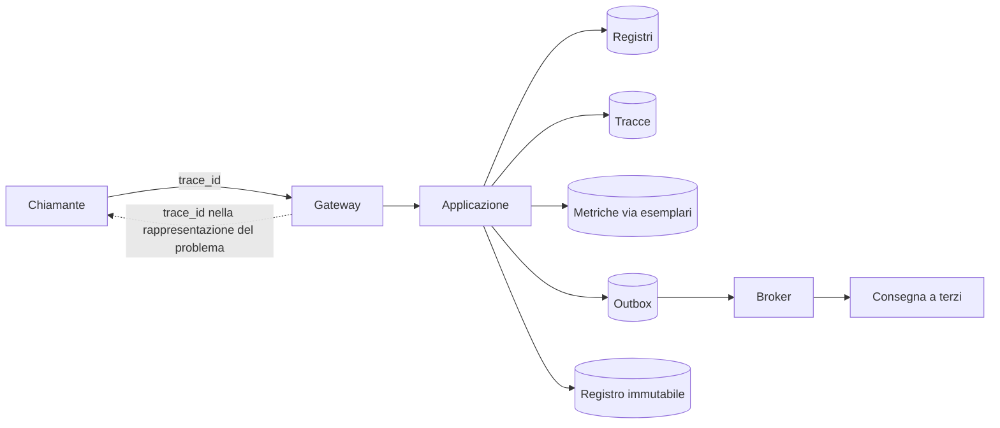
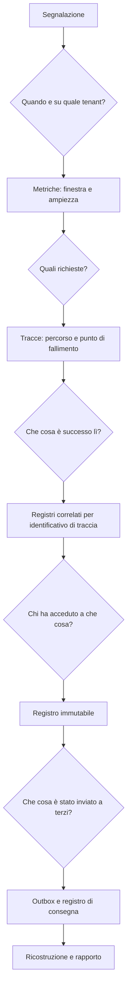

# Osservabilità

L'osservabilità di un sistema sanitario ha un vincolo che gli altri sistemi non hanno: **la
maggior parte delle informazioni che renderebbero facile la diagnosi non può essere
registrata**. Questo capitolo parte da lì, perché è il vincolo che determina tutto il resto. Poi
descrive che cosa si registra, come si correla e come si indaga quando qualcosa va storto.

I fondamenti dei tre segnali stanno in
[`docs/10_fondamenti/11-fondamenti-informatici.md`](../10_fondamenti/11-fondamenti-informatici.md)
§12 e non si ripetono.

---

## 1. Il vincolo, prima di tutto il resto

### 1.1 Che cosa non entra mai in un registro, in una metrica o in una traccia

L'elenco è tassativo e la sua violazione è un difetto, non un'imprecisione.

| Categoria | Esempi | Perché |
|---|---|---|
| **Contenuto clinico** | Testo del referto, anamnesi, valore di una misura, esito di una valutazione, motivo del consulto | Vincolo V-13 di `SEC`. Un registro di diagnostica è replicato, esportato, letto da personale operativo e conservato con criteri diversi da quelli del dato clinico |
| **Identificativi diretti dell'assistito** | Codice fiscale, nome, data di nascita, recapiti, identificativo del sistema di origine | Idem. Nei registri si usano pseudonimi per tenant (§1.2) |
| **Corpi di richiesta e di risposta** | Documento inviato, risorsa clinica ricevuta | Contengono per definizione entrambe le categorie precedenti |
| **Indirizzi con identificativi** | Percorsi che contengono un identificativo di assistito o di documento | Gli indirizzi finiscono nei registri di accesso, nei proxy, nelle intestazioni di provenienza e nella cronologia |
| **Credenziali e materiale di sicurezza** | Token, intestazioni di autorizzazione, segreti, chiavi, credenziali di relay | Ovvio, ed è la fuga più frequente perché arriva da una registrazione della richiesta scritta «per debug» |
| **Interrogazioni con parametri associati** | La forma dell'interrogazione con i valori sostituiti | La forma senza valori è utile alla diagnosi; con i valori è contenuto clinico |
| **Messaggi di eccezione non filtrati** | Testo di un'eccezione del livello di persistenza che riporta i valori del vincolo violato | È la via classica per cui un identificativo finisce in un registro senza che nessuno l'abbia scritto |
| **Metadati di sessione correlabili** | Coppia professionista–assistito in chiaro in una metrica o in una etichetta | Il solo fatto che due persone abbiano avuto un consulto è un dato relativo alla salute |

Il caso dei metadati merita una riga in più, perché è quello che sfugge. Il nodo di relay vede
indirizzi, volumi, temporizzazione e durata; il server di segnalazione vede chi si collega a
quale sessione e quando. Nessuno dei due vede contenuto, ma entrambi trattano dati personali in
ambito sanitario. **Registri minimizzati e conservazione breve non sono buone pratiche: sono
requisiti.**

### 1.2 Pseudonimizzazione

Ogni identificativo che deve comparire in un segnale di osservabilità compare come **pseudonimo
per tenant**, derivato in modo deterministico con una chiave che **non è disponibile ai sistemi di
osservabilità**. Ne discendono le due proprietà che servono:

- **correlazione possibile** — due righe che riguardano lo stesso soggetto sono riconoscibili come
  tali all'interno dello stesso tenant, il che è ciò che serve per indagare;
- **reidentificazione impossibile** senza un accesso deliberato al perimetro applicativo, che è
  esso stesso un'operazione tracciata nel registro immutabile.

La derivazione è **per tenant**: lo stesso soggetto in due tenant produce pseudonimi diversi, per
impedire correlazioni fra titolari del trattamento distinti.

### 1.3 La redazione è a due livelli, e il secondo è quello che salva

**Primo livello — non produrre.** Il codice non scrive ciò che non deve scrivere. È la difesa
corretta e va perseguita con revisioni e analisi statica.

**Secondo livello — non far passare.** Un filtro nel percorso di uscita dei registri riconosce e
oscura le forme note di dato sensibile prima della persistenza: strutture di codice fiscale,
strutture di identificativo di documento, intestazioni di autorizzazione, campi con nomi noti.
È una rete di sicurezza, non la difesa: un filtro basato su forme note non riconosce un testo
libero clinico. Ma intercetta la classe di incidenti più frequente, che è la registrazione
accidentale di un oggetto intero.

Il secondo livello è verificato da prove che tentano deliberatamente di far passare dati
sensibili e falliscono se ci riescono.

### 1.4 La diagnostica dettagliata è una procedura, non un livello di registro

Il livello di diagnostica dettagliata sui contesti clinici **non è attivabile modificando una
proprietà in produzione**. È una procedura con quattro condizioni: attivazione motivata e
approvata, **perimetro limitato** a un tenant e a un contesto, **scadenza automatica** dopo una
finestra breve, e **registrazione dell'attivazione nel registro immutabile**. Un livello di
diagnostica lasciato attivo su un contesto clinico è una fuga di dati continua che nessuno nota.

---

## 2. Registri

### 2.1 Forma

Strutturati, una riga per evento, formato leggibile da macchina. La forma testuale libera non è
correlabile e non è filtrabile.

Campi obbligatori su ogni riga:

```json
{
  "ts": "2026-11-30T09:14:22.481Z",
  "level": "WARN",
  "service": "telemedic-app",
  "version": "1.0.0+b1f4c2a",
  "env": "prod",
  "tenant": "t0007",
  "context": "media-session",
  "trace_id": "4bf92f3577b34da6a3ce929d0e0e4736",
  "span_id": "00f067aa0ba902b7",
  "event": "qualita.soglia.superata",
  "subject_ref": "psd_9f3c1a2b",
  "outcome": "avviso_emesso",
  "msg": "Soglia di inidoneità superata sulla dimensione continuità"
}
```

Tre scelte da notare. `event` è un **identificativo stabile**, non una frase: è ciò che consente
di cercare, contare e allertare senza dipendere dal testo, che cambia con le traduzioni e con le
riformulazioni. `subject_ref` è uno pseudonimo. `version` porta l'identificativo esatto della
costruzione, il che è ciò che permette di collegare un comportamento a un artefatto — requisito di
tracciabilità, oltre che comodità operativa.

### 2.2 Livelli di severità, con criteri operativi

I livelli sono inutili se ciascuno li usa a proprio giudizio. Questi sono i criteri.

| Livello | Criterio operativo | Conseguenza |
|---|---|---|
| `ERROR` | **Un essere umano deve fare qualcosa.** Un'operazione richiesta è fallita in modo non recuperabile automaticamente, o un invariante è stato violato | Concorre agli indicatori di allerta. Un `ERROR` per cui non esiste azione è un difetto di classificazione, e va corretto |
| `WARN` | Il sistema ha gestito una situazione anomala **in modo automatico**, ma la ricorrenza è un segnale | Non sveglia nessuno; alimenta le tendenze. Un ritentativo riuscito, una degradazione applicata, una soglia superata con avviso emesso |
| `INFO` | Fatto rilevante del ciclo di vita: avvio, arresto, migrazione applicata, configurazione caricata, sessione avviata o conclusa | Volume basso e prevedibile. Un `INFO` per richiesta è un `INFO` che nessuno leggerà |
| `DEBUG` | Dettaglio utile all'indagine | Vedi §1.4. Non attivo in esercizio ordinario |

**La regola che tiene in piedi il sistema**: un `ERROR` è **azionabile**. Se una condizione ricorre
regolarmente e non c'è niente da fare, non è un errore: è una caratteristica della realtà, e va
declassata e misurata. La proliferazione di errori non azionabili è il modo in cui un sistema di
allerta smette di essere letto, e un sistema di allerta che nessuno legge è peggio dell'assenza di
allerta, perché produce falsa rassicurazione — lo stesso ragionamento che il vincolo V-14 di
`GUIDA` applica alla copertura oraria dichiarata.

### 2.3 Conservazione

I termini per i dati di tracciabilità e per i dati di accesso e autenticazione sono fissati dal
vincolo V-15 di `SEC` e questa area li recepisce senza reinterpretarli. Per i registri di
diagnostica applicativa, che non sono né l'uno né l'altro, la conservazione è **breve e
dichiarata**, dimensionata sul tempo di indagine di un incidente e non oltre. Un registro
conservato più a lungo del necessario è un archivio di dati personali senza una base che lo
giustifichi.

---

## 3. Metriche

### 3.1 Le quattro famiglie

| Famiglia | Che cosa misura | Esempi |
|---|---|---|
| **Interfacce** | Tasso, errori, durata per rotta e per classe di operazione | Richieste al secondo, quota di errori per tipo di problema, distribuzione della durata |
| **Risorse** | Utilizzo, saturazione, errori dei componenti | Connessioni alla base dati in uso e **tempo di attesa per l'acquisizione**, profondità dell'outbox, ritardo di consumo, memoria |
| **Dominio** | Fatti del sistema, non della macchina | Sessioni avviate, sessioni concluse per esito, verifiche delle chiavi con esito negativo, allerte generate, allerte prese in carico, allerte **non** prese in carico entro la finestra |
| **Qualità del media** | Sintesi delle misure di sessione | Distribuzione dell'indice di qualità, quota di sessioni instradate dal relay, quota di sessioni con avviso di inidoneità |

La famiglia di dominio è quella che manca più spesso e che vale di più. «Il servizio risponde in
40 millisecondi» non dice se le allerte cliniche vengono prese in carico. Il vincolo V-09 —
l'assenza di dato è informazione — si traduce qui in una regola concreta: **si misurano gli
eventi attesi e non accaduti**, non solo quelli accaduti. Una misura attesa e non pervenuta, una
notifica non riscontrata, una sessione programmata e mai avviata sono metriche di prima classe.

### 3.2 Cardinalità

Le etichette con cardinalità illimitata distruggono un sistema di metriche. Regole:

- **Ammesse**: tenant, contesto, rotta come modello (non come percorso concreto), esito, tipo di
  problema, versione.
- **Vietate**: identificativo di sessione, identificativo di soggetto, pseudonimo, indirizzo di
  rete, testo di errore.
- Il dettaglio per singolo caso si ottiene con gli **esemplari**, che collegano un punto della
  distribuzione a una traccia, senza creare una serie per caso.

Il tenant come etichetta è ammesso, ma va sorvegliato: con centinaia di tenant e decine di
metriche, la moltiplicazione è reale. Le metriche di dominio portano il tenant; quelle di risorsa
no.

### 3.3 Denominazione

Prefisso di progetto, nome che descrive il fatto e non la sua realizzazione, unità nel nome,
suffisso coerente con la natura della metrica. Un nome che descrive la realizzazione — anziché il
fatto — diventa falso al primo cambio interno, e nessuno aggiorna i cruscotti.

---

## 4. Tracce

### 4.1 Propagazione

Contesto propagato secondo lo standard di tracciamento del consorzio del web, attraverso **tutti**
i confini: richieste in ingresso, chiamate uscenti, messaggi dell'outbox, messaggi di segnalazione,
lavori programmati. Il contesto attraversa la coda degli eventi come attributo della busta: senza
di esso, la catena si interrompe esattamente dove è più difficile indagare, cioè nell'asincrono.

Il vincolo tecnico dei thread virtuali si applica qui: la propagazione attraverso confini
asincroni non è automatica e va verificata da una prova. Una traccia interrotta è peggio di
nessuna traccia, perché induce a concludere che il flusso si sia fermato lì.

### 4.2 Campionamento

**Campionamento in coda**, non in testa, dove l'infrastruttura lo consente: si decide se
conservare la traccia **dopo** aver visto come è andata, il che significa conservare il cento per
cento delle tracce con errore e una frazione di quelle riuscite. È l'unica strategia che dia
utilità reale in un sistema a volume medio-basso e alta criticità come questo. Il campionamento in
testa a percentuale fissa, applicato a un sistema con pochi incidenti, li perde quasi tutti.

Regola aggiuntiva: **le tracce delle operazioni cliniche critiche non sono campionate**. Avvio e
chiusura di sessione, emissione di allerta, firma di documento, accesso d'emergenza. Sono poche e
valgono molto.

### 4.3 Attributi

Ammessi: rotta come modello, esito, tipo di problema, tenant, contesto, dimensione del risultato,
numero di ritentativi, nome del componente esterno interrogato.
Vietati: gli stessi della §1.1, senza eccezioni. **Gli attributi di traccia sono il punto in cui
il divieto si viola più spesso**, perché sembrano interni mentre finiscono in un sistema esterno.

---

## 5. Correlazione

Un identificativo di traccia collega tutto:



Il punto rilevante è il ritorno tratteggiato: **l'identificativo di traccia è restituito al
chiamante dentro la rappresentazione dell'errore** (vedi [`02-backend.md`](./02-backend.md) §7).
È ciò che rende possibile, quando un integratore segnala un problema, ritrovare la richiesta
esatta senza chiedergli dati che non deve mandarci.

Il registro immutabile porta l'identificativo di traccia **come attributo**, ma non dipende da
esso: è un sistema separato con un ciclo di vita proprio, e la sua integrità non può dipendere
dalla disponibilità del sistema di osservabilità.

---

## 6. La distinzione che non va confusa

| | Registro applicativo | Registro immutabile |
|---|---|---|
| Scopo | Diagnosi tecnica | Prova di chi ha fatto cosa |
| Destinatario | Chi opera il sistema | Chi indaga, chi vigila, l'interessato |
| Mutabilità | Ruota, si potano, si perdono | In sola aggiunta, a catena di impronte |
| Collocazione | Sistema di osservabilità | Archivio separato con credenziali proprie |
| Conservazione | Breve | Fissata dal vincolo V-15 di `SEC` |
| Contenuto | Nessun dato clinico, pseudonimi | Nessun dato clinico, pseudonimi, più livello di garanzia ed esito |
| Perdita | Fastidiosa | **Incidente** |

Sono due sistemi. Un evento di accesso a dato sanitario che finisse solo nel registro applicativo
sarebbe un requisito non soddisfatto; un evento tecnico che finisse nel registro immutabile ne
diluirebbe il valore probatorio.

---

## 7. Allertamento

### 7.1 Su che cosa si alletta

Non sulle risorse. Un'occupazione di memoria elevata non è un problema; una prestazione clinica
che non si può erogare lo è. Le allerte si costruiscono su **indicatori di servizio**, e le
famiglie sono quattro:

1. **Capacità di erogare**: quota di sessioni che non raggiungono lo stato attivo entro il limite
   dichiarato.
2. **Integrità del percorso clinico**: allerte generate e non prese in carico entro la finestra
   dichiarata; documenti firmati e non consegnati; misure attese e non pervenute oltre la soglia
   configurata.
3. **Integrità della tracciabilità**: verifica della catena del registro immutabile fallita.
   **Questa è la sola allerta a gravità massima incondizionata**: significa che il sistema non è
   più in grado di dimostrare ciò che è accaduto.
4. **Postura di sicurezza**: tentativi di autenticazione respinti oltre soglia, accessi
   d'emergenza, verifiche delle chiavi con esito negativo, configurazioni di sicurezza divergenti
   dal profilo di produzione.

### 7.2 Le regole

- **Un'allerta senza procedura di risposta non esiste.** Se non c'è un documento che dica che cosa
  fare, l'allerta va rimossa o la procedura va scritta. Non ci sono altre opzioni.
- **Un'allerta che non richiede intervento immediato non sveglia nessuno.** Diventa una voce di
  riesame periodico.
- **Le allerte si contano.** Il numero di allerte per turno è una metrica di salute del sistema di
  allerta stesso: oltre una soglia, il sistema non è più letto.
- **Le allerte cliniche non passano dal sistema di osservabilità.** Un'allerta su un parametro
  fuori soglia di un assistito è una funzione del prodotto, con destinatari, escalation e
  riscontro definiti nel dominio (contesto «notifiche e allarmi» della base architetturale §1).
  Confonderla con un'allerta operativa significherebbe farla dipendere dalla disponibilità di un
  sistema di monitoraggio tecnico. **Non deve.**

---

## 8. Indagine post-incidente

### 8.1 Che cosa è disponibile

La sequenza reale di un'indagine, con la sorgente per ogni passo:



### 8.2 Che cosa non è disponibile, e come ci si arrangia

**Il contenuto non è disponibile.** Per progetto. Quando l'indagine richiede di sapere che cosa
conteneva un documento, la strada è l'accesso deliberato al dato nel perimetro applicativo, con
autorizzazione, motivazione e **registrazione nel registro immutabile**. È lo stesso meccanismo
dell'accesso d'emergenza (vincolo V-16 di `SEC`): motivazione libera obbligatoria, perimetro e
finestra limitati, notifica, riesame con esito registrato.

**Questo rende alcune indagini più lente.** Va dichiarato invece di essere scoperto: è il prezzo
della minimizzazione, ed è un prezzo che si è scelto di pagare. Ciò che si può fare per ridurlo è
progettare i segnali perché siano **sufficienti a localizzare** il problema anche senza il
contenuto: identificativo dell'evento stabile, esito esplicito, punto del percorso, versione
dell'artefatto, e — dove serve — una **forma** del dato invece del dato: lunghezza, presenza,
struttura, esito della validazione. Sapere che un documento è stato rifiutato perché un elemento
obbligatorio era assente, e quale, non richiede di conoscerne il contenuto.

### 8.3 Il rapporto

Il rapporto di incidente è **senza colpa** e ha una struttura fissa: cronologia con istanti,
impatto misurato — quanti tenant, quanti assistiti, quali prestazioni compromesse —, causa
prossima, cause contribuenti, che cosa ha funzionato nel rilevare, che cosa no, azioni con
responsabile e scadenza.

Due innesti obbligatori, che non appartengono a questa area ma che questa area deve alimentare:

- **Vigilanza sui dispositivi.** Un incidente con conseguenze cliniche potenziali non è solo un
  incidente informatico. La valutazione della segnalabilità e i tempi sono di `COMP`; questa area
  fornisce l'evidenza tecnica in forma utilizzabile e nei tempi utili, il che significa che la
  ricostruzione deve essere possibile **entro ore, non entro settimane**.
- **Obblighi di segnalazione in materia di sicurezza informatica.** Idem: i termini sono
  soggettivi per ciascun utilizzatore (D39) e questa area fornisce i dati, non li interpreta.

Una conseguenza tecnica discende da entrambi: **la conservazione dei segnali di osservabilità
deve essere almeno pari al tempo entro cui una segnalazione può arrivare**. Se un incidente può
emergere trenta giorni dopo e i registri durano sette, la ricostruzione è impossibile. La
determinazione del termine è di `COMP`; il vincolo tecnico che ne discende è dichiarato qui.

---

## 9. Cruscotti

Tre, e non venti.

1. **Salute del servizio** — capacità di erogare, per tenant: sessioni avviate e loro esito,
   errori per tipo, latenze in coda, saturazione delle risorse critiche.
2. **Qualità del media** — distribuzione dell'indice, quota instradata dal relay, avvisi di
   inidoneità, motivi di limitazione prevalenti, con la possibilità di confrontare sessioni dirette
   e instradate **separatamente**, perché confrontarle insieme produce conclusioni errate.
3. **Integrità e sicurezza** — verifica della catena, accessi d'emergenza, esiti negativi della
   verifica delle chiavi, autenticazioni respinte, divergenze del profilo di produzione.

I cruscotti sono **versionati nel repository** insieme al codice che produce le metriche. Un
cruscotto costruito a mano nell'interfaccia dello strumento è un artefatto che nessuno può
ricreare e che si perde alla prima migrazione.

---

**Prosegue in**: [`07-prestazioni-e-capacita.md`](./07-prestazioni-e-capacita.md), dove le stesse
misure diventano bilanci, percentili e limiti dichiarati.
