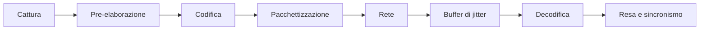

# Prestazioni e capacità

## 0. Avvertenza che vale per tutto il capitolo

**Nessuna soglia contenuta in questo documento è un requisito normativo.** Il vincolo V-12 è
esplicito: nessuna soglia tecnica in questo ambito è imposta dalla normativa italiana, e i valori
del progetto sono **specifica di prodotto**, mai conformità. Chi legge questo capitolo cercando
una tabella da citare in una dichiarazione di conformità sta cercando la cosa sbagliata nel posto
sbagliato.

Vanno tenute distinte tre categorie, e la confusione fra loro è l'errore che questo capitolo
esiste per evitare:

| Categoria | Che cos'è | Come si formula |
|---|---|---|
| **Obiettivo di servizio** | Un impegno che chi installa assume verso i propri utenti | «Il novantacinquesimo percentile della durata di ingresso in sessione è entro X» |
| **Limite dichiarato** | Un confine oltre il quale il prodotto non è progettato per funzionare | «Il modello è progettato per un ordine di grandezza di N tenant per installazione» |
| **Misura** | Un fatto osservato su un'installazione, con la sua data e le sue condizioni | «Su questo insieme di prove, con questo profilo, il valore osservato è stato Y» |

Il progetto produce **limiti dichiarati** e **capacità di misura**. Gli **obiettivi di servizio**
li fissa chi installa, perché dipendono dalla sua infrastruttura, dalla sua rete e dalla sua
organizzazione.

---

## 1. Che cosa si dichiara al posto di un numero

La comunicazione pubblica del progetto riporta un obiettivo di latenza espresso come cifra unica.
Quella cifra, così com'è, **non è verificabile**, e la ragione è che ammette almeno quattro
letture con ordini di grandezza diversi.

| Lettura | Che cosa misura | Ordine di grandezza fra due estremi nazionali su rete fissa |
|---|---|---|
| Tempo di andata e ritorno di rete | Il giro completo di un pacchetto | Decine di millisecondi |
| Latenza di rete in una direzione | Metà del precedente | Alcune decine di millisecondi |
| Latenza bocca-orecchio | Ciò di cui parlano le raccomandazioni sulla conversazione | Vedi §2 |
| **Latenza da obiettivo a schermo** | Dall'obiettivo della telecamera al pixel sullo schermo remoto | **È la sola che abbia significato clinico**, ed è la più alta |

Un obiettivo di duecento millisecondi sulla prima lettura è banalmente soddisfatto e comunicarlo
equivale a non dire nulla. Sulla quarta è un obiettivo serio e **non garantibile**.

**Formulazione adottata dal progetto**, che sostituisce la cifra secca:

> Telemedic mira a una latenza audio in una direzione entro la soglia che la raccomandazione
> internazionale sul tempo di trasmissione indica come accettabile per la maggior parte delle
> applicazioni interattive, e comunque entro la soglia oltre la quale la stessa raccomandazione
> considera la conversazione compromessa. In collegamento diretto su rete fissa nazionale, la
> latenza da obiettivo a schermo misurata si colloca tipicamente sotto la soglia dichiarata.
> Quando il traffico è instradato tramite relay, o quando l'instabilità della rete impone un
> buffer di jitter più ampio, il valore cresce: **il sistema misura la latenza di ogni sessione,
> la registra e ne informa il professionista al superamento delle soglie configurate**.

Questa versione è più lunga e più difendibile. Soprattutto, trasforma un numero indimostrabile in
una **capacità di misura**, che è una funzionalità vera e verificabile.

---

## 2. Bilancio di latenza del media

### 2.1 Gli stadi

Il ritardo da obiettivo a schermo è la somma di stadi indipendenti, e conoscerli è ciò che
permette di sapere dove intervenire.

| Stadio | Chi lo controlla | Nota |
|---|---|---|
| Cattura | Il dispositivo dell'utente | Le telecamere economiche stanno all'estremo alto. Fuori dal controllo del progetto |
| Pre-elaborazione | Il navigatore | Cancellazione dell'eco, soppressione del rumore e controllo del guadagno introducono ritardo algoritmico |
| Codifica | Il navigatore, l'hardware | L'accelerazione hardware è più rapida della codifica software e consuma meno batteria |
| Rete | La rete | **Il relay aggiunge una tratta**, e con essa un contributo |
| **Buffer di jitter** | Parzialmente il progetto | **È tipicamente il contributo maggiore** e cresce apposta quando la rete è instabile |
| Decodifica | Il navigatore | |
| Resa | Il dispositivo, la frequenza di aggiornamento | A trenta fotogrammi al secondo, un fotogramma è già un contributo misurabile |

`[NV]` - **i valori numerici di ciascuno stadio non sono riportati.** Il progetto non li ha
misurati, e riportare ordini di grandezza presi da altrove in un documento tecnico di un
dispositivo medico significa mettere in circolazione cifre che qualcuno citerà come proprie. La
misura si fa con la prova automatica descritta in
[`05-media-e-tempo-reale.md`](./05-media-e-tempo-reale.md) §9.1, e i risultati si pubblicano con
le condizioni in cui sono stati ottenuti.

### 2.2 La tensione che non si risolve

**Il buffer di jitter cresce apposta quando la rete peggiora**: sostituisce la latenza alla
perdita di pacchetti. È il meccanismo che rende ascoltabile una voce su una rete instabile.

Ne discende che **un obiettivo rigido di latenza è in tensione diretta con la qualità audio**.
Ridurre l'obiettivo del buffer - che è l'unica leva dell'applicazione su questo stadio - abbassa
la latenza **al costo di un aumento della perdita udibile sotto jitter elevato**.

Questa è una scelta clinica, non una impostazione tecnica, e va trattata come tale: esposta come
decisione motivata nel file di gestione del rischio, non nascosta in una costante. La
determinazione del compromesso è girata a `COMP` insieme alla preferenza di degrado.

### 2.3 Conclusioni oneste

- La latenza da obiettivo a schermo entro la soglia dichiarata **è raggiungibile** su rete fissa,
  con hardware decente, in collegamento diretto.
- **Non è garantibile**: dipende da telecamera, calcolo, schermo, rete e stato del buffer, cioè da
  fattori quasi tutti fuori dal controllo del progetto.
- **Attraverso il relay, e con buffer espanso per instabilità, superarla è normale e non indica un
  malfunzionamento.** Il sistema deve saperlo distinguere, altrimenti genera allerte su un
  comportamento corretto.
- Il jitter buffer, non la rete, è la leva dominante.

---

## 3. Bilancio di latenza applicativa

Per il percorso sincrono si adotta un **bilancio per stadio**, dichiarato e misurato, invece di
un obiettivo unico sull'estremo.

| Stadio | Che cosa accade | Perché è un bilancio a sé |
|---|---|---|
| Ingresso | Terminazione, instradamento | Costo fisso, indipendente dal caso d'uso |
| Autorizzazione | Validazione del token, risoluzione del tenant, decisione | **Cache con vita dichiarata sul materiale di verifica delle chiavi**: senza, ogni richiesta paga una risoluzione remota |
| Accesso ai dati | Acquisizione della connessione, transazione, interrogazioni | Comprende il **tempo di attesa per l'acquisizione della connessione**, che è il primo indicatore di saturazione ed è quello che nessuno guarda |
| Dominio | Decisione | Deve essere trascurabile: se non lo è, c'è dell'accesso ai dati nascosto nel dominio |
| Uscita | Serializzazione, compressione | Cresce con la dimensione del risultato: è il motivo per cui le proiezioni esplicite valgono più di un indice |

La regola operativa: **ogni stadio ha un bilancio, e un superamento si attribuisce a uno stadio,
non al sistema**. Un obiettivo unico sull'estremo dice che qualcosa è lento; un bilancio per
stadio dice che cosa.

**Le chiamate uscenti verso sistemi di terzi non stanno nel bilancio del percorso sincrono.** È
la regola R2 di [`02-backend.md`](./02-backend.md) §4.2: un'operazione che dipende da un sistema
esterno è asincrona, con esito osservabile, non un'attesa dentro una richiesta.

---

## 4. Percentili

### 4.1 La media non si pubblica

La media di una distribuzione di latenze con coda lunga descrive un caso che non capita a
nessuno. In un sistema in cui l'evento raro è quello che conta - il consulto che non parte, la
firma che non passa - la media è attivamente fuorviante.

Si pubblicano e si allertano: **mediana** (il caso tipico), **novantacinquesimo percentile**
(l'esperienza dell'utente sfortunato ordinario), **novantanovesimo** (la coda), **e il massimo
osservato nella finestra**, che è il solo modo di accorgersi di un valore anomalo che i percentili
lisciano.

### 4.2 L'amplificazione della coda

Se una richiesta ne genera N a valle e attende tutte, la probabilità che almeno una cada nella
coda cresce rapidamente con N. È la ragione tecnica per cui le pagine composte da molte chiamate
hanno una coda molto peggiore dei singoli servizi che le compongono, e per cui **si riduce N**
prima di ottimizzare i singoli.

Conseguenza di progetto: le schermate cliniche caricano ciò che serve alla prima interazione, non
tutto ciò che potrebbe servire.

### 4.3 Dove si misura

**Lato server e lato client, e i due numeri sono diversi.** Il server misura il proprio lavoro; il
client misura ciò che l'utente vive, che comprende la rete, la coda del navigatore, la resa. Su
rete mobile la differenza è sostanziale.

L'obiettivo dichiarato **è quello lato client**, perché è quello che descrive l'esperienza reale;
la diagnosi si fa su quello lato server. Pubblicare solo il secondo è il modo classico di avere
cruscotti verdi e utenti scontenti.

### 4.4 Aggregare percentili è sbagliato

I percentili non si mediano e non si sommano. La media di due novantacinquesimi percentili non è
il novantacinquesimo percentile dell'insieme. L'aggregazione corretta richiede strutture che
conservino la distribuzione, e il sistema di metriche va configurato di conseguenza. È un errore
frequente, silenzioso e che produce numeri sbagliati per anni.

---

## 5. Dimensionamento

### 5.1 Le unità di capacità

Il sistema non ha una sola grandezza di capacità: ne ha quattro, con colli di bottiglia diversi.

| Unità | Risorsa che si esaurisce per prima | Nota |
|---|---|---|
| **Sessione media concorrente** | Banda del nodo di relay, per la quota instradata | Il calcolo del relay è marginale: è limitato dall'ingresso e uscita |
| **Sessione di segnalazione concorrente** | Connessioni persistenti e memoria per sessione | Le sessioni sono longeve e per lo più inattive: è il caso d'uso dei thread virtuali |
| **Richiesta applicativa al secondo** | **Connessioni alla base dati**, non thread | Vedi §5.3 |
| **Misura e evento al secondo** | Scrittura sulle serie temporali e profondità dell'outbox | Il relay dell'outbox è il punto da sorvegliare |

### 5.2 Il relay

Il fattore è quello stabilito in [`05-media-e-tempo-reale.md`](./05-media-e-tempo-reale.md) §4.5:
per una sessione con una sola allocazione, il nodo movimenta quattro volte il bitrate per
direzione; con due allocazioni, otto volte.

Il dimensionamento si costruisce su tre parametri, **tutti da misurare e nessuno da assumere**:
il bitrate medio per direzione nel proprio parco installato, la quota di sessioni instradate, e il
picco di sessioni concorrenti. `[NV]` - nessuno dei tre è dichiarato qui, perché il progetto non
li ha misurati e le stime di terzi non sono citabili come proprie.

Ciò che si può affermare come regola: **il picco si dimensiona sul caso avverso, non sulla
media**, perché la quota instradata non è una costante del prodotto ma una proprietà del parco
reti dei clienti, e può variare di un ordine di grandezza fra un'installazione con utenza
domestica e una con utenza ospedaliera dietro traduzione di indirizzi di operatore.

### 5.3 Il collo di bottiglia che sposta il problema

Con i thread virtuali, il numero di richieste in volo non è più limitato dai thread. **Il limite
si sposta sul pool di connessioni alla base dati**, e il sintomo cambia natura: invece di
richieste rifiutate si osservano richieste accettate che attendono, con una coda invisibile e una
coda di latenza che si allunga.

Ne discendono tre regole:

1. **Si misura il tempo di attesa per l'acquisizione della connessione**, non solo il numero di
   connessioni attive. È il primo indicatore di saturazione ed è quello che manca nella maggior
   parte delle configurazioni.
2. **Ogni caso d'uso ha un limite di tempo**, e il limite comprende l'attesa per la connessione.
   Senza, una saturazione momentanea diventa un accumulo che non si riassorbe.
3. **Il pool si dimensiona sul lavoro reale**, che dipende dalla durata delle transazioni e non
   dal numero di utenti. Aumentarlo oltre la capacità della base dati sposta la coda, non la
   elimina - e la sposta in un punto dove costa di più.

### 5.4 Il moltiplicatore dei tenant

Nel modello a schema per tenant, alcune grandezze crescono con il numero di tenant e non con il
carico: oggetti nel catalogo della base dati, durata delle migrazioni, serie di metriche
etichettate per tenant, numero di configurazioni da caricare all'avvio. È il limite dichiarato di
[`03-persistenza.md`](./03-persistenza.md) §2.4 e va sorvegliato come grandezza a sé, con una
metrica dedicata.

---

## 6. Contropressione

### 6.1 Quattro livelli

| Livello | Meccanismo | Che cosa protegge |
|---|---|---|
| **Ingresso** | Limite di frequenza per tenant e per credenziale, con finestra e quota dichiarate nel contratto | Il sistema da un singolo chiamante |
| **Ammissione** | Semaforo per classe di operazione, con posti dichiarati | Le operazioni critiche dalle operazioni voluminose |
| **Coda** | Coda **limitata**, con rifiuto dichiarato quando è piena | Il sistema dall'accumulo |
| **Uscita** | Limite di tempo, interruttore di circuito e ritentativi con attesa esponenziale e jitter per ogni dipendenza esterna | Il sistema dalla lentezza altrui |

### 6.2 Le regole

**Il rifiuto è una risposta corretta; l'attesa indefinita no.** Un rifiuto esplicito, con
indicazione di quando riprovare, permette al chiamante di comportarsi bene. Un'attesa senza fine
produce ritentativi che moltiplicano il carico proprio quando il sistema è già in difficoltà.

**Le classi di operazione non sono uguali.** L'ingresso in una sessione clinica, l'emissione di
un'allerta e la firma di un documento non competono con l'esportazione di un elenco o con la
reindicizzazione di un archivio. La separazione dei posti di ammissione è ciò che impedisce a un
lavoro voluminoso di far fallire un consulto.

**Il degrado ha un ordine dichiarato**, e la prima riga non è negoziabile:

1. **Non si sacrificano mai**: registrazione degli accessi nel registro immutabile, verifica delle
   chiavi, avviso di qualità inadeguata, emissione e recapito delle allerte cliniche, raccolta del
   consenso. Se non si possono garantire, **il sistema rifiuta di erogare la prestazione** invece
   di erogarla senza di esse. Un dispositivo che degrada silenziosamente i propri controlli di
   sicurezza è più pericoloso di un dispositivo indisponibile.
2. Si sacrificano per primi: elaborazioni differibili, esportazioni, ricostruzioni di proiezioni,
   reportistica.
3. Poi: funzioni accessorie della sessione - condivisione di documenti, chat - mantenendo audio e
   video.
4. Poi: il video, mantenendo l'audio. È la base architetturale §9.

**Il ritardo si dichiara al chiamante**, non si nasconde. Un evento consegnato con ritardo è
diverso da un evento perso, e il ricevente deve poterlo distinguere: la busta porta l'istante di
produzione, non solo quello di consegna.

---

## 7. Limiti dichiarati

Riepilogo trasversale. Ogni riga è un confine di progetto, non una promessa.

| # | Limite | Natura | Stato |
|---|---|---|---|
| L1 | Partecipanti a una sessione media | Topologia a maglia senza componente centrale | Da dichiarare; decisione aperta ad `ARCH` |
| L2 | Latenza da obiettivo a schermo | Non garantibile, misurata e dichiarata per sessione | Definito |
| L3 | Tenant per installazione nel modello a schema | Crescita del catalogo della base dati | `[NV]` da misurare; ordine di grandezza: centinaia |
| L4 | Latenza di consegna degli eventi | Pari all'intervallo di interrogazione del relay dell'outbox | Configurabile, dichiarato nel contratto |
| L5 | Ordinamento degli eventi | **Condizionato** all'interno della partizione scelta per chiave, mai globale | Base architetturale §5. Le tre condizioni alle quali l'ordine per chiave vale, e la dichiarazione che fuori da esse non vale, sono in [`02_architecture/06`](../02_architecture/06-eventi-e-integrazione-interna.md#41-ciò-che-si-garantisce-e-ciò-che-non-si-garantisce) §4.1. Nessun requisito funzionale può dipendere da un ordine globale |
| L6 | Semantica di consegna | **Almeno una volta**; i consumatori sono idempotenti per costruzione | Base architetturale §5 |
| L7 | Ripristino a un istante preciso | Granularità pari alla frequenza di archiviazione del registro delle transazioni | Configurabile da chi installa |
| L8 | Modalità fuori linea per contenuto clinico | **Assente per scelta** | Dichiarato in [`04-frontend.md`](./04-frontend.md) §4.4 |
| L9 | Cifratura fino agli estremi con registrazione attiva | **Non sussiste** | Dichiarato nel consenso e nell'interfaccia |
| L10 | Misura automatica della latenza da obiettivo a schermo | Su un solo motore di navigazione | Vincolo della suite di prove |
| L11 | Rotazione delle chiavi durante la sessione | **Non esiste** nella tecnologia | Non rivendicata |
| L12 | Sottotitoli in tempo reale | Non conformità dichiarata, con misura alternativa | D24 |

Un limite dichiarato è una funzionalità del prodotto. Un limite scoperto in esercizio è un
incidente.

---

## 8. Prove di capacità

### 8.1 Che cosa si prova

Quattro campagne distinte, perché i colli di bottiglia sono diversi.

| Campagna | Oggetto | Strumento |
|---|---|---|
| **Carico applicativo** | Percorsi sincroni sotto profilo di traffico realistico | Strumento di carico HTTP |
| **Carico di ingestione** | Misure e questionari in volume, profondità dell'outbox, ritardo di consegna | Generatore proprio |
| **Carico media** | Sessioni concorrenti, occupazione del relay, comportamento sotto degradazione | **Non copribile con uno strumento HTTP**: serve un'attrezzatura dedicata con estremi sintetici |
| **Resistenza prolungata** | Perdite di memoria, crescita di code, degrado degli indici, accumulo di partizioni | Esecuzione lunga con osservazione continua |

La terza riga è quella che si sottovaluta sempre: gli strumenti di carico HTTP non generano
traffico di sessione media, e provare la parte applicativa non dice nulla sulla capacità del
nodo di relay.

### 8.2 Le regole

- **Solo dati sintetici.** Vincolo trasversale della base architetturale §11.2, senza eccezioni,
  incluse le prove di carico, che sono il luogo in cui la tentazione di usare un'esportazione
  dell'esercizio è più forte.
- **Il profilo di traffico è dichiarato** e deriva dal comportamento reale atteso - concentrazione
  degli appuntamenti in fasce orarie, non distribuzione uniforme. Un carico uniforme prova un
  sistema che non esiste.
- **Si misura anche la degradazione**, non solo il punto di rottura: come si comporta il sistema
  al novanta per cento della capacità è più utile di sapere dove si rompe.
- **I risultati si pubblicano con le condizioni**: hardware, versione, profilo, insieme di dati,
  data. Un numero senza condizioni non è un risultato.

---

**Prosegue in**: [`08-qualita-e-test.md`](./08-qualita-e-test.md), dove queste campagne trovano
il loro posto nella piramide complessiva delle prove.
