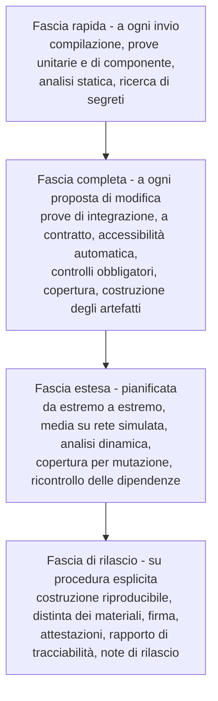

# Integrazione continua e rilascio

La catena di costruzione non è un servizio di supporto allo sviluppo: è **parte del dispositivo**.
IEC 62304 non verifica soltanto il codice, verifica il processo che lo produce; D17 richiede una
distribuzione prodotta da **costruzione riproducibile** e sottoposta a controllo qualità; D45
stabilisce che la distinta dei materiali va generata **dalla prima pipeline**, perché censire i
componenti a posteriori costa diverse volte tanto.

Questo capitolo descrive la struttura tecnica. Gli impegni formali - periodo di supporto,
notifica degli incidenti, sorveglianza - appartengono a `docs/08_compliance/` e sono qui
richiamati per la parte che si realizza in pipeline.

---

## 1. I due cicli di vita, prima di tutto il resto

D17 stabilisce una distinzione che ha effetti su ogni riga di questo capitolo:

| | Repository | Distribuzione |
|---|---|---|
| Che cos'è | **Codice sorgente sotto licenza permissiva. Non è un dispositivo medico**, e lo dichiara | **Artefatto identificato**, prodotto da costruzione riproducibile, con controllo qualità |
| Nome | Il nome del progetto | Nome distinto |
| Versione | Semantica, sul codice | Numerazione propria, con il proprio ciclo di vita |
| Chi risponde | Nessuno, ai sensi della licenza | Il fabbricante, con il proprio responsabile della conformità |
| Marcatura | **Nessuna** | Quella di chi immette sul mercato |

**I due artefatti hanno nomi, numeri di versione e cicli di vita distinti.** La pipeline riflette
la distinzione: produce artefatti del repository in continuazione e artefatti di distribuzione
solo su una procedura esplicita, con controlli aggiuntivi.

Fino a quando la marcatura non esiste, ogni artefatto distribuito dichiara esplicitamente che non
è marcato e non è utilizzabile per l'erogazione di prestazioni sanitarie su pazienti reali (D16).
**È un controllo di pipeline**: un artefatto privo della dichiarazione non viene pubblicato.

---

## 2. Struttura della pipeline

Quattro fasce, con criteri di appartenenza chiari.

Il criterio di collocazione è il tempo: la fascia rapida sta in pochi minuti, perché altrimenti
smette di essere eseguita a ogni invio; la fascia completa sta entro il tempo di attenzione di
chi ha proposto la modifica. Ciò che non ci sta scende di fascia - **tranne i controlli
obbligatori del §3, che restano nella fascia completa a prescindere dal costo**, perché sono
condizioni di ammissibilità e non verifiche di qualità.

---

## 3. I controlli obbligatori

Un controllo obbligatorio **blocca**. Non produce un avviso, non apre un'attività, non finisce in
un rapporto che qualcuno leggerà: impedisce l'integrazione. Un controllo che si può ignorare non
è un controllo.

| # | Controllo | Blocca su |
|---|---|---|
| G1 | **Segreti** | Qualunque credenziale, chiave o token nei sorgenti **o nella cronologia** |
| G2 | **Licenze** | Dipendenza con licenza non compatibile con quella del progetto, o senza licenza determinabile |
| G3 | **Terminologie** | Contenuto di sistemi di codifica a licenza vincolata. Vedi §4 |
| G4 | **Accessibilità** | Violazione delle regole automatizzabili su qualunque schermata o stato |
| G5 | **Distinta dei materiali** | Componente presente nella distinta e assente dalle annotazioni del registro |
| G6 | **Compatibilità di contratto** | Modifica non additiva a un elemento del perimetro contrattuale senza nuova versione maggiore |
| G7 | **Copertura** | Sotto la soglia dell'ambito, secondo la tabella differenziata |
| G8 | **Divergenza linguistica** | Documento italiano modificato senza il corrispondente inglese |
| G9 | **Riferimenti interni** | Collegamento interno rotto - **bloccante prima del primo rilascio del sito**, secondo D52 |
| G10 | **Dati non sintetici** | Forme riconoscibili di identificativo reale nei sorgenti, nelle fixture e negli esempi |
| G11 | **Regola di riservatezza** | Nomi di aziende, marchi, prodotti commerciali o domini nell'elenco vietato |
| G12 | **Profilo di esercizio** | Configurazione dell'immagine che attiva una scorciatoia di sviluppo |
| G13 | **Regole di dipendenza** | Violazione delle regole di §1 di [`02-backend.md`](./02-backend.md) e §2.1 di [`04-frontend.md`](./04-frontend.md) |

Tre note che valgono più della tabella.

**G1 controlla la cronologia, non solo lo stato corrente.** Un segreto rimosso con una modifica
successiva resta nella cronologia di un repository pubblico, ed è lì che viene trovato. La
conseguenza operativa è che il rilevamento non basta: serve la **rotazione** del segreto esposto,
ed è una procedura documentata, non una decisione del momento.

**G8 è la misura tecnica che governa il rischio reale di D50.** La divergenza fra le due versioni
non è un rischio di traduzione: è un rischio di **contenuto normativo diverso in due lingue**, che
in un dispositivo medico è un difetto documentale.

**G11 è la traduzione automatizzata della regola R0.** È una lista di termini vietati, versionata,
con procedura di aggiornamento. Non copre tutto - un controllo automatico non sostituisce la
revisione - ma copre il caso in cui un nome finisce in un commento o in un file di configurazione
di esempio.

---

## 4. Il controllo sulle terminologie

Merita una sezione propria perché è il controllo più specifico di questo progetto e il più
frainteso.

**Il problema.** D32 stabilisce che la licenza di alcuni sistemi di codifica clinica si perfeziona
**scaricando o accedendo** al contenuto: se il progetto non lo scarica mai, non ne è mai
vincolato. La clausola di riservatezza di quelle licenze è inoltre **incompatibile con un
repository pubblico**, e la catena di sub-licenza è incompatibile per costruzione con la licenza
del progetto.

**Il meccanismo.** Un controllo di pipeline con **lista di ammissione versionata**:

- cerca, in tutto il repository, la presenza di identificatori di sistema, di forme note di codice
  e di contenuti riconducibili ai sistemi in regime di esclusione (D31, regime D) o di
  acquisizione a carico di chi installa (regime C);
- **ammette** l'identificatore di sistema e il codice nudo - che sono identificatori, non
  contenuto - quando l'ammissione è esplicita nella lista;
- **blocca** qualunque cosa somigli a una denominazione, una gerarchia, una relazione o un insieme
  di valori espanso;
- **blocca** l'aggiunta di una dipendenza che scarichi contenuto in fase di costruzione.

**La lista di ammissione è versionata e la sua modifica richiede la revisione prevista per il
materiale di conformità.** Non è un file che si aggiorna per far passare la propria modifica.

**Il complemento a runtime.** Il controllo di pipeline protegge il repository; il gateway delle
terminologie protegge l'esercizio, con la disattivazione per sistema di codifica, l'assenza di
cache persistita su disco (vincolo [V-151](../11_registri/01-vincoli-in-vigore.md#v-151) di `SEC`) e la modalità degradata che rende vero il
vincolo [V-03](../11_registri/01-vincoli-in-vigore.md#v-03). Le prove girano nella configurazione senza sistemi a licenza vincolata, che è ciò
che rende quella modalità realmente funzionante (vedi
[`08-qualita-e-test.md`](./08-qualita-e-test.md) §4.3).

**Le due avvertenze che il progetto deve documentare senza attenuanti** - l'interrogazione di un
servizio esterno non esonera chi installa, e chi distribuisce Telemedic distribuisce un prodotto
soggetto alla licenza anche senza contenere un solo concetto - sono di competenza di `COMP` e
vanno nel materiale per l'integratore, non nascoste in una nota tecnica.

---

## 5. Versionamento

### 5.1 I livelli

| Che cosa | Schema | Regola |
|---|---|---|
| **Codice del repository** | Versionamento semantico | Il maggiore cambia su rottura di un elemento del perimetro contrattuale |
| **Interfaccia applicativa** | Versione maggiore nel percorso, più una versione datata opzionale per le aggiunte | Un cliente resta fissato alla versione della prima chiamata: **non subisce mai un cambiamento che non ha chiesto** |
| **Interfaccia di interoperabilità** | **Non si versiona con un numero di progetto**: si dichiara la versione dello standard nel documento di capacità e nel tipo di contenuto | Un eventuale supporto a una versione successiva affiancata userebbe percorsi base distinti |
| **Schemi degli eventi** | Versione nel nome del tipo | Un consumatore dichiara i tipi che comprende |
| **Profili clinici** | Fissati per versione come artefatto di costruzione | Un cambiamento a monte non può cambiare l'esito di una validazione già eseguita |
| **Distribuzione** | Numerazione propria | Vedi §1 |

### 5.2 Dismissione

La policy è dichiarata nel contratto pubblico: annuncio con anticipo di **dodici mesi** sulla
dismissione di una versione maggiore, intestazioni standard di dismissione e di termine, collegamento
alla guida di migrazione, almeno due versioni maggiori attive contemporaneamente, e telemetria
d'uso per versione - perché senza sapere chi usa ancora la versione vecchia non si può contattare
nessuno.

Lo stato normativo di una delle due intestazioni `[NV]` va verificato dall'`PROTO` prima
di citarla come standard: una è definita da una specifica pubblicata, l'altra è oggetto di lavoro in corso.

### 5.3 Identificativo di costruzione

Ogni artefatto porta un identificativo che comprende la versione, l'identificativo esatto della
revisione del codice e l'istante di costruzione normalizzato. È esposto dall'applicazione, compare
in ogni riga di registro (vedi [`06-osservabilita.md`](./06-osservabilita.md) §2.1) e compare
nelle attestazioni. È ciò che collega un comportamento osservato a un artefatto preciso, che è la
prima domanda di ogni indagine.

---

## 6. Costruzione riproducibile

### 6.1 Che cosa significa

Che due costruzioni della stessa revisione, su macchine diverse e in momenti diversi, producano
artefatti **identici byte per byte**. Non è un esercizio: è ciò che consente a un terzo - un
verificatore, un integratore, un organismo - di **verificare che l'artefatto distribuito
corrisponda al sorgente pubblicato**. Senza, la separazione fra repository e distribuzione di §1
è un'affermazione non verificabile.

### 6.2 Come si ottiene

- **Versioni esatte, mai intervalli.** Ogni dipendenza, diretta e transitiva, è fissata da un file
  di blocco versionato nel repository.
- **Istanti normalizzati.** La marcatura temporale degli archivi deriva dalla revisione, non
  dall'orologio della macchina.
- **Ordinamento deterministico** delle voci degli archivi.
- **Ambiente di costruzione dichiarato come artefatto**: immagine di base fissata per impronta, non
  per etichetta mobile. Un'etichetta mobile rende la costruzione non riproducibile per
  costruzione.
- **Nessun contenuto scaricato durante la costruzione** che non sia fissato e verificato per
  impronta.

### 6.3 Come si verifica

Un lavoro pianificato ricostruisce l'ultima distribuzione su un esecutore diverso e **confronta le
impronte**. Una divergenza è un difetto della catena di costruzione, e va indagata come tale. La
verifica è essa stessa un artefatto, con il proprio esito conservato.

---

## 7. Artefatti firmati e provenienza

### 7.1 Che cosa si firma

Tutto ciò che esce: immagini dei contenitori, archivi distribuibili, pacchetti dell'interfaccia,
distinte dei materiali, rapporti di tracciabilità, note di rilascio.

Firma **con chiavi che non risiedono nella pipeline**: il materiale di firma è custodito in un
servizio dedicato e l'operazione di firma è tracciata. Una chiave di firma disponibile come
variabile d'ambiente in un esecutore è una chiave compromessa.

### 7.2 Provenienza e attestazioni

Oltre alla firma, ogni artefatto porta un'**attestazione di provenienza**: quale sorgente, quale
revisione, quale definizione di pipeline, quale esecutore, quali ingressi. È ciò che permette a un
integratore di rispondere alla domanda «da dove viene questo artefatto» senza fidarsi di
un'affermazione.

Attestazioni prodotte a ogni rilascio:

| Attestazione | Contenuto |
|---|---|
| Provenienza | Sorgente, revisione, definizione della pipeline, ingressi |
| Distinta dei materiali | Vedi §8 |
| Esito delle prove | Quali suite, con quale esito, su quale revisione |
| Tracciabilità | Requisito → prove, requisiti scoperti, controlli di rischio → prove |
| Riproducibilità | Esito dell'ultima verifica di ricostruzione |
| Conformità del profilo | Verifica che l'immagine non attivi scorciatoie di sviluppo |

### 7.3 Verifica a cura di chi installa

La verifica è **documentata come procedura eseguibile** nel manuale di installazione, con i
comandi. Un artefatto firmato che nessuno verifica non aggiunge sicurezza: aggiunge una
dichiarazione.

---

## 8. Distinta dei materiali

**Generata a ogni costruzione**, in un formato standard leggibile da macchina, per **ogni**
artefatto - servizio, interfaccia, immagini, chart - e non solo per il servizio principale. Le
immagini di base contengono componenti di sistema che sono componenti di terze parti a tutti gli
effetti, e una distinta che li ignora è incompleta.

Contenuto minimo: identificativo, versione esatta, licenza, impronta, relazione di dipendenza
(diretta o transitiva). Il collegamento con il registro dei componenti di terze parti descritto in
[`01-stack-e-motivazioni.md`](./01-stack-e-motivazioni.md) §14 avviene per identificativo, ed è il
controllo G5: **un componente nella distinta e assente dalle annotazioni fa fallire la
costruzione**. È il meccanismo che impedisce a una dipendenza di entrare senza essere stata
valutata.

### Il registro dei componenti, generato dalla distinta

La distinta dice che cosa è entrato nell'artefatto; le annotazioni versionate dicono che cosa il
progetto ha valutato di ciascun componente. **Il registro dei componenti di terze parti è la loro
giunzione**, generato a ogni costruzione da
[`scripts/genera-registro-componenti.py`](https://github.com/fedcal/Telemedic/blob/main/scripts/genera-registro-componenti.py),
e non si scrive a mano: una modifica manuale si perderebbe alla costruzione successiva.

La distinzione fra i tre oggetti non è terminologica, ed è la ragione per cui il registro esiste
come artefatto proprio. Il registro è l'unico dei tre che risponda alla domanda che chi installa
pone davvero: **che cosa sto installando, con quale licenza, e chi ce l'ha messo.** Quest'ultima
parte è la meno ovvia e la più utile: su milleduecentotrentasei componenti del sito di
documentazione, **nove** sono dipendenze scelte dal progetto e **milleduecentoventisette** sono
transitive, tirate da quelle. Il registro dichiara per ciascuna transitiva **chi la tira**, perché
una dipendenza che nessuno ha scelto va comunque valutata da qualcuno, e sapere da dove entra è il
primo passo per deciderne il destino.

Il registro esce in due forme, e la ragione della seconda è che milleduecento righe di tabella non
si leggono: un file separato da tabulazione con l'elenco **completo**, una riga per componente, che
accompagna la distribuzione ed è l'oggetto su cui si fanno le domande automatiche; e un documento
leggibile che porta gli aggregati per licenza, le dipendenze dirette per intero con il motivo di
inclusione scritto da una persona, e **per intero ogni componente la cui compatibilità non è
accertata** - che è la parte per cui il registro esiste, e che in un elenco di milleduecento righe
sparirebbe.

Il generatore **riporta e non giudica**: la compatibilità viene dalle annotazioni, che a loro volta
la derivano dall'identificativo di licenza dichiarato e non dal testo della licenza. Ciò che non è
nell'elenco di riferimento esce «indeterminabile» e resta indeterminabile nel registro, in
evidenza. Un generatore che indovinasse produrrebbe un registro rassicurante e falso.

### Pubblicazione

La distinta è **pubblicata** insieme all'artefatto. Serve a chi installa per rispondere ai propri
obblighi - fra cui la dichiarazione dei fornitori rilevanti prevista da D40, per la quale il
progetto fornisce la scheda con i dati che il cliente è tenuto a comunicare - e serve al progetto
per correlare un avviso di sicurezza a un artefatto rilasciato in pochi minuti invece che in
giorni.

---

## 9. Ambienti e promozione

| Ambiente | Scopo | Dati | Promozione |
|---|---|---|---|
| Sviluppo | Lavoro quotidiano | Sintetici generati | Automatica |
| Integrazione | Fascia completa | Sintetici generati | Automatica |
| Collaudo | Fascia estesa, verifica manuale di accessibilità, verifica a cura di chi installa | **Sintetici. Mai esportazioni di produzione** | Automatica dalla revisione principale |
| Esercizio | Erogazione | Reali | **Manuale, con approvazione registrata** |

**Si promuove l'artefatto, non si ricostruisce.** Ciò che è stato provato in collaudo è
esattamente ciò che va in esercizio, byte per byte. Ricostruire per l'ambiente successivo
significa mettere in esercizio un artefatto che nessuno ha provato.

La riga «mai esportazioni di produzione» è la stessa regola di
[`08-qualita-e-test.md`](./08-qualita-e-test.md) §4.1 e va ripetuta qui perché è in questa fase
che viene violata.

---

## 10. Rilascio

### 10.1 La procedura

1. Congelamento della revisione e apertura del ramo di rilascio.
2. Esecuzione della fascia di rilascio completa.
3. Produzione degli artefatti, delle attestazioni e del rapporto di tracciabilità.
4. **Riesame documentale**: note di rilascio, elenco delle modifiche con impatto clinico o di
   sicurezza, aggiornamento del registro dei componenti di terze parti, verifica che la
   dichiarazione di non marcatura sia presente.
5. Firma, pubblicazione, marcatura della revisione.
6. Registrazione dell'approvazione con responsabile e data.

Il passo 4 è quello che si salta quando si va di fretta, ed è quello che rende il rilascio
tracciabile. In regime di controllo dei documenti (D45) **ciò che nasce fuori controllo va
riemesso**, il che costa più che farlo bene la prima volta.

### 10.2 Note di rilascio

Non un elenco di modifiche generato dai messaggi di revisione. Struttura fissa: modifiche con
impatto clinico o di sicurezza in testa e con evidenza; correzioni di vulnerabilità con la
gravità e il componente; modifiche al perimetro contrattuale con la versione; azioni richieste al
chi installa; limiti noti; componenti di terze parti aggiornati.

### 10.3 Ritorno a una versione precedente

È una procedura documentata e **provata**, non un'ipotesi. Il vincolo che la rende possibile è la
regola di espansione e contrazione di [`03-persistenza.md`](./03-persistenza.md) §3.1: due
versioni consecutive devono poter convivere sulla stessa base dati. Una migrazione che rompe
quella proprietà rende il ritorno impossibile, e va trattata come un cambiamento ad alto rischio
con un piano dedicato.

---

## 11. Periodo di supporto

### 11.1 Che cosa è

Il regolamento sulla resilienza informatica, che D27 stabilisce di adottare integralmente senza
invocare esenzioni, richiede un **periodo di supporto dichiarato** con obblighi di aggiornamento
per la sua durata. D41 aggiunge la precisazione che l'esclusione è **per prodotto e non per
progetto**: gli artefatti non coperti dalla marcatura ricadono comunque nel regolamento, il che
riguarda direttamente i kit di sviluppo, il componente incorporabile, le immagini e i chart.

**La durata del periodo e l'impegno formale non sono di questa area**: sono una dichiarazione del
fabbricante e appartengono a `COMP`. Questa area descrive **che cosa il supporto comprende sul
piano tecnico** e come si realizza in pipeline.

### 11.2 Che cosa comprende

| Elemento | Contenuto |
|---|---|
| Correzioni di sicurezza | Sul ramo supportato, con livello di servizio differenziato per gravità |
| Aggiornamento dei componenti di terze parti | Secondo il livello di servizio del registro |
| Avvisi di sicurezza | Pubblicati con la vulnerabilità, l'impatto, la versione corretta e la mitigazione |
| Distinta dei materiali aggiornata | Per ogni versione supportata |
| Guida di migrazione | Verso la versione supportata successiva |

**Il livello di servizio si esprime in giorni dalla pubblicazione dell'avviso, per gravità, e si
misura.** Un impegno espresso in mesi è privo di significato per componenti con la cadenza di
rilascio osservata sul nodo di relay - quattordici versioni in poco più di sette mesi, cinque nel
solo mese di agosto. La proposta tecnica è aperta in bacheca a `COMP` e `ROAD` per la
formalizzazione.

### 11.3 Fine del supporto

Annunciata con anticipo dichiarato, con la data, la versione successiva supportata e il percorso
di migrazione. **Il progetto non rimuove gli artefatti pubblicati** al termine del supporto: li
marca come non supportati. Rimuoverli renderebbe impossibile a chi installa ricostruire un
ambiente per un'indagine su un incidente avvenuto quando erano in uso - che è precisamente ciò che
la vigilanza richiede di poter fare.

---

## 12. Che cosa la pipeline non fa

- **Non sostituisce la revisione umana.** I controlli obbligatori sono condizioni di
  ammissibilità, non un giudizio di qualità. Il codice di sicurezza critico ha in più una revisione
  esterna indipendente (D18).
- **Non decide sulle licenze.** G2 blocca su un elenco; la determinazione di compatibilità è una
  valutazione legale, non una regola di configurazione. D34 lo dice in modo definitivo: una
  dichiarazione permissiva apposta su un contenitore **non dispone dei diritti di terzi** sul
  contenuto ricompreso, e la verifica va fatta artefatto per artefatto sulla licenza primaria.
- **Non produce la marcatura.** Produce il materiale per il nostro percorso di valutazione della conformità (D49), con i due cicli di vita di §1 tenuti distinti.
- **Non conserva dati reali**, in nessun ambiente e in nessuna fase.

---

**Torna a**: [`00-indice.md`](./00-indice.md).
