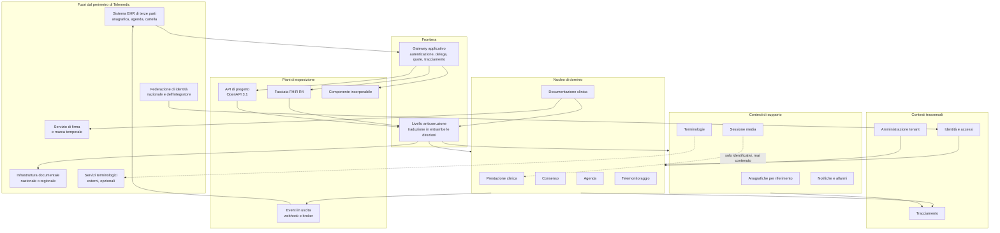

# Visione architetturale

## 1. Che cosa deve reggere questa architettura

Telemedic è un **componente di telemedicina destinato a vivere dentro il sistema informativo di
qualcun altro**. Non è un portale, non è una cartella clinica, non è il punto di ingresso
dell'utente e non è il detentore dell'anagrafica. È il pezzo che manca a un gestionale sanitario,
a una struttura pubblica o a un'infrastruttura regionale quando la prestazione va erogata a
distanza - e che deve inserirsi senza chiedere a nessuno di cambiare ciò che ha già.

Questa frase, e non lo stack tecnologico, è ciò che determina l'architettura. Da essa discendono
tre conseguenze che nessuna scelta successiva può contraddire.

**Prima conseguenza: il sistema non possiede l'identità.** L'essere umano davanti allo schermo è
stato autenticato altrove, dal fornitore di identità dell'integratore o dalla federazione
nazionale. Telemedic riceve un'asserzione e la trasforma in un contesto autorizzativo proprio;
non emette credenziali primarie e non impone un secondo accesso. L'architettura di identità è
quindi un problema di **propagazione fidata** e di **rappresentazione della delega**, non di
gestione di utenti.

**Seconda conseguenza: il sistema non possiede il dato anagrafico.** Il paziente, il
professionista e l'appuntamento esistono già nel sistema di origine. Telemedic lavora per
riferimento, con identificatori esterni qualificati dal proprio dominio di attribuzione, e non
costruisce un indice di riconciliazione delle identità. Ne discende un modello dati in cui
**nessun identificatore esterno è chiave primaria** e in cui la stessa persona fisica è entità
distinta in tenant distinti.

**Terza conseguenza: il contenuto clinico deve tornare indietro.** Il referto redatto durante la
prestazione non può restare confinato: deve confluire nella cartella del sistema di origine e,
dove previsto e consentito, nell'infrastruttura documentale nazionale o regionale. La
restituzione è quindi un **processo di dominio con esito osservabile**, non un dettaglio di
infrastruttura da nascondere in un adattatore.

A queste tre si aggiunge una quarta forza, di natura diversa: il sistema tratta **dati relativi
alla salute** e opera in un perimetro in cui la dimostrabilità conta quanto la funzione. Non
basta che un accesso sia lecito: deve essere dimostrabile a distanza di anni, davanti a qualcuno
che non si fida della parola dell'operatore. Non basta che un documento sia corretto: deve
essere immodificabile una volta firmato, e la sua eventuale correzione deve lasciare traccia
della versione superata. Non basta che i dati di due clienti siano separati: la separazione deve
reggere all'errore di programmazione, non solo all'intenzione del programmatore.

## 2. Le forze strutturanti

Le decisioni approvate dal committente e i vincoli derivati si condensano in sette forze. Ogni
scelta di quest'area è riconducibile ad almeno una di esse, e i conflitti fra forze sono
risolti nell'ordine in cui compaiono.

### F1 - Dimostrabilità prima di ogni altra cosa

Il vincolo **[V5](../11_registri/03-vincoli-fondanti.md#v5)** e la decisione **D42** impongono un registro degli accessi **non ripudiabile e
non alterabile**. La decisione è categorica su un punto che l'industria confonde
sistematicamente: il versionamento delle entità applicative - la tabella di storico che il
livello di persistenza mantiene in automatico - **versiona ma non rende immutabile**, perché chi
ha accesso in scrittura alla base dati altera anche lo storico. La dimostrabilità richiede una
catena di impronte crittografiche e una conservazione **separata dal sistema che genera gli
eventi**.

Questa forza ha un costo architetturale reale ed è la prima perché è **retroattiva**: un registro
costruito male non si ripara a posteriori, perché gli eventi già scritti non acquistano
integrità dimostrabile dopo il fatto. Il documento
[07 - Tracciamento e registro immutabile](07-tracciamento-e-registro-immutabile.md) ne è la
conseguenza integrale.

### F2 - Il confine fra veicolo e interpretazione

Il vincolo **[V2](../11_registri/03-vincoli-fondanti.md#v2)** e le decisioni **D26** e **D46** collocano il progetto su un crinale preciso: il
sistema **registra contenuto clinico redatto da un professionista** e **applica soglie definite
da un professionista**, ma non genera informazione clinica propria e non deduce soglie. Il
confine non è una postura comunicativa: è una proprietà strutturale che deve essere leggibile nel
codice. Da qui discendono, senza margine di discrezionalità:

- nessuna soglia clinica cablata (vincolo trasversale della base architetturale, punto 1);
- nessun campo di documento popolato da testo generato dal sistema;
- il contesto del telemonitoraggio produce **allerte da configurazione**, sempre sottoposte a
  revisione umana, mai giudizi;
- le metriche di qualità del canale **non sono osservazioni cliniche** e non entrano nella
  cartella.

### F3 - Sovranità e sostituibilità

Il vincolo **[V1](../11_registri/03-vincoli-fondanti.md#v1)**, la decisione **D24** e la decisione **D40** trasformano ciò che nasceva come
argomento di posizionamento in un requisito verificabile: **nessun componente obbligatorio del
percorso principale può dipendere da un servizio non sostituibile o stabilito fuori dall'Unione
europea**, e i tre profili di distribuzione - Unione europea, territorio italiano, cloud
qualificato - devono essere tutti percorribili. La decisione **D40** aggiunge che il soggetto che
installa deve poter dichiarare a un'autorità l'elenco nominativo dei fornitori rilevanti: la
sovranità diventa quindi un dato da produrre, non una promessa da esibire.

Architettonicamente questa forza si traduce in una regola sola: **ogni dipendenza esterna sta
dietro un'interfaccia di progetto e ha un ripiego dichiarato**. Vale per il gateway delle
terminologie, per il servizio di firma, per il recapito delle notifiche, per il broker di eventi.
Dove il ripiego non esiste, il percorso non è principale.

### F4 - Integrabilità totale

Il vincolo **[V3](../11_registri/03-vincoli-fondanti.md#v3)** stabilisce che **nessuna capacità del sistema è raggiungibile solo
dall'interfaccia utente**. La conseguenza non è «esporre tutto in REST»: è che il livello
applicativo non può contenere logica di dominio, perché altrimenti la stessa capacità avrebbe due
implementazioni divergenti - una per l'interfaccia e una per l'interfaccia applicativa. Il modello
di dominio è quindi l'unico luogo in cui vivono le invarianti, e ogni piano di esposizione è un
adattatore sottile sopra di esso.

### F5 - Isolamento fra titolari autonomi

Il vincolo **[V4](../11_registri/03-vincoli-fondanti.md#v4)** impone che ogni entità, ogni evento e ogni riga di registro portino
l'identificativo di tenant. La decisione **D8** impone il doppio modello: servizio gestito
multi-tenant e installazione presso il cliente a tenant unico, **con lo stesso codice**. La forza
strutturante non è la molteplicità dei clienti: è che nel servizio gestito i tenant sono
tipicamente **titolari del trattamento autonomi**, non divisioni della stessa organizzazione.
Una fuga di dati fra tenant non è un difetto di prodotto: è una violazione fra soggetti giuridici
distinti.

### F6 - Il tempo reale non tollera il percorso lungo

La sessione media ha un budget di latenza che non ammette il transito per infrastrutture
progettate per l'affidabilità anziché per la prontezza. Il segnalamento della sessione ha un
requisito di ordinamento e di consegna esattamente una volta lungo il percorso critico che un
canale di pubblicazione generico non garantisce. La forza si traduce in un confine netto: **il
piano del tempo reale e il piano dei fatti persistenti sono separati**, hanno meccanismi diversi,
e ciò che nasce nell'uno entra nell'altro solo come fatto già accaduto.

### F7 - Accessibilità e uso reale come requisiti funzionali

Il vincolo **[V6](../11_registri/03-vincoli-fondanti.md#v6)** e la decisione **D25** rendono l'accessibilità, il metodo di progettazione a
partire dallo schermo piccolo e l'ingegneria dell'usabilità criteri di accettazione di ogni
schermata, non rifiniture. L'impatto architetturale è meno ovvio di quanto sembri e riguarda tre
punti: la **degradazione comprensibile** (audio prima del video, ripresa della sessione, ripiego
dichiarato) è comportamento di dominio e non ottimizzazione; il **componente incorporabile eredita
i vincoli** e non deve poter essere degradato dall'ospitante; **l'internazionalizzazione è
strutturale**, e in particolare le stringhe di interfaccia del progetto sono separate per
costruzione dalle etichette ufficiali delle terminologie.

## 3. La forma che ne risulta

Tre letture di questo diagramma meritano di essere esplicitate.

**Il nucleo non parla con l'esterno.** Ogni traduzione da e verso un formato di terzi avviene nel
livello anticorruzione della frontiera. È la condizione che consente di sostenere più integratori
contemporaneamente senza logica specifica per partner nel dominio, e di sopravvivere al cambio di
versione di uno standard esterno senza toccare le invarianti.

**La sessione media non tocca il contenuto clinico.** Il collegamento fra il contesto della
sessione media e quello della prestazione passa per soli identificativi ed eventi di stato. È la
traduzione strutturale del vincolo **[V2](../11_registri/03-vincoli-fondanti.md#v2)** e insieme la condizione che rende la sessione media
sostituibile.

**Il tracciamento riceve da tutti e non alimenta nessuno.** Nessun percorso applicativo legge dal
registro per prendere una decisione. Il registro è una destinazione, non una sorgente: questo è
ciò che consente di conservarlo separatamente e di renderlo append-only senza compromessi.

## 4. Scenari di qualità

Un attributo di qualità enunciato come aggettivo non è verificabile. Quelli che seguono sono gli
scenari con cui l'architettura di Telemedic si dichiara verificabile: sorgente dello stimolo,
stimolo, ambiente, risposta attesa, misura della risposta. Sono **scenari architetturali**, non
requisiti di prodotto: il catalogo dei requisiti sta nell'`FUNZ` e i due insiemi devono
restare tracciabili l'uno all'altro.

### SQ-01 - Il registro regge alla manomissione

| Elemento | Contenuto |
|---|---|
| Sorgente | Un soggetto con privilegi amministrativi sulla base dati applicativa |
| Stimolo | Modifica o cancellazione diretta di una riga del registro degli accessi |
| Ambiente | Esercizio normale, servizio gestito |
| Risposta | La verifica periodica della catena di impronte rileva la rottura, identifica l'intervallo interessato e produce un'evidenza; la copia conservata separatamente resta integra e consente di determinare il contenuto originale |
| Misura | Il rilevamento avviene entro il ciclo di verifica dichiarato; l'intervallo di incertezza è limitato ai record compresi fra due ancoraggi consecutivi |

### SQ-02 - Nessuna interrogazione senza tenant risolto

| Elemento | Contenuto |
|---|---|
| Sorgente | Codice applicativo di nuova scrittura |
| Stimolo | Interrogazione della base dati eseguita senza contesto di tenant impostato |
| Ambiente | Prova automatica di integrazione e, in seconda battuta, esercizio |
| Risposta | L'operazione fallisce; non restituisce mai un risultato parziale o l'insieme completo |
| Misura | Nessun percorso di codice raggiunge la base dati con contesto nullo; la prova che lo dimostra è obbligatoria e fa fallire la costruzione |

### SQ-03 - L'evento sopravvive al guasto

| Elemento | Contenuto |
|---|---|
| Sorgente | Il processo applicativo |
| Stimolo | Interruzione del processo fra la scrittura del dato clinico e la pubblicazione dell'evento corrispondente |
| Ambiente | Esercizio, sotto carico |
| Risposta | Non esistono eventi persi né eventi riferiti a fatti mai avvenuti; l'evento viene pubblicato al ripristino |
| Misura | Prova di integrazione che verifica l'atomicità della scrittura di dato ed evento nella medesima transazione |

### SQ-04 - La caduta della rete non altera lo stato clinico

| Elemento | Contenuto |
|---|---|
| Sorgente | La rete del paziente |
| Stimolo | Perdita completa di connettività durante la prestazione |
| Ambiente | Prestazione in corso, con contenuto già annotato |
| Risposta | La sessione media transita nei propri stati di riconnessione e, se necessario, fallisce; lo stato della prestazione **non cambia** per effetto della caduta; la ripresa non crea una seconda prestazione |
| Misura | Numero di prestazioni create per prestazione erogata, indipendentemente dal numero di sessioni media; deve essere sempre uno |

### SQ-05 - Il rumore di un tenant non degrada gli altri

| Elemento | Contenuto |
|---|---|
| Sorgente | Un integratore il cui ricevente di eventi è indisponibile |
| Stimolo | Fallimento continuato della consegna per ore, con accumulo di eventi |
| Ambiente | Servizio gestito con più tenant attivi |
| Risposta | La frequenza di consegna verso quel destinatario si riduce e poi si sospende; gli eventi finiscono in una coda dedicata al tenant; la capacità di consegna verso gli altri tenant resta invariata; alla riattivazione non si produce una raffica sincronizzata |
| Misura | La latenza di consegna del novantacinquesimo percentile per gli altri tenant non varia oltre la soglia dichiarata |

### SQ-06 - Il modello di dominio sopravvive al cambio di versione dello standard

| Elemento | Contenuto |
|---|---|
| Sorgente | L'ente di normazione |
| Stimolo | Pubblicazione di una revisione della guida di implementazione nazionale che modifica un profilo adottato |
| Ambiente | Evoluzione, con installazioni attive |
| Risposta | Le modifiche si concentrano nei mappatori e nei profili; nessuna invariante di dominio cambia; le due versioni di profilo possono coesistere per il tempo della migrazione |
| Misura | Numero di file modificati fuori dai pacchetti di mappatura e di profilazione; l'obiettivo è zero |

### SQ-07 - Il sistema funziona senza le terminologie a licenza onerosa

| Elemento | Contenuto |
|---|---|
| Sorgente | Il soggetto che installa |
| Stimolo | Disattivazione del sistema di codifica soggetto a licenza di affiliazione |
| Ambiente | Prima installazione, senza contratto di licenza terminologica |
| Risposta | Tutti i percorsi principali restano percorribili; la sola perdita dichiarata è la validazione dei codici appartenenti a quel sistema; nessuna funzione risulta bloccata |
| Misura | Esecuzione completa della suite di prove funzionali con il sistema disattivato |

### SQ-08 - Il ripristino di un singolo tenant non tocca gli altri

| Elemento | Contenuto |
|---|---|
| Sorgente | Un cliente del servizio gestito |
| Stimolo | Richiesta di ripristino dei propri dati a un istante precedente, a seguito di un errore operativo proprio |
| Ambiente | Servizio gestito, altri tenant in esercizio |
| Risposta | Il ripristino avviene senza interrompere né alterare i dati degli altri tenant e senza finestra di indisponibilità globale |
| Misura | Tempo di ripristino misurato; indisponibilità degli altri tenant pari a zero |

### SQ-09 - La prestazione a distanza degrada in modo comprensibile

| Elemento | Contenuto |
|---|---|
| Sorgente | La rete mobile del paziente |
| Stimolo | Riduzione progressiva della banda disponibile fino a rendere il video inutilizzabile |
| Ambiente | Prestazione in corso, paziente su telefono |
| Risposta | Il canale audio è preservato prima del video; entrambi i partecipanti ricevono un avviso comprensibile e non basato sul solo colore; il professionista può dichiarare il ripiego e l'evento è registrato |
| Misura | La conversazione resta intelligibile fino alla soglia dichiarata; l'evento di degradazione compare nel registro tecnico della prestazione |

### SQ-10 - Il contenuto clinico torna al sistema di origine o il fallimento è visibile

| Elemento | Contenuto |
|---|---|
| Sorgente | Il sistema di origine |
| Stimolo | Indisponibilità nel momento in cui il referto firmato deve essere restituito |
| Ambiente | Esercizio |
| Risposta | Il documento resta disponibile in Telemedic; la restituzione viene ritentata secondo la politica dichiarata; il fallimento definitivo compare in una coda di riconciliazione **visibile a un operatore**, non in un registro tecnico |
| Misura | Nessun fallimento di restituzione risulta silente; ogni voce della coda ha un responsabile e un'azione possibile |

## 5. Principi architetturali del progetto

I principi generali di ingegneria - separazione delle responsabilità, inversione delle
dipendenze, semplicità - valgono qui come ovunque e non vengono ripetuti. Quelli che seguono sono
i principi **specifici di questo sistema**, quelli la cui violazione produce un difetto che il
buon senso generico non intercetta.

**P1 - Ciò che è volatile non condiziona ciò che è documentale.** La sessione media, la
telemetria, la connettività sono volatili; la prestazione, il consenso, il documento sono
documentali. Il primo insieme non determina mai lo stato del secondo.

**P2 - L'assenza di dato è informazione.** Il silenzio di un dispositivo, la mancata compilazione
di un questionario, l'assenza di una misura attesa non sono normalità: sono fatti che il sistema
deve rappresentare e, dove previsto dal piano configurato, segnalare. Un modello che rappresenta
solo ciò che è arrivato è un modello incompleto.

**P3 - Ogni fatto porta il proprio contesto di produzione.** Chi, quando, con quale strumento,
con quale metodo, con quale livello di garanzia dell'identità, per conto di chi. Un valore senza
contesto non è ricostruibile e, in questo dominio, non è utilizzabile.

**P4 - Il tempo è almeno bidimensionale.** L'istante in cui un fatto è avvenuto e l'istante in
cui il sistema lo ha appreso sono grandezze distinte e vanno conservate entrambe. La misura
rilevata al mattino e trasmessa nel pomeriggio, il consenso revocato con effetto su ciò che è già
accaduto, la tariffa vigente all'epoca della prestazione sono tutti casi in cui la
sovrapposizione dei due assi produce un errore non recuperabile.

**P5 - La configurazione non può rimuovere un'invariante.** Un tenant può disattivare funzioni,
cambiare soglie, definire ruoli propri componendo permessi esistenti. Non può creare permessi
nuovi, non può abilitare una combinazione di professione e atto che il dominio vieta, non può
disattivare la registrazione degli accessi.

**P6 - Il ripiego è progettato, non improvvisato.** Ogni dipendenza esterna ha un comportamento
dichiarato in caso di indisponibilità, e quel comportamento è parte del contratto. «Non è stato
previsto» è la descrizione di un difetto.

**P7 - L'estensione si spinge il più in alto possibile.** Ciò che si può ottenere con la
configurazione non richiede un evento; ciò che si può ottenere con un evento non richiede codice
in processo; ciò che si può ottenere con codice in processo non richiede una biforcazione del
progetto. Ogni gradino sceso aumenta il costo per chi installa e, in un percorso regolatorio,
sposta il perimetro della documentazione tecnica.

**P8 - Nessuna decisione strutturale senza registro.** Una scelta architetturale non scritta in
un ADR verrà contraddetta, e la contraddizione non sarà rilevata finché non sarà costosa.

## 6. Compromessi accettati

Un'architettura onesta dichiara ciò che ha barattato. Questi sono i compromessi consapevoli di
Telemedic, con il prezzo che si è accettato di pagare.

### C1 - Coerenza finale fra contesti, coerenza immediata dentro l'aggregato

Le operazioni che attraversano più contesti sono realizzate con eventi e compensazioni, non con
transazioni distribuite. **Prezzo accettato**: esistono finestre in cui due contesti hanno una
visione diversa dello stesso fatto - per esempio la prestazione è conclusa ma il sistema di
origine non lo sa ancora. **Perché si accetta**: la transazione distribuita richiederebbe di
coordinare componenti che non sono coordinabili (un servizio di firma esterno, un repository
documentale, un fornitore di identità) e produrrebbe un sistema che si blocca quando uno
qualsiasi di essi è lento. **Mitigazione**: i confini degli aggregati sono scelti in modo che
ogni invariante clinicamente rilevante sia interna a un solo aggregato, e ogni finestra di
divergenza ha una durata dichiarata e un meccanismo di riconciliazione visibile.

### C2 - Consegna almeno una volta, non esattamente una volta

**Prezzo accettato**: ogni consumatore deve essere idempotente e ogni integratore deve essere
informato che riceverà duplicati. **Perché si accetta**: la garanzia di consegna esattamente una
volta non attraversa il confine di un sistema esterno, e prometterla produrrebbe integratori che
non deduplicano. **Mitigazione**: chiave di deduplicazione esplicita in ogni busta, documentata
nel contratto pubblico e verificata nelle prove a contratto.

### C3 - Due piani di interfaccia invece di uno

Il piano clinico in FHIR e il piano applicativo in OpenAPI espongono lo stesso dominio con
grammatiche diverse. **Prezzo accettato**: due contratti da mantenere, due insiemi di prove, il
rischio di divergenza semantica. **Perché si accetta**: FHIR è indispensabile per
l'interoperabilità e inadatto a esprimere azioni di prodotto; un'unica interfaccia costringerebbe
o a modellare la stanza virtuale come risorsa clinica - inquinando la cartella - o a rinunciare
all'interoperabilità. **Mitigazione**: un solo modello di dominio sotto entrambi i piani, regola
di partizione scritta e verificabile, prove di equivalenza semantica sui concetti esposti da
entrambi.

### C4 - Uno schema per tenant, con il costo operativo che comporta

**Prezzo accettato**: il numero di schemi cresce con i clienti; le migrazioni vanno applicate a
ciascuno; gli strumenti di gestione della base dati vanno dimensionati di conseguenza.
**Perché si accetta**: il ripristino selettivo di un singolo cliente e la dimostrabilità della
separazione fra titolari autonomi sono requisiti, non desideri, e con righe condivise il primo è
difficile e la seconda è argomentativa anziché strutturale. **Mitigazione**: migrazione
automatizzata e reversibile, creazione del tenant senza passaggi manuali, sicurezza a livello di
riga come difesa aggiuntiva e non alternativa.

### C5 - Il segnalamento non passa dal broker

**Prezzo accettato**: il percorso del tempo reale ha un meccanismo proprio, con una propria
strategia di distribuzione del carico e una propria macchina a stati; è un secondo sistema da
capire e da provare. **Perché si accetta**: far transitare il segnalamento dall'outbox e dal
broker introdurrebbe la latenza del relay in un percorso che non la tollera, e il canale di
pubblicazione generico non garantisce l'ordinamento richiesto dallo scambio dei candidati.
**Mitigazione**: confine esplicito e dichiarato; i **fatti** prodotti dalla sessione entrano nel
piano persistente come eventi ordinari, il **traffico di negoziazione** no.

### C6 - Conformità a guide di implementazione ancora in stato di bozza

Le guide nazionali adottate sono in versione preliminare. **Prezzo accettato**: manutenzione a
fronte di revisioni non retrocompatibili, e la possibilità di dover riemettere profili.
**Perché si accetta**: l'alternativa - un modello proprietario - produrrebbe un sistema non
interoperabile nel proprio mercato di riferimento, che è esattamente il difetto che il progetto
esiste per non avere. **Mitigazione**: fissaggio esplicito delle versioni, procedura di
ricontrollo periodica, e dataset canonico indipendente dalla serializzazione, così che una
revisione del profilo non tocchi il contenuto informativo.

### C7 - Due modalità di sessione con proprietà di sicurezza diverse

La modalità con registrazione lato server **non è cifrata fino agli estremi**. **Prezzo
accettato**: il sistema ha due profili di sicurezza invece di uno, e questo è più difficile da
spiegare che una promessa uniforme. **Perché si accetta**: la registrazione lato client
preserverebbe la cifratura ma è inaffidabile sul dispositivo del paziente e rischia di degradare
proprio la sessione che deve tutelare; il committente ha deciso per l'affidabilità della
registrazione. **Mitigazione**: la modalità è distinta nel modello dati, dichiarata
nell'informativa di consenso, segnalata in modo persistente e non occultabile, e il passaggio fra
le due modalità è un evento tracciato.

## 7. Compromessi rifiutati

Più istruttivo dell'elenco precedente è l'elenco delle scorciatoie che erano disponibili e che
sono state scartate. Ognuna avrebbe fatto risparmiare lavoro; ognuna avrebbe prodotto un difetto
non correggibile in seguito.

### R1 - Unire la prestazione clinica e la sessione media in un unico oggetto

È la scorciatoia più naturale - c'è un solo consulto, perché due entità? - ed è l'errore di
modellazione più costoso di questo dominio. Le conseguenze sono tutte reali: ogni disconnessione
creerebbe una prestazione fantasma; una prova tecnica prima dell'appuntamento creerebbe un atto
sanitario inesistente; una prestazione conclusa in fonia dopo il fallimento del video risulterebbe
non erogata; il conteggio delle prestazioni erogate coinciderebbe con il conteggio delle
connessioni riuscite, che è una grandezza diversa e serve ad altro. **Rifiutato senza
eccezioni**; è il vincolo [V-01](../11_registri/01-vincoli-in-vigore.md#v-01) della bacheca inter-agenti.

### R2 - Trattare il versionamento delle entità come registro immutabile

Sarebbe stato economico: il livello di persistenza offre lo storico quasi gratuitamente.
Sarebbe stato anche falso, e la falsità sarebbe emersa nel momento peggiore, cioè davanti a una
contestazione. **Rifiutato**: il versionamento resta utile per la ricostruzione applicativa,
non è e non viene presentato come il registro degli accessi.

### R3 - Persistere direttamente le risorse dello standard di interoperabilità

Conservare l'albero della risorsa così com'è, in un campo documentale, sembra eliminare uno
strato di mappatura. In realtà sposta ogni invariante di dominio dentro una verifica su un albero
JSON opzionale in quasi ogni ramo, rende la migrazione di versione dello standard una migrazione
di dati, e lega il modello a una revisione specifica di una guida in stato di bozza.
**Rifiutato**: le risorse sono proiezioni costruite da mappatori provati, il dominio non conosce
lo standard.

### R4 - Modellare le metriche del canale come osservazioni cliniche

Tecnicamente possibile, semanticamente sbagliato e regolatoriamente pericoloso: un'osservazione
finisce nella cartella del paziente, e il ritardo di trasmissione di un pacchetto non è un dato
clinico. **Rifiutato**: le metriche vivono nel piano applicativo e in un archivio di serie
temporali dedicato.

### R5 - Impersonificazione al posto della delega

Accettare un'asserzione di identità e agire come se fosse l'utente semplifica il codice di
autorizzazione. Cancella però l'informazione «quale sistema ha agito per conto di quale persona»,
che è precisamente ciò che il registro deve poter rispondere. **Rifiutato**: la delega è
rappresentata esplicitamente e la catena di deleghe annidate è preservata.

### R6 - Costruire un indice di riconciliazione delle identità dei pazienti

Sarebbe stata la risposta ovvia al problema «lo stesso paziente arriva da due sistemi diversi».
Avrebbe però reso Telemedic il detentore dell'anagrafica, in contraddizione diretta con il modello
di integrazione, e avrebbe creato un archivio di identità sanitarie che nessun integratore ha
chiesto e che nessuno vuole custodire. **Rifiutato**: si consuma l'identità del sistema di
origine, si lavora per riferimento, la riconciliazione resta di chi la possiede già.

### R7 - Un secondo accesso per l'utente già autenticato altrove

Avrebbe reso banale l'autorizzazione. Sarebbe stato respinto dal mercato di riferimento e avrebbe
prodotto, in pratica, credenziali condivise fra colleghi - cioè un peggioramento della sicurezza
ottenuto in nome della sicurezza. **Rifiutato**.

### R8 - Soglie cliniche predefinite «ragionevoli» fornite dal progetto

Sarebbe stato utile all'esperienza d'uso e avrebbe spostato il sistema dalla registrazione di una
decisione professionale alla produzione di un giudizio proprio, con le conseguenze di
qualificazione che ne discendono. **Rifiutato**: le soglie sono configurazione per assistito,
sempre attribuite a un professionista identificato, mai fornite come predefinito clinico.

### R9 - Una funzione raggiungibile solo dall'interfaccia

Ricorre in ogni progetto sotto forma di «questa è solo una schermata di amministrazione».
Produce un sistema non automatizzabile e non verificabile, e viola [V3](../11_registri/03-vincoli-fondanti.md#v3). **Rifiutato**: se una
capacità esiste, esiste anche come interfaccia applicativa documentata.

### R10 - Aggiornare sul posto lo stato di allarmi, misure e piani

Una colonna di stato aggiornata a ogni transizione è la rappresentazione più economica e cancella
la storia ogni volta che la scrive. In un contesto in cui la domanda da rispondere non è «in che
stato è» ma «che cosa è successo, in quale ordine, e chi ha fatto che cosa», è una perdita
irreversibile. **Rifiutato**: lo stato è una proiezione di una sequenza di eventi immutabili.

### R11 - Rimandare la multi-tenancy a dopo il primo cliente

È la decisione che sembra più razionale all'inizio e che non è mai recuperabile dopo: la tenancy
non è uno strato che si aggiunge, è una proprietà di ogni chiave, ogni indice, ogni migrazione,
ogni evento e ogni riga di registro. **Rifiutato**: il sistema nasce a più tenant e
l'installazione presso il cliente è il caso degenere con un solo tenant, non un ramo separato.

## 8. Come si verifica che l'architettura regga

Un'architettura enunciata e non verificata degrada silenziosamente. Il progetto adotta un
insieme di verifiche eseguite automaticamente e considerate bloccanti, che traducono i principi
in controlli. L'elenco è architetturale; la loro realizzazione appartiene all'`TECH`.

| Verifica | Che cosa impedisce |
|---|---|
| Nessun pacchetto di dominio importa tipi dello standard di interoperabilità | Che il dominio si leghi a una revisione di FHIR |
| Nessun pacchetto di dominio importa tipi del livello di persistenza o del framework applicativo | Che le invarianti diventino dipendenti dall'infrastruttura |
| Nessuna interrogazione raggiunge la base dati senza contesto di tenant | Fuga di dati fra titolari autonomi |
| Nessun contesto accede alle tabelle di un altro contesto | L'erosione silenziosa dei confini |
| Ogni scrittura di dato che produce un evento lo scrive nella stessa transazione | Eventi persi ed eventi fantasma |
| Nessun letterale numerico usato come soglia clinica nel codice | Lo scivolamento oltre il confine di [V2](../11_registri/03-vincoli-fondanti.md#v2) |
| Nessun campo di documento popolato da testo generato dal sistema | Idem |
| Ogni evento pubblicato ha uno schema versionato e registrato | Rotture non annunciate del contratto pubblico |
| La connessione restituita al pool non conserva il tenant della richiesta precedente | Contaminazione fra tenant per riuso di connessione |
| Nessun identificatore esterno compare come chiave primaria | L'irreversibilità di un'anagrafica altrui |
| La suite funzionale completa passa con il sistema di codifica a licenza onerosa disattivato | Una dipendenza di fatto da una licenza che il progetto non può imporre |

## 9. Che cosa questa visione non decide

Restano deliberatamente aperte, e sono trattate in [09 - Decisioni rinviate](09-decisioni-rinviate.md),
questioni che a questo stadio non sono decidibili con le informazioni disponibili: fra le
principali, il meccanismo concreto di esecuzione dei processi a più passi, la modalità di lettura
dell'outbox in assetti ad alto volume, la topologia della sessione oltre i due partecipanti, il
contenitore della registrazione e la strategia di convivenza con una futura revisione dello
standard di interoperabilità. Sono aperte con criteri di decisione dichiarati, non
dimenticate.
