# Contesti delimitati

## 1. Perché i confini stanno dove stanno

La decomposizione di Telemedic non nasce da una suddivisione tecnica — presentazione, logica,
dati — né da una divisione per tipo di risorsa. Nasce da **tre linee di frattura osservabili nel
dominio**, e ciascuna produce confini che sarebbe costoso spostare.

**La frattura di linguaggio.** La stessa parola cambia significato attraversando il sistema.
«Sessione» per il professionista è l'atto clinico, per l'infrastruttura è la connessione media,
per l'amministrazione è l'unità rendicontabile. «Consenso» è, in tre accezioni giuridicamente
distinte, l'adesione all'atto sanitario, la base del trattamento dei dati e l'autorizzazione alla
registrazione. «Prestazione» è insieme la richiesta, l'esecuzione e l'addebito. Dove una parola
cambia significato, passa un confine: dentro un contesto il linguaggio deve essere univoco, e la
traduzione avviene esplicitamente al confine.

**La frattura di ritmo.** La documentazione clinica cambia quando cambia la normativa sanitaria;
il trasporto media cambia quando cambiano i protocolli di rete e i motori dei browser; la
federazione di identità cambia quando cambiano le regole tecniche nazionali. Ritmi diversi
richiedono cicli di rilascio diversi, e componenti che cambiano insieme devono stare insieme.

**La frattura di regime di protezione.** Il contenuto clinico, l'evidenza di consenso, la
registrazione audiovisiva e il registro degli accessi hanno regimi di accesso, di conservazione e
di cancellazione incompatibili fra loro. Tenerli nello stesso contesto costringerebbe ad
applicare a tutti il regime più severo — rendendo il sistema inutilizzabile — oppure il più
permissivo, rendendolo illecito.

## 2. Elenco e sintesi

I contesti sono tredici. L'elenco e le responsabilità sono quelli della base architetturale
vincolante; qui vengono identificati con un codice stabile e sviluppati uno per uno.

| Codice | Contesto | Tipo | È responsabile di | **Non** è responsabile di |
|---|---|---|---|---|
| **CTX-01** | Identità e accessi | trasversale | Autenticazione, federazione, livelli di garanzia, ruoli, deleghe | Anagrafica clinica dell'assistito |
| **CTX-02** | Anagrafiche | supporto | Assistiti, professionisti, organizzazioni, sedi, relazioni di ruolo | Chi può fare cosa |
| **CTX-03** | Agenda | nucleo | Disponibilità, prenotazione, riprogrammazione, disdetta, promemoria | Cosa accade durante la prestazione |
| **CTX-04** | Prestazione clinica | nucleo | Presa in carico, svolgimento, esiti, stato dell'atto sanitario | Trasporto audio-video |
| **CTX-05** | Sessione media | supporto | Segnalazione, negoziazione, qualità, registrazione, verifica della sessione | Significato clinico di ciò che accade |
| **CTX-06** | Documentazione clinica | nucleo | Redazione, validazione, firma, versionamento, rettifica dei documenti | Invio alle infrastrutture esterne |
| **CTX-07** | Telemonitoraggio | nucleo | Piani di rilevazione, acquisizione parametri, aderenza, valutazione soglie | Decisione clinica |
| **CTX-08** | Notifiche e allarmi | supporto | Recapito, escalation, presa in carico, mancato riscontro | Definizione delle soglie |
| **CTX-09** | Consenso | nucleo | Consensi, revoche, oscuramenti, deleghe di accesso | Basi giuridiche del titolare |
| **CTX-10** | Terminologie | supporto | Risoluzione, validazione, espansione dei codici | Contenuto delle terminologie |
| **CTX-11** | Interoperabilità in uscita | frontiera | FSE, sistemi terzi, trasformazioni, tentativi e ripiego | Modello canonico |
| **CTX-12** | Tracciamento | trasversale | Registro immutabile degli accessi e delle operazioni | Logica applicativa |
| **CTX-13** | Amministrazione tenant | trasversale | Configurazione, personalizzazioni, quote, cicli di vita | Dati clinici |

La colonna «non è responsabile di» non è ornamentale. In un sistema che cresce, i confini si
erodono per accumulo di eccezioni ragionevoli: è nel momento in cui qualcuno propone di
aggiungere «solo un campo» che quella colonna serve.

## 3. Mappa dei contesti

```mermaid
flowchart TB
    subgraph NUCLEO["Nucleo del dominio"]
        C03["CTX-03 Agenda"]
        C04["CTX-04 Prestazione clinica"]
        C06["CTX-06 Documentazione clinica"]
        C07["CTX-07 Telemonitoraggio"]
        C09["CTX-09 Consenso"]
    end

    subgraph SUPPORTO["Contesti di supporto"]
        C02["CTX-02 Anagrafiche"]
        C05["CTX-05 Sessione media"]
        C08["CTX-08 Notifiche e allarmi"]
        C10["CTX-10 Terminologie"]
    end

    subgraph TRASV["Contesti trasversali"]
        C01["CTX-01 Identita e accessi"]
        C12["CTX-12 Tracciamento"]
        C13["CTX-13 Amministrazione tenant"]
    end

    subgraph FRONT["Frontiera"]
        C11["CTX-11 Interoperabilita in uscita"]
    end

    EXT1["Sistema EHR di terze parti"]
    EXT2["Infrastruttura documentale nazionale o regionale"]
    EXT3["Federazione di identita"]
    EXT4["Servizio di firma e marca temporale"]
    EXT5["Servizio terminologico esterno, opzionale"]

    C01 -->|"Conformista: la decisione di accesso non si negozia"| C03
    C01 -->|"Conformista"| C04
    C01 -->|"Conformista"| C06
    C01 -->|"Conformista"| C07
    C13 -->|"Linguaggio pubblicato: configurazione come contratto versionato"| C03
    C13 -->|"Linguaggio pubblicato"| C04
    C13 -->|"Linguaggio pubblicato"| C07
    C13 -->|"Linguaggio pubblicato"| C08
    C02 -->|"Cliente-fornitore: riferimenti anagrafici"| C03
    C02 -->|"Cliente-fornitore"| C04
    C03 -->|"Cliente-fornitore: la prestazione consuma l'appuntamento"| C04
    C09 -->|"Partnership: verifica bloccante prima dell'atto"| C04
    C09 -->|"Partnership: consenso alla registrazione"| C05
    C09 -->|"Partnership: oscuramento e visibilita"| C06
    C04 -->|"Partnership: la prestazione contiene il documento"| C06
    C04 -->|"Cliente-fornitore: comanda la sessione, per soli identificativi"| C05
    C07 -->|"Cliente-fornitore: la misura fuori soglia genera l'allerta"| C08
    C04 -->|"Cliente-fornitore: eventi che generano notifiche"| C08
    C06 -->|"Cliente-fornitore: messa a disposizione del documento"| C08
    C10 -->|"Servizio ospitante aperto: risoluzione e validazione"| C04
    C10 -->|"Servizio ospitante aperto"| C06
    C10 -->|"Servizio ospitante aperto"| C07
    C04 -->|"Linguaggio pubblicato: eventi di dominio"| C12
    C06 -->|"Linguaggio pubblicato"| C12
    C09 -->|"Linguaggio pubblicato"| C12
    C01 -->|"Linguaggio pubblicato"| C12
    C07 -->|"Linguaggio pubblicato"| C12
    C11 -->|"Livello anticorruzione verso il nucleo"| C02
    C11 -->|"Livello anticorruzione"| C03
    C11 -->|"Livello anticorruzione"| C04
    C11 -->|"Livello anticorruzione"| C06
    C11 -->|"Livello anticorruzione"| C07
    EXT1 -->|"Conformista: il sistema di origine e il master"| C11
    C11 -->|"Servizio ospitante aperto: contratto unico per tutti"| EXT1
    C11 -->|"Conformista: profili documentali imposti"| EXT2
    EXT3 -->|"Conformista: schema di identita imposto"| C01
    EXT4 -->|"Conformista: formato di firma imposto"| C06
    EXT5 -.->|"Conformista, opzionale e disattivabile"| C10
```

### 3.1 Come si legge la mappa

**Il nucleo è ciò su cui il progetto investe di più.** Agenda, prestazione, documentazione,
telemonitoraggio e consenso sono i contesti in cui vive il valore distintivo e in cui la
modellazione va fatta con cura sproporzionata rispetto alla dimensione del codice. Un errore in
un contesto di supporto costa una riscrittura; un errore nel nucleo costa una migrazione di dati
clinici.

**CTX-11 è l'unico punto di contatto con l'esterno.** Nessun altro contesto conosce il formato di
un sistema terzo. È la condizione che consente di sostenere più integratori senza logica specifica
per partner nel dominio, e di assorbire la revisione di uno standard esterno cambiando un
mappatore.

**Il consenso è in partnership, non in relazione cliente-fornitore.** La distinzione è
sostanziale: un servizio consumato opportunisticamente può essere saltato quando è lento o
indisponibile; una partnership no. Il consenso è **condizione di esistenza dell'atto**: se la sua
verifica non è possibile, l'atto non si svolge. Nessun percorso «degradato senza verifica del
consenso» è ammesso.

**Il tracciamento riceve un linguaggio pubblicato.** Gli eventi di tracciamento hanno uno schema
versionato e retrocompatibile perché devono essere leggibili a distanza di anni da chi verifica,
con strumenti che oggi non esistono. È l'unico contesto in cui la retrocompatibilità è
un'esigenza probatoria e non di comodità.

**Il servizio terminologico esterno è tratteggiato.** Non sta sul percorso principale ed è
disattivabile per sistema di codifica: è l'unica dipendenza esterna del diagramma che il sistema
deve poter perdere restando pienamente operativo.

### 3.2 Rapporto con la decomposizione della ricerca di dominio

La ricerca di dominio (`R6` §8.2) aveva proposto tredici contesti con nomi in parte diversi. La
base architetturale vincolante ne ha fissati tredici propri, che qui vengono adottati. La
corrispondenza è la seguente, ed è necessaria perché il catalogo dei requisiti funzionali cita i
codici della ricerca.

| Contesto di quest'area | Contesto della ricerca | Nota sulla corrispondenza |
|---|---|---|
| CTX-01 Identità e accessi | BC-01 Identity & Access | Coincidenti |
| CTX-02 Anagrafiche | BC-03 Patient & Practitioner Directory | Coincidenti |
| CTX-03 Agenda | BC-04 Scheduling | Coincidenti |
| CTX-04 Prestazione clinica | BC-05, parte clinica | La ricerca teneva insieme il contatto e la sessione in un solo contesto con due radici; la base li separa in due contesti |
| CTX-05 Sessione media | BC-05 parte tecnica + BC-08 Media & Recording + BC-09 Quality Telemetry | La telemetria di qualità è interna al contesto della sessione, non un contesto autonomo |
| CTX-06 Documentazione clinica | BC-07 Clinical Documentation | Coincidenti |
| CTX-07 Telemonitoraggio | *(nessuno)* | Il perimetro di telemonitoraggio è stato introdotto da **D21** dopo la ricerca di dominio: è contesto nuovo |
| CTX-08 Notifiche e allarmi | BC-10 Notification | La ricerca non copriva l'allarme di telemonitoraggio, che qui rientra nel contesto |
| CTX-09 Consenso | BC-06 Consent | Coincidenti |
| CTX-10 Terminologie | *(nessuno)* | Deriva da **D31**–**D34**: è contesto nuovo |
| CTX-11 Interoperabilità in uscita | BC-11 Integration & Interoperability | Coincidenti |
| CTX-12 Tracciamento | BC-12 Audit & Compliance | Coincidenti |
| CTX-13 Amministrazione tenant | BC-02 Tenant & Configuration | Coincidenti |
| *(nessuno)* | BC-13 Billing & Reporting | **Scostamento dichiarato**, trattato in §5 |

## 4. I tredici contesti

Per ciascun contesto: che cosa gli è affidato, quale linguaggio parla, quali invarianti custodisce,
che cosa deliberatamente non fa e come si rapporta agli altri.

### CTX-01 — Identità e accessi

**Responsabilità.** Trasformare un'asserzione di identità proveniente dall'esterno in un contesto
autorizzativo interno; conservare le assegnazioni di ruolo e le deleghe applicative; decidere se
un soggetto può compiere un'operazione su una risorsa.

**Linguaggio.** Soggetto, principale applicativo, veste (la coppia persona-organizzazione con
validità temporale), ruolo, permesso atomico, relazione abilitante, finalità dell'accesso, livello
di garanzia, delega, accesso in deroga. Il termine «utente» è deliberatamente evitato: nasconde
la differenza fra la persona, la sua veste professionale e il principale applicativo che agisce
per suo conto.

**Invarianti.**
1. La decisione di accesso è **deterministica e riproducibile** a parità di attributi: dati gli
   stessi attributi di soggetto, risorsa, relazione e contesto, la decisione è sempre la stessa.
   È la condizione che rende la decisione spiegabile a posteriori.
2. L'accesso è consentito **solo se** il permesso atomico appartiene ai ruoli **e** esiste almeno
   una relazione abilitante **e** nessuna manifestazione di volontà in senso negativo copre la
   risorsa **e** il tenant del soggetto coincide con quello della risorsa. Le quattro condizioni
   sono congiuntive; il valore predefinito è il diniego.
3. Nessun ruolo può contenere insieme permessi clinici e permessi di amministrazione del tenant.
   La separazione fra **centro servizi e centro erogatore** è un vincolo di autorizzazione e non
   una convenzione organizzativa: chi gestisce gli allarmi tecnici non accede al contenuto clinico,
   e la composizione di un ruolo che violi la separazione è **rifiutata con errore di validazione**
   (vincolo V-125 dell'area funzionale).
4. L'accesso in deroga ha durata finita, non è rinnovabile in automatico, richiede una motivazione
   libera e produce un obbligo di riesame con esito registrato.
5. Il livello di garanzia dell'identità è sempre qualificato dalla provenienza: **eseguito** dal
   sistema oppure **riferito** da un integratore. Un livello riferito non soddisfa un requisito di
   autenticazione forte (vincolo V-154 dell'area sicurezza, V-165 dell'area integrazione).
6. La rappresentazione della delega è esplicita: si registra sempre **quale sistema ha agito per
   conto di quale persona**. L'impersonificazione non è ammessa.

**Che cosa non fa.** Non conserva l'anagrafica clinica dell'assistito: sa che esiste un soggetto,
non chi è clinicamente. Non decide le basi giuridiche del trattamento, che appartengono al
titolare e vivono in CTX-09 come fatti registrati. Non emette credenziali primarie per il
cittadino: il fornitore di servizi verso la federazione nazionale è il soggetto che installa
(vincolo V-05), non il progetto.

**Relazioni.** È **conformista** verso la federazione di identità: lo schema dell'asserzione è
imposto dall'esterno e non si negozia. È **conformista in senso inverso** verso gli altri
contesti, nel senso che essi accettano la decisione di accesso senza rinegoziarla: nessun contesto
implementa una propria logica di autorizzazione. Pubblica al tracciamento un linguaggio versionato
di eventi di autenticazione, assegnazione di ruolo, deroga e diniego.

### CTX-02 — Anagrafiche

**Responsabilità.** Custodire i **riferimenti** ai soggetti e alle organizzazioni con cui il
sistema lavora: assistiti, professionisti, organizzazioni, sedi, relazioni di ruolo, legami di
rappresentanza. La parola chiave è riferimenti: il contesto conserva ciò che serve a riconoscere e
a contattare, non ciò che serve a curare.

**Linguaggio.** Assistito (qualifica amministrativa) e paziente (qualifica clinica) sono termini
distinti e non intercambiabili. Identificatore esterno è la coppia dominio di attribuzione più
valore. Veste professionale è la relazione fra persona, organizzazione e branca, con validità
temporale. Rappresentanza è il titolo, con il proprio ambito di poteri; delega è l'atto volontario
del soggetto capace, con scadenza obbligatoria.

**Invarianti.**
1. **Nessun identificatore esterno è chiave primaria.** L'identità interna è un identificatore
   opaco generato dal sistema; gli identificatori esterni sono attributi qualificati dal proprio
   dominio di attribuzione.
2. La coppia dominio di attribuzione più valore è **unica per tenant**, non globalmente.
3. **Nessuna correlazione fra tenant**: la stessa persona fisica presente in due tenant è, per
   costruzione, due entità distinte e non collegate. Non esiste alcuna interrogazione che
   attraversi i tenant su base anagrafica.
4. La veste professionale è una relazione con validità temporale, mai un attributo della persona.
   Lo stesso professionista ha più vesti — branca per struttura per regime — e i permessi seguono
   la veste, non la persona.
5. Ogni delega volontaria ha una scadenza. Una delega senza termine è un accesso permanente non
   presidiato e non è rappresentabile.
6. L'ambito dei poteri di una rappresentanza è registrato e verificato **per atto**, non presunto
   dalla figura giuridica.

**Che cosa non fa.** Non decide chi può fare cosa: è CTX-01. Non costruisce e non mantiene un
indice di riconciliazione delle identità fra sistemi: consuma l'identità del sistema di origine e
non ne diventa il detentore. Non conserva dati clinici: la condizione, l'esenzione per patologia e
lo storico appartengono ai contesti clinici, non all'anagrafica — anche perché un'esenzione per
patologia rivela la patologia ed è dato particolare a tutti gli effetti.

**Relazioni.** Fornisce riferimenti a CTX-03 e CTX-04 in relazione cliente-fornitore. Riceve da
CTX-11 i dati provenienti dal sistema di origine, già tradotti dal livello anticorruzione: nessuna
struttura esterna entra qui nella sua forma originale.

### CTX-03 — Agenda

**Responsabilità.** Disponibilità di erogazione, prenotazione, riprogrammazione, disdetta, liste
di attesa, promemoria. È un contesto del nucleo perché l'ammissibilità della prestazione a
distanza si decide qui, prima che l'atto esista.

**Linguaggio.** Agenda appartiene alla risorsa erogante — la veste professionale, l'ambulatorio,
l'apparecchiatura — non alla persona del professionista. Intervallo è l'unità elementare di
disponibilità e non coincide con l'appuntamento: uno slot occupato è la proiezione di un
appuntamento sull'agenda, non l'appuntamento. Disponibile ha tre significati che vanno tenuti
separati: pubblicato, prenotabile da un dato canale, non ancora occupato.

**Invarianti.**
1. La somma delle prenotazioni su un intervallo non supera la capienza dichiarata. La
   sovrapprenotazione esiste solo se **autorizzata per configurazione**; se emerge come effetto di
   una corsa critica è un difetto.
2. La catena di riprogrammazione conserva la **data della richiesta originaria**: senza, i tempi
   di attesa non sono ricostruibili e la riprogrammazione diventa un modo per azzerarli.
3. Un appuntamento a distanza esiste solo se la prestazione è abilitata a quel canale per quel
   tenant. L'abilitazione è configurazione, non deduzione.
4. Un intervallo bloccato non è prenotabile per nessun canale.
5. Il promemoria non contiene dato clinico: data, ora, struttura, collegamento di accesso. La
   branca specialistica è essa stessa dato sulla salute e non compare.

**Che cosa non fa.** Non sa che cosa accade durante la prestazione. Non registra esiti clinici.
Non è il detentore dell'appuntamento quando l'appuntamento nasce nel sistema di origine: in quel
caso conserva un riferimento e riflette lo stato, senza pretendere di governarlo.

**Relazioni.** Cliente-fornitore verso CTX-04: la prestazione consuma l'appuntamento e non il
contrario. Riceve da CTX-13 la configurazione — catalogo abilitato, finestre, politiche di
disdetta — come linguaggio pubblicato versionato. Produce eventi consumati da CTX-08 per i
promemoria e da CTX-11 per la restituzione al sistema di origine.

### CTX-04 — Prestazione clinica

**Responsabilità.** Il ciclo di vita dell'atto sanitario a distanza: presa in carico,
prerequisiti, ammissione, svolgimento, identificazione del soggetto, esito, chiusura. È il
contesto centrale del sistema ed è **documentale**: ciò che vi accade resta.

**Linguaggio.** Contatto è l'interazione singola fra assistito e sistema di erogazione, con un
inizio e una fine. Episodio è il contenitore temporale di più contatti sullo stesso problema.
Partecipante è il soggetto ammesso con un ruolo — erogante, assistito, caregiver, interprete,
osservatore. Identificazione è l'accertamento che la persona collegata sia effettivamente
l'assistito atteso, e **non coincide con l'autenticazione**: la credenziale certifica chi possiede
la credenziale, non chi sta davanti alla telecamera. Esito è la dichiarazione del professionista
sul risultato dell'atto, e comprende esiti legittimi come il rinvio in presenza.

**Invarianti.**
1. **Lo stato del contatto non dipende dallo stato della sessione media.** È l'invariante più
   importante del sistema e la ragione della separazione fra CTX-04 e CTX-05.
1-bis. **Ogni tipo di prestazione è la propria macchina a stati**, selezionata dal tipo; attori
   ammessi, presenza obbligatoria dell'assistito, asincronia, artefatti obbligatori, esiti
   ammessi, registrabilità e finestre sono **attributi del catalogo**, non condizioni sparse nel
   codice (vincolo V-140 dell'area di dominio).
1-ter. **Stato ed esito sono attributi distinti** e non collassabili: due esiti possono condividere
   lo stato terminale e avere effetti amministrativi opposti (vincolo V-141).
1-quater. **Il setting discrimina le regole**: l'obbligo di referto non è incondizionato e non va
   cablato come tale — esistono setting in cui la prestazione produce un'annotazione digitale in
   luogo del referto (vincolo V-145 dell'area di dominio).
2. Il contatto non passa a concluso senza un **esito dichiarato da un professionista**. Nessuna
   chiusura automatica per scadenza produce un esito clinico.
3. La sessione non si avvia se le manifestazioni di volontà obbligatorie non sono verificate. La
   verifica è bloccante e non degradabile.
4. Ogni partecipante è **visibile a tutti** gli altri. Nessuna presenza silenziosa, per nessun
   ruolo, nemmeno di supporto tecnico.
5. L'identificazione e l'autenticazione sono due evidenze distinte, in due momenti distinti, con
   due registrazioni distinte.
6. Il cambio di canale — dal video alla sola fonia — è un fatto registrato con l'ora e il motivo,
   perché può cambiare l'ammissibilità e la refertabilità dell'atto.

**Che cosa non fa.** Non trasporta audio e video. Non conosce candidati di rete, ripieghi su
relay, cifrari negoziati. Non redige il documento: apre la finestra di refertazione e ne osserva
lo stato, ma il documento vive in CTX-06. Non calcola priorità cliniche né esiti: li registra.

**Relazioni.** Consuma l'appuntamento da CTX-03 e i riferimenti da CTX-02. È in partnership con
CTX-09, che ne condiziona l'esistenza, e con CTX-06, di cui è il contenitore. Comanda CTX-05 in
relazione cliente-fornitore, scambiando **soltanto identificativi e stati**. Pubblica al
tracciamento un linguaggio versionato.

### CTX-05 — Sessione media

**Responsabilità.** Stabilire e mantenere il collegamento in tempo reale: segnalazione,
negoziazione, credenziali effimere per il relay, verifica indipendente delle chiavi da parte dei
partecipanti, misura della qualità, registrazione quando attivata, conservazione cifrata e
scadenza del materiale registrato.

**Linguaggio.** Sessione qui significa connessione, non atto. Negoziazione, candidato, ripiego su
relay, degradazione, riconnessione, ripiego in fonia sono termini tecnici che non hanno
significato clinico. La verifica breve delle chiavi è il confronto a voce, fra i due
interlocutori, di un codice derivato dalle impronte crittografiche: è insieme ciò che rende
dimostrabile la cifratura fino agli estremi e un controllo di rischio tracciabile.

**Invarianti.**
1. **Nessuna registrazione senza riferimento a una manifestazione di volontà vigente e
   specifica.** Un consenso generale alla piattaforma non copre la registrazione della singola
   seduta.
2. Le chiavi di cifratura a riposo del materiale registrato sono **per tenant** e mai condivise.
3. Ogni materiale registrato ha una scadenza di conservazione valorizzata e applicata. Non esiste
   registrazione senza termine.
4. Il materiale crittografico della sessione è **generato ex novo per ogni sessione**, senza
   riuso. Il progetto **non dichiara versioni di protocollo né suite negoziate**: le misura per
   sessione, le registra fra i metadati e le rende esportabili; un valore sotto la soglia minima
   configurata per tenant produce un evento (vincolo V-156 dell'area di sicurezza).
4-bis. **La chiave di sessione e l'indirizzo della stanza non sono metadati: sono credenziali.**
   Non sono persistiti in risorse interrogabili né veicolati in campi che transitano per sistemi
   terzi; si ottengono con chiamata autenticata, sono monouso e a vita brevissima (vincolo V-137
   dell'area dei protocolli).
5. La degradazione preserva **l'audio prima del video**, sempre.
6. I campioni di qualità non contengono identificatori diretti dell'assistito, e nessuna metrica
   infrastrutturale del relay è etichettata con l'identificativo di sessione (vincolo V-155
   dell'area sicurezza).
7. Le due modalità operative — cifrata fino agli estremi senza registrazione, e con registrazione
   lato server — sono **stati distinti e mutuamente esclusivi** della sessione, con transizione
   tracciata.

**Che cosa non fa.** Non attribuisce significato clinico a ciò che accade. Non decide se la
qualità è sufficiente per l'atto: misura, confronta con soglie configurate e informa il
professionista, che decide. Non conserva contenuto clinico: il materiale registrato è un artefatto
proprio, con regime di accesso proprio, e non è documentazione clinica.

**Relazioni.** Cliente di CTX-04, che ne comanda l'apertura e la chiusura. In partnership con
CTX-09 per il consenso alla registrazione, la cui revoca ha effetto immediato sulla registrazione
in corso. Fornisce a CTX-08 gli eventi di degradazione. Non ha alcuna relazione diretta con
CTX-06: nessun frammento di media entra nel documento clinico se non attraverso una decisione
esplicita del professionista, registrata come acquisizione.

### CTX-06 — Documentazione clinica

**Responsabilità.** Il ciclo di vita del documento sanitario: bozza, validazione, firma,
versione, rettifica, messa a disposizione. È il contesto in cui il vincolo sul confine fra
registrazione e interpretazione è più delicato.

**Linguaggio.** Bozza e referto non sono la stessa cosa: una bozza non firmata **non è un
referto**, non è visibile e non è trasmissibile. Relazione clinica, diario e referto hanno
destinatari, formati e regimi di accesso diversi e non sono intercambiabili. Rettifica non è
modifica: è l'emissione di una versione successiva che sostituisce la precedente mantenendo la
catena. Firma indica un livello preciso, e livelli diversi hanno effetti giuridici diversi.

**Invarianti.**
1. **Il documento firmato è immutabile.** Non si modifica: si emette una versione successiva che
   lo sostituisce o lo rettifica, e la catena delle versioni è conservata integralmente.
2. Una bozza non è visibile all'assistito né trasmissibile all'esterno.
3. La firma richiede il livello configurato e un certificato valido al momento dell'apposizione;
   la validità va verificata e registrata, non assunta.
4. **Nessun contenuto clinico è generato dal sistema.** Nessun campo del documento è popolato da
   testo prodotto automaticamente; nessun riepilogo, nessuna conclusione, nessun codice diagnostico
   dedotto. Il sistema struttura e conserva ciò che il professionista scrive.
5. Il livello di riservatezza è un attributo del documento e governa visibilità e notifiche.
6. La chiusura del contatto e la refertazione sono **disaccoppiate**: il professionista può
   chiudere la sessione e refertare entro la finestra prevista. Legarle costringerebbe a redigere
   il documento con l'assistito in attesa.

7. Il **referto di televisita ha una tipologia documentale propria** del fascicolo: l'ipotesi di
   ricondurlo alla specialistica ambulatoriale è **errata** e non va usata in alcun documento,
   esempio, profilo o materiale pubblico (vincolo V-143 dell'area di dominio).
8. **Nessun modello di documento è cablato**: l'adattatore di serializzazione esiste come punto di
   estensione con contratto dichiarato (vincolo V-136 dell'area dei protocolli).

**Che cosa non fa.** Non invia nulla all'esterno: la trasmissione al sistema di origine e alle
infrastrutture documentali è di CTX-11. Non decide chi può leggere: applica la decisione di
CTX-01 e gli oscuramenti di CTX-09. Non produce contenuto.

**Relazioni.** In partnership con CTX-04, di cui è il prodotto documentale. Conformista verso il
servizio di firma e marca temporale, il cui formato è imposto. Riceve da CTX-09 gli oscuramenti,
che ne condizionano la visibilità. Consegna a CTX-11 il documento firmato e i suoi metadati.

### CTX-07 — Telemonitoraggio

**Responsabilità.** Piani di rilevazione configurati dal professionista, acquisizione di misure da
un gateway di terze parti, inserimento manuale da parte dell'assistito o del caregiver,
questionari strutturati, verifica dell'aderenza, valutazione delle misure rispetto a soglie
configurate, generazione di allerte destinate alla revisione clinica.

**Linguaggio.** Piano di monitoraggio è un artefatto **versionato** con validità temporale, non
una configurazione modificabile in luogo. Misura è un fatto immutabile con il proprio contesto di
produzione. Aderenza è il rapporto fra ciò che il piano prevedeva e ciò che è stato rilevato.
Allerta è un segnale che chiede una revisione umana; non è una diagnosi e non è una prescrizione.
Silenzio è l'assenza di una misura attesa, ed è un'informazione a pieno titolo.

**Invarianti.**
0. **Il contesto è scritto sulla formulazione «raccolta differita di parametri per la revisione
   periodica del professionista».** Nessun artefatto — documentazione, interfaccia, materiale
   pubblico, nome di classe o di evento — può usare «monitoraggio in tempo reale», «sorveglianza
   continua» o formule equivalenti (vincolo V-144 dell'area di dominio): la differenza fra le due
   formulazioni vale una classe di rischio.
1. **Nessuna soglia è cablata.** Le soglie sono configurazione per assistito, attribuite a un
   professionista identificato, con validità temporale. Il campo parte **vuoto e obbligatorio**:
   nessuna precompilazione, nemmeno con i valori del percorso o dell'ultimo piano (vincolo V-123
   dell'area funzionale).
2. La misura è **immutabile** e porta con sé strumento, metodo, istante di rilevazione, istante di
   ricezione e soggetto che l'ha inserita. Una correzione produce una nuova misura che sostituisce
   la precedente, non una sovrascrittura.
3. **L'assenza di dato è informazione.** Il piano dichiara il volume atteso di rilevazioni e il
   sistema sorveglia lo scostamento; il silenzio non è mai trattato come normalità.
4. L'allerta è **sempre sottoposta a revisione clinica** e non produce alcun effetto automatico
   sul percorso di cura.
5. Il calcolo che ha prodotto un'allerta è **ricostruibile**: quale versione del piano, quale
   soglia, quali misure, in quale istante.
6. La finestra entro cui un allarme deve essere preso in carico e il comportamento in caso di
   mancata presa in carico sono **dichiarati e configurati**, e il fallimento dell'inoltro è
   esplicito, mai silenzioso.
6-bis. **L'allarme è una sequenza di eventi immutabili** e lo stato corrente è una proiezione:
   nessuna colonna di stato aggiornata sul posto, né per l'allarme né per la misura né per il
   piano (vincolo V-121 dell'area funzionale).
6-ter. **L'attesa di rilevazione è un'entità**: l'assenza di misura è una riga che dichiara
   l'assenza, con finestra attesa, istante di scadenza e causa quando nota (vincolo V-148
   dell'area di dominio).
6-quater. **Nessun percorso di cura è codificato nel software**: aggiungere un percorso richiede
   redazione della definizione, validazione al caricamento, pubblicazione con versione e ambito,
   modelli di documento e di consenso associati, configurazione della copertura — **mai un
   rilascio né una migrazione di schema** (vincolo V-147 dell'area di dominio).
7. Il sistema **non dialoga direttamente con i dispositivi medici**: acquisisce da un gateway di
   terze parti e non si assume responsabilità sull'accuratezza della catena di misura hardware.

**Che cosa non fa.** Non decide clinicamente. Non deduce soglie da serie storiche. Non produce
prognosi, non verifica interazioni fra terapie, non formula giudizi interpretativi negli avvisi.
Non calcola punteggi di scale cliniche finché la questione delle licenze delle scale non è chiusa
(cfr. [09 — Decisioni rinviate](09-decisioni-rinviate.md)).

**Relazioni.** Riceve da CTX-13 la configurazione del catalogo dei parametri e da CTX-01 la
decisione di accesso. Fornisce a CTX-08 le allerte, in relazione cliente-fornitore: la definizione
della soglia sta qui, il recapito sta là. Pubblica al tracciamento. Riceve da CTX-11 le misure
provenienti dall'esterno, già tradotte.

### CTX-08 — Notifiche e allarmi

**Responsabilità.** Recapitare un messaggio a un destinatario su un canale, verificarne l'esito,
inoltrare quando il primo tentativo non produce presa in carico, rendere visibile il fallimento.

**Linguaggio.** Notifica è informativa; allarme richiede una presa in carico e ha una finestra.
Recapito è il canale più l'indirizzo; preferenza è la scelta del destinatario, entro i limiti che
la sicurezza consente. Presa in carico è l'atto con cui un essere umano dichiara di aver ricevuto
e assunto l'allarme. Inoltro è la sequenza di destinatari successivi quando la presa in carico non
avviene.

**Invarianti.**
1. **Nessun contenuto clinico su canali non autenticati.** Il messaggio su canale aperto contiene
   il fatto che c'è qualcosa da vedere, mai che cosa.
2. Nessun invio verso recapiti non verificati.
3. Le comunicazioni essenziali restano **sempre disponibili in area autenticata**, indipendentemente
   dall'esito del recapito: il canale è un acceleratore, non la sede del messaggio.
4. Il fallimento dell'inoltro è **dichiarato**: quando la catena di escalation si esaurisce senza
   presa in carico, il sistema lo rende visibile e non lo assorbe.
5. La **copertura oraria dichiarata è un dato di runtime versionato** e condiziona la validità del
   destinatario nella catena di inoltro: **un destinatario fuori copertura non è un destinatario
   valido** e viene saltato con motivo registrato (vincolo V-122 dell'area funzionale). Non è un
   parametro commerciale né una clausola contrattuale. Un allarme generato fuori copertura è
   marcato come tale e non assume mai uno stato che lasci intendere una presa in carico avvenuta.

**Che cosa non fa.** Non definisce le soglie che generano gli allarmi: le riceve. Non decide chi
è il destinatario di un allarme clinico: applica la configurazione. Non conserva contenuto
clinico oltre il tempo necessario al recapito.

**Relazioni.** Cliente di CTX-04, CTX-06 e CTX-07, che gli forniscono gli eventi. Riceve da CTX-13
i modelli di messaggio e le politiche di inoltro. Non ha accesso ai contesti clinici in lettura:
riceve ciò che gli viene passato nell'evento e null'altro.

### CTX-09 — Consenso

**Responsabilità.** Informative versionate, manifestazioni di volontà, revoche, oscuramenti,
deleghe di accesso, verifica al momento dell'atto.

**Linguaggio.** Le tre accezioni di consenso — all'atto sanitario, al trattamento dei dati, alla
registrazione — sono **tre concetti distinti** con base giuridica, revocabilità, effetti e
conservazione diversi. Informativa è il documento che precede e fonda; è versionata, e il consenso
è valido rispetto alla versione vigente al momento. Oscuramento è il diritto a rendere invisibili
determinati documenti a determinati soggetti. Revoca è un atto irreversibile in quanto atto: se ne
può prestare uno nuovo, non annullare la revoca.

**Invarianti.**
0. **I consensi sono cinque oggetti distinti** con cicli di vita indipendenti: atto sanitario,
   trattamento dei dati ove applicabile, registrazione, presenza di terzi, trasmissione a sistemi
   esterni. **Nessun «consenso alla piattaforma» esiste nel modello** (vincolo V-146 dell'area di
   dominio).
1. **Il consenso è un fatto con validità temporale**, mai un valore booleano su un'entità.
2. Ogni consenso è riferito a una **versione immutabile** di un testo informativo. Senza
   versionamento dell'informativa, il consenso è indimostrabile.
3. I tipi di consenso sono **indipendenti**: la presenza dell'uno non implica l'altro e la revoca
   dell'uno non travolge gli altri.
4. La revoca ha **effetto immediato** su ciò che è in corso: la registrazione si interrompe, la
   trasmissione si blocca.
5. **L'oscuramento è anche oscuramento dell'oscuramento**: l'esistenza del documento oscurato non
   deve essere inferibile. I canali di inferenza da chiudere sono **sei e vanno chiusi tutti**:
   numerazione, conteggi, paginazione, notifiche, differenze fra interrogazioni successive,
   messaggi d'errore. **L'applicazione spetta al motore di autorizzazione in un unico punto**, che
   filtra e calcola i totali sull'insieme filtrato, mai ai consumatori (vincolo V-149 dell'area di
   dominio). I dati sintetici di collaudo comprendono documenti oscurati, altrimenti nessuna prova
   esercita il percorso.
6. La manifestazione di volontà porta la propria evidenza: dichiarante, istante, canale, testo
   presentato, e — dove pertinente — il titolo di rappresentanza in forza del quale è stata resa.

**Che cosa non fa.** Non stabilisce le basi giuridiche dei trattamenti: quelle appartengono al
titolare e il contesto le registra come fatti configurati. Non decide chi accede: fornisce a
CTX-01 la componente negativa della decisione.

**Relazioni.** In partnership con CTX-04, CTX-05 e CTX-06, tutti condizionati dalle sue
verifiche. Pubblica al tracciamento. Riceve da CTX-13 i modelli di informativa e le politiche del
tenant, che sono configurazione versionata.

### CTX-10 — Terminologie

**Responsabilità.** Punto unico di risoluzione, validazione ed espansione dei codici; applicazione
della politica di abilitazione per sistema di codifica; gestione del degrado quando un sistema è
disattivato o irraggiungibile.

**Linguaggio.** Sistema di codifica, codice, etichetta ufficiale, insieme di valori, associazione
fra elemento e insieme di valori, regime di licenza. Etichetta ufficiale e stringa di interfaccia
del progetto sono due cose diverse e non vanno confuse: la prima appartiene al proprietario della
terminologia, la seconda al progetto.

**Invarianti.**
1. **Gateway unico**: nessun contesto interroga direttamente una fonte terminologica.
2. **Nessuna cache persistita su disco** per i sistemi la cui licenza non consente derivati.
3. **Nessun identificativo dell'assistito** lascia il perimetro verso un servizio terminologico
   esterno (vincolo V-151 dell'area sicurezza). La sovranità di questa dipendenza si soddisfa per
   **assenza di dato**, non per collocazione.
4. Il sistema è **pienamente funzionale** con i sistemi a licenza onerosa disattivati: nessun
   percorso principale li richiede.
5. Ogni concetto codificato porta il proprio sistema di codifica esplicito. Un codice senza
   sistema è ambiguo e non è rappresentabile.
6. La disattivazione avviene **per sistema di codifica**, non globalmente, ed è configurazione di
   installazione.
7. La versione della fonte terminologica usata per una validazione è registrata insieme all'esito:
   una validazione non ripetibile non è un'evidenza.

**Che cosa non fa.** Non possiede il contenuto delle terminologie e non lo ridistribuisce oltre
quanto la licenza consente. Non traduce: le stringhe di interfaccia del progetto sono un archivio
separato, gestito dall'internazionalizzazione del prodotto.

**Relazioni.** Servizio ospitante aperto verso CTX-04, CTX-06 e CTX-07: pubblica un contratto
unico e stabile che nasconde la diversità delle fonti. Conformista, opzionale e disattivabile
verso un servizio terminologico esterno.

### CTX-11 — Interoperabilità in uscita

**Responsabilità.** Tradurre da e verso i formati esterni; recapitare eventi ai sistemi terzi;
trasmettere documenti alle infrastrutture documentali; ricevere risorse dall'esterno; custodire le
configurazioni di fiducia degli integratori; riconciliare ciò che non è andato a buon fine.

**Linguaggio.** Livello anticorruzione, mappatura, busta, consegna, riconciliazione, sistema di
origine, destinazione. È l'unico contesto in cui compaiono i nomi degli standard esterni.

**Invarianti.**
1. **Nessuna struttura di un formato esterno entra nei contesti di dominio.** La traduzione è
   completa e avviene qui, in entrambe le direzioni.
2. Ogni messaggio in uscita è **identificato e idempotente**, con chiave di deduplicazione
   esplicita.
3. **Nessun contenuto clinico nei messaggi in uscita verso sistemi terzi** (vincolo V-161 dell'area
   integrazione): l'evento trasporta identificativi e riferimenti; il contenuto si rilegge con una
   chiamata autenticata sotto l'autorizzazione del ricevente.
4. Nessuna operazione clinica avviene senza contesto di delega dell'utente per conto del quale il
   principale applicativo agisce.
5. Il fallimento definitivo di una consegna **non è silenzioso**: entra in una coda di
   riconciliazione visibile a un operatore, con un'azione possibile.
6. Il rumore di un integratore non degrada gli altri: interruttori automatici e quote sono per
   tenant e per destinazione, mai globali.
7. Il modello di fiducia verso un integratore è **per tenant** ed è **unico**: emittente ammesso,
   indirizzo delle chiavi pubbliche in lista consentita, algoritmi ammessi, destinatario atteso,
   mappatura dei claim, origini ammesse per l'incorporamento e per la condivisione fra origini,
   destinazioni ammesse in uscita. Registri separati divergono, e la divergenza è sempre a favore
   di chi attacca.
8. **Ogni chiamata uscente verso una destinazione derivata da un dato in ingresso passa dal
   mediatore unico di uscita**, e ai componenti applicativi l'uscita è **negata a livello di rete**
   (vincolo V-157 dell'area di sicurezza). Il relay **non vi confluisce**: per esso vale
   l'isolamento di rete dedicato.

**Che cosa non fa.** Non definisce il modello canonico: lo riceve. Non prende decisioni cliniche
né amministrative: applica trasformazioni e politiche di recapito.

**Relazioni.** Livello anticorruzione verso tutti i contesti di dominio. Conformista verso il
sistema di origine — che è il detentore di anagrafica e agenda — e verso le infrastrutture
documentali, i cui profili sono imposti. Servizio ospitante aperto verso l'esterno: pubblica un
contratto unico per tutti gli integratori, senza logica specifica per partner.

### CTX-12 — Tracciamento

**Responsabilità.** Registrare in modo non ripudiabile e non alterabile chi ha fatto che cosa,
quando, su quale soggetto, con quale esito e con quale livello di garanzia dell'autenticazione;
verificare periodicamente l'integrità della catena; conservare separatamente; produrre evidenze
per la revisione degli accessi in deroga.

**Linguaggio.** Registro è la sequenza append-only degli accessi e delle operazioni; è cosa
diversa dal registro di diagnostica applicativa e la collisione terminologica va presidiata.
Ancoraggio è il punto in cui la catena viene resa opponibile all'esterno. Verifica è il controllo
periodico di integrità.

**Invarianti.**
1. **Append-only**: nessuna modifica, nessuna cancellazione, per nessun ruolo.
2. **Il fallimento della scrittura di tracciamento fa fallire l'operazione applicativa.** Non
   esiste operazione su dato sanitario eseguita senza traccia.
3. La lettura del registro è a sua volta registrata.
4. Il registro **non contiene contenuto clinico** (vincolo V-150 dell'area sicurezza): contiene chi,
   cosa, quando, su quale soggetto, con quale esito.
5. La conservazione avviene **separatamente dal sistema che genera gli eventi**: un
   amministratore della base dati applicativa non deve poter alterare l'evidenza.
6. La catena di impronte è verificabile in modo indipendente da chi ha prodotto i record.

**Che cosa non fa.** Non contiene logica applicativa. Non è mai letto da un percorso applicativo
per prendere una decisione. Non sostituisce il versionamento delle entità e non ne è sostituito.

**Relazioni.** Riceve da tutti i contesti un linguaggio pubblicato versionato. Non fornisce nulla
a nessun contesto di dominio: le sue uniche uscite sono verso la revisione, la verifica di
conformità e l'interessato che esercita il proprio diritto.

### CTX-13 — Amministrazione tenant

**Responsabilità.** Ciclo di vita del tenant, configurazione, cataloghi abilitati,
personalizzazione dell'aspetto entro limiti verificati, quote e limiti di traffico, politiche di
conservazione, abilitazione delle funzioni.

**Linguaggio.** Tenant è il confine di isolamento; non coincide con l'organizzazione, né con la
struttura erogante, né con l'integratore — quattro concetti che coincidono nei casi semplici e
divergono in quelli reali. Configurazione è versionata e ha validità temporale. Abilitazione di
funzione è una scelta di installazione, non un ramo di codice.

**Invarianti.**
1. Ogni configurazione è **validata contro limiti codificati**: nessuna configurazione può
   rimuovere un'invariante di dominio, creare un permesso nuovo o abilitare una combinazione di
   professione e atto che il dominio vieta.
2. La collocazione geografica di un tenant non è modificabile senza una migrazione esplicita.
3. La creazione e la dismissione di un tenant avvengono **senza passaggi manuali**.
4. La personalizzazione dell'aspetto è un insieme **chiuso e versionato** di proprietà, validato
   con verifica del contrasto: una configurazione che degrada l'accessibilità è **rifiutata al
   salvataggio**. Indicatore di registrazione, avvisi, testi di consenso, esito della verifica
   delle chiavi, messaggi di errore clinico e indicatore dello stato di cifratura non sono
   tematizzabili né occultabili (vincolo V-163 dell'area integrazione).
5. Le soglie **cliniche** non sono configurazione di tenant: sono per assistito e appartengono a
   CTX-07. La configurazione di tenant può definire i limiti entro cui una soglia per assistito
   può essere impostata, non il suo valore.

**Che cosa non fa.** Non accede ai dati clinici. Il ruolo di amministratore del tenant non
conferisce accesso al contenuto clinico per il solo fatto di amministrare, e ogni assegnazione a
sé stessi di un ruolo clinico genera un evento di tracciamento ad alta severità.

**Relazioni.** Pubblica agli altri contesti un linguaggio versionato: la configurazione è un
contratto, non una tabella condivisa. Nessun contesto legge le tabelle di configurazione
direttamente.

## 5. Uno scostamento dichiarato: la rendicontazione

La ricerca di dominio aveva individuato un tredicesimo contesto di supporto — la produzione degli
eventi rendicontabili e delle aggregazioni verso il sistema amministrativo — che **non compare fra
i tredici contesti della base architetturale vincolante**.

Il fatto di dominio che lo motiva è reale e verificato: la prestazione erogata a distanza si
rendiconta con il codice della corrispondente prestazione in presenza, con l'attributo di canale
che ne qualifica la modalità; confondere l'asse «che cosa è stato erogato» con l'asse «come è
stato erogato» rende un sistema di telemedicina non rendicontabile. Esiste inoltre un vincolo
esplicito, il V-166 dell'area integrazione, secondo cui il profilo di integrazione del pagatore è
**amministrativo per costruzione**: identificativo della prestazione, esito amministrativo,
importo, mai riferimenti a documenti clinici. Quel vincolo presuppone un luogo in cui l'evento
rendicontabile è formato e in cui si garantisce che non trasporti altro.

Le opzioni sono tre e non sono equivalenti:

| Opzione | Conseguenza |
|---|---|
| Un quattordicesimo contesto di supporto dedicato | Confine netto, che rende strutturale la separazione fra il piano clinico e il piano amministrativo e rende verificabile V-166. Costo: un contesto in più da governare |
| Responsabilità distribuita fra CTX-04 e CTX-11 | Nessun contesto nuovo, ma l'evento amministrativo si forma dentro il contesto clinico, e la garanzia di V-166 diventa una convenzione di codice invece che un confine |
| Responsabilità interamente in CTX-11 | Coerente con l'idea che tutto ciò che esce passa dalla frontiera, ma carica il livello anticorruzione di una responsabilità di dominio — quale evento è rendicontabile e con quale codice — che non gli appartiene |

**Questa area propone la prima opzione**, argomentata nell'ADR corrispondente, ma **non la adotta
d'ufficio**: modificare l'elenco dei contesti della base architetturale è una decisione che
eccede il mandato di un'area. La questione è portata all'orchestratore. Fino a quando non è
decisa, la responsabilità resta dove la base la lascia implicitamente — cioè in CTX-04 per la
determinazione del fatto rendicontabile e in CTX-11 per il recapito — **con l'avvertenza esplicita
che questa collocazione rende V-166 una convenzione e non un confine**, e che va verificata con una
prova dedicata.

## 6. Regole di attraversamento dei confini

Le relazioni della mappa si traducono in cinque regole operative, verificabili automaticamente.

**Regola 1 — Nessun contesto accede alla base dati di un altro.** Non esiste join fra tabelle di
contesti diversi, non esiste chiave esterna che attraversi un confine. Il collegamento fra
contesti avviene per **identificativo**, e la risoluzione dell'identificativo passa da
un'interfaccia del contesto proprietario.

**Regola 2 — Ciò che attraversa un confine è un contratto.** Un'interfaccia sincrona di contesto o
un evento pubblicato hanno uno schema versionato e prove a contratto. Una struttura dati
condivisa fra due contesti è una violazione, anche se comoda.

**Regola 3 — La traduzione è esplicita e sta al confine.** Il chiamante non conosce il modello del
chiamato. Quando i due linguaggi divergono — ed è il caso normale, perché la divergenza è la
ragione del confine — la traduzione è codice dedicato, provato, e collocato nel contesto che ha
bisogno della traduzione.

**Regola 4 — Il verso della dipendenza segue il tipo di relazione.** In una relazione
cliente-fornitore, il fornitore non conosce il cliente. In una relazione conformista, il
conformista si adegua e non chiede modifiche. In una partnership, i due contesti evolvono insieme
e ogni cambiamento è concordato: è la relazione più costosa e per questo se ne dichiarano solo
tre.

**Regola 5 — Il tempo reale non attraversa i confini nello stesso modo dei fatti.** Il traffico di
negoziazione della sessione resta interno a CTX-05 e non transita per il meccanismo di
pubblicazione degli eventi; ciò che entra nel piano dei fatti persistenti sono **i fatti già
accaduti** — sessione avviata, sessione terminata, degradazione rilevata — non il traffico che li
ha prodotti. La motivazione è in [06 — Eventi e integrazione interna](06-eventi-e-integrazione-interna.md).

## 7. Che cosa questa decomposizione non implica

**Non implica un microservizio per contesto.** Il contesto delimitato è un confine di modello e di
linguaggio; la scelta di distribuire o meno i contesti in processi separati è di dispiegamento e
appartiene a [08 — Viste di deployment](08-viste-di-deployment.md). Il progetto sostiene
esplicitamente un assetto a processo unico per l'installazione presso il cliente e un assetto
distribuito per il servizio gestito, **con lo stesso codice**: è possibile solo se i confini sono
di modello e non di rete.

**Non implica un archivio dati per contesto.** Implica che nessun contesto legga i dati di un
altro. Che gli schemi siano nella stessa istanza di base dati o in istanze diverse è una scelta
operativa, purché la separazione degli accessi sia imposta e non affidata alla disciplina.

**Non implica che il codice sia organizzato per strato.** L'organizzazione dei moduli segue i
contesti, non i tipi di componente: le classi che servono la prestazione clinica stanno insieme,
non divise fra un pacchetto di controllori, uno di servizi e uno di entità. È una scelta di
struttura del codice che appartiene all'area tecnica ma discende da qui.
