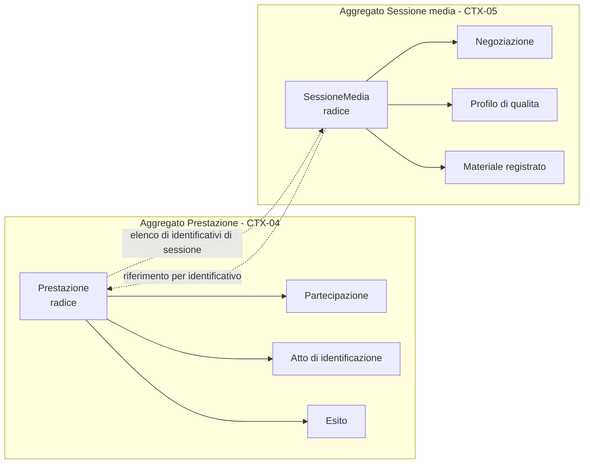
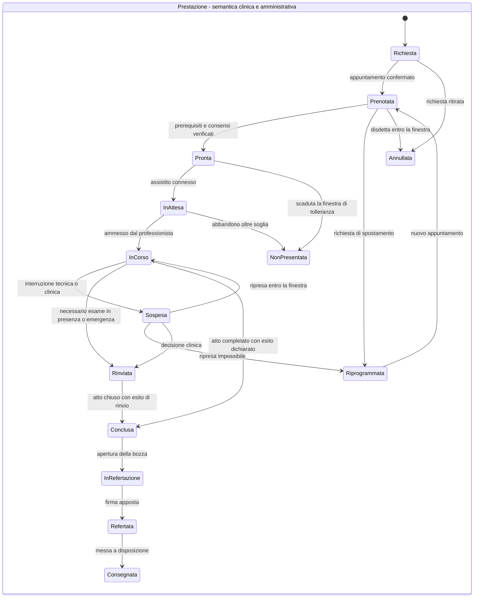
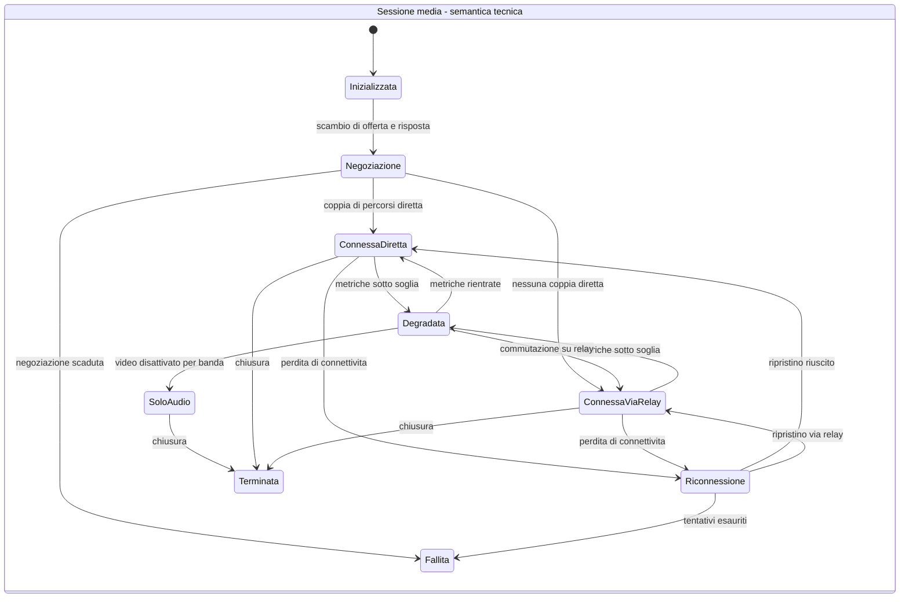

# Modello di dominio

## 1. Che cosa è un modello di dominio in questo sistema

Il modello di dominio di Telemedic è l'insieme dei tipi che **custodiscono le invarianti**. Non è
il modello dei dati, che è la sua proiezione sulla persistenza; non è il modello di
interoperabilità, che è la sua proiezione sui formati esterni. È il livello in cui una regola
come «un documento firmato non si modifica» è **impossibile da violare**, non semplicemente
sconsigliata.

Da questa definizione discendono tre proprietà, che sono anche tre verifiche automatiche
bloccanti:

1. **Il dominio non conosce lo standard di interoperabilità.** Nessun tipo del dominio importa
   tipi dello standard. Le risorse sono costruite da mappatori che stanno fuori.
2. **Il dominio non conosce la persistenza né il framework applicativo.** Nessun tipo del dominio
   importa annotazioni di mappatura relazionale o tipi del contenitore di inversione delle
   dipendenze. Se l'invariante dipende dall'infrastruttura, l'infrastruttura può violarla.
3. **Il dominio non conosce l'interfaccia.** Nessuna capacità esiste in una forma per la schermata
   e in un'altra per l'interfaccia applicativa. È la traduzione strutturale del vincolo di
   integrabilità totale.

I concetti generali - aggregato, radice, entità, oggetto valore, invariante, evento di dominio -
sono spiegati nel [modulo 11 della guida dei fondamenti](../10_fondamenti/11-fondamenti-informatici.md#7-domain-driven-design)
e qui non vengono ripetuti. Quello che segue è **quali sono** in Telemedic e **perché sono così**.

## 2. Il linguaggio ubiquo e le sue trappole

Il linguaggio del dominio è definito nella ricerca di dominio con oltre cento voci; questa sezione
non lo duplica ma fissa le sei disambiguazioni che hanno conseguenze dirette sul modello, perché
sono quelle in cui l'errore di modellazione è più probabile.

| Parola ambigua | Le accezioni che vanno separate | Conseguenza sul modello |
|---|---|---|
| **Sessione** | Atto clinico · connessione in tempo reale · unità rendicontabile | Tre tipi distinti: `Prestazione`, `SessioneMedia`, evento rendicontabile |
| **Consenso** | **Cinque oggetti distinti**: atto sanitario · trattamento dei dati ove applicabile · registrazione · presenza di terzi · trasmissione a sistemi esterni | Un solo aggregato `Consenso` con un tipo esplicito e **cinque istanze indipendenti** con cicli di vita separati, mai un valore booleano. **Nessun «consenso alla piattaforma» esiste nel modello** (vincolo [V-146](../11_registri/01-vincoli-in-vigore.md#v-146) dell'area di dominio) |
| **Prestazione** | Richiesta · esecuzione · addebito | Tre concetti: la richiesta è un riferimento esterno, l'esecuzione è `Prestazione`, l'addebito è un evento |
| **Paziente** | Qualifica clinica · qualifica amministrativa (assistito) | Un solo riferimento anagrafico, con la copertura amministrativa come attributo separato e temporale |
| **Registrazione** | Cattura audiovisiva · atto di registrare un fatto nel sistema | Nel codice, `RegistrazioneSessione` per la prima, `traccia` o `evento` per la seconda: la collisione è reale e produce difetti |
| **Esito** | Dove si trova il contatto (stato) · che cosa è successo (esito) | **Due attributi distinti**, mai collassabili: due esiti possono condividere lo stato terminale e avere effetti amministrativi **opposti** (vincolo [V-141](../11_registri/01-vincoli-in-vigore.md#v-141) dell'area di dominio). L'esito è **valore di dominio, non codice di errore**: un esito sfavorevole è un'operazione **riuscita** che registra un fatto (vincolo [V-126](../11_registri/01-vincoli-in-vigore.md#v-126) dell'`FUNZ`) |
| **Disponibile** | Pubblicato · prenotabile da un canale · non ancora occupato | Tre attributi distinti dell'intervallo, mai un solo valore booleano |

Una regola che discende da qui e vale per tutto il codice: **nessun tipo del dominio si chiama con
una parola ambigua senza qualificazione**. `Sessione` da sola non è un nome ammesso.

## 3. La separazione fra prestazione clinica e sessione media

È la decisione di modellazione più importante del sistema. La base architetturale la impone come
vincolo, la bacheca inter-agenti la registra come [V-01](../11_registri/01-vincoli-in-vigore.md#v-01), e la ricerca di dominio la definisce
«l'errore di modellazione più costoso di questo dominio» quando viene violata. Questa sezione ne
ricostruisce integralmente la motivazione, perché una decisione imposta e non compresa viene
aggirata alla prima occasione.

### 3.1 Perché la tentazione esiste

Dal punto di vista dell'utente c'è **un solo evento**: il medico e l'assistito si vedono, parlano,
la visita si conclude. Modellare due oggetti per una cosa sola sembra complessità gratuita. Il
codice più semplice è quello in cui `Prestazione` ha i campi della connessione - stato del
collegamento, tipo di percorso di rete, istante di avvio del flusso - e la fine della connessione
chiude la prestazione.

La tentazione è rafforzata dal fatto che nel caso felice le due entità hanno la stessa durata,
gli stessi partecipanti e lo stesso identificativo logico. Il modello unificato **funziona
perfettamente finché la rete funziona perfettamente**.

### 3.2 Le sei conseguenze dell'unione

Ognuna di queste è un difetto reale, non un'ipotesi.

**Prima - la prestazione fantasma.** Una caduta di rete e una riconnessione producono due
connessioni. Se la connessione è la prestazione, il sistema registra due atti sanitari dove ce n'è
stato uno. Il conteggio delle prestazioni erogate, che alimenta la rendicontazione, diventa il
conteggio delle connessioni riuscite, che è una grandezza diversa. Nessun aggiustamento successivo
recupera l'informazione, perché il sistema non ha mai saputo che le due connessioni erano lo
stesso atto.

**Seconda - l'atto sanitario inesistente.** La verifica tecnica che precede l'appuntamento è una
connessione senza atto clinico. Con il modello unificato, o si crea una prestazione fittizia - che
finisce nei conteggi e potenzialmente nella cartella - oppure si introduce un ramo speciale che
crea una connessione senza prestazione, cioè si ammette che le due cose sono separate ma lo si fa
di nascosto.

**Terza - la prestazione erogata che risulta non erogata.** Il video fallisce, il professionista
prosegue e conclude in fonia. È una prestazione erogata, con un esito clinico e un referto, in cui
la connessione video è fallita. Con il modello unificato l'atto risulta fallito.

**Quarta - la prestazione con più sessioni legittime.** Nell'atto complesso - l'ingresso
dell'interprete a metà, la ripresa dopo una pausa, il passaggio di consegne fra due professionisti
- le connessioni sono più di una per progetto, non per guasto. Il modello unificato le rappresenta
come atti distinti o costringe a nascondere le successive.

**Quinta - l'inquinamento del regime di conservazione.** La connessione produce metadati tecnici
con un regime di conservazione breve; la prestazione è documentazione sanitaria con un regime
lungo. Unendoli, o si conservano i metadati tecnici per il tempo della documentazione sanitaria -
producendo un archivio di dati di traffico che nessuno ha chiesto - o si cancella la
documentazione con i metadati.

**Sesta - l'accoppiamento dei ritmi di rilascio.** Il trasporto in tempo reale cambia quando
cambiano i motori dei browser e i protocolli di rete; la documentazione dell'atto cambia quando
cambia la normativa sanitaria. Nel modello unificato ogni aggiornamento dell'uno tocca l'altro.

### 3.3 Come sono collegati

I due aggregati sono collegati **solo per identificativo**, in una direzione sola: la sessione
media conosce la prestazione per cui è stata aperta; la prestazione conosce l'insieme degli
identificativi delle sessioni che le si riferiscono, e null'altro di esse.

Il collegamento non è una chiave esterna a livello di base dati, perché i due aggregati
appartengono a contesti diversi e la regola 1 di attraversamento dei confini lo vieta. È un
riferimento risolto attraverso l'interfaccia del contesto proprietario.

### 3.4 Come si sincronizzano

La sincronizzazione avviene per **eventi, in una direzione sola**, e non è mai automatica sullo
stato clinico.

| Fatto nella sessione media | Effetto sulla prestazione |
|---|---|
| Flusso stabilito fra i partecipanti | Nessun cambio di stato automatico. Il professionista ammette e l'atto inizia per decisione, non per connessione |
| Perdita di connettività | **Nessun effetto sullo stato della prestazione.** L'evento è annotato nel registro tecnico dell'atto |
| Riconnessione riuscita | Nessun effetto. Un identificativo di sessione in più nell'elenco |
| Degradazione oltre la soglia configurata | Nessun cambio di stato. Il professionista è informato e può decidere il ripiego o il rinvio |
| Fallimento definitivo della sessione | Nessun cambio di stato automatico. La prestazione resta aperta e il professionista dichiara l'esito, che può essere il ripiego in fonia, il rinvio o il fallimento tecnico |
| Terminazione ordinata | Nessun effetto: la chiusura dell'atto è un atto del professionista |

**Nessuna riga di questa tabella produce un cambio di stato automatico dell'atto clinico.** È
questa la sostanza della separazione: la sessione media può informare, mai decidere. Il verso
inverso invece esiste ed è di comando: la prestazione chiede l'apertura di una sessione, ne chiede
la chiusura, autorizza o revoca la registrazione.

### 3.5 Le due macchine a stati

> **Due precisazioni imposte dai vincoli di dominio.** La macchina rappresentata è quella della
> televisita: **ogni tipo di prestazione è la propria macchina a stati**, selezionata dal tipo, e
> attori ammessi, obbligo di presenza dell'assistito, asincronia, artefatti obbligatori, esiti
> ammessi, registrabilità e finestre sono **attributi del catalogo delle prestazioni**, non
> condizioni sparse nel codice (vincolo [V-140](../11_registri/01-vincoli-in-vigore.md#v-140) dell'area di dominio). Aggiungere una prestazione è
> una riga di catalogo più una macchina a stati, mai una modifica del dominio.
> Inoltre **stato ed esito sono attributi distinti**: lo stato dice dove si trova il contatto,
> l'esito che cosa è successo. Due esiti possono condividere lo stato terminale e avere effetti
> amministrativi opposti - la mancata presentazione e il fallimento tecnico attribuibile
> all'assistito ne sono il caso canonico - e collassarli in un unico campo è vietato
> (vincolo [V-141](../11_registri/01-vincoli-in-vigore.md#v-141)).

Le due macchine hanno cardinalità diversa - una prestazione, da zero a molte sessioni - durata
diversa, granularità diversa e ritmo diverso. La seconda cambia stato decine di volte in una
prestazione; la prima poche volte in ore o giorni. Sono la stessa cosa solo nel caso felice, e il
caso felice non è il caso su cui si progetta.

### 3.6 Conseguenze sul modello dati

La separazione ha effetti misurabili sulla persistenza, sviluppati in
[04 - Modello dati](04-modello-dati.md): tabelle separate in schemi di contesti diversi, nessuna
chiave esterna che attraversi il confine, politiche di conservazione indipendenti - lunga per la
documentazione dell'atto, breve per i metadati tecnici della connessione - e archivi diversi, dato
che i campioni di qualità appartengono a una serie temporale e non a una tabella relazionale.

## 4. Catalogo degli aggregati

Per ciascun aggregato: la radice, che cosa contiene, quali invarianti custodisce, che cosa
esplicitamente non contiene. Il criterio con cui i confini sono tracciati è uno solo: **un
aggregato contiene tutto e solo ciò che deve cambiare insieme in una sola transazione per
mantenere una regola vera**. Tutto il resto è un riferimento.

### 4.1 Contesto identità e accessi

| Aggregato | Radice | Contiene | Invariante custodita |
|---|---|---|---|
| **Soggetto** | `Soggetto` | Identità interna, collegamenti alle identità federate, stato | Un'identità federata è collegata a un solo soggetto per tenant |
| **AssegnazioneDiRuolo** | `AssegnazioneDiRuolo` | Ruoli con validità temporale, veste di riferimento, ambito organizzativo | Nessuna assegnazione mescola permessi clinici e amministrativi |
| **PrincipaleApplicativo** | `PrincipaleApplicativo` | Chiavi pubbliche, ambiti concessi, tenant, quote | Ogni operazione clinica richiede un contesto di delega |
| **AccessoInDeroga** | `AccessoInDeroga` | Motivazione, finestra, perimetro, stato di riesame | Durata finita, non rinnovabile in automatico, riesame obbligatorio |

Il **ruolo non è un aggregato**: è una composizione di permessi definita in configurazione, e i
permessi atomici sono un insieme chiuso che nessun tenant può ampliare.

### 4.2 Contesto anagrafiche

| Aggregato | Radice | Contiene | Invariante custodita |
|---|---|---|---|
| **RiferimentoAssistito** | `RiferimentoAssistito` | Identificativi esterni qualificati, recapiti, stato di capacità, legami di rappresentanza | Unicità di dominio più valore per tenant; nessuna correlazione fra tenant |
| **RiferimentoProfessionista** | `RiferimentoProfessionista` | Identificativi esterni, vesti professionali con validità | La veste è una relazione temporale, non un attributo |
| **Organizzazione** | `Organizzazione` | Identificativi, sedi, gerarchia interna | Una sede appartiene a una sola organizzazione |
| **Delega** | `Delega` | Delegante, delegato, ambito, decorrenza, scadenza | Scadenza obbligatoria |

La **rappresentanza legale non è una delega** e non condivide l'aggregato: ha un titolo, un ambito
di poteri delimitato dall'atto di nomina e regole di verifica per atto. Trattarla come una delega
è l'errore che porta a riconoscere all'amministratore di sostegno poteri che il decreto non gli
attribuisce.

### 4.3 Contesto agenda

| Aggregato | Radice | Contiene | Invariante custodita |
|---|---|---|---|
| **Agenda** | `Agenda` | Intervalli, orizzonte di pubblicazione, canali abilitati | La somma delle prenotazioni su un intervallo non supera la capienza |
| **Appuntamento** | `Appuntamento` | Riferimenti a soggetto e veste, prestazione, canale, catena di sostituzione | La catena di riprogrammazione conserva la data della richiesta originaria |
| **PosizioneInListaDiAttesa** | `PosizioneInListaDiAttesa` | Criteri, priorità, offerte effettuate | Una posizione è offerta a un solo destinatario per volta |

L'**intervallo è dentro l'aggregato agenda**, non fuori: è il solo modo di garantire il vincolo di
capienza in una transazione. L'appuntamento è invece un aggregato autonomo, perché il suo ciclo di
vita è più lungo e attraversa più intervalli.

### 4.4 Contesto prestazione clinica

| Aggregato | Radice | Contiene | Invariante custodita |
|---|---|---|---|
| **Prestazione** | `Prestazione` | Partecipazioni, atti di identificazione, cambi di canale, esito, annotazioni tecniche | Lo stato non dipende dalla sessione media; nessuna chiusura senza esito dichiarato |
| **Episodio** | `Episodio` | Riferimenti alle prestazioni, problema di riferimento, team | Un episodio è di un solo assistito presso una sola organizzazione |
| **CodaDiAttesa** | `CodaDiAttesa` | Presenze, ordine, esiti delle verifiche tecniche | Nessuna presenza invisibile agli altri partecipanti |

### 4.5 Contesto sessione media

| Aggregato | Radice | Contiene | Invariante custodita |
|---|---|---|---|
| **SessioneMedia** | `SessioneMedia` | Stato, modalità operativa, partecipanti tecnici, esito della verifica delle chiavi, profilo di qualità | La modalità con registrazione e quella cifrata fino agli estremi sono stati distinti; la transizione è tracciata |
| **MaterialeRegistrato** | `MaterialeRegistrato` | Riferimento al consenso, riferimento alla chiave, scadenza, stato di conservazione | Nessuna esistenza senza consenso vigente; scadenza sempre valorizzata |
| **CredenzialeDiRelay** | `CredenzialeDiRelay` | Identificativo opaco, scadenza breve | Il soggetto della credenziale è opaco, mai un identificativo di assistito |

Il **campione di qualità non è un'entità dell'aggregato**: è un punto di una serie temporale,
conservato in un archivio dedicato e riferito alla sessione per identificativo. Metterlo dentro
l'aggregato produrrebbe un aggregato che cresce senza limite durante la sua vita, che è la
definizione di un confine sbagliato.

### 4.6 Contesto documentazione clinica

| Aggregato | Radice | Contiene | Invariante custodita |
|---|---|---|---|
| **DocumentoClinico** | `DocumentoClinico` | Catena di versioni, evidenze di firma, livello di riservatezza, riferimenti agli allegati | Il documento firmato è immutabile; la rettifica è una versione successiva |
| **ModelloDiDocumento** | `ModelloDiDocumento` | Struttura, sezioni previste, versione, validità | Un documento è sempre riferito a una versione immutabile del modello |

La **catena di versioni è dentro l'aggregato** perché l'invariante «esiste al più una versione
vigente» va garantita in una transazione. L'allegato invece è fuori: ha un ciclo di vita proprio e
può essere condiviso.

### 4.7 Contesto telemonitoraggio

| Aggregato | Radice | Contiene | Invariante custodita |
|---|---|---|---|
| **PianoDiMonitoraggio** | `PianoDiMonitoraggio` | Parametri sorvegliati, frequenza attesa, soglie per assistito, validità, attribuzione al professionista | Nessuna soglia senza professionista attribuito e senza validità temporale; il piano è versionato |
| **Misura** | `Misura` | Valore, unità, strumento, metodo, istante di rilevazione, istante di ricezione, soggetto inseritore | Immutabile; correzione per sostituzione, mai per sovrascrittura |
| **Allarme** | `Allarme` | **Sequenza di eventi immutabili**: generazione, consegne, prese in carico, inoltri, esiti | Sempre sottoposto a revisione umana; il calcolo che l'ha prodotto è ricostruibile |
| **AttesaDiRilevazione** | `AttesaDiRilevazione` | Finestra attesa, istante di scadenza, causa dell'assenza quando nota | L'assenza di misura è **una riga che dichiara l'assenza**, non l'assenza di una riga |
| **RispostaAQuestionario** | `RispostaAQuestionario` | Risposte, versione dello strumento, istante | Riferita a una versione immutabile dello strumento |

La **misura è un aggregato autonomo**, non un'entità del piano. Sono due ritmi diversi - il piano
cambia raramente, le misure arrivano continuamente - e legarle produrrebbe contesa in scrittura
sulla stessa radice a ogni rilevazione.

Tre vincoli posti dalle aree di dominio e funzionale governano questo contesto e vanno enunciati
qui perché condizionano la forma dei tipi.

**L'allarme è una sequenza di eventi immutabili; lo stato corrente è una proiezione.** Nessuna
colonna di stato aggiornata sul posto, né per l'allarme né per la misura né per il piano (vincolo
[V-121](../11_registri/01-vincoli-in-vigore.md#v-121) dell'`FUNZ`). La ragione è probatoria: la domanda a cui il sistema deve rispondere
non è «in che stato è l'allarme», ma «che cosa è successo, in quale ordine, e chi ha fatto che
cosa». Una colonna aggiornata sul posto cancella la risposta ogni volta che la scrive.

**L'identità della misura, ai fini dell'idempotenza, è la quintupla** sorgente, soggetto,
parametro, istante di misura, valore; **istante di misura e istante di ricezione sono due campi
distinti obbligatori** e le regole di valutazione operano **sull'istante di misura** (vincolo
[V-124](../11_registri/01-vincoli-in-vigore.md#v-124)). Valutare sull'istante di ricezione produrrebbe allarmi con l'ora sbagliata e aderenze
calcolate su una finestra che non è quella prescritta.

**L'attesa di rilevazione è un'entità**, non l'assenza di una riga (vincolo [V-148](../11_registri/01-vincoli-in-vigore.md#v-148) dell'area di
dominio). È la forma operativa del principio secondo cui il silenzio non è mai normalità, ed è la
condizione perché l'aderenza sia una grandezza definita: senza una riga che dichiari che una
rilevazione era attesa, «non pervenuta» e «mai prevista» sono indistinguibili.

### 4.8 Contesto consenso

| Aggregato | Radice | Contiene | Invariante custodita |
|---|---|---|---|
| **Consenso** | `Consenso` | Tipo, ambito, evidenza, decorrenza, revoca, titolo di rappresentanza | Riferito a una versione immutabile di informativa; i **cinque tipi sono indipendenti** e hanno cicli di vita separati |
| **Informativa** | `Informativa` | Testo, versione, validità, lingue | Immutabile una volta pubblicata |
| **Oscuramento** | `Oscuramento` | Perimetro, destinatari, decorrenza | L'esistenza dell'oscurato non è inferibile; **l'applicazione spetta al motore di autorizzazione**, non ai consumatori |

I **cinque oggetti di consenso** sono, con cicli di vita indipendenti (vincolo [V-146](../11_registri/01-vincoli-in-vigore.md#v-146) dell'area di
dominio): adesione all'atto sanitario; trattamento dei dati ove il consenso sia la base giuridica
applicabile; registrazione della sessione; presenza di terzi in sessione; trasmissione a sistemi
esterni. **La revoca di uno non tocca gli altri**, e **nessun «consenso alla piattaforma» esiste
nel modello**: un oggetto che li aggreghi renderebbe la revoca dell'uno una revoca di tutti, che è
sia scorretto sia dannoso per la cura.

L'**oscuramento è applicato dal motore di autorizzazione in un unico punto**, che filtra e calcola
i totali sull'insieme filtrato (vincolo [V-149](../11_registri/01-vincoli-in-vigore.md#v-149) dell'area di dominio). Applicarlo nei consumatori
significherebbe chiuderlo in alcuni e lasciarlo aperto in altri. I canali di inferenza da chiudere
sono sei e vanno chiusi tutti: numerazione, conteggi, paginazione, notifiche, differenze fra
interrogazioni successive, messaggi d'errore. **I dati sintetici di collaudo devono comprendere
documenti oscurati**, altrimenti nessuna prova esercita il percorso.

### 4.9 Contesti restanti

| Contesto | Aggregati | Nota |
|---|---|---|
| Notifiche e allarmi | `RichiestaDiRecapito`, `ModelloDiMessaggio`, `PreferenzaDiCanale` | La catena di inoltro è dentro la richiesta: il suo esaurimento è un'invariante transazionale |
| Terminologie | `PoliticaTerminologica`, `RisultatoDiValidazione` | Il contenuto delle terminologie non è un aggregato: non è del progetto |
| Interoperabilità in uscita | `ConfigurazioneDiIntegratore`, `SottoscrizioneAEventi`, `ConsegnaInUscita`, `MessaggioInIngresso` | La consegna è un aggregato perché la sua politica di ritentativo è un'invariante |
| Tracciamento | `VoceDiRegistro`, `AncoraggioDiCatena`, `RiesameDiDeroga` | La voce è append-only e non ha metodi di modifica: è l'unico aggregato senza comportamento di mutazione |
| Amministrazione tenant | `Tenant`, `ConfigurazioneDiTenant`, `ProfiloDiAspetto`, `Quota` | La configurazione è versionata: una modifica produce una versione, non una sovrascrittura |

## 5. Oggetti valore che valgono per tutto il sistema

Alcuni oggetti valore attraversano i contesti e vanno definiti una volta sola, in un linguaggio
condiviso minimo, altrimenti ogni contesto ne produce una variante e la traduzione al confine
diventa una fonte di difetti.

| Oggetto valore | Contenuto | Perché è un oggetto valore e non un tipo primitivo |
|---|---|---|
| `IdentificativoDiTenant` | Valore opaco | Un identificativo di tenant confuso con un altro identificativo è la fuga di dati più banale e più grave |
| `IdentificativoEsterno` | Dominio di attribuzione più valore | Un valore senza dominio è ambiguo per costruzione e produce collisioni fra sistemi di origine |
| `ConcettoCodificato` | Sistema di codifica, codice, etichetta, versione della fonte | Un codice senza sistema non è interpretabile; senza versione non è riproducibile |
| `Quantita` | Valore, unità, sistema di unità | Un numero senza unità in un contesto clinico è pericoloso, non solo scorretto |
| `IstanteBitemporale` | Istante dell'accadimento più istante dell'apprendimento | La sovrapposizione dei due assi produce errori non recuperabili |
| `PeriodoDiValidita` | Decorrenza più termine, con termine aperto ammesso | Consenso, ruolo, soglia, tariffa: tutto ciò che vale «da quando a quando» |
| `LivelloDiGaranzia` | Livello più provenienza (eseguito o riferito) | Un livello riferito da un integratore non soddisfa un requisito di autenticazione forte |
| `FinalitaDiAccesso` | Cura, deroga, esercizio, amministrazione, verifica | È l'attributo che rende una decisione di accesso spiegabile a posteriori |
| `LivelloDiRiservatezza` | Ordinario, ristretto, molto ristretto | Governa visibilità e notifiche; non è deducibile dal tipo di documento |
| `EvidenzaDiVolonta` | Dichiarante, istante, canale, testo presentato, titolo | Senza, il consenso è indimostrabile |

Regola trasversale: **nessun identificativo esterno è mai un tipo primitivo nel dominio**. Un
codice fiscale rappresentato come stringa finisce, prima o poi, confrontato con un identificativo
regionale.

## 6. Il tempo nel modello

Il tempo è **almeno bidimensionale** in questo dominio, e la conflazione dei due assi produce
errori che non si recuperano. La teoria è nel
[modulo 11 della guida](../10_fondamenti/11-fondamenti-informatici.md#8-modellazione-del-tempo-e-dei-dati);
qui si fissa dove si applica.

| Fatto | Istante dell'accadimento | Istante dell'apprendimento | Perché servono entrambi |
|---|---|---|---|
| Misura di telemonitoraggio | Quando è stata rilevata | Quando è arrivata al sistema | Una misura del mattino trasmessa nel pomeriggio non è una misura del pomeriggio; l'aderenza si calcola sul primo asse, la sorveglianza del silenzio sul secondo |
| Revoca di un consenso | Quando il soggetto l'ha manifestata | Quando il sistema l'ha registrata | Determina la liceità di ciò che è avvenuto nell'intervallo |
| Prestazione erogata | Quando si è svolta | Quando è stata rendicontata | La tariffa applicabile è quella vigente all'epoca dell'erogazione |
| Assegnazione di ruolo | Da quando è efficace | Quando è stata inserita | Una decisione di accesso si rivaluta con gli attributi vigenti all'epoca, non con quelli attuali |
| Soglia clinica | Da quando il professionista l'ha stabilita | Quando è stata configurata | La ricostruzione del calcolo che ha prodotto un'allerta richiede la soglia vigente in quel momento |

Tre conseguenze operative:

1. **Nessun fatto di dominio è rappresentato con un solo istante.** Dove il secondo asse coincide
   con il primo lo si dichiara, non lo si omette.
2. **Ciò che vale «da quando a quando» non si sovrascrive.** Ruolo, consenso, soglia, tariffa,
   configurazione: la modifica produce una nuova versione con una nuova decorrenza.
3. **Gli istanti sono conservati con il riferimento temporale assoluto.** L'ora locale con
   l'identificativo del fuso serve dove conta la lettura umana - la ricorrenza dell'agenda alle due
   e mezza di notte nelle due domeniche di cambio dell'ora ne è l'esempio canonico - ma il fatto è
   conservato in forma assoluta.

## 7. Eventi di dominio

### 7.1 Che cosa è un evento di dominio qui

Un evento di dominio è **un fatto già accaduto, immutabile, nominato al passato**, che altri
contesti possono osservare. Non è un comando, non è una notifica, non è una richiesta. La
distinzione ha una conseguenza pratica: **il produttore di un evento non conosce i suoi
consumatori e non dipende dal loro esito**. Se un consumatore fallisce, il fatto è avvenuto lo
stesso.

Gli eventi si dividono in due categorie con regimi diversi:

| Categoria | Chi li vede | Regime |
|---|---|---|
| **Eventi interni** | Solo i contesti di Telemedic | Possono cambiare fra due versioni con la sola disciplina interna |
| **Eventi pubblicati** | Anche gli integratori | Sono **contratto pubblico**: cambiarli è una rottura soggetta al processo di dismissione annunciata |

La distinzione va **esplicita nel codice**, non affidata alla memoria: un evento interno promosso
per comodità a evento pubblicato diventa un vincolo permanente senza che nessuno lo abbia deciso.

### 7.2 Catalogo dei principali eventi

| Evento | Contesto produttore | Consumatori | Categoria | Effetto rilevante |
|---|---|---|---|---|
| `AppuntamentoCreato` | CTX-03 | CTX-04, CTX-08, CTX-11 | pubblicato | Predisposizione dell'atto, promemoria, notifica al sistema di origine |
| `AppuntamentoRiprogrammato` | CTX-03 | CTX-04, CTX-08, CTX-11 | pubblicato | Conserva la catena di sostituzione |
| `AssistitoInAttesa` | CTX-04 | CTX-08 | interno | Avviso al professionista |
| `PrestazioneAvviata` | CTX-04 | CTX-05, CTX-11, CTX-12 | pubblicato | Apertura della sessione, tracciamento |
| `AssistitoIdentificato` | CTX-04 | CTX-06, CTX-12 | interno | Sblocco della refertazione |
| `CanaleDegradato` | CTX-05 | CTX-04, CTX-08 | interno | Avviso ai partecipanti e annotazione tecnica |
| `ModalitaDiSessioneCambiata` | CTX-05 | CTX-04, CTX-12 | interno | Registra il passaggio fra le due modalità operative |
| `PrestazioneConclusa` | CTX-04 | CTX-06, CTX-11, CTX-12 | pubblicato | Apertura della finestra di refertazione, fatto rendicontabile |
| `DocumentoFirmato` | CTX-06 | CTX-08, CTX-11, CTX-12 | pubblicato | Messa a disposizione, trasmissione |
| `DocumentoRettificato` | CTX-06 | CTX-08, CTX-11, CTX-12 | pubblicato | Compensazione documentale di un documento già trasmesso |
| `ConsensoRevocato` | CTX-09 | CTX-04, CTX-05, CTX-11 | pubblicato | Interruzione della registrazione, blocco delle trasmissioni |
| `MisuraAcquisita` | CTX-07 | CTX-07, CTX-12 | pubblicato | Valutazione rispetto alle soglie configurate |
| `SogliaSuperata` | CTX-07 | CTX-08, CTX-12 | interno | Genera l'allerta destinata alla revisione |
| `RilevazioneAttesaNonPervenuta` | CTX-07 | CTX-08, CTX-12 | interno | Il silenzio come informazione |
| `AllertaNonPresaInCarico` | CTX-08 | CTX-08, CTX-12 | interno | Esaurimento della catena di inoltro, dichiarato |
| `TermineDiRefertazioneSuperato` | CTX-06 | CTX-08 | interno | Sollecito e segnalazione al responsabile |
| `AccessoInDerogaInvocato` | CTX-01 | CTX-12, CTX-08 | interno | Coda di riesame, notifica al responsabile della protezione dei dati |
| `ConsegnaFallita` | CTX-11 | CTX-08 | interno | Coda di riconciliazione visibile |

### 7.3 Regole sugli eventi

1. **Immutabili e versionati.** Ogni evento porta la versione del proprio schema. Un evento
   modificato senza incremento di versione è un difetto.
2. **Nessun contenuto clinico negli eventi che escono verso sistemi terzi** (vincolo [V-161](../11_registri/01-vincoli-in-vigore.md#v-161)
   dell'area integrazione): identificativi e riferimenti; il contenuto si rilegge con una chiamata
   autenticata sotto l'autorizzazione del ricevente.
3. **Nominati al passato.** `PrestazioneConclusa`, non `ConcludiPrestazione`. Un evento nominato
   all'imperativo è un comando travestito e produce accoppiamento fra produttore e consumatore.
4. **Emessi dopo il consolidamento della transazione**, mai prima. Un consumatore che fallisce non
   fa fallire l'atto clinico: il fallimento va in coda di ritentativo, non propagato all'utente.
5. **Portano il tenant sempre.** Nessuna eccezione, nemmeno per gli eventi di configurazione.
6. **Portano l'attribuzione.** Chi ha causato il fatto, e per conto di chi, in forma coerente con
   la rappresentazione della delega.

## 8. Invarianti trasversali

Le invarianti dei singoli aggregati sono elencate in §4. Queste valgono per **tutto** il modello e
non appartengono a un aggregato specifico. La loro violazione è rilevata da verifiche automatiche
bloccanti, non dalla revisione manuale.

| # | Invariante | Che cosa impedisce |
|---|---|---|
| I-1 | Nessuna soglia clinica è un letterale nel codice | Lo scivolamento del sistema oltre il confine fra registrazione e interpretazione |
| I-2 | Nessun campo di documento clinico è popolato da testo prodotto dal sistema | Idem |
| I-3 | Ogni entità, evento e voce di registro porta l'identificativo di tenant | Fuga di dati fra titolari autonomi |
| I-4 | Nessun identificatore esterno è chiave primaria | L'irreversibilità della dipendenza da un'anagrafica altrui |
| I-5 | Ogni concetto codificato porta il proprio sistema di codifica | Codici ambigui e non interpretabili |
| I-6 | Ogni fatto porta il proprio contesto di produzione | Dati non ricostruibili e quindi inutilizzabili |
| I-7 | L'assenza di un dato atteso è rappresentata come fatto | Il silenzio trattato come normalità |
| I-8 | Lo stato clinico non è modificato da un fatto tecnico | Prestazioni fantasma e atti erogati che risultano falliti |
| I-9 | Nessun documento firmato è modificabile | La perdita del valore probatorio della documentazione |
| I-10 | Ogni operazione su dato sanitario produce una voce di registro, e il suo fallimento fa fallire l'operazione | Accessi non dimostrabili |
| I-11 | La configurazione non rimuove un'invariante | L'aggiramento delle regole di dominio per via amministrativa |
| I-12 | Nessun dato reale in codice, prove, esempi, registri o documentazione | Un trattamento illecito nascosto in un ambiente di sviluppo |
| I-13 | Nessuna colonna di stato di allarme, misura o piano è aggiornata sul posto: lo stato è una proiezione di eventi immutabili | La cancellazione della storia a ogni cambio di stato |
| I-14 | Stato ed esito del contatto sono attributi distinti | Il collasso di esiti con effetti amministrativi opposti |
| I-15 | Nessun percorso di cura è codificato nel software: si aggiunge con definizione, validazione, pubblicazione e configurazione | Che l'aggiunta di un percorso richieda un rilascio o una migrazione |
| I-16 | L'oscuramento è applicato in un unico punto dal motore di autorizzazione, e i totali si calcolano sull'insieme filtrato | Sei canali di inferenza aperti in modo disomogeneo |
| I-17 | Un esito tipizzato è un valore di dominio e non entra nel catalogo dei codici di errore | La sparizione dai registri clinici di ciò che deve restarci |

## 9. Il confine fra registrazione e interpretazione, nel modello

Il vincolo che separa il veicolo di comunicazione dal supporto alla decisione clinica non è una
postura documentale: è una proprietà del modello, e questa sezione dice **dove** si vede.

**Nel documento clinico.** Il tipo `DocumentoClinico` non espone alcuna operazione che produca
contenuto. Le operazioni sono di struttura - apri una bozza, inserisci il contenuto redatto,
allega, firma, rettifica - e il contenuto è sempre un parametro fornito dall'autore, mai un
risultato calcolato. Non esistono metodi che generino conclusioni, riepiloghi o codifiche dedotte.

**Nella soglia.** Il tipo `PianoDiMonitoraggio` non ha alcun costruttore che produca una soglia
predefinita. Ogni soglia richiede l'attribuzione a un professionista identificato e una validità
temporale: **una soglia senza attribuzione non è rappresentabile**. Il sistema non offre valori
suggeriti, nemmeno come comodità dell'interfaccia.

**Nell'allerta.** L'allerta è un tipo che porta il riferimento alla misura, alla versione del
piano e alla soglia applicata, e uno stato di presa in carico. Non porta un giudizio, non porta
una gravità clinica calcolata, non porta un'indicazione di azione. Il testo che l'accompagna è un
modello configurato, non un enunciato prodotto dal sistema.

**Nella telemetria.** I campioni di qualità non sono osservazioni cliniche e non hanno alcun
percorso che li porti nella documentazione. Il tipo che li rappresenta vive in un contesto diverso
e non è convertibile in un tipo clinico.

**Nel triage.** Dove il sistema registra una priorità, la registra come **decisione dichiarata dal
professionista**, con l'attribuzione. Non esiste alcun percorso in cui il sistema calcoli una
priorità e la proponga.

Tre funzionalità sono state individuate come collocate a distanza minima dal confine e sono
governate con controllo esplicito delle modifiche: l'allerta su soglia, la riproduzione del
materiale registrato con miglioramento dell'immagine e l'assistenza alla refertazione. Ogni
proposta di modifica che le riguardi richiede una rivalutazione formale prima
dell'implementazione, non dopo.

## 10. Che cosa il modello non rappresenta

Un modello si definisce anche per ciò che decide di non sapere.

| Concetto | Perché non è nel modello |
|---|---|
| Indice di riconciliazione delle identità fra sistemi | Il sistema consuma l'identità del sistema di origine; costruirne uno proprio lo renderebbe detentore di anagrafica |
| Cartella clinica completa dell'assistito | Resta nel sistema di origine; il modello conserva ciò che produce, non ciò che altri custodiscono |
| Contenuto delle terminologie | Non è del progetto, e per alcune fonti la licenza vieta di conservarlo |
| Punteggi di scale cliniche validate | Sospeso finché la questione delle licenze delle scale non è chiusa |
| Modello di dispositivo medico connesso | Il sistema acquisisce da un gateway di terze parti e non dialoga con i dispositivi |
| Struttura tariffaria e regole di fatturazione | Il sistema produce il fatto rendicontabile; il calcolo appartiene al sistema amministrativo |
| Percorso diagnostico-terapeutico come protocollo eseguibile | Il modello conserva il piano configurato e la sua esecuzione osservata, non un motore di regole cliniche |
