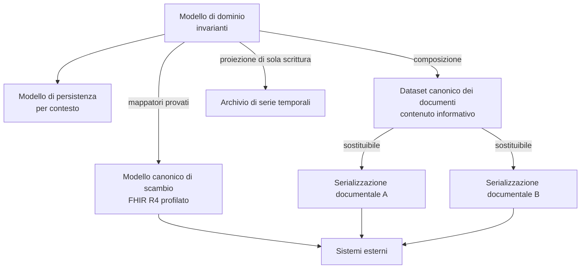
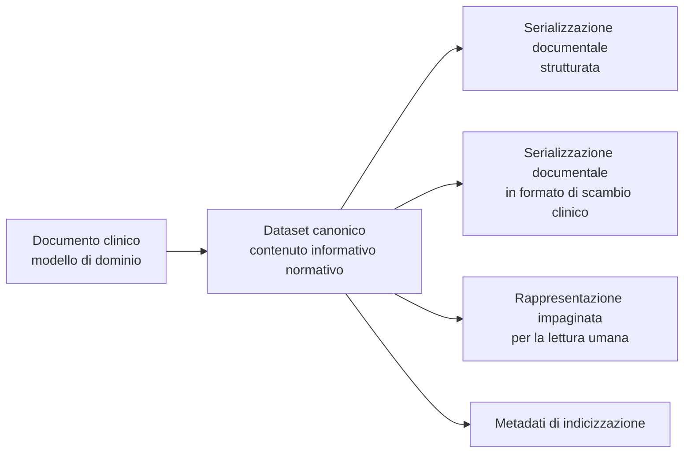
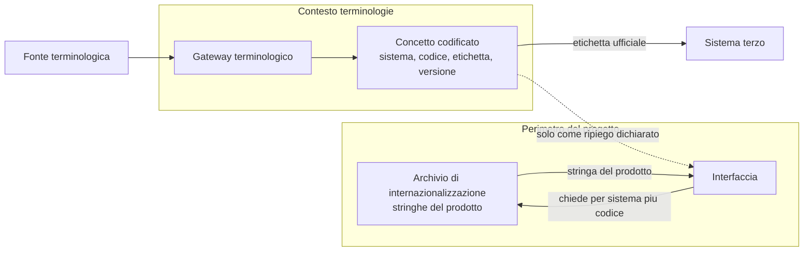

# Modello dati

## 1. Quattro modelli, non uno

Nel dibattito corrente «modello dati» indica indifferentemente quattro cose diverse. In Telemedic
sono quattro artefatti distinti, con proprietari, ritmi di cambiamento e regole diverse, e la loro
confusione è all'origine di una parte consistente dei difetti di questo genere di sistemi.

| # | Modello | Che cos'è | Chi lo possiede | Con quale ritmo cambia |
|---|---|---|---|---|
| 1 | **Modello di dominio** | I tipi che custodiscono le invarianti | I contesti di dominio | Lentamente, con la comprensione del dominio |
| 2 | **Modello di persistenza** | Tabelle, indici, vincoli, schemi | Il livello di persistenza di ciascun contesto | Con le esigenze di accesso e di volume |
| 3 | **Modello canonico di scambio** | La rappresentazione con cui i fatti clinici escono ed entrano | Il contesto di interoperabilità | Con le revisioni degli standard e delle guide nazionali |
| 4 | **Dataset canonico dei documenti** | Il contenuto informativo che un documento sanitario deve portare | Il contesto di documentazione clinica | Con la normativa sanitaria |

Le regole di rapporto fra i quattro sono poche e assolute:

- **Il modello di dominio non conosce gli altri tre.** È la condizione di sopravvivenza a una
  revisione dello standard o a un cambio di archivio.
- **Il modello canonico di scambio è una proiezione, mai una fonte.** Le risorse dello standard
  sono costruite da mappatori e non sono mai l'artefatto persistito come tale.
- **Il dataset canonico è indipendente dalla serializzazione.** Il contenuto informativo di un
  referto è definito dalla normativa; la forma in cui viaggia — documento strutturato di un tipo o
  di un altro — è sostituibile e non va cablata.
- **Il modello di persistenza è privato del contesto.** Nessun altro contesto lo legge, nessuna
  interfaccia pubblica lo espone.



## 2. Il modello canonico di scambio

### 2.1 La versione e il profilo

Il modello canonico è **FHIR R4, versione 4.0.1**, profilato secondo le guide di implementazione
italiane per la telemedicina, che **prevalgono** in caso di divergenza con il modello generico.
Le guide adottate — televisita, teleconsulto, teleassistenza, telemonitoraggio e il profilo
nazionale di base — sono tutte su FHIR 4.0.1 e sono, alla data di stesura, in stato preliminare.

Lo stato preliminare è un fatto, non un ostacolo aggirabile. Ne discendono tre obblighi:

1. **Fissaggio esplicito delle versioni.** I pacchetti di profilazione sono dichiarati con
   versione esatta, mai con riferimento a una versione mobile o alla build continua. La
   costruzione fallisce se il pacchetto risolto non coincide con quello dichiarato.
2. **Procedura di ricontrollo periodica.** Le guide cambiano con cadenza infra-annuale. Il
   ricontrollo è un'attività pianificata con esito registrato, non un'ispezione occasionale.
3. **Isolamento dell'impatto.** Una revisione di profilo deve poter essere assorbita modificando
   mappatori e pacchetti di profilazione, senza toccare le invarianti di dominio. È lo scenario di
   qualità SQ-06.

### 2.2 Che cosa passa da FHIR e che cosa no

La regola di partizione fra il piano clinico e il piano applicativo è unica e si applica senza
eccezioni:

> Se il concetto ha un equivalente clinico riconosciuto e deve poter essere consumato da un
> sistema sanitario terzo che non conosce Telemedic, allora è **FHIR**.
> Se il concetto è una capacità del prodotto, allora è **piano applicativo**.

| Concetto | Piano | Motivazione |
|---|---|---|
| L'atto clinico a distanza | FHIR | È il concetto clinico e alimenta la cartella del sistema di origine |
| Il documento sanitario | FHIR | Contenuto clinico redatto dal professionista |
| Il consenso come stato giuridico | FHIR | Ha una rappresentazione clinica riconosciuta |
| La misura di telemonitoraggio | FHIR | È un'osservazione clinica a tutti gli effetti |
| Il riferimento anagrafico | FHIR | Deve essere risolvibile per identificatore esterno |
| La sessione media, i suoi stati, la sua negoziazione | applicativo | È un artefatto tecnico: non esiste in FHIR e non deve esistere |
| Le metriche di qualità del canale | applicativo | **Non sono osservazioni cliniche** e non devono entrare nella cartella |
| Il flusso di raccolta del consenso | applicativo | Lo stato è clinico-giuridico, il flusso di interfaccia è di prodotto |
| Configurazione, aspetto, quote, chiavi | applicativo | Configurazione di prodotto |
| Il materiale registrato | applicativo, con riferimento documentale in FHIR | Il contenuto è un artefatto proprio; l'indicizzazione può essere esposta |

L'esclusione delle metriche di qualità dal piano clinico merita enfasi perché la tentazione
opposta è forte e la scorciatoia sembra elegante: un valore di ritardo di trasmissione modellato
come osservazione entra nella cartella clinica di una persona. È un problema di qualità del dato e,
data la sensibilità del confine fra registrazione e interpretazione, anche di qualificazione.
**Rifiutato senza eccezioni.**

### 2.3 Il documento sanitario: composizione, non referto diagnostico

Il contenuto pubblico originario del progetto annunciava la produzione di un referto diagnostico a
fine sessione. Il realm italiano modella diversamente: il referto di televisita è una
**composizione dentro un contenitore documentale**, con codificazione del tipo di documento e
sezioni vincolate da un profilo nazionale.

Le due risorse non sono intercambiabili e la scelta non è di stile:

| Situazione | Risorsa corretta | Perché |
|---|---|---|
| Referto strutturato con esiti atomici e interpretazione, prodotto da un servizio diagnostico | referto diagnostico | Progettata per il mix fra risultati atomici e interpretazione |
| Referto narrativo organizzato in sezioni, immutabile e firmabile | **composizione dentro un contenitore documentale** | Meno flusso di lavoro, più narrativa; immutabilità e firma sono proprietà del paradigma documentale |
| Indicizzazione di un documento preesistente | riferimento documentale | Metadati su documento già formato, ponte verso i profili di condivisione |

Il referto di una prestazione a distanza è per sua natura **narrativo e redatto dal
professionista**. Il pattern adottato è quindi: composizione con sezioni codificate, serializzata
in un contenitore documentale, firmata, indicizzata da un riferimento documentale, esposta al
sistema di origine.

**Il referto diagnostico resta come proiezione in sola lettura**, per gli integratori che sanno
consumare solo quello. È una vista: il suo campo di conclusione porta il testo redatto dal
professionista, mai testo prodotto dal sistema, e la sua forma allegata porta il documento firmato.
Non è mai l'artefatto primario e non è mai la sede della verità.

Il paradigma documentale porta con sé una proprietà che il modello sfrutta: una volta assemblato,
**il documento è immutabile e il suo identificativo non è mai riusato**. È la traduzione, nel
formato di scambio, dell'invariante di dominio sull'immutabilità del documento firmato.

### 2.4 La rappresentazione dell'atto a distanza

Lo standard nella versione adottata offre **un solo elemento semantico** per la modalità virtuale:
un valore di classe dell'atto. Non offre un elemento per l'indirizzo della sessione, non distingue
sincrono e asincrono, non ha un codice per il tipo di canale. La revisione successiva dello
standard colma la lacuna con un tipo dedicato, il cui insieme di valori obbligatorio è però
composto da nomi di piattaforme commerciali di terze parti — insieme che non descrive alcuna
piattaforma installata in proprio.

Esistono tre modi di uscirne, e la scelta è dichiarata:

| Opzione | Valutazione |
|---|---|
| Usare il pacchetto ufficiale di estensioni di versione incrociata | Espone il tipo della revisione successiva dentro la versione adottata. **Il pacchetto disponibile è in stato preliminare**: non è materiale su cui costruire una versione di produzione senza fissaggio esplicito e prove di validazione |
| Definire un sistema di codifica di progetto | Sotto il controllo del progetto, sostituibile, ma non riconosciuto da terzi |
| Non esporre l'endpoint di sessione in FHIR | Coerente con la regola di partizione: l'indirizzo della stanza è un artefatto di prodotto |

**Decisione adottata**: l'indirizzo della sessione **non si espone nel piano clinico**. Il piano
clinico porta la classe dell'atto virtuale e nulla di più; l'accesso alla sessione è una capacità
del piano applicativo, con un riferimento a uso singolo e a vita brevissima. Dove un integratore
richieda la rappresentazione dell'endpoint in FHIR, si usa un sistema di codifica di progetto,
dichiarato come tale e mai presentato come standard. Il pacchetto di estensioni di versione
incrociata resta osservato, non adottato, finché è in stato preliminare.

Un fatto verificato che va segnalato e non nascosto: il profilo nazionale dell'atto di televisita
**non fissa un valore per la classe dell'atto**, pur avendo un vincolo estensibile sull'insieme di
valori. Il progetto adotta il valore che rappresenta la modalità virtuale e lo dichiara nel
proprio profilo di interfaccia. `[NV]` — la conferma che il realm italiano attenda esattamente
quel valore va richiesta all'ente di normazione nazionale; il destinatario della richiesta è
l'area di conformità, che ha già in carico l'interlocuzione per le tipologie documentali.

### 2.5 Il codice della prestazione e il canale di erogazione

Il fatto di dominio è verificato e ha una conseguenza diretta sul modello: **non esiste e non deve
esistere un codice di prestazione «televisita» distinto dalla prestazione clinica**. Le prestazioni
già presenti nel catalogo, se erogate a distanza, mantengono la stessa codificazione e la stessa
tariffa della corrispondente prestazione in presenza. La modalità a distanza è un **modificatore
del canale**, non una prestazione a sé.

Il modello traduce questo in **due assi ortogonali**:

- **che cosa** viene erogato → il codice del catalogo, sull'elemento di tipo dell'atto o sulla
  richiesta;
- **come** viene erogato → la classe dell'atto, più l'attributo di canale che accompagna il fatto
  rendicontabile.

Confondere i due assi è l'errore che rende un sistema di telemedicina non rendicontabile, e la
sua correzione a posteriori richiede di ricodificare lo storico.

## 3. Il dataset canonico dei documenti

### 3.1 Perché il contenuto non si modella sulla serializzazione

I documenti destinati all'infrastruttura documentale nazionale hanno un **set informativo definito
da fonte normativa**. Le rappresentazioni tecniche — i modelli di documento strutturato, i codici
documentali, i metadati di indicizzazione — **non sono pubblicamente disponibili** alla data di
stesura, e la loro acquisizione è una questione aperta indirizzata all'area di conformità.

Costruire il modello sulla serializzazione significherebbe attendere quel materiale per iniziare, e
poi legare il modello a una forma tecnica che può cambiare. Il progetto fa il contrario: **modella
il contenuto informativo come dataset canonico** e tratta ogni serializzazione come sostituibile.



### 3.2 Che cosa comporta in pratica

1. **Il dataset canonico è un artefatto versionato del progetto**, con una definizione di ogni
   elemento, la sua obbligatorietà, il suo tipo, il suo vincolo terminologico e la fonte normativa
   che lo richiede. È l'unico luogo in cui il contenuto informativo è definito.
2. **Ogni serializzazione è un mappatore** dal dataset canonico verso una forma, con prove che
   partono dal dataset, producono la forma, la validano e la rileggono verificando l'equivalenza
   semantica.
3. **Nessun modello di documento è cablato.** L'aggiunta di una forma di serializzazione è
   l'aggiunta di un mappatore, non una modifica del dominio.
4. **La rappresentazione impaginata è una serializzazione come le altre**, non un caso speciale: la
   forma leggibile da una persona e la forma leggibile da una macchina derivano dallo stesso
   dataset, il che elimina alla radice la divergenza fra ciò che il professionista ha firmato e ciò
   che il sistema ha trasmesso.
5. **I metadati di indicizzazione derivano dal dataset**, non sono compilati a parte.

### 3.3 Il punto in cui questa scelta paga

Il momento in cui i modelli tecnici diventeranno disponibili sarà, per il progetto, la scrittura
di un mappatore e di una suite di prove. Nel modello alternativo — contenuto modellato sulla forma
— sarebbe stata una migrazione del modello di dominio e dei dati già prodotti.

## 4. Le serie temporali

### 4.1 Due serie, non una

Il sistema produce due famiglie di dati a serie temporale, con **regimi giuridici opposti** che
non ammettono di essere conservate insieme:

| Serie | Che cosa contiene | Natura | Regime |
|---|---|---|---|
| **Parametri clinici** | Misure di telemonitoraggio, risposte a questionari strutturati | Dato relativo alla salute | Conservazione lunga, accesso clinico, tracciamento di ogni lettura |
| **Metriche di canale** | Ritardo, perdita, variazione del ritardo, ritmo di trasmissione, tipo di percorso | **Non clinico** | Conservazione breve, accesso tecnico, nessun identificativo diretto dell'assistito |

Confonderle produce due difetti simmetrici: se le metriche tecniche ereditano il regime clinico si
costruisce un archivio di dati di traffico sanitario che nessuno ha chiesto; se i parametri
clinici ereditano il regime tecnico si perde documentazione sanitaria.

### 4.2 Perché un archivio dedicato

La rappresentazione nel formato di scambio clinico è **una proiezione, non lo strumento di
archiviazione**. Le ragioni sono di forma e di volume:

- una serie temporale ha cardinalità che cresce linearmente nel tempo e per soggetto, e i suoi
  accessi tipici sono per intervallo e per aggregazione, non per identificativo singolo;
- l'aggregazione su finestre mobili, la riduzione della risoluzione dei dati storici e la scadenza
  automatica sono funzioni native di un archivio a serie temporali e costose da simulare altrove;
- la rappresentazione di una singola misura nel formato di scambio è di uno o due ordini di
  grandezza più voluminosa del dato che trasporta.

**Regola adottata**: le serie sono conservate in strutture dedicate a serie temporali; la
rappresentazione nel formato di scambio è costruita su richiesta, per l'intervallo richiesto, e
non è mai la forma persistita.

### 4.3 Invarianti sulle serie

1. La misura è **immutabile**. Una correzione produce una nuova misura che sostituisce la
   precedente, con il riferimento a quella sostituita.
2. Ogni punto porta i **due istanti**: rilevazione e ricezione.
3. Ogni punto porta il proprio contesto di produzione: strumento, metodo, soggetto inseritore.
4. I campioni di canale **non portano identificativi diretti dell'assistito**, e nessuna metrica
   infrastrutturale del relay è etichettata con l'identificativo di sessione.
5. **L'assenza di un punto atteso è rappresentabile.** Una serie che contiene solo ciò che è
   arrivato non consente di distinguere «tutto regolare» da «nessun dato».
6. La riduzione della risoluzione dei dati storici è ammessa per le metriche di canale e
   **vietata** per i parametri clinici, che sono documentazione.

## 5. Identificatori e domini di attribuzione

### 5.1 Il principio

**Nessun identificatore esterno è chiave primaria.** L'identità interna di ogni entità è un
identificativo opaco generato dal sistema. Gli identificatori esterni sono attributi, sempre
qualificati dal proprio **dominio di attribuzione** — l'autorità che ha assegnato quel valore in
quello spazio di nomi.

Le ragioni sono tre e sono tutte irreversibili se ignorate:

1. **Gli identificatori esterni non sono universali.** Il codice fiscale non copre tutte le
   persone assistite: esistono codici temporanei per stranieri, situazioni di neonati non ancora
   codificati, omocodie. Un modello che lo assume come chiave non rappresenta una parte della
   popolazione.
2. **Gli identificatori esterni cambiano.** Una rettifica anagrafica cambia il codice fiscale. Con
   il codice come chiave, la rettifica è una migrazione di tutte le righe che lo referenziano.
3. **Gli identificatori esterni non sono segreti.** Un codice fiscale è conoscibile: usarlo come
   chiave incoraggia a usarlo come fattore di autenticazione, che è un difetto di sicurezza.

Ne discende che ogni identificatore esterno nel modello è la coppia **dominio più valore**, e che
un valore senza dominio non è rappresentabile.

### 5.2 La divergenza verificata degli URI del codice fiscale

Esiste una divergenza **verificata su fonte primaria** fra le guide di implementazione italiane
sull'identificatore del sistema del codice fiscale:

| Guida | Valore del sistema dell'identificatore |
|---|---|
| Profilo nazionale di base | `http://hl7.it/sid/codiceFiscale` |
| Famiglia televisita | `http://hl7.it/sid/codiceFiscale` |
| Profilo nazionale core | `http://hl7.it/fhir/itcore/CodeSystem/cs-codicefiscale` |

Non è un errore di trascrizione: i due valori compaiono in artefatti pubblicati distinti. Un
consumatore allineato al profilo core **non riconosce** l'identificatore emesso secondo la famiglia
televisita, e viceversa.

**Decisione adottata.** Poiché il progetto dichiara conformità alla famiglia televisita, il valore
canonico interno è **`http://hl7.it/sid/codiceFiscale`**. La divergenza è gestita in quattro punti,
tutti dentro il livello anticorruzione del contesto di interoperabilità e **mai nel dominio**.

1. **In ingresso, tutte le forme note sono accettate** e normalizzate sul valore canonico interno.
2. **In uscita se ne emette una sola**, e quale sia è **configurazione per tenant e per
   destinazione**, non costante di codice. **Non si emettono mai entrambi gli identificatori nella
   stessa risorsa**: l'emissione ridondante peggiora la deduplicazione a valle invece di
   migliorarla, perché un consumatore che ne trova due può leggerli come due identità distinte. La
   proiezione verso l'altro URI avviene quindi **al confine con il consumatore**, per
   configurazione, senza toccare il modello interno.
3. **Esiste un registro degli identificatori di sistema versionato** che dichiara, per ciascun
   identificatore riconosciuto, se è accettato in ingresso, se è emesso in uscita e con quale
   precedenza. È l'unico luogo in cui la divergenza è nota, e con esso la scelta diventa un valore
   di configurazione invece che una migrazione.
4. **Nella documentazione di integrazione la divergenza è dichiarata apertamente**: chi integra
   deve sapere che esiste, perché la incontrerà con altri sistemi. La traduzione è un'operazione
   di conformità registrata, non una riscrittura silenziosa.

Lo stesso registro gestisce gli altri identificatori nazionali per cui esistono rappresentazioni
multiple. **Punto collegato ma distinto**, che questa decisione non risolve: il codice di tipo
dell'identificatore nel canale legacy resta contrattuale con l'integratore. `[NV]` — la questione è da sollevare con l'ente di normazione
nazionale; il destinatario della richiesta è l'area di conformità, che ha già in carico
l'interlocuzione.

### 5.3 Struttura di un identificatore nel modello

```json
{
  "dominioDiAttribuzione": "http://hl7.it/sid/codiceFiscale",
  "valore": "AAABBB00A00A000A",
  "assegnatoDa": "autorita-nazionale",
  "validoDa": "2020-01-01",
  "validoA": null,
  "attendibilita": "certificato"
}
```

*I valori sono sintetici.* L'attributo di attendibilità distingue un identificatore verificato
presso l'autorità che lo attribuisce da uno dichiarato e non verificato: è informazione che serve
alla decisione clinica di identificazione e che va persa se l'identificatore è una stringa.

### 5.4 Gli identificatori del sistema di origine

Gli identificatori con cui l'integratore identifica i propri soggetti sono **cittadini di prima
classe** e non un ripiego. Sono conservati con lo stesso meccanismo, con il dominio di
attribuzione proprietario dell'integratore, e sono la chiave di lavoro del modello per
riferimento. La risoluzione per identificatore esterno è una capacità di prima classe di entrambi
i piani di esposizione: nel piano clinico con la ricerca standard per identificatore, nel piano
applicativo con un'operazione di risoluzione dedicata.

## 6. Terminologie nel modello dati

### 6.1 Ogni concetto codificato porta il proprio sistema

Un codice senza il proprio sistema di codifica è ambiguo per costruzione. Il tipo di dominio che
rappresenta un concetto codificato porta quattro elementi: sistema, codice, etichetta e **versione
della fonte usata per la validazione**. L'ultimo è quello che di solito manca e che rende una
validazione non ripetibile, quindi non utilizzabile come evidenza.

### 6.2 La separazione fra etichetta ufficiale e stringa di interfaccia

È una questione con conseguenze di licenza, non solo di ordine. Le traduzioni delle etichette di
alcune terminologie sono **opere derivate i cui diritti sono assegnati al proprietario della
terminologia**. Se il progetto conservasse le proprie traduzioni nel campo dell'etichetta
ufficiale, produrrebbe e distribuirebbe un derivato di quella terminologia.

**Decisione adottata: due archivi separati, per costruzione.**

| Archivio | Contenuto | Proprietario | Dove vive |
|---|---|---|---|
| **Etichetta ufficiale** | La stringa fornita dalla fonte terminologica, nella lingua in cui la fonte la fornisce | Il proprietario della terminologia | Il campo di etichetta del concetto codificato, popolato **solo** dal gateway terminologico |
| **Stringa di interfaccia** | Il testo che il prodotto mostra all'utente | Il progetto | L'archivio di internazionalizzazione del prodotto, indicizzato per la coppia sistema più codice |

Le tre regole che ne discendono sono verificabili automaticamente:

1. **Nessun percorso di codice scrive nel campo di etichetta ufficiale se non il gateway
   terminologico.** Una verifica automatica lo impone.
2. **L'interfaccia non mostra mai il campo di etichetta ufficiale direttamente.** Chiede la stringa
   all'archivio di internazionalizzazione per la coppia sistema più codice; se manca, ricade
   sull'etichetta ufficiale **dichiarando** che si tratta della forma originale.
3. **In uscita verso un sistema terzo si emette l'etichetta ufficiale, mai la stringa di
   interfaccia.** Emettere la traduzione del progetto significherebbe distribuire un derivato.



### 6.3 Il catalogo delle prestazioni

Il catalogo delle prestazioni pone una domanda di modello che non ha una risposta ovvia: è dato di
riferimento **incluso** nel prodotto o **esclusivamente riferito** dal tenant? I cataloghi
regionali sono numerosi, indipendenti, con cicli di aggiornamento propri e con estensioni e
rinomine rispetto al catalogo nazionale.

Le opzioni e le loro conseguenze:

| Opzione | Conseguenza |
|---|---|
| Catalogo incluso nel prodotto | Ogni aggiornamento regionale diventa un rilascio del prodotto. Il progetto assume una responsabilità editoriale su contenuto normativo altrui. Insostenibile con più cicli indipendenti |
| Esclusivamente riferito, nessuna struttura nel prodotto | Il prodotto non può validare, non può ricercare, non può rendere selezionabile una prestazione. Ogni tenant reimplementa |
| **Struttura nel prodotto, contenuto per tenant** | Il prodotto definisce la forma di una voce di catalogo e le operazioni su di essa; il contenuto è dato di configurazione caricato per tenant |

**Decisione adottata: la terza.** Il prodotto definisce la struttura di una voce di catalogo —
codice, dominio di attribuzione del catalogo, descrizione, branca, canali abilitati, validità
temporale, riferimento al codice nazionale corrispondente — e le operazioni di caricamento,
validazione, ricerca e disattivazione. **Il contenuto è dato di tenant**, caricato per interfaccia
applicativa documentata e versionato con validità temporale, mai incluso nella distribuzione.

Tre conseguenze:

1. **La doppia codificazione è nativa.** Una voce porta insieme il codice del catalogo del tenant e
   il codice nazionale corrispondente, perché la rendicontazione li richiede entrambi.
2. **La validità temporale non è opzionale.** Una tabella di catalogo senza validità rende
   irriproducibile la rendicontazione storica: la prestazione erogata l'anno scorso va rendicontata
   con la codificazione vigente allora.
3. **Il progetto non distribuisce alcun catalogo**, nemmeno a titolo di esempio con dati reali.
   Il materiale di dimostrazione usa un catalogo sintetico, esplicitamente marcato come tale.

Questa scelta si estende per analogia a ogni dato di riferimento con ciclo di vita esterno e
territorialmente differenziato.

## 7. Persistenza: le poche regole architetturali

Il modello di persistenza è privato di ciascun contesto e la sua forma appartiene all'area
tecnica. Quest'area fissa solo i vincoli che attraversano i contesti.

| # | Vincolo | Motivazione |
|---|---|---|
| PD-1 | Ogni tabella che contiene dato di dominio porta l'identificativo di tenant | Vincolo V4, difesa in profondità dell'isolamento |
| PD-2 | Nessuna chiave esterna attraversa il confine di un contesto | Regola 1 di attraversamento dei confini |
| PD-3 | Nessun identificatore esterno è chiave primaria o parte di essa | §5.1 |
| PD-4 | Le risorse del formato di scambio non sono persistite come tali | §1, regola sulla proiezione |
| PD-5 | La tabella dell'outbox sta nello schema del contesto che produce l'evento | Atomicità fra dato ed evento |
| PD-6 | Le serie temporali stanno in strutture dedicate, non in tabelle relazionali generiche | §4.2 |
| PD-7 | Il registro immutabile non condivide l'archivio con i dati applicativi | Conservazione separata, vincolo V-04 |
| PD-8 | Ciò che ha validità temporale non si sovrascrive: si versiona | §6 del modello di dominio |
| PD-9 | Le migrazioni sono reversibili e provate su ogni schema di tenant | Ripristino selettivo, scenario SQ-08 |
| PD-10 | Nessun dato reale in alcun ambiente, incluso lo sviluppo | Vincolo trasversale della base architetturale |

Il **versionamento automatico delle entità** offerto dal livello di persistenza è utile per la
ricostruzione applicativa dello storico ed è adottato dove serve. **Non è il registro degli accessi
e non lo sostituisce**: chi ha accesso in scrittura alla base dati altera anche le tabelle di
storico. La distinzione è sviluppata in
[07 — Tracciamento e registro immutabile](07-tracciamento-e-registro-immutabile.md) e non deve
essere attenuata in nessun documento del progetto.

## 8. Conservazione e cancellazione

Le politiche puntuali appartengono all'area di conformità e all'area di sicurezza; qui si fissa la
struttura che le rende applicabili.

**Ogni categoria di dato ha una politica di conservazione dichiarata.** Non esiste dato senza
politica: l'assenza di una politica è un difetto rilevabile automaticamente confrontando l'elenco
delle categorie con l'elenco delle politiche configurate.

**Le categorie hanno regimi incompatibili e vanno tenute separate anche fisicamente.**

| Categoria | Nota sul regime |
|---|---|
| Documentazione clinica firmata | Conservazione lunga, obiettivo di punto di ripristino pari a zero |
| Registro degli accessi e delle operazioni | Ventiquattro mesi, conservazione separata, append-only |
| Dati di accesso e autenticazione | Dodici mesi |
| Materiale registrato della sessione | Configurabile per tenant, sempre valorizzato, cifrato a riposo con chiavi per tenant |
| Parametri clinici | Regime della documentazione sanitaria |
| Metriche di canale | Breve, con riduzione di risoluzione ammessa |
| Evidenze di consenso | Regime proprio, tipicamente più lungo del dato a cui si riferiscono, perché servono a dimostrarne la liceità |
| Dati di configurazione | Versionati, conservati per il tempo in cui possono servire a ricostruire una decisione passata |

**La cancellazione non è la revoca.** La revoca di un consenso ferma trattamenti futuri e ha
effetto immediato su ciò che è in corso; non cancella ciò che è già avvenuto, e in particolare non
cancella l'evidenza che il consenso c'era. Un modello che cancella l'evidenza rende la revoca
stessa indimostrabile.

**La cancellazione lascia traccia della cancellazione.** L'esercizio di un diritto di cancellazione
produce una voce di registro; l'evidenza del fatto che il dato è stato cancellato, quando e su
richiesta di chi, sopravvive al dato.

## 9. Punti non verificati di questa sezione

| Riferimento | Che cosa non è verificato | A chi va chiesto |
|---|---|---|
| §2.4 | Se il realm italiano attenda per l'atto di televisita il valore di classe che rappresenta la modalità virtuale, dato che il profilo non lo fissa | Area di conformità, nell'interlocuzione con l'ente di normazione nazionale |
| §2.4 | Stato di pubblicazione del pacchetto di estensioni di versione incrociata al momento della realizzazione | Area tecnica, prima di adottarlo |
| §3 | Modelli di documento strutturato, codici documentali e metadati di indicizzazione delle tipologie documentali di telemedicina | Area di conformità, questione già aperta in bacheca |
| §5.2 | Posizione dell'ente di normazione nazionale sulla divergenza degli URI del codice fiscale | Area di conformità |
| §6.3 | Numero, forma e cadenza di aggiornamento dei cataloghi regionali di prestazioni | Area di dominio; non incide sulla decisione, incide sulla documentazione per chi installa |
