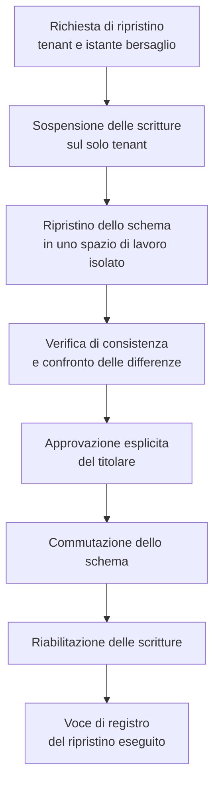
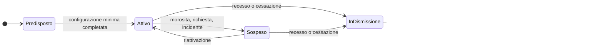

# Multi-tenancy

## 1. Il problema, formulato correttamente

La multi-tenancy di Telemedic non è il problema di «servire più clienti con la stessa
installazione». È il problema di **tenere separati dati che appartengono a titolari del
trattamento giuridicamente autonomi**, su un'infrastruttura condivisa, in modo dimostrabile.

La differenza fra le due formulazioni è sostanziale. Nella prima, una fuga di dati fra clienti è
un difetto di prodotto, spiacevole e correggibile. Nella seconda è una comunicazione di dati
relativi alla salute fra soggetti distinti, cioè un evento con conseguenze proprie per il cliente
che la subisce, per quello che la riceve e per chi gestisce l'infrastruttura. Il livello di
garanzia richiesto non è quello dell'assenza di difetti noti: è quello della **separazione
strutturale**, che regge anche all'errore di programmazione.

A questo si aggiunge una proprietà del dominio: in questo sistema **anche i dati apparentemente
amministrativi sono sensibili**. Il fatto che una persona abbia un appuntamento con una
determinata branca specialistica è un dato relativo alla salute. Non esiste, nel modello, una
categoria di dati «neutri» che possa essere isolata con meno rigore.

I concetti generali di multi-tenancy sono nel
[modulo 11 della guida](../10_fondamenti/11-fondamenti-informatici.md#9-multi-tenancy); qui si
stabilisce quale modello adotta Telemedic, come lo impone e che cosa ne consegue.

## 2. Il modello adottato

**Uno schema per tenant su una base dati condivisa, con sicurezza a livello di riga come difesa in
profondità e non come unico meccanismo.**

La formulazione ha tre parti e nessuna è ridondante.

**Uno schema per tenant.** Ogni tenant ha il proprio insieme di tabelle in uno spazio di nomi
proprio. Non c'è una colonna di tenant che discrimina le righe di una tabella comune: le righe di
tenant diversi non stanno nella stessa tabella.

**Su una base dati condivisa.** Non un'istanza per tenant. Il costo operativo di un'istanza per
cliente è sproporzionato per il profilo di utenza atteso, e la separazione a livello di istanza non
aggiunge garanzie sostanziali rispetto alla separazione a livello di schema, quando quest'ultima è
imposta correttamente.

**Sicurezza a livello di riga come difesa in profondità.** Le tabelle portano comunque
l'identificativo di tenant e sono protette da politiche di riga. È ridondante rispetto alla
separazione degli schemi ed è deliberato: è la seconda barriera che regge quando la prima è stata
aggirata da un errore.

### 2.1 Perché non le righe condivise

Il modello a righe condivise — una sola tabella, una colonna che distingue il tenant — è più
economico da realizzare e più costoso da difendere. Le tre ragioni del rifiuto:

**Il ripristino selettivo diventa difficile.** Un cliente che chiede di riportare i propri dati a
un istante precedente, dopo un proprio errore operativo, con righe condivise costringe a estrarre e
reinserire selettivamente righe di una tabella che contiene anche i dati degli altri: operazione
lunga, rischiosa e difficile da provare. Con schemi separati è il ripristino di un insieme di
tabelle. È lo scenario di qualità SQ-08, ed è un requisito, non un desiderio.

**La dimostrazione della separazione diventa argomentativa.** Con righe condivise, alla domanda
«come sapete che il cliente A non vede i dati di B?» la risposta è «perché ogni query filtra per
tenant». È una risposta sulla disciplina del codice. Con schemi separati la risposta è «perché il
ruolo applicativo che serve A non ha alcun privilegio sullo schema di B»: è una risposta sulla
struttura.

**La dismissione di un tenant diventa una cancellazione selettiva.** Con righe condivise, portare a
termine la cessazione di un cliente significa cancellare righe sparse in decine di tabelle,
sperando che nessuna sia stata dimenticata. Con schemi separati è la rimozione di uno spazio di
nomi.

### 2.2 Il costo che si accetta

| Costo | Come si governa |
|---|---|
| Le migrazioni vanno applicate a ogni schema | Automatizzate, idempotenti, reversibili, con esito registrato per schema |
| Il numero di oggetti nella base dati cresce con i clienti | Dimensionamento dichiarato, sorveglianza dei limiti dell'archivio |
| Il pool di connessioni non può essere partizionato per tenant senza sprechi | Pool condiviso con impostazione e azzeramento del contesto a ogni prestito, §3 |
| Le interrogazioni che attraversano i tenant per fini di esercizio richiedono un percorso dedicato | Percorso separato, con privilegi propri e tracciamento proprio, §6 |
| L'evoluzione dello schema deve essere retrocompatibile durante la finestra di migrazione | Migrazioni in due fasi, §4 |

Nessuno di questi costi è nascosto: sono la contropartita di una separazione strutturale, e sono
stati pesati contro le tre ragioni di §2.1.

### 2.3 Che cosa non è per tenant

Non tutto è per tenant, e distinguere è importante quanto isolare.

| Ambito | Collocazione |
|---|---|
| Dati clinici, anagrafici, documentali, di consenso, di configurazione, di registro | **Per tenant**, nello schema del tenant |
| Definizione dei permessi atomici | **Comune**: è un insieme chiuso che nessun tenant amplia |
| Struttura del catalogo delle prestazioni | **Comune**, il contenuto è per tenant |
| Politiche terminologiche di installazione | **Comune** all'installazione, con possibilità di restrizione per tenant |
| Registro dei tenant e loro stato | **Comune**, in uno schema di amministrazione con privilegi propri |
| Registro immutabile | Per tenant nel contenuto, **conservato separatamente** dall'archivio applicativo |
| Chiavi di cifratura del materiale registrato | **Per tenant**, mai condivise |
| Metriche tecniche di infrastruttura | **Comuni** e non riferite a tenant, dove possibile: sono dati di esercizio |

## 3. La propagazione del contesto

### 3.1 Il principio

**Nessuna operazione sui dati avviene senza un tenant risolto.** Non esiste un valore predefinito,
non esiste un tenant «di sistema» a cui ricadere, non esiste un percorso che, in assenza di
contesto, restituisca l'insieme completo. In assenza di contesto, l'operazione **fallisce**.

La formulazione negativa è deliberata. La formulazione positiva — «ogni operazione imposta il
tenant» — è una regola di disciplina che qualcuno prima o poi dimentica. La formulazione negativa è
verificabile: si può provare che un percorso senza contesto fallisce, non si può provare che
qualcuno si è ricordato.

### 3.2 Il percorso del contesto

```mermaid
sequenceDiagram
    autonumber
    participant EXT as Chiamante
    participant GW as Gateway applicativo
    participant APP as Applicazione
    participant POOL as Pool di connessioni
    participant DB as Base dati

    EXT->>GW: richiesta con asserzione di identita
    GW->>GW: risolve il tenant dall'asserzione,<br/>non dal percorso ne da un parametro
    GW->>GW: verifica che il principale sia abilitato su quel tenant
    GW->>APP: invoca con contesto di tenant esplicito
    APP->>APP: verifica la presenza del contesto al confine del contesto delimitato
    APP->>POOL: chiede una connessione e apre la transazione
    APP->>DB: imposta il contesto di tenant **dentro la transazione**
    APP->>DB: interrogazione
    DB->>DB: le politiche di riga valutano il contesto; in sua assenza negano tutto
    DB-->>APP: risultato
    APP->>DB: chiusura della transazione, il contesto decade con essa
    APP->>POOL: restituisce la connessione senza contesto residuo
```

**Il tenant si risolve dall'asserzione di identità, mai dalla richiesta.** Un tenant preso da un
parametro del percorso o da un'intestazione è un tenant che il chiamante può scegliere: è la
definizione di una fuga di dati. Il gateway ricava il tenant dal principale autenticato e verifica
che quel principale sia abilitato su quel tenant; il valore eventualmente presente nella richiesta
può solo essere **confrontato** con quello risolto, mai sostituirlo.

**Il contesto è verificato al confine di ogni contesto delimitato**, non solo al gateway. Un
contesto che riceve una chiamata interna senza contesto di tenant la rifiuta: è la barriera che
regge quando una chiamata nasce da un processo interno e non da una richiesta esterna.

**Il contesto si imposta dentro la transazione, con la forma che decade alla sua chiusura, non con
quella che persiste sulla connessione.** È il punto in cui questa architettura recepisce il
vincolo V-112 posto dall'area tecnica, e la differenza fra le due forme non è stilistica: la forma
persistente lascia il tenant sulla connessione restituita al pool, e alla richiesta successiva
produce una contaminazione fra titolari autonomi. È un difetto che non dà sintomi visibili e si
manifesta come dato altrui in una schermata.

Da qui discendono tre condizioni congiunte, tutte verificate:

- **in assenza di contesto le politiche di riga negano tutto**, non lasciano passare;
- **le tabelle impongono la politica anche al proprietario**;
- **il ruolo applicativo non è proprietario degli oggetti** e non possiede l'attributo che consente
  di superare le politiche.

Nessun accesso ai dati avviene fuori da una transazione con tenant risolto.

### 3.3 I processi che non nascono da una richiesta

Il percorso di §3.2 copre le richieste. Restano tre famiglie di operazioni che non hanno un
chiamante e che sono la sede tipica dei difetti di isolamento.

| Famiglia | Come si risolve il tenant |
|---|---|
| **Lavori pianificati** — scadenze, solleciti, applicazione delle politiche di conservazione | Il lavoro è eseguito **per tenant**, iterando sul registro dei tenant attivi, con contesto impostato a ogni iterazione. Non esiste una versione del lavoro che opera su tutti i tenant in una sola interrogazione |
| **Consumatori di eventi** | Il tenant è nella busta dell'evento ed è impostato prima di qualunque accesso. Un evento senza tenant è scartato nella coda dei messaggi non elaborabili, non processato con un valore predefinito |
| **Relay dell'outbox** | Legge la propria tabella nello schema del tenant, con contesto impostato. Non esiste un relay che legge da tutti gli schemi in una sola interrogazione |

La regola comune: **l'iterazione sui tenant è esplicita e sequenziale, mai implicita in
un'interrogazione**. Costa più cicli e rende impossibile la classe di difetti in cui un'operazione
pensata per un tenant tocca gli altri.

### 3.4 L'isolamento del rumore

L'isolamento dei dati non basta: serve anche l'isolamento delle risorse, altrimenti un tenant
degrada il servizio degli altri senza vederne i dati. È lo scenario di qualità SQ-05.

**Quote, limiti di traffico e interruttori automatici sono per tenant e per destinazione, mai
globali.** Il caso che li motiva è concreto: un integratore il cui ricevente di eventi è
indisponibile accumula consegne fallite; senza isolamento, i tentativi verso quel destinatario
consumano la capacità di consegna di tutti. Con l'isolamento, la frequenza verso quel destinatario
si riduce, poi si sospende, e gli altri non se ne accorgono.

Lo stesso vale per le risorse di calcolo condivise: un'esportazione voluminosa richiesta da un
tenant non deve poter esaurire il pool di connessioni e bloccare l'ingresso in sala d'attesa di un
altro. La separazione dei pool per classe di operazione — interattiva, di sfondo, di esportazione —
è un requisito architetturale, non un'ottimizzazione.

## 4. Migrazioni

### 4.1 Il vincolo

Con uno schema per tenant, una migrazione è N migrazioni. Le proprietà richieste sono quattro e
non sono negoziabili:

1. **Automatizzata.** Nessun passaggio manuale, per nessuno schema. Un passaggio manuale su cento
   schemi è un errore che accade.
2. **Idempotente.** Riapplicare una migrazione già applicata non produce effetti.
3. **Reversibile.** Ogni migrazione ha una procedura di annullamento **provata**, non descritta.
   Una migrazione irreversibile su un archivio di dati sanitari è un rischio operativo che non si
   assume.
4. **Con esito registrato per schema.** Lo stato della migrazione è noto per ogni tenant. Un
   insieme di schemi in stati diversi è una condizione normale durante la finestra di migrazione, e
   va rappresentata, non evitata.

### 4.2 Migrazione in due fasi

Poiché durante la finestra alcuni schemi sono migrati e altri no, **l'applicazione deve funzionare
con entrambe le forme dello schema**. Ne discende il metodo obbligatorio per ogni modifica non
retrocompatibile:

| Fase | Contenuto |
|---|---|
| **Espansione** | Si aggiunge la nuova forma senza rimuovere la vecchia. Lo schema regge entrambe. Si rilascia il codice che sa scrivere in entrambe e leggere da entrambe |

> **Il metodo si applica a ogni migrazione, non solo a quelle non retrocompatibili** (vincolo V-111
> posto dall'area tecnica). Nessun rilascio è insieme distruttivo e funzionale, e **due versioni
> consecutive dell'applicazione devono poter convivere sulla stessa base dati**: è la condizione
> necessaria all'aggiornamento senza interruzione e al ritorno a una versione precedente. Una
> funzionalità che richieda una migrazione distruttiva nello stesso rilascio **va riprogettata**,
> non autorizzata in deroga.

| **Migrazione dei dati** | Si popola la nuova forma a partire dalla vecchia, per tenant, con possibilità di sospensione e ripresa |
| **Commutazione** | Il codice legge dalla nuova forma. La vecchia resta popolata |
| **Contrazione** | Solo dopo che tutti gli schemi sono commutati e che è trascorso il periodo di sicurezza, si rimuove la vecchia forma |

Il periodo fra commutazione e contrazione **non è una formalità**: è la finestra in cui un
ripristino a un istante precedente resta possibile senza perdere dati. Contrarre subito significa
rendere il ripristino distruttivo.

### 4.3 Migrazioni che toccano dati clinici

Una migrazione che trasforma dati clinici ha requisiti aggiuntivi:

- **Nessuna trasformazione con perdita** senza approvazione esplicita e senza copia integrale dello
  stato precedente conservata per il periodo dichiarato.
- **Prova di equivalenza** su un insieme rappresentativo di dati sintetici prima
  dell'applicazione, e verifica di consistenza dopo, con esito registrato.
- **Il registro immutabile non si migra.** Le sue voci sono immutabili: una modifica di schema
  produce una nuova generazione di registro, con l'ancoraggio che collega la nuova alla precedente.
  Riscrivere le voci esistenti romperebbe la catena di integrità e distruggerebbe proprio ciò che
  il registro serve a dimostrare.

## 5. Ripristino

### 5.1 Ripristino selettivo di un tenant

È lo scenario di qualità SQ-08 ed è la ragione principale della scelta a schemi separati.



Quattro proprietà del procedimento:

1. **Gli altri tenant non subiscono alcuna indisponibilità.** È la misura dello scenario.
2. **Il ripristino avviene prima in uno spazio di lavoro isolato**, non in luogo. Il ripristino
   diretto sullo schema attivo distrugge lo stato corrente prima che qualcuno abbia potuto
   verificare che quello ripristinato sia quello atteso.
3. **L'approvazione è del titolare del trattamento**, non dell'operatore tecnico. Il ripristino
   cancella dati sanitari prodotti dopo l'istante bersaglio: è una decisione del titolare.
4. **Il ripristino è esso stesso un fatto registrato**, con l'istante bersaglio, il richiedente,
   l'approvante e il perimetro.

### 5.2 Che cosa non si ripristina all'indietro

Tre categorie di dati non seguono il ripristino dello schema applicativo, e la ragione è la stessa
per tutte: **rappresentano fatti accaduti, non stato**.

| Categoria | Perché |
|---|---|
| Registro immutabile | Un accesso avvenuto resta avvenuto. Riportarlo indietro cancellerebbe l'evidenza degli accessi compresi nella finestra, che è precisamente ciò che il registro esiste per conservare |
| Evidenze di consenso e di revoca | Una revoca manifestata è un fatto; un ripristino che la annulla riattiverebbe un trattamento che il soggetto ha rifiutato |
| Eventi già consegnati a sistemi terzi | Sono usciti. Il ripristino può richiedere una compensazione — un evento di rettifica — non una cancellazione retroattiva di ciò che il destinatario ha già ricevuto |

Ne discende che dopo un ripristino il registro contiene voci relative a operazioni che, nello
stato applicativo, non risultano più. **È corretto così** e va spiegato a chi verifica: la
divergenza è documentata dalla voce di registro del ripristino stesso.

### 5.3 Obiettivi differenziati

Non tutte le categorie di dati hanno lo stesso obiettivo di punto di ripristino, e trattarle in
modo uniforme significa o sovradimensionare o perdere dati che non si possono perdere.

| Categoria | Obiettivo di punto di ripristino | Conseguenza architetturale |
|---|---|---|
| Documentazione clinica firmata | **Zero**: nessuna perdita ammessa | Replica sincrona per questa categoria, con il costo in latenza sull'operazione di firma accettato e dichiarato |
| Consensi e revoche | Zero | Come sopra |
| Registro immutabile | Zero | Scrittura confermata prima della risposta all'operazione applicativa |
| Prestazioni e agenda | Breve, dichiarato | Replica asincrona con ritardo sorvegliato |
| Metriche di canale | Perdita tollerata | Nessun requisito particolare |
| Materiale registrato | Dichiarato per tenant | Dipende dalla politica del titolare |

La riga della documentazione firmata è quella che ha un costo reale: la replica sincrona aggiunge
latenza all'operazione di firma. **Il costo è accettato e va dichiarato al professionista**
nell'esperienza d'uso — l'apposizione della firma non è istantanea — invece di essere nascosto con
una conferma ottimistica che potrebbe risultare falsa.

## 6. Operazioni che attraversano i tenant

Esistono operazioni legittime che riguardano più tenant: l'inventario per l'esercizio, la
sorveglianza dei limiti, l'applicazione di una politica di conservazione, la verifica periodica
dell'integrità delle catene. Sono la superficie più pericolosa del sistema, perché per definizione
hanno privilegi che nessun percorso applicativo ha.

Cinque regole, tutte necessarie:

1. **Percorso separato.** Non è un ramo condizionale del percorso applicativo. È codice distinto,
   con un ruolo di base dati distinto, in un pacchetto distinto.
2. **Nessun accesso al contenuto.** Le operazioni che attraversano i tenant lavorano su
   **metadati e conteggi**, mai su contenuto clinico. L'inventario sa quante prestazioni ci sono,
   non di chi.
3. **Soglia minima di aggregazione.** Nessun valore aggregato è esposto sotto la soglia di
   cardinalità dichiarata: con numeri piccoli, un aggregato è un identificatore.
4. **Tracciamento rafforzato.** Ogni esecuzione produce una voce di registro con il perimetro
   effettivo, non con il perimetro richiesto.
5. **Nessun percorso interattivo.** Non esiste una schermata che consenta a un essere umano di
   interrogare più tenant contemporaneamente. Le operazioni che li attraversano sono processi con
   un mandato definito, non strumenti esplorativi.

## 7. Ciclo di vita del tenant



| Stato | Significato operativo |
|---|---|
| **Predisposto** | Schema creato, migrazioni applicate, nessun dato. La creazione è **integralmente automatizzata**: nessun passaggio manuale |
| **Attivo** | Esercizio normale |
| **Sospeso** | Accesso applicativo bloccato, dati intatti, lavori pianificati sospesi tranne quelli di conservazione e di verifica dell'integrità. **Il registro resta scrivibile**: un tentativo di accesso su tenant sospeso è un fatto da registrare |
| **In dismissione** | Sole letture per l'esportazione. Nessuna scrittura applicativa |
| **Estratto** | L'esportazione completa è stata consegnata al titolare in formato aperto e la consegna è stata verificata |
| **Chiuso** | Schema rimosso. Sopravvivono: la voce di registro della dismissione, l'evidenza della consegna dell'esportazione e — separatamente e per il tempo prescritto — il registro immutabile del tenant |

Due punti che si sbagliano spesso:

**L'esportazione precede la cancellazione ed è verificata, non presunta.** «Consegnata» significa
che il destinatario ha confermato di averla ricevuta e che il contenuto è stato verificato per
completezza. Cancellare dopo aver spedito, senza conferma, produce il caso in cui un titolare
perde definitivamente la propria documentazione sanitaria.

**Il registro sopravvive al tenant.** Ha un obbligo di conservazione proprio, indipendente dalla
durata del rapporto, e la sua conservazione separata è ciò che lo rende possibile. Il fatto che il
registro sopravviva va dichiarato al titolare nel contratto, non scoperto dopo.

## 8. Il caso a tenant unico

L'installazione presso il cliente è il **caso degenere con un solo tenant**: stesso codice, stessa
struttura, nessun ramo separato, nessuna configurazione che disattivi la tenancy.

### 8.1 Perché non si semplifica

La tentazione — «in installazione singola il tenant non serve, semplifichiamo» — produrrebbe due
percorsi di codice, quindi due comportamenti, quindi difetti che si manifestano solo in uno dei due
assetti. Peggio: sarebbe **irreversibile**, perché il cliente che oggi ha un'installazione singola
e domani vuole servire due strutture giuridicamente distinte si troverebbe di fronte a una
migrazione impossibile.

C'è anche una ragione di dominio: **un'installazione presso il cliente non ha necessariamente un
solo titolare del trattamento**. Un'azienda sanitaria che ospita anche l'attività di
professionisti convenzionati, o un poliambulatorio che eroga per conto di più soggetti giuridici,
ha bisogno della separazione anche senza essere un servizio gestito.

### 8.2 Che cosa cambia davvero

| Aspetto | Servizio gestito | Installazione presso il cliente |
|---|---|---|
| Numero di schemi | Molti | Uno, o pochi |
| Chi crea i tenant | Il gestore, per interfaccia applicativa | Chi installa, con la stessa interfaccia applicativa |
| Chi è titolare del trattamento | Ciascun tenant | Il soggetto che installa |
| Chi è responsabile del trattamento | Il gestore | Nessuno, o il fornitore di servizi tecnici |
| Isolamento del rumore fra tenant | Determinante | Poco rilevante, ma attivo comunque |
| Migrazioni | Molti schemi, con finestra | Uno schema, immediata |
| Ripristino selettivo | Requisito centrale | Coincide con il ripristino dell'installazione |
| Verifica dell'integrità delle catene | Per tenant | Uguale, con un solo tenant |

**Il codice è identico in entrambe le colonne.** Ciò che cambia è la cardinalità e la ripartizione
delle responsabilità giuridiche, che è materia dell'area di conformità.

### 8.3 Il vincolo che ne discende

Un corollario spesso trascurato: **le funzioni disponibili nel servizio gestito devono esserlo
anche nell'installazione presso il cliente**, e viceversa. Una funzione che esiste solo nel
servizio gestito produce documentazione divergente, prove che coprono un solo assetto e clienti che
scoprono una differenza dopo aver scelto. Le uniche differenze ammesse sono quelle **dichiarate
nella matrice degli assetti** di [08 — Viste di deployment](08-viste-di-deployment.md), e ciascuna
ha una motivazione scritta.

## 9. Verifiche automatiche obbligatorie

Le seguenti verifiche sono bloccanti. La loro assenza rende la tenancy una promessa.

| # | Verifica | Che cosa dimostra |
|---|---|---|
| MT-1 | Un'interrogazione senza contesto di tenant fallisce | La formulazione negativa di §3.1 |
| MT-2 | Un principale abilitato sul tenant A non ottiene alcun dato del tenant B, per nessun percorso, incluse le operazioni di ricerca e di esportazione | L'isolamento effettivo |
| MT-3 | Le politiche di riga sono attive e non superabili dal ruolo applicativo | La difesa in profondità funziona davvero |
| MT-4 | La connessione restituita al pool non conserva il contesto della richiesta precedente | Assenza di contaminazione per riuso |
| MT-5 | Ogni tabella di dominio porta l'identificativo di tenant | Il vincolo V4 |
| MT-6 | Ogni evento pubblicato porta l'identificativo di tenant | Il vincolo V4 sugli eventi |
| MT-7 | Ogni voce di registro porta l'identificativo di tenant | Il vincolo V4 sul registro |
| MT-8 | Ogni migrazione è reversibile e la reversione è provata | §4.1 |
| MT-9 | La creazione di un tenant non richiede passaggi manuali | §7 |
| MT-10 | Nessun lavoro pianificato opera su più tenant in una sola interrogazione | §3.3 |
| MT-11 | Un evento senza tenant finisce nella coda dei messaggi non elaborabili, non viene processato | §3.3 |
| MT-12 | Nessun aggregato che attraversa i tenant è esposto sotto la soglia di cardinalità | §6 |

Le verifiche MT-3 e MT-4 meritano una nota. La sicurezza a livello di riga può essere
**silenziosamente inefficace**: se il ruolo applicativo possiede l'attributo che consente di
superare le politiche, oppure se le politiche non sono imposte anche al proprietario delle tabelle,
il meccanismo è attivo nella configurazione e inattivo nei fatti. La verifica non deve accertare
che le politiche esistano, ma che **producano l'effetto**: un tentativo di accesso a una riga di un
altro tenant deve fallire nella prova, non essere semplicemente evitato dal codice.

## 10. Punti non verificati di questa sezione

| Riferimento | Che cosa non è verificato | A chi va chiesto |
|---|---|---|
| §2.2 | Il limite pratico di schemi gestibili nell'archivio adottato prima che il costo dei metadati diventi significativo | Area tecnica, con misura su dati sintetici prima della prima installazione a molti tenant |
| §5.3 | Il costo in latenza effettivo della replica sincrona sull'operazione di firma nell'assetto adottato | Area tecnica, con misura |
| §4.2 | La durata del periodo di sicurezza fra commutazione e contrazione | Area tecnica in accordo con l'area di conformità, che ne determina il minimo in base agli obblighi di conservazione |
