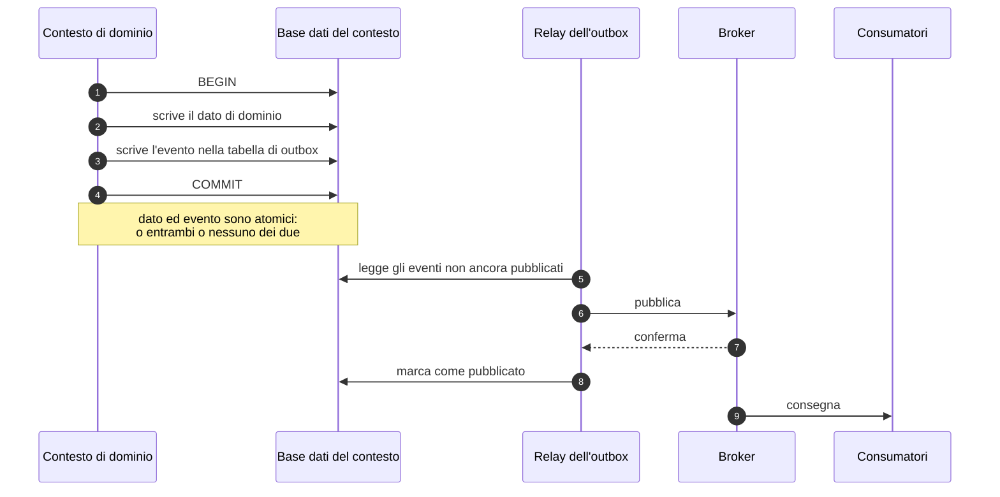

# Eventi e integrazione interna

## 1. Che problema risolve questo capitolo

Ogni fatto rilevante di Telemedic ha conseguenze in più contesti. La firma di un documento ne ha
almeno sei: il documento diventa immutabile, l'assistito va avvisato, il sistema di origine va
alimentato, l'infrastruttura documentale va alimentata quando previsto e consentito, il fatto
rendicontabile va emesso, il registro va scritto. Nessuna di queste conseguenze può essere
rinunciata; nessuna può far fallire la firma; nessuna può bloccare il professionista in attesa.

La teoria — architettura a eventi, doppia scrittura, outbox, idempotenza, consegna almeno una
volta — è nel [modulo 11 della guida](../10_fondamenti/11-fondamenti-informatici.md#5-la-doppia-scrittura-e-loutbox-transazionale)
e non viene ripetuta. Questo capitolo stabilisce **come è fatto il meccanismo in Telemedic**, quali
garanzie offre, quali deliberatamente non offre, e dove passa il confine con il piano del tempo
reale.

## 2. L'outbox transazionale

### 2.1 La decisione

**L'outbox transazionale su base dati relazionale è l'unica sorgente degli eventi in uscita.** Il
broker è alimentato da un relay che legge l'outbox; nessun percorso applicativo scrive
direttamente sul broker.



### 2.2 Perché non la scrittura diretta

La scrittura diretta sul broker dopo il consolidamento della transazione produce due difetti
simmetrici, entrambi reali e nessuno dei due tollerabile in questo dominio.

**L'evento perso.** La transazione si consolida, il processo termina prima della pubblicazione. Il
documento è firmato, ma il sistema di origine non lo saprà mai, l'assistito non riceve la notifica,
il fatto rendicontabile non è emesso. Nessuno se ne accorge, perché non c'è nulla che segnali
l'assenza di un evento che non è mai esistito.

**L'evento fantasma.** L'ordine inverso — pubblicare prima di consolidare — produce il caso opposto:
l'evento è consegnato, la transazione fallisce. Il sistema di origine riceve la notifica di un
documento firmato che non esiste. È il difetto peggiore dei due, perché produce dati errati in un
sistema di terzi.

L'outbox elimina entrambi per costruzione: l'evento è scritto **nella stessa transazione del dato**,
quindi esiste esattamente quando il dato esiste, e la pubblicazione è ritentabile indefinitamente
perché la sorgente è persistita.

### 2.3 Dove sta la tabella

**Nello schema del contesto che produce l'evento.** Non in uno schema comune, non in una base dati
separata, non in un'istanza dedicata. La ragione è l'atomicità: la scrittura del dato e la
scrittura dell'evento devono stare nella stessa transazione, quindi nella stessa base dati e nello
stesso ambito transazionale.

Con il modello a uno schema per tenant, ne discende che **l'outbox è per tenant**. Ha tre
conseguenze utili: il relay itera sui tenant esplicitamente, come ogni altro processo che non nasce
da una richiesta; un tenant con molti eventi non allunga la coda degli altri; la dismissione di un
tenant porta con sé la sua outbox.

### 2.4 Come il relay legge

Le due modalità disponibili non sono equivalenti e la scelta ha conseguenze sull'inventario dei
componenti di terze parti.

| Modalità | Meccanismo | Vantaggi | Costi |
|---|---|---|---|
| **Interrogazione periodica** | Il relay interroga la tabella a intervalli brevi, prende un lotto con blocco che salta le righe già prese, pubblica, marca | Nessun componente aggiuntivo; nessun privilegio speciale sull'archivio; comprensibile e riproducibile ovunque | Latenza aggiuntiva pari all'intervallo; carico costante sull'archivio anche in assenza di eventi |
| **Cattura delle modifiche dal registro di replica** | Un componente legge il registro delle modifiche dell'archivio e pubblica | Latenza minima; nessun carico di interrogazione | Introduce un componente di terze parti da censire; richiede privilegi di replica; complica l'installazione presso il cliente; il suo stato di avanzamento diventa un ulteriore elemento da sorvegliare |

**Decisione adottata: interrogazione periodica come modalità predefinita**, in entrambi gli assetti.
La motivazione decisiva non è tecnica ma di perimetro: l'installazione presso il cliente deve
restare leggera e installabile senza privilegi particolari, e ogni componente di terze parti
aggiunto entra nell'inventario che va censito e sorvegliato per l'intera vita del prodotto.

La cattura delle modifiche resta **un'opzione dichiarata** per assetti ad alto volume, con due
condizioni: il componente è censito nell'inventario prima dell'adozione, e l'interrogazione
periodica resta funzionante come ripiego. Il contratto degli eventi non cambia fra le due modalità:
è la proprietà che consente di cambiare idea senza toccare i consumatori.

### 2.5 Che cosa non passa dall'outbox

**Il segnalamento della sessione in tempo reale non passa dall'outbox e non passa dal broker.**
È il confine di §8 e va enunciato qui perché la tentazione di far transitare tutto dal meccanismo
generale è forte e l'errore è costoso.

Non passano dall'outbox nemmeno: le interrogazioni sincrone fra contesti, che non sono eventi; le
metriche di esercizio, che hanno un percorso proprio; le voci del registro immutabile, che hanno un
percorso proprio con garanzie più forti — il fallimento della scrittura di registro fa fallire
l'operazione applicativa, mentre il fallimento di un consumatore di eventi no.

## 3. La busta

### 3.1 Il formato

Le buste adottano **CloudEvents in modalità strutturata**: l'intero evento, attributi e dato, in un
solo corpo JSON. La modalità binaria — attributi negli intestazioni del protocollo di trasporto,
dato nel corpo — non è adottata come predefinita.

```json
{
  "specversion": "1.0",
  "id": "01J8ZK4Q0000000000000000",
  "source": "/tenants/tenant-dimostrativo/contexts/documentazione-clinica",
  "type": "telemedic.documento.firmato.v1",
  "subject": "documento/doc-000042",
  "time": "2026-08-25T09:14:07.412Z",
  "datacontenttype": "application/json",
  "dataschema": "https://esempio.invalido/schemi/documento-firmato/1.json",
  "tenantid": "tenant-dimostrativo",
  "sequence": "184",
  "correlationid": "01J8ZK4M0000000000000000",
  "data": {
    "documentoId": "doc-000042",
    "prestazioneId": "prest-000117",
    "versione": 1,
    "tipoDocumento": "referto-di-televisita",
    "firmatoIl": "2026-08-25T09:14:06.980Z"
  }
}
```

*Tutti i valori sono sintetici e i domini sono deliberatamente non risolvibili.*

### 3.2 Regole sulla busta

| Attributo | Regola |
|---|---|
| `id` | Identificativo ordinabile nel tempo. La coppia `source` più `id` è unica per costruzione: è il fondamento della deduplicazione |
| `source` | Identifica il tenant e il contesto produttore. Non è un indirizzo raggiungibile |
| `type` | Spazio di nomi invertito con **versione esplicita nel nome**. La versione nel tipo è ciò che consente a una nuova versione di un evento di coesistere con la precedente durante la migrazione dei consumatori |
| `subject` | Riferimento all'aggregato interessato, nella forma del piano applicativo |
| `time` | Istante dell'accadimento in forma assoluta con millisecondi |
| `datacontenttype` | Attributo della busta. **Non esiste una intestazione di protocollo dedicata a questo attributo**: nella modalità strutturata il tipo di contenuto del messaggio è quello della busta stessa; nella modalità binaria l'attributo si mappa sul tipo di contenuto del messaggio, non su un'intestazione con prefisso proprio. Una implementazione che emette un'intestazione dedicata non è conforme |
| `dataschema` | Riferimento allo schema del dato, **versionato**. Rende la busta autodescrittiva e validabile, e alimenta la generazione dei tipi negli strumenti per gli integratori |
| `tenantid` | Estensione di progetto. **Obbligatoria, senza eccezioni** |
| `sequence` | Estensione di progetto. Numero monotono crescente **per aggregato**, non globale |
| `correlationid` | Estensione di progetto. Collega gli eventi originati dalla stessa azione, per la ricostruzione del percorso |

### 3.3 Il contenuto del dato

**Il dato è magro.** L'evento trasporta identificativi, riferimenti e i pochi attributi che
servono a decidere se interessa; **non trasporta contenuto clinico** verso sistemi terzi. Chi
riceve e ha bisogno del contenuto lo rilegge con una chiamata autenticata, sotto la propria
autorizzazione.

Le tre ragioni, in ordine di importanza:

1. **Autorizzazione al momento della lettura.** Se il contenuto viaggia nella busta, è stato
   autorizzato al momento della produzione. La rilettura sposta la decisione al momento
   dell'accesso, con gli attributi vigenti allora: se nel frattempo il soggetto ha revocato o
   oscurato, la rilettura lo rispetta, la busta già consegnata no.
2. **Superficie di esposizione.** Una busta con contenuto clinico attraversa code, registri di
   diagnostica, sistemi di sorveglianza e archivi di ritentativo. Ogni transito è una copia in un
   luogo con regime di protezione diverso.
3. **Stabilità del contratto.** Una busta magra cambia meno spesso, perché non segue l'evoluzione
   della forma del contenuto.

Per gli eventi **interni** fra contesti la regola è più permissiva ma non assente: si trasporta ciò
che serve al consumatore per decidere, non l'aggregato intero. Un evento che trasporta l'intero
stato dell'aggregato accoppia il consumatore alla forma interna del produttore, che è precisamente
ciò che i confini dovevano evitare.

### 3.4 Versionamento del tipo

La versione sta **nel nome del tipo**, non in un attributo separato. La scelta è deliberata: un
consumatore filtra per tipo, e con la versione nel tipo può sottoscrivere la versione che sa
trattare, ignorando le altre. Con la versione in un attributo, il consumatore riceve tutto e deve
scartare, il che significa che una nuova versione lo raggiunge comunque.

Regola di evoluzione:

| Tipo di modifica | Effetto |
|---|---|
| Aggiunta di un campo facoltativo | Nessuna nuova versione. I consumatori ignorano ciò che non conoscono |
| Aggiunta di un campo obbligatorio, rimozione, rinomina, cambio di tipo o di significato | **Nuova versione**, con emissione parallela delle due versioni per la durata del preavviso di dismissione |
| Cambio della semantica del fatto a parità di forma | **Nuova versione.** È il caso più insidioso: la forma è compatibile ma il consumatore trae conclusioni sbagliate |

Per la durata del preavviso di dismissione **entrambe le versioni sono emesse**. Ne discende che il
produttore deve poter costruire la vecchia forma dal nuovo stato: se non è possibile, la modifica
non è una nuova versione dell'evento ma un evento nuovo, con un nome nuovo.

## 4. Semantica di consegna

### 4.1 Ciò che si garantisce e ciò che non si garantisce

| Garanzia | Stato |
|---|---|
| Un evento prodotto viene consegnato | **Sì**, con ritentativo fino all'esaurimento della politica |
| Consegnato **almeno una volta** | **Sì** |
| Consegnato **esattamente una volta** | **No.** Non è garantibile attraverso il confine di un sistema esterno |
| Ordine globale fra eventi | **No.** Nessun requisito funzionale può dipendervi |
| Ordine fra eventi con la stessa chiave di partizionamento | **Sì**, all'interno della partizione |
| Il dato e l'evento sono atomici | **Sì**, per costruzione dell'outbox |

La riga sull'ordine globale è quella che produce più malintesi negli integratori. **Un evento di
conclusione può arrivare prima dell'evento di avvio.** È una conseguenza inevitabile dei
ritentativi e della consegna concorrente, ed è documentata nel contratto pubblico, non nascosta.

### 4.2 Come si ricostruisce l'ordine

Due meccanismi, complementari.

**Chiave di partizionamento.** La chiave è **l'identificativo dell'aggregato** — la prestazione, il
documento, il piano di monitoraggio — non il tenant. Partizionare per tenant sembra naturale e
produce due difetti: partizioni gravemente sbilanciate, perché i tenant hanno dimensioni molto
diverse; e nessuna garanzia utile, perché l'ordine che serve è quello dei fatti relativi allo stesso
aggregato, non allo stesso cliente.

**Numero di sequenza per aggregato.** Ogni evento porta un numero monotono crescente per aggregato.
Il consumatore che ha già applicato il numero `n` scarta ciò che arriva con un numero inferiore o
uguale. È il meccanismo che rende l'ordine di arrivo **irrilevante** senza costringere a code
ordinate, che sono costose e fragili — un evento bloccato blocca tutta la chiave.

Una nota di prudenza operativa: `[NV]` — l'aumento del numero di partizioni di un argomento in
esercizio può cambiare la funzione di assegnazione e quindi spezzare l'ordine per aggregato durante
il riassestamento. La verifica sul broker adottato è a carico dell'area tecnica **prima** di
qualunque ridimensionamento in esercizio.

### 4.3 Idempotenza per costruzione

**Ogni consumatore è idempotente, senza eccezioni.** Non è una raccomandazione: è una condizione di
accettazione di ogni consumatore, verificata con una prova che consegna lo stesso evento due volte
e verifica l'identità dello stato risultante.

Le tre forme, in ordine di preferenza:

| Forma | Quando si usa | Nota |
|---|---|---|
| **Operazione naturalmente idempotente** | «Imposta lo stato a concluso» | Preferibile: non richiede alcun archivio ausiliario |
| **Chiave di deduplicazione persistita** | Quando l'operazione ha effetti cumulativi | La chiave è `source` più `id`. Va conservata per un tempo **superiore alla finestra massima di ritentativo**, altrimenti un ritentativo tardivo trova la chiave scaduta e duplica |
| **Verifica di stato prima dell'effetto** | Quando l'effetto è esterno e non ritrattabile | «Il messaggio per questo evento è già stato recapitato?» prima di recapitare |

Due effetti in questo sistema **non sono ritrattabili** e vanno protetti con la terza forma: il
recapito di un messaggio a una persona, e il deposito di un documento in un'infrastruttura
documentale esterna. Un messaggio inviato due volte a un assistito non è un difetto tecnico
invisibile: è un'esperienza che genera dubbio su un contenuto sanitario. `[NV]` — la finestra di
conservazione delle chiavi di deduplicazione va fissata dall'area tecnica in coerenza con la
finestra massima di ritentativo di §5.1 e non può essere inferiore a essa.

## 5. Ritentativi e fallimento

### 5.1 La politica

Attesa esponenziale **con variazione casuale obbligatoria**:

```
attesa(n) = min( base * 2^(n-1), tetto ) * (0,5 + casuale(0; 0,5))
```

La variazione casuale non è ornamentale. Senza, un'indisponibilità di pochi minuti di un
destinatario produce, alla riattivazione, una raffica sincronizzata di tutti gli eventi accumulati:
un attacco di negazione del servizio involontario contro il proprio integratore.

I valori di base, tetto e numero di tentativi sono **parametri di configurazione con valori
predefiniti dichiarati nel contratto pubblico**, non costanti nel codice. L'integratore deve poter
sapere per quanto tempo il sistema riproverà, perché da quel dato dipende il dimensionamento della
propria finestra di manutenzione.

### 5.2 Che cosa innesca il ritentativo

| Condizione | Ritentativo |
|---|---|
| Errore di rete, scadenza del tempo di attesa | Sì |
| Risposta che indica saturazione o indisponibilità temporanea | Sì, rispettando l'eventuale indicazione di attesa se maggiore di quella calcolata |
| Risposta di errore del ricevente | Sì |
| Risposta di accettazione | No |
| Risposta che indica la dismissione definitiva della destinazione | No, e la destinazione viene **disattivata** |
| Altre risposte di errore del chiamante | No: è un errore permanente ed è responsabilità del ricevente |

### 5.3 Interruttore automatico

Dopo un numero dichiarato di fallimenti consecutivi la destinazione passa in stato degradato: la
frequenza di consegna si riduce e l'amministratore del tenant è avvisato. Dopo una durata dichiarata
di fallimento totale la destinazione passa in stato disattivato e gli eventi vanno nella coda dei
messaggi non elaborabili.

**Interruttori e quote sono per tenant e per destinazione, mai globali.** È il corollario del
vincolo di isolamento applicato alla capacità, ed è lo scenario di qualità SQ-05.

### 5.4 Messaggi non elaborabili

Un evento che ha esaurito i tentativi finisce in una coda dedicata **per tenant**, con quattro
proprietà obbligatorie:

1. **Conservazione dichiarata**, non indefinita né implicita.
2. **Ispezionabile** attraverso l'interfaccia applicativa: chi ha subito il fallimento deve poter
   vedere che cosa non è stato consegnato e perché, senza aprire una richiesta di assistenza.
3. **Rieseguibile**, e la riesecuzione **riusa lo stesso identificativo di evento**, così che la
   deduplicazione del ricevente continui a funzionare e la riesecuzione non produca duplicati.
4. **Visibile a un essere umano.** Un fallimento definitivo che finisce solo in un registro di
   diagnostica è un fallimento silenzioso, ed è vietato dal principio secondo cui il silenzio non è
   mai normalità. Se il fallimento riguarda contenuto clinico che doveva raggiungere il sistema di
   origine, entra in una coda di riconciliazione presidiata da un operatore, con un'azione
   possibile.

Una coda dei messaggi non elaborabili che nessuno guarda è peggio dell'assenza della coda, perché
produce la convinzione che il problema sia gestito. La **sorveglianza della sua profondità è un
requisito di esercizio**, con soglia dichiarata.

## 6. Processi a più passi

### 6.1 Il problema

Alcuni fatti clinici innescano sequenze che attraversano contesti e sistemi non transazionabili: un
servizio di firma esterno, un'infrastruttura documentale, un fornitore di identità, il sistema di
origine. Non esiste una transazione che li comprenda; esiste una sequenza di passi, ciascuno dei
quali può fallire, e per alcuni dei quali il fallimento richiede di compensare i precedenti.

Il caso canonico è la chiusura della prestazione con firma e trasmissione: chiudere l'atto, aprire
la refertazione, firmare, mettere a disposizione, restituire al sistema di origine, alimentare
l'infrastruttura documentale, emettere il fatto rendicontabile. Se l'alimentazione documentale
fallisce definitivamente, non si può «annullare la firma»: si compensa con una **rettifica
documentale**, che è un atto di dominio e non un annullamento tecnico.

### 6.2 Orchestrazione, non coreografia

Le due strategie e il perché della scelta:

| Strategia | Come funziona | Pro | Contro |
|---|---|---|---|
| **Coreografia** | Ogni contesto reagisce agli eventi altrui; nessuno conosce il processo nel suo insieme | Accoppiamento minimo; nessun componente centrale | **Il processo non esiste da nessuna parte.** Non si può chiedere al sistema a che punto è; il fallimento parziale è diagnosticabile solo ricostruendo gli eventi a mano; l'aggiunta di un passo richiede di modificare più contesti |
| **Orchestrazione** | Un componente conosce la sequenza, invoca i passi, gestisce le compensazioni e conserva lo stato del processo | Lo stato del processo è **interrogabile**; il fallimento parziale è visibile; il processo è un artefatto documentabile e provabile | Un componente in più; il rischio che l'orchestratore accumuli logica di dominio |

**Decisione adottata: orchestrazione esplicita per i processi clinici critici, coreografia per le
propagazioni semplici.**

La motivazione decisiva è di dimostrabilità, non di eleganza. In questo dominio deve essere
possibile rispondere alla domanda «il referto firmato ieri alle undici è stato trasmesso?» **senza
ricostruire una sequenza di eventi**. Con la coreografia quella domanda non ha un luogo dove essere
posta.

Il criterio di ripartizione:

| Il processo è orchestrato se | Il processo è coreografato se |
|---|---|
| Ha più di due passi che possono fallire indipendentemente | È una propagazione a un solo consumatore |
| Richiede compensazione in caso di fallimento parziale | Il fallimento del consumatore non richiede di annullare nulla |
| Il suo stato deve essere interrogabile da un operatore | Nessuno chiederà mai «a che punto è» |
| Attraversa un sistema esterno non transazionabile | Resta interno |

Processi orchestrati individuati: chiusura, refertazione e trasmissione; arruolamento in un piano
di monitoraggio con acquisizione dei consensi; dismissione di un tenant con esportazione e
cancellazione; rettifica di un documento già trasmesso.

### 6.3 Vincoli sull'orchestratore

1. **Non contiene invarianti di dominio.** Conosce l'ordine dei passi e le compensazioni, non le
   regole. Un orchestratore che decide se un documento può essere firmato ha assorbito il dominio.
2. **Lo stato del processo è persistito e interrogabile**, con l'esito di ogni passo e il motivo di
   ogni fallimento.
3. **Ogni passo è idempotente**, perché il processo può essere ripreso.
4. **Le compensazioni sono atti di dominio**, non annullamenti tecnici: la rettifica di un documento
   trasmesso è una rettifica documentale con la sua evidenza, non una cancellazione.
5. **Il processo ha un termine.** Un processo che resta indefinitamente in un passo intermedio è un
   fallimento silenzioso: dopo la durata dichiarata entra in una coda presidiata.

`[NV]` — Il **meccanismo** di realizzazione dell'orchestrazione — motore dedicato, macchina a stati
persistita in tabella, componente applicativo — non è deciso in quest'area: la decisione è
rinviata con i criteri in [09 — Decisioni rinviate](09-decisioni-rinviate.md). Ciò che è deciso è
la **strategia**, perché è quella che vincola le altre aree.

## 7. Eventi verso l'esterno

Il recapito verso gli integratori appartiene al contesto di frontiera e il suo contratto all'area
di integrazione. Quest'area fissa i vincoli architetturali che ne discendono.

1. **Stessa sorgente.** Gli eventi verso l'esterno derivano dagli stessi eventi di dominio, non da
   una seconda produzione. Due sorgenti divergono.
2. **Selezione, non riscrittura.** Ciò che esce è un sottoinsieme filtrato e proiettato; il
   contesto di frontiera non arricchisce l'evento con informazioni che il produttore non ha messo.
3. **Contenuto clinico escluso** dai messaggi verso sistemi terzi.
4. **Firma asimmetrica** dei messaggi in uscita, con identificativo di chiave risolvibile dal
   materiale pubblico del progetto. Il segreto condiviso non è la modalità predefinita: non dà non
   ripudio e la sua rotazione richiede coordinamento con ciascun integratore.
5. **Le destinazioni sono per tenant**, con proprie chiavi, proprie quote e propri interruttori.
6. **La destinazione è un indirizzo fornito da un terzo**, e come tale una richiesta uscente verso
   un indirizzo non fidato. La protezione è realizzata **una volta sola nel mediatore unico di
   uscita**, ed è un **requisito architetturale e non una regola di codifica**: ai componenti
   applicativi l'uscita è **negata a livello di rete**, così che la difesa non dipenda dalla
   correttezza del codice (vincolo V-157 dell'area di sicurezza). Vi confluiscono cinque punti di
   uscita: gateway terminologico, interoperabilità verso le infrastrutture, messaggi verso
   l'integratore, risoluzione di riferimenti assoluti nelle risorse, recupero di materiale di
   chiavi. **Il relay non vi confluisce e non deve**: per esso vale l'isolamento di rete dedicato.
   Una sola suite di prove di abuso, eseguita contro il mediatore.

## 8. Il confine con il piano del tempo reale

### 8.1 La regola

**Il segnalamento della sessione media non transita per l'outbox né per il broker.**

Le ragioni sono due e sono entrambe dirimenti.

**La latenza.** L'outbox aggiunge la latenza dell'intervallo di interrogazione del relay più quella
del broker. Il percorso di negoziazione della sessione ha un budget di frazioni di secondo
misurate: aggiungere il percorso lungo significa mancare il requisito per costruzione.

**L'ordinamento e la consegna.** Lo scambio dei candidati di rete richiede consegna **esattamente
una volta e in ordine** verso il destinatario. Un canale di pubblicazione generico non lo
garantisce: un candidato duplicato o fuori ordine produce fallimenti di negoziazione intermittenti
e non diagnosticabili.

### 8.2 Che cosa attraversa comunque il confine

Il confine separa **il traffico** dai **fatti**. Il traffico di negoziazione resta interno al
contesto della sessione media; i fatti già accaduti entrano nel piano persistente come eventi
ordinari.

| Attraversa il confine | Non attraversa |
|---|---|
| «La sessione è stata avviata» | Le offerte e le risposte di negoziazione |
| «La sessione è terminata, con questo esito tecnico» | I candidati di rete |
| «La qualità è scesa sotto la soglia configurata» | I campioni di misura, che vanno nell'archivio di serie temporali |
| «La modalità operativa è cambiata» | Lo stato istantaneo della connessione |
| «La registrazione è iniziata» o «è terminata» | I flussi audio e video, in nessuna forma |

### 8.3 La conseguenza sulla distribuzione del carico

Poiché il segnalamento non passa da un canale condiviso, la macchina a stati di una sessione deve
vivere **in un solo processo**, determinato in modo deterministico dall'identificativo della
sessione. È un vincolo architetturale, non un dettaglio realizzativo: significa che la
distribuzione del carico su questo percorso è per identificativo di sessione e non casuale, e che
la riassegnazione a seguito della caduta di un nodo termina le sessioni ospitate da quel nodo, che
si ristabiliscono con una rinegoziazione.

L'alternativa — instradamento casuale con affinità di sessione — è ammessa solo come debito
tecnico dichiarato, con una strategia di uscita scritta, perché sposta il problema sull'affinità
del bilanciatore senza risolvere l'ordinamento.

## 9. Verifiche automatiche obbligatorie

| # | Verifica | Che cosa dimostra |
|---|---|---|
| EV-1 | La scrittura del dato e quella dell'evento sono nella stessa transazione: se la transazione fallisce, non esiste evento | Assenza di eventi fantasma |
| EV-2 | Interrompendo il processo fra il consolidamento e la pubblicazione, l'evento viene pubblicato al ripristino | Assenza di eventi persi |
| EV-3 | Consegnando due volte lo stesso evento, lo stato del consumatore è identico | Idempotenza effettiva |
| EV-4 | Ogni evento pubblicato porta il tenant | Vincolo V4 |
| EV-5 | Un evento senza tenant finisce nella coda dei messaggi non elaborabili | §3.2 |
| EV-6 | Nessun evento verso l'esterno contiene contenuto clinico | Vincolo V-161 dell'area integrazione |
| EV-7 | Ogni tipo di evento ha uno schema registrato e versionato | Contratto pubblico |
| EV-8 | Una modifica non retrocompatibile di uno schema fa fallire la costruzione se non è accompagnata da una nuova versione del tipo | Evoluzione governata |
| EV-9 | La riesecuzione di un messaggio non elaborabile riusa lo stesso identificativo | Deduplicazione preservata |
| EV-10 | Nessun percorso applicativo scrive direttamente sul broker | Unicità della sorgente |
| EV-11 | Il segnalamento della sessione non attraversa il broker | §8.1 |
| EV-12 | Gli interruttori automatici agiscono per tenant e per destinazione, non globalmente | SQ-05 |

## 10. Punti non verificati di questa sezione

| Riferimento | Che cosa non è verificato | A chi va chiesto |
|---|---|---|
| §4.2 | Effetto dell'aumento del numero di partizioni sull'ordine per aggregato durante il riassestamento | Area tecnica, prima di qualunque ridimensionamento |
| §4.3 | Finestra di conservazione delle chiavi di deduplicazione, in coerenza con la finestra massima di ritentativo | Area tecnica |
| §2.4 | Limiti effettivi delle garanzie del broker nell'assetto a nodo singolo previsto per l'installazione presso il cliente | Area tecnica |
| §6.3 | Meccanismo di realizzazione dell'orchestrazione | Decisione rinviata, criteri in `09-decisioni-rinviate.md` |
