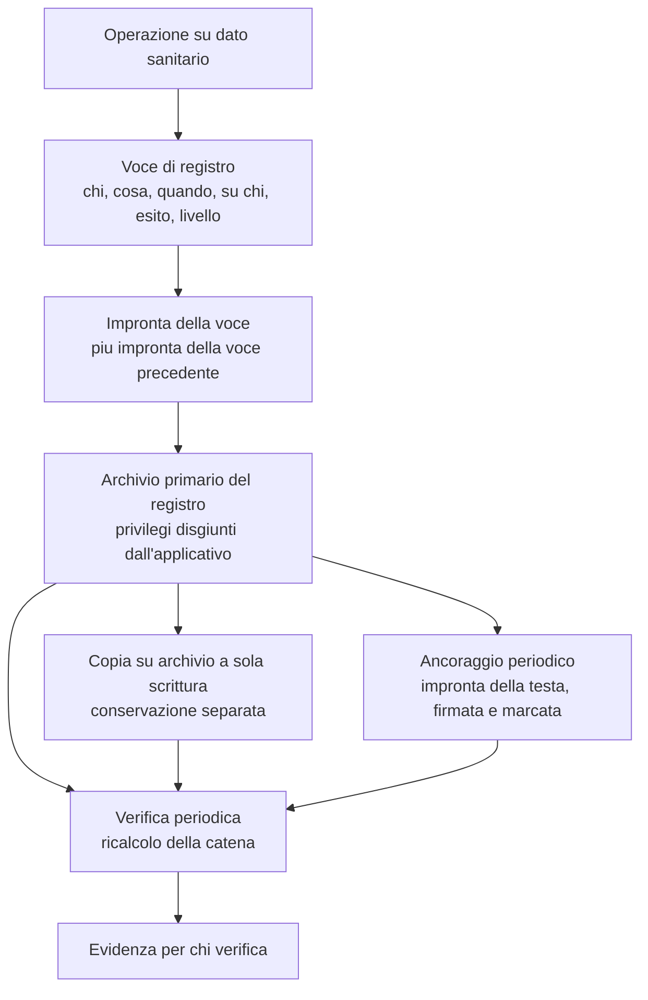

# Tracciamento e registro immutabile

## 1. Il requisito, e perché è più duro di quanto sembri

Il requisito è che ogni accesso a dato sanitario sia tracciato in modo **non ripudiabile e non
alterabile**. Le due parole non sono sinonimi e nessuna delle due è soddisfatta da una tabella di
storico.

**Non ripudiabile** significa che chi ha compiuto l'operazione non può sostenere di non averla
compiuta. Richiede che l'identità sia accertata al momento dell'operazione e registrata con il
livello di garanzia con cui è stata accertata, e che la registrazione sia opponibile.

**Non alterabile** significa che nessuno - **incluso chi amministra il sistema** - può modificare o
cancellare una voce senza che l'alterazione sia rilevabile. È il requisito difficile, perché il
modello di minaccia comprende l'operatore stesso.

Il fraintendimento sistematico dell'industria è credere che il versionamento automatico delle
entità offerto dal livello di persistenza soddisfi il secondo requisito. **Non lo soddisfa**: le
tabelle di storico sono tabelle come le altre, e chi ha accesso in scrittura alla base dati le
modifica esattamente come modifica le altre. Il versionamento **versiona, non rende immutabile**.
La distinzione non va attenuata in nessun documento del progetto, ed è vincolo di bacheca.

Ne discende una conseguenza strutturale che è, per ammissione della stessa decisione che la
impone, **lo sforzo maggiore dell'intero catalogo di sicurezza**: serve una catena di impronte
crittografiche e una conservazione **separata dal sistema che genera gli eventi**. Non è
configurazione: è un componente.

La teoria delle funzioni di impronta e delle catene è nel
[modulo 12 della guida](../10_fondamenti/12-crittografia-e-sicurezza.md#5-funzioni-di-hash) e non
viene ripetuta.

## 2. Il modello adottato

**Catena di impronte applicativa, con ancoraggio periodico firmato e marcato temporalmente, e
copia su archivio a sola scrittura conservato separatamente.**

Le quattro tecniche disponibili non sono alternative fra cui scegliere ma **strati che coprono
minacce diverse**, e la loro combinazione è la decisione.

| Tecnica | Copre | Non copre |
|---|---|---|
| **Catena di impronte applicativa** | Modifica o cancellazione di una voce, riordino, inserimento retroattivo | La riscrittura dell'intera catena da parte di chi controlla l'applicazione |
| **Archivio con scrittura singola sull'oggetto** | Modifica e cancellazione entro il periodo di ritenzione imposto dall'archivio | La mancata scrittura di una voce che non è mai stata prodotta |
| **Conservazione separata con privilegi disgiunti** | La riscrittura dell'intera catena da parte dell'amministratore dell'archivio applicativo | La collusione fra amministratori dei due sistemi |
| **Ancoraggio periodico firmato e marcato temporalmente** | La collusione, entro l'intervallo fra due ancoraggi: la catena precedente non è più riscrivibile senza contraddire un'attestazione già emessa | Le voci comprese fra l'ultimo ancoraggio e il momento dell'attacco |

La combinazione dei quattro strati lascia una sola finestra di vulnerabilità residua: **le voci
comprese fra due ancoraggi consecutivi**, e solo nell'ipotesi di collusione fra chi amministra
l'applicazione e chi amministra la conservazione. La finestra è **dichiarata**, non nascosta, e la
sua ampiezza è il parametro con cui si regola il rapporto fra costo e garanzia.

### 2.1 La catena

Ogni voce porta l'impronta del proprio contenuto **e** l'impronta della voce precedente nella
sequenza. La modifica di una voce qualsiasi invalida tutte le impronte successive: non si altera
una voce senza riscrivere tutta la coda.

Due decisioni di forma:

**La catena è per tenant, non globale.** Una catena globale creerebbe una dipendenza fra tenant -
la verifica dell'integrità del tenant A richiederebbe le voci del tenant B - che contraddice
l'isolamento fra titolari autonomi e renderebbe impossibile consegnare a un titolare l'evidenza dei
propri accessi senza esporgli l'esistenza degli altri.

**La sequenza è determinata alla scrittura, non all'ordinamento successivo.** Il numero di sequenza
è assegnato in modo strettamente crescente per tenant, e una scrittura concorrente si serializza su
quel punto. È un punto di contesa deliberato: la garanzia di sequenzialità vale il costo, e il
volume di scritture del registro è dominato dalle letture di dato clinico, non dalla contesa.

### 2.2 L'ancoraggio

A intervalli regolari, l'impronta della testa della catena è **firmata e marcata temporalmente**,
e l'attestazione è conservata separatamente dalla catena stessa. L'ancoraggio è ciò che rende la
riscrittura della storia contraddittoria con un'attestazione già emessa e datata.

L'intervallo di ancoraggio, la scelta fra marcatura temporale da un servizio qualificato e altre
forme di attestazione, e la conservazione degli ancoraggi sono decisioni che vanno prese dalle
aree di sicurezza e conformità (`SEC`, `COMP`) `[NV]`: quest'area ne fissa la necessità e la collocazione
architetturale, non i parametri. La domanda è aperta in bacheca.

### 2.3 La conservazione separata

«Separata» significa **con privilegi disgiunti**: chi amministra l'archivio applicativo non ha
privilegi di scrittura sull'archivio del registro, e viceversa. Nel servizio gestito questo è
realizzabile con credenziali, ruoli e archivi distinti; nell'installazione presso il cliente
dipende dall'organizzazione del cliente ed è un **requisito che il progetto documenta e il cliente
soddisfa**.

Questo punto va detto con onestà nella documentazione destinata a chi installa: **il progetto
fornisce il meccanismo, non può imporre la separazione dei ruoli in un'organizzazione che non
controlla**. Ciò che può fare, e fa, è: rendere la separazione la configurazione predefinita,
rilevare e segnalare la configurazione in cui i due archivi condividono le credenziali, e
documentare la conseguenza - in quella configurazione, la garanzia si riduce a quella della sola
catena applicativa.

## 3. Che cosa si registra

### 3.1 Il contenuto della voce

| Elemento | Contenuto | Nota |
|---|---|---|
| **Chi** | Soggetto che ha compiuto l'operazione, **e** principale applicativo che ha agito per suo conto | La rappresentazione della delega è ciò che consente di rispondere a «quale sistema ha agito per conto di quale persona» |
| **Che cosa** | Tipo di operazione e tipo di risorsa | Da un vocabolario chiuso e versionato |
| **Quando** | Istante in forma assoluta | Con l'indicazione della sorgente temporale usata |
| **Su chi** | Soggetto interessato dal dato | Riferimento, mai contenuto |
| **Su che cosa** | Riferimento alla risorsa | Identificativo, mai contenuto |
| **Con quale esito** | Riuscito, negato, fallito | **Il diniego si registra**: è l'informazione più interessante per chi verifica |
| **Con quale livello di garanzia** | Livello dell'autenticazione **e** sua provenienza, eseguita o riferita | Un livello riferito da un integratore è marcato come tale |
| **Con quale finalità** | Cura, deroga, esercizio, amministrazione, verifica | È l'attributo che rende la decisione spiegabile a posteriori |
| **Da dove** | Origine della richiesta, nella forma minima necessaria | Vedi §3.3 |
| **Tenant** | Sempre | Nessuna eccezione |

### 3.2 Quali operazioni

| Categoria | Registrata |
|---|---|
| Lettura di dato clinico | **Sì**, ogni singola lettura |
| Scrittura, modifica, cancellazione di dato clinico | Sì |
| Accesso negato a dato clinico | **Sì** |
| Autenticazione riuscita e fallita | Sì |
| Assegnazione, modifica, revoca di ruolo | Sì |
| Invocazione di accesso in deroga e suo riesame | Sì, con severità elevata |
| Manifestazione di volontà, revoca, oscuramento | Sì |
| Firma, rettifica, ritiro di un documento | Sì |
| Avvio, arresto, riproduzione, cancellazione di materiale registrato | Sì |
| Cambio della modalità operativa della sessione | Sì |
| Esportazione di dati, in qualunque forma | Sì |
| Modifica di configurazione che incide su accesso, conservazione o soglie | Sì |
| Ripristino, migrazione, dismissione di tenant | Sì |
| **Lettura del registro stesso** | **Sì** |
| Applicazione di una politica di conservazione con cancellazione | Sì |
| Interrogazione a un servizio terminologico | No: non è accesso a dato dell'assistito, e per costruzione non ne trasporta |
| Campionamento delle metriche di canale | No: non è dato clinico |

La riga sulla lettura del registro merita enfasi: **chi guarda chi ha guardato lascia traccia**.
È la proprietà che rende sorvegliabile il ruolo più privilegiato del sistema.

### 3.3 Che cosa non si registra mai

Il registro **non contiene contenuto clinico**. Contiene chi, cosa, quando, su quale soggetto, con
quale esito. Le tre ragioni:

1. **Un registro con contenuto clinico è una seconda cartella clinica**, con un regime di accesso
   diverso e più permissivo, e con una conservazione più lunga di quella del dato originale.
2. **Il contenuto renderebbe il registro non consegnabile** a chi verifica: un auditor deve poter
   ricevere l'evidenza degli accessi senza ricevere i dati sanitari.
3. **Il diritto di cancellazione diventerebbe irrisolvibile**: il registro è per definizione
   inalterabile, e il contenuto clinico è per definizione cancellabile in presenza dei presupposti.
   Le due proprietà sono incompatibili sullo stesso archivio.

L'elenco di ciò che non compare è **chiuso e verificato automaticamente**, non affidato al buon
senso. Comprende in particolare: valori clinici, testi di documenti, contenuti di messaggi,
riferimenti di autorizzazione dei canali di messaggistica con l'ospitante, identificativi esterni
del soggetto assegnati dall'integratore, e ogni segreto.

L'ultimo punto merita una nota. L'identificativo esterno dell'assistito, quello con cui
l'integratore lo identifica nel proprio sistema, **non compare nel registro**: si registra
l'identificativo interno opaco. La ragione è che il registro è consegnabile a soggetti diversi dal
titolare, e l'identificativo esterno è una chiave verso un altro archivio.

Sulla registrazione dell'origine della richiesta esiste una tensione reale: da un lato è
un'informazione utile alla sorveglianza, dall'altro l'indirizzo di rete di un assistito è dato
personale e, nel contesto, dato relativo alla salute - perché la sua sola presenza attesta un
contatto sanitario. La forma minima adottata e le sue eventuali riduzioni appartengono all'area di
sicurezza; quest'area registra che la tensione esiste e va risolta esplicitamente, non ignorata.

## 4. La scrittura del registro è bloccante

**Il fallimento della scrittura di registro fa fallire l'operazione applicativa.** Non è una
scelta di robustezza: è la traduzione operativa del requisito. Se l'operazione riuscisse senza
traccia, esisterebbe un accesso a dato sanitario non dimostrabile, ed è esattamente ciò che il
registro esiste per impedire.

Ne discendono conseguenze che vanno accettate consapevolmente:

**Il registro è sul percorso critico.** La sua latenza si somma a quella di ogni operazione su dato
clinico. Il dimensionamento ne tiene conto e il budget di latenza delle operazioni lo comprende
esplicitamente.

**L'indisponibilità del registro è indisponibilità del sistema.** Se il registro non è scrivibile,
le operazioni su dato clinico non sono eseguibili. È una scelta severa e deliberata: l'alternativa
- proseguire senza traccia e riconciliare dopo - produce una finestra di accessi non dimostrabili,
e la finestra coincide con l'incidente, cioè con il momento in cui la dimostrabilità serve di più.

**La copia sull'archivio a sola scrittura è invece asincrona**, con ritardo sorvegliato. È la
scrittura sull'archivio primario del registro a essere bloccante, non la replica: bloccare anche
la replica sposterebbe la disponibilità del sistema clinico sotto quella del sistema di
conservazione, che è un rapporto sbagliato.

## 5. La verifica dell'integrità

### 5.1 Come si verifica

La verifica ricalcola la catena da un ancoraggio noto e confronta. Ha tre livelli di profondità:

| Livello | Che cosa fa | Cadenza |
|---|---|---|
| **Incrementale** | Verifica le voci scritte dall'ultima verifica | Frequente |
| **Da ancoraggio** | Ricalcola dall'ultimo ancoraggio alla testa e verifica l'attestazione | A ogni ancoraggio |
| **Integrale** | Ricalcola l'intera catena di un tenant e confronta con tutti gli ancoraggi e con la copia conservata | Periodica, e su richiesta di chi verifica |

Ogni verifica produce **un esito registrato**, positivo o negativo. Una verifica il cui esito non
è conservato non è un'evidenza: chi verifica deve poter vedere che le verifiche sono state fatte,
non solo che potrebbero esserlo.

### 5.2 Che cosa accade quando la verifica fallisce

Il fallimento della verifica è un **incidente di sicurezza**, non un difetto tecnico da correggere
silenziosamente. La procedura architetturale prevede quattro passi:

1. **Delimitazione**: si identifica l'intervallo compreso fra l'ultima voce verificabile e la
   prima voce coerente successiva. È l'intervallo di incertezza, ed è la misura dello scenario di
   qualità SQ-01.
2. **Confronto con la copia conservata separatamente**, che consente di determinare il contenuto
   originale delle voci alterate quando la copia è integra.
3. **Segnalazione** ai soggetti previsti, secondo le procedure dell'area di sicurezza.
4. **Nessuna correzione della catena.** La catena non si «ripara»: si apre una nuova generazione,
   ancorata alla precedente, e l'evento della rottura è esso stesso registrato. Riparare
   significherebbe riscrivere, che è l'operazione che il registro deve rendere impossibile.

### 5.3 L'evidenza per chi verifica

Il sistema produce, su richiesta e per un perimetro definito, un **estratto firmato** che contiene:
le voci del perimetro richiesto, gli ancoraggi che le comprendono, gli esiti delle verifiche
eseguite nel periodo e la descrizione del metodo. L'estratto è verificabile in modo indipendente
da chi lo ha prodotto: chi lo riceve può ricalcolare la catena e confrontare gli ancoraggi senza
dover avere accesso al sistema.

La verificabilità indipendente è la proprietà che distingue un'evidenza da una dichiarazione. Il
metodo di calcolo delle impronte e la struttura della catena sono quindi **documentati
pubblicamente**: la segretezza del metodo non aggiunge sicurezza e sottrae verificabilità.

## 6. Che cosa il registro non è

| Non è | Perché |
|---|---|
| **Il registro di diagnostica applicativa** | Sono due archivi con scopi, contenuti, regimi di accesso e conservazione diversi. La collisione terminologica in italiano è reale e va presidiata: si dice «registro degli accessi» per l'uno, «registro di diagnostica» per l'altro |
| **Il versionamento delle entità** | Ricostruisce lo stato applicativo passato; non è immutabile e non è opponibile |
| **Una sorgente per le decisioni applicative** | Nessun percorso applicativo legge dal registro per decidere. È una destinazione, non una sorgente: la proprietà che ne consente la conservazione separata |
| **Un archivio di ricerca** | Le interrogazioni sono per perimetro definito e sono a loro volta registrate. Non è uno strumento esplorativo |
| **Un sostituto della conservazione a norma dei documenti** | Il registro attesta gli accessi, non conserva i documenti. Sono due obblighi distinti con due meccanismi distinti |

## 7. Conservazione

Le durate sono fissate dall'area di sicurezza sulla base della normativa applicabile e valgono
come vincolo per quest'area: **ventiquattro mesi** per i registri di tracciabilità, **dodici mesi**
per i dati di accesso e autenticazione.

Tre conseguenze architetturali:

**Il registro sopravvive al tenant.** La dismissione di un tenant rimuove lo schema applicativo; il
registro resta per il tempo prescritto, nella conservazione separata. Va dichiarato al titolare nel
contratto, non scoperto dopo.

**La scadenza del registro è essa stessa un'operazione registrata.** L'applicazione della politica
di conservazione, con il perimetro delle voci rimosse, produce una voce nella generazione corrente.
Altrimenti la scadenza sarebbe indistinguibile da una cancellazione.

**La rimozione per scadenza avviene per segmenti delimitati da ancoraggi**, non per singola voce.
Rimuovere voci singole spezzerebbe la catena senza motivo; rimuovere un segmento compreso fra due
ancoraggi conserva la verificabilità della parte restante, perché l'ancoraggio di chiusura del
segmento rimosso resta e attesta ciò che c'era.

## 8. Verifiche automatiche obbligatorie

| # | Verifica | Che cosa dimostra |
|---|---|---|
| TR-1 | Un'operazione su dato clinico con il registro non scrivibile fallisce | §4 |
| TR-2 | Ogni percorso che accede a dato clinico produce una voce | Copertura |
| TR-3 | La modifica diretta di una voce è rilevata dalla verifica della catena | §2.1, scenario SQ-01 |
| TR-4 | La cancellazione diretta di una voce è rilevata | Idem |
| TR-5 | L'inserimento retroattivo di una voce è rilevato | Idem |
| TR-6 | Nessuna voce contiene elementi dell'elenco chiuso di §3.3 | Assenza di contenuto clinico e di segreti |
| TR-7 | La lettura del registro produce una voce | §3.2 |
| TR-8 | Il diniego di accesso produce una voce | §3.2 |
| TR-9 | Ogni voce porta il tenant e la catena è per tenant | §2.1 |
| TR-10 | L'estratto firmato è verificabile senza accesso al sistema che lo ha prodotto | §5.3 |
| TR-11 | Nessun percorso applicativo legge dal registro per prendere una decisione | §6 |
| TR-12 | La configurazione in cui archivio applicativo e archivio del registro condividono le credenziali è rilevata e segnalata | §2.3 |

## 9. Punti non verificati di questa sezione

| Riferimento | Che cosa non è deciso o verificato | A chi spetta |
|---|---|---|
| §2.2 | Intervallo di ancoraggio, forma dell'attestazione temporale, conservazione degli ancoraggi | Area di sicurezza con `COMP`; questione aperta in bacheca |
| §2.3 | Requisiti minimi di separazione dei privilegi esigibili nell'installazione presso il cliente | Area di sicurezza, per la documentazione destinata a chi installa |
| §3.3 | Forma minima dell'origine della richiesta compatibile con la minimizzazione | Area di sicurezza |
| §5.1 | Cadenza delle tre profondità di verifica | Area di sicurezza, in coerenza con gli obiettivi di sorveglianza |
| §7 | Comportamento della conservazione separata rispetto alla scadenza, quando il periodo di ritenzione imposto dall'archivio a sola scrittura è superiore alla durata prescritta | Area di sicurezza: sono due vincoli che possono entrare in conflitto e il conflitto va risolto prima della configurazione |
