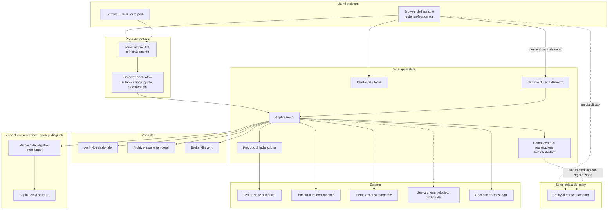

# Viste di deployment

## 1. Due assetti, un solo codice

Telemedic esiste in due assetti di distribuzione: **installazione presso il cliente** e **servizio
gestito**. Non sono due prodotti né due rami: sono due configurazioni dello stesso codice, e
questo vincolo determina tutta la vista di dispiegamento.

La conseguenza più stringente è che **nessuna funzione può dipendere da un componente disponibile
solo in uno dei due assetti**. Un componente presente solo nel servizio gestito produrrebbe una
funzione assente nell'installazione presso il cliente, quindi documentazione divergente, prove che
coprono un solo assetto e clienti che scoprono una differenza dopo aver scelto. Le uniche
differenze ammesse sono quelle dichiarate nella matrice di §7, e ciascuna ha una motivazione
scritta.

La seconda conseguenza è che **il peso operativo dell'installazione presso il cliente è un vincolo
di progetto**. Ogni componente aggiunto va installato, aggiornato, sorvegliato e messo in sicurezza
da un'organizzazione che non è un fornitore di servizi informatici. Un componente in più non costa
solo la sua complessità: costa la probabilità che venga configurato male.

## 2. I componenti

### 2.1 Elenco e ruolo

| Componente | Ruolo | Obbligatorio | Sostituibile |
|---|---|---|---|
| **Applicazione** | Contiene i contesti di dominio, i piani di esposizione, il livello anticorruzione | Sì | No: è il prodotto |
| **Interfaccia utente** | Applicazione a pagina singola, anche nella forma incorporabile | Sì | Sostituibile dall'integratore, che può usare solo le interfacce applicative |
| **Archivio relazionale** | Persistenza dei contesti, outbox, configurazione | Sì | No, per la versione corrente |
| **Archivio a serie temporali** | Parametri clinici e metriche di canale, in **strutture distinte con regimi distinti** | Sì | Sì, dietro l'interfaccia del contesto |
| **Archivio del registro immutabile** | Registro degli accessi, con privilegi disgiunti | Sì | Sì, purché soddisfi le proprietà di §2 del capitolo sul tracciamento |
| **Broker di eventi** | Distribuzione degli eventi ai consumatori | Sì | Sì, dietro l'interfaccia di pubblicazione |
| **Prodotto di federazione dell'identità** | Federazione, emissione dei token interni, gestione dei realm | Sì | No, per la versione corrente |
| **Servizio di segnalamento** | Negoziazione della sessione media | Sì per le prestazioni sincrone | No |
| **Relay per l'attraversamento della rete** | Instradamento del media quando la connessione diretta non è possibile | Sì per le prestazioni sincrone | Sì, è un componente standard |
| **Componente di registrazione** | Registrazione lato server della sessione | Solo se la funzione è abilitata | Sì |
| **Servizio terminologico** | Risoluzione ed espansione dei codici | **No** | Sì, ed è disattivabile per sistema di codifica |
| **Servizio di firma e marca temporale** | Firma dei documenti | Dipende dalla configurazione del tenant | Sì, dietro l'interfaccia del contesto |
| **Recapito dei messaggi** | Canali verso assistiti e professionisti | Dipende dai canali abilitati | Sì, dietro l'interfaccia del contesto |
| **Sorveglianza e raccolta delle metriche** | Esercizio | Sì | Sì |

Due righe meritano attenzione. Il **servizio terminologico non è obbligatorio**: è l'unica
dipendenza esterna che il sistema deve poter perdere restando pienamente operativo, ed è lo
scenario di qualità SQ-07. Il **prodotto di federazione dell'identità** e l'**archivio
relazionale** sono invece dichiarati non sostituibili nella versione corrente: è una scelta, ed è
dichiarata come tale invece di essere presentata come una necessità.

Una terza riga va letta con attenzione per non essere fraintesa. L'**archivio a serie temporali** è
**un solo componente** - è il conteggio che
[ADR-0020](../adr/0020-serie-temporali-in-archivio-dedicato.md) accetta fra le proprie conseguenze
negative, «un archivio in più da installare» - e ospita **due strutture distinte**, i parametri
clinici e le metriche di canale, con conservazione, titolo di accesso e riduzione della risoluzione
diversi. Un solo componente non significa un solo regime: la separazione che
[04 - Modello dati](04-modello-dati.md#41-due-serie-non-una) §4.1 impone è quella dei regimi, e
resta intera anche quando il componente installato è uno.

### 2.2 Vista dei componenti

Tre letture del diagramma:

**Il media non attraversa l'applicazione.** Nella modalità predefinita il flusso va da un
partecipante all'altro, direttamente quando la rete lo consente e attraverso il relay quando non lo
consente. L'applicazione conosce lo stato della sessione, non il suo contenuto. Nella modalità con
registrazione il flusso attraversa il componente di registrazione, e questa è precisamente la
differenza che rende quella modalità non cifrata fino agli estremi.

**La zona del relay è isolata e non ha rotte verso l'interno.** È il punto trattato in §5 e non è
una raccomandazione di rafforzamento: è la difesa primaria contro il rischio più grave
dell'architettura media.

**La zona di conservazione ha privilegi disgiunti.** Non è una zona di rete diversa per ragioni di
prestazioni: è una separazione di privilegi amministrativi, e il diagramma la rappresenta come zona
per rendere visibile che il percorso è unidirezionale.

## 3. Assetto: installazione presso il cliente

### 3.1 Forma

Componenti su un numero contenuto di nodi, orchestrati con la definizione di composizione fornita
dal progetto oppure con il pacchetto per orchestratore di contenitori, secondo le capacità del
cliente. Tenancy attiva con un solo tenant, o pochi.

Il **broker in assetto a nodo singolo** è la scelta prevista per contenere il peso operativo. È una
scelta consapevole con una conseguenza dichiarata: `[NV]` - i limiti effettivi delle garanzie del
broker in quell'assetto vanno verificati dall'area tecnica, e ogni garanzia che dipenda dalla
replica non è disponibile. Nessun requisito funzionale può dipendere da garanzie non disponibili
nell'assetto minimo.

### 3.2 Che cosa il cliente deve fornire

Questa lista è un deliverable, non un'appendice: è ciò che determina se un'installazione è
possibile.

| Elemento | Nota |
|---|---|
| Nome di dominio e certificati | Con procedura di rinnovo automatica |
| Indirizzi raggiungibili per il relay | Il relay deve essere raggiungibile dall'esterno; è l'unico componente che lo richiede insieme alla frontiera |
| Separazione dei privilegi fra archivio applicativo e archivio del registro | **Requisito, non raccomandazione.** In sua assenza la garanzia si riduce a quella della sola catena applicativa, e la riduzione va dichiarata |
| Copie di sicurezza e loro verifica di ripristino | La copia non verificata non è una copia |
| Collocazione delle copie coerente con il profilo scelto | Una copia fuori perimetro è meno visibile di una dipendenza di esercizio e altrettanto rilevante |
| Fornitore di identità o federazione | Il fornitore di servizi verso la federazione nazionale è il cliente, non il progetto |
| Canale di recapito dei messaggi | Con il proprio contratto e la propria catena di responsabilità |
| Servizio di firma, se la refertazione è abilitata | |
| Sorveglianza e gestione degli incidenti | |
| Cadenza di aggiornamento dei componenti esposti | In particolare per il relay, che è esposto e per il quale l'aggiornamento è un obbligo, non una buona pratica |

### 3.3 Che cosa il progetto fornisce

Definizioni di dispiegamento riproducibili; migrazioni automatiche e reversibili; verifiche di
configurazione bloccanti all'avvio; distinta dei componenti di terze parti generata dalla
costruzione; scheda dei dati che il cliente deve poter dichiarare a un'autorità sui fornitori
rilevanti; procedure documentate di ripristino, di verifica dell'integrità del registro e di
dismissione.

Le **verifiche di configurazione bloccanti all'avvio** sono uno strumento architetturale
sottovalutato e qui centrale: il sistema si rifiuta di avviarsi in configurazioni che
comprometterebbero silenziosamente una garanzia. Vi rientrano almeno: politiche di riga non attive
o superabili dal ruolo applicativo; archivio del registro raggiungibile con le credenziali
applicative; relay raggiungibile dalle reti interne; segreti ai valori predefiniti; assenza di una
politica di conservazione per una categoria di dati.

## 4. Assetto: servizio gestito

### 4.1 Forma

Componenti replicati, con separazione fra i percorsi interattivi, quelli di sfondo e quelli di
esportazione; molti tenant; archivio relazionale con replica; relay in più nodi indipendenti.

### 4.2 Quattro differenze sostanziali

**Separazione dei pool per classe di operazione.** Un'esportazione voluminosa di un tenant non deve
poter esaurire le connessioni e bloccare l'ingresso in sala d'attesa di un altro. La separazione è
un requisito architetturale, non un'ottimizzazione, ed è il corollario dell'isolamento del rumore.

**Relay in più nodi indipendenti, senza stato condiviso.** Il componente di relay adottato non ha
raggruppamento nativo: la caduta di un nodo termina le allocazioni che ospitava. La ridondanza si
ottiene offrendo al partecipante più nodi indipendenti e lasciando che sia il meccanismo di
negoziazione a scegliere. Nessun archivio condiviso di allocazioni, nessun bilanciatore con
affinità, nessun indirizzo condiviso fra nodi. Il recupero dalla caduta di un nodo è una
rinegoziazione, non una migrazione dello stato.

**Distribuzione deterministica del segnalamento.** La macchina a stati di una sessione vive in un
solo processo, determinato dall'identificativo della sessione. La conseguenza è dichiarata: la
caduta di un nodo termina le sessioni ospitate, che si ristabiliscono con una rinegoziazione.

**Replica sincrona per la categoria a punto di ripristino zero.** Documentazione firmata, consensi
e registro non ammettono perdita. La replica sincrona per questa categoria aggiunge latenza
all'operazione di firma: costo accettato e dichiarato nell'esperienza d'uso.

## 5. L'isolamento del relay

### 5.1 Il rischio

Il relay è il componente più esposto dell'architettura e ospita il rischio più grave. Il
meccanismo: ogni partecipante autenticato riceve, **per progetto**, una credenziale valida per
usare il relay. Senza restrizioni, quella credenziale è un instradatore verso una destinazione
arbitraria: l'anello di richiamo locale del relay stesso, la rete interna dell'organizzazione, i
servizi di metadati dell'infrastruttura ospitante.

Non è un'ipotesi: la specifica del protocollo **delega esplicitamente la difesa all'operatore** e
non impone contromisure, ed esistono precedenti documentati di elusione dei controlli sui
destinatari basati su liste di indirizzi vietati, in particolare attraverso forme alternative di
rappresentazione dello stesso indirizzo.

### 5.2 La difesa

**L'isolamento di rete in uscita è la difesa primaria; le liste di indirizzi vietati sono difesa in
profondità.** L'ordine non è indifferente ed è vincolo di bacheca: la lista di indirizzi è
precisamente ciò che le elusioni storiche hanno aggirato, perché dipende dalla canonicalizzazione
dell'indirizzo, che è un problema di analisi sintattica e non di politica.

I quattro strati:

| Strato | Contenuto |
|---|---|
| **1. Isolamento di rete** | Il nodo del relay sta in una zona **senza rotte verso le reti interne** e senza accesso ai servizi di metadati dell'infrastruttura. È l'unico strato che non dipende dalla correttezza di un'analisi sintattica |
| **2. Nessun servizio co-locato** | Il nodo non ospita altro. Un servizio co-locato è raggiungibile attraverso l'anello di richiamo locale, che è la destinazione più difficile da vietare correttamente |
| **3. Configurazione restrittiva** | Diniego predefinito sulle destinazioni, con esplicita copertura delle forme alternative di rappresentazione degli indirizzi; nessun instradamento multicast; quote |
| **4. Verifica automatica in integrazione continua** | Una prova tenta l'instradamento verso l'anello di richiamo locale, verso indirizzi privati e verso i servizi di metadati, e **fa fallire la costruzione se una qualunque richiesta riesce** |

Il quarto strato è quello che distingue una misura documentata da una misura efficace. Una
configurazione corretta oggi non resta corretta dopo un aggiornamento del componente o una
modifica alla rete: solo una prova eseguita a ogni costruzione lo accerta.

### 5.3 Il relay tratta dati relativi alla salute

Il relay non vede il contenuto - non possiede le chiavi - ma vede **chi ha parlato con chi, quando,
per quanto tempo e da quale indirizzo**. In ambito sanitario il solo fatto del contatto con uno
specialista è dato relativo alla salute.

Conseguenze architetturali: registrazione ridotta al minimo necessario all'esercizio; il soggetto
della credenziale è un **identificativo opaco di sessione**, mai un identificativo di persona;
conservazione breve e dichiarata; nessuna metrica infrastrutturale etichettata con l'identificativo
di sessione; il relay entra nel registro dei trattamenti e nella valutazione d'impatto.

### 5.4 La versione è un requisito

Il relay è esposto a Internet e la cadenza di aggiornamento è un obbligo. Il progetto dichiara una
**versione minima** e la verifica all'avvio; il componente è censito nell'inventario dei componenti
di terze parti con un canale di aggiornamento tracciato e un livello di servizio dichiarato per
l'applicazione delle correzioni.

## 6. Profili di collocazione

Tre profili sono documentati e supportati: **Unione europea**, **territorio italiano**, **cloud
qualificato**. Il vincolo che li governa è unico e categorico: **nessuna dipendenza di esercizio
può impedire il profilo più restrittivo**.

### 6.1 Come si verifica

La verifica non è dichiarativa. Si esegue in tre passi:

1. **Inventario delle dipendenze di esercizio**, generato dalla costruzione, non compilato a mano.
2. **Classificazione di ciascuna**: obbligatoria o facoltativa; sul percorso principale o no;
   sostituibile o no; collocazione del fornitore.
3. **Verifica di percorribilità**: una prova che esegue la suite funzionale con tutte le
   dipendenze facoltative disattivate. Se qualcosa fallisce, quella dipendenza non era facoltativa.

Il terzo passo è quello che trasforma la sovranità da argomento a proprietà verificata. Coincide
in larga parte con lo scenario di qualità SQ-07.

### 6.2 Il caso del servizio terminologico

È il caso che illustra il principio meglio di ogni altro, perché la sovranità qui **non si
soddisfa con la collocazione**. Il servizio terminologico è un componente di terze parti a
esercizio, non una dipendenza di costruzione. Se è stabilito fuori dall'Unione, l'interrogazione
costituisce un trasferimento **nel momento in cui trasporta dati riferibili a un assistito**.

La soluzione adottata non è collocare il servizio: è **non trasportare il dato**. Le interrogazioni
verso il gateway terminologico non portano identificativi dell'assistito, non portano contesto
clinico e non sono correlabili a una persona. La sovranità di questa dipendenza si soddisfa **per
assenza di dato**. Restano fermi il divieto di cache persistita su disco e la piena funzionalità
del sistema con i sistemi di codifica onerosi disattivati.

Il servizio terminologico è comunque un **fornitore rilevante di secondo livello** che il cliente
può essere tenuto a dichiarare nominativamente a un'autorità, con il Paese della sede legale: il
progetto fornisce la scheda con i dati necessari.

### 6.3 Il caso delle copie di sicurezza

Una copia collocata fuori dal perimetro è **meno visibile** di una dipendenza di esercizio e
altrettanto rilevante: non compare nell'inventario delle dipendenze e non emerge dalle prove
funzionali. La collocazione delle copie rientra nel profilo dichiarato ed è parte della lista di
ciò che il cliente deve fornire.

## 7. Matrice delle differenze ammesse

| Aspetto | Installazione presso il cliente | Servizio gestito | Differenza ammessa? |
|---|---|---|---|
| Funzioni disponibili | Tutte | Tutte | **No**, nessuna differenza |
| Interfacce applicative | Tutte | Tutte | **No** |
| Modello di tenancy | Attivo, un tenant o pochi | Attivo, molti | No: stesso meccanismo |
| Assetto del broker | Nodo singolo | Replicato | **Sì**, con le garanzie dichiarate per assetto |
| Nodi di relay | Uno o pochi | Più nodi indipendenti | **Sì**, di dimensionamento |
| Replica dell'archivio | Facoltativa, a scelta del cliente | Attiva, sincrona per la categoria a punto di ripristino zero | **Sì**, con la conseguenza sugli obiettivi dichiarata |
| Separazione dei pool per classe | Consigliata | Obbligatoria | **Sì** |
| Conservazione separata del registro | Requisito a carico del cliente | Realizzata dal gestore | **Sì**, di responsabilità |
| Distribuzione del segnalamento | Processo unico | Deterministica per identificativo | **Sì**, di dimensionamento |
| Chi è titolare del trattamento | Il cliente | Ciascun tenant | Di responsabilità, non di prodotto |

Ogni riga marcata come differenza ammessa è **dimensionale o di responsabilità**, mai funzionale.
Una richiesta di differenza funzionale va portata in bacheca, non risolta con una configurazione.

## 8. Osservabilità e verifiche all'avvio

**Le verifiche di configurazione all'avvio sono bloccanti.** Il sistema che si avvia in una
configurazione insicura è peggiore del sistema che non si avvia, perché la prima produce una
falsa rassicurazione.

L'elenco minimo, ricavato dai vincoli delle sezioni precedenti:

| Verifica | Conseguenza se fallisce |
|---|---|
| Politiche di riga attive e non superabili dal ruolo applicativo | Avvio rifiutato |
| Archivio del registro non raggiungibile con le credenziali applicative | Avvio rifiutato nel servizio gestito; avviso bloccante con conferma esplicita nell'installazione presso il cliente |
| Relay non raggiungibile dalle reti interne | Avvio rifiutato |
| Versione minima del relay | Avvio rifiutato |
| Nessun segreto ai valori predefiniti | Avvio rifiutato |
| Uscita di rete negata ai componenti applicativi, consentita al solo mediatore di uscita | Avvio rifiutato |
| Politiche di riga imposte anche al proprietario e ruolo applicativo non proprietario degli oggetti | Avvio rifiutato |
| Politica di conservazione presente per ogni categoria di dati | Avvio rifiutato |
| Migrazioni applicate su tutti gli schemi attivi | Avvio rifiutato |
| Nessuna dipendenza obbligatoria non configurata | Avvio rifiutato |
| Servizio terminologico irraggiungibile | **Avvio consentito**, con la politica di degrado dichiarata |

Sul versante dell'esercizio, tre grandezze sono architetturalmente rilevanti perché la loro assenza
rende invisibili guasti silenziosi: la **profondità della coda dei messaggi non elaborabili**, il
**ritardo del relay dell'outbox** e l'**esito delle verifiche di integrità del registro**. Un
sistema che non le espone può essere gravemente guasto e apparire sano.

Due avvertenze sulle grandezze esposte. **Nessun contatore cumulativo grezzo può essere citato
come indicatore di qualità**: perdita, byte, durata dei congelamenti e ritardo del cuscinetto
anti-jitter crescono in modo monotono e vanno differenziati fra campioni consecutivi; le medie
corrette sono rapporti fra differenze (vincolo V-113 dell'area tecnica). E **l'indice sintetico di
qualità della sessione è proprietario e va dichiarato tale**: non è un punteggio di opinione media
secondo alcuna raccomandazione internazionale (vincolo V-114).

`[NV]` - I livelli di servizio attesi per la sorveglianza in esercizio, distinti da quelli previsti
dalla normativa sulle infrastrutture regionali, sono oggetto di una questione aperta in bacheca
indirizzata all'area di sicurezza e alla roadmap. Quest'area fissa **che cosa** va sorvegliato,
non **con quale soglia**.

> **Nota terminologica vincolante.** In tutta la documentazione «sorveglianza» riferita ai
> componenti indica l'osservabilità di esercizio. Riferita all'assistito, le formule «monitoraggio
> in tempo reale» e «sorveglianza continua» **sono vietate** (vincolo V-144 dell'area di dominio):
> il perimetro del telemonitoraggio è la raccolta differita di parametri per la revisione periodica
> del professionista, e la differenza fra le due formulazioni vale una classe di rischio.

## 9. Punti non verificati di questa sezione

| Riferimento | Che cosa non è verificato | A chi va chiesto |
|---|---|---|
| §3.1 | Garanzie effettive del broker nell'assetto a nodo singolo | Area tecnica |
| §5.2 | Direttive di configurazione del relay e loro efficacia sulla versione adottata | Area di sicurezza; nessuna direttiva va pubblicata senza verifica sulla versione installata |
| §5.4 | Versione minima corrente e correzioni di sicurezza applicabili | Area di sicurezza, su fonte primaria |
| §8 | Soglie di sorveglianza e livelli di servizio | Area di sicurezza e roadmap |
| §2.1 | Se l'archivio del registro possa essere lo stesso motore dell'archivio applicativo con credenziali disgiunte, o se debba essere un motore diverso | Area di sicurezza; incide sul peso dell'installazione presso il cliente |
