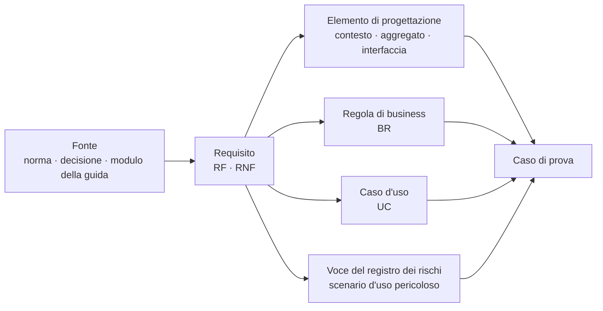

# Catalogo dei requisiti

## 1. Convenzioni di lettura

Ogni requisito funzionale è espresso in questa forma:

> **RF-nnn · Titolo** - *Attore* · *Priorità* · *Dip.: dipendenze*
> Enunciato verificabile.
> › **Dato** stato di partenza · **Quando** evento · **Allora** esito osservabile.

La riga che inizia con `›` **è il criterio di accettazione**, non una glossa. Deve esistere un
test capace di farla fallire: se non è possibile scriverlo, l'enunciato non entra nel catalogo.
È il criterio che ha escluso da questo documento ogni formulazione del tipo «il sistema deve
essere affidabile», «l'interfaccia deve essere intuitiva», «il dato deve essere protetto».

**Priorità (MoSCoW).** `M` il rilascio 1.0 non è possibile senza; `S` il rilascio 1.0 è possibile
con un degrado dichiarato; `C` opportunistico; `W` fuori perimetro della 1.0, registrato per non
perderlo. La priorità è una decisione di prodotto, non una misura di importanza clinica: un
requisito `S` può essere clinicamente più rilevante di un `M` e avere una mitigazione
organizzativa accettabile.

**Numerazione.** Gli intervalli hanno lacune volute. Un nuovo requisito si inserisce in una lacuna
del proprio blocco; **non si rinumera nulla, mai**, e un identificativo ritirato resta ritirato e
non viene riusato (§ 14).

Ogni requisito non funzionale è espresso con **metrica, soglia, condizione di misura e metodo di
verifica**. Un requisito non funzionale privo di metodo di verifica è un'aspirazione e non entra
nel catalogo.

## 2. Che cosa era già congelato

Il catalogo prodotto nella fase di ricerca copre il ciclo della prestazione sincrona e la
piattaforma che la sostiene. Resta integralmente in vigore e non viene riscritto qui:

| Blocco | Intervallo | Oggetto |
|---|---|---|
| 5.A | `RF-001` … `RF-019` | identità, federazione, livelli di garanzia, sessioni, accesso in deroga |
| 5.B | `RF-020` … `RF-032` | anagrafiche per riferimento esterno, deleghe, catalogo delle prestazioni |
| 5.C | `RF-035` … `RF-052` | agende, slot, prenotazione, riprogrammazione, disdetta, collegamenti di accesso |
| 5.D | `RF-055` … `RF-064` | sala d'attesa virtuale, ammissione, abbandono |
| 5.E | `RF-067` … `RF-086` | sessione media, identificazione, degrado, emergenza, chiusura con esito |
| 5.F | `RF-089` … `RF-097` | condivisione di schermo, documenti, allegati, revoca |
| 5.G | `RF-100` … `RF-107` | chat di sessione e messaggistica asincrona |
| 5.H | `RF-110` … `RF-121` | consensi distinti, informative versionate, revoca, oscuramento |
| 5.I | `RF-124` … `RF-136` | bozza, firma, immodificabilità, rettifica, consegna, riservatezza |
| 5.J | `RF-139` … `RF-147` | registrazione della sessione |
| 5.K | `RF-150` … `RF-158` | notifiche multicanale e contenuto minimo |
| 5.L | `RF-161` … `RF-172` | verifica tecnica, telemetria, soglie di qualità, rapporto tecnico |
| 5.M | `RF-175` … `RF-183` | configurazione, personalizzazione, relay, manutenzioni |
| 5.N | `RF-186` … `RF-193` | isolamento, chiavi, residenza dei dati, esportazione, chiusura del tenant |
| 5.O | `RF-196` … `RF-205` | registro degli accessi, immutabilità, reportistica, tracciabilità |
| 5.P | `RF-208` … `RF-223` | interfacce applicative, risorse di interoperabilità, webhook, incorporamento |
| RNF | `RNF-001` … `RNF-083` | prestazioni, capacità, disponibilità, sicurezza, privacy, accessibilità, usabilità, internazionalizzazione, portabilità, manutenibilità, osservabilità, processo |

Quest'area **estende** il catalogo su otto blocchi nuovi, tutti relativi al percorso di cura, al
telemonitoraggio e alla sicurezza del paziente. Sono le aree su cui la guida dei fondamenti aveva
prodotto conseguenze progettuali prive di identificativo: la mappatura puntuale è nel § 13.

## 3. Blocco 5.Q - Percorso di cura, arruolamento e piano di telemonitoraggio (`RF-230` … `RF-248`)

Il presupposto di tutto il blocco è la distinzione fra **modello** e **istanza**: il percorso di
popolazione descrive che cosa l'organizzazione fa per una condizione, il piano individuale
descrive che cosa si fa per *questa* persona. Fonderli rende impossibile versionare il protocollo
e ricostruire, mesi dopo, che cosa era previsto al momento di una decisione. Il fondamento
clinico-organizzativo è nel modulo
[10, §§ 3-4](../10_fondamenti/10-percorsi-di-cura-e-sicurezza.md).

> **RF-230 · Percorso di cura come dato versionato** - *Redattore del percorso* · *M* · *Dip.: -*
> Il sistema deve rappresentare il percorso di cura come dato caricabile, validabile e
> pubblicabile, con identificativo, versione, ambito organizzativo, data di decorrenza e stato;
> nessun percorso è rappresentato nel codice applicativo.
> › **Dato** un'installazione con due percorsi pubblicati per la stessa condizione in ambiti
> diversi · **Quando** si ispeziona il codice sorgente · **Allora** non esiste alcuna classe,
> costante o diramazione che nomini una condizione clinica o una fase di percorso, e la verifica
> automatica di architettura fallisce se ne viene introdotta una.

> **RF-231 · Validazione del percorso alla pubblicazione** - *Redattore del percorso* · *M* · *Dip.: RF-230*
> Il sistema deve rifiutare la pubblicazione di un percorso incoerente, indicando l'elemento non
> valido in forma comprensibile a chi lo ha redatto.
> › **Dato** un percorso con un nodo irraggiungibile, una cadenza priva di unità e una regola che
> riferisce un parametro non dichiarato · **Quando** se ne richiede la pubblicazione · **Allora**
> la pubblicazione è rifiutata con tre segnalazioni distinte che indicano nodo, cadenza e regola,
> e nessuna versione parziale viene creata.

> **RF-232 · Immutabilità della versione pubblicata** - *Sistema* · *M* · *Dip.: RF-231*
> Una versione pubblicata di un percorso non è modificabile: si supera con una versione
> successiva. Le istanze in corso restano agganciate alla versione con cui sono nate.
> › **Dato** venti piani attivi istanziati sulla versione 2 · **Quando** viene pubblicata la
> versione 3 · **Allora** i venti piani restano riferiti alla versione 2, la migrazione di ciascuno
> richiede un atto esplicito di un professionista, e l'atto è registrato con autore e istante.

> **RF-233 · Istanziazione del piano con riferimento alla versione** - *Professionista responsabile* · *M* · *Dip.: RF-232*
> Ogni piano individuale porta il riferimento alla **versione** del percorso da cui è nato, non al
> percorso.
> › **Dato** un piano creato oggi · **Quando** lo si consulta a distanza di due anni, dopo cinque
> revisioni del percorso · **Allora** è ricostruibile integralmente il contenuto della versione di
> percorso vigente al momento dell'istanziazione.

> **RF-234 · Deviazione motivata dal percorso** - *Professionista responsabile* · *M* · *Dip.: RF-233*
> Il piano individuale può discostarsi dal percorso; lo scostamento è registrato con la
> motivazione e non è un errore di validazione.
> › **Dato** un percorso che prevede una cadenza settimanale · **Quando** il professionista
> imposta nel piano una cadenza diversa · **Allora** il sistema accetta, richiede una motivazione
> testuale, la conserva e la rende visibile a chi consulterà il piano, senza bloccare l'operazione.

> **RF-235 · Valutazione di eleggibilità sulle quattro dimensioni** - *Professionista responsabile* · *M* · *Dip.: -*
> Prima dell'arruolamento il sistema deve richiedere e registrare l'esito della valutazione su
> quattro dimensioni distinte: clinica, tecnologica, di autonomia e competenza, di contesto.
> › **Dato** una proposta di arruolamento · **Quando** il professionista tenta di procedere alla
> redazione del piano con una delle quattro dimensioni non valutata · **Allora** l'operazione è
> impedita con l'indicazione della dimensione mancante, e l'esito negativo su una qualunque
> dimensione consente comunque di procedere solo con motivazione esplicita registrata.

> **RF-236 · Divieto di auto-arruolamento** - *Sistema* · *M* · *Dip.: RF-235*
> Il sistema non deve consentire l'attivazione di un servizio di telemonitoraggio senza un atto
> professionale a monte, in nessuna interfaccia e per nessuna interfaccia applicativa.
> › **Dato** un paziente autenticato · **Quando** cerca una funzione di attivazione del
> telemonitoraggio, o un client applicativo ne invoca l'operazione con il solo contesto del
> paziente · **Allora** la funzione non esiste nell'interfaccia e la chiamata è rifiutata con
> indicazione del ruolo richiesto.

> **RF-237 · Manifestazioni di volontà dell'arruolamento** - *Paziente, Rappresentante legale* · *M* · *Dip.: RF-110, RF-111*
> L'arruolamento richiede manifestazioni distinte e separatamente revocabili: adesione informata
> alla prestazione a distanza; base giuridica del trattamento dei dati; consenso alla presenza di
> terzi ove previsto; adesione all'assegnazione del dispositivo. Ciascuna è riferita alla versione
> del testo informativo vigente.
> › **Dato** un paziente che revoca l'adesione all'assegnazione del dispositivo · **Quando** la
> revoca è registrata · **Allora** le altre manifestazioni restano vigenti, il sistema apre il
> percorso di restituzione del dispositivo e non blocca l'accesso ai documenti già prodotti.

> **RF-238 · Assegnazione dei dispositivi con documento firmato** - *Professionista responsabile, Centro servizi* · *M* · *Dip.: RF-237*
> Il sistema deve produrre, per ogni dispositivo assegnato, un documento firmato digitalmente dal
> professionista che lo assegna, contenente identificazione unica del dispositivo in forma leggibile
> automaticamente e dall'uomo, numero di serie o di lotto, dati del fabbricante, tipo di
> collegamento e di alimentazione, esito della verifica tecnica e parametri di connettività,
> configurazione e taratura.
> › **Dato** un dispositivo assegnato senza esito della verifica tecnica · **Quando** si richiede
> la generazione del documento · **Allora** la generazione è rifiutata con l'indicazione del campo
> mancante, e il piano non è attivabile finché il documento non esiste in versione firmata.
> *Fonte del contenuto informativo: DM 19 novembre 2025, Allegato 1, § 2.23.*

> **RF-239 · Redazione del piano di telemonitoraggio** - *Professionista responsabile* · *M* · *Dip.: RF-233*
> Il sistema deve consentire la redazione di un piano contenente almeno: numero di cicli, durata
> del ciclo, numero di attività per ciclo, frequenza in forma codificata, fascia oraria, durata
> prevista, tipo di rilevazione, parametri monitorati, soglie di allarme e regole descrittive del
> comportamento in caso di violazione.
> › **Dato** un piano in redazione privo della frequenza codificata di un parametro · **Quando** se
> ne richiede la firma · **Allora** la firma è impedita con l'indicazione del parametro incompleto,
> e il piano resta in stato di bozza non attivabile.
> *Fonte del contenuto informativo: DM 19 novembre 2025, Allegato 1, § 2.24.*

> **RF-240 · Soglia individuale come campo vuoto obbligatorio** - *Sistema* · *M* · *Dip.: RF-239*
> Nessun campo di soglia clinica è precompilato, in nessuna forma: né con valori predefiniti, né
> con valori dell'ultimo piano, né con valori del percorso. I valori indicati dal percorso sono
> mostrati accanto al campo, in sola lettura, con citazione della fonte e della versione, e con
> un'azione esplicita di copia.
> › **Dato** un nuovo piano per una condizione il cui percorso indica valori di riferimento
> · **Quando** il professionista apre la schermata delle soglie · **Allora** tutti i campi di
> soglia risultano vuoti, i riferimenti compaiono in un'area distinta con fonte e versione, e la
> loro adozione richiede un'azione dell'utente che viene registrata come tale.

> **RF-241 · Limiti di ammissibilità delle soglie** - *Sistema* · *M* · *Dip.: RF-240*
> Ogni parametro ha limiti di ammissibilità codificati, che non stabiliscono la soglia ma
> impediscono l'errore materiale; il tentativo fuori limite è rifiutato con l'indicazione
> dell'intervallo ammesso ed è registrato.
> › **Dato** un professionista che inserisce un valore di soglia superiore di due ordini di
> grandezza al limite ammesso per quel parametro · **Quando** salva · **Allora** il salvataggio è
> rifiutato con il messaggio che indica l'intervallo, il valore rifiutato non viene conservato come
> soglia e il tentativo è registrato come quasi evento.

> **RF-242 · Attivazione come istante preciso** - *Professionista responsabile* · *M* · *Dip.: RF-239, RF-238*
> L'attivazione del piano è un atto esplicito con un istante registrato; da quell'istante decorrono
> le finestre di attesa delle misure.
> › **Dato** un piano firmato ma non attivato · **Quando** trascorre la prima cadenza prevista
> senza che arrivino misure · **Allora** non viene generato alcun evento di assenza, e il piano
> compare nella coda dei piani firmati e non attivati con l'indicazione di quanto tempo è trascorso.

> **RF-243 · Condizioni di attivabilità del piano** - *Sistema* · *M* · *Dip.: RF-242*
> Un piano non è attivabile in assenza di: soglie configurate per tutti i parametri che generano
> allarme, copertura del servizio dichiarata e vigente, destinatari degli allarmi individuati,
> dispositivi assegnati con verifica tecnica positiva, formazione del paziente o del caregiver
> registrata.
> › **Dato** un piano completo ma con copertura del servizio non dichiarata · **Quando** se ne
> tenta l'attivazione · **Allora** l'attivazione è rifiutata elencando le condizioni non
> soddisfatte, e non esiste alcuna configurazione che consenta di superare il controllo.

> **RF-244 · Revisione del piano come nuova versione** - *Professionista responsabile* · *M* · *Dip.: RF-242*
> Ogni modifica del piano produce una nuova versione con autore, motivazione, istante di efficacia
> e stato della precedente; nessun valore del piano è modificabile sul posto.
> › **Dato** un piano attivo la cui soglia su un parametro viene modificata · **Quando** si
> interroga il piano con riferimento a una data anteriore alla modifica · **Allora** il sistema
> restituisce i valori vigenti a quella data, ed è ricostruibile perché un allarme non è scattato
> in quel giorno.

> **RF-245 · Efficacia della versione visibile a entrambe le parti** - *Paziente, Professionista* · *M* · *Dip.: RF-244*
> Lo stato di efficacia della versione del piano deve essere visibile sia al professionista sia al
> paziente o al caregiver, con conferma della versione effettivamente attiva sul dispositivo di
> rilevazione o sull'interfaccia del paziente.
> › **Dato** una nuova versione del piano pubblicata che cambia la cadenza di rilevazione ·
> **Quando** il paziente non ha ancora ricevuto la nuova versione · **Allora** il professionista
> vede lo stato «in attesa di presa in carico» con l'istante dell'ultimo tentativo, e non uno stato
> che lasci intendere che la modifica sia già operativa.

> **RF-246 · Conclusione del percorso come atto motivato** - *Professionista responsabile* · *M* · *Dip.: RF-242*
> La conclusione richiede la selezione di una motivazione da elenco codificato e produce la
> relazione finale, la comunicazione al paziente e al curante e l'avvio del ritiro dei dispositivi.
> › **Dato** un piano attivo · **Quando** il professionista lo conclude · **Allora** il sistema
> richiede la motivazione, genera la relazione finale in bozza, notifica il paziente e il medico
> curante e apre l'attività di ritiro dei dispositivi assegnati.

> **RF-247 · Divieto di estinzione per inattività** - *Sistema* · *M* · *Dip.: RF-246*
> Nessun piano può passare a uno stato conclusivo per decorso del tempo o per assenza di dati.
> › **Dato** un piano attivo che non riceve misure per un periodo prolungato · **Quando** si
> ispeziona il suo stato · **Allora** il piano risulta attivo con un'anomalia di assenza persistente
> in evidenza, non concluso, e la sua chiusura richiede comunque un atto professionale motivato.

> **RF-248 · Report periodici e relazione finale** - *Sistema, Professionista responsabile* · *M* · *Dip.: RF-239*
> Il sistema deve produrre il report delle rilevazioni, il report periodico di sintesi e la
> relazione finale secondo il set informativo previsto, con indicazione esplicita del perimetro
> monitorato e dei periodi privi di dato.
> › **Dato** un periodo con quattro giorni senza misure · **Quando** viene generato il report
> periodico · **Allora** i quattro giorni compaiono come **assenza dichiarata** con la causa
> registrata se nota, e non come interruzione grafica della serie né come continuità interpolata.
> *Fonte del contenuto informativo: DM 19 novembre 2025, Allegato 1, §§ 2.25-2.27.*

## 4. Blocco 5.R - Acquisizione e qualità delle misure (`RF-251` … `RF-266`)

Il perimetro è quello fissato dalla decisione D21: ingestione da un gateway di terze parti,
inserimento manuale da paziente o caregiver, questionari strutturati. Il progetto **non dialoga
con i dispositivi medici** e non risponde dell'accuratezza della catena di misura hardware. Ne
discende che tutti i requisiti di questo blocco sono **difese del sistema ricevente**, non
obblighi negoziati con il fornitore del gateway.

> **RF-251 · Ingestione da gateway di terze parti** - *Gateway* · *M* · *Dip.: -*
> Il sistema deve accettare misure da gateway registrati per il tenant, con verifica di
> autenticazione del principal, di appartenenza del soggetto al tenant e di conformità allo schema
> dichiarato; il rifiuto è esplicito e riporta l'elemento non conforme.
> › **Dato** un lotto di misure di cui una priva di unità di misura · **Quando** viene ricevuto ·
> **Allora** le misure conformi sono acquisite, quella non conforme è rifiutata con motivo
> puntuale, il rifiuto è restituito al gateway e generato come allarme tecnico.

> **RF-252 · Inserimento manuale da paziente o caregiver** - *Paziente, Caregiver* · *M* · *Dip.: -*
> Il sistema deve consentire l'inserimento manuale delle misure previste dal piano, con unità di
> misura sempre visibile, tastiera numerica appropriata, separatore decimale conforme
> all'impostazione locale e conferma di plausibilità.
> › **Dato** un paziente che digita un valore compatibile con un errore di posizionamento della
> virgola · **Quando** conferma · **Allora** il sistema mostra una richiesta di conferma esplicita
> che ripete il valore in forma discorsiva con l'unità, e registra sia l'eventuale correzione sia
> la conferma.

> **RF-253 · Questionari strutturati** - *Paziente, Caregiver, Professionista* · *M* · *Dip.: RF-239*
> Il sistema deve somministrare i questionari previsti dal piano, registrando per ogni risposta
> l'item, il valore, chi ha risposto e con quale modalità di somministrazione.
> › **Dato** una risposta a un questionario di sintomi · **Quando** la si consulta · **Allora**
> risultano distinguibili la risposta fornita dal paziente da quella fornita dal caregiver, e la
> distinzione è disponibile a chi valuta il dato senza operazioni aggiuntive.

> **RF-254 · Istante di misura e istante di ricezione** - *Sistema* · *M* · *Dip.: -*
> Ogni misura porta due istanti distinti e obbligatori: quello in cui la misura è stata eseguita e
> quello in cui il sistema l'ha ricevuta. Le regole di valutazione operano sull'istante di misura.
> › **Dato** una misura eseguita il giorno *g* e ricevuta il giorno *g+1* · **Quando** viene
> valutata · **Allora** concorre alla serie del giorno *g*, l'eventuale evento di assenza del
> giorno *g* viene riconciliato, e il ritardo di trasmissione è disponibile come dato tecnico.

> **RF-255 · Provenienza obbligatoria** - *Sistema* · *M* · *Dip.: RF-254*
> Ogni misura porta la propria provenienza fra almeno: dispositivo tramite gateway, inserimento del
> paziente, inserimento del caregiver, inserimento del professionista, importazione da sistema di
> laboratorio, risposta a questionario. La provenienza non è modificabile.
> › **Dato** una serie contenente misure di provenienza diversa · **Quando** viene presentata al
> professionista · **Allora** la provenienza di ciascun punto è distinguibile senza interazione, e
> nessuna vista aggrega provenienze diverse senza dichiararlo.

> **RF-256 · Unità di misura esplicita e verificata al confine** - *Sistema* · *M* · *Dip.: RF-251*
> Nessuna misura è acquisita senza unità esplicita; la conversione avviene al confine del sistema,
> è dichiarata e registrata, e non esiste un'unità presunta per difetto.
> › **Dato** un gateway che trasmette un parametro in un'unità diversa da quella attesa dal piano ·
> **Quando** la misura è acquisita · **Allora** la conversione è eseguita, l'unità originaria e
> quella convertita sono entrambe conservate, e se la conversione non è definita la misura è
> rifiutata invece di essere acquisita con l'unità presunta.

> **RF-257 · Condizioni di rilevazione come parte della misura** - *Sistema* · *M* · *Dip.: RF-255*
> Le condizioni previste dal piano per quel parametro - momento della giornata, posizione, stato
> di digiuno, lato di misurazione, dispositivo usato, ordine della rilevazione nella serie - sono
> parte della misura e non note testuali.
> › **Dato** un parametro il cui piano prevede due condizioni obbligatorie · **Quando** viene
> inserita una misura senza una delle due · **Allora** la misura è acquisita ma marcata come
> incompleta rispetto al protocollo, e l'incompletezza è visibile a chi la valuta.

> **RF-258 · Attendibilità dichiarata e misura non valida** - *Paziente, Caregiver, Professionista* · *M* · *Dip.: RF-255*
> Ogni misura porta un indicatore di attendibilità, e deve esistere un'azione con cui chi ha
> eseguito la misura dichiara che non è valida.
> › **Dato** un paziente che si accorge di aver eseguito male una rilevazione · **Quando** la
> dichiara non valida · **Allora** la misura resta nella storia con lo stato dichiarato, è esclusa
> dalla valutazione delle regole, ed eventuali allarmi già generati su di essa vengono riconciliati.

> **RF-259 · Validazione di plausibilità non bloccante per il dato clinico** - *Sistema* · *M* · *Dip.: RF-252*
> La verifica di plausibilità distingue il valore **tecnicamente impossibile**, che genera un
> allarme tecnico e non entra nella serie, dal valore **clinicamente anomalo**, che entra nella
> serie e viene valutato.
> › **Dato** un valore fuori dall'intervallo tecnicamente possibile per lo strumento · **Quando**
> viene ricevuto · **Allora** genera un allarme tecnico ed è escluso dalla serie clinica; **dato**
> invece un valore estremo ma possibile · **allora** entra nella serie e viene valutato come
> qualunque altra misura, senza filtraggio silenzioso.

> **RF-260 · Idempotenza dell'ingestione** - *Gateway* · *M* · *Dip.: RF-254*
> L'identità di una misura è la combinazione di sorgente, soggetto, parametro, istante di misura e
> valore; una ritrasmissione non produce un secondo punto nella serie né un secondo allarme.
> › **Dato** un gateway che ritrasmette lo stesso lotto tre volte · **Quando** i lotti sono
> elaborati · **Allora** la serie contiene una sola occorrenza di ciascuna misura, il numero di
> allarmi generati è invariato e i duplicati sono contati come tali nella telemetria tecnica.

> **RF-261 · Immutabilità della misura e correzione per versione** - *Sistema* · *M* · *Dip.: RF-260*
> Una misura non è mai sovrascritta né cancellata: la correzione produce una nuova versione con lo
> stato della precedente marcato come sostituito.
> › **Dato** una misura corretta dal paziente · **Quando** si consulta la storia · **Allora**
> risultano il valore originario, il valore corretto, l'autore e l'istante della correzione, e ciò
> che il sistema aveva valutato quando lo ha valutato.

> **RF-262 · Dato fuori ordine e rivalutazione** - *Sistema* · *M* · *Dip.: RF-254*
> La ricezione di una misura anteriore all'ultima già valutata deve innescare la rivalutazione
> della finestra interessata.
> › **Dato** l'arrivo di una misura di tre giorni prima · **Quando** viene acquisita · **Allora**
> le regole che dipendono da quella finestra vengono rivalutate e l'esito della rivalutazione è
> registrato con il riferimento alla misura che l'ha innescata.

> **RF-263 · Rivalutazione tardiva dichiarata** - *Sistema* · *M* · *Dip.: RF-262*
> Un allarme generato da una rivalutazione su dati non recenti è marcato come tardivo, con
> indicazione dell'età del dato che lo ha prodotto.
> › **Dato** un allarme generato oggi da una misura di tre giorni fa · **Quando** viene presentato
> al destinatario · **Allora** riporta in evidenza l'età del dato, e il destinatario può chiuderlo
> con un esito dedicato senza che ciò alteri le statistiche di riscontro degli allarmi tempestivi.

> **RF-264 · Contesto del soggetto per il caregiver multi-assistito** - *Caregiver* · *M* · *Dip.: RF-252*
> Quando un utente può inserire misure per più soggetti, il soggetto corrente è indicato in modo
> permanente e non ambiguo, e il cambio di soggetto richiede una conferma esplicita.
> › **Dato** un caregiver che assiste due persone · **Quando** passa dall'una all'altra ·
> **Allora** il sistema richiede una conferma che nomina il soggetto di destinazione, e
> l'inserimento successivo mostra il nome del soggetto nella stessa schermata del campo valore.

> **RF-265 · Telemetria di stato del dispositivo** - *Gateway* · *S* · *Dip.: RF-251*
> Il sistema deve acquisire e conservare, quando disponibili, livello di carica, stato di
> connessione, esito dell'autodiagnostica e data dell'ultima taratura, come dati tecnici con
> finalità e conservazione proprie, distinte da quelle del dato clinico.
> › **Dato** un dispositivo che segnala carica insufficiente · **Quando** il dato è acquisito ·
> **Allora** genera un allarme tecnico prima che si verifichi l'interruzione delle misure, e il
> dato non compare in alcuna vista clinica.

> **RF-266 · Registrazione dei tentativi falliti** - *Sistema* · *S* · *Dip.: RF-252*
> Una rilevazione iniziata e non completata è registrata come tentativo fallito, con la fase in cui
> si è interrotta.
> › **Dato** un paziente che apre tre volte la schermata di inserimento senza completare ·
> **Quando** si valuta il suo silenzio · **Allora** i tre tentativi sono disponibili e la causa
> dell'assenza è qualificabile come errore d'uso anziché come assenza della persona.

## 5. Blocco 5.S - Valutazione, allarmi ed escalation (`RF-269` … `RF-290`)

Questo blocco è, insieme al 5.T, il nucleo di sicurezza del sistema. La teoria che lo governa -
sensibilità e specificità, valore predittivo, affaticamento da allarme, gerarchia delle misure di
controllo - è nel modulo
[10, §§ 7 e 9](../10_fondamenti/10-percorsi-di-cura-e-sicurezza.md) e non si ripete. Qui si
traduce in requisiti.

> **RF-269 · Motore di valutazione delle regole del piano** - *Sistema* · *M* · *Dip.: RF-239*
> Il sistema deve valutare le misure acquisite contro le regole del piano individuale vigente
> all'istante di misura, e non contro regole globali, di percorso o di applicazione.
> › **Dato** una misura del giorno *g* e una revisione del piano del giorno *g+2* · **Quando** la
> misura arriva in ritardo dopo la revisione · **Allora** è valutata con le regole vigenti al
> giorno *g*, e l'esito indica quale versione del piano è stata applicata.

> **RF-270 · Versione della regola registrata sull'allarme** - *Sistema* · *M* · *Dip.: RF-269*
> Ogni allarme registra l'identificativo e la versione della regola che lo ha prodotto.
> › **Dato** un allarme di sei mesi prima · **Quando** lo si esamina · **Allora** è possibile
> ricostruire la regola esatta che lo ha generato, anche se nel frattempo è stata sostituita.

> **RF-271 · Allarme come sequenza di eventi immutabili** - *Sistema* · *M* · *Dip.: RF-270*
> Lo stato di un allarme è una proiezione di una sequenza di eventi immutabili; nessuno stato è
> rappresentato come valore aggiornato sul posto.
> › **Dato** un allarme generato, consegnato su due canali, non riscontrato, escalato, preso in
> carico e chiuso · **Quando** se ne ricostruisce la storia · **Allora** sono disponibili tutti i
> passaggi con i rispettivi istanti, e nessun passaggio è deducibile solo dallo stato finale.

> **RF-272 · Classificazione tecnico o clinico alla generazione** - *Sistema* · *M* · *Dip.: RF-271*
> La natura tecnica o clinica dell'allarme è determinata al momento della generazione e persistita;
> non è dedotta al momento della notifica né ricalcolata.
> › **Dato** un allarme tecnico · **Quando** è consegnato a due canali diversi da due componenti
> diversi · **Allora** entrambi lo classificano allo stesso modo perché leggono l'attributo, e una
> verifica automatica fallisce se un componente introduce una classificazione derivata.

> **RF-273 · Severità e destinatario alla generazione** - *Sistema* · *M* · *Dip.: RF-272*
> Severità e destinatario sono determinati alla generazione secondo il piano e la copertura vigente
> in quell'istante, e persistiti.
> › **Dato** un allarme generato durante una fascia di copertura ridotta · **Quando** viene
> instradato · **Allora** il destinatario è quello effettivamente attivo in quella fascia, e la
> catena non contiene ruoli non coperti in quell'orario.

> **RF-274 · Scadenza di riscontro come attributo dell'allarme** - *Sistema* · *M* · *Dip.: RF-273*
> Ogni allarme porta una scadenza di riscontro derivata dalla severità e dal piano; non esiste un
> timeout globale di sistema in sua sostituzione.
> › **Dato** due allarmi di severità diversa generati nello stesso istante · **Quando** se ne
> esaminano le scadenze · **Allora** risultano diverse e coerenti con la severità, e nessuna deriva
> da un parametro applicativo unico.

> **RF-275 · Dati che hanno prodotto l'allarme riferiti puntualmente** - *Sistema* · *M* · *Dip.: RF-271*
> L'allarme riferisce puntualmente le misure e le risposte che lo hanno prodotto, non un intervallo
> temporale da rileggere a posteriori.
> › **Dato** un allarme prodotto da tre misure consecutive · **Quando** il destinatario lo apre ·
> **Allora** vede esattamente quelle tre misure con i loro identificativi, e la vista resta corretta
> anche se nel frattempo una di esse è stata corretta o dichiarata non valida.

> **RF-276 · Consegna con conferma per canale** - *Sistema* · *M* · *Dip.: RF-273*
> Ogni tentativo di consegna registra canale, destinatario, istante ed esito confermato dal canale.
> › **Dato** una notifica inviata su due canali di cui uno fallisce · **Quando** si consulta
> l'allarme · **Allora** risultano un esito positivo e uno negativo con il motivo, e non un unico
> stato «notificato».

> **RF-277 · Assenza di conferma di consegna come evento** - *Sistema* · *M* · *Dip.: RF-276*
> La mancata conferma entro il tempo previsto per il canale è a sua volta un evento che innesca il
> canale successivo o l'escalation, e non un silenzio.
> › **Dato** un canale che non restituisce conferma entro il tempo previsto · **Quando** il tempo
> scade · **Allora** viene generato l'evento di consegna non confermata, il canale successivo viene
> tentato e l'episodio è visibile nella storia dell'allarme.

> **RF-278 · Presa in carico come atto deliberato** - *Case manager, Professionista* · *M* · *Dip.: RF-274*
> La presa in carico è un'azione esplicita, distinta dalla visualizzazione, attribuita a una persona
> identificata e datata.
> › **Dato** un operatore che apre l'elenco degli allarmi · **Quando** un allarme entra nella sua
> vista · **Allora** non risulta preso in carico, e la presa in carico richiede un'azione ulteriore
> che ne registra l'autore e l'istante.

> **RF-279 · Presa in carico distinta dalla risoluzione** - *Sistema* · *M* · *Dip.: RF-278*
> Presa in carico e risoluzione sono due transizioni distinte; la prima non chiude l'allarme.
> › **Dato** un allarme preso in carico e non risolto · **Quando** trascorre il tempo massimo
> configurato · **Allora** l'allarme compare in una coda dedicata di allarmi assunti e non chiusi,
> e il fatto è visibile al responsabile del servizio.

> **RF-280 · Sorveglianza degli allarmi presi in carico e non risolti** - *Direzione del servizio* · *S* · *Dip.: RF-279*
> Il sistema deve esporre l'elenco e la distribuzione temporale degli allarmi presi in carico e non
> risolti, con l'età di ciascuno.
> › **Dato** un servizio con allarmi assunti da oltre il tempo previsto · **Quando** viene generato
> il rapporto periodico · **Allora** il dato compare come indicatore di sicurezza, con la
> distribuzione per destinatario e per severità.

> **RF-281 · Catena di escalation consapevole della copertura** - *Sistema* · *M* · *Dip.: RF-273, RF-309*
> La catena di escalation è configurata per tenant, percorso e severità, e conosce le fasce orarie:
> un destinatario fuori copertura non è un destinatario valido e viene saltato o sostituito dal
> canale attivo.
> › **Dato** un allarme generato in una fascia in cui il primo destinatario della catena non è
> coperto · **Quando** la catena viene percorsa · **Allora** quel destinatario è saltato con
> registrazione del motivo, e il passaggio successivo è verso un destinatario effettivamente attivo.

> **RF-282 · Catena finita con fallimento dichiarato** - *Sistema* · *M* · *Dip.: RF-281*
> La catena è finita e termina in un **fallimento dichiarato**, mai in una chiusura automatica né
> in un rinvio indefinito.
> › **Dato** un allarme non riscontrato da alcun anello della catena · **Quando** la catena si
> esaurisce · **Allora** viene generato un evento di fallimento della gestione con severità propria,
> l'allarme resta aperto, il fatto è notificato al responsabile del servizio e compare fra gli
> indicatori di sicurezza; **non** viene marcato come chiuso per scadenza.

> **RF-283 · Persistenza di ogni passaggio di escalation** - *Sistema* · *M* · *Dip.: RF-282*
> Ogni passaggio registra istante, destinatario, canale, esito della consegna e motivo del
> passaggio.
> › **Dato** un allarme escalato tre volte · **Quando** se ne ricostruisce la storia · **Allora**
> sono disponibili i tre passaggi con i rispettivi motivi, distinguendo il mancato riscontro dalla
> mancata consegna.

> **RF-284 · Prova a freddo della catena** - *Amministratore di struttura, Direzione del servizio* · *M* · *Dip.: RF-283*
> Deve esistere un modo per provare la catena di escalation senza generare un allarme clinico
> reale, con esito registrato e distinguibile.
> › **Dato** una prova avviata · **Quando** si conclude · **Allora** produce un rapporto con
> l'esito di ogni anello e di ogni canale, gli eventi generati sono marcati come prova, non
> compaiono nelle statistiche cliniche e nessun destinatario può confonderli con un allarme reale.

> **RF-285 · Tecniche di riduzione del rumore configurate e tracciate** - *Professionista responsabile* · *M* · *Dip.: RF-239*
> Isteresi, persistenza, raggruppamento, soppressione dei duplicati, sospensione temporanea e
> finestra di silenzio sono configurate nel piano da un professionista, dichiarate con il ritardo
> che introducono, e tracciate. Nessuna è una costante applicativa.
> › **Dato** una regola con persistenza su più rilevazioni · **Quando** il professionista la
> configura · **Allora** il sistema mostra il ritardo massimo che essa introduce, lo conserva come
> attributo della regola e lo riporta accanto agli allarmi che ne derivano.

> **RF-286 · Raggruppamento con severità massima** - *Sistema* · *M* · *Dip.: RF-285*
> Un gruppo di allarmi eredita la severità massima dei suoi componenti; mai la media, mai quella del
> primo.
> › **Dato** un gruppo composto da allarmi di severità bassa e uno di severità alta · **Quando**
> viene notificato · **Allora** il gruppo ha severità alta, la scadenza di riscontro è quella
> dell'allarme più severo e l'allarme severo è in evidenza dentro il gruppo.

> **RF-287 · Sospensione temporanea con durata massima** - *Case manager, Professionista* · *M* · *Dip.: RF-285*
> La sospensione di una categoria di allarme ha durata massima codificata, è attribuita a una
> persona, richiede motivazione e riattiva automaticamente alla scadenza.
> › **Dato** una sospensione attiva · **Quando** scade · **Allora** la valutazione riprende senza
> alcuna azione, l'evento di riattivazione è registrato, e la condizione eventualmente persistente
> viene ripresentata invece di essere considerata già nota.

> **RF-288 · Conversione dell'allarme tecnico non risolto** - *Sistema* · *M* · *Dip.: RF-272*
> Un allarme tecnico non risolto entro il tempo definito nel piano genera un allarme **clinico** di
> assenza di sorveglianza, con destinatario clinico.
> › **Dato** un guasto di dispositivo non risolto oltre il tempo previsto · **Quando** il tempo
> scade · **Allora** viene generato un allarme clinico riferito al medesimo paziente, con la
> motivazione che il paziente non è monitorato, e i due allarmi restano collegati.

> **RF-289 · Chiusura con esito tipizzato** - *Case manager, Professionista* · *M* · *Dip.: RF-279*
> La chiusura richiede un esito da elenco codificato e l'indicazione dell'azione intrapresa; l'esito
> alimenta la misura del valore predittivo della regola.
> › **Dato** un allarme risolto senza alcuna azione clinica · **Quando** viene chiuso · **Allora**
> il sistema richiede la selezione dell'esito, che diventa disponibile per il calcolo della quota di
> allarmi di quella regola che non hanno prodotto azione.

> **RF-290 · Carico di allarmi per destinatario e valore predittivo per regola** - *Direzione del servizio* · *M* · *Dip.: RF-289*
> Il sistema deve misurare il numero di allarmi per destinatario e per turno, consentire di
> configurare un tetto con comportamento dichiarato al superamento, e calcolare per ciascuna regola
> la quota di allarmi che hanno prodotto un'azione.
> › **Dato** una regola i cui allarmi risultano quasi sempre chiusi senza azione · **Quando** viene
> generato il rapporto periodico · **Allora** la regola compare fra quelle da rivedere, con il
> proprio dato, e la revisione è proposta al professionista responsabile del piano.

## 6. Blocco 5.T - Silenzio, aderenza e sorveglianza del volume atteso (`RF-293` … `RF-306`)

Il principio che ordina il blocco è il vincolo **V-09**: l'assenza di dato è informazione clinica e
il silenzio non è mai trattato come normalità. In un servizio di telemonitoraggio la mancata
trasmissione di una misura attesa ha la stessa dignità informativa di una misura fuori soglia,
perché fra le sue cause c'è, con probabilità non trascurabile, esattamente ciò che il servizio
esiste per intercettare.

> **RF-293 · Finestra di attesa per parametro** - *Sistema* · *M* · *Dip.: RF-242*
> Ogni parametro del piano ha una finestra di attesa derivata dalla frequenza codificata e dalla
> fascia oraria del piano; nessuna finestra deriva da una costante applicativa.
> › **Dato** due pazienti con frequenze diverse per lo stesso parametro · **Quando** entrambi non
> trasmettono per un giorno · **Allora** per l'uno la finestra è decorsa e per l'altro no, e la
> differenza è imputabile esclusivamente ai rispettivi piani.

> **RF-294 · Evento di misura non pervenuta** - *Sistema* · *M* · *Dip.: RF-293*
> Il decorso della finestra senza misura genera un evento che entra nella catena degli allarmi con
> destinatario, scadenza ed escalation, esattamente come un allarme da valore.
> › **Dato** una finestra decorsa · **Quando** scade · **Allora** è generato un allarme di assenza
> con destinatario e scadenza propri, e la sua storia è ricostruibile come quella di ogni altro
> allarme.

> **RF-295 · Distinzione fra misura non attesa e non pervenuta** - *Sistema* · *M* · *Dip.: RF-293*
> Il sistema distingue il soggetto che non è tenuto a trasmettere in un dato momento da quello che
> avrebbe dovuto e non lo ha fatto.
> › **Dato** un piano con due rilevazioni settimanali · **Quando** si valuta un giorno non previsto
> · **Allora** non viene generato alcun evento di assenza, e la vista clinica indica che in quel
> giorno la misura non era attesa anziché lasciare una lacuna ambigua.

> **RF-296 · Segnale di presenza indipendente dalla misura** - *Gateway, Sistema* · *S* · *Dip.: RF-251*
> Il sistema deve acquisire, quando la sorgente lo espone, un segnale periodico di vitalità
> indipendente dalla misura, e usarlo per distinguere l'assenza tecnica dall'assenza della persona.
> › **Dato** un gateway che segnala la propria vitalità ma non trasmette misure · **Quando** la
> finestra decorre · **Allora** l'allarme di assenza è qualificato come assenza con catena tecnica
> funzionante, e il suo instradamento privilegia il canale clinico invece di quello tecnico.

> **RF-297 · Dichiarazione di indisponibilità a un tocco** - *Paziente, Caregiver* · *M* · *Dip.: RF-293*
> Il paziente o il caregiver devono poter dichiarare un'indisponibilità programmata con un'azione
> breve, indicando il periodo; la dichiarazione qualifica le assenze di quel periodo senza
> sopprimere la sorveglianza.
> › **Dato** una dichiarazione di assenza per un periodo · **Quando** decorrono le finestre in quel
> periodo · **Allora** gli eventi di assenza sono generati con causa dichiarata e severità ridotta
> secondo il piano, non soppressi, e alla fine del periodo la severità torna quella ordinaria senza
> alcuna azione.

> **RF-298 · Correlazione con eventi che spiegano l'assenza** - *Sistema* · *S* · *Dip.: RF-294*
> Quando l'informazione è disponibile per integrazione, il sistema deve poter qualificare l'assenza
> con l'evento che la spiega, per esempio un ricovero in corso.
> › **Dato** un assistito per cui è noto un contatto ospedaliero in corso · **Quando** decorre la
> finestra · **Allora** l'allarme di assenza riporta la causa presunta e la sua fonte, e il
> destinatario può confermarla o smentirla registrando l'esito.

> **RF-299 · Contatto umano per il silenzio inspiegato** - *Case manager* · *M* · *Dip.: RF-294*
> Quando l'assenza non è spiegata da alcuna causa tecnica o dichiarata, il sistema deve richiedere
> un contatto umano e registrarne l'esito; non deve limitarsi a ulteriori tentativi automatici.
> › **Dato** un'assenza persistente senza causa tecnica né dichiarazione · **Quando** si supera la
> soglia prevista dal piano · **Allora** il sistema apre un'attività di contatto assegnata a una
> persona, con scadenza propria, ed è la sua chiusura con esito a risolvere l'allarme.

> **RF-300 · Sorveglianza del volume atteso** - *Sistema* · *M* · *Dip.: RF-293*
> Il sistema deve conoscere il volume di misure atteso per finestra, per tenant e per sorgente, e
> rilevare lo scostamento aggregato.
> › **Dato** una caduta del volume ricevuto oltre la soglia di scostamento configurata rispetto
> all'atteso · **Quando** la finestra di osservazione si chiude · **Allora** viene generato un
> allarme di piattaforma con severità massima e destinatario tecnico, prima che decorrano le
> finestre individuali dei singoli pazienti.

> **RF-301 · Allarme di piattaforma per guasto sistemico** - *Amministratore di sistema* · *M* · *Dip.: RF-300*
> L'allarme di guasto sistemico ha destinatario tecnico, severità massima, propria catena di
> escalation e propria condizione di chiusura, distinti da quelli degli allarmi individuali.
> › **Dato** un guasto della catena di ingestione · **Quando** viene rilevato · **Allora** esiste un
> unico allarme di piattaforma con l'elenco delle sorgenti coinvolte e il numero di soggetti
> interessati, e non migliaia di allarmi individuali.

> **RF-302 · Qualificazione degli allarmi individuali durante il guasto** - *Sistema* · *M* · *Dip.: RF-301*
> Durante un guasto sistemico riconosciuto gli allarmi individuali di assenza non sono soppressi né
> cancellati: sono qualificati come **non valutabili per indisponibilità della sorgente** e vanno
> rivalutati al ripristino.
> › **Dato** un guasto riconosciuto e cento allarmi di assenza nel periodo · **Quando** il servizio
> è ripristinato · **Allora** i cento allarmi risultano qualificati con la causa, la rivalutazione è
> eseguita sui dati arrivati nel frattempo e quelli che restano privi di spiegazione tornano attivi.

> **RF-303 · Comunicazione del guasto al servizio clinico** - *Sistema* · *M* · *Dip.: RF-301*
> Il guasto sistemico è comunicato al servizio clinico **mentre accade**, non solo al gruppo
> tecnico, con l'indicazione dei soggetti interessati e del perimetro di sorveglianza sospeso.
> › **Dato** un guasto in corso · **Quando** un professionista apre la vista clinica di un paziente
> coinvolto · **Allora** vede in evidenza che la sorveglianza è sospesa e da quando, e non un
> quadro che lascia intendere stabilità.

> **RF-304 · Riconciliazione dell'assenza al ritorno del dato** - *Sistema* · *M* · *Dip.: RF-294, RF-254*
> L'arrivo tardivo di una misura relativa a una finestra per cui è stato generato un allarme di
> assenza chiude l'allarme con esito dedicato, senza cancellarlo.
> › **Dato** un allarme di assenza aperto · **Quando** arriva la misura mancante con istante di
> misura interno alla finestra · **Allora** l'allarme è chiuso con esito «dato pervenuto in
> ritardo», resta nella storia e la misura viene valutata contro le regole.

> **RF-305 · Registrazione dell'aderenza** - *Paziente, Case manager* · *S* · *Dip.: RF-239*
> Il sistema deve consentire di registrare l'aderenza alle attività previste dal piano - assunzione
> della terapia, esecuzione delle misure, partecipazione ai contatti programmati - e di
> rappresentarla accanto ai parametri.
> › **Dato** un peggioramento dei parametri in un periodo di bassa aderenza registrata · **Quando**
> il professionista consulta la serie · **Allora** i due dati sono visibili insieme sullo stesso
> asse temporale, senza che il professionista debba interrogare due viste distinte.

> **RF-306 · Nessuna colpevolizzazione nell'interfaccia dell'aderenza** - *Paziente* · *M* · *Dip.: RF-305*
> Le viste rivolte al paziente relative all'aderenza non usano linguaggio valutativo né elementi
> punitivi; l'assenza è rappresentata come fatto, non come inadempimento.
> › **Dato** una serie con giorni senza rilevazione · **Quando** il paziente la consulta ·
> **Allora** i giorni compaiono come «non registrato» con l'azione per recuperare o dichiarare
> un'assenza, e la revisione dei testi verifica l'assenza di termini valutativi nel catalogo dei
> messaggi.

## 7. Blocco 5.U - Copertura del servizio e instradamento (`RF-309` … `RF-320`)

Questo blocco risponde a una questione che la guida dei fondamenti ha posto in termini espliciti:
**la copertura oraria dichiarata è un requisito di sicurezza, non un parametro commerciale**. Un
paziente arruolato attribuisce al servizio una funzione di sorveglianza e, in una certa misura,
smette di essere l'unico sorvegliante di sé stesso. Se la copertura è dichiarata correttamente, il
paziente sa che di notte deve rivolgersi altrove e lo fa; se è ambigua o assente, attende una
risposta che non arriverà. **In quel caso il servizio ha aumentato il rischio rispetto alla
situazione in cui non esisteva.** È un pericolo introdotto dal dispositivo ai sensi di ISO 14971,
e la misura di controllo è informativa: appartiene al livello più debole della gerarchia, e per
questo va progettata con più rigore, non con meno.

> **RF-309 · Copertura come dato configurato e versionato** - *Amministratore di struttura, Direzione del servizio* · *M* · *Dip.: -*
> La copertura del servizio è un dato del sistema, per tenant e per percorso, con fasce orarie,
> giorni, festività, tempi di riscontro attesi per severità e destinatari attivi per fascia; è
> versionata con autore, istante di efficacia e motivazione.
> › **Dato** una modifica della copertura · **Quando** si interroga il sistema con riferimento a una
> data anteriore · **Allora** restituisce la copertura vigente a quella data, ed è possibile
> stabilire se un mancato riscontro avvenuto in passato fosse atteso o anomalo.

> **RF-310 · Stato corrente della copertura visibile al paziente** - *Paziente, Caregiver* · *M* · *Dip.: RF-309*
> L'interfaccia del paziente e del caregiver espone in modo persistente lo stato corrente del
> servizio - attivo o non attivo - e l'orario di riapertura, non solo l'orario teorico.
> › **Dato** un paziente che accede fuori dalla fascia di copertura · **Quando** apre qualunque
> schermata del servizio di monitoraggio · **Allora** vede lo stato «non attivo» con l'orario di
> riapertura e il canale alternativo, senza dover cercare l'informazione e senza poterla nascondere.

> **RF-311 · Canale alternativo dichiarato per territorio e orario** - *Amministratore di struttura* · *M* · *Dip.: RF-310*
> Il canale verso cui instradare fuori copertura è configurazione per territorio e per orario, non
> una costante; comprende la distinzione fra il canale di emergenza e quello per le cure non
> urgenti.
> › **Dato** due tenant in territori diversi · **Quando** un paziente di ciascuno consulta il canale
> alternativo · **Allora** ciascuno vede il canale configurato per il proprio territorio e per la
> fascia oraria corrente, e nessun riferimento è cablato nel codice.

> **RF-312 · Comportamento dichiarato fuori copertura** - *Sistema* · *M* · *Dip.: RF-309*
> Fuori copertura il sistema continua ad acquisire, valutare e registrare, ma non dichiara gestito
> un allarme che nessuno può prendere in carico: l'allarme è accodato con una politica dichiarata e
> instradato alla riapertura o al canale di reperibilità configurato.
> › **Dato** una misura fuori soglia ricevuta fuori copertura · **Quando** viene valutata ·
> **Allora** l'allarme è generato, marcato come generato fuori copertura, accodato secondo la
> politica configurata, e non risulta in alcuno stato che lasci intendere una presa in carico
> professionale avvenuta.

> **RF-313 · Risposta immediata al paziente fuori copertura** - *Paziente* · *M* · *Dip.: RF-312*
> Quando l'evento che genera l'allarme nasce da un'interazione del paziente, il paziente riceve
> immediatamente un'istruzione su che cosa fare adesso, indipendentemente dal fatto che il servizio
> sia coperto.
> › **Dato** un paziente che inserisce fuori copertura un valore che innesca una regola ·
> **Quando** conferma l'inserimento · **Allora** riceve immediatamente l'istruzione configurata con
> il canale corretto, e l'istruzione non è condizionata alla risposta di alcun operatore.

> **RF-314 · Modifica della copertura come atto tracciato con notifica** - *Direzione del servizio* · *M* · *Dip.: RF-309*
> La riduzione della copertura di un servizio attivo richiede motivazione, produce un evento
> tracciato e notifica gli arruolati con l'indicazione della nuova copertura e della data di
> efficacia.
> › **Dato** una riduzione di copertura con efficacia futura · **Quando** viene salvata · **Allora**
> il sistema elenca i piani attivi coinvolti, richiede conferma esplicita, notifica gli assistiti e
> registra il tutto come evento di sicurezza.

> **RF-315 · Riconoscimento degli item di uscita dal canale** - *Sistema* · *M* · *Dip.: RF-253*
> Gli item che indicano che il canale a distanza non è adeguato sono **marcati nel piano da un
> clinico**; il sistema li riconosce per confronto sull'item strutturato e non li deduce.
> › **Dato** un questionario contenente un item marcato come uscita dal canale · **Quando** il
> paziente vi risponde in modo corrispondente · **Allora** il sistema reagisce per confronto sul
> marcatore, e una verifica automatica fallisce se un componente introduce una regola inferenziale
> propria su testo o su combinazioni non dichiarate.

> **RF-316 · Interruzione del flusso e istruzione di instradamento** - *Paziente, Caregiver* · *M* · *Dip.: RF-315*
> Al riconoscimento di un item di uscita il sistema interrompe il flusso in corso e mostra
> l'istruzione di instradamento configurata - quale canale, con quale recapito, con quale urgenza -
> prima di qualunque altra interazione.
> › **Dato** una compilazione in corso · **Quando** viene fornita la risposta che innesca l'uscita ·
> **Allora** la compilazione si interrompe, l'istruzione è la prima e unica informazione presentata,
> e non è possibile proseguire la compilazione senza averla vista.

> **RF-317 · Registrazione dell'evento di instradamento** - *Sistema* · *M* · *Dip.: RF-316*
> Il sistema registra che cosa è stato mostrato, quando, a chi, e che cosa l'utente ha fatto dopo.
> › **Dato** un'istruzione mostrata · **Quando** si consulta il fascicolo dell'episodio · **Allora**
> risultano il testo esatto e la versione mostrata, l'istante, il destinatario e l'azione successiva
> registrata dall'utente o la sua assenza.

> **RF-318 · Notifica al team indipendente dall'istruzione** - *Sistema* · *M* · *Dip.: RF-316*
> La notifica al team clinica prevista dal piano avviene, ma l'istruzione al paziente non dipende in
> alcun modo dal fatto che il team risponda.
> › **Dato** un'uscita dal canale rilevata mentre il servizio è fuori copertura · **Quando** l'evento
> si produce · **Allora** il paziente riceve comunque l'istruzione completa, e la notifica al team è
> accodata secondo la politica di copertura.

> **RF-319 · Divieto di sostituire l'istruzione con la promessa di richiamo** - *Sistema* · *M* · *Dip.: RF-316*
> Il sistema non deve sostituire l'istruzione di instradamento con l'annuncio di un contatto futuro.
> › **Dato** il catalogo dei messaggi di instradamento · **Quando** viene sottoposto alla verifica
> automatica · **Allora** nessun messaggio di uscita dal canale contiene esclusivamente un annuncio
> di richiamo, e ciascuno contiene il canale, il recapito e l'urgenza.

> **RF-320 · Dichiarazione persistente dei limiti del servizio** - *Paziente, Caregiver* · *M* · *Dip.: RF-310*
> L'interfaccia rivolta al paziente dichiara in modo persistente e non occultabile che il servizio
> non sostituisce il sistema di emergenza e che fuori dagli orari indicati i dati non sono valutati
> da un professionista.
> › **Dato** qualunque schermata del servizio di monitoraggio · **Quando** viene ispezionata con la
> verifica automatica di accessibilità e di contenuto · **Allora** la dichiarazione è presente,
> raggiungibile da tastiera, esposta agli strumenti di lettura assistita e non rimovibile per
> configurazione di personalizzazione.

## 8. Blocco 5.V - Punteggi e scale (`RF-323` … `RF-332`)

Calcolare un punteggio a partire da dati clinici è l'atto che qualifica il software come
dispositivo medico e ne determina la classe di rischio: è la decisione D26 del progetto, e la
guida ne spiega il meccanismo nel modulo
[10, § 5.7](../10_fondamenti/10-percorsi-di-cura-e-sicurezza.md). Da qui la severità dei requisiti
di questo blocco, che sono in gran parte requisiti di **documentazione di un atto**, non di calcolo.

> **RF-323 · Registro delle scale** - *Amministratore di struttura* · *M* · *Dip.: -*
> Ogni scala utilizzata è registrata con identificativo, versione, popolazione di riferimento,
> modalità di somministrazione, regola di calcolo, trattamento dei valori mancanti, regola
> interpretativa e riferimento alla licenza d'uso.
> › **Dato** una scala priva di riferimento alla licenza · **Quando** se ne tenta l'abilitazione ·
> **Allora** l'abilitazione è rifiutata, con rinvio alla politica del progetto sui contenuti di
> terzi.

> **RF-324 · Tracciabilità completa del calcolo** - *Sistema* · *M* · *Dip.: RF-323*
> Per ogni punteggio persistito devono essere ricostruibili: identificativo e versione della scala,
> valore e provenienza di ciascun item, item mancanti e trattamento applicato, regola di calcolo e
> sua versione, istante del calcolo, agente che lo ha eseguito, regola interpretativa applicata.
> › **Dato** un punteggio calcolato un anno prima · **Quando** lo si esamina · **Allora** tutti e
> otto gli elementi sono disponibili, e la loro assenza anche parziale fa fallire la verifica
> automatica di completezza sul campione di prova.

> **RF-325 · Determinismo e riproducibilità** - *Sistema* · *M* · *Dip.: RF-324*
> Dati gli stessi ingressi e la stessa versione della regola, il risultato è identico; nessuna
> dipendenza dall'orologio, dall'ordine di arrivo o dallo stato del processo.
> › **Dato** l'insieme dei vettori di prova versionati · **Quando** vengono eseguiti in ordine
> diverso, su istanze diverse e in momenti diversi · **Allora** producono risultati identici, e la
> verifica in integrazione continua è bloccante.

> **RF-326 · Divieto di trattare l'item mancante come valore neutro** - *Sistema* · *M* · *Dip.: RF-324*
> Un item non rilevato non entra nel calcolo come valore di normalità; il trattamento è quello
> dichiarato dalla scala.
> › **Dato** una scala che dichiara il punteggio non calcolabile in presenza di item mancanti ·
> **Quando** un item manca · **Allora** il sistema non produce alcun punteggio e mostra quali item
> mancano, invece di produrre un valore rassicurante costruito sull'ignoranza.

> **RF-327 · Punteggio parziale marcato** - *Sistema* · *M* · *Dip.: RF-326*
> Quando la scala ammette il calcolo con imputazione, il punteggio risultante è marcato come parziale
> e non è mai presentato come punteggio pieno.
> › **Dato** un punteggio calcolato con imputazione · **Quando** compare in qualunque vista, elenco
> o esportazione · **Allora** la marcatura è presente, e nessuna vista lo confronta con punteggi
> pieni senza dichiarare la differenza.

> **RF-328 · Aritmetica esatta** - *Sistema* · *M* · *Dip.: RF-325*
> I punteggi a valori interi sono calcolati con aritmetica intera; nessun arrotondamento è applicato
> in punti diversi con regole diverse.
> › **Dato** lo stesso punteggio mostrato in due schermate e in un'esportazione · **Quando** si
> confrontano · **Allora** i tre valori coincidono esattamente.

> **RF-329 · Divieto di ricalcolo retroattivo** - *Sistema* · *M* · *Dip.: RF-324*
> Il punteggio registrato è quello che il professionista ha visto quando ha deciso; una modifica
> della regola non ricalcola la storia.
> › **Dato** l'introduzione di una nuova versione della regola di calcolo · **Quando** viene
> pubblicata · **Allora** i punteggi storici restano invariati con la loro versione, e i nuovi
> calcoli usano la nuova versione con la propria marcatura.

> **RF-330 · Fasce interpretative come configurazione** - *Professionista responsabile* · *M* · *Dip.: RF-323*
> Le fasce di interpretazione del punteggio sono configurazione del percorso o del piano, non
> costanti applicative.
> › **Dato** due organizzazioni con fasce interpretative diverse per la stessa scala · **Quando**
> entrambe usano il sistema · **Allora** ciascuna vede la propria interpretazione, e nessuna fascia
> compare nel codice.

> **RF-331 · Attribuzione a chi valida** - *Professionista* · *M* · *Dip.: RF-324*
> Il punteggio è attribuito alla persona che lo ha validato, mai al sistema che lo ha calcolato, e
> l'attribuzione è visibile nel documento e nel registro.
> › **Dato** un punteggio calcolato e non ancora validato · **Quando** compare nella vista clinica ·
> **Allora** è presentato come proposta da validare, non come conclusione, e non è riportabile in un
> documento firmato finché non è validato.

> **RF-332 · Vettori di prova e controllo delle modifiche** - *Responsabile qualità* · *M* · *Dip.: RF-325*
> Ogni scala è verificata con vettori di prova versionati derivati dalla pubblicazione originale, e
> l'introduzione o la modifica di un punteggio richiede una valutazione di impatto su
> classificazione, destinazione d'uso e gestione del rischio prima dell'accettazione della modifica.
> › **Dato** una proposta di modifica che introduce una nuova scala · **Quando** viene sottoposta ·
> **Allora** la verifica in integrazione continua fallisce in assenza dei vettori di prova e del
> riferimento alla valutazione di impatto registrata.

## 9. Blocco 5.W - Segnalazione, quasi eventi e sorveglianza (`RF-335` … `RF-340`)

> **RF-335 · Canale di segnalazione dentro il prodotto** - *Tutti gli attori umani* · *M* · *Dip.: -*
> Deve esistere un canale di segnalazione di eventi e quasi eventi raggiungibile dal punto in cui il
> problema si manifesta, in non più di due azioni, con il contesto tecnico precompilato e il
> contenuto clinico escluso.
> › **Dato** un operatore che rileva un comportamento anomalo in una schermata clinica · **Quando**
> apre la segnalazione · **Allora** raggiunge il modulo in due azioni, il contesto tecnico è già
> presente, e nessun contenuto clinico è incluso automaticamente.

> **RF-336 · Separazione dal canale di assistenza tecnica** - *Sistema* · *M* · *Dip.: RF-335*
> Il canale di segnalazione di sicurezza è distinto da quello di assistenza tecnica, con destinatari
> e flussi diversi, anche quando l'evento nasce da un difetto tecnico.
> › **Dato** una segnalazione di sicurezza · **Quando** viene inoltrata · **Allora** raggiunge il
> destinatario del flusso di sicurezza, e la sua eventuale duplicazione verso l'assistenza tecnica è
> un'azione esplicita e tracciata.

> **RF-337 · Segnalazione senza dossier sul segnalante** - *Sistema* · *M* · *Dip.: RF-335*
> I dati raccolti sono sufficienti all'analisi e non costruiscono una posizione individuale sul
> segnalante; deve essere possibile una segnalazione con identità nota all'organizzazione ma non
> esposta nella coda di analisi.
> › **Dato** una coda di segnalazioni · **Quando** viene consultata da chi analizza · **Allora**
> l'identità del segnalante non è visibile se non nei casi previsti dalla configurazione, e ogni
> accesso all'identità è tracciato.

> **RF-338 · Riscontro al segnalante entro tempo dichiarato** - *Sistema* · *M* · *Dip.: RF-335*
> Il sistema dichiara e misura il tempo di riscontro al segnalante.
> › **Dato** una segnalazione priva di riscontro oltre il tempo dichiarato · **Quando** viene
> generato il rapporto periodico · **Allora** compare fra gli scaduti, con il proprio destinatario.

> **RF-339 · Conservazione e analisi dei quasi eventi** - *Sistema* · *M* · *Dip.: -*
> I tentativi bloccati dal sistema - firma rifiutata, soglia fuori limite rifiutata, allarme
> riconsegnato per escalation, cambio di soggetto interrotto, misura implausibile rifiutata - sono
> conservati come quasi eventi e analizzabili in forma aggregata.
> › **Dato** un mese di esercizio · **Quando** si interroga il registro dei quasi eventi ·
> **Allora** è disponibile la distribuzione per tipo, per schermata e per ruolo, e l'assenza di
> registrazione di una categoria fa fallire la verifica di copertura.

> **RF-340 · Alimentazione del processo di sorveglianza** - *Responsabile qualità* · *S* · *Dip.: RF-339*
> Il registro delle segnalazioni e dei quasi eventi è esportabile in forma strutturata a supporto
> del processo di sorveglianza successivo al rilascio di chi distribuisce il prodotto.
> › **Dato** un periodo definito · **Quando** si richiede l'esportazione · **Allora** si ottiene un
> archivio con classificazione, esiti e azioni intraprese, in formato documentato e senza contenuto
> clinico.

## 10. Blocco 5.X - Eseguibilità della prestazione e ripiego in presenza (`RF-343` … `RF-352`)

Questo blocco traduce in requisiti gli obblighi normativi che governano l'ammissibilità della
prestazione a distanza. Il fondamento è nel modulo
[02, §§ 4.1.3-4.1.10](../10_fondamenti/02-prestazioni-di-telemedicina.md); qui interessa che
**il fallimento tecnico non è una gestione dell'errore ma un requisito funzionale**.

> **RF-343 · Verifica delle condizioni di erogabilità** - *Medico* · *M* · *Dip.: RF-041*
> Prima dell'erogazione in televisita il sistema deve richiedere e registrare la dichiarazione che
> la prestazione non richiede la completezza dell'esame obiettivo e la selezione di almeno una delle
> condizioni di erogabilità previste; la registrazione è attribuita al medico e non modificabile a
> posteriori.
> › **Dato** un contatto in televisita · **Quando** il medico tenta di avviare l'atto senza aver
> registrato la dichiarazione · **Allora** l'avvio è impedito con l'indicazione della registrazione
> mancante, e la registrazione avvenuta è immutabile.
> *Fonte: Accordo Stato-Regioni 17 dicembre 2020, rep. atti n. 215/CSR; DM 30 settembre 2022,
> Allegato B.*

> **RF-344 · Verifica di eseguibilità su tre dimensioni** - *Medico, Front-office* · *S* · *Dip.: RF-343*
> Il sistema deve consentire di registrare l'esito della verifica di eseguibilità su utilità
> clinica, sicurezza clinica e capacità del paziente di interagire con i sistemi digitali, come
> dimensioni distinte.
> › **Dato** una verifica con esito negativo sulla dimensione digitale · **Quando** viene registrata
> · **Allora** il contatto è instradato verso il percorso alternativo previsto e la dimensione
> negativa resta consultabile, senza confondersi con un rifiuto clinico.
> *Fonte: AGENAS, «Modello orientativo di erogazione della Televisita», v. 1.0.25 del 16 aprile
> 2026. Documento metodologico, `[RACCOMANDATO]`.*

> **RF-345 · Compliance digitale come fase distinta** - *Front-office, Infermiere* · *S* · *Dip.: RF-344*
> La verifica della capacità di interazione digitale è una fase distinta dall'adesione informata e
> dal consenso al trattamento, con proprio esito e propria data.
> › **Dato** un assistito con adesione prestata e verifica digitale non superata · **Quando** si
> consulta la sua posizione · **Allora** i due esiti sono distinti, e il secondo attiva il percorso
> di supporto o il coinvolgimento del caregiver senza invalidare il primo.

> **RF-346 · Deroga stratificata al limite di primo contatto** - *Medico* · *M* · *Dip.: BR-002*
> La regola nazionale opera come impostazione restrittiva predefinita; l'eventuale apertura prevista
> a livello locale è configurazione esplicita e tracciata del tenant; la decisione finale è del
> medico ed è registrata con motivazione.
> › **Dato** un tenant senza configurazione locale di apertura · **Quando** si tenta di prenotare in
> televisita una prestazione marcata come richiedente diagnosi già formulata, per un assistito privo
> di episodio attivo · **Allora** l'operazione richiede una deroga motivata del professionista, e la
> deroga genera un evento di audit di severità alta.

> **RF-347 · Divieto di percorsi di televisita in contesto di urgenza** - *Sistema* · *M* · *Dip.: -*
> Il sistema non deve offrire percorsi di prenotazione o di erogazione della televisita in contesti
> qualificati come urgenza o emergenza.
> › **Dato** una richiesta marcata come urgente secondo la configurazione del tenant · **Quando** si
> tenta di instradarla verso la televisita · **Allora** l'operazione è rifiutata con l'indicazione
> del canale corretto, e la stessa verifica si applica alle interfacce applicative.
> *Fonte: DM 30 settembre 2022, Allegato B.*

> **RF-348 · Riprogrammazione in presenza come esito tipizzato** - *Medico* · *M* · *Dip.: RF-084*
> Quando lo strumento a distanza non consente di mantenere inalterato il contenuto sostanziale della
> prestazione, il sistema deve registrare l'interruzione come esito tipizzato con causa, generare
> l'evento di riprogrammazione in presenza e agganciarlo alla prenotazione, senza addebito ulteriore.
> › **Dato** un'interruzione per inadeguatezza della comunicazione · **Quando** il medico chiude il
> contatto con quell'esito · **Allora** viene creata la richiesta di prestazione in presenza
> collegata al contatto interrotto, il paziente riceve la proposta di appuntamento e nessun effetto
> amministrativo negativo è registrato a suo carico.
> *Fonte: Accordo 215/CSR 2020; AGENAS, Modello orientativo Televisita v. 1.0.25.*

> **RF-349 · Il setting di erogazione come discriminante di regole** - *Sistema* · *M* · *Dip.: RF-030*
> Il sistema deve applicare regole diverse in funzione del *setting*: televisita in specialistica
> ambulatoriale con prescrizione necessaria e referto obbligatorio; televisita erogata dal medico di
> assistenza primaria o dal pediatra di libera scelta con prescrizione non necessaria e annotazione
> digitale in luogo del referto.
> › **Dato** due contatti identici per contenuto ma con *setting* diverso · **Quando** vengono
> chiusi · **Allora** il primo richiede il referto firmato per poter essere completato, il secondo
> accetta l'annotazione digitale, e nessuna delle due regole è configurabile a piacere dal tenant.
> *Fonte: DM 30 settembre 2022, Allegato B, sezione «Modalità di erogazione».*

> **RF-350 · Attestazione della qualità del collegamento nel referto** - *Sistema, Medico* · *M* · *Dip.: RF-129, RF-172*
> Il referto deve riportare l'attestazione di qualità del collegamento e di idoneità all'esecuzione
> della prestazione, e l'indicazione degli eventuali collaboratori partecipanti, in forma
> strutturata e ripetibile, alimentata dal rapporto tecnico di sessione.
> › **Dato** un contatto con un episodio di degrado e un ripiego di canale · **Quando** viene
> generato il referto · **Allora** l'attestazione è presente con l'evidenza tecnica sintetica, il
> canale effettivamente usato è riportato, e il medico deve confermare l'idoneità con un'azione
> esplicita prima della firma.
> *Il tracciato ministeriale non prevede un campo dedicato: la collocazione è oggetto di decisione
> architetturale documentata.* `[NV]` *sul campo di destinazione definitivo - questione aperta verso
> l'area conformità.*

> **RF-351 · Canale alternativo sicuro per la consegna del referto** - *Paziente* · *S* · *Dip.: RF-131*
> Quando l'assistito dichiara difficoltà di accesso al proprio fascicolo, il sistema deve consentire
> la consegna del referto su canale sicuro con doppia autenticazione, su richiesta e con
> registrazione della richiesta.
> › **Dato** una richiesta registrata · **Quando** il referto viene messo a disposizione ·
> **Allora** la consegna avviene sul canale alternativo con doppio fattore, e l'evento è tracciato
> con l'indicazione della richiesta che lo ha originato.
> *Fonte: DM 30 settembre 2022, Allegato B.*

> **RF-352 · Esiti tipizzati della prestazione a distanza** - *Medico* · *M* · *Dip.: RF-084*
> L'esito della televisita è selezionato da un'enumerazione di dominio che comprende almeno:
> riscontro di stabilità clinica nel quadro noto; necessità di accesso urgente con presa in carico;
> richiesta di approfondimento diagnostico con codice di priorità; prescrizione o rinnovo di piano
> terapeutico; riprogrammazione in modalità ordinaria per esito insoddisfacente.
> › **Dato** la chiusura di un contatto · **Quando** il medico seleziona l'esito · **Allora** sceglie
> da un elenco codificato estendibile dal tenant ma non riducibile sotto l'insieme di dominio, e
> l'esito è disponibile in forma strutturata per la rendicontazione.
> *Fonte: Accordo 215/CSR 2020.*

## 11. Requisiti non funzionali aggiuntivi (`RNF-090` … `RNF-110`)

Gli intervalli `RNF-001` … `RNF-083` restano in vigore. Quelli che seguono coprono ciò che i
blocchi 5.Q-5.X rendono misurabile e che prima non aveva metrica. Dove un valore dipende dal piano
individuale, il requisito fissa il **metodo**, non il numero: il numero è configurazione clinica.

### 11.1 Tempestività della catena di sicurezza

| ID | Requisito | Metrica e soglia | Metodo di verifica |
|---|---|---|---|
| **RNF-090** | Latenza della catena di allarme | dall'istante di ricezione della misura al primo tentativo di consegna della notifica: p95 < 30 s, p99 < 120 s per la severità più alta | marcature temporali sugli eventi dell'allarme in esercizio, più sonda sintetica periodica |
| **RNF-091** | Latenza di rilevazione dell'assenza | dalla scadenza della finestra di attesa alla generazione dell'evento: p95 < 5 min | prova con piani sintetici a cadenze diverse, eseguita in integrazione continua |
| **RNF-092** | Latenza di rilevazione del guasto sistemico | dallo scostamento del volume atteso oltre la soglia configurata all'allarme di piattaforma: p95 < 15 min, e comunque **prima** della scadenza della prima finestra individuale del piano più stretto in esercizio | prova con interruzione controllata di una sorgente di ingestione |
| **RNF-093** | Ritardo di ingestione end-to-end | dalla ricezione al confine all'inserimento nella serie valutabile: p95 < 10 s per evento singolo; p95 < 5 min per lotti fino a 10.000 misure | prova di carico con dati sintetici |
| **RNF-102** | Disponibilità della catena di allarme in copertura | 99,95 % all'interno delle fasce di copertura configurate, su sonda funzionale che percorre generazione, consegna e conferma ogni 5 min | monitoraggio sintetico continuo, con finestra allineata alla copertura del tenant |

### 11.2 Qualità della sorveglianza

| ID | Requisito | Metrica e soglia | Metodo di verifica |
|---|---|---|---|
| **RNF-094** | Carico di allarmi per destinatario | numero di allarmi consegnati per destinatario e per turno, esposto e confrontato con il tetto configurato; al superamento il comportamento dichiarato si attiva ed è registrato | rapporto periodico, più prova con generazione sintetica oltre soglia |
| **RNF-095** | Quota di allarmi che producono un'azione | calcolata per regola sugli esiti tipizzati di chiusura ed esposta alla direzione del servizio; il prodotto non impone alcun obiettivo numerico | verifica di correttezza del calcolo su dati sintetici con esiti noti |
| **RNF-096** | Tasso di mancato riscontro | allarmi non presi in carico entro la scadenza sul totale dei consegnati, per severità e destinatario; esposto come indicatore di sicurezza | rapporto periodico verificato su scenari sintetici |
| **RNF-097** | Prova periodica della catena di escalation | ogni catena configurata è provata a freddo entro la periodicità dichiarata dal servizio; la catena non provata entro il termine è segnalata come tale | registro delle prove e verifica automatica della scadenza |
| **RNF-109** | Verificabilità a posteriori della copertura | per ogni allarme è determinabile, senza ricostruzioni, se ricadeva in copertura e quale destinatario era attivo in quell'istante | interrogazione di verifica su campione, eseguita in integrazione continua su dati sintetici |

### 11.3 Integrità del calcolo e della configurazione

| ID | Requisito | Metrica e soglia | Metodo di verifica |
|---|---|---|---|
| **RNF-098** | Immutabilità del registro degli allarmi | zero eventi modificati o cancellati; integrità della catena verificabile su tutto il periodo di conservazione | verifica periodica con esito registrato, più prova di alterazione diretta sul supporto |
| **RNF-099** | Determinismo del motore di valutazione | 100 % dei vettori di prova con esito identico su esecuzioni ripetute, ordini diversi e istanze diverse | esecuzione bloccante in integrazione continua |
| **RNF-103** | Assenza di soglie cliniche nel codice | zero valori di soglia clinica in costanti, configurazione applicativa, migrazioni di schema, valori predefiniti di colonna | verifica automatica bloccante con regole di ricerca versionate e allowlist motivata |
| **RNF-104** | Assenza di precompilazione delle soglie | zero campi di soglia clinica valorizzati all'apertura di un piano nuovo, su interfaccia e su interfacce applicative | prova automatica sull'interfaccia e sul contratto pubblicato |
| **RNF-108** | Copertura della registrazione dei quasi eventi | 100 % delle categorie dichiarate produce una registrazione verificabile | prova per categoria in integrazione continua |
| **RNF-110** | Separazione fra ruolo tecnico e ruolo clinico | zero composizioni di ruolo che associno gestione degli allarmi tecnici e lettura del contenuto clinico; ogni tentativo è rifiutato e registrato | prova negativa automatizzata su tutte le combinazioni dichiarate |

### 11.4 Accessibilità e comprensibilità delle funzioni di sicurezza

| ID | Requisito | Metrica e soglia | Metodo di verifica |
|---|---|---|---|
| **RNF-105** | Comprensibilità dell'istruzione di instradamento | ogni messaggio di uscita dal canale contiene canale, recapito e urgenza; indice di leggibilità corrispondente a un livello di istruzione secondario di primo grado; comprensione verificata con utenti rappresentativi | verifica automatica dei tre elementi e dell'indice, più prova con utenti nella valutazione di usabilità |
| **RNF-106** | Inserimento manuale da parte dell'utente rappresentativo | ≥ 90 % dei partecipanti completa l'inserimento di una misura al primo tentativo senza assistenza, su dispositivo mobile di fascia bassa e rete limitata | prova di usabilità documentata con partecipanti che comprendono persone anziane e persone con disabilità |
| **RNF-107** | Resilienza dell'inserimento manuale | una misura inserita senza connettività non è perduta: conservata localmente e trasmessa al ripristino, con istante di misura preservato e istante di ricezione proprio | prova con interruzione controllata della rete durante l'inserimento |

## 12. Tracciabilità

La tracciabilità è condizione di certificabilità ai sensi di IEC 62304 §5.1.1 e §5.7 e del
fascicolo tecnico. Non si ricostruisce a posteriori: o si mantiene dal primo requisito, o non
esiste.

**Regole di mantenimento della catena.**

1. Ogni requisito è collegato ad almeno un elemento di progettazione e ad almeno un caso di prova;
   la verifica di copertura è automatica e bloccante (`RF-205`, `RNF-069`).
2. Ogni regola di business è collegata ad almeno un requisito che la rende osservabile e a un caso
   di prova **negativo** che, violando la regola, deve fallire.
3. Ogni misura di controllo del rischio è collegata al requisito che la implementa e alla prova che
   ne verifica l'**efficacia**, distinta dalla prova che ne verifica la presenza.
4. Ogni scenario d'uso pericoloso è collegato ai requisiti che lo mitigano e al rischio che la
   mitigazione introduce (§ 13.5).

| Blocco | Casi d'uso principali | Regole prevalenti | Flusso end-to-end |
|---|---|---|---|
| 5.Q `RF-230` … `RF-248` | `UC-13`, `UC-14`, `UC-15`, `UC-23` | `BR-100` … `BR-109` | [Flussi funzionali, arruolamento](../10_fondamenti/14-flussi-funzionali.md) |
| 5.R `RF-251` … `RF-266` | `UC-16`, `UC-17`, `UC-24` | `BR-110` … `BR-119` | [rilevazione e valutazione](../10_fondamenti/14-flussi-funzionali.md) |
| 5.S `RF-269` … `RF-290` | `UC-18`, `UC-19`, `UC-20` | `BR-130` … `BR-145` | [segnalazione ed escalation](../10_fondamenti/14-flussi-funzionali.md) |
| 5.T `RF-293` … `RF-306` | `UC-19`, `UC-21`, `UC-22` | `BR-150` … `BR-158` | [silenzio e guasto sistemico](../10_fondamenti/14-flussi-funzionali.md) |
| 5.U `RF-309` … `RF-320` | `UC-20`, `UC-22` | `BR-160` … `BR-168` | [copertura e instradamento](../10_fondamenti/14-flussi-funzionali.md) |
| 5.V `RF-323` … `RF-332` | `UC-17` | `BR-120` … `BR-127` | [rilevazione e valutazione](../10_fondamenti/14-flussi-funzionali.md) |
| 5.W `RF-335` … `RF-340` | trasversale | `BR-176`, `BR-177` | - |
| 5.X `RF-343` … `RF-352` | `UC-02`, `UC-04`, `UC-08`, `UC-09` | `BR-180` … `BR-185` | [prenotazione, prestazione, ripiego](../10_fondamenti/14-flussi-funzionali.md) |

## 13. Mappatura delle conseguenze progettuali su identificativi

Il modulo [10 della guida](../10_fondamenti/10-percorsi-di-cura-e-sicurezza.md) chiude con
cinquantotto conseguenze progettuali formulate in modo verificabile e prive di identificativo.
Questa tabella le assegna: da qui in avanti non sono più prosa, sono requisiti tracciati. Sei aree
erano dichiarate scoperte e sono ora coperte per intero - piano versionato, finestra di attesa,
escalation con fallimento dichiarato, sorveglianza del volume atteso, copertura oraria dichiarata,
tracciabilità del calcolo.

### 13.1 Percorsi, piani, presa in carico e servizio (conseguenze 1-12)

| # | Conseguenza | Identificativi |
|---|---|---|
| 1 | Nessun percorso di cura nel codice | `RF-230`, `BR-100` |
| 2 | Modello e istanza distinti, collegati per versione | `RF-232`, `RF-233`, `BR-101` |
| 3 | Piano immutabile per versione | `RF-244`, `BR-102` |
| 4 | Deviazione rappresentabile e motivabile | `RF-234`, `BR-103` |
| 5 | Catalogo dei percorsi per tenant e ambito | `RF-230`, `BR-104` |
| 6 | Percorso incoerente rifiutato alla pubblicazione | `RF-231`, `BR-105` |
| 7 | Arruolamento come atto professionale; nessuna auto-attivazione | `RF-235`, `RF-236`, `BR-106` |
| 8 | Attivazione come istante preciso | `RF-242`, `BR-107` |
| 9 | Conclusione come atto motivato; nessuna estinzione per inattività | `RF-246`, `RF-247`, `BR-108` |
| 10 | Copertura configurata, versionata e visibile | `RF-309`, `RF-310`, `RNF-109`, `BR-160`, `BR-161` |
| 11 | Consensi riferiti alla versione del testo; nessun consenso booleano | `RF-237`, `RF-111`, `BR-061` |
| 12 | Separazione fra ruolo tecnico e ruolo clinico nelle autorizzazioni | `RNF-110`, `BR-166` |

### 13.2 Misure, serie, punteggi (conseguenze 13-25)

| # | Conseguenza | Identificativi |
|---|---|---|
| 13 | Nessuna sovrascrittura di misura; correzioni come nuove versioni | `RF-261`, `BR-110` |
| 14 | Istante di misura e istante di ricezione distinti e obbligatori | `RF-254`, `BR-111` |
| 15 | Provenienza, dispositivo, unità e condizioni come parte della misura | `RF-255`, `RF-256`, `RF-257`, `BR-112` |
| 16 | Indicatore di attendibilità e dichiarazione di misura non valida | `RF-258`, `BR-113` |
| 17 | Ingestione idempotente su criterio dichiarato | `RF-260`, `BR-114` |
| 18 | Dato fuori ordine che innesca rivalutazione; tardività dichiarata | `RF-262`, `RF-263`, `BR-115` |
| 19 | Nessun punteggio senza tracciabilità completa del calcolo | `RF-324`, `BR-120` |
| 20 | Nessun item mancante come valore neutro; punteggio parziale marcato | `RF-326`, `RF-327`, `BR-121` |
| 21 | Aritmetica esatta e unità esplicite a ogni confine | `RF-328`, `RF-256`, `BR-122` |
| 22 | Nessun ricalcolo retroattivo silenzioso | `RF-329`, `BR-123` |
| 23 | Fasce interpretative come configurazione | `RF-330`, `BR-124` |
| 24 | Punteggio attribuito a chi lo valida | `RF-331`, `BR-125` |
| 25 | Valutazione di impatto prima di introdurre un punteggio | `RF-332`, `BR-126` |

### 13.3 Soglie, allarmi, silenzio (conseguenze 26-44)

| # | Conseguenza | Identificativi |
|---|---|---|
| 26 | Nessuna soglia clinica cablata, in alcuna forma | `RNF-103`, `BR-130` |
| 27 | Nessun campo soglia precompilato; riferimenti attribuiti in sola lettura | `RF-240`, `RNF-104`, `BR-131` |
| 28 | Limiti di ammissibilità codificati; rifiuto tracciato | `RF-241`, `BR-132` |
| 29 | Nessun allarme senza destinatario, scadenza ed escalation | `RF-273`, `RF-274`, `RF-281`, `BR-133` |
| 30 | Nessuna catena infinita: fallimento dichiarato | `RF-282`, `BR-134` |
| 31 | Consegna confermata per canale; assenza di conferma come evento | `RF-276`, `RF-277`, `BR-135` |
| 32 | Presa in carico e risoluzione distinte, attribuite a persona | `RF-278`, `RF-279`, `BR-136` |
| 33 | Classificazione, severità e destinatario determinati alla generazione | `RF-272`, `RF-273`, `BR-137` |
| 34 | Conversione dell'allarme tecnico non risolto in allarme clinico | `RF-288`, `BR-138` |
| 35 | Riduzione del rumore configurata, dichiarata, tracciata | `RF-285`, `BR-139` |
| 36 | Raggruppamento con severità massima | `RF-286`, `BR-140` |
| 37 | Catena provabile a freddo, con prova periodica | `RF-284`, `RNF-097`, `BR-141` |
| 38 | Mancato riscontro ed esito degli allarmi come indicatori di sicurezza | `RF-280`, `RF-290`, `RNF-095`, `RNF-096`, `BR-142` |
| 39 | Nessun silenzio come normalità; finestra di attesa per parametro | `RF-293`, `RF-294`, `BR-150` |
| 40 | Distinzione fra misura non attesa e non pervenuta | `RF-295`, `BR-151` |
| 41 | Segnale di presenza, telemetria del dispositivo, tentativi falliti | `RF-296`, `RF-265`, `RF-266`, `BR-152` |
| 42 | Dichiarazione di indisponibilità programmata a un tocco | `RF-297`, `BR-153` |
| 43 | Silenzio collettivo come guasto di piattaforma fino a prova contraria | `RF-300` … `RF-303`, `RNF-092`, `BR-155` |
| 44 | Silenzio inspiegato che produce un contatto umano | `RF-299`, `BR-154` |

### 13.4 Confine clinico e regolatorio, sicurezza, processo (conseguenze 45-58)

| # | Conseguenza | Identificativi |
|---|---|---|
| 45 | Nessuna diagnosi, nessuna stima di probabilità, nessun codice di priorità assegnato dal sistema | `OUT-01`, `OUT-02`, `OUT-03`, `RF-083`, `BR-162` |
| 46 | Instradamento ammesso, valutazione riservata | `RF-315`, `RF-316`, `BR-163` |
| 47 | Testi, canali e recapiti di instradamento come configurazione | `RF-311`, `BR-164` |
| 48 | Item di uscita redatti da un clinico e riconosciuti, non inferiti | `RF-315`, `BR-165` |
| 49 | Controllo delle modifiche sulle tre funzionalità di confine | `RF-332`, `BR-127`, `OUT-21` |
| 50 | Eventi immutabili; stato come proiezione | `RF-271`, `RNF-098`, `BR-143` |
| 51 | Identificativo di tenant su ogni entità, evento e voce di registro | `BR-091` (già in vigore), `BR-156` |
| 52 | Canale di segnalazione nel prodotto, distinto dall'assistenza | `RF-335`, `RF-336`, `BR-176` |
| 53 | Quasi eventi conservati e analizzati | `RF-339`, `RNF-108`, `BR-177` |
| 54 | Identificativi stabili, mai rinumerati | § 14, `BR-178` |
| 55 | Misure di controllo verificate per efficacia ed esaminate per i rischi introdotti | `RNF-095`, `RNF-097`, `BR-179` |
| 56 | Gerarchia dei controlli: progetto, protezione, informazione | `BR-179`, [06 § 7](06-accessibilita-e-usabilita.md) |
| 57 | Validazione sommativa con utenti rappresentativi reali | `RNF-053`, `RNF-106`, [06 § 6](06-accessibilita-e-usabilita.md) |
| 58 | Ogni capacità raggiungibile da interfaccia applicativa documentata | `RF-208`, `BR-175` |

### 13.5 Scenari d'uso pericolosi e rischio introdotto dalla mitigazione

Ogni misura di controllo va esaminata anche per ciò che peggiora. La terza colonna è la parte che
si dimentica sempre, ed è obbligatoria nel file di gestione del rischio.

| Scenario | Mitigazione | Rischio introdotto dalla mitigazione |
|---|---|---|
| Quadro «tutto verde» letto come stabilità mentre i dati sono vecchi | `RF-294`, `RF-303`, `RF-248` | aumento del carico di allarmi: contenuto da `RF-290`, `RNF-094` |
| Soglia precompilata confermata per inerzia | `RF-240`, `RNF-104` | maggiore attrito nella redazione: mitigato dall'azione di copia dei riferimenti attribuiti |
| Allarme rilevante sommerso da allarmi non azionabili | `RF-290`, `RF-286`, `RNF-095` | il tetto per destinatario può ritardare allarmi legittimi: comportamento al superamento dichiarato e tracciato |
| Paziente che si crede sorvegliato in continuo | `RF-310`, `RF-313`, `RF-320` | messaggistica insistente che genera ansia: verificata da `RNF-105` |
| Valore inserito in unità o formato inatteso | `RF-252`, `RF-256`, `RF-259` | conferme che allungano il percorso: limitate ai soli valori implausibili |
| Misura attribuita al soggetto sbagliato | `RF-264` | attrito al cambio di soggetto: accettato deliberatamente |
| Correzione che lascia in circolo il valore già valutato | `RF-258`, `RF-261`, `RF-304` | rivalutazioni tardive: dichiarate da `RF-263` |
| Revisione del piano creduta efficace prima di esserlo | `RF-245` | stato ulteriore da presidiare: reso visibile a entrambe le parti |
| Allarme preso in carico e mai risolto | `RF-279`, `RF-280` | coda ulteriore: assegnata al responsabile del servizio |
| Guasto di ingestione inosservato per giorni | `RF-300`, `RF-301`, `RNF-092` | falsi allarmi di piattaforma su variazioni fisiologiche del volume: soglia di scostamento e finestra di osservazione configurabili e dichiarate |

## 14. Governo degli identificativi

Gli identificativi sono la chiave di collegamento dell'intera matrice. Da qui cinque regole,
vincolanti per ogni area del progetto.

1. **Non si rinumera.** Un identificativo assegnato resta associato per sempre allo stesso oggetto
   funzionale.
2. **Non si riusa.** Un requisito ritirato è marcato come tale con motivazione e data; il suo
   identificativo non torna disponibile.
3. **Si inserisce nelle lacune.** Ogni blocco ha intervalli non assegnati; un requisito nuovo entra
   nella lacuna del proprio blocco, mai in coda al catalogo.
4. **Si estende con blocchi nuovi.** Una nuova area apre un blocco con intervallo proprio,
   dichiarato in bacheca **prima** di essere usato, così che due aree non possano assegnare lo
   stesso identificativo lavorando in parallelo.
5. **La modifica sostanziale è un requisito nuovo.** Se cambia il criterio di accettazione in modo
   da invalidare le prove esistenti, si emette un identificativo nuovo e si ritira il precedente
   indicando la sostituzione. Cambiare in silenzio il significato di un identificativo è il modo
   più efficace di rendere inservibile una matrice di tracciabilità.

**Intervalli assegnati a quest'area, congelati**: `RF-230` … `RF-352`, `RNF-090` … `RNF-110`,
`BR-100` … `BR-185`, `ATT-20` … `ATT-26`, `UC-01` … `UC-24`, `OUT-01` … `OUT-24`, codici di esito
`EX-TM-*`. Restano **liberi** e vanno richiesti in bacheca prima dell'uso: `RF-353` e successivi,
`RNF-111` e successivi, `BR-186` e successivi.
