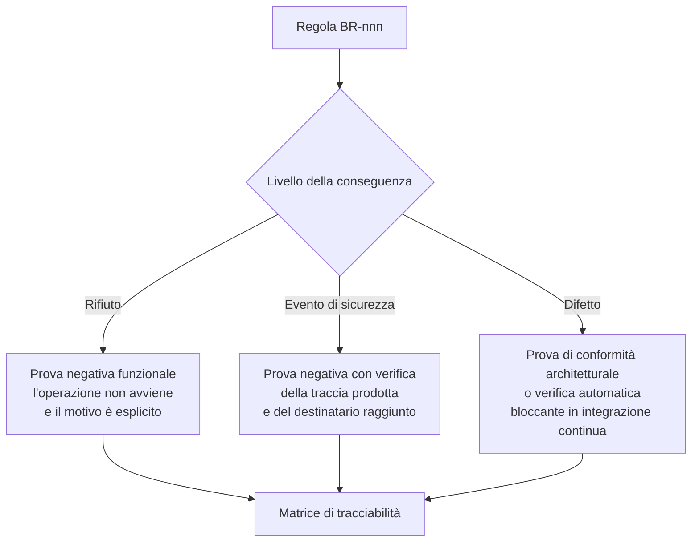

# Regole di business

## 1. Che cos'è una regola, qui

Un requisito descrive **una capacità che il sistema deve avere**. Una regola descrive **una
condizione che deve valere sempre**, indipendentemente dalla capacità che la mette alla prova. La
differenza è operativa: un requisito si verifica con un caso di prova positivo, una regola si
verifica con un caso di prova **negativo** - un test che, violando la regola, deve fallire. Se non
esiste quel test, l'enunciato non è una regola: è un'intenzione.

Ogni regola porta quattro elementi.

**Enunciato.** Formulato in modo che la violazione sia osservabile. Le formulazioni con «dovrebbe»,
«per quanto possibile», «di norma» sono escluse: o la condizione vale sempre, e allora è una regola,
o ammette eccezioni, e allora le eccezioni vanno enumerate dentro l'enunciato.

**Fonte.** Tre registri, tenuti distinti perché hanno forza diversa:

- `NORM` - deriva da una norma, da un atto amministrativo generale o da un accordo con efficacia
  vincolante. La citazione è puntuale. Dove la verifica su fonte primaria non è stata possibile, la
  regola porta `[NV]` con l'indicazione dell'area a cui va chiesta la conferma.
- `CTX` - deriva da una decisione approvata del progetto o da un vincolo architetturale. È
  vincolante internamente, non normativamente.
- `PROG` - è una proposta di modellazione del progetto: adottabile o rigettabile, ma non imposta da
  alcuna fonte esterna. Dichiararlo è ciò che distingue una scelta di prodotto da un obbligo.

**Razionale.** Perché la regola esiste. Senza razionale una regola viene aggirata alla prima
scadenza di progetto.

**Conseguenza della violazione.** È l'elemento che questo catalogo tratta come obbligatorio e che
manca quasi sempre. Distingue tre livelli: **rifiuto** (l'operazione non avviene), **evento di
sicurezza** (l'operazione avviene ma produce una traccia che qualcuno deve esaminare), **difetto**
(la violazione è possibile solo per errore di implementazione, e la prova negativa la intercetta).

## 2. Regole già in vigore

Le regole `BR-001` … `BR-096` sono state assegnate nella fase di ricerca, coprono ammissibilità del
canale, autorizzazione, agenda, sessione, refertazione, comunicazioni, consenso, registrazione,
conservazione e multi-tenancy, e **restano integralmente in vigore**. Non sono riscritte qui e non
sono rinumerabili. Quest'area apre l'intervallo `BR-100` … `BR-185`.

Due regole preesistenti vanno però richiamate perché sono i cardini di tutto ciò che segue:

- **`BR-010`** - l'accesso a un dato clinico è consentito se e solo se ricorrono, congiuntamente,
  permesso atomico, relazione abilitante vigente, assenza di dinieghi del titolare e coincidenza di
  tenant. Il default è negare.
- **`BR-096`** - la configurazione di un tenant non può alterare i vincoli di dominio codificati:
  l'insieme configurabile è un **sottoinsieme proprio** dello spazio delle politiche. È la regola
  che impedisce alla configurabilità di diventare una via di aggiramento, ed è richiamata da quasi
  ogni regola di questo documento.

## 3. Percorsi di cura e piani individuali (`BR-100` … `BR-109`)

| ID | Enunciato | Razionale | Fonte | Conseguenza della violazione |
|---|---|---|---|---|
| **BR-100** | Nessun percorso di cura è rappresentato nel codice applicativo: è un dato caricato, validato, versionato e pubblicato. Non esistono classi, costanti o diramazioni che nominino una condizione clinica o una fase di percorso. | I percorsi variano per Regione e per azienda per ragioni costituzionali, e ogni variante è legittima. Cablarne uno rende il prodotto inutilizzabile fuori dal contesto per cui è stato scritto. | `PROG` + `CTX` | difetto: la verifica automatica di conformità architetturale fallisce |
| **BR-101** | Modello e istanza sono entità distinte; l'istanza porta il riferimento alla **versione** del modello, non al modello. | Senza il riferimento alla versione è impossibile ricostruire che cosa era previsto al momento di una decisione clinica. | `PROG` | rifiuto della creazione dell'istanza |
| **BR-102** | Ogni modifica di un piano individuale produce una nuova versione con autore, motivazione e istante di efficacia. Nessun valore del piano è modificabile sul posto. | Senza le versioni precedenti non si può ricostruire perché un allarme non è scattato in una certa data. | `PROG` + `CTX` (V-04) | rifiuto della modifica |
| **BR-103** | La deviazione del piano dal percorso è ammessa, richiede motivazione ed è registrata; non è un errore di validazione. | Un sistema che impedisce la deviazione viene aggirato, e con esso si perde la motivazione, che è l'informazione clinica più preziosa. | `PROG` | difetto: una validazione che blocchi la deviazione è un difetto funzionale |
| **BR-104** | Ogni percorso appartiene a un tenant e a un ambito organizzativo; nessun percorso è globale per costruzione. | Vincolo di isolamento (V4), e realtà organizzativa: non esiste un percorso nazionale unico. | `CTX` (V4) | rifiuto della pubblicazione fuori ambito |
| **BR-105** | Un percorso incoerente è rifiutato alla pubblicazione, con messaggio comprensibile a chi lo ha redatto; non fallisce quando un paziente vi transita. | Il redattore non è una figura tecnica: l'errore va restituito a chi può correggerlo, quando può correggerlo. | `PROG` | rifiuto della pubblicazione |
| **BR-106** | L'arruolamento in un servizio di telemonitoraggio è un atto professionale tracciato. Nessuna auto-attivazione da parte dell'assistito, in nessuna interfaccia e per nessuna interfaccia applicativa. | Un servizio attivato senza un professionista responsabile produce dati senza destinatario, cioè sorveglianza apparente. | `NORM` `[NV]` sull'atto puntuale - da confermare con l'area conformità - + `PROG` | rifiuto dell'operazione ed evento di sicurezza |
| **BR-107** | L'attivazione del piano è un atto con un istante registrato; le finestre di attesa decorrono da quell'istante e non prima. | Un piano creato ma non attivato non genera assenze; un piano attivato senza dispositivi consegnati genera un'onda di falsi allarmi al primo giorno. | `PROG` | difetto: generazione di eventi di assenza su piani non attivi |
| **BR-108** | La conclusione di un percorso è un atto con motivazione tipizzata. **Nessun percorso si estingue per inattività o per decorso del tempo.** | Un percorso che si spegne perché smette di arrivare qualcosa non è concluso: è abbandonato, e nessuno sa che nessuno se ne occupa. | `PROG` | difetto: qualunque transizione automatica a stato conclusivo |
| **BR-109** | La conclusione produce sempre la relazione finale, la comunicazione al paziente e al medico curante, e l'attività di ritiro dei dispositivi assegnati. | La chiusura amministrativa senza restituzione informativa lascia il curante privo del quadro e i dispositivi in giro. | `NORM` (contenuto documentale: DM 19 novembre 2025, Allegato 1, § 2.27) | evento di sicurezza: pendenza documentale segnalata al servizio |

## 4. Misure, serie temporali e provenienza (`BR-110` … `BR-119`)

| ID | Enunciato | Razionale | Fonte | Conseguenza della violazione |
|---|---|---|---|---|
| **BR-110** | Una misura non è mai sovrascritta né cancellata. La correzione produce una nuova versione con lo stato della precedente marcato come sostituito. | Il valore clinico sta nell'andamento: un sistema che conserva l'ultimo valore ha distrutto l'informazione mantenendo il dato. E serve sapere che cosa il sistema ha valutato quando lo ha valutato. | `PROG` + `CTX` (V-04) | rifiuto dell'operazione di scrittura distruttiva |
| **BR-111** | Istante della misura e istante della ricezione sono campi distinti e obbligatori; le regole operano sull'istante di misura. | Confonderli produce serie sbagliate e allarmi generati sul giorno sbagliato. | `PROG` | rifiuto dell'acquisizione |
| **BR-112** | Provenienza, dispositivo o soggetto rilevatore, unità di misura e condizioni di rilevazione previste dal piano sono **parte della misura**, non metadati facoltativi né note testuali. | Un valore senza le sue condizioni non è confrontabile con sé stesso nel tempo; una colonna di valore senza sorgente è un difetto strutturale. | `PROG` | rifiuto dell'acquisizione |
| **BR-113** | Ogni misura porta un indicatore di attendibilità, e chi l'ha eseguita deve poter dichiarare che non è valida; la dichiarazione esclude la misura dalla valutazione senza rimuoverla dalla storia. | Le cause di errore di misura a domicilio sono numerose e non deducibili dal valore. | `PROG` | difetto: assenza dell'azione di dichiarazione |
| **BR-114** | L'ingestione è idempotente su un criterio di identità dichiarato: sorgente, soggetto, parametro, istante di misura, valore. Un duplicato non genera un secondo punto né un secondo allarme. | Un duplicato che genera un secondo allarme identico riduce la fiducia nell'intero sistema. | `PROG` | difetto |
| **BR-115** | La ricezione di un dato anteriore all'ultimo valutato innesca la rivalutazione della finestra interessata; l'allarme che ne deriva è marcato come tardivo con l'età del dato. | L'ordine di arrivo non è l'ordine cronologico, e un allarme su un fatto di tre giorni prima ha valore clinico limitato: va segnalato come tale, non nascosto. | `PROG` | difetto |
| **BR-116** | Il valore tecnicamente impossibile per lo strumento genera un allarme tecnico e non entra nella serie clinica; il valore clinicamente estremo ma possibile entra nella serie ed è valutato. | Filtrare silenziosamente un valore anomalo è esattamente il modo di perdere l'evento che il servizio esiste per intercettare. | `PROG` | difetto: qualunque filtraggio silenzioso |
| **BR-117** | Nessuna misura è acquisita senza unità esplicita; la conversione avviene al confine, è dichiarata e registrata; non esiste un'unità presunta per difetto. | Un parametro espresso in un'unità diversa da quella attesa produce un esito errato senza alcun errore visibile. | `PROG` | rifiuto dell'acquisizione |
| **BR-118** | Quando un utente può inserire misure per più soggetti, il soggetto corrente è permanentemente visibile e il cambio richiede una conferma esplicita che lo nomina. | L'attribuzione al soggetto sbagliato è uno scenario d'uso pericoloso documentato. | `PROG` (misura di controllo del rischio) | difetto |
| **BR-119** | I dati tecnici del dispositivo - carica, connessione, autodiagnostica, taratura - hanno finalità e conservazione proprie, distinte da quelle del dato clinico, e non compaiono nelle viste cliniche. | Sono dati tecnici: mescolarli al dato clinico ne estende impropriamente il regime di protezione e ne confonde la lettura. | `CTX` + `NORM` (regimi di conservazione differenziati) | difetto |

## 5. Punteggi e scale (`BR-120` … `BR-127`)

| ID | Enunciato | Razionale | Fonte | Conseguenza della violazione |
|---|---|---|---|---|
| **BR-120** | Nessun punteggio è persistito senza tracciabilità completa del calcolo: scala e versione, valore e provenienza di ciascun item, item mancanti e trattamento, regola di calcolo e versione, istante, agente, regola interpretativa. | Non è telemetria: è documentazione di un atto, e il calcolo è precisamente l'elemento che qualifica il software. | `CTX` (D26) + `PROG` | rifiuto della persistenza |
| **BR-121** | Nessun item mancante entra nel calcolo come valore di normalità. Se la scala non ammette imputazione, il punteggio non è calcolabile; se la ammette, il risultato è marcato come parziale e non è mai presentato come punteggio pieno. | Un item non rilevato trattato come zero produce un punteggio rassicurante costruito sull'ignoranza. | `PROG` | rifiuto del calcolo o marcatura obbligatoria |
| **BR-122** | I punteggi a valori interi sono calcolati con aritmetica intera; le unità sono esplicite e verificate a ogni confine; nessun arrotondamento è applicato con regole diverse in punti diversi. | Due valori differenti per lo stesso paziente nella stessa schermata distruggono la fiducia e possono cambiare una decisione. | `PROG` | difetto |
| **BR-123** | Il punteggio registrato non viene mai ricalcolato retroattivamente. Una nuova versione della regola vale per i calcoli successivi. | Il punteggio è ciò che il clinico ha visto quando ha deciso; ricalcolare riscrive la storia e rende indifendibile qualunque ricostruzione. | `PROG` | rifiuto dell'operazione di ricalcolo |
| **BR-124** | Le fasce interpretative del punteggio sono configurazione del percorso o del piano, mai costanti applicative. | Variano per protocollo locale con la stessa frequenza dei percorsi. | `PROG` | difetto: la verifica automatica rileva le costanti |
| **BR-125** | Il punteggio è attribuito alla persona che lo ha validato, mai al sistema che lo ha calcolato; finché non è validato è presentato come proposta e non è riportabile in un documento firmato. | Il sistema propone; la responsabilità clinica resta di una persona, e l'attribuzione deve essere visibile. | `CTX` (V2) + `PROG` | rifiuto dell'inserimento in documento |
| **BR-126** | L'introduzione o la modifica di un punteggio richiede una valutazione di impatto su classificazione, destinazione d'uso e gestione del rischio, registrata prima dell'accettazione della modifica. | Aggiungere il calcolo di una scala non è aggiungere una funzione: è modificare il dispositivo. | `CTX` (D26, D46) | rifiuto in integrazione continua |
| **BR-127** | Le funzionalità di confine - allerta su soglia, riproduzione con miglioramento dell'immagine, refertazione assistita - non sono modificabili senza valutazione di impatto regolatorio registrata. | Sono a una singola modifica dall'innalzamento di classe. | `CTX` (D26) | rifiuto in integrazione continua |

## 6. Soglie, allarmi ed escalation (`BR-130` … `BR-145`)

| ID | Enunciato | Razionale | Fonte | Conseguenza della violazione |
|---|---|---|---|---|
| **BR-130** | Nessuna soglia clinica è cablata in alcuna forma: costante, configurazione applicativa, migrazione di schema, valore predefinito di colonna, valore suggerito in un modulo. | La normalità è individuale; la soglia è contenuto di un documento sanitario individuale firmato da un professionista. Una soglia nel codice è una parte di documento sanitario scritta da uno sviluppatore. | `CTX` (V-02, D21) + `NORM` (contenuto del piano: DM 19 novembre 2025, Allegato 1, § 2.24) | difetto: verifica automatica bloccante in integrazione continua |
| **BR-131** | Nessun campo di soglia clinica è precompilato. I valori indicati dal percorso sono mostrati accanto, in sola lettura, attribuiti con fonte e versione, con un'azione esplicita di copia. | Un valore proposto dal sistema viene confermato dalla maggior parte degli utenti, specialmente sotto pressione di tempo: proporre una soglia equivale a stabilirla, con l'aggravante che la responsabilità appare di chi ha confermato. | `PROG` (misura di controllo del rischio) | difetto: verifica automatica su interfaccia e contratto |
| **BR-132** | Ogni parametro ha limiti di ammissibilità codificati che non stabiliscono la soglia ma impediscono l'errore materiale; il tentativo fuori limite è rifiutato con l'indicazione dell'intervallo ed è registrato. | Il limite non decide la soglia, evita l'errore di digitazione. Non è in contraddizione con `BR-130`. | `PROG` | rifiuto del salvataggio, registrazione come quasi evento |
| **BR-133** | Nessun allarme esiste senza destinatario individuabile in quel momento, scadenza di riscontro ed escalation. Un allarme privo di uno dei tre non è un allarme. | Un allarme senza escalation è un registro con un suono. | `PROG` | rifiuto della configurazione della regola |
| **BR-134** | La catena di escalation è finita e termina in un **fallimento dichiarato**. Nessuna chiusura automatica per scadenza, nessun rinvio indefinito. | Un sistema che chiude gli allarmi non riscontrati «per scadenza» cancella l'unica traccia del fatto che nessuno ha risposto. | `PROG` | difetto: qualunque transizione a chiuso non attribuita a una persona |
| **BR-135** | Ogni tentativo di consegna registra canale, destinatario, istante ed esito confermato; l'assenza di conferma entro il tempo previsto è a sua volta un evento che innesca il passaggio successivo. | Senza conferma per canale il sistema crede di aver avvisato e non ha avvisato. | `PROG` | difetto |
| **BR-136** | Presa in carico e risoluzione sono transizioni distinte, entrambe attribuite a una persona identificata; la visualizzazione non è presa in carico. | La visualizzazione è un fatto tecnico, la presa in carico un'assunzione di responsabilità. Un allarme assunto e mai risolto è una condizione anomala che, se coincidesse con la chiusura, sarebbe invisibile. | `PROG` | difetto |
| **BR-137** | Natura tecnica o clinica, severità e destinatario sono determinati alla generazione dell'allarme e persistiti; non sono dedotti al momento della notifica. | Dedurli a valle significa che due componenti diversi possono dedurli diversamente. | `NORM` (separazione centro servizi / centro erogatore, DM 21 settembre 2022, Allegato A) + `PROG` | difetto |
| **BR-138** | Un allarme tecnico non risolto entro il tempo definito nel piano **si converte** in un allarme clinico di assenza di sorveglianza, con destinatario clinico. | Un dispositivo guasto per un giorno è un incidente tecnico; per due settimane è un paziente non monitorato che il servizio crede monitorato. | `PROG` | difetto |
| **BR-139** | Ogni tecnica di riduzione del rumore - isteresi, persistenza, raggruppamento, soppressione dei duplicati, sospensione, finestra di silenzio - è configurata da un professionista, dichiarata con il ritardo che introduce, tracciata e valutata nel file di rischio. Nessuna è una costante decisa da chi scrive il codice. | Ogni tecnica riduce il rumore introducendo un ritardo o una perdita: è una modifica del comportamento di sicurezza del dispositivo. | `PROG` (misura di controllo del rischio) | rifiuto della configurazione priva di dichiarazione del ritardo |
| **BR-140** | Un gruppo di allarmi eredita la **severità massima** dei componenti e la scadenza dell'allarme più severo. Mai la media, mai quella del primo. | Un allarme grave può nascondersi dentro un gruppo di allarmi banali. | `PROG` | difetto |
| **BR-141** | Ogni catena di escalation configurata è provabile a freddo senza generare un allarme clinico reale, e la prova è eseguita entro la periodicità dichiarata; gli eventi di prova sono marcati e non entrano nelle statistiche cliniche. | Una catena mai provata è, statisticamente, una catena rotta. | `PROG` | evento di sicurezza: catena non provata segnalata al servizio |
| **BR-142** | Il tasso di mancato riscontro e la quota di allarmi che producono un'azione sono **indicatori di sicurezza** esposti alla direzione del servizio, non metriche tecniche. | La qualità di un motore di allarme non si misura in allarmi generati ma in allarmi che hanno cambiato un'azione. | `PROG` | difetto: assenza dell'esposizione |
| **BR-143** | Un allarme è una sequenza di eventi immutabili; lo stato corrente è una proiezione e non una colonna aggiornata sul posto. | Se lo stato è aggiornato sul posto, la sequenza è perduta e con essa l'unica prova di ciò che è accaduto. | `CTX` (V-04, D42) + `PROG` | difetto |
| **BR-144** | La sospensione temporanea di una categoria di allarme ha durata massima codificata, è attribuita, motivata, riattiva automaticamente, e alla riattivazione ripresenta la condizione eventualmente persistente. | Se l'interfaccia offre un modo per far smettere il segnale senza assumersi l'allarme, quel modo verrà usato. | `PROG` | rifiuto della sospensione senza durata o senza attribuzione |
| **BR-145** | L'introduzione di una nuova categoria di allarme richiede la dimostrazione che esista un'azione conseguente, che il destinatario sia individuato e che il carico complessivo per destinatario resti entro il limite dichiarato. | Aggiungere un allarme non è mai a costo zero: ogni nuovo allarme sottrae attenzione a tutti gli altri. | `PROG` (misura di controllo del rischio) | rifiuto in fase di revisione della modifica |

## 7. Silenzio, aderenza e sorveglianza del volume (`BR-150` … `BR-158`)

| ID | Enunciato | Razionale | Fonte | Conseguenza della violazione |
|---|---|---|---|---|
| **BR-150** | Ogni parametro del piano ha una finestra di attesa derivata dal piano; il suo decorso senza misura genera un evento che entra nella catena degli allarmi. **Il silenzio non è mai trattato come normalità.** | Fra le cause dell'assenza c'è, con probabilità non trascurabile, esattamente ciò che il servizio esiste per intercettare. | `CTX` (V-09) + `PROG` | difetto: assenza di generazione dell'evento |
| **BR-151** | Il sistema distingue *misura non attesa* da *misura non pervenuta*; la finestra deriva dalla frequenza codificata e dalla fascia oraria del piano, mai da una costante. | Un paziente il cui piano prevede due rilevazioni a settimana non è silente il martedì. | `PROG` | difetto: falsi eventi di assenza |
| **BR-152** | La riduzione del rumore sul silenzio agisce sulla severità e sull'instradamento, **mai sulla generazione dell'evento di assenza**. | Sopprimere l'evento distrugge l'informazione; qualificarlo la conserva. | `CTX` (V-09) | difetto |
| **BR-153** | Deve esistere un'azione breve con cui il paziente o il caregiver dichiarano un'indisponibilità programmata; la dichiarazione qualifica le assenze del periodo senza sopprimerle, e la severità torna ordinaria alla scadenza senza alcuna azione. | Ogni causa dichiarata rende più informativo il silenzio residuo e riduce i contatti a vuoto. | `PROG` | difetto |
| **BR-154** | Il silenzio inspiegato produce un **contatto umano** con esito registrato, non un ulteriore tentativo automatico; la conclusione del percorso per abbandono richiede sempre un atto professionale. | L'ultima categoria di cause - la persona che non riesce più a eseguire la misura - non è distinguibile con mezzi tecnici. | `PROG` | difetto: qualunque chiusura automatica dell'allarme di assenza |
| **BR-155** | Il silenzio collettivo è un guasto di piattaforma fino a prova contraria: sorveglianza del volume atteso, allarme tecnico di severità massima, qualificazione degli allarmi individuali come non valutabili, comunicazione immediata al servizio clinico. | È il caso peggiore: riguarda tutti insieme, è invisibile per costruzione e satura il servizio proprio quando i dati mancano. | `PROG` | difetto: assenza di sorveglianza aggregata |
| **BR-156** | Ogni evento di misura, di allarme, di escalation e di configurazione porta l'identificativo di tenant; una scrittura senza tenant è un errore, non un valore nullo tollerato. | Estensione al telemonitoraggio di `BR-091`. | `CTX` (V4) | rifiuto della scrittura |
| **BR-157** | Le viste cliniche espongono in evidenza l'**età dell'ultimo dato** per ciascun parametro monitorato e il perimetro del piano; nessuna vista presenta un quadro di stabilità su dati non recenti. | È la mitigazione dello scenario d'uso pericoloso più probabile: il professionista che, sotto pressione di tempo, legge un quadro come stabile mentre il sistema non sa nulla da giorni. | `PROG` (misura di controllo del rischio) | difetto |
| **BR-158** | Le viste dell'aderenza rivolte al paziente non usano linguaggio valutativo né elementi punitivi; l'assenza è rappresentata come fatto, con l'azione per recuperare o dichiarare. | Un'interfaccia che tratta il paziente non aderente come inadempiente ottiene meno aderenza, non più. La non aderenza è la regola, non l'eccezione. | `PROG` | difetto: revisione del catalogo messaggi |

## 8. Copertura del servizio, instradamento e separazione dei ruoli (`BR-160` … `BR-168`)

| ID | Enunciato | Razionale | Fonte | Conseguenza della violazione |
|---|---|---|---|---|
| **BR-160** | La copertura del servizio è un dato configurato e versionato - fasce, giorni, festività, tempi di riscontro per severità, destinatari attivi per fascia - e un piano non è attivabile senza una copertura dichiarata e vigente. | Un servizio che promette sorveglianza senza dichiarare quando la esercita è più pericoloso dell'assenza di servizio, perché produce falsa rassicurazione e ritarda l'accesso al canale corretto. | `NORM` (livelli di servizio per le infrastrutture regionali: DM 21 settembre 2022, Allegato A) + `PROG` (qualificazione come requisito di sicurezza) | rifiuto dell'attivazione del piano |
| **BR-161** | Lo stato corrente della copertura e il canale alternativo sono visibili in modo persistente al paziente e al caregiver, in ogni momento e non solo in fase di adesione, e non sono occultabili per configurazione di personalizzazione. | La misura di controllo è informativa e appartiene al livello più debole della gerarchia: proprio per questo va resa impossibile da non vedere. | `PROG` (misura di controllo del rischio) | difetto: verifica automatica di presenza e di accessibilità |
| **BR-162** | Il sistema non formula diagnosi, non stima probabilità cliniche, non assegna autonomamente codici di priorità e non decide di non allarmare sulla base di altri dati. | Confine di qualificazione, e ragionamento clinico riservato. «La saturazione è normale, quindi il sintomo riferito non conta» è un ragionamento clinico, ed è per giunta sbagliato. | `CTX` (V2, D26) + `NORM` (esclusione del triage dal perimetro: Accordo Stato-Regioni 17 dicembre 2020, rep. atti n. 215/CSR) | difetto: verifica di conformità architetturale bloccante |
| **BR-163** | L'instradamento - la risposta alla domanda «questo canale è adeguato?» - è una proprietà del servizio ed è ammesso. La valutazione - «che cosa ha questa persona?» - è un atto riservato e non è mai eseguita dal sistema. | È la formulazione operativa del confine di qualificazione: l'instradamento non produce informazione clinica nuova, la valutazione sì. | `CTX` (V2) + `NORM` | difetto |
| **BR-164** | I testi di instradamento, i canali e i recapiti sono configurazione per territorio e per orario; il canale corretto non è sempre l'emergenza. | Cablare un recapito significa instradare male in metà del territorio e in metà delle ore. | `PROG` | rifiuto dell'attivazione del piano se il testo non è configurato |
| **BR-165** | Gli item che innescano l'uscita dal canale sono redatti e marcati da un clinico nel piano; il sistema li riconosce per confronto sul marcatore e non li inferisce da testo libero né da combinazioni non dichiarate. | Il riconoscimento è un confronto su un item strutturato; l'inferenza sarebbe interpretazione. | `CTX` (V2) + `PROG` | difetto: verifica di conformità architetturale |
| **BR-166** | Chi gestisce gli allarmi tecnici non accede al contenuto clinico; chi gestisce gli allarmi sanitari non dipende dal turno tecnico per essere raggiunto. La composizione di un ruolo che violi la separazione è rifiutata con errore di validazione. | La separazione fra centro servizi e centro erogatore è imposta e non organizzativa a discrezione, e si riflette nel modello di autorizzazione. | `NORM` (DM 21 settembre 2022, Allegato A) | rifiuto della composizione del ruolo ed evento di sicurezza |
| **BR-167** | La finestra di silenzio si applica esclusivamente alle severità basse, mai a quelle alte, ed è dichiarata al paziente. | Una condizione grave non segnalata per rispettare il riposo è un danno prodotto da una scelta di comodità. | `PROG` | rifiuto della configurazione |
| **BR-168** | Il canale di messaggistica asincrona con l'assistito dichiara in modo persistente e non chiudibile i tempi di risposta attesi e che **non è un canale di emergenza**; lo stesso vale per il ripiego telefonico e per l'inserimento manuale delle misure. | Rischio clinico da aspettativa errata: è la stessa dinamica della copertura mal dichiarata. | `PROG` + `CTX` (D46, destinazione d'uso) | difetto: verifica automatica di presenza della dichiarazione |

## 9. Documenti, ruolo del pagatore, integrabilità e processo (`BR-170` … `BR-179`)

| ID | Enunciato | Razionale | Fonte | Conseguenza della violazione |
|---|---|---|---|---|
| **BR-170** | Nessuna funzionalità del sistema può mediare l'accesso di una compagnia di assicurazione al fascicolo sanitario elettronico, né direttamente né per il tramite di un professionista. | L'esclusione è **sempre** operante e riguarda anche periti e datori di lavoro. | `NORM` (art. 15, c. 4, DM 7 settembre 2023) | rifiuto dell'operazione ed evento di sicurezza di severità critica |
| **BR-171** | Il soggetto che finanzia o rimborsa la prestazione non acquisisce per ciò stesso alcun titolo di accesso al contenuto clinico. Titolo di pagamento e titolo di accesso sono oggetti distinti, con basi giuridiche distinte. **Il pagatore non è un consultatore.** | Il caso d'uso a carico di fondi, mutue e polizze resta valido per l'**erogazione**, non per la consultazione. La comunicazione pubblica va formulata di conseguenza. | `NORM` + `CTX` (D48, vincolo V-08) | rifiuto della composizione del ruolo e dell'operazione |
| **BR-172** | Il contenuto informativo dei documenti destinati al fascicolo è modellato come **dataset canonico**; le serializzazioni sono sostituibili e non vanno cablate. Le tipologie documentali della telemedicina sono tipologie proprie, non riusi di tipologie preesistenti. | I template e i metadati di indicizzazione non sono ancora pubblicamente disponibili: cablarne uno oggi significa riemetterlo domani. | `CTX` (V-07, D30) + `NORM` (art. 7, DM 19 novembre 2025) `[NV]` sui template - questione aperta verso l'area conformità | difetto: cablatura di un template |
| **BR-173** | L'accesso in consultazione ai documenti prodotti segue la matrice di visibilità per profilo professionale; in particolare il referto di specialistica per la televisita non è accessibile in consultazione al personale infermieristico e ostetrico né al personale amministrativo. | È una regola di autorizzazione fine, non deducibile dai profili generali, e va implementata e provata come tale. | `NORM` (DM 19 novembre 2025, Allegato 3, § 5.2) | rifiuto dell'accesso ed evento di sicurezza |
| **BR-174** | Il sistema deve poter operare in modalità **senza conservazione** del contenuto clinico, in cui agisce da produttore di documenti e non da archivio, con il conferimento a carico della struttura sanitaria. | L'assunzione implicita che la piattaforma sia anche archivio non regge in tutti i contesti di esercizio. | `NORM` (artt. 4, c. 4, e 12, DM 19 novembre 2025) | difetto: dipendenza funzionale dalla conservazione locale |
| **BR-175** | Nessuna capacità del sistema è raggiungibile dalla sola interfaccia utente: ogni capacità ha un'interfaccia applicativa documentata e versionata. | Vincolo di integrabilità totale: un integratore deve poter fare tutto ciò che fa l'interfaccia. | `CTX` (V3) | difetto: prova di conformità che confronta interfaccia e specifica |
| **BR-176** | Esiste nel prodotto un canale di segnalazione di eventi e quasi eventi, distinto dal canale di assistenza tecnica, con un tempo di riscontro al segnalante dichiarato e misurato. | Un canale da cui non torna mai nulla smette di essere usato entro poche settimane; un canale confuso con l'assistenza tecnica non riceve segnalazioni di sicurezza. | `PROG` + `CTX` (processo di sorveglianza) | difetto |
| **BR-177** | I quasi eventi - tentativi bloccati, rifiuti di validazione, escalation riuscite, cambi di soggetto interrotti - sono conservati e analizzabili in forma aggregata; non sono scartati perché «non è successo niente». | È l'unica sorgente di informazione di sicurezza a costo zero che il sistema possiede. | `PROG` | difetto: assenza di registrazione per categoria dichiarata |
| **BR-178** | Gli identificativi di requisito, di regola e di attore non sono mai rinumerati né riusati; la modifica sostanziale di un requisito produce un identificativo nuovo con ritiro esplicito del precedente. | La tracciabilità richiesta dal ciclo di vita del software non si ricostruisce a posteriori. | `CTX` (D45) + `NORM` (IEC 62304 §5.1.1) | rifiuto in revisione della modifica |
| **BR-179** | Le misure di controllo del rischio seguono la gerarchia obbligata - sicurezza intrinseca per progettazione, misure di protezione, informazioni per la sicurezza - e ciascuna è verificata per **efficacia** ed esaminata per i **nuovi rischi che introduce**. | Non si può saltare al livello informativo perché è il più economico; e ogni mitigazione peggiora qualcosa. | `NORM` (ISO 14971:2019) `[NV]` sul riferimento puntuale di clausola - da confermare con l'area conformità | rifiuto in revisione del file di rischio |

## 10. Ammissibilità della prestazione a distanza e *setting* (`BR-180` … `BR-185`)

| ID | Enunciato | Razionale | Fonte | Conseguenza della violazione |
|---|---|---|---|---|
| **BR-180** | La televisita è erogabile per prestazioni che non richiedono la completezza dell'esame obiettivo e in presenza di almeno una delle condizioni di erogabilità previste; la registrazione della dichiarazione precede l'atto. | È una precondizione di dominio, non un campo descrittivo. | `NORM` (Accordo 215/CSR 2020; DM 30 settembre 2022, Allegato B) | rifiuto dell'avvio dell'atto |
| **BR-181** | L'esito della verifica di eseguibilità è registrato su tre dimensioni distinte: utilità clinica, sicurezza clinica, capacità di interazione digitale dell'assistito. | La terza dimensione è quella che decide se il canale è realizzabile per quella persona, ed è distinta dall'adesione e dal consenso. | `NORM` `[RACCOMANDATO]` (AGENAS, Modello orientativo di erogazione della Televisita, v. 1.0.25 del 16 aprile 2026) | evento di sicurezza: contatto segnalato come non verificato |
| **BR-182** | La dichiarazione di erogabilità è attribuita al medico ed è immutabile; l'eventuale correzione è una nuova dichiarazione che non cancella la precedente. | È l'atto su cui si fonda l'appropriatezza del canale, e deve restare opponibile. | `PROG` + `NORM` | rifiuto della modifica |
| **BR-183** | Quando lo strumento a distanza non consente di mantenere inalterato il contenuto sostanziale della prestazione, la prestazione è completata o riprogrammata in presenza **senza oneri ulteriori** a carico del servizio sanitario o dell'assistito, e l'evento di riprogrammazione è generato e agganciato alla prenotazione. | Il fallimento tecnico non è una gestione dell'errore: è un requisito funzionale con un obbligo di risultato. | `NORM` (Accordo 215/CSR 2020; AGENAS, Modello orientativo v. 1.0.25) | rifiuto della chiusura del contatto senza evento di riprogrammazione |
| **BR-184** | Nel teleconsulto la relazione del consulente e il documento del curante restano distinti, con autori distinti; il sistema non fonde automaticamente i due contenuti, e la relazione collaborativa è conferita come allegato del documento principale con la correlazione alla richiesta. | Responsabilità professionali separate, e regola documentale espressa. | `NORM` (DM 19 novembre 2025, Allegato 1, § 2.21) | rifiuto della generazione del documento fuso |
| **BR-185** | Il sistema non offre percorsi di televisita in contesti qualificati come urgenza o emergenza, in nessuna interfaccia e per nessuna interfaccia applicativa; il teleconsulto e la teleconsulenza restano ammessi ma **mai in surroga delle attività di soccorso**. | La prestazione a distanza non deve costituire ragione per ritardare interventi in presenza. | `NORM` (DM 30 settembre 2022, Allegato B; Accordo 215/CSR 2020) | rifiuto dell'operazione ed evento di sicurezza |

## 11. Che cosa un tenant non può configurare

L'insieme configurabile è un sottoinsieme proprio dello spazio delle politiche (`BR-096`). Le regole
che seguono **non sono derogabili per configurazione da alcun ruolo, compreso l'amministratore di
sistema**, e il tentativo di comporre una configurazione che le violi è rifiutato con errore di
validazione:

| Ambito | Regole non derogabili |
|---|---|
| Combinazioni professione × prestazione vietate dall'ordinamento professionale | `BR-011` |
| Accesso al contenuto clinico da parte di ruoli amministrativi o tecnici | `BR-012`, `BR-166`, `BR-171` |
| Registrazione della sessione per prestazioni marcate non registrabili | `BR-075` |
| Soglie cablate o precompilate | `BR-130`, `BR-131` |
| Allarmi privi di destinatario, scadenza o escalation | `BR-133` |
| Chiusura automatica di un allarme non riscontrato | `BR-134` |
| Soppressione della generazione dell'evento di assenza | `BR-150`, `BR-152` |
| Estinzione di un percorso per inattività | `BR-108` |
| Silenzio notturno su severità alte | `BR-167` |
| Accesso di un assicuratore al fascicolo | `BR-170` |
| Percorsi di televisita in urgenza | `BR-185` |
| Occultamento della dichiarazione di copertura e dei limiti d'uso | `BR-161`, `BR-168` |

## 12. Come si verifica una regola

Per ciascuna regola esiste almeno una **prova negativa**: uno scenario che tenta la violazione e che
deve fallire. La prova negativa è il collegamento fra la regola e la matrice di tracciabilità, ed è
ciò che rende la regola dimostrabile a un valutatore esterno.

Tre avvertenze pratiche, ricavate da ciò che va storto abitualmente.

**Una regola verificata solo dall'interfaccia non è verificata.** Ogni prova negativa si esegue anche
sull'interfaccia applicativa: la maggior parte delle violazioni reali arriva da chiamate dirette, non
da schermate.

**Una regola con conseguenza «evento di sicurezza» va provata fino al destinatario.** Verificare che
la traccia esista non basta: va verificato che raggiunga qualcuno, entro il tempo previsto, e che
qualcuno possa prenderla in carico.

**Una regola che non ha mai fallito in nessuna prova è sospetta.** Se nessuno scenario riesce a
violarla, verificare che la prova stia effettivamente esercitando il percorso e non un ramo morto: è
il modo più comune in cui una copertura di prova risulta alta e non protegge da nulla.
