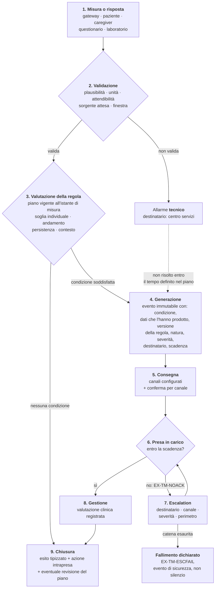
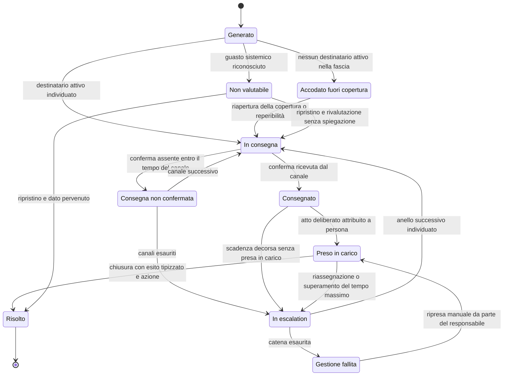

# Gestione degli allarmi

## 1. Le quattro componenti obbligatorie

Un allarme clinico è un segnale che comunica a un professionista che la condizione di un assistito
richiede attenzione **entro un tempo definito**. Ha quattro componenti, e l'assenza di una qualunque
lo rende inefficace:

1. **una condizione** che lo genera, verificabile e ricostruibile a posteriori;
2. **un destinatario**, individuabile *in quel momento* e non in astratto;
3. **un tempo di riscontro atteso**, entro cui qualcuno deve prenderlo in carico;
4. **una conseguenza in caso di mancato riscontro**.

La quarta manca praticamente sempre nelle prime implementazioni, ed è quella che distingue un
allarme da una notifica. **Un allarme senza escalation non è un allarme: è un registro con un
suono** (`BR-133`).

La teoria che giustifica queste scelte - sensibilità e specificità, valore predittivo positivo e
dipendenza dalla prevalenza, affaticamento da allarme come meccanismo documentato di produzione del
danno - è nel modulo
[10, § 7](../10_fondamenti/10-percorsi-di-cura-e-sicurezza.md). Qui non si ripete: si applica.

Una conseguenza va però ricordata, perché orienta ogni decisione di questo documento. Un allarme
con sensibilità e specificità elevate, applicato a un evento raro, ha comunque un valore predittivo
basso: il professionista che «ignora gli allarmi» non sta violando un protocollo, sta rispondendo
razionalmente a uno strumento che ha ragione poche volte su cento. **La responsabilità del
comportamento è del sistema che genera l'allarme, non di chi lo riceve.** Da qui l'obbligo di
misurare l'esito degli allarmi (`RF-290`) e il tetto configurabile per destinatario (`RNF-094`).

## 2. Le soglie sono configurazione clinica per assistito

Questo punto non ammette gradazioni ed è la formulazione operativa del vincolo **[V-02](../11_registri/01-vincoli-in-vigore.md#v-02)**: la soglia e
l'allerta sono configurate dal professionista, mai dedotte dal sistema.

**Quattro ragioni cumulative.** *Clinica*: la normalità è individuale, e il valore clinicamente utile
in cronicità è spesso lo scostamento dal valore abituale di quella persona, non un intervallo di
popolazione. *Organizzativa*: la soglia determina il carico di lavoro del servizio, e non è
configurabile in astratto ma solo in rapporto alla capacità di risposta dichiarata. *Regolatoria*: la
soglia è contenuto del piano di telemonitoraggio, che è un documento sanitario individuale firmato,
con un contenuto informativo definito dal DM 19 novembre 2025, Allegato 1, § 2.24 - una soglia nel
codice sorgente è una parte di documento sanitario scritta da uno sviluppatore. *Di responsabilità*:
se la soglia è del sistema, il sistema ha deciso.

**Che cosa ne discende, in forma verificabile.**

| Requisito | Contenuto | Verifica |
|---|---|---|
| `BR-130`, `RNF-103` | nessun valore di soglia in costanti, configurazione applicativa, migrazioni, valori predefiniti di colonna | verifica automatica bloccante con regole versionate e allowlist motivata |
| `RF-240`, `RNF-104` | nessun campo di soglia precompilato, in alcuna interfaccia | prova automatica su interfaccia e su contratto pubblicato |
| `RF-241`, `BR-132` | limiti di ammissibilità codificati contro l'errore materiale, rifiuto tracciato | prova negativa con valore fuori limite |
| `RF-244` | la modifica di una soglia produce una nuova versione del piano | interrogazione del piano a una data anteriore |
| `RF-243` | un piano senza soglie configurate non è attivabile | prova negativa di attivazione |

**Perché un valore predefinito «ragionevole» non è una via d'uscita.** Un valore proposto dal sistema
viene confermato dalla maggior parte degli utenti, specialmente sotto pressione di tempo: proporre
una soglia equivale a stabilirla, con l'aggravante che la responsabilità appare formalmente di chi ha
confermato. Esistono inoltre sottopopolazioni identificabili per cui il valore «normale» è
clinicamente sbagliato, e uno strumento diffuso arriva a prevedere una scala di punteggio
alternativa proprio per riconoscerlo. Infine, un valore predefinito è una dichiarazione clinica non
firmata: proviene da una fonte - quale, in quale versione, per quale popolazione? - oppure da
nessuno.

> **La forma corretta.** Il campo parte **vuoto e obbligatorio**. Il sistema può mostrare accanto, in
> sola lettura e chiaramente attribuiti, i valori indicati dal percorso adottato
> dall'organizzazione, con fonte e versione, e offrire un'azione esplicita di copia. Ciò che il
> sistema non fa è **precompilare**. La differenza fra «mostrare un riferimento attribuito» e
> «precompilare un campo» è invisibile a chi scrive il codice e decisiva per chi ne risponde.

## 3. Anatomia di un allarme



La freccia tratteggiata è `RF-288`: un allarme tecnico non risolto si converte in allarme clinico di
assenza di sorveglianza, perché il fatto rilevante non è più il guasto ma la mancanza di
sorveglianza.

**I punti in cui le implementazioni reali si rompono**, in ordine di frequenza osservata, e il
requisito che li presidia:

| # | Punto di rottura | Che cosa accade | Presidio |
|---|---|---|---|
| 1 | fra generazione e consegna | la consegna fallisce in silenzio: recapito non più valido, dispositivo spento, servizio esterno indisponibile. Il sistema crede di aver avvisato | `RF-276`, `RF-277` |
| 2 | fra consegna e riscontro | nessuna scadenza definita, quindi nessun modo di sapere che il riscontro non è arrivato | `RF-274` |
| 3 | nella presa in carico | la presa in carico coincide con l'apertura della schermata: un allarme «visto» non è un allarme assunto | `RF-278` |
| 4 | nell'escalation | la catena punta a un ruolo non coperto in quell'orario, oppure allo stesso destinatario che non ha risposto | `RF-281` |
| 5 | nella chiusura | l'esito non è registrato, quindi non si può misurare nulla e non si può migliorare la configurazione | `RF-289` |
| 6 | ovunque | lo stato dell'allarme è una colonna aggiornata sul posto e la sequenza degli eventi è perduta | `RF-271`, `BR-143` |

## 4. Ciclo di vita dello stato

Lo stato è una **proiezione** di eventi immutabili, non un attributo aggiornato.



Tre transizioni meritano attenzione perché sono quelle che i sistemi reali sbagliano.

**`Fallito` non è uno stato terminale.** La catena esaurita produce un fallimento dichiarato, ma
l'allarme resta aperto e può essere ripreso: chiuderlo automaticamente cancellerebbe l'unica traccia
del fatto che nessuno ha risposto (`RF-282`, `BR-134`).

**`NonValutabile` non è una soppressione.** Durante un guasto sistemico riconosciuto gli allarmi
individuali di assenza sono qualificati, non cancellati, e al ripristino vengono rivalutati
(`RF-302`).

**`PresoInCarico` non porta a `Risolto` per decorso del tempo.** Un allarme assunto e mai risolto è
una condizione anomala da rilevare, e se la presa in carico coincidesse con la chiusura sarebbe
invisibile (`RF-279`, `RF-280`).

## 5. Allarme tecnico e allarme clinico

Sono due oggetti distinti, con destinatari, tempi e conseguenze distinti. La separazione non è una
convenzione organizzativa: discende dalla separazione fra centro servizi e centro erogatore imposta
per le infrastrutture regionali, e si riflette nel modello di autorizzazione (`BR-166`, `RNF-110`).

| | **Allarme tecnico** | **Allarme clinico** |
|---|---|---|
| Che cosa segnala | il sistema di misura o di trasmissione non funziona | la condizione dell'assistito richiede attenzione |
| Esempi | dispositivo non associato, carica esaurita, connettività assente, taratura scaduta, valore fuori dall'intervallo tecnicamente possibile, formato non valido, guasto della catena di ingestione | valore fuori dalla soglia individuale, andamento in peggioramento, risposta a questionario che indica deterioramento, misura attesa non pervenuta |
| Destinatario | centro servizi (`ATT-22`), ruolo tecnico | centro erogatore (`ATT-23`), case manager (`ATT-21`), professionista responsabile (`ATT-20`) |
| Accesso al contenuto clinico | **nessuno** | necessario |
| Tempo di riscontro | secondo i livelli di servizio tecnici | secondo il piano clinico |
| Conseguenza tipica | intervento tecnico, sostituzione, assistenza al paziente | valutazione clinica, contatto, modifica del piano, escalation |

**La classificazione è un attributo dell'allarme, non un'inferenza a valle** (`RF-272`). Va
determinata alla generazione insieme a severità e destinatario, e persistita: dedurla al momento
della notifica significa che due componenti diversi possono dedurla diversamente.

**Un allarme tecnico prolungato è un problema clinico.** Il tempo dopo il quale la conversione
avviene è configurazione del piano, non del sistema: dipende dalla condizione monitorata e dalla
capacità di risposta del servizio.

## 6. Consegna, conferma e presa in carico

**Consegna.** Ogni tentativo registra canale, destinatario, istante ed esito confermato dal canale
(`RF-276`). L'assenza di conferma entro il tempo previsto **è a sua volta un evento** e innesca il
canale successivo o l'escalation (`RF-277`). Senza conferma per canale il sistema crede di aver
avvisato e non ha avvisato: è il punto di rottura numero uno.

**Presa in carico.** È l'atto con cui una persona identificata dichiara di occuparsene, e ha quattro
proprietà obbligatorie:

- **è deliberata**, distinta dalla visualizzazione: la visualizzazione è un fatto tecnico, la presa
  in carico è un'assunzione di responsabilità;
- **è attribuita a una persona**, non a un ruolo, a un turno o a una postazione;
- **è datata con precisione**, perché il tempo intercorso è l'indicatore di sicurezza primario;
- **non chiude l'allarme**: presa in carico e risoluzione sono transizioni distinte.

**Silenziare non è prendere in carico.** Se l'interfaccia offre un modo per far smettere il segnale
senza assumersi l'allarme, quel modo verrà usato: la sospensione temporanea ha durata massima
codificata, è attribuita, motivata, riattiva automaticamente e alla riattivazione **ripresenta la
condizione persistente** invece di considerarla nota (`RF-287`, `BR-144`).

**Mancato riscontro.** Non è un caso limite: è una delle condizioni operative più frequenti e va
progettata come tale. La scadenza è un attributo dell'allarme derivato dalla severità e dal piano,
non un timeout globale; il suo superamento è a sua volta un evento persistito e osservabile, non un
ramo del codice.

## 7. Escalation

L'escalation può muoversi lungo quattro dimensioni **ortogonali**: destinatario, canale, severità,
perimetro. La configurazione è per tenant, percorso e severità, e **conosce le fasce orarie**: un
destinatario fuori copertura non è un destinatario valido.

```mermaid
sequenceDiagram
    autonumber
    participant S as Sistema
    participant C1 as Anello 1 (case manager)
    participant C2 as Anello 2 (professionista responsabile)
    participant C3 as Anello 3 (reperibile del servizio)
    participant RS as Responsabile del servizio

    S->>S: genera allarme con severità, destinatario e scadenza
    S->>S: verifica copertura della fascia corrente
    S->>C1: consegna sul canale previsto
    C1-->>S: nessuna conferma di consegna entro il tempo del canale
    S->>C1: consegna sul canale alternativo
    Note over S,C1: ogni tentativo è persistito con esito
    C1-->>S: scadenza di riscontro decorsa (EX-TM-NOACK)
    S->>S: individua l'anello 2 e ne verifica la copertura
    S->>C2: consegna con severità aumentata
    C2-->>S: scadenza decorsa
    S->>S: anello 3 non coperto in questa fascia: saltato con motivo registrato
    alt Esiste un anello successivo coperto
        S->>C3: consegna al reperibile configurato
        C3->>S: presa in carico attribuita
    else Catena esaurita
        S->>S: genera EX-TM-ESCFAIL, fallimento dichiarato della gestione
        S->>RS: notifica con severità propria; l'allarme resta aperto
        S->>S: il fatto entra negli indicatori di sicurezza del servizio
    end
```

**Requisiti che rendono l'escalation reale e non decorativa.**

1. La catena è finita e termina in modo dichiarato. L'ultimo anello non è «riprova»: è la
   dichiarazione che il servizio non è riuscito a gestire l'allarme, che è un'informazione preziosa
   (`RF-282`).
2. Ogni passaggio è persistito con istante, destinatario, canale, esito ed esito della consegna
   (`RF-283`).
3. La catena è **verificabile a freddo**: esiste un modo di provarla senza generare un allarme
   clinico reale, la prova è periodica e gli eventi di prova sono marcati e fuori dalle statistiche
   cliniche (`RF-284`, `RNF-097`). Una catena mai provata è, statisticamente, una catena rotta.
4. L'escalation non dipende da un unico componente: se il canale è indisponibile, l'assenza di
   consegna è rilevata e trattata. Una escalation che si interrompe in silenzio quando cade un
   servizio esterno riproduce esattamente il problema che doveva risolvere.
5. Una catena che punta a un destinatario che non ha già risposto, o a un ruolo strutturalmente non
   coperto, è rifiutata **alla definizione**, non tollerata a tempo di esecuzione.

## 8. Riduzione del rumore: strumenti utili e pericolosi

Le tecniche che riducono il rumore sono necessarie - senza di esse l'affaticamento da allarme è
garantito - ma ciascuna introduce un rischio che va dichiarato e valutato. Tutte sono configurate da
un professionista nel piano, mai costanti applicative (`RF-285`, `BR-139`).

| Tecnica | A che cosa serve | Rischio introdotto | Requisito |
|---|---|---|---|
| **Isteresi** - soglie diverse per attivare e per rientrare | evita l'oscillazione attorno al limite | ritarda il rientro; con soglie mal poste ritarda la riattivazione | entrambe le soglie configurate e visibili al clinico |
| **Persistenza** - la condizione deve durare N rilevazioni o N intervalli | filtra i valori spuri | ritarda la generazione di un tempo pari alla finestra | il ritardo introdotto è dichiarato, è attributo della regola ed è riportato accanto agli allarmi che ne derivano |
| **Raggruppamento** | riduce il carico sul destinatario | un allarme grave si nasconde in un gruppo di allarmi banali | il gruppo eredita la severità massima e la scadenza dell'allarme più severo (`RF-286`) |
| **Soppressione dei duplicati** | evita la ripetizione della stessa condizione | una condizione che persiste smette di essere segnalata e sembra risolta | la persistenza resta rappresentata nello stato e la condizione è ripresentata al cambio di destinatario o di turno |
| **Sospensione temporanea** | consente di gestire una condizione nota | l'allarme non torna | durata massima codificata, attribuzione, motivazione, riattivazione automatica (`RF-287`) |
| **Finestra di silenzio** | rispetta il riposo | una condizione grave non viene segnalata | applicabile **solo** alle severità basse, mai alle alte, e dichiarata al paziente (`BR-167`) |

**Regola generale.** Ogni tecnica di riduzione del rumore è una modifica del comportamento di
sicurezza del sistema: va configurata da un clinico, dichiarata, tracciata e valutata nel file di
rischio **con il ritardo che introduce**. E l'introduzione di una nuova categoria di allarme richiede
la dimostrazione che esista un'azione conseguente, che il destinatario sia individuato e che il
carico complessivo resti entro il limite dichiarato (`BR-145`): aggiungere un allarme non è mai
un'operazione a costo zero, perché degrada tutti gli altri.

## 9. Il silenzio del paziente

**L'assenza di dato è essa stessa un dato** (vincolo [V-09](../11_registri/01-vincoli-in-vigore.md#v-09)). In un servizio di telemonitoraggio la
mancata trasmissione di una misura attesa è un evento clinico con la stessa dignità informativa di
una misura fuori soglia: non è un vuoto nella serie, non è un problema di qualità dei dati, non è un
caso da ignorare. Fra le sue cause c'è, con probabilità non trascurabile, **esattamente ciò che il
servizio esiste per intercettare**.

Un sistema di monitoraggio infrastrutturale, di fronte a una serie che si interrompe, conclude che
non ci sono anomalie: nessuna misura, nessun superamento, nessun allarme. In un servizio clinico
questo comportamento è un difetto di sicurezza.

### 9.1 La tassonomia del silenzio, e a chi va instradato

| Categoria | Codice | Chi interviene | Distinguibile? |
|---|---|---|---|
| Guasto o esaurimento del dispositivo | `EX-TM-DEVICE` | centro servizi | sì, se la sorgente riporta lo stato |
| Perdita di connettività domiciliare | `EX-TM-LINK` | centro servizi | sì, con segnale di presenza |
| Guasto della catena di ingestione | `EX-TM-INGEST` | gestore della piattaforma | sì, ed è obbligatorio: riguarda tutti insieme |
| Errore d'uso | `EX-TM-USEERR` | centro servizi e team clinico | in parte, se i tentativi falliti sono registrati |
| Assenza o impedimento dichiarati | `EX-TM-DECLARED` | team clinico | solo se dichiarata: serve l'azione a un tocco |
| Assenza spiegata da evento amministrativo | `EX-TM-ADMIN` | team clinico | sì, per integrazione |
| Abbandono | `EX-TM-DROPOUT` | team clinico | per esclusione |
| Peggioramento clinico | `EX-TM-UNEXPLAINED` | team clinico, **con urgenza** | **no**: è la categoria residua |

L'ultima riga è il punto. **La categoria residua non è distinguibile con mezzi tecnici**, quindi la
strategia corretta è **eliminare tutte le altre**: più il sistema riconosce le cause tecniche e
dichiarate, più il silenzio residuo è informativo. Ogni causa che il sistema non sa riconoscere
diluisce il segnale clinico e produce contatti a vuoto, che a loro volta generano affaticamento.

### 9.2 Le tecniche, in ordine di efficacia

1. **Segnale di presenza periodico** indipendente dalla misura (`RF-296`): distingue in un colpo solo
   la categoria tecnica dalle altre.
2. **Telemetria di stato del dispositivo** (`RF-265`): carica, connessione, autodiagnostica,
   taratura, acquisite come dati tecnici con finalità e conservazione proprie.
3. **Registrazione dei tentativi falliti** (`RF-266`): distingue l'errore d'uso dall'assenza della
   persona, ed è informazione preziosa che viene quasi sempre buttata via.
4. **Dichiarazione di indisponibilità a un tocco** (`RF-297`): sposta il caso dalla categoria residua
   a una categoria dichiarata. Va progettata come funzione di prima classe dell'interfaccia del
   paziente, non come modulo nascosto.
5. **Correlazione con eventi amministrativi noti** (`RF-298`): un assistito ricoverato non trasmette
   perché è in ospedale. È l'esempio migliore del perché l'interoperabilità riduce il rumore clinico.
6. **Contatto umano** (`RF-299`): quando ogni distinzione tecnica è esaurita e il silenzio resta
   inspiegato, l'unica risposta è chiamare la persona. È il motivo per cui un servizio di
   telemonitoraggio richiede persone e non solo software, e va detto con chiarezza a chi lo acquista.

**Regola trasversale.** Il sistema distingue *misura non pervenuta* da *misura non attesa*: la
finestra deriva dal piano, con la sua frequenza codificata e la sua fascia oraria (`RF-295`).

## 10. Il guasto sistemico

Esiste una categoria di silenzio la cui gravità supera tutte le altre: il **silenzio simultaneo di
molti assistiti** causato da un guasto della piattaforma o della catena di ingestione. È il caso
peggiore per tre ragioni: riguarda tutti insieme, quindi il danno potenziale è moltiplicato; è
invisibile per costruzione se il sistema non lo cerca attivamente, perché «non arriva nulla» è
indistinguibile dalla normalità in un sistema mal progettato; e genera, se non rilevato, un'onda di
allarmi individuali che satura il servizio e ne distrugge la capacità di risposta proprio nel momento
in cui i dati mancano.

I tre requisiti che ne discendono non sono negoziabili:

1. **Sorveglianza del volume atteso** (`RF-300`). Il sistema conosce quante misure attende in una
   finestra, per tenant e per sorgente, e rileva lo scostamento aggregato. È un allarme di
   piattaforma, con destinatario tecnico e severità massima, e deve scattare **prima** della
   scadenza della prima finestra individuale del piano più stretto in esercizio (`RNF-092`).
2. **Qualificazione, non soppressione** (`RF-302`). Gli allarmi individuali generati nel periodo non
   sono cancellati: sono marcati come non valutabili per indisponibilità della sorgente, e vanno
   rivalutati al ripristino.
3. **Comunicazione al servizio clinico mentre accade** (`RF-303`). Non solo al gruppo tecnico: è il
   servizio clinico che deve decidere se attivare un canale alternativo per gli assistiti più
   instabili, e può farlo solo se sa.

## 11. La copertura oraria è un requisito di sicurezza

Un servizio di telemonitoraggio dichiara una copertura: le fasce e i giorni in cui esiste qualcuno
che guarda i dati e risponde agli allarmi, e i tempi entro cui risponde. Per chi arriva dal software
commerciale la tentazione è leggerla come un parametro di listino: più copertura, più costo, più
valore. **In un servizio clinico non è così, e la ragione è strutturale.**

Nel momento in cui una persona viene arruolata, le si dice - esplicitamente o implicitamente - che
qualcuno guarderà i suoi dati. Da quel momento **modifica il proprio comportamento**: attribuisce al
servizio una funzione di sorveglianza e, in una certa misura, smette di essere l'unico sorvegliante
di sé stessa. Se la copertura è dichiarata correttamente, sa che di notte deve rivolgersi altrove e
lo fa: il servizio ha ridotto il rischio. Se è ambigua - o non dichiarata affatto, che è la stessa
cosa - attende una risposta che non arriverà e ritarda l'accesso al canale corretto: **il servizio ha
aumentato il rischio rispetto alla situazione in cui non esisteva**.

È un pericolo introdotto dal sistema, e la misura di controllo non è tecnologica: è informativa,
appartiene al livello più debole della gerarchia dei controlli, e proprio per questo va scritta,
verificata con utenti reali e resa impossibile da non vedere.

**Le cinque conseguenze progettuali, tutte tradotte in requisiti.**

1. **La copertura è un dato**, per tenant e per percorso, con fasce, giorni, festività, tempi di
   riscontro attesi e destinatari attivi per fascia; versionata, perché determina se un mancato
   riscontro passato era atteso o anomalo (`RF-309`, `RNF-109`).
2. **È visibile al paziente e al caregiver in ogni momento**, con lo **stato corrente** e non solo
   l'orario teorico, e con il canale alternativo (`RF-310`, `RF-311`).
3. **Il sistema conosce i propri orari e si comporta di conseguenza.** Un allarme generato fuori
   copertura non può essere considerato gestito: è accodato con politica dichiarata, marcato
   `EX-TM-OUTOFHOURS`, e la persona riceve comunque un'istruzione immediata (`RF-312`, `RF-313`).
4. **La modifica della copertura è un atto tracciato** con effetto dichiarato sugli arruolati:
   ridurla senza informarli è un evento di sicurezza (`RF-314`).
5. **Fuori copertura non significa che il sistema non fa nulla.** Significa che non promette una
   valutazione professionale: continua a raccogliere, registrare, informare sul canale corretto e
   rendere disponibile il quadro alla riapertura.

> **Formula da usare, e da non annacquare.** «Il servizio non sostituisce il sistema di emergenza.
> Fuori dagli orari indicati i dati non vengono valutati da un professionista. In caso di malessere
> rivolgersi a [canale configurato]». Il canale è configurazione per territorio e per orario, e non è
> sempre l'emergenza: esiste anche un canale per le cure non urgenti, e instradare all'uno o
> all'altro è una scelta del servizio, non una costante del prodotto (`RF-311`, `BR-164`).

## 12. Uscita dal canale: instradare senza valutare

Il sistema deve saper dire «questo non è il canale giusto», e deve saperlo dire senza fare diagnosi.

**Che cosa fa.** Presenta item configurati e redatti da un clinico; riconosce che la risposta
corrisponde a un item **marcato** come uscita dal canale - è un confronto su un item strutturato, non
un'inferenza; interrompe il flusso e mostra un'istruzione di instradamento configurata, con canale,
recapito e urgenza; registra che cosa è stato mostrato, quando, a chi e che cosa l'utente ha fatto
dopo; notifica il team secondo il piano.

**Che cosa non fa, e non deve poter fare.** Non formula ipotesi diagnostiche né le mostra
all'assistito. Non stima probabilità cliniche né gradua l'urgenza con un algoritmo proprio. Non
decide di non allarmare sulla base di altri dati. **Non sostituisce l'istruzione con la promessa di
un contatto**: dire «un operatore ti richiamerà» al posto di «chiama il numero X» introduce una
dipendenza che, fuori copertura o sotto carico, si traduce in ritardo (`RF-319`).

La differenza, in una riga: **l'instradamento risponde a «questo canale è adeguato?», la valutazione
a «che cosa ha questa persona?»**. La prima è una proprietà del servizio, e il servizio la può
conoscere. La seconda è un atto clinico riservato (`BR-163`).

## 13. Che cosa si conserva, e come

| Oggetto | Requisito di persistenza |
|---|---|
| Soglia | versionata e immutabile; ogni versione con autore, motivazione, efficacia temporale |
| Regola di valutazione | versionata; l'allarme registra la versione che lo ha prodotto |
| Allarme | sequenza di eventi immutabili; lo stato è una proiezione, mai una colonna aggiornata |
| Dati che hanno prodotto l'allarme | riferiti puntualmente, non ricostruiti a posteriori con un'interrogazione per intervallo |
| Consegna | per canale, con esito e istante della conferma |
| Presa in carico | persona identificata, istante, distinta dalla risoluzione |
| Escalation | ogni passaggio, con motivo ed esito |
| Chiusura | esito tipizzato, azione intrapresa, eventuale collegamento alla revisione del piano |
| Configurazione della copertura | versionata, perché determina se un mancato riscontro era atteso |
| Prove a freddo della catena | marcate, con esito per anello e per canale, fuori dalle statistiche cliniche |

Tutto questo ricade sotto il vincolo di auditabilità immutabile (**[V-04](../11_registri/01-vincoli-in-vigore.md#v-04)**), con l'avvertenza già
registrata dal progetto: **il versionamento delle entità non è immutabilità**. La non alterabilità
richiede catena di impronte e conservazione separata dal sistema che genera gli eventi.

## 14. Indicatori di sicurezza

Tre grandezze sono **indicatori di sicurezza** e vanno esposte alla direzione del servizio, non
sepolte in un cruscotto tecnico (`BR-142`):

| Indicatore | Definizione | Perché è di sicurezza |
|---|---|---|
| Tasso di mancato riscontro (`RNF-096`) | allarmi non presi in carico entro la scadenza sul totale dei consegnati, per severità e destinatario | misura direttamente la distanza fra ciò che il servizio promette e ciò che fa |
| Quota di allarmi che producono un'azione (`RNF-095`) | per regola, sugli esiti tipizzati di chiusura | è la stima empirica del valore predittivo: una regola i cui allarmi non producono mai azione sta consumando attenzione senza restituire sicurezza |
| Carico per destinatario (`RNF-094`) | allarmi consegnati per destinatario e per turno, confrontato con il tetto configurato | l'affaticamento da allarme non è un fastidio: è un meccanismo di produzione del danno |

**Il prodotto non fissa obiettivi numerici su queste grandezze.** Fissarli spingerebbe a manipolarle:
il modo più semplice di abbassare il tasso di mancato riscontro è allungare le scadenze, e il modo
più semplice di alzare la quota di allarmi azionabili è alzare le soglie. Il prodotto misura, espone
e conserva; la decisione su come reagire appartiene al servizio, e la revisione delle regole è
proposta al professionista responsabile del piano (`RF-290`).

## 15. Errori ricorrenti che questa progettazione esclude

1. **Trattare l'allarme come una notifica.** Una notifica informa; un allarme impegna qualcuno entro
   un tempo. La differenza è la scadenza e l'escalation.
2. **Dedurre la natura dell'allarme al momento della notifica.** Due componenti dedurranno
   diversamente, e la separazione fra ruolo tecnico e clinico salterà silenziosamente.
3. **Chiudere gli allarmi non riscontrati per scadenza.** Cancella l'unica traccia del fatto che
   nessuno ha risposto, e rende impossibile misurare l'unico indicatore che conta.
4. **Considerare la visualizzazione come presa in carico.** Fa sparire dalla coda allarmi di cui
   nessuno si sta occupando.
5. **Sopprimere gli allarmi individuali durante un guasto.** Conserva la calma dell'operatore e
   distrugge l'informazione: la qualificazione fa entrambe le cose meglio.
6. **Configurare un silenzio notturno globale.** Trasferisce a una scelta di comodità una decisione
   che appartiene alla severità e al piano.
7. **Trattare il silenzio come assenza di anomalie.** È il difetto più frequente dei prodotti di
   telemonitoraggio realizzati da chi arriva dall'informatica, ed è precisamente ciò che il vincolo
   [V-09](../11_registri/01-vincoli-in-vigore.md#v-09) esiste per impedire.
8. **Dichiarare una copertura più ampia di quella effettivamente presidiata.** Produce falsa
   rassicurazione, e la falsa rassicurazione produce ritardo.
