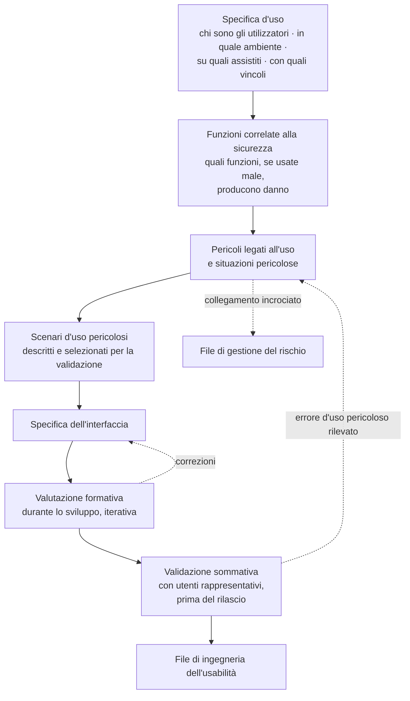

# Accessibilità e usabilità

## 1. Perché è un capitolo di requisiti e non di intenzioni

Accessibilità e usabilità sono, in questo progetto, **requisiti funzionali di tutto il sistema**:
interfaccia dell'assistito, interfaccia clinica, pannelli di amministrazione, componenti
incorporabili, documentazione, messaggi di errore, notifiche. Non sono una rifinitura finale ma un
criterio di accettazione di ogni singola schermata (decisione D25, vincolo V6).

Ci sono tre ragioni distinte, e conviene tenerle separate perché producono obblighi diversi.

**La prima è di conformità.** Il livello AA dei criteri internazionali e la norma europea di
riferimento sono applicabili ai servizi rivolti al cittadino; per le infrastrutture regionali il
decreto ministeriale richiede espressamente le linee guida nazionali di design per i servizi
digitali della pubblica amministrazione, le linee guida sull'accessibilità, la legge nazionale in
materia e il supporto multilingua.

**La seconda è di sicurezza.** Nel quadro dell'ingegneria dell'usabilità applicata ai dispositivi
medici, un difetto di accessibilità non è un difetto estetico: è una **condizione che rende possibile
un errore d'uso**, e un errore d'uso è per definizione un difetto del dispositivo che si manifesta
attraverso il comportamento di una persona. La conformità ai criteri di accessibilità è quindi anche
una misura di controllo del rischio, e come tale va documentata nel file di usabilità con
collegamento incrociato al file di rischio.

**La terza è di efficacia del servizio.** La popolazione di riferimento della telemedicina —
persone anziane, con più patologie croniche, con bassa alfabetizzazione digitale, spesso assistite da
un caregiver — **non è un caso limite: è la popolazione normale**. Un servizio che funziona solo per
chi sa già usarlo non è un servizio: è una selezione.

## 2. Il criterio di accettazione operativo

È il criterio che decide se un requisito funzionale del catalogo è soddisfatto, e non ammette
sconti:

> **Ogni requisito funzionale deve poter essere completato da una persona anziana su smartphone in
> rete mobile, e da un professionista con la sola tastiera e uno strumento di lettura assistita. Se
> non è possibile, il requisito non è soddisfatto.**

Da questo criterio discendono due prove obbligatorie per ogni percorso critico, entrambe con esito
registrato:

| Prova | Chi la esegue | Su che cosa | Esito |
|---|---|---|---|
| **Prova mobile degradata** | verifica automatizzata più prova manuale | dispositivo di fascia bassa, rete mobile limitata, schermo piccolo, dito grosso, luce forte | completamento del percorso senza assistenza, entro il numero di azioni dichiarato |
| **Prova da tastiera e lettura assistita** | verifica manuale strutturata | due strumenti di lettura assistita su due sistemi operativi, nessun dispositivo di puntamento | completamento del percorso, ordine di lettura coerente, nessuna trappola di focus, tutti gli stati annunciati |

**I percorsi critici** su cui le due prove sono obbligatorie a ogni rilascio: accesso e
autenticazione; verifica tecnica preventiva; sala d'attesa e ammissione; sessione con i suoi
controlli essenziali; raccolta delle manifestazioni di volontà; consultazione e scaricamento dei
documenti; **inserimento manuale di una misura**; **compilazione di un questionario**; **lettura
dell'istruzione di instradamento**; **dichiarazione di indisponibilità**. Gli ultimi quattro sono
introdotti da quest'area e sono i più delicati, perché sono percorsi che l'assistito esegue **da
solo, ogni giorno, senza nessuno accanto**.

## 3. Profili di utente reali

Non sono personaggi narrativi: sono insiemi di vincoli osservabili che si traducono in requisiti.

### 3.1 Persona anziana con bassa alfabetizzazione digitale

**Vincoli.** Può non distinguere fra browser e motore di ricerca; può non sapere che cosa sia un
permesso di sistema; può non avere una casella di posta consultata regolarmente; ha una sola
possibilità di riuscita prima di rinunciare e telefonare; può avere tremore, riduzione della vista o
dell'udito non dichiarati; usa un dispositivo che qualcun altro ha configurato.

**Requisiti che ne discendono.**

1. **Un solo percorso, nessuna scelta iniziale.** Il collegamento porta alla verifica tecnica, che
   porta alla sala d'attesa. Nessuna schermata di scelta fra «accedi», «registrati», «continua come
   ospite» prima che la persona abbia capito dove si trova.
2. **La verifica tecnica è parte del percorso, non un'opzione.** Chi non sa di dover verificare non
   verificherà mai.
3. **Istruzioni contestuali e specifiche** per il browser e il sistema operativo rilevati, con
   l'immagine della richiesta effettiva; mai un testo generico (`RF-055`).
4. **Il caregiver è previsto, non tollerato**: collegamento distinto e istruzioni scritte per chi
   assiste (`RF-028`).
5. **Il ripiego telefonico è dichiarato in anticipo.** Sapere che, se non funziona, la struttura
   richiama a un dato numero elimina l'ansia e il fallimento totale.
6. **Nessuna installazione.** Ogni installazione richiesta è un punto di abbandono: il vincolo di
   funzionamento nel solo browser è una scelta di accessibilità prima che tecnica.
7. **Testo e comandi grandi per impostazione predefinita.** La densità informativa è un requisito del
   professionista, non dell'assistito.
8. **Nell'inserimento della misura**: unità sempre visibile, tastiera numerica appropriata,
   separatore decimale conforme all'impostazione locale, conferma discorsiva sui valori implausibili
   (`RF-252`, `RNF-106`).

### 3.2 Persona con disabilità

| Tipo | Barriera specifica | Progettazione |
|---|---|---|
| **Visiva** | l'intera interfaccia è visiva; gli stati — chi parla, chi è entrato, qualità del collegamento, registrazione attiva — sono comunicati con icone | annunci degli eventi tramite regioni di stato, etichette esplicite, ordine di lettura coerente, nessuna informazione veicolata dal solo colore (`RF-071`, `RNF-044` … `RNF-047`) |
| **Uditiva** | il canale primario è audio | canale testuale sempre disponibile e non nascosto; interprete della lingua dei segni come **partecipante a pieno titolo**; comunicazione scritta sovrapposta all'immagine e condivisione dello schermo |
| **Motoria** | comandi piccoli, azioni a tempo, trascinamenti | tutte le funzioni da tastiera, bersagli di dimensione adeguata, nessuna azione che richieda precisione temporale, scadenze estendibili (`RNF-045`) |
| **Cognitiva** | sequenze lunghe, terminologia specialistica, decisioni sotto pressione | riduzione dei passaggi, un'azione per schermata nei percorsi critici, linguaggio comune, possibilità di rileggere senza perdere la posizione, nessuna scadenza che faccia perdere il lavoro svolto (`RNF-050`, `RNF-051`) |
| **Temporanea o situazionale** | luce forte, rumore, rete instabile, una mano occupata | contrasto elevato per impostazione predefinita, priorità all'audio, funzionamento a una mano su dispositivo mobile |

**Il punto meno ovvio.** La sessione deve essere utilizzabile in **modalità degradata come stato di
prima classe**, non come guasto. Chi sceglie di partecipare senza video per banda, per riservatezza o
per disabilità non deve trovarsi in un percorso di errore.

### 3.3 Caregiver che assiste più persone

**Vincoli.** Spesso lavora; contattabile in fasce ristrette; assiste più di una persona; opera dal
proprio dispositivo, non da quello dell'assistito.

**Requisiti.** Contesto del soggetto permanentemente visibile e non ambiguo; conferma esplicita che
nomina il soggetto al cambio (`RF-264`); collegamento e istruzioni proprie; possibilità di dichiarare
un'indisponibilità per conto dell'assistito nei limiti della delega.

### 3.4 Professionista sotto pressione di tempo

**Vincoli.** Dodici prestazioni in una mattina; novanta secondi fra l'una e l'altra; postazione
condivisa; talvolta dispositivo mobile fra un ambulatorio e l'altro.

**Requisiti.** Coda unica e continuità, senza schermate intermedie fra una prestazione e la
successiva; informazioni cliniche già presenti al momento dell'ammissione; refertazione che non
blocca il flusso; azioni obbligatorie minime e nel punto giusto; comandi rapidi da tastiera; **nessuna
interruzione modale durante l'atto**.

Un principio che vale come regola redazionale sui campi obbligatori: ogni campo obbligatorio
aggiuntivo va giustificato, perché nel dominio reale i campi obbligatori non necessari **vengono
compilati con valori falsi**, degradando la qualità del dato più di quanto la migliorerebbe la loro
assenza. Fanno eccezione i campi la cui assenza è essa stessa un rischio: la dichiarazione di
erogabilità, l'identificazione, l'esito, la soglia individuale.

### 3.5 Case manager con molti assistiti

**Vincoli.** Decine di piani attivi; allarmi che arrivano in continuazione; necessità di distinguere
in pochi secondi ciò che richiede azione da ciò che non la richiede.

**Requisiti.** Età dell'ultimo dato sempre visibile e graficamente evidenziata (`BR-157`);
distinzione immediata fra allarme da valore e allarme da assenza; presa in carico come azione
deliberata e non come effetto dell'apertura; tetto di carico per turno con comportamento dichiarato
(`RNF-094`).

### 3.6 Operatore di front-office

Assorbe i fallimenti di tutti gli altri ed è il migliore indicatore anticipato dei problemi. Il suo
strumento principale è una **vista dei rischi della giornata**, non un elenco di appuntamenti: chi
non ha eseguito la verifica tecnica, chi ha attività preliminari incomplete, chi non ha recapiti
verificati. Senza alcun accesso al contenuto clinico: vede *che cosa manca*, non *perché la persona è
in cura*.

## 4. Requisiti verificabili

Restano in vigore `RNF-044` … `RNF-054`. Sono riportati qui con il metodo di verifica perché è
l'elemento che li rende requisiti e non intenzioni, e sono integrati dai tre introdotti da
quest'area.

| ID | Requisito | Metrica e soglia | Metodo di verifica |
|---|---|---|---|
| `RNF-044` | Conformità di livello AA sui percorsi critici | zero violazioni di livello A e AA | verifica automatica bloccante **più** audit manuale su ogni percorso critico |
| `RNF-045` | Navigazione completa da tastiera | 100 % delle funzioni raggiungibili senza dispositivo di puntamento, ordine di tabulazione coerente, nessuna trappola di focus | prova manuale strutturata su ogni percorso critico |
| `RNF-046` | Compatibilità con tecnologie assistive | percorsi critici completabili con almeno due strumenti di lettura su due sistemi operativi | prova manuale documentata a ogni rilascio maggiore |
| `RNF-047` | Contrasto e ridimensionamento | rapporto ≥ 4,5:1 per il testo normale, ≥ 3:1 per il testo grande; nessuna perdita di funzione con ingrandimento al 200 % | verifica automatica più prova manuale |
| `RNF-048` | Riduzione del movimento | rispetto della preferenza di sistema sul 100 % delle transizioni | prova automatica con preferenza impostata |
| `RNF-049` | Canale testuale sempre disponibile | attivabile in sessione anche in assenza di audio funzionante | prova funzionale |
| `RNF-050` | Testi rivolti all'assistito | indice di leggibilità corrispondente a un livello di istruzione secondario di primo grado | misura automatica sull'intero catalogo delle stringhe di interfaccia |
| `RNF-051` | Numero di passaggi per l'ingresso | ≤ 3 azioni dal collegamento alla sala d'attesa, con dispositivo già autorizzato | analisi del percorso più prova con utenti |
| `RNF-052` | Successo al primo tentativo | ≥ 90 % dei partecipanti rappresentativi completa l'ingresso senza assistenza | prova di usabilità documentata |
| `RNF-053` | Errori d'uso a rischio | zero errori d'uso classificati come pericolosi nella valutazione sommativa; ogni errore rilevato genera una misura di mitigazione tracciata | valutazione sommativa secondo la norma di ingegneria dell'usabilità |
| `RNF-054` | Comprensibilità dei messaggi di errore | ogni messaggio contiene causa, conseguenza e azione suggerita; zero messaggi con soli codici tecnici sui percorsi rivolti all'assistito | verifica automatica della presenza dei tre elementi sul catalogo dei messaggi |
| `RNF-105` | Comprensibilità dell'istruzione di instradamento | presenza di canale, recapito e urgenza in ogni messaggio di uscita dal canale; indice di leggibilità come `RNF-050`; comprensione verificata con utenti | verifica automatica dei tre elementi più prova con utenti |
| `RNF-106` | Inserimento manuale di una misura | ≥ 90 % dei partecipanti rappresentativi completa al primo tentativo senza assistenza, su dispositivo di fascia bassa e rete limitata | prova di usabilità documentata |
| `RNF-107` | Resilienza dell'inserimento manuale | la misura inserita senza connettività non è perduta; istante di misura preservato | prova con interruzione controllata della rete |

**Che cosa significa «bloccante».** La verifica automatica di accessibilità fa fallire la catena di
integrazione continua. Ma va detto senza ambiguità: **l'automazione intercetta una parte minoritaria
dei difetti di accessibilità**. La prova manuale con tecnologie assistive reali non è un'attività
opzionale che si esegue quando c'è tempo: è l'unica che verifica ciò che conta.

## 5. Mobile first come metodo, non come compatibilità

Si progetta partendo dallo schermo piccolo e dalla connessione peggiore, non adattando in seguito il
desktop. Non è una preferenza estetica: l'assistito tipico di una prestazione a distanza usa uno
smartphone, spesso su rete mobile, spesso senza assistenza, e il decreto ministeriale lo impone
espressamente alle infrastrutture regionali insieme al supporto delle interfacce responsive.

Le conseguenze verificabili sono già nel catalogo e vanno lette insieme a questo capitolo: peso del
pacchetto iniziale del percorso di ingresso (`RNF-007`), tempo al primo contenuto visibile e
all'interattività su rete lenta emulata e dispositivo di fascia bassa (`RNF-006`), consumo di banda
in sessione con modalità a banda ridotta (`RNF-008`), tempo di ripresa dopo caduta di rete
(`RNF-009`).

**La resilienza è parte dell'accessibilità reale**, non dell'ottimizzazione: banda scarsa, rete
intermittente, dispositivo modesto. Degradare in modo comprensibile — audio prima del video, avvisi
chiari, ripresa della sessione, misura conservata localmente e trasmessa al ripristino — è ciò che
rende il servizio utilizzabile da chi ha meno risorse, cioè da chi ne ha più bisogno.

## 6. Ingegneria dell'usabilità

L'ingegneria dell'usabilità applicata ai dispositivi medici è obbligatoria per effetto della
qualificazione assunta dal progetto. Il suo processo produce artefatti che vanno prodotti **durante**
lo sviluppo, non ricostruiti alla fine.

**Due posizioni già assunte dal progetto e che vanno ricordate a chi contribuisce.**

Gli **utenti rappresentativi comprendono persone anziane e persone con disabilità**: non sono un caso
limite, sono la popolazione di riferimento. Una validazione sommativa condotta su sviluppatori e
colleghi non è una validazione, e se la validazione con utenti rappresentativi non è stata svolta va
**dichiarato che non è stata svolta**, non lasciato intendere il contrario.

La **conformità ai criteri di accessibilità è anche una misura di controllo del rischio d'uso**, non
solo un adempimento: come tale va documentata nel file di usabilità con collegamento incrociato al
file di rischio.

**Funzioni correlate alla sicurezza** individuate in quest'area, cioè le funzioni la cui difficoltà
d'uso produce danno e non fastidio:

| Funzione | Errore d'uso temuto | Requisito che lo presidia |
|---|---|---|
| Configurazione della soglia individuale | conferma di un valore proposto senza valutarlo | `RF-240`, `RNF-104` |
| Inserimento manuale di una misura | valore in unità o formato inatteso | `RF-252`, `RF-256`, `RF-259` |
| Cambio di soggetto assistito | misura attribuita alla persona sbagliata | `RF-264` |
| Presa in carico di un allarme | allarme «visto» e non assunto | `RF-278` |
| Lettura dello stato della copertura | falsa rassicurazione | `RF-310`, `RF-320` |
| Istruzione di instradamento | istruzione non vista o non compresa | `RF-316`, `RNF-105` |
| Registrazione dell'identificazione | atto omesso perché percepito come formalità | `RF-077` |
| Attivazione della registrazione della sessione | stato di registrazione mal percepito | `RF-141` |

## 7. La gerarchia dei controlli, applicata all'interfaccia

Le misure di controllo del rischio hanno un ordine obbligato: **(a) sicurezza intrinseca per
progettazione; (b) misure di protezione nel prodotto o nel processo; (c) informazioni per la
sicurezza ed eventuale addestramento**. Non si salta al terzo livello perché è il più economico.

Tradotto in scelte di interfaccia:

| Livello | Che cosa significa qui | Esempio |
|---|---|---|
| **(a) Progettazione** | l'errore non è possibile | il campo soglia non è precompilato, quindi non può essere confermato per inerzia |
| **(b) Protezione** | l'errore è possibile ma intercettato | la conferma discorsiva sul valore implausibile; il rifiuto del valore fuori dai limiti di ammissibilità |
| **(c) Informazione** | l'errore resta possibile e si avvisa | la dichiarazione dei limiti del servizio e della copertura |

Il terzo livello è il più debole e va usato **solo per ciò che non è eliminabile per progetto**. È il
caso della dichiarazione di copertura oraria, dove il rischio è per costruzione informativo: proprio
per questo il testo va scritto, verificato con utenti reali e reso impossibile da non vedere
(`RF-320`, `RNF-105`).

## 8. Messaggi di errore

Un messaggio di errore è, in questo dominio, una funzione di sicurezza. Ogni messaggio rivolto a un
utente contiene tre elementi, verificati automaticamente sul catalogo (`RNF-054`):

1. **causa** — che cosa è successo, in linguaggio comune;
2. **conseguenza** — che cosa significa per chi legge;
3. **azione** — che cosa fare adesso, con un comando raggiungibile nella stessa schermata.

**Anti-esempi che il catalogo esclude**: «errore di connessione»; «operazione non consentita»;
«codice 4032»; una schermata bloccata senza alcun comando; un messaggio che rimanda a un supporto
senza indicarne il recapito; un messaggio che promette un richiamo al posto di un'istruzione
operativa (`RF-319`).

**Casi in cui la formulazione è particolarmente delicata**, con la regola che li governa:

| Situazione | Regola |
|---|---|
| Accesso alla sala d'attesa fuori finestra | indicare l'orario corretto, mai un errore generico (`BR-029`) |
| Verifica tecnica fallita | istruzioni specifiche per browser e sistema operativo rilevati, più il canale alternativo (`RF-055`) |
| Riconnessione in corso | stato, tempo residuo e azioni disponibili; mai una schermata ferma (`RF-075`) |
| Servizio fuori copertura | stato corrente, orario di riapertura, canale alternativo (`RF-310`) |
| Uscita dal canale | canale, recapito, urgenza; nessuna ipotesi diagnostica, nessuna promessa di richiamo (`RF-316`) |
| Assenza di misure | linguaggio non valutativo; azione per recuperare o dichiarare (`RF-306`, `BR-158`) |

## 9. La non conformità dichiarata

Il progetto adotta il livello AA in modo integrale **con una sola non conformità dichiarata**, sul
criterio relativo ai sottotitoli in tempo reale per i contenuti audio-video dal vivo.

**Perché.** Un motore di trascrizione in tempo reale non è disponibile nel perimetro della prima
versione e non è realizzabile con un componente che rispetti il vincolo di sovranità del dato senza
introdurre una dipendenza esterna al trattamento del contenuto della sessione.

**Misura alternativa.** L'interprete come partecipante a pieno titolo, il canale testuale sempre
disponibile in sessione (`RF-100`, `RNF-049`) e la comunicazione scritta sovrapposta all'immagine.

**Che cosa si fa comunque.** Il **canale dati per i sottotitoli è definito e versionato nel
protocollo fin dall'inizio**, anche in assenza del motore di trascrizione: innestare un canale dati
a posteriori in un protocollo già rilasciato costa molto di più.

**Come si dichiara.** La dichiarazione di accessibilità segue il modello nazionale ed è formulata
secondo la norma europea di riferimento, con la non conformità indicata espressamente e la misura
alternativa descritta. Una non conformità dichiarata è una posizione difendibile; una non conformità
taciuta non lo è.

## 10. Il componente incorporabile eredita gli obblighi

Un integratore che incorpora Telemedic **non deve poter degradarne l'accessibilità**. Ne discendono
requisiti verificabili sulla personalizzazione:

1. Le combinazioni cromatiche che violano i rapporti di contrasto sono **rifiutate al salvataggio**,
   con l'indicazione del rapporto minimo richiesto e un suggerimento di correzione (`RF-178`).
2. Il rispetto delle preferenze di sistema — riduzione del movimento, contrasto elevato, dimensione
   del carattere — **non è disattivabile** dalla configurazione di personalizzazione.
3. Le dichiarazioni obbligatorie — stato della registrazione, stato della copertura, limiti d'uso del
   servizio — non sono occultabili né rimovibili per personalizzazione (`BR-161`, `BR-168`).
4. I percorsi critici incorporati sono sottoposti alle stesse due prove del § 2, con il tema
   dell'integratore applicato.

## 11. Multilingua

Il supporto multilingua è richiesto dal decreto per le infrastrutture regionali e l'architettura di
internazionalizzazione è predisposta dall'inizio. Restano in vigore `RNF-055` … `RNF-058`: copertura
completa delle stringhe di interfaccia e dei modelli di notifica, assenza di stringhe non
esternalizzate verificata automaticamente, formati locali corretti per date, ore, numeri e fusi,
aggiunta di una lingua senza modifiche al codice applicativo.

Due precisazioni proprie di quest'area. Le **stringhe di interfaccia del progetto sono separate
architetturalmente dalle descrizioni ufficiali dei sistemi di codifica clinica**, che hanno regimi di
licenza propri. E il **separatore decimale** non è un dettaglio di formattazione: nell'inserimento
manuale di una misura è una causa documentata di errore d'uso, e va gestito secondo l'impostazione
locale con conferma discorsiva sui valori implausibili.

## 12. Come si verifica: la matrice

| Che cosa | Automatico | Manuale | Con utenti |
|---|---|---|---|
| Violazioni di livello A e AA | ● bloccante | ● audit per percorso critico | — |
| Contrasto e ingrandimento | ● | ● | — |
| Navigazione da tastiera | ◐ parziale | ● obbligatorio | — |
| Compatibilità con tecnologie assistive | — | ● due strumenti, due sistemi | — |
| Riduzione del movimento | ● | — | — |
| Leggibilità dei testi | ● indice | ● revisione redazionale | ◐ |
| Presenza di causa, conseguenza e azione nei messaggi | ● bloccante | ● revisione redazionale | — |
| Presenza di canale, recapito e urgenza nell'instradamento | ● bloccante | ● | ● comprensione |
| Numero di azioni dei percorsi critici | ● analisi del percorso | ● | ● |
| Successo al primo tentativo | — | — | ● prova di usabilità |
| Errori d'uso pericolosi | — | ◐ analisi | ● validazione sommativa |
| Assenza di precompilazione delle soglie | ● bloccante | ● | ● formativa |
| Resilienza dell'inserimento offline | ● prova con rete interrotta | ● | — |

Legenda: `●` metodo principale, `◐` contributo parziale, `—` non applicabile.

## 13. Errori ricorrenti che questa progettazione esclude

1. **Trattare l'accessibilità come una verifica finale.** Ciò che si trova alla fine costa dieci volte
   di più, e ciò che è strutturale non si corregge affatto.
2. **Considerare sufficiente la verifica automatica.** Intercetta una minoranza dei difetti reali e
   produce una falsa sensazione di conformità.
3. **Progettare per il desktop e adattare al mobile.** Produce interfacce che funzionano male
   esattamente per la popolazione di riferimento.
4. **Confondere usabilità e gradevolezza.** L'usabilità qui è una funzione di sicurezza: la sua
   misura è il tasso di completamento senza assistenza e l'assenza di errori d'uso pericolosi, non la
   soddisfazione dichiarata.
5. **Applicare al paziente i criteri di densità informativa del professionista** e viceversa. Sono due
   utenti con esigenze opposte, e l'unica risposta corretta è progettare due interfacce distinte con
   lo stesso nucleo funzionale.
6. **Usare l'avviso al posto della progettazione.** È il terzo livello della gerarchia dei controlli,
   il più debole, e va riservato a ciò che non è eliminabile.
7. **Dichiarare la conformità senza dichiarare le non conformità.** Una non conformità dichiarata è
   difendibile; una taciuta è un difetto di conformità e un problema di fiducia.
