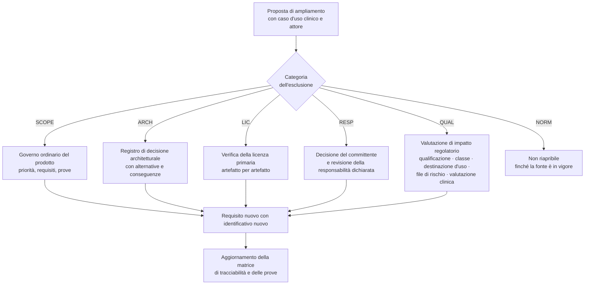
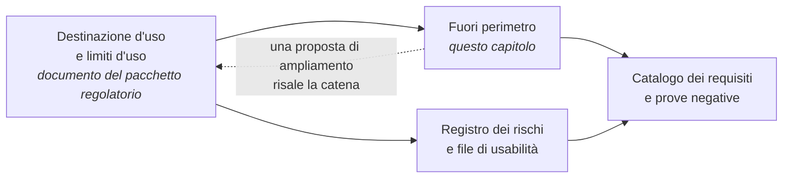

# Fuori perimetro

## 1. Perché un capitolo di esclusioni

In un sistema sanitario a distanza, **ciò che il software non fa vale quanto ciò che fa**, e per tre
ragioni distinte.

**Qualificazione.** Una singola frase sposta la classificazione di rischio del prodotto e con essa
mesi di percorso e un ordine di grandezza di costo: la differenza fra «monitoraggio in tempo reale
dei parametri vitali» e «raccolta differita di parametri per la revisione periodica del
professionista» non è redazionale. La destinazione d'uso è il documento più costoso da sbagliare, e
questo capitolo è la sua controparte funzionale: **elenca ciò che la destinazione d'uso esclude**, in
forma verificabile.

**Sicurezza.** Un servizio che sembra fare qualcosa che non fa produce affidamento improprio. È lo
stesso meccanismo della copertura oraria mal dichiarata: il danno non è causato da ciò che il sistema
fa, ma da ciò che una persona non fa perché si fida del sistema.

**Responsabilità.** Il repository è codice sorgente sotto licenza aperta, non un dispositivo medico
immesso sul mercato, e lo dichiara. Chi integra, distribuisce o mette in servizio verifica il codice
e assume gli obblighi che ne derivano. Il perimetro è quindi anche il confine fra ciò di cui risponde
il progetto e ciò di cui risponde chi lo usa.

## 2. Come si legge questo capitolo

Ogni esclusione ha un identificativo congelato `OUT-nn` e una **categoria**, che ne determina la
riapribilità:

| Categoria | Significato | Riapribile? |
|---|---|---|
| `QUAL` | escluso perché sposterebbe la qualificazione o la classe di rischio del prodotto | solo con valutazione di impatto regolatorio registrata e decisione formale |
| `RESP` | escluso perché comporterebbe l'assunzione di una responsabilità che il progetto non assume | solo con decisione del committente |
| `ARCH` | escluso perché incompatibile con un vincolo architetturale in vigore | solo con registro di decisione architetturale |
| `NORM` | escluso perché vietato o non ammesso da una fonte normativa | non riapribile finché la fonte è in vigore |
| `LIC` | escluso per incompatibilità di licenza dei contenuti di terzi | riapribile se cambia il regime di licenza |
| `SCOPE` | non è nel perimetro della prima versione, ma non c'è un divieto | riapribile con normale governo del prodotto |

Ogni esclusione riporta inoltre **come è verificata**: un'esclusione che non si può verificare
rientra dalla finestra alla prima consegna sotto pressione.

## 3. Interpretazione clinica

È il gruppo più importante. Il confine è quello fra un sistema che **trasporta, struttura, firma e
conserva** contenuto clinico redatto da un professionista, e un sistema che lo **genera o lo
interpreta**.

| ID | Esclusione | Cat. | Perché | Verifica |
|---|---|---|---|---|
| **OUT-01** | Il sistema non formula ipotesi diagnostiche né le mostra all'assistito o al professionista | `QUAL` | è l'atto clinico riservato per eccellenza, e mostrarlo all'assistito ha per giunta effetti psicologici significativi | prova di conformità architetturale che fallisce se un modulo introduce contenuto interpretativo; revisione del catalogo delle stringhe |
| **OUT-02** | Il sistema non stima probabilità cliniche, non produce prognosi e non gradua l'urgenza con un algoritmo proprio | `QUAL` | produrre una nuova informazione clinica destinata a decisioni diagnostiche o terapeutiche è ciò che qualifica il software | come sopra, più `RF-083` |
| **OUT-03** | Il sistema non assegna autonomamente codici di priorità né esegue triage calcolato: registra l'esito deciso dal professionista | `QUAL` + `NORM` | il triage telefonico è espressamente escluso dal perimetro delle prestazioni di telemedicina, perché instradare non è erogare; e calcolare la priorità sarebbe interpretazione | prova negativa: nessuna interfaccia e nessuna interfaccia applicativa accetta la richiesta di calcolo di una priorità |
| **OUT-04** | Il sistema non suggerisce dosaggi, terapie o modifiche di terapia | `QUAL` | è la tentazione più forte nel telemonitoraggio, ed è precisamente ciò che sposta il prodotto in una classe superiore | revisione della modifica bloccante su ogni funzione che produca output prescrittivo |
| **OUT-05** | Il sistema non verifica interazioni fra farmaci e non produce avvisi di sicurezza farmacologica | `QUAL` | supporto alla decisione clinica a tutti gli effetti | assenza della capacità nella specifica pubblicata |
| **OUT-06** | Il sistema non applica elaborazioni all'immagine che ne modifichino il contenuto informativo a fini di lettura clinica | `QUAL` | è una delle tre funzionalità che sono a una singola modifica dall'innalzamento di classe | verifica sul percorso media: nessuna trasformazione oltre codifica, adattamento della risoluzione e ridimensionamento dichiarati |
| **OUT-07** | Il sistema non genera, precompila né suggerisce contenuto clinico interpretativo nel documento: precompila solo dati anagrafici, amministrativi e temporali | `QUAL` | il documento è **persistenza di contenuto redatto dal professionista**, non generazione autonoma di informazione clinica | `RF-126`; prova che verifica quali campi risultano valorizzati all'apertura di un modello |
| **OUT-08** | Il sistema non deduce, propone né calcola soglie individuali a partire dai dati storici dell'assistito o di popolazione | `QUAL` | la soglia è contenuto di un documento sanitario individuale firmato; dedurla significherebbe che il sistema ha deciso | `RNF-103`, `RNF-104`; verifica automatica bloccante |
| **OUT-09** | Il sistema non decide di non allarmare sulla base di altri dati clinici | `QUAL` | «questo parametro è normale, quindi il sintomo riferito non conta» è un ragionamento clinico, ed è per giunta sbagliato | prova negativa sulle regole: nessuna condizione di soppressione può dipendere dal valore di un parametro diverso da quello valutato |

**La formulazione positiva del confine**, che vale come criterio di progettazione: *l'instradamento
risponde alla domanda «questo canale è adeguato?», la valutazione risponde alla domanda «che cosa ha
questa persona?». La prima è una proprietà del servizio, e il servizio la può conoscere. La seconda è
un atto riservato.*

Va detto con chiarezza che **l'esclusione non riguarda la valutazione automatica delle soglie**: il
confronto di una misura con la soglia individuale fissata da un professionista e la generazione della
conseguente allerta **sono nel perimetro**, ed è precisamente l'elemento su cui il progetto ha assunto
la propria qualificazione. Ciò che è escluso è che il sistema **stabilisca** la soglia, la **deduca**,
o **interpreti** il risultato del confronto.

## 4. Perimetro tecnico del telemonitoraggio

| ID | Esclusione | Cat. | Perché | Verifica |
|---|---|---|---|---|
| **OUT-10** | Il sistema non dialoga direttamente con i dispositivi medici domiciliari: acquisisce da un gateway di terze parti, dall'inserimento manuale e dai questionari | `RESP` + `ARCH` | includere il dialogo con il dispositivo estenderebbe il perimetro alla catena di misura hardware, con conseguenze di qualificazione e di verifica | assenza di adattatori di protocollo per dispositivi nella distinta dei componenti; contratto di ingestione documentato |
| **OUT-11** | Il progetto non assume responsabilità sull'accuratezza della catena di misura hardware | `RESP` | è responsabilità del fabbricante del dispositivo e di chi lo assegna | dichiarazione nella destinazione d'uso e nel documento di assegnazione del dispositivo |
| **OUT-12** | Il sistema non è un servizio di monitoraggio continuo in tempo reale con latenza di intervento dell'ordine dei minuti | `QUAL` | sposterebbe la classificazione e la classe di sicurezza del software; e clinicamente esistono condizioni con latenza di minuti per cui il canale adeguato è il sistema di emergenza, non il telemonitoraggio | la destinazione d'uso lo dichiara; i tempi di riscontro sono quelli della copertura dichiarata, non tempi di intervento |
| **OUT-13** | Il sistema non è un canale di emergenza, non chiama i soccorsi e non li allerta automaticamente | `QUAL` + `RESP` | rende disponibili al professionista le informazioni logistiche che non ha perché l'assistito non è nella stessa stanza: è supporto logistico, non attivazione del soccorso | `RF-082`; dichiarazione persistente nell'interfaccia dell'assistito (`RF-320`) |
| **OUT-14** | Il sistema non esegue riconoscimento biometrico automatico né rilevazione automatica di volti per l'identificazione o per rilevare la presenza di terzi | `RESP` + `ARCH` | cambierebbe il profilo di rischio sui dati e sposterebbe l'identificazione da decisione del professionista a esito di un algoritmo | assenza della capacità; l'identificazione è registrata come atto con il metodo usato (`RF-077`, `RF-080`) |
| **OUT-15** | Il sistema non implementa un indice di riconciliazione delle identità: lavora per riferimento sugli identificativi del sistema di origine | `ARCH` | diventerebbe il gestore dei dati anagrafici di riferimento, in contrasto con il modello di integrazione | `RF-020`, `RF-023`, `RF-026`; nessuna fusione automatica per somiglianza |
| **OUT-16** | Il sistema non attiva automaticamente la registrazione della sessione in caso di emergenza, contenzioso o sospetto | `NORM` + `RESP` | impedisce l'uso della registrazione come strumento difensivo unilaterale; l'attivazione resta subordinata al consenso | `BR-076`; prova negativa su ogni percorso di emergenza |
| **OUT-17** | Il sistema non produce dati destinati alla ricerca senza una base autonoma e un percorso dedicato | `SCOPE` | l'uso secondario ha basi, garanzie e percorsi propri, che non si ottengono estendendo un'esportazione operativa | assenza di funzioni di estrazione per finalità di ricerca nella specifica pubblicata |

## 5. Perimetro normativo e di responsabilità

| ID | Esclusione | Cat. | Perché | Verifica |
|---|---|---|---|---|
| **OUT-18** | Nessuna funzionalità media l'accesso di una compagnia di assicurazione, di un perito o di un datore di lavoro al fascicolo sanitario elettronico, né direttamente né per il tramite di un professionista | `NORM` | l'esclusione è **sempre** operante. Il caso d'uso a carico di fondi, mutue e polizze resta valido per l'**erogazione** della prestazione: il pagatore non è un consultatore | `BR-170`, `BR-171`; prova negativa sulla composizione dei ruoli e sull'accesso documentale |
| **OUT-19** | Il sistema non offre percorsi di televisita in contesti qualificati come urgenza o emergenza | `NORM` | la prestazione a distanza non deve costituire ragione per ritardare interventi in presenza; e la teleconsulenza fra professionisti non può surrogare le attività di soccorso | `RF-347`, `BR-185`; prova negativa su interfaccia e interfacce applicative |
| **OUT-20** | Il progetto non appone marcatura di conformità | `RESP` | produce e pubblica il pacchetto regolatorio per il proprio percorso di fabbricante; la costituzione del soggetto, l'ingaggio degli organismi di valutazione e la valutazione clinica sono conseguenze della decisione D63 del 26 agosto 2026, che rende la marcatura un requisito di prodotto | dichiarazione pubblicata e verificata in ogni artefatto distribuito; verifica che nessuna marcatura sia dichiarata |
| **OUT-21** | Le funzionalità di confine - allerta su soglia, elaborazione dell'immagine, refertazione assistita - non sono modificabili senza valutazione di impatto regolatorio registrata | `QUAL` | sono a una singola modifica dall'innalzamento di classe | `BR-127`; verifica bloccante in integrazione continua sulla proposta di modifica |
| **OUT-22** | Il progetto non è un fornitore di servizi accreditato presso la federazione nazionale di identità digitale | `NORM` | il fornitore di servizi è chi eroga il servizio in rete, cioè chi installa; il progetto è **conforme e verificabile**, non accreditato | dichiarazione documentale; prove di conformità eseguite in integrazione continua |
| **OUT-23** | Il sistema non svolge conservazione a norma e non è l'archivio clinico primario della struttura | `ARCH` + `NORM` | il modello prevede una modalità di esercizio senza conservazione del contenuto clinico, in cui la piattaforma è produttore di documenti e il conferimento è a carico della struttura sanitaria; e la conservazione a norma è un processo con requisiti propri | `BR-174`; prova di esercizio in modalità senza conservazione |
| **OUT-24** | Il sistema non distribuisce contenuti terminologici o strumenti di valutazione la cui licenza è incompatibile con la licenza del progetto, né esegue localmente logica decisionale clinica importata da fonti esterne | `LIC` + `QUAL` | la licenza del contenitore non dispone dei diritti di terzi sul contenuto; e l'esecuzione locale di logica decisionale importata configura supporto alla decisione clinica, con effetti sulla qualificazione | verifica automatica sui contenuti distribuiti con allowlist versionata; assenza di un motore di esecuzione di logica clinica importata |

## 6. Che cosa **non** è escluso, ma viene spesso creduto tale

Questa sezione esiste perché un perimetro letto male produce tanto danno quanto un perimetro
sbagliato: si finisce per non implementare cose che sono nel perimetro e sono necessarie.

| Capacità | È nel perimetro | Con quale limite |
|---|---|---|
| Valutazione automatica delle soglie e generazione dell'allerta | **sì**, ed è l'elemento che fonda la qualificazione assunta | la soglia è fissata dal professionista, mai dedotta (`OUT-08`) |
| Riconoscimento di un item marcato come uscita dal canale e istruzione di instradamento | **sì** | è un confronto su un item strutturato, non un'inferenza; il testo è configurato, non generato (`RF-315`, `RF-316`) |
| Calcolo di un punteggio da una scala validata | **sì**, se la scala è registrata con versione, regola e licenza | tracciabilità completa del calcolo, attribuzione a chi valida, valutazione di impatto prima dell'introduzione (`RF-323` … `RF-332`) |
| Rilevazione dell'assenza di dato e conversione dell'allarme tecnico in clinico | **sì** | è rilevazione di un fatto, non interpretazione clinica; il vincolo [V-09](../11_registri/01-vincoli-in-vigore.md#v-09) la rende obbligatoria |
| Presentazione al professionista di riferimenti indicati dal percorso | **sì** | in sola lettura, attribuiti con fonte e versione, mai precompilati (`RF-240`) |
| Registrazione dell'esito clinico deciso dal professionista, compreso il codice di priorità | **sì** | il sistema registra, non calcola (`OUT-03`) |
| Moduli propri di refertazione, agenda e fatturazione | **sì** | disattivabili e sostituibili per configurazione: dove esiste un modulo regionale o dell'integratore, il sistema si integra invece di duplicare |
| Ripiego telefonico | **sì**, ed è obbligatorio come esito tipizzato | non è la stessa prestazione: il cambio di canale è registrato e riportato nel documento (`RF-076`, `BR-006`) |
| Messaggistica asincrona con l'assistito | **sì**, se abilitata | dichiara in modo persistente i tempi di risposta e che non è un canale di emergenza (`BR-168`) |
| Registrazione della sessione | **sì**, come eccezione | disabilitata per impostazione predefinita a ogni livello, con consenso specifico per sessione, e con la conseguenza dichiarata che in quella modalità la sessione non è cifrata fino agli estremi |

## 7. Il confine è mobile: come si chiede di ampliarlo

Un perimetro che non può essere discusso viene aggirato. Esiste quindi una procedura, ed è
volutamente costosa in proporzione alla categoria dell'esclusione.

**Tre regole che governano la procedura.**

1. **La proposta parte da un caso d'uso clinico con un attore**, non da una capacità tecnica. «Sarebbe
   utile calcolare un punteggio» non è una proposta; «il case manager, per decidere se anticipare un
   contatto, ha bisogno di X» lo è.
2. **Per le esclusioni di categoria `QUAL` la valutazione di impatto precede la stima dello sforzo.**
   Aggiungere il calcolo di una scala non è aggiungere una funzione: è modificare il dispositivo, e
   la sequenza corretta è valutazione, poi decisione, poi pianificazione - mai il contrario.
3. **L'ampliamento accettato produce un identificativo nuovo**, non la modifica silenziosa di uno
   esistente, e aggiorna insieme requisiti, regole, prove, destinazione d'uso e registro dei rischi.

## 8. Il collegamento alla destinazione d'uso

Questo capitolo non sostituisce la dichiarazione di destinazione d'uso e di limiti d'uso: la
**rispecchia in forma funzionale**. Il rapporto fra i due documenti è di dipendenza, in una sola
direzione:

**Conseguenze operative.**

- Se la destinazione d'uso cambia, questo capitolo va riemesso, non corretto in un punto.
- Una funzionalità presente nel prodotto e non coperta dalla destinazione d'uso **è un difetto di
  conformità**, non una funzione in più.
- Un'esclusione elencata qui e non verificabile è un'esclusione che non esiste: la colonna della
  verifica non è documentazione, è il presidio.
- Nessun materiale distribuito può lasciar intendere capacità che questo capitolo esclude. Vale per
  la documentazione, per l'interfaccia, per i messaggi e per la comunicazione pubblica.

> **Avvertenza finale.** Il repository pubblico è **codice sorgente**, non un dispositivo medico
> immesso sul mercato, e non è utilizzabile per l'erogazione di prestazioni sanitarie su persone
> reali finché chi lo distribuisce non ne abbia assunto gli obblighi. Questa avvertenza non è una
> formula di stile: è la condizione alla quale l'intero perimetro descritto in quest'area è
> difendibile.
