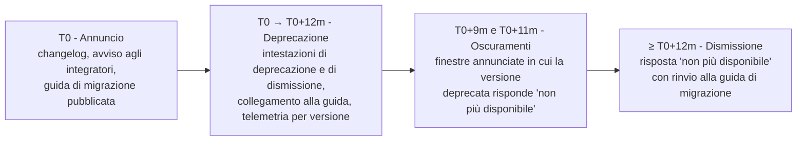

# Principi di interoperabilità

Questo capitolo stabilisce le regole che valgono per tutti i protocolli dell'area. Gli altri
capitoli le applicano; nessuno di essi può derogarvi senza dichiararlo.

## 1. I criteri di scelta

Un protocollo entra nel perimetro di Telemedic solo se supera **tutti** i criteri seguenti.
Non sono ordinati per importanza: sono congiuntivi.

### 1.1 Esiste già ed è pubblicato

Non si inventa un protocollo dove ne esiste uno pubblicato per lo stesso problema. Questa
regola ha una sola eccezione, ed è dichiarata: il protocollo di segnalazione per il tempo
reale (capitolo [09](./09-tempo-reale.md)), perché lo scambio di descrizioni di sessione è
**deliberatamente lasciato fuori** dalle specifiche WebRTC, che normano tutto tranne quello.
Ovunque altro, un protocollo di progetto è un difetto di analisi.

Il corollario è meno ovvio ed è quello che costa: **se lo standard esiste ma è brutto, si usa
lo standard**. La ricerca FHIR è più complicata di una query REST fatta a mano, i `Parameters`
di ingresso e uscita delle operazioni FHIR sono più verbosi di un corpo JSON, il formato
posizionale di HL7 v2 è illeggibile. Sono costi di ergonomia, non di correttezza, e si pagano
perché il beneficio - un sistema terzo che sa già parlare - è dell'ordine di mesi di lavoro
risparmiati a ogni integrazione.

### 1.2 È compatibile con la sovranità del dato

Il vincolo V1 del progetto vieta che un componente **obbligatorio del percorso principale**
dipenda da un servizio non sostituibile o stabilito fuori dall'Unione europea. Applicato ai
protocolli, produce tre conseguenze concrete.

Primo: nessun protocollo del percorso principale può richiedere un servizio centrale gestito
da un terzo. È la ragione per cui il relay per il media è auto-ospitato e per cui l'API
Identity Provider di WebRTC - che richiederebbe un fornitore d'identità terzo che ospiti lo
script di proxy - è esclusa anche a prescindere dal suo stato di adozione (capitolo
[09](./09-tempo-reale.md)).

Secondo: un servizio terminologico esterno è ammesso solo come componente **opzionale**, con
il sistema pienamente funzionante quando è disattivato. È il vincolo V-03 della bacheca, e
il capitolo [02](./02-fhir.md) ne descrive il costo esatto.

Terzo: le dipendenze di **compilazione** verso registri esterni sono ammesse (i pacchetti
delle guide FHIR si risolvono da un registro, non si copiano nel repository), ma richiedono
un mirror interno o una cache di integrazione continua per la riproducibilità della
costruzione. È un costo dichiarato, non un effetto collaterale scoperto in seguito.

### 1.3 Attraversa le reti reali degli utilizzatori

Un protocollo che funziona in laboratorio e non attraversa il firewall di un'azienda
ospedaliera non è adottabile. La conseguenza pratica è che si privilegiano protocolli su
HTTPS sulla porta 443 e su WebSocket promosso da HTTPS; che il relay per il media espone
anche un ascoltatore su TCP 443 con TLS; che l'ascoltatore per HL7 v2 non è mai esposto su
rete non fidata ma incapsulato in TLS o in un tunnel.

### 1.4 Chi sta dall'altra parte sa parlarlo

Il profilo di riferimento dell'integratore è un gestionale sanitario cloud di fascia PMI, con
competenze REST solide, competenze FHIR parziali e nessuna competenza IHE. Un protocollo che
richiede al partner un progetto invece di un'integrazione va offerto in aggiunta, mai come
unica strada. È la ragione per cui coesistono un piano applicativo REST e un piano clinico
FHIR (capitoli [06](./06-api-di-progetto.md) e [02](./02-fhir.md)), e per cui l'adattatore
HL7 v2 esiste (capitolo [04](./04-hl7-v2.md)) benché il progetto sia nato nel 2026.

### 1.5 Ha un comportamento definito quando qualcosa va storto

Un protocollo adottato deve avere una risposta pubblicata a: che cosa succede se il messaggio
arriva due volte, se non arriva, se arriva fuori ordine, se il destinatario è lento, se il
destinatario è irraggiungibile per un giorno. Dove la specifica non risponde - ed è il caso
delle `Subscription` FHIR R4, che non definiscono ritentativi né code di scarto - il progetto
risponde e **dichiara che la risposta è propria**.

### 1.6 È osservabile e diagnosticabile

Ogni scambio deve produrre un identificativo di correlazione propagabile e un registro che
consenta a chi integra di ricostruire che cosa è successo senza aprire un ticket. Gli header
`X-Request-Id` e `X-Correlation-Id` previsti dalla specifica FHIR (§3.1.0.16 di
`https://hl7.org/fhir/R4/http.html`) sono adottati su **entrambi** i piani, non solo su
quello FHIR, proprio per avere un'unica catena di correlazione.

### 1.7 È una scelta reversibile

Un protocollo si adotta dietro un confine di adattamento, mai nel cuore del dominio. Il
modello di dominio non importa i tipi delle librerie FHIR, non conosce i segmenti di HL7 v2,
non sa che cosa sia un `Bundle`. È ciò che permette di aggiungere una serializzazione o una
versione senza riscrivere le regole cliniche, ed è la precondizione del vincolo V-07
(dataset canonico, serializzazioni sostituibili).

## 2. Le versioni adottate, e perché

La tabella seguente è **normativa per il progetto**: è la versione che il codice dichiara, che
la documentazione cita e che le prove verificano. Ogni riga porta lo stato di maturità reale
della specifica, perché è l'informazione che determina il rischio.

| Specifica | Versione fissata | Stato reale | Motivo della scelta |
|---|---|---|---|
| FHIR core | **4.0.1** (30 ottobre 2019) | Mixed Normative and STU | È la base delle guide italiane di telemedicina e del fascicolo. R5 non è un'opzione: nessun interlocutore italiano la consuma |
| Guide HL7 Italia *Televisita*, *Teleconsulto*, *Teleassistenza*, *Telemonitoraggio* | **0.2.0** | trial-use, draft | È lo standard nazionale esistente per il dominio. Adottarlo è più difendibile che inventare profili propri |
| Guida HL7 Italia *IT-Core* | **0.2.0** | trial use, draft | Anagrafiche italiane. Adottata **come riferimento**, con una divergenza dichiarata sull'URI del codice fiscale (§4.2) |
| Cross-version extensions R5→R4 | `hl7.fhir.uv.xver-r5.r4` **0.1.0** | STU, *maturity level 0* | Unica via per esprimere i dettagli del servizio virtuale restando in R4 |
| Subscriptions R5 Backport | **1.1.0** (11 gennaio 2023) | STU | Il modello a topic risolve i difetti strutturali delle `Subscription` R4 |
| FHIR Bulk Data Access | **3.0.0** (attiva dall'11 dicembre 2025) | Trial-use | Portabilità e migrazione. La 2.0.0 è superata; la costruzione continua **non è materiale su cui implementare** |
| SMART App Launch | **2.2.0** (dal 1° marzo 2023) | STU | Avvio applicativo in contesto clinico; base R4 |
| SMART Web Messaging | **1.0.0** (6 maggio 2022) | STU 1 | Ciclo di vita del componente incorporato dentro una cartella conforme |
| HL7 v2 | **2.5.1** per la schedulazione, **2.5** per il resto | Normativo | È ciò che i motori di integrazione italiani parlano |
| HL7 v2-to-FHIR | **1.0.0** (generata 7 ottobre 2025) | STU 1, mappe **Informative** | Riferimento di mappatura. **Non dichiarabile come conformità**: le mappe sono informative |
| IHE ITI Technical Framework | **Revisione 20.2** (11 novembre 2025) | Final Text | Base per ATNA e CT |
| IHE MHD | **4.2.5-comment** (16 giugno 2026) | *ballot*, non Final Text | Pubblicazione documentale. Lo stato è dichiarato, non nascosto |
| IHE PIXm | **3.1.0** (4 novembre 2025) | Trial Implementation | Correlazione di identificativi |
| IHE PDQm | **3.2.0** (4 novembre 2025) | Trial Implementation | Interrogazione demografica |
| IHE IUA | **Revisione 2.5** (18 giugno 2026) | Trial Implementation | Autorizzazione in contesto IHE, su OAuth 2.1 |
| IHE BALP | **1.1.4** (31 ottobre 2025) | Trial Implementation | Forma degli eventi di tracciamento |
| OpenAPI | **3.1.1** | Stabile | Allineamento a JSON Schema 2020-12; campo `webhooks` nativo |
| CloudEvents | **1.0** (binding HTTP **1.0.2**) | Stabile | Busta degli eventi |
| Problem Details | **RFC 9457** | Standards Track | Errori del piano applicativo |
| Deprecation | **RFC 9745** (marzo 2025) | Standards Track | Annuncio di deprecazione. **È RFC**: la citazione come Internet-Draft è superata |
| Sunset | **RFC 8594** | Standards Track | Data di dismissione |
| `Idempotency-Key` | `draft-ietf-httpapi-idempotency-key-header-07` | **scaduto e archiviato** | Convenzione di settore. **Non è uno standard e il progetto non lo dichiara tale** |
| `RateLimit` / `RateLimit-Policy` | `draft-ietf-httpapi-ratelimit-headers-11` (23 maggio 2026) | Internet-Draft **attivo** | Forma corrente a due campi. I tre header separati delle prime versioni sono **superati** |
| HTTP Message Signatures | **RFC 9421** (febbraio 2024) | Standards Track | Firma dei webhook con non ripudio |
| Digest Fields | **RFC 9530** | Standards Track | `Content-Digest` sui webhook |

Tre righe di questa tabella meritano una precisazione, perché sono i punti in cui la
documentazione di un progetto sbaglia più spesso.

**`Idempotency-Key` non è uno standard.** L'Internet-Draft che ne definisce il nome è alla
revisione `-07` del 15 ottobre 2025 e risulta **scaduto e archiviato** sul registro IETF. Il
progetto adotta il nome del campo perché è ciò che le librerie e gli integratori riconoscono,
e lo documenta per ciò che è: **una convenzione di progetto ispirata a un Internet-Draft
scaduto**. Qualunque affermazione di conformità a uno standard IETF su questo punto sarebbe
falsa.

**Gli header di limitazione del traffico hanno cambiato forma.** La revisione corrente del
draft definisce **due** Structured Fields - `RateLimit` e `RateLimit-Policy` - e **sostituisce**
i tre header `RateLimit-Limit`, `RateLimit-Remaining`, `RateLimit-Reset` delle prime versioni.
Citare i tre header come «standard» è doppiamente errato: non sono standard e non sono la
forma corrente. Il progetto emette la forma corrente e, per compatibilità, anche quella
storica, dichiarando lo stato non normativo di entrambe (capitolo [06](./06-api-di-progetto.md)).

**`Deprecation` invece è diventato RFC.** È **RFC 9745**, Standards Track, marzo 2025,
registrato come campo permanente nel registro dei nomi di campo HTTP, di tipo strutturato
*Item*. Il valore è una Date come da §3.3.7 di RFC 9651, nella forma `Deprecation: @1688169599`.
La relazione con `Sunset` è normata: il timestamp di `Sunset` **MUST NOT** essere anteriore a
quello di `Deprecation`.

## 3. Il perimetro dichiarato: che cosa Telemedic parla e che cosa no

| Ambito | Telemedic implementa | Telemedic non implementa | Perché |
|---|---|---|---|
| Interoperabilità clinica | Facciata FHIR R4 REST | GraphQL su FHIR | Nessun interlocutore del dominio lo richiede; raddoppierebbe la superficie di autorizzazione |
| Capacità di prodotto | API REST descritta in OpenAPI 3.1 | Modellazione delle capacità di prodotto come risorse FHIR | Una sessione video, una quota o una chiave del relay non sono concetti clinici: forzarli in FHIR produce un formato proprietario travestito |
| Documenti | Dataset canonico + serializzazioni | Un template documentale cablato | Vincolo V-07: i template nazionali per le nuove tipologie di telemedicina non sono pubblicamente disponibili (capitolo [03](./03-documenti-clinici.md)) |
| Messaggistica legacy | HL7 v2.5/2.5.1 su MLLP protetto, in modulo separato | Un motore di integrazione incorporato | Il cliente tipico ne ha già uno; incorporarlo allargherebbe il perimetro regolatorio |
| Condivisione documentale | IHE MHD come sorgente di documenti | IHE XDS.b come interfaccia primaria | SOAP ed ebXML sono una pila tecnologica interamente diversa. Chi la richiede si raggiunge con un gateway |
| Identità fra imprese | IHE IUA come profilazione documentale su OAuth 2.1 | IHE XUA (SAML su WS-Security) | Serve solo in domini SOAP preesistenti; entrerebbe nel nucleo per un requisito ipotetico |
| Federazione dinamica | Nulla in v1.0 | UDAP | È il meccanismo di fiducia di un ecosistema extraeuropeo. Il modello di registrazione dei client resta però predisposto a un'ancora di fiducia basata su certificati |
| Cartella longitudinale | Nulla | openEHR | Telemedic non è la cartella clinica: il contenuto confluisce nel sistema di origine |
| Imaging | Proxy in sola lettura verso l'archivio del partner | Archiviazione di immagini | Telemedic è veicolo, non archivio |

L'ultima colonna è la parte che conta. Un elenco di ciò che non si fa, senza la ragione, è
una lista della spesa; con la ragione, è un criterio riusabile quando arriva la richiesta
successiva.

## 4. Le divergenze note, dichiarate

Un progetto che adotta specifiche in bozza incontra contraddizioni fra fonti. Nasconderle
produce integrazioni che falliscono in produzione. Qui sono elencate; i capitoli tematici le
trattano in dettaglio.

### 4.1 Le guide italiane sono in stato di bozza e portano difetti di pubblicazione

Le guide della famiglia telemedicina di HL7 Italia sono alla **0.2.0**, dichiarata *trial-use*
e *draft*. Portano difetti verificati che vanno conosciuti prima di perdere giornate: una
dipendenza dichiarata con una **versione flottante** invece di un numero, campi di
pubblicazione lasciati ai valori predefiniti dello strumento di generazione, un sistema di
codifica delle diagnosi che **non dichiara l'edizione** rappresentata, un insieme di valori il
cui nome non corrisponde al contenuto, un profilo del contatto assistenziale che **non fissa**
il valore della classe pur rendendolo obbligatorio, e una dipendenza dichiarata verso una
terminologia la cui licenza è a carico di chi installa. L'elenco completo, con le fonti, è nel
modulo [«FHIR da zero», §8.4](../10_fondamenti/06-fhir-da-zero.md); le conseguenze operative
sono nel capitolo [02](./02-fhir.md).

### 4.2 Due guide dello stesso ente usano URI diversi per il codice fiscale

È la divergenza con l'impatto pratico maggiore. Verificata su fonte primaria: la guida di base
e la guida `Televisita` usano `http://hl7.it/sid/codiceFiscale`; la guida `IT-Core` 0.2.0 usa
`http://hl7.it/fhir/itcore/CodeSystem/cs-codicefiscale`. Nel modello di FHIR il `system` è ciò
che rende univoco un identificatore: due identificatori con lo stesso valore e `system` diversi
sono, per una macchina, due identificatori diversi. Le conseguenze sono la ricerca che non
trova, la deduplicazione che fallisce, la validazione che fallisce e il consumatore che
riconcilia su nome e data di nascita, cioè nel modo peggiore.

> **Questione aperta Q-06 - non decisa in quest'area.**
> La scelta dell'URI da scrivere e il punto in cui avviene l'eventuale traduzione sono
> decisioni di modello dati e appartengono all'area di architettura, in concorso con l'area
> tecnica. Quest'area **documenta il problema, la sua misura e la raccomandazione**, e non
> cabla alcun valore nei propri esempi normativi.
>
> **Raccomandazione di quest'area**, motivata: poiché il progetto dichiara conformità alla
> famiglia `Televisita`, l'URI coerente con quella dichiarazione è
> `http://hl7.it/sid/codiceFiscale`; la proiezione verso l'URI di `IT-Core` va realizzata
> **nello strato di adattamento, sul confine con il consumatore**, attivabile per
> configurazione, mai come riscrittura silenziosa del modello interno; **non** vanno mai
> scritti entrambi gli identificatori nella stessa risorsa, perché peggiora la deduplicazione
> a valle invece di migliorarla. La divergenza va inoltre segnalata all'ente che pubblica le
> guide.

### 4.3 La costruzione continua di una guida non è la guida

La costruzione continua della guida sull'accesso massivo ai dati presenta un manifesto
**strutturalmente diverso** da quello pubblicato: rinomina un campo, ne aggiunge cinque, ne
rimuove uno. Implementare su quella pagina produce un sistema che non interopera con nessuno.
La regola del progetto è: **si implementa sulla versione pubblicata e fissata**, e la
costruzione continua si consulta solo per anticipare il lavoro futuro.

### 4.4 Alcune mappature esistono ma non sono normative

Tutte le mappe della guida di mappatura da HL7 v2 a FHIR - tredici a livello di messaggio e
settantasette a livello di segmento - hanno stato *Informative*. Si usano come riferimento,
**non si dichiarano come conformità**, e per gli errori non esiste alcuna mappa: la traduzione
del segmento di errore v2 verso l'esito di operazione FHIR è a carico dell'implementazione,
senza copertura normativa (capitolo [04](./04-hl7-v2.md)).

### 4.5 In FHIR R4 non esiste la risorsa di stato della sottoscrizione

Verificato: in R4 **non esiste** la risorsa `SubscriptionStatus`, che appartiene a R4B e R5.
Nel modello a topic retro-portato su R4 lo stato viaggia come risorsa `Parameters` conforme a
un profilo dedicato, con i nomi dei parametri in *kebab-case*. Verificato inoltre che
**non esiste** un'estensione di backport per il collegamento all'argomento: il canonico
dell'argomento si scrive **direttamente nel criterio della sottoscrizione**. Sono due errori
diffusi nella letteratura secondaria e vanno evitati: il capitolo
[07](./07-eventi-e-webhook.md) riporta la forma verificata.

### 4.6 Numeri di specifica da non attribuire per analogia

Tre precisazioni che quest'area applica e che chi contribuisce deve rispettare, perché sono
errori che si propagano una volta commessi:

- il formato degli errori del piano applicativo è **RFC 9457**, che ha reso obsoleto il
  documento precedente: citare il numero superato è un errore di versione, non di stile;
- **RFC 9421** definisce la firma dei messaggi HTTP e **non** definisce il campo di digest del
  corpo, che è **RFC 9530**: sono due documenti distinti e vanno citati distintamente;
- **gli eventi inviati dal server e OpenAPI non sono RFC** e non hanno un numero IETF.
  Attribuirgliene uno è un'invenzione. Il primo è definito in una specifica di piattaforma
  web, il secondo è una specifica della sua fondazione, e si citano per nome e versione.

Per gli stessi motivi, quando quest'area cita i protocolli di trasporto lo fa con i documenti
vigenti - **RFC 9293** per TCP, **RFC 9112** per la sintassi di HTTP/1.1 - e non con i numeri
storici resi obsoleti. La spiegazione di che cosa siano è nel modulo
[«I protocolli, uno per uno»](../10_fondamenti/13-protocolli.md), che quest'area non ripete.

## 5. Le dieci scelte che attendono una decisione architetturale

Il modulo 13 della guida ha rilevato che dieci scelte di quest'area sono oggi **proposte
motivate** e non decisioni formali, e ha aperto la questione Q-15 verso quest'area e verso
l'area di architettura. Quest'area risponde per la parte che le compete: **formula la
proposta, la motiva e ne dichiara il costo**; la decisione formale, con il relativo record di
decisione architetturale, spetta all'area di architettura.

| # | Scelta | Proposta di quest'area | Motivazione e costo dichiarato | Dove è dettagliata |
|---|---|---|---|---|
| P-01 | Dove sta la versione dell'interfaccia applicativa | **Versione maggiore nel percorso** (`/v1`), più un'intestazione facoltativa di versione datata per le aggiunte | È visibile nei registri, nelle cache e in una chiamata da riga di comando; l'alternativa a tipo di media è formalmente più corretta ma mal gestita da proxy e client reali. Costo: duplicazione dei percorsi a ogni versione maggiore | [06 §7](./06-api-di-progetto.md) |
| P-02 | Codice di stato quando manca il validatore di concorrenza su una risorsa clinica | **`428 Precondition Required`** sulle scritture cliniche, non silenzioso ultimo-scrittore-vince | Una sovrascrittura non tracciata su una risorsa clinica è perdita di dato non rilevabile, incompatibile con V5. La specifica FHIR ammette il rifiuto ma non lo impone: è scelta di progetto. Costo: rompe i client che non inviano il validatore | [06 §5](./06-api-di-progetto.md) |
| P-03 | Risposta quando la risorsa esiste ma il chiamante non è autorizzato a vederla | **Non trovato**, non vietato, sulle risorse riferite a un assistito | Distinguere «non esiste» da «non puoi vederlo» è un oracolo di enumerazione su una base pazienti. Costo: diagnosi più difficile per l'integratore, mitigata dal codice di errore nel corpo | [06 §6](./06-api-di-progetto.md) |
| P-04 | Ritenzione delle chiavi di idempotenza | **Ventiquattro ore**, ambito `(tenant, client, operazione, chiave)` | Copre il ciclo di ritentativo più lungo previsto per le scritture sincrone senza trasformare il registro in un archivio. Costo: un ritentativo oltre le 24 ore crea un duplicato | [06 §4](./06-api-di-progetto.md) |
| P-05 | Doppia emissione delle intestazioni di limitazione del traffico | **No**: si emettono solo le intestazioni nella forma corrente | La forma storica non è mai stata standard ed è superata; emettere una forma mai standardizzata la legittimerebbe. La doppia emissione per compatibilità non si adotta | [ADR-0021 §5](../adr/0021-convenzioni-delle-interfacce-pubbliche.md) |
| P-06 | Preavviso di dismissione di una versione maggiore | **Dodici mesi**, con due finestre di oscuramento programmato a nove e undici mesi | Dodici mesi sono il ciclo di pianificazione tipico di un gestionale sanitario; le finestre fanno emergere le integrazioni non migrate quando c'è ancora tempo. Costo: due versioni maggiori da mantenere in parallelo | [06 §7](./06-api-di-progetto.md) |
| P-07 | Contenuto del payload degli eventi | **Riferimenti, non contenuto clinico** | Minimizzazione, riduzione del danno in caso di destinazione mal configurata, coerenza con il livello di solo identificativo del modello FHIR. Costo: il ricevente deve fare una chiamata autenticata in più | [07 §2](./07-eventi-e-webhook.md) |
| P-08 | Politica di ritentativo dei webhook | **Attesa esponenziale con variazione casuale obbligatoria**, dodici tentativi su circa settantadue ore, poi coda di scarto | La variazione casuale non è ornamentale: senza, la riattivazione di un destinatario produce una raffica sincronizzata che è un attacco involontario contro il partner. Costo: latenza di consegna alta nei casi peggiori | [07 §5](./07-eventi-e-webhook.md) |
| P-09 | Versionamento del tipo di evento | **Versione maggiore nel nome del tipo**, con schema versionato e riferito nella busta | Un consumatore deve poter continuare a ricevere la forma vecchia mentre migra. Costo: due forme dello stesso evento in emissione durante la transizione | [07 §3](./07-eventi-e-webhook.md) |
| P-10 | Introspezione del token sulle operazioni ad alto impatto | **Sì**, sulle operazioni che avviano una sessione, che pubblicano un documento o che esportano massivamente; validazione locale altrove | Un token verificato localmente resta valido fino alla scadenza anche dopo la revoca: sulle operazioni irreversibili la finestra non è accettabile. Costo: una chiamata di rete in più sul percorso caldo di quelle operazioni | [08 §6](./08-identita-e-autorizzazione.md) |

Nessuna di queste proposte è presentata negli altri capitoli come conformità a uno standard.
Dove compare, è marcata come **scelta di progetto**.

## 6. Politica di evoluzione e di deprecazione

### 6.1 Fissaggio delle versioni e ricontrollo programmato

Ogni specifica esterna è **fissata a una versione esatta** in un unico punto di configurazione,
mai dedotta da un intervallo e mai lasciata a un riferimento mobile. Il progetto ha verificato
che almeno un pacchetto delle guide italiane dichiara una dipendenza con un riferimento
mobile: quel riferimento viene sostituito con un numero e la sostituzione è documentata.

Il ricontrollo è **programmato, non reattivo**: le revisioni dei profili IHE e delle guide di
HL7 Italia cambiano con cadenza infra-annuale. Il progetto esegue un ricontrollo completo
dell'inventario delle specifiche prima di ogni rilascio maggiore e comunque almeno ogni sei
mesi, e ne registra l'esito. Il ricontrollo verifica quattro cose: se la versione fissata è
ancora quella pubblicata; se lo stato di maturità è cambiato; se sono stati pubblicati errata;
se una dipendenza di licenza è cambiata.

### 6.2 Che cosa è coperto dalla garanzia di stabilità

Sono contratto pubblico, e quindi soggetti alla politica di deprecazione:

- percorsi, metodi, parametri e schemi documentati nel descrittore dell'interfaccia
  applicativa per la versione maggiore corrente;
- i tipi di evento pubblici e lo schema del loro contenuto;
- i profili FHIR pubblicati e il documento di capacità;
- gli ambiti di autorizzazione documentati;
- i codici del catalogo degli errori, su entrambi i piani;
- le interfacce del modulo di estensione;
- il protocollo di messaggi fra documento ospitante e componente incorporato, e le proprietà
  di stile documentate.

**Non** sono contratto pubblico, e vanno dichiarati tali perché altrimenti si assume che lo
siano: gli endpoint marcati sperimentali o serviti sotto un percorso di anteprima; le
intestazioni non documentate; l'ordine degli elementi negli elenchi non ordinati; il formato
interno degli identificativi opachi, compresi i cursori di paginazione e i token; il testo
destinato alla lettura umana nei corpi di errore; gli endpoint interni e di amministrazione.

### 6.3 Che cosa non è una rottura

L'elenco seguente va nella documentazione rivolta all'integratore con un'istruzione esplicita,
perché senza di essa ogni aggiunta rompe qualcuno: **il vostro client deve ignorare i campi
sconosciuti e i valori di enumerazione sconosciuti**.

Non sono rotture: l'aggiunta di un campo facoltativo in una risposta; l'aggiunta di un
endpoint; l'aggiunta di un valore a un'enumerazione dichiarata estensibile; l'aggiunta di un
tipo di evento; il rilassamento di un vincolo di validazione.

### 6.4 Il processo di dismissione

Regole aggiuntive: almeno **due versioni maggiori attive** contemporaneamente; nessuna
dismissione senza aver contattato gli integratori ancora attivi su quella versione - la
telemetria d'uso per versione esiste esattamente per questo; la deprecazione di un **ambito di
autorizzazione** o di un **tipo di evento** segue lo stesso processo della deprecazione di una
versione; una vulnerabilità di sicurezza può accorciare i termini, ma il percorso d'emergenza è
documentato in anticipo, con una finestra minima dichiarata, non improvvisato.

La forma tecnica delle intestazioni è nel capitolo [06 §7](./06-api-di-progetto.md).

## 7. Che cosa è garantito a chi integra

Questa sezione è il riassunto contrattuale dell'area. Le garanzie sono affermazioni verificabili
e sono formulate in modo da poter essere provate o smentite.

**Garanzie di forma.** Ogni interfaccia pubblica ha un contratto leggibile da una macchina e
scaricabile: il descrittore dell'interfaccia applicativa per il piano REST, il documento di
capacità e i profili per il piano FHIR, gli schemi degli eventi per le notifiche. I contratti
sono generati e verificati nella catena di costruzione, non scritti a mano e disallineati.

**Garanzie di stabilità.** Nessuna rottura senza il processo di §6.4. Almeno due versioni
maggiori attive. Il comportamento di fronte a campi e valori sconosciuti è documentato.

**Garanzie di correlazione.** Ogni richiesta e ogni consegna portano un identificativo
propagabile, e l'integratore può ritrovare autonomamente che cosa è stato consegnato e con
quale esito, senza aprire un ticket.

**Garanzie di consegna.** La consegna degli eventi è **almeno una volta**, con deduplicazione a
carico del ricevente su una chiave dichiarata. Non è esattamente una volta e non lo sarà.

**Garanzie di correttezza clinica.** Ciò che il progetto emette come contenuto clinico è
**contenuto redatto da un professionista**, mai generato dal sistema. È il vincolo V2, ed è
un'affermazione di perimetro regolatorio prima che di protocollo.

**Non garanzie, dichiarate.** Non è garantito l'ordine globale degli eventi: solo l'ordine per
chiave, e solo dove la modalità ordinata è attivata. Non è garantita la revoca istantanea di un
token verificato localmente: esiste una finestra pari alla vita residua del token, mitigata da
durate brevi e dall'introspezione sulle operazioni ad alto impatto. Non è garantita la
validazione terminologica dei legami che dipendono da una terminologia la cui licenza il
progetto non può assumere: il costo esatto è dichiarato nel capitolo [02](./02-fhir.md). Non è
garantita la conformità a una guida in stato di bozza oltre la versione fissata: se la guida
cambia, cambia il progetto, con il processo di §6.4.
