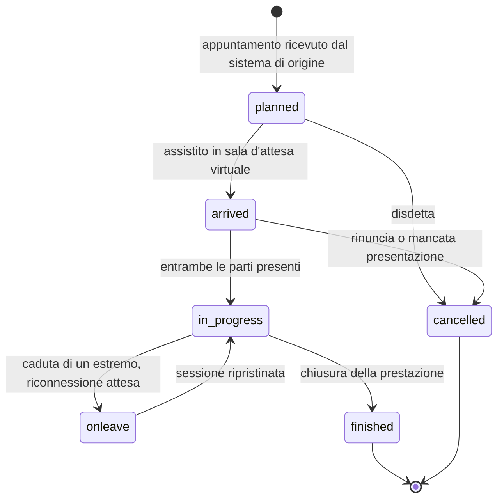

# FHIR

Che cosa sia FHIR, come sia fatta una risorsa, che cosa significhi profilare e come si legga un
legame terminologico è spiegato in [«FHIR da zero»](../10_fondamenti/06-fhir-da-zero.md).
Questo capitolo dà per acquisito quel modulo e descrive **come Telemedic espone FHIR**: quali
versioni, quali profili, quali interazioni, con quali garanzie e con quali limiti dichiarati.

## 1. La dichiarazione di conformità

Telemedic dichiara **FHIR 4.0.1**, non «FHIR R4». La distinzione non è pedanteria: la
correzione tecnica del 30 ottobre 2019 ha modificato invarianti e risorse di conformità
generate rispetto alla 4.0.0, e i validatori si comportano di conseguenza. Il numero compare in
tre punti che devono essere coerenti fra loro e verificati in integrazione continua: la
proprietà `fhirVersion` del documento di capacità, il parametro del tipo di media, la
documentazione pubblica.

La versione si esprime nella negoziazione del contenuto come parametro del tipo di media,
secondo §3.1.0.1.10 di `https://hl7.org/fhir/R4/http.html`:

```http
GET /fhir/Encounter/enc-0f1a2b HTTP/1.1
Host: telemedic.example
Accept: application/fhir+json; fhirVersion=4.0
Authorization: Bearer <token opaco>
X-Request-Id: 01J9ZC7Y4Q7K9V0R2M4T8N1B3D
```

I valori ammessi per quel parametro sono `0.0`, `1.0`, `3.0`, `4.0`. Telemedic accetta solo
`4.0` e risponde `406 Not Acceptable` a una richiesta che ne chieda un altro, invece di servire
silenziosamente una versione diversa da quella chiesta.

Il percorso di base è `/fhir`. È distinto dal percorso dell'interfaccia applicativa di progetto,
che è `/v1` e ha grammatica, contratto ed errori propri: la ripartizione fra i due piani e il
criterio per decidere dove vive un concetto sono nel capitolo
[06 §1](./06-api-di-progetto.md).

## 2. Le guide adottate, con versione fissata

| Guida | Pacchetto | Versione fissata | Stato dichiarato dalla guida | Ruolo in Telemedic |
|---|---|---|---|---|
| *Televisita* | guida HL7 Italia | **0.2.0** | trial-use, draft al 17 settembre 2025 | Profilo predefinito per la prestazione e per il referto |
| *Teleconsulto* | guida HL7 Italia | **0.2.0** | trial-use | Consulto fra professionisti |
| *Teleassistenza* | guida HL7 Italia | **0.2.0** | trial-use | Prestazione assistenziale a distanza |
| *Telemonitoraggio* | guida HL7 Italia | **0.2.0** | trial-use | Piani di rilevazione e parametri |
| *IT-Core* | guida HL7 Italia | **0.2.0** | trial use, draft al 30 luglio 2026 | Anagrafiche italiane, **con la divergenza di §9.3** |
| *Subscriptions R5 Backport* | `hl7.fhir.uv.subscriptions-backport` | **1.1.0** (11 gennaio 2023) | STU | Notifiche a topic su R4 |
| *Extensions for Using Data Elements from FHIR R5 in FHIR R4* | `hl7.fhir.uv.xver-r5.r4` | **0.1.0** | STU, *maturity level 0* | Dettagli del servizio virtuale |
| *FHIR Bulk Data Access (Flat FHIR)* | `hl7.fhir.uv.bulkdata` | **3.0.0** | Trial-use, attiva dall'11 dicembre 2025 | Portabilità ed esodo di un tenant |
| *HL7 Version 2 to FHIR* | `hl7.fhir.uv.v2mappings` | **1.0.0** | STU 1, mappe **Informative** | Riferimento di mappatura, non conformità |

**Regola di risoluzione dei pacchetti.** I pacchetti delle guide **non vengono copiati nel
repository**. Sono dichiarati come dipendenze nella configurazione di costruzione e risolti da
un registro. La ragione è di licenza: la dichiarazione di licenza della guida *Televisita*
convive con campi di pubblicazione lasciati ai valori predefiniti dello strumento di
generazione, e **non è quindi attribuibile a un soggetto identificato**; inoltre le guide
includono contenuto di terzi, e una dichiarazione apposta sul contenitore non dispone dei
diritti altrui. Il costo di questa scelta è dichiarato: la costruzione richiede accesso di rete
a un registro, e la riproducibilità richiede un mirror interno o una cache di integrazione
continua.

**Regola di fissaggio.** Ogni versione è un numero esatto. Il pacchetto *Televisita* dichiara
una dipendenza verso il pacchetto terminologico italiano con un riferimento mobile invece di un
numero: il progetto lo sostituisce con la versione risolta al momento del fissaggio e documenta
la sostituzione. Per un sistema soggetto a controllo della configurazione un riferimento mobile
non è un fastidio, è un difetto.

## 3. I profili adottati e le risorse esposte

### 3.1 Che cosa Telemedic espone

| Risorsa | Profilo dichiarato | Interazioni | Ruolo |
|---|---|---|---|
| `Encounter` | `EncounterTelevisita` (0.2.0) | read, vread, history, search, create, update | La prestazione come atto clinico |
| `Appointment` | `AppointmentTelevisita` (0.2.0) | read, search, create condizionale, update | Appuntamento, **ricevuto** dal sistema di origine |
| `Patient` | profilo della famiglia adottata | read, search | Proiezione minima. Telemedic **non è** l'anagrafe di riferimento |
| `Practitioner` | `PractitionerTelevisita` | read, search | Persona e qualifiche |
| `PractitionerRole` | `PractitionerRoleTelevisita` | read, search | **È questo** che viene referenziato nelle prestazioni |
| `Organization` | `OrganizationT1`/`T2`/`T3` | read, search | Struttura erogante, presidio, unità operativa |
| `RelatedPerson` | base | read, search | Caregiver, genitore, tutore |
| `Composition` | `CompositionRefertoTelevisita` | read, vread, search, create, `$document` | Il referto (capitolo [03](./03-documenti-clinici.md)) |
| `Bundle` | `BundleRefertodiTelevisita` | read, search | Il documento assemblato e immutabile |
| `DocumentReference` | base + vincoli di progetto | read, search, create | Indicizzazione del documento e della registrazione |
| `DiagnosticReport` | base | **read, search soltanto** | Vista di compatibilità, mai artefatto primario |
| `Observation` | `ObservationTelevisita`, `ObservationTelevisitaNarrative` | read, search, create | Contenuto clinico strutturato e narrativo |
| `Condition` | base | read, search, create | Diagnosi e problemi |
| `Consent` | base | read, search, create, update | Consensi con validità temporale |
| `AuditEvent` | schemi IHE BALP 1.1.4 | **read, search soltanto** | Forma interoperabile del tracciamento |
| `Provenance` | base | read, search | Catena di custodia del contenuto clinico |
| `Subscription` | `backport-subscription` (1.1.0) | read, search, create, update, delete, `$status` | Notifiche a topic (capitolo [07](./07-eventi-e-webhook.md)) |
| `Endpoint`, `HealthcareService` | base | read, search | Pubblicazione del servizio in una directory |
| `Task` | base | read, search, create, update | Orchestrazione asincrona verso sistemi terzi |
| `Communication` | base | read, search, create | Messaggi di sessione e notifiche all'assistito |

Tre righe di questa tabella sono decisioni, non descrizioni.

**Il referto è una `Composition`, non un `DiagnosticReport`.** La guida italiana modella il
referto di televisita come `CompositionRefertoTelevisita` dentro un `Bundle` di tipo documento,
e il vincolo V2 impone che ciò che Telemedic persiste sia contenuto redatto dal professionista,
non informazione generata dal sistema. `DiagnosticReport` resta esposto **in sola lettura**
come proiezione di compatibilità per gli integratori che sanno consumare solo quello, con la
parte narrativa popolata dal testo redatto dal medico e l'allegato firmato nel campo dedicato.
Non è mai la rappresentazione primaria e non è scrivibile.

**Il professionista si referenzia tramite il suo ruolo.** In un contesto multi-tenant è la
relazione «professionista X, presso organizzazione Y, con specialità Z» a essere pertinente,
non la persona in astratto. La specifica distingue esplicitamente i due concetti:
`Practitioner` porta la persona e le sue qualifiche, `PractitionerRole` documenta luoghi e
tipi di servizio che il professionista può erogare per un'organizzazione. Referenziare
`Practitioner` dove serve il ruolo è l'errore che rende la risorsa non attribuibile al tenant.

**Il tracciamento è esposto in sola lettura.** Un `AuditEvent` scrivibile da un client è un
registro falsificabile. La sorgente degli eventi di tracciamento è interna; l'API li espone per
la consultazione e l'esportazione, mai per la scrittura. Il registro immutabile in senso proprio
- catena di impronte e conservazione separata - è cosa diversa dalla risorsa FHIR e non è
sostituito da essa: è il vincolo V-04, e appartiene all'area di sicurezza.

### 3.2 La classe del contatto assistenziale

Il profilo italiano rende obbligatoria la classe del contatto assistenziale, la lega in modo
estensibile al vocabolario delle classi di contatto, e **non ne fissa alcun valore**. Il fatto è
verificato: cardinalità `1..1`, legame *extensible*, nessun valore fisso e nessun modello.

Telemedic valorizza la classe con il codice della modalità virtuale del sistema di codifica
`http://terminology.hl7.org/CodeSystem/v3-ActCode`, la cui definizione è *«A patient encounter
where the patient and the practitioner(s) are not in the same physical location»*. È l'unico
codice del vocabolario che denoti la modalità non compresente, quindi la scelta è conforme e
difendibile - **ma è una decisione di progetto, non una prescrizione della guida**, e va
formalizzata come record di decisione architetturale. La domanda va inoltre posta all'ente che
pubblica la guida.

C'è un limite della definizione che va conosciuto: è deliberatamente ampia e copre anche
modalità asincrone, compreso lo scambio di messaggi. **La classe da sola non dice «videochiamata
in tempo reale».** La qualificazione ulteriore è compito dell'estensione descritta in §4.

### 3.3 Il partecipante e il soggetto

`Encounter.participant.individual` **non può referenziare l'assistito**: i soli bersagli ammessi
in R4 sono il professionista, il suo ruolo e la persona correlata. L'assistito è il soggetto del
contatto. Modellarlo come partecipante è un errore di conformità che i validatori segnalano ed è
il primo errore di chi arriva a FHIR da un modello relazionale.

I codici di partecipazione usati da Telemedic, tutti verificati come presenti nell'espansione
del vocabolario di riferimento, che conta dodici concetti:

| Codice | Display verificato | Uso in Telemedic |
|---|---|---|
| `PPRF` | `primary performer` | Il professionista che eroga la prestazione |
| `SPRF` | `secondary performer` | Un secondo professionista presente |
| `CON` | `consultant` | Il consulente in un teleconsulto |
| `REF` | `referrer` | Il professionista inviante |
| `ATND` | `attender` | Il professionista responsabile della presa in carico |

Nessuna estensione del legame è necessaria: i codici stanno tutti nel vocabolario previsto.

### 3.4 La traiettoria del contatto

Gli stati del contatto assistenziale sono nove e il legame è vincolante. La traiettoria della
prestazione è persistita in `Encounter.statusHistory`, che porta stato e intervallo temporale
obbligatori. Questa è la rappresentazione **interoperabile** della traiettoria e si affianca -
senza sostituirlo - al versionamento interno delle entità e al registro immutabile, che
rispondono a domande diverse.



Il diagramma descrive la prestazione, **non** la sessione media. Sono aggregati distinti per
vincolo V-01: una prestazione può avvenire senza media, con più sessioni o con sessioni fallite;
una sessione media può esistere per una prova tecnica senza alcuna prestazione. Il ciclo di vita
della sessione è nel capitolo [09](./09-tempo-reale.md) e vive sul piano applicativo, non su
quello FHIR.

## 4. Il servizio virtuale: come si dice «questa è una televisita» restando in R4

R4 offre **un solo elemento semantico** per la modalità virtuale, ed è la classe del contatto.
Non esiste in R4 un elemento per l'indirizzo della sessione virtuale, non esiste una distinzione
fra sincrono e asincrono, non esiste un codice per il tipo di canale. R5 colma la lacuna
introducendo un elemento dedicato con un tipo di dato proprio, ma R5 non è un'opzione per questo
progetto.

La soluzione adottata è l'**estensione di versione incrociata** pubblicata da HL7, che espone
quel tipo di dato di R5 come estensione utilizzabile nel contesto R4. Il canonico verificato
sulla definizione pubblicata è:

```
http://hl7.org/fhir/5.0/StructureDefinition/extension-Encounter.virtualService
```

e l'analogo per l'appuntamento è
`http://hl7.org/fhir/5.0/StructureDefinition/extension-Appointment.virtualService`.

> **Avvertenza sulla forma dell'URL.** La pagina della guida documenta anche una forma diversa,
> costruita sul canonico della guida stessa. Il valore **effettivamente presente nell'elemento
> `url` della definizione pubblicata** è quello riportato sopra, ed è quello che va scritto
> nelle istanze. Scrivere l'altra forma produce un'estensione che nessun validatore risolve.

Le sotto-estensioni definite, verificate una per una:

| Sotto-estensione | Card. | Tipo | Nota |
|---|---|---|---|
| `_datatype` | **1..1** | `string` | Valore fisso `VirtualServiceDetail`. **Marcatore obbligatorio**: un'istanza che lo omette non è valida |
| `channelType` | 0..1 | `Coding` | Tipo di canale |
| `address` | 0..1 | complessa | Estensione complessa su un tipo di contatto esteso, con proprie sotto-estensioni |
| `additionalInfo` | 0..* | `url` | Indirizzo di dettagli di connessione alternativi |
| `maxParticipants` | 0..1 | `positiveInt` | Numero massimo di partecipanti |
| `sessionKey` | 0..1 | `string` | Chiave di sessione richiesta dal servizio |

**Il legame del tipo di canale ha forza *Example*, non *required*.** È un fatto verificato e
cambia sostanzialmente la valutazione: non esiste alcun obbligo di conformarsi ai codici del
vocabolario di riferimento, che sono **tre** e i cui identificativi corrispondono a nomi di
piattaforme commerciali di videoconferenza di terze parti. Quel vocabolario è inoltre marcato
sperimentale, immutabile e in bozza, con l'avvertenza esplicita che non è pronto per l'uso in
produzione, e contiene un errore redazionale accertato: la definizione di uno dei tre codici
riporta un testo che parla di prezzi, evidentemente importato da un altro sistema di codifica.

Ne discende la regola di progetto: **Telemedic usa un proprio sistema di codifica per il tipo di
canale**, senza alcun bisogno di processo di armonizzazione terminologica, e lo dichiara.

Esempio di istanza, con dati sintetici:

```json
{
  "resourceType": "Encounter",
  "id": "enc-3c8f1a20",
  "meta": {
    "profile": ["http://hl7.it/fhir/televisita/StructureDefinition/EncounterTelevisita"]
  },
  "extension": [
    {
      "url": "http://hl7.org/fhir/5.0/StructureDefinition/extension-Encounter.virtualService",
      "extension": [
        { "url": "_datatype", "valueString": "VirtualServiceDetail" },
        {
          "url": "channelType",
          "valueCoding": {
            "system": "https://telemedic.example/CodeSystem/virtual-service-channel",
            "code": "webrtc-p2p-sas",
            "display": "WebRTC punto a punto con verifica della sessione"
          }
        },
        { "url": "maxParticipants", "valuePositiveInt": 3 }
      ]
    }
  ],
  "status": "planned",
  "class": {
    "system": "http://terminology.hl7.org/CodeSystem/v3-ActCode",
    "code": "VR",
    "display": "virtual"
  },
  "subject": { "reference": "Patient/pat-9d2e" },
  "appointment": [{ "reference": "Appointment/apt-51b7" }]
}
```

> **`[NV]` - forma esatta della sotto-estensione dell'indirizzo.** La definizione pubblicata
> espone `address` come **estensione complessa** su un tipo di contatto esteso, non come valore
> semplice. La forma puntuale delle sue sotto-estensioni non è stata verificata elemento per
> elemento. Prima di scrivere un indirizzo in quella sotto-estensione va risolto il pacchetto
> alla versione fissata e validata l'istanza. **Da chiedere a**: chi implementa lo strato di
> adattamento FHIR, con verifica in integrazione continua contro il pacchetto fissato.

**Due regole di sicurezza su questa estensione, non negoziabili.** La chiave di sessione e
l'indirizzo della stanza sono **credenziali di accesso a una sessione clinica**, non metadati.
Persisterli in chiaro in una risorsa interrogabile, che un client può estrarre con una ricerca
e con l'inclusione delle risorse collegate, è una fuga di credenziali. Telemedic **non
valorizza** né la chiave di sessione né l'indirizzo nella risorsa persistita: l'estensione porta
il tipo di canale e il numero massimo di partecipanti, che sono metadati; le credenziali di
accesso alla stanza si ottengono con una chiamata autenticata al piano applicativo, sono
monouso e hanno vita brevissima (capitolo [09](./09-tempo-reale.md)).

## 5. Le ricerche supportate

### 5.1 La regola che cambia il comportamento predefinito

La specifica dice che i server **SHOULD** ignorare i parametri di ricerca sconosciuti o non
supportati, salvo che il client chieda esplicitamente la gestione stretta. Telemedic **devia da
questa raccomandazione, deliberatamente e in modo dichiarato**: il comportamento predefinito è
la **gestione stretta**, e un parametro non riconosciuto produce un errore invece di essere
ignorato.

La motivazione è di sicurezza clinica, non di purismo. Un client che invia un filtro sbagliato -
per esempio un parametro di restrizione al tenant scritto male - riceverebbe silenziosamente
**più dati del previsto**. In un sistema sanitario multi-tenant questo è un incidente di
divulgazione, non un fastidio. Il costo è che un client che invia un parametro superfluo riceve
un errore invece che una risposta: è un costo accettabile e va documentato all'integratore.

La deviazione è tracciata come tale. Un client che voglia il comportamento raccomandato dalla
specifica può chiederlo esplicitamente con l'intestazione di gestione permissiva, ma la
richiesta è registrata nel tracciamento.

### 5.2 I parametri esposti

Sono supportati i parametri comuni a tutte le risorse (`_id`, `_lastUpdated`, `_tag`, `_profile`,
`_security`, `_has`), i parametri di risultato (`_sort`, `_count`, `_total`, `_include`,
`_revinclude`, `_summary`, `_elements`) e, per ciascuna risorsa, i parametri specifici dichiarati
nel documento di capacità. Tre parametri comuni **non** sono esposti e la ragione è dichiarata:
`_text`, `_content` e `_query`, perché la ricerca a testo libero su contenuto clinico è una
superficie di enumerazione e di esfiltrazione che nessun caso d'uso del progetto richiede.

I modificatori supportati per tipo di parametro sono quelli della specifica; per i parametri di
tipo token sono attivi `:not`, `:in`, `:not-in`, `:of-type` e `:text`, mentre `:above` e
`:below` sono attivi **solo** sui sistemi di codifica per cui il servizio terminologico è
configurato e attivo. Con il servizio terminologico disattivato quei modificatori rispondono con
un errore esplicito invece di restituire un risultato parziale silenzioso: un risultato
incompleto presentato come completo è peggio di un errore.

Esempi di ricerca realistici, con dati sintetici:

```http
# Le prestazioni virtuali concluse di un assistito in un intervallo, con l'appuntamento
# e il ruolo del professionista inclusi nella risposta
GET /fhir/Encounter?subject=Patient/pat-9d2e&class=VR&status=finished
    &date=ge2026-09-01&date=le2026-09-30
    &_include=Encounter:appointment&_include=Encounter:participant
    &_sort=-date&_count=25 HTTP/1.1
Accept: application/fhir+json; fhirVersion=4.0
```

```http
# Risoluzione di un assistito per identificativo esterno del sistema di origine
GET /fhir/Patient?identifier=https%3A%2F%2Fgestionale.integratore.example%2Fsid%2Fpaziente%7CPZ-4471 HTTP/1.1
Accept: application/fhir+json; fhirVersion=4.0
```

```http
# Il referto di una prestazione, con le risorse che vi si riferiscono
GET /fhir/Composition?encounter=Encounter/enc-3c8f1a20&_revinclude=Provenance:target HTTP/1.1
Accept: application/fhir+json; fhirVersion=4.0
```

### 5.3 Paginazione

La paginazione segue il modello della specifica: relazioni di collegamento `self`, `first`,
`previous`, `next`, `last` nel risultato. **I collegamenti sono opachi**: sono costruiti dal
server e il client non deve interpretarli né ricostruirli. Un client che costruisce a mano
l'indirizzo della pagina successiva a partire da un contatore è un client che si romperà, e la
sua rottura sarà silenziosa: restituirà risultati incompleti o duplicati invece di un errore.

Il collegamento `self` riporta **i parametri effettivamente usati** dal server per elaborare la
ricerca, come la specifica richiede. È l'unico modo per un integratore di accorgersi che un
parametro è stato interpretato diversamente da come lo intendeva.

Il conteggio totale è servito con la modalità `estimate` come comportamento predefinito. La
modalità `accurate` è disponibile ma limitata in frequenza, perché su una base pazienti di
dimensioni reali un conteggio esatto è una scansione completa e diventa una superficie di
degrado del servizio.

### 5.4 Parametri di ricerca propri del progetto

Dove serve un parametro non previsto dalla specifica, il progetto pubblica una definizione di
parametro di ricerca con canonico proprio e la dichiara nel documento di capacità. La regola è
che il parametro deve avere un'espressione dichiarata sulla risorsa e non può essere una
scorciatoia per esporre uno stato interno. Un parametro che filtri su un concetto che non esiste
nel modello FHIR è il segno che il concetto appartiene al piano applicativo.

### 5.5 Il filtro per tenant non è un parametro di ricerca

Va detto esplicitamente perché è l'errore architetturale più pericoloso: **il tenant non si
esprime come parametro di ricerca**. Il contesto di tenant è risolto dall'autorizzazione e
applicato al livello di accesso ai dati, prima che la ricerca venga costruita. Nessuna
interrogazione esiste senza tenant risolto. Se il tenant fosse un parametro, ometterlo
restituirebbe tutto, e ometterlo è esattamente ciò che un client sbagliato fa.

## 6. Le operazioni

| Operazione | Livello | Stato in Telemedic | Nota |
|---|---|---|---|
| `$validate` | tipo, istanza | Esposta | Vedi §6.1 per la trappola del codice di stato |
| `$document` | istanza su `Composition` | Esposta | Genera il documento a partire dalla composizione |
| `$status` su `Subscription` | sistema, istanza | Esposta, **obbligatoria** dalla guida di backport | Stato della sottoscrizione |
| `$events` su `Subscription` | istanza | Esposta | Recupero delle notifiche per intervallo di numero d'evento |
| `$get-ws-binding-token` | sistema, istanza | **Non esposta in v1.0** | Il canale a socket web per le notifiche non è nel perimetro |
| `$export` | **solo su gruppo** | Esposta con restrizioni severe | Vedi §6.2 |
| `$ihe-pix` su `Patient` | tipo | **Consumata, non esposta** | Telemedic è consumatore, non gestore della correlazione (capitolo [05](./05-ihe.md)) |
| `$expand`, `$lookup`, `$validate-code` | - | **Non esposte** | Telemedic non è un servizio terminologico: le inoltra al servizio configurato |

### 6.1 La validazione come operazione

`$validate` restituisce sempre un esito di operazione con **codice HTTP 200, anche quando la
risorsa non è valida**. Un codice 4xx o 5xx significa che è fallito il *processo* di
validazione, non che la risorsa è invalida. È la trappola su cui inciampa ogni client scritto
per la prima volta contro un server FHIR, e le librerie di progetto la gestiscono
esplicitamente: chi consuma l'operazione deve leggere la severità delle segnalazioni
nell'esito, non il codice di stato.

I parametri supportati sono `resource`, `mode` e `profile`. Il server **restituisce un errore**
se gli viene chiesto di validare contro un profilo che non sa risolvere, invece di dichiarare
valida una risorsa che non ha potuto verificare. È un comportamento richiesto dalla specifica ed
è anche l'unico difendibile.

### 6.2 L'esportazione massiva, e perché è disabilitata a livello di sistema

L'operazione di esportazione massiva è la via standard per la portabilità dei dati e per
l'esodo di un tenant. È anche la superficie a rischio più alto dell'intera facciata: una
esportazione a livello di sistema esporta l'intera base dati.

Regole di progetto, tutte vincolanti:

1. L'esportazione **a livello di sistema è disabilitata**. Non è configurabile: non esiste.
2. L'esportazione **a livello di tutti gli assistiti è disabilitata**.
3. È ammessa **solo** l'esportazione su gruppo, con il gruppo vincolato per costruzione a un
   unico tenant e verificato al momento dell'avvio dell'operazione.
4. L'autorizzazione richiede un ambito dedicato che non è mai concesso in modo predefinito e la
   cui concessione è un atto amministrativo tracciato.
5. Ogni avvio, ogni interrogazione di stato e ogni scaricamento di file generano un evento di
   tracciamento con la finalità d'uso dichiarata: un'esportazione è una **comunicazione di dati
   sanitari**, non una lettura.

La forma tecnica segue la versione **3.0.0** della guida. L'avvio è una richiesta con
l'intestazione di preferenza asincrona; la risposta è `202 Accepted` con l'indirizzo di
interrogazione dello stato nell'intestazione di posizione del contenuto; l'interrogazione
restituisce `202` mentre l'operazione è in corso, con le intestazioni facoltative di ritardo
suggerito e di avanzamento, e `200` con il manifesto al completamento. I parametri supportati
sono quelli della versione fissata, compresi quelli introdotti dalla 3.0.0.

> **Regola dichiarata:** il progetto implementa il manifesto **nella forma pubblicata nella
> 3.0.0**. La costruzione continua della guida presenta un manifesto strutturalmente diverso -
> rinomina il campo degli errori, ne aggiunge cinque, ne rimuove uno. Non è materiale su cui
> implementare, e implementarvi produrrebbe un sistema che non interopera con nessuno.

## 7. Il documento di capacità

Il documento di capacità è il **contratto leggibile da una macchina** verso qualunque
integratore, e soddisfa direttamente il vincolo V3 di integrabilità totale. Regole di progetto:

- è **generato nella catena di costruzione a partire dal codice**, mai scritto a mano. Un
  documento di capacità scritto a mano diverge dal comportamento reale entro poche settimane,
  e allora è peggio di non averlo;
- dichiara `fhirVersion` a 4.0.1 e `kind` a `instance`;
- elenca per ciascuna risorsa le interazioni supportate, i profili dichiarati, i profili
  supportati, i parametri di ricerca esposti con il loro canonico, le operazioni, e le politiche
  di versionamento, di lettura condizionale, di aggiornamento condizionale e di cancellazione
  condizionale effettivamente implementate;
- dichiara la conformità alla guida di backport delle sottoscrizioni tramite la proprietà
  `instantiates`, con il canonico del documento di capacità per server R4 pubblicato da quella
  guida, e la scoperta degli argomenti tramite l'estensione dedicata sulle risorse;
- è verificato in integrazione continua contro il comportamento reale: una prova per ogni
  interazione dichiarata, e il fallimento di una prova blocca la costruzione.

**Il documento di capacità non è più il canale di scoperta degli endpoint di autorizzazione.**
La specifica di avvio applicativo lo dichiara espressamente: quel meccanismo è deprecato, e la
fonte di verità è il documento di configurazione servito su un percorso ben noto. Telemedic
pubblica entrambi, con il documento di configurazione come fonte di verità e l'estensione sul
documento di capacità emessa solo per compatibilità con client datati e marcata come deprecata
(capitolo [08](./08-identita-e-autorizzazione.md)).

## 8. Validazione, errori, concorrenza

### 8.1 I tre livelli di validazione e il loro costo

| Livello | Che cosa verifica | Quando | Dipendenze |
|---|---|---|---|
| Strutturale | JSON ben formato, schema della risorsa, cardinalità, tipi | A ogni scrittura | Nessuna |
| Contro i profili | Invarianti, slice, valori fissi, legami | A ogni scrittura sulle risorse profilate | Pacchetti risolti, viste complete popolate |
| Terminologico | Esistenza dei codici e appartenenza agli insiemi di valori | A ogni scrittura, **se il servizio è attivo** | Servizio terminologico |

Il terzo livello porta un costo dichiarato dalla politica terminologica del progetto. Con la
funzione della terminologia clinica internazionale disattivata - che è la configurazione
predefinita e pienamente supportata per vincolo V-03 - **i legami che dipendono da quella
terminologia non si validano**. La misura è nota: il legame sui motivi del contatto assistenziale
ha forza *preferred* e si espande su circa quattromila codici. Il progetto lo dichiara invece di
scoprirlo: un motivo di contatto espresso con quella terminologia viene accettato senza verifica
del codice, e la risposta di validazione riporta una segnalazione di severità informativa che lo
dice esplicitamente.

Nessun percorso principale del sistema richiede quella terminologia. Le codifiche su cui il
progetto si appoggia - la classificazione delle sezioni del referto, la classificazione italiana
delle diagnosi e il catalogo nazionale delle prestazioni - non hanno quel vincolo.

In integrazione continua la validazione è un **gate**: se un esempio del repository non valida
contro il profilo che dichiara, la costruzione fallisce. Un esempio che non valida è peggio di
nessun esempio, perché insegna a sbagliare.

> **`[NV]` - strumenti concreti di validazione.** I nomi, le versioni e le modalità di
> invocazione degli strumenti di validazione e di pubblicazione delle guide non sono stati
> verificati su fonte primaria. Vanno accertati e fissati nella configurazione di costruzione.
> **Da chiedere a**: chi cura la catena di costruzione, in raccordo con l'area tecnica.

### 8.2 La gestione degli errori

Sul piano FHIR l'errore è un **esito di operazione**. La specifica lo impone: gli errori 4xx e
5xx sulle interazioni di creazione, aggiornamento e modifica parziale **devono** includerlo.

```json
{
  "resourceType": "OperationOutcome",
  "issue": [
    {
      "severity": "error",
      "code": "business-rule",
      "details": {
        "coding": [
          {
            "system": "https://telemedic.example/CodeSystem/operation-outcome",
            "code": "encounter-not-startable"
          }
        ],
        "text": "La prestazione non può passare in corso: l'appuntamento collegato è annullato."
      },
      "expression": ["Encounter.appointment"]
    }
  ]
}
```

Tre regole di progetto sulla forma degli errori:

1. **Il catalogo dei codici è unico per i due piani.** Lo stesso concetto di errore porta lo
   stesso codice nell'esito di operazione FHIR e nel corpo di errore dell'interfaccia
   applicativa. La corrispondenza è **generata**, non scritta due volte: due cataloghi scritti a
   mano divergono.
2. **Il testo leggibile non contiene mai contenuto clinico né identificativi diretti.** Finisce
   nei registri del chiamante. È un requisito, non una raccomandazione.
3. **Un errore non catalogato non può essere emesso.** La verifica è nella catena di costruzione:
   se il codice sorgente emette un codice che non sta nel catalogo, la costruzione fallisce.

I codici di stato usati e il loro significato preciso sono nella tabella del capitolo
[06 §3](./06-api-di-progetto.md), che vale per entrambi i piani.

### 8.3 Concorrenza ottimistica

L'identificativo di versione della risorsa è esposto come **validatore debole**, nella forma
`W/"3"`, e la data di ultima modifica nell'intestazione corrispondente. L'aggiornamento
consapevole della versione si effettua fornendo il validatore nella richiesta; in caso di
discordanza il server risponde `412 Precondition Failed`.

**Regola di progetto, deviazione dichiarata dal comportamento minimo della specifica:** su tutte
le scritture di risorse cliniche il validatore di precondizione è **obbligatorio**. Una scrittura
che non lo porta riceve `428 Precondition Required` e non viene applicata. La specifica ammette
che il server possa rifiutare, ma non lo impone: è quindi una scelta di progetto, elencata come
P-02 fra quelle che attendono una decisione architetturale formale.

La motivazione è che un aggiornamento senza validatore è un ultimo-scrittore-vince silenzioso.
Su una risorsa clinica significa perdita di dato non tracciata, incompatibile con il vincolo V5.
Il costo è che rompe i client che non inviano il validatore, ed è esattamente ciò che si vuole:
che si rompano in fase di integrazione invece che in produzione.

```http
PUT /fhir/Encounter/enc-3c8f1a20 HTTP/1.1
Content-Type: application/fhir+json; fhirVersion=4.0
If-Match: W/"7"
Prefer: return=representation
```

### 8.4 Ingestione idempotente

L'appuntamento nasce nel sistema di origine e viene consegnato a Telemedic. Il rischio è il
duplicato: il partner reinvia lo stesso appuntamento dopo un timeout e Telemedic ne crea due.

Il meccanismo standard è la **creazione condizionale**: la richiesta porta un'intestazione con
un criterio di ricerca, il server crea solo se il criterio non trova nulla e risponde `200` con
la risorsa esistente se la trova. Il criterio usato è l'**identificativo esterno del sistema di
origine**, non un accostamento di dati anagrafici.

```http
POST /fhir/Appointment HTTP/1.1
Content-Type: application/fhir+json; fhirVersion=4.0
If-None-Exist: identifier=https://gestionale.integratore.example/sid/appuntamento|APT-77219
```

L'aggiornamento condizionale è supportato con la semantica della specifica: `412` se il criterio
seleziona più di una risorsa, perché applicare un aggiornamento a più risorse su un criterio
ambiguo è un danno silenzioso. La **cancellazione condizionale non è supportata**: la scelta è
dichiarata, e la ragione è che una cancellazione su criterio in un sistema sanitario multi-tenant
è un'operazione il cui raggio d'azione non è ispezionabile dal chiamante prima di eseguirla.

### 8.5 Transazioni

Le transazioni sono supportate con l'ordine di elaborazione della specifica: prima le
cancellazioni, poi le creazioni, poi gli aggiornamenti e le modifiche parziali, poi le letture,
infine la risoluzione dei riferimenti condizionali. Un riferimento condizionale che non trova
alcuna corrispondenza o ne trova più di una **fa fallire l'intera transazione**, come la
specifica richiede.

Due vincoli di progetto si aggiungono:

- **Una transazione non può contenere risorse di tenant diversi.** La verifica avviene nel
  parser, prima dell'autorizzazione, e non solo nel controllo di accesso: una transazione mista
  è respinta come malformata. La regola è per costruzione, non per configurazione.
- **Il numero di voci per transazione è limitato** e il limite è dichiarato nel documento di
  capacità. Una transazione senza limite è un vettore di degrado del servizio.

La differenza operativa fra transazione e lotto va conosciuta da chi integra: una transazione
fallita non applica nulla e restituisce un unico esito con codice 4xx o 5xx; un lotto restituisce
sempre `200` e gli esiti individuali nelle singole voci. Un client che tratta il lotto come
transazione perde silenziosamente le voci fallite.

## 9. I problemi noti delle guide italiane, dichiarati

Questa sezione non è una critica all'ente che pubblica le guide: è informazione operativa. Tutti
i punti sono verificati su fonte primaria. Chi implementa senza conoscerli perde giornate; chi
integra senza conoscerli produce dati che non si riconciliano.

### 9.1 Le guide sono in bozza, e lo stato va dichiarato a chi integra

La famiglia della telemedicina è alla **0.2.0**, dichiarata *trial-use* e *draft*. Dichiarare
conformità a uno standard non ancora stabile è una scelta con conseguenze di manutenzione: se la
0.3.0 cambia un profilo, cambia il progetto. La scelta resta corretta, perché l'alternativa -
inventare profili propri per un dominio che ha già una guida nazionale - è peggiore. Ma il fatto
va scritto nel contratto verso l'integratore, non nascosto dietro la parola «conforme».

### 9.2 Campi di pubblicazione lasciati ai valori predefiniti

La guida *Televisita* 0.2.0 dichiara come editore un valore segnaposto e come contatto un dominio
di esempio: sono **i valori predefiniti del modello dello strumento di pubblicazione, mai
sostituiti**. La conseguenza è sostanziale, non estetica: la stessa guida dichiara anche una
licenza, e una dichiarazione di licenza che convive con un editore inesistente **non è
attribuibile a un soggetto identificato**. È la ragione della regola di §2 sulla non copia dei
pacchetti nel repository.

### 9.3 La divergenza dell'URI del codice fiscale

È il problema con l'impatto pratico maggiore. Verificato:

| Guida | Versione | URI usato per il codice fiscale |
|---|---|---|
| Guida di base | 0.1.0 | `http://hl7.it/sid/codiceFiscale` |
| *Televisita* | 0.2.0 | `http://hl7.it/sid/codiceFiscale` |
| *IT-Core* | 0.2.0 | `http://hl7.it/fhir/itcore/CodeSystem/cs-codicefiscale` |

Due guide dello stesso ente usano URI diversi per lo stesso identificativo. Nel modello di FHIR
il sistema è ciò che rende univoco un identificatore: **due identificatori con lo stesso valore e
sistema diverso sono, per una macchina, due identificatori diversi**. Le conseguenze, in ordine
di gravità: la ricerca per token non trova; l'ingestione idempotente basata su creazione
condizionale crea un duplicato invece di riconoscere l'assistito esistente; la validazione
fallisce, perché un'istanza valida per una guida non lo è per l'altra; il consumatore non
riconosce l'identificatore e finisce per riconciliare su nome e data di nascita, cioè nel modo
peggiore possibile.

> **Q-06 - questione aperta verso l'area di architettura e l'area tecnica. Quest'area non
> decide e non cabla.**
>
> Gli esempi normativi di questo capitolo **non contengono l'identificatore del codice fiscale**,
> proprio per non anticipare una decisione che non compete a quest'area.
>
> **Raccomandazione motivata di quest'area**, da valutare:
> 1. poiché il progetto dichiara conformità alla famiglia *Televisita*, l'URI coerente con quella
>    dichiarazione è quello usato da quella famiglia e dalla guida di base;
> 2. la proiezione verso l'URI dell'altra guida va realizzata **nello strato di adattamento, sul
>    confine con il consumatore**, attivabile per configurazione per tenant, e **non deve toccare
>    il modello interno**;
> 3. la traduzione è un'operazione di conformità documentata in un record di decisione
>    architetturale, non una riscrittura silenziosa;
> 4. **mai** scrivere entrambi gli identificatori nella stessa risorsa sperando che uno dei due
>    funzioni: si ottengono due identificatori con lo stesso valore, e la deduplicazione a valle
>    peggiora invece di migliorare;
> 5. la divergenza va segnalata all'ente che pubblica le guide, come contributo.

### 9.4 Il sistema di codifica delle diagnosi non dichiara l'edizione

Il sistema di codifica delle diagnosi definito dalla guida *Televisita* enumera oltre mille
concetti **senza dichiarare a quale edizione della classificazione corrispondano** e senza
dichiarazione di copyright. L'assenza è **accertata, non presunta**: la pagina non contiene alcun
riferimento a un anno di edizione né a un atto di adozione. Il sistema di codifica non è quindi
tracciabile a un'edizione.

**Regola di progetto: Telemedic non dichiara un'edizione.** Dichiarare ciò che non si può
verificare è peggio che dichiarare l'incertezza. Si aggiunge che esistono **due URI concorrenti**
per la stessa classificazione - quello della specifica internazionale e quello definito dalla
guida italiana. Il progetto dichiara quale usa e per quale scopo, e non li mescola mai nella
stessa risorsa.

### 9.5 Un insieme di valori il cui nome non corrisponde al contenuto

Nella guida *Televisita* esiste un insieme di valori il cui identificativo suggerisce le
tipologie di prescrizione, mentre il titolo mostrato e le sette voci del contenuto riguardano i
codici di assistenza per cittadini stranieri. Chi implementa fidandosi del nome trova tutt'altro.
Nessuna delle sette voci ha una definizione formale: hanno solo la stringa di visualizzazione.

### 9.6 Il profilo non fissa la classe del contatto

Già trattato in §3.2. Va ripetuto qui perché appartiene all'elenco: il profilo rende la classe
obbligatoria e non ne fissa il valore. La scelta è del progetto e va formalizzata.

### 9.7 Dipendenza dichiarata da una terminologia a licenza

Le guide dichiarano fra le dipendenze una terminologia clinica internazionale, e una di esse
riporta in piè di pagina l'avviso che chi implementa deve procurarsi la licenza appropriata.
L'ente riconosce il problema e lo trasferisce all'implementatore. **Telemedic fa lo stesso, con
la stessa chiarezza**: dichiarare conformità a una guida che dipende da quella terminologia, in
un paese che non è membro dell'organizzazione che la governa, comporta un costo per chi installa,
e nasconderlo sarebbe scorretto. La politica terminologica del progetto e i suoi quattro regimi
sono descritti nel modulo
[«Gli standard di interoperabilità», §8](../10_fondamenti/05-standard-di-interoperabilita.md).

## 10. Coesistenza fra versioni, e una scelta che sarebbe irrecuperabile

### 10.1 Che cosa si perde dichiarando 4.0.1

Quattro cose, tutte gestite: la modellazione nativa del servizio virtuale, compensata
dall'estensione di §4; la separazione fra periodo pianificato e periodo effettivo, compensata
dall'appuntamento e dall'intervallo del contatto; lo stato del soggetto durante il contatto, non
usato dal progetto; il modello a topic come cittadino di prima classe, compensato dalla guida di
backport.

### 10.2 La regola di coesistenza

Il modello di dominio **non conosce FHIR**. Non importa i tipi delle librerie, non persiste
risorse come documenti JSON, non verifica invarianti di dominio su alberi JSON. Lo strato di
adattamento costruisce le risorse a partire dal dominio e le rilegge; il collaudo di ogni
mappatura è bidirezionale e verificato con file di riferimento: si parte da un'entità di dominio,
si produce la risorsa, la si valida contro il profilo con il validatore ufficiale, la si rilegge
e si verifica l'uguaglianza semantica.

Una futura esposizione di una release successiva diventerebbe **un adattatore in più**, su un
percorso di base parallelo, non un rifacimento. La scelta fra percorso parallelo e negoziazione
del contenuto sullo stesso percorso è aperta e appartiene all'area di architettura; entrambe
sono conformi alla specifica.

### 10.3 La scelta da non fare

La registrazione video **non va modellata sulla risorsa dedicata al contenuto multimediale** di
R4. Quella risorsa è **rimossa nella release successiva**, dove i riferimenti sono stati
sostituiti dal riferimento documentale. Modellarvi la registrazione significherebbe scegliere
oggi una struttura che non esiste domani, e sarebbe l'unico debito R4 davvero irrecuperabile.

Telemedic modella la registrazione su `DocumentReference`, con il tipo di contenuto
dell'allegato **negoziato a runtime e mai assunto** - è il vincolo V-11, e la ragione tecnica
sta nella divergenza verificata del contenitore prodotto dai diversi ambienti di esecuzione
(modulo [«WebRTC da zero», §12](../10_fondamenti/08-webrtc-da-zero.md)).

## 11. Che cosa non viene esposto come FHIR, e perché

| Concetto | Dove vive | Perché non in FHIR |
|---|---|---|
| Sessione media, stanza, stato della connessione | Piano applicativo | È un artefatto tecnico. Non esiste in FHIR e non deve esistere |
| Metriche di qualità della rete | Piano applicativo e serie temporali | **Non sono osservazioni cliniche.** Modellarle come tali le farebbe finire nella cartella dell'assistito, che è un problema di qualità del dato e potenzialmente di perimetro regolatorio |
| Credenziali del relay, chiavi di sessione | Piano applicativo, monouso, vita brevissima | Sono segreti, non metadati |
| Configurazione, personalizzazione, quote | Piano applicativo | Configurazione di prodotto |
| Consegne dei webhook e loro esito | Piano applicativo | Non ha equivalente clinico |

La riga sulle metriche merita enfasi perché la tentazione è forte e l'errore è comune: un valore
di variazione del ritardo di rete non è un dato clinico, e la sua presenza nella cartella di un
assistito non è un dettaglio. Se e quando servisse esporre metriche in FHIR - per esempio per un
rapporto sulla qualità del servizio - il soggetto sarebbe il dispositivo o il luogo, mai la
persona assistita.
