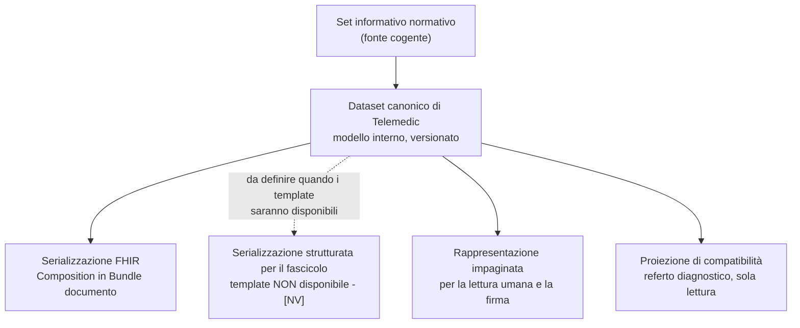
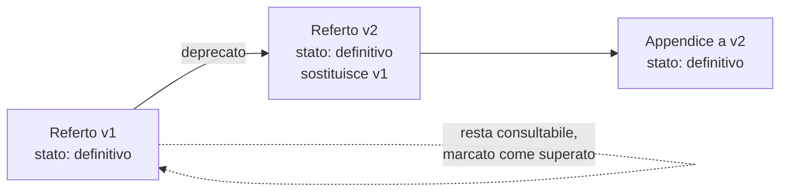

# Documenti clinici

Che cosa sia un documento clinico, che differenza ci sia fra documento e messaggio, come sia
fatto il ciclo di vita di un documento verso il fascicolo e chi siano gli attori istituzionali è
spiegato nei moduli [«Il dato clinico»](../10_fondamenti/03-il-dato-clinico.md) e
[«FSE e infrastrutture nazionali»](../10_fondamenti/07-fse-e-infrastrutture-nazionali.md).
Questo capitolo descrive **come Telemedic produce, firma, versiona e consegna** il contenuto
documentale.

## 1. Il principio che governa tutto il capitolo

> **Vincolo V-07.** Il contenuto informativo dei documenti destinati al fascicolo si modella
> come **dataset canonico**. Le serializzazioni - documento strutturato per il fascicolo,
> rappresentazione FHIR, rappresentazione impaginata - sono **sostituibili** e non vanno
> cablate.

Non è una preferenza architetturale: è la conseguenza obbligata di un fatto verificato. Il
decreto che ha istituito le tipologie documentali della telemedicina definisce **il set
informativo**, pubblicato in Gazzetta Ufficiale, ma **i template della serializzazione
strutturata, i codici di tipologia documentale e i metadati di indicizzazione per quelle dieci
tipologie non sono pubblicamente disponibili** alla data di redazione. Cablare oggi un template
significherebbe cablarne uno inventato.

Il principio ha tre conseguenze operative che ricorrono in tutto il capitolo:

1. **Il modello interno segue il set informativo normativo**, gruppo per gruppo e campo per
   campo, perché quello è la fonte cogente.
2. **Ogni serializzazione è un adattatore**, con un proprio collaudo bidirezionale e una propria
   dichiarazione di completezza: quali campi del dataset trova posto in quella forma e quali no.
3. **Le perdite di serializzazione sono documentate, mai silenziose.** Un campo del dataset che
   una serializzazione non sa esprimere è una perdita dichiarata, non un campo dimenticato.

## 2. Le tipologie documentali della telemedicina nel fascicolo

Il **DM 19 novembre 2025, art. 7, comma 1** aggiunge all'art. 3, comma 1 del **DM 7 settembre
2023** dieci nuove lettere, creando **dieci tipologie documentali del fascicolo dedicate alla
telemedicina**. L'Allegato 1 al decreto integra l'allegato del decreto precedente aggiungendo i
paragrafi che definiscono ciascun set informativo. Il termine di messa a regime dichiarato è il
**30 giugno 2026** (art. 7, comma 3).

| Lett. | Tipologia documentale | Paragrafo All. 1 | Prodotta da Telemedic |
|---|---|---|---|
| n) | Prescrizione di televisita, teleassistenza e telemonitoraggio | 2.18 | No - è a monte, e riusa i tracciati prescrittivi esistenti |
| o) | Richiesta di teleconsulto | 2.19 | Sì, quando il teleconsulto nasce nel sistema |
| p) | **Referto di specialistica per la televisita** | 2.20 | **Sì - è il documento principale** |
| q) | Relazione collaborativa per il teleconsulto o la teleconsulenza | 2.21 | Sì |
| r) | Relazione clinico-assistenziale conclusiva per teleassistenza e teleriabilitazione | 2.22 | Sì |
| s) | Tesserino dispositivi per il telemonitoraggio | 2.23 | Sì, con il limite di §8.3 |
| t) | Piano di telemonitoraggio, teleriabilitazione e teleassistenza | 2.24 | Sì |
| u) | Report rilevazioni telemonitoraggio | 2.25 | Sì |
| v) | Report settimanale rilevazioni telemonitoraggio | 2.26 | Sì |
| w) | Relazione finale per telemonitoraggio e teleriabilitazione | 2.27 | Sì |

**Correzione da recepire.** L'ipotesi che il referto di televisita andasse veicolato come referto
di specialistica ambulatoriale ordinario **è errata** e non va riproposta: esiste una tipologia
documentale propria, con un proprio set informativo pubblicato.

## 3. Il dataset canonico del referto di televisita

Il set informativo del paragrafo 2.20 è la fonte. Qui è riportato per gruppi, perché è così che
si traduce in modello dati. La formulazione segue la fonte; dove la fonte usa un termine tecnico
italiano, il termine è mantenuto.

**Gruppo A - Assistito.** Cognome; Nome; Codice identificativo, che può essere il codice fiscale
oppure uno dei codici per soggetti privi di codice fiscale; Sesso; Data di nascita; Comune di
nascita; Indirizzo, CAP, Comune, Provincia, Regione e Stato di residenza, con la descrizione del
comune; Indirizzo, CAP e Comune di domicilio; Recapito telefonico fisso e mobile; indirizzo di
posta elettronica; **indirizzo di posta elettronica certificata**.

**Gruppo B - Professionisti e struttura.** Cognome, nome e codice fiscale del **medico
refertante**; cognome, nome e codice fiscale del **medico firmatario**, che la fonte tiene
distinto dal refertante; codice e descrizione dell'azienda sanitaria, del presidio e dell'unità
operativa; numero di telefono dell'unità operativa, del centro di prenotazione o dell'azienda;
cognome, nome e codice fiscale di **altra figura tecnica coinvolta nell'esecuzione della
procedura**; cognome, nome e codice fiscale del **medico prescrittore**.

Che il medico refertante e il medico firmatario siano campi distinti non è un dettaglio: è la
distinzione fra chi ha redatto il contenuto e chi lo ha validato assumendone la responsabilità
giuridica, e si riflette direttamente sul modello di firma di §6.

**Gruppo C - Riferimenti amministrativi.** Numero della ricetta; **data di firma del referto**;
codice della prenotazione; **codici di identificazione di oggetti correlati**, che la fonte
esemplifica con gli identificativi degli archivi di immagini e degli studi radiologici; codice
nosologico; provenienza; **tipologia di accesso**, programmata o ad accesso diretto; disciplina
specialistica ambulatoriale; branca.

**Gruppo D - Contenuto clinico.** Codice e descrizione del quesito diagnostico, codificato con la
classificazione italiana delle malattie; anamnesi; allergie con le fonti dichiarate; precedenti
esami eseguiti, con codice, descrizione, metodica e data; codice del farmaco e descrizione della
terapia farmacologica in atto; esame obiettivo; codice e descrizione della prestazione eseguita;
**data e ora di inizio erogazione**; **data e ora di fine erogazione**; codice e descrizione
della **procedura operativa**; quantità; **modalità di esecuzione della procedura operativa**,
che la fonte definisce come «la declinazione pratica del come viene eseguita la procedura»;
**strumentazione utilizzata**; **parametri descrittivi della procedura**; note; confronto con
precedenti esami; **refertazione**, che la fonte qualifica come «oggetto principale del
referto»; codice e descrizione della diagnosi; conclusioni; suggerimenti per il medico
prescrittore; codice e descrizione dell'accertamento consigliato; codice e descrizione della
terapia farmacologica consigliata.

### 3.1 Il campo che manca, e dove il progetto lo colloca

Il tracciato **non contiene un campo esplicito per l'attestazione della qualità del collegamento
e della conferma di idoneità**, che l'accordo Stato-Regioni sulla telemedicina richiede al
professionista. È una lacuna reale del tracciato, non un'omissione di questa ricognizione.

I candidati naturali a veicolarla, all'interno del tracciato esistente, sono tre: **modalità di
esecuzione della procedura operativa**, **strumentazione utilizzata**, **parametri descrittivi
della procedura**. Analogamente, la presenza di un caregiver o di un secondo professionista
trova posto nel campo dedicato all'altra figura tecnica coinvolta e nelle note.

> **Decisione di mappatura aperta.** Dove si scrive l'evidenza normativamente obbligatoria della
> qualità del collegamento, dentro un tracciato ministeriale che non le riserva un campo, è una
> scelta che vincola il modello dati e la refertazione. Quest'area **propone** il campo dei
> parametri descrittivi della procedura come sede primaria, con la modalità di esecuzione a
> qualificare la natura sincrona e la presenza dell'assistito, e con la strumentazione utilizzata
> a riportare la piattaforma e la sua versione. La decisione formale spetta all'area di dominio
> in raccordo con quella di conformità, e va registrata come record di decisione architetturale.
>
> **Vincolo che quest'area pone comunque**: qualunque sia il campo scelto, il contenuto è
> **misurato dal sistema e presentato al professionista, che lo conferma**. Non è generato
> autonomamente e inserito nel referto senza atto del professionista: sarebbe informazione
> prodotta dal sistema dentro un documento clinico, in tensione diretta con il vincolo V2.

### 3.2 Il dataset è versionato

Il dataset canonico porta un numero di versione proprio, indipendente dalla versione del
software e dalla versione delle serializzazioni. Serve a rispondere a una domanda che in un
contenzioso viene sempre posta: **con quale struttura informativa è stato prodotto il documento
che l'assistito ha ricevuto in quella data?** Un dataset non versionato non consente di
rispondere.

## 4. Le serializzazioni

### 4.1 La serializzazione FHIR

È la serializzazione **oggi completa e collaudata**. Il referto è una `Composition` conforme al
profilo della guida italiana, dentro un `Bundle` di tipo documento.

Vincoli verificati del profilo:

- il tipo della composizione è **fissato** al codice `75496-0` del sistema `http://loinc.org`,
  la cui denominazione è *Telehealth Note*;
- il titolo è fissato a un modello;
- l'attestazione è `1..*` con una porzione obbligatoria in modalità **legale**;
- l'autore è `1..*` e punta al ruolo del professionista o all'organizzazione erogante;
- le sezioni sono `2..*`, con la sezione del referto **obbligatoria** in cardinalità `1..1`.

| Sezione | Card. | Codice | Contenuto |
|---|---|---|---|
| Quesito diagnostico | 0..1 | `29299-5` | Osservazione profilata |
| Inquadramento clinico iniziale | 0..1 | `11329-0` | Contenitore |
| ↳ Anamnesi | 0..1 | `11329-0` | Osservazione narrativa |
| ↳ Allergie | 0..* | `48765-2` | Intolleranza profilata |
| ↳ Terapia farmacologica in atto | 0..* | `10160-0` | Dichiarazione di terapia |
| ↳ Esame obiettivo | 0..1 | `29545-1` | Osservazione narrativa |
| Precedenti esami eseguiti | 0..1 | `30954-2` | Osservazione profilata |
| Confronto con precedenti esami | 0..1 | `93126-1` | Osservazione narrativa |
| **Referto** | **1..1** | **`47045-0`** | Osservazione profilata |

La classificazione delle sezioni è l'unica terminologia su cui il progetto può appoggiarsi senza
rischio di licenza: è disponibile gratuitamente per uso commerciale e non commerciale, con
obbligo di attribuzione e divieto di derivarne un altro vocabolario. Le **traduzioni** di quella
classificazione sono però derivati assegnati al suo titolare: le stringhe di interfaccia del
progetto sono **separate architetturalmente** dalle stringhe di visualizzazione ufficiali, e non
vengono usate le une al posto delle altre.

Il paradigma documentale impone tre proprietà che il progetto applica alla lettera:
l'identificativo del documento è globalmente univoco e **mai riusato**; una volta assemblato, il
documento **è immutabile**, e il suo contenuto non può più cambiare; le firme si applicano al
documento assemblato.

> **Da mettere in lavorazione:** la verifica di copertura **campo per campo** fra il set
> informativo del paragrafo 2.20 e il profilo della guida italiana non è stata eseguita. Il set
> informativo è la fonte cogente; il profilo è una rappresentazione. Dove il profilo non ha
> posto per un campo del set, serve un'estensione dichiarata o una collocazione motivata.
> **Da chiedere a**: area di dominio per la semantica, area di conformità per l'obbligatorietà.

### 4.2 La serializzazione strutturata per il fascicolo

> **`[NV]` - non disponibile pubblicamente.** Il template della serializzazione strutturata, i
> codici di tipologia documentale e i metadati di indicizzazione per le dieci tipologie della
> telemedicina **non sono stati reperiti su fonte pubblica**. È dichiarata pubblicata una nuova
> versione delle specifiche tecniche di interoperabilità fra i sistemi regionali del fascicolo,
> ma **non è stato accertato** che quella versione contenga già i template della telemedicina.
>
> **Da chiedere a**: area di conformità, che ha in carico la questione **Q-07** della bacheca.
> Il canale indicato è l'area tecnica del portale del fascicolo e, in subordine, una richiesta
> formale all'ente che gestisce l'infrastruttura nazionale di interoperabilità.
>
> **Fino ad allora il progetto non cabla alcun template.** L'adattatore esiste come punto di
> estensione con un contratto dichiarato - riceve il dataset canonico, produce un artefatto
> firmabile - e la sua implementazione concreta è rinviata. Questa non è una lacuna: è
> l'applicazione letterale del vincolo V-07.

### 4.3 La rappresentazione impaginata

Esiste una terza serializzazione, che non è opzionale: la rappresentazione destinata alla lettura
umana. È ciò che l'assistito riceve, è ciò che viene firmato in modo verificabile a occhio, ed è
ciò che vale in un contenzioso quando la rappresentazione strutturata e quella impaginata
divergono.

Regole di progetto:

- la rappresentazione impaginata è **generata dal dataset canonico**, mai redatta a parte;
- riporta **integralmente** il contenuto clinico del dataset: una rappresentazione impaginata che
  omette un campo presente nella forma strutturata è una divergenza fra ciò che l'assistito legge
  e ciò che il sistema comunica;
- la sua impronta crittografica è calcolata e conservata insieme al documento, così che
  l'identità fra ciò che è stato firmato e ciò che viene esibito sia dimostrabile;
- il formato di conservazione è idoneo alla conservazione a lungo termine. **`[NV]`** - il
  profilo esatto del formato e i requisiti del sistema di conservazione sono materia dell'area di
  conformità, non di quest'area.

### 4.4 La proiezione di compatibilità

Molti sistemi riceventi sanno consumare solo il referto in forma di rapporto diagnostico. Il
progetto la offre come **proiezione in sola lettura**, mai come artefatto primario: la parte
narrativa porta il testo redatto dal medico, l'allegato porta il documento firmato. **Nessun
campo di quella proiezione è mai popolato con testo generato dal sistema**: è il confine del
vincolo V2, e va verificato con una prova dedicata, non con una convenzione.

## 5. I metadati di indicizzazione

Un documento pubblicato verso un'infrastruttura di condivisione documentale porta due insiemi di
informazioni distinte: **il contenuto** e **i metadati che ne consentono il ritrovamento**.
Confonderli è un errore di modellazione con effetti pratici, perché i metadati sono visibili a
chi cerca prima di aver ottenuto l'accesso al contenuto: **un metadato troppo parlante è una
divulgazione**.

I metadati che il modello di condivisione documentale prevede, verificati sulla fonte del
framework tecnico, comprendono l'identificativo dell'assistito, gli istanti di inizio e fine
della prestazione, l'istante di creazione del documento, il codice e la descrizione della classe
documentale, il codice e la descrizione dell'ambito assistenziale, il codice e la descrizione del
tipo di struttura, lo stato di disponibilità e l'identificativo univoco del documento.

Regole di progetto sui metadati:

1. **Il livello di riservatezza è un metadato, e non è un valore predefinito.** Deriva dalla
   natura del contenuto e dalle scelte dell'assistito, non da una costante di configurazione.
2. **Nessun metadato porta contenuto clinico in chiaro.** La descrizione libera di un documento
   non contiene la diagnosi.
3. **L'identificativo univoco del documento è quello del dataset canonico**, non uno generato
   dalla serializzazione. È ciò che consente di correlare la stessa versione del documento
   attraverso serializzazioni diverse.
4. **Lo stato di disponibilità segue il ciclo di vita del documento**, compresa la
   deprecazione a seguito di una sostituzione (§7).

> **`[NV]` - codici di tipologia documentale e insiemi di valori dei metadati per le dieci
> tipologie della telemedicina.** Non reperiti su fonte pubblica, come già dichiarato in §4.2.
> Senza di essi il progetto **non può** pubblicare verso un'infrastruttura di condivisione
> documentale nazionale, perché produrrebbe metadati non riconosciuti. La pubblicazione verso il
> sistema di origine dell'integratore, che usa i propri codici, non è invece bloccata.
> **Da chiedere a**: area di conformità (Q-07).

## 6. La firma

### 6.1 Che cosa firma chi

La distinzione fra medico refertante e medico firmatario, presente nel set informativo, si
traduce in due ruoli distinti nel modello del documento:

| Ruolo | Nel dataset | Nella serializzazione FHIR | Significato |
|---|---|---|---|
| Chi redige | Medico refertante | Autore della composizione | Ha prodotto il contenuto clinico |
| Chi valida | Medico firmatario | Attestazione in modalità **legale** | Assume la responsabilità giuridica del documento |
| Chi custodisce | Struttura erogante | Custode | Conserva e risponde del documento |

L'attestazione in modalità legale è la porzione **obbligatoria** del profilo italiano, ed è il
segnale che il documento è definitivo. Un documento senza di essa non è un referto: è una bozza.

### 6.2 Il rapporto fra firma applicativa e firma qualificata

Sono due cose diverse e vanno tenute separate anche nel vocabolario, perché la confusione fra le
due è il difetto più frequente nelle implementazioni.

**La firma applicativa** è l'attestazione dentro la struttura del documento: dice chi ha
validato, quando, con quale ruolo. È leggibile da una macchina, è parte del contenuto, ed è ciò
che un sistema ricevente controlla per decidere se il documento è definitivo.

**La firma qualificata** è l'apposizione crittografica sull'artefatto, con un certificato
qualificato intestato a una persona fisica, e produce un artefatto firmato in un formato di
busta. È ciò che rende il documento opponibile.

Regole di progetto:

- **il documento è firmato dopo essere stato assemblato e reso immutabile**, mai prima. Firmare
  un contenuto ancora modificabile produce una firma su nulla;
- **l'oggetto della firma è l'artefatto completo**, non un suo estratto;
- la firma è **verificata al momento della ricezione** da parte di chi consuma, e la verifica
  comprende la validità del certificato **all'istante di apposizione**, non a quello di verifica;
- l'esito della verifica è registrato: un documento la cui firma non verifica non viene
  silenziosamente accettato né silenziosamente scartato.

> **`[NV]` - formati di busta di firma, requisiti del certificato e requisiti della marca
> temporale.** I formati ammessi per la firma di un documento destinato al fascicolo, e la
> disciplina della firma di conferimento apposta dall'infrastruttura, sono materia normativa
> puntuale che quest'area **non** ricostruisce a memoria. **Da chiedere a**: area di conformità e
> area di sicurezza. Il modulo
> [«FSE e infrastrutture nazionali», §4](../10_fondamenti/07-fse-e-infrastrutture-nazionali.md)
> descrive il ciclo di vita e i punti in cui le firme intervengono.

### 6.3 Il documento firmato è immutabile

È un invariante del progetto, non una raccomandazione: **il documento clinico firmato non si
modifica**. Non esiste un percorso, in nessuna interfaccia, che consenta di alterare il contenuto
di un documento firmato. Ciò che esiste è l'emissione di una **versione successiva** che
sostituisce o rettifica la precedente, mantenendo la catena.

Questo invariante è verificato con una prova esplicita, non affidato alla disciplina: una
richiesta di aggiornamento su un documento in stato definitivo riceve un errore con un codice del
catalogo che rinvia alla procedura di rettifica.

## 7. Versionamento e rettifica

### 7.1 Le tre operazioni possibili su un documento emesso

| Operazione | Quando | Effetto sul documento precedente | Relazione dichiarata |
|---|---|---|---|
| **Aggiunta** | Si aggiunge contenuto senza contraddire il precedente | Resta valido e disponibile | Il nuovo documento è un'appendice del precedente |
| **Sostituzione** | Il contenuto precedente è superato nel suo insieme | Passa a stato deprecato, resta consultabile | Il nuovo documento sostituisce il precedente |
| **Annullamento** | Il documento non doveva esistere: destinatario errato, prestazione non erogata | Passa a stato non più valido | Il documento è dichiarato erroneo |

Tre precisazioni che evitano errori:

**L'annullamento non è una cancellazione.** Il documento resta, con uno stato che ne dichiara
l'invalidità. Cancellarlo distruggerebbe la tracciabilità di un fatto che è avvenuto: che quel
documento è stato emesso e che qualcuno può averlo letto.

**La sostituzione non riscrive la storia.** Chi ha letto la versione precedente l'ha letta, e il
registro degli accessi lo dimostra. La versione precedente resta consultabile con il proprio
identificativo, marcata come superata.

**La catena non si spezza mai.** Ogni versione dichiara la propria relazione con quella che la
precede. Un documento che sostituisce un documento che a sua volta ne sostituiva un altro
mantiene la catena completa, e la catena è ricostruibile a ritroso in un'unica interrogazione.

### 7.2 Il segnale della rettifica verso l'esterno

La rettifica va **notificata**, non solo registrata. Un sistema di origine che ha già acquisito la
versione precedente nella propria cartella deve sapere che è stata superata, altrimenti continua
a esibire un documento superato a un professionista che prende decisioni. È uno dei casi in cui
il canale di notifica è un requisito di sicurezza clinica e non una comodità di integrazione: il
catalogo degli eventi del capitolo [07 §3](./07-eventi-e-webhook.md) prevede un tipo di evento
dedicato alla sostituzione e uno all'annullamento, ed entrambi sono classificati come eventi la
cui mancata consegna richiede escalation, non semplice archiviazione nella coda di scarto.

Nel canale legacy la stessa semantica esiste ed è nativa: la coppia identificativo univoco del
documento e identificativo del documento padre è il meccanismo delle sostituzioni, e i relativi
eventi di notifica sono distinti (capitolo [04 §4](./04-hl7-v2.md)).

## 8. Le altre tipologie documentali

### 8.1 Il teleconsulto non produce un referto autonomo, ma produce un documento

È una regola strutturale che va conosciuta perché è controintuitiva. La fonte è esplicita: la
relazione collaborativa **viene conferita al fascicolo come allegato del documento di referto**
relativo alla prestazione o all'evento principale, redatto dal professionista che ha richiesto la
consulenza.

Ne discendono due conseguenze di modellazione:

1. la relazione collaborativa è una **tipologia documentale autonoma** - non è vero che «il
   teleconsulto non produce nulla» - ma **non è autoportante**: esiste in relazione a un
   documento principale che non è prodotto da Telemedic quando il richiedente è esterno;
2. la correlazione con la richiesta di teleconsulto è portata da un identificativo dedicato, e
   il progetto lo tratta come identificativo esterno di prima classe, non come annotazione.

Il set informativo della relazione collaborativa comprende, oltre ai dati anagrafici e di
struttura, l'identificativo della richiesta, i dati del medico consultato, del medico firmatario
e del medico richiedente, il tipo di struttura richiedente e di struttura erogante, la data di
ricezione della richiesta, la data e ora di presa in carico, la data e ora di programmazione
della consulenza nel caso sincrono, la disciplina e la branca del medico consulente. E, campo
decisivo, la **modalità di esecuzione della procedura operativa**, che per il teleconsulto deve
indicare se è stato estemporaneo o programmato, sincrono o asincrono, con o senza la presenza
dell'assistito.

Quest'ultimo campo è la conferma che il tracciato normativo **prevede la qualificazione della
modalità**: è un argomento a favore della collocazione proposta in §3.1 per l'attestazione della
qualità del collegamento.

### 8.2 La richiesta di teleconsulto

La fonte stabilisce che la richiesta **viene generata internamente alle infrastrutture
regionali**, e che l'interoperabilità fra regioni diverse è garantita dall'infrastruttura
nazionale. Ne discende che, in un'installazione che opera dentro un'infrastruttura regionale,
Telemedic **non è** il generatore della richiesta ma il sistema che la riceve e la lavora. In
un'installazione presso un soggetto privato la richiesta nasce nel sistema, e il progetto la
modella comunque secondo il medesimo set informativo, perché è ciò che rende il documento
conferibile se e quando il contesto lo richiede.

Campi notevoli del set informativo: identificativo della richiesta; codice fiscale del medico
titolare e del medico sostituto; codici di regione, azienda e struttura; codice di
specializzazione; codici di esenzione; codice e descrizione della diagnosi; classe di priorità;
**proposta di slot temporale** per la presa in carico; **richiesta di disponibilità immediata**,
che la fonte dichiara compatibile solo con l'urgenza alta; i dati del medico consulente quando
sia richiesto uno specialista determinato; il **raggio di erogazione**, che la fonte declina in
aziendale, regionale o nazionale. La sezione delle prestazioni porta il codice del nomenclatore
nazionale e il codice del catalogo regionale unico.

Il campo del raggio di erogazione è quello che vincola l'architettura: implica una ricerca di
professionisti disponibili su un perimetro variabile, e quindi una directory di servizi
interrogabile, non un elenco locale.

### 8.3 Il tesserino dei dispositivi, e perché tocca il perimetro regolatorio

La fonte dichiara che è un documento **generato dalle infrastrutture regionali, prodotto e
firmato digitalmente dal professionista sanitario che assegna il dispositivo all'assistito**. Il
set informativo comprende denominazione, modello e tipologia del dispositivo; **l'identificazione
unica del dispositivo**, con la precisazione che usa un formato per identificazione automatica e
raccolta dei dati e un identificativo leggibile dall'uomo; numero di serie o di lotto; nome,
indirizzo e sito del fabbricante; patologia dell'assistito; data di impianto; istituzione che ha
effettuato l'assegnazione; tipo di collegamento; tipo di alimentazione; **esito della verifica
tecnica di funzionamento**; parametri tecnici del dispositivo, compresi connettività,
configurazione e taratura.

Questo documento è il punto in cui il perimetro di Telemedic si tocca con quello dei dispositivi
medici di terzi. **Il progetto registra e trasporta questi dati; non li produce, non li verifica
e non si assume responsabilità sulla catena di misura hardware.** L'esito della verifica tecnica
è un dato **inserito dal professionista**, non un giudizio del sistema. È l'applicazione diretta
del perimetro dichiarato per il telemonitoraggio e non è negoziabile.

### 8.4 Il piano di telemonitoraggio

Il set informativo comprende la tipologia di piano; codice, descrizione e tipologia delle
attività; **numero di cicli, durata del ciclo, numero di attività per ciclo**; **frequenza**, che
la fonte esemplifica con periodicità giornaliere e settimanali e con la possibilità di dichiarare
un monitoraggio non continuo; **fascia oraria**; **durata prevista del piano, con un massimo di
un anno**; indicazione di prima programmazione o riprogrammazione; identificativo unico del
dispositivo; parametri; **tipo di rilevazione**, distinto in intermediato e a ciclo chiuso;
**soglia di allarme**; **regole**, definite come testo descrittivo del comportamento in caso di
violazione delle soglie.

Due vincoli di progetto discendono direttamente da questo tracciato.

**Le soglie sono dati del piano, non costanti del software.** Il vincolo V-02 lo impone e il
tracciato lo conferma: soglia e regole sono campi del documento, valorizzati dal professionista.
Nessuna soglia clinica è cablata nel codice, e nessuna soglia è dedotta dal sistema.

**Il piano è versionato e la versione è opponibile.** La distinzione fra prima programmazione e
riprogrammazione è nel tracciato: significa che il documento del piano ha una storia, e che in
un contenzioso occorre poter dire quale versione del piano era vigente in un dato momento. Un
piano modificato in luogo, senza versione, non lo consente.

## 9. Conservazione e responsabilità

Un fatto verificato che cambia il modello di ritenzione: **le infrastrutture regionali per la
telemedicina non conservano il contenuto clinico**. Ne discende che, in un'installazione che
opera dentro quel contesto, la conservazione a norma non è compito di Telemedic e la
configurazione di ritenzione del progetto deve poterlo riflettere.

Regole di progetto:

- la durata di ritenzione è **configurazione per tenant**, mai una costante;
- esiste una configurazione, pienamente supportata, in cui Telemedic **non conserva** il
  documento oltre la finestra necessaria alla consegna e alla verifica di ricezione;
- il registro immutabile del fatto che il documento è stato prodotto, firmato e consegnato
  **sopravvive comunque** alla cancellazione del contenuto: sono due cose diverse, e la seconda
  non può dipendere dalla prima;
- la registrazione audiovisiva della sessione, quando esiste, ha una ritenzione **propria e
  distinta** da quella del referto, perché ha una base giuridica distinta - un consenso esplicito
  e revocabile - e va cancellata alla revoca anche quando il referto resta.

## 10. Che cosa il progetto non fa

| Non fa | Perché | Chi lo fa |
|---|---|---|
| Non appone la firma di conferimento all'infrastruttura nazionale | È un atto dell'infrastruttura, non del sistema che produce | L'infrastruttura di interoperabilità |
| Non decide le tipologie documentali né i loro set informativi | Sono stabiliti per decreto | Il ministero |
| Non genera contenuto clinico | Vincolo V2. Il documento è persistenza di ciò che il professionista ha redatto | Il professionista |
| Non giudica l'idoneità del collegamento | Misura e presenta; la conferma è un atto del professionista | Il professionista |
| Non conserva a norma per conto del titolare, se non configurato per farlo | La conservazione è un servizio con requisiti propri | Il sistema di conservazione del titolare |
| Non media l'accesso di un pagatore al fascicolo | È **sempre** escluso dalla norma. Il pagatore non è un consultatore | Nessuno: è vietato |

L'ultima riga è il vincolo V-08 e vale su ogni interfaccia del progetto, non solo su questa:
nessuna funzionalità del sistema può mediare l'accesso di una compagnia assicurativa al fascicolo,
né direttamente né per il tramite di un professionista.
