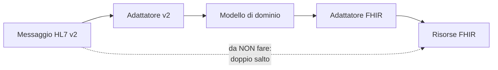

# HL7 v2

L'anatomia di un messaggio, i delimitatori, la logica dei segmenti e la ragione per cui uno
standard degli anni Ottanta regge ancora il traffico degli ospedali sono spiegati nel modulo
[«Gli standard di interoperabilità», §4](../10_fondamenti/05-standard-di-interoperabilita.md).
Questo capitolo descrive **che cosa Telemedic accetta, che cosa emette, su quale trasporto, con
quali riconoscimenti e come traduce**.

## 1. Il perimetro: un modulo separato, non una funzione del nucleo

Telemedic **non incorpora un motore di integrazione**. La capacità HL7 v2 è distribuita come
**modulo separato**, con una propria immagine di distribuzione e un proprio ciclo di vita, che
espone un ascoltatore protetto e traduce da e verso l'interfaccia interna.

Tre motivi, tutti vincolanti:

1. Il cliente tipico che parla v2 **ha già** un motore di integrazione in esercizio e governato.
   Chiedergli di installarne un secondo è chiedergli di duplicare una funzione.
2. Incorporare un motore di integrazione nel prodotto **allargherebbe il perimetro regolatorio**:
   diventerebbe software da qualificare, verificare e mantenere nel fascicolo tecnico.
3. La superficie di attacco di un ascoltatore su socket persistente è di natura diversa da quella
   di un'interfaccia HTTP, e va isolata anche a livello di processo e di rete.

Per chi ha già un motore di integrazione, il progetto fornisce **modelli di canale documentati**
invece dell'adattatore: la strada preferibile è che il cliente usi ciò che ha.

## 2. Le versioni dichiarate

| Ambito | Versione | Motivo |
|---|---|---|
| Schedulazione | **2.5.1** | È la versione in cui la struttura della schedulazione include il segmento di temporizzazione strutturata, assente nelle versioni precedenti alla 2.5 |
| Anagrafica e contatti | **2.5** | Base comune dei motori di integrazione italiani |
| Notifica documentale | **2.5** | Il segmento documentale ha in 2.5 i campi di completamento e disponibilità che servono |
| Segmento di errore | **2.5** | Differisce **radicalmente** dalla 2.3, dove un solo campo copriva tutto |

Un messaggio ricevuto con una versione dichiarata diversa da quelle supportate è **rifiutato con
un riconoscimento negativo esplicito**, con il codice di errore che dichiara la versione non
supportata. Non viene interpretato «a occhio»: un parser scritto per una versione che accetta
una versione diversa scarta silenziosamente i campi che non conosce, e in un flusso clinico un
campo scartato in silenzio è un difetto di sicurezza.

## 3. I messaggi supportati

| Messaggio | Direzione | Uso | Priorità |
|---|---|---|---|
| `SIU^S12` | in ingresso | Notifica di nuovo appuntamento | Alta |
| `SIU^S13` | in ingresso | Riprogrammazione dell'appuntamento | Alta |
| `SIU^S14` | in ingresso | Modifica dell'appuntamento | Alta |
| `SIU^S15` | in ingresso | Disdetta dell'appuntamento | Alta |
| `SIU^S17` | in ingresso | Eliminazione di un appuntamento erroneo | Media |
| `SIU^S26` | in ingresso | Mancata presentazione dell'assistito | Alta |
| `ADT^A04` | in ingresso | Registrazione ambulatoriale dell'assistito | Alta |
| `ADT^A08` | in ingresso | Aggiornamento dei dati dell'assistito | Alta |
| `ADT^A28` | in ingresso | Aggiunta di una persona o di un assistito | Media |
| `ADT^A31` | in ingresso | Aggiornamento dei dati di una persona | Media |
| `MDM^T02` | in uscita | Notifica documentale **con contenuto**: il referto | Alta |
| `MDM^T10` | in uscita | Notifica di sostituzione documentale con contenuto | Alta |
| `MDM^T11` | in uscita | Notifica di annullamento documentale | Alta |
| `ORU^R01` | in uscita | Esito in forma di osservazioni, alternativa al documento | Media |
| `ACK` | bidirezionale | Riconoscimento | - |

**Il messaggio di ricovero non è supportato in ingresso, ed è deliberato.** Il messaggio di
ammissione segnala l'inizio della degenza di un assistito in una struttura, con assegnazione di
un posto letto. Una prestazione ambulatoriale a distanza **non è un ricovero**: il trigger
corretto è quello di registrazione ambulatoriale, la cui definizione è «l'assistito è arrivato o
si è registrato come paziente ambulatoriale, occasionale o ricorrente, e non è assegnato a un
letto». È l'errore più ricorrente nelle integrazioni sanitarie e va rifiutato all'ingresso, non
tollerato.

## 4. La schedulazione, che è il messaggio che conta

### 4.1 La struttura, verificata

L'intestazione della struttura è `SIU^S12-S24, S26^SIU_S12`: **la stessa struttura vale per i
trigger da S12 a S24 e per S26**. Segmenti e ordine:

```
MSH          Intestazione del messaggio
SCH          Informazioni sull'attività pianificata
[ { TQ1 } ]  Temporizzazione e quantità
[ { NTE } ]  Note relative alla SCH
[{
  PID        Identificazione dell'assistito
  [ PD1 ]    Dati demografici aggiuntivi
  [ PV1 ]    Contatto
  [ PV2 ]    Informazioni aggiuntive sul contatto
  [ { OBX } ] Osservazioni
  [ { DG1 } ] Diagnosi
}]
{
  RGS        Gruppo di risorse
  [{ AIS [ { NTE } ] }]   Servizio
  [{ AIG [ { NTE } ] }]   Risorsa generica
  [{ AIL [ { NTE } ] }]   Risorsa di luogo
  [{ AIP [ { NTE } ] }]   Risorsa di personale
}
```

Cinque punti vincolano l'implementazione e sono tutti verificati:

1. **L'intestazione e il segmento dell'attività pianificata sono gli unici a cardinalità `1..1`**
   fuori dai gruppi.
2. **Il gruppo dell'assistito è opzionale e ripetibile.** Un messaggio valido può **non
   contenere** il segmento di identificazione. Un consumatore che ne assume la presenza è non
   conforme. Telemedic lo tratta come caso normale e risponde con un rifiuto applicativo motivato
   quando l'appuntamento non è collegabile a un assistito noto - non con un errore di parsing.
3. **Il gruppo delle risorse è obbligatorio e ripetibile** e inizia obbligatoriamente con il
   segmento di gruppo.
4. **Il segmento di temporizzazione è presente dalla 2.5.1**: un parser scritto su una versione
   precedente lo scarterebbe insieme all'informazione che porta.
5. **Il segmento delle note compare in cinque posizioni distinte con semantica diversa** - note
   dell'attività pianificata e note di ciascuna risorsa. Il parsing deve essere posizionale: una
   raccolta indiscriminata di tutti i segmenti di nota fonde informazioni che non hanno lo stesso
   significato.

### 4.2 Un messaggio in ingresso, con dati sintetici

```
MSH|^~\&|GESTIONALE|ORG-A|TELEMEDIC|TENANT-A|20260914073000||SIU^S12^SIU_S12|MSG00001|P|2.5.1|||AL|NE|ITA|UNICODE UTF-8
SCH|PLC-88213|FLR-99001||||TV^Televisita di controllo^L|Controllo programmato|TELEVISITA|30|min|^^^20260914100000^20260914103000
TQ1|1||||||20260914100000|20260914103000
PID|1||PZ-4471^^^GESTIONALE^MR||VERDI^GIULIA||19750312|F|||VIA ESEMPIO 10^^ROMA^RM^00100^ITA^H||^PRN^PH^^^06^5550000
PV1|1|O|||||||||||||||||VIS-2026-0000123
RGS|1|A|GRP-1
AIS|1|A|89.7^Visita di controllo^CATALOGO|20260914100000|||30|min
AIP|1|A|MED-0007^BIANCHI^ANNA|D^Medico||20260914100000|||30|min
AIL|1|A|VROOM-8f3a^^^TELEMEDIC^^^^^Stanza virtuale||||20260914100000|||30|min
```

Note sull'esempio, tutte pertinenti all'implementazione:

- il campo del tipo di paziente nel segmento di contatto vale `O`, cioè ambulatoriale. È il
  valore **verificato** sulla tabella corrispondente, il cui identificativo di sistema è
  `http://terminology.hl7.org/CodeSystem/v2-0004`;
- i campi 15 e 16 dell'intestazione governano la modalità di riconoscimento e sono commentati
  in §6;
- l'identificativo della risorsa di luogo veicola la stanza virtuale. **Non veicola credenziali**:
  l'accesso alla sessione si ottiene con una chiamata autenticata, mai da un campo di un
  messaggio che transita su un motore di integrazione e finisce nei suoi registri.

### 4.3 L'identificativo dell'assistito, e una convenzione che non esiste

La tabella dei tipi di identificatore **non contiene** un codice per il codice fiscale italiano.
Il concetto realmente presente ha come codice letterale `NNxxx`, con la definizione «identificativo
nazionale della persona, dove `xxx` è il codice di paese a tre lettere della tabella ISO 3166».
Applicando la regola di formazione, il valore per l'Italia è **`NNITA`**, che **non è enumerato**
come concetto: è generato dalla regola.

Va detto con precisione perché è un punto in cui la letteratura secondaria sbaglia
sistematicamente: **il codice `NN` da solo non è un codice di quella tabella**. Altre voci
astrattamente candidabili, verificate come esistenti, sono quelle per il codice fiscale
tributario, per il numero di sicurezza sociale, per l'identificativo nazionale univoco della
persona, oltre agli identificativi di paziente interno, di cartella clinica e di passaporto.

**Nessun profilo italiano pubblicato fissa il valore.** L'insieme di valori dei tipi di
identificatore della guida di riferimento include l'intero sistema di codifica, con centoquarantasette
concetti, e non ne seleziona alcuno come «codice fiscale». La scelta resta quindi
**contrattuale con l'integratore** e va scritta nel profilo di interfaccia concordato.

> **Raccomandazione di quest'area**, motivata: `NNITA`, perché conforme alla regola di formazione
> della tabella. Il codice tributario è la seconda scelta più diffusa ma semanticamente più
> debole. Qualunque sia il valore concordato, **il profilo di interfaccia lo dichiara
> esplicitamente per ciascun integratore**, e l'adattatore lo legge da configurazione: non è
> cablato.
>
> Questo punto è collegato alla questione **Q-06** ma **non coincide con essa**: qui si tratta
> del codice di tipo dentro un segmento v2, là dell'URI del sistema in una risorsa FHIR. La
> decisione su Q-06 non risolve automaticamente questa, e viceversa.

## 5. Il trasporto

### 5.1 I delimitatori del protocollo di incapsulamento

```
<SB> = 0x0B  (tabulazione verticale)
<EB> = 0x1C  (separatore di file)
<CR> = 0x0D  (ritorno a capo)

<SB> ...messaggio HL7 v2... <EB><CR>
```

I segmenti dentro il messaggio sono separati da `0x0D`, **non** da un carattere di avanzamento
riga. È l'errore di parsing più comune ed è la prima cosa che le prove del modulo verificano, con
un caso che inietta deliberatamente il separatore sbagliato.

> **`[NV]` - lettura diretta della specifica del protocollo di incapsulamento.** I valori
> esadecimali sopra riportati sono corroborati da fonti che citano la specifica, ma **la lettura
> diretta del documento normativo non è riuscita** in fase di ricerca. Prima di considerare
> definitiva l'implementazione va letto il documento originale, in particolare per la disciplina
> delle due release del protocollo: la seconda estende la prima con riconoscimenti di presa in
> carico a livello di trasporto. **Da chiedere a**: chi implementa il modulo, con acquisizione
> del documento normativo.
>
> La porta convenzionalmente usata **non è una porta registrata** presso l'autorità di
> assegnazione: nella pratica si usa una porta concordata. Il progetto non ne cabla alcuna e la
> legge da configurazione.

### 5.2 Il trasporto è protetto, sempre

**Il protocollo di incapsulamento nudo è testo in chiaro su una connessione persistente, senza
autenticazione.** Chiunque raggiunga la porta può iniettare messaggi clinici. Non esiste una
configurazione supportata in cui l'ascoltatore accetti connessioni non protette da rete non
fidata.

Regole del modulo, tutte vincolanti:

- incapsulamento in **TLS con autenticazione mutua** a certificato, che è esattamente ciò che
  richiede il profilo di autenticazione di nodo descritto nel capitolo [05](./05-ihe.md): non è
  un requisito in più, è lo stesso requisito visto dal lato dell'integrazione sanitaria;
- versione minima di TLS e insiemi di cifratura sono **configurazione di sicurezza**, definita
  dall'area di sicurezza e non da quest'area;
- l'identità di nodo del mittente è **verificata** e legata al tenant: un messaggio che arriva da
  un certificato non associato ad alcun tenant è rifiutato prima del parsing;
- ogni connessione accettata e ogni messaggio ricevuto generano un evento di tracciamento;
- in alternativa al TLS diretto è ammesso l'incapsulamento in un tunnel, purché l'identità di
  nodo resti verificabile e tracciata. Non è ammesso «è una rete privata, basta così».

## 6. I riconoscimenti

### 6.1 Le due modalità

**Modalità originale.** Il ricevente valida che il tipo di messaggio sia accettabile, che la
versione sia compatibile e che l'identificativo di elaborazione sia appropriato; il fallimento di
questa validazione produce un rifiuto. Se la validazione passa, l'applicazione elabora e produce
**accettazione**, **errore applicativo** o **rifiuto applicativo**.

**Modalità estesa.** Separa il riconoscimento di *presa in carico* da quello *applicativo*. Nella
fase di presa in carico, governata dal campo 15 dell'intestazione, il ricevente mette il messaggio
in archiviazione sicura e restituisce accettazione, rifiuto o errore di presa in carico. Nella
fase applicativa, governata dal campo 16, un messaggio separato porta l'esito dell'elaborazione.

I valori dei due campi sono «sempre», «mai» e «solo in caso di errore». La specifica osserva che
la modalità originale equivale a quella estesa con il campo 15 a «mai» e il campo 16 a «sempre».

**Scelta di Telemedic: modalità estesa, con presa in carico sempre e riconoscimento applicativo
solo su errore**, come configurazione predefinita. La motivazione è operativa: il mittente ha
bisogno di sapere subito che il messaggio è stato messo al sicuro - è ciò che gli consente di non
ritentare - mentre l'esito applicativo su un flusso di appuntamenti è rilevante solo quando
qualcosa non va. La configurazione è per integratore, perché alcuni motori di integrazione
richiedono il riconoscimento applicativo sempre.

### 6.2 Un riconoscimento di presa in carico

```
MSH|^~\&|TELEMEDIC|TENANT-A|GESTIONALE|ORG-A|20260914073001||ACK^S12^ACK|ACK00001|P|2.5.1
MSA|CA|MSG00001
```

### 6.3 Un errore applicativo

```
MSH|^~\&|TELEMEDIC|TENANT-A|GESTIONALE|ORG-A|20260914073001||ACK^S12^ACK|ACK00002|P|2.5.1
MSA|AE|MSG00001
ERR||PID^1^3|204^Unknown key identifier^HL70357|E|||L'identificativo dell'assistito non e' risolvibile nel tenant indicato
```

> **`AE` è un errore applicativo, non un rifiuto.** La distinzione conta perché guida il
> comportamento di chi riceve: `AE` segnala che il messaggio è stato accettato ed elaborato e
> che l'elaborazione è fallita - un ritentativo identico fallirà allo stesso modo, e ciò che
> serve è correggere il contenuto. `AR` segnala invece che il messaggio non è stato elaborato,
> tipicamente per una condizione del ricevente, e lì un ritentativo ha senso. Scambiare i due
> codici produce sistemi che ritentano all'infinito un messaggio che non potrà mai riuscire, o
> che scartano un messaggio che sarebbe passato al tentativo successivo.

## 7. Il segmento di errore, e che cosa se ne può dire

La struttura del segmento di errore nella 2.5 è verificata nella sequenza, nel nome degli
elementi, nel tipo di dato e nel numero di voce:

| SEQ | Tipo | Voce | Elemento | Tabella |
|---|---|---|---|---|
| ERR-1 | `ELD` | 00024 | Codice e posizione dell'errore | - (**mantenuto per retro-compatibilità**) |
| ERR-2 | `ERL` | 01812 | Posizione dell'errore | - |
| ERR-3 | `CWE` | 01813 | Codice di errore HL7 | **0357** |
| ERR-4 | `ID` | 01814 | Severità | **0516** |
| ERR-5 | `CWE` | 01815 | Codice di errore applicativo | tabella definita dall'utente |
| ERR-6 | `ST` | 01816 | Parametro dell'errore applicativo | - |
| ERR-7 | `TX` | 01817 | Informazione diagnostica | - |
| ERR-8 | `TX` | 01818 | Messaggio per l'utente | - |
| ERR-9 | `IS` | 01819 | Indicatore di persona da informare | **0517** |
| ERR-10 | `CWE` | 01820 | Tipo di deroga | **0518** |
| ERR-11 | `CWE` | 01821 | Motivo della deroga | 0519 |
| ERR-12 | `XTN` | 01822 | Recapito dell'assistenza | - |

**Il fatto rilevante per l'implementazione**: nella 2.5 il primo campo è marcato come mantenuto
per retro-compatibilità, e i campi utili sono il secondo - posizione strutturata dell'errore - e
il terzo, codificato sulla tabella dei codici di condizione di errore. Un adattatore scritto sulla
2.3, dove il primo campo era l'unico esistente, produce segmenti che il ricevente moderno
interpreta male.

> **`[NV]` - lunghezze, obbligatorietà e ripetibilità dei campi del segmento di errore.** Tre
> estrazioni indipendenti della stessa fonte hanno prodotto valori mutuamente incompatibili per
> le colonne di lunghezza e di obbligatorietà. **Non sono pubblicabili** e non compaiono in
> questa tabella. Vanno letti sul documento normativo della versione, capitolo 2, tabella degli
> attributi del segmento, oppure sulla base dati ufficiale delle tabelle. **Da chiedere a**: chi
> implementa il modulo, con acquisizione del documento normativo. Il numero della tabella
> associata all'undicesimo campo è dedotto per esclusione e **non verificato**.

### 7.1 I codici di errore usati

Dalla tabella dei codici di condizione di errore, il cui identificativo di sistema è
`http://terminology.hl7.org/CodeSystem/v2-0357`, il modulo usa:

| Codice | Denominazione | Quando Telemedic lo emette |
|---|---|---|
| `100` | Segment sequence error | Segmenti fuori ordine o segmento obbligatorio assente |
| `101` | Required field missing | Campo obbligatorio non valorizzato |
| `102` | Data type error | Campo con dato del tipo sbagliato |
| `103` | Table value not found | Valore non presente nella tabella corrispondente |
| `104` | Value too long | Valore oltre la lunghezza ammessa |
| `198` | Non-Conformant Cardinality | Cardinalità non conforme |
| `199` | Other HL7 Error | Altro errore di sintassi |
| `200` | Unsupported message type | Tipo di messaggio non supportato |
| `201` | Unsupported event code | Evento non supportato |
| `203` | Unsupported version id | **Versione non supportata** - vedi §2 |
| `204` | Unknown key identifier | Assistito, appuntamento o documento non risolvibile |
| `205` | Duplicate key identifier | Identificativo già esistente |
| `206` | Application record locked | Operazione non eseguibile per contesa |
| `207` | Application error | Errore interno, categoria residuale |

Le tabelle di severità, di persona da informare e di tipo di deroga sono verificate: la severità
ammette avviso, informazione, errore ed errore fatale; l'indicatore di persona da informare
ammette informare l'assistito, non informarlo, informare l'utente, informare l'assistenza; il
tipo di deroga ammette deroga di estensione, di intervallo e di equivalenza.

**Regola di progetto sul contenuto testuale dei campi di errore**: il messaggio destinato
all'utente e l'informazione diagnostica **non contengono mai contenuto clinico né identificativi
diretti**. Finiscono nei registri del motore di integrazione del partner, che è un sistema di cui
Telemedic non controlla la protezione.

## 8. La traduzione verso il modello canonico

### 8.1 Il riferimento di mappatura, e il suo stato

Esiste una guida ufficiale di mappatura da HL7 v2 verso FHIR, alla versione **1.0.0**, generata il
7 ottobre 2025, che copre **tredici mappe a livello di messaggio** e **settantasette a livello di
segmento**, organizzate su quattro livelli: messaggio, segmento, tipo di dato, vocabolario.

**Tutte le mappe hanno stato *Informative*.** Non sono normative e **non possono essere dichiarate
come conformità**. Il progetto le usa come riferimento e documenta ogni deviazione.

Le mappe pertinenti al dominio di Telemedic e verificate come esistenti: il segmento dell'attività
pianificata verso appuntamento, provenienza e richiesta di servizio; il segmento del servizio
verso appuntamento e richiesta di servizio; i segmenti delle risorse verso appuntamento; il
segmento delle note verso appuntamento; il segmento di identificazione verso assistito, conto e
appuntamento; il segmento di contatto verso contatto assistenziale, copertura e assistito; il
segmento documentale verso riferimento documentale e provenienza; il segmento di osservazione
verso osservazione e riferimento documentale; l'intestazione verso raccolta, intestazione di
messaggio e contatto assistenziale.

**Non esiste una mappa per il segmento di errore.** La traduzione degli errori v2 verso l'esito di
operazione FHIR è quindi **interamente a carico dell'implementazione, senza copertura normativa**.
Il progetto la realizza attraverso il proprio catalogo unico di codici di errore, che è la sola
via per mantenere coerenza fra i tre piani.

### 8.2 La regola del salto singolo

**L'adattatore traduce da v2 direttamente verso il modello di dominio**, non verso risorse FHIR
che poi vengono ritradotte. Un doppio salto moltiplica le perdite di informazione, perché ogni
passaggio ha i propri campi senza destinazione, e rende impossibile attribuire una perdita al
punto in cui è avvenuta.



### 8.3 Il messaggio originale si conserva

**Il messaggio ricevuto viene conservato integralmente**, associato al tracciamento, per una
durata configurabile. In caso di contestazione clinica ciò che conta è **ciò che è stato
ricevuto**, non la sua interpretazione. Un sistema che conserva solo il risultato della
traduzione non può dimostrare di aver ricevuto ciò che sostiene di aver ricevuto.

Il messaggio conservato è protetto come contenuto clinico, perché lo è: contiene dati
identificativi e, nei messaggi di esito, contenuto sanitario.

### 8.4 Le perdite di mappatura sono dichiarate

Per ciascun messaggio supportato il modulo pubblica una **tabella di copertura**: quali campi
hanno una destinazione nel modello di dominio, quali sono conservati come dato grezzo associato al
messaggio originale, quali sono **deliberatamente scartati** e con quale motivazione.

**Un mapping silenzioso che scarta dati è un difetto di sicurezza clinica.** La tabella di
copertura è generata dalla stessa definizione che guida l'adattatore, così che non possa divergere
dal comportamento reale, ed è parte del contratto verso l'integratore.

Quando un campo obbligatorio per il modello di dominio manca nel messaggio, il modulo **non
inventa un valore predefinito**: risponde con un rifiuto applicativo che indica la posizione
strutturata del campo mancante. È il vincolo V-09 applicato a questo canale: l'assenza di dato è
informazione, e il silenzio non è normalità.

## 9. Quando non usare questo canale

| Situazione | Perché no | Che cosa usare |
|---|---|---|
| L'integratore è nativo del web e non ha un motore di integrazione | Gli si chiederebbe di costruire da zero competenza su un formato posizionale fragile | Piano applicativo REST o facciata FHIR |
| Servono operazioni sincrone con risposta strutturata ricca | Il formato è orientato alla notifica; le interrogazioni sono macchinose | Ricerca FHIR o interfaccia applicativa |
| Serve trasportare contenuto binario di dimensione rilevante | I segmenti di osservazione con dato incapsulato sono impraticabili per contenuti grandi | Riferimento documentale con contenuto binario, o pubblicazione documentale (capitolo [05](./05-ihe.md)) |
| L'integrazione attraversa la rete pubblica | Il protocollo non ha autenticazione né cifratura native, e la configurazione del loro innesto è fragile | Facciata FHIR su HTTPS con autorizzazione |
| Servono garanzie di consegna e di rigioco documentate | Il riconoscimento copre il singolo messaggio; non esiste un modello standard di coda di scarto e di rigioco | Webhook con coda di scarto e rigioco (capitolo [07](./07-eventi-e-webhook.md)) |
