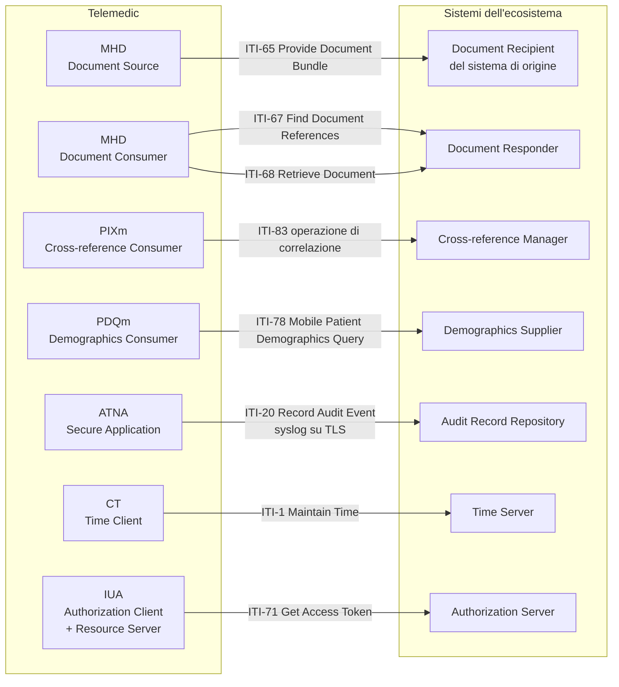

# IHE

Che cosa siano attori, transazioni e profili di integrazione, come si legga la sigla di una
transazione e perché IHE non sia «un altro standard» è spiegato nel modulo
[«Gli standard di interoperabilità», §6](../10_fondamenti/05-standard-di-interoperabilita.md).
Questo capitolo dichiara **quali attori Telemedic implementa, con quali transazioni, in quale
revisione, e a quali condizioni sono attivi**.

## 1. Il principio: i profili non aggiungono API, le vincolano

I profili non introducono un'interfaccia nuova accanto a quelle dei capitoli precedenti:
**stabiliscono quali transazioni, con quali attori e con quali vincoli di sicurezza** una
capacità già esistente deve rispettare quando l'interlocutore lo richiede. La pubblicazione di un
documento è la stessa operazione, indipendentemente dal fatto che venga chiamata «pubblicazione
del referto» o con il numero della transazione: cambia il contratto che la governa.

Ne discende una regola di attivazione: **i profili sono attivabili per tenant, non obbligatori**.
Un esportatore di eventi di tracciamento verso un archivio che non esiste è un esportatore verso
il nulla; un attore di pubblicazione documentale senza infrastruttura di condivisione a valle
produce metadati per un registro inesistente. Ciò che è **sempre attivo** è il modello interno che
li rende attivabili: un unico modello di tracciamento serializzabile in due forme, un unico
modello documentale serializzabile in più forme.

## 2. Il quadro d'insieme

Ogni freccia è una transazione, ogni riquadro è un attore. Telemedic implementa la colonna di
sinistra. Un integratore che voglia collegarsi deve implementare almeno gli attori corrispondenti
nella colonna di destra per le funzioni che gli interessano.

## 3. La tabella normativa degli attori

| Profilo | Revisione fissata | Stato | Attore implementato | Transazioni | Attivazione |
|---|---|---|---|---|---|
| **ATNA** | ITI TF rev. **20.2** (11 novembre 2025) | Final Text | Secure Application | **ITI-19**, **ITI-20** | Raccomandata sempre; obbligatoria in contesto pubblico |
| **CT** | ITI TF rev. **20.2** | Final Text | Time Client | **ITI-1** | **Sempre**: è prerequisito di ATNA |
| **MHD** | **4.2.5-comment** (16 giugno 2026) | *ballot*, **non Final Text** | Document Source | **ITI-65** | Per tenant, se esiste un destinatario |
| **MHD** | **4.2.5-comment** | *ballot* | Document Consumer | **ITI-67**, **ITI-68** | Per tenant, se serve leggere documenti preesistenti |
| **PIXm** | **3.1.0** (4 novembre 2025) | Trial Implementation | Patient Identifier Cross-reference Consumer | **ITI-83** | Per tenant, se esistono più domini di identificazione |
| **PDQm** | **3.2.0** (4 novembre 2025) | Trial Implementation | Patient Demographics Consumer | **ITI-78** | Per tenant, con i limiti di §7 |
| **IUA** | rev. **2.5** (18 giugno 2026) | Trial Implementation | Authorization Client, Resource Server | **ITI-71**, **ITI-72**, **ITI-102**, **ITI-103** | Profilazione documentale su quanto già implementato |
| **BALP** | **1.1.4** (31 ottobre 2025) | Trial Implementation | *content profile* | — | Forma degli eventi prodotti da ATNA |
| **XUA** | — | — | **Nessuno** | — | Fuori perimetro, vedi §9 |
| **XDS.b** | — | — | **Nessuno** | — | Fuori perimetro, vedi §9 |

Due righe portano un'avvertenza esplicita che va ripetuta a chi integra.

**La revisione del profilo documentale è in commento pubblico, non testo definitivo.** Il progetto
lo dichiara invece di lasciar intendere una stabilità che non c'è. Ne discende che la versione è
fissata, che il ricontrollo è programmato e che una modifica del profilo alla pubblicazione
definitiva è un evento previsto, non un incidente.

**Tre profili su otto sono in *Trial Implementation*.** Fissare la revisione non è
un'ottimizzazione: è la condizione perché due installazioni dello stesso software si comportino
allo stesso modo.

## 4. Tracciamento e autenticazione di nodo

È il profilo con la rilevanza più alta, perché è quello che dà forma standard al vincolo V5.

### 4.1 Gli attori e la scelta di Telemedic

Il profilo definisce quattro attori: un nodo sicuro, che garantisce la sicurezza sull'intero
stack «dall'hardware fino all'interfaccia utente e alla comunicazione esterna»; un'applicazione
sicura, che garantisce la sicurezza a livello applicativo con controllo solo sugli attori
raggruppati e non sull'ambiente sottostante; un archivio dei record di tracciamento; un
inoltratore che filtra e instrada selettivamente.

**Telemedic implementa l'applicazione sicura, non il nodo sicuro.** La ragione è onesta: il
progetto distribuisce software, non controlla il sistema operativo, la configurazione della rete
e l'accesso fisico dell'installazione presso il cliente. Dichiararsi nodo sicuro significherebbe
dichiarare garanzie su un ambiente che non si governa. La distinzione va scritta nella
dichiarazione di integrazione, perché è esattamente ciò che un capitolato verifica.

### 4.2 Il formato e il trasporto

Il formato del messaggio è quello definito dall'allegato A.5 della parte 15 dello standard di
imaging: schema XML estensibile, con retro-compatibilità verso il formato provvisorio precedente.
Gli elementi obbligatori sono l'identificazione dell'evento, il partecipante attivo, l'oggetto
partecipante e la sorgente del tracciamento; i campi obbligatori comprendono l'identificativo
dell'evento, il codice dell'azione, l'istante, l'indicatore di esito, l'identificativo
dell'oggetto e l'identificazione dell'utente. **Per gli eventi di divulgazione la finalità d'uso
diventa obbligatoria**: è la base giuridica della comunicazione, e senza di essa il record non
documenta ciò che deve documentare.

Il trasporto è syslog, in due varianti:

| Variante | Documento | Scelta di Telemedic |
|---|---|---|
| Syslog su TLS | **RFC 5425** | **Unica variante supportata** |
| Syslog su UDP | **RFC 5426** | **Esclusa** |

L'esclusione della variante non affidabile è motivata e non è una preferenza: la specifica stessa
avverte che il trasporto **può troncare i messaggi oltre 1024 byte** e che l'archivio deve
accettare i frammenti conservandoli per quanto possibile. Per un sistema sanitario un registro di
tracciamento troncato o con buchi non rilevabili **non è un registro**: è una fonte di falsa
sicurezza. Almeno una delle due varianti deve essere supportata per conformità; il progetto ne
supporta una, e dichiara quale e perché.

Il protocollo di base è definito da **RFC 5424**, con priorità corrispondente e con
l'identificativo di messaggio fissato dal profilo.

### 4.3 L'autenticazione di nodo

L'autenticazione macchina a macchina avviene con certificati X.509 e mutua autenticazione. Il
profilo definisce un'opzione che vincola a **TLS 1.2 o superiore** con insiemi di cifratura
selezionati, e un'opzione di validazione del nome del server che applica **RFC 6125** quando il
client autentica il server, richiedendo una voce di nome alternativo del soggetto di tipo DNS.
Nei contesti sanitari è ammesso il confronto diretto dei certificati o modelli di catena di
fiducia propri, invece delle autorità di certificazione preinstallate nei browser.

Questo requisito **coincide** con quello posto dal capitolo [04](./04-hl7-v2.md) per il canale
legacy e con l'opzione di autenticazione mutua del canale applicativo: è lo stesso requisito
visto da tre lati, e va implementato una volta sola.

### 4.4 La forma degli eventi

Gli schemi da usare sono quelli del profilo di contenuto dedicato, alla versione **1.1.4**, su
base R4. Definisce dieci schemi per le operazioni REST — creazione, lettura, aggiornamento,
cancellazione e interrogazione, ciascuna in **due varianti**, con e senza assistito identificato
— più due schemi per la **comunicazione di dati a terzi**, uno dal lato di chi comunica e uno dal
lato di chi riceve, e sei schemi per l'autorizzazione, che coprono il token opaco, il token del
profilo di autorizzazione, il token in forma di asserzione nelle varianti completa e minimale, e
la decisione di autorizzazione.

**I due schemi di comunicazione a terzi sono esattamente quelli che servono quando il referto
viene restituito al sistema di origine.** Restituire un referto è una comunicazione di dati
sanitari a un altro titolare, e va tracciata come tale, con la finalità dichiarata. Non è una
lettura, e registrarla come lettura sarebbe una descrizione falsa di ciò che è avvenuto.

### 4.5 Un unico modello interno, due serializzazioni

La risorsa FHIR di tracciamento è il modello informativo derivato dallo stesso allegato dello
standard di imaging, gestito congiuntamente dai tre enti. Ne discende la scelta di progetto:
**un unico modello di tracciamento interno**, serializzabile sia come risorsa FHIR, per
l'esposizione in sola lettura sulla facciata, sia nel formato XML previsto dalla transazione, per
l'invio all'archivio del cliente.

Va detto che **nessuna delle due serializzazioni è il registro immutabile**. Il registro
immutabile richiesto dal vincolo V-04 è append-only con catena di hash e conservazione separata
dal sistema che genera gli eventi. Queste sono forme di esportazione. Confonderle è l'errore che
il vincolo V-04 esiste per impedire.

## 5. Tempo coerente

Attori: server del tempo e client del tempo. Transazione: **ITI-1**. Il profilo richiede l'uso del
protocollo di sincronizzazione oraria definito da **RFC 1305** — la specifica cita quel documento —
con l'ammissione della variante semplificata per certi client non raggruppati con un server.
L'accuratezza richiesta è un **errore mediano inferiore a un secondo**, che il profilo qualifica
come sufficiente per la maggior parte degli scopi.

**Perché è prerequisito e non contorno.** Senza sincronizzazione oraria fra i nodi, i registri di
tracciamento di sistemi diversi non sono correlabili e non sono opponibili. L'intervallo temporale
di una prestazione registrato da un nodo con orologio derivato non è utilizzabile in un
contenzioso. E l'intervallo temporale di una prestazione è un dato del set informativo del
referto, con data e ora di inizio e di fine erogazione fra i campi obbligatori: non è un
metadato tecnico, è contenuto documentale.

**Conseguenza di distribuzione, da documentare come requisito di installazione**: in
un'installazione basata su contenitori la sincronizzazione oraria è responsabilità dell'host. Il
progetto la verifica all'avvio e **rifiuta di avviarsi**, o si avvia in stato degradato dichiarato,
se lo scarto misurato supera la soglia. Non la dà per scontata.

## 6. Correlazione degli identificativi

Telemedic è **consumatore**, mai gestore della correlazione. È la traduzione operativa del
principio per cui il progetto non diventa l'anagrafe di riferimento.

L'operazione è invocata sull'endpoint `[base]/Patient/$ihe-pix`, con i parametri verificati:

| Direzione | Parametro | Card. | Tipo | Contenuto |
|---|---|---|---|---|
| ingresso | `sourceIdentifier` | 1..1 | token | L'identificativo che il gestore userà per trovare le corrispondenze, nella forma dominio e valore separati da barra verticale |
| ingresso | `targetSystem` | 0..* | uri | I domini da cui devono provenire gli identificativi restituiti |
| ingresso | `_format` | 0..1 | token | Formato richiesto per la risposta |
| uscita | `targetIdentifier` | 0..* | Identifier | L'identificativo trovato, comprensivo dell'autorità che lo assegna |
| uscita | `targetId` | 0..* | Reference | L'indirizzo della risorsa dell'assistito |

Il profilo definisce anche una transazione di alimentazione degli identificativi, che Telemedic
**non implementa**: alimentare un gestore di correlazione significherebbe diventare una sorgente
autoritativa di identità, che è precisamente ciò che il progetto ha deciso di non essere.

**Quando non usarlo.** Con un solo dominio di identificazione non c'è nulla da correlare. Quando
l'integratore passa già entrambi gli identificativi nella chiamata, l'interrogazione è un
viaggio di andata e ritorno inutile: il progetto la evita e usa ciò che ha ricevuto.

## 7. Interrogazione demografica

I parametri di ricerca ammessi sulla risorsa dell'assistito sono **quattordici**, verificati:
`_id`, `active`, `family`, `given`, `identifier`, `telecom`, `birthdate`, `address`,
`address-city`, `address-country`, `address-postalcode`, `address-state`, `gender`,
`mothersMaidenName`.

> **Nota tipografica da copiare esattamente**: `mothersMaidenName` è l'unico parametro
> dell'elenco scritto in *camelCase*. Scriverlo con i trattini produce un parametro sconosciuto,
> che con la gestione stretta del capitolo [02 §5.1](./02-fhir.md) è un errore.

La regola di conformità: il consumatore **MAY** fornire i parametri, il fornitore **SHALL** essere
in grado di elaborarli tutti, e deve supportare almeno le combinazioni di cognome con sesso e di
data di nascita con cognome.

**Telemedic è consumatore, non fornitore.** Non espone un'interrogazione demografica verso
l'esterno, ed è una decisione di sicurezza dichiarata: **un'interrogazione demografica aperta su
una base pazienti è una superficie di enumerazione**. Se un giorno il progetto dovesse esporre
quel ruolo, le condizioni sarebbero tre e non negoziabili: restrizione al tenant applicata prima
della costruzione della ricerca, soglia massima di risultati con rifiuto esplicito oltre la
soglia, evento di tracciamento per ogni interrogazione con la finalità dichiarata.

**Quando non usarlo come consumatore.** Quando l'appuntamento arriva già con l'identificativo
dell'assistito. Il profilo serve a *trovare* una persona di cui non si conosce l'identificativo;
per recuperarne i dati quando l'identificativo è noto bastano una lettura o una ricerca per
identificativo.

## 8. Pubblicazione e recupero di documenti

Il profilo fornisce «un'unica interfaccia standardizzata alla condivisione di documenti sanitari»
per ambienti a risorse limitate, semplificando i protocolli della generazione precedente. Le
risorse FHIR coinvolte sono il riferimento documentale, l'elenco, il contenuto binario e la
raccolta.

| Transazione | Nome | Ruolo di Telemedic |
|---|---|---|
| **ITI-65** | Provide Document Bundle | **Sorgente.** Pubblica il referto verso il destinatario del sistema di origine |
| ITI-66 | Find Document Lists | Non implementata |
| **ITI-67** | Find Document References | **Consumatore**, quando serve leggere documenti preesistenti |
| **ITI-68** | Retrieve Document | **Consumatore** |
| ITI-105 | Simplified Publish | Non implementata in v1.0 |
| ITI-106 | Generate Metadata | Non implementata in v1.0 |

La transazione di pubblicazione è **la risposta al requisito che il contenuto clinico confluisca
nella cartella del sistema chiamante** invece di restare confinato in Telemedic. Il referto,
serializzato come documento e indicizzato dal proprio riferimento documentale, viene pubblicato
verso il destinatario dell'integratore.

Due condizioni bloccano oggi la pubblicazione verso un'infrastruttura **nazionale** di
condivisione, e sono dichiarate nel capitolo [03 §5](./03-documenti-clinici.md): i codici di
tipologia documentale e gli insiemi di valori dei metadati per le tipologie della telemedicina
non sono pubblicamente disponibili. La pubblicazione verso il sistema di origine
dell'integratore, che usa i propri codici concordati, non è invece bloccata.

**Quando non usarlo.** Quando lo scambio è punto a punto con un solo integratore: un riferimento
documentale FHIR semplice basta, e il profilo aggiunge vincoli di metadati ereditati dalla
generazione precedente che nessuno consumerà. Quando non esiste un'infrastruttura di condivisione
a valle: si produrrebbero metadati per un registro che non c'è.

## 9. I due profili esclusi, e perché

### 9.1 La condivisione documentale della generazione precedente

Esiste un profilo più antico per la condivisione documentale, basato su una pila tecnologica
interamente diversa: buste XML su un protocollo di servizi web, un registro di metadati con un
proprio modello dati e un proprio linguaggio di interrogazione, un meccanismo di ottimizzazione
del binario e un'estensione di indirizzamento per le operazioni asincrone.

**Non è la scelta corretta come interfaccia primaria di un progetto nuovo del 2026.** Introduce
una pila tecnologica estranea al resto del sistema, con il proprio costo di implementazione, di
collaudo, di qualificazione dei componenti di terze parti e di manutenzione. Il profilo mobile
espone la stessa semantica su FHIR REST, e i sistemi che parlano solo il protocollo più antico si
raggiungono tramite un gateway di conversione. Se un integratore lo richiede, **si valuta il
gateway, non la reimplementazione**.

### 9.2 L'asserzione di identità fra imprese in forma di busta XML

Il profilo che comunica claim su un principale autenticato attraverso i confini di impresa usa
un'intestazione di sicurezza dei servizi web con un token di asserzione. Ha due opzioni
rilevanti — ruolo del soggetto, riferimento al consenso, finalità d'uso — e richiede il
raggruppamento con il profilo di tracciamento.

**È fuori perimetro.** Serve nel mondo dei servizi web basati su buste XML, e introdurre quella
pila nel nucleo del prodotto per un requisito ipotetico sarebbe un errore. Se un cliente lo
impone, si realizza come **adattatore separato**, con lo stesso criterio del modulo per il canale
legacy.

## 10. Autorizzazione in contesto IHE

Il profilo di autorizzazione definisce tre attori — client di autorizzazione, server di
autorizzazione, server di risorse — e quattro transazioni: ottenimento del token, incorporazione
del token in una transazione, introspezione del token, ottenimento dei metadati del server di
autorizzazione. Il quadro di riferimento è **OAuth 2.1**, con due tipi di concessione profilati:
codice di autorizzazione e credenziali del client. I claim richiesti sono `iss`, `sub`,
`client_id`, `aud`, `exp`, `scope`, `jti`; estensioni facoltative raccolgono organizzazione, ruoli
e finalità d'uso in un oggetto dedicato.

Il rapporto con il profilo di avvio applicativo è dichiarato dalla specifica in modo esplicito:

> *«IUA is not based on SMART-on-FHIR, but does strive to not conflict with that standard.»*

**I due profili non sono alternative equivalenti**, ma poiché entrambi profilano lo stesso
protocollo di autorizzazione, **l'implementazione sottostante è la stessa**: cambia la
documentazione di conformità. La scelta di progetto è quindi economica e difendibile:
implementare il profilo di avvio applicativo, che è quello che gli integratori privati
conoscono, e **documentare la corrispondenza** verso il profilo di autorizzazione IHE, così da
poter rispondere a un capitolato pubblico senza riscrivere nulla. La tabella di corrispondenza è
nel capitolo [08 §7](./08-identita-e-autorizzazione.md).

## 11. La dichiarazione di integrazione

Per ciascun attore implementato il progetto pubblica una **dichiarazione di integrazione**, nella
forma prevista dall'appendice dedicata dell'introduzione generale del framework, che riporta:
il profilo, la revisione, l'attore, le opzioni supportate, quelle non supportate e le deviazioni.

La dichiarazione è **generata dalla configurazione** e verificata in integrazione continua, non
scritta a mano. È l'unico modo perché resti vera dopo il terzo rilascio, ed è il documento che un
capitolato pubblico chiede per primo.

Tre affermazioni che la dichiarazione contiene e che vanno lette senza attenuazioni: Telemedic
implementa l'**applicazione sicura**, non il nodo sicuro; supporta il trasporto affidabile del
tracciamento e **non** quello non affidabile; adotta profili in revisione **non definitiva** per
tre voci su otto, e le fissa.
