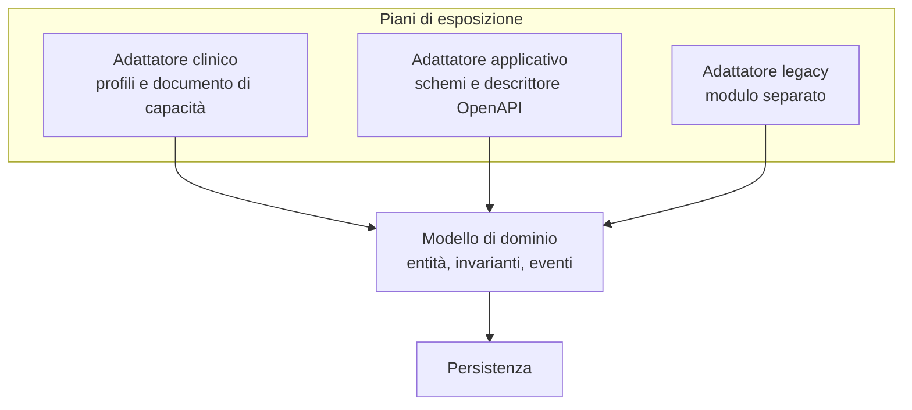

# API di progetto

I vincoli reali di REST, la semantica dei codici di stato, il funzionamento dei validatori di
cache e la forma corretta delle intestazioni di limitazione del traffico e di deprecazione sono
spiegati nel modulo
[«I protocolli, uno per uno», §3](../10_fondamenti/13-protocolli.md). Questo capitolo descrive
**l'interfaccia applicativa di Telemedic**: che cosa espone, con quale contratto, con quali
garanzie.

## 1. Perché esistono due piani, e come si decide dove sta un concetto

FHIR è eccellente per l'interoperabilità clinica e inadatto come interfaccia applicativa. Le
ragioni sono strutturali: modella **stati clinici persistenti**, non **azioni**; le sue risorse
sono larghe, con decine di elementi che uno sviluppatore applicativo non compilerà mai; la
grammatica delle operazioni è verbosa; la semantica della ricerca è una fonte costante di
malintesi. Al contrario, un'interfaccia applicativa ergonomica non è interoperabile: nessun
sistema sanitario terzo la conosce.

Telemedic espone quindi **due piani sopra un unico modello di dominio**.

| | Piano clinico | Piano applicativo |
|---|---|---|
| Percorso di base | `/fhir` | `/v1` |
| Tipo di media | `application/fhir+json` | `application/json` |
| Contratto | Profili e documento di capacità | **OpenAPI 3.1.1** |
| Errori | Esito di operazione | `application/problem+json` (RFC 9457) |
| Pubblico | Cartelle cliniche, motori di integrazione, autorità sanitarie | Sviluppatori dell'integratore, librerie client |

**La regola di partizione**, applicata senza eccezioni:

> Se il concetto ha un equivalente clinico riconosciuto e deve poter essere consumato da un
> sistema sanitario terzo che non conosce Telemedic → **piano clinico**.
> Se il concetto è una capacità del prodotto → **piano applicativo**.

| Concetto | Piano | Motivazione |
|---|---|---|
| La prestazione come atto clinico | Clinico | È il concetto clinico e alimenta la cartella del sistema di origine |
| La sessione media: stanza, stato della connessione, credenziali | **Applicativo** | Artefatto tecnico. Non esiste in FHIR e non deve esistere |
| Il referto | Clinico | Contenuto clinico redatto dal professionista |
| Il consenso | Clinico per lo stato, **applicativo per il flusso di raccolta** | Lo stato è clinico-giuridico; la procedura di raccolta è interfaccia |
| Metriche di qualità della sessione | **Applicativo** | Non sono osservazioni cliniche |
| Personalizzazione del tenant, quote, chiavi, destinazioni dei webhook | **Applicativo** | Configurazione di prodotto |
| Consegne degli eventi e loro esito | **Applicativo** | Nessun equivalente clinico |



I due piani **non hanno due modelli di persistenza**. Le risorse FHIR non sono entità di
persistenza: sono proiezioni costruite da un adattatore. Il modello di dominio non conosce né
FHIR né il formato dell'interfaccia applicativa.

## 2. Le risorse dell'interfaccia applicativa

| Risorsa | Percorso | Operazioni | Che cos'è |
|---|---|---|---|
| Sessioni | `/v1/sessions` | crea, legge, elenca, termina | La sessione media, distinta dalla prestazione per vincolo [V-01](../11_registri/01-vincoli-in-vigore.md#v-01) |
| Accessi alla sessione | `/v1/sessions/{id}/grants` | crea | Credenziale monouso di ingresso, vita brevissima |
| Metriche di sessione | `/v1/sessions/{id}/metrics` | legge, elenca | Serie temporali di qualità |
| Verifica tecnica | `/v1/readiness-checks` | crea, legge | Prova preventiva del dispositivo e della rete |
| Inviti | `/v1/invitations` | crea, legge, revoca | Invito all'assistito, con recapito |
| Destinazioni degli eventi | `/v1/webhook-endpoints` | CRUD, prova, rotazione del segreto | Capitolo [07](./07-eventi-e-webhook.md) |
| Consegne degli eventi | `/v1/webhook-deliveries` | elenca, legge, rigioca | Diagnostica autonoma dell'integratore |
| Eventi in estrazione | `/v1/events` | elenca | Alternativa a pull per chi non espone un endpoint |
| Registrazioni | `/v1/recordings` | legge, elenca, cancella | Metadati; il contenuto è indicizzato sul piano clinico |
| Consensi alla registrazione | `/v1/recording-consents` | crea, legge, revoca | Il flusso; lo stato vive sul piano clinico |
| Piani di rilevazione | `/v1/monitoring-plans` | CRUD, versiona | Telemonitoraggio |
| Rilevazioni | `/v1/measurements` | crea, elenca | Acquisizione da gateway di terzi o inserimento manuale |
| Allerte | `/v1/alerts` | elenca, legge, prende in carico | Con la disciplina del vincolo [V-02](../11_registri/01-vincoli-in-vigore.md#v-02) |
| Configurazione del tenant | `/v1/tenants/{id}/settings` | legge, aggiorna | Compresa la personalizzazione visiva |
| Quote e consumi | `/v1/tenants/{id}/usage` | legge | Trasparenza sui limiti |
| Catalogo degli errori | `/v1/problems/{code}` | legge | Ogni tipo di problema è un indirizzo risolvibile |

Tre precisazioni.

**Le sessioni non sono le prestazioni.** Creare una sessione non crea una prestazione, e
terminare una sessione non conclude una prestazione. Sono aggregati distinti per vincolo [V-01](../11_registri/01-vincoli-in-vigore.md#v-01), e
l'interfaccia lo riflette: la sessione porta un riferimento alla prestazione, la prestazione può
avere zero, una o molte sessioni.

**Le credenziali di ingresso sono una risorsa, non un campo.** Sono create con una chiamata
autenticata, sono **monouso**, hanno vita brevissima e **non transitano mai in un indirizzo**.
Modellarle come campo di lettura della sessione le renderebbe rileggibili e replicabili.

**Il catalogo degli errori è servito.** Il tipo di problema che compare in una risposta di errore
è un indirizzo che si risolve e che porta alla spiegazione e alla procedura di risoluzione. È ciò
che trasforma un errore in un'istruzione e abbatte il carico di assistenza.

## 3. La semantica dei codici di stato

La tabella vale per **entrambi** i piani. Un codice usato con un significato diverso su un piano
rispetto all'altro è un difetto.

| Codice | Quando Telemedic lo restituisce | Note |
|---|---|---|
| `200 OK` | Lettura, elenco, aggiornamento con rappresentazione, operazione conclusa | Anche per la validazione con esito negativo sul piano clinico |
| `201 Created` | Creazione andata a buon fine | **Sempre** con l'intestazione di posizione e con il validatore di versione |
| `202 Accepted` | Avvio di un'operazione asincrona | Con l'indirizzo di interrogazione dello stato |
| `204 No Content` | Cancellazione o aggiornamento senza rappresentazione | Solo se il chiamante ha chiesto la risposta minimale |
| `206 Partial Content` | **Mai** | La paginazione non usa intervalli di byte |
| `303 See Other` | Operazione asincrona conclusa, risultato altrove | Usato dal flusso di esportazione |
| `304 Not Modified` | Lettura condizionale con validatore ancora valido | Riduce il traffico su risorse consultate spesso |
| `400 Bad Request` | Richiesta sintatticamente malformata | **Non** per errori di regola di business |
| `401 Unauthorized` | Credenziale assente, scaduta, non verificabile | Con l'indicazione dello schema atteso |
| `403 Forbidden` | Credenziale valida, autorizzazione insufficiente **su una risorsa non riferita a un assistito** | Vedi §6.3 per la regola sulle risorse cliniche |
| `404 Not Found` | Risorsa inesistente **oppure** non visibile al chiamante quando è riferita a un assistito | Scelta di progetto, §6.3 |
| `405 Method Not Allowed` | Metodo non ammesso sul percorso | Con l'intestazione dei metodi consentiti |
| `406 Not Acceptable` | Tipo di media o versione richiesti non serviti | Compreso il parametro di versione della facciata clinica |
| `409 Conflict` | Conflitto di stato o richiesta con chiave di idempotenza già in elaborazione | Nel secondo caso con l'indicazione del ritardo suggerito |
| `410 Gone` | Versione dismessa, destinazione dismessa, risorsa cancellata in modo definitivo | Con il rinvio alla guida di migrazione |
| `412 Precondition Failed` | Validatore di versione fornito ma discordante | Concorrenza ottimistica |
| `415 Unsupported Media Type` | Tipo di contenuto inviato non supportato | - |
| `422 Unprocessable Content` | Richiesta ben formata ma che viola una regola di business o un profilo | **È qui** che stanno gli errori di dominio |
| `428 Precondition Required` | Scrittura su risorsa clinica **senza** validatore di versione | Scelta di progetto, §5 |
| `429 Too Many Requests` | Quota superata | **Sempre** con il ritardo suggerito, definito da RFC 6585 |
| `500 Internal Server Error` | Difetto non gestito | Con identificativo di correlazione, **mai** con dettagli interni |
| `503 Service Unavailable` | Indisponibilità temporanea, dipendenza esterna caduta | Con il ritardo suggerito quando stimabile |

**La distinzione fra `400` e `422` è deliberata e vale come regola.** Il primo è per ciò che il
parser rifiuta; il secondo per ciò che il dominio rifiuta. Un client che li tratta allo stesso
modo non può distinguere «ho sbagliato a costruire la richiesta» da «la richiesta è corretta ma
lo stato del sistema non la ammette», e quelle due condizioni richiedono azioni opposte: nel
primo caso correggere il codice, nel secondo ritentare o informare l'utente.

## 4. Idempotenza

### 4.1 Il meccanismo

Il nome del campo è `Idempotency-Key`. **Non è uno standard**: l'Internet-Draft che lo definisce è
alla revisione `-07` del 15 ottobre 2025 e risulta **scaduto e archiviato**. Il progetto adotta
il nome perché è ciò che gli integratori e le librerie riconoscono, e lo documenta come
**convenzione di progetto ispirata a un Internet-Draft scaduto**. Nessuna affermazione di
conformità a uno standard IETF è ammessa su questo punto.

Semantica adottata:

- **obbligatorio** su tutte le creazioni che hanno effetti collaterali osservabili: avvio di una
  sessione, emissione di una credenziale di ingresso, invio di un invito, creazione di una
  destinazione per gli eventi, rigioco di una consegna;
- ambito della chiave: la quaterna **tenant, client, operazione, chiave**. Due tenant che usano
  la stessa stringa non collidono;
- **ritenzione ventiquattro ore** (proposta P-04 del capitolo [01 §5](./01-principi-di-interoperabilita.md));
- si memorizza **l'impronta del corpo della richiesta** insieme alla risposta prodotta;
- stessa chiave e **stesso corpo**, richiesta già conclusa → si rigioca la risposta memorizzata,
  **byte per byte**, con un'intestazione di progetto che dichiara il rigioco;
- stessa chiave e **corpo diverso** → `422` con il tipo di problema dedicato al riuso improprio
  della chiave;
- stessa chiave e stesso corpo, **prima richiesta ancora in elaborazione** → `409` con il ritardo
  suggerito.

```http
POST /v1/sessions HTTP/1.1
Host: telemedic.example
Content-Type: application/json
Authorization: Bearer <token opaco>
Idempotency-Key: 01J9ZC7Y4Q7K9V0R2M4T8N1B3D
X-Request-Id: 7f2b1c8e-4a55-4d0b-9a3f-11c2d3e4f5a6

{
  "appointmentRef": "Appointment/apt-51b7",
  "mode": "no-recording",
  "expectedParticipants": 2,
  "locale": "it-IT"
}
```

```http
HTTP/1.1 201 Created
Location: /v1/sessions/ses_01J9ZC5P
ETag: W/"1"
Content-Type: application/json
RateLimit: "sessions"; r=48; t=57
RateLimit-Policy: "sessions"; q=60; w=60; qu="requests"
X-Request-Id: 7f2b1c8e-4a55-4d0b-9a3f-11c2d3e4f5a6

{
  "id": "ses_01J9ZC5P",
  "status": "created",
  "encounterRef": "Encounter/enc-3c8f1a20",
  "mode": "no-recording",
  "createdAt": "2026-09-14T07:31:02.418Z"
}
```

### 4.2 Quando non serve

Sulle letture, sulle sostituzioni complete e sulle cancellazioni non serve: sono già idempotenti
per definizione del metodo, e aggiungere la chiave è rumore. Su operazioni **intrinsecamente
ripetibili per volontà del chiamante** - «rinvia l'invito» - non si usa la chiave: si espone un
endpoint distinto con semantica esplicita, perché quella è una richiesta di effetto aggiuntivo,
non un ritentativo.

## 5. Concorrenza ottimistica

Il meccanismo è quello dei validatori: il server emette un validatore di versione sulle risorse
mutabili, il client lo restituisce nella richiesta di modifica, il server confronta.

- Il validatore è emesso in **forma debole**, perché rappresenta l'equivalenza semantica della
  risorsa e non l'identità byte a byte della sua rappresentazione, che varia con la negoziazione
  del contenuto.
- Discordanza → `412 Precondition Failed`, con il tipo di problema che indica la versione attesa
  e quella corrente.
- **Assenza del validatore su una scrittura clinica → `428 Precondition Required`.**

L'ultimo punto è una **scelta di progetto**, elencata come P-02 fra quelle che attendono una
decisione architetturale formale. La motivazione: una scrittura senza validatore è un
ultimo-scrittore-vince silenzioso, che su una risorsa clinica è perdita di dato non tracciata,
incompatibile con il vincolo [V5](../11_registri/03-vincoli-fondanti.md#v5). Il costo dichiarato: rompe i client che non inviano il
validatore. È l'effetto voluto - che si rompano in integrazione, non in produzione.

Sulle risorse **non cliniche** del piano applicativo - configurazione, personalizzazione,
destinazioni degli eventi - il validatore è raccomandato ma non obbligatorio: la perdita di un
aggiornamento di configurazione è recuperabile e visibile, quella di un dato clinico no.

```http
PATCH /v1/webhook-endpoints/whe_2b8f HTTP/1.1
Content-Type: application/merge-patch+json
If-Match: W/"4"

{ "active": false }
```

**La lettura condizionale è supportata** sulle risorse consultate spesso: un client che rilegge lo
stato di una sessione con il validatore ottenuto in precedenza riceve `304` senza corpo. Riduce
il traffico e non consuma quota di scrittura.

## 6. Errori

### 6.1 La forma

Il formato è quello di **RFC 9457**, tipo di media `application/problem+json`. I membri definiti
dalla specifica sono cinque:

| Membro | Sezione | Significato |
|---|---|---|
| `type` | §3.1.1 | URI che identifica il **tipo** di problema; valore predefinito `about:blank` |
| `status` | §3.1.2 | Il codice HTTP, ripetuto per comodità del consumatore |
| `title` | §3.1.3 | Riassunto breve leggibile dall'uomo, **stabile fra le occorrenze** |
| `detail` | §3.1.4 | Spiegazione specifica di **questa** occorrenza |
| `instance` | §3.1.5 | URI che identifica questa specifica occorrenza |

I membri di estensione sono ammessi dalla §3.2, e i consumatori devono ignorare quelli che non
riconoscono.

```json
{
  "type": "https://telemedic.example/problems/session-not-startable",
  "title": "La sessione non può essere avviata",
  "status": 422,
  "detail": "L'appuntamento collegato non è in uno stato che ammette l'avvio.",
  "instance": "/v1/sessions/ses_01J9ZC5P",
  "code": "session-not-startable",
  "traceId": "00-4bf92f3577b34da6a3ce929d0e0e4736-00f067aa0ba902b7-01",
  "tenantId": "tenant-a",
  "errors": [
    {
      "pointer": "#/appointmentRef",
      "code": "invalid-state",
      "message": "stato non ammesso"
    }
  ],
  "documentation": "https://telemedic.example/v1/problems/session-not-startable"
}
```

### 6.2 Le cinque regole

1. **Il tipo è un indirizzo risolvibile** che porta alla pagina dell'errore, con la spiegazione e
   la procedura di risoluzione.
2. **L'identificativo di traccia è in formato di contesto di traccia standard**, così che
   l'assistenza possa ritrovare la richiesta senza chiedere all'integratore di ripeterla.
3. **Il testo di dettaglio non contiene mai contenuto clinico né identificativi diretti.**
   Finisce nei registri del chiamante, che è un sistema di cui non si controlla la protezione.
   È un requisito verificato con una prova, non una raccomandazione.
4. **Il testo di dettaglio non è parsabile.** È dichiarato fuori dal contratto di stabilità: chi
   scrive codice che lo interpreta si romperà, e la rottura è per sua responsabilità. Il campo
   stabile è il codice.
5. **Un errore non catalogato non può essere emesso.** La catena di costruzione verifica che ogni
   codice emesso dal sorgente esista nel catalogo, e il catalogo genera insieme la
   documentazione, le pagine risolvibili e le costanti delle librerie client.

Il catalogo è **unico per i due piani**: lo stesso concetto porta lo stesso codice nell'esito di
operazione del piano clinico e nel corpo di problema del piano applicativo. La corrispondenza è
generata, non scritta due volte.

### 6.3 Non trovato invece di vietato, sulle risorse riferite a un assistito

**Scelta di progetto**, elencata come P-03. Su una risorsa riferita a un assistito, un chiamante
autorizzato ma privo del diritto di vedere **quella** risorsa riceve `404`, non `403`.

La motivazione è che distinguere «non esiste» da «esiste ma non puoi vederlo» è un **oracolo di
enumerazione** su una base pazienti: consente di verificare l'esistenza di una persona in una
struttura sanitaria senza avere alcun diritto di accesso, il che è di per sé una divulgazione.

Il costo è che la diagnosi diventa più difficile per l'integratore in buona fede. La mitigazione:
il corpo del problema porta comunque un codice che distingue l'assenza dalla mancanza di
autorizzazione **quando il chiamante appartiene allo stesso tenant della risorsa** - perché in
quel caso l'oracolo non aggiunge informazione - e il tentativo genera comunque un evento di
tracciamento.

Sulle risorse **non riferite a un assistito** - una destinazione per gli eventi, una
configurazione - la distinzione fra `403` e `404` resta quella ordinaria.

## 7. Versionamento e deprecazione, nelle forme oggi corrette

### 7.1 Dove sta la versione

Tre strategie possibili e la loro valutazione:

| Strategia | Pro | Contro |
|---|---|---|
| Versione maggiore nel percorso | Visibile nei registri e nelle cache, banale da instradare e da provare a mano | Duplica i percorsi |
| Intestazione propria | Percorsi stabili | Invisibile, si perde nei registri e nelle cache |
| Parametro del tipo di media | Formalmente il più corretto | Ostile agli sviluppatori, mal gestito da molti proxy |

**Scelta di progetto** (P-01): **versione maggiore nel percorso** per le rotture, più
un'intestazione facoltativa di **data di versione** per le aggiunte datate. Se l'intestazione è
assente si applica la versione **fissata al client alla prima chiamata**, non l'ultima: così un
client non subisce mai un cambiamento che non ha chiesto.

Sul piano clinico **non si versiona l'interfaccia**: si dichiara la versione della specifica, nel
documento di capacità e nel parametro del tipo di media. Un eventuale supporto a una release
successiva userebbe percorsi di base distinti.

### 7.2 Le intestazioni della deprecazione

**`Deprecation` è RFC 9745**, Standards Track, marzo 2025, registrato come campo permanente nel
registro dei nomi di campo HTTP, di tipo strutturato *Item*. Il valore **MUST** essere una Date
come da §3.3.7 di RFC 9651. La forma è quella dei secondi con il prefisso di segno:

```http
HTTP/1.1 200 OK
Deprecation: @1798761600
Sunset: Wed, 30 Jun 2027 23:59:59 GMT
Link: <https://telemedic.example/docs/it/migrazione/v1-v2>; rel="deprecation"; type="text/html"
Content-Type: application/json
```

Regole verificate e applicate:

- **`Sunset` è RFC 8594** e il suo istante **MUST NOT** essere anteriore a quello di
  `Deprecation`. La verifica è nella catena di costruzione: una configurazione che violasse la
  relazione fa fallire la costruzione;
- la relazione di collegamento `deprecation` punta a documentazione **destinata a lettori umani**,
  con il tipo dichiarato;
- le tre intestazioni sono emesse **su ogni risposta** della versione deprecata, non solo sulla
  prima: un client che ha memorizzato una risposta non le vedrebbe mai.

### 7.3 Il processo

Il processo completo, con le quattro fasi e le due finestre di oscuramento programmato, è nel
capitolo [01 §6.4](./01-principi-di-interoperabilita.md) e vale per entrambi i piani. Qui si
aggiunge solo la parte tecnica delle finestre: durante un oscuramento programmato la versione
deprecata risponde `410 Gone` con il tipo di problema che rinvia alla guida di migrazione e con
l'indicazione della durata della finestra. Le finestre sono **annunciate in anticipo** e non sono
un guasto: sono un modo di far emergere le integrazioni non migrate quando c'è ancora tempo per
migrarle.

## 8. Limitazione del traffico

### 8.1 La forma corretta oggi

Il codice `429 Too Many Requests` e l'intestazione del ritardo suggerito sono definiti da
**RFC 6585**. Gli header di quota **non sono standard**: sono definiti da
`draft-ietf-httpapi-ratelimit-headers`, Internet-Draft **attivo** alla revisione `-11` del 23
maggio 2026, con stato previsto Standards Track.

Due fatti da recepire, entrambi verificati:

1. la revisione corrente definisce **due** campi strutturati - `RateLimit` e `RateLimit-Policy` -
   e **sostituisce** i tre campi separati delle prime versioni;
2. i tre campi separati **non sono mai stati standard**.

`RateLimit-Policy` porta i parametri di quota, finestra, unità di quota e chiave di partizione;
`RateLimit` porta la quota residua, la finestra effettiva e la chiave di partizione. Il draft
registra inoltre tre tipi di problema - quota superata, capacità temporaneamente ridotta, uso
anomalo rilevato - e un registro di unità di quota che comprende le richieste, i byte di
contenuto e le richieste concorrenti.

### 8.2 La scelta di progetto

**Doppia emissione per un periodo dichiarato** (P-05): la forma corrente e, in aggiunta, la forma
storica marcata come deprecata nella documentazione. La motivazione è che la forma corrente non è
ancora RFC e che le librerie diffuse leggono ancora quella storica. Il costo è dichiarato:
intestazioni ridondanti e **una data di fine da rispettare**, che è fissata e pubblicata.

```http
HTTP/1.1 429 Too Many Requests
Content-Type: application/problem+json
Retry-After: 23
RateLimit: "sessions"; r=0; t=23
RateLimit-Policy: "sessions"; q=60; w=60; qu="requests"; pk=:dGVuYW50LWE=:
RateLimit-Limit: 60
RateLimit-Remaining: 0
RateLimit-Reset: 23

{
  "type": "https://telemedic.example/problems/quota-exceeded",
  "title": "Quota superata",
  "status": 429,
  "detail": "La quota di avvio sessione per questo client è esaurita nella finestra corrente.",
  "code": "quota-exceeded",
  "policy": "sessions",
  "retryAfterSeconds": 23,
  "traceId": "00-4bf92f3577b34da6a3ce929d0e0e4736-3c1a9d0e1f2a3b4c-01"
}
```

### 8.3 La politica delle quote

Le quote sono **per tenant e per client**, con classi di endpoint distinte: scrittura clinica,
lettura, avvio di sessione, amministrazione. L'algoritmo è a secchiello di gettoni con
possibilità di raffica, perché un integratore che sincronizza un'agenda produce naturalmente
picchi seguiti da inattività, e una quota rigida lo strozzerebbe senza motivo.

**Nessun endpoint è esente**, ma tre categorie hanno soglie elevate o dedicate e la ragione è
dichiarata: gli endpoint di verifica dello stato di salute, perché strozzarli rende cieco il
monitoraggio; il traffico di rigioco dalla coda di scarto, perché verrebbe strozzato esattamente
quando serve recuperare; le operazioni identificate da un ambito di autorizzazione dedicato alle
situazioni di urgenza clinica, che hanno tracciamento rinforzato e revisione a posteriori.

Il superamento della quota **non è un errore del client**: è una condizione del sistema. Il tipo
di problema lo dichiara e indica quale politica è stata superata, così che l'integratore possa
correggere la propria strategia invece di ritentare a caso.

## 9. Paginazione

| Modello | Uso | Motivazione |
|---|---|---|
| **A cursore** | Predefinito sul piano applicativo | Stabile in presenza di scritture concorrenti |
| A scostamento e limite | **Sconsigliato e non esposto** | Degrada su valori alti e produce risultati incoerenti sotto scrittura |
| Collegamenti della raccolta | Obbligatorio sul piano clinico | È il modello della specifica |

```http
GET /v1/sessions?tenantId=tenant-a&status=completed&limit=50
    &cursor=eyJ0IjoiMjAyNi0wOS0xNFQwOTo0MVoiLCJpZCI6InNlc18wMUo5WkM1UCJ9 HTTP/1.1
```

```json
{
  "data": [ ],
  "meta": {
    "limit": 50,
    "hasMore": true,
    "nextCursor": "eyJ0IjoiMjAyNi0wOS0xNFQwOTozMFoiLCJpZCI6InNlc18wMUo5WkI3UiJ9"
  }
}
```

Tre regole:

1. **Il cursore è opaco e firmato.** Non è interpretabile né manipolabile dal client. Un cursore
   manipolabile è un vettore per aggirare il filtro di tenant, ed è il modo in cui una
   paginazione diventa una falla di isolamento.
2. **Il cursore non è contratto pubblico.** Il suo formato interno può cambiare senza preavviso, ed
   è dichiarato fuori dalla garanzia di stabilità.
3. **L'inviluppo `{data, meta}` vale solo sul piano applicativo.** Sul piano clinico il formato è
   la raccolta della specifica: mescolare i due inviluppi produce risposte che nessuna libreria
   FHIR sa consumare.

## 10. Condivisione di risorse fra origini

Il piano applicativo e la facciata clinica sono chiamati anche da un browser: dalla parte
frontale dell'integratore e dal componente incorporato. Regole:

- l'origine ammessa è su **elenco esplicito per tenant**, mai il carattere jolly sugli endpoint
  autenticati. Il jolly è per specifica incompatibile con l'invio di credenziali;
- le credenziali di navigazione sono ammesse **solo** se si usano cookie. Se l'autenticazione è a
  token nell'intestazione di autorizzazione, non servono e non vanno abilitate: riduce la
  superficie di falsificazione della richiesta;
- le intestazioni ammesse sono elencate esplicitamente: autorizzazione, tipo di contenuto, chiave
  di idempotenza, versione, validatore di precondizione, preferenza;
- le intestazioni **esposte** sono elencate esplicitamente. Senza questa configurazione il codice
  del browser **non vede** il validatore di versione, la posizione, le intestazioni di quota, il
  ritardo suggerito e la posizione del contenuto. È un errore di configurazione frequente e
  produce librerie client che «perdono» intestazioni senza spiegazione;
- **le origini ammesse sono lo stesso registro** usato per gli antenati ammessi
  all'incorporamento e per le destinazioni ammesse dei webhook. Tre registri separati divergono
  sempre: è la questione **[Q-161](../11_registri/02-questioni-aperte.md#q-161)** aperta dall'`INTEG`, e quest'area la sostiene.

## 11. Il descrittore dell'interfaccia

### 11.1 La versione e le sue novità utili

Il descrittore è in **OpenAPI 3.1.1**. Non è una RFC e non ha un numero IETF: è una specifica
della propria fondazione, e si cita per nome e versione. Le novità rilevanti rispetto alla serie
precedente:

| Novità | Effetto pratico |
|---|---|
| Allineamento pieno a JSON Schema 2020-12 | Gli stessi schemi valgono per la validazione a runtime, per la generazione dei tipi e per la documentazione: **un unico artefatto** |
| Dialetto dichiarabile alla radice | Dichiara il valore predefinito del riferimento allo schema |
| Campo dei webhook alla radice | Descrive le notifiche in ingresso nello stesso documento dell'interfaccia sincrona |
| Elementi di percorso riusabili | Riduce la duplicazione |
| Rimozione dell'annullabilità come parola chiave propria | Si usa il tipo nativo, con l'unione fra il tipo e il nullo |
| Identificatore di licenza secondo l'elenco standard | Mutuamente esclusivo con l'indirizzo. Per Telemedic è l'identificatore della licenza adottata dal progetto |

### 11.2 Progettazione prima del codice, non il contrario

**Regola di progetto vincolante:** il descrittore è **scritto a mano ed è la fonte di verità**; i
tipi del server sono generati o verificati contro di esso nella catena di costruzione.

L'approccio inverso - annotazioni nel codice, descrittore generato - produce un contratto che
cambia a ogni ristrutturazione interna. È incompatibile con una politica di stabilità
dell'interfaccia e con la tracciabilità requisito-prova richiesta dalla disciplina del ciclo di
vita del software medico.

```yaml
openapi: 3.1.1
jsonSchemaDialect: https://json-schema.org/draft/2020-12/schema
info:
  title: Telemedic Application API
  version: "1.0.0"
  license:
    name: Apache-2.0
    identifier: Apache-2.0
servers:
  - url: https://telemedic.example/v1
paths:
  /sessions:
    post:
      operationId: createSession
      summary: Crea una sessione media a partire da un appuntamento esistente
      parameters:
        - name: Idempotency-Key
          in: header
          required: true
          schema: { type: string, minLength: 16, maxLength: 128 }
          description: >
            Chiave di idempotenza fornita dal chiamante. Due richieste con la stessa
            chiave e lo stesso corpo producono la stessa risposta. Convenzione di
            progetto ispirata a un Internet-Draft IETF scaduto: non è uno standard.
      requestBody:
        required: true
        content:
          application/json:
            schema: { $ref: '#/components/schemas/CreateSessionRequest' }
      responses:
        "201":
          description: Sessione creata
          headers:
            Location: { schema: { type: string, format: uri-reference } }
            ETag: { schema: { type: string } }
            RateLimit: { schema: { type: string } }
            RateLimit-Policy: { schema: { type: string } }
          content:
            application/json:
              schema: { $ref: '#/components/schemas/Session' }
        "409":
          $ref: '#/components/responses/IdempotencyInFlight'
        "422":
          $ref: '#/components/responses/Problem'
        "429":
          $ref: '#/components/responses/QuotaExceeded'
webhooks:
  sessionCompleted:
    post:
      operationId: onSessionCompleted
      summary: Notifica di sessione conclusa
      requestBody:
        content:
          application/json:
            schema: { $ref: '#/components/schemas/CloudEventSessionCompleted' }
      responses:
        "2XX": { description: Notifica accettata dal ricevente }
components:
  responses:
    Problem:
      description: Errore applicativo
      content:
        application/problem+json:
          schema: { $ref: '#/components/schemas/Problem' }
  securitySchemes:
    oauth2:
      type: oauth2
      flows:
        clientCredentials:
          tokenUrl: https://telemedic.example/oauth2/token
          scopes:
            "https://telemedic.example/scopes/session.start": Avviare una sessione
```

### 11.3 I quattro cancelli della catena di costruzione

1. **Analisi statica del descrittore**, con regole di stile e regole di sicurezza: nessun
   endpoint senza schema di sicurezza dichiarato, nessuna risposta di errore senza il tipo di
   media dei problemi, nessuno schema senza descrizione.
2. **Confronto di compatibilità** con la versione pubblicata: una modifica che rompe e che non è
   stata annunciata **fa fallire la costruzione**. È la barriera che rende la politica di §7 una
   regola e non un proposito.
3. **Verifica a contratto** delle prove di integrazione contro il descrittore: una risposta reale
   che non valida contro lo schema dichiarato è un fallimento.
4. **Generazione delle librerie client** e pubblicazione **solo su etichetta di rilascio**, mai
   dal ramo di sviluppo.

Il campo dei webhook del descrittore è usato come **descrittore primario delle notifiche**,
perché sta nello stesso documento dell'interfaccia sincrona e alimenta lo stesso portale e gli
stessi generatori. Una descrizione per interfacce a eventi è generata **come artefatto derivato**
dagli stessi schemi, per gli integratori che consumano da un broker invece che via HTTP. Mantenere
due specifiche scritte a mano è garanzia di divergenza: **una delle due deve essere generata**.

## 12. Autenticazione, in breve

Gli schemi di autenticazione, gli ambiti di autorizzazione, la delega fra organizzazioni e la
propagazione del livello di garanzia sono nel capitolo
[08](./08-identita-e-autorizzazione.md). Qui bastano tre affermazioni che riguardano la forma
dell'interfaccia:

- **nessun endpoint è anonimo**, tranne il documento di scoperta della configurazione, il
  documento di capacità del piano clinico, il descrittore dell'interfaccia e l'endpoint di
  verifica dello stato di salute, che non espone informazioni di sistema;
- gli ambiti che rappresentano **capacità di prodotto** sono espressi in forma di URI, mai
  mascherati da ambiti su risorse cliniche. Forzare l'avvio di una sessione dentro un ambito di
  scrittura sul contatto assistenziale sarebbe un abuso semantico e renderebbe impossibile
  revocare l'uno senza l'altro;
- **il token non porta mai contenuto clinico né identificativi diretti**: chi lo intercetta lo
  legge.

## 13. Che cosa questa interfaccia non copre

| Non copre | Dove sta |
|---|---|
| Il contenuto clinico interoperabile | Piano clinico, capitolo [02](./02-fhir.md) |
| Il documento e la sua firma | Capitolo [03](./03-documenti-clinici.md) |
| La segnalazione della sessione media in tempo reale | Capitolo [09](./09-tempo-reale.md): è un canale a socket web, non un'interfaccia a richiesta e risposta |
| Le notifiche in uscita | Capitolo [07](./07-eventi-e-webhook.md) |
| L'amministrazione dell'installazione | Interfaccia interna, non pubblica e non coperta dalla garanzia di stabilità |
