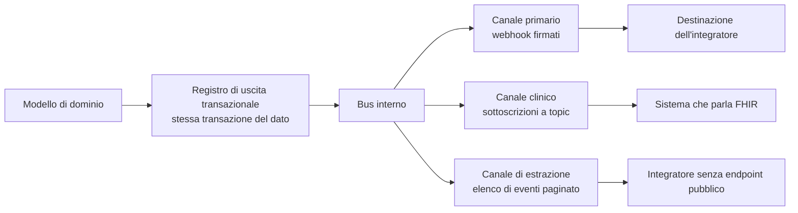

# Eventi e webhook

Che cosa sia una busta di evento, come funzioni la firma di un messaggio HTTP e quali siano le
semantiche di consegna possibili è spiegato nel modulo
[«I protocolli, uno per uno», §6](../10_fondamenti/13-protocolli.md). Questo capitolo descrive
**quali eventi Telemedic pubblica, in quale forma, con quali garanzie e con quale contratto**.

## 1. Due canali, una sola sorgente



**Il registro di uscita transazionale è la sorgente unica.** L'evento è scritto nella stessa
transazione del dato di dominio e pubblicato da un componente di inoltro. Non esistono eventi
persi - perché la scrittura è atomica con il dato - né eventi fantasma - perché nessun evento è
prodotto da una seconda scrittura applicativa che potrebbe non corrispondere a un fatto avvenuto.

I tre canali sono alimentati dallo stesso bus. La corrispondenza fra il catalogo del canale
primario e gli argomenti del canale clinico è **pubblicata come tabella**, non lasciata dedurre.

### 1.1 Perché il canale primario non è quello clinico

Il modello di sottoscrizione della specifica clinica nella sua forma originaria ha difetti
strutturali che ne impediscono l'uso come canale unico, ed è la ragione per cui l'ente stesso lo
ha superato:

1. **Il criterio è applicato al nuovo valore della risorsa.** Una cancellazione, o un
   aggiornamento che fa *uscire* la risorsa dal criterio, **non genera notifica**. Un integratore
   che si aspetta di sapere quando una prestazione viene annullata resterebbe sordo.
2. **Costo computazionale.** Ogni scrittura va confrontata con tutte le sottoscrizioni attive.
3. **Nessun controllo del contenuto**: o la risorsa completa o niente.
4. **Nessun battito, nessuna stretta di mano, nessuna verifica della destinazione.** Non si
   distingue «nessun evento» da «canale rotto».
5. **Nessuna numerazione delle notifiche**: non c'è modo di accorgersi di un buco.
6. **Autenticazione debole**: un token statico in un'intestazione è l'unico meccanismo previsto.
   Nessuna firma.
7. **Nessun ritentativo né coda di scarto** definiti dalla specifica.

Si aggiunge un limite che nessuna evoluzione può togliere: **gli eventi che non sono cambiamenti
di stato di una risorsa clinica non sono esprimibili**. La qualità della rete scesa sotto soglia
durante una sessione, il consenso alla registrazione revocato in corsa, la sessione fallita
perché il relay era irraggiungibile, la consegna di un documento rifiutata dal destinatario: sono
fatti che l'integratore deve conoscere e che non sono la scrittura di una risorsa.

## 2. La busta

### 2.1 Modalità strutturata

Il corpo è un evento nel formato di busta **CloudEvents 1.0**, in modalità *structured*: l'intero
evento nel corpo JSON. Gli attributi di contesto obbligatori sono quattro - identificativo,
sorgente, versione della specifica, tipo - con il vincolo che il produttore **MUST** garantire
l'unicità della coppia sorgente e identificativo per ogni evento distinto. Gli attributi
facoltativi usati sono il tipo di contenuto del dato, lo schema del dato, il soggetto e l'istante.

| Attributo | Valore in Telemedic |
|---|---|
| `specversion` | `1.0` |
| `id` | Identificativo ordinabile dell'evento, univoco nella sorgente |
| `source` | `https://telemedic.example/tenants/{tenantId}` |
| `type` | `telemedic.<dominio>.<fatto>.v<N>` - spazio dei nomi rovesciato con versione esplicita |
| `subject` | Riferimento all'aggregato, es. `Encounter/enc-3c8f1a20` |
| `time` | Istante in formato RFC 3339, con millisecondi e fuso zero |
| `datacontenttype` | `application/json` |
| `dataschema` | Indirizzo dello schema del contenuto, **versionato** |

Lo schema riferito rende il contenuto **auto-descrittivo e validabile**, e si collega
direttamente alla generazione dei tipi nelle librerie client.

### 2.2 Modalità binaria, e il divieto da rispettare

La modalità *binary* - attributi nelle intestazioni, dato applicativo nel corpo - è offerta come
opzione per destinazione. La regola di formazione è verbatim:

> *«all CloudEvents context attributes, including extensions, MUST be mapped to HTTP headers with
> the same name as the attribute name but prefixed with `ce-`.»*

| Attributo | Intestazione |
|---|---|
| `id` | `ce-id` |
| `source` | `ce-source` |
| `specversion` | `ce-specversion` |
| `type` | `ce-type` |
| `subject` | `ce-subject` |
| `time` | `ce-time` |
| `dataschema` | `ce-dataschema` |
| `datacontenttype` | **nessuna intestazione con prefisso** |

Il trattamento speciale dell'ultimo attributo è normativo:

> *«the HTTP `Content-Type` header value corresponds to (MUST be populated from or written to)
> the CloudEvents `datacontenttype` attribute. Note that a `ce-datacontenttype` HTTP header MUST
> NOT also be present in the message.»*

**Emettere l'intestazione con prefisso per il tipo di contenuto è una violazione di un obbligo
negativo della specifica.** Il tipo di contenuto va **solo** nell'intestazione ordinaria. Il
progetto codifica questo divieto in una prova dedicata, che fallisce se l'intestazione vietata
compare in una consegna.

### 2.3 Che cosa contiene il dato

**Scelta di progetto** (P-07): **riferimenti, non contenuto clinico**. Il contenuto del dato porta
identificativi e riferimenti; il ricevente recupera il contenuto con una chiamata autenticata.

Tre motivazioni convergenti: minimizzazione del dato; riduzione del danno in caso di destinazione
mal configurata o compromessa; coerenza con il livello di solo identificativo previsto dal canale
clinico.

```http
POST /webhooks/telemedic HTTP/1.1
Host: gestionale.integratore.example
Content-Type: application/cloudevents+json; charset=utf-8
User-Agent: Telemedic-Webhooks/1
Telemedic-Event-Id: 01J9ZC7Y4Q7K9V0R2M4T8N1B3D
Telemedic-Event-Type: telemedic.session.completed.v1
Telemedic-Tenant: t0001
Telemedic-Delivery-Id: 01J9ZC80B2W5F6H7J8K9L0M1N2
Telemedic-Delivery-Attempt: 1
Telemedic-Timestamp: 1789234882
Telemedic-Signature: v1=6a5f0c8d1e2b3a4c5d6e7f8091a2b3c4d5e6f708192a3b4c5d6e7f8091a2b3c4
Content-Digest: sha-256=:X48E9qOokqqrvdts8nOJRJN3OWDUoyWxBf7kbu9DBPE=:

{
  "specversion": "1.0",
  "id": "01J9ZC7Y4Q7K9V0R2M4T8N1B3D",
  "source": "https://telemedic.example/tenants/t0001",
  "type": "telemedic.session.completed.v1",
  "subject": "Encounter/enc-3c8f1a20",
  "time": "2026-09-14T10:41:22.481Z",
  "datacontenttype": "application/json",
  "dataschema": "https://telemedic.example/schemas/session-completed/1.2.0.json",
  "data": {
    "sessionId": "ses_01J9ZC5P",
    "tenantId": "t0001",
    "sequence": 412,
    "encounter": { "reference": "Encounter/enc-3c8f1a20" },
    "appointment": { "reference": "Appointment/apt-51b7" },
    "startedAt": "2026-09-14T10:12:04Z",
    "endedAt": "2026-09-14T10:41:19Z",
    "outcome": "completed",
    "sessionVerified": true,
    "recordingPresent": false,
    "links": {
      "self": "https://telemedic.example/v1/sessions/ses_01J9ZC5P",
      "fhirEncounter": "https://telemedic.example/fhir/Encounter/enc-3c8f1a20"
    }
  }
}
```

Le intestazioni con prefisso proprio del progetto **non sono standard** e sono documentate come
scelte di progetto. Ripetono nell'intestazione informazioni presenti nel corpo per consentire la
deduplicazione e l'instradamento **senza analizzare il corpo**, che è ciò che un ricevente deve
poter fare prima di aver verificato la firma. L'intestazione del digest del corpo è invece
standard, definita da **RFC 9530**: usarla invece di un'intestazione propria permette il riuso di
librerie esistenti.

## 3. Il catalogo degli eventi pubblici

Il tipo di evento porta la **versione maggiore nel nome** (P-09). Una modifica che rompe produce
un nuovo tipo, non una mutazione silenziosa del vecchio; durante la transizione entrambe le forme
sono emesse verso i destinatari che le hanno sottoscritte.

| Tipo | Quando | Contenuto | Criticità |
|---|---|---|---|
| `telemedic.session.created.v1` | Sessione media creata | Identificativi, modalità, riferimento alla prestazione | Ordinaria |
| `telemedic.session.started.v1` | Prima connessione stabilita | Istante, esito della verifica della sessione | Ordinaria |
| `telemedic.session.degraded.v1` | Qualità sotto la soglia dichiarata per il tenant | Grandezze misurate, soglia applicata, azione automatica intrapresa | Ordinaria |
| `telemedic.session.failed.v1` | Sessione non stabilita o interrotta senza ripristino | Causa classificata, tentativi | **Alta** |
| `telemedic.session.completed.v1` | Sessione conclusa | Istanti, esito, presenza di registrazione | **Alta** |
| `telemedic.encounter.status-changed.v1` | Transizione di stato della prestazione | Stato precedente e nuovo, istante | Ordinaria |
| `telemedic.document.issued.v1` | Documento clinico firmato ed emesso | Riferimento al documento, tipologia, impronta | **Alta** |
| `telemedic.document.superseded.v1` | Documento sostituito da una versione successiva | Riferimento al nuovo e al precedente | **Critica** |
| `telemedic.document.voided.v1` | Documento annullato | Riferimento, motivo classificato | **Critica** |
| `telemedic.document.delivery-failed.v1` | Consegna del documento al destinatario fallita in modo definitivo | Destinatario, causa, ultimo tentativo | **Critica** |
| `telemedic.recording.consent-granted.v1` | Consenso alla registrazione prestato | Riferimento al consenso, validità | **Alta** |
| `telemedic.recording.consent-revoked.v1` | Consenso revocato | Riferimento, istante, effetto sulla ritenzione | **Critica** |
| `telemedic.recording.available.v1` | Registrazione disponibile | Riferimento documentale, contenitore **effettivo** | Ordinaria |
| `telemedic.measurement.received.v1` | Rilevazione acquisita | Riferimento, origine, istante di rilevazione e di ricezione | Ordinaria |
| `telemedic.alert.raised.v1` | Superamento di soglia configurata dal professionista | Riferimento al piano, parametro, soglia applicata | **Critica** |
| `telemedic.alert.acknowledged.v1` | Allerta presa in carico | Chi, quando | **Alta** |
| `telemedic.alert.escalated.v1` | Allerta non presa in carico entro la finestra | Livello di escalation raggiunto | **Critica** |
| `telemedic.measurement.silence-detected.v1` | Assenza di rilevazioni attese oltre la finestra | Piano, parametro, ultimo dato ricevuto | **Critica** |
| `telemedic.webhook.endpoint-verification.v1` | Verifica di proprietà della destinazione | Sfida da firmare | Ordinaria |

Tre osservazioni sul catalogo.

**L'evento di rilevazione mancante è un evento.** Il vincolo V-09 impone che l'assenza di dato sia
informazione clinica e che il silenzio non sia trattato come normalità. Un piano di rilevazione
che prevede due misure al giorno e non ne riceve nessuna per tre giorni **produce un evento**: non
tacere è la funzione.

**Il contenitore della registrazione è nel contenuto dell'evento, non assunto.** È il vincolo
V-11: il contenitore è negoziato a runtime e il valore effettivo viaggia nella notifica, perché
il ricevente non deve dedurlo.

**Gli eventi critici hanno un trattamento distinto.** La mancata consegna di un evento critico non
finisce silenziosamente nella coda di scarto: genera un'escalation verso l'amministratore del
tenant, perché un sistema di origine che non sa che un referto è stato annullato continua a
esibirlo a un professionista che prende decisioni.

**Gli eventi non trasportano capacità di divulgazione a chi non ne ha diritto.** In particolare
la variante di un evento di completamento destinata alla liquidazione economica porta soltanto
l'identificativo della prestazione, l'esito amministrativo e l'importo, **mai riferimenti a
documenti clinici**: è il corollario del vincolo V-08, sollevato come questione **Q-163**
dall'area di integrazione e che quest'area recepisce come vincolo di catalogo.

## 4. La firma

### 4.1 Lo schema simmetrico, opzione dichiarata

La base di firma è costruita esplicitamente e non dipende da come il ricevente normalizza le
intestazioni:

```
base_di_firma = timestamp || "." || id_evento || "." || corpo_grezzo
firma         = hex( HMAC-SHA256( segreto, base_di_firma ) )
```

Il valore dell'intestazione è un elenco di coppie versione e firma, per consentire la **rotazione
del segreto**: durante la finestra di rotazione si emettono due firme, con il vecchio e il nuovo
segreto, e il ricevente accetta se **almeno una** verifica.

**Le quattro regole di verifica lato ricevente**, da documentare esplicitamente perché sono la
fonte principale di errori di integrazione:

1. **Verificare sui byte grezzi del corpo, prima di qualunque deserializzazione.** Se il quadro
   applicativo del ricevente riserializza il JSON, la firma non tornerà mai, e la diagnosi di
   questo problema costa giornate.
2. **Confrontare a tempo costante.** Un confronto ingenuo perde informazione sul segreto.
3. **Rifiutare se lo scarto fra l'istante corrente e quello dichiarato supera la finestra.** Il
   timestamp è **dentro** la base di firma: senza, un attaccante potrebbe modificarlo per estendere
   la finestra di rigioco.
4. **Deduplicare sull'identificativo dell'evento**, con una finestra almeno pari a quella di
   rigioco.

### 4.2 Lo schema asimmetrico, predefinito

**RFC 9421**, «HTTP Message Signatures», febbraio 2024, standardizza esattamente questo problema.
Definisce due campi: uno per i metadati - quali componenti del messaggio sono coperti e con quali
parametri - e uno per il valore della firma. I componenti derivati utilizzabili comprendono il
metodo, l'URI di destinazione, l'autorità, il percorso e la stringa di interrogazione, oltre ai
campi ordinari come il digest del contenuto. I parametri di firma sono la creazione, la scadenza,
l'identificativo della chiave, l'algoritmo, il numero usato una sola volta e l'etichetta.

**RFC 9421 non definisce il campo di digest del corpo**: quello è **RFC 9530**. Sono due documenti
distinti e vanno citati distintamente.

| Criterio | Schema simmetrico | RFC 9421 asimmetrico |
|---|---|---|
| Standard | No, convenzione di progetto | Sì |
| Non ripudio | **No**: il segreto è condiviso, il ricevente potrebbe forgiare | **Sì** |
| Copertura di metodo e destinazione | Da aggiungere a mano | Nativa |
| Scadenza della firma | Da aggiungere a mano | Nativa |
| Librerie mature nel 2026 | Ubiquitarie | In crescita, non ubiquitarie |
| Costo per l'integratore di fascia PMI | Basso | Medio-alto |

**Scelta di progetto: entrambi configurabili per destinazione, con l'asimmetrico predefinito**
(`V-162`). La ragione è che quando la notifica trasporta l'esito di un atto sanitario e alimenta un
registro di tracciamento, la differenza fra «posso verificare» e «posso dimostrare a un terzo» è
sostanziale: con un segreto condiviso il ricevente non può provare a nessuno che il messaggio
venisse da Telemedic, perché avrebbe potuto forgiarlo lui.

Lo schema simmetrico resta disponibile come **opzione dichiarata per destinazione**, e la ragione
per cui non è stato eliminato è che l'integratore tipico di fascia PMI sa consumare HMAC e non
sempre sa consumare RFC 9421. **Il costo di questa scelta non si nasconde**: attivare lo schema
simmetrico verso una destinazione significa rinunciare al non ripudio per quella destinazione, e la
rinuncia va registrata insieme alla configurazione, non lasciata implicita. Nel perimetro di `RU-1`
il segreto condiviso **non è offerto come modalità predefinita** (`V-162`,
[`09_roadmap/03 §3.7`](../09_roadmap/03-primo-rilascio-utilizzabile.md)), e l'ordine di sacrificio
dell'ambito dichiara che, se la firma asimmetrica dovesse cadere, **il segreto condiviso non ne è
il sostituto ammesso**: o la firma asimmetrica, o l'evento non esce verso terzi.

### 4.3 Rotazione dei segreti

1. L'integratore o un'attività programmata chiede la rotazione.
2. Telemedic genera il nuovo segreto, lo restituisce **una sola volta** e lo marca in attesa.
3. Per una finestra configurabile **entrambi** i segreti sono attivi e ogni consegna porta due
   firme.
4. Alla scadenza il segreto precedente è disattivato.
5. Il segreto è memorizzato cifrato a riposo e **non è mai rileggibile in chiaro** dall'interfaccia.

Esiste una **rotazione forzata immediata** senza finestra, per il caso di compromissione sospetta,
ed è tracciata.

## 5. Consegna: ritentativi, isolamento, coda di scarto

### 5.1 La politica di ritentativo

**Scelta di progetto** (P-08): attesa esponenziale con **variazione casuale obbligatoria**, dodici
tentativi, copertura di circa settantadue ore.

La variazione casuale non è ornamentale. Senza, un'indisponibilità di cinque minuti
dell'integratore produce, alla riattivazione, una raffica sincronizzata di tutti gli eventi
accumulati: **un attacco di negazione del servizio involontario contro il partner**.

| Esito della consegna | Ritentativo |
|---|---|
| `2xx` | No: consegnato |
| `410 Gone` | No: destinazione dismessa → disattivazione automatica e notifica all'amministratore del tenant |
| Altri `4xx` | No: errore permanente del ricevente → coda di scarto |
| `408`, `429`, `5xx` | Sì |
| Errore di rete, timeout | Sì |

Su `429` e `503` si rispetta il ritardo suggerito se presente e maggiore dell'attesa calcolata.

### 5.2 Isolamento del rumore fra tenant

Dopo un numero configurato di fallimenti consecutivi la destinazione passa in stato degradato: la
frequenza di consegna si riduce e l'amministratore del tenant è notificato. Dopo una durata
configurata di fallimento totale la destinazione passa in stato disattivato e gli eventi vanno
nella coda di scarto.

Non è una cortesia verso il partner guasto: è la protezione degli **altri** tenant. Senza, un
tenant con una destinazione irraggiungibile consuma la capacità di consegna di tutti. È il
corollario operativo del vincolo di consapevolezza del tenant.

### 5.3 Coda di scarto e rigioco

Gli eventi non consegnati dopo l'esaurimento dei tentativi finiscono in una coda di scarto **per
tenant**, con:

- ritenzione configurabile;
- interfaccia di ispezione, che espone richiesta ed esito osservato;
- interfaccia di rigioco;
- **il rigioco riusa lo stesso identificativo dell'evento**, così che la deduplicazione lato
  ricevente continui a funzionare e il rigioco non produca doppioni.

L'ultimo punto è la differenza fra un rigioco utile e un rigioco che raddoppia i dati nella
cartella del partner.

### 5.4 Verifica di proprietà della destinazione

Prima di attivare una destinazione, Telemedic invia un evento di verifica con una sfida; la
destinazione deve rispondere firmando la sfida. Impedisce di puntare una destinazione verso un
sistema di cui non si ha il controllo, che sarebbe un vettore di amplificazione riflessa.

Esistono inoltre due interfacce di diagnostica autonoma per l'integratore: una prova che invia un
evento sintetico firmato e restituisce l'esito osservato, e la cronologia delle consegne
filtrabile per esito. Riducono drasticamente il carico di assistenza.

## 6. Ordine e deduplicazione

Vanno dichiarati nel contratto, perché sono le due cose che l'integratore assume per sbaglio.

- **La consegna è almeno una volta, non esattamente una volta.** Il ricevente **deve** essere
  idempotente. La chiave di deduplicazione dichiarata è l'identificativo dell'evento.
- **Non esiste garanzia di ordine globale.** Con ritentativi e consegna concorrente, un evento di
  conclusione può arrivare prima di uno di avvio.
- **Esiste una modalità ordinata per chiave, opzionale.** Gli eventi con la stessa chiave di
  partizione - tipicamente l'identificativo della sessione o della prestazione - sono consegnati
  in sequenza, bloccando la coda di quella chiave in caso di fallimento. **Il costo è dichiarato:
  un evento bloccato blocca la chiave.** È offerta come opzione, mai come comportamento
  predefinito.
- **La ricostruzione dell'ordine lato ricevente è il meccanismo raccomandato.** Ogni evento porta
  l'istante e un **numero di sequenza monotono crescente per aggregato**. Il ricevente scarta gli
  eventi con sequenza inferiore a quella già applicata per lo stesso aggregato. È il modello che
  rende irrilevante l'ordine di arrivo senza costringere a code ordinate.

## 7. La richiesta uscente verso un indirizzo fornito dall'utente

Un webhook è **una richiesta che Telemedic esegue verso un indirizzo scelto dall'integratore**. È
il rischio più sottovalutato di questo capitolo: un indirizzo che punta a un servizio interno o a
un endpoint di metadati dell'infrastruttura trasformerebbe il sistema in un proxy autenticato
verso la propria rete.

La disciplina completa appartiene all'area di sicurezza. Quest'area registra tre affermazioni che
la riguardano direttamente:

1. **La difesa principale è di rete**, non applicativa: il componente che consegna gli eventi gira
   in un segmento con regole di uscita che vietano l'accesso ai segmenti interni. Le validazioni
   applicative sono difesa in profondità.
2. **Il corpo della risposta del ricevente non viene mai restituito all'integratore attraverso
   l'interfaccia**, se non come codice di stato ed eventualmente i primi byte sanificati. Senza
   questa regola una richiesta indirizzata a risorse interne diventerebbe una richiesta con
   esfiltrazione.
3. **Il controllo va implementato una volta sola**, in un componente condiviso da tutti i punti di
   uscita - consegna degli eventi, risoluzione di insiemi di chiavi pubbliche, recupero di
   documenti, chiamate verso il sistema di origine - e non ripetuto per ciascuno. È la questione
   **Q-16** aperta verso l'area di sicurezza e l'area tecnica, e quest'area la sostiene: quattro
   implementazioni della stessa protezione producono quattro comportamenti diversi, e il più
   debole è quello che conta.

## 8. Il canale clinico: sottoscrizioni a topic

### 8.1 La forma verificata

Il modello a topic è portato su R4 dalla guida di backport, versione **1.1.0**. Cambia il
paradigma: non più un criterio di ricerca arbitrario, ma un **argomento definito e pubblicato dal
server**, a cui il client si sottoscrive filtrando su parametri che l'argomento dichiara
filtrabili.

Due precisazioni verificate, entrambe frequentemente sbagliate nella letteratura secondaria:

- **non esiste un'estensione di backport per il collegamento all'argomento.** Il canonico
  dell'argomento si scrive **direttamente nel criterio della sottoscrizione**. Il filtro fine va
  nell'estensione dedicata al criterio di filtro;
- **in R4 non esiste la risorsa di stato della sottoscrizione.** Quella risorsa appartiene alle
  release successive. In R4 lo stato viaggia come risorsa di parametri conforme al profilo
  dedicato, e **i nomi dei parametri sono in *kebab-case***, non in notazione a cammello. Il nome
  corretto dell'elemento che numera l'evento è quello con il trattino, annidato dentro l'elemento
  della notifica.

Le estensioni realmente definite dalla guida sono sette: tipi di canale aggiuntivi, criterio di
filtro, periodo di battito, conteggio massimo, informazione sul contenuto del carico, scadenza, e
il canonico dell'argomento sul documento di capacità.

I valori ammessi per il contenuto del carico sono tre: vuoto, solo identificativo, risorsa
completa.

> **Regola di progetto:** **solo identificativo** come comportamento predefinito, **risorsa
> completa disattivata** sui canali diretti verso la rete pubblica. La risorsa completa è ammessa
> solo verso destinazioni su reti dedicate, e l'attivazione è un atto amministrativo tracciato.

### 8.2 Le operazioni

| Operazione | Obbligatorietà secondo la guida | Stato in Telemedic |
|---|---|---|
| Stato della sottoscrizione | **Obbligatoria** | Esposta |
| Recupero delle notifiche per intervallo | Facoltativa | Esposta |
| Token di aggancio per il canale a socket web | Facoltativa | **Non esposta in v1.0** |

La numerazione delle notifiche e il conteggio dagli inizi della sottoscrizione risolvono il
problema del **rilevamento dei buchi**: il ricevente sa se ha perso una notifica e la recupera con
l'operazione dedicata. Questo, insieme allo stato e al battito, è ciò che rende il modello a topic
realmente operabile e il modello originario no.

### 8.3 Il ciclo di vita della sottoscrizione è legato all'identità del client

La specifica avverte che le sottoscrizioni **restano attive anche dopo la scadenza del token del
client** che le ha create, ereditandone le restrizioni di accesso. In un contesto multi-tenant è
un rischio sostanziale: una sottoscrizione creata da un integratore continuerebbe a consegnare
dati dopo la revoca delle sue credenziali.

**Regola di progetto:** ogni sottoscrizione è legata all'identità del client che l'ha creata e al
tenant. La revoca delle credenziali del client, la sospensione del tenant e la scadenza del
rapporto disattivano automaticamente le sottoscrizioni collegate, con notifica all'amministratore.
Le destinazioni ammesse sono su **elenco esplicito**, condiviso con quello delle destinazioni dei
webhook (questione **Q-161**).

## 9. Il canale di estrazione

Per l'integratore che non può esporre un endpoint pubblico - installazione dietro traduzione di
indirizzi, politica di sicurezza che non ammette ingressi - esiste un elenco di eventi paginato
sul piano applicativo, interrogabile per istante e per cursore. È lo stesso flusso di eventi,
letto invece che consegnato.

Ha un limite dichiarato: **la latenza è quella della frequenza di interrogazione del client**, e
gli eventi critici perdono così la loro proprietà di essere critici. Per quel caso il progetto
raccomanda comunque una destinazione, anche solo verso un componente minimale nella rete del
partner che inoltri verso il sistema interno.

## 10. Il contratto verso l'integratore

**Che cosa è garantito.** Consegna almeno una volta con ritentativi documentati e coda di scarto
ispezionabile; autenticità e integrità verificabili con uno schema documentato; freschezza, con
una finestra dichiarata; deduplicazione possibile su una chiave dichiarata; osservabilità, con la
cronologia delle consegne interrogabile; stabilità del catalogo secondo la politica di
deprecazione; **nessun contenuto clinico nel carico**.

**Che cosa non è garantito, e va scritto.** Esattamente una volta: mai. Ordine globale: mai.
Ordine per chiave: solo con la modalità ordinata attiva, e con il costo del blocco dichiarato.
Consegna entro un tempo massimo: la copertura dei ritentativi è dichiarata, ma un ricevente
irraggiungibile per settantadue ore riceve dalla coda di scarto, non dal flusso. Non ripudio:
**solo** con lo schema asimmetrico; con lo schema simmetrico il ricevente può
verificare ma non dimostrare a un terzo.

**Che cosa è richiesto al ricevente, e senza cui l'integrazione non funziona.** Idempotenza sulla
chiave dichiarata. Verifica della firma sui byte grezzi. Risposta rapida: il ricevente accetta e
accoda, non elabora in linea - un ricevente lento riduce la propria capacità di consegna, non
quella di Telemedic. Tolleranza ai campi e ai tipi di evento sconosciuti: **un tipo nuovo non è
una rottura**, e un ricevente che va in errore su un tipo che non conosce si romperà al primo
arricchimento del catalogo.
