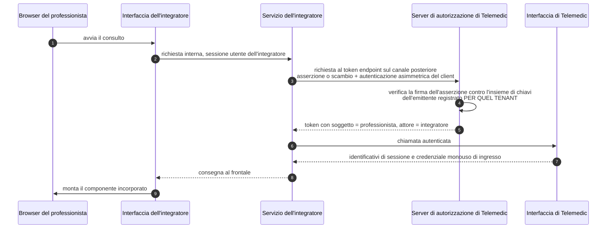

# Identità e autorizzazione

Il funzionamento di OAuth, la meccanica dello scambio di codice con verificatore, la struttura di
un token firmato, i tranelli di validazione e il significato dei livelli di garanzia sono spiegati
nel modulo [«I protocolli, uno per uno», §4](../10_fondamenti/13-protocolli.md), e i tre canali
d'identità italiani nel modulo
[«Identità e anagrafiche»](../10_fondamenti/04-identita-e-anagrafiche.md). Questo capitolo
descrive **quali profili Telemedic implementa, come propaga l'identità di un utente autenticato
altrove e che cosa garantisce a chi integra**.

## 1. Il vincolo di partenza

L'integratore ha già la propria autenticazione. Telemedic deve accettare identità federate
**senza obbligare gli utenti a un secondo accesso**, e senza diventare l'anagrafe delle identità.
Ne discendono tre affermazioni che governano tutto il capitolo:

1. **L'asserzione di identità non transita mai dal browser.** Un'affermazione «questo è il
   professionista X» che arriva attraverso l'agente utente è manipolabile. La propagazione avviene
   **da servizio a servizio**, sul canale posteriore.
2. **Si usa la delega, mai l'impersonificazione.** L'audit deve poter rispondere alla domanda
   «quale sistema ha agito per conto di quale persona». Con l'impersonificazione quella domanda
   non ha risposta.
3. **Il progetto è conforme e verificabile, non accreditato.** Sui canali d'identità nazionali il
   fornitore di servizi è **chi installa**, mai il progetto. È il vincolo [V-05](../11_registri/01-vincoli-in-vigore.md#v-05), e cambia ciò che
   la documentazione può affermare.

## 2. La postura di base

Il riferimento di sicurezza è **RFC 9700**, buona pratica corrente per la sicurezza di OAuth 2.0.
Le prescrizioni che vincolano il progetto:

| Prescrizione | Sezione | Testo |
|---|---|---|
| Corrispondenza esatta degli indirizzi di ritorno | §2.1, §4.1.3 | I server «MUST utilize exact string matching»; unica eccezione la porta locale per applicazioni native |
| Verificatore di scambio del codice | §2.1.1 | I client pubblici «MUST use PKCE»; i server «MUST support PKCE» |
| Concessione implicita | §2.1.2 | I client «SHOULD NOT use the implicit grant» |
| Credenziali del proprietario della risorsa | §2.4 | «MUST NOT be used» |
| Token di aggiornamento dei client pubblici | §2.2.2 | «MUST be sender-constrained or use refresh token rotation» |
| Difesa dallo scambio di server | §2.1, §4.4.2 | I client che parlano con più server «SHOULD» usare il parametro di identificazione dell'emittente di **RFC 9207** |
| Restrizione del privilegio | §2.3 | Gli access token «SHOULD be audience-restricted to a specific resource server» |
| Falsificazione della richiesta | §2.1, §4.7.1 | I client «MUST» difendersi con lo stato, il verificatore o il numero usato una sola volta |

**Postura predefinita di Telemedic**, che va oltre il minimo in tre punti:

1. concessione implicita e credenziali del proprietario della risorsa **disabilitate a livello di
   configurazione del prodotto di federazione**, non solo sconsigliate;
2. il verificatore con metodo di hash è obbligatorio **su tutti i client, compresi i
   confidenziali**, e il metodo in chiaro è rifiutato;
3. ogni token porta un destinatario esplicito, e un server di risorse che non si riconosce nel
   destinatario **rifiuta**, invece di accettare qualunque token emesso dal proprio emittente.

## 3. I profili supportati

| Profilo | Versione | Quando si usa | Ruolo di Telemedic |
|---|---|---|---|
| **SMART App Launch** | 2.2.0 (dal 1° marzo 2023) | Telemedic lanciato dentro una cartella clinica; oppure Telemedic che lancia un'applicazione clinica | Server **e** client |
| **SMART Backend Services** | 2.2.0 | Il servizio dell'integratore chiama Telemedic senza utente | Server **e** client |
| **Scambio di token** | RFC 8693 | Propagazione dell'identità di un utente autenticato dall'integratore | Server |
| **Concessione con asserzione** | RFC 7523 §2.1 | Alternativa alla precedente, con un'asserzione firmata dall'emittente dell'integratore | Server |
| **Autenticazione asimmetrica del client** | RFC 7523 §2.2 | Autenticazione del client senza segreto condiviso | Server |
| **Autorizzazione in contesto IHE** | rev. 2.5 | Capitolato che richiede conformità a quel profilo | Corrispondenza documentale, §10 |
| **Registrazione dinamica** | RFC 7591 / 7592 | Onboarding automatizzato, **solo autenticato** | Server, con restrizioni |
| **Introspezione e revoca** | RFC 7662 / RFC 7009 | Verifica e revoca dei token | Server |
| Federazione dinamica a certificati | - | **Fuori perimetro v1.0**, §11 | - |

## 4. Gli ambiti di autorizzazione

### 4.1 La sintassi clinica

La forma generale è il prefisso di contesto, il tipo di risorsa e i permessi, con un eventuale
raffinamento su parametri di ricerca. I prefissi sono tre: accesso ristretto all'assistito in
contesto, accesso pari a quello che l'utente avrebbe comunque, accesso di sistema senza utente.

Le lettere della versione corrente sono creazione, lettura, aggiornamento, cancellazione e
ricerca, e **devono comparire nell'ordine della stringa che le enumera**: due combinazioni
riordinate non sono valide.

**Scelta di progetto:** sintassi corrente come forma nativa, **accettazione della sintassi
precedente in ingresso** con la conversione definita dalla specifica stessa - lettura verso
lettura e ricerca, scrittura verso creazione, aggiornamento e cancellazione, jolly verso tutte.
La motivazione è di attrito: l'integratore tipico ha con buona probabilità librerie datate, e
rifiutarle produrrebbe attrito senza guadagno di sicurezza, dato che la conversione è normata.

Il raffinamento con parametri di ricerca è supportato ed è la funzionalità che consente il
minimo privilegio senza inventare ambiti propri:

```
patient/Observation.rs?category=http://terminology.hl7.org/CodeSystem/observation-category|vital-signs
```

### 4.2 Gli ambiti di prodotto

Le capacità che **non** corrispondono a risorse cliniche non vanno mascherate da ambiti clinici.
La specifica prevede due forme legittime per gli ambiti non standard: un URI completo, oppure un
prefisso convenzionale. **Telemedic usa la forma a URI**, che è auto-documentante e non collide.

```
https://telemedic.example/scopes/session.start
https://telemedic.example/scopes/session.join
https://telemedic.example/scopes/recording.consent.manage
https://telemedic.example/scopes/webhook.manage
https://telemedic.example/scopes/monitoring.plan.manage
https://telemedic.example/scopes/bulk.export
```

Forzare l'avvio di una sessione dentro un ambito di scrittura sul contatto assistenziale sarebbe
un abuso semantico e renderebbe **impossibile revocare l'uno senza l'altro**.

**Regola sull'ambito di esportazione massiva:** non è mai concesso in modo predefinito, la sua
concessione è un atto amministrativo tracciato, e la sua presenza in un token attiva
l'introspezione obbligatoria di §8.3.

### 4.3 Lo scopo restituito può essere più stretto di quello richiesto

È un errore di integrazione ricorrente e va scritto nella documentazione pubblica: **il client
deve leggere lo scopo restituito nella risposta al token e non assumere che coincida con quello
richiesto**. Telemedic restringe lo scopo alla concessione effettiva del client, del tenant e -
nel caso della delega - dei permessi del soggetto.

## 5. La delega fra organizzazioni

### 5.1 Il problema, in una figura



Il punto cruciale è che **il token dell'utente non arriva mai al browser di Telemedic e non
compare mai in un indirizzo**.

### 5.2 Delega, non impersonificazione

La distinzione è normativa, definita in **RFC 8693 §1.1**, e ha conseguenze dirette sul registro
immutabile.

**Impersonificazione**: si presenta solo il token del soggetto. Il token risultante rende
l'integratore indistinguibile dall'utente. Il registro annoterebbe soltanto «il professionista X
ha fatto Y», perdendo l'informazione «per il tramite del sistema Z».

**Delega**: il token risultante contiene **entrambe** le identità, con l'attore espresso nel claim
dedicato di **RFC 8693 §4.1**. La catena annidata è preservata: se l'integratore agiva a sua volta
per conto di un terzo, la catena lo registra.

> **Regola vincolante di progetto: si usa sempre la delega, mai l'impersonificazione.** Nessuna
> configurazione supportata emette un token privo del claim dell'attore quando l'identità proviene
> da un emittente esterno.

```json
{
  "iss": "https://telemedic.example/oauth2",
  "aud": "telemedic-api",
  "sub": "https://idp.integratore.example#prof-0071",
  "act": {
    "sub": "b1f2c3d4-client-integratore",
    "iss": "https://telemedic.example/oauth2"
  },
  "exp": 1789235182,
  "iat": 1789234882,
  "jti": "0f5b1c2d-9a8e-4b7f-a1c2-3d4e5f6a7b8c",
  "scope": "https://telemedic.example/scopes/session.start system/Encounter.cu",
  "acr": "https://www.spid.gov.it/SpidL2",
  "tm_acr_origin": "asserted-by-client",
  "tenant": "tenant-a",
  "fhirUser": "https://telemedic.example/fhir/PractitionerRole/prole-4d1c"
}
```

Note sui claim, con la distinzione fra ciò che è normato e ciò che è del progetto:

- il **soggetto** non è un identificativo inventato da Telemedic: è derivato in modo deterministico
  dall'emittente e dal soggetto del token originale. Così due professionisti omonimi di due
  integratori diversi non collidono, e il progetto non diventa l'anagrafe delle identità;
- l'**attore** è il claim normato di RFC 8693 §4.1;
- il **contesto di autenticazione** è normato, ma la sua qualificazione è del progetto: §6.3;
- **tenant** e **utente clinico** sono claim di progetto; il secondo riusa il nome del claim del
  profilo di avvio applicativo per coerenza;
- **nessun claim porta contenuto clinico o identificativi diretti dell'assistito.** Chi intercetta
  il token lo legge.

### 5.3 Chi valida l'asserzione, e come nasce la fiducia

Il modello è **per tenant** e non ammette scorciatoie:

1. In fase di attivazione, per ogni tenant si registra un'**ancora di fiducia**: emittente
   dell'integratore, indirizzo del suo insieme di chiavi pubbliche, algoritmi ammessi, destinatario
   atteso.
2. Il client che presenta la richiesta è legato al tenant. Il legame client → tenant → ancora di
   fiducia è la sola via: **non si accetta un'asserzione il cui emittente non sia l'ancora di
   fiducia del tenant del client chiamante**. Senza questo controllo, l'integratore A potrebbe
   presentare un'asserzione dell'emittente dell'integratore B.
3. Validazione: firma, emittente, scadenza, validità iniziale, destinatario, e **algoritmo in
   elenco esplicito**. Mai l'algoritmo nullo, mai un algoritmo simmetrico su una chiave pubblica.
4. Mappatura dei claim verso l'identità interna tramite un traduttore **configurabile per
   tenant**: quale claim porta il ruolo, quale l'organizzazione, quale l'identificativo
   professionale. Configurabile, non cablato: nessuna logica su un singolo integratore.

L'indirizzo dell'insieme di chiavi è su **elenco esplicito per tenant**. Un indirizzo arbitrario
nell'intestazione di un token è una superficie di richiesta verso risorse interne e un vettore di
confusione di chiavi: il valore nell'intestazione **non va mai seguito ciecamente**, va
confrontato con quello registrato per quel client, e se non coincide la richiesta è rifiutata. La
cache dell'insieme di chiavi ha una durata, il recupero forzato avviene solo su identificativo di
chiave sconosciuto, ed è limitato in frequenza perché un identificativo casuale non diventi un
amplificatore di traffico verso terzi. È lo stesso registro unico della questione **[Q-161](../11_registri/02-questioni-aperte.md#q-161)**.

### 5.4 Due meccanismi, e un cancello di rilascio

Due meccanismi realizzano la stessa cosa e vanno tenuti distinti perché hanno tipi di concessione
diversi. **RFC 7523 definisce due usi del token firmato che si confondono con facilità**: come
concessione di autorizzazione (§2.1, parametro dell'asserzione, tipo di concessione dedicato) e
come autenticazione del client (§2.2, parametri dell'asserzione del client, con qualunque tipo di
concessione). Il profilo dei servizi di backend usa il **secondo**; l'incatenamento dell'identità
usa **entrambi, in passi diversi**.

**Modalità primaria documentata:** concessione con asserzione. L'integratore presenta al punto di
emissione dei token di Telemedic un'asserzione firmata dal proprio emittente.

**Modalità alternativa:** scambio di token puro, con l'avvertenza che la disponibilità dello
scambio da emittente esterno a interno **dipende dalla versione del prodotto di federazione
adottato**.

> **Cancello di rilascio, non negoziabile.** Al momento della ricerca, il prodotto di federazione
> adottato offriva lo scambio di token conforme con perimetro iniziale **interno-interno**, e la
> concessione con asserzione in stato di **anteprima**. **Non si dichiara disponibile in generale
> una funzionalità che poggia su una funzione in anteprima.** È un requisito di qualità del ciclo
> di vita del software, non una precauzione di stile. La verifica va condotta sulla versione
> esattamente adottata **prima** di scriverlo nella documentazione pubblica.
>
> **Da chiedere a**: area di architettura e `TECH`, con verifica empirica sulla versione
> effettivamente adottata. È connessa alla questione **[Q-160](../11_registri/02-questioni-aperte.md#q-160)** della bacheca, che riguarda un altro
> comportamento non verificato dello stesso prodotto di federazione.

### 5.5 Quando la delega non si usa

| Situazione | Perché | Alternativa |
|---|---|---|
| L'integratore non ha un emittente con chiavi pubblicabili | Non c'è nulla da validare | Federazione classica con accesso, anche silente |
| Serve un'identità di sistema, non di utente | Si aggiungerebbe un soggetto fittizio | Credenziali del client con autenticazione asimmetrica |
| Il flusso parte dal browser e l'integratore non ha un servizio | L'asserzione transiterebbe nel browser: manipolabile e registrabile | Scambio del codice con verificatore e federazione |
| Il token dell'integratore è opaco e non c'è introspezione | Nessun modo di validarlo | Chiedere un token di identità firmato |
| L'integratore vuole «un token che dura tutto il giorno» | Vanifica la revoca | Ripetere lo scambio a ogni operazione: costa una chiamata, non una sessione |

## 6. Il livello di garanzia, e come si propaga

### 6.1 I valori

I valori dei tre livelli d'identità nazionali sono verificati e **identici** nei due profili
tecnici in cui possono comparire - l'asserzione nel profilo a buste XML e il parametro nel
profilo a connessione d'identità:

| Livello | Valore esatto | Corrispondenza secondo lo standard internazionale sui livelli di garanzia |
|---|---|---|
| Livello 1 | `https://www.spid.gov.it/SpidL1` | Livello 2 |
| Livello 2 | `https://www.spid.gov.it/SpidL2` | Livello 3 |
| Livello 3 | `https://www.spid.gov.it/SpidL3` | Livello 4 |

Nel profilo a buste XML i valori stanno nell'elemento del contesto di autenticazione dentro la
richiesta di contesto; nel profilo a connessione d'identità stanno nel parametro dei valori di
contesto, **separati da spazio e in ordine di preferenza decrescente**. La sintassi è citata
verbatim dalla fonte: *«Stringa separata da uno spazio, che specifica i valori "acr" richiesti al
server di autorizzazione per l'elaborazione della richiesta di autenticazione, con i valori
visualizzati in ordine di preferenza.»*

> **Valori accettati dal fornitore dell'identità elettronica su documento** `[NV]` da chiedere al
> fornitore di identità. Le regole tecniche descrivono il parametro dei valori di contesto ma **rinviano ai
> metadati del fornitore** per l'elenco effettivo. I valori vanno quindi **letti a runtime dai metadati**,
> non cablati. Se
> serve un elenco statico, va richiesto al gestore dell'identità e citato con il documento
> contrattuale, non con una fonte tecnica pubblica.
> **Da chiedere a**: `INTEG`, che ha in carico la federazione.

### 6.2 Dove viaggia il livello

**Non nel claim dell'attore.** RFC 8693 §4.1 esprime la delega, non il livello di garanzia:
metterlo lì sarebbe un abuso del claim. Il livello viaggia nel **contesto di autenticazione**, che
è il claim previsto per questo scopo.

### 6.3 La qualificazione, che è la parte che conta

Un livello di garanzia in un token può significare due cose radicalmente diverse:

- **l'autenticazione è stata eseguita da Telemedic**, che ha visto l'asserzione del fornitore
  d'identità e ne ha verificato la firma;
- **il livello è riferito dall'integratore**, che afferma di aver autenticato l'utente a quel
  livello nel proprio dominio.

Sono due fatti con forza probatoria diversa, e confonderli significa attribuire a un'affermazione
di terzi il peso di una verifica propria. Il progetto li distingue con un **marcatore proprio,
accanto al claim normato**, che dichiara l'origine del livello: eseguita dal sistema, oppure
asserita dal client. Il marcatore è un claim di progetto, dichiarato come tale, e viene
**registrato nel tracciamento insieme all'operazione**: il registro immutabile deve poter dire con
quale livello di garanzia, e su quale base, un'operazione è stata compiuta.

### 6.4 Il vincolo che nasce dalla configurazione della federazione

Un fatto accertato che vincola l'architettura: il connettore verso il canale d'identità nazionale
configura il contesto di autenticazione richiesto **staticamente sulla singola istanza di
fornitore**. Un livello variabile per operazione richiede quindi **un'istanza per ciascuna coppia
fornitore e livello**. La decisione di perimetro presa dall'`INTEG` riduce il fattore
a due - un livello di base e uno superiore per le operazioni di amministrazione - invece che alla
cardinalità dei livelli.

Verso l'integratore **non c'è impatto di interfaccia**: ciò che cambia è che il livello propagato
è quello **richiesto**, non quello asserito di ritorno. Questa distinzione ha una ragione
verificata: sul canale dell'identità elettronica su documento le regole tecniche dichiarano che
il contesto restituito è **sempre il livello più alto**, quindi **il livello effettivo non è
desumibile dall'asserzione**. Chi legge il livello dalla risposta legge un valore costante.

> **Inoltro del livello richiesto attraverso il realm di intermediazione** `[NV]` da chiedere al
> fornitore di identità. Non è verificato se il prodotto di federazione, agendo da client verso un
> fornitore esterno, inoltri
> il parametro del livello richiesto attraverso il realm che fa da intermediario. Se non lo
> inoltra, l'innalzamento di livello per operazione non è ottenibile per sola configurazione.
> È la questione **[Q-160](../11_registri/02-questioni-aperte.md#q-160)** della bacheca, e la verifica empirica va messa sul percorso critico
> **prima** di dichiarare in documentazione pubblica come si propaga il livello.
> **Da chiedere a**: area di architettura e `TECH`.

## 7. L'avvio applicativo in contesto clinico

### 7.1 Le due modalità

**Avvio dalla cartella clinica.** La cartella apre l'indirizzo di avvio con due parametri:
l'emittente, che identifica il punto d'ingresso clinico della cartella, e un identificativo opaco
dell'avvio con il contesto associato. **L'applicazione non deve interpretare** l'identificativo
opaco: lo rimanda al server di autorizzazione insieme all'ambito dedicato.

**Avvio autonomo.** L'applicazione è il punto di partenza; il contesto si chiede con gli ambiti
dedicati e il server presenta un selettore.

I parametri della richiesta di autorizzazione, con la loro obbligatorietà:

| Parametro | Obbligatorietà | Valore |
|---|---|---|
| Tipo di risposta | Required | Valore fisso per il flusso a codice |
| Identificativo del client | Required | - |
| Indirizzo di ritorno | Required | Corrispondenza **esatta** con uno pre-registrato |
| Identificativo di avvio | Condizionale | Solo per l'avvio dalla cartella |
| Ambiti | Required | Risorse, identità, contesto |
| Stato | Required | Valore opaco, **almeno 122 bit di entropia** secondo la specifica |
| Destinatario | Required | Indirizzo del server di risorse clinico |
| Sfida del verificatore | Required | Versione derivata con funzione di hash |
| Metodo della sfida | Required | Il metodo con hash; quello in chiaro è **vietato** |

Il parametro del destinatario **non è cosmetico**: la specifica lo motiva perché «previene la
fuga di un token genuino verso un server di risorse contraffatto». Un server di autorizzazione che
non lo valida consente a un server ostile di farsi emettere token validi per sé.

Sul verificatore la specifica è categorica: tutte le applicazioni **SHALL** supportarlo, e i
server **SHALL** supportare il metodo con hash e **SHALL NOT** supportare quello in chiaro. È più
stringente della specifica che definisce il verificatore, la quale ammette anche il metodo in
chiaro. Nella configurazione del prodotto di federazione il metodo è **forzato**, e i client che
non presentano la sfida sono rifiutati, non degradati.

### 7.2 Il contesto che arriva con il token

La risposta all'emissione del token estende la risposta ordinaria con i parametri di contesto:
l'identificativo dell'assistito, quello del contatto assistenziale, un elenco di riferimenti a
risorse di contesto ulteriori, un suggerimento sull'intestazione dell'assistito, un'indicazione
del perché dell'avvio, un indirizzo a un documento di stile pubblicato dalla cartella, e un
identificativo di organizzazione.

Quattro di questi risolvono requisiti del progetto che altrimenti richiederebbero estensioni
proprietarie, e vanno usati **prima** di inventarne:

- il **suggerimento sull'intestazione dell'assistito** risponde alla domanda «l'ospitante mostra
  già chi è l'assistito?». Se sì, il componente incorporato **non deve duplicare** l'intestazione;
- l'**indirizzo del documento di stile** è il meccanismo **standard** di personalizzazione visiva
  per un'applicazione clinica, e va documentato come *primo* meccanismo di tema quando Telemedic è
  lanciato in questa modalità. Va però trattato come **ingresso non fidato**: è un indirizzo
  controllato da un terzo, e le sue regole di sicurezza appartengono all'area di sicurezza;
- l'**identificativo di organizzazione** è direttamente mappabile sul contesto di tenant;
- l'**elenco dei riferimenti di contesto** è la sede naturale del riferimento all'appuntamento
  che ha originato il consulto, e risponde al requisito che il progetto possa essere invocato con
  un appuntamento già esistente.

### 7.3 Il ciclo di vita del componente incorporato

L'applicazione incorporata deve poter chiedere all'ospitante di fare qualcosa - chiudere
l'attività, aprire un'altra schermata - senza passare per l'interfaccia clinica. Esiste un profilo
dedicato, alla versione **1.0.0 del 6 maggio 2022**, su base R4.

La busta di richiesta ha quattro campi obbligatori: un riferimento di canale ottenuto durante
l'avvio, un identificativo del messaggio generato dall'applicazione, il tipo del messaggio e il
carico. La risposta ha l'identificativo del messaggio, il riferimento al messaggio a cui risponde,
un indicatore facoltativo di ulteriori risposte attese - **al plurale**, e il dettaglio conta -
e il carico.

I tipi di messaggio realmente definiti sono **otto**, organizzati in quattro famiglie:

| Tipo | Carico della richiesta | Carico della risposta |
|---|---|---|
| Stretta di mano di stato | vuoto | vuoto, con eventuale errore in forma di codifica |
| Attività conclusa | vuoto | stato, dettaglio facoltativo |
| Avvio di un'attività | tipo di attività e parametri | stato, dettaglio facoltativo |
| Creazione nell'area di lavoro | risorsa | stato, posizione, esito facoltativo |
| **Lettura dell'area di lavoro** | posizione, **facoltativa** | risorsa oppure elenco, esito facoltativo |
| Aggiornamento nell'area di lavoro | risorsa con tipo e identificativo | stato, esito facoltativo |
| Cancellazione nell'area di lavoro | posizione | stato, esito facoltativo |
| Chiamata clinica | raccolta | raccolta oppure esito |

Il tipo di lettura dell'area di lavoro **esiste ed è valido**: consente di selezionare una singola
risorsa indicandone la posizione, oppure l'intero contenuto omettendo la posizione. Le risorse
restituite **SHALL** includere sia il tipo sia l'identificativo.

Da non confondere con i tipi di messaggio: il catalogo delle attività definisce **tre** attività
avviabili - prenotazione di appuntamento, revisione di ordini, revisione di un problema - ciascuna
con un parametro obbligatorio proprio. Non sono tipi di messaggio e non vanno mescolati.

Regole di sicurezza del canale: l'applicazione **valida l'origine** di ogni messaggio ricevuto e
l'ospitante valida l'origine di destinazione di ogni messaggio inviato; l'origine di destinazione
è quella comunicata durante l'avvio, **mai il carattere jolly**. Il riferimento di canale è un
portatore di autorizzazione dentro il canale: **non va mai registrato nei log né messo in un
indirizzo**.

**Uso in Telemedic**, con un limite dichiarato: il profilo è la via **standard** per segnalare
all'ospitante che il consulto è terminato, ed è quella da usare quando l'ospitante lo implementa.
Poiché il profilo dell'integratore di riferimento quasi certamente **non** lo implementa, il
progetto offre **entrambe** le strade: il profilo standard verso gli ospitanti conformi e un
protocollo di messaggi proprio, documentato e versionato, per tutti gli altri.

## 8. Token: formato, durata, revoca

### 8.1 Formato

| Aspetto | Token autoportante | Token opaco con introspezione |
|---|---|---|
| Latenza di validazione | Nulla | Una chiamata di rete, mitigabile con cache |
| Revoca | Ritardata fino alla scadenza | Immediata |
| Esposizione | I claim sono leggibili da chi ha il token | Nessuna |
| Dimensione | Cresce con i claim | Costante |

**Scelta di progetto: token opachi verso l'esterno, tradotti in token autoportanti dal gateway.**
Vantaggi: revoca effettiva, nessun claim esposto, dimensione contenuta delle intestazioni. Costo:
il gateway diventa componente critico e va reso ridondante. La decisione ha impatto su latenza e
topologia ed è la questione **[Q-135](../11_registri/02-questioni-aperte.md#q-135)** aperta verso l'area di architettura, che quest'area non
decide.

### 8.2 Durata

| Tipo di token | Durata | Motivo |
|---|---|---|
| Token utente in contesto clinico | 5–10 minuti | Porta claim su un contesto clinico: finestra di rigioco minima |
| Token di sistema | 300 secondi | La specifica dei servizi di backend indica esplicitamente questo valore come raccomandato |
| Token di aggiornamento legato alla sessione | Legato alla sessione di autenticazione unica | - |
| Token di aggiornamento che sopravvive alla disconnessione | **Solo a client confidenziali asimmetrici, con rotazione** | Su un client pubblico, in ambito sanitario, è un rischio di custodia difficile da giustificare in un'analisi dei rischi |

### 8.3 La finestra di revoca, dichiarata onestamente

Un token verificato localmente **resta valido fino alla scadenza anche dopo la revoca**. È il
motivo per cui i token clinici durano minuti e non ore, e va documentato invece di lasciar credere
che la revoca sia istantanea.

Per le revoche che devono essere immediate - professionista disabilitato, tenant sospeso - esiste
un meccanismo aggiuntivo: un **elenco di negazione distribuito** su identificativo del token e
soggetto, con durata pari alla vita massima di un token, consultato dal gateway.

**Introspezione sulle operazioni ad alto impatto** (P-10): i server di risorse **non** usano
l'introspezione sul percorso caldo ordinario, dove validano localmente contro l'insieme di chiavi.
La usano sulle operazioni **irreversibili o ad alto impatto**: avvio di una sessione,
pubblicazione o annullamento di un documento, esportazione massiva, modifica di un piano di
rilevazione. Il costo è una chiamata di rete su quelle operazioni; il beneficio è che la finestra
di revoca non si applica proprio dove sarebbe inaccettabile.

Entrambi gli endpoint - introspezione e revoca - sono pubblicati e dichiarati nel documento di
scoperta. La revoca risponde con esito positivo anche se il token era già invalido, per non
fornire un oracolo.

### 8.4 Token vincolati al mittente

| Criterio | Prova di possesso applicativa | Autenticazione mutua di trasporto |
|---|---|---|
| Client di navigazione | Praticabile, con chiave non esportabile | Impraticabile |
| Servizio verso servizio | Praticabile | **Preferibile**: più maturo, gestito dal proxy inverso |
| Compatibilità con terminazione del trasporto | Indifferente | Richiede la propagazione del certificato all'applicazione |
| Rotazione | Immediata | Legata al ciclo di vita del certificato |
| Maturità nell'ecosistema sanitario | Bassa | **Alta**: le connessioni fra sistemi sanitari sono spesso già mutue |

**Scelta di progetto:** autenticazione mutua di trasporto come opzione **raccomandata** per
l'integrazione da servizio a servizio, coerente con il requisito di autenticazione di nodo del
capitolo [05](./05-ihe.md); prova di possesso applicativa come opzione per i client di
navigazione; token portatore semplice come predefinito documentato, con l'avvertenza esplicita
che è accettabile **solo** su trasporto protetto e con token a vita breve.

Due avvertenze: una chiave di prova di possesso conservata in modo estraibile **non aggiunge
sicurezza** rispetto al portatore semplice, aggiunge complessità e un falso senso di protezione;
e nessuno dei due meccanismi sostituisce la restrizione del destinatario - un token vincolato al
mittente ma con destinatario troppo ampio resta sovra-privilegiato.

## 9. Scoperta

Telemedic pubblica **due** documenti di scoperta, con scopi distinti, ed entrambi sono necessari:

| Documento | Percorso | Descrive |
|---|---|---|
| Configurazione dell'avvio applicativo clinico | percorso ben noto sotto la base clinica | Le capacità del profilo clinico |
| Configurazione del fornitore d'identità | percorso ben noto standard | Il fornitore di connessione d'identità |

I campi **obbligatori** del primo, verificati: i tipi di concessione supportati; il punto di
emissione dei token; l'elenco delle capacità; i metodi di sfida del verificatore supportati, che
**devono includere** il metodo con hash e **non devono includere** quello in chiaro. Sono
condizionali l'emittente, se si supporta l'accesso unico con connessione d'identità; l'indirizzo
dell'insieme di chiavi; il punto di autorizzazione, se si supporta una delle due modalità di
avvio. Sono raccomandati i metodi di autenticazione del client, gli ambiti supportati, i tipi di
risposta, il punto di gestione, quelli di introspezione e di revoca.

**Il documento di capacità clinico non è più il canale di scoperta degli endpoint di
autorizzazione.** La specifica lo dichiara espressamente: quel meccanismo è deprecato. Telemedic
emette comunque l'estensione corrispondente sul documento di capacità per compatibilità con client
datati, e la marca come deprecata nella documentazione.

## 10. Corrispondenza con il profilo di autorizzazione IHE

Poiché entrambi i profili profilano lo stesso protocollo sottostante, **l'implementazione è la
stessa**: cambia la documentazione di conformità. La tabella è ciò che consente di rispondere a un
capitolato che richiede quel profilo senza riscrivere nulla.

| Transazione del profilo IHE | Corrispondenza in Telemedic |
|---|---|
| Ottenimento del token (ITI-71) | Richiesta al punto di emissione dei token |
| Incorporazione del token (ITI-72) | Intestazione di autorizzazione con token portatore |
| Introspezione del token (ITI-102) | Endpoint di introspezione, RFC 7662 |
| Metadati del server di autorizzazione (ITI-103) | Documento di scoperta del fornitore d'identità |

I claim richiesti dal profilo - emittente, soggetto, identificativo del client, destinatario,
scadenza, ambiti, identificativo del token - sono tutti presenti. Le estensioni facoltative che
raccolgono organizzazione, ruoli e finalità d'uso in un oggetto dedicato sono emesse **su
richiesta del tenant**, non sempre, per non gonfiare i token dove non servono.

## 11. Registrazione dei client

**L'endpoint di registrazione non è aperto.** Due modalità supportate:

1. **Attivazione assistita**, predefinita: un amministratore di tenant crea il client dalla
   console, registra l'indirizzo dell'insieme di chiavi, gli indirizzi di ritorno, gli ambiti
   massimi, le quote e le destinazioni degli eventi.
2. **Registrazione dinamica autenticata**: l'endpoint è protetto da un token di accesso iniziale
   emesso per tenant, con ambiti massimi limitati dalla politica del tenant.

Un endpoint di registrazione anonimo su una piattaforma sanitaria multi-tenant è un vettore di
abuso - creazione massiva di client, enumerazione, richieste verso risorse interne attraverso
l'indirizzo dell'insieme di chiavi - senza contropartita. E un endpoint che automatizza la
registrazione sta prendendo decisioni che sono contrattuali, non tecniche: quale tenant, quali
ambiti, quale accordo sul trattamento dei dati.

La **federazione dinamica basata su certificati** è documentata come pattern e **non implementata
in v1.0**: è il meccanismo di fiducia di un ecosistema extraeuropeo, mentre nel mercato di
riferimento la fiducia si costruisce con altri strumenti. Il modello di registrazione dei client
resta però **predisposto** a un'ancora di fiducia basata su una catena di certificati, perché il
meccanismo sottostante - un'asserzione firmata validata contro una catena - è identico a quello
che servirebbe per una federazione nazionale.
