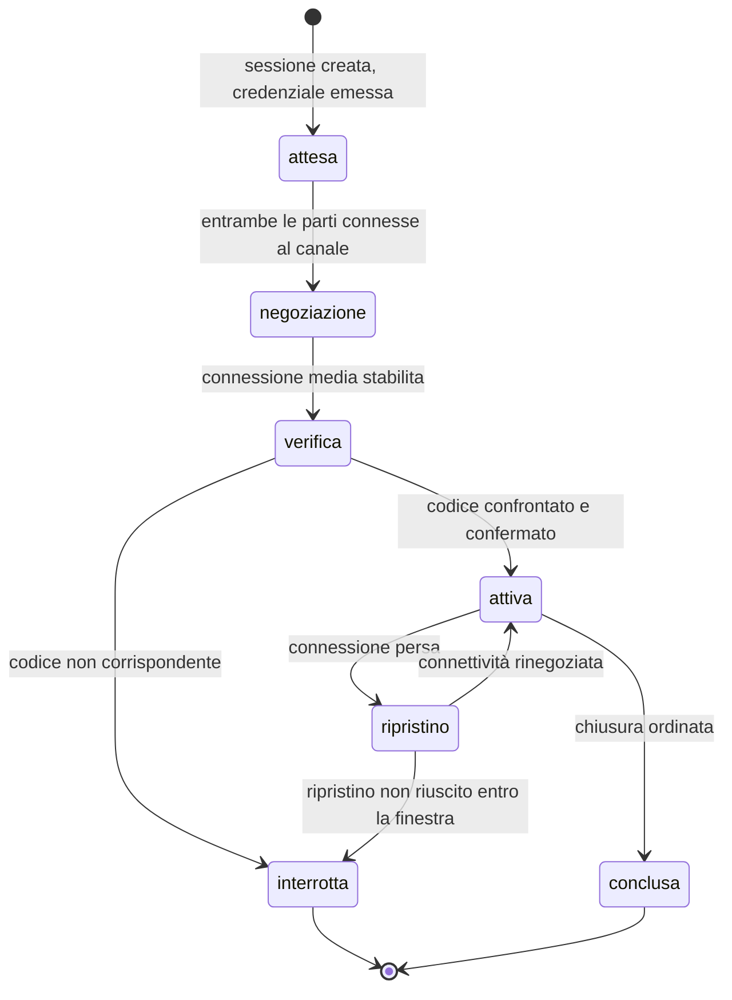

# Tempo reale

> **Prerequisito di lettura.** I fondamenti del media in tempo reale — perché una videochiamata
> è un problema difficile, che cosa sono la traduzione degli indirizzi e i suoi tipi, come
> funzionano la raccolta dei candidati e la scelta del percorso, che cosa la cifratura garantisce e
> che cosa non garantisce, perché l'impronta del certificato da sola non basta, come si misura la
> qualità — sono nel modulo [«WebRTC da zero»](../10_fondamenti/08-webrtc-da-zero.md). Questo
> capitolo **non li ripete** e descrive soltanto il protocollo di progetto.

## 1. Perché qui esiste un protocollo di progetto

È l'unica eccezione alla regola del capitolo [01 §1.1](./01-principi-di-interoperabilita.md), e la
ragione è nella specifica stessa: **lo scambio delle descrizioni di sessione è deliberatamente
lasciato fuori** dai corpi normativi del media in tempo reale, che normano la negoziazione, il
trasporto, la sicurezza e il controllo della congestione, ma non il canale su cui le due parti si
scambiano le descrizioni.

Non è una lacuna: è una scelta, perché quel canale dipende dal modello applicativo. Ne discende
che ogni sistema ne definisce uno, e che il compito della documentazione è **dichiararlo per
intero**: trasporto, buste, catalogo dei messaggi, macchina a stati, versionamento.

## 2. Il trasporto della segnalazione

Il trasporto è un **canale a socket web** su connessione protetta, con un protocollo applicativo
JSON **versionato e validato a schema**. Le alternative — un livello di messaggistica sovrastante,
un ripiego su richieste HTTP ripetute, l'adozione di un protocollo di telefonia — aggiungono
complessità o vincoli di affinità di sessione senza beneficio in una sessione a due partecipanti.

### 2.1 Il requisito normativo che vincola l'architettura

**RFC 8838 §9** stabilisce che il protocollo che trasporta i candidati deve consegnarli
*«exactly once and in the same order it was conveyed»*.

Tradotto in requisito: **la coda dei candidati per ciascuna sessione deve essere ordinata e
affidabile**. Un meccanismo di diffusione «pubblica e dimentica» fra più nodi del servizio di
segnalazione **non lo garantisce**, e il difetto che ne deriva è intermittente, dipendente dal
carico e difficilissimo da diagnosticare: la sessione si stabilisce nove volte su dieci e la
decima no, senza errore visibile.

La scelta di come distribuire lo stato di sessione fra più nodi è quindi **vincolata da questa
riga**. Le opzioni compatibili sono l'affinità di connessione al nodo che possiede la sessione,
oppure una coda ordinata per chiave di sessione. La scelta appartiene all'area di architettura;
quest'area pone il vincolo e ne dichiara la fonte.

### 2.2 La busta

```json
{
  "v": 1,
  "t": "candidate",
  "sid": "ses_01J9ZC5P",
  "seq": 7,
  "ts": "2026-09-14T10:12:07.114Z",
  "d": { }
}
```

| Campo | Significato |
|---|---|
| `v` | Versione maggiore del protocollo. Una rottura incrementa questo numero |
| `t` | Tipo del messaggio, dal catalogo di §3 |
| `sid` | Identificativo di sessione |
| `seq` | Numero di sequenza monotono **per direzione e per sessione**: è ciò che rende verificabile il requisito di §2.1 |
| `ts` | Istante di emissione |
| `d` | Contenuto, con schema dipendente dal tipo |

**Il messaggio è validato a schema all'ingresso**, prima di qualunque elaborazione. Un messaggio
che non valida è rifiutato con un errore tipizzato, non interpretato parzialmente. La versione del
protocollo è negoziata all'apertura del canale: un client che dichiara una versione non supportata
riceve un rifiuto esplicito, non un canale che funziona a metà.

## 3. Il catalogo dei messaggi

| Tipo | Direzione | Contenuto | Note |
|---|---|---|---|
| `hello` | client → servizio | Versione del protocollo, capacità dichiarate del client | Primo messaggio |
| `welcome` | servizio → client | Versione accordata, parametri della sessione, configurazione dei server di attraversamento | Risposta a `hello` |
| `offer` | client → servizio → controparte | Descrizione di sessione dell'offerente | Inoltrata, non interpretata |
| `answer` | client → servizio → controparte | Descrizione di sessione del rispondente | Inoltrata, non interpretata |
| `candidate` | bidirezionale | Candidato di connettività | Ordine e unicità garantiti, §2.1 |
| `candidate-end` | bidirezionale | Fine della raccolta | — |
| `restart` | bidirezionale | Richiesta di rinegoziazione della connettività | Dopo una caduta |
| `verification-code` | servizio → entrambi | Codice breve di verifica della sessione | §5 |
| `verification-result` | client → servizio | Esito del confronto dichiarato dall'utente | Tracciato |
| `mode-changed` | servizio → entrambi | Passaggio fra modalità con e senza registrazione | §6 |
| `quality` | client → servizio | Campione di metriche | Aggregato, non per pacchetto |
| `degrade` | servizio → client | Istruzione di degradazione | §8 |
| `peer-state` | servizio → client | Presenza e stato della controparte | Distingue «assente» da «in difficoltà» |
| `bye` | bidirezionale | Chiusura ordinata | Con motivo classificato |
| `error` | servizio → client | Errore tipizzato | Con codice del catalogo unico |

**Il servizio di segnalazione non interpreta le descrizioni di sessione.** Le inoltra e le
registra come opachi. Interpretarle significherebbe assumersi la responsabilità di modificarle,
che è esattamente il punto in cui un intermediario diventa un attaccante intermedio: il problema è
descritto nel modulo dei fondamenti e non si risolve leggendo il contenuto, si risolve con la
verifica di §5.

**Il servizio conosce però lo stato**, perché deve: chi è connesso, in quale sessione, con quale
identità, in quale modalità. È ciò che rende possibile distinguere «l'altra parte non è ancora
arrivata» da «l'altra parte è arrivata e la connessione non si stabilisce», che sono due
situazioni che richiedono azioni opposte dall'utente.

## 4. La macchina a stati della sessione



Due precisazioni che discendono da vincoli del progetto.

**Questa non è la macchina a stati della prestazione.** La prestazione ha il proprio ciclo di vita
sul piano clinico, e i due sono correlati ma distinti: è il vincolo V-01. Una prestazione può
attraversare più sessioni; una sessione può esistere per una prova tecnica senza alcuna
prestazione.

**Lo stato di verifica è uno stato, non un passaggio.** La sessione **non entra in stato attivo**
finché la verifica non è confermata. Trattare la verifica come un avviso ignorabile la renderebbe
inutile.

## 5. La verifica della sessione

### 5.1 Perché è obbligatoria, e perché non c'è alternativa

La cifratura del media protegge il canale fra i due estremi, ma **non dice chi è l'estremo**.
L'associazione fra la chiave e l'interlocutore passa dalla segnalazione, e chi controlla la
segnalazione può sostituirla. La contromisura che la specifica prevedeva — un'interfaccia che
consente a un fornitore d'identità di attestare le chiavi — è stata verificata come **non
utilizzabile**:

- il documento che la definisce è fermo allo stadio di raccomandazione candidata **dal 27
  settembre 2018**, e il passaggio allo stadio successivo, atteso per la fine di quell'anno, non è
  mai avvenuto. Dal 2021 il repository della specifica non registra un solo commit sostanziale;
- **è funzionalmente monobrowser**: un solo motore la implementa, dal 2015; due non l'hanno mai
  implementata; il terzo l'aveva e l'ha persa cambiando motore nel 2020;
- anche ammesso il supporto universale, richiederebbe un **fornitore d'identità terzo** che ospiti
  lo script di attestazione, il che creerebbe una dipendenza di esecuzione da un terzo — in
  tensione diretta con il vincolo di sovranità — e sposterebbe l'ancora di fiducia dal servizio di
  segnalazione al fornitore, senza eliminarla.

> **Conclusione, senza attenuazioni: la stringa breve di verifica non è una fra due strade. È
> l'unica.** La raccomandazione va promossa a **requisito**, e il rischio corrispondente va
> classificato come privo di mitigazione alternativa standard.

### 5.2 Come funziona nel protocollo

Il codice è **derivato dalle impronte dei certificati** delle due parti, non generato dal
servizio: se lo generasse il servizio, un servizio compromesso genererebbe due codici uguali per
due sessioni diverse e la verifica non proverebbe nulla. Il servizio si limita a innescare il
messaggio; il calcolo avviene ai due estremi.

Le due parti **confrontano il codice a voce**, sul canale che hanno appena stabilito. Se
corrisponde, l'associazione fra chiave e interlocutore è attestata da un canale che l'attaccante
sulla segnalazione non controlla.

L'esito dichiarato dall'utente è **tracciato**: il registro immutabile registra se la verifica è
stata confermata, non confermata o saltata, e il referto ne porta l'evidenza secondo la mappatura
del capitolo [03 §3.1](./03-documenti-clinici.md).

### 5.3 I requisiti che ne fanno una funzione utile invece che un ostacolo

Sono vincolanti quanto il meccanismo, perché una verifica che l'utente non riesce a compiere è una
verifica che non avviene:

1. il codice è **leggibile da un lettore di schermo**;
2. **non è mai veicolato dal solo colore**;
3. è comprensibile a una persona anziana o poco alfabetizzata digitalmente: la forma e la
   lunghezza sono scelte con questo criterio, non con quello dell'entropia massima;
4. esiste una **procedura definita e visibile in caso di mancata corrispondenza**, che non è
   «riprova»: la sessione si interrompe e l'evento è tracciato;
5. la funzione è **attiva per impostazione predefinita** e la sua disattivazione, dove ammessa da
   una configurazione di tenant, è un atto amministrativo tracciato con motivazione.

## 6. Le due modalità, e il loro segnale

Il progetto ha **due modalità di sessione**, e la differenza è dichiarata invece che nascosta:

| Modalità | Percorso del media | Cifratura fino agli estremi | Quando |
|---|---|---|---|
| **Senza registrazione** — predefinita | Diretto quando la rete lo consente, altrimenti instradato da un relay che non decifra | **Sì** | Sempre, salvo consenso esplicito |
| **Con registrazione** | Terminato su un componente del servizio | **No** | Solo con consenso esplicito dell'assistito |

**La conseguenza è inderogabile e va scritta ovunque: quando la registrazione è attiva la
cifratura è terminata sul servizio e la sessione non è cifrata fino agli estremi.** Ne discendono
obblighi che appartengono al protocollo:

- il messaggio di cambio di modalità è **obbligatorio e non sopprimibile**: entrambe le parti lo
  ricevono, e il passaggio è tracciato;
- l'interfaccia segnala lo stato di registrazione in modo **persistente e non occultabile** per
  tutta la durata. Il protocollo garantisce che il segnale arrivi; l'interfaccia garantisce che sia
  visibile;
- l'informativa di consenso **dichiara esplicitamente** che la sessione non è più cifrata fino
  agli estremi. Non è una nota a piè di pagina: è il fatto che cambia la natura della garanzia;
- il **contenitore effettivo** della registrazione è negoziato a runtime, mai assunto, e viaggia
  nell'evento di disponibilità del capitolo [07 §3](./07-eventi-e-webhook.md). È il vincolo V-11,
  e nasce da una divergenza verificata fra i contenitori prodotti dai diversi ambienti di
  esecuzione.

## 7. Le credenziali temporanee del relay

### 7.1 Perché le credenziali statiche sono inaccettabili

Un server di relay è, per definizione, **un proxy autenticato che inoltra byte arbitrari verso un
indirizzo scelto dal client**. Chi ne ottiene una credenziale può farci transitare traffico, con
il costo di banda a carico di chi lo gestisce e la responsabilità del traffico instradato.

Le credenziali **devono essere consegnate al browser**, quindi al client, quindi all'utente. Una
credenziale statica è, per costruzione, **pubblica**: chiunque apra gli strumenti di sviluppo la
legge.

### 7.2 Il meccanismo

- nome utente: **istante di scadenza, due punti, identificativo**
- parola d'accesso: **codifica in base 64 del codice di autenticazione del messaggio calcolato sul
  nome utente con il segreto condiviso**

Il servizio emette la credenziale, il server di relay la verifica ricalcolando il codice con lo
stesso segreto. **Nessuna base dati di utenti, nessuno stato condiviso**: qualunque nodo può
validare qualunque credenziale.

### 7.3 Le quattro regole

1. **L'endpoint che emette la credenziale è autenticato, autorizzato e limitato in frequenza**, e
   verifica che il richiedente sia effettivamente parte di quella sessione. Altrimenti è un
   distributore automatico di accessi al relay.
2. **La durata è breve**: l'ordine di grandezza corretto è fra cinque minuti e un'ora, ed è
   configurazione, non costante.
3. **L'identificativo dentro la credenziale è opaco.** Finisce in chiaro nei registri del server di
   relay: **non deve mai essere un identificativo dell'assistito né del professionista**, ma un
   identificativo di sessione non correlabile senza accesso alla base dati del progetto. È
   minimizzazione, non preferenza.
4. **Il segreto condiviso viene da un gestore di segreti**, mai dal sorgente e mai dal repository.

### 7.4 Due dichiarazioni di onestà normativa

**Questo meccanismo non è uno standard.** Deriva da un Internet-Draft individuale **scaduto**. Lo
standard vero per l'autorizzazione di terza parte tramite token è **RFC 7635**. Il meccanismo qui
descritto è però l'unico con supporto universale nei browser e nei server di relay: si adotta, e
**lo si documenta per ciò che è — una convenzione di fatto**.

> **`[NV]` — algoritmo di hash sottostante.** La documentazione del server di relay indica
> genericamente la funzione di autenticazione del messaggio senza dichiarare l'algoritmo di hash.
> **Il modo corretto di risolvere il dubbio non è una citazione documentale ma un collaudo di
> integrazione**: emettere una credenziale con l'implementazione del progetto, tentare
> un'allocazione reale contro la versione del server effettivamente distribuita, e far fallire la
> costruzione se l'autenticazione non riesce. Verifica il comportamento della versione in
> produzione, che è ciò che conta.
> **Da chiedere a**: chi implementa il servizio, con il collaudo descritto.

### 7.5 La rotazione senza interruzione

Capacità verificata: il server di relay accetta **più segreti condivisi contemporaneamente**. È il
meccanismo che consente di ruotare il segreto senza interruzione di servizio: si aggiunge il
nuovo, si fa emettere al servizio con il nuovo, si rimuove il vecchio dopo la scadenza della
durata massima.

Due vincoli operativi che quest'area registra perché arrivano dal modulo dei fondamenti e
riguardano il protocollo: la **versione minima del server di relay** è quella dichiarata dal
vincolo V-10 e non è negoziabile; **l'isolamento di rete in uscita è la difesa primaria**, e le
liste di indirizzi vietati sono difesa in profondità, non il contrario.

## 8. Degradazione

**L'audio viene prima del video, sempre.** Quando la capacità del percorso non basta, il video si
degrada e l'audio resta: una conversazione clinica senza immagine è una conversazione; una con
immagine e senza audio non lo è.

Il protocollo lo esprime con un messaggio di istruzione di degradazione, con livelli dichiarati e
un motivo classificato. Tre regole:

1. **La degradazione è comunicata, non subita in silenzio.** L'utente vede che cosa è cambiato e
   perché. Un video che si irrigidisce senza spiegazione è indistinguibile da un guasto.
2. **La degradazione è reversibile** e il ripristino è comunicato allo stesso modo.
3. **Le soglie sono specifica di prodotto, non conformità.** Nessuna soglia tecnica è imposta dalla
   normativa italiana: è il vincolo V-12, e i valori del progetto sono dichiarati come propri, mai
   presentati come requisiti di legge.

La resilienza è qui un **requisito di accessibilità**, non un'ottimizzazione: banda scarsa, rete
intermittente e dispositivo modesto sono la condizione normale del paziente tipico, e degradare in
modo comprensibile fa parte della funzione.

## 9. Il canale dati

Il protocollo definisce e **versiona** un canale dati applicativo, con due usi previsti:

- **la messaggistica testuale di sessione**, che è il ripiego quando l'audio non basta e il canale
  di scambio di brevi informazioni durante il consulto;
- **i sottotitoli in tempo reale**, per i quali il progetto dichiara oggi una **non conformità
  esplicita** al relativo criterio di accessibilità, con l'interprete come misura alternativa.

Il canale è definito e versionato **oggi**, benché non ci sia oggi un motore di trascrizione: è
ciò che consente di innestarne uno in futuro senza riprogettare il protocollo. Definire un canale
e non usarlo costa poco; aggiungerlo dopo, a protocollo pubblicato, costa una versione maggiore.

## 10. Che cosa questo protocollo non fa

| Non fa | Perché | Dove sta |
|---|---|---|
| Non trasporta il media | Il media è punto a punto, o passa dal relay | — |
| Non interpreta le descrizioni di sessione | Interpretarle significherebbe poterle modificare | — |
| Non trasporta contenuto clinico | Non è un canale clinico | Piano clinico, capitolo [02](./02-fhir.md) |
| Non trasporta immagini diagnostiche | La compressione del video non è controllata: ciò che il professionista remoto vedrebbe non è il dato diagnostico | Recupero dall'archivio del partner, verso il visualizzatore |
| Non è un'interfaccia pubblica versionata come le altre | È un protocollo di sessione fra il client del progetto e il proprio servizio | La sua stabilità è dichiarata a parte |
| Non gestisce l'identità | L'identità arriva prima, con la credenziale di ingresso | Capitolo [08](./08-identita-e-autorizzazione.md) |

La quarta voce merita una regola esplicita, perché la tentazione è pratica e
l'errore è clinico: **le immagini diagnostiche non transitano sul canale del media**. La
condivisione dello schermo di un'immagine introduce una compressione con perdita non controllata,
e ciò che il professionista remoto vede **non è** il dato diagnostico. Se il consulto richiede la
lettura diagnostica di un'immagine, l'immagine va servita al visualizzatore della parte remota
attraverso il proprio protocollo, con tracciamento dell'accesso.
