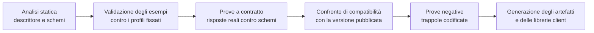

# Conformità e prove

Un'area di documentazione sui protocolli che non dica **come si verifica** ciò che afferma è un
elenco di intenzioni. Questo capitolo chiude l'area indicando che cosa il progetto pubblica come
prova, che cosa verifica automaticamente, con quali criteri di accettazione, e — con altrettanta
precisione — **che cosa non può dichiarare**.

## 1. Tre significati di «conforme», da non confondere

| Livello | Che cosa afferma | Come si dimostra |
|---|---|---|
| **Conformità alla specifica** | L'implementazione rispetta gli obblighi di un documento normativo | Suite di prove che copre gli obblighi, con tracciabilità obbligo → prova |
| **Conformità a un profilo** | L'implementazione realizza un attore con le sue transazioni e opzioni | Dichiarazione di integrazione + prove di transazione |
| **Conformità al contratto di progetto** | L'implementazione rispetta ciò che quest'area promette a chi integra | Prove a contratto contro gli artefatti pubblicati |

Sono livelli distinti e vanno affermati distintamente. Un sistema può essere conforme alla
specifica del protocollo e violare il contratto di progetto, o viceversa.

## 2. Che cosa il progetto non può dichiarare

Questa sezione esiste perché le affermazioni di conformità sbagliate sono il difetto di
documentazione più costoso: si propagano nei materiali commerciali, nei capitolati e nelle risposte
alle gare, e correggerle dopo è più difficile che non commetterle.

| Affermazione | Perché non è ammessa |
|---|---|
| «Conforme alla guida di mappatura da messaggi a risorse» | **Tutte** le mappe di quella guida hanno stato *Informative*. Non sono normative |
| «Conforme all'header di idempotenza standard» | Non è uno standard: l'Internet-Draft è **scaduto e archiviato** |
| «Conforme agli header standard di limitazione del traffico» | Non sono standard, e la forma a tre campi non è nemmeno la forma corrente del draft |
| «Conforme alla guida italiana» senza indicare la versione | La guida è alla 0.2.0, in stato *trial-use, draft*. Senza versione l'affermazione è vuota |
| «Certificato» su una revisione in commento pubblico | La revisione adottata del profilo documentale è in *ballot*, non testo definitivo |
| «Prodotto marcato» | Il progetto non appone marcatura né sottoscrive dichiarazioni di conformità: vincolo V-06 |
| «Accreditato» sui canali d'identità nazionali | Il fornitore di servizi è **chi installa**: vincolo V-05. Il progetto è conforme e verificabile |
| «Cifrato fino agli estremi» senza condizione | Vero solo nella modalità predefinita. Con la registrazione attiva **non lo è** |
| «Latenza garantita» | È una **metrica misurata, registrata e notificata**, con soglie dichiarate come specifica di prodotto |

Le formule ammesse, per contro, sono quelle che dichiarano insieme il fatto e il suo limite:
«implementa l'attore *sorgente di documenti* del profilo, revisione fissata, in stato di commento
pubblico»; «espone i tipi di evento del catalogo pubblicato, con consegna almeno una volta e senza
garanzia di ordine globale»; «adotta la forma corrente del draft sugli header di quota, che non è
ancora RFC».

## 3. Gli artefatti pubblicati

Sono i documenti che un integratore, un revisore o un committente scarica per verificare da sé.
Tutti sono **generati dalla catena di costruzione** e verificati contro il comportamento reale:
nessuno è scritto a mano e mantenuto per disciplina.

| Artefatto | Contenuto | Copre |
|---|---|---|
| Documento di capacità clinico | Versione della specifica, risorse, interazioni, profili, parametri di ricerca, operazioni, politiche | Capitolo [02](./02-fhir.md) |
| Descrittore dell'interfaccia applicativa | Percorsi, schemi, risposte, schemi di sicurezza, webhook | Capitolo [06](./06-api-di-progetto.md) |
| Schemi degli eventi, versionati | Contenuto di ciascun tipo di evento | Capitolo [07](./07-eventi-e-webhook.md) |
| Catalogo degli errori, servito e risolvibile | Codice, titolo, spiegazione, procedura di risoluzione, corrispondenza fra i due piani | Capitoli [02](./02-fhir.md) e [06](./06-api-di-progetto.md) |
| Dichiarazione di integrazione | Profilo, revisione, attore, opzioni supportate e non supportate, deviazioni | Capitolo [05](./05-ihe.md) |
| Tabella di copertura dei messaggi legacy | Campo per campo: destinazione, conservazione grezza, scarto motivato | Capitolo [04](./04-hl7-v2.md) |
| Tabella di corrispondenza fra eventi e argomenti clinici | Quale tipo di evento corrisponde a quale argomento | Capitolo [07](./07-eventi-e-webhook.md) |
| Tabella di corrispondenza con il profilo di autorizzazione IHE | Transazione per transazione | Capitolo [08](./08-identita-e-autorizzazione.md) |
| Inventario delle specifiche fissate | Specifica, versione, stato, data, data dell'ultimo ricontrollo | Capitolo [01](./01-principi-di-interoperabilita.md) |
| Registro delle deviazioni dichiarate | Deviazione, fonte deviata, motivazione, costo | Tutti |

L'ultimo artefatto merita una nota: **le deviazioni dichiarate sono un artefatto pubblico**. Il
progetto devia in modo consapevole dalla raccomandazione della specifica in almeno tre punti — la
gestione stretta dei parametri di ricerca, l'obbligatorietà del validatore di precondizione sulle
scritture cliniche, la risposta di risorsa inesistente al posto di quella di accesso negato — e
ciascuna deviazione è registrata con la propria motivazione e il proprio costo. Una deviazione
non dichiarata è un difetto; una deviazione dichiarata e motivata è una decisione.

## 4. Le suite di prova

| Suite | Che cosa verifica | Criterio di accettazione |
|---|---|---|
| **Struttura e profili** | Ogni esempio del repository valida contro il profilo che dichiara | **Zero** errori di severità di errore. Le segnalazioni informative sono ammesse e catalogate |
| **Interazioni dichiarate** | Ogni interazione dichiarata nel documento di capacità esiste e risponde | Copertura **100%** delle interazioni dichiarate |
| **Andata e ritorno del modello** | Dominio → risorsa → validazione → dominio, con confronto semantico | Uguaglianza semantica su tutti i casi di riferimento |
| **Contratto dell'interfaccia applicativa** | Ogni risposta reale valida contro lo schema del descrittore | Zero risposte non conformi |
| **Compatibilità del contratto** | Confronto con la versione pubblicata | Nessuna rottura non annunciata |
| **Catalogo degli errori** | Ogni codice emesso dal sorgente esiste nel catalogo; ogni codice del catalogo è raggiungibile da almeno una prova | Copertura biunivoca |
| **Idempotenza** | Stessa chiave e stesso corpo → risposta identica; corpo diverso → errore; in volo → conflitto | Tutti e tre i casi verificati per ogni operazione che richiede la chiave |
| **Concorrenza** | Validatore assente, discordante, corretto | I tre esiti attesi su ogni risorsa clinica |
| **Consegna degli eventi** | Firma, ritentativi, coda di scarto, rigioco con lo stesso identificativo, deduplicazione | Nessun doppione dopo un rigioco; nessuna consegna non firmata |
| **Messaggi legacy** | Analisi, riconoscimento, errore, copertura dichiarata | Un caso per ciascun messaggio supportato, più i casi negativi di §5 |
| **Autorizzazione** | Ambiti, delega, destinatario, revoca, introspezione sulle operazioni ad alto impatto | Nessun accesso concesso oltre l'ambito; claim dell'attore sempre presente sull'identità esterna |
| **Isolamento fra tenant** | Ogni interrogazione, ogni cursore, ogni transazione, ogni consegna | **Zero** casi in cui un tenant vede dati di un altro. È un criterio bloccante assoluto |
| **Sessione in tempo reale** | Ordine e unicità dei candidati, verifica della sessione, cambio di modalità, degradazione | Il requisito di consegna ordinata e unica verificato sotto carico e con nodi multipli |
| **Accessibilità delle funzioni di protocollo** | La verifica della sessione e la segnalazione della registrazione con tecnologie assistive reali | Verifica manuale, non solo automatica |

Due criteri sono **bloccanti in senso assoluto**, cioè non ammettono deroga di rilascio:
l'isolamento fra tenant e la presenza del claim dell'attore quando l'identità proviene da un
emittente esterno. Il primo è isolamento dei dati sanitari; il secondo è la differenza fra un
registro che dice chi ha agito e uno che non lo dice.

## 5. Le prove negative, cioè le trappole codificate

Una suite che verifica solo i casi corretti non dimostra nulla sulle trappole. Queste sono
codificate come prove che **devono fallire** se il comportamento sbagliato compare.

| Trappola | Prova che la intercetta |
|---|---|
| Intestazione con prefisso per il tipo di contenuto nella busta degli eventi in modalità binaria | La consegna viene ispezionata: la presenza di quell'intestazione fa fallire la prova. È una **violazione di un obbligo negativo** della specifica |
| Metodo di sfida in chiaro accettato dal server di autorizzazione | Una richiesta con il metodo in chiaro deve essere rifiutata |
| Separatore di riga sbagliato fra i segmenti dei messaggi legacy | Un messaggio con il separatore errato deve essere rifiutato, non interpretato |
| Assistito modellato come partecipante del contatto assistenziale | Un'istanza costruita così deve fallire la validazione |
| Codifica priva del sistema di codifica | Fallimento di validazione |
| Registrazione modellata sulla risorsa rimossa nella release successiva | Una prova di architettura verifica che quella risorsa non compaia nel codice |
| Metrica di rete modellata come osservazione con soggetto l'assistito | Prova di architettura sul soggetto delle osservazioni prodotte |
| Parametro di ricerca sconosciuto ignorato in silenzio | Deve produrre un errore, salvo richiesta esplicita della gestione permissiva |
| Scrittura clinica senza validatore di precondizione | Deve produrre il codice di precondizione richiesta |
| Cursore di paginazione manipolato per aggirare il filtro di tenant | Deve essere rifiutato come firma non valida |
| Transazione con risorse di tenant diversi | Deve essere rifiutata come malformata, **nel parser** |
| Esportazione massiva a livello di sistema | L'endpoint non deve esistere |
| Credenziale del relay con identificativo correlabile a una persona | Prova sul formato dell'identificativo emesso |
| Chiave di sessione o indirizzo della stanza persistiti in una risorsa interrogabile | Prova sull'istanza prodotta |
| Rigioco dalla coda di scarto con un nuovo identificativo di evento | Deve riusare lo stesso, altrimenti produce doppioni a valle |
| Data di dismissione anteriore a quella di deprecazione | La configurazione deve far fallire la costruzione |
| Testo di dettaglio di un errore contenente un identificativo diretto | Analisi dei corpi di errore prodotti dalle prove |

Ogni riga di questa tabella corrisponde a un errore **realmente accaduto** in progetti sanitari, o
a un obbligo negativo esplicito di una specifica. Nessuna è ipotetica.

## 6. Gli strumenti

> **`[NV]` — strumenti concreti.** I nomi, le versioni e le modalità di invocazione degli
> strumenti di validazione clinica, di pubblicazione delle guide, di analisi statica del
> descrittore dell'interfaccia, di confronto di compatibilità e di analisi dei messaggi legacy
> **non sono stati verificati su fonte primaria** e non vengono inventati qui.
> **Da chiedere a**: area tecnica, che ha in carico la catena di costruzione. La scelta va poi
> fissata a una versione esatta e censita nell'inventario dei componenti di terze parti, perché
> uno strumento che valida artefatti regolatori è a sua volta un componente da qualificare.

Ciò che quest'area può dichiarare senza dipendere dallo strumento sono i **requisiti** che lo
strumento deve soddisfare:

1. deve poter risolvere i pacchetti delle guide **alla versione fissata**, da un registro o da un
   mirror interno;
2. deve poter operare **senza rete** una volta popolata la cache, altrimenti la costruzione non è
   riproducibile;
3. deve distinguere le severità e restituire un esito interpretabile da uno script, non solo un
   testo per l'uomo;
4. deve poter essere invocato con il servizio terminologico **disattivato**, perché quella è la
   configurazione predefinita del progetto, e deve dichiarare quali verifiche ha saltato invece di
   tacerle;
5. la sua versione va registrata insieme all'esito: un artefatto validato non dice nulla se non si
   sa con che cosa è stato validato.

## 7. I cancelli della catena di costruzione

Regole dei cancelli:

- **nessun cancello è avvisatorio.** Un cancello che avvisa e lascia passare viene ignorato entro
  tre settimane;
- **il confronto di compatibilità confronta con la versione pubblicata**, non con il commit
  precedente: è ciò che intercetta la rottura introdotta un pezzo alla volta;
- **le librerie client si generano e si pubblicano solo su etichetta di rilascio**, mai dal ramo
  di sviluppo, perché una libreria pubblicata è un contratto;
- **la tracciabilità è parte del prodotto della catena**: ogni obbligo di specifica coperto è
  legato alla prova che lo copre, e l'associazione è un artefatto, non una convenzione. È il
  requisito di tracciabilità che rende il materiale utilizzabile da chi certifica, ai sensi del
  vincolo V-06.

## 8. L'ambiente di prova e i dati

**Tutti i dati usati nelle prove, negli esempi e negli ambienti dimostrativi sono sintetici.** Non
è una raccomandazione: è un vincolo trasversale del progetto, e vale per il codice, per le prove,
per i registri, per la documentazione e per gli ambienti dimostrativi.

Regole operative:

- i generatori di dati producono valori **sintatticamente validi** — un codice fiscale ben formato
  che non appartiene a nessuno — perché prove su dati malformati non verificano il percorso reale;
- i domini usati negli esempi sono segnaposto riservati a scopo documentale;
- l'ambiente dimostrativo **non accetta** l'inserimento di dati reali: è un controllo, non un
  avviso;
- ogni artefatto distribuito prima della marcatura dichiara esplicitamente che non è utilizzabile
  per l'erogazione di prestazioni sanitarie su persone reali.

Il progetto rende inoltre disponibile un **ambiente di simulazione per l'integratore**, con: un
servizio che espone il documento di capacità e le interazioni dichiarate; una destinazione di
prova per gli eventi che verifica la firma e restituisce diagnostica; un ascoltatore per il canale
legacy che risponde con riconoscimenti; e una raccolta di richieste di esempio pronte da eseguire.
È l'investimento con il ritorno più alto sul costo di assistenza.

## 9. Criteri di accettazione per chi integra

Un integratore può verificare da sé la propria implementazione con questo elenco. Non è una
formalità: ciascuna voce corrisponde a un fallimento osservato in integrazioni reali.

**Sul piano clinico.** Legge la versione della specifica dal documento di capacità invece di
assumerla. Invia il validatore di precondizione su ogni scrittura clinica. Usa la creazione
condizionale con l'identificativo esterno per l'ingestione idempotente. Non costruisce a mano
l'indirizzo della pagina successiva. Tratta l'esito di validazione con codice di successo come
possibile insieme di errori. Distingue transazione da lotto. Non assume la presenza di elementi
facoltativi.

**Sul piano applicativo.** Invia la chiave di idempotenza dove richiesta e non la riusa con corpi
diversi. Legge lo scopo restituito e non assume che coincida con quello richiesto. Ignora i campi
sconosciuti e i valori di enumerazione sconosciuti. Non interpreta il testo di dettaglio degli
errori, ma il codice. Rispetta il ritardo suggerito. Espone le intestazioni necessarie nella
configurazione di condivisione fra origini, altrimenti il proprio codice di navigazione non le
vede.

**Sugli eventi.** È idempotente sulla chiave dichiarata. Verifica la firma **sui byte grezzi**,
prima della deserializzazione. Rifiuta gli eventi fuori dalla finestra di freschezza. Accetta e
accoda, senza elaborare in linea. **Tollera i tipi di evento sconosciuti** senza andare in errore.
Non assume l'ordine di arrivo, e usa il numero di sequenza per aggregato.

**Sul canale legacy.** Dichiara una versione supportata. Usa il trigger di registrazione
ambulatoriale, non quello di ricovero. Non assume la presenza del gruppo dell'assistito. Analizza
i segmenti di nota in modo posizionale. Legge il segmento di errore nella forma della versione
dichiarata, non in quella precedente.

**Sull'identità.** Non trasporta asserzioni di identità attraverso il browser. Registra
l'indirizzo del proprio insieme di chiavi e lo mantiene raggiungibile. Ruota le chiavi con un
nuovo identificativo invece di sostituire il materiale sotto lo stesso. Non chiede token di lunga
durata.

## 10. Il ricontrollo programmato

L'inventario delle specifiche fissate è **ricontrollato prima di ogni rilascio maggiore e comunque
almeno ogni sei mesi**. Il ricontrollo verifica quattro cose e registra l'esito con la data:

1. la versione fissata è ancora quella pubblicata;
2. lo stato di maturità è cambiato — una guida passata da bozza a stabile, o un draft diventato
   RFC, cambiano ciò che si può dichiarare;
3. sono stati pubblicati errata o correzioni tecniche;
4. una dipendenza di licenza è cambiata.

Il ricontrollo non è opzionale, perché la composizione dell'inventario lo rende necessario: **oltre
un terzo delle specifiche adottate è in stato non definitivo**, e alcune cambiano con cadenza
infra-annuale.

## 11. Che cosa resta aperto

### 11.1 I punti non verificati di quest'area

| Punto | Capitolo | A chi va chiesto |
|---|---|---|
| Forma esatta della sotto-estensione dell'indirizzo nel servizio virtuale | [02 §4](./02-fhir.md) | Chi implementa lo strato di adattamento clinico, con validazione contro il pacchetto fissato |
| Strumenti concreti di validazione e di pubblicazione | [02 §8.1](./02-fhir.md), §6 di questo capitolo | Area tecnica |
| Template, codici documentali e metadati per le tipologie della telemedicina | [03 §4.2](./03-documenti-clinici.md), [03 §5](./03-documenti-clinici.md) | Area di conformità — questione **Q-07** |
| Formati di busta di firma, requisiti del certificato e della marca temporale | [03 §6.2](./03-documenti-clinici.md) | Area di conformità e area di sicurezza |
| Profilo del formato per la conservazione a lungo termine | [03 §4.3](./03-documenti-clinici.md) | Area di conformità |
| Copertura campo per campo fra set informativo normativo e profilo clinico | [03 §4.1](./03-documenti-clinici.md) | Area di dominio e area di conformità |
| Lettura diretta della specifica del protocollo di incapsulamento legacy | [04 §5.1](./04-hl7-v2.md) | Chi implementa il modulo |
| Lunghezze, obbligatorietà e ripetibilità dei campi del segmento di errore legacy | [04 §7](./04-hl7-v2.md) | Chi implementa il modulo |
| Valori di contesto di autenticazione accettati dal fornitore dell'identità su documento | [08 §6.1](./08-identita-e-autorizzazione.md) | Area di integrazione |
| Inoltro del livello richiesto attraverso il realm di intermediazione | [08 §6.4](./08-identita-e-autorizzazione.md) | Area di architettura e area tecnica — questione **Q-160** |
| Algoritmo di hash delle credenziali temporanee del relay | [09 §7.4](./09-tempo-reale.md) | Chi implementa il servizio, con collaudo di integrazione |

### 11.2 Le decisioni che quest'area non prende

**Q-06 — divergenza dell'URI del codice fiscale.** Quest'area documenta il problema, ne misura le
conseguenze e formula una raccomandazione motivata in [02 §9.3](./02-fhir.md), **senza cablare
alcun valore nei propri esempi normativi**. La decisione spetta all'area di architettura in
concorso con quella tecnica.

**Q-15 — le dieci scelte enunciate come proposta.** Quest'area le formula, le motiva e ne dichiara
il costo in [01 §5](./01-principi-di-interoperabilita.md). La decisione formale, con il relativo
record di decisione architetturale, spetta all'area di architettura.

**Q-08 — le due modalità della sessione.** Quest'area descrive il protocollo che le governa in
[09 §6](./09-tempo-reale.md) e ne dichiara la conseguenza inderogabile. Gli effetti sul modello
dati spettano all'area di architettura.

**Q-16, Q-161 — il registro unico delle destinazioni e delle origini fidate, e il punto unico di
controllo delle richieste uscenti.** Quest'area **sostiene** entrambe le questioni e ne dichiara la
motivazione in [07 §7](./07-eventi-e-webhook.md) e [06 §10](./06-api-di-progetto.md): registri
separati divergono, e quattro implementazioni della stessa protezione producono quattro
comportamenti diversi, di cui conta il più debole. Le decisioni spettano all'area di sicurezza e a
quella di architettura.

**Q-163 — nessuna capacità di divulgazione verso un pagatore.** Quest'area la recepisce come
vincolo di catalogo in [07 §3](./07-eventi-e-webhook.md): la variante dell'evento di completamento
destinata alla liquidazione porta soltanto identificativo della prestazione, esito amministrativo
e importo. La conferma funzionale spetta all'area funzionale.
