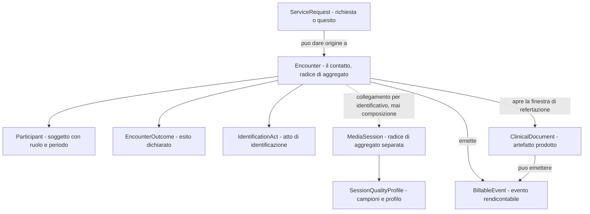
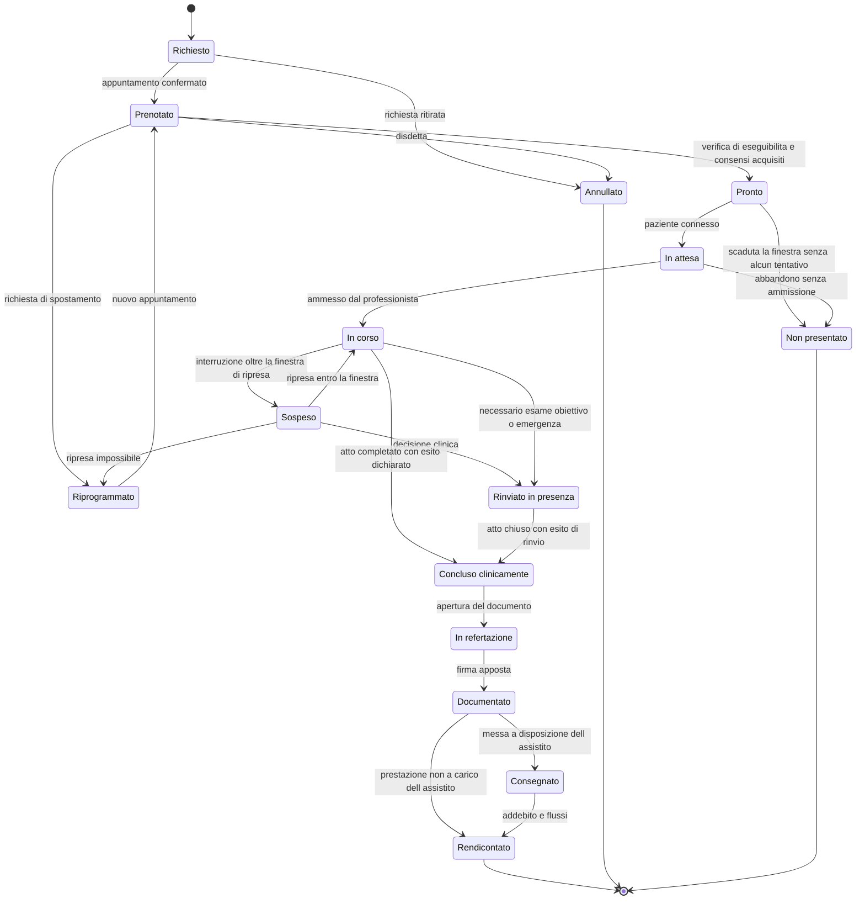
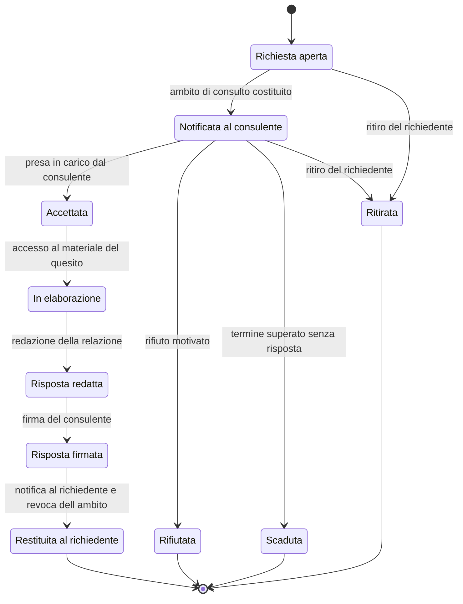
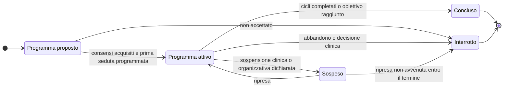
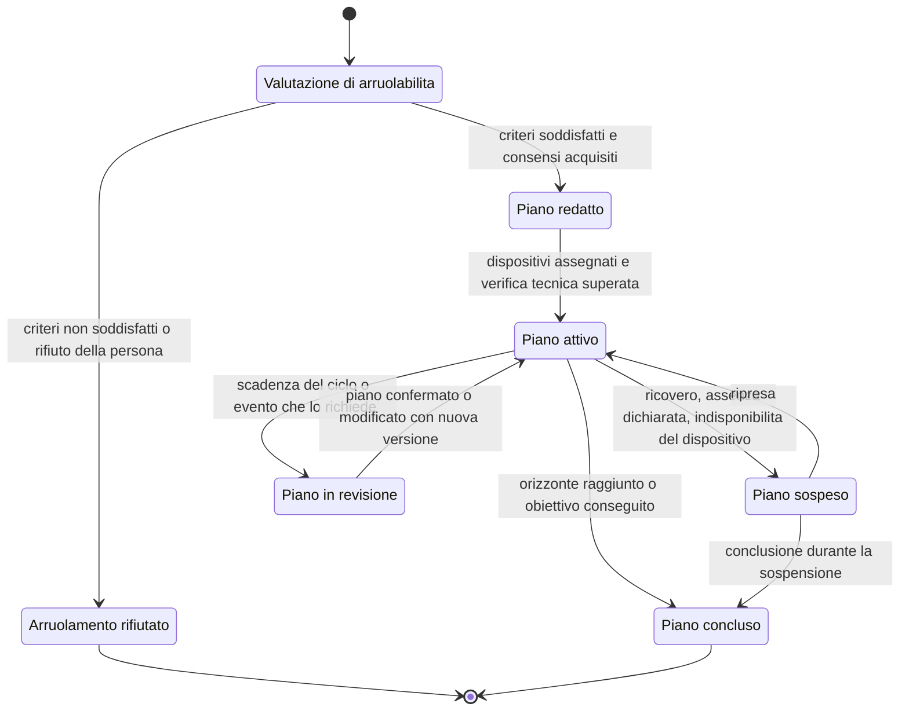
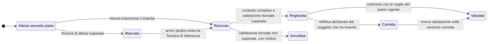
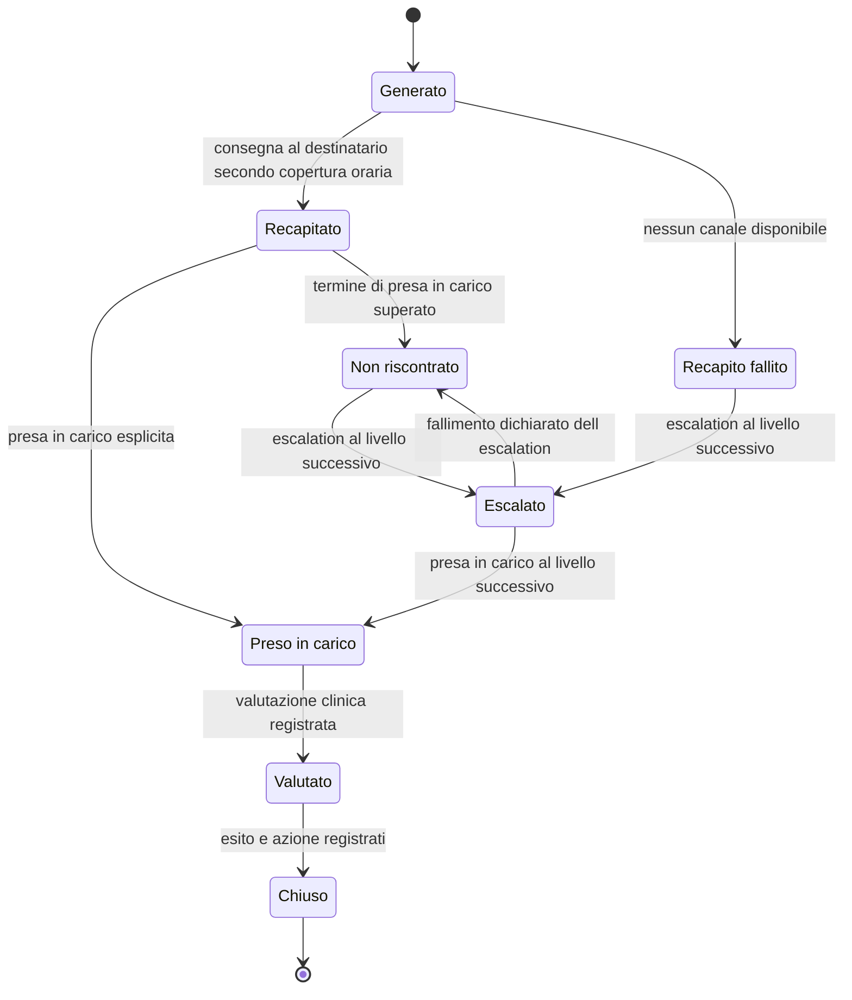
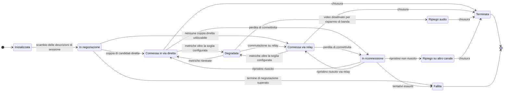

# Le prestazioni modellate

Le prestazioni di telemedicina non sono varianti di una stessa cosa. Hanno attori diversi,
producono artefatti diversi, si concludono per ragioni diverse e si annullano per ragioni
diverse. Un modello che le rappresenti con un solo tipo e un campo discriminante funziona
finché non deve rispondere alla prima domanda seria: *chi può erogarla*, *che documento
produce*, *chi ne risponde*, *è tariffata*.

Questo capitolo trasforma le definizioni normative del modulo
[02 dei fondamenti](../10_fondamenti/02-prestazioni-di-telemedicina.md) in **macchine a stati
con transizioni ammesse**. Non le ripete: presuppone che siano state lette.

## 1. Il criterio di modellazione

Tre decisioni governano l'intero capitolo e vanno enunciate prima dei diagrammi.

> **`DM-10` [MOD] - La prestazione è una famiglia di macchine a stati, non un tipo con un
> `enum`.** Ogni prestazione condivide la stessa struttura di aggregato - un contatto, dei
> partecipanti, un esito, degli artefatti prodotti - ma ha **il proprio insieme di stati
> ammessi, la propria condizione di conclusione e la propria condizione di annullamento**. Il
> tipo di prestazione seleziona la macchina a stati; non aggiunge un campo.

> **`DM-11` [MOD] - Ciò che varia per prestazione è dichiarato, non codificato.** Attori
> ammessi, artefatti obbligatori, obbligo di presenza del paziente, registrabilità, esiti
> ammessi e finestre temporali sono **attributi del tipo di prestazione nel catalogo**, non
> condizioni `if` sparse nel codice. Aggiungere una prestazione deve essere una riga di
> catalogo più una macchina a stati, non una modifica diffusa.

> **[BASE] `V-01` - `Encounter` e `MediaSession` sono aggregati distinti.** Una prestazione può
> avvenire senza media (teleconsulto asincrono), con più sessioni (caduta e riconnessione), o
> con sessioni fallite; una sessione media può esistere senza prestazione (prova tecnica).
> Unirli è l'errore di modellazione più costoso di questo dominio.

### 1.1 La struttura comune

La linea tratteggiata fra `Encounter` e `MediaSession` è la parte importante del diagramma:
**collegamento per identificativo, mai composizione**. La sessione media non è un figlio del
contatto; è un aggregato che il contatto comanda e di cui osserva l'esito.

### 1.2 Le sei domande a cui ogni prestazione deve rispondere

| Domanda | Perché è di modellazione e non descrittiva |
|---|---|
| **Chi sono gli attori ammessi?** | Determina i vincoli professione × prestazione, che non sono configurabili dal tenant (`BR-011`) |
| **Il paziente deve essere presente?** | Determina se esiste un atto di identificazione e se la sessione media è obbligatoria |
| **È ammessa l'asincronia?** | Determina se esiste uno stato di attesa della risposta e una scadenza |
| **Che cosa produce?** | Determina quale documento è obbligatorio e quale tipologia documentale del fascicolo |
| **Che cosa la conclude?** | Determina lo stato terminale nominale e chi ha il potere di dichiararlo |
| **Che cosa la annulla?** | Determina gli stati terminali non nominali e i loro effetti amministrativi |

### 1.3 Quadro sinottico

| | Televisita | Teleconsulto | Teleconsulenza | Teleassistenza | Telemonitoraggio |
|---|---|---|---|---|---|
| **Atto riservato a** | medico | due o più medici | professioni sanitarie con responsabilità differenti | professione sanitaria non medica | rilevazione; la valutazione è del professionista |
| **Paziente presente** | sempre | facoltativo | facoltativo | sempre (o caregiver) | non applicabile |
| **Asincronia** | no | **sì** | sì (differita) | no | per costruzione |
| **Produce** | referto (con eccezioni, § 2.6) | **nessun referto autonomo**; relazione collaborativa allegata | documentazione dell'atto richiedente | relazione clinico-assistenziale conclusiva | report periodici e relazione finale |
| **Tariffata** | sì, con il codice della prestazione erogata | no | no | secondo regime della professione | non da sola |
| **Contenitore** | contatto singolo | contatto singolo o scambio asincrono | contatto singolo | **ciclo pluri-sessione** | **piano con orizzonte** |
| **Sessione media** | obbligatoria | facoltativa | obbligatoria se sincrona | obbligatoria | assente |

Fonti delle definizioni: Accordo Stato-Regioni 17 dicembre 2020, rep. atti n. 215/CSR, All. A;
DM 21 settembre 2022, All. A; DM 19 novembre 2025, art. 7 e All. 1. La riga «Produce» recepisce
le dieci tipologie documentali introdotte dal DM 19 novembre 2025 e descritte al capitolo
[04](04-documenti-clinici.md).

## 2. Televisita

### 2.1 Attori

| Ruolo | Obbligatorio | Note di modellazione |
|---|---|---|
| **Medico erogante** | sì | Atto riservato al medico. Il vincolo professione × prestazione non è configurabile (`BR-011`) |
| **Paziente** | sì | Presenza in tempo reale; l'identificazione è atto del professionista (`BR-031`) |
| **Caregiver** | no | Partecipante con ruolo proprio; non può prestare consenso per un paziente capace (`BR-062`) |
| **Operatore sanitario presso il paziente** | no | Previsto testualmente dall'Accordo 215/CSR 2020: «un operatore sanitario che si trovi vicino al paziente può assistere il medico e/o aiutare il paziente». È un partecipante con qualifica sanitaria, distinto dal caregiver |
| **Interprete** | no | Terzo che accede a dati sanitari: consenso, vincolo di riservatezza, orari di ingresso e uscita registrati (`BR-066`) |
| **Discente o osservatore** | no | Consenso specifico e preventivo, revocabile senza conseguenze (`BR-067`) |

> **`DM-12` [MOD]** - Il partecipante non è un riferimento a una persona: è un'**entità con
> ruolo, qualifica dichiarata, istante di ingresso e istante di uscita**. Serve perché la
> presenza di un terzo è un fatto con conseguenze giuridiche, e perché la lista dei presenti
> deve essere visibile a tutti per l'intera durata (`BR-038`).

### 2.2 Ammissibilità: ciò che precede lo stato iniziale

La televisita ha condizioni di erogabilità stabilite dall'Accordo 215/CSR 2020: prestazioni che
**non richiedono la completezza dell'esame obiettivo** e presenza di **almeno una** fra cinque
condizioni cliniche (percorso PAI/PDTA, follow-up da patologia nota, controllo o aggiustamento
di terapia in corso, valutazione anamnestica per prescrizione di esami, verifica di esiti di
esami effettuati). Il testo integrale è nel modulo
[02 dei fondamenti](../10_fondamenti/02-prestazioni-di-telemedicina.md) § 4.1.

Il modello **non decide l'appropriatezza**: la registra (`BR-004`, vincolo `V2` di separazione
MDR). Concretamente:

- il **catalogo** marca il tipo di prestazione come erogabile in televisita e, se del caso, come
  «richiede diagnosi già formulata» (`RF-030`, `BR-001`);
- l'**atto di verifica di eseguibilità** registra le tre dimensioni previste dal *Modello
  orientativo di erogazione della Televisita* AGENAS v. 1.0.25 del 16 aprile 2026 - utilità
  clinica, sicurezza clinica, **compliance digitale dell'assistito** - come dichiarazioni del
  professionista, non come calcoli **[RACCOMANDATO]**;
- la **deroga** a `BR-002` esiste come oggetto: identità di chi la dispone, motivazione
  testuale, evento di audit ad alta severità (`BR-003`).

> **[NORM]** Il DM 30 settembre 2022, All. B, esclude la televisita dai contesti di
> urgenza-emergenza: «non deve costituire ragione per ritardare interventi in presenza»
> (`REQ-62` di `B1`). Il modello lo rappresenta come **attributo del tipo di prestazione** -
> `ammessaInUrgenza = false` per la televisita - e non come controllo sparso: il teleconsulto,
> per la stessa fonte, è invece eseguibile anche in urgenza.

### 2.3 Il ciclo di vita del contatto

**Le tre transizioni che non esistono**, e la ragione per cui la loro assenza è una decisione:

1. **`In corso → Annullato`** non esiste. Un atto iniziato non si annulla: si conclude con un
   esito che ne dichiara l'incompletezza. Ammettere l'annullamento di un atto iniziato
   significa poter cancellare la traccia di un'interazione clinica avvenuta.
2. **`In corso → Concluso` automatica** non esiste. La chiusura con esito è **sempre atto del
   professionista** (`BR-032`, vincolo `V2`): in assenza, il contatto resta sospeso ed è
   segnalato. Un sistema che chiude da solo attribuisce un esito clinico, e attribuire esiti
   clinici lo sposta di classificazione.
3. **`Documentato → InRefertazione`** non esiste. Il documento firmato è immutabile
   (`BR-044`): la correzione è una **nuova versione** che annulla e sostituisce, non un ritorno
   allo stato precedente. Il capitolo [04](04-documenti-clinici.md) modella la catena.

### 2.4 Sospensione e ripresa: l'invariante

L'invariante più importante del capitolo, e la ragione di `V-01`:

> **`DM-13` [MOD] - Lo stato del contatto non dipende dallo stato della sessione media.** Una
> caduta di rete non modifica lo stato del contatto. Il contatto passa da `In corso` a
> `Sospeso` **solo** se l'interruzione supera la finestra di ripresa configurata, e non viene
> **mai** chiuso automaticamente (`BR-030`, `BR-032`).

La finestra di ripresa è un parametro di configurazione per tenant e per tipo di prestazione.
`R6` § 3.4 propone dieci minuti come valore predefinito: è una **proposta di progetto**, non una
prescrizione normativa - nessuna fonte italiana stabilisce soglie tecniche (`B1`, mandato
aggiuntivo; vincolo `V-12`).

### 2.5 Gli esiti

Lo **stato** dice dove si trova il contatto; l'**esito** dice che cosa è successo. Sono due
attributi distinti, e il secondo è quello che determina gli effetti amministrativi.

| Codice esito | Evento | Rilevabile automaticamente | Effetto sull'atto | Effetto amministrativo |
|---|---|---|---|---|
| `EX-COMPLETE` | Atto completato | no, è dichiarato | atto eseguito | rendicontabile |
| `EX-NOSHOW` | Nessun tentativo di connessione entro la finestra | **sì**, per assenza di tentativi | nessun atto | mancata presentazione (`BR-024`) |
| `EX-TECH-PATIENT` | Il paziente ha tentato senza superare la verifica tecnica | **sì**, per telemetria | nessun atto | **non** è mancata presentazione; riprogrammazione senza addebito |
| `EX-TECH-DROP` | Caduta con ripresa riuscita | sì | atto proseguito | nessuno; l'interruzione è annotata |
| `EX-TECH-FAIL` | Caduta senza ripresa | sì | atto incompleto | regola tariffaria configurabile; obbligo di riprogrammazione |
| `EX-QOS` | Qualità giudicata non idonea dal professionista | parzialmente | atto sospeso o degradato | ripiego di canale o riprogrammazione |
| `EX-CLIN-STOP` | Interruzione per decisione clinica | no | atto interrotto | prestazione parziale, motivazione obbligatoria |
| `EX-ESCALATE` | Necessità di visita in presenza | no | atto concluso con rinvio | prestazione erogata più nuova richiesta |
| `EX-EMERGENCY` | Emergenza clinica durante l'atto | no | attivazione della procedura dedicata | procedura propria |
| `EX-IDENT-FAIL` | Paziente non identificabile | no | **atto non eseguibile** | contatto annullato, nessun addebito |
| `EX-CAPACITY` | Minore o soggetto incapace senza titolo valido | parzialmente | atto non eseguibile | contatto sospeso in attesa del titolo |
| `EX-THIRD-PARTY` | Terzo non previsto presente | no | valutazione del professionista | consenso da acquisire in sessione |

La distinzione fra `EX-NOSHOW` ed `EX-TECH-PATIENT` è la ragione per cui l'esito esiste come
concetto separato dallo stato. Sono lo stesso stato terminale - il paziente non è stato visitato
- con effetti economici e reputazionali **opposti**. Addebitare una mancata presentazione a chi
ha tentato e non è riuscito a collegarsi è un difetto di dominio, non un caso limite.

### 2.6 Che cosa produce la televisita

> **[NORM]** «La televisita erogata nell'ambito dell'attività specialistica ambulatoriale **deve
> sempre concludersi con un referto**» (Accordo 215/CSR 2020, All. A).

L'obbligo è però **condizionato al setting**, e questo è un correttivo che `B1` ha accertato:

> **[NORM]** DM 30 settembre 2022, All. B: la televisita programmata ed erogata direttamente da
> medico di medicina generale o pediatra di libera scelta **non richiede prescrizione** e
> prevede **annotazione digitale in luogo del referto** (`REQ-59` di `B1`).

> **`DM-14` [MOD]** - Il **setting di erogazione** è un attributo di dominio discriminante di
> regole, non un'etichetta descrittiva. Determina almeno: obbligo di referto contro annotazione,
> necessità della prescrizione, tipologia documentale del fascicolo, regime di rendicontazione.
> Cablare l'obbligo di referto come incondizionato è un errore che si manifesta al primo
> tenant che sia una medicina di gruppo.

Il referto della televisita ha inoltre **contenuti obbligatori propri**, imposti dall'Accordo
215/CSR 2020: indicazione degli eventuali collaboratori partecipanti (caregiver, altro medico) e
**qualità del collegamento con conferma dell'idoneità all'esecuzione della prestazione**. Il
capitolo [04](04-documenti-clinici.md) affronta il problema - non risolto dal tracciato
ministeriale - di dove questa evidenza si scriva.

### 2.7 Che cosa annulla la televisita

| Causa di annullamento | Chi la determina | Stato risultante | Vincolo |
|---|---|---|---|
| Ritiro della richiesta | prescrittore o assistito | `Annullato` | ammesso solo prima dello stato `In corso` |
| Disdetta dell'assistito | assistito | `Annullato` | effetti amministrativi solo se configurati **e** comunicati in prenotazione (`BR-025`) |
| Cancellazione da parte della struttura | struttura erogante | `Annullato` | genera **sempre** obbligo di proposta alternativa; mai addebito (`BR-026`) |
| Identificazione fallita | professionista | `Annullato` con esito `EX-IDENT-FAIL` | nessun addebito; è l'unico annullamento che avviene a sessione avviata |
| Titolo di rappresentanza mancante o non pertinente | sistema, verificato dal professionista | `Sospeso` con esito `EX-CAPACITY` | non è un annullamento: è un'attesa di titolo |

La quarta riga è l'eccezione alla regola enunciata al § 2.3: l'identificazione fallita annulla un
contatto la cui sessione media era già avviata. È ammessa perché **l'atto sanitario non è
iniziato**: non si può erogare una prestazione a una persona che non si sa chi sia.

### 2.8 La clausola di completamento in presenza

> **[NORM]** «Qualora lo strumento di Telemedicina non permetta di mantenere inalterato il
> contenuto sostanziale della prestazione da erogare, le Aziende e gli erogatori privati sono
> tenuti a completare la prestazione in modalità tradizionale senza ulteriori oneri a carico
> del SSN e/o utente» (Accordo 215/CSR 2020, All. A). In caso di insufficienza del risultato
> «per qualunque motivo (tecnico, legato alle condizioni riscontrate del paziente o altro)»
> scatta «l'obbligo della riprogrammazione della prestazione in presenza».

È un obbligo che ricade direttamente sul modello: gli esiti `EX-TECH-FAIL`, `EX-QOS` e
`EX-ESCALATE` **generano un fatto successivo** - una nuova richiesta con il collegamento alla
precedente - e non si limitano a chiudere il contatto. La riprogrammazione in presenza è parte
della macchina a stati, non gestione dell'errore (`REQ-61` di `B1`).

## 3. Teleconsulto

### 3.1 Le due forme

Il teleconsulto ha due forme con macchine a stati diverse, e la fonte le distingue
espressamente: «può svolgersi anche in modalità asincrona»; «quando il paziente è presente al
teleconsulto, allora esso si svolge in tempo reale utilizzando le modalità operative analoghe a
quelle di una televisita e si configura come una visita multidisciplinare» (Accordo 215/CSR
2020, All. A).

> **`DM-15` [MOD]** - Le due forme sono **due macchine a stati distinte**, selezionate alla
> creazione della richiesta e non modificabili dopo l'accettazione. La combinazione è
> esplicitamente codificata perché il tracciato ministeriale la richiede: il campo «Modalità
> esecuzione procedura operativa» dell'Allegato 1, § 2.21 al DM 19 novembre 2025 impone di
> indicare **estemporaneo o programmato**, **sincrono o asincrono**, **con o senza presenza
> dell'assistito** (`REQ-48` di `B1`). Sono tre assi binari, non un enumerativo piatto.

### 3.2 Teleconsulto asincrono

Il fatto rilevante non è la sequenza: è **l'ambito di consulto**. Il consulente non riceve
accesso al dossier del paziente ma **soltanto al materiale che il richiedente ha selezionato**,
per il tempo necessario alla risposta (`BR-014`).

> **`DM-16` [MOD] - L'ambito di consulto è un aggregato con ciclo di vita proprio.** Nasce con
> la richiesta, contiene l'elenco chiuso dei riferimenti documentali, ha una scadenza
> obbligatoria e **decade in tre modi**: risposta firmata, rifiuto, scadenza. La revoca è un
> fatto registrato, non l'assenza di un rinnovo.

La costituzione dell'ambito ha un effetto collaterale importante e spesso trascurato: **l'elenco
dei documenti mostrati al consulente è esso stesso un'informazione da conservare**. A distanza
di anni, la domanda «su che cosa si è espresso il consulente» ha una risposta solo se l'ambito
è stato registrato come insieme, e non ricostruito dal registro degli accessi.

### 3.3 Teleconsulto sincrono con paziente presente

Lo scenario a tre introduce quattro problemi che la televisita non ha.

| Problema | Decisione di modellazione |
|---|---|
| Chi è l'erogante? | Un solo `Encounter` con più partecipanti, e una `ServiceRequest` che identifica il consulente come esecutore della consulenza. **Due prestazioni distinte sullo stesso contatto** |
| Chi documenta? | Due documenti con autori distinti, oppure un documento unico controfirmato: entrambe le forme supportate secondo configurazione della prestazione (`RF-133`). Il sistema **non fonde** i contenuti (`BR-049`) |
| Chi conduce? | Ruolo esplicito di **conduttore**, con i poteri di ammissione ed esclusione. Senza, l'ammissione dei partecipanti è ambigua |
| Il paziente sa chi c'è? | Lista dei partecipanti con nome e qualifica visibile per tutta la durata, senza possibilità di occultamento (`BR-038`) |

La **stanza laterale** fra professionisti - colloquio riservato che esclude temporaneamente il
paziente - è clinicamente necessaria ed eticamente delicata. Il modello la rappresenta come
**periodo dichiarato del contatto**, con inizio, fine e annuncio al paziente: non esiste
modalità silenziosa (`BR-068`).

### 3.4 Che cosa produce il teleconsulto

Qui la fonte è netta, e contraddice l'intuizione di chi modella per analogia:

> **[NORM]** «Il teleconsulto **contribuisce alla definizione del referto** che viene redatto al
> termine della visita erogata al paziente, **ma non dà luogo ad un referto a sé stante**»
> (Accordo 215/CSR 2020, All. A).

Non significa però che non produca nulla. Il DM 19 novembre 2025 crea una tipologia documentale
propria - «relazione collaborativa per il teleconsulto/teleconsulenza», lett. q) - con una regola
strutturale esplicita:

> **[NORM]** «La relazione collaborativa **viene conferita al FSE come allegato del documento di
> referto** relativo alla prestazione o all'evento principale […] redatto dal medico richiedente
> la consulenza» (DM 19 novembre 2025, All. 1, § 2.21).

> **`DM-17` [MOD]** - La relazione collaborativa è modellata come **documento autonomo con
> vincolo di allegazione**: ha autore, firma e ciclo di vita propri, ma la sua trasmissione al
> fascicolo è subordinata all'esistenza del documento principale a cui si allega, con
> correlazione tramite l'identificativo di richiesta. Trattarla come sezione del referto del
> richiedente cancella l'autore; trattarla come documento indipendente viola la regola di
> conferimento.

### 3.5 Che cosa conclude e che cosa annulla il teleconsulto

- **Conclude**: la firma della relazione da parte del consulente e la sua restituzione al
  richiedente. Nella forma sincrona, la chiusura del contatto con esito dichiarato dal
  conduttore.
- **Annulla**: il ritiro del richiedente prima dell'accettazione; il rifiuto motivato del
  consulente; la scadenza del termine. In tutti e tre i casi **l'ambito di consulto è revocato
  immediatamente**, non alla successiva esecuzione di un processo periodico.

Il teleconsulto **non è tariffato** e non prevede compartecipazione alla spesa: non genera
evento rendicontabile come prestazione autonoma. Genera però attività registrabile ai fini di
carico di lavoro, che è un'altra cosa e va tenuta separata.

## 4. Teleconsulenza medico-sanitaria

Differisce dal teleconsulto su quattro assi, tutti con conseguenze sul modello.

| Asse | Teleconsulto | Teleconsulenza |
|---|---|---|
| Attori | due o più **medici** | professionisti sanitari, **non necessariamente medici**, con **responsabilità differenti** sul caso |
| Elemento preminente | condivisione di dati, referti, immagini | **videochiamata**, con condivisione garantita all'occorrenza |
| Programmazione | anche estemporanea | **sempre programmata** |
| Divieto espresso | - | **non può surrogare le attività di soccorso** |

Il DM 21 settembre 2022 le unifica in un unico servizio minimo
(«teleconsulto/teleconsulenza»), mentre l'Accordo 215/CSR 2020 le distingue. È il caso in cui
`DM-04` - rappresentare entrambe le tassonomie - si applica in concreto: **lo stesso servizio
minimo copre due attività con attori ammessi diversi**, e il vincolo professionale si applica
sull'attività, non sul servizio.

> **`DM-18` [MOD]** - La relazione **asimmetrica** richiedente/consulente è un attributo del
> partecipante, non un'inferenza dall'ordine di ingresso. Nella teleconsulenza esiste un
> richiedente che ha la responsabilità del caso e un interpellato che fornisce indicazioni: la
> responsabilità non si trasferisce, e il modello deve poterlo dimostrare a distanza di tempo.

## 5. Teleassistenza

### 5.1 Il ciclo, non il contatto

La teleassistenza è «prevalentemente programmata e ripetibile in base a specifici programmi di
accompagnamento del paziente» (Accordo 215/CSR 2020, All. A). Modellarla come contatto singolo
perde l'unità di senso: il programma.

> **`DM-19` [MOD]** - Il contenitore della teleassistenza è un **episodio con programma**, non
> un contatto. I singoli incontri sono contatti collegati all'episodio; l'aderenza al programma
> è una proprietà dell'episodio, non dei singoli contatti. Vale identicamente per la
> teleriabilitazione, che l'Accordo Stato-Regioni 18 novembre 2021, rep. atti n. 231/CSR
> inquadra nel **Progetto Riabilitativo Individuale**.

### 5.2 Il vincolo funzionale ibrido

> **[NORM]** «È infatti necessario che il servizio di Teleassistenza sia in grado di rendere
> disponibile anche tutte le funzionalità presenti per la televisita e per il telemonitoraggio»
> (DM 21 settembre 2022, All. A).

Sul piano del modello significa che la teleassistenza **riusa gli aggregati** degli altri due
servizi: i suoi incontri sono contatti con sessione media, e il suo programma può includere
rilevazioni. Non significa che sia una televisita: l'atto è di pertinenza della professione
sanitaria non medica, non produce referto specialistico e ha finalità assistenziale.

### 5.3 Che cosa produce

La tipologia documentale del fascicolo è la «relazione clinico-assistenziale conclusiva per la
teleassistenza/teleriabilitazione», lett. r) dell'art. 3, c. 1 del DM 7 settembre 2023 come
introdotta dal DM 19 novembre 2025, art. 7. **È conclusiva**: si emette a chiusura del
programma, non a chiusura della singola seduta. Le singole sedute producono annotazioni nel
diario, che non sono documenti sanitari destinati al fascicolo (capitolo
[04](04-documenti-clinici.md) § sul diario clinico).

## 6. Telemonitoraggio

È la prestazione strutturalmente più diversa dalle altre, e la ragione è semplice: **non ha un
contatto**. Non c'è un momento in cui due persone si incontrano; c'è un piano che dura, misure
che arrivano, allarmi che si generano e revisioni che avvengono.

### 6.1 Il perimetro, e perché è scritto così

> **[BASE] `D21`** - Il perimetro del progetto è: **ingestione di misure da un gateway di terze
> parti**, più **inserimento manuale da parte dell'assistito o del caregiver**, più
> **questionari strutturati**. Il progetto **non dialoga direttamente con i dispositivi medici**
> e non si assume responsabilità sull'accuratezza della catena di misura hardware.

> **[BASE] `D46`** - La formulazione della destinazione d'uso decide la classificazione. «Monitoraggio
> **in tempo reale** dei parametri vitali» porta in Classe IIb e classe di sicurezza software C;
> «**raccolta differita** di parametri per la revisione periodica del professionista» resta in
> Classe IIa e classe B. La differenza vale 12–18 mesi e un ordine di grandezza di costo.

> **`DM-20` [MOD] - Il modello di dominio è scritto sulla seconda formulazione, e lo dichiara.**
> Non esiste, nel modello, alcun concetto di «sorveglianza continua», «allarme in tempo reale»
> o «monitoraggio attivo del paziente». Esistono: un piano di rilevazione, misure che arrivano
> in modo differito, una valutazione rispetto a soglie configurate dal professionista, e una
> **coda di revisione clinica**. Ogni denominazione che suggerisca il contrario è un difetto
> documentale con conseguenze regolatorie, non una sfumatura di linguaggio.

### 6.2 Le tre macchine a stati del telemonitoraggio

Il telemonitoraggio richiede tre cicli di vita distinti, che coesistono e non vanno fusi.

**a) L'arruolamento e il piano**

Il piano ha parametri operativi imposti dal tracciato ministeriale (DM 19 novembre 2025, All. 1,
§ 2.24): tipologia di piano, **numero di cicli**, **durata del ciclo**, **numero di attività per
ciclo**, **frequenza**, **fascia oraria**, **durata prevista del piano (massimo un anno)**,
prima programmazione o riprogrammazione, codice UDI dei dispositivi, parametri, **tipo di
rilevazione** (intermediato oppure a ciclo chiuso), **soglia di allarme** e **regole di
comportamento in violazione delle soglie**.

> **`DM-21` [MOD] - Il piano è versionato e la versione è parte dell'identità della misura.** Una
> misura acquisita sotto la versione 2 del piano non va confrontata con le soglie della versione
> 3. Senza versionamento, ogni modifica del piano riscrive retroattivamente il significato dello
> storico. È la questione `Q-12` in bacheca, per la parte «piano di telemonitoraggio versionato».

> **[BASE] `V-02`** - La soglia è **configurazione per assistito**, decisa dal professionista, e
> non è mai una costante del codice né un valore predefinito «ragionevole». Il modulo
> [10 dei fondamenti](../10_fondamenti/10-percorsi-di-cura-e-sicurezza.md) § 7.10 spiega perché
> un valore predefinito ragionevole può essere clinicamente sbagliato per la persona a cui si
> applica.

**b) La singola rilevazione**

Lo stato `Mancata` è la traduzione modellistica del vincolo `V-09`: **l'assenza di dato è
informazione**. Non è l'assenza di una riga; è **una riga che dichiara l'assenza**, con la
finestra attesa, l'istante in cui l'attesa è scaduta e la causa quando è nota. Il capitolo
[05](05-parametri-e-osservazioni.md) ne dà la struttura e la tassonomia delle cause.

**c) L'allarme**

Tre proprietà di questa macchina a stati sono decisioni, non dettagli:

1. **`Recapitato` non è `Preso in carico`.** La consegna di una notifica non è la presa in
   carico da parte di una persona. Confonderli produce un servizio che si ritiene attivo mentre
   nessuno ha letto l'allarme.
2. **`Non riscontrato` è uno stato, non un'assenza.** Il mancato riscontro è un fatto da
   registrare, misurare e sottoporre a revisione.
3. **L'escalation può fallire, e il fallimento è dichiarato.** Un'escalation che si esaurisce
   senza destinatario non deve terminare in silenzio: è la questione `Q-12`, voce «escalation
   con fallimento dichiarato».

> **[BASE] `D26`** - La valutazione automatica delle soglie nel telemonitoraggio è l'elemento
> che costituisce *interpretazione* e fonda la qualificazione come dispositivo medico. Il
> modello lo isola in un componente identificabile, con tracciabilità del calcolo - versione del
> piano, versione della regola, valori in ingresso, esito - perché sia verificabile a posteriori
> (questione `Q-12`, voce «tracciabilità del calcolo»).

### 6.3 Che cosa produce il telemonitoraggio

Quattro tipologie documentali distinte fra le dieci introdotte dal DM 19 novembre 2025, art. 7:

| Lett. | Tipologia | Quando si produce |
|---|---|---|
| s) | tesserino dispositivi per il telemonitoraggio | all'assegnazione del dispositivo, firmato dal professionista che lo assegna |
| t) | piano di telemonitoraggio/teleriabilitazione e teleassistenza | alla redazione e a ogni riprogrammazione |
| u) | report rilevazioni telemonitoraggio | secondo la cadenza del piano |
| v) | report settimanale rilevazioni telemonitoraggio | settimanalmente |
| w) | relazione finale per il telemonitoraggio/teleriabilitazione | alla conclusione |

Il **tesserino dispositivi** merita attenzione perché è l'unico punto in cui il modello incontra
l'identificazione univoca del dispositivo: richiede UDI in formato AIDC e UDI-DI leggibile,
numero di serie o lotto, nome, indirizzo e sito del fabbricante, tipo di collegamento, tipo di
alimentazione, esito del controllo tecnico e parametri tecnici di connettività, configurazione e
taratura (All. 1, § 2.23). È un documento **firmato dal professionista che assegna il
dispositivo**: nel modello è quindi un atto, non una scheda anagrafica.

### 6.4 La regola di afferenza

> **[NORM]** «Il telemonitoraggio **non afferisce all'ambito di specialistica ambulatoriale, a
> meno che non sia affiancato dal telecontrollo medico, da una televisita o anche da una visita
> in presenza** in cui i dati registrati in continuo vengono analizzati, discussi e comunicati al
> paziente. I risultati del telemonitoraggio devono essere indicati nel referto della visita di
> controllo periodica» (Accordo 215/CSR 2020, All. A).

Conseguenza di modellazione diretta: **esiste un collegamento fra il piano di telemonitoraggio e
il contatto di revisione**, e i risultati confluiscono nel documento di quel contatto. Il piano
da solo non genera evento rendicontabile; il contatto di revisione sì.

## 7. Le nozioni di confine

### 7.1 Telerefertazione e telecontrollo

**Telerefertazione.** Atto asincrono su esame già acquisito, che non genera contatto con il
paziente e non richiede la sua identificazione in tempo reale (`BR-008`). Nel DM 21 settembre
2022 non è servizio minimo: è il micro-servizio trasversale «refertazione e firma digitale». Il
decreto è esplicito sul fatto che per tale micro-servizio «non si deve realizzare un modulo *ad
hoc*» ma prevedere «l'integrazione con il modulo regionale, se già presente» - il che, per
`D14`, è esattamente la postura del progetto: modulo proprio, **disattivabile e sostituibile per
configurazione**.

**Telecontrollo medico.** Prestazione medica a contatti cadenzati, con videochiamata e
condivisione di dati raccolti presso il paziente. È a nomenclatore e rendicontata nei flussi
della specialistica ambulatoriale, a differenza del telemonitoraggio.

> **`DM-22` [MOD]** - Il telecontrollo si modella come **televisita con collegamento obbligatorio
> a un piano di rilevazione**: stessa macchina a stati del contatto, con la precondizione che
> esista un piano attivo e con l'obbligo di riportarne i risultati nel documento. Non è una sesta
> macchina a stati.

### 7.2 Ciò che non è telemedicina

Il modello deve saper rappresentare anche l'esterno del proprio perimetro, perché l'esterno
esiste e i professionisti lo usano.

> **[NORM]** «**Triage telefonico**: il triage o la consulenza telefonica effettuati da medici o
> operatori sanitari verso i pazienti allo scopo di indicare il percorso
> diagnostico/terapeutico più appropriato e la necessità di eseguire la visita in tempi rapidi
> in presenza o a distanza o la possibilità di rimandarla ad un momento successivo assegnando un
> nuovo appuntamento, **non rientra tra le attività riconducibili alla telemedicina**» (Accordo
> 215/CSR 2020, All. A).

> **`DM-25` [MOD]** - Il contatto telefonico di orientamento è rappresentato come **fatto
> organizzativo**, non come prestazione di telemedicina: non genera un contatto con macchina a
> stati clinica, non produce documento sanitario, non genera evento rendicontabile come
> prestazione di telemedicina. Va comunque registrato, perché è un'interazione con l'assistito
> che ha prodotto un instradamento.

Ne discende un vincolo simmetrico sul teletriage: **se il sistema calcolasse la priorità invece
di registrarla, uscirebbe dal perimetro**. La valutazione di urgenza e appropriatezza del canale
è atto del professionista; il modello registra l'esito deciso, con l'identità di chi lo ha
deciso e il criterio dichiarato.

### 7.3 I due divieti espressi

Sono le uniche due esclusioni testuali che la fonte pone, e vanno rappresentate come attributi
del tipo di prestazione, non come controlli sparsi.

| Divieto | Fonte | Rappresentazione |
|---|---|---|
| La televisita **non è suggeribile in urgenza-emergenza**, «in quanto non deve costituire ragione per ritardare interventi in presenza» | DM 30 settembre 2022, All. B | attributo `ammessaInUrgenza = false` sul tipo di prestazione |
| La teleconsulenza **non può essere utilizzata per surrogare le attività di soccorso** | Accordo 215/CSR 2020, All. A | attributo dedicato sul tipo di prestazione, distinto dal precedente |

I due divieti non coincidono e non si sovrappongono: il teleconsulto e la teleconsulenza sono
**eseguibili anche in urgenza** secondo la stessa fonte che esclude la televisita, ma la
teleconsulenza non può sostituire il soccorso. Un unico attributo booleano «uso in urgenza» non
riesce a rappresentare entrambe le regole.

## 8. La sessione media

### 8.1 Il ciclo di vita

### 8.2 La sincronizzazione con il contatto

Le due macchine a stati si osservano e non si comandano a vicenda, con tre eccezioni esplicite.

| Evento della sessione media | Effetto sul contatto | Motivazione |
|---|---|---|
| `Negoziazione → Fallita` prima dell'ammissione | nessuno | il contatto resta in attesa; il paziente riprova |
| `Diretta/Relay → Riconnessione` | nessuno finché la finestra di ripresa non è superata | `DM-13` |
| Riconnessione oltre la finestra | `In corso → Sospeso` | è l'unica transizione che la sessione media provoca |
| `Degradata` persistente | notifica ai partecipanti, nessun cambio di stato | la decisione di proseguire, degradare o interrompere è del professionista (`BR-034`) |
| Ripiego su altro canale | attributo del contatto, non cambio di stato | il ripiego è un fatto da registrare perché può incidere sulla natura dell'atto (`BR-006`) |
| `Terminata` | nessuno | il contatto si conclude per atto del professionista, non per chiusura della connessione |

> **[BASE]** La modalità con registrazione lato server e la cifratura fino agli estremi sono
> incompatibili: `D23` impone due modalità distinte, dichiarate nel consenso e segnalate in modo
> persistente. Sul piano del dominio ne discende che **la modalità di sessione è un attributo
> del fatto**, non una configurazione di infrastruttura: il passaggio fra le due modalità è
> tracciato e ha effetti sul consenso richiesto. La questione `Q-08` in bacheca resta aperta
> verso l'area `ARCH` per gli effetti sul modello dati.

### 8.3 La sessione media senza contatto

Esiste ed è deliberata: la **prova tecnica**. Una sessione media può essere avviata per
verificare dispositivo, permessi e raggiungibilità senza che vi sia un atto sanitario. Se il
modello richiedesse un contatto per ogni sessione media, ogni prova tecnica creerebbe un
contatto fantasma da filtrare in ogni rapporto - che è esattamente il difetto che `V-01`
previene, osservato dal lato opposto.

## 9. La sala d'attesa virtuale

Non è una stanza tecnica. È **uno stato del contatto più una coda**, e modellarla come stanza
media dedicata moltiplica le sessioni senza necessità.

Due controlli distinti convivono nella sala d'attesa e possono fallire indipendentemente:

- il **controllo tecnico**: dispositivo, permessi, banda, raggiungibilità del relay;
- il **controllo amministrativo**: documenti, consensi obbligatori, attività preliminari,
  pagamento se previsto.

> **`DM-23` [MOD]** - I due controlli hanno esito separato e visibile separatamente. Un semaforo
> unico costringe l'operatore a indovinare quale dei due manca, ed è la prima causa di
> telefonate al front-office.

L'**ammissione è sempre esplicita** (`RF-057`): non esiste ingresso automatico in sessione. È
una decisione di dominio, non un'opzione di prodotto: l'ingresso automatico in una stanza dove
si sta già svolgendo un altro atto è una violazione di riservatezza.

## 10. La procedura di emergenza

È lo scenario di rischio più alto: un professionista a distanza da una persona che potrebbe
avere un evento acuto, senza possibilità di intervento diretto.

Il modello ha un solo compito, ed è **logistico, non clinico**:

> **[BASE] `V2`** - Il sistema **non valuta la gravità e non suggerisce condotte cliniche**. Rende
> immediatamente disponibili al professionista le informazioni che non ha perché il paziente non
> è nella stessa stanza: **indirizzo in cui la persona si trova in quel momento**, recapiti,
> contatto di emergenza dichiarato.

Ne discende un requisito di dominio che sorprende chi non ha pensato al caso: **l'indirizzo di
svolgimento va chiesto e confermato all'inizio di ogni sessione** (`BR-039`), perché l'indirizzo
di residenza anagrafico è inutile in emergenza - la persona potrebbe non essere a casa.

L'attivazione della procedura ha due effetti sul modello del contatto: forza la persistenza
dell'annotazione di emergenza e **impedisce la chiusura del contatto senza registrazione
dell'esito**. È l'unico caso in cui il sistema blocca una transizione per ragioni di sicurezza
del paziente.

## 11. Che cosa conclude e che cosa annulla: quadro riassuntivo

| Prestazione | Stato terminale nominale | Chi lo dichiara | Stati terminali non nominali |
|---|---|---|---|
| **Televisita** | `Rendicontato`, a valle di `Documentato` | il medico dichiara l'esito; il documento è suo atto | `Annullato`, `Non presentato` |
| **Teleconsulto asincrono** | `Restituita` | il consulente firma; il sistema restituisce | `Rifiutata`, `Scaduta`, `Ritirata` |
| **Teleconsulto sincrono** | come la televisita, con documenti distinti | il conduttore chiude, ciascuno firma il proprio | come la televisita |
| **Teleconsulenza** | come il teleconsulto, secondo forma | il richiedente documenta l'atto principale | come il teleconsulto |
| **Teleassistenza** | `Concluso` del programma | il professionista, con relazione conclusiva | `Interrotto` |
| **Telemonitoraggio** | `Concluso` del piano | il professionista, con relazione finale | `Rifiutato` in arruolamento; `Interrotto` |

**Regola trasversale**: in nessuna prestazione uno stato terminale nominale è raggiungibile per
scadenza di un termine. Il tempo può portare a uno stato terminale **non** nominale
(`Non presentato`, `Scaduta`); non può concludere un atto sanitario. Concludere un atto è
sempre una dichiarazione di una persona qualificata.

## 12. Mappatura sullo standard e sui profili nazionali

> **[BASE]** Il modello canonico è FHIR R4 (4.0.1) profilato secondo le guide di implementazione
> italiane, che **prevalgono** in caso di divergenza (`04_BASELINE_ARCHITETTURALE.md` § 3).

| Stato di dominio del contatto | `Encounter.status` | Nota |
|---|---|---|
| Richiesto | *(nessun `Encounter`)* | esiste solo la `ServiceRequest` |
| Prenotato | `planned` | esiste l'`Appointment` |
| Pronto | `planned` con estensione di prontezza | lo stato tecnico non è rappresentabile nello standard generico |
| In attesa | `arrived` | |
| In corso | `in-progress` | `period.start` valorizzato |
| Sospeso | `onleave` | riuso semanticamente accettabile, da documentare nel profilo |
| Concluso, Documentato, Consegnato, Rendicontato | `finished` | la differenza è nello stato del documento e nell'esito |
| Annullato, Non presentato | `cancelled` | discriminati dall'esito e dallo storico degli stati |

Tre avvertenze di modellazione discendono da questa tabella:

1. **Lo standard è più povero del dominio, e va bene così.** Otto stati di dominio collassano su
   `finished`. La proiezione perde informazione **verso l'esterno**; il modello interno la
   conserva. L'errore sarebbe l'inverso: impoverire il modello interno per farlo coincidere con
   la proiezione.
2. **`Encounter.status` non è la sorgente di verità.** È una vista. Chi implementa non deve mai
   leggere lo stato di dominio dalla risorsa: la risorsa si genera dal dominio.
3. **La guida di implementazione nazionale prevale.** Le guide di HL7 Italia profilano
   `EncounterTelemedicina` e, per il referto, `CompositionRefertoTelevisita` dentro un `Bundle`.
   `DiagnosticReport` resta ammesso come **proiezione in sola lettura** per gli integratori che
   lo attendono (`D13`), mai come artefatto primario.

> **[NV]** Le guide di implementazione nazionali sono in stato *draft* 0.2.0. Serve una policy
> di pinning delle versioni e un processo di ricontrollo (`D13`). La copertura campo per campo
> fra il set informativo dell'Allegato 1 al DM 19 novembre 2025 e i profili FHIR è una *gap
> analysis* da eseguire: `B1`, § V4. Da coordinare con le aree `INTEG` e `COMP`.

## 13. Il catalogo delle prestazioni: dove vive

Il catalogo è ciò che rende `DM-11` operativo. Contiene, per ogni tipo di prestazione: codice e
descrizione, canali ammessi, professioni abilitate, obbligo di presenza dell'assistito,
asincronia ammessa, artefatti obbligatori, registrabilità, esiti ammessi, finestre temporali,
soglie tecniche richieste, **validità temporale**.

La validità temporale non è un dettaglio: un catalogo senza di essa rende irriproducibile la
rendicontazione storica, perché non si può più sapere quali regole erano vigenti alla data
dell'erogazione.

> **Questione `Q-02` in bacheca** - Il catalogo è dato di riferimento incluso nel prodotto o
> esclusivamente riferito dal tenant? I cataloghi regionali sono ventuno cicli indipendenti di
> aggiornamento. La questione è indirizzata all'area `ARCH`; quest'area vi concorre con una
> proposta e non la chiude:
>
> **`DM-24` [MOD] - Proposta a tre livelli.** (a) Il **nomenclatore nazionale** è dato di
> riferimento incluso, in regime `B` di `B5` - directory separata con licenza propria, riusabile
> ex art. 5 L. 633/1941 e art. 52 c. 2 CAD. (b) I **cataloghi regionali** non sono inclusi: sono
> **riferiti dal tenant** e importati per configurazione, perché ventuno cicli di aggiornamento
> indipendenti dentro il prodotto sono un debito di manutenzione permanente (`B5` § 7.4).
> (c) Gli **attributi di dominio** - canali ammessi, professioni abilitate, artefatti
> obbligatori - sono del progetto e si applicano **per sovrapposizione** al codice del
> catalogo, quale che ne sia l'origine. Il tracciato ministeriale conferma la coesistenza dei
> due livelli: la richiesta di teleconsulto porta sia `codProdPrest` del nomenclatore nazionale
> sia `codCatalogoPrescr` del catalogo regionale (DM 19 novembre 2025, All. 1, § 2.19).

## Cosa devi ricordare

1. **Ogni prestazione è la propria macchina a stati.** Il tipo la seleziona; non aggiunge un
   campo a una macchina unica.
2. **Il contatto e la sessione media non si toccano**, salvo una transizione: la riconnessione
   oltre la finestra sospende il contatto. Nient'altro.
3. **Nessun atto si conclude per scadenza di un termine.** Il tempo produce stati terminali non
   nominali; concludere è sempre dichiarazione di una persona qualificata.
4. **Stato ed esito sono due cose.** `EX-NOSHOW` ed `EX-TECH-PATIENT` condividono lo stato e
   hanno effetti economici opposti.
5. **Il teleconsulto non produce un referto autonomo**, ma produce una tipologia documentale
   propria che si allega al referto dell'evento principale.
6. **Il setting discrimina le regole**: la televisita del medico di medicina generale non
   richiede prescrizione e produce annotazione, non referto.
7. **L'ambito di consulto è un aggregato**, con scadenza obbligatoria e revoca come fatto
   registrato.
8. **Il telemonitoraggio non ha un contatto**: ha un piano versionato, misure differite, una
   valutazione rispetto a soglie configurate per assistito e una coda di revisione clinica.
9. **Il modello è scritto sulla formulazione «raccolta differita»**, non «monitoraggio in tempo
   reale». È una scelta con conseguenze regolatorie dichiarate.
10. **L'assenza di misura è uno stato**, non una riga mancante.
11. **La procedura di emergenza è logistica**: indirizzo, recapiti, contatto. Mai valutazione di
    gravità.
12. **Lo standard è una proiezione più povera del dominio.** Otto stati collassano su `finished`:
    il modello interno non si impoverisce per assomigliare alla vista.

## Dove continuare

- [03 - Assistito, professionista, organizzazione](03-assistito-professionista-organizzazione.md):
  chi sono gli attori di queste macchine a stati e come si rappresentano nel tempo.
- [04 - I documenti clinici](04-documenti-clinici.md): che cosa producono gli stati terminali.
- [05 - Parametri e osservazioni](05-parametri-e-osservazioni.md): la misura del
  telemonitoraggio e il suo contesto obbligatorio.
- [08 - Percorsi e piani di cura](08-percorsi-e-piani-di-cura.md): il contenitore dentro cui più
  prestazioni compongono un percorso.
