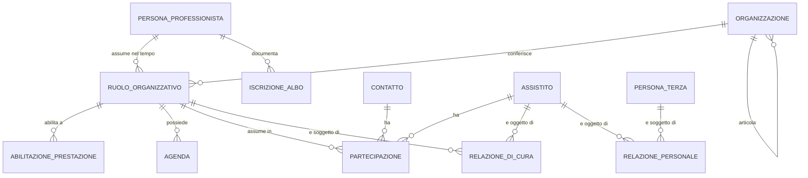
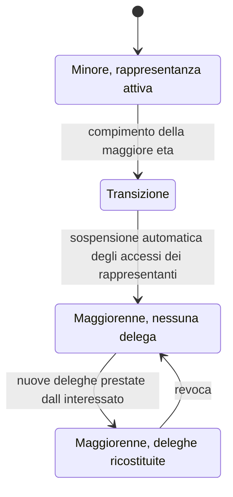

# Assistito, professionista, organizzazione

Questo capitolo modella i soggetti. Non le loro anagrafiche - quelle sono trattate dal modulo
[04 dei fondamenti](../10_fondamenti/04-identita-e-anagrafiche.md), che spiega come è fatto un
codice fiscale, che cosa sono STP ed ENI, perché le anagrafi divergono e perché una fusione
errata è un evento avverso. Questo capitolo decide **come i soggetti diventano entità e
relazioni**, e quale forma devono avere perché il modello sopravviva al tempo.

L'affermazione da cui discende tutto il resto è una sola:

> **Il ruolo non è un attributo della persona. È una relazione fra una persona e
> un'organizzazione, con una validità temporale.**

Sembra un dettaglio di normalizzazione. Non lo è: è la differenza fra un sistema che può
rappresentare la realtà sanitaria italiana e uno che non può.

## 1. Perché il ruolo non è un attributo

Si parte da un fatto banale del mondo reale: **lo stesso professionista lavora in più posti, in
più discipline, in periodi diversi, con abilitazioni diverse.** Un cardiologo può essere
dipendente di un'azienda ospedaliera, consulente di un poliambulatorio privato accreditato e
titolare di attività libero-professionale. In ciascuno dei tre contesti eroga prestazioni
diverse, con agende diverse, sotto responsabilità diverse.

Un modello che scriva `specialita = "cardiologia"` sulla persona produce quattro difetti, tutti
osservabili:

| Difetto | Come si manifesta |
|---|---|
| **Impossibilità del contesto multiplo** | Il professionista vede in un'unica lista pazienti di organizzazioni diverse, che sono titolari del trattamento autonomi ([`V-04`](../11_registri/01-vincoli-in-vigore.md#v-04)) |
| **Perdita della storia** | Alla cessazione del rapporto con l'organizzazione A si cancella o si sovrascrive il ruolo, e i contatti storici perdono il contesto in cui furono erogati |
| **Autorizzazione non rappresentabile** | «Può firmare referti di questa branca **presso questa struttura**» non è esprimibile con attributi sulla persona |
| **Rendicontazione ambigua** | La prestazione va attribuita alla struttura erogante, che è una proprietà del ruolo, non della persona |

> **`DM-30` [MOD] - Tre entità, non una.** `Persona` (dati identificativi, immutabili o quasi),
> `Organizzazione` (soggetto giuridico e sue articolazioni), `RuoloOrganizzativo` (la relazione
> fra le due, con periodo di validità, disciplina, prestazioni erogabili, abilitazioni). La
> corrispondenza con lo standard è `Practitioner`, `Organization`, `PractitionerRole`, e non è
> un caso: lo standard ha fatto la stessa scelta per la stessa ragione.

Il modulo [04 dei fondamenti](../10_fondamenti/04-identita-e-anagrafiche.md) § 5.4 tratta
l'errore dal lato didattico; qui ne discende la struttura.

## 2. L'assistito

### 2.1 Il modello per riferimento

> **[BASE]** Nel modello di integrazione l'anagrafica non è del progetto: pazienti,
> professionisti e agende sono già gestiti altrove. Il sistema lavora **per riferimento** -
> identificatori esterni con dominio di attribuzione esplicito - e non diventa il *master data*
> ([`00_PROJECT_BRIEF.md`](https://github.com/fedcal/Telemedic/blob/main/.telemedic/context/00_PROJECT_BRIEF.md) § 6.2.3).

Ne discendono quattro proprietà del modello, tutte verificabili.

1. **L'identità di lavoro è la coppia `system` + `value`.** Un identificatore senza dominio di
   attribuzione è una stringa, non un identificatore. La coppia è unica per tenant (`RF-021`) e
   la creazione ripetuta con gli stessi valori non genera duplicati.
2. **Nessun identificatore esterno è chiave primaria** ([`04_BASELINE_ARCHITETTURALE.md`](https://github.com/fedcal/Telemedic/blob/main/.telemedic/context/04_BASELINE_ARCHITETTURALE.md) § 3). Il
   codice fiscale è un identificatore con dominio esplicito, non una chiave: cambia, manca, è
   provvisorio, è affetto da omocodia. Il modulo 04 dei fondamenti, § 2.3 e § 2.9, ne dà i casi.
3. **Il modello ammette più identificatori per la stessa persona**, ciascuno con il proprio
   dominio: identificativo dell'integratore, codice fiscale, codice STP o ENI, identificativo
   regionale, identificativo di anagrafe. Nessuno è obbligatorio in assoluto; almeno uno lo è.
4. **Nessuna fusione automatica** (`RF-026`). Due anagrafiche con nome, cognome e data di
   nascita identici restano distinte e generano una segnalazione da valutare. La fusione è un
   atto umano, tracciato, con conservazione di entrambi gli identificatori esterni (`RF-025`).

### 2.2 Il codice fiscale e i suoi due domini

> **[NV] - Questione [`Q-06`](../11_registri/02-questioni-aperte.md#q-06) in bacheca, indirizzata alle aree `ARCH` e `TECH`.** Le guide di
> implementazione italiane usano **due URI diversi** per il codice fiscale:
> `http://hl7.it/sid/codiceFiscale` nelle famiglie *IT Base* e *Televisita*,
> `http://hl7.it/fhir/itcore/CodeSystem/cs-codicefiscale` in *IT-Core*. Sono due domini di
> attribuzione distinti per qualunque sistema che confronti identificatori.

Il contributo di quest'area alla questione non è la scelta dell'URI - che spetta ad `ARCH` - ma
il vincolo che qualunque scelta deve rispettare:

> **`DM-31` [MOD] - La normalizzazione degli identificatori avviene al confine, mai nel
> dominio.** Il modello di dominio conosce un identificativo canonico interno e una collezione
> di identificatori esterni qualificati. La traduzione fra gli URI concorrenti è responsabilità
> dello strato di adattamento del contesto di interoperabilità, che è per costruzione il solo
> punto di contatto con l'esterno. Se la logica di traduzione entra nel dominio, ogni futura
> divergenza fra guide diventa una modifica del dominio.

Il modulo [04 dei fondamenti](../10_fondamenti/04-identita-e-anagrafiche.md) § 3.2 propone
inoltre di **scrivere entrambi gli identificatori in uscita** e accettarne entrambi in
ingresso. È compatibile con `DM-31` e quest'area lo sostiene.

### 2.3 Assistito e paziente: due qualifiche, un soggetto

Il [capitolo 01](01-linguaggio-ubiquo.md) § 5.1 stabilisce che «assistito» è qualifica
amministrativa e «paziente» qualifica clinica. Sul piano del modello **non sono due entità**:
sono due **insiemi di attributi e permessi sullo stesso soggetto**, con confini di accesso
diversi.

| Insieme | Contenuto | Chi vi accede in forza del ruolo |
|---|---|---|
| **Anagrafico-amministrativo** | dati identificativi, recapiti, domicilio, esenzioni, coperture, scelta del medico | front-office, amministrazione |
| **Clinico** | condizioni, documenti, misure, note, esiti | professionisti in relazione di cura |

Con un'avvertenza che rende la separazione meno netta di quanto sembri, e che va scritta perché
è controintuitiva:

> **Un'esenzione per patologia rivela la patologia.** Non è un dato amministrativo neutro: è
> dato relativo alla salute ai sensi dell'art. 9 GDPR. Lo stesso vale per il **fatto stesso** di
> avere un appuntamento con una branca specialistica. Il modulo
> [03 dei fondamenti](../10_fondamenti/03-il-dato-clinico.md) § 1.2 lo tratta per esteso.

Ne discende una regola di modellazione: **gli attributi «amministrativi» non sono
automaticamente accessibili ai ruoli amministrativi**. L'esenzione porta una propria etichetta
di sensibilità, e la branca specialistica non compare nelle notifiche su canali non autenticati
(`BR-050`) né nell'esportazione di calendario (`RF-051`).

### 2.4 Nessun indice paziente globale

> **[BASE] [`V-04`](../11_registri/01-vincoli-in-vigore.md#v-04)** - Ogni entità porta l'identificativo di tenant. La stessa persona fisica
> presente in due tenant è rappresentata da **entità distinte e non correlabili** con alcuna
> interrogazione della piattaforma (`RF-023`).

È una scelta con un costo dichiarato: il sistema non può offrire una vista unificata della
persona attraverso i tenant, e non può riconciliare da sé duplicazioni fra titolari diversi. È
il prezzo corretto da pagare, perché due tenant sono tipicamente **due titolari del trattamento
autonomi**, e una correlazione fra i loro dati è una comunicazione di dati sanitari che nessuno
ha autorizzato.

Il progetto **non implementa un indice paziente principale** ([`00_PROJECT_BRIEF.md`](https://github.com/fedcal/Telemedic/blob/main/.telemedic/context/00_PROJECT_BRIEF.md) § 6.2.3):
consuma l'identità del sistema di origine.

## 3. Il professionista

### 3.1 Persona, ruolo, organizzazione

Le entità e il loro contenuto minimo:

| Entità | Contenuto | Validità temporale |
|---|---|---|
| `PersonaProfessionista` | dati identificativi, identificatori esterni | - |
| `IscrizioneAlbo` | ordine, provincia, numero, data di iscrizione, data di verifica, **chi ha verificato** | sì |
| `Organizzazione` | soggetto giuridico, tipo, identificativi, articolazione gerarchica | sì |
| `RuoloOrganizzativo` | persona, organizzazione, disciplina, qualifica, professione | **sì, obbligatoria** |
| `AbilitazionePrestazione` | ruolo, tipo di prestazione, canali ammessi | sì |
| `Partecipazione` | soggetto, contatto, ruolo nel contatto, ingresso, uscita | sì, per costruzione |

### 3.2 La verifica dell'abilitazione professionale è un fatto, non un booleano

Il sistema deve poter registrare gli estremi dell'iscrizione all'albo **con la data della
verifica e l'identità di chi ha verificato** (`RF-018`), e segnalare i profili privi di
verifica. La ragione è che un profilo clinico non verificato non è un difetto di completezza:
è un rischio, perché l'abilitazione a compiere atti riservati dipende dall'iscrizione.

> **`DM-32` [MOD]** - La verifica dell'abilitazione è un **atto con autore e data**, non un
> attributo booleano del profilo. Un booleano risponde alla domanda «è verificato?»; il modello
> deve poter rispondere a «chi lo ha verificato, quando, sulla base di che cosa» - che è la
> domanda che viene posta quando qualcosa va storto.

### 3.3 Gli atti riservati non sono configurabili

> **[NORM]** Le combinazioni professione × tipo di prestazione vietate dall'ordinamento
> professionale **non sono configurabili dal tenant**: sono vincoli di dominio codificati
> (`BR-011`). Un amministratore di struttura non può conferire a un profilo non medico la
> capacità di erogare atti medici.

Il modulo [01 dei fondamenti](../10_fondamenti/01-sistema-sanitario-italiano.md) § 5.1 spiega
perché la professione è un vincolo di dominio e non una configurazione. Sul piano del modello ne
discende una struttura a due livelli che va tenuta rigorosamente separata:

| Livello | Chi lo definisce | Esempio | Modificabile dal tenant |
|---|---|---|---|
| **Vincolo di dominio** | l'ordinamento professionale, codificato nel prodotto | la televisita è atto medico | **no** |
| **Abilitazione organizzativa** | il tenant, entro il vincolo | il dottor X eroga televisite di questa disciplina presso questa struttura | sì |

> **`DM-33` [MOD]** - L'insieme delle configurazioni ammesse è un **sottoinsieme proprio** dello
> spazio delle politiche (`BR-096`). Il tentativo di comporre un'abilitazione che violi un
> vincolo di dominio è rifiutato con errore di validazione, non silenziosamente ignorato: un
> rifiuto silenzioso lascia l'amministratore convinto di aver configurato ciò che voleva.

### 3.4 Il centro servizi e il centro erogatore

> **[NORM]** «Per ogni infrastruttura regionale di telemedicina deve essere prevista la presenza
> di **uno o più Centri servizi**, con compiti prettamente tecnici, ed **uno o più Centri
> erogatore**, con compiti prettamente sanitari» (DM 21 settembre 2022, All. A).

I due centri hanno responsabilità che il modello deve poter separare:

| | Centro servizi | Centro erogatore |
|---|---|---|
| Personale | tecnico | sanitario |
| Compiti | manutenzione, gestione degli account, assistenza a tutti gli utenti, monitoraggio, gestione dei dispositivi a domicilio, formazione all'uso | erogazione delle prestazioni |
| Allarmi gestiti | **tecnici** | **sanitari** |

> **`DM-34` [MOD]** - Il centro servizi è un'**organizzazione con ruolo tecnico**, non un ruolo
> applicativo. La distinzione conta perché il centro servizi può essere un soggetto giuridico
> diverso dall'erogatore, con un proprio rapporto di responsabilità sul trattamento dei dati, e
> perché la classe dell'allarme determina il destinatario. Una coda unica di allarmi rende
> impossibile rispettare la separazione imposta dal decreto.

### 3.5 I soggetti non umani

Non tutti gli attori sono persone. L'**integratore** è un principal applicativo con proprie
chiavi, propri webhook, propri limiti e propria configurazione di personalizzazione
([`00_PROJECT_BRIEF.md`](https://github.com/fedcal/Telemedic/blob/main/.telemedic/context/00_PROJECT_BRIEF.md) § 6.2.6).

> **[BASE]** Le credenziali applicative di un integratore **non conferiscono da sole accesso a
> dati clinici**: ogni operazione clinica richiede un contesto utente delegante verificabile
> (`BR-017`). La delega è sempre rappresentata come tale, mai come impersonificazione: `D18`
> impone il claim `act` di RFC 8693 § 4.1.

Sul piano del dominio la conseguenza è netta: **ogni atto ha due soggetti quando è compiuto in
delega** - chi agisce e per conto di chi - e il registro degli accessi ne registra entrambi. Un
modello che riduca l'atto a un solo soggetto rende indistinguibile un'azione dell'integratore
da un'azione dell'utente.

### 3.6 Gli identificativi del professionista

Il tracciato ministeriale del referto di televisita richiede **cognome, nome e codice fiscale**
per quattro soggetti professionali distinti - refertante, firmatario, altra figura tecnica
coinvolta, prescrittore - e i codici delle strutture (DM 19 novembre 2025, All. 1, § 2.20).

Ne discendono tre requisiti del modello del professionista che vengono spesso scoperti tardi.

1. **L'identificativo fiscale del professionista è un dato necessario**, non facoltativo, per
   qualunque profilo che possa comparire in un documento destinato al fascicolo. Un profilo
   clinico privo di quel dato non può refertare: è una condizione da verificare
   all'abilitazione, non alla firma.
2. **Il modello deve poter rappresentare un professionista che non è utente del sistema.** Il
   prescrittore, tipicamente, non lo è: compare nel documento come riferimento, non come
   soggetto che accede. Un modello in cui ogni professionista è un account produce account
   fittizi per soggetti che non hanno mai usato il sistema.
3. **Gli identificativi professionali seguono la stessa disciplina degli identificativi
   dell'assistito**: coppia dominio più valore, nessuno come chiave primaria, normalizzazione al
   confine. Lo stesso professionista può portare l'identificativo dell'ordine, quello aziendale
   e quello del sistema di origine.

> **`DM-39` [MOD]** - Il **professionista di riferimento**, che compare nei documenti senza
> essere utente, è modellato come `PersonaProfessionista` senza alcun `RuoloOrganizzativo` nel
> tenant. È coerente con `DM-30`: la persona esiste indipendentemente dai ruoli, e l'assenza di
> ruoli significa esattamente che non può operare.

## 4. Le organizzazioni

### 4.1 Quattro concetti che non coincidono

| Concetto | Che cos'è | Chi lo definisce |
|---|---|---|
| **Tenant** | Confine di isolamento logico dei dati e della configurazione | il gestore dell'installazione |
| **Organizzazione** | Soggetto giuridico | l'ordinamento |
| **Struttura erogante** | Chi risponde dell'erogazione della prestazione | l'accreditamento o l'autorizzazione |
| **Integratore** | Principal applicativo che incorpora il sistema | il contratto |

Un tenant può contenere più organizzazioni; un'organizzazione può articolarsi in più strutture
eroganti; un integratore può operare su più tenant. Nei casi semplici i quattro coincidono, e
questo è precisamente il motivo per cui vengono confusi in fase di modellazione: **il caso
semplice è quello della prima installazione di prova**.

### 4.2 L'articolazione interna

Il tracciato ministeriale del referto di televisita richiede tre livelli distinti: **azienda
sanitaria**, **presidio**, **unità operativa**, ciascuno con codice e descrizione (DM 19
novembre 2025, All. 1, § 2.20). Non sono etichette: sono l'articolazione che la rendicontazione
e la refertazione richiedono.

> **`DM-35` [MOD]** - L'organizzazione è **ricorsiva** con un tipo dichiarato per livello. Tre
> campi separati e piatti - azienda, presidio, unità operativa - funzionano finché non compare
> un tenant privato che non ha presidi o un tenant pubblico con un livello intermedio in più.
> La gerarchia ricorsiva con tipo permette di proiettare i tre campi richiesti dal tracciato
> senza vincolare il modello a esattamente tre livelli.

### 4.3 Il punto di erogazione virtuale

In telemedicina il luogo va comunque valorizzato, perché la rendicontazione lo richiede e perché
il referto lo riporta (`RF-031`). Il punto di erogazione virtuale è un'entità configurata dal
tenant, collegata alle agende e citata nel documento.

Da non confondere con l'**indirizzo di svolgimento**: il primo è dove eroga la struttura, il
secondo è dove si trova fisicamente l'assistito durante la sessione, ed è dato che serve in
emergenza (`BR-039`, [capitolo 02](02-le-prestazioni-modellate.md) § 10). Sono due luoghi
diversi con due finalità diverse e due regimi di conservazione diversi.

## 5. Le relazioni con validità temporale

### 5.1 La forma generale

Tutte le relazioni di questo dominio - di cura, di rappresentanza, di delega, di ruolo - hanno
la stessa forma. Riconoscerlo evita di modellarle cinque volte in cinque modi diversi.

> **`DM-36` [MOD] - Forma canonica della relazione.**
>
> | Componente | Obbligatorio | Contenuto |
> |---|---|---|
> | **Soggetto** | sì | chi ha la posizione |
> | **Oggetto** | sì | su chi o su che cosa |
> | **Tipo** | sì | quale relazione, da un insieme chiuso |
> | **Ambito** | dipende dal tipo | che cosa la relazione consente; per la rappresentanza è delimitato dal titolo |
> | **Inizio validità** | sì | |
> | **Fine validità** | **sì per le relazioni volontarie**, facoltativa per quelle di stato | una delega senza scadenza è un accesso permanente non presidiato |
> | **Titolo** | dipende dal tipo | provvedimento, atto, dichiarazione che la fonda |
> | **Evidenza** | sì | come si dimostra: documento, dichiarazione registrata, riferimento a un atto |
> | **Chi l'ha registrata** | sì | l'atto di registrazione ha un autore |
> | **Stato** | sì | vigente, cessata, sospesa, revocata |

L'ultima riga merita un'osservazione. **Cessata e revocata non sono lo stesso stato**: la
cessazione è la fine naturale del periodo, la revoca è un atto. Trattarle come lo stesso valore
rende impossibile rispondere alla domanda «la delega è finita o è stata ritirata», che è la
domanda che l'interessato pone.

### 5.2 La relazione di cura è l'unità di autorizzazione

Il modello di autorizzazione proposto in `R6` § 2.2 è a ruoli per le capacità e ad attributi per
l'ambito. L'attributo decisivo è **l'esistenza di una relazione abilitante**: il fatto che una
persona sia medico non dice nulla su *quale* paziente possa vedere.

| Relazione | Condizione di esistenza | Effetto |
|---|---|---|
| `CARE_APPOINTMENT` | esiste un appuntamento fra il ruolo e l'assistito | accesso ai dati necessari alla preparazione e all'esecuzione, in una finestra attorno all'orario previsto |
| `CARE_ENCOUNTER` | il ruolo ha erogato un contatto | accesso permanente in lettura ai **propri** atti |
| `CARE_EPISODE` | il ruolo è nel team di un episodio attivo | accesso al dossier dell'episodio |
| `CONSULT_SCOPE` | il ruolo è destinatario di una richiesta di teleconsulto | accesso **solo** al materiale allegato al quesito, a scadenza |
| `PRIMARY_CARE` | il ruolo è medico di scelta dell'assistito | accesso continuativo ai documenti a lui indirizzati |
| `DELEGATION` | esiste una delega valida dell'assistito | accesso derivato, limitato, a scadenza |
| `LEGAL_REPRESENTATION` | esiste un titolo di rappresentanza registrato | accesso nei limiti dei poteri |
| `BREAK_GLASS` | invocazione esplicita con motivazione | accesso eccezionale, a durata breve e non rinnovabile |

Le finestre temporali proposte da `R6` § 2.2 sono **valori predefiniti del progetto**,
configurabili per tenant, non prescrizioni normative.

> **`DM-37` [MOD] - La relazione di cura è un'entità di prima classe, non una interrogazione.**
> Se l'esistenza della relazione si deduce ogni volta interrogando appuntamenti, contatti ed
> episodi, tre cose diventano impossibili: motivare una decisione di accesso a distanza di
> tempo, verificare la decisione in un audit, e modificare le regole senza toccare il codice di
> autorizzazione. La relazione si **materializza** come fatto con inizio, fine e fonte.

Un'avvertenza che discende dal fascicolo sanitario e che va recepita: per la consultazione da
parte di un medico diverso dal medico di scelta, il DM 7 settembre 2023, art. 15, c. 3 richiede
la **dichiarazione che il processo di cura è in atto** al momento della consultazione, con
assunzione di responsabilità ai sensi dell'art. 47 del D.P.R. 445/2000. La dichiarazione è
quindi essa stessa un fatto da registrare, con l'identità di chi la rende: non è un flag
tecnico.

### 5.3 La bitemporalità delle relazioni

Una relazione ha **due tempi**: quando è valida nel mondo e quando il sistema lo ha saputo. Non
coincidono quasi mai.

Un esempio interamente sintetico che rende il problema concreto: un decreto di nomina di
amministratore di sostegno ha efficacia dal 3 marzo; il documento viene presentato allo
sportello il 21 marzo e registrato lo stesso giorno. Fra il 3 e il 21 marzo il sistema ha
consentito a un delegato volontario accessi che, alla luce del decreto, andavano valutati
diversamente.

> **`DM-38` [MOD]** - Le relazioni che fondano l'accesso ai dati sono **bitemporali**: portano
> il periodo di validità nel mondo e l'istante di registrazione nel sistema. Il registro degli
> accessi si valuta sempre con lo stato **conosciuto al momento dell'accesso**, non con lo stato
> corrente: giudicare accessi passati con conoscenza successiva produce falsi positivi in ogni
> revisione.

Il modulo [11 dei fondamenti](../10_fondamenti/11-fondamenti-informatici.md) § 8 tratta la
bitemporalità dal lato tecnico; qui interessa la conseguenza di dominio.

## 6. Deleghe e rappresentanza

### 6.1 Le figure, e ciò che le distingue

| Figura | Che cosa può fare | Che cosa non può fare | Fonte del potere |
|---|---|---|---|
| **Caregiver** | assistere, essere presente, ricevere istruzioni, aiutare nell'uso degli strumenti | prestare consenso in sostituzione di un assistito capace, **in nessuna configurazione** (`BR-062`) | il fatto dell'assistenza, più eventuale delega |
| **Delegato volontario** | accedere ai documenti o operare per conto dell'assistito capace, **nell'ambito della delega** | eccedere l'ambito; operare dopo la scadenza | atto di delega dell'interessato, revocabile |
| **Esercente la responsabilità genitoriale** | decidere per il minore, tenendo conto della sua opinione secondo età e maturità | continuare dopo la maggiore età | la legge |
| **Tutore** | sostituire la volontà del rappresentato | eccedere i poteri del provvedimento | provvedimento dell'autorità |
| **Amministratore di sostegno** | agire **nei limiti del decreto di nomina**, che può o meno comprendere le decisioni sanitarie | agire fuori dai poteri conferiti | decreto di nomina |

L'errore più frequente e più costoso è l'ultima riga: **trattare l'amministratore di sostegno
come un tutore**. I poteri vanno registrati come **ambito** e verificati **per atto** (`BR-063`,
`RF-117`). Un amministratore con poteri limitati alla sfera patrimoniale che presti consenso a
un atto sanitario è un consenso invalido, e il sistema che lo ha accettato ne è parte.

### 6.2 Come si modella una delega senza creare un buco

Cinque proprietà obbligatorie, ciascuna con la ragione.

1. **Ambito esplicito e chiuso.** Non «accesso ai dati» ma un insieme enumerato di ciò che la
   delega consente. Un ambito aperto è una delega che cresce con le funzionalità del prodotto,
   senza che l'interessato lo sappia.
2. **Scadenza obbligatoria per le deleghe volontarie** (`RF-028`). Alla scadenza l'accesso è
   negato **senza necessità di intervento manuale**: la scadenza è verificata alla decisione di
   accesso, non da un processo periodico che potrebbe non essere eseguito.
3. **Revoca immediata ed effettiva.** La revoca produce effetto sulle sessioni già aperte, non
   solo sui nuovi accessi.
4. **Evidenza del titolo.** Per le deleghe volontarie: identità del delegante, canale, istante,
   testo presentato. Per la rappresentanza: estremi del provvedimento, ambito dei poteri,
   validità temporale.
5. **Verifica per atto, non all'ingresso.** L'ambito si verifica **rispetto all'atto che si
   sta compiendo**, non una volta all'accesso. È la differenza fra «questo utente è un
   rappresentante» e «questo rappresentante può compiere questo atto».

### 6.3 La transizione alla maggiore età

> **[NORM] [NV]** Al compimento della maggiore età gli accessi dei rappresentanti sono sospesi
> automaticamente e le deleghe vanno ricostituite dall'interessato (`RF-118`). La disciplina
> puntuale della rappresentanza e del consenso per minori e soggetti incapaci è fra le
> questioni che `R6` § 11.1 rimette alla verifica normativa (voce Q9). **Da chiedere all'area
> `COMP`**; il modello è comunque costruito per rappresentare qualunque risposta, perché la
> transizione è un evento anagrafico che invalida i riferimenti e va gestito in ogni caso.

Due dettagli che rendono la transizione più difficile di quanto sembri e che vanno decisi:

- **Il calcolo della data** dipende dalla data di nascita, che è un dato dell'anagrafica per
  riferimento e può essere assente o approssimata per alcune popolazioni (il modulo
  [04 dei fondamenti](../10_fondamenti/04-identita-e-anagrafiche.md) § 2.3 ne dà i casi).
- **La sospensione è automatica, la comunicazione no.** Un genitore che perde l'accesso senza
  spiegazione telefona; il modello prevede quindi la notifica al nuovo titolare del diritto e
  un messaggio esplicativo al rappresentante cessato, senza contenuto clinico.

### 6.4 Il terzo in sessione

Il terzo non è un partecipante come gli altri: accede a dati sanitari senza essere parte della
relazione di cura. Tre percorsi distinti, con tre trattamenti distinti (`R6` § 3.3.6):

| Situazione | Trattamento |
|---|---|
| **Previsto in prenotazione** | consenso raccolto prima; collegamento di accesso proprio; comparsa nella lista dei partecipanti |
| **Sopraggiunto in sessione** | il professionista lo dichiara; il sistema chiede all'assistito conferma **esplicita**, non silenzio-assenso; ingresso e uscita registrati |
| **Presente ma non dichiarato** | il sistema **non esegue rilevazione automatica di volti** (vincolo [`V2`](../11_registri/03-vincoli-fondanti.md#v2) e profilo di riservatezza). L'onere della domanda è del professionista; il sistema fornisce il campo per registrare la risposta |

La terza riga è una decisione di dominio che vale la pena rendere esplicita: **il sistema
rinuncia deliberatamente a una capacità tecnica disponibile**. Introdurre il riconoscimento
automatico dei volti cambierebbe il profilo di rischio del trattamento e sposterebbe il
perimetro di qualificazione.

## 7. I ruoli applicativi e le esclusioni strutturali

I ruoli sono **composizioni di permessi**, non entità primitive (`R6` § 2.4). Un tenant può
definirne di propri, ma non può creare permessi nuovi né superare i vincoli di dominio.

Tre esclusioni sono **strutturali**, cioè non ottenibili per configurazione:

1. **Nessun ruolo amministrativo può leggere contenuto clinico** (`BR-012`). Front-office,
   amministratore di struttura e amministratore di sistema. Il tentativo di comporre un ruolo
   che li includa è rifiutato con errore di validazione.
2. **Nessuna funzione di impersonificazione** consente a un ruolo amministrativo di operare come
   utente clinico (`RF-015`). Non esiste in alcuna interfaccia né in alcuna interfaccia
   applicativa.
3. **Nessuna auto-registrazione con ruolo clinico** (`RF-017`). Ogni profilo clinico è creato o
   approvato da un amministratore del tenant, e l'abilitazione è un atto registrato.

L'assegnazione a sé stessi di un ruolo clinico da parte di un amministratore genera un evento di
severità critica e una notifica al responsabile della protezione dei dati (`BR-013`): è
l'escalation di privilegio più ovvia e va resa costosa, non impossibile - renderla impossibile
produrrebbe organizzazioni piccole incapaci di operare.

## 8. Il tempo che scorre sui soggetti

Sei eventi anagrafici invalidano ciò che il modello credeva vero. Vanno previsti, perché
accadono con frequenza sufficiente a non essere casi limite.

| Evento | Che cosa invalida | Comportamento richiesto |
|---|---|---|
| Cessazione del ruolo organizzativo | agende, abilitazioni, relazioni di cura fondate sul ruolo | i contatti storici restano leggibili sui propri atti; le agende future si liberano con percorso di cancellazione da parte della struttura |
| Cambio di organizzazione | contesto operativo | il professionista opera nel solo contesto selezionato (`RF-014`); l'audit registra il contesto di ogni operazione |
| Compimento della maggiore età | rappresentanza | § 6.3 |
| Transizione da pediatra a medico di assistenza primaria | relazione `PRIMARY_CARE` | è un evento anagrafico; non va cablata una regola di età nel codice |
| Decesso | tutte le relazioni volontarie; non gli obblighi di conservazione | i documenti restano; l'indice del fascicolo è cancellato decorsi trent'anni dalla data del decesso (DM 7 settembre 2023, art. 10) |
| Revoca o scadenza di un titolo di rappresentanza | accessi derivati | verifica alla decisione, non a un processo periodico |

## 9. Che cosa quest'area non decide

Tre questioni toccano i soggetti ma appartengono ad altre aree, e vanno lasciate lì per non
produrre decisioni contraddittorie.

- **La federazione dell'identità digitale** - realm, provider, livelli di garanzia, propagazione
  del contesto di autenticazione - è dell'area `SEC` e dell'area `INTEG`. Quest'area consuma il
  livello di garanzia come attributo del soggetto e non ne decide la produzione.
- **La divergenza degli URI del codice fiscale** è la questione [`Q-06`](../11_registri/02-questioni-aperte.md#q-06), indirizzata ad `ARCH` e
  `TECH`. Quest'area vi contribuisce con `DM-31` e non la chiude.
- **La ripartizione titolare/responsabile** nel modello a servizio e in installazione presso il
  cliente è dell'area `COMP` (`R6` § 11.2, voce Q14). Quest'area si limita a richiedere che il
  modello **possa rappresentare titolari diversi sulla stessa installazione**, che è un
  requisito strutturale già soddisfatto da [`V-04`](../11_registri/01-vincoli-in-vigore.md#v-04).

## Cosa devi ricordare

1. **Il ruolo è una relazione con validità temporale**, non un attributo. Persona,
   organizzazione, ruolo: tre entità.
2. **L'identità di lavoro è la coppia dominio più valore.** Nessun identificatore esterno è
   chiave primaria; il codice fiscale meno di tutti.
3. **La normalizzazione degli identificatori avviene al confine**, mai nel dominio.
4. **Nessun indice paziente globale**: la stessa persona in due tenant è non correlabile, e il
   costo di questa scelta è dichiarato.
5. **Gli atti riservati non sono configurabili.** Vincolo di dominio e abilitazione
   organizzativa sono due livelli, e il secondo non può violare il primo.
6. **Centro servizi e centro erogatore sono soggetti distinti** con classi di allarme distinte.
7. **Tutte le relazioni hanno la stessa forma canonica**: soggetto, oggetto, tipo, ambito,
   validità, titolo, evidenza, autore della registrazione, stato.
8. **Cessata e revocata non sono lo stesso stato.**
9. **La relazione di cura è materializzata**, non dedotta a ogni richiesta.
10. **Le relazioni che fondano l'accesso sono bitemporali**: gli accessi si giudicano con la
    conoscenza che il sistema aveva allora.
11. **Assistere non è rappresentare**, e l'amministratore di sostegno non è un tutore: i poteri
    si verificano per atto.
12. **Ogni delega volontaria ha una scadenza**, verificata alla decisione di accesso.

## Dove continuare

- [06 - Consenso e riservatezza](06-consenso-e-riservatezza.md): che cosa i soggetti dichiarano
  e come lo si dimostra.
- [04 - I documenti clinici](04-documenti-clinici.md): chi è autore, chi è firmatario e perché
  non sono la stessa persona.
- Modulo [04 dei fondamenti](../10_fondamenti/04-identita-e-anagrafiche.md): identificatori,
  anagrafi, identità digitale e livelli di garanzia, che quest'area non ripete.
