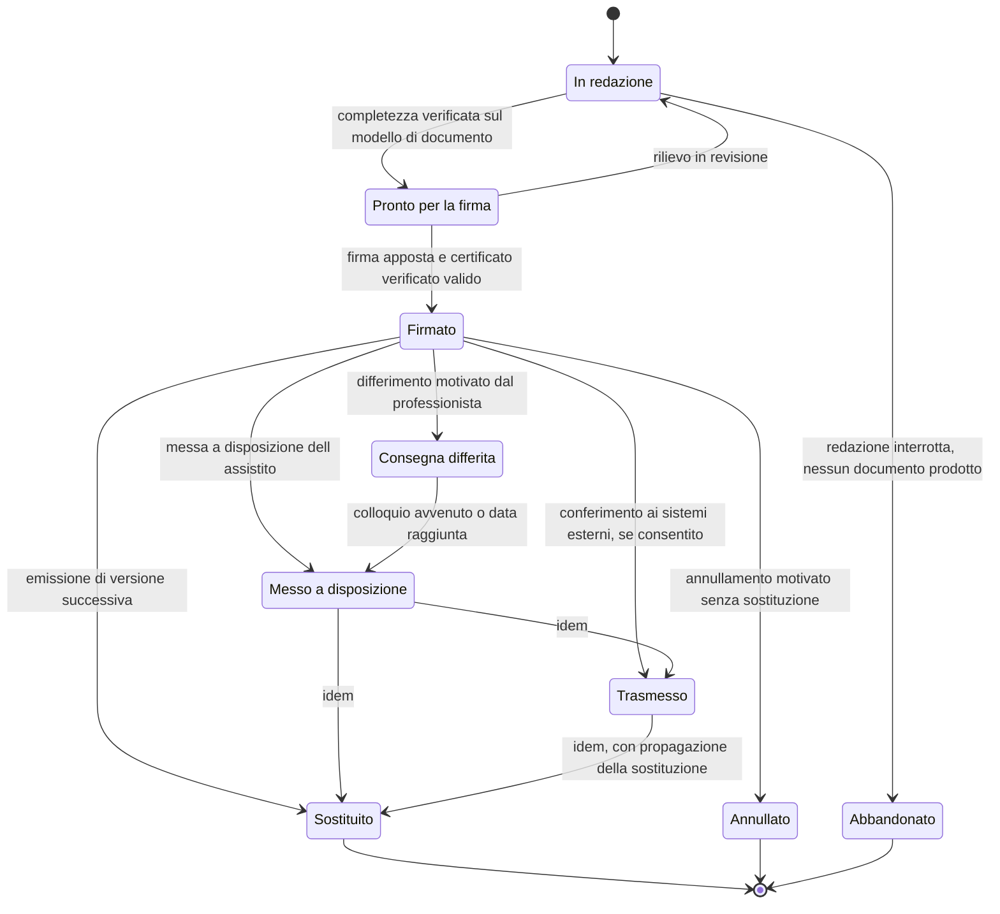
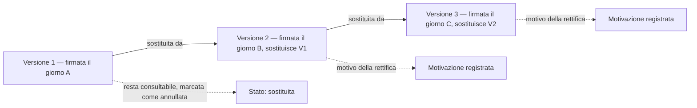
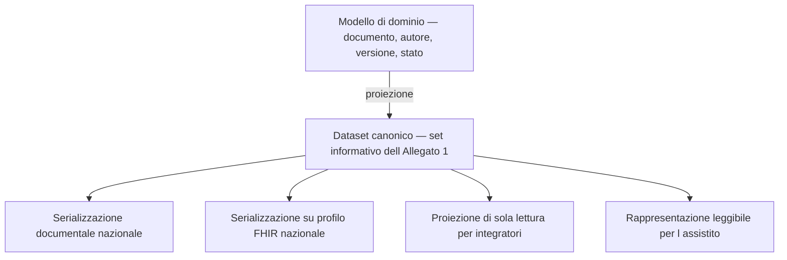

# I documenti clinici

Un documento clinico è ciò che resta quando la sessione è finita, il professionista ha
riattaccato e nessuno ricorda più nulla. È l'unico artefatto del sistema che verrà letto fra
dieci anni, forse in un contenzioso, da qualcuno che non c'era.

Ne discende un criterio che governa tutto il capitolo:

> **Il modello del documento è progettato per il momento in cui qualcuno chiederà conto di che
> cosa è stato scritto, da chi, quando, sulla base di che cosa e chi lo ha potuto leggere.**

Il modulo [03 dei fondamenti](../10_fondamenti/03-il-dato-clinico.md) § 6 e § 7 spiega che cosa
sono referto, relazione, verbale, lettera di dimissione e diario clinico, e come funzionano
firma, validazione, marca temporale e conservazione a norma. Questo capitolo non li ripete: ne
ricava la struttura dati e il ciclo di vita.

## 1. Che cosa distingue un documento da un contenuto

Il sistema produce molto testo: note, messaggi di chat, campi di formulario, annotazioni,
esiti. Solo una parte è **documento clinico**. La differenza non è di lunghezza né di formato.

| Proprietà | Contenuto | Documento clinico |
|---|---|---|
| Ha un **autore** identificato con qualifica | a volte | sempre |
| È **attribuito a un momento** dell'atto | a volte | sempre |
| È **validato** da chi ne assume la responsabilità | no | sì |
| È **immutabile** dopo la validazione | no | sì |
| Ha un **destinatario** dichiarato | no | sì |
| Ha un **regime di conservazione** proprio | no | sì |
| Può essere **oscurato** | no | sì |

> **`DM-40` [MOD]** — Il passaggio da contenuto a documento è un **atto**, non un salvataggio.
> Nel modello esiste un momento identificabile in cui un insieme di contenuti diventa
> documento, con un autore che se ne assume la responsabilità. Prima di quel momento il
> materiale non è visibile all'assistito, non è trasmissibile e non è conservato come documento
> sanitario (`BR-041`).

Il caso che rende la distinzione operativa: la **chat di sessione**. Al termine della sessione
il suo contenuto è o allegato al contatto come documento, o eliminato, secondo configurazione;
non resta in uno stato intermedio indefinito (`BR-056`). Un contenuto clinico senza collocazione
documentale è ingovernabile: non si sa chi può leggerlo, per quanto si conserva, se si trasmette.

## 2. Le tipologie

### 2.1 Le dieci tipologie documentali nazionali della telemedicina

> **[NORM]** Il DM 19 novembre 2025, art. 7, c. 1 aggiunge all'art. 3, c. 1 del DM 7 settembre
> 2023 **dieci nuove lettere**, creando dieci tipologie documentali del fascicolo sanitario
> elettronico dedicate alla telemedicina. Il set informativo di ciascuna è nell'Allegato 1,
> §§ 2.18–2.27. Termine di messa a regime: **30 giugno 2026** (art. 7, c. 3).

| Lett. | Tipologia | § All. 1 | Prodotta da |
|---|---|---|---|
| n) | prescrizione televisita, teleassistenza e telemonitoraggio | 2.18 | prescrittore |
| o) | richiesta teleconsulto | 2.19 | medico richiedente |
| p) | **referto di specialistica per la televisita** | 2.20 | medico erogante |
| q) | **relazione collaborativa per il teleconsulto/teleconsulenza** | 2.21 | medico consulente |
| r) | relazione clinico-assistenziale conclusiva per teleassistenza/teleriabilitazione | 2.22 | professionista sanitario |
| s) | tesserino dispositivi per il telemonitoraggio | 2.23 | professionista che assegna il dispositivo |
| t) | piano di telemonitoraggio/teleriabilitazione e teleassistenza | 2.24 | professionista che redige il piano |
| u) | report rilevazioni telemonitoraggio | 2.25 | sistema, sotto responsabilità del servizio |
| v) | report settimanale rilevazioni telemonitoraggio | 2.26 | idem |
| w) | relazione finale per il telemonitoraggio/teleriabilitazione | 2.27 | professionista |

Questa tabella **sostituisce un'ipotesi diffusa e sbagliata**: che il referto di televisita si
veicoli come referto di specialistica ambulatoriale. Non è così dal DM 19 novembre 2025, e la
correzione è stata verificata su Gazzetta Ufficiale (`B1`, § V4).

### 2.2 I documenti che non vanno al fascicolo

Non tutto ciò che il sistema produce è destinato al fascicolo, e trattare tutto allo stesso modo
produce due difetti opposti: consegnare all'assistito ciò che non gli è destinato, o non
consegnargli ciò che gli spetta.

| Tipologia interna | Destinatario | Va al fascicolo | Vincolo |
|---|---|---|---|
| **Diario clinico / nota di decorso** | professionisti del team | no, salvo azione esplicita | non è consegnata all'assistito né trasmessa (`RF-136`, `BR-136` di `R6` § 5.I) |
| **Annotazione digitale** (televisita del medico di assistenza primaria) | il curante e l'assistito | secondo il setting | sostituisce il referto in quel setting (`REQ-59` di `B1`) |
| **Rapporto tecnico di sessione** | professionista, servizio | no | è dato tecnico, non clinico; alimenta l'evidenza sulla qualità del collegamento |
| **Registrazione della sessione** | secondo consenso e permesso | **no** | non è documento clinico ai sensi del decreto: ha base giuridica, retention e regole di accesso proprie |
| **Risposta a questionario auto-compilato** | professionista | no finché non è validata | non ha valore di anamnesi finché il professionista non la valida |

La riga sulla registrazione è quella che sorprende, e va scritta senza ambiguità perché ha
conseguenze pratiche: `B1` § V4 e l'art. 12 del DM 19 novembre 2025 spostano il baricentro della
conservazione, e trattare la registrazione come documento clinico ne farebbe ereditare
conservazione e regole di accesso sbagliate in entrambe le direzioni.

## 3. Autore, firmatario, esecutore: tre ruoli, non uno

Il tracciato ministeriale del referto di televisita distingue esplicitamente, e va preso alla
lettera (DM 19 novembre 2025, All. 1, § 2.20):

- **medico refertante** — cognome, nome, codice fiscale;
- **medico firmatario** — cognome, nome, codice fiscale, **distinto dal refertante**;
- **altra figura tecnica coinvolta nell'esecuzione della procedura** — cognome, nome, codice
  fiscale;
- **medico prescrittore** — «medico del ruolo unico di assistenza primaria/PLS o Specialista».

> **`DM-41` [MOD]** — Il documento porta **quattro riferimenti a soggetti distinti**, ciascuno
> con il proprio ruolo, e non un unico campo «medico». Un modello che identifica autore e
> firmatario è corretto nel caso ordinario e **non rappresentabile** nel caso, previsto dal
> tracciato, in cui differiscono. Aggiungere il quarto riferimento dopo è una migrazione di
> dati su documenti immutabili: cioè non si fa.

La distinzione fra refertante e firmatario è quella che rende il modello non banale. Il
refertante è chi **redige e assume la responsabilità clinica**; il firmatario è chi **appone la
firma elettronica**. Nella maggior parte dei casi coincidono. Quando non coincidono — e il
tracciato prevede che possa accadere — il documento deve dire entrambe le cose, perché
rispondono a due domande diverse: chi risponde del contenuto e chi garantisce l'integrità.

Nel teleconsulto la stessa struttura si ripete con soggetti diversi: **medico consultato**,
**medico firmatario**, **medico richiedente** (All. 1, § 2.21).

## 4. Il ciclo di vita

Sei osservazioni sulle transizioni, ciascuna una decisione.

1. **`In redazione` non è uno stato del documento sanitario.** È lo stato di un materiale di
   lavoro. La distinzione non è formale: determina che il materiale non compaia in alcun elenco
   destinato all'assistito, «nemmeno come documento in lavorazione» (`RF-124`).
2. **`Firmato → In redazione` non esiste.** Il documento firmato è immutabile (`BR-044`). Un
   rilievo dopo la firma produce una **nuova versione**, non un ritorno indietro.
3. **La messa a disposizione e la trasmissione sono indipendenti.** Un documento può essere
   trasmesso al sistema di origine senza essere ancora stato messo a disposizione
   dell'assistito, e viceversa. Sono due destinatari, due consensi, due regimi.
4. **La consegna differita è uno stato, non un ritardo.** Esiste una casistica clinica in cui la
   consegna automatica è dannosa: il professionista può differire, registrando motivazione e
   data prevista (`BR-047`, `RF-132`). L'assistito vede che il documento esiste e che gli sarà
   illustrato, senza accedere al contenuto.
5. **`Abbandonato` esiste.** Una redazione interrotta non produce nulla, ma il fatto che sia
   stata aperta e non completata è un'informazione per la sorveglianza dei termini di
   refertazione.
6. **`Annullato` senza sostituzione è ammesso ma raro.** Serve per il documento emesso per
   errore su un soggetto sbagliato, dove non esiste una versione «corretta» da emettere.

### 4.1 La finestra di refertazione

Il tempo fra conclusione del contatto e firma è un fatto misurabile con conseguenze
organizzative: superata la finestra configurata, il professionista riceve un sollecito e il
responsabile del servizio vede il contatto nell'elenco degli inadempimenti (`RF-130`).

> **`DM-42` [MOD]** — Il superamento del termine di refertazione è un **evento di dominio**
> (`TermineDiRefertazioneSuperato`), non un rapporto periodico. La differenza è che un evento è
> tracciabile, sottoscrivibile e verificabile; un rapporto è una fotografia che nessuno conserva.

I valori proposti da `R6` (`BR-042`: cinque giorni lavorativi come predefinito, ventiquattro ore
per prestazioni marcate urgenti) sono **valori del progetto configurabili per tenant**, non
prescrizioni normative.

## 5. Immutabilità, versione, rettifica

### 5.1 La catena

Le regole, tutte verificabili con un test che le violi:

1. **Nessuna versione viene cancellata.** Tutte restano consultabili; le precedenti sono marcate
   come sostituite (`RF-128`).
2. **Ogni versione successiva reca il riferimento alla precedente e la motivazione della
   rettifica.** Una rettifica senza motivazione è un difetto, non una scelta di interfaccia.
3. **La firma copre l'insieme documento più allegati** (`RF-134`): l'alterazione di un allegato
   rende negativa la verifica di integrità.
4. **La sostituzione si propaga.** Se il documento era già stato trasmesso a un sistema esterno,
   la sostituzione genera un fatto di propagazione; il fallimento della propagazione è un
   incidente visibile con coda di riconciliazione, non un errore silenzioso (`BR-048`).

### 5.2 Perché la compensazione documentale non è un rollback

Un documento trasmesso al fascicolo non si «annulla»: si **rettifica**, e la rettifica è essa
stessa un fatto che va trasmesso. È l'esempio classico di compensazione: l'effetto non si
cancella, se ne produce un secondo che lo contrasta. Il modulo
[11 dei fondamenti](../10_fondamenti/11-fondamenti-informatici.md) § 3.5 ne dà la trattazione
tecnica; qui interessa la conseguenza di dominio: **il modello non ha operazioni di annullamento
retroattivo sul contenuto già conferito.**

### 5.3 Il versionamento delle entità non è il registro degli accessi

> **[BASE] `D42`, `V-04`** — Il versionamento automatico delle entità **versiona, non rende
> immutabile**: chi ha accesso in scrittura alla base dati può alterare anche le tabelle di
> versionamento. Il registro degli accessi è a **catena di impronte e conservazione separata**.

La conseguenza per questo capitolo è che **la catena di versioni del documento e il registro
degli accessi sono due artefatti distinti con due scopi distinti**: la prima dimostra che cosa
è stato scritto e in che ordine, il secondo dimostra chi ha letto che cosa. Nessuno dei due
sostituisce l'altro, e presentare il primo come «audit immutabile» è un claim non sostenibile.

## 6. Il dataset canonico

### 6.1 Il vincolo

> **[BASE] `V-07`** — Il contenuto informativo dei documenti destinati al fascicolo si modella
> come **dataset canonico**; le serializzazioni (CDA2, FHIR, altro) sono **sostituibili** e non
> vanno cablate.

La ragione non è teorica. È accertata:

> **[NV]** Alla data della ricerca **non sono stati reperiti il template CDA2, i codici di
> tipologia documentale e i metadati di indicizzazione** per le dieci nuove tipologie. È
> pubblicata una versione 2.6.4 delle specifiche nazionali di interoperabilità fra sistemi
> regionali di fascicolo, ma non è stato possibile accertare se contenga già i template di
> telemedicina (`B1`, § V4, «Cosa resta aperto»). **Questione `Q-07` in bacheca, indirizzata
> all'area `COMP`**: a chi si richiedono e con quali tempi.

Un modello che avesse cablato il template CDA2 sarebbe oggi impossibile da scrivere: non c'è
template da cablare. Modellare il contenuto informativo, invece, si può fare oggi, perché **il
set informativo è pubblicato in Gazzetta Ufficiale**.

### 6.2 La struttura a tre livelli

| Livello | Che cos'è | Chi lo può cambiare |
|---|---|---|
| **Dominio** | Il documento come aggregato: autore, firmatario, versione, stato, riservatezza, allegati | il progetto, con un ADR |
| **Dataset canonico** | Il contenuto informativo, campo per campo, come pubblicato in Gazzetta Ufficiale | la norma |
| **Serializzazione** | Il formato con cui il dataset viene scritto per un destinatario | la specifica del destinatario |

> **`DM-43` [MOD]** — Il dataset canonico è **generato dal dominio**, non è il dominio. È il
> punto in cui il modello interno incontra l'obbligo normativo, ed è l'unico artefatto che deve
> corrispondere campo per campo al set informativo. Sotto di esso il dominio è libero; sopra di
> esso le serializzazioni sono intercambiabili.

### 6.3 Il set informativo del referto di televisita

Il contenuto obbligatorio, per gruppi, come pubblicato (DM 19 novembre 2025, All. 1, § 2.20).
Serve conoscerlo per intero perché determina quali dati il sistema deve **avere**, non solo
quali deve scrivere.

**Assistito.** Cognome, nome, codice identificativo (codice fiscale, STP, ENI o altro), sesso,
data di nascita, comune di nascita, indirizzo di residenza con CAP, comune, provincia, regione e
Stato, indirizzo di domicilio con CAP e comune, recapito telefonico fisso o mobile, posta
elettronica, **posta elettronica certificata**.

**Professionisti e struttura.** Medico refertante, medico firmatario, altra figura tecnica
coinvolta nell'esecuzione, medico prescrittore; codice e descrizione di azienda sanitaria,
presidio e unità operativa; numero di telefono dell'unità operativa, del centro di prenotazione
o dell'azienda.

**Riferimenti amministrativi.** Numero di ricetta medica, data di firma del referto, **codice
della prenotazione**, codici di identificazione di oggetti correlati (identificativo di archivio
immagini, numero di accesso, studio di imaging), codice nosologico, provenienza, **tipologia di
accesso** (programmata oppure ad accesso diretto), disciplina specialistica ambulatoriale,
branca.

**Contenuto clinico.** Codice del quesito diagnostico e descrizione, anamnesi, allergie e fonti
dichiarate, precedenti esami eseguiti, terapia farmacologica in atto, **esame obiettivo**, codice
e descrizione della prestazione eseguita, **data e ora di inizio e di fine erogazione**, codice e
descrizione della procedura operativa, quantità, **modalità di esecuzione della procedura
operativa**, **strumentazione utilizzata**, **parametri descrittivi della procedura**, note,
confronto con precedenti esami, **refertazione**, codice e descrizione della diagnosi,
conclusioni, suggerimenti per il medico prescrittore, accertamento consigliato, terapia
farmacologica consigliata.

Tre osservazioni di modellazione:

1. **Data e ora di inizio e di fine erogazione** sono nel documento. Non sono metadati tecnici:
   sono contenuto obbligatorio. Il modello deve quindi registrare la durata effettiva dell'atto
   con precisione difendibile, distinta dalla durata pianificata (`RF-048`).
2. **Il codice del quesito diagnostico è codificato** in classificazione delle malattie (versione
   italiana della nona revisione, con modifiche cliniche), e la terapia farmacologica usa
   l'autorizzazione all'immissione in commercio oppure la classificazione anatomico-terapeutica.
   Il [capitolo 07](07-terminologie-nel-dominio.md) tratta il regime di licenza di ciascuna e le
   conseguenze pratiche.
3. **La posta elettronica certificata dell'assistito è campo del tracciato.** È un dato che i
   sistemi non raccolgono abitualmente: va previsto nel modello anagrafico, con la consapevolezza
   che sarà spesso assente.

### 6.4 Il campo che manca

> **`DM-44` [MOD] — Il problema aperto più concreto di questo capitolo.**
>
> L'Accordo 215/CSR 2020 impone che nel referto di televisita siano registrati **la qualità del
> collegamento e la conferma della sua idoneità all'esecuzione della prestazione**, oltre
> all'indicazione degli eventuali collaboratori partecipanti. **Il tracciato ministeriale non
> prevede un campo dedicato a nessuna delle due informazioni** (`B1`, § V4).
>
> I candidati naturali per veicolarle sono i campi **«Modalità esecuzione procedura operativa»**,
> **«Strumentazione utilizzata»** e **«Parametri descrittivi della procedura»** per la qualità
> del collegamento, e **«altra figura tecnica coinvolta nell'esecuzione della procedura»** più
> le note per i collaboratori.
>
> **La collocazione adottata da quest'area**, in accoglimento della proposta formulata dall'area
> protocolli (questione `Q-161` in bacheca) e come contributo all'ADR richiesto da `REQ-46` di
> `B1`:
>
> | Contenuto obbligatorio | Campo del tracciato | Ruolo |
> |---|---|---|
> | Misure di qualità del collegamento e attestazione di idoneità | **Parametri descrittivi della procedura** | sede primaria |
> | Sincronia, presenza dell'assistito, canale effettivamente usato ed eventuale ripiego | **Modalità esecuzione procedura operativa** | qualificazione dell'atto |
> | Identificazione della piattaforma e della sua versione | **Strumentazione utilizzata** | tracciabilità tecnica |
> | Presenza di caregiver, di altro medico, di operatore sanitario presso l'assistito | **Altra figura tecnica coinvolta nell'esecuzione della procedura**, più le note | collaboratori partecipanti |
>
> Quest'area pone inoltre due vincoli che qualunque formalizzazione deve rispettare:
>
> 1. Il contenuto è prodotto **in forma strutturata e ripetibile**, non come prosa libera
>    redatta a mano dal professionista. Deriva dal profilo di qualità della sessione e
>    dall'atto di attestazione del medico.
> 2. L'attestazione di idoneità resta **un atto del professionista** (vincolo `V2`): il valore è
>    **misurato dal sistema e confermato dal medico**, mai generato autonomamente e inserito nel
>    documento. Un valore che il sistema scrivesse da sé in un documento clinico sarebbe
>    informazione prodotta dal sistema dentro un atto sanitario.
>
> La **formalizzazione in ADR e la verifica di conformità restano all'area `COMP`**: quest'area
> ha preso la decisione di modellazione, non quella di conformità.

Questa seconda condizione è la catena logica che rende difendibile l'intero impianto delle
metriche di qualità: la norma impone al medico di attestare l'idoneità del collegamento →
l'attestazione richiede un'evidenza oggettiva → le metriche di sessione **sono** quell'evidenza →
la soglia di allarme è una scelta del progetto, configurabile, e non una soglia di legge
(`B1`, § «Che cosa ne discende per Telemedic», punto 2; vincolo `V-12` in bacheca).

## 7. La relazione collaborativa del teleconsulto

Ha una regola strutturale che nessun'altra tipologia ha:

> **[NORM]** «La relazione collaborativa **viene conferita al FSE come allegato del documento di
> referto** relativo alla prestazione o all'evento principale […] redatto dal medico richiedente
> la consulenza» (DM 19 novembre 2025, All. 1, § 2.21).

| Proprietà | Valore |
|---|---|
| Autore | il medico consultato |
| Firmatario | eventualmente distinto |
| Correlazione | identificativo della richiesta di teleconsulto |
| Conferimento | **allegato** al documento dell'evento principale del richiedente |
| Contenuto temporale obbligatorio | data di ricezione della richiesta, data e ora della presa in carico, data e ora della programmazione della consulenza nel caso sincrono |
| Modalità dichiarata | estemporaneo o programmato × sincrono o asincrono × con o senza presenza dell'assistito |

> **`DM-45` [MOD]** — Il vincolo di allegazione è modellato come **dipendenza di conferimento**,
> non come composizione: la relazione ha autore, firma e ciclo di vita propri, ma il suo
> conferimento è subordinato all'esistenza del documento principale. Il caso in cui il documento
> principale non venga mai emesso è previsto e ha un esito dichiarato — relazione firmata e non
> conferibile, segnalata al richiedente — non un fallimento silenzioso.

## 8. Riservatezza del documento

### 8.1 Il livello di riservatezza

Ogni documento porta un **livello di riservatezza** (`BR-065`, `RF-135`). I documenti a
riservatezza rafforzata sono esclusi per impostazione predefinita dalla condivisione automatica e
dalle notifiche, e la loro trasmissione richiede un'azione esplicita motivata.

È una proprietà del documento, non del paziente né della prestazione: **lo stesso paziente può
avere documenti a regime diverso**, e la scelta è del professionista che redige.

### 8.2 I dati a maggiore tutela dell'anonimato

> **[NORM]** Il DM 7 settembre 2023, art. 6 individua una categoria chiusa: sieropositività,
> interruzione volontaria di gravidanza, violenza sessuale e pedofilia, uso di sostanze
> stupefacenti, psicotrope e alcol, parto in anonimato, servizi dei consultori familiari. Sono
> visibili a terzi **solo previo consenso esplicito, informato e specifico reso al soggetto
> erogante**. In assenza di consenso, «l'erogatore della prestazione è responsabile
> dell'eventuale mancato oscuramento». In caso di prestazioni in anonimato **l'alimentazione del
> fascicolo non è ammessa**.

Ne discendono tre requisiti strutturali del modello documentale:

1. All'atto dell'alimentazione va indicato **se il dato rientra nella categoria** o se
   l'oscuramento è stato esercitato al momento dell'erogazione (art. 12, c. 4).
2. Deve esistere uno stato **«non conferibile»** del documento, distinto da «non ancora
   conferito»: la prestazione in anonimato produce documento che non va al fascicolo per
   costruzione.
3. La responsabilità del mancato oscuramento è dell'erogatore: il sistema deve **rendere
   difficile sbagliare**, non limitarsi a offrire l'opzione. Il capitolo
   [06](06-consenso-e-riservatezza.md) tratta il meccanismo.

### 8.3 Oscuramento

L'oscuramento è trattato per esteso nel [capitolo 06](06-consenso-e-riservatezza.md). Qui va
registrato l'unico effetto che ricade sul modello documentale, ed è quello che rende
l'implementazione difficile:

> **[NORM]** L'oscuramento avviene «con modalità tali da garantire che tutti i soggetti abilitati
> all'accesso **non possano venire automaticamente a conoscenza del fatto che l'assistito ha
> effettuato tale scelta**» (DM 7 settembre 2023, art. 9, c. 6).

Elenchi, conteggi, numerazioni progressive e notifiche non devono lasciare traccia del documento
oscurato verso i soggetti da cui è oscurato (`BR-064`). Ne discende che **il documento non può
avere una numerazione progressiva visibile** e che i totali si calcolano sull'insieme filtrato,
non sull'insieme completo.

## 9. Il vincolo di non conservazione

È l'elemento che modifica più profondamente l'idea intuitiva di una piattaforma di telemedicina,
e va enunciato senza attenuazioni:

> **[NORM]** «Le IRT non conservano i dati e documenti generati ai sensi dell'art. 4, comma 4»
> (DM 19 novembre 2025, art. 12). I documenti sono conferiti al fascicolo **dalle strutture
> sanitarie**. I dati di autenticazione e accesso si conservano dodici mesi; i registri
> ventiquattro mesi (`REQ-52` di `B1`).

> **`DM-46` [MOD]** — Il modello prevede una **modalità di esercizio a non conservazione** del
> contenuto clinico, in cui la piattaforma è **produttrice e non archivio**. Non è una variante
> di configurazione marginale: è una modalità che il modello deve rendere possibile senza
> riscrittura, perché è il regime richiesto quando il sistema opera come componente di
> un'infrastruttura regionale.

Le conseguenze sul modello sono tre, e vanno rese esplicite:

1. **Il documento ha un ciclo di vita che può terminare con il conferimento.** Dopo il
   conferimento e la ricevuta di presa in carico, il contenuto può non essere più presente nel
   sistema: restano l'identificativo, i metadati minimi e la prova del conferimento.
2. **Il riferimento non è il contenuto.** Un'interfaccia che assuma la disponibilità locale del
   contenuto funziona in una modalità e non nell'altra: la lettura di un documento passa sempre
   da un'astrazione che può risolversi localmente o verso il repository esterno.
3. **La classificazione dei dati per regime di conservazione è un artefatto necessario.**
   Contenuto clinico, registrazione della sessione, telemetria di qualità, registro degli accessi
   e dati di autenticazione hanno quattro regimi diversi. `B1` § 5 richiede un ADR sulla
   tassonomia dei dati e sulla retention per classe: **questione aperta verso l'area `ARCH`**.

## 10. Chi può vedere che cosa

> **[NORM]** Il DM 19 novembre 2025, All. 3, § 5.2 contiene la matrice «Accesso in consultazione
> delle IRT per la finalità di diagnosi, cura, riabilitazione» con sei ruoli. In particolare: il
> **referto di specialistica per la televisita non è accessibile a infermiere o ostetrica né al
> personale amministrativo**; il personale amministrativo accede limitatamente ai dati
> amministrativi; la **richiesta di teleconsulto** è accessibile solo a medici, altri dirigenti
> sanitari e all'assistito (`REQ-53` di `B1`).

> **`DM-47` [MOD]** — La matrice tipologia documentale × ruolo è **dato di configurazione
> versionato**, non codice. Cambia con la norma, e la norma cambia. Il modello di autorizzazione
> la consuma come una delle condizioni congiuntive di `BR-010`; non la sostituisce.

Va tenuta distinta da altre due regole che agiscono sullo stesso accesso e che sono cumulative:

| Regola | Origine | Effetto |
|---|---|---|
| Matrice tipologia × ruolo | norma | ammette o esclude per categoria di soggetto |
| Relazione di cura | modello di autorizzazione | ammette solo chi ha una relazione abilitante vigente |
| Oscuramento e consenso | volontà dell'assistito | esclude nonostante le prime due |

Le tre si compongono con l'operatore più restrittivo: **l'accesso è consentito solo se tutte e
tre lo consentono**, e il valore predefinito è negare.

## 11. Firma e conservazione: quello che il dominio deve sapere

Il modulo [03 dei fondamenti](../10_fondamenti/03-il-dato-clinico.md) § 7 spiega la differenza
fra i livelli di firma, fra firma, validazione e marca temporale, e che cosa distingue la
conservazione dal backup. Il dominio ne recepisce quattro conseguenze e non di più.

1. **Il livello di firma richiesto è un attributo della tipologia documentale**, configurato per
   tenant. Il sistema rifiuta la pubblicazione di un documento firmato con livello inferiore a
   quello configurato (`BR-043`).
2. **La validità del certificato si verifica al momento della firma** e l'esito è registrato:
   un certificato scaduto o revocato blocca la firma e il documento resta in redazione
   (`RF-127`).
3. **La data di sistema non è una marca temporale.** Se la tipologia richiede opponibilità della
   data, serve un token di marca temporale, che è un artefatto con provenienza propria.
4. **La conservazione a norma è un processo esterno al dominio.** Il dominio produce documenti e
   ne registra il conferimento; non implementa la conservazione. La distinzione conta perché
   backup e conservazione proteggono da rischi diversi.

> **[NV]** Il livello di firma richiesto per il documento sanitario e le regole puntuali di
> conservazione della documentazione sanitaria sono fra le questioni che `R6` § 11.1 rimette
> alla verifica normativa (voci Q4 e Q6). **Da chiedere all'area `COMP`.** Il modello è
> costruito per rappresentare qualunque risposta perché tratta il livello come configurazione,
> ma il valore va accertato prima del rilascio.

## 12. Allegati, immagini e contenuti prodotti in sessione

Durante una sessione si producono contenuti che non sono il documento e che il modello deve
collocare, perché un contenuto senza collocazione documentale è ingovernabile.

| Contenuto | Natura | Collocazione |
|---|---|---|
| Documento caricato dall'assistito prima o durante la sessione | materiale di terzi | allegato al contatto, con provenienza dichiarata «riportato dall'assistito» |
| Immagine catturata durante la sessione | contenuto prodotto | allegato al contatto; se allegata al documento ne segue firma, conservazione e accesso (`RF-134`) |
| Annotazione grafica su un contenuto condiviso | contenuto prodotto | segue il contenuto su cui insiste; se il contenuto non è conservato, l'annotazione non è conservabile |
| Contenuto della chat di sessione | contenuto potenzialmente clinico | allegato come documento **oppure** eliminato, secondo configurazione: nessuno stato intermedio (`BR-056`) |
| Rapporto tecnico della sessione | dato tecnico | collegato al contatto, con regime di conservazione proprio |

> **`DM-48` [MOD] — La provenienza dell'allegato è dichiarata e non deducibile dal caricatore.**
> Un referto caricato dall'assistito e un referto ricevuto da un sistema terzo hanno lo stesso
> aspetto e un valore diverso: il primo è un contenuto riportato, il secondo è un documento con
> una catena di origine. Il modello li distingue con un attributo esplicito, perché il clinico
> deve poterlo sapere prima di fondarci una decisione.

Due vincoli discendono dal decreto e vanno tenuti presenti:

- Il micro-servizio di messaggistica deve consentire comunicazione e condivisione di file
  **«senza persistenza di dati e documenti»**, con cifratura fino agli estremi delle
  conversazioni (DM 19 novembre 2025, All. 3, § 4.1.1; `REQ-54` di `B1`). Ne discende che la
  configurazione predefinita della chat è la **non conservazione**, e che l'allegazione al
  contatto è l'eccezione dichiarata, non la regola.
- La condivisione di documenti è micro-servizio specifico dei servizi minimi: **è nel perimetro
  atteso**, ma condividere non è conservare.

## 13. Che cosa il sistema non scrive

Un capitolo sui documenti deve dire anche che cosa il sistema non produce, perché è la parte che
determina la qualificazione regolatoria.

> **[BASE] `V2`, `BR-040`, `RF-126`** — Il sistema **non genera, non deduce e non suggerisce
> contenuto clinico interpretativo**. Può fornire modelli di documento e campi strutturati; può
> precompilare dati anagrafici, amministrativi e temporali e dati precedentemente inseriti dal
> professionista. **Nessun campo di valutazione clinica contiene testo generato.**

La verifica è enunciabile come criterio di accettazione: si apre un modello di documento su un
contatto appena concluso e si osserva quali campi sono valorizzati. Se fra essi compare un campo
di valutazione, diagnosi, conclusione o suggerimento, il criterio non è soddisfatto.

Vale la pena notare che questo confine non è astratto: `D26` identifica tre funzionalità «a una
user story» dalla riclassificazione, e la **refertazione assistita** è una delle tre. Il modello
del documento è quindi uno dei tre punti in cui il perimetro va presidiato con controllo delle
modifiche, non con buone intenzioni.

## Cosa devi ricordare

1. **Il passaggio da contenuto a documento è un atto**, con un autore che assume la
   responsabilità. Prima di quel momento non esiste documento.
2. **Dieci tipologie documentali nazionali** sono dedicate alla telemedicina dal DM 19 novembre
   2025. Il referto di televisita ha una tipologia **propria**: l'ipotesi del referto di
   specialistica ambulatoriale è errata.
3. **Quattro soggetti distinti** compaiono nel referto: refertante, firmatario, altra figura
   tecnica, prescrittore. Refertante e firmatario possono differire.
4. **Il documento firmato è immutabile**: si sostituisce con una nuova versione motivata, non si
   modifica e non si annulla retroattivamente.
5. **Il dataset canonico è generato dal dominio** e corrisponde campo per campo al set
   informativo di Gazzetta Ufficiale; le serializzazioni sono intercambiabili.
6. **Il template documentale nazionale non è disponibile**: modellare il dataset è oggi l'unica
   strada percorribile, ed è anche quella corretta.
7. **La qualità del collegamento non ha un campo dedicato nel tracciato**: la collocazione è una
   decisione di progetto da documentare, e l'attestazione resta atto del professionista.
8. **La relazione collaborativa del teleconsulto si conferisce come allegato** al documento
   dell'evento principale.
9. **L'oscuramento non deve essere inferibile**: niente numerazioni progressive visibili, niente
   totali calcolati sull'insieme completo.
10. **Esiste una modalità a non conservazione** in cui la piattaforma è produttrice e non
    archivio, e il modello deve renderla possibile senza riscrittura.
11. **Tre regole di visibilità si compongono** con l'operatore più restrittivo: matrice
    normativa, relazione di cura, volontà dell'assistito.
12. **Nessun campo di valutazione clinica è generato dal sistema.** È uno dei tre punti in cui
    il perimetro regolatorio si difende.

## Dove continuare

- [06 — Consenso e riservatezza](06-consenso-e-riservatezza.md): l'oscuramento, la revoca e
  l'accesso d'emergenza.
- [07 — Le terminologie nel dominio](07-terminologie-nel-dominio.md): come si codificano quesito
  diagnostico, diagnosi e terapia senza contaminare la licenza.
- Modulo [03 dei fondamenti](../10_fondamenti/03-il-dato-clinico.md): firma, validazione, marca
  temporale, conservazione, che quest'area non ripete.
