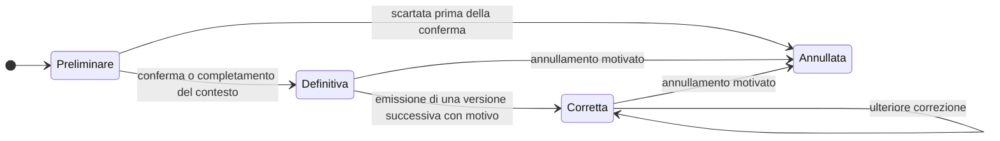

# Parametri e osservazioni

Una misura clinica non è un numero. È un numero **più il modo in cui è stato ottenuto**, e senza
la seconda parte la prima non è interpretabile. Una pressione di 150 su 95 misurata al braccio
sinistro con un dispositivo automatico dopo cinque minuti di riposo e la stessa coppia di valori
misurata subito dopo una rampa di scale, dal caregiver, con un apparecchio da polso mai tarato,
sono due dati diversi che il modello, se non presta attenzione, rappresenta in modo identico.

Il modulo [09 dei fondamenti](../10_fondamenti/09-fondamenti-clinici.md) spiega perché: unità
convertite male, medie aritmetiche su serie che non le ammettono, allarmi su valore isolato,
intervalli di riferimento applicati alla popolazione sbagliata, valore senza contesto di misura.
Questo capitolo ne ricava la struttura dati, e parte da una decisione:

> **`DM-50` [MOD] — La misura è immutabile e porta con sé il proprio contesto.** Non si
> aggiorna: si corregge emettendo una nuova versione che sostituisce la precedente, mantenendo
> entrambe. È lo stesso principio del documento firmato, per la stessa ragione: qualcuno ha già
> preso una decisione sulla base del valore precedente.

Il vincolo è già in base architetturale (`04_BASELINE_ARCHITETTURALE.md` § 2). Qui se ne ricava
la forma.

## 1. Il contesto obbligatorio

Nessuno degli attributi elencati è recuperabile a posteriori. È la ragione per cui vanno previsti
prima della prima riga di codice di ingestione, non aggiunti quando il clinico chiede perché un
valore è strano.

| Attributo | Obbligatorio | Contenuto | Se manca |
|---|---|---|---|
| **Valore** | sì | numerico, testuale codificato, ordinale, booleano, o intervallo | non c'è misura |
| **Grandezza codificata** | sì | il codice del parametro, non il suo nome | parametri diversi che condividono l'unità diventano indistinguibili |
| **Unità codificata** | sì per i valori numerici | codice di unità, non stringa libera | il valore non è confrontabile né convertibile |
| **Istante della rilevazione** | sì | con fuso orario e riferimento locale | la serie temporale è priva di senso |
| **Istante dell'inserimento** | sì | quando il dato è entrato nel sistema | non si distingue il ritardo dall'anomalia |
| **Istante della ricezione** | sì per i dati acquisiti | quando il sistema l'ha ricevuto | non si diagnostica un guasto della catena di ingestione |
| **Chi ha eseguito la misura** | sì | assistito, caregiver, professionista, dispositivo | cambia l'affidabilità e la responsabilità |
| **Chi l'ha inserita** | sì | può differire da chi ha misurato | non si ricostruisce la catena |
| **Metodo** | quando pertinente | come è stata ottenuta la grandezza | valori ottenuti con metodi diversi non sono confrontabili |
| **Sede o lato** | quando pertinente | dove è stata misurata | differenze fisiologiche fra sedi diventano anomalie apparenti |
| **Dispositivo dichiarato** | quando applicabile | identificazione e, se disponibile, identificativo univoco | non si può richiamare una serie in caso di problema del dispositivo |
| **Condizioni dichiarate** | quando pertinenti | riposo, posizione, digiuno, prima o dopo terapia | il valore è interpretabile solo entro le sue condizioni |
| **Indicatori di qualità riportati dal dispositivo** | quando disponibili | segnalazioni di errore, indici di attendibilità del rilevamento | si perde l'unico segnale automatico di misura non attendibile |
| **Stato** | sì | preliminare, definitiva, corretta, annullata | non si sa se il valore è utilizzabile |
| **Piano e versione del piano** | sì per le misure di piano | quale piano l'ha richiesta e in quale versione | la valutazione rispetto alle soglie non è ricostruibile |
| **Tenant** | sì | `V-04` | scrittura rifiutata |

> **`DM-51` [MOD] — Il contesto non è un campo note.** Ogni attributo della tabella è un
> elemento distinto con un proprio tipo. Un campo di testo libero «note sulla misurazione»
> soddisfa la lettera del requisito e non consente alcuna interrogazione, alcuna verifica,
> alcuna esclusione automatica dei dati non confrontabili.

Il modulo [09 dei fondamenti](../10_fondamenti/09-fondamenti-clinici.md) § 3.9 elenca gli stessi
attributi dal lato clinico e ne dà il razionale parametro per parametro; quest'area non lo
ripete.

## 2. Identità della misura

### 2.1 Che cosa rende una misura la stessa misura

Il problema si presenta al primo reinvio: un gateway di terze parti ritrasmette un lotto di
misure già inviate, perché la consegna è **almeno una volta**
(`04_BASELINE_ARCHITETTURALE.md` § 5). Senza una chiave, si registrano duplicati; con una chiave
sbagliata, si perdono misure legittime.

> **`DM-52` [MOD] — Chiave di deduplicazione esplicita, dichiarata dal produttore.** La misura
> porta un identificativo assegnato dalla sorgente, qualificato dal dominio di attribuzione
> della sorgente stessa. La deduplicazione avviene su quella coppia, **non** su una combinazione
> dedotta di soggetto, grandezza e istante: due misure legittime della stessa grandezza nello
> stesso istante sono possibili — due bracci, due dispositivi, un ritentativo dopo un errore
> d'uso — e una deduplicazione euristica le cancellerebbe.

Quando la sorgente non fornisce un identificativo — tipicamente l'inserimento manuale — è il
sistema ad assegnarlo, al primo contatto con il dato, e a restituirlo.

### 2.2 La correzione

Le regole:

1. **Nessuna versione viene sovrascritta.** La versione precedente resta, marcata come
   sostituita, con il riferimento alla successiva e il motivo.
2. **L'annullamento non è la cancellazione.** Una misura annullata resta visibile come annullata:
   il fatto che sia stata inserita ed è stata ritirata è informazione.
3. **La correzione rivaluta.** Se la misura era stata confrontata con una soglia, la correzione
   genera una nuova valutazione; l'esito precedente non si cancella, si dichiara superato.
4. **Chi corregge è registrato.** Una correzione anonima è una perdita di tracciabilità in un
   punto in cui la tracciabilità è precisamente ciò che serve.

## 3. Unità di misura

### 3.1 Il valore senza unità è rifiutato

> **`DM-53` [MOD]** — Una misura numerica priva di unità codificata **non entra nel sistema**. Il
> rifiuto avviene al confine, con un errore esplicito che indica l'unità attesa per la
> grandezza. Non esiste unità predefinita implicita, in nessun caso, per nessuna grandezza.

Sembra rigido e non lo è: l'unità predefinita implicita è il meccanismo con cui si producono gli
errori di conversione più gravi, perché funziona per anni finché non arriva una sorgente che usa
l'altra unità. Il modulo [09 dei fondamenti](../10_fondamenti/09-fondamenti-clinici.md) § 1.2 ne
dà l'esempio clinico.

### 3.2 Conversione

| Regola | Motivazione |
|---|---|
| **La conversione avviene al confine, non nel dominio** | Il dominio conserva l'unità in cui la misura è stata rilevata. Una conversione all'ingresso perde l'informazione originale |
| **La conversione è dichiarata sulla misura, non implicita** | Se un valore è stato convertito, la misura porta l'unità originale, il valore originale e il fattore usato |
| **Nessuna conversione fra grandezze diverse** | Grandezze diverse che condividono l'unità non sono convertibili l'una nell'altra: è per questo che il codice della grandezza è obbligatorio |
| **Le conversioni non lineari sono vietate nel dominio** | Se una conversione richiede una formula con parametri, non è una conversione: è un calcolo, e un calcolo ha implicazioni regolatorie |

L'ultima riga è più importante di quanto sembri. Alcune conversioni fra unità di uso clinico
richiedono un fattore che dipende dalla sostanza misurata. Un sistema che le esegua sta
compiendo un'operazione interpretativa, non una normalizzazione, e il vincolo `V2` di
separazione impone che l'operazione sia riconoscibile come tale.

### 3.3 La codifica delle unità

Il sistema di codifica delle unità di misura adottato è trattato nel
[capitolo 07](07-terminologie-nel-dominio.md), che ne dichiara anche il regime di licenza: è
ridistribuibile in forma verbatim ma **vieta i derivati ed è revocabile** (`B5` § 8.3), il che
comporta una collocazione in directory separata con licenza propria e, preferibilmente, l'uso
come dipendenza esterna.

## 4. Provenienza e affidabilità

### 4.1 Il perimetro: che cosa il progetto non fa

> **[BASE] `D21`** — Il perimetro è: **ingestione di misure da un gateway di terze parti**,
> **inserimento manuale da parte dell'assistito o del caregiver**, **questionari strutturati**.
> Il progetto **non dialoga direttamente con i dispositivi medici** e non si assume
> responsabilità sull'accuratezza della catena di misura hardware.

Sul piano del modello ne discende una conseguenza precisa e talvolta scomoda: **il dispositivo è
dichiarato, non accertato**. Il sistema registra ciò che la sorgente afferma sul dispositivo; non
lo verifica e non deve lasciar credere di verificarlo.

> **`DM-54` [MOD]** — Ogni misura porta un **livello di provenienza dichiarato**, da un insieme
> chiuso, che non è un giudizio di qualità ma la descrizione della catena:
>
> | Livello | Significato |
> |---|---|
> | `acquisita-da-gateway` | trasmessa da un sistema terzo che dichiara dispositivo e contesto |
> | `inserita-da-professionista` | inserita da un professionista sanitario |
> | `inserita-da-assistito` | inserita dall'interessato |
> | `inserita-da-caregiver` | inserita da chi assiste |
> | `derivata-da-questionario` | risposta strutturata a un questionario, non validata |
> | `riportata-da-documento` | trascritta da un documento esterno, con riferimento al documento |
>
> Il livello **non implica una gerarchia di attendibilità applicata automaticamente**: una misura
> inserita dall'assistito con un dispositivo tarato può essere più attendibile di una acquisita
> da un gateway mal configurato. Il livello è informazione per il clinico, non un peso che il
> sistema applica.

L'ultima frase è una scelta di perimetro. Applicare pesi di attendibilità sarebbe interpretazione
del dato, e sposterebbe il sistema oltre il confine di `V2`.

### 4.2 Il tesserino dispositivi

Il dispositivo assegnato all'assistito nel telemonitoraggio non è una riga anagrafica: è
oggetto di un **documento firmato** dal professionista che lo assegna, con identificativo
univoco, numero di serie o lotto, dati del fabbricante, tipo di collegamento e di alimentazione,
esito del controllo tecnico e parametri tecnici (DM 19 novembre 2025, All. 1, § 2.23; capitolo
[04](04-documenti-clinici.md) § 2.1).

> **`DM-55` [MOD]** — Il collegamento fra misura e dispositivo passa **per l'assegnazione**, non
> per un riferimento diretto e permanente. L'assegnazione ha un periodo: un dispositivo può
> essere ritirato, sanificato e riassegnato a un'altra persona. Un riferimento permanente
> misura → dispositivo, senza il periodo di assegnazione, produce l'attribuzione delle misure di
> un assistito a un altro nel momento in cui il dispositivo cambia mani.

## 5. I tre tempi

Una misura ha almeno tre istanti, e confonderli è l'errore più frequente in questa parte del
dominio.

| Istante | Che cosa dice | A che cosa serve |
|---|---|---|
| **Rilevazione** | quando il fatto è accaduto nel corpo della persona | è l'asse della serie clinica; è l'unico che il clinico legge |
| **Inserimento** | quando il dato è stato immesso da qualcuno | distingue la misura registrata subito da quella ricostruita a memoria |
| **Ricezione** | quando il sistema l'ha ricevuta | diagnostica il ritardo della catena; è l'asse dell'osservabilità tecnica |

Un esempio interamente sintetico: una misura rilevata alle 08:00 e ricevuta alle 14:30 non è una
misura delle 14:30. Se il sistema la colloca sull'asse della ricezione, la serie clinica mostra
un andamento che non è mai esistito. Se la colloca sull'asse della rilevazione senza registrare
la ricezione, nessuno si accorge che la catena di ingestione ha sei ore di ritardo.

### 5.1 Il fuso orario e il riferimento locale

> **`DM-56` [MOD]** — L'istante di rilevazione si conserva con il **riferimento locale della
> persona**, non solo come istante assoluto. Un ritmo circadiano si legge sull'ora locale
> dell'assistito: una misura «del mattino» resta del mattino anche se la persona ha viaggiato,
> e va rappresentata come tale.

Ne discende che il modello conserva l'istante assoluto **e** l'informazione di fuso applicabile
al luogo in cui la misura è avvenuta. Ridurre tutto a un istante assoluto è la scelta corretta
per un registro tecnico ed è sbagliata per una serie clinica.

### 5.2 Dati fuori ordine

La consegna almeno-una-volta e i gateway di terze parti producono regolarmente dati che arrivano
fuori ordine. Il modello lo assume come normale, non come anomalia:

1. **L'ordine di arrivo non è l'ordine clinico.** Nessuna logica di dominio può dipendere
   dall'ordine di ricezione (`04_BASELINE_ARCHITETTURALE.md` § 5).
2. **Un dato tardivo può riaprire una valutazione.** Una misura che arriva dopo che una finestra
   è stata dichiarata mancata **modifica** il fatto: lo stato passa da mancata a ricevuta, e
   l'evento di assenza precedentemente emesso va contraddetto esplicitamente, non dimenticato.
3. **Esiste una finestra di tolleranza oltre la quale il dato tardivo non riapre nulla**, e la
   sua ampiezza è configurazione. Il dato viene comunque registrato: semplicemente non rivaluta
   una finestra già chiusa.

## 6. Il dato mancante

È il punto in cui questo capitolo incontra il vincolo che l'orchestrazione ha reso trasversale.

> **[BASE] `V-09`** — L'assenza di dato è informazione clinica: il silenzio non è mai trattato
> come normalità.

### 6.1 L'attesa come entità

> **`DM-57` [MOD] — La finestra di rilevazione attesa è un'entità, non un calcolo.** Il piano
> genera, per ciascun periodo, un'**attesa**: grandezza, finestra temporale, tolleranza. L'attesa
> ha uno stato — pendente, soddisfatta, mancata, dichiarata non applicabile — e l'assenza di
> misura è la transizione a `mancata`, cioè **una riga che dichiara l'assenza**, non l'assenza di
> una riga.

La differenza è operativa. Con l'attesa materializzata si può:

- interrogare le assenze come si interrogano le misure;
- allegare a un'assenza la causa quando è nota;
- distinguere il paziente che non ha trasmesso dal paziente per cui non era prevista alcuna
  rilevazione in quel periodo;
- calcolare l'aderenza come rapporto fra attese soddisfatte e attese generate, che è una
  grandezza definita, invece che come proporzione fra misure ricevute e un denominatore
  ricostruito a posteriori.

Senza l'attesa materializzata, le stesse domande richiedono di ricostruire ogni volta che cosa il
piano prevedeva in quel momento — cioè richiedono di conoscere la versione del piano vigente
allora, che è esattamente ciò che si perde.

### 6.2 La tassonomia della causa

Il modulo [10 dei fondamenti](../10_fondamenti/10-percorsi-di-cura-e-sicurezza.md) § 8.3 ne dà
l'elenco clinico completo. Sul piano del modello ciò che conta è la struttura:

| Categoria di causa | Chi interviene | Distinguibile con mezzi tecnici |
|---|---|---|
| Guasto o esaurimento del dispositivo | centro servizi | sì, se il dispositivo riporta il proprio stato |
| Perdita di connettività | centro servizi | sì, con segnale di presenza periodico |
| Guasto della catena di ingestione | gestore della piattaforma | sì, **ed è obbligatorio**: riguarda tutti gli assistiti insieme |
| Errore d'uso | centro servizi e team clinico | in parte, se si registrano i tentativi falliti |
| Assenza o impedimento dichiarati | team clinico | solo se dichiarati |
| Abbandono | team clinico | per esclusione |
| **Peggioramento clinico** | team clinico, con urgenza | **no**: è la categoria residua |

> **`DM-58` [MOD] — La strategia di modellazione discende dall'ultima riga.** L'ultima categoria
> non è distinguibile con mezzi tecnici; quindi il modello deve rendere **esplicite e
> registrabili tutte le altre**, perché più cause tecniche e dichiarate il sistema sa
> riconoscere, più il silenzio residuo è informativo. Ogni causa che il sistema non sa
> riconoscere diluisce il segnale clinico.

Ne discendono quattro elementi di modello che vanno previsti dall'inizio:

1. **Segnale di presenza periodico** indipendente dalla misura, con proprio stato e propria
   serie. Distingue in un colpo solo la categoria tecnica dalle altre.
2. **Telemetria di stato del dispositivo** — livello di alimentazione, stato del collegamento,
   esito dell'autodiagnostica, data dell'ultima taratura — come **dato tecnico con finalità e
   conservazione proprie**, distinte da quelle del dato clinico. È una classe di dato a sé nella
   tassonomia di conservazione richiesta al capitolo [04](04-documenti-clinici.md) § 9.
3. **Registrazione dei tentativi falliti.** Una misura iniziata e non completata è informazione:
   distingue l'errore d'uso dall'assenza della persona. Viene quasi sempre buttata via.
4. **Dichiarazione di indisponibilità da parte dell'assistito**, come funzione di prima classe
   dell'interfaccia. Sposta il caso dalla categoria residua a una categoria dichiarata.

### 6.3 La sorveglianza del volume atteso

Il guasto della catena di ingestione è l'unico caso in cui l'assenza riguarda **tutti** insieme, e
per questo è l'unico che il sistema può e deve rilevare da solo.

> **`DM-59` [MOD]** — Esiste una sorveglianza del **volume complessivo atteso** per sorgente e
> per tenant, distinta dalla sorveglianza per singolo assistito. Un crollo del volume aggregato
> è un evento tecnico che precede di ore o giorni la comparsa di assenze individuali, e va
> trattato come incidente della piattaforma, non come somma di casi clinici. È la voce
> «sorveglianza del volume atteso» della questione `Q-12` in bacheca.

La sorveglianza aggregata non ha problemi di riservatezza — conta eventi, non li legge — ma va
progettata perché il conteggio non diventi un canale di inferenza: il capitolo
[06](06-consenso-e-riservatezza.md) tratta la soglia minima di cardinalità.

## 7. Serie temporali

### 7.1 Dove vivono

> **[BASE]** Le serie temporali dei parametri sono conservate in strutture dedicate a serie
> temporali; **la rappresentazione conforme allo standard è una proiezione, non lo strumento di
> archiviazione** (`04_BASELINE_ARCHITETTURALE.md` § 3).

Sul piano del dominio la conseguenza è che l'aggregato «misura» è definito dal dominio e
proiettato verso lo standard, non definito dallo standard. La differenza si vede su tre punti:
la deduplicazione, lo stato della misura e il legame con l'attesa, che nel modello canonico
esterno non hanno una rappresentazione naturale.

### 7.2 Le aggregazioni sono dichiarate, mai implicite

Il modulo [09 dei fondamenti](../10_fondamenti/09-fondamenti-clinici.md) § 4.3 spiega perché una
media aritmetica su una serie clinica può essere priva di senso. Sul piano del modello:

> **`DM-60` [MOD] — Un valore aggregato è un'entità distinta dalla misura, con la propria
> provenienza.** Porta: la funzione applicata, la finestra, il numero di misure incluse, il
> numero di attese non soddisfatte nella finestra, e il criterio di esclusione applicato. Un
> aggregato senza il numero di assenze nella finestra è ingannevole, perché una media su due
> misure invece che su quattordici ha lo stesso aspetto e un significato diverso.

Regola complementare: **un aggregato non è mai il dato su cui si valuta una soglia clinica**, a
meno che il piano non lo preveda espressamente e la regola non sia dichiarata nel piano. La
valutazione predefinita avviene sulla misura.

### 7.3 La densità non è uniforme

Le serie di questo dominio sono irregolari per costruzione: cadenze diverse per parametro,
periodi di sospensione, dati fuori ordine, correzioni. Un modello che assuma campionamento
regolare produce interpolazioni che non corrispondono a nulla.

> **`DM-61` [MOD]** — Nessuna interpolazione, nessun riempimento di buchi, nessuna
> «regolarizzazione» della serie avviene nel dominio. Se una rappresentazione grafica ne ha
> bisogno, la trasformazione avviene nella presentazione ed è dichiarata all'utente. Un buco
> riempito è un dato inventato, e un dato inventato in una serie clinica è esattamente ciò che
> il vincolo sulla generazione di contenuto clinico esclude.

## 8. La valutazione rispetto alle soglie

### 8.1 Il vincolo

> **[BASE] `V-02`** — Nessuna soglia clinica è cablata: le soglie sono **configurazione per
> assistito**, decise dal professionista.

Il modulo [10 dei fondamenti](../10_fondamenti/10-percorsi-di-cura-e-sicurezza.md) § 7.9 e § 7.10
spiega perché un valore predefinito «ragionevole» può essere clinicamente sbagliato per la
persona a cui si applica. Il modello ne ricava tre elementi.

### 8.2 La regola di soglia come entità versionata

> **`DM-62` [MOD]** — La regola di soglia è un'entità con: assistito, grandezza, condizione,
> valori, periodo di validità, **autore** (il professionista che l'ha stabilita), motivazione
> facoltativa, versione. Non è un campo del piano né una colonna dell'anagrafica.

Il tracciato ministeriale del piano di telemonitoraggio conferma la necessità: prevede
espressamente i campi **soglia di allarme** e **regole** — «testo descrittivo delle regole di
comportamento in violazione delle soglie» (DM 19 novembre 2025, All. 1, § 2.24).

Va notato che il tracciato prevede le regole in **forma testuale descrittiva**. Il modello
mantiene quindi due rappresentazioni: quella **eseguibile**, strutturata, su cui il sistema
valuta; e quella **descrittiva**, che è ciò che confluisce nel documento. Devono essere
generate dalla stessa fonte, altrimenti divergono, ed è la divergenza fra ciò che il piano dice
e ciò che il sistema fa.

### 8.3 La tracciabilità del calcolo

> **[BASE] `D26`** — La valutazione automatica delle soglie è l'elemento che costituisce
> *interpretazione* e fonda la qualificazione come dispositivo medico.

> **`DM-63` [MOD] — Ogni valutazione produce un fatto tracciabile.** Contiene: identificativo
> della misura valutata, versione del piano vigente, versione della regola applicata, valori in
> ingresso, esito, istante della valutazione, versione del componente di valutazione. Senza
> questi elementi non è possibile rispondere, a distanza di mesi, alla domanda «perché questo
> allarme è scattato» né alla domanda opposta, che è quella che conta davvero: «perché non è
> scattato».

È la voce «tracciabilità del calcolo» della questione `Q-12` in bacheca.

### 8.4 Che cosa il sistema non fa

Tre esclusioni che delimitano il perimetro, coerenti con la questione `Q-01` in bacheca:

1. **Non deduce soglie** dalla popolazione, dallo storico dell'assistito o da altri assistiti.
2. **Non formula giudizi** negli avvisi: l'avviso dichiara che un valore è fuori dalla soglia
   configurata, non che la persona sta peggiorando.
3. **Non calcola prognosi, punteggi di rischio o interazioni fra terapie.**

## 9. Questionari e punteggi

### 9.1 La risposta non è un'osservazione clinica

Una risposta a questionario auto-compilato è `QuestionnaireResponse`, non anamnesi: **non ha
valore clinico finché il professionista non la valida** (`R6` § 1.2). Il modello mantiene quindi
tre oggetti distinti: il questionario (definizione), la risposta (fatto), l'eventuale
osservazione derivata (atto del professionista).

### 9.2 Il punteggio è calcolo, e il calcolo ha conseguenze

Il modulo [10 dei fondamenti](../10_fondamenti/10-percorsi-di-cura-e-sicurezza.md) § 5.7 lo
enuncia senza attenuazioni: calcolare un punteggio è ciò che rende un software un dispositivo
medico. Ne discende una decisione di perimetro che quest'area prende esplicitamente:

> **`DM-64` [MOD] — Il motore di calcolo dei punteggi è un componente identificabile,
> disattivabile e versionato**, non una funzione sparsa. Ogni punteggio calcolato porta:
> identificativo della scala, versione della scala, versione dell'algoritmo, risposte in
> ingresso, esito, e la dichiarazione della fonte della scala. La disattivabilità non è una
> comodità: è ciò che consente di distribuire il sistema in configurazioni con perimetro
> regolatorio diverso.

### 9.3 Le scale hanno licenze proprie

> **Questione `Q-11` in bacheca, indirizzata alle aree `COMP` e `ARCH`, con concorso di questa
> area.** Le scale e i questionari clinici validati **hanno licenze proprie**: la policy
> terminologica va estesa formalmente a scale e punteggi **prima** di scrivere il primo motore
> di calcolo.

Il contributo di quest'area alla questione è un vincolo di modellazione che vale qualunque sia
la risposta:

> **`DM-65` [MOD] — La definizione della scala e il motore di calcolo sono separati, e la
> definizione è un artefatto con regime di licenza dichiarato.** Concretamente:
>
> 1. Il **motore** è del progetto e non contiene alcun contenuto di scale: esegue definizioni.
> 2. La **definizione** — testo degli item, valori, regole di punteggio, soglie di
>    interpretazione — è un artefatto con titolare e licenza propri, collocato secondo il regime
>    che la sua licenza consente. I quattro regimi di `B5` § 11.1 si applicano identicamente:
>    coesistenza piena, directory separata con licenza propria, acquisizione a cura del
>    deployer, esclusione totale.
> 3. Nessuna definizione di scala di terzi è inclusa nel repository finché il suo regime non è
>    stato accertato **artefatto per artefatto**. È il principio di `D34`: una dichiarazione di
>    licenza apposta su un contenitore non dispone dei diritti di terzi sul contenuto
>    ricompreso.
> 4. Il sistema è **pienamente funzionale senza alcuna scala di terzi**: i questionari propri
>    del tenant, senza punteggio o con punteggio definito dal tenant, sono un percorso completo.
>
> **[NV]** Le licenze delle singole scale non sono state verificate in quest'area. La verifica
> spetta a `COMP`. Fino ad allora nessuna scala di terzi è nominata in questa documentazione,
> e nessun valore soglia di alcuna scala compare in alcun capitolo.

### 9.4 Il questionario come parte del piano

Il questionario strutturato è nel perimetro `D21` insieme all'ingestione e all'inserimento
manuale. Ne discende che l'**attesa** di § 6.1 non riguarda solo le misure: un questionario
previsto dal piano e non compilato è un'attesa non soddisfatta, con la stessa struttura e la
stessa tassonomia di cause. Modellarli separatamente raddoppia il codice dell'aderenza.

## 10. Il contratto di ingestione

Il perimetro `D21` colloca il confine su un gateway di terze parti. Il confine ha bisogno di un
contratto esplicito, altrimenti la responsabilità sulla qualità del dato resta indeterminata
proprio nel punto in cui deve essere chiara.

### 10.1 Che cosa il dominio pretende dalla sorgente

| Elemento | Obbligatorio | Se assente |
|---|---|---|
| Identificativo della misura assegnato dalla sorgente | sì | il sistema ne assegna uno e lo restituisce; la deduplicazione non è garantita fra reinvii |
| Dominio di attribuzione della sorgente | sì | il messaggio è rifiutato: senza dominio l'identificativo è una stringa |
| Riferimento all'assistito, per identificatore esterno qualificato | sì | rifiutato |
| Grandezza codificata | sì | rifiutato |
| Valore e unità codificata | sì per i numerici | rifiutato |
| Istante di rilevazione con riferimento locale | sì | rifiutato |
| Dichiarazione del dispositivo | quando applicabile | accettato, con livello di provenienza che lo dichiara |
| Contesto e condizioni | quando pertinenti | accettato, con il contesto dichiarato incompleto |

> **`DM-66` [MOD] — Il rifiuto è esplicito, motivato e recuperabile.** Un messaggio rifiutato non
> scompare: entra in una coda di riesame con il motivo del rifiuto, ed è ripresentabile dopo la
> correzione senza duplicare ciò che era già stato accettato. Un rifiuto silenzioso su una catena
> di misure cliniche è indistinguibile da un guasto, e il tempo che passa fra il rifiuto e la sua
> scoperta è tempo in cui il servizio crede di monitorare e non monitora.

### 10.2 Che cosa il dominio non pretende

Tre cose che sarebbe comodo pretendere e che il perimetro esclude:

1. **La taratura del dispositivo.** Il progetto non la verifica e non la certifica: registra ciò
   che la sorgente dichiara, incluso il dato di taratura quando è fornito nel tesserino
   dispositivi.
2. **La completezza del lotto.** Il sistema non assume che una trasmissione contenga tutte le
   misure di un periodo: l'assenza si rileva dalle attese, non dal confronto fra lotti.
3. **L'ordine.** Nessuna logica dipende dall'ordine di arrivo (§ 5.2).

### 10.3 Il ripiego quando la catena si rompe

La rottura della catena di ingestione è l'unico guasto che riguarda tutti gli assistiti insieme
(§ 6.3), e ha un comportamento dichiarato che va modellato prima che accada:

| Fase | Comportamento |
|---|---|
| Rilevazione del crollo di volume | evento tecnico verso il gestore della piattaforma, non verso il team clinico |
| Durante l'interruzione | le attese continuano a essere generate e a scadere, ma la causa è nota e va attribuita |
| Alla ripresa | le misure arretrate arrivano fuori ordine; le attese già dichiarate mancate si riaprono entro la finestra di tolleranza |
| Dopo la ripresa | il servizio dispone dell'elenco degli assistiti e dei periodi interessati, perché il clinico deve poter sapere su quali persone il monitoraggio è stato cieco |

L'ultima riga è la sola che riguarda la sicurezza del paziente, ed è quella che i sistemi di
osservabilità tecnica non producono: sapere che la catena era ferma è un fatto tecnico, sapere
**su chi** era ferma è un fatto clinico.

## 11. La riservatezza delle misure

Due regole che ricadono su questo capitolo e che vanno enunciate qui perché riguardano la forma
del dato, non solo l'accesso.

1. **I campioni di qualità tecnica non contengono identificatori diretti dell'assistito**
   (`RF-165`). La telemetria di sessione deve essere utile senza essere identificante: è
   minimizzazione applicata al dato tecnico.
2. **I registri applicativi non contengono contenuto clinico né identificatori diretti**
   (`BR-086`). Una misura non compare mai in un registro di diagnostica, neppure per il tempo
   di un'indagine su un difetto.

La seconda regola ha una conseguenza pratica che va prevista: **la diagnosi dei problemi di
ingestione deve essere possibile senza vedere i valori**. Si ottiene registrando la struttura e
non il contenuto — quante misure, di quale grandezza, con quale esito di validazione, da quale
sorgente — e prevedendo un percorso autorizzato e tracciato per l'ispezione del contenuto quando
è indispensabile.

## Cosa devi ricordare

1. **La misura è immutabile e porta con sé il contesto.** Quindici attributi, nessuno dei quali
   recuperabile a posteriori.
2. **Il contesto non è un campo note**: ogni attributo è un elemento con un proprio tipo.
3. **La deduplicazione è su una chiave dichiarata dalla sorgente**, mai su una combinazione
   dedotta di soggetto, grandezza e istante.
4. **Il valore senza unità codificata non entra nel sistema**, e non esiste unità predefinita
   implicita.
5. **Il dispositivo è dichiarato, non accertato**, e il collegamento con la misura passa per
   l'assegnazione, che ha un periodo.
6. **Tre istanti, non uno**: rilevazione, inserimento, ricezione. L'istante di rilevazione porta
   il riferimento locale della persona.
7. **L'attesa è un'entità.** L'assenza di misura è una riga che dichiara l'assenza, non
   l'assenza di una riga.
8. **La strategia sul silenzio è eliminare tutte le cause riconoscibili**, perché la causa che
   conta — il peggioramento clinico — non è distinguibile con mezzi tecnici.
9. **Esiste una sorveglianza del volume aggregato**, distinta da quella per assistito, perché il
   guasto della catena riguarda tutti insieme.
10. **Un aggregato è un'entità distinta** che porta il numero di assenze nella finestra;
    nessuna interpolazione avviene nel dominio.
11. **La soglia è per assistito, versionata, con autore.** Ogni valutazione produce un fatto
    tracciabile con versione del piano, della regola e del componente.
12. **Il motore dei punteggi è separato dalle definizioni delle scale**, e nessuna definizione di
    terzi entra finché il suo regime di licenza non è accertato.

## Dove continuare

- [08 — Percorsi e piani di cura](08-percorsi-e-piani-di-cura.md): il piano che genera le attese
  e l'aderenza che ne discende.
- [07 — Le terminologie nel dominio](07-terminologie-nel-dominio.md): la codifica delle grandezze
  e delle unità.
- Modulo [09 dei fondamenti](../10_fondamenti/09-fondamenti-clinici.md): i parametri vitali uno
  per uno, il tempo nel dato clinico, il ragionamento clinico.
