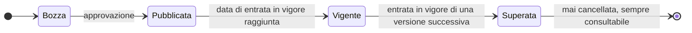
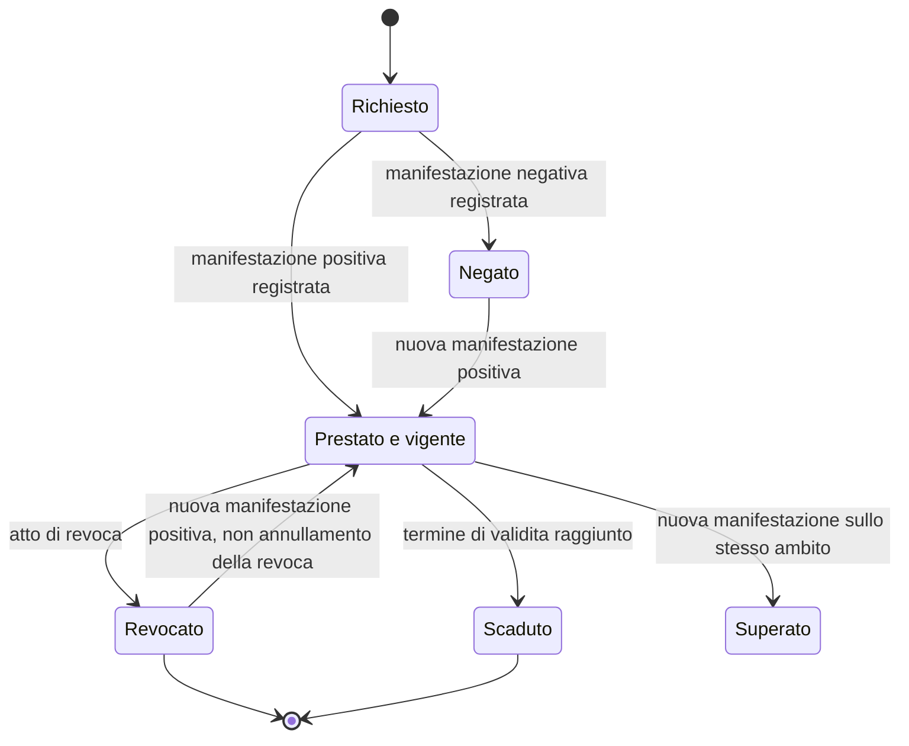
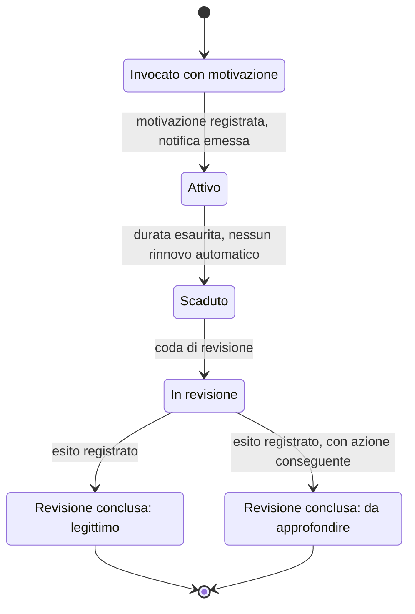
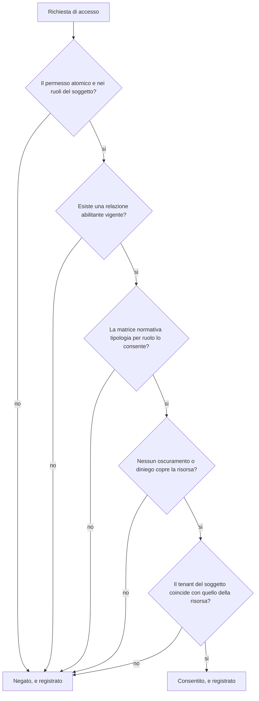

# Consenso e riservatezza

Il consenso è il punto in cui il modello dati incontra una domanda che non ammette
approssimazioni: **che cosa ha dichiarato questa persona, in che data, dopo aver letto quale
testo, e chi lo può dimostrare.**

Un booleano non risponde a nessuna delle quattro parti della domanda. Lo si scopre nel momento
peggiore, quando la domanda arriva da chi ha titolo per porla.

> **[BASE]** Il consenso è un **fatto con validità temporale**, non un flag booleano
> ([`04_BASELINE_ARCHITETTURALE.md`](https://github.com/fedcal/Telemedic/blob/main/.telemedic/context/04_BASELINE_ARCHITETTURALE.md) § 2).

Il modulo [03 dei fondamenti](../10_fondamenti/03-il-dato-clinico.md) § 2 spiega perché, per la
finalità di cura, il consenso non è tipicamente la base giuridica del trattamento, e perché
confondere il consenso all'atto sanitario con il consenso al trattamento dei dati è la
confusione più costosa del dominio. Questo capitolo ne ricava il modello.

## 1. Cinque oggetti, non uno

> **[NORM]** Consenso all'atto sanitario, consenso al trattamento dei dati ove applicabile,
> consenso alla registrazione e consenso alla presenza di terzi sono oggetti distinti, raccolti
> separatamente, revocabili separatamente e conservati separatamente (`BR-060`). A questi
> `RF-110` aggiunge il consenso alla trasmissione verso sistemi esterni.

| Oggetto | Che cosa autorizza | Effetto della revoca | Natura |
|---|---|---|---|
| **Consenso all'atto sanitario** | l'esecuzione dell'atto | l'atto non si esegue o si interrompe | manifestazione di volontà relativa alla cura |
| **Consenso al trattamento dei dati** (ove il consenso sia la base giuridica) | uno specifico trattamento | cessa quel trattamento per il futuro | atto in materia di protezione dei dati |
| **Consenso alla registrazione** | la cattura audio-video della sessione | la registrazione si interrompe immediatamente | specifico per sessione, non ereditabile |
| **Consenso alla presenza di terzi** | l'ammissione di interprete, discente, caregiver | il terzo esce | specifico per sessione o per soggetto |
| **Consenso alla trasmissione a sistemi esterni** | il conferimento verso repository esterni | la trasmissione non avviene | distinto per destinatario |

> **`DM-70` [MOD]** - I cinque oggetti hanno la **stessa struttura** e **cicli di vita
> indipendenti**. La revoca di uno non tocca gli altri: chi revoca il consenso alla
> registrazione non revoca il consenso all'atto, e l'erogazione della prestazione non è
> impedita (`RF-110`). Un modello che li rappresenti come colonne della stessa riga rende
> tecnicamente difficile ciò che giuridicamente è ovvio.

### 1.1 Il consenso nel fascicolo sanitario è un caso a parte

> **[NORM]** DM 7 settembre 2023, art. 8: la **consultazione** da parte di terzi è subordinata a
> consenso libero, specifico, informato, inequivocabile ed esplicito, distinto per finalità di
> cura, prevenzione e profilassi internazionale. Le finalità di **governo** e di **ricerca**
> operano su dati pseudonimizzati e non richiedono quel consenso. «I dati e i documenti presenti
> nel FSE **sono sempre consultabili, oltre che dall'assistito, dai soggetti che li hanno
> prodotti**» (art. 8, c. 7).

Ne discende una distinzione che il modello deve rappresentare e che viene regolarmente persa:
**alimentare e consultare sono due cose diverse**. Si può alimentare il fascicolo senza poter
consultare il pregresso. Un unico consenso «al fascicolo» non è rappresentabile: non esiste.

E una regola che va scritta perché è controintuitiva: **chi ha prodotto il documento lo vede
sempre**, indipendentemente dal consenso alla consultazione. Il consenso governa l'accesso dei
terzi, non quello dell'autore.

### 1.2 Chi non accede mai

> **[BASE] [`V-08`](../11_registri/01-vincoli-in-vigore.md#v-08), `D48`** - L'art. 15, c. 4 del DM 7 settembre 2023 esclude **sempre** dal
> fascicolo periti, compagnie di assicurazione, datori di lavoro, associazioni e organizzazioni
> scientifiche, organismi amministrativi anche operanti in ambito sanitario, e il personale
> medico nell'esercizio di attività medico-legale.

Sul piano del modello ne discende un vincolo strutturale, non una regola di configurazione:
**non esiste alcun tipo di soggetto, alcuna delega e alcun consenso che possa produrre l'accesso
di un assicuratore ai documenti**, né direttamente né per il tramite di un professionista. Il
pagatore non è un consultatore. È un caso in cui il modello deve rendere l'operazione
**impossibile**, non semplicemente non offerta.

## 2. La struttura del fatto

> **`DM-71` [MOD] - Forma canonica dell'evidenza di consenso.**
>
> | Componente | Obbligatorio | Contenuto |
> |---|---|---|
> | **Tipo** | sì | da un insieme chiuso; i tipi obbligatori non sono rimovibili dai modelli di tenant (`RF-121`) |
> | **Interessato** | sì | il soggetto a cui il consenso si riferisce |
> | **Dichiarante** | sì | chi ha manifestato la volontà; può differire dall'interessato |
> | **Titolo di rappresentanza** | se dichiarante ≠ interessato | tipo, estremi del provvedimento, ambito dei poteri, validità |
> | **Versione del testo presentato** | sì | riferimento immutabile alla versione dell'informativa o del modulo |
> | **Istante** | sì | |
> | **Canale** | sì | in sessione, area autenticata, sportello, altro |
> | **Esito** | sì | prestato, negato |
> | **Ambito** | dipende dal tipo | a che cosa si riferisce: questa sessione, questo destinatario, questa categoria di documenti |
> | **Validità** | sì | inizio e, quando prevista, fine |
> | **Stato** | sì | vigente, revocato, scaduto, superato da nuova manifestazione |
> | **Chi ha registrato** | sì | l'atto di registrazione ha un autore, anche quando è il sistema |
> | **Tenant** | sì | [`V-04`](../11_registri/01-vincoli-in-vigore.md#v-04) |

Due componenti meritano una nota, perché sono quelli che vengono omessi.

**Il dichiarante distinto dall'interessato.** Serve nel caso della rappresentanza, e serve
sempre: anche quando coincidono, il modello che li tiene distinti non deve essere modificato il
giorno in cui non coincidono più. Il capitolo
[03](03-assistito-professionista-organizzazione.md) § 6 tratta le figure.

**La versione del testo presentato.** È l'elemento senza il quale il consenso è indimostrabile:
un consenso non riferito a un testo versionato non prova nulla, perché non si può stabilire che
cosa la persona abbia letto (`BR-061`).

## 3. L'informativa versionata

Le regole:

1. **Ogni testo informativo o di consenso è versionato**, con data di entrata in vigore, e le
   versioni precedenti si conservano integralmente (`RF-111`).
2. **Un consenso raccolto su una versione resta associato a quella versione**, che rimane
   consultabile. La pubblicazione di una versione successiva non riqualifica i consensi già
   raccolti.
3. **La versione superata non si cancella mai.** È l'unica prova di che cosa la persona abbia
   letto.
4. **Il tenant definisce i propri modelli di consenso** per tipo di prestazione, entro i tipi
   previsti dal dominio, **senza poter eliminare gli obbligatori** (`RF-121`).

### 3.1 La raccolta

Tre requisiti di forma che sono requisiti di modello, non di interfaccia:

- **Nessuna opzione preselezionata** (`RF-113`). Il modello non ha valori predefiniti per il
  campo dell'esito: l'assenza di manifestazione non è un consenso.
- **La manifestazione è esplicita e registrata come atto**, non dedotta dalla prosecuzione
  dell'uso.
- **La verifica dei consensi obbligatori precede l'atto** (`RF-114`): l'assenza è segnalata al
  professionista prima dell'avvio, con la possibilità di raccolta immediata.

E un ordine che ha una ragione, enunciato in `R6` § 3.1.3: **la verifica tecnica precede
l'informativa, che precede il consenso**. Chiedere il consenso a chi poi scopre di non poter
partecipare produce un trattamento di dati inutile.

## 4. Il ciclo di vita del consenso

Una transizione che **non** esiste, e la sua ragione:

> **`DM-72` [MOD]** - Non esiste la transizione «annullamento della revoca». Una revoca è un
> atto compiuto: se ne può prestare uno nuovo, non si può cancellare quello precedente. La
> differenza si vede nella cronologia - che deve mostrare revoca, poi nuovo consenso - e non è
> pignoleria: la cronologia è ciò che l'interessato ha diritto di consultare (`RF-116`).

### 4.1 La revoca

> **[NORM]** La revoca ha effetto immediato sui trattamenti futuri, non richiede motivazione, e
> gli effetti sui dati già raccolti seguono le regole di conservazione e non l'arbitrio
> dell'operatore (`BR-069`).

Tre proprietà da rendere operative nel modello:

| Proprietà | Che cosa significa nel modello |
|---|---|
| **Immediata** | la verifica avviene alla decisione, non a un processo periodico. Una registrazione in corso si interrompe (`RF-142`) |
| **Senza motivazione** | il campo motivazione esiste ed è facoltativo; il sistema non lo richiede né lo condiziona |
| **Non retroattiva sui dati già raccolti** | il modello distingue «cessa il trattamento» da «si cancella il dato». La seconda operazione ha regole proprie ed è spesso vietata |

Il frammento già acquisito prima della revoca - tipicamente un pezzo di registrazione - segue la
regola configurata di cancellazione o conservazione, e l'evento è registrato con l'istante
esatto.

> **[NV]** L'ammissibilità e i limiti della registrazione della sessione e il trattamento del
> frammento acquisito prima della revoca sono fra le questioni che `R6` § 11.2 rimette alla
> verifica (voce Q15). **Da chiedere all'area `COMP`.** Il modello ammette entrambe le
> configurazioni perché la risposta non è nota.

## 5. Il consenso per conto di terzi

Il capitolo [03](03-assistito-professionista-organizzazione.md) § 6 tratta le figure e i loro
poteri. Qui interessano tre regole che ricadono sul modello del consenso.

1. **Un caregiver non può prestare consenso in sostituzione di un assistito capace, in nessuna
   configurazione** (`BR-062`). Non è una regola disattivabile: è un vincolo di dominio.
2. **Il consenso prestato da un rappresentante registra il titolo, l'ambito dei poteri,
   l'estremo del provvedimento e la validità temporale**, e il sistema verifica l'ambito
   rispetto all'atto richiesto (`BR-063`, `RF-117`). La verifica è **per atto**, non
   all'ingresso.
3. **La transizione alla maggiore età sospende gli accessi dei rappresentanti** e richiede una
   nuova configurazione delle deleghe (`RF-118`).

Il caso limite che va previsto: **l'affido condiviso**. Possono servire due manifestazioni di
volontà (`BR-063`). Il modello ammette quindi che **un consenso abbia più dichiaranti**, con la
regola di composizione dichiarata nel modello di consenso - tutti, uno qualsiasi, uno specifico
- e non cablata.

> **[NV]** La disciplina della rappresentanza legale e del consenso per minori e soggetti
> incapaci è fra le questioni rimesse alla verifica (`R6` § 11.1, voce Q9). Da chiedere all'area
> `COMP`.

## 6. Oscuramento

### 6.1 La regola che rende l'implementazione difficile

> **[NORM]** L'oscuramento avviene «con modalità tali da garantire che tutti i soggetti abilitati
> all'accesso **non possano venire automaticamente a conoscenza del fatto che l'assistito ha
> effettuato tale scelta**» (DM 7 settembre 2023, art. 9, c. 6). L'oscuramento della prescrizione
> determina l'oscuramento automatico dei documenti di erogazione e dei referti correlati (c. 7).
> Deve essere «garantito l'immediato oscuramento» tramite funzionalità disponibile in linea.

Non basta escludere il documento dall'elenco. Un oscuramento **inferibile** non è un
oscuramento, e l'inferenza passa da almeno sei canali che vanno chiusi tutti.

| Canale di inferenza | Come si chiude |
|---|---|
| **Numerazione progressiva visibile** | i documenti non hanno numerazione progressiva esposta |
| **Conteggi e totali** | i totali si calcolano sull'insieme filtrato, mai sull'insieme completo |
| **Paginazione** | la dimensione delle pagine si applica dopo il filtro; una pagina «corta» rivela un'esclusione |
| **Notifiche** | nessuna notifica riferita a un documento oscurato verso il destinatario da cui è oscurato |
| **Differenze fra interrogazioni successive** | i risultati aggregati non devono consentire di dedurre per differenza |
| **Messaggi di errore** | l'accesso a un documento oscurato produce lo stesso esito dell'accesso a un documento inesistente |

> **`DM-73` [MOD] - L'oscuramento è applicato dal motore di autorizzazione, non dai
> consumatori.** Ogni interrogazione che restituisca documenti passa da un unico punto che
> applica il filtro e calcola i totali sull'insieme filtrato. Se il filtro è responsabilità di
> chi scrive l'interrogazione, prima o poi un'interrogazione lo dimentica - e il difetto non è
> visibile in prova, perché il documento oscurato non compare comunque nei dati sintetici di
> collaudo.

L'ultima frase è una conseguenza operativa importante: **i dati sintetici di collaudo devono
comprendere documenti oscurati**, altrimenti nessuna prova esercita il percorso.

### 6.2 La propagazione

L'oscuramento della prescrizione determina l'oscuramento automatico dei documenti correlati. Nel
modello significa che **esiste una relazione di correlazione fra documenti** che l'oscuramento
percorre, e che la percorrenza è deterministica e verificabile. Una relazione dedotta a runtime
da criteri di somiglianza produrrebbe oscuramenti incompleti.

### 6.3 Oscuramento e cancellazione

Non sono la stessa cosa e non hanno lo stesso effetto: il documento oscurato **resta visibile a
chi lo ha prodotto** e all'assistito. La cancellazione incontra i limiti degli obblighi di
conservazione della documentazione sanitaria (`BR-081`).

> **[NV]** I periodi minimi e massimi di conservazione per categoria di documento sanitario e la
> disciplina dell'oscuramento nei suoi risvolti operativi sono fra le questioni rimesse alla
> verifica (`R6` § 11.1, voci Q5 e Q6). Da chiedere all'area `COMP`.

## 7. Le categorie a tutela rafforzata

Il capitolo [04](04-documenti-clinici.md) § 8.2 ne dà l'elenco normativo. Sul piano del modello
del consenso ricadono tre conseguenze.

1. **Il consenso per queste categorie è reso al soggetto erogante**, non alla piattaforma, ed è
   esplicito, informato e specifico. Il modello lo rappresenta come consenso con ambito ristretto
   a una categoria, non come consenso generale.
2. **All'atto dell'alimentazione va dichiarato se il dato vi rientra** (art. 12, c. 4). La
   dichiarazione è un atto del professionista che eroga, e la responsabilità del mancato
   oscuramento è dell'erogatore: il modello deve rendere difficile omettere la dichiarazione,
   non limitarsi a offrirla.
3. **Per le prestazioni in anonimato l'alimentazione non è ammessa.** Ne discende lo stato «non
   conferibile» del documento, distinto da «non ancora conferito» (capitolo
   [04](04-documenti-clinici.md) § 8.2).

> Le categorie di dati sanitari a tutela rafforzata e le loro conseguenze operative sono
> fra le questioni rimesse alla verifica da `DOM` `[NV]` (`R6` § 11.1, voce Q10).

## 8. Il consenso alla registrazione

È il consenso con il regime più stretto, e la ragione è che la registrazione è il dato più
sensibile che il sistema produce.

| Regola | Fonte |
|---|---|
| Disabilitata per impostazione predefinita a **ogni** livello: installazione, tenant, prestazione, sessione; abilitazione esplicita a ciascun livello | `BR-070`, `RF-139` |
| Consenso **specifico per sessione**, raccolto prima dell'avvio, non ereditabile da un consenso generale alla piattaforma | `BR-071` |
| Revoca che interrompe immediatamente la registrazione in corso | `RF-142` |
| Indicatore permanente e non occultabile per tutti i partecipanti, con annuncio accessibile | `BR-072`, `RF-141` |
| Prestazioni marcate non registrabili: la funzione è **assente**, e ogni chiamata applicativa è rifiutata | `BR-075`, `RF-146` |
| Nessuna registrazione automatica in caso di emergenza, contenzioso o sospetto | `BR-076` |

L'ultima riga è una decisione di dominio deliberata: impedisce che la registrazione diventi uno
strumento difensivo unilaterale, attivato quando qualcosa va storto.

### 8.1 La conseguenza di `D23` sul consenso

> **[BASE] `D23`** - La registrazione avviene lato server, e ne discende un fatto inderogabile:
> **quando la registrazione è attiva la cifratura viene terminata sul server e la sessione non è
> più cifrata fino agli estremi.**

> **`DM-74` [MOD]** - L'informativa di consenso alla registrazione **deve dichiarare
> esplicitamente** questa conseguenza. Non è una nota tecnica: è un elemento del contenuto
> informativo su cui la persona si esprime, e quindi è parte del testo versionato a cui il
> consenso si riferisce. Un consenso raccolto su un testo che non lo dichiara è un consenso su
> un oggetto diverso da quello che si sta facendo.

Il passaggio fra le due modalità è tracciato, e nel modello è un **fatto del contatto** con
istante e autore, non una variazione di configurazione.

## 9. L'accesso d'emergenza

### 9.1 Non è un'eccezione: è un requisito

> **[BASE]** La procedura di accesso d'emergenza è tracciata **come requisito, non come
> eccezione** ([`04_BASELINE_ARCHITETTURALE.md`](https://github.com/fedcal/Telemedic/blob/main/.telemedic/context/04_BASELINE_ARCHITETTURALE.md) § 8).

Un sistema che non la preveda non è più sicuro: costringe a soluzioni fuori dal sistema, che non
lasciano traccia. La sicurezza sta nel renderla **costosa e visibile**, non nel non averla.

Le proprietà, tutte con un requisito corrispondente:

| Proprietà | Contenuto |
|---|---|
| **Motivazione obbligatoria** | testo, con lunghezza minima verificata (`BR-015`) |
| **Durata finita e non rinnovabile automaticamente** | il rinnovo è una nuova invocazione, con nuova motivazione |
| **Notifica** | al responsabile della protezione dei dati e - salvo diversa configurazione motivata - all'interessato |
| **Registrazione puntuale** | ogni risorsa letta è registrata singolarmente, non l'invocazione soltanto (`RF-019`) |
| **Coda di revisione** | ogni invocazione entra in una coda e riceve un esito registrato |
| **Chi controlla è controllato** | la lettura dei registri da parte del responsabile della protezione dei dati è a sua volta registrata (`BR-094`) |

> **`DM-75` [MOD] - La revisione è parte del ciclo di vita, non un rapporto.** L'accesso
> d'emergenza che non venga mai riesaminato è indistinguibile da un accesso abusivo. Lo stato
> `In revisione` esiste nel modello perché la revisione ha un esito e l'esito ha un autore.

### 9.2 Il rapporto con il fascicolo

Il DM 7 settembre 2023 disciplina autonomamente l'accesso in emergenza (art. 20) e la
registrazione delle operazioni (art. 21), che comprende alimentazione, oscuramento, revoca
dell'oscuramento, consultazione da parte del produttore, dell'assistito o suo delegato, di altro
soggetto, e **consultazione in emergenza**, con indicazione - per le sole consultazioni - della
finalità.

> **`DM-76` [MOD]** - L'accesso d'emergenza **interno** al sistema e l'accesso in emergenza al
> fascicolo sono due fatti distinti, con due registrazioni distinte. Rappresentarli come lo
> stesso fatto produce registri incompleti su entrambi i lati.

## 10. La finalità dichiarata

Ogni accesso a dato clinico porta una **finalità dichiarata**, che è un attributo della
richiesta e non del soggetto: cura, cura in emergenza, operazioni, amministrazione, verifica,
ricerca. La finalità entra nella decisione di autorizzazione e nel registro degli accessi.

Non è una formalità: il DM 7 settembre 2023, art. 21 richiede che per le consultazioni sia
registrata la finalità, e il modello di autorizzazione la usa come attributo di soggetto (`R6`
§ 2.2). Ne discende che **lo stesso utente, nella stessa sessione, può avere esiti di
autorizzazione diversi a seconda della finalità che dichiara**, e che la dichiarazione è un atto
tracciato.

## 11. La minimizzazione applicata al modello

### 11.1 Le notifiche

> **[NORM/`R6`]** Nessuna notifica su canale non autenticato può contenere dato clinico, nome
> della branca specialistica, nome del professionista specialista o titolo del documento
> (`BR-050`). Il contenuto ammesso è: riferimento alla struttura, data e ora, tipo generico di
> comunicazione, collegamento all'area autenticata (`BR-051`).

La ragione è enunciata nel modulo [03 dei fondamenti](../10_fondamenti/03-il-dato-clinico.md)
§ 1.2: **l'oggetto stesso rivela informazioni sulla salute**. Un promemoria che nomini la branca
è una comunicazione di dato sanitario a chiunque veda lo schermo bloccato.

Sul piano del modello ne discende che **il contenuto minimo è una struttura, non una
convenzione**: il messaggio destinato a un canale non autenticato è composto da un insieme
chiuso di campi, e non esiste un campo di testo libero che possa contenere altro.

### 11.2 Il collegamento di accesso è una credenziale

Un collegamento inviato all'assistito per entrare in sessione è, di fatto, una credenziale:
monouso rispetto alla creazione della sessione, con scadenza non superiore alla finestra della
sala d'attesa e non indovinabile (`BR-052`, `RF-052`). Nel modello è quindi un oggetto con ciclo
di vita - emesso, usato, revocato, scaduto - e non una stringa in un messaggio.

### 11.3 Gli aggregati

> **[`R6`]** Le statistiche aggregate non sono restituite se il gruppo risultante ha cardinalità
> inferiore alla soglia configurata, né in forma diretta né deducibile per differenza fra
> interrogazioni successive (`BR-090`).

La seconda parte è quella che richiede lavoro: impedire la deduzione per differenza significa che
la soppressione non può essere decisa interrogazione per interrogazione in modo indipendente.

> **`DM-77` [MOD]** - Il valore soppresso è **dichiarato come soppresso**, non omesso. Un valore
> mancante e un valore soppresso sono informazioni diverse, e presentarli allo stesso modo rende
> il rapporto ambiguo per chi lo legge e non riduce l'inferenza per chi la cerca. L'evento
> `ValoreSoppressoPerSoglia` di `R6` § 8.2 esiste per questo.

Va notato che il DM 19 novembre 2025, All. 4 fissa una **cardinalità minima pari a 1** nelle
regole di clusterizzazione per i trattamenti dell'infrastruttura nazionale (`B1`, § V1.c). È un
valore di quel contesto, non una soglia applicabile alla reportistica di tenant: quest'area non
lo adotta come predefinito e lascia la soglia alla configurazione, dichiarando la fonte per
evitare che venga citata come se fosse generale.

### 11.4 I registri di diagnostica

I registri applicativi non contengono contenuto clinico né identificatori diretti
dell'assistito: l'identificazione avviene tramite pseudonimo risolvibile solo con accesso
autorizzato ai registri degli accessi (`BR-086`).

## 12. Come si compongono le regole di accesso

Le condizioni sono **congiuntive** e il valore predefinito è negare (`BR-010`).

Due proprietà del diagramma sono decisioni:

1. **Anche il diniego è registrato.** Un tentativo di accesso negato è informazione di sicurezza
   e va conservato con la stessa cura dell'accesso riuscito.
2. **L'ordine delle condizioni non è ottimizzabile liberamente.** La verifica del tenant è
   l'ultima nel diagramma per leggibilità, ma nell'esecuzione è la prima: nessuna interrogazione
   avviene senza tenant risolto ([`04_BASELINE_ARCHITETTURALE.md`](https://github.com/fedcal/Telemedic/blob/main/.telemedic/context/04_BASELINE_ARCHITETTURALE.md) § 4).

## 13. Che cosa il registro degli accessi contiene, e che cosa no

> **[BASE]** Il registro non contiene contenuto clinico: contiene chi, cosa, quando, su quale
> soggetto, con quale esito e con quale livello di garanzia dell'autenticazione
> ([`04_BASELINE_ARCHITETTURALE.md`](https://github.com/fedcal/Telemedic/blob/main/.telemedic/context/04_BASELINE_ARCHITETTURALE.md) § 6).

Aggiunte che discendono dalla normativa italiana e che il modello deve prevedere:

- la **finalità dichiarata** per le consultazioni (DM 7 settembre 2023, art. 21);
- la **tipologia del documento** e l'identificativo del generatore per gli eventi di generazione
  (DM 19 novembre 2025, art. 14);
- la **registrazione delle operazioni di consultazione dei registri stessi** (`REQ-39` di `B1`);
- la **funzionalità per l'assistito di prendere visione delle proprie registrazioni** - che è un
  requisito funzionale, non un obbligo interno: l'interessato ha diritto di vedere chi ha
  guardato i suoi dati.

L'ultimo punto ha una conseguenza di modellazione che va anticipata: il registro degli accessi
**è destinato a essere letto dall'interessato**, e quindi il suo contenuto va progettato per
essere comprensibile a una persona, non solo per essere interrogabile da un revisore. Un registro
che riporti identificativi tecnici e codici di operazione soddisfa l'obbligo e non la finalità.

## Cosa devi ricordare

1. **Cinque oggetti di consenso, non uno**, con cicli di vita indipendenti: la revoca di uno non
   tocca gli altri.
2. **Alimentare e consultare sono due cose diverse.** Non esiste un consenso «al fascicolo».
3. **Chi ha prodotto il documento lo vede sempre**, indipendentemente dal consenso alla
   consultazione dei terzi.
4. **Le assicurazioni non accedono mai**: è un vincolo strutturale, non una configurazione.
5. **Un consenso senza la versione del testo presentato è indimostrabile.**
6. **La revoca non si annulla**: se ne presta uno nuovo, e la cronologia mostra entrambi gli
   atti.
7. **L'oscuramento non deve essere inferibile**, e l'inferenza passa da sei canali che vanno
   chiusi tutti. I dati sintetici di collaudo devono comprendere documenti oscurati.
8. **Il consenso alla registrazione è per sessione**, non ereditabile, e la sua informativa
   dichiara che la sessione non è più cifrata fino agli estremi.
9. **L'accesso d'emergenza è un requisito**, non un'eccezione: costoso, visibile, con revisione
   che ha un esito e un autore.
10. **La finalità è dichiarata a ogni accesso** ed entra nella decisione e nel registro.
11. **Il valore soppresso si dichiara soppresso**, non si omette.
12. **Il registro degli accessi è destinato anche all'interessato**: va progettato per essere
    letto da una persona.

## Dove continuare

- [04 - I documenti clinici](04-documenti-clinici.md): il livello di riservatezza del documento e
  le categorie a tutela rafforzata.
- [03 - Assistito, professionista, organizzazione](03-assistito-professionista-organizzazione.md):
  le figure che possono dichiarare per conto di altri.
- Modulo [03 dei fondamenti](../10_fondamenti/03-il-dato-clinico.md): base giuridica,
  pseudonimizzazione, valutazione d'impatto, obblighi di notifica.
