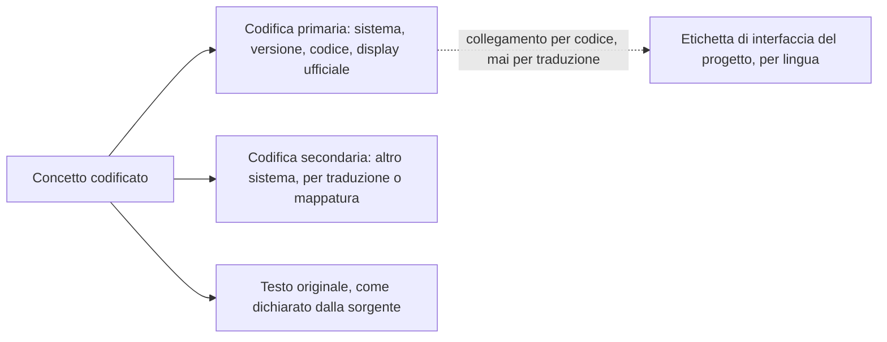

# Le terminologie nel dominio

Una terminologia clinica non è una tabella di supporto. È **parte del significato del dato**: un
valore codificato senza il sistema di codifica che lo qualifica non è un dato, è una stringa. E,
diversamente da quasi tutto il resto del modello, **le terminologie non appartengono al
progetto**: hanno titolari, licenze, costi e vincoli di ridistribuzione che decidono che cosa il
codice può contenere.

Questo capitolo fa due cose. Stabilisce **quale codifica si usa per quale concetto del dominio**,
e traduce il regime di licenza in **conseguenze sul modello dati e sul comportamento a
esecuzione**. La trattazione completa delle licenze è in `B5-licenze-terminologie.md` e nella
decisione `D31`; quest'area non la ripete e non la contraddice.

## 1. Il vincolo di partenza

> **[BASE] `D1`** — La licenza del progetto è Apache-2.0, che concede a valle il diritto di usare,
> modificare e ridistribuire, anche in prodotti proprietari. Una terminologia la cui licenza
> vieti la ridistribuzione o i derivati **non può stare fra i sorgenti**, perché il progetto non
> può concedere a valle diritti che non ha.

> **[BASE] `V-03`** — Il sistema è **pienamente funzionale senza SNOMED CT**. Nessun percorso
> principale può richiederlo.

> **[BASE]** Gateway unico verso le terminologie, con disattivazione per sistema di codifica;
> **nessuna cache persistita su disco** per i sistemi la cui licenza non consente derivati; ogni
> concetto codificato porta il sistema esplicito; le stringhe di interfaccia del progetto sono
> separate architetturalmente dal display ufficiale
> (`04_BASELINE_ARCHITETTURALE.md` § 7).

## 2. Quale codifica per quale concetto

La tabella è la mappa fra i concetti del dominio e i sistemi di codifica, con il regime di
licenza che ne discende. La colonna «regime» usa le quattro classi di `D31` e `B5` § 11.1:
**A** coesistenza piena nei sorgenti, **B** directory separata con licenza propria, **C**
acquisizione o interrogazione a runtime a cura di chi installa, **D** esclusione totale con solo
riferimento per identificatore e codice.

| Concetto del dominio | Sistema di codifica | Regime | Nota di modellazione |
|---|---|---|---|
| Tipo di prestazione erogata | nomenclatore e catalogo nazionale delle prestazioni | **B** | atto ufficiale dello Stato; riusabile ex art. 5 L. 633/1941 e art. 52 c. 2 CAD |
| Tipo di prestazione, livello regionale | catalogo regionale unico | **riferito dal tenant** | ventuno cicli indipendenti: non incluso (capitolo [02](02-le-prestazioni-modellate.md) § 13) |
| Quesito diagnostico e diagnosi | classificazione delle malattie, nona revisione, modifiche cliniche, versione italiana | **B** | è il sistema richiesto dal tracciato ministeriale del referto di televisita |
| Grandezza misurata (parametro, esame) | LOINC | **A** con attribuzione obbligatoria | ridistribuzione espressamente concessa, anche per scopi commerciali |
| Unità di misura | codifica unificata delle unità di misura | **B**, preferibilmente come dipendenza esterna | ridistribuibile verbatim, **vieta i derivati** ed è **revocabile** |
| Farmaco, identificazione commerciale | autorizzazione all'immissione in commercio | **B** | è la codifica operativa italiana del farmaco |
| Farmaco, classificazione terapeutica | classificazione anatomico-terapeutica-chimica | **D** | i termini del titolare vietano copia e distribuzione a fini commerciali e ogni modifica: incompatibili con `D1` |
| Concetti clinici generali | SNOMED CT | **C** | mai scaricato dal progetto; § 5 |
| Vocabolari di struttura degli scambi | terminologia HL7 e sistemi di codifica del nucleo dello standard | **A** | rilascio in pubblico dominio |
| Ruoli, tipi di contatto, stati | vocabolari del nucleo dello standard | **A** | idem |
| Classificazioni internazionali delle malattie, decima e undicesima revisione | terminologia dell'organizzazione internazionale competente | **D** | licenza che vieta i derivati; solo riferimento per identificatore |
| Scale e questionari clinici validati | titolari diversi, uno per scala | **da accertare** | questione `Q-11`; capitolo [05](05-parametri-e-osservazioni.md) § 9.3 |

> **`DM-80` [MOD] — La colonna «regime» è un attributo del sistema di codifica nel modello, non
> una nota di documentazione.** Il gateway conosce, per ciascun sistema, il proprio regime, e ne
> fa discendere il comportamento: che cosa può essere memorizzato, che cosa può essere
> espanso, che cosa può essere solo riferito. Senza questo attributo, la policy vive in un
> documento e viene violata al terzo mese.

## 3. Il concetto codificato nel modello

### 3.1 Anatomia

| Elemento | Obbligatorio | Nota |
|---|---|---|
| **Sistema** | **sì, sempre** | Un codice senza sistema è ambiguo per costruzione |
| **Versione del sistema** | sì quando la sorgente la dichiara | I sistemi cambiano; una diagnosi codificata nel 2026 va letta con la versione del 2026 |
| **Codice** | sì | |
| **Display ufficiale** | facoltativo, e con cautela | § 3.2 |
| **Testo originale** | sì quando esiste | Ciò che la sorgente ha effettivamente scritto, indipendentemente dalla codifica |
| **Etichetta di interfaccia** | non è parte del dato | È del catalogo di internazionalizzazione, collegata per codice |

### 3.2 Il display ufficiale non è l'etichetta di interfaccia

> **[BASE] `D34`** — Le traduzioni di una terminologia sono **derivati** e appartengono al
> titolare della terminologia. Le stringhe di internazionalizzazione del progetto vanno separate
> architetturalmente dal display ufficiale.

> **`DM-81` [MOD] — Tre stringhe distinte per lo stesso concetto**, e la confusione fra loro è
> insieme un difetto funzionale e un problema di licenza:
>
> 1. **Il display ufficiale** appartiene al titolare. Si conserva come ricevuto, non si traduce,
>    non si modifica, e per i sistemi in regime C e D non si conserva affatto.
> 2. **Il testo originale** è ciò che il professionista o la sorgente hanno scritto. È dato
>    clinico e si conserva sempre.
> 3. **L'etichetta di interfaccia** è del progetto, vive nel catalogo di internazionalizzazione,
>    è collegata al codice e non deriva dal display.
>
> **Questione `Q-03` in bacheca**, indirizzata all'area `ARCH`: come si realizza concretamente la
> separazione. Quest'area vi contribuisce con `DM-81` — che stabilisce **che cosa** va separato e
> perché — e non ne decide la realizzazione tecnica.

Il costo della disciplina è dichiarato in `B5` § 11.3 e va detto senza attenuanti: **senza le
traduzioni ufficiali, il progetto deve mantenere le proprie etichette per i codici che espone
all'utente.** È lavoro reale. In cambio, la catena di licenze del repository resta coerente, il
che per un progetto la cui ragione d'essere è l'integrazione in prodotti proprietari non è un
costo di conformità: è il prodotto.

### 3.3 Il codice non risolvibile

Un sistema che dipenda dalla risoluzione dei codici funziona solo quando tutto è configurato. Il
modello prevede il caso contrario come normale.

> **`DM-82` [MOD] — Un concetto codificato è valido anche se il suo sistema non è risolvibile.**
> Il dato si conserva integro — sistema, codice, testo originale — e porta uno **stato di
> risoluzione** dichiarato: risolto, non risolvibile perché il sistema è disattivato, non
> risolvibile perché il servizio non è raggiungibile, non trovato nel sistema dichiarato.
>
> La conseguenza operativa: **il sistema non rifiuta un dato clinico perché non riesce a
> validarne il codice**, salvo che la validazione sia richiesta da un obbligo esplicito nel
> percorso specifico. Rifiutarlo significherebbe perdere un dato clinico per un problema di
> configurazione.

Lo stato di risoluzione è visibile all'utente, perché un display assente per mancata risoluzione
e un display assente perché la sorgente non lo ha fornito sono due situazioni che il clinico deve
poter distinguere.

## 4. Il gateway terminologico

### 4.1 Che cosa fa e che cosa non fa

| Fa | Non fa |
|---|---|
| Risolve un codice in un concetto | Non contiene le terminologie: le interroga o le legge da un artefatto locale |
| Valida l'appartenenza di un codice a un insieme di valori | Non traduce i display |
| Espande insiemi di valori, **quando la licenza lo consente** | Non espande insiemi di valori dei sistemi che lo vietano |
| Dichiara la propria disponibilità per sistema | Non maschera l'indisponibilità con un esito positivo |

> **[BASE]** **Nessuna cache persistita su disco** per i sistemi la cui licenza non consente
> derivati: una cache persistente di risposte è un sottoinsieme, cioè un derivato (`D33`).

> **`DM-83` [MOD]** — La politica di memorizzazione temporanea è **per sistema di codifica**, non
> globale. Un unico livello di memorizzazione con la stessa politica per tutti i sistemi è
> tecnicamente più semplice e giuridicamente insostenibile.

Due vincoli dell'area sicurezza si sovrappongono a questo e **prevalgono** dove sono più
stringenti (`V-151` in bacheca):

1. **Nessuna cache persistita su disco**, senza distinzione per licenza. Il vincolo di licenza
   ne è un sottoinsieme: dove la licenza lo consentirebbe, il vincolo di sicurezza lo vieta
   comunque.
2. **Il gateway non trasmette identificativi dell'assistito** al servizio terminologico esterno.
   Sul piano del dominio ne discende che la risoluzione di un codice è un'operazione **priva di
   contesto sul soggetto**: nessun percorso può richiedere di inviare, insieme al codice, il
   riferimento alla persona per cui lo si sta risolvendo.

### 4.2 La disattivazione per sistema

Il gateway è configurabile per sistema di codifica: ciascuno può essere abilitato o disabilitato,
e la configurazione è **osservabile dal dominio**. Non è un dettaglio operativo: determina il
comportamento del percorso funzionale, e quindi va dichiarata e presentata all'utente.

## 5. SNOMED CT

### 5.1 La regola, e la ragione

> **[BASE] `D32`** — L'accordo di licenza si perfeziona **scaricando o accedendo** al contenuto:
> se il progetto non lo scarica mai, non ne è mai vincolato. La clausola che impone che il
> contenuto non sia accessibile se non a utenti autorizzati è **incompatibile con un repository
> pubblico**, e la catena di sub-licenza è incompatibile con Apache-2.0 per costruzione.

Ne discendono tre regole operative che ricadono su chi scrive codice e non solo su chi scrive
documenti:

1. **Nessun manutentore scarica i file di rilascio** per finalità di sviluppo. Le prove
   dell'integrazione terminologica si eseguono con **doppi di prova** — sistemi di codifica
   fittizi del progetto — o su un'istanza fornita da chi detiene già la licenza.
2. **Nessun insieme di valori del progetto contiene concetti enumerati** di quel sistema. La
   composizione per filtro è ammessa; l'espansione no.
3. **Un controllo in integrazione continua fa fallire la costruzione** se contenuto vietato
   ricompare fuori dalle directory in regime B, con allowlist versionata e commentata (`D32`,
   `B5` § 12.3).

### 5.2 Le due avvertenze da documentare per chi installa

Vanno dette senza attenuanti, perché riguardano chi userà il sistema e non il progetto:

- **Il terminology server esterno non esonera chi installa.** Chi crea o analizza record che
  contengono quei concetti rientra nella definizione di sistema di trattamento dati del contratto
  di licenza, con le tariffe che ne discendono, **per sito**, anche in ambienti non di
  produzione.
- **Chi distribuisce il sistema distribuisce un prodotto soggetto alla licenza**, anche senza che
  esso contenga un solo concetto.

Il capitolo [08 della documentazione di conformità](../08_compliance/) è la sede della procedura
operativa per chi installa; quest'area si limita a segnalare che il modello deve **rendere
possibile l'esercizio senza quel sistema**, che è il punto successivo.

## 6. Il comportamento senza terminology server

È il paragrafo che rende `V-03` verificabile invece che dichiarativo.

### 6.1 Che cosa continua a funzionare

Con il gateway configurato per operare senza il sistema in regime C, il sistema resta pienamente
operativo appoggiandosi a LOINC, alla classificazione italiana delle malattie e al catalogo
nazionale delle prestazioni, che non hanno costo (`D33`).

| Percorso | Funziona senza | Perché |
|---|---|---|
| Prenotazione e agenda | sì | usa il catalogo delle prestazioni |
| Contatto, sessione, esiti | sì | usa vocabolari del nucleo dello standard, in regime A |
| Consenso | sì | i tipi di consenso sono del dominio |
| Documento clinico e conferimento | sì | il quesito e la diagnosi usano la classificazione italiana |
| Misure di telemonitoraggio | sì | le grandezze usano LOINC, le unità la codifica unificata |
| Piano, attese, aderenza, allarmi | sì | non richiedono terminologie esterne |

### 6.2 Che cosa non funziona, dichiarato

> **[BASE] `D33`** — Il costo è dichiarato: gli insiemi di valori con collegamento a quel sistema
> — in particolare quello del motivo del contatto, dell'ordine di alcune migliaia di concetti —
> **non si validano**. In un'installazione appena avviata, la validazione di quei collegamenti
> fallisce o va disattivata. È il costo più alto dell'intera policy, ed è dichiarato come tale.

> **`DM-84` [MOD] — La degradazione è dichiarata all'utente, non silenziosa.** Quando un
> collegamento non è validabile perché il sistema è disattivato, l'esito è **«non validato,
> sistema non disponibile»**, distinto sia da «valido» sia da «non valido». Restituire «valido»
> per non bloccare è la scelta che rende il sistema inaffidabile senza che nessuno se ne accorga.

### 6.3 La configurazione predefinita

Il sistema si installa e si avvia con i sistemi in regime C **disattivati**, e funziona. È
l'unica configurazione predefinita coerente con `D32`: attivarli richiede una scelta consapevole
di chi installa, che è anche il soggetto che ne assume gli obblighi.

## 7. I casi particolari

### 7.1 Il farmaco

> **[BASE] `D34`** — La classificazione anatomico-terapeutica è **esclusa**: i termini del
> titolare vietano copia e distribuzione a fini commerciali e ogni modifica, frontalmente
> incompatibili con Apache-2.0.

La mitigazione è a costo nullo perché in Italia la codifica operativa del farmaco è
l'autorizzazione all'immissione in commercio, che è il codice che compare nel tracciato
ministeriale del referto di televisita accanto alla classificazione terapeutica.

> **`DM-85` [MOD]** — Il modello del farmaco ha **due codifiche facoltative e indipendenti**:
> identificazione commerciale e classificazione terapeutica. Il sistema è pienamente funzionale
> con la sola prima. L'identificatore canonico della seconda resta ammesso come **riferimento**,
> perché un identificatore di sistema è un nome, non un indirizzo da cui scaricare.

Il costo funzionale è la ricerca del farmaco per classe terapeutica, non disponibile senza
configurazione aggiuntiva a cura di chi installa. È un costo reale e va detto.

### 7.2 LOINC

È l'unica terminologia clinica di ampiezza significativa su cui il progetto può appoggiarsi
integralmente, con un obbligo: **l'attribuzione**, nel file di riconoscimento del repository e
nell'elemento di copyright di ogni artefatto che ne enumeri concetti.

Due cautele, che ricadono sul modello:

- **Le traduzioni sono derivati** assegnati al titolare: vale `DM-81`.
- **Alcuni concetti portano un avviso di copyright di terzi**: la verifica è parte della lista di
  controllo di revisione di ogni nuovo insieme di valori (`B5` § 12.2).

### 7.3 La classificazione italiana delle malattie e il nomenclatore

Entrambi in regime B: ridistribuibili in una directory dedicata con licenza propria e
dichiarazione esplicita che la licenza del progetto non vi si applica. Sono atti ufficiali dello
Stato; il rischio residuo sulla catena a monte della traduzione è basso ma non nullo ed è
dichiarato in `B5` § 4.3.

Sul piano del modello vale un'osservazione che le licenze non risolvono e che `B5` § 7.3 chiama
il vincolo di modellazione: **il nomenclatore è versionato nel tempo e variabile per regime**.
Una tabella senza validità temporale rende irriproducibile la rendicontazione storica. È lo
stesso vincolo del catalogo delle prestazioni del capitolo
[02](02-le-prestazioni-modellate.md) § 13.

### 7.4 I cataloghi regionali

Ventuno cicli di aggiornamento indipendenti. Il rischio giuridico è molto basso; quello di
manutenzione è alto. La scelta di quest'area — coerente con `DM-24` — è **accettarli per
riferimento dal tenant** e non includerli.

Il tracciato ministeriale conferma che i due livelli coesistono: la richiesta di teleconsulto
porta sia il codice del nomenclatore nazionale sia quello del catalogo regionale unico (DM 19
novembre 2025, All. 1, § 2.19). Il modello deve quindi rappresentarli **entrambi e distinti**,
non sceglierne uno.

## 8. Il glossario e il repository nazionali

> **[NORM]** Il DM 19 novembre 2025, All. 3, § 3.2 prevede che la piattaforma possa consumare dal
> glossario di business dell'infrastruttura nazionale le risorse terminologiche in formato dello
> standard — sistemi di codifica, insiemi di valori, mappe di concetti — dal servizio
> terminologico, e le linee guida, i percorsi e i protocolli dal repository di librerie in formato
> documentale, **con logica espressa in un linguaggio di espressione clinica** (`REQ-57` di `B1`).

L'ultima parte è la più delicata dell'intero capitolo:

> **`DM-86` [MOD] — Consumare terminologie non è eseguire logica decisionale, e la distinzione va
> mantenuta nel modello.** L'acquisizione di sistemi di codifica, insiemi di valori e mappe di
> concetti è nel perimetro. **L'esecuzione locale di logica clinica espressa in un linguaggio di
> espressione** configura supporto alla decisione clinica e sposta il perimetro di
> qualificazione.
>
> Il modello mantiene quindi due capacità distinte e separatamente disattivabili: il **gateway
> terminologico**, che risolve e valida; e un eventuale **esecutore di logica**, che nel
> perimetro attuale **non esiste**. La questione è girata all'area `COMP` da `B1` § 14 e resta
> aperta: quest'area non la chiude e progetta perché la seconda capacità sia assente per
> costruzione, non disattivata per configurazione.

Va notato che il glossario nazionale e il modulo di terminologia dell'infrastruttura nazionale
sono componenti di cui il progetto è **consumatore**, non fornitore. Il vincolo di sovranità e la
loro classificazione come componenti di terze parti sono oggetto della questione `Q-04` in
bacheca, indirizzata alle aree `SEC` e `ARCH`.

## 9. Le scale cliniche

Il capitolo [05](05-parametri-e-osservazioni.md) § 9.3 stabilisce il vincolo di modellazione:
motore separato dalle definizioni, definizione come artefatto con regime di licenza dichiarato,
nessuna definizione di terzi inclusa finché il regime non è accertato, sistema pienamente
funzionale senza alcuna scala di terzi.

Qui va aggiunto ciò che riguarda la policy terminologica:

> **`DM-87` [MOD] — I quattro regimi si applicano identicamente a scale e questionari.** Non
> sono una categoria a parte: sono contenuto di terzi con titolare, licenza e obblighi di
> attribuzione, e vanno collocati con lo stesso criterio, verificati con la stessa lista di
> controllo e sorvegliati dallo stesso controllo automatico.
>
> **Questione `Q-11` in bacheca**, indirizzata a `COMP` e `ARCH`: la policy terminologica va
> estesa formalmente a scale e punteggi **prima** di scrivere il primo motore di calcolo.
> Quest'area concorre con `DM-65` e `DM-87` e non la chiude.

## 10. La lista di controllo che entra nel processo

`B5` § 12.2 propone una lista di controllo di revisione per ogni nuovo insieme di valori o
sistema di codifica. Quest'area la recepisce come **parte del processo di modellazione**, perché
un insieme di valori è un artefatto di dominio prima che un file:

- Da quali sistemi provengono i concetti enumerati? Elencarli tutti.
- Ciascuno di quei sistemi è in regime A o B?
- Se compaiono concetti che richiedono attribuzione: l'elemento di copyright la riporta?
- Compaiono espansioni o enumerazioni di concetti di sistemi in regime C o D? In tal caso la
  proposta va respinta.
- Se l'insieme si compone per filtro: il numero di concetti di ancoraggio è il minimo necessario?
- È dichiarata la versione della terminologia di riferimento?
- Se l'artefatto proviene da un pacchetto di terzi: è stata verificata la **titolarità del
  contenuto**, e non solo la licenza dichiarata dal contenitore?

L'ultima voce è il principio generale di `D34`, e vale oltre il caso da cui è nato: **una
dichiarazione di licenza apposta su un contenitore non dispone dei diritti di terzi sul contenuto
ricompreso**. La verifica è artefatto per artefatto.

## 11. Che cosa resta non verificato

| Punto | Stato | A chi va chiesto |
|---|---|---|
| Regime di licenza delle singole scale e questionari clinici | **[NV]** | `COMP` — questione `Q-11` |
| Contenuto puntuale del glossario nazionale di telemedicina e allineamento voce per voce | **[NV]** | `COMP` — capitolo [01](01-linguaggio-ubiquo.md) § 1.2 |
| Codici di tipologia documentale e metadati di indicizzazione delle dieci tipologie di telemedicina | **[NV]** | `COMP` — questione `Q-07` |
| Compatibilità del servizio terminologico esterno con il vincolo di sovranità | **[NV]** | `SEC`, `ARCH` — questione `Q-04` |
| Valori puntuali degli insiemi di valori dedicati agli identificatori delle popolazioni non iscritte | **[NV]** | `ARCH` — segnalato nel modulo [04 dei fondamenti](../10_fondamenti/04-identita-e-anagrafiche.md) § 3.2 |

## Cosa devi ricordare

1. **Il sistema di codifica è sempre esplicito.** Un codice senza sistema non è un dato.
2. **Il regime di licenza è un attributo del sistema nel modello**, non una nota di
   documentazione: il gateway ne fa discendere il comportamento.
3. **Tre stringhe distinte** per lo stesso concetto: display ufficiale, testo originale, etichetta
   di interfaccia. Confonderle è insieme un difetto e un problema di licenza.
4. **Un concetto codificato è valido anche se il sistema non è risolvibile.** Il dato non si
   rifiuta per un problema di configurazione.
5. **La memorizzazione temporanea è per sistema**, non globale: alcune licenze non ammettono
   copie persistenti.
6. **Il sistema si installa e funziona con i sistemi in regime C disattivati.** È la
   configurazione predefinita.
7. **La degradazione è dichiarata**: «non validato, sistema non disponibile» non è «valido».
8. **La codifica operativa italiana del farmaco è l'identificazione commerciale**; la
   classificazione terapeutica è esclusa e resta solo come riferimento.
9. **Nomenclatore e classificazione italiana delle malattie sono ridistribuibili** in directory
   separata, e **hanno validità temporale**.
10. **I cataloghi regionali si riferiscono, non si includono.** Ma il modello rappresenta
    entrambi i livelli di codice, perché il tracciato ministeriale li richiede entrambi.
11. **Consumare terminologie non è eseguire logica clinica.** La seconda capacità è assente per
    costruzione, non disattivata.
12. **Una licenza apposta su un contenitore non dispone dei diritti di terzi sul contenuto**: la
    verifica è artefatto per artefatto.

## Dove continuare

- [05 — Parametri e osservazioni](05-parametri-e-osservazioni.md): le grandezze codificate e le
  unità.
- [04 — I documenti clinici](04-documenti-clinici.md): quali codifiche il tracciato ministeriale
  richiede nel referto.
- Modulo [06 dei fondamenti](../10_fondamenti/06-fhir-da-zero.md): come è fatto un concetto
  codificato nello standard adottato.
