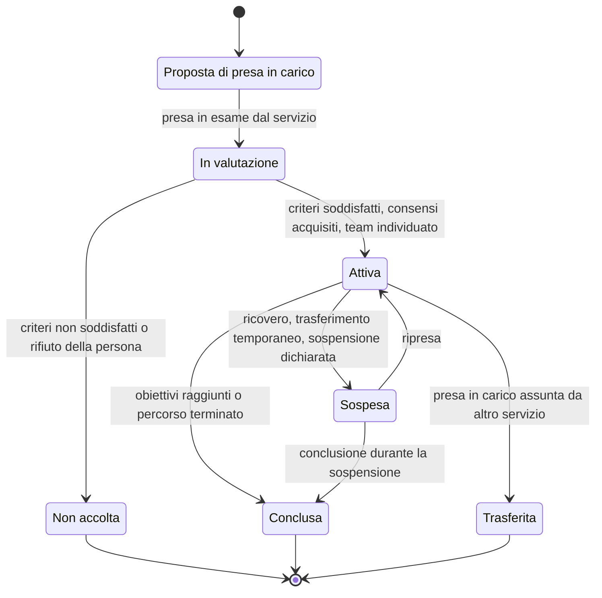
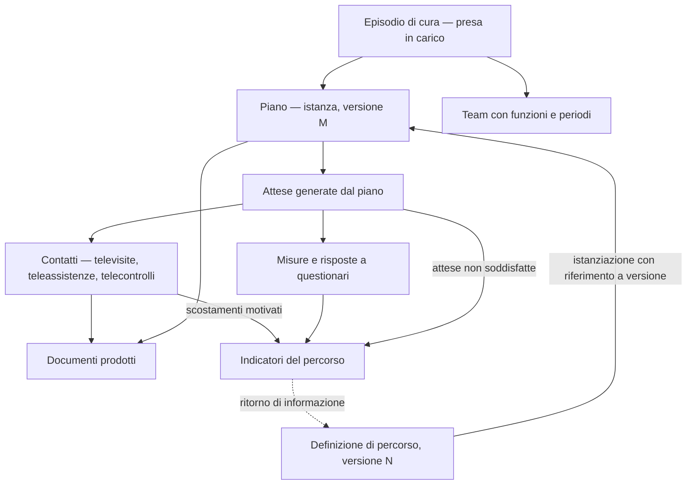

# Percorsi e piani di cura

Il requisito che governa questo capitolo è enunciabile in una riga: **supportare N percorsi
senza cablarne nessuno**.

Non è un'aspirazione di flessibilità. È una conseguenza aritmetica del contesto: la sanità
italiana è organizzata su ventuno sistemi regionali, ciascuno con i propri percorsi
diagnostico-terapeutici assistenziali, adottati con atti propri, aggiornati con cicli propri; e
dentro ciascuna Regione le aziende declinano ulteriormente. Un modello che rappresenti un
percorso reale funziona con il primo cliente, richiede una nuova versione del software per il
secondo e diventa ingestibile al terzo.

Il modulo [10 dei fondamenti](../10_fondamenti/10-percorsi-di-cura-e-sicurezza.md) spiega che
cosa sono un percorso, un piano, la presa in carico, l'aderenza e gli allarmi, e perché acuto e
cronico impongono due modi diversi di curare. Questo capitolo ne ricava il modello.

## 1. Modello e istanza: la separazione da cui dipende tutto

> **`DM-90` [MOD] — Definizione e istanza sono due aggregati distinti, e l'istanza porta il
> riferimento alla versione della definizione, non alla definizione.**

| | Definizione del percorso | Istanza sul singolo |
|---|---|---|
| Che cos'è | il modello di ciò che è previsto per una condizione, in un'organizzazione | ciò che è stato deciso per questa persona |
| Ambito | popolazione | individuale |
| Chi la redige | gruppo di lavoro, con atto formale | il professionista o l'équipe che ha in carico |
| Ciclo di vita | pubblicata, vigente, superata; **mai modificata dopo la pubblicazione** | attiva, sospesa, conclusa, interrotta |
| Contiene soglie individuali | **no** | **sì** |
| Corrispondenza nello standard | `PlanDefinition` | `CarePlan` |

Le quattro regole che discendono dalla separazione, tutte verificabili:

1. **Una versione pubblicata non si modifica**: si supera con una versione successiva.
2. **Le istanze in corso restano agganciate alla versione con cui sono nate.** La migrazione a
   una versione successiva è un **atto esplicito** di un professionista, tracciato, non una
   propagazione automatica.
3. **La deviazione è rappresentabile e motivabile.** L'istanza può discostarsi dalla definizione;
   lo scostamento è un fatto registrato con la sua motivazione, non un errore di validazione. Un
   modello che rifiuti le deviazioni costringe i clinici a lavorare fuori dal sistema.
4. **Il ritorno di informazione dall'istanza alla definizione è una funzione**, non un effetto
   collaterale: gli indicatori del percorso si calcolano sulle istanze, e senza quel ritorno la
   definizione non è valutabile.

## 2. I cinque contenitori che non sono sinonimi

Il modulo [10 dei fondamenti](../10_fondamenti/10-percorsi-di-cura-e-sicurezza.md) § 3.5 li
distingue. Sul piano del modello ciò che conta è che **hanno redattori, ambiti e cicli di vita
diversi e non sono interscambiabili**.

| Contenitore | Livello | Nel modello |
|---|---|---|
| **Percorso diagnostico-terapeutico assistenziale** | popolazione | definizione versionata, per tenant e ambito organizzativo |
| **Piano di cura** | individuale | istanza generica, con obiettivi e calendario |
| **Piano assistenziale individuale** | individuale, **multiprofessionale**, con dimensione sociale | istanza con team multiprofessionale e attività non sanitarie |
| **Progetto riabilitativo individuale** | individuale | **contenitore obbligatorio** delle prestazioni di riabilitazione, teleriabilitazione compresa |
| **Piano di telemonitoraggio** | individuale, **operativo** | istanza con cicli, frequenze, fasce orarie, soglie e regole; è **documento sanitario firmato** |

L'ultima riga è quella che tocca direttamente il codice, e va enunciata come la enuncia il
modulo dei fondamenti perché è esatta:

> **Il piano di telemonitoraggio è la configurazione a esecuzione del motore di allarme, scritta
> da un clinico e firmata digitalmente.** Le soglie non sono un file di configurazione del
> sistema: sono il contenuto di un documento sanitario individuale.

> **`DM-91` [MOD]** — Ne discende che il piano di telemonitoraggio ha **due proiezioni
> obbligate**: una **eseguibile**, che il motore usa, e una **documentale**, che va al fascicolo
> come tipologia dedicata (lett. t, DM 19 novembre 2025, art. 7). Entrambe sono generate dalla
> stessa fonte. Se sono redatte separatamente divergono, e la divergenza fra ciò che il piano
> dichiara e ciò che il sistema fa è un difetto di sicurezza del paziente.

## 3. La definizione del percorso come dato

### 3.1 Sette proprietà obbligatorie

Traduzione in requisiti di modello del § 3.7 del modulo dei fondamenti.

| # | Proprietà | Che cosa comporta |
|---|---|---|
| 1 | **Nessun percorso nel codice** | Nessuna classe per patologia, nessuna diramazione sulla condizione, nessuna costante di frequenza. Il percorso è un dato caricato, validato e versionato |
| 2 | **Linguaggio di descrizione ristretto** | Espressivo quanto basta per attività, cadenze, punti di decisione, responsabilità e criteri; **non** un linguaggio di programmazione arbitrario eseguito in esercizio |
| 3 | **Versionamento con immutabilità** | § 1 |
| 4 | **Ambito e tenancy** | Ogni definizione appartiene a un tenant e a un ambito organizzativo; un percorso «nazionale» è una configurazione, non un presupposto |
| 5 | **Validazione al caricamento** | Nodo irraggiungibile, cadenza senza unità, soglia senza parametro, ciclo senza uscita: rifiutati alla pubblicazione, con messaggio comprensibile a chi ha redatto |
| 6 | **Nessuna soglia individuale nella definizione** | Il percorso propone, il piano individuale dispone (`V-02`) |
| 7 | **Tracciabilità del perché** | Per ogni attività eseguita, da quale nodo derivava; per ogni attività non eseguita, se era prevista |

### 3.2 Il confine del motore

La seconda proprietà merita un approfondimento perché è il punto in cui la flessibilità incontra
il perimetro regolatorio.

> **`DM-92` [MOD] — Il motore di percorso pianifica, non decide.** Può generare attività attese,
> calendari, promemoria, attese di rilevazione e code di lavoro. **Non può** valutare condizioni
> cliniche, calcolare punteggi, dedurre priorità o selezionare rami sulla base di un giudizio
> clinico che non sia stato registrato da un professionista.
>
> La differenza operativa: un nodo del percorso che dica «se il paziente è instabile, procedi al
> ramo B» richiede che «instabile» sia stato **dichiarato** da qualcuno; non può essere calcolato
> dal motore a partire dalle misure.

È lo stesso confine del [capitolo 07](07-terminologie-nel-dominio.md) § 8 sull'esecuzione di
logica clinica, visto da un'altra angolazione. Un motore troppo potente è, insieme, una
superficie di attacco e un oggetto che nessuno riesce a validare ai fini regolatori.

### 3.3 Il rapporto con il motore di workflow del decreto

Il **motore di workflow** è un micro-servizio specifico previsto per tutti e quattro i servizi
minimi (DM 21 settembre 2022, All. A, Tabella 1; DM 19 novembre 2025, All. 3). Non è quindi una
funzione accessoria: è parte del perimetro atteso da un'infrastruttura regionale.

> **`DM-93` [MOD]** — Il motore di workflow del prodotto e la definizione del percorso sono due
> cose diverse: il primo esegue, la seconda descrive. Il primo è codice del progetto, versionato
> con il progetto; la seconda è dato del tenant, versionata con il tenant. Confonderli significa
> che aggiornare un percorso richiede un rilascio del software.

## 4. Presa in carico e arruolamento

### 4.1 Non è avere un appuntamento

La presa in carico è **continuativa**, **responsabilizzante** e **formale**: non si esaurisce con
l'atto, individua chi risponde della continuità, e comincia e finisce con un atto dichiarato.

> **`DM-94` [MOD]** — La presa in carico è un aggregato con radice propria — l'**episodio di
> cura** — e non un attributo dell'assistito né una deduzione dall'esistenza di contatti. È
> l'unità a cui si agganciano il team, il piano, gli obiettivi e gli indicatori, e l'unità su cui
> si fonda la relazione di autorizzazione `CARE_EPISODE` (capitolo
> [03](03-assistito-professionista-organizzazione.md) § 5.2).

Lo stato `Trasferita` esiste perché la presa in carico può cambiare titolare senza interrompersi,
e distinguere il trasferimento dalla conclusione seguita da una nuova presa in carico è ciò che
consente di misurare la continuità assistenziale invece di frammentarla.

### 4.2 La valutazione di arruolabilità

È un atto con criteri dichiarati, non un calcolo. Il sistema registra la decisione e i criteri
che il servizio ha applicato; non li applica al posto del professionista.

Per la televisita, il *Modello orientativo di erogazione* di AGENAS (v. 1.0.25 del 16 aprile
2026) individua tre dimensioni della «verifica di eseguibilità»: utilità clinica, sicurezza
clinica, **compliance digitale dell'assistito** **[RACCOMANDATO]**. Quest'area le adotta come
struttura dell'atto di valutazione anche per l'arruolamento a percorsi, perché le tre domande
sono le stesse.

> **`DM-95` [MOD]** — La valutazione di eseguibilità è un'**entità con tre esiti indipendenti**,
> ciascuno con motivazione e autore. Un unico esito complessivo rende impossibile sapere quale
> delle tre dimensioni ha determinato il rifiuto, e quindi impossibile sapere se il rifiuto è
> superabile con un intervento tecnico o formativo.

### 4.3 Il team e la responsabilità

Chi segue e chi risponde possono non coincidere. Il modello rappresenta quindi il team come
insieme di **ruoli organizzativi con funzione dichiarata nell'episodio** e periodo di validità,
con almeno un ruolo marcato come responsabile della presa in carico.

| Proprietà | Motivazione |
|---|---|
| Il team ha membri con **funzione** nell'episodio | «infermiere» non basta: serve sapere se è il riferimento del percorso o un esecutore |
| Ogni membro ha un **periodo** | i turni cambiano, le persone si spostano, e la domanda «chi era responsabile in quel momento» va poter avere risposta |
| Esiste **sempre** un responsabile | un episodio senza responsabile è una presa in carico che nessuno ha assunto |
| Il cambio di responsabile è un **fatto** | con istante, autore e motivo |

### 4.4 La copertura oraria dichiarata

> **Questione `Q-14` in bacheca**, indirizzata alle aree `PROD` e `FUNZ`: **la copertura oraria
> dichiarata è un requisito di sicurezza**, non un parametro commerciale. Un servizio mal
> dichiarato è più pericoloso dell'assenza di servizio, perché produce falsa rassicurazione.

Quest'area concorre con un vincolo di modellazione, e non chiude la questione perché la
formulazione verso l'utente e il requisito funzionale corrispondente non le competono:

> **`DM-96` [MOD] — La copertura è un'entità del servizio, non un testo.** Contiene: giorni,
> fasce orarie, tipo di risposta garantita, termine di presa in carico atteso, comportamento
> fuori copertura, e canale alternativo indicato. È **collegata al piano** e riportata
> all'assistito nel momento dell'arruolamento, con la stessa struttura con cui è configurata.
>
> Due conseguenze operative:
>
> 1. **Il motore degli allarmi conosce la copertura.** Un allarme generato fuori copertura ha un
>    comportamento dichiarato — accodato, escalato a un canale diverso, oppure non generato — e
>    non un comportamento implicito.
> 2. **La modifica della copertura è un evento comunicato.** Una riduzione della copertura di un
>    servizio in cui sono arruolate persone non è una modifica di configurazione: è una
>    variazione del servizio su cui quelle persone hanno fatto affidamento.

## 5. L'episodio e i contatti

Tre osservazioni sul diagramma.

1. **Il contatto non appartiene all'episodio: vi è collegato.** Un contatto può esistere senza
   episodio — una televisita una tantum — e un episodio può contenere contatti erogati da
   organizzazioni diverse. Una relazione di composizione impedirebbe entrambi i casi.
2. **Le attese sono il ponte fra piano e realtà.** Sono l'entità introdotta al capitolo
   [05](05-parametri-e-osservazioni.md) § 6.1 e sono ciò che consente di misurare l'aderenza come
   grandezza definita.
3. **Gli indicatori si calcolano su tre sorgenti**: contatti, misure e attese non soddisfatte.
   Ometterne la terza produce indicatori sistematicamente ottimistici, perché ciò che non è
   accaduto non compare.

## 6. Aderenza

### 6.1 La definizione operativa

> **`DM-97` [MOD] — L'aderenza è il rapporto fra attese soddisfatte e attese generate, in una
> finestra dichiarata, con l'elenco esplicito delle attese escluse e il motivo dell'esclusione.**

La definizione ha tre parti e tutte e tre servono:

- **il denominatore è generato dal piano**, non ricostruito a posteriori: è ciò che rende il
  numero riproducibile a distanza di tempo, anche dopo che il piano è cambiato;
- **la finestra è dichiarata**, perché l'aderenza di una settimana e quella di sei mesi sono
  grandezze diverse;
- **le esclusioni sono esplicite**: le attese cadute in un periodo di sospensione dichiarata o di
  indisponibilità dichiarata dell'assistito non sono mancate adesioni, e conteggiarle come tali
  produce un indicatore che descrive l'organizzazione invece della persona.

### 6.2 Aderenza al piano e aderenza alla terapia

Non sono la stessa cosa e il modello le tiene distinte:

| | Aderenza al piano di rilevazione | Aderenza terapeutica |
|---|---|---|
| Che cosa misura | l'esecuzione delle rilevazioni previste | l'assunzione della terapia prescritta |
| Dato di origine | attese e misure | dichiarazioni, questionari, dati di erogazione esterni |
| Osservabile dal sistema | sì, direttamente | **no**, se non per dichiarazione o per dati di terzi |

La seconda riga della terza colonna è una limitazione da dichiarare. Il sistema non osserva
l'assunzione di una terapia: osserva ciò che qualcuno dichiara. Presentare una percentuale di
aderenza terapeutica come misura sarebbe attribuire al dato una natura che non ha.

### 6.3 Il silenzio, di nuovo

L'aderenza calcolata senza la tassonomia delle cause del capitolo
[05](05-parametri-e-osservazioni.md) § 6.2 è un numero che confonde sei situazioni diverse:
dispositivo guasto, connettività assente, catena di ingestione interrotta, errore d'uso, assenza
dichiarata, abbandono, peggioramento clinico.

> **`DM-98` [MOD]** — Un indicatore di aderenza è restituito **sempre** insieme alla ripartizione
> delle attese non soddisfatte per categoria di causa, incluse quelle di causa ignota. Un
> indicatore di aderenza senza quella ripartizione è, nel migliore dei casi, inutile.

## 7. Gli esiti

### 7.1 Che cosa il modello registra

Gli esiti di un percorso non sono un giudizio del sistema. Sono **fatti registrati**, di quattro
tipi:

| Tipo | Esempio di dominio | Chi lo dichiara |
|---|---|---|
| **Esito di attività** | il contatto si è svolto, con quale codice di esito | il professionista |
| **Esito dichiarato dall'assistito** | risposta a questionario di esito riferito dalla persona | l'assistito |
| **Evento clinico registrato** | accesso in pronto soccorso, ricovero, cambio di terapia | chi lo registra o il sistema di origine |
| **Esito del percorso** | obiettivi raggiunti, percorso interrotto, trasferito | il professionista responsabile |

> **`DM-99` [MOD]** — Il sistema **non calcola esiti clinici** e non produce alcun indice
> sintetico di risultato clinico. Aggrega fatti dichiarati e conta eventi registrati. La
> distinzione è il confine di `V2` applicato agli esiti, e va presidiata perché è quella su cui
> la pressione di prodotto è più forte.

### 7.2 Gli indicatori del percorso

Gli indicatori di processo — quanti hanno ricevuto ciò che il percorso prevedeva, entro quali
tempi, con quali scostamenti — sono calcolabili senza uscire dal perimetro, perché contano fatti
e non li interpretano.

Vanno però soggetti alla regola di cardinalità del capitolo
[06](06-consenso-e-riservatezza.md) § 11.3: nessun aggregato sotto la soglia configurata, né in
forma diretta né deducibile per differenza. In un percorso su una patologia poco frequente, la
coorte di un singolo tenant può essere piccola, e l'indicatore diventa identificante.

## 8. Il rapporto con l'organizzazione territoriale

Il modulo [01 dei fondamenti](../10_fondamenti/01-sistema-sanitario-italiano.md) § 8 descrive i
modelli territoriali e le nuove strutture. Sul piano del modello ne discende una sola cosa, ma
importante:

> **`DM-100` [MOD]** — L'unità organizzativa a cui una presa in carico è agganciata è un
> riferimento al modello dell'organizzazione del capitolo
> [03](03-assistito-professionista-organizzazione.md) § 4.2 — ricorsivo, con tipo dichiarato — e
> **non un elenco chiuso di tipologie di struttura**. Le tipologie cambiano per riorganizzazione
> amministrativa con una frequenza che nessun elenco cablato regge.

## 9. Come si aggiunge un percorso

La verifica finale della configurabilità è procedurale e va enunciata come tale, perché è ciò che
distingue un sistema realmente configurabile da uno che lo dichiara.

**Aggiungere un percorso deve richiedere esclusivamente:**

1. la redazione della definizione nel linguaggio di descrizione;
2. la sua validazione al caricamento;
3. la pubblicazione con versione, ambito e tenant;
4. l'eventuale definizione dei modelli di documento e di consenso associati;
5. la configurazione della copertura del servizio.

**Non deve richiedere:** una modifica del codice, un rilascio del software, una migrazione dello
schema dati, né l'intervento di chi ha scritto il motore.

> Se anche uno solo dei cinque punti richiede l'intervento dello sviluppatore, il percorso è
> cablato — indipendentemente da quanto sia configurabile ciò che gli sta attorno.

## 10. Che cosa resta non verificato

| Punto | Stato | A chi va chiesto |
|---|---|---|
| Identificativi di requisito per le sei aree scoperte su cronicità, allarmi e sicurezza del paziente: piano versionato, finestra di attesa, escalation con fallimento dichiarato, sorveglianza del volume atteso, copertura oraria dichiarata, tracciabilità del calcolo | **aperto** | `FUNZ` — questione `Q-12` |
| Formulazione verso l'utente della copertura oraria e requisito corrispondente | **aperto** | `PROD`, `FUNZ` — questione `Q-14` |
| Regime di licenza delle scale usate nella valutazione di arruolabilità e negli esiti riferiti dalla persona | **[NV]** | `COMP` — questione `Q-11` |
| Confini di perimetro rispetto alla destinazione d'uso: nessun giudizio interpretativo negli avvisi, nessuna prognosi | **aperto** | `COMP` — questione `Q-01` |

## Cosa devi ricordare

1. **Definizione e istanza sono aggregati distinti**, e l'istanza porta il riferimento alla
   **versione** della definizione.
2. **Una versione pubblicata non si modifica**, e le istanze in corso non migrano da sole.
3. **Cinque contenitori non sono sinonimi**: percorso, piano di cura, piano assistenziale
   individuale, progetto riabilitativo, piano di telemonitoraggio.
4. **Il piano di telemonitoraggio è la configurazione del motore di allarme scritta da un clinico
   e firmata**, con due proiezioni generate dalla stessa fonte.
5. **Il percorso è un dato**: nessuna classe per patologia, nessuna costante di frequenza,
   nessun percorso nel codice.
6. **Il motore pianifica, non decide.** Un ramo che dipenda da un giudizio clinico richiede che
   il giudizio sia stato dichiarato.
7. **La presa in carico è un aggregato con radice propria**, non una deduzione dall'esistenza di
   contatti.
8. **Il team ha funzioni e periodi**, e c'è sempre un responsabile.
9. **La copertura oraria è un'entità del servizio**: il motore degli allarmi la conosce, e la sua
   modifica è un evento comunicato.
10. **L'aderenza è attese soddisfatte su attese generate**, con finestra dichiarata ed esclusioni
    esplicite, e non si restituisce mai senza la ripartizione delle cause.
11. **Il sistema non calcola esiti clinici**: aggrega fatti dichiarati e conta eventi registrati.
12. **Aggiungere un percorso non deve richiedere un rilascio del software.** Se lo richiede, il
    percorso è cablato.

## Dove continuare

- [05 — Parametri e osservazioni](05-parametri-e-osservazioni.md): le attese, il dato mancante e
  le soglie individuali.
- [02 — Le prestazioni modellate](02-le-prestazioni-modellate.md): i contatti che compongono il
  percorso.
- Modulo [10 dei fondamenti](../10_fondamenti/10-percorsi-di-cura-e-sicurezza.md): cronicità,
  scale, triage, allarmi, aderenza e sicurezza del paziente.
