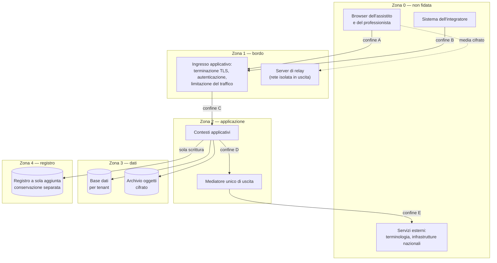

# Modello di minaccia

> **Presupposto di lettura.** Che cos'è un modello di minaccia, che cosa sono STRIDE, la
> superficie di attacco e i confini di fiducia è spiegato in
> [10 §12 — Crittografia e sicurezza, §2](../10_fondamenti/12-crittografia-e-sicurezza.md).
> Qui si applica quel metodo a questo sistema, e non lo si ripete.

## 1. Perché questo capitolo viene prima di tutti gli altri

Un modello di minaccia è la risposta ordinata a quattro domande: **che cosa si protegge**,
**da chi**, **che cosa succede se la protezione cede**, **come si verifica che regga**. Ogni
misura descritta nei capitoli successivi discende da una riga di questo capitolo. Una misura
che non discende da qui non ha giustificazione e va rimossa; un bene elencato qui che non ha
misura è un rischio non trattato, e va dichiarato tale.

Questo capitolo è anche il punto di raccordo con il **file di gestione del rischio** ai sensi
della norma sulla gestione del rischio dei dispositivi medici. Le due discipline non
coincidono — la gestione del rischio del dispositivo valuta il **danno al paziente**, la
sicurezza informatica valuta la **compromissione delle proprietà del sistema** — ma in questo
dominio si intersecano continuamente, e l'intersezione è il contenuto del §5. La norma tecnica
sulle attività di sicurezza nel ciclo di vita del software sanitario, che è il riferimento di
elezione per dimostrare lo stato dell'arte ai sensi dell'Allegato I § 17.2 del Regolamento (UE)
2017/745, richiede espressamente un processo di gestione del rischio di cibersicurezza distinto
ma raccordato con quello di sicurezza del paziente.

## 2. I beni protetti

Cinque beni, in ordine non di valore ma di **frequenza con cui vengono dimenticati**.

### 2.1 Contenuto clinico

Ciò che il professionista scrive, ciò che l'assistito riferisce, ciò che il documento firmato
contiene, ciò che la misura di un parametro riporta, ciò che l'immagine mostra, ciò che il
flusso audio-video trasporta mentre la sessione è in corso.

È il bene ovvio, ed è quello meglio protetto in quasi tutti i sistemi, perché è quello a cui
si pensa per primo. Le sue proprietà rilevanti sono **riservatezza** (nessuno oltre agli aventi
titolo), **integrità** (nessuno lo altera senza che sia rilevabile) e **autenticità** (è
dimostrabile chi lo ha prodotto). La **disponibilità** conta meno di quanto si creda per il
contenuto già prodotto e conta moltissimo per il contenuto in produzione: un referto
irraggiungibile per un'ora è un disservizio, una sessione che cade a metà di una visita
psichiatrica è un evento clinico.

### 2.2 Metadati di sessione — il bene che si dimentica

**Il fatto stesso che una persona abbia una sessione con uno specialista è dato relativo alla
salute.** Non è una lettura estensiva: l'art. 4, punto 15, del Regolamento (UE) 2016/679
definisce i dati relativi alla salute come «i dati personali attinenti alla salute fisica o
mentale di una persona fisica, **compresa la prestazione di servizi di assistenza sanitaria**,
che rivelano informazioni relative al suo stato di salute». La prestazione del servizio è
esplicitamente dentro la definizione.

Ne discende che tutto questo insieme è dato sanitario, e va protetto come tale:

| Metadato | Che cosa rivela |
|---|---|
| Identità dell'assistito e identità del professionista, in coppia | La disciplina specialistica del professionista rivela l'ambito del problema di salute |
| Esistenza, data e ora della sessione | Rivela l'esistenza di un percorso di cura in corso |
| Durata e numero delle sessioni | Rivela la complessità o la gravità percepita |
| Frequenza e cadenza | Distingue un controllo occasionale da un percorso continuativo |
| Motivo di annullamento o mancata presentazione | Rivela spesso più della sessione stessa |
| Struttura o unità organizzativa erogante | Rivela la specialità |
| Indirizzi di rete di entrambe le parti | Rivela la posizione e il contesto in cui l'assistito si trova durante la visita |
| Volume e andamento del traffico | Distingue una sessione video da una sola audio, e in certi casi il tipo di interazione |

Questa tabella è la ragione per cui tre scelte apparentemente sproporzionate sono in realtà
proporzionate: il divieto di etichettare le metriche infrastrutturali del relay con
l'identificativo di sessione ([V-155](./05-sicurezza-del-tempo-reale.md)); il divieto di
trasportare identificativi diretti dell'assistito nei log di diagnostica
([V-150](./04-tracciamento.md)); il divieto di far arrivare identificativi dell'assistito al
servizio esterno di terminologia ([V-151](./03-protezione-dei-dati.md)). Un sistema che protegge
il referto e lascia i metadati in chiaro in un sistema di osservabilità di terze parti ha
protetto la parte meno rivelatrice del proprio contenuto informativo.

### 2.3 Materiale di chiave

Le chiavi di cifratura a riposo dei contenuti e delle registrazioni; le chiavi private con cui
il progetto firma i messaggi in uscita e gli artefatti distribuiti; il segreto condiviso con
cui si emettono le credenziali effimere del relay; le chiavi di firma dei token; il materiale
crittografico effimero della singola sessione media.

La proprietà rilevante è la **riservatezza**, ma la conseguenza del suo fallimento non è
simmetrica. La compromissione di una chiave di firma degli artefatti non espone un solo dato
clinico e produce il danno peggiore dell'elenco, perché consente di distribuire un artefatto
malevolo che ogni installazione accetterà come autentico. La compromissione del materiale
effimero di una sessione espone una sessione. La compromissione della chiave di cifratura a
riposo di un tenant espone l'archivio di quel tenant. **La gerarchia del danno non segue la
gerarchia dell'attenzione**: si sorveglia la chiave dell'archivio e si dimentica quella della
firma.

### 2.4 Registro degli accessi e delle operazioni

Il registro è insieme un bene e uno strumento di protezione degli altri beni, ed è per questo
il bersaglio di chi ha già commesso l'abuso.

La proprietà rilevante è l'**integrità** in senso forte: non solo «nessuno lo modifica», ma
«se qualcuno lo modifica è **dimostrabile a un terzo** che lo ha fatto». È la differenza fra
integrità e non ripudio, ed è la ragione per cui il versionamento delle entità non è un
registro immutabile ([V-04](./04-tracciamento.md)): chi ha accesso in scrittura alla base dati
può alterare anche le tabelle di versione, e l'alterazione non lascia traccia distinguibile.

La seconda proprietà rilevante è la **disponibilità nel tempo lungo**: un registro
conservato ventiquattro mesi deve essere leggibile fra ventiquattro mesi, con lo strumento di
verifica dell'epoca, e questo è un requisito di formato e di conservazione, non di storage.

### 2.5 Catena di build

Il codice sorgente, le dipendenze di terze parti, l'infrastruttura di integrazione continua, i
segreti che quell'infrastruttura custodisce, il registro delle immagini, il canale di
distribuzione degli aggiornamenti.

È il bene con il **fattore di moltiplicazione più alto**: la compromissione di un singolo
punto della catena si propaga a tutte le installazioni contemporaneamente, e le installazioni
non hanno modo di accorgersene, perché ciò che ricevono è firmato con la chiave giusta e
proviene dal canale giusto. È anche il bene su cui il progetto ha il controllo più diretto e
la responsabilità meno delegabile: chi installa non può compensare una catena di build
compromessa. Il capitolo [07](./07-catena-di-fornitura.md) è interamente dedicato a questo bene.

## 3. Gli avversari

Un avversario si descrive con tre elementi: **chi è**, **che cosa può fare** (capacità),
**perché lo fa** (motivazione). Un avversario descritto senza capacità produce misure
sproporzionate; un avversario descritto senza motivazione produce misure che proteggono ciò
che nessuno vuole.

### 3.1 L'insider — avversario primario

**Questo è l'avversario da cui parte la progettazione, non uno dei tanti.**

*Chi è.* Una persona con credenziali valide e con un ruolo che legittimamente le attribuisce
l'accesso a dati sanitari: un professionista sanitario, un operatore amministrativo, un
amministratore di sistema del tenant, un operatore del supporto tecnico.

*Che cosa può fare.* Tutto ciò che il suo ruolo gli consente. Non deve superare alcun
controllo, non deve sfruttare alcuna vulnerabilità, non lascia tracce anomale sul perimetro.
Consulta la cartella di una persona che non è in cura da lui; esporta un insieme di record più
ampio del necessario; consulta ripetutamente lo stesso soggetto; accede fuori dall'orario di
servizio; usa l'accesso d'emergenza senza emergenza.

*Perché lo fa.* Curiosità su una persona nota; interesse economico nel cedere l'informazione;
conflitto personale; richiesta di un terzo. Le motivazioni sono banali, e questo è
esattamente ciò che rende la fattispecie frequente.

**Perché è l'avversario primario, con le fonti.** Due elementi convergenti:

1. L'autorità nazionale per la cybersicurezza ha costruito, negli allegati sugli incidenti
   significativi di base della Determinazione n. 379907 del 19 dicembre 2025, una **tipologia
   autonoma di incidente** — quella riservata ai soggetti essenziali — definita come
   «accesso non autorizzato **o con abuso dei privilegi concessi**» su dati digitali. L'abuso
   dei privilegi è definito dall'autorità come la condizione in cui l'utente «ha
   l'autorizzazione tecnica (disponibilità di credenziali che sono configurate per accedere ai
   dati) per accedere a determinati dati ma utilizza tale accesso in modo illecito», in
   violazione delle politiche o per scopi estranei alle necessità funzionali. Non è una
   categoria dedotta: è scritta come categoria di notifica obbligatoria.
2. È la fattispecie ricorrente dei **provvedimenti sanzionatori dell'autorità di protezione
   dei dati in ambito sanitario**: l'accesso indebito alla documentazione clinica da parte di
   personale della struttura, autorizzato all'accesso in generale ma non a quel dato.

*Conseguenza progettuale.* Contro questo avversario le difese perimetrali sono inerti. Le sole
difese efficaci sono quattro, e sono tutte funzionalità del prodotto:

- **autorizzazione fondata sulla relazione di cura**, non sul solo ruolo: essere medico non è
  titolo per accedere a un assistito qualsiasi ([02 §6](./02-identita-e-accessi.md));
- **registro non alterabile** di ogni accesso, con la granularità di chi-cosa-quando-su-chi
  ([04](./04-tracciamento.md));
- **rilevazione per soglie e schemi**: conteggio degli accessi per attore e unità di tempo,
  accessi fuori dalla fascia oraria dichiarata, esportazioni sopra soglia. L'autorità nazionale
  indica proprio questi due come esempi di parametro quantitativo e qualitativo per rilevare
  l'abuso ([04 §7](./04-tracciamento.md));
- **accesso d'emergenza come percorso dichiarato**, con motivazione libera obbligatoria e
  riesame a posteriori: rendere l'eccezione una funzione tracciata invece di lasciarla come
  privilegio silenzioso ([02 §10](./02-identita-e-accessi.md), vincolo V-153).

### 3.2 L'attaccante esterno non mirato

*Chi è.* Automazione: scansione di massa, sfruttamento di vulnerabilità note poco dopo la loro
pubblicazione, credenziali riusate, riscatto.

*Capacità.* Alta in ampiezza, bassa in profondità. Non conosce il sistema, prova ciò che
funziona altrove.

*Motivazione.* Economica e indiscriminata.

*Conseguenza progettuale.* Le misure che lo fermano sono note e non sono negoziabili: nessuna
credenziale predefinita, nessun servizio non necessario esposto, aggiornamento tempestivo,
secondo fattore sulle utenze amministrative, limitazione del traffico, backup verificati per
il ripristino. Sono la base, e il loro costo marginale è basso. Il capitolo
[06](./06-sicurezza-applicativa.md) e la configurazione sicura per impostazione predefinita di
[07 §8](./07-catena-di-fornitura.md) coprono questo avversario.

### 3.3 L'attaccante esterno mirato

*Chi è.* Un soggetto che ha scelto questo bersaglio: un concorrente, un gruppo criminale
organizzato che ha valutato il valore di riscatto di una struttura sanitaria, un soggetto
interessato ai dati di una persona specifica.

*Capacità.* Studia il sistema. Legge la documentazione pubblica — questa. Analizza il codice,
che è aperto. Cerca il punto in cui la documentazione promette più di ciò che il codice fa.
Prova la catena di fornitura se il perimetro regge.

*Motivazione.* Riscatto, esfiltrazione mirata, danno reputazionale.

*Conseguenza progettuale.* Contro di lui l'apertura del codice è **neutra rispetto alla
sicurezza e positiva rispetto alla verificabilità**, a condizione che la sicurezza non dipenda
in alcun punto dalla segretezza del progetto. Ogni volta che in quest'area una misura
funzionasse solo perché l'attaccante non sa qualcosa, la misura è sbagliata. La conseguenza
concreta è il capitolo [07](./07-catena-di-fornitura.md): quando il perimetro applicativo è
solido, il percorso più economico diventa la catena di build.

### 3.4 Il partecipante malevolo alla sessione

*Chi è.* Una delle due parti della sessione, o un terzo che si presenta come tale.

*Capacità.* Registrare ciò che vede e sente con mezzi esterni al sistema — una fotocamera
puntata sullo schermo — cosa che **nessuna misura tecnica può impedire** e che va dichiarata
invece di essere implicitamente negata dal claim di cifratura. Oppure tentare di entrare in una
sessione altrui, o di farsi passare per l'altra parte.

*Conseguenza progettuale.* La verifica delle chiavi mediante stringa di autenticazione breve
([05 §3](./05-sicurezza-del-tempo-reale.md)) risponde alla seconda capacità e non alla prima.
La documentazione destinata all'utilizzatore deve dirlo con chiarezza: la cifratura fino agli
estremi protegge dall'intermediario, non dalla controparte.

### 3.5 L'infrastruttura come avversario passivo

*Chi è.* Il fornitore di connettività, il fornitore di infrastruttura, il servizio di
osservabilità, il servizio esterno di terminologia, il fornitore di notifiche. Nessuno di
questi ha intenzioni ostili; tutti vedono qualcosa.

*Capacità.* Vedono ciò che l'architettura fa passare da loro. Il fornitore di infrastruttura
vede il volume; il servizio di osservabilità vede ciò che gli si manda; il servizio di
terminologia vede le interrogazioni.

*Conseguenza progettuale.* La difesa non è contrattuale ma **architetturale, per assenza di
dato**: se al servizio esterno di terminologia non arriva mai un identificativo dell'assistito,
la sua collocazione geografica diventa irrilevante ai fini del trasferimento. È il ragionamento
con cui la questione Q-04 della bacheca è stata chiusa e che il capitolo
[07 §7](./07-catena-di-fornitura.md) riporta per esteso.

### 3.6 L'errore, che non è un avversario ma produce gli stessi effetti

Una configurazione sbagliata, un log troppo verboso, un ambiente di collaudo popolato con dati
reali, un allegato inviato al destinatario sbagliato. Non c'è avversario e c'è la violazione.
Le difese sono di forma diversa: impostazioni predefinite protettive, configurazioni che
vengono **rifiutate** invece che segnalate quando degradano una proprietà di sicurezza, divieto
assoluto di dati reali in codice, prove, esempi, registri e documentazione.

## 4. Confini di fiducia

Un confine di fiducia è il punto in cui un dato passa da un ambito con certe garanzie a un
ambito con garanzie diverse. **Ogni confine richiede una validazione, e la validazione va fatta
dal lato che riceve**, mai da quello che invia.

| Confine | Che cosa attraversa | Che cosa si verifica dal lato che riceve |
|---|---|---|
| **A** — browser → ingresso | Richieste applicative, contenuto redatto, file caricati | Autenticazione, livello di garanzia, autorizzazione sull'oggetto specifico, schema e dimensione del corpo, tipo reale del file, limitazione del traffico per attore |
| **B** — integratore → ingresso | Token di identità delegata, chiamate applicative, riferimenti | Emittente ammesso per quel tenant, firma, algoritmo ammesso, destinatario atteso, ambito, **marcatura del livello come riferito e non eseguito** |
| **C** — ingresso → applicazione | Contesto della richiesta | Tenant risolto: **nessuna interrogazione senza tenant**; identità propagata in forma non falsificabile |
| **D** — applicazione → mediatore | Richiesta di uscita con destinazione | Schema, porta, dimensione, tempo, numero di salti in elenchi chiusi; **indirizzo risolto verificato** |
| **E** — mediatore → esterno | Interrogazioni, notifiche, recupero di materiale | Nessun contenuto clinico ([V-21](./06-sicurezza-applicativa.md)); nessun identificativo dell'assistito verso la terminologia ([V-151](./03-protezione-dei-dati.md)); firma asimmetrica in uscita ([V-22](./06-sicurezza-applicativa.md)) |
| **media** — browser → relay | Pacchetti di trasporto cifrati | Credenziale effimera valida; destinazione non appartenente agli spazi vietati; **isolamento di rete in uscita come difesa primaria** ([05 §4](./05-sicurezza-del-tempo-reale.md)) |

Due osservazioni che la tabella non rende da sola.

**Il browser è zona non fidata anche quando è il browser del professionista.** Non c'è
differenza di fiducia fra i due lati: entrambi eseguono codice che l'utente può modificare.
Ogni controllo che conta si esegue lato server; i controlli lato client sono ergonomia.

**Il confine più sottile è il B.** L'identità che arriva da un integratore è un'identità di cui
il progetto conosce solo l'asserzione. È il tema del capitolo
[02 §4](./02-identita-e-accessi.md) e la ragione del vincolo V-154.

## 5. Dalla minaccia alla conseguenza clinica

Questa è la tabella che distingue il modello di minaccia di un sistema sanitario da quello di
un sistema qualsiasi. La colonna che conta non è «impatto informatico»: è **che cosa succede a
una persona**.

| # | Minaccia | Bene | Conseguenza informatica | **Conseguenza clinica** |
|---|---|---|---|---|
| M-01 | Accesso indebito alla documentazione da parte di personale autorizzato | Contenuto clinico, metadati | Perdita di riservatezza | Danno alla persona per divulgazione; perdita di fiducia che porta l'assistito a **omettere informazioni** in una visita successiva, con effetto diretto sull'accuratezza diagnostica |
| M-02 | Alterazione del registro degli accessi | Registro | Perdita di integrità e non ripudio | **Impossibilità di accertare** se l'accesso indebito è avvenuto: la persona non può ottenere tutela e la struttura non può adempiere all'obbligo di notifica |
| M-03 | Intercettazione o dirottamento della sessione media | Contenuto clinico, metadati | Perdita di riservatezza | Divulgazione del colloquio; in ambito psichiatrico o infettivologico il danno è massimo |
| M-04 | Degradazione o caduta della sessione | Disponibilità | Indisponibilità del servizio | **Visita non conclusa.** Se non c'è ripiego telefonico dichiarato e la persona non ha modo di riprenotare in tempi utili, è una prestazione mancata su un percorso di cura |
| M-05 | Registrazione avviata senza consenso, o consenso non revocabile | Contenuto clinico | Trattamento privo di base giuridica | Danno alla persona; **effetto inibitorio** sul colloquio se l'assistito sospetta di essere registrato |
| M-06 | Alterazione di un documento clinico firmato | Contenuto clinico | Perdita di integrità | **Decisione terapeutica su dato falso.** È la minaccia con il peggior esito potenziale dell'intero elenco |
| M-07 | Alterazione di una misura di parametro o della sua marcatura temporale | Contenuto clinico | Perdita di integrità | Valutazione della soglia su dato falso; allerta mancata o allerta ingiustificata |
| M-08 | Perdita di un allarme o di una notifica di superamento di soglia | Disponibilità | Messaggio perso | **Mancato intervento** su un deterioramento clinico. Il vincolo V-09 — il silenzio non è mai normalità — nasce qui |
| M-09 | Copertura oraria del servizio dichiarata in modo difforme dall'effettiva | Integrità dell'informazione | Nessuna, sul piano informatico | **Falsa rassicurazione.** Una persona che crede di essere sorvegliata e non lo è si trova in una condizione peggiore dell'assenza dichiarata di servizio |
| M-10 | Confusione fra assistiti: dato attribuito alla persona sbagliata | Contenuto clinico | Perdita di integrità | Referto o misura nella cartella sbagliata: **due persone danneggiate** con un solo errore |
| M-11 | Fuga di dati fra tenant | Contenuto clinico, metadati | Perdita di riservatezza | Come M-01, con esposizione di massa e senza un attore identificabile |
| M-12 | Compromissione della catena di build | Tutti | Compromissione totale e simultanea | Non calcolabile a priori: dipende dal carico utile. È la sola minaccia il cui esito peggiore comprende tutti gli altri |
| M-13 | Compromissione del relay usato come punto di appoggio verso la rete interna della struttura | Rete del cliente | Movimento laterale | Il prodotto diventa il **vettore** con cui si compromette l'ospedale che lo ospita: danno reputazionale irreversibile e responsabilità contrattuale |
| M-14 | Esaurimento di risorse indotto sul servizio | Disponibilità | Indisponibilità | Come M-04, su tutte le sessioni contemporaneamente |
| M-15 | Perdita o distruzione irreversibile del materiale di chiave a riposo | Materiale di chiave | Perdita di disponibilità del dato cifrato | **Perdita di documentazione sanitaria**: un archivio cifrato senza chiave è distrutto |

Le righe M-04, M-08 e M-09 sono quelle che un modello di minaccia informatico standard non
produce, perché non c'è avversario e non c'è perdita di riservatezza. Sono anche quelle che, in
un dispositivo medico, pesano di più nella valutazione del rischio.

## 6. Rischi che il progetto dichiara e non elimina

L'onestà su ciò che non si protegge è parte del modello di minaccia, e in un dispositivo medico
è un obbligo: ciò che non è mitigato va dichiarato come rischio residuo.

1. **La controparte può registrare con mezzi esterni.** Nessuna cifratura lo impedisce. Va
   scritto nell'informativa, non lasciato dedurre.
2. **La sicurezza del dispositivo dell'utente non è governabile dal progetto.** Un dispositivo
   compromesso vede tutto ciò che l'utente vede. La cifratura fino agli estremi termina agli
   estremi, e gli estremi sono i due dispositivi.
3. **In modalità con registrazione la sessione non è cifrata fino agli estremi.** Non è un
   rischio residuo occulto ma una proprietà dichiarata della modalità, con le conseguenze
   documentali e di interfaccia descritte in [05 §5](./05-sicurezza-del-tempo-reale.md).
4. **L'inventario dei punti in chiaro non è vuoto.** Segnalazione, relay e componente di
   registrazione vedono ciascuno qualcosa. L'elenco completo è in
   [03 §5](./03-protezione-dei-dati.md), ed è pubblicato invece che taciuto.
5. **Il progetto non controlla la configurazione dell'installazione.** Può fornire una
   configurazione sicura per impostazione predefinita, documentare la deviazione e rilevarla;
   non può impedire a chi installa di disattivarla. La ripartizione è in
   [09](./09-ripartizione-delle-responsabilita.md).
6. **Non esiste rotazione delle chiavi entro la sessione media.** È un fatto accertato del
   protocollo, non una scelta del progetto, ed è trattato in
   [05 §2](./05-sicurezza-del-tempo-reale.md).

## 7. Dal modello alla verifica

Una minaccia priva di prova che ne verifichi la mitigazione è un'affermazione. La regola di
quest'area è che **ogni riga del §5 abbia almeno un requisito e almeno una prova automatica**,
e che la prova sia una prova **negativa** — che verifica che l'azione vietata fallisca — e non
solo positiva.

| Minaccia | Forma della prova |
|---|---|
| M-01 | Prova negativa di autorizzazione: un professionista privo di relazione di cura riceve rifiuto sull'assistito; l'evento è presente nel registro |
| M-02 | Alterazione indotta di una riga del registro: lo strumento di verifica rileva la rottura della catena |
| M-03 | Cattura del traffico su sessione di prova: assenza di flusso in chiaro; verifica della stringa di autenticazione breve |
| M-04 | Prova di degradazione: perdita di pacchetti e latenza indotte; verifica che il sistema degradi **audio prima del video** e che l'evento sia registrato |
| M-05 | Prova di assenza di registrazione senza consenso; prova di revoca con cancellazione effettiva |
| M-06, M-07 | Verifica della catena di versioni e della firma; prova di rilevazione dell'alterazione |
| M-08 | Prova di escalation con fallimento dichiarato: il mancato riscontro produce un evento, non un silenzio |
| M-09 | Verifica che la copertura oraria esposta all'assistito sia **letta dal dato di esecuzione** e non da una costante: si altera la copertura configurata e si verifica che l'interfaccia cambi di conseguenza. Una copertura dichiarata da una stringa fissa è vera finché nessuno cambia il servizio, ed è quello il momento in cui diventa pericolosa |
| M-10 | Prova di riconciliazione degli identificativi con dominio di attribuzione esplicito |
| M-11 | **Prova negativa fra tenant su ogni punto di ingresso**, senza eccezioni ([06 §5](./06-sicurezza-applicativa.md)) |
| M-12 | Verifica della firma e della provenienza dell'artefatto; riproducibilità della compilazione |
| M-13 | Suite di prove di abuso contro il mediatore e contro il relay ([05 §4](./05-sicurezza-del-tempo-reale.md), [06 §8](./06-sicurezza-applicativa.md)) |
| M-14 | Prova di carico oltre soglia con verifica dell'attivazione della limitazione |
| M-15 | Prova di ripristino da copia di sicurezza **comprensiva del materiale di chiave** |

## 8. Manutenzione del modello

Un modello di minaccia non è un documento di apertura progetto. È **datato**, ha un titolare,
e va riesaminato:

- a ogni nuova capacità che introduce un confine di fiducia o un punto di uscita;
- a ogni cambiamento della configurazione di distribuzione;
- alla pubblicazione di una vulnerabilità rilevante in un componente di terze parti sul
  percorso principale;
- dopo ogni incidente, come parte del riesame di cui a [10 §7](./10-risposta-agli-incidenti.md);
- comunque con cadenza almeno annuale.

L'esito del riesame è tracciato e collegato al file di gestione del rischio: le righe del §5 di
questo capitolo che hanno una conseguenza clinica sono, per costruzione, righe del registro dei
rischi del dispositivo.
