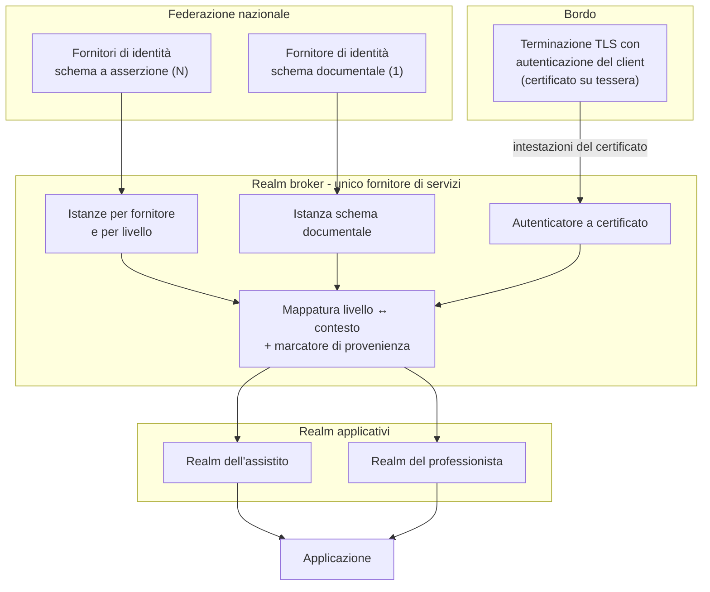

# Identità e accessi

> **Presupposto di lettura.** La differenza fra autenticazione, autorizzazione e identità, i
> fattori di autenticazione, la sessione, l'autorizzazione per ruoli e per attributi e la
> rottura del vetro sono trattati in
> [10 §12 - Crittografia e sicurezza, §8](../10_fondamenti/12-crittografia-e-sicurezza.md).
> Gli identificatori dell'assistito e del professionista in Italia sono in
> [10 §04 - Identità e anagrafiche](../10_fondamenti/04-identita-e-anagrafiche.md).
> Qui si descrive che cosa questo sistema fa, e perché.

## 1. La domanda a cui questo capitolo risponde

Non è «come si fa l'accesso». È: **quando il registro dice che l'assistito X è stato consultato
dal professionista Y, che cosa esattamente è stato verificato, da chi, e con quale forza?**

Da questa domanda discende tutto il capitolo, perché la risposta non è la stessa in tutti i
casi. In alcuni casi l'autenticazione è stata **eseguita** da questo sistema contro la
federazione nazionale delle identità; in altri è stata **riferita** da un sistema terzo che
dichiara di averla eseguita. Le due cose non sono equivalenti, e un registro che non le
distingua produce un'affermazione che non regge in sede di accertamento.

## 2. Il progetto non è accreditato, e questo cambia il perimetro

**Vincolo [V-05](../11_registri/01-vincoli-in-vigore.md#v-05), che governa l'intero capitolo.** Un progetto software non può essere
accreditato presso la federazione nazionale delle identità digitali. Il fornitore di servizi,
ai sensi del DPCM 24 ottobre 2014, art. 1, comma 1, lettera i), è chi **eroga servizi in rete**,
e la convenzione con l'agenzia impegna a dichiarare l'elenco dei servizi attivi: **è chi
installa, mai il progetto**.

Ne discendono tre conseguenze operative.

1. L'obiettivo del prodotto è essere **conforme e verificabile in integrazione continua**, non
   essere un'installazione accreditata. La forma della verifica è l'esecuzione, in pipeline,
   della suite di conformità del fornitore di servizi, comprese le prove di resistenza agli
   attacchi di avvolgimento della firma XML, che sono la classe di attacchi che storicamente
   ha compromesso le implementazioni del protocollo di asserzione.
2. Nessun documento del progetto può dichiarare o lasciare intendere un accreditamento. La
   formula corretta è «predisposto per», mai «accreditato».
3. Gli adempimenti procedurali - deposito del documento di metadata, certificato emesso
   dall'infrastruttura a chiave pubblica dell'agenzia, convenzione, motivazione dei livelli
   scelti - sono di chi installa. Il progetto li **documenta come manuale operativo** e ne
   fornisce gli artefatti tecnici. Vedi [09](./09-ripartizione-delle-responsabilita.md).

## 3. I livelli di garanzia e la loro corrispondenza internazionale

I tre livelli della federazione nazionale sono definiti dal regolamento sulle modalità
attuative, che li mappa **esplicitamente** sulla norma internazionale ISO/IEC 29115:

| Livello nazionale | ISO/IEC 29115 | Fattori richiesti |
|---|---|---|
| Livello 1 | **LoA2** | Fattore singolo |
| Livello 2 | **LoA3** | Due fattori, **non** necessariamente basati su certificati digitali |
| Livello 3 | **LoA4** | Due fattori **basati su certificati digitali**, con custodia delle chiavi private su dispositivo conforme all'Allegato II del Regolamento (UE) 910/2014 |

Gli identificatori del contesto di autenticazione sono URI con schema `https` e senza barra
finale, nella forma `https://www.spid.gov.it/SpidL1|L2|L3`. **La stessa terna è riusata dallo
schema di identità basato sulla carta d'identità elettronica**, che lo dichiara espressamente
per agevolare gli sviluppi di chi ha già aderito alla federazione.

La corrispondenza con i livelli europei - sostanziale e elevato ai sensi dell'art. 8, par. 2,
del Regolamento (UE) 910/2014 - è quella comunemente assunta, **ma non è enunciata testualmente
nel regolamento sulle modalità attuative**: `[NV]`. Se serve una dichiarazione formale, deve essere
verificata da `COMP` sulla documentazione di notifica del regime in sede europea. Non va asserita qui.

### 3.1 Quale livello per i dati sanitari: la risposta scomoda

L'appendice metodologica del regolamento sulle modalità attuative, letta alla lettera, colloca
i **dati sensibili** - categoria che oggi corrisponde alle categorie particolari dell'art. 9 del
Regolamento (UE) 2016/679 - al **livello 3**. Nella prassi nazionale, però, l'accesso del
cittadino al fascicolo sanitario elettronico avviene con il **livello 2**.

La contraddizione è apparente, e va spiegata con precisione perché una documentazione che la
semplifichi in un senso o nell'altro sarebbe scorretta:

- l'appendice è introdotta dal testo con la formula «**a titolo esemplificativo**»: è
  metodologia proposta, non prescrizione;
- la stessa appendice riconosce «la facoltà della singola Amministrazione di definire criteri
  diversi in base alle diverse modalità di erogazione dei servizi e ai dati resi disponibili»;
- il regolamento prevede che l'agenzia pubblichi il livello da associare alle categorie di
  servizi omogenee. **Il documento che associa il livello alla categoria dei servizi sanitari
  non è stato reperito**: `[NV]`, va richiesto all'agenzia;
- il livello 3 richiede all'assistito un dispositivo crittografico. Imporlo per accedere a una
  televisita produrrebbe **esclusione di massa**, in tensione diretta con il vincolo di
  accessibilità [V6](../11_registri/03-vincoli-fondanti.md#v6) e con la finalità di equità del servizio. È una considerazione di sicurezza
  del paziente, non di comodità: un servizio inaccessibile alla popolazione che ne ha più
  bisogno non è un servizio più sicuro.

**Posizione del progetto - proposta, non norma.** Il livello è **configurabile per tenant e per
operazione**, mai cablato. È un requisito che discende direttamente dal fatto che il fornitore
di servizi «sceglie» il livello (DPCM 24 ottobre 2014, art. 6, comma 4) e deve **motivare la
scelta** in sede di convenzione. I valori proposti come predefinito:

| Operazione | Livello minimo proposto | Motivazione |
|---|---|---|
| Accesso dell'assistito alla propria sessione | Livello 2 | Allineamento alla prassi del fascicolo; due fattori; nessun trattamento dispositivo su terzi |
| Consultazione dei propri documenti | Livello 2 | Idem |
| Consenso alla registrazione | Livello 2 | Atto revocabile, non dispositivo su terzi |
| Accesso del professionista a dati di **altri** soggetti | Livello 2 come minimo, livello 3 configurabile | Qui l'appendice metodologica morde davvero: si accede a dati di terzi |
| Amministrazione del tenant: gestione utenze, chiavi, esportazioni massive | Livello 3 raccomandato | Accesso a materiale riservato con effetto sull'intera installazione |

**Vincolo economico da dichiarare a chi installa**: richiedere anche un solo attributo oltre
l'anagrafica di base sposta il corrispettivo per accesso da 0,4 € a 3,5 € secondo la tabella
dei corrispettivi allegata alla determinazione dell'agenzia. Un requisito di prodotto che
chiedesse attributi non necessari moltiplicherebbe per quasi nove il costo d'esercizio di chi
installa. È un argomento di minimizzazione che ha, per una volta, anche un prezzo esplicito.

### 3.2 Il livello sta in `acr`, mai nella delega

**Questa è la regola più fraintesa dell'intero capitolo, e la sua violazione è silenziosa.**

Il claim `act` definito da RFC 8693 §4.1 esprime la **delega**: identifica *chi agisce* per
conto del soggetto. Il livello di garanzia è una proprietà **dell'autenticazione del soggetto**,
non dell'attore che agisce per suo conto. Metterlo dentro `act` è un abuso semantico che
produce un token il cui significato dipende da una convenzione locale e che nessun consumatore
esterno interpreta correttamente.

**Il livello sta in `acr`**, che è claim standard di OpenID Connect, e **la delega sta in
`act`**, che è claim standard di RFC 8693. I due non si mescolano. È la posizione già assunta
dalla decisione D38 del progetto e recepita qui senza modifiche.

## 4. Autenticazione eseguita e autenticazione riferita

Il claim `acr`, da solo, non dice **chi** ha eseguito la verifica. In un sistema che accetta
identità federate da integratori questo è il punto in cui l'audit diventa fuorviante.

| Scenario | Chi ha autenticato la persona | Che cosa significa `acr` nel token emesso |
|---|---|---|
| L'assistito si autentica su Telemedic con la federazione nazionale | Telemedic | `acr` è **autoritativo**: il sistema ha richiesto ed eseguito l'autenticazione |
| Il professionista è autenticato dal sistema di identità dell'integratore e l'identità arriva per scambio di token | L'integratore | `acr` è **riferito**: il sistema riporta ciò che il token in ingresso asserisce, non ciò che ha verificato |

Copiare il livello del token in ingresso nel token emesso **senza qualificarlo** farebbe
apparire come verificata dal progetto un'autenticazione che il progetto non ha eseguito. In un
sistema il cui registro deve rispondere alla domanda «chi ha garantito l'identità di questa
persona», è la differenza fra un registro utile e uno ingannevole.

**Marcatore proprietario - proposta di progetto.** Il progetto introduce un'estensione
proprietaria che accompagna `acr` e ne dichiara la provenienza. Non è un claim standard e va
documentata come estensione, non presentata come tale.

```json
{
  "iss": "https://<installazione>/realms/clinic",
  "aud": "telemedic-api",
  "sub": "<identificativo opaco del soggetto>",
  "acr": "urn:telemedic:acr:asserted-by-issuer",
  "auth_source": {
    "kind": "federated-partner",
    "iss": "https://<idp-dell-integratore>",
    "acr_asserted": "https://www.spid.gov.it/SpidL2",
    "verified_by_telemedic": false
  },
  "act": {
    "sub": "<identificativo del client dell'integratore>",
    "iss": "https://<installazione>/realms/clinic"
  },
  "tenant": "<identificativo di tenant>",
  "scope": "<ambiti concessi>"
}
```

Per confronto, il token emesso quando è il progetto ad aver autenticato la persona:

```json
{
  "iss": "https://<installazione>/realms/patient",
  "aud": "telemedic-api",
  "sub": "<identificativo opaco del soggetto>",
  "acr": "https://www.spid.gov.it/SpidL2",
  "auth_source": {
    "kind": "national-federation",
    "channel": "<canale>",
    "idp": "<alias del fornitore di identità>",
    "acr_requested": "https://www.spid.gov.it/SpidL2",
    "acr_asserted": "https://www.spid.gov.it/SpidL2",
    "verified_by_telemedic": true
  },
  "tenant": "<identificativo di tenant>"
}
```

**Le quattro regole di autorizzazione che ne discendono** - proposta di progetto, pubblicate
come vincolo [V-154](../11_registri/01-vincoli-in-vigore.md#v-154):

1. Un'operazione che la normativa lega all'**autenticazione forte** ai sensi dell'art. 64 del
   Codice dell'amministrazione digitale - accesso al fascicolo, accesso a infrastrutture
   nazionali - **richiede autenticazione eseguita**. Un livello riferito da terzi non la
   soddisfa, per quanto elevato sia il valore asserito.
2. Un'operazione clinica interna - avviare un consulto, redigere un documento - può accettare
   l'identità riferita, **purché** il registro di fiducia del tenant lo consenta esplicitamente
   e il livello riferito raggiunga la soglia configurata.
3. La configurazione «quali livelli esterni sono accettati per quale operazione» è **per
   tenant** e fa parte del contratto di integrazione, non del codice.
4. Ogni riga del registro riporta `acr`, la provenienza e la delega per intero. È il minimo per
   rispondere alla domanda «quale sistema ha agito per conto di quale persona, con quale
   garanzia di identità».

**Il livello propagato è quello richiesto, non quello asserito** (vincolo [V-165](../11_registri/01-vincoli-in-vigore.md#v-165) dell'area di
integrazione, che quest'area recepisce). Ne discende un obbligo di registrazione doppia:
`acr_requested` e `acr_asserted` sono **entrambi** conservati, sempre. La ragione è nel §5.

## 5. Il livello asserito può essere non informativo

Le regole tecniche dello schema basato sulla carta d'identità elettronica dichiarano che
l'elemento del contesto di autenticazione **nella risposta è sempre valorizzato con il livello
3**, «poiché la CIE fornisce un livello di affidabilità massimo a livello europeo».

Se questa formulazione è quella corrente - e va verificata empiricamente in preproduzione
prima di dichiarare in documentazione pubblica come il progetto propaga il livello: `[NV]`,
questione [Q-153](../11_registri/02-questioni-aperte.md#q-153) della bacheca - ne discendono tre conseguenze che non sono cosmetiche:

1. **Il fornitore di servizi non può dedurre dalla risposta con quale fattore la persona si sia
   effettivamente autenticata.** Un accesso con sola password e un accesso con carta e codice
   producono la stessa asserzione. La sola leva è **la richiesta**.
2. **Il claim propagato a valle diventa non informativo se derivato meccanicamente
   dall'asserzione.** La mappatura deve derivare il livello **da quello richiesto** e registrare
   **entrambi**. È l'unico modo per rispettare l'auditabilità non ripudiabile senza affermare
   il falso.
3. **L'innalzamento di livello non è verificabile dal lato del fornitore di servizi.** Se il
   servizio richiede il livello 2 e la persona accede con il livello 1, il rifiuto deve venire
   dal fornitore di identità: il fornitore di servizi non ha modo di accorgersene a posteriori.

Resta aperta una verifica ulteriore, di costo quasi nullo e sul percorso critico: **non è
verificato** se il prodotto di federazione, agendo da client verso un fornitore di identità
esterno, inoltri il parametro di livello richiesto attraverso il realm di intermediazione. Se
non lo inoltra, l'innalzamento di livello per operazione non è ottenibile per sola
configurazione. È la questione [`Q-160`](../11_registri/02-questioni-aperte.md#q-160) della bacheca, aperta dall'`INTEG`, e la
[Q-153](../11_registri/02-questioni-aperte.md#q-153) aperta da quest'area.

## 6. Il realm broker

**Proposta di progetto già recepita nella base architetturale.** Un realm dedicato è l'**unico
fornitore di servizi verso la federazione nazionale**; i realm applicativi - quello del
professionista e quello dell'assistito - vi si federano internamente.



| Vantaggio | Perché conta |
|---|---|
| Un solo identificativo di entità, un solo documento di metadata, un solo procedimento | Il procedimento amministrativo è il rischio dominante di chi installa: dimezzarne l'esposizione è la scelta di maggiore effetto |
| Un solo punto di conformità | La suite di verifica gira su un realm solo |
| Separazione fra federazione e autorizzazione | I realm applicativi mantengono ruoli, gruppi e politiche distinti |
| Estensibilità | Un canale futuro si aggiunge nel broker senza toccare i realm applicativi |
| Sostituibilità | Chi installa ed è aggregato di un aggregatore sostituisce il broker senza modificare l'applicazione |

Costi da dichiarare onestamente: un salto di reindirizzamento in più, irrilevante rispetto al
tempo di autenticazione e **senza alcun effetto sull'obiettivo di latenza del media**, che
riguarda un percorso diverso; la propagazione del livello attraverso l'intermediazione **non è
automatica** e va implementata e verificata (§5); un realm in più da amministrare, aggiornare e
sottoporre a copia di sicurezza, che si governa con la configurazione trattata come codice e
non a mano; la disconnessione va propagata su tre livelli.

### 6.1 Chi entra da dove

| Soggetto | Realm | Canale |
|---|---|---|
| Assistito cittadino | Assistito | Federazione nazionale, livello 2, via broker |
| Professionista di un tenant pubblico | Professionista | Federazione nazionale o **certificato su tessera sanitaria**, via broker |
| Professionista di un tenant privato integrato | Professionista | Identità dell'integratore, per scambio di token: **nessun secondo accesso** |
| Sistema dell'integratore | Professionista | Credenziali di client con asserzione firmata da chiave privata |
| Amministratore di tenant | Professionista | Livello 3 o certificato su tessera, configurabile |

Il vincolo «nessuna imposizione del sistema di identità» e la decisione di includere la
federazione nazionale nella v1.0 **non sono in contraddizione**: sono due percorsi per due
popolazioni diverse. Il professionista che lavora dentro il gestionale dell'integratore non
deve passare dalla federazione nazionale; la persona che accede al proprio consulto da un
portale pubblico deve. Una documentazione che li confonda produce requisiti impossibili.

### 6.2 Il registro di fiducia deve essere unico

**Proposta di progetto con conseguenza di sicurezza diretta.** Il modello di fiducia verso
l'integratore è **per tenant**: emittenti ammessi, indirizzo del materiale di chiave pubblica,
algoritmi ammessi, destinatario atteso, mappatura dei claim. Lo **stesso** insieme deve
alimentare anche:

- le origini ammesse per l'incorporamento del componente;
- le origini ammesse per la condivisione di risorse fra origini;
- le destinazioni ammesse dei messaggi in uscita verso l'integratore;
- l'elenco consentito del mediatore unico di uscita ([06 §8](./06-sicurezza-applicativa.md)).

Tre registri separati divergono, sempre, e **la divergenza è sistematicamente a favore di chi
attacca**: l'origine rimossa da un elenco e non dall'altro resta valida sul secondo. La forma
concreta del registro - una sola tabella, una sola configurazione, un solo punto di verifica -
è **decisione di architettura**, e quest'area la apre come questione ([Q-156](../11_registri/02-questioni-aperte.md#q-156)) invece di
deciderla.

## 7. I tre difetti del prodotto di federazione, trattati come rischi

Il prodotto di federazione adottato presenta tre difetti documentati **che non appartengono ai
connettori nazionali ma al prodotto stesso**, e che in ambito sanitario non sono veniali. Sono
trattati come **rischi di prodotto ai sensi della norma sulla gestione del rischio dei
dispositivi medici**, con controlli di rischio obbligatori e verifica dell'efficacia, non come
note di configurazione.

| # | Difetto | Perché è grave qui |
|---|---|---|
| **R-IAM-01** | **L'utente federato può modificare i propri attributi.** Dopo l'accesso può raggiungere il portale dell'account e cambiare nome, indirizzo di posta, credenziale. Bloccare il portale non basta: le interfacce di amministrazione restano invocabili. La modalità di sincronizzazione forzata ripristina i dati al **prossimo** accesso, non nel frattempo | Un'identità autenticata dalla federazione nazionale potrebbe presentare **attributi anagrafici alterati dall'utente stesso**. In un sistema che produce documentazione clinica e un registro non ripudiabile, è inaccettabile: significa che l'identità del firmatario di un documento potrebbe non essere quella verificata |
| **R-IAM-02** | **Le modifiche dell'indirizzo di posta non sono verificate.** L'utente può cambiarlo senza alcun meccanismo di verifica del possesso. Il problema è segnalato negli strumenti di tracciamento del prodotto da anni senza risoluzione | L'indirizzo di posta è canale di recapito di notifiche e, in molte configurazioni, di recupero della credenziale. Un cambio non verificato è un percorso di appropriazione dell'account |
| **R-IAM-03** | **L'utente federato è anche utente locale**: può impostarsi una credenziale locale e accedere con quella mantenendo gli attributi ottenuti dalla federazione | Il canale più debole determina la sicurezza dell'account. Una persona che accede oggi con il livello 2 della federazione può accedere domani con una password che si è impostata da sé, e il registro registrerebbe un'identità federata |

**Controlli di rischio obbligatori.** Sono requisiti, non raccomandazioni, e ciascuno ha una
prova che ne verifica l'efficacia:

1. **Nel realm broker**: console dell'account **disabilitata**; modifica del nome utente
   disattivata; profilo utente con gli attributi anagrafici in **sola lettura per l'utente**,
   sfruttando i permessi per attributo della dichiarazione di profilo.
2. **Nessuna credenziale locale nel realm broker**: nessun flusso di concessione diretta,
   nessun flusso di navigazione con modulo di nome utente e password. L'unico modo di
   autenticarsi è un fornitore di identità federato o l'autenticatore a certificato.
3. **Sincronizzazione forzata** su tutti i fornitori di identità: gli attributi anagrafici
   sono riscritti a ogni accesso dalla fonte autoritativa.
4. **Marcatore di provenienza** propagato come claim, e **politica di autorizzazione che
   rifiuta le sessioni prive di fornitore federato**. È il controllo che neutralizza R-IAM-03
   anche se la configurazione 2 viene aggirata.
5. **Prove di sicurezza in integrazione continua** che verifichino: (a) che le interfacce di
   modifica dell'utente rispondano con rifiuto per un utente federato; (b) che un tentativo di
   accesso locale fallisca; (c) che le intestazioni del certificato client iniettate
   dall'esterno **non vengano onorate**.

I punti (a) e (c) sono i due che, se non provati, restano silenziosamente rotti. Il punto (c) in
particolare: se l'applicazione si fida di un'intestazione che dichiara il certificato del
client, e quell'intestazione può essere impostata da chiunque raggiunga l'applicazione
scavalcando il punto di terminazione, l'intera autenticazione a certificato è falsificabile con
una richiesta.

## 8. Autenticazione a certificato e revoca a fallimento chiuso

Il terzo canale - l'autenticazione con certificato su tessera sanitaria - è l'unico previsto
dall'art. 64 del Codice dell'amministrazione digitale **privo di dipendenze da procedimenti
esterni**: non richiede convenzione né accreditamento presso una federazione, perché la fiducia
è ancorata alle autorità di certificazione riconosciute. È per questo il canale completabile al
100% nella v1.0.

Meccanismo: la terminazione TLS al bordo esegue l'autenticazione mutua, verifica la catena, e
propaga il certificato all'applicazione, che ne estrae l'identificativo fiscale con
un'espressione documentata e lo mappa sull'attributo di identità.

**La convergenza dei tre canali sullo stesso attributo di identità è una scelta deliberata**:
un professionista che accede oggi con la tessera e domani con lo schema documentale è lo stesso
soggetto, con lo stesso registro. È ciò che rende utile il multicanale invece di generare tre
anagrafiche parallele. Ma ha una conseguenza di sicurezza da scrivere per esteso: **se tre
canali convergono sullo stesso soggetto, il canale più debole determina la sicurezza del
soggetto.** Ne discende che:

- ogni canale porta il proprio livello, e l'autorizzazione valuta **il livello della sessione
  corrente**, non il livello massimo mai raggiunto dal soggetto;
- il soggetto **non deve avere credenziali locali** (§7, controllo 2);
- ogni sessione registra **con quale canale** è stata aperta.

### 8.1 La revoca è il punto debole, e va risolta a fallimento chiuso

Un certificato è valido finché non è revocato, e la revoca è informazione che vive **fuori** dal
certificato. Le due strade sono l'elenco di revoca e l'interrogazione puntuale sullo stato.
Entrambe introducono una dipendenza da un servizio esterno al momento dell'accesso, e la
domanda che conta è: **che cosa si fa quando quel servizio non risponde?**

**Regola del progetto: fallimento chiuso.** Se lo stato di revoca non è determinabile,
l'accesso è **negato**. Non è la scelta più comoda ed è l'unica difendibile in ambito sanitario:
la scelta opposta - accettare in caso di indisponibilità del servizio di verifica - trasforma
un'interruzione del servizio di revoca in una finestra di validità per un certificato revocato,
e chi ha interesse a usare un certificato revocato ha interesse a provocare quell'interruzione.

Ne discendono tre requisiti operativi:

1. **La configurazione predefinita è a fallimento chiuso**, e la deviazione è possibile ma
   **rilevata e registrata**, non silenziosa.
2. **L'indisponibilità del servizio di revoca è un evento monitorato**, con allarme: è
   indistinguibile, dal punto di vista dell'utente, da un guasto del sistema, e va diagnosticata
   come tale.
3. **Esiste un percorso alternativo dichiarato** per il professionista che non riesce ad
   accedere: un altro canale di autenticazione, non una deroga alla verifica. Il fallimento
   chiuso senza alternativa è una negazione di servizio autoinflitta.

La scelta fra elenco di revoca e interrogazione puntuale, con i rispettivi effetti su latenza,
freschezza dell'informazione e disponibilità, è **decisione di architettura** e quest'area non
la assume.

## 9. Autorizzazione: il ruolo non basta

Il modello è **basato sui ruoli con estensioni per attributi**. La parte a ruoli risponde alla
domanda «che genere di operazioni può fare questa persona»; la parte ad attributi risponde alla
domanda che conta davvero contro l'avversario primario: **«può farle su questo soggetto?»**

**Essere medico non è titolo per accedere a un assistito qualsiasi.** L'autorizzazione
sull'oggetto si fonda sulla **relazione di cura**, che è un fatto con validità temporale - non
un attributo permanente della persona - ed è verificata al momento dell'accesso, non al momento
dell'assegnazione del ruolo.

Le fonti della relazione di cura, in ordine di forza:

| Fonte | Forza | Nota |
|---|---|---|
| Presa in carico attiva nella prestazione | Massima | È il caso ordinario |
| Appuntamento programmato entro una finestra dichiarata | Alta | La finestra è configurazione di tenant, non costante di codice |
| Appartenenza all'équipe che ha in carico il soggetto | Alta | Richiede un modello esplicito di équipe con validità temporale |
| Delega esplicita da parte di un altro professionista | Media | Va tracciata come atto, con scadenza |
| Consenso o delega di accesso da parte dell'assistito | Media | Ricade nel contesto del consenso, non in quello dell'identità |
| **Accesso d'emergenza** | Eccezionale | §10 |

Tre regole ulteriori, tutte con effetto sul modello di autorizzazione:

- **Il ruolo è una relazione fra persona e organizzazione con validità temporale**, non un
  attributo della persona: la cessazione del rapporto revoca l'autorizzazione senza richiedere
  un intervento sull'utenza.
- **Il contesto di tenant è verificato al confine di ogni contesto applicativo.** Nessuna
  interrogazione senza tenant risolto. È il presupposto della prova negativa fra tenant di
  [06 §5](./06-sicurezza-applicativa.md).
- **Separazione completa fra utenze privilegiate e non privilegiate**: nessuna operazione
  ordinaria eseguibile con un'utenza amministrativa e viceversa. Le utenze amministrative sono
  **nominative**, mai condivise, e il secondo fattore su di esse è imposto, non offerto.

## 10. L'accesso d'emergenza è un requisito, non un'eccezione

**Vincolo [V-153](../11_registri/01-vincoli-in-vigore.md#v-153).** In sanità esistono situazioni in cui l'accesso al dato è necessario e la
relazione di cura non è ancora formalizzata: un soggetto in condizione critica, un turno
sostitutivo non registrato, un guasto della componente che gestisce le prese in carico.

Un sistema che non preveda questo percorso ottiene **il risultato opposto a quello voluto**: le
strutture creano utenze condivise, si scambiano credenziali, mantengono ruoli sovradimensionati
«per sicurezza». La conseguenza è che l'insider non è più distinguibile e che il registro perde
valore. **L'accesso d'emergenza non indebolisce il controllo: lo rende osservabile.**

Requisiti, tutti obbligatori e tutti verificabili:

1. **Motivazione libera obbligatoria**, digitata dalla persona. Non un elenco a tendina: un
   elenco a tendina produce sempre la stessa voce e non è utile in sede di riesame.
2. **Avviso esplicito prima dell'atto**, che dichiari che l'accesso sarà registrato e
   sottoposto a riesame. È il singolo elemento più efficace nel ridurne l'uso improprio.
3. **Finestra temporale limitata e perimetro limitato**: l'accesso vale su quel soggetto, per
   quella durata. Scade da solo.
4. **Notifica contestuale** al responsabile designato dal tenant e, dove il tenant lo configura,
   **all'assistito**.
5. **Riesame obbligatorio con esito registrato.** Il riesame non è facoltativo e il suo esito -
   giustificato, non giustificato, in accertamento - è esso stesso una riga del registro. Un
   accesso d'emergenza mai riesaminato è peggio di un accesso ordinario, perché ha prodotto
   l'illusione di un controllo.
6. **Contatore e soglia**: la frequenza dell'accesso d'emergenza per attore e per unità di
   tempo è un indicatore di rilevazione ([04 §7](./04-tracciamento.md)). Un professionista che
   lo usa quotidianamente sta usando un percorso di eccezione come percorso ordinario, e questo
   è un difetto di configurazione dei ruoli prima che un abuso.

## 11. Sessione e credenziali

- **La sessione dell'applicazione è distinta dalla sessione della federazione**, e la sua durata
  è configurabile per tenant. Una sessione clinica lunga è un rischio, una sessione corta in
  mezzo a una visita è un evento clinico: il compromesso si governa con la riautenticazione
  **sulle operazioni sensibili**, non con la scadenza aggressiva della sessione.
- **La disconnessione si propaga** dal broker ai realm applicativi per canale posteriore. Verso
  la federazione nazionale la disconnessione globale **non esiste**: va detto a chi installa,
  perché è una domanda che si presenta in ogni valutazione.
- **Nessuna credenziale predefinita** in alcun componente distribuito, e cambio obbligatorio
  al primo accesso dove una credenziale iniziale è inevitabile.
- **Blocco dell'utenza** dopo un numero configurabile di tentativi falliti, con **ogni tentativo
  fallito registrato**. La soglia è configurazione di tenant: una soglia troppo bassa su un
  servizio pubblico è una negazione di servizio a costo zero per chi attacca.
- **Le credenziali di servizio fra componenti** non sono segreti condivisi longevi: sono
  asserzioni firmate da chiave privata, con rotazione documentata. Vedi
  [03 §4](./03-protezione-dei-dati.md).

## 12. Che cosa quest'area lascia aperto

| Riferimento | Questione | A chi |
|---|---|---|
| [Q-153](../11_registri/02-questioni-aperte.md#q-153) | Verifica empirica dell'inoltro del contesto di autenticazione richiesto attraverso il broker e della sua traduzione nel protocollo di federazione. **Bloccante prima di dichiarare pubblicamente come si propaga il livello** | Integrazione, architettura |
| [Q-156](../11_registri/02-questioni-aperte.md#q-156) | Forma concreta del registro di fiducia unico per tenant (§6.2): una sola configurazione che alimenti federazione, origini di incorporamento, condivisione fra origini, destinazioni dei messaggi in uscita ed elenco consentito del mediatore | Architettura |
| `[NV]` | Documento dell'agenzia che associa il livello di garanzia alla categoria dei servizi sanitari (§3.1) | Da chiedere all'agenzia SPID |
| `[NV]` | Mappatura formale fra i livelli nazionali e i livelli europei, che il regolamento non enuncia testualmente (§3) | `COMP` sulla documentazione di notifica |
| `[NV]` | Conferma che il livello nella risposta dello schema documentale sia effettivamente sempre il massimo (§5) | Q-153 - verifica empirica in preproduzione |
| - | Scelta fra elenco di revoca e interrogazione puntuale dello stato del certificato (§8.1) | Architettura |
