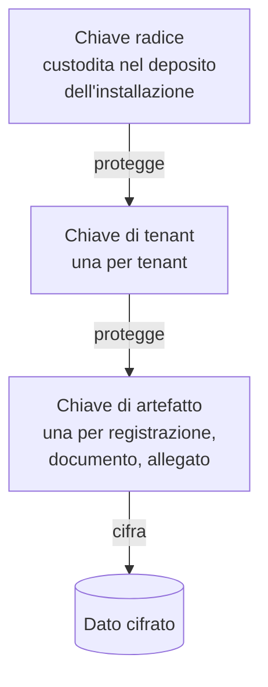

# Protezione dei dati

> **Presupposto di lettura.** Che cosa proteggono davvero la cifratura in transito e la
> cifratura a riposo, perché sono due misure contro due minacce diverse, che cosa significa
> cifratura autenticata, perché la gestione delle chiavi è il problema vero e non un dettaglio
> operativo: [10 §12 — Crittografia e sicurezza, §§3, 4, 7](../10_fondamenti/12-crittografia-e-sicurezza.md).
> Qui si descrivono le scelte di questo sistema, i loro limiti e i punti in cui il dato è in
> chiaro comunque.

## 1. Regola redazionale: nessun parametro crittografico inventato

Questo capitolo **non contiene** lunghezze di chiave, nomi di suite crittografiche, curve,
durate di validità o soglie di robustezza. Non per prudenza redazionale: per una ragione di
merito, che va enunciata perché è controintuitiva.

Un parametro crittografico scritto in un documento di architettura ha tre difetti. **Invecchia**
— la stessa scelta che oggi è stato dell'arte fra tre anni è debole, e il documento resta.
**Non è verificabile dal lettore** — chi legge non ha modo di sapere se il numero proviene da
una raccomandazione o dall'abitudine di chi ha scritto. **Compete con la fonte** — se il
documento dice una cosa e la raccomandazione dell'ente competente ne dice un'altra,
l'installazione si trova con due obblighi.

**Regola del progetto.** I parametri crittografici sono **configurazione**, non documentazione,
e la configurazione predefinita si allinea alle raccomandazioni vigenti degli enti competenti:
le pubblicazioni dell'istituto europeo di normazione delle telecomunicazioni sulle suite
crittografiche per le firme elettroniche; gli accordi di riconoscimento europei in materia di
valutazione della sicurezza; le linee guida dell'agenzia nazionale per l'Italia digitale e
dell'agenzia per la cybersicurezza nazionale. **Il riferimento puntuale alla revisione vigente
di ciascuna raccomandazione, con l'estremo esatto e la data, non è stato verificato su fonte
primaria in questa stesura: `[NV]`.** Va accertato prima della pubblicazione della matrice di
conformità, e va accertato ogni volta che la matrice viene riemessa.

Questa regola chiude anche un punto di comunicazione che il progetto ha già corretto: il
riferimento a uno standard **statunitense** di validazione dei moduli crittografici è stato
rimosso dal materiale pubblico (decisione D19). Non è un requisito dell'Unione, non conferisce
alcuna presunzione di conformità europea, ed è in tensione con il posizionamento di sovranità
del dato.

## 2. Cifratura in transito

### 2.1 L'obbligo, che qui è esplicito

L'obbligo di cifrare non è, in questo dominio, un'inferenza dall'art. 32 del Regolamento (UE)
2016/679. È scritto: l'**Accordo Stato-Regioni del 17 dicembre 2020, rep. atti n. 215/CSR**,
recante le indicazioni nazionali per l'erogazione di prestazioni in telemedicina, dispone che
**tutti i trasferimenti di voce, video, immagini e file devono essere crittografati**.

Quattro parole, quattro categorie. Ne discende che la copertura deve essere **totale e non
selettiva**: non basta cifrare il media e lasciare in chiaro il canale su cui si scambiano gli
allegati, non basta cifrare la sessione e lasciare in chiaro il canale di controllo. Ogni
canale che trasporta una delle quattro categorie è dentro l'obbligo.

Convergono sullo stesso punto: la misura sulla protezione dei dati in transito delle specifiche
di base dell'autorità nazionale per la cybersicurezza (codice `PR.DS-02`) e quella sulle
comunicazioni protette riservata ai soggetti essenziali (`PR.IR-03`) — il **contenuto puntuale
dei relativi requisiti non è citato qui**, per la ragione esposta in
[08 §2](./08-quadro-normativo-e-misure.md); i requisiti R13, R24 e R36 dell'appendice sui
requisiti di sicurezza eleggibili delle linee guida nazionali sulla sicurezza negli
approvvigionamenti informatici, resi obbligatori per le infrastrutture regionali di
telemedicina dal DM 21 settembre 2022; l'Allegato I, Parte I, del Regolamento (UE) 2024/2847,
che impone la protezione della riservatezza mediante cifratura in transito e a riposo secondo
lo stato dell'arte.

### 2.2 I canali e ciò che li protegge

| Canale | Che cosa trasporta | Protezione |
|---|---|---|
| Interfacce applicative e interfaccia utente | Contenuto clinico, metadati, allegati | Trasporto cifrato esclusivo; **nessun canale in chiaro esposto**, nemmeno per reindirizzamento |
| Segnalazione della sessione | Descrittori della sessione, candidati di connettività, identificativi | Stesso canale delle interfacce applicative |
| Media punto a punto | Voce, video, dati della sessione | Cifratura fino agli estremi con materiale derivato dalla stretta di mano ([05](./05-sicurezza-del-tempo-reale.md)) |
| Media attraverso il relay | Pacchetti già cifrati | Il relay inoltra pacchetti già protetti: **non li decifra** ([05 §4](./05-sicurezza-del-tempo-reale.md)) |
| Messaggi in uscita verso l'integratore | Identificativi e riferimenti, **mai contenuto clinico** (V-21) | Trasporto cifrato, **firma asimmetrica** del messaggio (V-22) |
| Verso infrastrutture nazionali e regionali | Documenti e metadati | Secondo il profilo dell'infrastruttura, tramite il mediatore unico di uscita |
| Fra componenti interni | Tutto | Trasporto cifrato anche all'interno del perimetro: la rete interna non è un confine di fiducia |
| Amministrazione remota | Comandi e configurazioni | Esclusivamente su canali sicuri, con utenze nominative e secondo fattore |

Due regole trasversali.

**Il declassamento è impedito, non sconsigliato.** Non esiste una configurazione supportata che
accetti un trasporto non cifrato per un canale che trasporta una delle quattro categorie. Una
configurazione che lo tentasse viene rifiutata all'avvio, non segnalata come avviso.

**La verifica della conformità del trasporto è automatizzata in integrazione continua**, con
una soglia dichiarata e con blocco del rilascio al di sotto di essa. È l'unico modo in cui
un'affermazione sul trasporto resta vera dopo il primo aggiornamento di libreria.

### 2.3 Non si dichiara la versione negoziata: la si misura

**Vincolo V-156.** Il progetto **non dichiara** in documentazione quale versione di protocollo o
quale suite crittografica sia in uso su una sessione. **La misura per sessione e la registra.**

La ragione è che una parte della negoziazione avviene fra due estremi che il progetto non
controlla — il browser dell'assistito e quello del professionista — e il cui comportamento
dipende dal motore, dalla versione, dalla configurazione della libreria crittografica
sottostante e da impostazioni sperimentali. Il quadro accertato nella ricerca di verifica del
progetto è che due motori su tre negoziano per impostazione predefinita la versione più recente
del protocollo di trasporto per il datagramma, mentre per il terzo lo stato **non è
verificabile**: `[NV]`. In queste condizioni **qualunque affermazione statica in documentazione
sarebbe falsa per una parte del parco installato**.

Ne discendono tre requisiti:

1. Per ogni sessione media si registrano la **versione di protocollo effettivamente negoziata**
   e la **suite crittografica effettivamente in uso**, lette dalle statistiche esposte dal
   motore, e si conservano fra i metadati della sessione.
2. Il materiale pubblico non contiene affermazioni statiche sulla versione. Contiene
   l'affermazione verificabile: «la versione negoziata è misurata e registrata per ogni
   sessione, ed è consultabile».
3. Una versione negoziata al di sotto della soglia minima configurata dal tenant **produce un
   evento**, e la sessione può essere rifiutata secondo configurazione. È la sola forma di
   controllo che funzioni su un parametro che si negozia.

La stessa regola vale, per identità di ragione, per il trasporto delle interfacce applicative:
si misura e si registra ciò che è stato negoziato, invece di dichiarare ciò che si spera.

## 3. Cifratura a riposo

### 3.1 Che cosa protegge, e da chi

La cifratura a riposo protegge dal **furto del supporto** e dall'**accesso al supporto da parte
di chi non passa dall'applicazione**: l'operatore dell'infrastruttura, chi accede a una copia di
sicurezza, chi recupera un disco dismesso.

**Non protegge dall'insider applicativo**, che è l'avversario primario di questo sistema
([01 §3.1](./01-modello-di-minaccia.md)): l'insider passa dall'applicazione, l'applicazione ha
la chiave, e il dato gli arriva in chiaro perché è così che deve funzionare. Chi presenta la
cifratura a riposo come risposta all'accesso indebito sta descrivendo male la propria
architettura. La risposta all'accesso indebito è nel capitolo [02 §9](./02-identita-e-accessi.md)
e nel capitolo [04](./04-tracciamento.md).

### 3.2 I tre livelli e ciò che ciascuno copre

| Livello | Che cosa copre | Che cosa non copre |
|---|---|---|
| **Volume o disco** | Furto fisico del supporto, dismissione non bonificata | Tutto ciò che passa dal sistema operativo montato: se la macchina è accesa, il dato è leggibile |
| **Base dati** | Accesso ai file della base dati senza passare dal motore | Chi ha credenziali sul motore |
| **Applicativo, per artefatto** | Accesso al motore della base dati e all'archivio oggetti da parte di chi non possiede la chiave applicativa | Chi ha la chiave applicativa |

Il progetto prescrive il **primo e il terzo** come obbligatori sui dati clinici e sulle
registrazioni. Il secondo è raccomandato ed è, in molte distribuzioni, competenza di chi
installa.

Il livello applicativo per artefatto è quello che porta la proprietà che conta: **le chiavi
sono per tenant**, e la chiave è **separabile dal dato**. Ne discendono due conseguenze:

- la fuga di dati fra tenant (minaccia M-11) richiederebbe non solo un difetto di
  autorizzazione ma anche il possesso della chiave dell'altro tenant;
- la **cancellazione crittografica** diventa possibile: distruggere la chiave di un artefatto
  rende l'artefatto illeggibile ovunque si trovi, **comprese le copie di sicurezza già
  effettuate**. È il meccanismo su cui si fonda il §7.3.

### 3.3 Che cosa è cifrato a riposo

Contenuto clinico e documenti; registrazioni delle sessioni; allegati; il registro degli
accessi nella sua conservazione separata; le copie di sicurezza, **senza eccezioni**; il
materiale di chiave, custodito in un deposito distinto dai dati che protegge.

Che cosa **non** deve trovarsi in un archivio cifrato perché non deve trovarsi affatto: i dati
di prova che siano dati reali; il contenuto clinico dentro i log applicativi (V-150); il
contenuto clinico dentro i messaggi in uscita (V-21).

## 4. Gestione e rotazione delle chiavi

La gerarchia è a tre livelli, ed è deliberatamente semplice: **una gerarchia complessa non
viene mantenuta**.

| Livello | Chi la detiene | Rotazione | Effetto della rotazione |
|---|---|---|---|
| Chiave radice | Chi installa, nel proprio deposito | Secondo la politica di chi installa | Ricifratura delle sole chiavi di tenant: costo trascurabile |
| Chiave di tenant | L'installazione, per tenant | Programmata e su evento | Ricifratura delle sole chiavi di artefatto: costo proporzionale al numero di artefatti, non al loro volume |
| Chiave di artefatto | Generata alla creazione dell'artefatto | **Non ruota**: si distrugge | La distruzione è la cancellazione crittografica (§7.3) |

**Perché questa struttura e non la cifratura diretta con una chiave di tenant.** Perché la
rotazione della chiave di tenant, in quello schema, richiederebbe di rileggere e riscrivere
ogni registrazione video del tenant: un'operazione che, superata una certa dimensione, non viene
mai eseguita, e una rotazione che non viene mai eseguita non è una rotazione. Con la gerarchia a
tre livelli si ricifrano chiavi, non contenuti.

**Eventi che impongono rotazione immediata**, oltre alla programmata: sospetto di
compromissione; cessazione di un rapporto con accesso al materiale; dismissione di un componente
che deteneva la chiave; risultanza di un accertamento di sicurezza.

**Le chiavi di firma sono altra cosa.** La chiave con cui il progetto firma gli artefatti
distribuiti e la chiave con cui l'installazione firma i messaggi in uscita non ruotano con lo
stesso meccanismo, perché la loro rotazione richiede che i verificatori acquisiscano la nuova
chiave pubblica prima che la vecchia cessi. Ne discende che l'identificativo di chiave deve
essere **risolvibile dal materiale pubblico** (V-22) e che le due chiavi devono poter coesistere
durante una finestra di sovrapposizione dichiarata. Il segreto condiviso non è offerto come
modalità predefinita: non dà non ripudio e la sua rotazione richiede coordinamento con ciascun
integratore, cioè non avviene.

**I segreti non stanno nel codice, né nelle immagini, né nelle variabili d'ambiente di un file
versionato.** L'integrazione continua esegue analisi dei segreti a ogni proposta di modifica e
blocca l'integrazione al riscontro. Un segreto che sia comparso in una cronologia versionata è
**compromesso**, e la procedura è la rotazione, non la rimozione dalla cronologia: la rimozione
dalla cronologia non recupera le copie già distribuite.

**Perdere la chiave è perdere il dato.** Il rischio M-15 del modello di minaccia — perdita
irreversibile del materiale di chiave — è un rischio di **disponibilità di documentazione
sanitaria**, e va trattato con la stessa serietà della compromissione. Ne discende un requisito
che si dimentica: la procedura di ripristino da copia di sicurezza deve comprendere il
**ripristino del materiale di chiave**, e la prova periodica di ripristino deve verificare che
il dato ripristinato sia effettivamente **leggibile**, non solo presente.

## 5. L'inventario onesto dei punti in chiaro

Questa sezione esiste perché il suo contrario — il silenzio — è la forma più comune di
disonestà tecnica nella documentazione dei sistemi di comunicazione. **Un sistema che dichiara
la cifratura fino agli estremi e non elenca i punti in cui qualcosa è comunque visibile sta
lasciando dedurre una proprietà che non ha.**

| Punto | Che cosa vede | Che cosa non vede | Mitigazione |
|---|---|---|---|
| **Segnalazione della sessione** | Chi partecipa, quando, per quanto, con quale tenant; i descrittori di sessione e i candidati di connettività, **compresi gli indirizzi di rete locale** | Il contenuto audio-video | Trasporto cifrato; **conservazione breve** dei candidati; nessun candidato nei log di diagnostica; dichiarazione nell'informativa |
| **Server di relay** | **Gli indirizzi di rete di entrambe le parti**, il volume e l'andamento del traffico, la durata dell'allocazione | Il contenuto: inoltra pacchetti già cifrati | Relay **gestito da chi installa, nell'Unione**; nessuna etichettatura delle metriche con l'identificativo di sessione (V-155); conservazione breve dei log del relay |
| **Componente di registrazione** (solo in modalità con registrazione) | **Tutto**: la cifratura è terminata sul componente | — | La modalità è **distinta, dichiarata nel consenso e segnalata in modo persistente**: [05 §5](./05-sicurezza-del-tempo-reale.md) |
| **I due dispositivi** | Tutto ciò che l'utente vede e sente | — | Fuori dal controllo del progetto: **rischio residuo dichiarato** ([01 §6](./01-modello-di-minaccia.md)) |
| **Motore della base dati** | Il contenuto applicativo che gli passa | Ciò che è cifrato al livello applicativo | Cifratura per artefatto; separazione delle utenze; registro separato |
| **Mediatore unico di uscita** | Le destinazioni e il contenuto delle richieste in uscita | — | Nessun contenuto clinico (V-21); nessun identificativo dell'assistito verso la terminologia (V-151); [06 §8](./06-sicurezza-applicativa.md) |
| **Osservabilità e metriche** | Ciò che l'applicazione decide di mandarle | Ciò che l'applicazione non manda | **Divieto** di contenuto clinico e di identificativi diretti nei log di diagnostica (V-150) |

Due punti meritano di essere scritti per esteso, perché sono quelli che vengono attenuati.

**Il relay vede gli indirizzi di entrambe le parti.** Non è una vulnerabilità: è ciò che un
relay fa. Ma un indirizzo di rete è dato personale e, associato alla sessione, contribuisce a
rivelare dove si trovava una persona mentre era in visita. È una delle ragioni per cui il relay
è gestito da chi installa e collocato nell'Unione: la sua collocazione presso un terzo
soggetto a giurisdizione extraeuropea sarebbe un trasferimento, oltre che una dipendenza in
tensione con il vincolo di sovranità.

**La cifratura fino agli estremi non sopravvive a un'architettura con concentratore.** Nel
modello punto a punto la proprietà regge. Se in futuro si introducesse un componente che
ricombina i flussi per una sessione multiparte, l'affermazione «nessuna decifratura intermedia»
diventerebbe **falsa** salvo adozione di una cifratura applicativa del media indipendente dal
trasporto. È un punto di verità del materiale pubblico: non si scrive «fino agli estremi» per
un'architettura che potrebbe non esserlo in tutte le configurazioni.

## 6. Minimizzazione

La minimizzazione non è una virtù generica: qui è la difesa **principale** verso i terzi, perché
funziona **per assenza di dato** e non dipende dal comportamento del terzo.

**Il caso esemplare: il servizio esterno di terminologia.** È componente di terze parti a
runtime, non dipendenza di compilazione. Se è stabilito fuori dall'Unione, diventa un
trasferimento **nel momento in cui riceve dati riferibili a un assistito**. La difesa
contrattuale sarebbe fragile e verificabile solo a posteriori; la difesa architetturale è
definitiva: **le interrogazioni non portano mai identificativi dell'assistito** (vincolo
V-151). Un'interrogazione che chiede «esiste il codice X nel sistema Y» non è un trasferimento
di dato personale, indipendentemente da dove risponda il servizio. **La sovranità si soddisfa
per assenza di dato, non per collocazione.** Conseguenza correlata: **nessuna cache persistita
su disco**, sia per la ragione di licenza sia perché una cache persistente è un archivio non
inventariato.

Le altre applicazioni del principio, ciascuna con la sua verifica:

| Applicazione | Regola | Verifica |
|---|---|---|
| Anagrafica | **Non si duplica**: si lavora per riferimento con gli identificativi del dominio di chi integra | Ispezione del modello dati: assenza di attributi anagrafici non necessari |
| Messaggi in uscita | Trasportano identificativi e riferimenti, **mai contenuto clinico**; il contenuto si rilegge con una chiamata autenticata sotto l'autorizzazione del ricevente (V-21) | Ispezione degli schemi degli eventi pubblicati |
| Log di diagnostica | Nessun identificativo diretto dell'assistito, nessun contenuto clinico (V-150) | Analisi automatica dei log di un'esecuzione di prova contro un dizionario di schemi |
| Metriche infrastrutturali | Nessuna etichetta con l'identificativo di sessione (V-155) | Ispezione della configurazione dell'esportatore |
| Attributi richiesti alla federazione | Solo quelli necessari, per la ragione di §3.1 di [02](./02-identita-e-accessi.md) — che ha anche un prezzo | Confronto fra gli attributi dichiarati e quelli effettivamente usati |
| Riconoscimento biometrico | **Escluso per progettazione.** Il flusso video contiene il volto ma non è per ciò solo dato biometrico ai sensi dell'art. 4, punto 14: la qualificazione richiede un trattamento tecnico finalizzato all'identificazione univoca. Introdurlo aprirebbe una **seconda** via all'art. 9 con requisiti autonomi | L'esclusione è documentata, non implicita |
| Impostazioni predefinite | Registrazione **disattivata**; conservazione minima; telemetria a adesione esplicita; log senza contenuto clinico | Prova sulla configurazione iniziale |

## 7. Conservazione e cancellazione

### 7.1 Chi decide per quanto

**Il progetto non decide la conservazione: la rende configurabile per tenant e per tipo di
artefatto.** La ragione è che i termini hanno fonti diverse e non tutte generali: la
documentazione sanitaria segue obblighi propri, che variano per tipo di documento e in parte per
disciplina regionale; **i termini puntuali vanno confermati sulla normativa applicabile al
singolo cliente**: `[NV]`.

I due termini che il progetto **impone** come predefinito perché hanno fonte determinata sono
quelli del tracciamento, e stanno in [04 §5](./04-tracciamento.md): **24 mesi** per i log di
tracciabilità, **12 mesi** per i dati di accesso e autenticazione (vincolo V-152).

### 7.2 La registrazione della sessione è un caso a sé

Non è documentazione sanitaria obbligatoria: è un trattamento **facoltativo fondato sul
consenso esplicito**. Ne discendono conseguenze che nessun altro artefatto ha:

- la conservazione dev'essere **breve e giustificata**. Il progetto propone un valore
  predefinito conservativo e configurabile; il valore è **specifica di prodotto, mai
  conformità** (vincolo V-12);
- **il consenso è revocabile con la stessa facilità con cui è stato prestato** (art. 7, par. 3
  del Regolamento (UE) 2016/679) e **separato** dall'accettazione del servizio: il divieto di
  aggregazione dell'art. 7, par. 4, esclude che il consenso alla registrazione possa essere
  condizione per accedere alla visita;
- la revoca rende illecito il trattamento **futuro**; ma, venuta meno l'unica base giuridica,
  la conservazione ulteriore resta priva di fondamento e scatta il diritto alla cancellazione
  dell'art. 17, par. 1, lettera b). **Il sistema implementa quindi la cancellazione effettiva
  su revoca**, non la sola interruzione;
- il consulto ha **due** partecipanti: anche il professionista è interessato rispetto alla
  propria immagine e voce. Il modello di consenso è bilaterale, o si fonda su base giuridica
  distinta per il professionista.

### 7.3 La cancellazione differita sulle copie di sicurezza

Questo è il punto in cui quasi tutte le documentazioni sono vaghe, e la vaghezza è un problema
perché la domanda arriva sempre.

**La cancellazione immediata da una copia di sicurezza non è tecnicamente possibile** senza
distruggere l'integrità della copia stessa: una copia da cui si rimuove selettivamente un
elemento non è più una copia coerente e non è più utilizzabile per il ripristino. La prassi
accettata, quando la cancellazione immediata è tecnicamente impossibile, è la **cancellazione
differita con politica documentata**. Il progetto la adotta e la documenta esplicitamente
invece di lasciarla implicita:

1. La cancellazione nell'archivio in esercizio è **immediata ed effettiva**, non logica: il
   dato non è più leggibile né recuperabile dall'applicazione.
2. La **chiave di artefatto viene distrutta**. Questo rende l'artefatto illeggibile **anche
   nelle copie di sicurezza già effettuate**, perché la copia contiene il cifrato e non la
   chiave. È la ragione per cui la gerarchia di §4 ha un livello per artefatto: senza di esso,
   questo passaggio non sarebbe possibile.
3. Le copie di sicurezza **non vengono modificate**. Escono dal ciclo per scadenza, secondo il
   periodo di ritenzione dichiarato.
4. La finestra fra la cancellazione e l'uscita dal ciclo dell'ultima copia che conteneva il
   cifrato è **dichiarata** al titolare, con il suo valore effettivo. Non è un dettaglio: è
   l'informazione che il titolare deve poter riferire all'interessato.
5. Se una copia viene ripristinata durante quella finestra, la procedura di ripristino
   **riapplica le cancellazioni intervenute**. È il passaggio che si dimentica, e senza il
   quale l'intero meccanismo è teatro.
6. L'esito è **attestato**: la cancellazione produce una riga del registro e un'attestazione
   consultabile.

### 7.4 Sospensione della cancellazione

Esiste un caso in cui la cancellazione **non deve** avvenire: quando l'artefatto è oggetto di
una contestazione, di un accertamento o di un procedimento. Ne discende che ogni artefatto ha
uno **stato del ciclo di vita** — attivo, sospeso, in attesa di cancellazione, cancellato — e
che lo stato di sospensione:

- **prevale** sulla scadenza della conservazione;
- è **motivato e datato**, e la sua apposizione è essa stessa una riga del registro;
- ha un **titolare** e un riesame periodico: una sospensione senza scadenza né riesame è una
  conservazione illimitata mascherata.

### 7.5 I diritti dell'interessato applicati a una registrazione

| Diritto | Applicazione | Criticità che il progetto dichiara |
|---|---|---|
| Accesso (art. 15) | Copia della registrazione | **Contiene i dati di un terzo.** L'art. 15, par. 4, dispone che il diritto di ottenere copia non leda i diritti altrui. Non è ammesso negare l'accesso senza valutazione: va bilanciato. **Nessuna soluzione tecnica di oscuramento selettivo del video è banale**: o si progetta, o si motiva il rifiuto parziale. Il progetto la dichiara come capacità **non presente** nella v1.0 e fornisce l'audio della sola parte richiedente come misura intermedia |
| Rettifica (art. 16) | Non si rettifica un video | Si allega una dichiarazione dell'interessato alla sessione |
| Cancellazione (art. 17) | Su revoca del consenso | §7.3: deve funzionare davvero, copie comprese |
| Limitazione (art. 18) | Congelamento in caso di contestazione | §7.4 |
| Portabilità (art. 20) | Applicabile: trattamento fondato sul consenso e automatizzato | Esportazione in formato di uso comune, con i metadati della sessione |
| Opposizione (art. 21) | Non applicabile ai trattamenti fondati sul consenso | Rilevante solo per eventuali trattamenti su legittimo interesse |

**Requisito derivato, e non minore**: ogni artefatto — sessione, documento, registrazione, riga
di registro — porta un **identificativo dell'interessato** e uno **stato del ciclo di vita**, e
i diritti sono **eseguibili da interfaccia applicativa**. Il vincolo di integrabilità totale non
è quindi solo una scelta di prodotto: è la condizione perché i diritti siano esercitabili in
tempi utili.

## 8. Che cosa quest'area lascia aperto

| Riferimento | Questione | A chi |
|---|---|---|
| `[NV]` | Estremi e revisione vigente delle raccomandazioni crittografiche europee e nazionali da citare nella matrice di conformità (§1) | Conformità |
| `[NV]` | Termini di conservazione della documentazione sanitaria applicabili, per tipo di documento e per disciplina regionale (§7.1) | Dominio, conformità |
| `[NV]` | Stato del supporto della versione più recente del protocollo di trasporto per il datagramma sul terzo motore (§2.3) | Verifica empirica |
| — | Collocazione del deposito delle chiavi e sua interfaccia: componente proprio dell'installazione o servizio dell'infrastruttura (§4) | Architettura |
| Q-157 | Oscuramento selettivo del video ai fini del diritto di accesso: capacità da progettare o esclusione da motivare (§7.5) | Funzionale, conformità |
