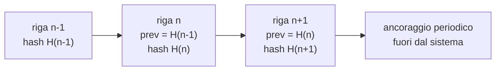

# Tracciamento

> **Presupposto di lettura.** Che cos'è una catena di impronte, perché lega l'integrità di una
> sequenza, che cos'è il non ripudio e in che cosa differisce dall'integrità, e perché un
> registro alterabile non prova nulla:
> [10 §12 - Crittografia e sicurezza, §§1.5, 5.6, 9](../10_fondamenti/12-crittografia-e-sicurezza.md).
> Qui si descrivono la forma concreta del registro di questo sistema, il suo contenuto e i suoi
> obblighi.

## 1. Che cosa deve poter dimostrare il registro

Il registro esiste per rispondere, **a un terzo che non si fida di chi lo esibisce**, a cinque
domande:

1. **Chi** ha compiuto l'operazione, con quale identità e con quale garanzia di identità.
2. **Che cosa** ha fatto: quale operazione, su quale oggetto, con quale esito.
3. **Quando**, in un ordine ricostruibile fra componenti diversi.
4. **Su quale soggetto**, quando l'operazione riguarda una persona.
5. **Che nessuno lo ha alterato** dopo la scrittura, o che, se lo ha fatto, è rilevabile.

Il punto 5 è quello che distingue un registro da un elenco di eventi, e il punto 1 nella sua
versione completa - «con quale garanzia di identità» - è quello che collega questo capitolo al
capitolo [02 §4](./02-identita-e-accessi.md): un registro che dica «autenticato con livello 2»
senza dire se il livello è stato **eseguito** o **riferito** risponde alla domanda 1 in modo
apparente.

Le fonti che impongono il registro convergono da direzioni diverse e non aggiungono lo stesso
requisito. Vanno tenute distinte perché una sola di esse non basta a giustificare il costo:

| Fonte | Che cosa aggiunge |
|---|---|
| Art. 32 del Regolamento (UE) 2016/679 | Integrità e riservatezza, e la capacità di **verificare l'efficacia** delle misure |
| Vincolo di progetto [V-05](../11_registri/01-vincoli-in-vigore.md#v-05) | «Ogni accesso a dato sanitario è tracciato in modo non ripudiabile e non alterabile» |
| Requisito R30 dell'appendice sui requisiti di sicurezza eleggibili delle linee guida nazionali sugli approvvigionamenti | «Gli accessi degli utenti devono essere registrati su un archivio (log) **non cancellabile con il reset**» |
| Requisiti R43 e R44 della stessa appendice | **Sequenza temporale degli eventi** in caso di incidente; **esportazione in formato aperto entro il giorno successivo** alla richiesta |
| Misura ABSC 3.5.1 delle misure minime nazionali per le pubbliche amministrazioni | Integrità delle registrazioni |
| Misure `PR.PS-04` e `DE.CM-01` delle specifiche di base dell'autorità nazionale | Registrazione e **monitoraggio continuo con parametri di rilevazione** |
| DM 19 novembre 2025, Allegato 4 | I **termini di conservazione**: 24 e 12 mesi |
| Art. 25 del d.lgs. 4 settembre 2024, n. 138 | Il registro è **presupposto** dell'obbligo di notifica: senza cronologia non si notifica entro 72 ore |

## 2. Il versionamento delle entità non è un registro immutabile

**Vincolo [V-04](../11_registri/01-vincoli-in-vigore.md#v-04), e questa sezione esiste per non farlo dimenticare.**

Lo strumento di versionamento adottato per il modello di dominio produce tabelle di storico
accanto alle tabelle applicative. È utile, e non è ciò che serve qui. Tre differenze, ciascuna
sufficiente da sola:

**Prima.** Chi ha privilegi di scrittura sulla base dati può alterare **anche le tabelle di
storico**, e l'alterazione non lascia traccia distinguibile da una scrittura legittima. Il
registro dev'essere non alterabile **da chi amministra il sistema che lo genera**, altrimenti
non prova nulla contro l'avversario primario di questo sistema.

**Seconda.** Il versionamento registra **come cambia un'entità**, non **chi l'ha guardata**. La
consultazione non modifica nulla e quindi non produce alcuna riga di storico. Ma l'accesso
indebito alla cartella clinica è, nella grande maggioranza dei casi, **una lettura**. Il
versionamento è cieco proprio sull'evento che conta.

**Terza.** Il versionamento vive **nella stessa base dati** del dato applicativo. Condivide con
esso il ciclo di vita, le copie di sicurezza, le credenziali, il destino in caso di
compromissione. La conservazione separata non è un raffinamento: è la condizione perché la
compromissione del sistema non comporti la compromissione della prova.

| | Versionamento delle entità | Registro immutabile |
|---|---|---|
| Registra le letture | **No** | **Sì** |
| Alterabile da chi amministra la base dati | **Sì** | No, o rilevabile |
| Conservazione | Con il dato | **Separata** |
| Verificabile da un terzo | No | **Sì** |
| Contiene contenuto clinico | Sì, per costruzione | **No** ([V-150](../11_registri/01-vincoli-in-vigore.md#v-150)) |
| Serve a | Ricostruire lo stato di un'entità nel tempo | **Dimostrare chi ha fatto che cosa** |

I due strumenti **coesistono** e servono a scopi diversi. Il versionamento resta, per la
rettifica e per la ricostruzione dello stato. Non sostituisce il registro e non ne assorbe il
costo. Ed è, come la ricerca del progetto ha rilevato, **lo sforzo maggiore dell'intero
catalogo di sicurezza**: va pianificato come tale.

## 3. Che cosa si registra e che cosa non si registra

### 3.1 Il contenuto della riga

Il registro contiene **chi, cosa, quando, su quale soggetto, con quale esito, con quale
garanzia di identità**. Non contiene ciò che è stato letto o scritto.

```json
{
  "id": "<identificativo opaco della riga>",
  "seq": 1048576,
  "ts": "<istante in formato assoluto con fuso e precisione dichiarati>",
  "tenant": "<identificativo di tenant>",
  "actor": {
    "sub": "<identificativo opaco del soggetto che agisce>",
    "role": "<ruolo esercitato al momento dell'atto>",
    "acr": "<livello del contesto di autenticazione>",
    "auth_verified_by_project": true,
    "auth_channel": "<canale>",
    "act": "<identificativo del delegante, se l'atto è per delega>",
    "src": "<indirizzo di rete, secondo la politica di conservazione>"
  },
  "action": "<verbo dell'operazione>",
  "object": {
    "type": "<tipo di risorsa>",
    "ref": "<riferimento opaco alla risorsa>",
    "subject": "<identificativo opaco dell'assistito interessato>"
  },
  "outcome": "<esito>",
  "reason": "<motivazione, obbligatoria per l'accesso d'emergenza>",
  "prev_hash": "<impronta della riga precedente>",
  "hash": "<impronta di questa riga>"
}
```

Ogni riga porta l'**identificativo di tenant** (vincolo [V4](../11_registri/03-vincoli-fondanti.md#v4) della base architetturale) e
l'**esito**: un tentativo respinto è una riga, non un silenzio. Le righe di esito negativo sono
spesso più informative di quelle positive, perché descrivono ciò che qualcuno ha provato a fare.

### 3.2 Che cosa non si registra - vincolo V-150

**Il registro immutabile e i log applicativi non contengono contenuto clinico. I log di
diagnostica non portano identificativi diretti dell'assistito.**

| Vietato | Perché |
|---|---|
| Il **contenuto** letto o scritto | Il registro diventerebbe una seconda copia dell'archivio clinico, con una superficie di esposizione più ampia e una conservazione governata da regole diverse |
| Corpo di richieste e risposte nei log applicativi | Stessa ragione, con l'aggravante che i log finiscono in sistemi di osservabilità con controlli d'accesso più deboli |
| Identificativi diretti dell'assistito nei log di **diagnostica** | I log di diagnostica hanno un pubblico più ampio, escono per il supporto, finiscono negli allegati delle segnalazioni. L'identificativo diretto va sostituito con un riferimento opaco risolvibile solo dentro il perimetro |
| Credenziali, token, chiavi, valori di sessione | Un token in un log è un token compromesso |
| Il testo della motivazione dell'accesso d'emergenza nei sistemi di osservabilità | La motivazione può contenere contesto clinico. Sta nel registro, non nei log |
| Contenuto dei descrittori di sessione oltre la finestra necessaria | Contengono indirizzi di rete locale ([03 §5](./03-protezione-dei-dati.md)) |

**La distinzione fra le tre categorie va tenuta ferma**, perché è la fonte più comune di
confusione:

| Categoria | Scopo | Conservazione | Contenuto |
|---|---|---|---|
| **Registro immutabile** | Dimostrare chi ha fatto che cosa | 24 mesi, separata | Nessun contenuto clinico, identificativi presenti |
| **Log di sicurezza** | Rilevare | Secondo la politica di chi installa, esportati verso il sistema di correlazione | Eventi di sicurezza, identificativi presenti |
| **Log di diagnostica** | Capire un malfunzionamento | Breve | **Nessun identificativo diretto dell'assistito**, nessun contenuto |

## 4. Come si costruisce: catena di impronte e conservazione separata

### 4.1 La catena

Ogni riga contiene l'impronta della riga precedente. Alterare una riga rompe la catena da quel
punto in avanti, e la rottura è **rilevabile ricalcolando**. Non impedisce l'alterazione: la
rende **dimostrabile**, ed è ciò che serve.



Due limiti da dichiarare, perché una catena presentata senza di essi promette troppo:

**La catena non protegge dalla riscrittura integrale.** Chi controlla il sistema può
ricalcolare tutte le impronte da un punto in poi e produrre una catena internamente coerente ma
diversa dall'originale. La difesa è l'**ancoraggio periodico** di un'impronta cumulativa a un
punto esterno al sistema: un archivio distinto sotto controllo diverso, una marca temporale
apposta da un terzo, un registro sotto altra amministrazione. Dopo l'ancoraggio, l'intervallo
riscrivibile è al più quello fra due ancoraggi.

**La catena non protegge dall'omissione all'origine.** Se un'operazione non produce una riga, la
catena resta coerente. La difesa non è crittografica: è che **la scrittura della riga sia sul
percorso obbligato dell'operazione**, non un effetto collaterale che si possa disattivare. Un
punto di accesso che possa restituire dati senza scrivere nel registro è un difetto di
progettazione, e la prova che lo rileva è una prova di copertura, non una prova crittografica.

### 4.2 La conservazione separata

Il registro è **a sola aggiunta** e conservato **separatamente dal sistema che genera gli
eventi**. Separatamente significa, come minimo:

- **credenziali distinte**: le utenze applicative hanno diritto di scrittura in aggiunta e non
  hanno diritto di modifica né di cancellazione;
- **amministrazione distinta**: chi amministra la base dati applicativa non amministra il
  registro;
- **ciclo di vita distinto**: copie di sicurezza proprie, conservazione propria, ripristino
  proprio;
- **capacità di sopravvivere alla compromissione dell'applicazione**: se l'applicazione è
  compromessa, il registro fino al momento della compromissione deve restare valido.

**La forma tecnica concreta non è decisa da quest'area.** Le opzioni in campo sono almeno
quattro: catena di impronte applicativa su archivio dedicato; archiviazione a sola aggiunta imposta
dal supporto; scrittura singola su oggetto con blocco di ritenzione; firma periodica con marca
temporale. Hanno costi, garanzie e dipendenze diversi. È la **questione [Q-150](../11_registri/02-questioni-aperte.md#q-150)** della bacheca,
indirizzata all'architettura, e va chiusa con un documento di decisione architetturale.

## 5. Conservazione - vincolo V-152

| Categoria | Termine | Fonte |
|---|---|---|
| **Log di tracciabilità** | **24 mesi** | DM 19 novembre 2025, Allegato 4 |
| **Dati di accesso e autenticazione** | **12 mesi** | DM 19 novembre 2025, Allegato 4 |

Tre precisazioni operative.

**Le specifiche di base dell'autorità nazionale non fissano una durata.** La fissa il regime
italiano della telemedicina. Ne discende la regola di composizione: **prevale il termine più
lungo applicabile**, e per i log di tracciabilità il termine è di 24 mesi.

**I due termini non sono lo stesso termine.** Il registro degli accessi a dato sanitario è
tracciabilità; il log degli eventi di autenticazione - accessi riusciti e falliti,
disconnessioni, blocchi di utenza - è dato di accesso. La configurazione predefinita li tiene
distinti, e chi installa può allungarli, mai accorciarli sotto il termine di fonte.

**La conservazione ha un lato che si dimentica: la cancellazione a scadenza deve avvenire.** Un
registro conservato oltre il termine senza una base è esso stesso un trattamento privo di
fondamento. La cancellazione a scadenza è quindi un'operazione programmata, verificata, e - con
una simmetria che merita attenzione - **essa stessa registrata**: la riga che attesta la
cancellazione del blocco scaduto sopravvive al blocco.

## 6. Esportazione, orologio e sequenza temporale

### 6.1 Esportazione

Il requisito ha una fonte precisa e una formulazione precisa: le linee guida nazionali sulla
sicurezza negli approvvigionamenti informatici, rese obbligatorie per le infrastrutture
regionali di telemedicina, prevedono che, su richiesta, il fornitore consegni i **log di sistema
in formato aperto entro il giorno successivo** a quello della richiesta (R44), e che per ogni
incidente consegni **entro il giorno successivo** un rapporto che descriva tipologia,
vulnerabilità sfruttate, **sequenza temporale degli eventi** e contromisure (R43).

Ne discendono requisiti verificabili, non aspirazioni:

1. **L'esportazione è una funzione di interfaccia applicativa**, non un intervento manuale del
   supporto. Un'operazione che richieda l'intervento di una persona non rispetta il termine del
   giorno successivo su un volume reale.
2. **Formato aperto**: valori separati o notazione a oggetti, con schema documentato e
   versionato.
3. **Impronta di integrità del pacchetto esportato**, e **firma**. L'esportazione deve reggere
   in sede ispettiva e giudiziaria: un file senza impronta è una copia, non una prova.
4. **Ricostruzione della cronologia** per sessione, per soggetto, per attore, per tenant, su un
   intervallo temporale arbitrario, con ordine deterministico.
5. **Verifica della prestazione su volume rappresentativo**: il termine si misura, non si
   dichiara. Una prova di esportazione su un volume rappresentativo fa parte della suite.

### 6.2 L'orologio

**La sequenza temporale degli eventi non è ricostruibile se gli orologi dei componenti
divergono.** È un requisito che sembra banale e che, non verificato, invalida l'intera
esportazione: due eventi correlati che risultino in ordine inverso rendono contestabile
qualunque ricostruzione.

Requisiti:

- **tutti i componenti sincronizzano l'orologio** con una sorgente comune, e la sorgente è
  dichiarata nella configurazione di riferimento;
- gli istanti sono registrati in **forma assoluta, con fuso e precisione dichiarati**, mai in
  ora locale senza fuso;
- ogni riga porta un **numero di sequenza monotono** all'interno del proprio flusso, perché due
  eventi nello stesso millisecondo devono comunque avere un ordine;
- **lo scarto massimo fra i componenti è misurato**, con allarme al superamento della soglia
  configurata. Una divergenza dell'orologio è un evento di sicurezza, non un problema operativo:
  è il presupposto di un'alterazione non rilevabile;
- gli istanti che il sistema **non ha generato** - quello di rilevazione di una misura riferito
  da un dispositivo esterno, per esempio - sono conservati **distinti** da quelli generati dal
  sistema, e mai sovrascritti con essi.

## 7. Il registro come strumento di rilevazione

Un registro che si consulta solo dopo l'incidente ha già fallito la metà del proprio scopo.
L'autorità nazionale lo dice, in sostanza, quando lega la tipologia di incidente riservata ai
soggetti essenziali - accesso non autorizzato o **con abuso dei privilegi concessi** - alla
definizione di **parametri quali-quantitativi** ai sensi della misura sul monitoraggio continuo,
e ne offre due esempi: un indicatore quantitativo, «il superamento di una soglia per le
interrogazioni di una banca dati da parte di un singolo utente»; un indicatore qualitativo,
«l'accesso di un amministratore di sistema al di fuori dell'orario di servizio».

**Il registro deve quindi essere interrogabile per soglie e per schemi, non solo consultabile.**
È un requisito funzionale, non una funzione di osservabilità.

Gli indicatori che il progetto fornisce come predefinito - soglie **configurabili per tenant**,
mai cablate:

| Indicatore | Tipo | Che cosa rileva |
|---|---|---|
| Numero di soggetti distinti consultati da un attore per unità di tempo | Quantitativo | Consultazione esplorativa; esportazione mascherata da consultazione |
| Numero di accessi allo **stesso** soggetto da parte dello stesso attore | Quantitativo | Interesse ripetuto su una persona: lo schema tipico dell'accesso indebito per curiosità |
| Accessi **fuori dalla fascia oraria** dichiarata per il ruolo | Qualitativo | L'esempio testuale dell'autorità |
| Accessi a soggetti **privi di relazione di cura** conclusi con esito negativo | Qualitativo | Tentativi ripetuti: descrivono un'intenzione anche quando falliscono |
| Frequenza dell'**accesso d'emergenza** per attore | Misto | Uso del percorso di eccezione come percorso ordinario ([02 §10](./02-identita-e-accessi.md)) |
| Esportazioni massive per attore e volume | Quantitativo | Esfiltrazione |
| Accessi da utenze amministrative a dati clinici | Qualitativo | L'amministratore di sistema non ha titolo clinico: ogni suo accesso a dato clinico è un'anomalia per definizione |
| Variazioni della configurazione di sicurezza | Qualitativo | Disattivazione di controlli, modifica delle soglie, modifica della conservazione |
| Fallimenti di autenticazione oltre soglia, per attore e per origine | Quantitativo | Tentativi con credenziali riusate |

**Gli eventi di sicurezza sono esportati verso il sistema di correlazione di chi installa** in
formato standard e in modalità di spinta, senza che chi installa debba accedere alla base dati.
La rilevazione è del cliente; il prodotto deve renderla possibile senza costringerlo a leggere
l'archivio applicativo.

**Una soglia superata non è un incidente.** È un'evidenza da valutare, e la sua valutazione fa
parte del processo di [10](./10-risposta-agli-incidenti.md). Ma è il momento in cui inizia a
decorrere il termine di notifica, perché il termine decorre dall'**acquisizione dell'evidenza**:
un prodotto che rileva prima non accorcia il termine, accorcia il ritardo con cui il cliente
inizia a contarlo.

## 8. L'accesso al registro stesso

**Chi consulta il registro compie un accesso a dato sanitario**: la riga «l'assistito X è stato
consultato dal professionista Y» è dato relativo alla salute
([01 §2.2](./01-modello-di-minaccia.md)). Ne discendono quattro regole che non sono formali:

1. **La consultazione del registro è essa stessa registrata**, con la propria riga: chi ha
   consultato, quale intervallo, con quale filtro, con quale motivazione dove è richiesta.
2. **L'accesso al registro è un privilegio distinto** da quello di amministrazione del sistema e
   da quello clinico. L'amministratore di sistema non ha titolo per leggere il registro degli
   accessi clinici, e il professionista non ha titolo per leggere il registro altrui.
3. **L'interessato ha titolo a conoscere gli accessi ai propri dati.** È capacità del prodotto,
   esposta da interfaccia applicativa e disponibile a chi installa perché la offra al proprio
   assistito. È anche la misura di trasparenza con il maggiore effetto deterrente
   sull'avversario primario.
4. **L'esportazione del registro è un atto sorvegliato**: soglie, motivazione, notifica al
   responsabile designato.

La ricorsione - la consultazione del registro produce una riga del registro, la cui
consultazione produce un'altra riga - **termina** perché le righe di consultazione non sono
oggetto di consultazione ordinaria: sono materia di riesame periodico, non di interrogazione
corrente.

## 9. Che cosa non fa il registro

Per simmetria con l'onestà richiesta al capitolo [03 §5](./03-protezione-dei-dati.md):

- **non impedisce l'accesso indebito**: lo rende accertabile a posteriori e, con la rilevazione
  del §7, lo rende accertabile presto;
- **non prova l'intenzione**: prova l'atto. La qualificazione dell'atto come indebito richiede
  il contesto, ed è del titolare del trattamento;
- **non sostituisce l'autorizzazione**: un sistema che registri tutto e autorizzi male produce
  ottime prove di un cattivo funzionamento;
- **non è utilizzabile come archivio clinico di riserva**, perché per costruzione non contiene
  contenuto clinico ([V-150](../11_registri/01-vincoli-in-vigore.md#v-150));
- **non vale più della sua conservazione**: un registro conservato su un supporto che si degrada
  o in un formato che fra ventiquattro mesi nessuno legge è un registro che non esiste. Il
  formato di esportazione è aperto e documentato anche per questa ragione.

## 10. Che cosa quest'area lascia aperto

| Riferimento | Questione | A chi |
|---|---|---|
| [Q-150](../11_registri/02-questioni-aperte.md#q-150) | **Documento di decisione architetturale sul registro immutabile**: catena di impronte applicativa, archiviazione a sola aggiunta, scrittura singola su oggetto, o firma periodica con marca temporale (§4.2) | Architettura |
| [Q-152](../11_registri/02-questioni-aperte.md#q-152) | Livelli di servizio attesi ai fini del monitoraggio continuo, distinti da quelli previsti dal decreto sulle infrastrutture regionali: la tipologia di incidente sui livelli di servizio dipende da valori che il cliente definisce, e il prodotto deve saperli misurare | Architettura, roadmap |
| [Q-158](../11_registri/02-questioni-aperte.md#q-158) | Punto e periodicità dell'ancoraggio esterno dell'impronta cumulativa (§4.1) | Architettura |
| - | Soglie predefinite degli indicatori del §7: sono **specifica di prodotto, mai conformità** ([V-12](../11_registri/01-vincoli-in-vigore.md#v-12)), e vanno tarate con chi installa | Funzionale |
