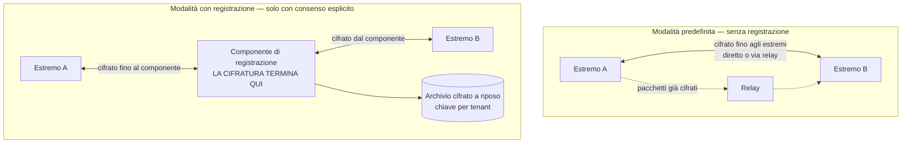

# Sicurezza del tempo reale

> **Presupposto di lettura.** Perché una videochiamata è un problema difficile, che cosa sono
> l'attraversamento delle reti, la segnalazione, i candidati di connettività, il relay e la
> degradazione adattiva: [10 §08 — WebRTC da zero](../10_fondamenti/08-webrtc-da-zero.md).
> Qui si tratta soltanto ciò che riguarda la sicurezza, e si evita di ripetere il resto.

## 1. Il perimetro di questo capitolo

Il media in tempo reale è il componente in cui la distanza fra ciò che si dichiara e ciò che
accade è più facile da creare e più difficile da verificare per chi legge. Tre affermazioni
correnti nel settore sono, prese alla lettera, false o incomplete: che la cifratura fino agli
estremi renda la sessione inaccessibile a chiunque; che le chiavi ruotino durante la sessione;
che una lista di indirizzi vietati basti a impedire che il relay diventi un punto d'appoggio
verso la rete interna. Questo capitolo le tratta una per una.

Le affermazioni pubbliche del progetto sono già state riformulate di conseguenza (decisione
D19): «cifrato fino agli estremi, **instradato direttamente quando la rete lo consente**»,
«**materiale crittografico generato ex novo per ogni sessione, senza riuso**», e l'obiettivo di
latenza come **metrica misurata, registrata e notificata** invece che come promessa. Questo
capitolo è la giustificazione tecnica di quelle riformulazioni.

## 2. Cifratura del media, e ciò che non fa

### 2.1 Il meccanismo, in due righe

Il materiale crittografico del media non è scambiato dal canale di segnalazione: è **derivato da
una stretta di mano condotta direttamente fra i due estremi**, sul canale del media stesso. Il
canale di segnalazione trasporta soltanto le **impronte** dei certificati effimeri con cui
quella stretta di mano viene autenticata. Ne discende la proprietà che conta: **il server di
segnalazione non possiede il materiale con cui il media è cifrato**, e non può decifrarlo
neanche volendo — a condizione che le impronte siano quelle giuste, il che è il tema del §3.

### 2.2 Non esiste rotazione delle chiavi entro la sessione

**Questo è un fatto accertato del protocollo, non una scelta del progetto, e va scritto perché
il claim contrario è diffuso.**

Le chiavi del media sono **estratte una sola volta** dal segreto di esportazione della stretta
di mano, con un'etichetta fissata dallo standard. Il meccanismo di aggiornamento delle chiavi
previsto dalla versione più recente del protocollo di trasporto **non aggiorna quel segreto**:
aggiorna le chiavi del livello di record, non il segreto di esportazione. La fonte è il documento
di lavoro dell'ente di normazione dedicato esattamente a questo problema, che nella propria
motivazione afferma che il segreto di esportazione «è statico per la durata della connessione e
**non è aggiornato da un aggiornamento di chiave standard**». Quel documento esiste **precisamente
perché** il problema è noto, aperto e non ancora standardizzato; non è implementato in alcun
motore.

Conseguenze da scrivere per esteso:

1. **Il termine «rotazione delle chiavi per sessione» va eliminato dal materiale pubblico.** La
   formulazione corretta è che ogni sessione usa materiale generato ex novo, con certificati
   effimeri per connessione, e che **non avviene riuso fra sessioni**. Questa è vera e
   verificabile.
2. **L'assenza di rotazione entro la sessione non è una debolezza crittografica.** I limiti di
   vita del materiale previsti dallo standard del profilo sicuro sono di ordini di grandezza
   lontani da quelli raggiungibili in un consulto medico. È una funzione che non esiste, non una
   funzione che manca.
3. **La segretezza in avanti fra sessioni resta**, perché il materiale è nuovo a ogni sessione.
   La segretezza in avanti **entro** la sessione no: chi ottenesse il segreto di esportazione
   potrebbe ricalcolare tutto il materiale esportato di quella connessione. È il rischio
   residuo, ed è dichiarato.

### 2.3 Non si dichiara la versione negoziata: la si misura

**Vincolo V-156**, già enunciato in [03 §2.3](./03-protezione-dei-dati.md) e qui declinato sul
media.

Il quadro accertato: la libreria crittografica di due dei tre motori di riferimento adotta come
massima predefinita la **versione più recente** del protocollo di trasporto per il datagramma;
il terzo motore ha abilitato quella versione in una release identificata; per il rimanente lo
stato **non è verificabile** su fonte primaria: `[NV]`. Il ripiego alla versione precedente resta
attivo per compatibilità su tutti.

In queste condizioni **qualunque affermazione statica sarebbe falsa per una parte del parco
installato**. Il progetto quindi:

- registra, per ogni sessione, la **versione negoziata** e la **suite del profilo sicuro
  effettivamente in uso**, lette dalle statistiche della connessione;
- conserva questi valori fra i metadati della sessione, dove sono consultabili e esportabili;
- emette un evento quando il valore negoziato scende sotto la soglia minima configurata dal
  tenant, e può rifiutare la sessione secondo configurazione.

## 3. La verifica delle chiavi: perché la stringa di autenticazione breve è obbligatoria

### 3.1 Il problema che risolve

La cifratura del media autentica la stretta di mano contro le **impronte** trasportate dalla
segnalazione. Se qualcuno controlla il canale di segnalazione, può sostituire le impronte con
le proprie, stabilire due sessioni cifrate — una con ciascuna parte — e vedere tutto. Ogni
sessione è cifrata, la proprietà «nessuno può decifrare il traffico» è vera per ciascuna delle
due, e la riservatezza è persa.

**La cifratura fino agli estremi, senza verifica indipendente delle chiavi, si fonda sulla
fiducia nel server di segnalazione.** Non è una proprietà crittografica: è una proprietà
organizzativa travestita. La decisione D19 del progetto lo ha recepito condizionando il claim
alla verifica indipendente.

### 3.2 Perché non esiste un'alternativa standard

Lo standard prevede un'interfaccia dedicata alla verifica dell'identità dei partecipanti
mediante un fornitore di identità terzo. **Non è utilizzabile**, e la verifica condotta dal
progetto lo ha accertato su fonte primaria:

| Elemento accertato | Esito |
|---|---|
| Stato della specifica | Ferma allo stadio di raccomandazione candidata del **27 settembre 2018**. Il passaggio allo stadio successivo, atteso «non prima del 31 dicembre 2018», **non è mai avvenuto** |
| Attività di manutenzione | **Nessun commit sostanziale dal 2021**: solo allineamenti editoriali e aggiornamenti di strumentazione |
| Implementazione nei motori | Implementata **da un solo motore**. Mai implementata dai due maggiori. Presente in un terzo motore fino alla versione basata sul proprio vecchio motore di rendering e **rimossa** nel passaggio al motore condiviso |

L'interfaccia è quindi **funzionalmente monobrowser**. Una verifica delle chiavi che vi si
appoggiasse funzionerebbe solo quando **entrambi** i partecipanti — professionista e assistito —
usano lo stesso motore. In un servizio rivolto al pubblico, dove l'assistito usa il browser che
ha, equivale a non funzionare.

C'è un secondo argomento, indipendente dal primo e che varrebbe anche in uno scenario ipotetico
di supporto universale: l'interfaccia richiederebbe un **fornitore di identità terzo** che ospiti
lo script di intermediazione. Introdurlo significherebbe creare una nuova dipendenza a runtime
da un terzo — in tensione diretta con il vincolo di sovranità — e **spostare il punto di fiducia
dal server di segnalazione al fornitore di identità, senza eliminarlo**. Non è una soluzione
evidentemente superiore: è la stessa fiducia in un posto diverso.

### 3.3 Requisito, non raccomandazione

**La stringa di autenticazione breve è obbligatoria per impostazione predefinita** (decisione
D22). Un codice breve derivato dalle impronte dei certificati, che i due interlocutori
confrontano **a voce** all'avvio della sessione. Se coincide, non c'è intermediario: perché un
intermediario dovrebbe produrre lo stesso codice con impronte diverse.

È al tempo stesso ciò che rende **dimostrabile** la cifratura fino agli estremi e un **controllo
di rischio tracciabile** ai sensi della norma sulla gestione del rischio dei dispositivi medici.
Il rischio corrispondente va classificato come privo di mitigazione alternativa standard: non
esiste un'altra strada.

**Requisiti di accessibilità, vincolanti** (decisione D22 e vincolo trasversale V6):

- **leggibile da lettore di schermo**: il codice ha una rappresentazione testuale accessibile,
  non è un'immagine;
- **mai veicolata dal solo colore**: l'esito della verifica non si comunica con un indicatore
  cromatico;
- **comprensibile a una persona anziana o poco alfabetizzata digitalmente**: il codice è breve,
  pronunciabile, e l'istruzione è in linguaggio piano;
- **procedura definita in caso di mancata corrispondenza**: che cosa fare, chi avvisare, come
  interrompere. Un controllo di sicurezza senza procedura di fallimento è un controllo che, al
  primo fallimento, viene ignorato;
- l'esito della verifica **non è tematizzabile né occultabile** da chi incorpora il componente
  (vincolo V-23 dell'area di integrazione).

L'esito della verifica — eseguita, non eseguita, non corrispondente — è **registrato fra i
metadati della sessione**.

## 4. Il server di relay

### 4.1 Il vincolo, alla lettera

**Vincolo V-10: versione minima 4.17.2 e isolamento di rete in uscita come difesa primaria.**

La versione minima non è una preferenza. Al di sotto restano aperte vulnerabilità note e
verificate su banca dati pubblica: una versione 4.16.0 resta esposta a difetti di esaurimento
del pool di porte di inoltro e di aggiramento della quota di allocazioni; una 4.13.1 a un
difetto di confronto degli indirizzi; una 4.9.0 a un difetto critico di scrittura oltre i
limiti nella decodifica del token di autorizzazione. La cadenza di rilascio del progetto a monte
è, essa stessa, un dato: **quattordici rilasci in poco più di sette mesi**, cinque nel solo mese
in cui la verifica è stata condotta. Ne discende un obbligo operativo che non è generico ma
**quantificato**: la configurazione e l'elenco delle vulnerabilità vanno riverificati a ogni
aggiornamento di versione minore, e l'esito registrato nel fascicolo di sorveglianza
post-commercializzazione.

### 4.2 Perché la lista di indirizzi vietati non è la difesa primaria

Questa è la parte controintuitiva, ed è la ragione per cui il vincolo V-10 è formulato come è
formulato.

La direttiva di diniego dei peer è la difesa che tutti configurano. **È stata aggirata quattro
volte in otto mesi**, da difetti di canonicalizzazione e di confronto degli indirizzi. La
famiglia completa dei difetti di questo tipo, accertata sulla banca dati pubblica delle
vulnerabilità e sugli avvisi del progetto a monte, conta **sei difetti distinti in otto anni**:

| Meccanismo | Corretto in |
|---|---|
| Configurazione predefinita non sicura: inoltro verso l'interfaccia di ritorno consentito per impostazione predefinita | 4.5.0.9 |
| Indirizzo di destinazione degenere che aggira il controllo | 4.5.2 |
| Indirizzo IPv4 mappato in IPv6 che aggira **le regole di diniego esplicite** | 4.9.0 |
| Indirizzo IPv4 mappato in IPv6 che aggira **la protezione predefinita dell'interfaccia di ritorno**, difetto distinto dal precedente | 4.13.0 |
| Forme IPv6 alternative instradabili verso IPv4 non normalizzate, sul percorso di connessione in modalità flusso | 4.13.1 |
| Confronto degli indirizzi IPv6 componente per componente anziché numerico: un intervallo di diniego **non allineato a un prefisso** viene aggirato | 4.16.0 |

**Quattro degli ultimi quattro sono degli ultimi otto mesi.** Il punto non è che il progetto a
monte sia negligente — al contrario, la cadenza di correzione è rapida. Il punto è **strutturale**:
la difesa dipende dalla correttezza del parsing e della normalizzazione degli indirizzi, e quel
codice ha una superficie di errore che si è dimostrata ripetutamente non esaurita.

**L'unica difesa che ha retto a tutte e sei è l'isolamento di rete in uscita**, perché non
dipende dalla correttezza del parsing.

### 4.3 I quattro corollari controintuitivi

Vanno scritti per esteso perché sono esattamente i punti che una configurazione ragionevole
sbaglia.

**Primo — il comportamento predefinito è permissivo, e non esiste un interruttore di diniego
globale.** La regola documentata a monte è che, in assenza di una regola per un indirizzo,
l'indirizzo **è consentito**. Il diniego predefinito non esiste come opzione: va **costruito
enumerando gli intervalli**. Una direttiva di diniego dimenticata significa inoltro consentito,
non inoltro negato.

**Secondo — la lista di indirizzi consentiti prevale sempre su quella dei vietati, e quindi non
va usata.** La regola documentata è che, se un indirizzo compare in entrambe, **è considerato
consentito, comunque**. Una singola riga permissiva annulla qualunque diniego, per quanto
articolato. **Nel profilo sanitario la lista di indirizzi consentiti non si usa**, e questo va
scritto nella configurazione di riferimento come divieto, non come preferenza.

**Terzo — gli intervalli IPv6 vanno allineati a un prefisso.** È la mitigazione dichiarata
nell'avviso del difetto di confronto: l'avviso raccomanda testualmente di evitare confini
arbitrari e di affidarsi a indirizzi esatti o a intervalli allineati a un prefisso,
**imponendo le restrizioni di uscita del relay attraverso meccanismi esterni**. L'ultima parte è
la conferma, dalla fonte a monte, del vincolo V-10.

**Quarto — nessun servizio co-locato, e il servizio di metadati dell'infrastruttura deve essere
irraggiungibile.** Nessuna base dati, nessun agente di gestione in ascolto sull'interfaccia di
ritorno, nessun punto di accesso ai metadati dell'infrastruttura raggiungibile. È il completamento
dell'isolamento: se non c'è nulla da raggiungere, il difetto di canonicalizzazione non ha
bersaglio. Va negato anche **l'indirizzo pubblico del nodo stesso**, perché senza quella riga il
relay può raggiungere i servizi del proprio nodo passando dall'indirizzo pubblico invece che
dall'interfaccia di ritorno, aggirando l'intera logica di protezione.

### 4.4 Le altre misure sul relay

| Misura | Ragione |
|---|---|
| **Credenziali effimere** con scadenza breve, emesse dal servizio applicativo per la singola sessione | Una credenziale longeva sul relay è un servizio di inoltro gratuito per chiunque la ottenga |
| **Rotazione senza interruzione del segreto condiviso**, resa possibile dal supporto a segreti multipli documentato a monte | Un segreto che non ruota perché la rotazione richiede un fermo non ruota |
| **Segreto di firma dei valori usa e getta coerente su tutti i nodi** | Dalla versione 4.17.0 il valore usa e getta è calcolato con una chiave **generata per processo**: senza un segreto condiviso, ogni richiesta che atterri su un nodo diverso costa alla parte chiamante un ciclo di riautenticazione |
| **Interfaccia di amministrazione disattivata** | Ha precedenti di iniezione di script memorizzati e di iniezione nel linguaggio di interrogazione |
| **Nessun reindirizzamento per la gestione automatica dei certificati** | Ha un precedente di divulgazione di memoria **prima dell'autenticazione**. La gestione dei certificati si fa fuori dal relay |
| **Nessun inoltro verso destinazioni in modalità flusso** | Non serve al media, ed è il percorso su cui è avvenuto uno dei bypass |
| **Nessuna funzione di mobilità della sessione** | Tre difetti in due mesi, fra cui un'appropriazione di allocazione; nessun beneficio in una sessione fra due parti |
| **Limitazione della frequenza delle risposte non autenticate** | Mitiga riflessione e amplificazione con indirizzo sorgente contraffatto |
| **Quote per credenziale e per nodo, limiti di banda per sessione** | Contengono l'esaurimento di risorse. Attenzione all'unità di misura: le direttive di banda sono espresse in **byte** al secondo nonostante il nome, e si applicano **per direzione** |
| **Punto di accesso alle metriche vincolato all'interfaccia di gestione** | Il valore predefinito è l'ascolto su qualunque interfaccia: va ristretto |

### 4.5 La prova di abuso

**Requisito, non raccomandazione.** In integrazione continua, con una credenziale valida, si
tenta di creare un permesso di inoltro verso: l'interfaccia di ritorno in forma diretta; la
stessa in forma mappata in IPv6; l'indirizzo del servizio di metadati dell'infrastruttura; un
indirizzo di rete privata; **l'indirizzo pubblico del nodo stesso**; **un indirizzo dentro un
intervallo IPv6 non allineato a un prefisso**. La compilazione fallisce se una qualunque di
queste riceve risposta positiva.

Gli ultimi due casi sono quelli che una suite scritta prima della verifica non contiene, e sono
esattamente i due che corrispondono ai difetti più recenti. È una **misura di controllo del
rischio tracciabile** ai sensi della norma sulla gestione del rischio, non una prova di
regressione qualsiasi.

## 5. La modalità con registrazione

### 5.1 La conseguenza, dichiarata senza attenuazioni

La registrazione avviene **lato server**, per garantirne l'affidabilità indipendentemente dal
dispositivo e dal carico di elaborazione dell'assistito (decisione D23). Ne discende una
conseguenza inderogabile:

> **Quando la registrazione è attiva la cifratura è terminata sul server e la sessione NON è
> cifrata fino agli estremi.**

Non è un dettaglio implementativo da nascondere in una nota: è una **proprietà diversa della
sessione**, e il sistema ha per questo **due modalità distinte**, non una modalità con
un'opzione.

### 5.2 Gli obblighi che ne discendono

Tutti obbligatori, tutti verificabili.

1. **L'informativa di consenso dichiara esplicitamente che la sessione non è più cifrata fino
   agli estremi.** Non «la registrazione è cifrata a riposo» — che è vero e non è la stessa
   informazione. La persona deve poter comprendere che la proprietà della sessione è cambiata.
2. **Il consenso è esplicito, separato, non preselezionato, revocabile con la stessa facilità
   con cui è stato prestato**, e non può essere condizione per accedere alla visita (divieto di
   aggregazione, art. 7, par. 4). La visita si svolge comunque: la registrazione è un trattamento
   ulteriore, non necessario alla prestazione.
3. **Il consenso è bilaterale.** Anche il professionista è interessato rispetto alla propria
   immagine e voce, e la sua base giuridica può essere diversa ma deve esistere.
4. **L'indicatore di registrazione in corso è persistente e non occultabile** per tutta la
   durata. Non è tematizzabile né rimovibile da chi incorpora il componente (vincolo V-23
   dell'area di integrazione). È leggibile da lettore di schermo e non è veicolato dal solo
   colore.
5. **Il passaggio fra le due modalità è tracciato nel registro**, con l'istante, l'attore e il
   riferimento al consenso.
6. **Il file è cifrato a riposo con chiave di tenant**, la conservazione è configurabile e la
   revoca produce cancellazione effettiva ([03 §7](./03-protezione-dei-dati.md)).
7. **Il contenitore è negoziato a runtime, mai assunto** (vincolo V-11). Il quadro accertato è
   che nessuno dei due contenitori diffusi è universale: il primo è supportato da due motori su
   tre, il secondo dal terzo e — solo da una versione recente — anche da uno degli altri. Il
   contenitore effettivo è **registrato fra i metadati della registrazione**, come si fa per la
   suite crittografica. Il claim pubblico corretto è «registrazione in contenitore standard,
   negoziato con il browser e registrato nei metadati, cifrata a riposo»: verificabile.
8. **Non si esegue una riconversione del contenitore lato server** come ripiego, perché
   contraddirebbe la logica dell'intera catena.

### 5.3 Che cosa la registrazione non è

Non è una misura di sicurezza. È un **trattamento aggiuntivo con un rischio proprio**, e
l'analisi costi-benefici va fatta ogni volta: una registrazione conservata è una superficie di
esposizione in più, e ha anche un **effetto inibitorio** documentabile sul colloquio quando
l'assistito la sospetta. In modalità predefinita è **disattivata**, ed è la scelta corretta.

## 6. Degradazione

**Audio prima del video, sempre.** È una regola della base architetturale e ha una motivazione
di sicurezza clinica prima che di esperienza d'uso: in un consulto, l'audio porta la quasi
totalità dell'informazione clinicamente utilizzabile, e una sessione che degrada perdendo
l'audio per conservare il video è una sessione che ha perso la prestazione conservando l'apparenza.

Requisiti che ne discendono:

- la degradazione è **annunciata** all'utente in linguaggio piano, non subita in silenzio;
- l'evento di degradazione oltre soglia è **registrato** fra i metadati della sessione, ed è
  disponibile per l'inserimento nel documento clinico con conferma esplicita del professionista;
- esiste un **ripiego dichiarato** — il canale telefonico — e la procedura è nota all'assistito
  prima della sessione, non comunicata durante il guasto;
- l'interruzione della sessione è un **esito registrato**, non un'assenza di dato: il vincolo
  V-09 vale anche qui.

## 7. Metriche e osservabilità

**Vincolo V-155: nessuna metrica infrastrutturale del relay può essere etichettata con
l'identificativo di sessione.**

La ragione è nella tabella dei metadati di [01 §2.2](./01-modello-di-minaccia.md). La credenziale
effimera del relay contiene, per costruzione, l'identificativo opaco di sessione. Il relay offre
un'opzione per etichettare le metriche di traffico con il nome utente della credenziale.
Attivarla significherebbe (a) far esplodere la cardinalità delle serie, e (b) **trasferire un
identificativo di sessione clinica nel sistema di metriche infrastrutturali**, rompendo la
separazione fra il piano infrastrutturale — che non tratta dati personali — e il piano delle
statistiche di sessione, che vi rientra pienamente. **Non attivarla è un requisito di
minimizzazione, non una preferenza di configurazione.**

Tre osservazioni operative che discendono dalla verifica delle metriche effettivamente esposte:

1. **Le metriche di traffico contano solo le sessioni concluse.** Non esiste un contatore di
   byte per sessione in corso: una rappresentazione del traffico costruita su di esse mostra
   scalini al termine delle sessioni, non un flusso. Il traffico istantaneo va derivato dai
   contatori per pacchetto.
2. **L'unica metrica di stato è il numero di allocazioni correnti.** È quella su cui si costruisce
   l'allarme di saturazione.
3. **Non esiste una metrica dei permessi negati.** Il segnale d'attacco che conta — un picco di
   richieste di permesso respinte, che è una scansione della rete interna — **non è ricavabile
   dalle metriche** e va estratto dai log del relay. È una correzione sostanziale rispetto
   all'assunto iniziale del progetto, e determina la forma della regola di allarme: si costruisce
   sui log, non sulle serie temporali.

Le statistiche di sessione lato client — latenza, perdita, variazione del ritardo, banda —
appartengono al perimetro dei dati personali, sono associate alla sessione e quindi
all'assistito, e seguono la conservazione e l'accesso degli altri metadati di sessione. **Non si
mescolano con le metriche infrastrutturali**: sono due archivi con due regimi.

## 8. Che cosa quest'area lascia aperto

| Riferimento | Questione | A chi |
|---|---|---|
| Q-08 | Conferma della soluzione a due modalità e dei suoi effetti sul modello dati | Architettura |
| `[NV]` | Stato del supporto della versione più recente del protocollo di trasporto per il datagramma sul motore per cui non è stato accertato (§2.3) | Verifica empirica |
| `[NV]` | Algoritmo di sintesi sottostante al calcolo delle credenziali effimere del relay: la documentazione a monte scrive genericamente «hmac». Va **verificato empiricamente** con una prova di integrazione contro la versione effettivamente distribuita, che è più solida di qualunque citazione documentale | Tecnica |
| `[NV]` | Supporto della notazione a prefisso nelle direttive di diniego: non verificato a monte, quindi la configurazione di riferimento usa esclusivamente la forma con intervallo, che è documentata (§4.3) | Tecnica |
| — | Soglia minima di versione di protocollo negoziata sotto la quale la sessione è rifiutata: è **specifica di prodotto, mai conformità** (V-12) | Funzionale |
