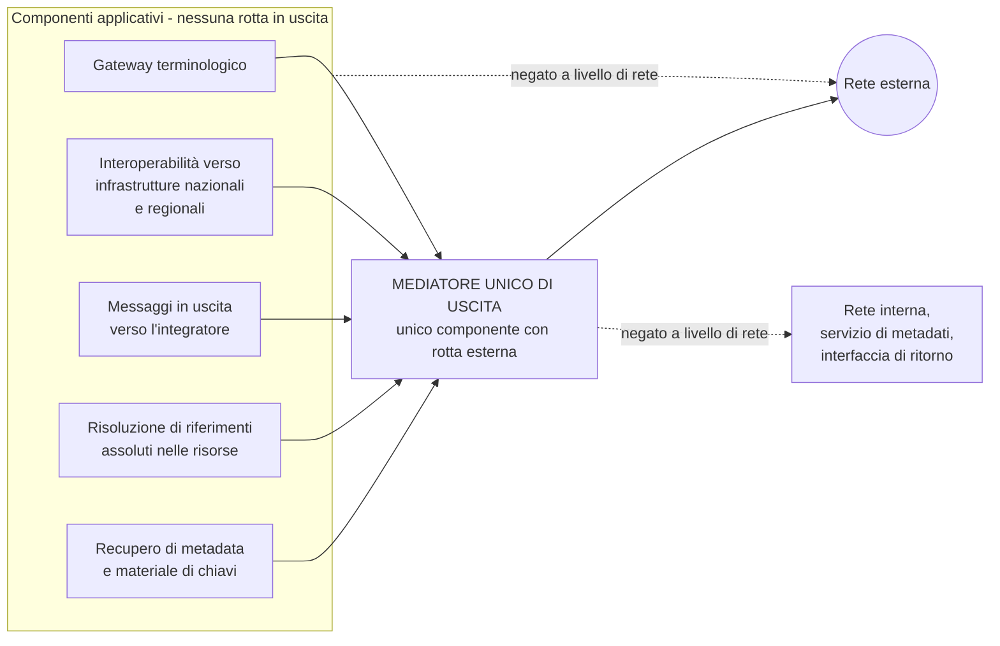

# Sicurezza applicativa

> **Presupposto di lettura.** I protocolli richiamati in questo capitolo - concessione di
> autorizzazione con prova di possesso del verificatore, firma dei messaggi HTTP, impronta del
> corpo, dettagli del problema - sono descritti in
> [10 §13 - I protocolli](../10_fondamenti/13-protocolli.md). Qui si descrive che cosa il
> sistema fa con essi, e le regole che valgono indipendentemente dal protocollo.

## 1. Il principio che governa il capitolo

**Ogni controllo che conta si esegue dal lato che riceve.** Il browser è zona non fidata, anche
quello del professionista; il sistema dell'integratore è zona non fidata, anche quando è un
partner contrattuale; la rete interna non è un confine di fiducia. I controlli lato client sono
ergonomia - evitano all'utente di scoprire l'errore dopo aver compilato un modulo - e non hanno
alcun valore di sicurezza.

Il secondo principio, che regge il §8: **una difesa che dipende dalla correttezza di un codice
ripetuto in molti punti fallisce nel punto che è stato dimenticato.** Dove è possibile, la
difesa va spostata da una regola di codifica a un vincolo architetturale che nessuno può
dimenticare perché non passa dalla sua diligenza.

## 2. Validazione ai confini

I confini sono quelli di [01 §4](./01-modello-di-minaccia.md). Su ciascuno la validazione è
**dichiarativa e a schema**, non imperativa: si dichiara la forma ammessa e si rifiuta ciò che
non vi corrisponde, invece di cercare ciò che è pericoloso.

La differenza è sostanziale e va scritta: un elenco di ciò che è vietato è sempre incompleto -
è la stessa ragione strutturale per cui la lista di indirizzi vietati del relay è stata aggirata
quattro volte ([05 §4.2](./05-sicurezza-del-tempo-reale.md)). Un elenco di ciò che è ammesso è
completo per costruzione.

| Aspetto | Regola |
|---|---|
| **Forma del corpo** | Validazione contro schema pubblicato e versionato. Campi non previsti: **rifiutati**, non ignorati. Un campo ignorato silenziosamente è un campo che qualcuno userà |
| **Dimensione** | Limite per punto di ingresso, applicato **prima** dell'analisi sintattica, non dopo |
| **Profondità e cardinalità** | Limite alla profondità di annidamento e al numero di elementi delle collezioni. È la difesa contro l'esaurimento di risorse per struttura patologica |
| **Tipi e domini** | Ogni identificativo porta il proprio **dominio di attribuzione esplicito**. Nessun identificativo esterno è chiave primaria |
| **Codifica** | Normalizzazione della codifica dei caratteri **una sola volta, in ingresso**, prima di ogni confronto. Le doppie normalizzazioni e le normalizzazioni tardive sono la causa strutturale della famiglia di aggiramenti descritta nel §8 |
| **Riferimenti** | Un riferimento a una risorsa è **risolto e autorizzato**, mai dereferenziato perché il chiamante lo ha fornito. Vedi §8 per i riferimenti assoluti |
| **Esito dell'errore** | Rappresentazione uniforme degli errori con identificativo di tipo di problema stabile; **nessun dettaglio interno** nel messaggio: né traccia di esecuzione, né frammento di interrogazione, né percorso di file |

**Regola sui messaggi d'errore che vale in tutto il sistema.** Un errore rivolto all'utente
finale è comprensibile e non diagnostico; un errore rivolto all'integratore è diagnostico e non
rivelatore; il dettaglio completo sta nel log applicativo, correlato all'errore da un
identificativo opaco che il chiamante riceve e può citare al supporto. È anche un requisito di
usabilità clinica: un professionista sotto pressione di tempo non deve interpretare un codice.

## 3. Sessioni, token e intestazioni

| Elemento | Regola |
|---|---|
| **Autorizzazione dell'applicazione interattiva** | Flusso a codice con prova di possesso del verificatore, obbligatoria; parametro di stato con entropia adeguata; nessun token nell'indirizzo |
| **Token d'ingresso alla sessione** | **A uso singolo, scadenza brevissima, emesso su canale posteriore**, mai transitante per l'indirizzo. È il ripiego indipendente previsto dalla decisione D18 |
| **Durata della sessione** | Configurabile per tenant. Il compromesso fra sessione lunga e sessione corta si governa con la **riautenticazione sulle operazioni sensibili**, non con una scadenza aggressiva che, in mezzo a una visita, è un evento clinico |
| **Cookie di sessione**, dove usati | Marcati come non accessibili da script, trasmessi solo su canale cifrato, con politica restrittiva rispetto al contesto di provenienza |
| **Falsificazione della richiesta fra siti** | Neutralizzata dalla politica sul contesto di provenienza **e** da un secondo meccanismo indipendente sulle operazioni che modificano lo stato: due difese, perché la prima dipende dal comportamento del browser |
| **Condivisione di risorse fra origini** | Elenco **chiuso** di origini, per tenant, dallo **stesso registro di fiducia** di [02 §6.2](./02-identita-e-accessi.md). Nessun carattere jolly, in nessuna configurazione supportata |
| **Incorporamento** | Consentito solo alle origini dell'elenco. Il componente incorporabile comunica con il contenitore verificando **sempre** l'origine del messaggio in ricezione: un componente che accetti messaggi da qualunque origine è un componente scriptabile da qualunque pagina |
| **Intestazioni di risposta** | Politica sui contenuti eseguibili restrittiva e **senza sorgenti in linea**; divieto di deduzione del tipo; controllo del referente; politica sui permessi delle interfacce del dispositivo limitata a ciò che serve - e in questo sistema serve la fotocamera e il microfono, che vanno concessi al minimo perimetro |
| **Memorizzazione nel browser** | Nessun contenuto clinico nella memoria persistente del browser. Il contenuto vive nella sessione e non le sopravvive |

**Sul componente incorporabile, una nota che ha peso di sicurezza e non solo di prodotto.**
Indicatore di registrazione in corso, avvisi e testi di consenso, esito della verifica delle
chiavi, messaggi di errore clinico e indicatore dello stato di cifratura **non sono
tematizzabili né occultabili** (vincolo [V-163](../11_registri/01-vincoli-in-vigore.md#v-163) dell'`INTEG`). Le proprietà di tema
ammesse sono un insieme chiuso e versionato, validate dal lato che riceve con verifica del
contrasto, e una configurazione che degrada l'accessibilità **viene rifiutata al salvataggio**,
non segnalata come avviso. Nessuna iniezione di fogli di stile arbitrari dall'esterno: un foglio
di stile arbitrario può nascondere un indicatore obbligatorio, e nascondere l'indicatore di
registrazione è una violazione, non un difetto estetico.

## 4. Iniezioni

La categoria non è una: sono famiglie diverse con difese diverse, e trattarle come una sola è
il modo in cui se ne dimentica qualcuna.

| Famiglia | Difesa strutturale | Che cosa non è una difesa |
|---|---|---|
| **Linguaggio di interrogazione della base dati** | Istruzioni parametrizzate, sempre. Nessuna concatenazione di stringhe con dato in ingresso, in nessun punto, nemmeno amministrativo | La schermatura dei caratteri speciali |
| **Contenuto eseguibile nel browser** | Codifica **contestuale** all'emissione, effettuata dal motore di presentazione e non a mano; politica sui contenuti eseguibili come seconda difesa | La sanificazione in ingresso, che non conosce il contesto di emissione |
| **Comandi di sistema** | Nessuna invocazione di interprete con dato in ingresso. Se un componente esterno è inevitabile, invocazione con argomenti separati e mai con riga di comando composta | La schermatura degli argomenti |
| **Percorsi di file** | Il nome fornito dall'esterno **non è mai un percorso**: è una chiave verso un identificativo generato dal sistema. Il percorso non si compone con dato in ingresso | La normalizzazione del percorso |
| **Documenti strutturati con entità esterne** | Risoluzione delle entità esterne **disattivata** in tutti gli analizzatori sintattici, con verifica automatica della configurazione. È rilevante qui perché il dominio usa serializzazioni documentali | Il controllo del contenuto |
| **Deserializzazione** | Nessuna deserializzazione di grafi di oggetti arbitrari da fonte non fidata. Formati dati, non formati di oggetti |
| **Modelli e espressioni** | Nessuna valutazione di espressioni fornite dall'esterno, in nessun motore di modelli, in nessuna regola configurabile. È il punto in cui una funzione di personalizzazione diventa esecuzione di codice |
| **Registrazione** | Nessuna interpolazione di dato in ingresso nel formato del messaggio di log: il dato è argomento, non parte del formato |
| **Richieste verso risorse interne** | **§8**: la difesa non è di codifica, è architetturale |

**Regola trasversale.** Ciascuna di queste difese è verificata da una prova automatica dedicata
che tenta l'attacco corrispondente, e la suite di analisi statica, dinamica e delle dipendenze
gira a ogni proposta di modifica con blocco al superamento delle soglie
([07 §5](./07-catena-di-fornitura.md)).

## 5. Autorizzazione a livello di oggetto

### 5.1 Il difetto più comune, e perché qui è più grave

L'errore consiste nel verificare che il chiamante possa compiere un **tipo** di operazione senza
verificare che possa compierla su **quello specifico oggetto**. Un professionista autenticato,
con ruolo corretto, che sostituisce un identificativo con un altro e ottiene il documento di
un'altra persona.

In un sistema multitenant l'errore ha una seconda forma, peggiore: la stessa sostituzione
attraverso il confine del tenant. Il primo caso espone una persona; il secondo espone un
archivio.

### 5.2 Le regole

1. **Il contesto di tenant è risolto al confine e verificato al confine di ogni contesto
   applicativo.** Nessuna interrogazione senza tenant risolto: non è una convenzione, è un
   invariante imposto al livello di persistenza.
2. **L'isolamento fra tenant è imposto alla persistenza** - schema dedicato con sicurezza a
   livello di riga come difesa in profondità - **e non solo applicativo**. Un difetto
   applicativo non deve poter attraversare il confine.
3. **L'autorizzazione sull'oggetto si fonda sulla relazione di cura**, non sul solo ruolo
   ([02 §9](./02-identita-e-accessi.md)).
4. **Gli identificativi esposti sono opachi e non indovinabili**, e questo **non è** una misura
   di autorizzazione: è una misura che riduce il rumore. L'autorizzazione va verificata comunque.
5. **La risposta a un oggetto esistente ma non autorizzato è indistinguibile dalla risposta a un
   oggetto inesistente** dove la distinzione rivelerebbe l'esistenza. È una scelta con costo di
   diagnosticabilità, dichiarata e coerente su tutte le interfacce.

### 5.3 La prova negativa fra tenant su ogni punto di ingresso

**Requisito, senza eccezioni.** Per **ogni** punto di ingresso di **ogni** interfaccia esiste una
prova automatica che, con un'identità valida del tenant A, tenta l'accesso a un oggetto del
tenant B e **verifica il rifiuto**.

Tre precisazioni che determinano se il requisito è reale o decorativo:

- **La copertura è verificata in modo automatico.** Un controllo in integrazione continua
  confronta l'elenco dei punti di ingresso dichiarati nel documento di interfaccia con l'elenco
  di quelli coperti dalle prove negative, e fallisce se la differenza non è vuota. Senza questo
  controllo, il requisito degrada nel giro di pochi mesi: i punti di ingresso nuovi non vengono
  coperti.
- **La prova è negativa, non positiva.** Verificare che il tenant A acceda ai propri oggetti non
  dimostra nulla sull'isolamento.
- **La prova copre anche i percorsi non evidenti**: ricerche con filtro, esportazioni, riferimenti
  incorporati nelle risorse, punti di ingresso amministrativi, canali di sottoscrizione agli
  eventi. Il difetto si nasconde nei percorsi che nessuno considera un punto di ingresso.

La stessa prova, in forma analoga, verifica l'assenza di **innalzamento di privilegio**: che
un'identità con ruolo ordinario non possa compiere operazioni amministrative, e che un'identità
amministrativa non ottenga accesso a contenuto clinico ([04 §7](./04-tracciamento.md)).

## 6. Caricamento e restituzione di file

Il caricamento di file è, in questo dominio, una funzione clinica: allegati, immagini,
documenti. Le regole:

| Regola | Motivo |
|---|---|
| **Tipo determinato dal contenuto**, non dall'estensione né dalla dichiarazione del chiamante | La dichiarazione è del chiamante, e il chiamante è zona non fidata |
| **Elenco chiuso dei tipi ammessi** per contesto d'uso | Un elenco di tipi vietati è incompleto per costruzione |
| **Limite di dimensione applicato in flusso**, prima della materializzazione | Un limite applicato dopo la scrittura su disco non protegge dall'esaurimento del disco |
| **Nome del file mai usato come percorso**, mai restituito senza normalizzazione | §4 |
| **Archiviazione fuori dal percorso servito**, con restituzione mediata dall'applicazione | Un file caricato che sia raggiungibile direttamente è un file servito senza autorizzazione |
| **Restituzione con tipo dichiarato dal sistema e disposizione come allegato** dove il tipo non è di visualizzazione sicura | Impedisce l'esecuzione nel contesto dell'origine dell'applicazione |
| **Scansione antimalware sul percorso di caricamento** | È requisito di chi installa, ma il prodotto deve **prevedere il punto di innesto** e comportarsi in modo definito quando la scansione non è disponibile: rifiuto, non accettazione silenziosa |
| **Nessun contenuto di file nei log** | Vincolo [V-150](../11_registri/01-vincoli-in-vigore.md#v-150) |
| **Documenti strutturati analizzati con risoluzione delle entità esterne disattivata** | §4 |
| **Archivi compressi**: limite al rapporto di espansione e al numero di elementi | Difesa contro l'espansione patologica |

Il file caricato è **cifrato a riposo con chiave di artefatto** e segue il ciclo di vita degli
altri artefatti, stato di sospensione compreso ([03 §7](./03-protezione-dei-dati.md)).

## 7. Limitazione del traffico e resilienza

La limitazione del traffico ha due scopi che vanno tenuti distinti perché richiedono
configurazioni diverse: **proteggere la disponibilità** e **rallentare l'abuso**.

| Dimensione | Regola |
|---|---|
| **Per attore** | La difesa contro l'abuso è per identità, non per indirizzo: l'insider ha un indirizzo legittimo |
| **Per tenant** | Un tenant non deve poter esaurire le risorse degli altri. È la forma multitenant del problema |
| **Per punto di ingresso** | Le operazioni costose - esportazioni, ricerche ampie, generazione di documenti - hanno limiti propri, molto più stretti |
| **Per operazione sensibile** | Autenticazione, richiesta di ripristino della credenziale, accesso d'emergenza: soglie strette e **ogni superamento è un evento di sicurezza**, non solo un rifiuto |
| **Comunicazione del limite** | Intestazioni di limitazione nella forma vigente, non nella forma superata a tre intestazioni (correzione C-03) |
| **Degradazione controllata** | Sotto pressione il sistema degrada in modo dichiarato e preserva il percorso clinico prioritario. Un sistema che collassa uniformemente ha trattato la sessione clinica in corso come una richiesta qualunque |
| **Idempotenza** | Le operazioni che modificano lo stato sono idempotenti con chiave esplicita, così che il ritentativo del chiamante non produca duplicati. La chiave di idempotenza non è oggi uno standard: va documentata come convenzione di progetto (correzione C-02) |

Una soglia troppo bassa su un servizio pubblico è una negazione di servizio a costo zero per chi
attacca; una soglia troppo alta non protegge. **Le soglie sono configurazione di tenant, sono
specifica di prodotto e mai conformità** (vincolo [V-12](../11_registri/01-vincoli-in-vigore.md#v-12)), e sono osservabili: chi installa deve
poterle tarare su dati reali.

## 8. Il mediatore unico di uscita

### 8.1 Il principio

**Vincolo [V-157](../11_registri/01-vincoli-in-vigore.md#v-157), e risposta alla questione [Q-16](../11_registri/02-questioni-aperte.md#q-16).**

> **Nessun componente applicativo apre connessioni verso destinazioni derivate da un dato in
> ingresso. Solo il mediatore ha rotta verso l'esterno; agli altri l'uscita è negata a livello
> di rete.**

È un **requisito architetturale, non una regola di codifica**. La differenza è tutto il punto:
una regola di codifica va rispettata in ogni punto di uscita, presente e futuro, da ogni
persona che scrive codice, per sempre. Un vincolo di rete non dipende dalla diligenza di
nessuno. Il motivo per cui questa distinzione è decisiva è documentato altrove in quest'area:
la lista di indirizzi vietati del relay, che è la stessa difesa in forma di regola, **è stata
aggirata quattro volte in otto mesi** da difetti di canonicalizzazione
([05 §4.2](./05-sicurezza-del-tempo-reale.md)). Una difesa che dipende dalla correttezza del
parsing degli indirizzi non è affidabile; una difesa che nega la rotta lo è.

### 8.2 Che cosa applica il mediatore, nell'ordine

L'ordine conta: due dei quattro controlli sono inefficaci se applicati nella sequenza sbagliata.

1. **Risoluzione del nome una sola volta, e connessione all'indirizzo già risolto.** Elimina la
   riassegnazione fra il momento del controllo e quello dell'uso, che è la forma di aggiramento
   che vanifica ogni verifica basata sul nome. Verificare il nome e poi lasciare che sia la
   libreria di rete a risolverlo di nuovo significa verificare una cosa e usarne un'altra.
2. **Verifica dell'indirizzo risolto** contro: interfaccia di ritorno; spazi di indirizzamento
   privati; indirizzi di collegamento locale; **indirizzo del servizio di metadati
   dell'infrastruttura**; **indirizzo pubblico del nodo stesso**; indirizzi IPv4 mappati in
   IPv6; prefissi di transizione; multicast e broadcast. Il confronto è su forma
   **normalizzata**, e gli intervalli sono **allineati a un prefisso** - è la mitigazione
   dichiarata dall'avviso del difetto di confronto componente per componente descritto in
   [05 §4.3](./05-sicurezza-del-tempo-reale.md).
3. **Divieto di seguire redirezioni non ri-verificate.** Una redirezione è una destinazione
   nuova: o si ripete l'intera verifica sull'indirizzo di destinazione, o non si segue. Seguire
   una redirezione senza riverifica annulla i due passaggi precedenti in un colpo solo, ed è
   l'errore più frequente.
4. **Elenchi chiusi** per schema, porta, dimensione massima della risposta, tempo massimo, numero
   massimo di salti. Un elenco chiuso di schemi esclude per costruzione le famiglie di schemi
   che non sono trasporto di rete e che sono il vettore classico di questa categoria di attacchi.

A questi si aggiunge, per i punti di uscita che lo prevedono, l'**elenco consentito delle
destinazioni per tenant**, alimentato dallo **stesso registro di fiducia** di
[02 §6.2](./02-identita-e-accessi.md). È il punto in cui la regola «un solo registro» smette di
essere una preferenza di pulizia e diventa una misura di sicurezza: un'origine rimossa
dall'elenco della federazione e non da quello del mediatore resterebbe raggiungibile.

### 8.3 I cinque punti di uscita che vi confluiscono

| Punto di uscita | Che cosa esce | Vincolo specifico |
|---|---|---|
| **Gateway terminologico** | Interrogazioni su codici e sistemi di codifica | **Nessun identificativo dell'assistito** ([V-151](../11_registri/01-vincoli-in-vigore.md#v-151)); nessuna cache persistita su disco |
| **Interoperabilità verso infrastrutture nazionali e regionali** | Documenti e metadati secondo il profilo dell'infrastruttura | Destinazioni da elenco chiuso, configurate da chi installa |
| **Messaggi in uscita verso l'integratore** | Identificativi e riferimenti | **Nessun contenuto clinico** ([V-161](../11_registri/01-vincoli-in-vigore.md#v-161)); **firma asimmetrica** con identificativo di chiave risolvibile ([V-162](../11_registri/01-vincoli-in-vigore.md#v-162)); destinazioni dal registro di fiducia del tenant |
| **Risoluzione di riferimenti assoluti nelle risorse** | Richieste verso indirizzi contenuti nel dato ricevuto: riferimento, allegato, identificatore pieno di una voce di raccolta | **È il punto più pericoloso**, perché la destinazione è **letteralmente scritta dal chiamante**. Passa dal mediatore come tutti gli altri, e in aggiunta la risoluzione automatica è **disattivata per impostazione predefinita** |
| **Recupero di metadata e materiale di chiavi pubbliche** | Richieste verso gli indirizzi di pubblicazione delle chiavi degli emittenti ammessi | Indirizzi dal **registro di fiducia**, mai dal token che si sta verificando: un token che indichi da dove prelevare la chiave con cui verificarlo è un token che si autoconvalida |

**Il relay non è fra questi, e non deve esserlo.** Il relay inoltra pacchetti di trasporto verso
una destinazione scelta dal client: non effettua richieste applicative, non ha un livello
applicativo su cui applicare uno di questi quattro controlli, e la sua difesa è di altra natura
- l'isolamento di rete in uscita del vincolo [V-10](../11_registri/01-vincoli-in-vigore.md#v-10), trattato in
[05 §4](./05-sicurezza-del-tempo-reale.md). Confonderli produrrebbe una progettazione sbagliata
di entrambi.

### 8.4 Una sola suite di prove di abuso

Poiché il punto di applicazione è uno solo, **la suite di prove è una sola** ed è eseguita
contro il mediatore. Copre: interfaccia di ritorno in tutte le sue forme, comprese quelle
mappate in IPv6; indirizzo del servizio di metadati dell'infrastruttura; indirizzi di rete
privata; indirizzo pubblico del nodo; nomi che risolvono a indirizzi interni; nomi la cui
risoluzione cambia fra due interrogazioni consecutive; redirezione verso un indirizzo interno;
schemi non ammessi; porte non ammesse; risposta oltre la dimensione massima; risposta che non
termina entro il tempo massimo; catena di redirezioni oltre il numero massimo di salti;
indirizzo dentro un intervallo IPv6 non allineato a un prefisso.

**Questo è l'intero costo della difesa**: una suite invece di cinque, e nessuna possibilità che
un punto di uscita nuovo la salti, perché un punto di uscita nuovo non ha rotta.

### 8.5 Conseguenze per chi installa

Il vincolo è architetturale, quindi ha una parte che chi installa deve realizzare e che il
progetto non può realizzare al suo posto:

- **le regole di rete che negano l'uscita ai componenti applicativi** sono configurazione
  dell'installazione. Il progetto le documenta nella configurazione di riferimento e le
  **verifica all'avvio**: se il componente scopre di avere rotta verso l'esterno, **l'avvio è
  rifiutato**. È la stessa conseguenza che la tabella delle verifiche all'avvio di
  [`docs/02_architecture/08-viste-di-deployment.md`](../02_architecture/08-viste-di-deployment.md) §8 assegna a questa riga, e non ammette qui
  l'attenuazione che quella tabella riserva, motivandola, alla sola riga dell'archivio del
  registro. La ragione sta nel §8.1: il vincolo è architetturale **perché non dipende dalla
  diligenza di nessuno**, e un avvio che prosegue con un avviso rimette la proprietà nelle mani
  di chi legge un registro di avvio, che è la forma di diligenza meno affidabile che esista.
  Dove la verifica non è tecnicamente possibile, l'impossibilità **si dichiara come verifica
  non eseguita** e non si conta come verifica superata: un controllo che non ha potuto girare
  non è un controllo che è passato;
- **la raggiungibilità del servizio di metadati dell'infrastruttura** dipende dalla piattaforma
  su cui si installa, e va negata o resa non sfruttabile;
- **l'elenco delle destinazioni ammesse** per le infrastrutture nazionali e regionali è
  configurazione dell'installazione, perché varia per regione e per profilo.

Il tutto confluisce nella tabella di [09](./09-ripartizione-delle-responsabilita.md).

## 9. Che cosa quest'area lascia aperto

| Riferimento | Questione | A chi |
|---|---|---|
| [Q-16](../11_registri/02-questioni-aperte.md#q-16) | **Chiusa da quest'area** con il §8: la protezione contro le richieste indirizzate a risorse interne è implementata **una volta sola** in un componente condiviso, come requisito architetturale con negazione di rotta a livello di rete, e non ripetuta a ogni punto di uscita | - |
| [Q-156](../11_registri/02-questioni-aperte.md#q-156) | Forma concreta del registro di fiducia unico, che alimenta anche l'elenco consentito del mediatore (§8.2) | Architettura |
| - | Collocazione del mediatore: componente autonomo o funzione di un componente di bordo esistente. Quest'area ne fissa il comportamento, non la collocazione | Architettura |
| - | Soglie di limitazione predefinite (§7): specifica di prodotto, mai conformità | Funzionale |
